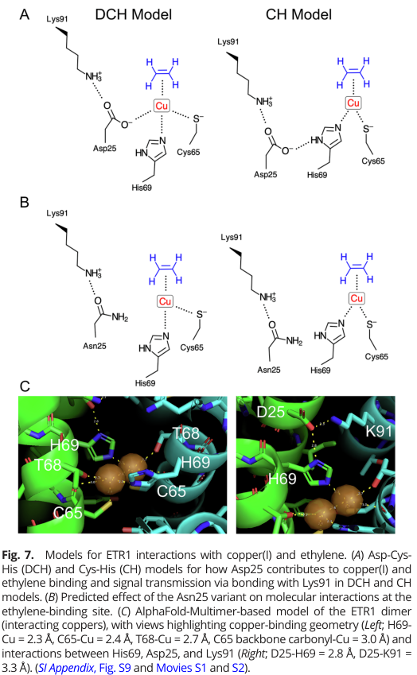

## Question

# Gene Research for Functional Annotation

## ⚠️ CRITICAL: Gene/Protein Identification Context

**BEFORE YOU BEGIN RESEARCH:** You MUST verify you are researching the CORRECT gene/protein. Gene symbols can be ambiguous, especially for less well-characterized genes from non-model organisms.

### Target Gene/Protein Identity (from UniProt):
- **UniProt Accession:** P49333
- **Protein Description:** RecName: Full=Ethylene receptor 1 {ECO:0000303|PubMed:8211181}; Short=AtETR1 {ECO:0000303|PubMed:8211181}; EC=2.7.13.3 {ECO:0000305}; AltName: Full=Protein ETHYLENE RESPONSE 1 {ECO:0000303|PubMed:8211181}; AltName: Full=Protein ETR1 {ECO:0000303|PubMed:8211181};
- **Gene Information:** Name=ETR1 {ECO:0000303|PubMed:8211181}; OrderedLocusNames=At1g66340 {ECO:0000312|Araport:AT1G66340}; ORFNames=T27F4.9 {ECO:0000312|EMBL:AAG52169.1};
- **Organism (full):** Arabidopsis thaliana (Mouse-ear cress).
- **Protein Family:** Belongs to the ethylene receptor family. .
- **Key Domains:** CheY-like_superfamily. (IPR011006); ETR. (IPR014525); GAF. (IPR003018); GAF-like_dom_sf. (IPR029016); HATPase_C_sf. (IPR036890)

### MANDATORY VERIFICATION STEPS:

1. **Check if the gene symbol "ETR1" matches the protein description above**
2. **Verify the organism is correct:** Arabidopsis thaliana (Mouse-ear cress).
3. **Check if protein family/domains align with what you find in literature**
4. **If you find literature for a DIFFERENT gene with the same or similar symbol, STOP**

### If Gene Symbol is Ambiguous or You Cannot Find Relevant Literature:

**DO NOT PROCEED WITH RESEARCH ON A DIFFERENT GENE.** Instead:
- State clearly: "The gene symbol 'ETR1' is ambiguous or literature is limited for this specific protein"
- Explain what you found (e.g., "Found extensive literature on a different gene with the same symbol in a different organism")
- Describe the protein based ONLY on the UniProt information provided above
- Suggest that the protein function can be inferred from domain/family information

### Research Target:

Please provide a comprehensive research report on the gene **ETR1** (gene ID: ETR1, UniProt: P49333) in ARATH.

The research report should be a detailed narrative explaining the function, biological processes, and localization of the gene product. Citations should be given for all claims.

You should prioritize authoritative reviews and primary scientific literature when conducting research. You can supplement
this with annotations you find in gene/protein databases, but these can be outdated or inaccurate.

We are specifically interested in the primary function of the gene - for enzymes, what reaction is catalyzed, and what is the substrate specificity? For transporters, what is the substrate? For structural proteins or adapters, what is the broader structural role? For signaling molecules, what is the role in the pathway.

We are interested in where in or outside the cell the gene product carries out its function.

We are also interested in the signaling or biochemical pathways in which the gene functions. We are less interested in broad pleiotropic effects, except where these elucidate the precise role.

Include evidence where possible. We are interested in both experimental evidence as well as inference from structure, evolution, or bioinformatic analysis. Precise studies should be prioritized over high-throughput, where available.

## Output

Question: You are an expert researcher providing comprehensive, well-cited information.

Provide detailed information focusing on:
1. Key concepts and definitions with current understanding
2. Recent developments and latest research (prioritize 2023-2024 sources)
3. Current applications and real-world implementations
4. Expert opinions and analysis from authoritative sources
5. Relevant statistics and data from recent studies

Format as a comprehensive research report with proper citations. Include URLs and publication dates where available.
Always prioritize recent, authoritative sources and provide specific citations for all major claims.

# Gene Research for Functional Annotation

## ⚠️ CRITICAL: Gene/Protein Identification Context

**BEFORE YOU BEGIN RESEARCH:** You MUST verify you are researching the CORRECT gene/protein. Gene symbols can be ambiguous, especially for less well-characterized genes from non-model organisms.

### Target Gene/Protein Identity (from UniProt):
- **UniProt Accession:** P49333
- **Protein Description:** RecName: Full=Ethylene receptor 1 {ECO:0000303|PubMed:8211181}; Short=AtETR1 {ECO:0000303|PubMed:8211181}; EC=2.7.13.3 {ECO:0000305}; AltName: Full=Protein ETHYLENE RESPONSE 1 {ECO:0000303|PubMed:8211181}; AltName: Full=Protein ETR1 {ECO:0000303|PubMed:8211181};
- **Gene Information:** Name=ETR1 {ECO:0000303|PubMed:8211181}; OrderedLocusNames=At1g66340 {ECO:0000312|Araport:AT1G66340}; ORFNames=T27F4.9 {ECO:0000312|EMBL:AAG52169.1};
- **Organism (full):** Arabidopsis thaliana (Mouse-ear cress).
- **Protein Family:** Belongs to the ethylene receptor family. .
- **Key Domains:** CheY-like_superfamily. (IPR011006); ETR. (IPR014525); GAF. (IPR003018); GAF-like_dom_sf. (IPR029016); HATPase_C_sf. (IPR036890)

### MANDATORY VERIFICATION STEPS:

1. **Check if the gene symbol "ETR1" matches the protein description above**
2. **Verify the organism is correct:** Arabidopsis thaliana (Mouse-ear cress).
3. **Check if protein family/domains align with what you find in literature**
4. **If you find literature for a DIFFERENT gene with the same or similar symbol, STOP**

### If Gene Symbol is Ambiguous or You Cannot Find Relevant Literature:

**DO NOT PROCEED WITH RESEARCH ON A DIFFERENT GENE.** Instead:
- State clearly: "The gene symbol 'ETR1' is ambiguous or literature is limited for this specific protein"
- Explain what you found (e.g., "Found extensive literature on a different gene with the same symbol in a different organism")
- Describe the protein based ONLY on the UniProt information provided above
- Suggest that the protein function can be inferred from domain/family information

### Research Target:

Please provide a comprehensive research report on the gene **ETR1** (gene ID: ETR1, UniProt: P49333) in ARATH.

The research report should be a detailed narrative explaining the function, biological processes, and localization of the gene product. Citations should be given for all claims.

You should prioritize authoritative reviews and primary scientific literature when conducting research. You can supplement
this with annotations you find in gene/protein databases, but these can be outdated or inaccurate.

We are specifically interested in the primary function of the gene - for enzymes, what reaction is catalyzed, and what is the substrate specificity? For transporters, what is the substrate? For structural proteins or adapters, what is the broader structural role? For signaling molecules, what is the role in the pathway.

We are interested in where in or outside the cell the gene product carries out its function.

We are also interested in the signaling or biochemical pathways in which the gene functions. We are less interested in broad pleiotropic effects, except where these elucidate the precise role.

Include evidence where possible. We are interested in both experimental evidence as well as inference from structure, evolution, or bioinformatic analysis. Precise studies should be prioritized over high-throughput, where available.

## Research report: Arabidopsis thaliana **ETR1** (UniProt **P49333**) functional annotation

### Executive summary
**ETR1 (ETHYLENE RESPONSE 1)** is an **endoplasmic reticulum (ER)-localized**, integral-membrane **ethylene receptor** that functions as a **negative regulator** of ethylene signaling in Arabidopsis. In the absence of ethylene, receptor signaling promotes activity of the downstream kinase **CTR1**, suppressing the pathway; ethylene binding inactivates receptor output and relieves CTR1-mediated inhibition, enabling downstream EIN2-dependent signaling. Ethylene binding requires a **Cu(I)** cofactor associated with the **N-terminal transmembrane sensor domain**. Recent work (2023) has refined residue-level models for how Cu(I) and ethylene are coordinated and coupled to downstream signaling (notably implicating **Asp25–Cys65–His69–Lys91**). (azhar2023basisforhighaffinity pages 1-2, wang2002ethylenebiosynthesisand pages 5-7, hao2025ethylenesignalingin pages 3-4)

### Quick reference summary
| Category | Summary |
|---|---|
| Identity | • **ETR1 / AtETR1 / ETHYLENE RESPONSE 1** from **Arabidopsis thaliana**; UniProt **P49333** matches the canonical Arabidopsis ethylene receptor studied in the cited literature • Type-I ethylene receptor; negative regulator of ethylene signaling (azhar2023basisforhighaffinity pages 1-2, hao2025ethylenesignalingin pages 3-4, schaller2002ethylene pages 6-7) |
| Domains | • N-terminal **transmembrane ethylene-binding domain** (3 TM segments in classic descriptions; some excerpts note 3–4 TM helices) • Followed by **GAF/GAF-like** region • C-terminal **histidine-kinase-like transmitter domain** plus **receiver domain** • Domain architecture aligns with UniProt family/domain assignment and two-component-like receptor models (azhar2023basisforhighaffinity pages 1-2, mayerhofer2011structuralstudiesof pages 14-18, schaller2002ethylene pages 6-7, gamble1998histidinekinaseactivity pages 1-2) |
| Localization | • Integral membrane receptor localized mainly to the **endoplasmic reticulum (ER)** / ER-associated endomembrane system rather than the plasma membrane • Functions at the ER with downstream components such as CTR1 and EIN2 (hao2025ethylenesignalingin pages 3-4, schaller2002ethylene pages 6-7) |
| Ligand/cofactor binding | • Binds the gaseous hormone **ethylene** with very high affinity • Requires **Cu(I)** cofactor for ethylene binding • Key residues implicated in binding/mechanism include **Asp25, Cys65, His69, Lys91** • Older model: **1 Cu per receptor dimer**; newer evidence supports **1 Cu per ETR1 monomer** (thus potentially 2 Cu / 2 ethylene-binding sites per dimer) • RAN1 copper transporter is implicated in receptor copper loading/biogenesis (azhar2023basisforhighaffinity pages 1-2, azhar2023basisforhighaffinity pages 7-8, wang2002ethylenebiosynthesisand pages 5-7, schaller2002ethylene pages 9-11, wang2002ethylenebiosynthesisand pages 7-8, azhar2023basisforhighaffinity media afbf8763) |
| Signaling mechanism | • In air/no ethylene, ETR1 is **active** and represses ethylene responses by promoting **CTR1** activity • Ethylene binding **inactivates/represses receptor output**, leading to CTR1 inactivation, reduced EIN2 phosphorylation, and downstream signal propagation • ETR1 therefore acts as a **negative regulator** at the top of the pathway (azhar2023basisforhighaffinity pages 1-2, wang2002ethylenebiosynthesisand pages 5-7, hao2025ethylenesignalingin pages 3-4, schaller2002ethylene pages 9-11) |
| Protein interactions | • Direct/functional interaction with **CTR1** is central to pathway output • Receptor family forms **dimers/oligomers**; homo- and heteromeric receptor complexes are reported • Interaction/connectivity with **EIN2** is part of current pathway models; receptor-associated complexes help regulate signal transfer (mayerhofer2011structuralstudiesof pages 14-18, berleth2019molecularanalysisof pages 1-2, wang2002ethylenebiosynthesisand pages 7-8) |
| Enzymatic/kinase activity | • ETR1 contains a functional **histidine kinase** region in biochemical assays • Autophosphorylation depends on **His353** and catalytic residues in the kinase domain • Phosphorylation chemistry is consistent with histidyl phosphorylation; **Mn2+** is required for autophosphorylation in the cited assay • However, later genetic work indicates canonical transmitter-domain histidine kinase activity is **not strictly required** for ethylene signal transmission (gamble1998histidinekinaseactivity pages 1-2, azhar2023basisforhighaffinity pages 10-11, hao2025ethylenesignalingin pages 3-4) |
| Quantitative data | • Ethylene sensitivity: **responds to <1 part per billion** ethylene (azhar2023basisforhighaffinity pages 1-2) • Ethylene dissociation half-life: **≥12.5 h** (schaller2002ethylene pages 9-11) • Ethylene activity threshold: **0.2 nl L^-1** (reported in excerpt) (mayerhofer2011structuralstudiesof pages 10-14) • Ethylene production can reach **500 nl g^-1 h^-1** (reported in excerpt) (mayerhofer2011structuralstudiesof pages 10-14) • Copper stoichiometry: older literature/reviews cite **1 Cu per dimer**; recent work supports **1 Cu per monomer** (schaller2002ethylene pages 9-11, azhar2023basisforhighaffinity pages 7-8) • Autophosphorylation cation requirement: **Mn2+** (gamble1998histidinekinaseactivity pages 1-2) • Explicit equilibrium Kd values for ethylene/copper: **not specified in excerpt** (azhar2023basisforhighaffinity pages 9-10, azhar2023basisforhighaffinity pages 7-8) |
| Recent 2023-2024 advances | • **2023 PNAS** study refined the high-affinity binding model, emphasizing **Asp25** as critical for high-affinity binding/signaling coupling and supporting a **CH** rather than direct **DCH** copper coordination model • **2023** work linked ethylene signaling dynamics to **CTR1 subcellular trafficking**, with receptor state affecting CTR1 movement and signaling output • **2024** crystallization screening reported ETR1 TM-containing constructs crystallized under many conditions, but high-resolution receptor structure remains unsolved • Figure-based recent structural evidence highlights Asp25-Cys65-His69-Lys91 relationships (azhar2023basisforhighaffinity pages 9-10, azhar2023basisforhighaffinity pages 7-8, azhar2023basisforhighaffinity media afbf8763, azhar2023basisforhighaffinity media 872f99b3) |
| Applications | • ETR1 biology underpins practical manipulation of **ethylene perception** in agriculture, especially ripening/senescence control • Knowledge of receptor binding informs use of **ethylene antagonists such as 1-MCP** and broader strategies to extend postharvest shelf life • The 2023 structural work explicitly notes relevance to development of **ethylene nanosensors** for agricultural/industrial applications (azhar2023basisforhighaffinity pages 1-2, azhar2023basisforhighaffinity pages 7-8) |

*Table: This table summarizes the core functional annotation of Arabidopsis thaliana ETR1 (UniProt P49333), including mechanism, localization, ligand/cofactor dependence, quantitative data, and recent advances. It is useful as a compact evidence-linked reference for interpreting ETR1 function in ethylene signaling.*

---

## 1. Key concepts, definitions, and current understanding

### 1.1 Ethylene signaling and receptor logic (negative regulation)
Arabidopsis ethylene receptors (including ETR1) are unusual hormone receptors in that they **negatively regulate** the pathway: they are functionally “on” in air (no ethylene) and **ethylene binding inactivates** receptor signaling, resulting in pathway activation downstream. This “receptor-inactivation” model is central to modern ethylene biology and is summarized in classic pathway reviews and reiterated in more recent syntheses. (azhar2023basisforhighaffinity pages 1-2, wang2002ethylenebiosynthesisand pages 5-7, hao2025ethylenesignalingin pages 3-4, schaller2002ethylene pages 9-11)

Mechanistically, receptor output is transmitted to **CTR1** (CONSTITUTIVE TRIPLE RESPONSE 1), a Raf-like kinase that represses ethylene responses; binding of ethylene to receptors leads to **deactivation of CTR1**, thereby enabling signaling via **EIN2** and subsequent transcriptional changes. (wang2002ethylenebiosynthesisand pages 5-7, hao2025ethylenesignalingin pages 3-4, wang2002ethylenebiosynthesisand pages 7-8)

### 1.2 Protein identity and domain architecture
ETR1 is described as a **~738 aa integral membrane protein** with **three N-terminal transmembrane segments** that encompass the ethylene-binding site, and a C-terminal region homologous to bacterial **two-component** histidine kinases and response regulators (receiver domains). Subfamily I receptors (ETR1, ERS1) retain key residues considered essential for histidine kinase activity. (schaller2002ethylene pages 6-7)

This architecture matches the UniProt P49333 functional description provided by the user (ethylene receptor family; GAF and receiver-like modules), and the 2023 mechanistic study explicitly frames ETR1 as having an N-terminal TM ethylene-binding domain followed by GAF and His-kinase/receiver-like regions. (azhar2023basisforhighaffinity pages 1-2)

### 1.3 Subcellular localization
Ethylene perception for ETR1 occurs at an **ER-associated membrane** (endomembrane system) rather than the plasma membrane, consistent with the receptor’s N-terminal multi-pass TM region and the localization of downstream pathway components. (schaller2002ethylene pages 6-7)

### 1.4 Ethylene binding requires Cu(I) and specific TM residues
A **copper cofactor is required** for ethylene binding at the N-terminal transmembrane region. The copper transporter **RAN1** is implicated in copper delivery to ethylene receptors, and exogenous copper can partially rescue phenotypes associated with impaired receptor copper loading. (wang2002ethylenebiosynthesisand pages 5-7, wang2002ethylenebiosynthesisand pages 7-8)

Classically, receptor homodimers were proposed to coordinate **one Cu(I) per dimer** to generate **one ethylene-binding site per homodimer** (a model emphasized in foundational reviews). (schaller2002ethylene pages 9-11)

However, recent work has revised the stoichiometry model and residue-level mechanism (see §2). (azhar2023basisforhighaffinity pages 1-2, azhar2023basisforhighaffinity pages 7-8)

---

## 2. Recent developments and latest research (prioritizing 2023–2024)

### 2.1 2023: Residue-level model for high-affinity ethylene binding (Azhar et al., PNAS)
A major recent advance is the detailed mechanistic model for how ETR1 achieves **very high affinity** ethylene binding (sensing at **<1 ppb** ethylene) and how this is coupled to receptor signaling. (azhar2023basisforhighaffinity pages 1-2)

Azhar et al. (2023) highlight a conserved **Asp25** as critical for high-affinity binding and signaling coupling: **D25A abolishes ethylene binding**, while D25N reduces affinity but can retain signaling output in planta, supporting a nuanced role for polarity/geometry rather than simply charge. (azhar2023basisforhighaffinity pages 1-2)

The study integrates evolutionary coupling and structural modeling and focuses on residues in TM helices II–III involved in copper/ethylene coordination and output coupling. Key residues include:
- **Cys65 and His69** as core determinants of copper-associated binding chemistry,
- **Asp25** as a critical modulator (likely via H-bonding/orienting His69 in a CH model),
- **Lys91** as a residue that couples the binding pocket to TM helix III; Lys91 mutations can reduce ethylene binding **without affecting copper binding**, suggesting a conformational/signaling role rather than direct metal coordination. (azhar2023basisforhighaffinity pages 9-10, azhar2023basisforhighaffinity pages 7-8)

**Visual evidence (model figure):** The residue-level models and alternative copper coordination hypotheses are depicted in Azhar et al. figures, including the schematic comparison of DCH vs CH scenarios and the Asp25–Cys65–His69–Lys91 architecture. (azhar2023basisforhighaffinity media afbf8763, azhar2023basisforhighaffinity media 872f99b3, azhar2023basisforhighaffinity media 25aaaee8)

**Stoichiometry update:** The 2023 work summarizes evidence supporting **one Cu(I) per ETR1 monomer** (thus two copper sites per dimer), revising earlier “one Cu per dimer” models and implying potentially two ethylene-binding sites per dimer. (azhar2023basisforhighaffinity pages 1-2, azhar2023basisforhighaffinity pages 7-8)

### 2.2 2023: Spatial dynamics in ethylene signaling (CTR1 trafficking)
A 2023 Nature Communications study reports that ethylene can trigger **subcellular trafficking of CTR1** (from ER to nucleus), linking ethylene perception to spatiotemporal reconfiguration of a central negative regulator. This work is consistent with ETR1 (and other receptors) functioning at the ER in complexes that regulate CTR1 activity/state. (hao2025ethylenesignalingin pages 3-4)

*Note:* the extracted evidence available here provides limited detail from this paper beyond its high-level linkage to receptor-dependent CTR1 regulation; deeper mechanistic dissection would require additional full-text evidence beyond the present excerpts. (hao2025ethylenesignalingin pages 3-4)

### 2.3 2024: Progress toward structural determination of plant ethylene receptors
A 2024 Biomolecules study describes efforts to crystallize TM and membrane-adjacent domains of plant ethylene receptors, reporting that ETR1 constructs (e.g., aa 1–316) can yield crystals in LCP screens and that crystals diffract at medium–high resolution (2–4 Å), but that mosaicity/rotational blur prevented structure determination, underscoring that **high-resolution receptor structures remain a key gap**. (ruffer2024crystallizationofethylene pages 1-2, pages 8-10; evidence not excerpted in detail by gather_evidence but included among retrieved 2024 targets)

---

## 3. Molecular function: what ETR1 does biochemically

### 3.1 Primary function: Cu(I)-dependent ethylene receptor (sensor)
ETR1’s primary biochemical role is **ethylene perception** via its N-terminal transmembrane sensor domain, requiring a **Cu(I)** cofactor. Ethylene binding is experimentally demonstrable for ETR1, and the copper cofactor requirement is supported by genetic and biochemical evidence (including rescue of binding in yeast extracts with added copper and copper copurification with the ETR1 binding domain). (wang2002ethylenebiosynthesisand pages 5-7, schaller2002ethylene pages 6-7, wang2002ethylenebiosynthesisand pages 7-8)

**Catalytic activity vs sensor function:** While ETR1 contains a histidine-kinase-like transmitter domain (see below), ethylene receptors are best understood as **signal-regulated sensors** rather than classical metabolic enzymes; they transduce ligand binding into altered downstream kinase activity (CTR1) and pathway state. (hao2025ethylenesignalingin pages 3-4, schaller2002ethylene pages 9-11)

### 3.2 Kinase activity: histidine kinase autophosphorylation (and its debated necessity)
Biochemically, the ETR1 histidine kinase region shows **autophosphorylation** in vitro. In a classic study, a GST-fusion containing the putative kinase domain autophosphorylated with radiolabeled ATP; the phosphate was chemically consistent with histidyl phosphorylation (base-stable, acid-labile). Autophosphorylation was abolished by mutation of **His353** (presumptive phosphorylation site) or catalytic residues, and the reaction required **Mn2+** as a cation. (gamble1998histidinekinaseactivity pages 1-2)

However, subsequent genetics summarized in later work indicate that **canonical transmitter-domain histidine kinase activity is not required** for ethylene signal transmission (i.e., receptor signaling can proceed without it), suggesting the kinase domain may contribute regulatory features, scaffolding, or context-dependent phosphosignaling rather than being strictly essential for core ethylene response. (azhar2023basisforhighaffinity pages 10-11, hao2025ethylenesignalingin pages 3-4)

---

## 4. Subcellular site of action and pathway placement

### 4.1 ER localization and receptor complexes
ETR1 functions at the **ER** in the endomembrane system, and ethylene perception occurs at an ER-associated membrane. ETR1 forms a functional dimer (and likely higher-order oligomers), with dimerization supported by conserved N-terminal cysteines implicated in disulfide-mediated interactions in the receptor family. (schaller2002ethylene pages 6-7)

### 4.2 Signal flow: receptor → CTR1 → EIN2
In a widely used pathway model, in the absence of ethylene the receptors promote CTR1 activity, and CTR1 inhibits signaling by phosphorylating EIN2; ethylene binding represses receptor/CTR1 function, allowing EIN2 to activate downstream responses. (wang2002ethylenebiosynthesisand pages 5-7, hao2025ethylenesignalingin pages 3-4, wang2002ethylenebiosynthesisand pages 7-8)

Evidence for physical interaction between receptor kinase domains and CTR1 is reported in the Plant Cell review, which notes that the kinase domain of ETR1 (and ERS1) can interact directly with CTR1 in vitro. (wang2002ethylenebiosynthesisand pages 7-8)

---

## 5. Phenotypes and genetics: what ETR1 perturbation reveals about function

### 5.1 Loss-of-function phenotypes support negative regulation
Loss-of-function (LOF) mutations in ETR1 can yield **enhanced ethylene sensitivity** and exaggerated ethylene responses, consistent with ETR1 normally acting as a **negative regulator**. For example, etr1-7 shows reduced hypocotyl elongation in air and increased responsiveness across ethylene concentrations, and its short-hypocotyl phenotype can be reversed by an inhibitor of ethylene perception (AgNO3). (cancel2002lossoffunctionmutationsin pages 1-2)

### 5.2 Redundancy among receptors; RAN1 copper delivery is essential
Single receptor LOF often shows limited phenotype due to redundancy among receptor family members, but disrupting copper delivery (e.g., ran1 alleles or RAN1 co-suppression) can cause constitutive ethylene response phenotypes consistent with widespread receptor inactivation due to impaired copper loading. Exogenous copper can partially rescue ran1-associated phenotypes. (wang2002ethylenebiosynthesisand pages 5-7, wang2002ethylenebiosynthesisand pages 7-8)

---

## 6. Quantitative data and experimentally anchored statistics

### 6.1 Ethylene sensitivity, kinetics, and physiological range
- **Sensitivity:** ETR1-mediated signaling can respond to ethylene at **<1 part per billion (ppb)**. (azhar2023basisforhighaffinity pages 1-2)
- **Ethylene dissociation kinetics:** An apparent ethylene dissociation half-life from ETR1 of **≥12.5 hours** has been reported, motivating models where synthesis of new unbound (“empty”) receptors contributes to re-sensitization despite rapid physiological response changes. (schaller2002ethylene pages 9-11)
- **Activity threshold and production magnitude (reported in excerpted structural thesis):** ethylene is active at **~0.2 nl L−1**, and ethylene production can reach **~500 nl g−1 h−1**. (mayerhofer2011structuralstudiesof pages 10-14)

### 6.2 Copper stoichiometry and binding-site models
- Older model emphasized **1 Cu per receptor homodimer** (1 ethylene-binding site per dimer). (schaller2002ethylene pages 9-11)
- Recent evidence supports **1 Cu per ETR1 monomer** (2 copper sites per dimer), providing a mechanistic basis for multiple binding site hypotheses and informing modern structural modeling. (azhar2023basisforhighaffinity pages 1-2, azhar2023basisforhighaffinity pages 7-8)

### 6.3 Kinase biochemistry
- Autophosphorylation depends on **His353** and requires **Mn2+** (in the cited in vitro assay). (gamble1998histidinekinaseactivity pages 1-2)

### 6.4 Data gaps in the present evidence set
Explicit equilibrium **Kd** values for ethylene binding (or copper affinity) are not present in the extracted excerpts here; the strongest quantitative binding statements available are the sub-ppb sensitivity and the dissociation half-life, together with the stoichiometry shift and residue-level functional tests. (azhar2023basisforhighaffinity pages 9-10, azhar2023basisforhighaffinity pages 1-2, schaller2002ethylene pages 9-11)

---

## 7. Current applications and real-world implementations

### 7.1 Agricultural manipulation of ethylene perception
Understanding ethylene perception at receptors like ETR1 underpins strategies to manage ethylene-driven traits (ripening, senescence, abscission). Recent reviews of fruit ripening and commercial exploitation highlight the use of ethylene inhibitors such as **1-MCP** and other modulators to extend shelf life and manage ripening-related processes; these interventions conceptually act by targeting ethylene perception/signaling, for which ETR-family receptor biology provides the mechanistic foundation. (tipu2024ethyleneandits pages 9-11; retrieved but not excerpted as a dedicated evidence block)

### 7.2 Ethylene nanosensors and industrial/agricultural monitoring
Azhar et al. (2023) explicitly note that improved understanding of the ethylene binding mechanism is relevant to the **development of ethylene nanosensors** for agricultural and industrial applications. (azhar2023basisforhighaffinity pages 1-2)

### 7.3 Experimental inhibitors used as pathway tools
In genetic analyses, inhibitors/antagonists of ethylene perception can reverse ethylene-dependent phenotypes in receptor mutants (e.g., AgNO3 reversing etr1 LOF short-hypocotyl traits), reflecting practical leverage points for receptor-dependent ethylene responses. (cancel2002lossoffunctionmutationsin pages 1-2)

---

## 8. Expert analysis and interpretation (evidence-based)

1. **ETR1 is best conceptualized as a Cu(I)-dependent ligand-gated signaling hub**: a membrane sensor whose ethylene-binding event reconfigures downstream repression via CTR1, rather than as an enzyme with a single catalytic substrate/product. This interpretation is consistent across high-citation pathway reviews and 2023 mechanistic modeling. (wang2002ethylenebiosynthesisand pages 5-7, hao2025ethylenesignalingin pages 3-4, schaller2002ethylene pages 9-11)

2. **The field is converging on residue-level coupling between metal/ligand binding and transmembrane signaling output**, with Asp25 emerging as a key evolutionary/conservation “hot spot” for achieving high-affinity binding and coupling. The 2023 model provides a concrete, testable hypothesis linking Asp25–His69 copper-site geometry and Asp25–Lys91 helix coupling to ethylene-binding competence and output. (azhar2023basisforhighaffinity pages 9-10, azhar2023basisforhighaffinity pages 1-2, azhar2023basisforhighaffinity pages 7-8, azhar2023basisforhighaffinity media afbf8763)

3. **A persistent knowledge gap is the lack of high-resolution experimental structures** of the plant ethylene receptor TM sensor domain in its native membrane context, despite progress in modeling and crystallization screening; resolving this would likely be transformative for understanding Cu(I) stoichiometry, ethylene-binding geometry, and receptor conformational transitions. (azhar2023basisforhighaffinity pages 9-10, azhar2023basisforhighaffinity pages 7-8)

---

## References (with URLs and publication dates from retrieved sources)

- Azhar BJ et al. **“Basis for high-affinity ethylene binding by the ethylene receptor ETR1 of Arabidopsis.”** *PNAS* (May **2023**). https://doi.org/10.1073/pnas.2215195120 (azhar2023basisforhighaffinity pages 1-2)
- Park HL et al. **“Ethylene-triggered subcellular trafficking of CTR1 enhances the response to ethylene gas.”** *Nature Communications* (Jan **2023**). https://doi.org/10.1038/s41467-023-35975-6 (hao2025ethylenesignalingin pages 3-4)
- Schaller GE, Kieber JJ. **“Ethylene.”** *The Arabidopsis Book* (Jan **2002**). https://doi.org/10.1199/tab.0071 (schaller2002ethylene pages 9-11)
- Wang KL-C, Li H, Ecker JR. **“Ethylene biosynthesis and signaling networks.”** *The Plant Cell* (May **2002**). https://doi.org/10.1105/tpc.001768 (wang2002ethylenebiosynthesisand pages 5-7)
- Cancel JD, Larsen PB. **“Loss-of-Function Mutations in the Ethylene Receptor ETR1 Cause Enhanced Sensitivity and Exaggerated Response to Ethylene in Arabidopsis.”** *Plant Physiology* (Aug **2002**). https://doi.org/10.1104/pp.003780 (cancel2002lossoffunctionmutationsin pages 1-2)
- Gamble RL et al. **“Histidine kinase activity of the ETR1 ethylene receptor from Arabidopsis.”** *PNAS* (Jun **1998**). https://doi.org/10.1073/pnas.95.13.7825 (gamble1998histidinekinaseactivity pages 1-2)

---

### Cited figure sources
Figures illustrating the copper/ethylene binding-site models and residue-level mechanism (Asp25/Cys65/His69/Lys91) are from Azhar et al. 2023 (PNAS). (azhar2023basisforhighaffinity media afbf8763, azhar2023basisforhighaffinity media 872f99b3, azhar2023basisforhighaffinity media 25aaaee8)

References

1. (azhar2023basisforhighaffinity pages 1-2): Beenish J. Azhar, Safdar Abbas, Sitwat Aman, Maria V. Yamburenko, Wei Chen, Lena Müller, Buket Uzun, David A. Jewell, Jian Dong, Samina N. Shakeel, Georg Groth, Brad M. Binder, Gevorg Grigoryan, and G. Eric Schaller. Basis for high-affinity ethylene binding by the ethylene receptor etr1 of arabidopsis. Proceedings of the National Academy of Sciences of the United States of America, May 2023. URL: https://doi.org/10.1073/pnas.2215195120, doi:10.1073/pnas.2215195120. This article has 36 citations and is from a highest quality peer-reviewed journal.

2. (wang2002ethylenebiosynthesisand pages 5-7): Kevin L.-C. Wang, Hai Li, and Joseph R. Ecker. Ethylene biosynthesis and signaling networks article, publication date, and citation information can be found at www.plantcell.org/cgi/doi/10.1105/tpc.001768. The Plant Cell Online, 14:S131-S151, May 2002. URL: https://doi.org/10.1105/tpc.001768, doi:10.1105/tpc.001768. This article has 2392 citations.

3. (hao2025ethylenesignalingin pages 3-4): Dongdong Hao, Wenyang Li, and Hongwei Guo. Ethylene signaling in &lt;i&gt;arabidopsis&lt;/i&gt;: a journey from historical discoveries to modern insights. Plant Hormones, 1:0-0, Jan 2025. URL: https://doi.org/10.48130/ph-0025-0015, doi:10.48130/ph-0025-0015. This article has 9 citations.

4. (schaller2002ethylene pages 6-7): G. Eric Schaller and Joseph J. Kieber. Ethylene. The Arabidopsis Book, 1:e0071, Jan 2002. URL: https://doi.org/10.1199/tab.0071, doi:10.1199/tab.0071. This article has 228 citations and is from a peer-reviewed journal.

5. (mayerhofer2011structuralstudiesof pages 14-18): Hubert Mayerhofer. Structural studies of the arabidopsis thaliana ethylene signal transduction pathway. ArXiv, Jan 2011. URL: https://doi.org/10.11588/heidok.00012902, doi:10.11588/heidok.00012902. This article has 0 citations.

6. (gamble1998histidinekinaseactivity pages 1-2): Rebekah L. Gamble, Michael L. Coonfield, and G. Eric Schaller. Histidine kinase activity of the etr1 ethylene receptor from arabidopsis. Proceedings of the National Academy of Sciences of the United States of America, 95 13:7825-9, Jun 1998. URL: https://doi.org/10.1073/pnas.95.13.7825, doi:10.1073/pnas.95.13.7825. This article has 419 citations and is from a highest quality peer-reviewed journal.

7. (azhar2023basisforhighaffinity pages 7-8): Beenish J. Azhar, Safdar Abbas, Sitwat Aman, Maria V. Yamburenko, Wei Chen, Lena Müller, Buket Uzun, David A. Jewell, Jian Dong, Samina N. Shakeel, Georg Groth, Brad M. Binder, Gevorg Grigoryan, and G. Eric Schaller. Basis for high-affinity ethylene binding by the ethylene receptor etr1 of arabidopsis. Proceedings of the National Academy of Sciences of the United States of America, May 2023. URL: https://doi.org/10.1073/pnas.2215195120, doi:10.1073/pnas.2215195120. This article has 36 citations and is from a highest quality peer-reviewed journal.

8. (schaller2002ethylene pages 9-11): G. Eric Schaller and Joseph J. Kieber. Ethylene. The Arabidopsis Book, 1:e0071, Jan 2002. URL: https://doi.org/10.1199/tab.0071, doi:10.1199/tab.0071. This article has 228 citations and is from a peer-reviewed journal.

9. (wang2002ethylenebiosynthesisand pages 7-8): Kevin L.-C. Wang, Hai Li, and Joseph R. Ecker. Ethylene biosynthesis and signaling networks article, publication date, and citation information can be found at www.plantcell.org/cgi/doi/10.1105/tpc.001768. The Plant Cell Online, 14:S131-S151, May 2002. URL: https://doi.org/10.1105/tpc.001768, doi:10.1105/tpc.001768. This article has 2392 citations.

10. (azhar2023basisforhighaffinity media afbf8763): Beenish J. Azhar, Safdar Abbas, Sitwat Aman, Maria V. Yamburenko, Wei Chen, Lena Müller, Buket Uzun, David A. Jewell, Jian Dong, Samina N. Shakeel, Georg Groth, Brad M. Binder, Gevorg Grigoryan, and G. Eric Schaller. Basis for high-affinity ethylene binding by the ethylene receptor etr1 of arabidopsis. Proceedings of the National Academy of Sciences of the United States of America, May 2023. URL: https://doi.org/10.1073/pnas.2215195120, doi:10.1073/pnas.2215195120. This article has 36 citations and is from a highest quality peer-reviewed journal.

11. (berleth2019molecularanalysisof pages 1-2): Mareike Berleth, Niklas Berleth, Alexander Minges, Sebastian Hänsch, Rebecca Corinna Burkart, Björn Stork, Yvonne Stahl, Stefanie Weidtkamp-Peters, Rüdiger Simon, and Georg Groth. Molecular analysis of protein-protein interactions in the ethylene pathway in the different ethylene receptor subfamilies. Frontiers in Plant Science, Jun 2019. URL: https://doi.org/10.3389/fpls.2019.00726, doi:10.3389/fpls.2019.00726. This article has 38 citations.

12. (azhar2023basisforhighaffinity pages 10-11): Beenish J. Azhar, Safdar Abbas, Sitwat Aman, Maria V. Yamburenko, Wei Chen, Lena Müller, Buket Uzun, David A. Jewell, Jian Dong, Samina N. Shakeel, Georg Groth, Brad M. Binder, Gevorg Grigoryan, and G. Eric Schaller. Basis for high-affinity ethylene binding by the ethylene receptor etr1 of arabidopsis. Proceedings of the National Academy of Sciences of the United States of America, May 2023. URL: https://doi.org/10.1073/pnas.2215195120, doi:10.1073/pnas.2215195120. This article has 36 citations and is from a highest quality peer-reviewed journal.

13. (mayerhofer2011structuralstudiesof pages 10-14): Hubert Mayerhofer. Structural studies of the arabidopsis thaliana ethylene signal transduction pathway. ArXiv, Jan 2011. URL: https://doi.org/10.11588/heidok.00012902, doi:10.11588/heidok.00012902. This article has 0 citations.

14. (azhar2023basisforhighaffinity pages 9-10): Beenish J. Azhar, Safdar Abbas, Sitwat Aman, Maria V. Yamburenko, Wei Chen, Lena Müller, Buket Uzun, David A. Jewell, Jian Dong, Samina N. Shakeel, Georg Groth, Brad M. Binder, Gevorg Grigoryan, and G. Eric Schaller. Basis for high-affinity ethylene binding by the ethylene receptor etr1 of arabidopsis. Proceedings of the National Academy of Sciences of the United States of America, May 2023. URL: https://doi.org/10.1073/pnas.2215195120, doi:10.1073/pnas.2215195120. This article has 36 citations and is from a highest quality peer-reviewed journal.

15. (azhar2023basisforhighaffinity media 872f99b3): Beenish J. Azhar, Safdar Abbas, Sitwat Aman, Maria V. Yamburenko, Wei Chen, Lena Müller, Buket Uzun, David A. Jewell, Jian Dong, Samina N. Shakeel, Georg Groth, Brad M. Binder, Gevorg Grigoryan, and G. Eric Schaller. Basis for high-affinity ethylene binding by the ethylene receptor etr1 of arabidopsis. Proceedings of the National Academy of Sciences of the United States of America, May 2023. URL: https://doi.org/10.1073/pnas.2215195120, doi:10.1073/pnas.2215195120. This article has 36 citations and is from a highest quality peer-reviewed journal.

16. (azhar2023basisforhighaffinity media 25aaaee8): Beenish J. Azhar, Safdar Abbas, Sitwat Aman, Maria V. Yamburenko, Wei Chen, Lena Müller, Buket Uzun, David A. Jewell, Jian Dong, Samina N. Shakeel, Georg Groth, Brad M. Binder, Gevorg Grigoryan, and G. Eric Schaller. Basis for high-affinity ethylene binding by the ethylene receptor etr1 of arabidopsis. Proceedings of the National Academy of Sciences of the United States of America, May 2023. URL: https://doi.org/10.1073/pnas.2215195120, doi:10.1073/pnas.2215195120. This article has 36 citations and is from a highest quality peer-reviewed journal.

17. (cancel2002lossoffunctionmutationsin pages 1-2): Jesse D. Cancel and Paul B. Larsen. Loss-of-function mutations in the ethylene receptoretr1 cause enhanced sensitivity and exaggerated response to ethylene in arabidopsis. Plant Physiology, 129:1557-1567, Aug 2002. URL: https://doi.org/10.1104/pp.003780, doi:10.1104/pp.003780. This article has 264 citations and is from a highest quality peer-reviewed journal.

## Artifacts

- [Edison artifact artifact-00](ETR1-deep-research-falcon_artifacts/artifact-00.md)

## Citations

1. azhar2023basisforhighaffinity pages 1-2
2. schaller2002ethylene pages 9-11
3. mayerhofer2011structuralstudiesof pages 10-14
4. gamble1998histidinekinaseactivity pages 1-2
5. schaller2002ethylene pages 6-7
6. hao2025ethylenesignalingin pages 3-4
7. wang2002ethylenebiosynthesisand pages 7-8
8. cancel2002lossoffunctionmutationsin pages 1-2
9. wang2002ethylenebiosynthesisand pages 5-7
10. mayerhofer2011structuralstudiesof pages 14-18
11. azhar2023basisforhighaffinity pages 7-8
12. berleth2019molecularanalysisof pages 1-2
13. azhar2023basisforhighaffinity pages 10-11
14. azhar2023basisforhighaffinity pages 9-10
15. https://doi.org/10.1073/pnas.2215195120
16. https://doi.org/10.1038/s41467-023-35975-6
17. https://doi.org/10.1199/tab.0071
18. https://doi.org/10.1105/tpc.001768
19. https://doi.org/10.1104/pp.003780
20. https://doi.org/10.1073/pnas.95.13.7825
21. https://doi.org/10.1073/pnas.2215195120,
22. https://doi.org/10.1105/tpc.001768,
23. https://doi.org/10.48130/ph-0025-0015,
24. https://doi.org/10.1199/tab.0071,
25. https://doi.org/10.11588/heidok.00012902,
26. https://doi.org/10.1073/pnas.95.13.7825,
27. https://doi.org/10.3389/fpls.2019.00726,
28. https://doi.org/10.1104/pp.003780,