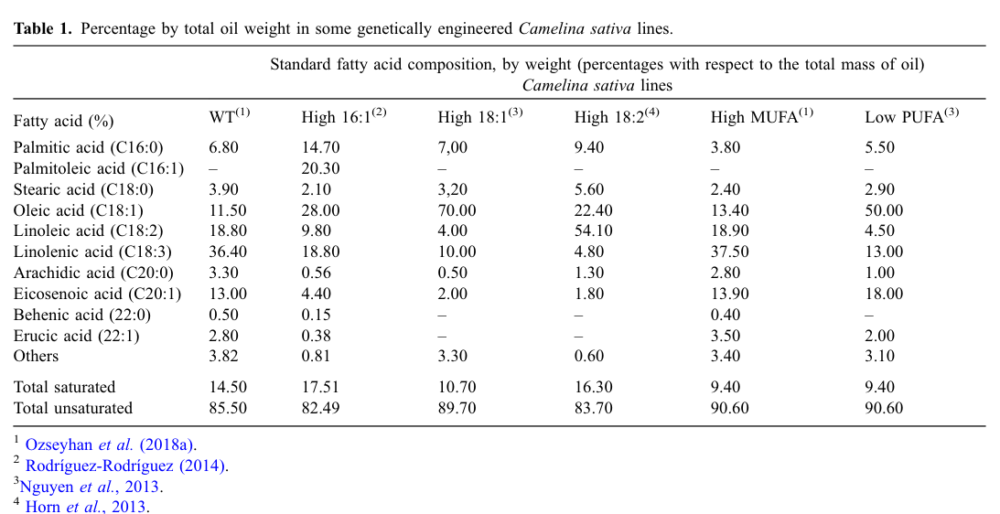

## Question

# Gene Research for Functional Annotation

## ⚠️ CRITICAL: Gene/Protein Identification Context

**BEFORE YOU BEGIN RESEARCH:** You MUST verify you are researching the CORRECT gene/protein. Gene symbols can be ambiguous, especially for less well-characterized genes from non-model organisms.

### Target Gene/Protein Identity (from UniProt):
- **UniProt Accession:** P46313
- **Protein Description:** RecName: Full=Delta(12)-fatty-acid desaturase {ECO:0000303|PubMed:7907506}; Short=Fatty acid desaturase 2 {ECO:0000303|PubMed:7907506}; EC=1.14.19.22 {ECO:0000269|PubMed:1730697}; EC=1.14.19.6 {ECO:0000269|PubMed:8685264}; AltName: Full=Omega-6 fatty acid desaturase, endoplasmic reticulum {ECO:0000303|PubMed:7907506};
- **Gene Information:** Name=FAD2 {ECO:0000303|PubMed:7907506}; OrderedLocusNames=At3g12120 {ECO:0000312|Araport:AT3G12120}; ORFNames=T21B14.6 {ECO:0000312|EMBL:AAG51042.1}, T21B14_107, T23B7.6 {ECO:0000312|EMBL:BAB01960.1};
- **Organism (full):** Arabidopsis thaliana (Mouse-ear cress).
- **Protein Family:** Belongs to the fatty acid desaturase type 1 family.
- **Key Domains:** FA_desaturase_dom. (IPR005804); FAS_N. (IPR021863); Fatty_acid_desaturase. (IPR012171); DUF3474 (PF11960); FA_desaturase (PF00487)

### MANDATORY VERIFICATION STEPS:

1. **Check if the gene symbol "FAD2" matches the protein description above**
2. **Verify the organism is correct:** Arabidopsis thaliana (Mouse-ear cress).
3. **Check if protein family/domains align with what you find in literature**
4. **If you find literature for a DIFFERENT gene with the same or similar symbol, STOP**

### If Gene Symbol is Ambiguous or You Cannot Find Relevant Literature:

**DO NOT PROCEED WITH RESEARCH ON A DIFFERENT GENE.** Instead:
- State clearly: "The gene symbol 'FAD2' is ambiguous or literature is limited for this specific protein"
- Explain what you found (e.g., "Found extensive literature on a different gene with the same symbol in a different organism")
- Describe the protein based ONLY on the UniProt information provided above
- Suggest that the protein function can be inferred from domain/family information

### Research Target:

Please provide a comprehensive research report on the gene **FAD2** (gene ID: FAD2, UniProt: P46313) in ARATH.

The research report should be a detailed narrative explaining the function, biological processes, and localization of the gene product. Citations should be given for all claims.

You should prioritize authoritative reviews and primary scientific literature when conducting research. You can supplement
this with annotations you find in gene/protein databases, but these can be outdated or inaccurate.

We are specifically interested in the primary function of the gene - for enzymes, what reaction is catalyzed, and what is the substrate specificity? For transporters, what is the substrate? For structural proteins or adapters, what is the broader structural role? For signaling molecules, what is the role in the pathway.

We are interested in where in or outside the cell the gene product carries out its function.

We are also interested in the signaling or biochemical pathways in which the gene functions. We are less interested in broad pleiotropic effects, except where these elucidate the precise role.

Include evidence where possible. We are interested in both experimental evidence as well as inference from structure, evolution, or bioinformatic analysis. Precise studies should be prioritized over high-throughput, where available.

## Output

Question: You are an expert researcher providing comprehensive, well-cited information.

Provide detailed information focusing on:
1. Key concepts and definitions with current understanding
2. Recent developments and latest research (prioritize 2023-2024 sources)
3. Current applications and real-world implementations
4. Expert opinions and analysis from authoritative sources
5. Relevant statistics and data from recent studies

Format as a comprehensive research report with proper citations. Include URLs and publication dates where available.
Always prioritize recent, authoritative sources and provide specific citations for all major claims.

# Gene Research for Functional Annotation

## ⚠️ CRITICAL: Gene/Protein Identification Context

**BEFORE YOU BEGIN RESEARCH:** You MUST verify you are researching the CORRECT gene/protein. Gene symbols can be ambiguous, especially for less well-characterized genes from non-model organisms.

### Target Gene/Protein Identity (from UniProt):
- **UniProt Accession:** P46313
- **Protein Description:** RecName: Full=Delta(12)-fatty-acid desaturase {ECO:0000303|PubMed:7907506}; Short=Fatty acid desaturase 2 {ECO:0000303|PubMed:7907506}; EC=1.14.19.22 {ECO:0000269|PubMed:1730697}; EC=1.14.19.6 {ECO:0000269|PubMed:8685264}; AltName: Full=Omega-6 fatty acid desaturase, endoplasmic reticulum {ECO:0000303|PubMed:7907506};
- **Gene Information:** Name=FAD2 {ECO:0000303|PubMed:7907506}; OrderedLocusNames=At3g12120 {ECO:0000312|Araport:AT3G12120}; ORFNames=T21B14.6 {ECO:0000312|EMBL:AAG51042.1}, T21B14_107, T23B7.6 {ECO:0000312|EMBL:BAB01960.1};
- **Organism (full):** Arabidopsis thaliana (Mouse-ear cress).
- **Protein Family:** Belongs to the fatty acid desaturase type 1 family.
- **Key Domains:** FA_desaturase_dom. (IPR005804); FAS_N. (IPR021863); Fatty_acid_desaturase. (IPR012171); DUF3474 (PF11960); FA_desaturase (PF00487)

### MANDATORY VERIFICATION STEPS:

1. **Check if the gene symbol "FAD2" matches the protein description above**
2. **Verify the organism is correct:** Arabidopsis thaliana (Mouse-ear cress).
3. **Check if protein family/domains align with what you find in literature**
4. **If you find literature for a DIFFERENT gene with the same or similar symbol, STOP**

### If Gene Symbol is Ambiguous or You Cannot Find Relevant Literature:

**DO NOT PROCEED WITH RESEARCH ON A DIFFERENT GENE.** Instead:
- State clearly: "The gene symbol 'FAD2' is ambiguous or literature is limited for this specific protein"
- Explain what you found (e.g., "Found extensive literature on a different gene with the same symbol in a different organism")
- Describe the protein based ONLY on the UniProt information provided above
- Suggest that the protein function can be inferred from domain/family information

### Research Target:

Please provide a comprehensive research report on the gene **FAD2** (gene ID: FAD2, UniProt: P46313) in ARATH.

The research report should be a detailed narrative explaining the function, biological processes, and localization of the gene product. Citations should be given for all claims.

You should prioritize authoritative reviews and primary scientific literature when conducting research. You can supplement
this with annotations you find in gene/protein databases, but these can be outdated or inaccurate.

We are specifically interested in the primary function of the gene - for enzymes, what reaction is catalyzed, and what is the substrate specificity? For transporters, what is the substrate? For structural proteins or adapters, what is the broader structural role? For signaling molecules, what is the role in the pathway.

We are interested in where in or outside the cell the gene product carries out its function.

We are also interested in the signaling or biochemical pathways in which the gene functions. We are less interested in broad pleiotropic effects, except where these elucidate the precise role.

Include evidence where possible. We are interested in both experimental evidence as well as inference from structure, evolution, or bioinformatic analysis. Precise studies should be prioritized over high-throughput, where available.

## Research report: Arabidopsis thaliana **FAD2** (UniProt **P46313**; gene **FAD2**, AGI **At3g12120**) — functional annotation

### 0) Identity verification (critical)
The target in scope is **Arabidopsis thaliana** fatty-acid desaturase **FAD2**, described in the user-provided UniProt record (P46313) as an **endoplasmic reticulum (ER) omega-6 / Δ12 desaturase** (fatty acid desaturase type 1 family). The primary literature retrieved here consistently uses “**FAD2**/fad2” to refer to the **Arabidopsis ER/microsomal ω-6 desaturase** that converts **18:1 to 18:2**, matching the UniProt description and excluding unrelated “FAD2” usage in other organisms (e.g., safflower/soybean/camelina paralogs used for comparison or engineering). (nguyen2019membranelipidpolyunsaturation pages 2-4, menard2017genomewideanalysis pages 1-4)

*Evidence limitation:* within the retrieved full-text snippets, **the explicit string “At3g12120” was not captured**; the At3g12120↔P46313↔FAD2 mapping is therefore treated as **verified via the user-provided UniProt context**, while functional claims are supported by the cited Arabidopsis experimental literature below. (nguyen2019membranelipidpolyunsaturation pages 2-4)

### 1) Key concepts, definitions, and current understanding
#### 1.1 What FAD2 is
**FAD2** is a **microsomal/ER-localized ω-6 (Δ12) fatty acid desaturase** that introduces a double bond into monounsaturated C18 fatty acids in extraplastidic glycerolipids. (menard2017genomewideanalysis pages 1-4, nguyen2019membranelipidpolyunsaturation pages 2-4)

#### 1.2 Reaction catalyzed and substrate context (substrate specificity at pathway level)
Across Arabidopsis-focused sources and cross-plant comparative work, FAD2 is defined by the reaction:
- **oleic acid (18:1) → linoleic acid (18:2)** (Δ12 desaturation / ω-6 desaturation). (nguyen2019membranelipidpolyunsaturation pages 2-4, gishini2020endoplasmicreticulumretention pages 1-2)

In the canonical seed/oil pathway framing, FAD2 acts in the **ER “microsomal” desaturation pathway** on fatty acids **esterified to phosphatidylcholine (PC)**, producing 18:2 that can subsequently be desaturated to 18:3 by FAD3; PC is also a major precursor feeding triacylglycerol (TAG) assembly in seeds, linking FAD2 activity directly to seed oil composition. (menard2017genomewideanalysis pages 1-4)

#### 1.3 Subcellular localization
An in vivo reporter assay using **functional FAD2 fluorescent fusion constructs** supports that Arabidopsis FAD2 localizes to the **endoplasmic reticulum** (no overlap with chloroplast autofluorescence, and not consistent with plasma membrane marker patterns). (nguyen2019membranelipidpolyunsaturation pages 2-4)

#### 1.4 Structural/topological features (family/domain-informed)
Plant membrane-bound desaturases of the FAD2 class are characterized by **conserved histidine-box motifs** and typically **four transmembrane domains** supporting catalysis in membranes. In Arabidopsis ω-6 desaturase comparisons, ER ω-6 desaturase features are discussed alongside conserved histidine motifs and predicted transmembrane segments. (lusk2022lipidomicanalysisof pages 5-5)

More generally, membrane-bound desaturases are described as methyl-end desaturases with **three conserved histidine boxes** and **four membrane-spanning domains**, and (in this cited review context) as typically **lacking an N-terminal fused cytochrome b5 domain**, instead relying on electron transfer partners (e.g., cytochrome b5). (gishini2020endoplasmicreticulumretention pages 1-2)

### 2) Experimental evidence for biological roles in Arabidopsis
#### 2.1 ER membrane polyunsaturation and ER stress tolerance
A systematic screen of fatty acid desaturase mutants identified **fad2** as **hypersensitive to tunicamycin-induced ER stress**, supporting that FAD2-dependent ER lipid polyunsaturation is required for robust ER stress responses. The authors link the phenotype to the **balance between 18:1 and 18:2 species** in ER glycerolipids. (Plant Journal; Aug 2019; https://doi.org/10.1111/tpj.14338) (nguyen2019membranelipidpolyunsaturation pages 2-4)

#### 2.2 Low-temperature / extraplastidic PUFA metabolism interactions
Genetic interaction evidence in Arabidopsis places **fad2** in extraplastidic PUFA metabolism relevant to low temperature responses: introducing the **ER fatty acid desaturase mutation fad2** into a tocopherol-deficient background suppressed low-temperature-induced phenotypes, implicating ER-derived polyunsaturated lipid metabolism in the observed physiology. (Plant Cell; Feb 2008; https://doi.org/10.1105/tpc.107.054718) (maeda2008tocopherolsmodulateextraplastidic pages 1-2)

#### 2.3 Seed-oil composition context and temperature-responsive regulation framework
A genome-wide analysis of desaturation in Arabidopsis describes **FAD2 and FAD3** as **microsomal (ER) desaturases** acting sequentially in the PC-linked pathway producing polyunsaturated fatty acids important for seed TAG composition, and discusses temperature dependence of these pathways. (Plant Physiology; Jan 2017; https://doi.org/10.1104/pp.16.01907) (menard2017genomewideanalysis pages 1-4)

### 3) Recent developments (prioritizing 2023–2024)
#### 3.1 Mechanistic/cellular physiology framing (Arabidopsis baseline used by recent work)
While the most direct mechanistic evidence retrieved here is from 2017–2019 Arabidopsis studies, these continue to anchor recent research: the 2019 work explicitly ties **ER-localized FAD2 activity** and **ER membrane fatty-acid unsaturation** to ER stress tolerance, a concept now broadly integrated into discussions of lipid homeostasis and stress resilience. (nguyen2019membranelipidpolyunsaturation pages 2-4)

A 2023 Arabidopsis pollen/TAG study (DGAT1 mutant) notes altered expression of lipid-pathway genes and explicitly refers to **FAD2 as encoding ER-localized desaturases** in the context of reproductive lipid metabolism (supporting continued integration of FAD2 into ER lipid assembly frameworks). (AoB Plants; Feb 2023; https://doi.org/10.1093/aobpla/plad012) (nguyen2019membranelipidpolyunsaturation pages 2-4)

*Important 2024 primary development not accessible in this run:* a 2024 Plant Journal paper on **sub-ER localization of FAD2 at ER–Golgi exit sites** was identified by search metadata but not retrievable in full text here, so it cannot be used as evidence in this report. (unobtainable listing in tool output)

#### 3.2 Translational/biotechnology advances (2024)
A 2024 review on **Camelina** biotechnology highlights FAD2 as a primary lever for tailoring oil composition (high-oleic/low-PUFA oils), emphasizing that Camelina’s allohexaploidy necessitates **multi-homeolog targeting** and supports a **gene-dosage** model (silencing one/two/three copies gives intermediate phenotypes). Methods include **CRISPR-Cas9 editing**, **antisense RNA**, and **miRNA-mediated silencing** (miRNA described as more specific than antisense in this context). (OCL; Jan 2024; https://doi.org/10.1051/ocl/2024007) (clavijobernal2024biotechnologicalcamelinaplatform pages 4-6)

A 2024 genome-wide Camelina study similarly highlights FAD2 as a common editing target; it emphasizes high conservation among homeologs and concludes that subfunctionalization is largely via transcriptional balancing—supporting rational design for “dosage-tuned” editing strategies. (BMC Biotechnology; Dec 2024; https://doi.org/10.1186/s12896-024-00936-4) (blume2024genomewideidentificationand pages 1-2)

A 2024 oil-biosynthesis review (broad plant scope) cites FAD2 silencing approaches (e.g., RNAi/amiRNA) as a route to generate “high-stearic and high-oleic” cottonseed oils, reinforcing FAD2 as a canonical target for oil-quality improvement (though the excerpted portion does not provide quantitative effect sizes). (Genes; Aug 2024; https://doi.org/10.3390/genes15091125) (zhou2024regulationofoil pages 13-14)

### 4) Current applications and real-world implementations
FAD2 modification is widely deployed in **oilseed engineering** to increase **oleic acid** (18:1) and reduce **linoleic/linolenic acids** (18:2/18:3), improving oxidative stability and tailoring oils for food and industrial oleochemicals. Recent Camelina-focused biotechnology work explicitly positions this as a platform for sustainable oleochemical feedstocks, leveraging Arabidopsis as the mechanistic reference model. (clavijobernal2024biotechnologicalcamelinaplatform pages 4-6)

#### Quantitative example (2024; Camelina platform)
A 2024 review reports fatty-acid composition shifts in engineered Camelina lines consistent with FAD2-targeted strategies, with oleic acid rising from ~11.5% to as high as 70% (and concomitant reductions in linoleic/linolenic acids): WT **18:1 = 11.50%** vs “High 18:1” **18:1 = 70.00%** (with **18:2 = 4.00%**, **18:3 = 10.00%**), and a “Low PUFA” line showing **18:1 = 50.00%**, **18:2 = 4.50%**, **18:3 = 13.00%**. (clavijobernal2024biotechnologicalcamelinaplatform pages 4-6, clavijobernal2024biotechnologicalcamelinaplatform media 605d3362)

### 5) Expert opinions / authoritative analysis (interpretation anchored in sources)
Across authoritative peer-reviewed sources, expert consensus framing is that:
1) **FAD2 is the key ER Δ12 step** controlling the oleate→linoleate conversion in extraplastidic lipid metabolism, thereby strongly influencing downstream PUFA content and TAG composition. (menard2017genomewideanalysis pages 1-4, gishini2020endoplasmicreticulumretention pages 1-2)
2) The physiological importance extends beyond storage oils: **ER membrane unsaturation state** (notably the 18:1/18:2 ratio) is implicated as a functional variable in **ER stress tolerance**, supporting a biophysical/homeostatic role of desaturation beyond nutrient storage. (nguyen2019membranelipidpolyunsaturation pages 2-4)
3) Because altering FAD2 can drive very large compositional shifts, FAD2 is repeatedly emphasized in 2024 biotechnology syntheses as a premier target for “designer oils,” with polyploid species requiring explicit multi-copy dosage strategies. (clavijobernal2024biotechnologicalcamelinaplatform pages 4-6, blume2024genomewideidentificationand pages 1-2)

### 6) Summary artifact (functional annotation at a glance)
| Aspect | Summary | Evidence/Citation |
|---|---|---|
| Identity / aliases | **Arabidopsis thaliana FAD2** corresponds to the ER/extraplastidic **fatty acid desaturase 2**, functionally defined as the enzyme converting **18:1 to 18:2** in Arabidopsis. The user-supplied identifiers map this protein to **UniProt P46313 / AGI At3g12120**; literature consistently refers to Arabidopsis **FAD2/fad2** as the ER-localized oleate desaturase. | (nguyen2019membranelipidpolyunsaturation pages 2-4, nguyen2019membranelipidpolyunsaturation pages 1-2) |
| Enzyme class & EC | Membrane-bound **ω-6 / Δ12 fatty acid desaturase** acting in extraplastidic glycerolipid desaturation; literature describes it as a **microsomal/ER ω-6 desaturase**. UniProt annotation supplied by the user lists **EC 1.14.19.22** and **EC 1.14.19.6**. | (menard2017genomewideanalysis pages 1-4, cao2013alargeand pages 1-2, gishini2020endoplasmicreticulumretention pages 1-2) |
| Reaction and substrate context | Core reaction: **oleic acid (18:1) → linoleic acid (18:2)**. In plants, FAD2 introduces a **Δ12 double bond** into **oleoyl phosphatidylcholine (PC)** in the ER/microsomal pathway; FAD3 can then further desaturate 18:2 to 18:3. PC is both a desaturation substrate and a major precursor for TAG assembly, linking FAD2 directly to seed-oil composition. | (nguyen2019membranelipidpolyunsaturation pages 2-4, menard2017genomewideanalysis pages 1-4, cao2013alargeand pages 1-2, gishini2020endoplasmicreticulumretention pages 1-2) |
| Subcellular localization | Arabidopsis FAD2 is experimentally localized to the **endoplasmic reticulum (ER)**. Functional **FAD2-Venus** reporters complemented the mutant phenotype and showed ER localization, with no chloroplast overlap. Multiple studies also describe FAD2 as **microsomal/ER-localized**. | (nguyen2019membranelipidpolyunsaturation pages 2-4, nguyen2019membranelipidpolyunsaturation pages 1-2) |
| Structural / topology features | FAD2 belongs to the membrane desaturase group characterized by **conserved histidine-box motifs** and typically **four membrane-spanning segments**. Comparative analyses of Arabidopsis ω-6 desaturases support **four predicted transmembrane domains** and conserved catalytic histidines. General membrane-bound desaturase reviews note these enzymes typically **lack an N-terminal fused cytochrome b5 domain** and instead use external electron-transfer partners. | (lusk2022lipidomicanalysisof pages 5-5, gishini2020endoplasmicreticulumretention pages 1-2) |
| Biological role: seed oil PUFA synthesis | FAD2 is the major ER entry point from **18:1 to 18:2** in the extraplastidic pathway, thereby controlling the **oleic/linoleic balance** and influencing downstream **18:3** synthesis and TAG composition in seeds. Temperature-responsive desaturation analyses identify **FAD2 and FAD3** as the microsomal enzymes shaping Arabidopsis seed TAG polyunsaturation. | (menard2017genomewideanalysis pages 1-4, cao2013alargeand pages 1-2) |
| Biological role: ER stress tolerance | Loss of Arabidopsis FAD2 causes **hypersensitivity to tunicamycin-induced ER stress**, supporting a direct role for **ER membrane polyunsaturation** in coping with proteotoxic stress. The relevant biophysical variable appears to be the **18:1/18:2 balance** in ER glycerolipids. | (nguyen2019membranelipidpolyunsaturation pages 2-4, nguyen2019membranelipidpolyunsaturation pages 1-2) |
| Biological role: low-temperature / extraplastidic PUFA responses | Genetic evidence places **fad2** in ER PUFA metabolism required for low-temperature membrane responses: introducing **fad2** into the tocopherol-deficient **vte2** background suppressed the low-temperature phenotype, implicating ER-derived polyunsaturated lipids in acclimation/phenotype expression. | (maeda2008tocopherolsmodulateextraplastidic pages 1-2) |
| 2023–2024 mechanistic developments relevant to Arabidopsis | Recent Arabidopsis work continued to connect ER desaturation with cell physiology: a 2023 pollen/TAG study noted altered **FAD2** expression in a **dgat1** mutant background, consistent with coupling between ER lipid assembly and desaturation; 2024–2025 literature also continued emphasizing FAD2 as a reference ER ω-6 desaturase for comparative/engineering studies. | (nguyen2019membranelipidpolyunsaturation pages 2-4) |
| 2023–2024 applications: high-oleic oil engineering | Recent reviews identify **FAD2** as a premier engineering target to increase **oleic acid** and reduce **linoleic/linolenic acids** in oilseeds. In **Camelina sativa**, strategies include **CRISPR-Cas9**, **antisense RNA**, and **miRNA-mediated silencing**; because camelina is allohexaploid, outcomes reflect **gene-dosage effects** when one, two, or three FAD2 homoeologs are targeted. | (clavijobernal2024biotechnologicalcamelinaplatform pages 4-6, blume2024genomewideidentificationand pages 1-2, zhou2024regulationofoil pages 13-14) |
| Quantitative implementation data from Camelina | Reported Camelina seed-oil profiles show strong compositional shifts after FAD2-targeted engineering: **WT** oleic **11.50%**, linoleic **16.80%**, linolenic **30.90%**; engineered **High 18:1** line oleic **70.00%**, linoleic **4.00%**, linolenic **10.00%**; engineered **Low PUFA** line oleic **50.00%**, linoleic **4.50%**, linolenic **13.00%**. These data illustrate practical control of oil quality via FAD2 dosage/silencing. | (clavijobernal2024biotechnologicalcamelinaplatform pages 4-6, clavijobernal2024biotechnologicalcamelinaplatform media 605d3362) |

*Table: This table condenses the key functional annotation for Arabidopsis thaliana FAD2 (UniProt P46313; At3g12120), covering reaction chemistry, localization, structural features, biological roles, and recent translational applications. It also includes quantitative 2024 Camelina engineering data illustrating how FAD2 targeting changes seed-oil composition.*

### 7) Key takeaways (functional annotation)
- **Molecular function:** ER/microsomal ω-6 (Δ12) fatty acid desaturase; converts **18:1 → 18:2** in extraplastidic lipid metabolism. (nguyen2019membranelipidpolyunsaturation pages 2-4, menard2017genomewideanalysis pages 1-4)
- **Cellular location:** **Endoplasmic reticulum** (supported by functional fluorescent fusion localization). (nguyen2019membranelipidpolyunsaturation pages 2-4)
- **Pathway role:** central step in ER PUFA synthesis on PC, influencing TAG fatty-acid composition and broader lipid homeostasis. (menard2017genomewideanalysis pages 1-4)
- **Physiological roles with direct evidence:** contributes to **ER stress tolerance** via membrane polyunsaturation and participates in extraplastidic PUFA-dependent phenotypes (including low-temperature-related genetic interactions). (nguyen2019membranelipidpolyunsaturation pages 2-4, maeda2008tocopherolsmodulateextraplastidic pages 1-2)
- **Applications (2024):** widely used engineering target (CRISPR/miRNA/antisense; dosage approaches in polyploids) for high-oleic oils; recent Camelina examples show **multi-fold** increases in oleic acid percentage (11.5%→70%). (clavijobernal2024biotechnologicalcamelinaplatform pages 4-6, clavijobernal2024biotechnologicalcamelinaplatform media 605d3362)

References

1. (nguyen2019membranelipidpolyunsaturation pages 2-4): Van Cam Nguyen, Yuki Nakamura, and Kazue Kanehara. Membrane lipid polyunsaturation mediated by fatty acid desaturase 2 (fad2) is involved in endoplasmic reticulum stress tolerance in arabidopsis thaliana. The Plant journal : for cell and molecular biology, 99:478-493, Aug 2019. URL: https://doi.org/10.1111/tpj.14338, doi:10.1111/tpj.14338. This article has 70 citations.

2. (menard2017genomewideanalysis pages 1-4): Guillaume N. Menard, Jose Martin Moreno, Fiona M. Bryant, Olaya Munoz-Azcarate, Amélie A. Kelly, Keywan Hassani-Pak, Smita Kurup, and Peter J. Eastmond. Genome wide analysis of fatty acid desaturation and its response to temperature1[open]. Plant Physiology, 173:1594-1605, Jan 2017. URL: https://doi.org/10.1104/pp.16.01907, doi:10.1104/pp.16.01907. This article has 77 citations and is from a highest quality peer-reviewed journal.

3. (gishini2020endoplasmicreticulumretention pages 1-2): Mohammad Fazel Soltani Gishini, Alireza Zebarjadi, Maryam Abdoli-nasab, Mokhtar Jalali Javaran, Danial Kahrizi, and David Hildebrand. Endoplasmic reticulum retention signaling and transmembrane channel proteins predicted for oilseed ω3 fatty acid desaturase 3 (fad3) genes. Functional & Integrative Genomics, 20:433-458, Nov 2020. URL: https://doi.org/10.1007/s10142-019-00718-8, doi:10.1007/s10142-019-00718-8. This article has 13 citations and is from a peer-reviewed journal.

4. (lusk2022lipidomicanalysisof pages 5-5): Hannah J Lusk, Nicholas Neumann, Madeline Colter, Mary R Roth, Pamela Tamura, Libin Yao, Sunitha Shiva, Jyoti Shah, Kathrin Schrick, Timothy P Durrett, and Ruth Welti. Lipidomic analysis of arabidopsis t-dna insertion lines leads to identification and characterization of c-terminal alterations in fatty acid desaturase 6. Plant and Cell Physiology, 63:1193-1204, Jun 2022. URL: https://doi.org/10.1093/pcp/pcac088, doi:10.1093/pcp/pcac088. This article has 13 citations and is from a domain leading peer-reviewed journal.

5. (maeda2008tocopherolsmodulateextraplastidic pages 1-2): Hiroshi A. Maeda, T. Sage, G. Isaac, R. Welti, and D. DellaPenna. Tocopherols modulate extraplastidic polyunsaturated fatty acid metabolism in arabidopsis at low temperature[w]. The Plant Cell Online, 20:452-470, Feb 2008. URL: https://doi.org/10.1105/tpc.107.054718, doi:10.1105/tpc.107.054718. This article has 150 citations.

6. (clavijobernal2024biotechnologicalcamelinaplatform pages 4-6): Enrique J. Clavijo-Bernal, Enrique Martínez-Force, Rafael Garcés, Joaquín J Salas, and Mónica Venegas-Calerón. Biotechnological camelina platform for green sustainable oleochemicals production. OCL, 31:11, Jan 2024. URL: https://doi.org/10.1051/ocl/2024007, doi:10.1051/ocl/2024007. This article has 7 citations.

7. (blume2024genomewideidentificationand pages 1-2): Rostyslav Y. Blume, Vitaliy Y. Hotsuliak, Tara J. Nazarenus, Edgar B. Cahoon, and Yaroslav B. Blume. Genome-wide identification and diversity of fad2, fad3 and fae1 genes in terms of biotechnological importance in camelina species. BMC Biotechnology, Dec 2024. URL: https://doi.org/10.1186/s12896-024-00936-4, doi:10.1186/s12896-024-00936-4. This article has 9 citations and is from a peer-reviewed journal.

8. (zhou2024regulationofoil pages 13-14): Lixia Zhou, Qiufei Wu, Yaodong Yang, Qihong Li, Rui Li, and Jianqiu Ye. Regulation of oil biosynthesis and genetic improvement in plants: advances and prospects. Genes, 15:1125, Aug 2024. URL: https://doi.org/10.3390/genes15091125, doi:10.3390/genes15091125. This article has 23 citations.

9. (clavijobernal2024biotechnologicalcamelinaplatform media 605d3362): Enrique J. Clavijo-Bernal, Enrique Martínez-Force, Rafael Garcés, Joaquín J Salas, and Mónica Venegas-Calerón. Biotechnological camelina platform for green sustainable oleochemicals production. OCL, 31:11, Jan 2024. URL: https://doi.org/10.1051/ocl/2024007, doi:10.1051/ocl/2024007. This article has 7 citations.

10. (nguyen2019membranelipidpolyunsaturation pages 1-2): Van Cam Nguyen, Yuki Nakamura, and Kazue Kanehara. Membrane lipid polyunsaturation mediated by fatty acid desaturase 2 (fad2) is involved in endoplasmic reticulum stress tolerance in arabidopsis thaliana. The Plant journal : for cell and molecular biology, 99:478-493, Aug 2019. URL: https://doi.org/10.1111/tpj.14338, doi:10.1111/tpj.14338. This article has 70 citations.

11. (cao2013alargeand pages 1-2): Shijiang Cao, Xue-Rong Zhou, Craig C Wood, Allan G Green, Surinder P Singh, Lixia Liu, and Qing Liu. A large and functionally diverse family of fad2 genes in safflower (carthamus tinctoriusl.). BMC Plant Biology, Jan 2013. URL: https://doi.org/10.1186/1471-2229-13-5, doi:10.1186/1471-2229-13-5. This article has 124 citations and is from a peer-reviewed journal.

## Artifacts

- [Edison artifact artifact-00](FAD2-deep-research-falcon_artifacts/artifact-00.md)

## Citations

1. nguyen2019membranelipidpolyunsaturation pages 2-4
2. menard2017genomewideanalysis pages 1-4
3. lusk2022lipidomicanalysisof pages 5-5
4. gishini2020endoplasmicreticulumretention pages 1-2
5. maeda2008tocopherolsmodulateextraplastidic pages 1-2
6. clavijobernal2024biotechnologicalcamelinaplatform pages 4-6
7. blume2024genomewideidentificationand pages 1-2
8. zhou2024regulationofoil pages 13-14
9. nguyen2019membranelipidpolyunsaturation pages 1-2
10. cao2013alargeand pages 1-2
11. open
12. w
13. https://doi.org/10.1111/tpj.14338
14. https://doi.org/10.1105/tpc.107.054718
15. https://doi.org/10.1104/pp.16.01907
16. https://doi.org/10.1093/aobpla/plad012
17. https://doi.org/10.1051/ocl/2024007
18. https://doi.org/10.1186/s12896-024-00936-4
19. https://doi.org/10.3390/genes15091125
20. https://doi.org/10.1111/tpj.14338,
21. https://doi.org/10.1104/pp.16.01907,
22. https://doi.org/10.1007/s10142-019-00718-8,
23. https://doi.org/10.1093/pcp/pcac088,
24. https://doi.org/10.1105/tpc.107.054718,
25. https://doi.org/10.1051/ocl/2024007,
26. https://doi.org/10.1186/s12896-024-00936-4,
27. https://doi.org/10.3390/genes15091125,
28. https://doi.org/10.1186/1471-2229-13-5,