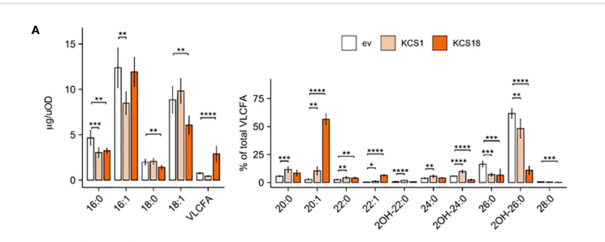

## Question

# Gene Research for Functional Annotation

## ⚠️ CRITICAL: Gene/Protein Identification Context

**BEFORE YOU BEGIN RESEARCH:** You MUST verify you are researching the CORRECT gene/protein. Gene symbols can be ambiguous, especially for less well-characterized genes from non-model organisms.

### Target Gene/Protein Identity (from UniProt):
- **UniProt Accession:** Q38860
- **Protein Description:** RecName: Full=3-ketoacyl-CoA synthase 18 {ECO:0000303|PubMed:18465198}; Short=KCS-18 {ECO:0000303|PubMed:18465198}; EC=2.3.1.199 {ECO:0000269|PubMed:11341960, ECO:0000269|PubMed:12135493, ECO:0000269|PubMed:16765910}; AltName: Full=Protein FATTY ACID ELONGATION 1 {ECO:0000303|PubMed:7734965}; AltName: Full=Very long-chain fatty acid condensing enzyme 18 {ECO:0000303|PubMed:18465198}; Short=VLCFA condensing enzyme 18 {ECO:0000303|PubMed:18465198};
- **Gene Information:** Name=FAE1 {ECO:0000303|PubMed:7734965}; Synonyms=KCS18 {ECO:0000303|PubMed:18465198}; OrderedLocusNames=At4g34520 {ECO:0000312|Araport:AT4G34520}; ORFNames=T4L20.100 {ECO:0000312|EMBL:CAA18831.1};
- **Organism (full):** Arabidopsis thaliana (Mouse-ear cress).
- **Protein Family:** Belongs to the thiolase-like superfamily. Chalcone/stilbene
- **Key Domains:** 3-ktacl-CoA_syn. (IPR012392); ACP_syn_III_C. (IPR013747); FAE1_typ3_polyketide_synth. (IPR013601); Thiolase-like. (IPR016039); ACP_syn_III_C (PF08541)

### MANDATORY VERIFICATION STEPS:

1. **Check if the gene symbol "FAE1" matches the protein description above**
2. **Verify the organism is correct:** Arabidopsis thaliana (Mouse-ear cress).
3. **Check if protein family/domains align with what you find in literature**
4. **If you find literature for a DIFFERENT gene with the same or similar symbol, STOP**

### If Gene Symbol is Ambiguous or You Cannot Find Relevant Literature:

**DO NOT PROCEED WITH RESEARCH ON A DIFFERENT GENE.** Instead:
- State clearly: "The gene symbol 'FAE1' is ambiguous or literature is limited for this specific protein"
- Explain what you found (e.g., "Found extensive literature on a different gene with the same symbol in a different organism")
- Describe the protein based ONLY on the UniProt information provided above
- Suggest that the protein function can be inferred from domain/family information

### Research Target:

Please provide a comprehensive research report on the gene **FAE1** (gene ID: FAE1, UniProt: Q38860) in ARATH.

The research report should be a detailed narrative explaining the function, biological processes, and localization of the gene product. Citations should be given for all claims.

You should prioritize authoritative reviews and primary scientific literature when conducting research. You can supplement
this with annotations you find in gene/protein databases, but these can be outdated or inaccurate.

We are specifically interested in the primary function of the gene - for enzymes, what reaction is catalyzed, and what is the substrate specificity? For transporters, what is the substrate? For structural proteins or adapters, what is the broader structural role? For signaling molecules, what is the role in the pathway.

We are interested in where in or outside the cell the gene product carries out its function.

We are also interested in the signaling or biochemical pathways in which the gene functions. We are less interested in broad pleiotropic effects, except where these elucidate the precise role.

Include evidence where possible. We are interested in both experimental evidence as well as inference from structure, evolution, or bioinformatic analysis. Precise studies should be prioritized over high-throughput, where available.

## Output

Question: You are an expert researcher providing comprehensive, well-cited information.

Provide detailed information focusing on:
1. Key concepts and definitions with current understanding
2. Recent developments and latest research (prioritize 2023-2024 sources)
3. Current applications and real-world implementations
4. Expert opinions and analysis from authoritative sources
5. Relevant statistics and data from recent studies

Format as a comprehensive research report with proper citations. Include URLs and publication dates where available.
Always prioritize recent, authoritative sources and provide specific citations for all major claims.

# Gene Research for Functional Annotation

## ⚠️ CRITICAL: Gene/Protein Identification Context

**BEFORE YOU BEGIN RESEARCH:** You MUST verify you are researching the CORRECT gene/protein. Gene symbols can be ambiguous, especially for less well-characterized genes from non-model organisms.

### Target Gene/Protein Identity (from UniProt):
- **UniProt Accession:** Q38860
- **Protein Description:** RecName: Full=3-ketoacyl-CoA synthase 18 {ECO:0000303|PubMed:18465198}; Short=KCS-18 {ECO:0000303|PubMed:18465198}; EC=2.3.1.199 {ECO:0000269|PubMed:11341960, ECO:0000269|PubMed:12135493, ECO:0000269|PubMed:16765910}; AltName: Full=Protein FATTY ACID ELONGATION 1 {ECO:0000303|PubMed:7734965}; AltName: Full=Very long-chain fatty acid condensing enzyme 18 {ECO:0000303|PubMed:18465198}; Short=VLCFA condensing enzyme 18 {ECO:0000303|PubMed:18465198};
- **Gene Information:** Name=FAE1 {ECO:0000303|PubMed:7734965}; Synonyms=KCS18 {ECO:0000303|PubMed:18465198}; OrderedLocusNames=At4g34520 {ECO:0000312|Araport:AT4G34520}; ORFNames=T4L20.100 {ECO:0000312|EMBL:CAA18831.1};
- **Organism (full):** Arabidopsis thaliana (Mouse-ear cress).
- **Protein Family:** Belongs to the thiolase-like superfamily. Chalcone/stilbene
- **Key Domains:** 3-ktacl-CoA_syn. (IPR012392); ACP_syn_III_C. (IPR013747); FAE1_typ3_polyketide_synth. (IPR013601); Thiolase-like. (IPR016039); ACP_syn_III_C (PF08541)

### MANDATORY VERIFICATION STEPS:

1. **Check if the gene symbol "FAE1" matches the protein description above**
2. **Verify the organism is correct:** Arabidopsis thaliana (Mouse-ear cress).
3. **Check if protein family/domains align with what you find in literature**
4. **If you find literature for a DIFFERENT gene with the same or similar symbol, STOP**

### If Gene Symbol is Ambiguous or You Cannot Find Relevant Literature:

**DO NOT PROCEED WITH RESEARCH ON A DIFFERENT GENE.** Instead:
- State clearly: "The gene symbol 'FAE1' is ambiguous or literature is limited for this specific protein"
- Explain what you found (e.g., "Found extensive literature on a different gene with the same symbol in a different organism")
- Describe the protein based ONLY on the UniProt information provided above
- Suggest that the protein function can be inferred from domain/family information

### Research Target:

Please provide a comprehensive research report on the gene **FAE1** (gene ID: FAE1, UniProt: Q38860) in ARATH.

The research report should be a detailed narrative explaining the function, biological processes, and localization of the gene product. Citations should be given for all claims.

You should prioritize authoritative reviews and primary scientific literature when conducting research. You can supplement
this with annotations you find in gene/protein databases, but these can be outdated or inaccurate.

We are specifically interested in the primary function of the gene - for enzymes, what reaction is catalyzed, and what is the substrate specificity? For transporters, what is the substrate? For structural proteins or adapters, what is the broader structural role? For signaling molecules, what is the role in the pathway.

We are interested in where in or outside the cell the gene product carries out its function.

We are also interested in the signaling or biochemical pathways in which the gene functions. We are less interested in broad pleiotropic effects, except where these elucidate the precise role.

Include evidence where possible. We are interested in both experimental evidence as well as inference from structure, evolution, or bioinformatic analysis. Precise studies should be prioritized over high-throughput, where available.

## Research report: Functional annotation of **Arabidopsis thaliana FAE1 / KCS18** (UniProt Q38860; At4g34520)

### 0) Target verification (critical identity check)
The research target here is the Arabidopsis thaliana gene **FAE1**, which is also referred to as **KCS18** (3-ketoacyl-CoA synthase 18), encoding a condensing enzyme of the fatty acid elongase (FAE) system that produces very-long-chain fatty acids (VLCFAs) in seeds. This identity is explicitly supported by plant VLCFA elongation literature describing **KCS18/FAE1** as the canonical seed-specific condensing enzyme in Arabidopsis (batsale2021biosynthesisandfunctions pages 5-6, morineau2016dualfattyacid pages 1-2, zhukov2022synthesisofc20–38 pages 7-8). Recent functional profiling studies include KCS18 among the 21 Arabidopsis KCS isoforms and biochemically characterize it as an ER-localized enzyme with a strong bias toward monounsaturated C20 products (batsale2023tacklingfunctionalredundancy pages 6-10).

### 1) Key concepts and definitions (current understanding)

#### 1.1 Very-long-chain fatty acids (VLCFAs)
In plant lipid biology, **VLCFAs** are commonly defined as fatty acids **longer than C18**. They occur in diverse lipid classes (membrane lipids, sphingolipids) and in extracellular barriers (cuticular waxes and suberin), and can also accumulate in seed triacylglycerols (TAGs) as storage lipids (batsale2023tacklingfunctionalredundancy pages 1-2, batsale2021biosynthesisandfunctions pages 3-5).

#### 1.2 Fatty acid elongase (FAE) system and the “condensing enzyme” step
VLCFA synthesis occurs predominantly on the **endoplasmic reticulum (ER)** by a multi-enzyme **fatty acid elongase (FAE) complex**. The FAE cycle adds **two carbons per elongation round** using malonyl-CoA as the C2 donor. The complex is typically described as four sequential enzymatic steps: 
1) **Condensation** catalyzed by a **3-ketoacyl-CoA synthase (KCS)**, generating a 3-ketoacyl-CoA intermediate; 
2) reduction (KCR), 
3) dehydration (HCD), and 
4) final reduction (ECR) (morineau2016dualfattyacid pages 1-2, zhukov2022synthesisofc20–38 pages 6-7, kim2013arabidopsis3ketoacylcoenzymea pages 1-2).

A key consensus point is that the **KCS/condensing enzyme is the major determinant of chain-length substrate specificity**, whereas the other core enzymes tend to be more broadly specific and shared across complexes (batsale2023tacklingfunctionalredundancy pages 1-2, zhukov2022synthesisofc20–38 pages 6-7, batsale2021biosynthesisandfunctions pages 3-5).

#### 1.3 KCS gene family redundancy and why FAE1 is special
Arabidopsis contains a large KCS gene family (≈21 genes), which supports the idea that multiple FAE complexes operate in parallel and/or sequentially in different tissues to generate the plant’s broad VLCFA spectrum (batsale2023tacklingfunctionalredundancy pages 1-2). This redundancy explains why many **kcs single mutants lack strong phenotypes** (batsale2023tacklingfunctionalredundancy pages 1-2). In contrast, **FAE1/KCS18 is seed-specialized** and has a uniquely strong impact on seed VLCFA composition (batsale2021biosynthesisandfunctions pages 5-6, zhukov2022synthesisofc20–38 pages 7-8).

### 2) FAE1/KCS18 molecular function: reaction, substrates, and products

#### 2.1 Enzymatic activity and reaction class
FAE1/KCS18 is a **3-ketoacyl-CoA synthase (condensing enzyme)** in the ER-localized elongase complex that catalyzes the first (rate-defining) condensation step in each elongation cycle (morineau2016dualfattyacid pages 1-2, zhukov2022synthesisofc20–38 pages 6-7). Mechanistically, KCS condenses an acyl-CoA substrate with malonyl-CoA to form a **3-ketoacyl-CoA**, which is then processed by the remaining elongase enzymes (morineau2016dualfattyacid pages 1-2, kim2013arabidopsis3ketoacylcoenzymea pages 1-2).

#### 2.2 Substrate specificity and product profile
A 2023 systematic profiling of Arabidopsis KCS enzymes using reconstituted elongase complexes in yeast showed that **KCS18 has a distinctive specificity characterized by strong accumulation of monounsaturated C20 products**, and it increases **18:1-, 20:1-, and 22:1-CoA species** in engineered yeast acyl-CoA pools (batsale2023tacklingfunctionalredundancy pages 6-10). Consistent with this, a review summarizing heterologous expression data notes that KCS18/FAE1 expression yields saturated and monounsaturated **C20 and C22 VLCFAs** (batsale2021biosynthesisandfunctions pages 5-6).

Figure-level support for the product-profile claim is available in the 2023 study’s yeast FAME and acyl-CoA profiling panels showing increased **20:1 and 22:1** products upon KCS18 expression (batsale2023tacklingfunctionalredundancy media 6565efaa).

### 3) Subcellular localization and site of action

The VLCFA elongation machinery operates on the **endoplasmic reticulum** (batsale2023tacklingfunctionalredundancy pages 1-2, zhukov2022synthesisofc20–38 pages 6-7). In the 2023 profiling work, fluorescent fusions showed that **Arabidopsis KCS proteins—including KCS18—localize to the ER** when transiently expressed in tobacco epidermal cells (batsale2023tacklingfunctionalredundancy pages 6-10). This localization is consistent with earlier ER-localization evidence for KCS family members assayed with ER marker colocalization approaches (kim2013arabidopsis3ketoacylcoenzymea pages 1-2).

### 4) Biological role and pathway context in Arabidopsis

#### 4.1 Seed oil VLCFAs and TAG accumulation
FAE1/KCS18 is widely described as the **seed-specific KCS** responsible for producing VLCFAs incorporated into **seed triacylglycerols (TAGs)** (zhukov2022synthesisofc20–38 pages 7-8). In Arabidopsis seeds, VLCFAs represent a major fraction of acyl chains (one review cites ~27%) (batsale2021biosynthesisandfunctions pages 3-5), and FAE1/KCS18 is central to generating the characteristic C20–C22 seed products (batsale2021biosynthesisandfunctions pages 5-6, zhukov2022synthesisofc20–38 pages 7-8).

#### 4.2 Loss-of-function phenotype (quantitative)
A quantitative summary reported in a 2022 synthesis review indicates that **fae1 loss-of-function** reduces seed VLCFAs from **~28% (wild type) to <1%** in fae1 seeds, with vegetative tissues and flowers not showing the same fatty-acid composition changes (zhukov2022synthesisofc20–38 pages 7-8). A separate high-citation review similarly reports that kcs18/fae1 mutant seed storage lipids are **nearly free of C20 and C22 VLCFAs**, consistent with FAE1 being the principal seed condensing enzyme for those products (batsale2021biosynthesisandfunctions pages 5-6).

#### 4.3 Ectopic expression sufficiency
The same 2022 review indicates that ectopic expression of **35S-FAE1** in leaves is sufficient to drive accumulation of **C20 and C22** VLCFAs, suggesting that (when substrate pools and shared elongase partners are available) FAE1 is a sufficient determinant to re-route flux toward seed-like VLCFAs (zhukov2022synthesisofc20–38 pages 7-8).

### 5) Recent developments (prioritizing 2023–2024)

#### 5.1 2023: systematic, quantitative characterization of Arabidopsis KCS specificities
A major 2023 methodological and conceptual advance is the **CRISPR-enabled expression platform** to reconstitute Arabidopsis FAE complexes in yeast and comprehensively test KCS candidates, enabling more direct assignment of chain-length specificities while explicitly addressing functional redundancy (batsale2023tacklingfunctionalredundancy pages 1-2). Within this systematic framework, **KCS18** was distinguished by its preference for monounsaturated C20 products and associated acyl-CoA changes (batsale2023tacklingfunctionalredundancy pages 6-10, batsale2023tacklingfunctionalredundancy media 6565efaa).

#### 5.2 2024: modulation of elongase output by accessory proteins (conceptual extension)
A 2024 study in maize reports that co-expression of BAHD-family proteins (GLOSSY2 / GLOSSY2-LIKE) with maize KCS enzymes in yeast can extend VLCFA output up to **C30** under certain host contexts, but not in others—supporting the emerging view that **FAE output is modulated by accessory factors** and that results can be system-dependent (alexander2024theimpactof pages 1-2). While not about Arabidopsis FAE1 specifically, it reinforces a key interpretive framework: chain-length outcomes are not always encoded by KCS alone.

#### 5.3 2024: applied and mechanistic synthesis of VLCFA-inhibiting herbicides
A 2024 Weed Technology review summarizes “Group 15” and related VLCFA elongase–inhibiting herbicides, emphasizing their widespread use and mechanistic target: the **VLCFA synthase/condensing enzyme step** encoded by multiple **FAE1-like genes** in the ER elongase complex (jhala2024verylongchain pages 1-2). The review highlights the conserved **reactive cysteinyl sulfur** implicated in inhibition chemistry (jhala2024verylongchain pages 1-2).

### 6) Current applications and real-world implementations

#### 6.1 Metabolic engineering for long-chain monounsaturated fatty acids (erucic/nervonic acid)
Because FAE1-like KCS enzymes control VLCFA chain length, they are prominent targets in metabolic engineering to enrich seed oils in long-chain monounsaturated products. A 2023 review on **nervonic acid** biosynthesis and engineering summarizes multiple examples of introducing KCS genes into plants and microbes and reports large increases in VLCFAs depending on enzyme and host context, including **30–40×** (Lunaria KCS in Arabidopsis), **35–50×** (Cardamine KCS in Arabidopsis), and **15–28×** increases in Brassica hosts (ling2023researchprogressof pages 7-8). The same review also reports engineering in microalgae yielding nervonic acid up to **40% of total fatty acids** in one case, and notes a yeast production example reaching **8 g/L** nervonic acid (though only ~20% of total FA), illustrating industrial relevance beyond plants (ling2023researchprogressof pages 7-8).

These examples treat FAE1-like KCS enzymes as key “control points” and discuss strategies such as (i) tuning KCS substrate specificity by mutagenesis and (ii) increasing precursor availability to push flux through elongation (ling2023researchprogressof pages 7-8).

#### 6.2 Herbicide mode-of-action and resistance management
VLCFA-inhibiting herbicides are a large, established herbicide mode-of-action class used in major row crops. The 2024 review reports: 
- eight chemical families in this class; 
- average application ≈ once per year in U.S. corn and soybean systems; 
- as of Aug 2023, **13 resistant weed species** documented (11 monocots, 2 dicots); 
- most recently discovered class members in 2014 (pyroxasulfone, fenoxasulfone) (jhala2024verylongchain pages 1-2). 

This situates FAE1-like condensing enzymes (KCS/FAE step) as a **real-world biochemical target** with major agronomic and resistance-management implications (jhala2024verylongchain pages 1-2).

### 7) Expert opinions and analysis (authoritative synthesis)

#### 7.1 Consensus points
- **KCS enzymes determine chain-length specificity** in the ER elongation cycle, while the other elongase subunits are more broadly shared (batsale2023tacklingfunctionalredundancy pages 1-2, zhukov2022synthesisofc20–38 pages 6-7, batsale2021biosynthesisandfunctions pages 3-5). 
- **Functional redundancy** in large KCS gene families is a major reason single mutants often lack phenotypes; in contrast, shared core subunits (KCR/HCD/ECR) can be essential, making them genetically hard to dissect (batsale2021biosynthesisandfunctions pages 3-5, batsale2023tacklingfunctionalredundancy pages 1-2).
- **FAE1/KCS18** is a highly informative “exception” to redundancy because it is seed-specialized and its loss strongly depletes seed C20–C22 VLCFAs (zhukov2022synthesisofc20–38 pages 7-8, batsale2021biosynthesisandfunctions pages 5-6).

#### 7.2 Open questions and limitations
Multiple authoritative sources emphasize that important mechanistic uncertainties remain:
- **Complex assembly and accessory modulation:** the FAE is an ER multi-protein complex with limited structural understanding; accessory proteins (e.g., CER2-LIKE family; chaperones PAS1/AKR2A) can modulate KCS outcomes, but mechanisms remain unresolved (batsale2021biosynthesisandfunctions pages 5-6, batsale2023tacklingfunctionalredundancy pages 11-12).
- **Context dependence of heterologous assays:** some KCS enzymes are inactive in yeast but active in planta assays, suggesting missing plant cofactors/partners or inappropriate substrate pools in heterologous hosts (batsale2023tacklingfunctionalredundancy pages 10-11, batsale2023tacklingfunctionalredundancy pages 11-12).
- **Redundancy vs specialization:** systematic profiling reveals both redundant paralog pairs and outlier specificities, but many KCS isoforms remain uncharacterized and may act on substrates or products that are not routinely measured (batsale2023tacklingfunctionalredundancy pages 1-2, batsale2023tacklingfunctionalredundancy pages 6-10).

### 8) Evidence map (summary table)
The following table consolidates the major evidence-backed functional annotation points for FAE1/KCS18, including the most relevant recent developments and applications.

| Topic | Key findings (with quantitative data) | Evidence (paper + year + DOI/URL) |
|---|---|---|
| Identity and core function | Arabidopsis **FAE1 = KCS18** (At4g34520; UniProt Q38860) is a **3-ketoacyl-CoA synthase/condensing enzyme** of the **ER-localized fatty acid elongase (FAE) complex**. It catalyzes the first step of VLCFA elongation: condensation of an acyl-CoA with malonyl-CoA to form a 3-ketoacyl-CoA intermediate; KCS is the chain-length-determining component of the 4-enzyme FAE system. (morineau2016dualfattyacid pages 1-2, batsale2023tacklingfunctionalredundancy pages 1-2, zhukov2022synthesisofc20–38 pages 6-7) | Morineau et al., 2016, PLoS ONE, https://doi.org/10.1371/journal.pone.0160631; Batsale et al., 2023, Front. Plant Sci., https://doi.org/10.3389/fpls.2023.1107333; Zhukov & Popov, 2022, IJMS, https://doi.org/10.3390/ijms23094731 |
| Substrate specificity and product profile | Recent yeast reconstitution showed **KCS18 preferentially accumulates monounsaturated C20 products** and increases **18:1-, 20:1-, and 22:1-CoA** pools; figure-level evidence indicates significant accumulation of **20:1 and 22:1** products in yeast expressing KCS18. Reviews summarize that heterologous expression of FAE1/KCS18 yields **C20 and C22 saturated and monounsaturated VLCFAs**, consistent with elongation of **18:1-CoA toward 20:1/22:1**. (batsale2023tacklingfunctionalredundancy pages 6-10, batsale2021biosynthesisandfunctions pages 5-6, batsale2023tacklingfunctionalredundancy media 6565efaa) | Batsale et al., 2023, Front. Plant Sci., https://doi.org/10.3389/fpls.2023.1107333; Batsale et al., 2021, Cells, https://doi.org/10.3390/cells10061284 |
| Subcellular localization | All Arabidopsis KCS proteins tested, including KCS18, localized to the **endoplasmic reticulum** in transient expression assays; KCS proteins show a polygonal/tubular ER pattern in tobacco cells. ER localization is consistent with the known localization of VLCFA elongation. (batsale2023tacklingfunctionalredundancy pages 6-10, kim2013arabidopsis3ketoacylcoenzymea pages 9-10, kim2013arabidopsis3ketoacylcoenzymea pages 1-2) | Batsale et al., 2023, Front. Plant Sci., https://doi.org/10.3389/fpls.2023.1107333; Kim et al., 2013, Plant Physiol., https://doi.org/10.1104/pp.112.210450 |
| Loss-of-function phenotype | **fae1/kcs18 mutant seeds** are strongly depleted in seed VLCFAs: reviews report seed storage lipids are **nearly free of C20 and C22 VLCFAs**, and one review summarizes total seed VLCFA dropping from **~28% in wild type to <1% in fae1**. Vegetative tissues and flowers are reported as largely unaffected in fatty-acid composition. (zhukov2022synthesisofc20–38 pages 7-8, batsale2021biosynthesisandfunctions pages 5-6) | Zhukov & Popov, 2022, IJMS, https://doi.org/10.3390/ijms23094731; Batsale et al., 2021, Cells, https://doi.org/10.3390/cells10061284 |
| Ectopic/overexpression phenotype | Ectopic **35S-FAE1** expression in Arabidopsis leaves is sufficient to induce accumulation of **C20 and C22 VLCFAs** in tissues that normally lack them, supporting that FAE1 alone can drive seed-type VLCFA synthesis when supplied with suitable substrates and shared elongase partners. (zhukov2022synthesisofc20–38 pages 7-8) | Zhukov & Popov, 2022, IJMS, https://doi.org/10.3390/ijms23094731 |
| Pathway role in seed lipid metabolism | FAE1/KCS18 is the canonical **seed-specific KCS** directing formation of VLCFAs for **triacylglycerol (TAG)** storage lipids, including the pathway leading to **erucic acid (22:1)**. Arabidopsis seeds contain a substantial VLCFA fraction; one review cites **~27% of Arabidopsis seed acyl chains** as VLCFAs, with FAE1 being the principal seed condensing enzyme. (zhukov2022synthesisofc20–38 pages 7-8, batsale2021biosynthesisandfunctions pages 3-5) | Zhukov & Popov, 2022, IJMS, https://doi.org/10.3390/ijms23094731; Batsale et al., 2021, Cells, https://doi.org/10.3390/cells10061284 |
| Recent development: improved functional assignment (2023) | A 2023 Arabidopsis KCS reconstitution platform in engineered yeast systematically profiled KCS activities and highlighted **functional redundancy** across the KCS family while clarifying that **KCS18 specializes in monounsaturated C20/C22 products**. This is important for interpreting weak mutant phenotypes outside seeds and for rational pathway engineering. (batsale2023tacklingfunctionalredundancy pages 6-10, batsale2023tacklingfunctionalredundancy pages 1-2) | Batsale et al., 2023, Front. Plant Sci., https://doi.org/10.3389/fpls.2023.1107333 |
| Application relevance: herbicide target class (2024 review) | VLCFA-inhibiting herbicides target the **condensing enzyme step** of the ER FAE system encoded by multiple **FAE1-like genes**. The active-site mechanism depends on a conserved **reactive cysteinyl sulfur**. Practical statistics: **8 chemical families** are included; first such herbicide dates to **1958**; newest major class members were discovered in **2014**; as of Aug 2023, **13 resistant weed species** had been documented. This is pathway-level relevance rather than evidence that Arabidopsis FAE1 itself is the sole field target. (jhala2024verylongchain pages 1-2) | Jhala et al., 2024, Weed Technology, https://doi.org/10.1017/wet.2023.90 |
| Application relevance: metabolic engineering of erucic/nervonic acid | A 2023 review of nervonic-acid engineering identifies **FAE1-like KCS enzymes as key rate-limiting targets** for boosting long-chain monounsaturated VLCFAs. Reported outcomes include **30–40×** VLCFA increases with *Lunaria annua* KCS in Arabidopsis, **35–50×** with *Cardamine graeca* KCS in Arabidopsis, **15–28×** in Brassica hosts, and **25×** with *Malania oleifera* KCS11 in Arabidopsis. Proposed strategies include KCS mutagenesis to alter chain-length specificity and increasing precursor supply while suppressing competing desaturation. (ling2023researchprogressof pages 7-8) | Ling et al., 2023, J. Oleo Sci., https://doi.org/10.5650/jos.ess23039 |
| Broader mechanistic outlook | 2024 work in maize shows that accessory proteins can shift FAE chain-length output up to **C30**, reinforcing the current expert view that KCS defines much of product specificity but that **other FAE-associated proteins can modulate final chain length/output**. This informs how FAE1-like enzymes may be optimized in engineering contexts. (alexander2024theimpactof pages 1-2) | Alexander et al., 2024, Front. Plant Sci., https://doi.org/10.3389/fpls.2024.1403779 |

*Table: This table compiles the key experimentally supported facts about Arabidopsis FAE1/KCS18, including its enzymatic role, specificity, localization, phenotypes, and recent translational relevance. It is designed as a compact evidence map for functional annotation and current applications.*

### 9) Key references (with publication dates and URLs)
- Batsale M. et al. (2023-01). *Tackling functional redundancy of Arabidopsis fatty acid elongase complexes*. Frontiers in Plant Science. https://doi.org/10.3389/fpls.2023.1107333 (batsale2023tacklingfunctionalredundancy pages 6-10, batsale2023tacklingfunctionalredundancy pages 1-2, batsale2023tacklingfunctionalredundancy media 6565efaa)
- Jhala A.J. et al. (2024-12). *Very long chain fatty acid–inhibiting herbicides: Current uses, site of action, herbicide-resistant weeds, and future*. Weed Technology. https://doi.org/10.1017/wet.2023.90 (jhala2024verylongchain pages 1-2)
- Ling C. et al. (2023-09). *Research Progress of Nervonic Acid Biosynthesis*. Journal of Oleo Science. https://doi.org/10.5650/jos.ess23039 (ling2023researchprogressof pages 7-8)
- Zhukov A., Popov V. (2022-04). *Synthesis of C20–38 Fatty Acids in Plant Tissues*. International Journal of Molecular Sciences. https://doi.org/10.3390/ijms23094731 (zhukov2022synthesisofc20–38 pages 7-8)
- Batsale M. et al. (2021-05). *Biosynthesis and Functions of Very-Long-Chain Fatty Acids in the Responses of Plants to Abiotic and Biotic Stresses*. Cells. https://doi.org/10.3390/cells10061284 (batsale2021biosynthesisandfunctions pages 3-5, batsale2021biosynthesisandfunctions pages 5-6)
- Morineau C. et al. (2016-09). *Dual Fatty Acid Elongase Complex Interactions in Arabidopsis*. PLoS ONE. https://doi.org/10.1371/journal.pone.0160631 (morineau2016dualfattyacid pages 1-2)

References

1. (batsale2021biosynthesisandfunctions pages 5-6): Marguerite Batsale, Delphine Bahammou, Laetitia Fouillen, Sébastien Mongrand, Jérôme Joubès, and Frédéric Domergue. Biosynthesis and functions of very-long-chain fatty acids in the responses of plants to abiotic and biotic stresses. Cells, 10:1284, May 2021. URL: https://doi.org/10.3390/cells10061284, doi:10.3390/cells10061284. This article has 240 citations.

2. (morineau2016dualfattyacid pages 1-2): Céline Morineau, Lionel Gissot, Yannick Bellec, Kian Hematy, Frédérique Tellier, Charlotte Renne, Richard Haslam, Frédéric Beaudoin, Johnathan Napier, and Jean-Denis Faure. Dual fatty acid elongase complex interactions in arabidopsis. PLoS ONE, 11:e0160631, Sep 2016. URL: https://doi.org/10.1371/journal.pone.0160631, doi:10.1371/journal.pone.0160631. This article has 31 citations and is from a peer-reviewed journal.

3. (zhukov2022synthesisofc20–38 pages 7-8): Anatoly Zhukov and Valery Popov. Synthesis of c20–38 fatty acids in plant tissues. International Journal of Molecular Sciences, 23:4731, Apr 2022. URL: https://doi.org/10.3390/ijms23094731, doi:10.3390/ijms23094731. This article has 28 citations.

4. (batsale2023tacklingfunctionalredundancy pages 6-10): Marguerite Batsale, Marie Alonso, Stéphanie Pascal, Didier Thoraval, Richard P. Haslam, Frédéric Beaudoin, Frédéric Domergue, and Jérôme Joubès. Tackling functional redundancy of arabidopsis fatty acid elongase complexes. Frontiers in Plant Science, Jan 2023. URL: https://doi.org/10.3389/fpls.2023.1107333, doi:10.3389/fpls.2023.1107333. This article has 43 citations.

5. (batsale2023tacklingfunctionalredundancy pages 1-2): Marguerite Batsale, Marie Alonso, Stéphanie Pascal, Didier Thoraval, Richard P. Haslam, Frédéric Beaudoin, Frédéric Domergue, and Jérôme Joubès. Tackling functional redundancy of arabidopsis fatty acid elongase complexes. Frontiers in Plant Science, Jan 2023. URL: https://doi.org/10.3389/fpls.2023.1107333, doi:10.3389/fpls.2023.1107333. This article has 43 citations.

6. (batsale2021biosynthesisandfunctions pages 3-5): Marguerite Batsale, Delphine Bahammou, Laetitia Fouillen, Sébastien Mongrand, Jérôme Joubès, and Frédéric Domergue. Biosynthesis and functions of very-long-chain fatty acids in the responses of plants to abiotic and biotic stresses. Cells, 10:1284, May 2021. URL: https://doi.org/10.3390/cells10061284, doi:10.3390/cells10061284. This article has 240 citations.

7. (zhukov2022synthesisofc20–38 pages 6-7): Anatoly Zhukov and Valery Popov. Synthesis of c20–38 fatty acids in plant tissues. International Journal of Molecular Sciences, 23:4731, Apr 2022. URL: https://doi.org/10.3390/ijms23094731, doi:10.3390/ijms23094731. This article has 28 citations.

8. (kim2013arabidopsis3ketoacylcoenzymea pages 1-2): Juyoung Kim, Jin Hee Jung, Saet Buyl Lee, Young Sam Go, Hae Jin Kim, Rebecca Cahoon, Jennifer E. Markham, Edgar B. Cahoon, and Mi Chung Suh. Arabidopsis 3-ketoacyl-coenzyme a synthase9 is involved in the synthesis of tetracosanoic acids as precursors of cuticular waxes, suberins, sphingolipids, and phospholipids. Plant Physiology, 162:567-580, Apr 2013. URL: https://doi.org/10.1104/pp.112.210450, doi:10.1104/pp.112.210450. This article has 236 citations and is from a highest quality peer-reviewed journal.

9. (batsale2023tacklingfunctionalredundancy media 6565efaa): Marguerite Batsale, Marie Alonso, Stéphanie Pascal, Didier Thoraval, Richard P. Haslam, Frédéric Beaudoin, Frédéric Domergue, and Jérôme Joubès. Tackling functional redundancy of arabidopsis fatty acid elongase complexes. Frontiers in Plant Science, Jan 2023. URL: https://doi.org/10.3389/fpls.2023.1107333, doi:10.3389/fpls.2023.1107333. This article has 43 citations.

10. (alexander2024theimpactof pages 1-2): Liza Esther Alexander, Dirk Winkelman, Kenna E. Stenback, Madison Lane, Katelyn R. Campbell, Elysse Trost, Kayla Flyckt, Michael A. Schelling, Ludmila Rizhsky, Marna D. Yandeau-Nelson, and Basil J. Nikolau. The impact of the glossy2 and glossy2-like bahd-proteins in affecting the product profile of the maize fatty acid elongase. Frontiers in Plant Science, Jul 2024. URL: https://doi.org/10.3389/fpls.2024.1403779, doi:10.3389/fpls.2024.1403779. This article has 5 citations.

11. (jhala2024verylongchain pages 1-2): Amit J. Jhala, Mandeep Singh, Lovreet Shergill, Rishabh Singh, Mithila Jugulam, Dean E. Riechers, Zahoor A. Ganie, Thomas P. Selby, Rodrigo Werle, and Jason K. Norsworthy. Very long chain fatty acid–inhibiting herbicides: current uses, site of action, herbicide-resistant weeds, and future. Weed Technology, 38:1-16, Dec 2024. URL: https://doi.org/10.1017/wet.2023.90, doi:10.1017/wet.2023.90. This article has 34 citations and is from a peer-reviewed journal.

12. (ling2023researchprogressof pages 7-8): Cheng Ling, Feng Li, Jiangyuan Zhao, Mengliang Wen, and Xiu-lin Han. Research progress of nervonic acid biosynthesis. Journal of oleo science, 72:889-900, Sep 2023. URL: https://doi.org/10.5650/jos.ess23039, doi:10.5650/jos.ess23039. This article has 10 citations.

13. (batsale2023tacklingfunctionalredundancy pages 11-12): Marguerite Batsale, Marie Alonso, Stéphanie Pascal, Didier Thoraval, Richard P. Haslam, Frédéric Beaudoin, Frédéric Domergue, and Jérôme Joubès. Tackling functional redundancy of arabidopsis fatty acid elongase complexes. Frontiers in Plant Science, Jan 2023. URL: https://doi.org/10.3389/fpls.2023.1107333, doi:10.3389/fpls.2023.1107333. This article has 43 citations.

14. (batsale2023tacklingfunctionalredundancy pages 10-11): Marguerite Batsale, Marie Alonso, Stéphanie Pascal, Didier Thoraval, Richard P. Haslam, Frédéric Beaudoin, Frédéric Domergue, and Jérôme Joubès. Tackling functional redundancy of arabidopsis fatty acid elongase complexes. Frontiers in Plant Science, Jan 2023. URL: https://doi.org/10.3389/fpls.2023.1107333, doi:10.3389/fpls.2023.1107333. This article has 43 citations.

15. (kim2013arabidopsis3ketoacylcoenzymea pages 9-10): Juyoung Kim, Jin Hee Jung, Saet Buyl Lee, Young Sam Go, Hae Jin Kim, Rebecca Cahoon, Jennifer E. Markham, Edgar B. Cahoon, and Mi Chung Suh. Arabidopsis 3-ketoacyl-coenzyme a synthase9 is involved in the synthesis of tetracosanoic acids as precursors of cuticular waxes, suberins, sphingolipids, and phospholipids. Plant Physiology, 162:567-580, Apr 2013. URL: https://doi.org/10.1104/pp.112.210450, doi:10.1104/pp.112.210450. This article has 236 citations and is from a highest quality peer-reviewed journal.

## Artifacts

- [Edison artifact artifact-00](FAE1-deep-research-falcon_artifacts/artifact-00.md)

## Citations

1. batsale2023tacklingfunctionalredundancy pages 6-10
2. batsale2023tacklingfunctionalredundancy pages 1-2
3. batsale2021biosynthesisandfunctions pages 5-6
4. batsale2021biosynthesisandfunctions pages 3-5
5. alexander2024theimpactof pages 1-2
6. jhala2024verylongchain pages 1-2
7. ling2023researchprogressof pages 7-8
8. morineau2016dualfattyacid pages 1-2
9. batsale2023tacklingfunctionalredundancy pages 11-12
10. batsale2023tacklingfunctionalredundancy pages 10-11
11. https://doi.org/10.1371/journal.pone.0160631;
12. https://doi.org/10.3389/fpls.2023.1107333;
13. https://doi.org/10.3390/ijms23094731
14. https://doi.org/10.3390/cells10061284
15. https://doi.org/10.1104/pp.112.210450
16. https://doi.org/10.3390/ijms23094731;
17. https://doi.org/10.3389/fpls.2023.1107333
18. https://doi.org/10.1017/wet.2023.90
19. https://doi.org/10.5650/jos.ess23039
20. https://doi.org/10.3389/fpls.2024.1403779
21. https://doi.org/10.1371/journal.pone.0160631
22. https://doi.org/10.3390/cells10061284,
23. https://doi.org/10.1371/journal.pone.0160631,
24. https://doi.org/10.3390/ijms23094731,
25. https://doi.org/10.3389/fpls.2023.1107333,
26. https://doi.org/10.1104/pp.112.210450,
27. https://doi.org/10.3389/fpls.2024.1403779,
28. https://doi.org/10.1017/wet.2023.90,
29. https://doi.org/10.5650/jos.ess23039,