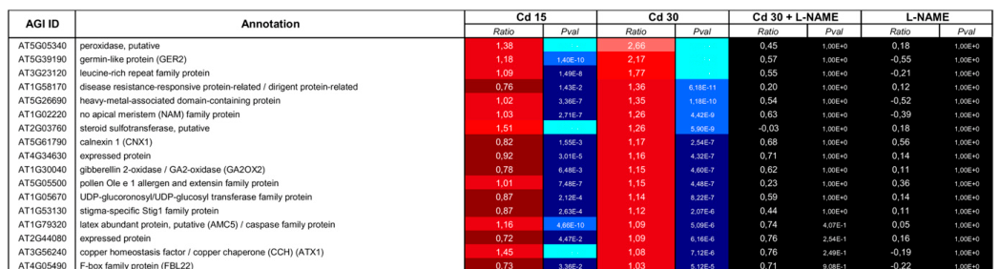

## Question

# Gene Research for Functional Annotation

## ⚠️ CRITICAL: Gene/Protein Identification Context

**BEFORE YOU BEGIN RESEARCH:** You MUST verify you are researching the CORRECT gene/protein. Gene symbols can be ambiguous, especially for less well-characterized genes from non-model organisms.

### Target Gene/Protein Identity (from UniProt):
- **UniProt Accession:** Q9M0U6
- **Protein Description:** RecName: Full=Putative F-box/LRR-repeat protein 22;
- **Gene Information:** Name=FBL22; OrderedLocusNames=At4g05490; ORFNames=C6L9.170;
- **Organism (full):** Arabidopsis thaliana (Mouse-ear cress).
- **Protein Family:** Not specified in UniProt
- **Key Domains:** F-box-like_dom_sf. (IPR036047); F-box_dom. (IPR001810); LRR_dom_sf. (IPR032675); LRR_FXL15/At3g58940/PEG3-like. (IPR055411); F-box-like (PF12937)

### MANDATORY VERIFICATION STEPS:

1. **Check if the gene symbol "FBL22" matches the protein description above**
2. **Verify the organism is correct:** Arabidopsis thaliana (Mouse-ear cress).
3. **Check if protein family/domains align with what you find in literature**
4. **If you find literature for a DIFFERENT gene with the same or similar symbol, STOP**

### If Gene Symbol is Ambiguous or You Cannot Find Relevant Literature:

**DO NOT PROCEED WITH RESEARCH ON A DIFFERENT GENE.** Instead:
- State clearly: "The gene symbol 'FBL22' is ambiguous or literature is limited for this specific protein"
- Explain what you found (e.g., "Found extensive literature on a different gene with the same symbol in a different organism")
- Describe the protein based ONLY on the UniProt information provided above
- Suggest that the protein function can be inferred from domain/family information

### Research Target:

Please provide a comprehensive research report on the gene **FBL22** (gene ID: FBL22, UniProt: Q9M0U6) in ARATH.

The research report should be a detailed narrative explaining the function, biological processes, and localization of the gene product. Citations should be given for all claims.

You should prioritize authoritative reviews and primary scientific literature when conducting research. You can supplement
this with annotations you find in gene/protein databases, but these can be outdated or inaccurate.

We are specifically interested in the primary function of the gene - for enzymes, what reaction is catalyzed, and what is the substrate specificity? For transporters, what is the substrate? For structural proteins or adapters, what is the broader structural role? For signaling molecules, what is the role in the pathway.

We are interested in where in or outside the cell the gene product carries out its function.

We are also interested in the signaling or biochemical pathways in which the gene functions. We are less interested in broad pleiotropic effects, except where these elucidate the precise role.

Include evidence where possible. We are interested in both experimental evidence as well as inference from structure, evolution, or bioinformatic analysis. Precise studies should be prioritized over high-throughput, where available.

## Output

Question: You are an expert researcher providing comprehensive, well-cited information.

Provide detailed information focusing on:
1. Key concepts and definitions with current understanding
2. Recent developments and latest research (prioritize 2023-2024 sources)
3. Current applications and real-world implementations
4. Expert opinions and analysis from authoritative sources
5. Relevant statistics and data from recent studies

Format as a comprehensive research report with proper citations. Include URLs and publication dates where available.
Always prioritize recent, authoritative sources and provide specific citations for all major claims.

# Gene Research for Functional Annotation

## ⚠️ CRITICAL: Gene/Protein Identification Context

**BEFORE YOU BEGIN RESEARCH:** You MUST verify you are researching the CORRECT gene/protein. Gene symbols can be ambiguous, especially for less well-characterized genes from non-model organisms.

### Target Gene/Protein Identity (from UniProt):
- **UniProt Accession:** Q9M0U6
- **Protein Description:** RecName: Full=Putative F-box/LRR-repeat protein 22;
- **Gene Information:** Name=FBL22; OrderedLocusNames=At4g05490; ORFNames=C6L9.170;
- **Organism (full):** Arabidopsis thaliana (Mouse-ear cress).
- **Protein Family:** Not specified in UniProt
- **Key Domains:** F-box-like_dom_sf. (IPR036047); F-box_dom. (IPR001810); LRR_dom_sf. (IPR032675); LRR_FXL15/At3g58940/PEG3-like. (IPR055411); F-box-like (PF12937)

### MANDATORY VERIFICATION STEPS:

1. **Check if the gene symbol "FBL22" matches the protein description above**
2. **Verify the organism is correct:** Arabidopsis thaliana (Mouse-ear cress).
3. **Check if protein family/domains align with what you find in literature**
4. **If you find literature for a DIFFERENT gene with the same or similar symbol, STOP**

### If Gene Symbol is Ambiguous or You Cannot Find Relevant Literature:

**DO NOT PROCEED WITH RESEARCH ON A DIFFERENT GENE.** Instead:
- State clearly: "The gene symbol 'FBL22' is ambiguous or literature is limited for this specific protein"
- Explain what you found (e.g., "Found extensive literature on a different gene with the same symbol in a different organism")
- Describe the protein based ONLY on the UniProt information provided above
- Suggest that the protein function can be inferred from domain/family information

### Research Target:

Please provide a comprehensive research report on the gene **FBL22** (gene ID: FBL22, UniProt: Q9M0U6) in ARATH.

The research report should be a detailed narrative explaining the function, biological processes, and localization of the gene product. Citations should be given for all claims.

You should prioritize authoritative reviews and primary scientific literature when conducting research. You can supplement
this with annotations you find in gene/protein databases, but these can be outdated or inaccurate.

We are specifically interested in the primary function of the gene - for enzymes, what reaction is catalyzed, and what is the substrate specificity? For transporters, what is the substrate? For structural proteins or adapters, what is the broader structural role? For signaling molecules, what is the role in the pathway.

We are interested in where in or outside the cell the gene product carries out its function.

We are also interested in the signaling or biochemical pathways in which the gene functions. We are less interested in broad pleiotropic effects, except where these elucidate the precise role.

Include evidence where possible. We are interested in both experimental evidence as well as inference from structure, evolution, or bioinformatic analysis. Precise studies should be prioritized over high-throughput, where available.

# Functional-annotation report: *Arabidopsis thaliana* FBL22

## Executive conclusion

The gene symbol **FBL22 is ambiguous across organisms**. For this report, the verified target is **Arabidopsis thaliana At4g05490**, UniProt **Q9M0U6**, also recorded as **FBL22/C6L9.170**, encoding a **putative F-box/LRR-repeat protein 22**. The similarly named human gene **FBXL22** (ENSG00000197361) is a different gene; its disease associations are irrelevant and were excluded. (OpenTargets Search: -FBL22, bessonbard2009nitricoxidecontributes pages 5-7)

For this specific Arabidopsis protein, the literature is extremely limited. Its most defensible primary-function annotation is **candidate substrate-recognition/adaptor subunit of an SCF-type E3 ubiquitin-ligase complex**, inferred from its F-box and leucine-rich-repeat architecture—not a demonstrated standalone ubiquitin ligase. No substrate, degron, ligand, ubiquitin-chain specificity, SCF interaction, loss-of-function phenotype, or cellular localization has been established experimentally. The only clear locus-specific experimental evidence retrieved is a 2009 transcriptomic observation that root FBL22 RNA increases modestly during cadmium treatment in an apparently nitric-oxide-dependent expression class. (bessonbard2009nitricoxidecontributes pages 5-7, collins2024dynamicinteractionsbetween pages 7-8, saxena2023roleoffbox pages 1-3)

| Topic/claim | Observation | Evidence type | Confidence/limitations |
|---|---|---|---|
| Target identity | Target is *Arabidopsis thaliana* FBL22, locus At4g05490, UniProt Q9M0U6; literature also identifies At4g05490 as FBL22. Human **FBXL22** (ENSG00000197361) is a distinct homonym and is excluded. (OpenTargets Search: -FBL22, bessonbard2009nitricoxidecontributes pages 5-7) | Locus-specific publication plus cross-species identifier check | **High** for identity; human disease records must not be transferred to the plant protein. |
| Domain architecture | User-supplied UniProt annotation assigns F-box/F-box-like and leucine-rich-repeat (LRR) features, consistent with the description “putative F-box/LRR-repeat protein 22.” | Curated/computational protein-domain annotation | **Moderate**; domain presence supports classification but does not demonstrate complex assembly or biological function. |
| Primary molecular-role hypothesis | F-box proteins generally serve as interchangeable substrate receptors in multimeric SCF complexes: the F-box associates with SKP1/ASK, whereas auxiliary regions such as LRRs may recruit substrates. FBL22 is therefore better described as a **candidate SCF substrate receptor**, not a demonstrated standalone E3 enzyme. (collins2024dynamicinteractionsbetween pages 7-8, saxena2023roleoffbox pages 1-3, pu2024abacterialplatform pages 1-2) | Mechanistic inference from domain architecture and established SCF biology | **Moderate-to-low for FBL22 specifically**; no retrieved FBL22-specific SKP1 binding, SCF assembly, or ubiquitination assay. |
| Substrate and reaction specificity | No protein substrate, degron, ligand, ubiquitin-chain type, or substrate-degradation reaction has been established for FBL22. | Absence of locus-specific biochemical evidence in retrieved literature | **Unknown**; an F-box/LRR annotation alone cannot identify a substrate or pathway. (saxena2023roleoffbox pages 1-3, saxena2023roleoffbox pages 3-5) |
| Cellular localization | No FBL22-specific localization experiment or reliable compartment assignment was found. | Evidence gap | **Unknown**; SCF-family membership does not by itself justify nuclear, cytosolic, membrane, or organellar localization. (collins2024dynamicinteractionsbetween pages 7-8, pu2024abacterialplatform pages 1-2) |
| Cadmium/NO-responsive expression | In a 2009 root microarray, FBL22 log2 ratios versus untreated plants were **0.73** (15 µM Cd²⁺), **1.03** (30 µM Cd²⁺), **0.71** (30 µM Cd²⁺ + L-NAME), and **−0.22** (L-NAME alone). The study grouped it among NO-regulated, proteolysis-related genes. (bessonbard2009nitricoxidecontributes pages 5-7, bessonbard2009nitricoxidecontributes media ca0e7199) | Locus-specific CATMA microarray under 24-hour cadmium/NO-inhibition conditions | **Moderate for transcript association**; approximate fold changes are 1.66×, 2.04×, 1.64×, and 0.86×, respectively. This does not establish protein activity or pathway causality. |
| Validation and phenotype in the 2009 study | FBL22 was not among the seven genes selected for locus-specific qRT-PCR validation, and no FBL22 mutant, complementation, protein, ubiquitination, or phenotype experiment was reported. (bessonbard2009nitricoxidecontributes pages 5-7) | Study-design assessment | **High**; the paper supports stress-associated transcript regulation, not a demonstrated FBL22 function in cadmium toxicity or NO signaling. |
| Ubiquitin-ligase wording | The 2009 article described FBL22 as “displaying a ubiquitin protein ligase activity,” but its figure annotation was based on automatic Arabidopsis annotation and the study did not assay that activity. (bessonbard2009nitricoxidecontributes pages 5-7) | Secondary annotation within a transcriptomic study | **Low for direct enzymatic proof**; interpret as an annotation-derived prediction rather than experimental biochemical evidence. |
| Nearby suberization GWAS signal | A later GWAS found two significant chromosome-4 SNPs between At4g05475 and At4g05490; both neighboring genes were annotated as putative F-box proteins. The interval was deprioritized because of SNP-to-gene distance, and At4g05490 was not experimentally tested. (han2026gwasrevealsuber pages 6-8) | Statistical association near, but not within or causally assigned to, FBL22 | **Very low for FBL22 causality**; proximity does not establish that FBL22 controls endodermal suberization. The article is dated May 2026, outside the requested 2023–2024 priority window. |
| 2023–2024 evidence status | Retrieval found recent reviews clarifying SCF/F-box mechanisms, but no 2023–2024 primary functional study specifically establishing FBL22 substrates, localization, pathway, or phenotype. (collins2024dynamicinteractionsbetween pages 7-8, saxena2023roleoffbox pages 1-3, pu2024abacterialplatform pages 1-2) | Literature-search result and recent mechanistic reviews | **High confidence that direct evidence retrieved is sparse**, but not proof that no unindexed study exists. |

*Table: Evidence-grade summary distinguishing locus-specific observations from domain-based inference for Arabidopsis FBL22. It highlights the limited direct functional evidence and major unresolved questions.*

## 1. Identity and domain verification

The supplied UniProt record identifies Q9M0U6 as FBL22 at **At4g05490** in *A. thaliana*, with F-box/F-box-like and LRR-related annotations: IPR001810, IPR036047, IPR032675, IPR055411, and PF12937. This architecture agrees with the locus-specific literature, which calls At4g05490 “FBL22” or a putative F-box protein. (han2026gwasrevealsuber pages 6-8, bessonbard2009nitricoxidecontributes pages 5-7)

The database description should nevertheless be read as a **sequence-based functional prediction**. An F-box motif is consistent with binding an Arabidopsis SKP1-like/ASK adaptor, whereas an LRR region is consistent with protein–protein or substrate recognition. Neither feature proves that FBL22 forms an active SCF complex or identifies its substrate. (collins2024dynamicinteractionsbetween pages 7-8, saxena2023roleoffbox pages 1-3)

The human homonym provides an important false-positive trap: OpenTargets interpreted “FBL22” as human **FBXL22**, returning human disease associations. Those records do not concern At4g05490 and cannot be transferred to the plant protein. (OpenTargets Search: -FBL22)

## 2. Probable molecular function

### Mechanistic inference

Canonical SCF ubiquitin ligases contain CUL1 as a scaffold, RBX1 as the RING/E2-binding component, SKP1/ASK as an adaptor, and a variable F-box protein as the substrate-recruitment component. The F-box associates with SKP1, while additional domains determine target recognition; ubiquitinated substrates may subsequently be degraded by the 26S proteasome. Recent reviews therefore describe F-box proteins principally as **substrate receptors within multisubunit E3 enzymes**, rather than necessarily autonomous catalytic enzymes. (collins2024dynamicinteractionsbetween pages 7-8, saxena2023roleoffbox pages 1-3, saxena2023roleoffbox pages 3-5, pu2024abacterialplatform pages 1-2)

Applied cautiously to FBL22, the predicted structural role is:

1. recruitment to a putative SCF complex through its F-box region;
2. recognition of an unknown protein partner or substrate through its LRR-containing region; and
3. promotion, within the assembled SCF machinery, of substrate ubiquitination and possibly proteasomal turnover.

All three steps remain **hypotheses for FBL22**. No retrieved study demonstrated ASK/SKP1 binding, CUL1/RBX1 complex assembly, direct substrate binding, ubiquitin transfer, or substrate degradation. (collins2024dynamicinteractionsbetween pages 7-8, saxena2023roleoffbox pages 1-3, pu2024abacterialplatform pages 1-2)

### Reaction and substrate specificity

FBL22 is not currently supported as an enzyme with an independently catalyzed small-molecule reaction. Even if it is an authentic SCF component, the ubiquitin-transfer chemistry would be performed by the assembled E1–E2–SCF cascade; FBL22 would chiefly confer target selection. Its protein substrate, recognition motif, required post-translational modification, ligand dependence, ubiquitin linkage, and degradation outcome are all unknown. (saxena2023roleoffbox pages 1-3, saxena2023roleoffbox pages 3-5, pu2024abacterialplatform pages 1-2)

A 2009 paper described FBL22 as “displaying a ubiquitin protein ligase activity,” but the same paper states that its figure annotations came from automatic Arabidopsis annotation and reports no FBL22 biochemical assay. That wording should therefore not be treated as direct evidence of enzymatic activity. (bessonbard2009nitricoxidecontributes pages 5-7)

## 3. Biological process and pathway evidence

### Cadmium/nitric-oxide response

Besson-Bard et al. studied Arabidopsis roots exposed for 24 hours to cadmium and/or the nitric-oxide-synthesis inhibitor L-NAME. FBL22 was assigned to a class of 39 NO-regulated genes—27 induced and 12 repressed—and grouped with three proteolysis-related loci. The authors interpreted this group as suggesting a role for proteolysis in nitric-oxide action during cadmium stress. (bessonbard2009nitricoxidecontributes pages 5-7)

The reported FBL22 CATMA microarray log2 expression ratios relative to untreated roots were:

- **0.73** with 15 µM Cd²⁺, approximately **1.66-fold**;
- **1.03** with 30 µM Cd²⁺, approximately **2.04-fold**;
- **0.71** with 30 µM Cd²⁺ plus L-NAME, approximately **1.64-fold**; and
- **−0.22** with L-NAME alone, approximately **0.86-fold**. (bessonbard2009nitricoxidecontributes media ca0e7199)

Thus, the strongest observed response was about a twofold transcript increase at 30 µM cadmium. Cotreatment with L-NAME reduced that increase, supporting an association between nitric-oxide status and FBL22 transcription under these conditions. However, FBL22 was **not** among the seven loci selected for gene-specific qRT-PCR validation. No FBL22 mutant, complementation test, protein-abundance measurement, ubiquitination assay, or cadmium phenotype was reported. The study therefore supports **stress-responsive expression**, not a causal role for FBL22 in nitric-oxide signaling, metal uptake, root inhibition, or proteolysis. (bessonbard2009nitricoxidecontributes pages 5-7)

The primary source is Besson-Bard et al., *Plant Physiology* 149:1302–1315, published January 2009, DOI: [10.1104/pp.108.133348](https://doi.org/10.1104/pp.108.133348). (bessonbard2009nitricoxidecontributes pages 5-7)

### Possible association with root endodermal suberization

A later Arabidopsis GWAS detected two chromosome-4 SNPs between At4g05475 and At4g05490 in an analysis of the fully suberized root-endodermal zone. Both neighboring genes were annotated as putative F-box proteins. The SNPs were 1,839 and 1,236 bp from the neighboring genes, although the available excerpt does not unambiguously map each distance to one gene. The investigators deprioritized this interval and did not test At4g05490. Consequently, this is only a **nearby statistical signal**, not evidence that FBL22 regulates suberization. (han2026gwasrevealsuber pages 6-8)

This report appeared after the requested priority period: Han et al., *Nature Plants* 12:1079–1094, May 2026, DOI: [10.1038/s41477-026-02292-x](https://doi.org/10.1038/s41477-026-02292-x). The retrieved pages also derive from a December 2025 preprint version. (han2026gwasrevealsuber pages 6-8)

## 4. Subcellular localization

No FBL22-specific fluorescent-protein localization, biochemical fractionation, immunolocalization, organellar-proteomics validation, or compartment-restricted interaction experiment was found. Its operational cellular location must therefore be reported as **unknown**.

It would be inappropriate to assign FBL22 automatically to the nucleus, cytosol, membrane, or an organelle merely because other F-box proteins act there. SCF substrate selection depends partly on expression, localization, interaction affinity, and context, and family membership alone does not establish any one compartment. (collins2024dynamicinteractionsbetween pages 7-8, pu2024abacterialplatform pages 1-2)

## 5. Recent research and applications

No 2023–2024 primary study retrieved in this search directly characterized At4g05490/FBL22. The most relevant recent literature instead refines the general mechanistic interpretation of F-box proteins. Saxena et al. (published May 2023) emphasize their role as variable SCF substrate receptors and the need to establish target recognition experimentally; Collins et al. (February 2024) similarly describe ASK/SKP1–CUL1–RBX organization and context-dependent SCF assembly. (collins2024dynamicinteractionsbetween pages 7-8, saxena2023roleoffbox pages 1-3)

Relevant recent sources include:

- Saxena, Negi & Sharma, “Role of F-box E3-ubiquitin ligases in plant development and stress responses,” *Plant Cell Reports* 42:1133–1146, May 2023, DOI: [10.1007/s00299-023-03023-8](https://doi.org/10.1007/s00299-023-03023-8). (saxena2023roleoffbox pages 1-3)
- Collins et al., “Dynamic interactions between SPX proteins, the ubiquitination machinery, and signalling molecules for stress adaptation at a whole-plant level,” *Biochemical Journal* 481:363–385, February 2024, DOI: [10.1042/BCJ20230163](https://doi.org/10.1042/BCJ20230163). (collins2024dynamicinteractionsbetween pages 7-8)
- Pu et al., “A Bacterial Platform for Studying Ubiquitination Cascades Anchored by SCF-Type E3 Ubiquitin Ligases,” *Biomolecules* 14:1209, September 2024, DOI: [10.3390/biom14101209](https://doi.org/10.3390/biom14101209). This work illustrates the type of reconstituted assay needed to establish SCF-dependent ubiquitination, but it did not test FBL22. (pu2024abacterialplatform pages 1-2)

There is currently no demonstrated agricultural, biotechnological, or other real-world implementation specific to FBL22. Proposals to manipulate it for cadmium tolerance, nutrient management, root suberization, or crop improvement would be premature without causal genetics and substrate identification.

## 6. Overall evidence assessment

**Established with high confidence:** the target identity is Arabidopsis At4g05490/FBL22/Q9M0U6, distinct from human FBXL22; its sequence is annotated as F-box/LRR-like; and its root transcript showed modest cadmium-associated regulation in one microarray study. (OpenTargets Search: -FBL22, bessonbard2009nitricoxidecontributes pages 5-7, bessonbard2009nitricoxidecontributes media ca0e7199)

**Reasonable but unverified inference:** FBL22 may act as a substrate-recognition adaptor in an SCF-type ubiquitin-ligase complex, with its LRR region contributing to protein recognition. (collins2024dynamicinteractionsbetween pages 7-8, saxena2023roleoffbox pages 1-3)

**Not established:** direct E3 activity, an interacting ASK/SKP1 protein, substrate identity, ubiquitin-chain or degron specificity, a signaling pathway, cadmium/NO causality, mutant phenotype, developmental role, suberization function, or subcellular localization.

The highest-priority experiments are endogenous-expression localization, ASK/SKP1 and CUL1 complex-assembly tests, loss-of-function and complementation phenotyping under cadmium/NO perturbation, affinity-purification proteomics for substrates, and substrate-dependent ubiquitination/degradation assays. Until such evidence exists, **“putative F-box/LRR substrate receptor” is more accurate than “ubiquitin ligase with a defined biological function.”**

References

1. (OpenTargets Search: -FBL22): Open Targets Query (-FBL22, 5 results). Buniello, A. et al. (2025). Open Targets Platform: facilitating therapeutic hypotheses building in drug discovery. Nucleic Acids Research.

2. (bessonbard2009nitricoxidecontributes pages 5-7): Angélique Besson-Bard, Antoine Gravot, Pierre Richaud, Pascaline Auroy, Céline Duc, Frédéric Gaymard, Ludivine Taconnat, Jean-Pierre Renou, Alain Pugin, and David Wendehenne. Nitric oxide contributes to cadmium toxicity in arabidopsis by promoting cadmium accumulation in roots and by up-regulating genes related to iron uptake. Plant Physiology, 149(3):1302-1315, Jan 2009. URL: https://doi.org/10.1104/pp.108.133348, doi:10.1104/pp.108.133348. This article has 468 citations and is from a highest quality peer-reviewed journal.

3. (collins2024dynamicinteractionsbetween pages 7-8): Emma Collins, Huixia Shou, Chuanzao Mao, James Whelan, and Ricarda Jost. Dynamic interactions between spx proteins, the ubiquitination machinery, and signalling molecules for stress adaptation at a whole-plant level. The Biochemical journal, 481 5:363-385, Feb 2024. URL: https://doi.org/10.1042/bcj20230163, doi:10.1042/bcj20230163. This article has 15 citations.

4. (saxena2023roleoffbox pages 1-3): Harshita Saxena, Harshita Negi, and Bhaskar Sharma. Role of f-box e3-ubiquitin ligases in plant development and stress responses. Plant Cell Reports, 42:1133-1146, May 2023. URL: https://doi.org/10.1007/s00299-023-03023-8, doi:10.1007/s00299-023-03023-8. This article has 66 citations and is from a peer-reviewed journal.

5. (pu2024abacterialplatform pages 1-2): Zuo-Xian Pu, Jun-Li Wang, Yu-Yang Li, Luo-Yu Liang, Yi-Ting Tan, Ze-Hui Wang, Bao-Lin Li, Guang-Qin Guo, Li Wang, and Lei Wu. A bacterial platform for studying ubiquitination cascades anchored by scf-type e3 ubiquitin ligases. Biomolecules, 14:1209, Sep 2024. URL: https://doi.org/10.3390/biom14101209, doi:10.3390/biom14101209. This article has 4 citations.

6. (saxena2023roleoffbox pages 3-5): Harshita Saxena, Harshita Negi, and Bhaskar Sharma. Role of f-box e3-ubiquitin ligases in plant development and stress responses. Plant Cell Reports, 42:1133-1146, May 2023. URL: https://doi.org/10.1007/s00299-023-03023-8, doi:10.1007/s00299-023-03023-8. This article has 66 citations and is from a peer-reviewed journal.

7. (bessonbard2009nitricoxidecontributes media ca0e7199): Angélique Besson-Bard, Antoine Gravot, Pierre Richaud, Pascaline Auroy, Céline Duc, Frédéric Gaymard, Ludivine Taconnat, Jean-Pierre Renou, Alain Pugin, and David Wendehenne. Nitric oxide contributes to cadmium toxicity in arabidopsis by promoting cadmium accumulation in roots and by up-regulating genes related to iron uptake. Plant Physiology, 149(3):1302-1315, Jan 2009. URL: https://doi.org/10.1104/pp.108.133348, doi:10.1104/pp.108.133348. This article has 468 citations and is from a highest quality peer-reviewed journal.

8. (han2026gwasrevealsuber pages 6-8): Jian-Pu Han, Linnka Lefebvre-Legendre, Jun Yu, Maria Beatriz Capitão, Chloé Beaulieu, Kay Gully, Vinay Shukla, Yibo Wu, Andreas Boland, Christiane Nawrath, and Marie Barberon. Gwas reveal suber gene1-mediated suberization via type one phosphatases. Nature Plants, 12(5):1079-1094, May 2026. URL: https://doi.org/10.1038/s41477-026-02292-x, doi:10.1038/s41477-026-02292-x. This article has 2 citations and is from a highest quality peer-reviewed journal.

## Artifacts

- [Edison artifact artifact-00](FBL22-deep-research-falcon_artifacts/artifact-00.md)

## Citations

1. bessonbard2009nitricoxidecontributes pages 5-7
2. han2026gwasrevealsuber pages 6-8
3. saxena2023roleoffbox pages 1-3
4. collins2024dynamicinteractionsbetween pages 7-8
5. pu2024abacterialplatform pages 1-2
6. saxena2023roleoffbox pages 3-5
7. 10.1104/pp.108.133348
8. 10.1038/s41477-026-02292-x
9. 10.1007/s00299-023-03023-8
10. 10.1042/BCJ20230163
11. 10.3390/biom14101209
12. https://doi.org/10.1104/pp.108.133348
13. https://doi.org/10.1038/s41477-026-02292-x
14. https://doi.org/10.1007/s00299-023-03023-8
15. https://doi.org/10.1042/BCJ20230163
16. https://doi.org/10.3390/biom14101209
17. https://doi.org/10.1104/pp.108.133348,
18. https://doi.org/10.1042/bcj20230163,
19. https://doi.org/10.1007/s00299-023-03023-8,
20. https://doi.org/10.3390/biom14101209,
21. https://doi.org/10.1038/s41477-026-02292-x,