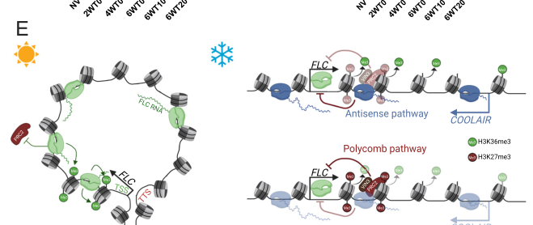

## Question

# Gene Research for Functional Annotation

## ⚠️ CRITICAL: Gene/Protein Identification Context

**BEFORE YOU BEGIN RESEARCH:** You MUST verify you are researching the CORRECT gene/protein. Gene symbols can be ambiguous, especially for less well-characterized genes from non-model organisms.

### Target Gene/Protein Identity (from UniProt):
- **UniProt Accession:** Q9S7Q7
- **Protein Description:** RecName: Full=MADS-box protein FLOWERING LOCUS C {ECO:0000303|PubMed:10330478}; AltName: Full=MADS-box protein FLOWERING LOCUS F {ECO:0000303|PubMed:10072403};
- **Gene Information:** Name=FLC {ECO:0000303|PubMed:10330478}; Synonyms=FLF {ECO:0000303|PubMed:10072403}; OrderedLocusNames=At5g10140 {ECO:0000312|Araport:AT5G10140}; ORFNames=T31P16.130 {ECO:0000312|EMBL:CAB92055.1};
- **Organism (full):** Arabidopsis thaliana (Mouse-ear cress).
- **Protein Family:** Not specified in UniProt
- **Key Domains:** MADS-box/MEF2_TF. (IPR050142); MEF2-like_N. (IPR033896); TF_Kbox. (IPR002487); TF_MADSbox. (IPR002100); TF_MADSbox_sf. (IPR036879)

### MANDATORY VERIFICATION STEPS:

1. **Check if the gene symbol "FLC" matches the protein description above**
2. **Verify the organism is correct:** Arabidopsis thaliana (Mouse-ear cress).
3. **Check if protein family/domains align with what you find in literature**
4. **If you find literature for a DIFFERENT gene with the same or similar symbol, STOP**

### If Gene Symbol is Ambiguous or You Cannot Find Relevant Literature:

**DO NOT PROCEED WITH RESEARCH ON A DIFFERENT GENE.** Instead:
- State clearly: "The gene symbol 'FLC' is ambiguous or literature is limited for this specific protein"
- Explain what you found (e.g., "Found extensive literature on a different gene with the same symbol in a different organism")
- Describe the protein based ONLY on the UniProt information provided above
- Suggest that the protein function can be inferred from domain/family information

### Research Target:

Please provide a comprehensive research report on the gene **FLC** (gene ID: FLC, UniProt: Q9S7Q7) in ARATH.

The research report should be a detailed narrative explaining the function, biological processes, and localization of the gene product. Citations should be given for all claims.

You should prioritize authoritative reviews and primary scientific literature when conducting research. You can supplement
this with annotations you find in gene/protein databases, but these can be outdated or inaccurate.

We are specifically interested in the primary function of the gene - for enzymes, what reaction is catalyzed, and what is the substrate specificity? For transporters, what is the substrate? For structural proteins or adapters, what is the broader structural role? For signaling molecules, what is the role in the pathway.

We are interested in where in or outside the cell the gene product carries out its function.

We are also interested in the signaling or biochemical pathways in which the gene functions. We are less interested in broad pleiotropic effects, except where these elucidate the precise role.

Include evidence where possible. We are interested in both experimental evidence as well as inference from structure, evolution, or bioinformatic analysis. Precise studies should be prioritized over high-throughput, where available.

## Output

Question: You are an expert researcher providing comprehensive, well-cited information.

Provide detailed information focusing on:
1. Key concepts and definitions with current understanding
2. Recent developments and latest research (prioritize 2023-2024 sources)
3. Current applications and real-world implementations
4. Expert opinions and analysis from authoritative sources
5. Relevant statistics and data from recent studies

Format as a comprehensive research report with proper citations. Include URLs and publication dates where available.
Always prioritize recent, authoritative sources and provide specific citations for all major claims.

# Gene Research for Functional Annotation

## ⚠️ CRITICAL: Gene/Protein Identification Context

**BEFORE YOU BEGIN RESEARCH:** You MUST verify you are researching the CORRECT gene/protein. Gene symbols can be ambiguous, especially for less well-characterized genes from non-model organisms.

### Target Gene/Protein Identity (from UniProt):
- **UniProt Accession:** Q9S7Q7
- **Protein Description:** RecName: Full=MADS-box protein FLOWERING LOCUS C {ECO:0000303|PubMed:10330478}; AltName: Full=MADS-box protein FLOWERING LOCUS F {ECO:0000303|PubMed:10072403};
- **Gene Information:** Name=FLC {ECO:0000303|PubMed:10330478}; Synonyms=FLF {ECO:0000303|PubMed:10072403}; OrderedLocusNames=At5g10140 {ECO:0000312|Araport:AT5G10140}; ORFNames=T31P16.130 {ECO:0000312|EMBL:CAB92055.1};
- **Organism (full):** Arabidopsis thaliana (Mouse-ear cress).
- **Protein Family:** Not specified in UniProt
- **Key Domains:** MADS-box/MEF2_TF. (IPR050142); MEF2-like_N. (IPR033896); TF_Kbox. (IPR002487); TF_MADSbox. (IPR002100); TF_MADSbox_sf. (IPR036879)

### MANDATORY VERIFICATION STEPS:

1. **Check if the gene symbol "FLC" matches the protein description above**
2. **Verify the organism is correct:** Arabidopsis thaliana (Mouse-ear cress).
3. **Check if protein family/domains align with what you find in literature**
4. **If you find literature for a DIFFERENT gene with the same or similar symbol, STOP**

### If Gene Symbol is Ambiguous or You Cannot Find Relevant Literature:

**DO NOT PROCEED WITH RESEARCH ON A DIFFERENT GENE.** Instead:
- State clearly: "The gene symbol 'FLC' is ambiguous or literature is limited for this specific protein"
- Explain what you found (e.g., "Found extensive literature on a different gene with the same symbol in a different organism")
- Describe the protein based ONLY on the UniProt information provided above
- Suggest that the protein function can be inferred from domain/family information

### Research Target:

Please provide a comprehensive research report on the gene **FLC** (gene ID: FLC, UniProt: Q9S7Q7) in ARATH.

The research report should be a detailed narrative explaining the function, biological processes, and localization of the gene product. Citations should be given for all claims.

You should prioritize authoritative reviews and primary scientific literature when conducting research. You can supplement
this with annotations you find in gene/protein databases, but these can be outdated or inaccurate.

We are specifically interested in the primary function of the gene - for enzymes, what reaction is catalyzed, and what is the substrate specificity? For transporters, what is the substrate? For structural proteins or adapters, what is the broader structural role? For signaling molecules, what is the role in the pathway.

We are interested in where in or outside the cell the gene product carries out its function.

We are also interested in the signaling or biochemical pathways in which the gene functions. We are less interested in broad pleiotropic effects, except where these elucidate the precise role.

Include evidence where possible. We are interested in both experimental evidence as well as inference from structure, evolution, or bioinformatic analysis. Precise studies should be prioritized over high-throughput, where available.

## Comprehensive Research Report: Arabidopsis thaliana **FLOWERING LOCUS C (FLC)** (UniProt **Q9S7Q7**; gene **FLC/FLF**; locus **At5g10140**)

### Executive summary
FLOWERING LOCUS C (FLC) in *Arabidopsis thaliana* encodes a MADS-box transcription factor that acts as a master **repressor of flowering** by directly suppressing expression of floral integrator genes such as **FT** and **SOC1** (and also repressing **FD**) (li2025epigeneticregulationof pages 2-4, zhou2026beyondfloweringthe pages 2-3). The core vernalization response in Arabidopsis is mediated by **cold-induced epigenetic silencing of the FLC locus**, involving Polycomb (PRC2) H3K27me3 deposition and long noncoding RNA (lncRNA) pathways; recent work supports a model in which **COOLAIR antisense transcription and PRC2 act in parallel** to silence FLC (nielsen2024coolairandprc2 pages 1-2, nielsen2024coolairandprc2 pages 5-6). Newer studies also implicate **nuclear architecture** (nuclear pore Y-complex/periphery tethering) as a mechanistic layer influencing FLC transcriptional state (huang2024thenuclearpore pages 4-6, huang2024thenuclearpore pages 37-38). Translationally, the FLC-centered vernalization module is widely leveraged as a conceptual and practical framework for flowering-time manipulation in Brassicaceae crops, and can be perturbed by chemical devernalizers in Arabidopsis or through engineering of FLC ortholog regulation (otsuka2025smallmoleculesand pages 4-5, kim2026currentunderstandingof pages 7-8).

---

## 1) Identity verification and key definitions (functional-annotation context)

### 1.1 Gene/protein identity (disambiguation)
The target is **Arabidopsis thaliana** FLOWERING LOCUS C (**FLC**)—a MADS-box transcription factor central to vernalization-regulated flowering time (zhou2026beyondfloweringthe pages 1-2, li2025epigeneticregulationof pages 2-4). This matches the UniProt-provided identity (Q9S7Q7; At5g10140), and the literature used here explicitly concerns Arabidopsis FLC rather than unrelated “FLC” symbols in other organisms (nielsen2024coolairandprc2 pages 1-2, li2025epigeneticregulationof pages 2-4).

### 1.2 Key concepts and definitions
- **Vernalization**: prolonged cold exposure that enables flowering competence by establishing a remembered transcriptional state; in Arabidopsis, a primary mechanistic hallmark is **stable epigenetic silencing of FLC** (shi2023roleofmethylation pages 1-2, kim2026currentunderstandingof pages 3-5).
- **FLC**: a **MADS-box transcription factor** functioning as a master floral repressor; high FLC delays flowering (li2025epigeneticregulationof pages 2-4, zhou2026beyondfloweringthe pages 1-2).
- **CArG box**: the canonical MADS-box TF DNA motif; a review explicitly notes FLC binds CArG-box motifs in **FT** and **SOC1** promoters (zhou2026beyondfloweringthe pages 2-3), and genome-wide ChIP-seq confirms enrichment of CArG-like motifs at FLC binding sites (deng2011floweringlocusc pages 2-2).
- **Polycomb Repressive Complex 2 (PRC2)**: catalyzes **H3K27me3** deposition, a repressive chromatin mark; PRC2 is central to stable post-cold silencing of the FLC locus (shi2023roleofmethylation pages 1-2, nielsen2024coolairandprc2 pages 1-2).
- **COOLAIR**: cold-induced antisense lncRNA transcription from the FLC locus associated with rapid transcriptional repression mechanisms (nielsen2024coolairandprc2 pages 1-2, nielsen2024coolairandprc2 pages 5-6).

---

## 2) Molecular function and cellular/subcellular localization (primary functional annotation)

### 2.1 Molecular function: transcription factor and direct targets
FLC is a **MADS-box transcription factor** that directly represses transcription of core floral activators/integrators:
- Direct repression of **FT** and **SOC1** (zhou2026beyondfloweringthe pages 1-2, li2025epigeneticregulationof pages 2-4).
- Direct repression of **FD** by binding to the **first intron of FD** (li2025epigeneticregulationof pages 2-4).

A recent review specifies FLC binding to **CArG-box [CC(A/T)6GG]** motifs in promoters of **FT** and **SOC1** as a mechanistic basis of repression (zhou2026beyondfloweringthe pages 2-3). This is consistent with genome-wide ChIP-seq that found **505 FLC binding sites** and **786 putative target genes**, with promoter enrichment and frequent CArG-like motifs (deng2011floweringlocusc pages 2-2).

### 2.2 Protein complexes and interaction context
FLC operates within MADS-domain repressor complexes and in coordination with other flowering repressors:
- A Nature Communications study reports FLC and other FLC-clade members can directly interact and form **nuclear complexes**, and that FLC-dependent floral repression requires other clade members (gu2013arabidopsisflcclade pages 1-2).
- Reviews also emphasize FLC’s functional association with other MADS proteins such as **SVP** (zhou2026beyondfloweringthe pages 2-3).

### 2.3 Where the gene product functions in the cell
Direct subcellular localization of the **FLC protein** is not quantified in the excerpts here, but FLC’s role as a DNA-binding transcription factor and its operation in nuclear MADS-domain complexes implies a **nuclear site of action** (gu2013arabidopsisflcclade pages 1-2, deng2011floweringlocusc pages 2-2).

A major recent development is evidence that the **FLC locus (chromatin)** is regulated by nuclear architecture:
- The nuclear pore **Y-complex (Nup107–160 complex)** is reported to regulate FLC transcription by associating with FLC chromatin and interacting with histone H2A at the nuclear membrane; **Nup96 enhances FLC positioning at the nuclear periphery**, and disruption of this system reduces perinuclear positioning and represses FLC expression (huang2024thenuclearpore pages 4-6, huang2024thenuclearpore pages 37-38).

---

## 3) Pathways and mechanisms: FLC in vernalization and flowering regulation

### 3.1 Position in flowering pathways
FLC acts as a central node in flowering-time control: when FLC is highly expressed it prevents flowering by repressing FT/SOC1; vernalization and other pathways reduce FLC to permit floral transition (li2025epigeneticregulationof pages 5-7, zhou2026beyondfloweringthe pages 1-2).

### 3.2 Core vernalization mechanism: parallel COOLAIR and PRC2 pathways (2024 primary research)
A 2024 PNAS study provides a mechanistic framework in which **COOLAIR and PRC2 silence FLC in parallel**:
- **COOLAIR antisense transcription pathway**: fast-responding; cold induces COOLAIR early, and COOLAIR transcription is mutually exclusive with FLC sense transcription at each allele; COOLAIR is associated with reduction of H3K36me3 and disruption of an FLC gene loop (nielsen2024coolairandprc2 pages 1-2, nielsen2024coolairandprc2 pages 3-5).
- **PRC2 epigenetic pathway**: slower; PRC2 nucleates H3K27me3 at an internal nucleation region and H3K27me3 then spreads across the locus for stable silencing; VIN3 is slowly induced by cold and supports the gradual allele-by-allele switch to stable OFF states (nielsen2024coolairandprc2 pages 1-2, nielsen2024coolairandprc2 pages 2-3).
- **Temperature dynamics**: COOLAIR repression is particularly sensitive to fluctuating freezing regimes; in fluctuating cold, **COOLAIR drives stronger repression** than PRC2 alone, while H3K27me3 accumulation shows less regime dependence (nielsen2024coolairandprc2 pages 5-6).

A cropped schematic from this work (Figure 4E) summarizes the two-pathway model and their chromatin features (nielsen2024coolairandprc2 media 4fe3dd57).

### 3.3 Epigenetic marks and chromatin regulators (current understanding)
Reviews emphasize that vernalization-induced repression at FLC involves Polycomb-mediated **H3K27me3** and coordinated chromatin changes that are mitotically maintained after return to warm conditions (shi2023roleofmethylation pages 1-2, kim2026currentunderstandingof pages 3-5). A broader epigenetic review compiles evidence that histone deacetylation and histone ubiquitination/deubiquitination systems modulate FLC expression and flowering time (li2025epigeneticregulationof pages 7-9, li2025epigeneticregulationof pages 5-7).

---

## 4) Recent developments and latest research (prioritizing 2023–2024)

### 4.1 2024: Resolving mechanistic controversy around COOLAIR vs PRC2
A key advance is the explicit demonstration/modeling that **COOLAIR and PRC2 are parallel inputs** rather than a single linear pathway, which helps reconcile prior discrepancies across experimental regimes (nielsen2024coolairandprc2 pages 1-2, nielsen2024coolairandprc2 pages 5-6).

### 4.2 2024: Nuclear pore complex as a transcriptional platform for FLC
Huang et al. (Oct 2024, *The Plant Cell*) report that nuclear pore Y-complex nucleoporins associate with FLC chromatin at the nuclear membrane, and that **Nup96 promotes FLC locus positioning at the nuclear periphery**, influencing RNA polymerase II occupancy and histone modification state at FLC (huang2024thenuclearpore pages 4-6, huang2024thenuclearpore pages 37-38). This expands “FLC regulation” beyond local chromatin modifiers to include **subnuclear compartmentalization**.

### 4.3 2023: Expanded methylation-centric view of vernalization/photoperiod control
A 2023 review in *Horticulture Research* consolidates evidence that vernalization silences FLC through PRC2-mediated H3K27me3 and highlights broader methylation layers (histone/DNA/RNA methylation) that intersect with flowering networks (shi2023roleofmethylation pages 1-2).

---

## 5) Quantitative evidence and recent data (statistics from studies)

### 5.1 Quantitative timing/temperature features of FLC silencing (2024)
- **One freezing night** can induce COOLAIR, but **several freezing nights** are required to silence FLC (nielsen2024coolairandprc2 pages 1-2).
- Temperature regimes used to probe dynamics included fluctuating cold: **FS −1 to 12 °C**, **FM 3–9 °C**, and constant cold **CC 5 °C** (nielsen2024coolairandprc2 pages 5-6).

### 5.2 Quantitative genome-wide binding statistics (FLC as a transcription factor)
Deng et al. (PNAS, Apr 2011) provide high-citation genome-scale evidence:
- **505** FLC binding sites and **786** putative FLC target genes (deng2011floweringlocusc pages 2-2).
- Peak distribution: **52.5%** promoter regions; motif occurrence: **69%** of sites contain a CArG-box motif (deng2011floweringlocusc pages 2-2).

### 5.3 Chemical perturbation data linking epigenetic state to FLC expression and flowering (2025; mechanistically informative)
Otsuka et al. (Communications Biology, Jan 2025) screened chemical libraries and identified **devernalizer (DVR)** compounds that reactivate FLC:
- Screening scale: **16,800** compounds plus an additional **13,790** in a blind screen; **5** compounds (DVR01–05) identified (otsuka2025smallmoleculesand pages 2-4).
- DVR02/03/05 induced approximately **two-fold higher FLC expression** compared with vernalized controls (p < 0.05) (otsuka2025smallmoleculesand pages 1-2).
- DVR06 delayed bolting from **40 to 45 days** and increased leaf number by **4** in vernalized plants (p < 0.05) (otsuka2025smallmoleculesand pages 4-5).
- Chromatin: H3K27me3 peaks decreased from **3,281** (vernalized) to **2,812** (DVR06-treated vernalized), and RNA-seq identified **816 upregulated / 769 downregulated** genes in DVR06-treated plants (otsuka2025smallmoleculesand pages 5-6).

---

## 6) Current applications and real-world implementations

### 6.1 Chemical tools to reverse vernalization state (Arabidopsis proof-of-concept)
The DVR chemical devernalizers demonstrate that small molecules can be used to **reactivate FLC** by reducing repressive chromatin marks (H3K27me3), thereby **delaying flowering** in vernalized plants (otsuka2025smallmoleculesand pages 4-5). While shown in Arabidopsis as a research and potential agronomic concept, this provides a tangible “implementation” route for modulating vernalization memory and flowering timing via exogenous treatments (otsuka2025smallmoleculesand pages 5-6).

### 6.2 Translational implementation in Brassicaceae crops
Multiple reviews and crop-focused work emphasize that FLC orthologs in Brassica crops are breeding-relevant targets:
- Brassica species harbor multiple FLC homologs that map to flowering QTLs, and transgenic tests demonstrate functional conservation (e.g., BrFLC overexpression delays flowering; BoFLC complementation rescues Arabidopsis flc phenotype) (kim2026currentunderstandingof pages 7-8).
- Cis-regulatory and intronic structural variants (e.g., intron insertions/deletions) can impair cold-induced repression and alter vernalization requirement, enabling marker-assisted selection and potential genome-editing strategies (yano2026vernalizationcontrolin pages 9-10, kim2026currentunderstandingof pages 7-8).

### 6.3 Engineering the upstream chromatin environment affecting FLC orthologs
A 2024 Nature Communications study in *Brassica rapa* demonstrates genetic engineering of a chromatin regulator (BrJMJ18, an H3K36me2/3 demethylase) with strong flowering-time outcomes in temperature-dependent contexts, and the mechanism includes modulation of BrFLC3 (xin2024temperaturedependentjumonjidemethylase pages 1-2, xin2024temperaturedependentjumonjidemethylase pages 6-8). Quantitatively, CRISPR knockout lines **did not bolt within 120 days** under high temperature (xin2024temperaturedependentjumonjidemethylase pages 3-5).

---

## 7) Expert synthesis / analysis (authoritative interpretation grounded in sources)

### 7.1 FLC as a systems “switch” integrating environment, chromatin, and transcription
The literature supports a two-stage conceptualization: rapid, temperature-sensitive transcriptional repression via antisense transcription and chromatin microstructure (COOLAIR, gene-loop disruption), coupled to a slower Polycomb state switch (H3K27me3 nucleation/spreading) that provides stability and memory (nielsen2024coolairandprc2 pages 1-2, nielsen2024coolairandprc2 pages 6-8). This architecture plausibly explains why different experimental temperature regimes yield different apparent dependencies on COOLAIR versus PRC2—because they contribute differently across time and temperature dynamics (nielsen2024coolairandprc2 pages 5-6).

### 7.2 Emerging role of nuclear organization
The nuclear pore Y-complex study implies that transcriptional regulation of FLC cannot be understood solely from local promoter/enhancer and chromatin marks; rather, **locus positioning at the nuclear periphery** can modulate polymerase occupancy and histone-modification balance at FLC (huang2024thenuclearpore pages 4-6, huang2024thenuclearpore pages 37-38). This introduces a mechanistic bridge between nuclear architecture and vernalization-regulated developmental timing.

---

## Evidence map (compact)
| Topic | Key findings | Best recent source(s) with year and DOI URL |
|---|---|---|
| Molecular function | • Arabidopsis **FLC/At5g10140** is a **MADS-box transcription factor** and master floral repressor • Directly represses **FT** and **SOC1**; also represses **FD** via its first intron • Function is consistent with UniProt Q9S7Q7 annotation as a MADS-box protein (li2025epigeneticregulationof pages 2-4, zhou2026beyondfloweringthe pages 1-2) | Li et al., **2025**, *Plants*, https://doi.org/10.3390/plants14223471 (li2025epigeneticregulationof pages 2-4); Zhou et al., **2026**, *Seed Biology*, https://doi.org/10.48130/seedbio-0026-0007 (zhou2026beyondfloweringthe pages 1-2) |
| DNA motif / targets | • FLC binds **CArG-box** motifs **[CC(A/T)6GG]** in promoters of **FT** and **SOC1** • This DNA binding underlies delayed flowering • Reviews also support direct repression of **FD** (zhou2026beyondfloweringthe pages 2-3, li2025epigeneticregulationof pages 2-4) | Zhou et al., **2026**, *Seed Biology*, https://doi.org/10.48130/seedbio-0026-0007 (zhou2026beyondfloweringthe pages 2-3); Li et al., **2025**, *Plants*, https://doi.org/10.3390/plants14223471 (li2025epigeneticregulationof pages 2-4) |
| Pathway role | • FLC is the central floral repressor in the **vernalization** pathway • High FLC blocks floral transition by suppressing **FT/SOC1**; vernalization relieves this repression • **FRI** acts upstream to maintain/activate high FLC expression before cold (li2025epigeneticregulationof pages 2-4, zhou2026beyondfloweringthe pages 1-2, shi2023roleofmethylation pages 1-2) | Li et al., **2025**, *Plants*, https://doi.org/10.3390/plants14223471 (li2025epigeneticregulationof pages 2-4); Shi et al., **2023**, *Horticulture Research*, https://doi.org/10.1093/hr/uhad174 (shi2023roleofmethylation pages 1-2) |
| Epigenetic regulation during vernalization | • Cold triggers a switch from active **H3K36me3** to repressive **H3K27me3** at FLC • **PRC2** nucleates H3K27me3 at an internal nucleation region, then H3K27me3 spreads across the locus for stable silencing • Histone deacetylation and Polycomb recruitment reinforce post-vernalization repression (nielsen2024coolairandprc2 pages 1-2, nielsen2024coolairandprc2 pages 2-3, nielsen2024coolairandprc2 pages 3-5, li2025epigeneticregulationof pages 7-9) | Nielsen et al., **2024**, *PNAS*, https://doi.org/10.1073/pnas.2311474121 (nielsen2024coolairandprc2 pages 1-2, nielsen2024coolairandprc2 pages 2-3, nielsen2024coolairandprc2 pages 3-5); Li et al., **2025**, *Plants*, https://doi.org/10.3390/plants14223471 (li2025epigeneticregulationof pages 7-9) |
| lncRNAs | • **COOLAIR** is cold-induced antisense transcription at FLC and can rapidly repress sense FLC transcription • **COOLAIR** and **PRC2** act in **parallel**, not strictly sequentially, during silencing • Reviews also implicate **COLDAIR** in facilitating PRC2/H3K27me3-based repression (nielsen2024coolairandprc2 pages 1-2, nielsen2024coolairandprc2 pages 2-3, li2025epigeneticregulationof pages 5-7) | Nielsen et al., **2024**, *PNAS*, https://doi.org/10.1073/pnas.2311474121 (nielsen2024coolairandprc2 pages 1-2, nielsen2024coolairandprc2 pages 2-3); Li et al., **2025**, *Plants*, https://doi.org/10.3390/plants14223471 (li2025epigeneticregulationof pages 5-7) |
| Complexes / partners | • Upstream activation involves the **FRI complex** with **FRL1, FES1, SUF4, FLX** • Silencing involves **PRC2**, **VIN3/VRN5**, and associated chromatin regulators • FLC functionally cooperates with other MADS-box repressors such as **SVP** (li2025epigeneticregulationof pages 2-4, nielsen2024coolairandprc2 pages 1-2, zhou2026beyondfloweringthe pages 2-3) | Li et al., **2025**, *Plants*, https://doi.org/10.3390/plants14223471 (li2025epigeneticregulationof pages 2-4); Nielsen et al., **2024**, *PNAS*, https://doi.org/10.1073/pnas.2311474121 (nielsen2024coolairandprc2 pages 1-2); Zhou et al., **2026**, *Seed Biology*, https://doi.org/10.48130/seedbio-0026-0007 (zhou2026beyondfloweringthe pages 2-3) |
| Quantitative data points | • In fluctuating autumn-like cold, **one freezing night** induced **COOLAIR**, but **several freezing nights** were required to silence FLC (nielsen2024coolairandprc2 pages 1-2) • Chemical devernalizer **DVR06** delayed bolting from **40 to 45 days** and increased leaf number by **4** in vernalized Arabidopsis; genome-wide H3K27me3 peaks fell from **3,281** in vernalized plants to **2,812** with DVR06 treatment (otsuka2025smallmoleculesand pages 4-5) • Screening identified **5** devernalizer compounds from **16,800** molecules; several induced ~**2-fold** higher FLC expression (otsuka2025smallmoleculesand pages 2-4, otsuka2025smallmoleculesand pages 1-2) | Nielsen et al., **2024**, *PNAS*, https://doi.org/10.1073/pnas.2311474121 (nielsen2024coolairandprc2 pages 1-2); Otsuka et al., **2025**, *Communications Biology*, https://doi.org/10.1038/s42003-025-07553-7 (otsuka2025smallmoleculesand pages 2-4, otsuka2025smallmoleculesand pages 1-2, otsuka2025smallmoleculesand pages 4-5) |
| Applications / translation to crops | • Arabidopsis FLC mechanism is a reference framework for **Brassica** flowering-time control and crop adaptation • In **Brassica rapa**, the H3K36 demethylase **BrJMJ18** modulates **BrFLC3** and flowering in a temperature-dependent manner; CRISPR and overexpression data support translational relevance • Recent reviews highlight epigenetic engineering of flowering pathways as a crop-breeding opportunity (xin2024temperaturedependentjumonjidemethylase pages 6-8, xin2024temperaturedependentjumonjidemethylase pages 1-2, yano2026vernalizationcontrolin pages 5-6) | Xin et al., **2024**, *Nature Communications*, https://doi.org/10.1038/s41467-024-49721-z (xin2024temperaturedependentjumonjidemethylase pages 6-8, xin2024temperaturedependentjumonjidemethylase pages 1-2); Yano et al., **2026**, *Frontiers in Horticulture*, https://doi.org/10.3389/fhort.2026.1791790 (yano2026vernalizationcontrolin pages 5-6) |

*Table: This table compiles the core functional annotation of Arabidopsis thaliana FLC (UniProt Q9S7Q7), emphasizing molecular function, vernalization-linked chromatin regulation, and recent quantitative findings. It is designed as a compact evidence map for downstream gene annotation or literature review.*

---

## Key primary/recent sources (with dates and URLs)
- Nielsen M. et al. **Jan 2024**. *PNAS*. “COOLAIR and PRC2 function in parallel to silence FLC during vernalization.” https://doi.org/10.1073/pnas.2311474121 (nielsen2024coolairandprc2 pages 1-2)
- Huang P. et al. **Oct 2024**. *The Plant Cell*. “The nuclear pore Y-complex functions as a platform for transcriptional regulation of FLOWERING LOCUS C in Arabidopsis.” https://doi.org/10.1093/plcell/koad271 (huang2024thenuclearpore pages 4-6)
- Shi M. et al. **Aug 2023**. *Horticulture Research*. “Role of methylation in vernalization and photoperiod pathway: a potential flowering regulator?” https://doi.org/10.1093/hr/uhad174 (shi2023roleofmethylation pages 1-2)
- Otsuka N. et al. **Jan 2025**. *Communications Biology*. “Small molecules and heat treatments reverse vernalization via epigenetic modification in Arabidopsis.” https://doi.org/10.1038/s42003-025-07553-7 (otsuka2025smallmoleculesand pages 4-5)
- Deng W. et al. **Apr 2011**. *PNAS*. “FLC regulates development pathways throughout the life cycle of Arabidopsis.” https://doi.org/10.1073/pnas.1103175108 (deng2011floweringlocusc pages 2-2)

References

1. (li2025epigeneticregulationof pages 2-4): Yulong Li, Dian Zhang, Jin Wang, Meiru Yang, Zhancai Yin, Keming Zhu, Yuanxue Liang, and Xiaoli Tan. Epigenetic regulation of floral transition. Plants, 14:3471, Nov 2025. URL: https://doi.org/10.3390/plants14223471, doi:10.3390/plants14223471. This article has 2 citations.

2. (zhou2026beyondfloweringthe pages 2-3): Huiyang Zhou, Peng Guo, Huimin Liu, and P. Zhu. Beyond flowering: the pleiotropic functions of key flowering-time genes. Seed Biology, 5(1):0-0, Jan 2026. URL: https://doi.org/10.48130/seedbio-0026-0007, doi:10.48130/seedbio-0026-0007. This article has 1 citations.

3. (nielsen2024coolairandprc2 pages 1-2): Mathias Nielsen, Govind Menon, Yusheng Zhao, Eduardo Mateo-Bonmati, Philip Wolff, Shaoli Zhou, Martin Howard, and Caroline Dean. Coolair and prc2 function in parallel to silence flc during vernalization. Proceedings of the National Academy of Sciences of the United States of America, Jan 2024. URL: https://doi.org/10.1073/pnas.2311474121, doi:10.1073/pnas.2311474121. This article has 39 citations and is from a highest quality peer-reviewed journal.

4. (nielsen2024coolairandprc2 pages 5-6): Mathias Nielsen, Govind Menon, Yusheng Zhao, Eduardo Mateo-Bonmati, Philip Wolff, Shaoli Zhou, Martin Howard, and Caroline Dean. Coolair and prc2 function in parallel to silence flc during vernalization. Proceedings of the National Academy of Sciences of the United States of America, Jan 2024. URL: https://doi.org/10.1073/pnas.2311474121, doi:10.1073/pnas.2311474121. This article has 39 citations and is from a highest quality peer-reviewed journal.

5. (huang2024thenuclearpore pages 4-6): Penghui Huang, Xiaomei Zhang, Zhiyuan Cheng, Xu Wang, Yuchen Miao, Guowen Huang, Yong-Fu Fu, and Xianzhong Feng. The nuclear pore y-complex functions as a platform for transcriptional regulation of flowering locus c in arabidopsis. The Plant cell, 36:346-366, Oct 2024. URL: https://doi.org/10.1093/plcell/koad271, doi:10.1093/plcell/koad271. This article has 14 citations.

6. (huang2024thenuclearpore pages 37-38): Penghui Huang, Xiaomei Zhang, Zhiyuan Cheng, Xu Wang, Yuchen Miao, Guowen Huang, Yong-Fu Fu, and Xianzhong Feng. The nuclear pore y-complex functions as a platform for transcriptional regulation of flowering locus c in arabidopsis. The Plant cell, 36:346-366, Oct 2024. URL: https://doi.org/10.1093/plcell/koad271, doi:10.1093/plcell/koad271. This article has 14 citations.

7. (otsuka2025smallmoleculesand pages 4-5): Nana Otsuka, Ryoya Yamaguchi, Hikaru Sawa, Naoya Kadofusa, Nanako Kato, Yasuyuki Nomura, Nobutoshi Yamaguchi, Atsushi J. Nagano, Ayato Sato, Makoto Shirakawa, and Toshiro Ito. Small molecules and heat treatments reverse vernalization via epigenetic modification in arabidopsis. Communications Biology, Jan 2025. URL: https://doi.org/10.1038/s42003-025-07553-7, doi:10.1038/s42003-025-07553-7. This article has 5 citations and is from a peer-reviewed journal.

8. (kim2026currentunderstandingof pages 7-8): Dong-Hwan Kim. Current understanding of the vernalization-mediated floral transition process in &lt;i&gt;arabidopsis&lt;/i&gt; and several &lt;i&gt;brassica&lt;/i&gt; crop plants. The Horticulture Journal, 95:164-178, Jan 2026. URL: https://doi.org/10.2503/hortj.szd-r010, doi:10.2503/hortj.szd-r010. This article has 2 citations and is from a peer-reviewed journal.

9. (zhou2026beyondfloweringthe pages 1-2): Huiyang Zhou, Peng Guo, Huimin Liu, and P. Zhu. Beyond flowering: the pleiotropic functions of key flowering-time genes. Seed Biology, 5(1):0-0, Jan 2026. URL: https://doi.org/10.48130/seedbio-0026-0007, doi:10.48130/seedbio-0026-0007. This article has 1 citations.

10. (shi2023roleofmethylation pages 1-2): Meimei Shi, Chunlei Wang, Peng Wang, Fahong Yun, Zhiya Liu, Fujin Ye, Lijuan Wei, and Weibiao Liao. Role of methylation in vernalization and photoperiod pathway: a potential flowering regulator? Horticulture Research, Aug 2023. URL: https://doi.org/10.1093/hr/uhad174, doi:10.1093/hr/uhad174. This article has 27 citations and is from a domain leading peer-reviewed journal.

11. (kim2026currentunderstandingof pages 3-5): Dong-Hwan Kim. Current understanding of the vernalization-mediated floral transition process in &lt;i&gt;arabidopsis&lt;/i&gt; and several &lt;i&gt;brassica&lt;/i&gt; crop plants. The Horticulture Journal, 95:164-178, Jan 2026. URL: https://doi.org/10.2503/hortj.szd-r010, doi:10.2503/hortj.szd-r010. This article has 2 citations and is from a peer-reviewed journal.

12. (deng2011floweringlocusc pages 2-2): Weiwei Deng, Hua Ying, Chris A. Helliwell, Jennifer M. Taylor, W. James Peacock, and Elizabeth S. Dennis. Flowering locus c (flc) regulates development pathways throughout the life cycle of arabidopsis. Proceedings of the National Academy of Sciences, 108:6680-6685, Apr 2011. URL: https://doi.org/10.1073/pnas.1103175108, doi:10.1073/pnas.1103175108. This article has 441 citations and is from a highest quality peer-reviewed journal.

13. (gu2013arabidopsisflcclade pages 1-2): Xiaofeng Gu, Chau Le, Yizhong Wang, Zicong Li, Danhua Jiang, Yuqi Wang, and Yuehui He. Arabidopsis flc clade members form flowering-repressor complexes coordinating responses to endogenous and environmental cues. Nature Communications, Jun 2013. URL: https://doi.org/10.1038/ncomms2947, doi:10.1038/ncomms2947. This article has 224 citations and is from a highest quality peer-reviewed journal.

14. (li2025epigeneticregulationof pages 5-7): Yulong Li, Dian Zhang, Jin Wang, Meiru Yang, Zhancai Yin, Keming Zhu, Yuanxue Liang, and Xiaoli Tan. Epigenetic regulation of floral transition. Plants, 14:3471, Nov 2025. URL: https://doi.org/10.3390/plants14223471, doi:10.3390/plants14223471. This article has 2 citations.

15. (nielsen2024coolairandprc2 pages 3-5): Mathias Nielsen, Govind Menon, Yusheng Zhao, Eduardo Mateo-Bonmati, Philip Wolff, Shaoli Zhou, Martin Howard, and Caroline Dean. Coolair and prc2 function in parallel to silence flc during vernalization. Proceedings of the National Academy of Sciences of the United States of America, Jan 2024. URL: https://doi.org/10.1073/pnas.2311474121, doi:10.1073/pnas.2311474121. This article has 39 citations and is from a highest quality peer-reviewed journal.

16. (nielsen2024coolairandprc2 pages 2-3): Mathias Nielsen, Govind Menon, Yusheng Zhao, Eduardo Mateo-Bonmati, Philip Wolff, Shaoli Zhou, Martin Howard, and Caroline Dean. Coolair and prc2 function in parallel to silence flc during vernalization. Proceedings of the National Academy of Sciences of the United States of America, Jan 2024. URL: https://doi.org/10.1073/pnas.2311474121, doi:10.1073/pnas.2311474121. This article has 39 citations and is from a highest quality peer-reviewed journal.

17. (nielsen2024coolairandprc2 media 4fe3dd57): Mathias Nielsen, Govind Menon, Yusheng Zhao, Eduardo Mateo-Bonmati, Philip Wolff, Shaoli Zhou, Martin Howard, and Caroline Dean. Coolair and prc2 function in parallel to silence flc during vernalization. Proceedings of the National Academy of Sciences of the United States of America, Jan 2024. URL: https://doi.org/10.1073/pnas.2311474121, doi:10.1073/pnas.2311474121. This article has 39 citations and is from a highest quality peer-reviewed journal.

18. (li2025epigeneticregulationof pages 7-9): Yulong Li, Dian Zhang, Jin Wang, Meiru Yang, Zhancai Yin, Keming Zhu, Yuanxue Liang, and Xiaoli Tan. Epigenetic regulation of floral transition. Plants, 14:3471, Nov 2025. URL: https://doi.org/10.3390/plants14223471, doi:10.3390/plants14223471. This article has 2 citations.

19. (otsuka2025smallmoleculesand pages 2-4): Nana Otsuka, Ryoya Yamaguchi, Hikaru Sawa, Naoya Kadofusa, Nanako Kato, Yasuyuki Nomura, Nobutoshi Yamaguchi, Atsushi J. Nagano, Ayato Sato, Makoto Shirakawa, and Toshiro Ito. Small molecules and heat treatments reverse vernalization via epigenetic modification in arabidopsis. Communications Biology, Jan 2025. URL: https://doi.org/10.1038/s42003-025-07553-7, doi:10.1038/s42003-025-07553-7. This article has 5 citations and is from a peer-reviewed journal.

20. (otsuka2025smallmoleculesand pages 1-2): Nana Otsuka, Ryoya Yamaguchi, Hikaru Sawa, Naoya Kadofusa, Nanako Kato, Yasuyuki Nomura, Nobutoshi Yamaguchi, Atsushi J. Nagano, Ayato Sato, Makoto Shirakawa, and Toshiro Ito. Small molecules and heat treatments reverse vernalization via epigenetic modification in arabidopsis. Communications Biology, Jan 2025. URL: https://doi.org/10.1038/s42003-025-07553-7, doi:10.1038/s42003-025-07553-7. This article has 5 citations and is from a peer-reviewed journal.

21. (otsuka2025smallmoleculesand pages 5-6): Nana Otsuka, Ryoya Yamaguchi, Hikaru Sawa, Naoya Kadofusa, Nanako Kato, Yasuyuki Nomura, Nobutoshi Yamaguchi, Atsushi J. Nagano, Ayato Sato, Makoto Shirakawa, and Toshiro Ito. Small molecules and heat treatments reverse vernalization via epigenetic modification in arabidopsis. Communications Biology, Jan 2025. URL: https://doi.org/10.1038/s42003-025-07553-7, doi:10.1038/s42003-025-07553-7. This article has 5 citations and is from a peer-reviewed journal.

22. (yano2026vernalizationcontrolin pages 9-10): Shuta Yano, Akhi Paul Chowdhury, Ayasha Akter, Ryo Fujimoto, Diana Mihaela Buzas, and Kenji Osabe. Vernalization control in the brassicaceae: a multidimensional translational landscape. Frontiers in Horticulture, Mar 2026. URL: https://doi.org/10.3389/fhort.2026.1791790, doi:10.3389/fhort.2026.1791790. This article has 0 citations.

23. (xin2024temperaturedependentjumonjidemethylase pages 1-2): Xiaoyun Xin, Peirong Li, Xiuyun Zhao, Yangjun Yu, Weihong Wang, Guihua Jin, Jiaojiao Wang, Liling Sun, Deshuang Zhang, Fenglan Zhang, Shuancang Yu, and Tongbing Su. Temperature-dependent jumonji demethylase modulates flowering time by targeting h3k36me2/3 in brassica rapa. Nature Communications, Jun 2024. URL: https://doi.org/10.1038/s41467-024-49721-z, doi:10.1038/s41467-024-49721-z. This article has 30 citations and is from a highest quality peer-reviewed journal.

24. (xin2024temperaturedependentjumonjidemethylase pages 6-8): Xiaoyun Xin, Peirong Li, Xiuyun Zhao, Yangjun Yu, Weihong Wang, Guihua Jin, Jiaojiao Wang, Liling Sun, Deshuang Zhang, Fenglan Zhang, Shuancang Yu, and Tongbing Su. Temperature-dependent jumonji demethylase modulates flowering time by targeting h3k36me2/3 in brassica rapa. Nature Communications, Jun 2024. URL: https://doi.org/10.1038/s41467-024-49721-z, doi:10.1038/s41467-024-49721-z. This article has 30 citations and is from a highest quality peer-reviewed journal.

25. (xin2024temperaturedependentjumonjidemethylase pages 3-5): Xiaoyun Xin, Peirong Li, Xiuyun Zhao, Yangjun Yu, Weihong Wang, Guihua Jin, Jiaojiao Wang, Liling Sun, Deshuang Zhang, Fenglan Zhang, Shuancang Yu, and Tongbing Su. Temperature-dependent jumonji demethylase modulates flowering time by targeting h3k36me2/3 in brassica rapa. Nature Communications, Jun 2024. URL: https://doi.org/10.1038/s41467-024-49721-z, doi:10.1038/s41467-024-49721-z. This article has 30 citations and is from a highest quality peer-reviewed journal.

26. (nielsen2024coolairandprc2 pages 6-8): Mathias Nielsen, Govind Menon, Yusheng Zhao, Eduardo Mateo-Bonmati, Philip Wolff, Shaoli Zhou, Martin Howard, and Caroline Dean. Coolair and prc2 function in parallel to silence flc during vernalization. Proceedings of the National Academy of Sciences of the United States of America, Jan 2024. URL: https://doi.org/10.1073/pnas.2311474121, doi:10.1073/pnas.2311474121. This article has 39 citations and is from a highest quality peer-reviewed journal.

27. (yano2026vernalizationcontrolin pages 5-6): Shuta Yano, Akhi Paul Chowdhury, Ayasha Akter, Ryo Fujimoto, Diana Mihaela Buzas, and Kenji Osabe. Vernalization control in the brassicaceae: a multidimensional translational landscape. Frontiers in Horticulture, Mar 2026. URL: https://doi.org/10.3389/fhort.2026.1791790, doi:10.3389/fhort.2026.1791790. This article has 0 citations.

## Artifacts

- [Edison artifact artifact-00](FLC-deep-research-falcon_artifacts/artifact-00.md)

## Citations

1. zhou2026beyondfloweringthe pages 2-3
2. deng2011floweringlocusc pages 2-2
3. li2025epigeneticregulationof pages 2-4
4. gu2013arabidopsisflcclade pages 1-2
5. shi2023roleofmethylation pages 1-2
6. otsuka2025smallmoleculesand pages 2-4
7. otsuka2025smallmoleculesand pages 1-2
8. otsuka2025smallmoleculesand pages 4-5
9. otsuka2025smallmoleculesand pages 5-6
10. kim2026currentunderstandingof pages 7-8
11. xin2024temperaturedependentjumonjidemethylase pages 3-5
12. zhou2026beyondfloweringthe pages 1-2
13. li2025epigeneticregulationof pages 7-9
14. li2025epigeneticregulationof pages 5-7
15. yano2026vernalizationcontrolin pages 5-6
16. huang2024thenuclearpore pages 4-6
17. huang2024thenuclearpore pages 37-38
18. kim2026currentunderstandingof pages 3-5
19. yano2026vernalizationcontrolin pages 9-10
20. xin2024temperaturedependentjumonjidemethylase pages 1-2
21. xin2024temperaturedependentjumonjidemethylase pages 6-8
22. CC(A/T)6GG
23. https://doi.org/10.3390/plants14223471
24. https://doi.org/10.48130/seedbio-0026-0007
25. https://doi.org/10.1093/hr/uhad174
26. https://doi.org/10.1073/pnas.2311474121
27. https://doi.org/10.1038/s42003-025-07553-7
28. https://doi.org/10.1038/s41467-024-49721-z
29. https://doi.org/10.3389/fhort.2026.1791790
30. https://doi.org/10.1093/plcell/koad271
31. https://doi.org/10.1073/pnas.1103175108
32. https://doi.org/10.3390/plants14223471,
33. https://doi.org/10.48130/seedbio-0026-0007,
34. https://doi.org/10.1073/pnas.2311474121,
35. https://doi.org/10.1093/plcell/koad271,
36. https://doi.org/10.1038/s42003-025-07553-7,
37. https://doi.org/10.2503/hortj.szd-r010,
38. https://doi.org/10.1093/hr/uhad174,
39. https://doi.org/10.1073/pnas.1103175108,
40. https://doi.org/10.1038/ncomms2947,
41. https://doi.org/10.3389/fhort.2026.1791790,
42. https://doi.org/10.1038/s41467-024-49721-z,