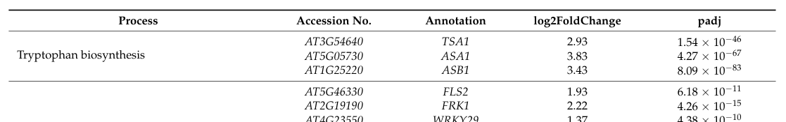

## Question

# Gene Research for Functional Annotation

## ⚠️ CRITICAL: Gene/Protein Identification Context

**BEFORE YOU BEGIN RESEARCH:** You MUST verify you are researching the CORRECT gene/protein. Gene symbols can be ambiguous, especially for less well-characterized genes from non-model organisms.

### Target Gene/Protein Identity (from UniProt):
- **UniProt Accession:** O64483
- **Protein Description:** RecName: Full=Senescence-induced receptor-like serine/threonine-protein kinase; AltName: Full=FLG22-induced receptor-like kinase 1; Flags: Precursor;
- **Gene Information:** Name=SIRK; Synonyms=FRK1; OrderedLocusNames=At2g19190; ORFNames=T20K24.21;
- **Organism (full):** Arabidopsis thaliana (Mouse-ear cress).
- **Protein Family:** Belongs to the protein kinase superfamily. Ser/Thr protein
- **Key Domains:** Kinase-like_dom_sf. (IPR011009); Leu-rich_rpt. (IPR001611); LRR_dom_sf. (IPR032675); Malectin-like_Carb-bd_dom. (IPR024788); Prot_kinase_dom. (IPR000719)

### MANDATORY VERIFICATION STEPS:

1. **Check if the gene symbol "SIRK" matches the protein description above**
2. **Verify the organism is correct:** Arabidopsis thaliana (Mouse-ear cress).
3. **Check if protein family/domains align with what you find in literature**
4. **If you find literature for a DIFFERENT gene with the same or similar symbol, STOP**

### If Gene Symbol is Ambiguous or You Cannot Find Relevant Literature:

**DO NOT PROCEED WITH RESEARCH ON A DIFFERENT GENE.** Instead:
- State clearly: "The gene symbol 'SIRK' is ambiguous or literature is limited for this specific protein"
- Explain what you found (e.g., "Found extensive literature on a different gene with the same symbol in a different organism")
- Describe the protein based ONLY on the UniProt information provided above
- Suggest that the protein function can be inferred from domain/family information

### Research Target:

Please provide a comprehensive research report on the gene **SIRK** (gene ID: FRK1, UniProt: O64483) in ARATH.

The research report should be a detailed narrative explaining the function, biological processes, and localization of the gene product. Citations should be given for all claims.

You should prioritize authoritative reviews and primary scientific literature when conducting research. You can supplement
this with annotations you find in gene/protein databases, but these can be outdated or inaccurate.

We are specifically interested in the primary function of the gene - for enzymes, what reaction is catalyzed, and what is the substrate specificity? For transporters, what is the substrate? For structural proteins or adapters, what is the broader structural role? For signaling molecules, what is the role in the pathway.

We are interested in where in or outside the cell the gene product carries out its function.

We are also interested in the signaling or biochemical pathways in which the gene functions. We are less interested in broad pleiotropic effects, except where these elucidate the precise role.

Include evidence where possible. We are interested in both experimental evidence as well as inference from structure, evolution, or bioinformatic analysis. Precise studies should be prioritized over high-throughput, where available.

## Output

Question: You are an expert researcher providing comprehensive, well-cited information.

Provide detailed information focusing on:
1. Key concepts and definitions with current understanding
2. Recent developments and latest research (prioritize 2023-2024 sources)
3. Current applications and real-world implementations
4. Expert opinions and analysis from authoritative sources
5. Relevant statistics and data from recent studies

Format as a comprehensive research report with proper citations. Include URLs and publication dates where available.
Always prioritize recent, authoritative sources and provide specific citations for all major claims.

# Gene Research for Functional Annotation

## ⚠️ CRITICAL: Gene/Protein Identification Context

**BEFORE YOU BEGIN RESEARCH:** You MUST verify you are researching the CORRECT gene/protein. Gene symbols can be ambiguous, especially for less well-characterized genes from non-model organisms.

### Target Gene/Protein Identity (from UniProt):
- **UniProt Accession:** O64483
- **Protein Description:** RecName: Full=Senescence-induced receptor-like serine/threonine-protein kinase; AltName: Full=FLG22-induced receptor-like kinase 1; Flags: Precursor;
- **Gene Information:** Name=SIRK; Synonyms=FRK1; OrderedLocusNames=At2g19190; ORFNames=T20K24.21;
- **Organism (full):** Arabidopsis thaliana (Mouse-ear cress).
- **Protein Family:** Belongs to the protein kinase superfamily. Ser/Thr protein
- **Key Domains:** Kinase-like_dom_sf. (IPR011009); Leu-rich_rpt. (IPR001611); LRR_dom_sf. (IPR032675); Malectin-like_Carb-bd_dom. (IPR024788); Prot_kinase_dom. (IPR000719)

### MANDATORY VERIFICATION STEPS:

1. **Check if the gene symbol "SIRK" matches the protein description above**
2. **Verify the organism is correct:** Arabidopsis thaliana (Mouse-ear cress).
3. **Check if protein family/domains align with what you find in literature**
4. **If you find literature for a DIFFERENT gene with the same or similar symbol, STOP**

### If Gene Symbol is Ambiguous or You Cannot Find Relevant Literature:

**DO NOT PROCEED WITH RESEARCH ON A DIFFERENT GENE.** Instead:
- State clearly: "The gene symbol 'SIRK' is ambiguous or literature is limited for this specific protein"
- Explain what you found (e.g., "Found extensive literature on a different gene with the same symbol in a different organism")
- Describe the protein based ONLY on the UniProt information provided above
- Suggest that the protein function can be inferred from domain/family information

### Research Target:

Please provide a comprehensive research report on the gene **SIRK** (gene ID: FRK1, UniProt: O64483) in ARATH.

The research report should be a detailed narrative explaining the function, biological processes, and localization of the gene product. Citations should be given for all claims.

You should prioritize authoritative reviews and primary scientific literature when conducting research. You can supplement
this with annotations you find in gene/protein databases, but these can be outdated or inaccurate.

We are specifically interested in the primary function of the gene - for enzymes, what reaction is catalyzed, and what is the substrate specificity? For transporters, what is the substrate? For structural proteins or adapters, what is the broader structural role? For signaling molecules, what is the role in the pathway.

We are interested in where in or outside the cell the gene product carries out its function.

We are also interested in the signaling or biochemical pathways in which the gene functions. We are less interested in broad pleiotropic effects, except where these elucidate the precise role.

Include evidence where possible. We are interested in both experimental evidence as well as inference from structure, evolution, or bioinformatic analysis. Precise studies should be prioritized over high-throughput, where available.

# Functional annotation of Arabidopsis SIRK/FRK1 (At2g19190)

## Identity and conclusion

**The target is the Arabidopsis thaliana gene At2g19190**, called **SIRK** (*senescence-induced receptor-like kinase*) or **FRK1** (*flg22-induced receptor-like kinase 1*). Both names designate the same gene, rather than two receptors. UniProt accession **O64483** and the additional identifier **T20K24.21** are supplied in the question; the retrieved literature independently confirms the locus, aliases, organism, and receptor-kinase classification. (ciolkowski2008studiesondnabinding pages 4-5, oelmuller2023signalsandtheir pages 14-16)

**Best-supported annotation:** FRK1 is a *putative cell-surface, malectin-like/leucine-rich-repeat receptor-like serine/threonine kinase* whose gene is activated during pattern-triggered immunity (PTI) and leaf senescence. Its established research use is as a **transcriptional readout** of signaling. The identity of a ligand perceived *by FRK1 itself*, its direct phosphorylation targets, and its indispensable physiological signaling role remain unresolved in the studies examined. Crucially, **FLS2—not FRK1—is the established flg22-recognizing receptor**: “flg22-induced” describes induction of the *FRK1* gene, not demonstrated binding of flg22 by FRK1. (yuhung2016thearabidopsismalectinlikelrrrlk pages 1-5, oelmuller2023signalsandtheir pages 14-16, ciolkowski2008studiesondnabinding pages 4-5)

The following evidence map separates observations about *FRK1 transcription* from measurements of FRK1 protein activity.

| Question/property | Evidence with study and date | Interpretation and limitation |
|---|---|---|
| Identity and architecture | Arabidopsis *SIRK/FRK1* is locus **At2g19190** and encodes a receptor kinase; a 2023 review classifies FRK1/SIRK among malectin-like–LRR receptor-like kinases (MALL-LRR-RLKs) (ciolkowski2008studiesondnabinding pages 4-5, oelmuller2023signalsandtheir pages 14-16) | Supports the identity and predicted receptor architecture of UniProt O64483. Detailed domain boundaries and the accession derive from database annotation rather than direct structural characterization in these studies. |
| Cellular location | Its precursor signal peptide, extracellular MALL/LRR region, transmembrane topology and cytoplasmic kinase domain predict a **plasma-membrane receptor** (oelmuller2023signalsandtheir pages 16-17, oelmuller2023signalsandtheir pages 14-16) | Plasma-membrane residence is a strong topology-based inference, but the examined literature did not directly localize FRK1 using a fluorescent fusion, fractionation or immunolocalization. |
| Biochemical reaction | The annotated intracellular protein-kinase domain predicts ATP-dependent transfer of phosphate to serine/threonine residues (oelmuller2023signalsandtheir pages 16-17, oelmuller2023signalsandtheir pages 14-16) | No examined study directly demonstrated FRK1 autophosphorylation, kinase kinetics, substrate specificity or a physiological protein substrate. Catalytic activity remains predicted rather than experimentally established. |
| Cognate ligand and relationship to flg22 | **FLS2**, not FRK1, recognizes bacterial flagellin/flg22; FRK1 is principally used as a downstream flg22/PTI-responsive transcript marker (yuhung2016thearabidopsismalectinlikelrrrlk pages 1-5, tobias2011identificationofreceptor pages 49-53) | No cognate extracellular ligand has been established for FRK1. “FLG22-induced receptor-like kinase” means that *FRK1* transcription is induced after flg22 perception; it does not mean FRK1 binds flg22. |
| Direct promoter regulation | Ciolkowski *et al.* (June 2008) showed by EMSA that recombinant WRKY11 binds W-box-containing AtSIRK promoter regions at −731/−705 and −47/−31 (ciolkowski2008studiesondnabinding pages 4-5) | This is direct *in vitro* DNA-binding evidence for WRKY11 regulation of the *FRK1/SIRK* promoter. It does not demonstrate FRK1 protein activation or establish promoter occupancy *in vivo*. |
| Cellotriose/CORK1 response | Tseng *et al.* (September 2022) treated Arabidopsis roots with **10 µM cellotriose for 1 h**. CORK1-dependent *FRK1* induction was log₂FC **2.22** (approximately 4.7-fold), adjusted *P* = **4.26 × 10⁻¹⁵** (tseng2022cork1alrrmalectin pages 15-17, tseng2022cork1alrrmalectin media 95ccb024) | Strong evidence that *FRK1* transcription reports cellooligomer/CORK1 signaling. It does not show that cellotriose binds FRK1 or that CORK1 physically interacts with or phosphorylates FRK1. |
| IDA–immune-pathway crosstalk | Lalun *et al.* (June 2024) found that **1 µM mature IDA** significantly induced *FRK1* after **1 h**, but not after 12 h. One-hour cotreatment with 1 µM mIDA plus 1 µM flg22 produced greater-than-additive defense-gene transcription; extracellular-domain screening also suggested FRK1–HSL2 association (lalun2024adualfunction pages 8-10, lalun2024adualfunction pages 11-13, lalun2024adualfunction pages 10-11) | Demonstrates transient *FRK1* transcriptional responsiveness and candidate receptor-network crosstalk. It does not establish IDA as an FRK1 ligand, and the high-throughput FRK1–HSL2 interaction requires targeted validation. |
| Defense priming | Sistenich *et al.* (February 2024) classified *FRK1* as a priming-readout gene: expression was weak in controls and the primed state but strongly enhanced after systemic rechallenge of primed plants (three experiments, two plants each) (sistenich2024markerandreadout pages 4-6, sistenich2024markerandreadout pages 1-2, sistenich2024markerandreadout pages 9-10) | Supports practical use of *FRK1* transcript abundance as a defense-priming readout. The study did not test an *frk1* knockout or show that FRK1 is required for systemic acquired resistance; that functional phenotype was demonstrated for **NHL25**, not FRK1. |

*Table: Evidence for the identity, inferred molecular properties and experimentally observed transcriptional responses of Arabidopsis At2g19190/O64483. The table distinguishes direct findings from predictions and prevents downstream FRK1 expression from being mistaken for ligand recognition or demonstrated kinase function.*

## Molecular function and site of action

The domain annotation supplied for O64483 comprises a malectin-like carbohydrate-binding-domain **fold**, leucine-rich repeats, and a protein-kinase domain; the 2023 review independently places FRK1 among Arabidopsis **MALL–LRR receptor-like kinases**. This architecture predicts an extracellular recognition region, a membrane-spanning segment, and a cytoplasmic kinase region. Accordingly, the **plasma membrane is the most plausible site of FRK1 action**, with its extracellular region facing the apoplast and its catalytic region facing the cytosol. This is a topology-based assignment, **not a direct FRK1-specific imaging result** from the literature examined. The malectin-like designation likewise does not establish that FRK1 binds a particular sugar. (oelmuller2023signalsandtheir pages 16-17, oelmuller2023signalsandtheir pages 14-16)

If catalytically active, FRK1 would be expected to catalyze transfer of the terminal phosphate of ATP to protein serine/threonine residues, as implied by its annotated kinase family. **An FRK1-specific enzyme assay, demonstrated autophosphorylation, physiological phosphoprotein substrate, kinetic specificity, or cognate extracellular ligand was not established by the sources retrieved.** It would therefore be unjustified to assign cellotriose, flg22, or IDA as its substrate or ligand. The distinction is experimentally important: cellotriose perception is attributed to **CORK1/IGP1**, whereas the receptor for flagellin-derived flg22 is **FLS2**. Findings for these related receptors cannot be transferred to FRK1 merely because all are involved in plant signaling. (yuhung2016thearabidopsismalectinlikelrrrlk pages 1-5, oelmuller2023signalsandtheir pages 16-17, oelmuller2023signalsandtheir pages 14-16, gandhi2024cellooligomercellooligomerreceptorkinase1 pages 4-7)

One protein-level lead appeared in a **2024** study of the cell-separation signal IDA. Its discussion of a previously available, high-throughput extracellular-domain interaction dataset reports that FRK1 associated mainly with **HSL2**, an IDA-pathway receptor. This suggests a possible receptor-network connection, but is not evidence that FRK1 perceives IDA, forms a functional complex with HSL2 *in planta*, or phosphorylates HSL2; targeted validation and an *frk1* functional experiment would be needed. (lalun2024adualfunction pages 11-13)

## Biological pathways and regulation

**Flagellin-responsive immunity.** FLS2 perception of flg22 initiates PTI, including MAP-kinase-dependent changes in defense-gene expression; *FRK1* is a widely used early transcript readout of this response. Its induction is observed downstream of other immune-signaling proteins, including the malectin-like receptor kinase IOS1. In IOS1 mutants, delayed *FRK1* induction accompanies impaired PTI outputs, but this tests **IOS1’s influence on the FRK1 marker**, not FRK1’s receptor activity. Likewise, a SIF2 perturbation study measured lower *FRK1* expression in *sif2* mutants and higher expression in SIF2-overexpressing plants, especially after the bacterial elicitor elf18. Its proposed SIF2–BAK1–MAPK–WRKY route is a model for upstream signaling, not a demonstrated FRK1 phosphorylation pathway. (yuhung2016thearabidopsismalectinlikelrrrlk pages 1-5, oelmuller2023signalsandtheir pages 14-16, yuan2018stressinducedfactor pages 17-19)

**Promoter-level mechanism.** WRKY transcription factors offer a more precise explanation for FRK1’s immune- and age-responsive expression than does its protein name alone. A **2008** electrophoretic mobility-shift study directly showed recombinant **WRKY11** binding W-box-containing *SIRK/FRK1* promoter fragments spanning positions **−731 to −705** and **−47 to −31**. This is direct *in-vitro* promoter-binding evidence, although it does not establish promoter occupancy in living plants. Earlier infection experiments found *FRK1/SIRK* especially upregulated in the **wrky11** mutant after *Pseudomonas syringae* inoculation; the different response of the **wrky11 wrky17** double mutant indicates context-dependent WRKY11/WRKY17 regulation rather than a simple one-factor mechanism. WRKY6 is also linked to increased SIRK expression during senescence, but the evidence cited here should not be mistaken for a FRK1-protein biochemical assay. (haffner2015keepingcontrolthe pages 8-10, ciolkowski2008studiesondnabinding pages 4-5, journotcatalino2006thetranscriptionfactors pages 6-7)

**Senescence.** The name *SIRK* reflects elevated *At2g19190* expression during leaf senescence, as well as after pathogen challenge. Its position in the malectin-like receptor family makes communication between extracellular cell-wall status and defense/developmental signaling a plausible hypothesis. However, senescence-associated expression does **not** by itself demonstrate that the FRK1 protein initiates senescence or directly senses cell-wall breakdown products. In particular, findings that **CORK1** responds to cellooligomers belong to CORK1, not automatically to FRK1. (oelmuller2023signalsandtheir pages 16-17, oelmuller2023signalsandtheir pages 14-16, ciolkowski2008studiesondnabinding pages 4-5)

## Recent results and quantitative evidence

A **September 2022** primary study provides a particularly clear numerical measure of *FRK1* as a downstream response. One hour after treatment of Arabidopsis roots with **10 µM cellotriose**, *FRK1* (At2g19190) had **log₂ fold change 2.22**—approximately **4.7-fold**—relative to water-treated controls, with adjusted **P = 4.26 × 10⁻¹⁵**. Across the experiment, **561 genes** were induced in a CORK1-dependent manner, compared with only **two significantly induced genes** in the homozygous *cork1* material. The result supports CORK1-dependent *FRK1 transcription*, **not** cellotriose recognition or kinase activation by FRK1. The FRK1 value was checked against the paper’s Table 1. [Tseng *et al.*, *Cells*, September 2022; https://doi.org/10.3390/cells11192960.] (tseng2022cork1alrrmalectin pages 15-17, tseng2022cork1alrrmalectin media 95ccb024)

In a **February 2024** Arabidopsis study of systemic immunity following *Pseudomonas cannabina* pv. *alisalensis* exposure, *FRK1* was classified as a **defense-priming readout**: expression was comparatively weak in the tested control or primed-but-unchallenged conditions and intensified after a systemic rechallenge of primed plants. The reported RT-qPCR validation used **three independent experiments with two plants each**. A predicted priming network placed FRK1 among connected candidate proteins, but those network edges require experimental confirmation. Importantly, impairment of defense priming and systemic acquired resistance was demonstrated for **NHL25** mutants, **not for an *frk1* mutant**. [Sistenich *et al.*, *Scientific Reports*, February 2024; https://doi.org/10.1038/s41598-024-53982-5.] (sistenich2024markerandreadout pages 4-6, sistenich2024markerandreadout pages 1-2, sistenich2024markerandreadout pages 9-10, sistenich2024markerandreadout pages 6-7)

A study indexed in **June 2024** explored crosstalk with the developmental peptide **IDA**. In seven-day-old seedlings, **1 µM mature IDA** significantly elevated *FRK1* transcripts after **1 hour**, but the elevation was **not significant after 12 hours**. One-hour cotreatment with **1 µM IDA and 1 µM flg22** produced an enhanced defense-gene transcriptional response beyond the authors’ simple additive expectation; analogous IDA–PIP1 cotreatment did **not** enhance *FRK1* transcription. The result broadens the conditions in which *FRK1* serves as an immune/developmental readout, but does not establish FRK1 as an IDA receptor. The article’s PDF identifies itself as an **eLife 2023, volume 12** research article, so its volume year and its **June 2024** indexing date should not be conflated. [Lalun *et al.*, *eLife* 12, indexed June 2024; https://doi.org/10.7554/eLife.87912.] (lalun2024adualfunction pages 11-13, lalun2024adualfunction pages 10-11, lalun2024adualfunction pages 8-10)

The **2023** review provides the interpretive boundary for these developments: FRK1 belongs to a malectin-like–LRR kinase class whose members often have immune or stress-associated expression, but much less is known about this class’s individual molecular mechanisms. That family-level analysis supports **candidate receptor function**, not a proven FRK1 ligand or cell-wall surveillance reaction. [Oelmüller *et al.*, *International Journal of Molecular Sciences*, April 2023; https://doi.org/10.3390/ijms24087417.] (oelmuller2023signalsandtheir pages 16-17, oelmuller2023signalsandtheir pages 14-16)

## Research applications and annotation confidence

In current laboratory practice, *FRK1* RT-qPCR or an *FRK1*-promoter–luciferase reporter is useful for assessing **early immune transcription**, comparing pattern-elicitor responses, and reading out **defense priming after rechallenge**. For example, the CORK1 study used a *pFRK1::LUC* assay as a response reporter, while the 2024 priming study used FRK1 transcript abundance to distinguish immune states. These are **experimental assays in Arabidopsis**, not evidence of an established FRK1-based crop intervention. (sistenich2024markerandreadout pages 4-6, tseng2022cork1alrrmalectina pages 8-9, tseng2022cork1alrrmalectin pages 7-8)

**Confidence is high** for gene identity, predicted receptor-kinase family, and stress-responsive transcription; **moderate** for plasma-membrane residence as an inference from receptor topology; and **low/undetermined** for FRK1’s own ligand, catalytic competence, direct substrate specificity, and causal contribution to immunity or senescence. A decisive functional annotation would require FRK1-specific localization and kinase assays, ligand-binding tests, and *frk1* loss-of-function/complementation phenotypes rather than relying solely on *FRK1* expression as a readout. (oelmuller2023signalsandtheir pages 14-16, yuhung2016thearabidopsismalectinlikelrrrlk pages 1-5, sistenich2024markerandreadout pages 1-2)

References

1. (ciolkowski2008studiesondnabinding pages 4-5): Ingo Ciolkowski, Dierk Wanke, Rainer P. Birkenbihl, and Imre E. Somssich. Studies on dna-binding selectivity of wrky transcription factors lend structural clues into wrky-domain function. Plant Molecular Biology, 68:81-92, Jun 2008. URL: https://doi.org/10.1007/s11103-008-9353-1, doi:10.1007/s11103-008-9353-1. This article has 518 citations and is from a peer-reviewed journal.

2. (oelmuller2023signalsandtheir pages 14-16): Ralf Oelmüller, Yu-Heng Tseng, and Akanksha Gandhi. Signals and their perception for remodelling, adjustment and repair of the plant cell wall. International Journal of Molecular Sciences, 24:7417, Apr 2023. URL: https://doi.org/10.3390/ijms24087417, doi:10.3390/ijms24087417. This article has 35 citations.

3. (yuhung2016thearabidopsismalectinlikelrrrlk pages 1-5): Yu-Hung Yeh, Dario Panzeri, Yasuhiro Kadota, Yi-Chun Huang, Pin-Yao Huang, Chia-Nan Tao, Milena Roux, Hsiao-Chiao Chien, Tzu-Chuan Chin, Po-Wei Chu, Cyril Zipfel, and Laurent Zimmerli. The arabidopsis malectin-like/lrr-rlk ios1 is critical for bak1-dependent and bak1-independent pattern-triggered immunity. Plant Cell, 28:1701-1721, Jun 2016. URL: https://doi.org/10.1105/tpc.16.00313, doi:10.1105/tpc.16.00313. This article has 188 citations and is from a highest quality peer-reviewed journal.

4. (oelmuller2023signalsandtheir pages 16-17): Ralf Oelmüller, Yu-Heng Tseng, and Akanksha Gandhi. Signals and their perception for remodelling, adjustment and repair of the plant cell wall. International Journal of Molecular Sciences, 24:7417, Apr 2023. URL: https://doi.org/10.3390/ijms24087417, doi:10.3390/ijms24087417. This article has 35 citations.

5. (tobias2011identificationofreceptor pages 49-53): Tobias Mentzel. Identification of receptor complex components and receptor activation mechanisms in plant innate immunity. ArXiv, 2011. URL: https://doi.org/10.5451/unibas-005640220, doi:10.5451/unibas-005640220. This article has 0 citations.

6. (tseng2022cork1alrrmalectin pages 15-17): Yu-Heng Tseng, Sandra S. Scholz, Judith Fliegmann, Thomas Krüger, Akanksha Gandhi, Alexandra C. U. Furch, Olaf Kniemeyer, Axel A. Brakhage, and Ralf Oelmüller. Cork1, a lrr-malectin receptor kinase, is required for cellooligomer-induced responses in arabidopsis thaliana. Cells, 11:2960, Sep 2022. URL: https://doi.org/10.3390/cells11192960, doi:10.3390/cells11192960. This article has 67 citations.

7. (tseng2022cork1alrrmalectin media 95ccb024): Yu-Heng Tseng, Sandra S. Scholz, Judith Fliegmann, Thomas Krüger, Akanksha Gandhi, Alexandra C. U. Furch, Olaf Kniemeyer, Axel A. Brakhage, and Ralf Oelmüller. Cork1, a lrr-malectin receptor kinase, is required for cellooligomer-induced responses in arabidopsis thaliana. Cells, 11:2960, Sep 2022. URL: https://doi.org/10.3390/cells11192960, doi:10.3390/cells11192960. This article has 67 citations.

8. (lalun2024adualfunction pages 8-10): Vilde Olsson Lalun, Maike Breiden, Sergio Galindo-Trigo, Elwira Smakowska-Luzan, Rüdiger GW Simon, and Melinka A Butenko. A dual function of the ida peptide in regulating cell separation and modulating plant immunity at the molecular level. eLife, Jun 2024. URL: https://doi.org/10.7554/elife.87912, doi:10.7554/elife.87912. This article has 35 citations and is from a domain leading peer-reviewed journal.

9. (lalun2024adualfunction pages 11-13): Vilde Olsson Lalun, Maike Breiden, Sergio Galindo-Trigo, Elwira Smakowska-Luzan, Rüdiger GW Simon, and Melinka A Butenko. A dual function of the ida peptide in regulating cell separation and modulating plant immunity at the molecular level. eLife, Jun 2024. URL: https://doi.org/10.7554/elife.87912, doi:10.7554/elife.87912. This article has 35 citations and is from a domain leading peer-reviewed journal.

10. (lalun2024adualfunction pages 10-11): Vilde Olsson Lalun, Maike Breiden, Sergio Galindo-Trigo, Elwira Smakowska-Luzan, Rüdiger GW Simon, and Melinka A Butenko. A dual function of the ida peptide in regulating cell separation and modulating plant immunity at the molecular level. eLife, Jun 2024. URL: https://doi.org/10.7554/elife.87912, doi:10.7554/elife.87912. This article has 35 citations and is from a domain leading peer-reviewed journal.

11. (sistenich2024markerandreadout pages 4-6): Andrea J. Sistenich, Lisa Maria Fürtauer, Franziska Scheele, and Uwe Conrath. Marker and readout genes for defense priming in pseudomonas cannabina pv. alisalensis interaction aid understanding systemic immunity in arabidopsis. Scientific Reports, Feb 2024. URL: https://doi.org/10.1038/s41598-024-53982-5, doi:10.1038/s41598-024-53982-5. This article has 11 citations and is from a peer-reviewed journal.

12. (sistenich2024markerandreadout pages 1-2): Andrea J. Sistenich, Lisa Maria Fürtauer, Franziska Scheele, and Uwe Conrath. Marker and readout genes for defense priming in pseudomonas cannabina pv. alisalensis interaction aid understanding systemic immunity in arabidopsis. Scientific Reports, Feb 2024. URL: https://doi.org/10.1038/s41598-024-53982-5, doi:10.1038/s41598-024-53982-5. This article has 11 citations and is from a peer-reviewed journal.

13. (sistenich2024markerandreadout pages 9-10): Andrea J. Sistenich, Lisa Maria Fürtauer, Franziska Scheele, and Uwe Conrath. Marker and readout genes for defense priming in pseudomonas cannabina pv. alisalensis interaction aid understanding systemic immunity in arabidopsis. Scientific Reports, Feb 2024. URL: https://doi.org/10.1038/s41598-024-53982-5, doi:10.1038/s41598-024-53982-5. This article has 11 citations and is from a peer-reviewed journal.

14. (gandhi2024cellooligomercellooligomerreceptorkinase1 pages 4-7): Akanksha Gandhi, Michael Reichelt, Alexandra Furch, Axel Mithöfer, and Ralf Oelmüller. Cellooligomer/cellooligomer receptor kinase1 signaling exhibits crosstalk with pamp-triggered immune responses and sugar metabolism in arabidopsis roots. International Journal of Molecular Sciences, 25:3472, Mar 2024. URL: https://doi.org/10.3390/ijms25063472, doi:10.3390/ijms25063472. This article has 15 citations.

15. (yuan2018stressinducedfactor pages 17-19): Ning Yuan, Shuangrong Yuan, Zhigang Li, Man Zhou, Peipei Wu, Qian Hu, Venugopal Mendu, Liangjiang Wang, and Hong Luo. Stress induced factor 2, a leucine-rich repeat kinase regulates basal plant pathogen defense1[open]. Plant Physiology, 176:3062-3080, Feb 2018. URL: https://doi.org/10.1104/pp.17.01266, doi:10.1104/pp.17.01266. This article has 63 citations and is from a highest quality peer-reviewed journal.

16. (haffner2015keepingcontrolthe pages 8-10): Eva Häffner, Sandra Konietzki, and Elke Diederichsen. Keeping control: the role of senescence and development in plant pathogenesis and defense. Plants, 4:449-488, Jul 2015. URL: https://doi.org/10.3390/plants4030449, doi:10.3390/plants4030449. This article has 107 citations.

17. (journotcatalino2006thetranscriptionfactors pages 6-7): Noëllie Journot-Catalino, I. Somssich, D. Roby, and T. Kroj. The transcription factors wrky11 and wrky17 act as negative regulators of basal resistance in arabidopsis thaliana[w][oa]. The Plant Cell Online, 18:3289-3302, Nov 2006. URL: https://doi.org/10.1105/tpc.106.044149, doi:10.1105/tpc.106.044149. This article has 578 citations.

18. (sistenich2024markerandreadout pages 6-7): Andrea J. Sistenich, Lisa Maria Fürtauer, Franziska Scheele, and Uwe Conrath. Marker and readout genes for defense priming in pseudomonas cannabina pv. alisalensis interaction aid understanding systemic immunity in arabidopsis. Scientific Reports, Feb 2024. URL: https://doi.org/10.1038/s41598-024-53982-5, doi:10.1038/s41598-024-53982-5. This article has 11 citations and is from a peer-reviewed journal.

19. (tseng2022cork1alrrmalectina pages 8-9): Yu-Heng Tseng, Sandra S. Scholz, Judith Fliegmann, Thomas Krüger, Akanksha Gandhi, Olaf Kniemeyer, Axel A. Brakhage, and Ralf Oelmüller. Cork1, a lrr-malectin receptor kinase for cellooligomer perception in <i>arabidopsis thaliana</i>. BioRxiv, May 2022. URL: https://doi.org/10.1101/2022.04.29.490029, doi:10.1101/2022.04.29.490029. This article has 5 citations.

20. (tseng2022cork1alrrmalectin pages 7-8): Yu-Heng Tseng, Sandra S. Scholz, Judith Fliegmann, Thomas Krüger, Akanksha Gandhi, Alexandra C. U. Furch, Olaf Kniemeyer, Axel A. Brakhage, and Ralf Oelmüller. Cork1, a lrr-malectin receptor kinase, is required for cellooligomer-induced responses in arabidopsis thaliana. Cells, 11:2960, Sep 2022. URL: https://doi.org/10.3390/cells11192960, doi:10.3390/cells11192960. This article has 67 citations.

## Artifacts

- [Edison artifact artifact-00](FRK1-deep-research-falcon_artifacts/artifact-00.md)

## Citations

1. ciolkowski2008studiesondnabinding pages 4-5
2. lalun2024adualfunction pages 11-13
3. oelmuller2023signalsandtheir pages 14-16
4. yuhung2016thearabidopsismalectinlikelrrrlk pages 1-5
5. oelmuller2023signalsandtheir pages 16-17
6. tobias2011identificationofreceptor pages 49-53
7. lalun2024adualfunction pages 8-10
8. lalun2024adualfunction pages 10-11
9. sistenich2024markerandreadout pages 4-6
10. sistenich2024markerandreadout pages 1-2
11. sistenich2024markerandreadout pages 9-10
12. yuan2018stressinducedfactor pages 17-19
13. haffner2015keepingcontrolthe pages 8-10
14. journotcatalino2006thetranscriptionfactors pages 6-7
15. sistenich2024markerandreadout pages 6-7
16. Tseng *et al.*, *Cells*, September 2022; https://doi.org/10.3390/cells11192960.
17. Sistenich *et al.*, *Scientific Reports*, February 2024; https://doi.org/10.1038/s41598-024-53982-5.
18. Lalun *et al.*, *eLife* 12, indexed June 2024; https://doi.org/10.7554/eLife.87912.
19. Oelmüller *et al.*, *International Journal of Molecular Sciences*, April 2023; https://doi.org/10.3390/ijms24087417.
20. open
21. w
22. oa
23. https://doi.org/10.3390/cells11192960.]
24. https://doi.org/10.1038/s41598-024-53982-5.]
25. https://doi.org/10.7554/eLife.87912.]
26. https://doi.org/10.3390/ijms24087417.]
27. https://doi.org/10.1007/s11103-008-9353-1,
28. https://doi.org/10.3390/ijms24087417,
29. https://doi.org/10.1105/tpc.16.00313,
30. https://doi.org/10.5451/unibas-005640220,
31. https://doi.org/10.3390/cells11192960,
32. https://doi.org/10.7554/elife.87912,
33. https://doi.org/10.1038/s41598-024-53982-5,
34. https://doi.org/10.3390/ijms25063472,
35. https://doi.org/10.1104/pp.17.01266,
36. https://doi.org/10.3390/plants4030449,
37. https://doi.org/10.1105/tpc.106.044149,
38. https://doi.org/10.1101/2022.04.29.490029,