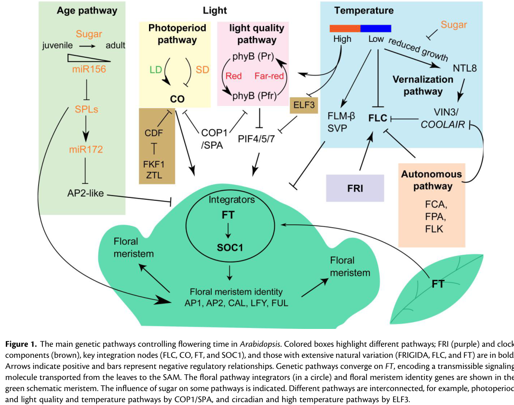

## Question

# Gene Research for Functional Annotation

## ⚠️ CRITICAL: Gene/Protein Identification Context

**BEFORE YOU BEGIN RESEARCH:** You MUST verify you are researching the CORRECT gene/protein. Gene symbols can be ambiguous, especially for less well-characterized genes from non-model organisms.

### Target Gene/Protein Identity (from UniProt):
- **UniProt Accession:** Q9SXZ2
- **Protein Description:** RecName: Full=Protein FLOWERING LOCUS T {ECO:0000303|PubMed:10583960};
- **Gene Information:** Name=FT {ECO:0000303|PubMed:10583960}; OrderedLocusNames=At1g65480 {ECO:0000312|Araport:AT1G65480}; ORFNames=F5I14.3 {ECO:0000312|EMBL:AAB60904.1};
- **Organism (full):** Arabidopsis thaliana (Mouse-ear cress).
- **Protein Family:** Belongs to the phosphatidylethanolamine-binding protein
- **Key Domains:** PEBP. (IPR008914); PEBP-like_sf. (IPR036610); PEBP_euk. (IPR035810); Phosphatidylethanolamine-bd_CS. (IPR001858); PBP (PF01161)

### MANDATORY VERIFICATION STEPS:

1. **Check if the gene symbol "FT" matches the protein description above**
2. **Verify the organism is correct:** Arabidopsis thaliana (Mouse-ear cress).
3. **Check if protein family/domains align with what you find in literature**
4. **If you find literature for a DIFFERENT gene with the same or similar symbol, STOP**

### If Gene Symbol is Ambiguous or You Cannot Find Relevant Literature:

**DO NOT PROCEED WITH RESEARCH ON A DIFFERENT GENE.** Instead:
- State clearly: "The gene symbol 'FT' is ambiguous or literature is limited for this specific protein"
- Explain what you found (e.g., "Found extensive literature on a different gene with the same symbol in a different organism")
- Describe the protein based ONLY on the UniProt information provided above
- Suggest that the protein function can be inferred from domain/family information

### Research Target:

Please provide a comprehensive research report on the gene **FT** (gene ID: FT, UniProt: Q9SXZ2) in ARATH.

The research report should be a detailed narrative explaining the function, biological processes, and localization of the gene product. Citations should be given for all claims.

You should prioritize authoritative reviews and primary scientific literature when conducting research. You can supplement
this with annotations you find in gene/protein databases, but these can be outdated or inaccurate.

We are specifically interested in the primary function of the gene - for enzymes, what reaction is catalyzed, and what is the substrate specificity? For transporters, what is the substrate? For structural proteins or adapters, what is the broader structural role? For signaling molecules, what is the role in the pathway.

We are interested in where in or outside the cell the gene product carries out its function.

We are also interested in the signaling or biochemical pathways in which the gene functions. We are less interested in broad pleiotropic effects, except where these elucidate the precise role.

Include evidence where possible. We are interested in both experimental evidence as well as inference from structure, evolution, or bioinformatic analysis. Precise studies should be prioritized over high-throughput, where available.

## Output

Question: You are an expert researcher providing comprehensive, well-cited information.

Provide detailed information focusing on:
1. Key concepts and definitions with current understanding
2. Recent developments and latest research (prioritize 2023-2024 sources)
3. Current applications and real-world implementations
4. Expert opinions and analysis from authoritative sources
5. Relevant statistics and data from recent studies

Format as a comprehensive research report with proper citations. Include URLs and publication dates where available.
Always prioritize recent, authoritative sources and provide specific citations for all major claims.

# Gene Research for Functional Annotation

## ⚠️ CRITICAL: Gene/Protein Identification Context

**BEFORE YOU BEGIN RESEARCH:** You MUST verify you are researching the CORRECT gene/protein. Gene symbols can be ambiguous, especially for less well-characterized genes from non-model organisms.

### Target Gene/Protein Identity (from UniProt):
- **UniProt Accession:** Q9SXZ2
- **Protein Description:** RecName: Full=Protein FLOWERING LOCUS T {ECO:0000303|PubMed:10583960};
- **Gene Information:** Name=FT {ECO:0000303|PubMed:10583960}; OrderedLocusNames=At1g65480 {ECO:0000312|Araport:AT1G65480}; ORFNames=F5I14.3 {ECO:0000312|EMBL:AAB60904.1};
- **Organism (full):** Arabidopsis thaliana (Mouse-ear cress).
- **Protein Family:** Belongs to the phosphatidylethanolamine-binding protein
- **Key Domains:** PEBP. (IPR008914); PEBP-like_sf. (IPR036610); PEBP_euk. (IPR035810); Phosphatidylethanolamine-bd_CS. (IPR001858); PBP (PF01161)

### MANDATORY VERIFICATION STEPS:

1. **Check if the gene symbol "FT" matches the protein description above**
2. **Verify the organism is correct:** Arabidopsis thaliana (Mouse-ear cress).
3. **Check if protein family/domains align with what you find in literature**
4. **If you find literature for a DIFFERENT gene with the same or similar symbol, STOP**

### If Gene Symbol is Ambiguous or You Cannot Find Relevant Literature:

**DO NOT PROCEED WITH RESEARCH ON A DIFFERENT GENE.** Instead:
- State clearly: "The gene symbol 'FT' is ambiguous or literature is limited for this specific protein"
- Explain what you found (e.g., "Found extensive literature on a different gene with the same symbol in a different organism")
- Describe the protein based ONLY on the UniProt information provided above
- Suggest that the protein function can be inferred from domain/family information

### Research Target:

Please provide a comprehensive research report on the gene **FT** (gene ID: FT, UniProt: Q9SXZ2) in ARATH.

The research report should be a detailed narrative explaining the function, biological processes, and localization of the gene product. Citations should be given for all claims.

You should prioritize authoritative reviews and primary scientific literature when conducting research. You can supplement
this with annotations you find in gene/protein databases, but these can be outdated or inaccurate.

We are specifically interested in the primary function of the gene - for enzymes, what reaction is catalyzed, and what is the substrate specificity? For transporters, what is the substrate? For structural proteins or adapters, what is the broader structural role? For signaling molecules, what is the role in the pathway.

We are interested in where in or outside the cell the gene product carries out its function.

We are also interested in the signaling or biochemical pathways in which the gene functions. We are less interested in broad pleiotropic effects, except where these elucidate the precise role.

Include evidence where possible. We are interested in both experimental evidence as well as inference from structure, evolution, or bioinformatic analysis. Precise studies should be prioritized over high-throughput, where available.

## Research report: Functional annotation of **FLOWERING LOCUS T (FT)** in *Arabidopsis thaliana* (UniProt **Q9SXZ2**, locus **At1g65480**)

### 1) Verification of correct gene/protein identity (mandatory disambiguation)
The target protein is **FLOWERING LOCUS T (FT)** from *Arabidopsis thaliana*, consistently described in recent authoritative literature as the canonical **florigen** and a member of the **phosphatidylethanolamine-binding protein (PEBP)** family. FT is produced in leaf vasculature (phloem companion cells) and acts at the shoot apical meristem (SAM) to induce flowering, matching the UniProt entry Q9SXZ2 and the expected PEBP-family context. (takagi2023photoperiodicfloweringin pages 1-2, maple2024floweringtimefrom pages 2-4, colleoni2024floweringtimegenes pages 1-2)

### 2) Key concepts and current understanding (definitions, mechanism, localization)

#### 2.1 Florigen and FT as a systemic flowering signal
“Florigen” is now operationally equated with FT-family proteins in many flowering plants. In *Arabidopsis*, **FT encodes a mobile protein signal** produced in leaves that is transported to the SAM, where it triggers the vegetative-to-reproductive phase transition. (tsuji2024thefunctionof pages 1-2, takagi2023photoperiodicfloweringin pages 1-2, maple2024floweringtimefrom pages 2-4)

#### 2.2 Primary molecular function of FT (what the protein does)
FT is **not an enzyme** and does not catalyze a chemical reaction. Instead, it functions as a **mobile signaling protein/transcriptional co-regulator** that promotes flowering by forming protein complexes at the SAM with DNA-binding transcription factors. Reviews emphasize that PEBP-family proteins such as FT do **not bind DNA directly**, but act through interaction with transcriptional regulators such as bZIP factors in the FD class. (colleoni2024floweringtimegenes pages 1-2, maple2024floweringtimefrom pages 2-4)

#### 2.3 Tissue, cellular, and subcellular route: where FT is made and where it acts
**Source tissue (production):** FT expression is activated in leaf **phloem companion cells (CCs)** under inductive conditions (notably long days), and the **FT protein is loaded into sieve elements (SEs)** for phloem transport. (takagi2023photoperiodicfloweringin pages 1-2, maple2024floweringtimefrom pages 2-4)

**Long-distance transport route:** Once in the SEs, FT traffics through the **phloem stream** to the shoot. This movement is considered regulated, not a simple diffusion process. (maple2024floweringtimefrom pages 2-4)

**Site of action:** At the **shoot apical meristem**, FT participates in complexes that reprogram gene expression toward floral fate, including activation of floral meristem identity programs. (martignago2023thebziptranscription pages 1-2, takagi2023photoperiodicfloweringin pages 1-2, maple2024floweringtimefrom pages 2-4)

A current synthesis of the pathway architecture (including FT as a convergent integrator and the leaf→SAM signaling concept) is visually summarized in Maple et al. 2024 (Fig. 1), which depicts converging pathways regulating FT and the downstream activation of floral identity genes at the SAM. (maple2024floweringtimefrom media c4f89fee)

#### 2.4 Protein complexes and key interactors: how FT induces flowering at the SAM
A widely accepted current model is that FT induces flowering by forming a **“florigen activation complex”** that includes:
- **FT** (the mobile PEBP-family florigen),
- **FD and FD-related bZIP transcription factors**, and
- **14-3-3 proteins**.
This complex promotes transcriptional changes leading to floral induction. (maple2024floweringtimefrom pages 2-4, tsuji2024thefunctionof pages 6-7)

The antagonistic PEBP-family member **TFL1** is described as opposing FT function at shared FD-bound targets, effectively tuning floral induction by competition at the SAM. (maple2024floweringtimefrom pages 2-4)

### 3) Recent developments and latest research (prioritized 2023–2024)

#### 3.1 Refinements in FT transport control: regulated trafficking machinery
Recent reviews emphasize that FT’s leaf-to-phloem export and long-distance movement are **actively controlled by specific trafficking components**, refining earlier “FT simply moves in phloem” models:
- **FTIP1**: an ER membrane protein implicated in CC→SE movement via a continuous ER network across plasmodesmata. (maple2024floweringtimefrom pages 2-4)
- **QKY and SYP121**: described as facilitating export via an **MCTP–SNARE/endosomal trafficking** route from CCs to SEs. (maple2024floweringtimefrom pages 2-4)
- **NaKR1**: a heavy metal–associated domain protein described as regulating long-distance FT trafficking in the phloem stream. (maple2024floweringtimefrom pages 2-4)

These elements are presented as key mechanistic refinements in 2024 syntheses of flowering-time mechanisms. (maple2024floweringtimefrom pages 2-4)

#### 3.2 Quantitative transport timing and localization at the SAM
A 2024 review summarizes grafting/induction evidence indicating that leaf-produced FT can reach the SAM on the order of **~12 hours**, supporting a rapid systemic signaling role. (tsuji2024thefunctionof pages 5-6)

#### 3.3 Expansion of FT-responsive bZIP network at the SAM (primary research)
A 2023 primary study (PLOS Genetics) refines the classical “FT acts via FD” concept by showing that the bZIP transcription factor **AREB3** is expressed at the SAM in a pattern overlapping FD and **contributes redundantly to FT signaling**. Genetic analyses indicate that multiple florigen-interacting bZIPs (including FD, AREB3, and additional bZIPs such as FDP) can act redundantly in the SAM, implying FT signaling is distributed across a small bZIP network rather than a single obligate partner. (martignago2023thebziptranscription pages 1-2)

#### 3.4 Updated understanding of environmental integration upstream of FT
A 2023 dedicated review describes FT expression as having a **distinct spatiotemporal pattern** in long-day laboratory conditions: high expression in distal leaf phloem companion cells and a dusk peak under **16 h light/8 h dark** long days. FT induction correlates with flowering when day length exceeds **~12 hours** and is described as dosage-dependent. (takagi2023photoperiodicfloweringin pages 1-2)

A 2024 synthesis also highlights additional environmental integration routes such as elevated temperature signaling through **PIF4/PIF5/PIF7**, with an exemplar warm condition of **27 °C** promoting induction of the upstream module that drives FT. (maple2024floweringtimefrom pages 2-4)

### 4) Current applications and real-world implementations (2023–2024)

#### 4.1 Flowering-time and architecture engineering via FT/TFL1 editing (quantitative 2024 example)
A 2024 Plant Molecular Biology study demonstrates a practical breeding-oriented application: multiplex **CRISPR/Cas9** editing of **FT and TFL1 family paralogs** in petunia to generate compact, early-flowering plants. Quantitative results reported include:
- **Earlier flowering:** edited PhTFL1 knockout lines flowered **~18.5 days earlier** than wild type.
- **Compactness:** PhTFL1 knockout internodes **~8.5–8.9 cm** vs wild type **~13.18–15.5 cm**.
- **Branching:** PhTFL1 knockout **~11 branches**, PhFT knockout **~13.5 branches**, vs wild type **~5.5 branches**.
These trait shifts align with commercial ornamental needs (compact growth, reduced reliance on growth regulators, faster flowering). (abdulla2024crisprcas9mediatedmutagenesisof pages 8-11)

While this is not *Arabidopsis* FT per se, it is a direct real-world implementation of the conserved FT/TFL1–PEBP module that was discovered and mechanistically dissected in *Arabidopsis*. (colleoni2024floweringtimegenes pages 1-2, abdulla2024crisprcas9mediatedmutagenesisof pages 8-11)

#### 4.2 Broader flowering-time engineering strategies and expert synthesis (2023)
A 2023 review on CRISPR applications in flowering-time engineering compiles numerous published cases (across crops and ornamentals) targeting FT/FT-like genes and related regulators. It highlights the feasibility of both gene knockout and targeted sequence edits (including amino-acid swaps known to invert FT/TFL1-like behavior), and it emphasizes practical considerations such as pleiotropy and the value of **cis-regulatory tuning** rather than complete loss-of-function of central mobile signals. (hodaei2023unlockingnature’sclock pages 8-9, hodaei2023unlockingnature’sclock pages 4-6)

### 5) Expert opinions/analysis and open questions
Recent authoritative reviews converge on several expert-level interpretations:

1. **FT is central but not acting alone:** While FT is a pivotal “integrator” and systemic signal, multiple regulatory layers govern (i) its transcriptional induction in leaf phloem tissues and (ii) its transport competence. (takagi2023photoperiodicfloweringin pages 1-2, maple2024floweringtimefrom pages 2-4)

2. **Trafficking is a key control point:** Current models emphasize that CC→SE export and long-distance movement depend on specialized components (FTIP1, QKY, SYP121, NaKR1), suggesting FT signaling capacity can be tuned at the level of intracellular/vascular trafficking as well as transcription. (maple2024floweringtimefrom pages 2-4, colleoni2024floweringtimegenes pages 2-4)

3. **Mechanism at the SAM is modular:** The florigen activation complex concept (FT + FD-class bZIPs + 14-3-3) is an organizing principle, but experimental genetics in 2023 indicate **redundancy among bZIP partners** (e.g., AREB3), arguing for a more distributed decoding module at the apex. (martignago2023thebziptranscription pages 1-2, maple2024floweringtimefrom pages 2-4)

4. **Unloading/post-phloem movement remains less resolved:** A 2024 synthesis notes that, despite progress on CC→SE export and phloem trafficking, how FT is unloaded and moved after phloem delivery to the apex is still not fully understood. (maple2024floweringtimefrom pages 2-4)

### Evidence-backed summary table
The following table provides a compact annotation-oriented view (process, mechanism, location, and 2023–2024 evidence).

| Process/Function | Mechanism/Key partners | Subcellular/tissue location (production, transport route, site of action) | Key recent evidence (2023–2024) with paper, DOI/URL, and publication month/year | Notable quantitative data points |
|---|---|---|---|---|
| Target identity / core molecular role | Arabidopsis **FT** is the canonical **florigen** and a **PEBP-family** protein; it does not bind DNA directly but acts as a transcriptional co-regulator with FD-class bZIP factors (colleoni2024floweringtimegenes pages 1-2, takagi2023photoperiodicfloweringin pages 1-2, maple2024floweringtimefrom pages 2-4) | Produced in leaf vasculature, then acts at the shoot apical meristem (SAM) (takagi2023photoperiodicfloweringin pages 1-2, maple2024floweringtimefrom pages 2-4) | **Maple et al.** *Plant Physiology* (Feb 2024), DOI: 10.1093/plphys/kiae109, https://doi.org/10.1093/plphys/kiae109; **Takagi et al.** *Plant Communications* (May 2023), DOI: 10.1016/j.xplc.2023.100552, https://doi.org/10.1016/j.xplc.2023.100552; **Colleoni et al.** *J Exp Bot* (Mar 2024), DOI: 10.1093/jxb/erae112, https://doi.org/10.1093/jxb/erae112 (colleoni2024floweringtimegenes pages 1-2, takagi2023photoperiodicfloweringin pages 1-2, maple2024floweringtimefrom pages 2-4) | No catalytic activity reported; FT acts as a mobile signaling protein rather than an enzyme/transporter (colleoni2024floweringtimegenes pages 1-2, takagi2023photoperiodicfloweringin pages 1-2) |
| Photoperiodic flowering induction | CO directly activates **FT** transcription in leaves; FT is the key floral pathway integrator under long days (takagi2023photoperiodicfloweringin pages 1-2, maple2024floweringtimefrom pages 2-4) | Strong expression in **phloem companion cells** of distal leaves; signal ultimately reaches SAM (takagi2023photoperiodicfloweringin pages 1-2, maple2024floweringtimefrom pages 2-4) | **Takagi et al.** *Plant Communications* (May 2023), https://doi.org/10.1016/j.xplc.2023.100552; **Maple et al.** *Plant Physiology* (Feb 2024), https://doi.org/10.1093/plphys/kiae109; Maple Figure 1 schematic (takagi2023photoperiodicfloweringin pages 1-2, maple2024floweringtimefrom pages 2-4, maple2024floweringtimefrom media c4f89fee) | Typical lab LD = **16 h light / 8 h dark**; FT induction correlates with flowering when day length exceeds **~12 h**; CO mRNA peaks about **16 h after dawn** in LDs (takagi2023photoperiodicfloweringin pages 1-2, maple2024floweringtimefrom pages 2-4) |
| Long-distance mobile florigen signal | FT protein is loaded into sieve elements and carried through the **phloem** to the SAM; movement is regulated, not passive diffusion (maple2024floweringtimefrom pages 2-4, tsuji2024thefunctionof pages 5-6) | Production: leaf companion cells; route: companion cell → sieve element → phloem stream → shoot apex; site of action: SAM (tsuji2024thefunctionof pages 5-6, maple2024floweringtimefrom pages 2-4) | **Tsuji & Sato** *Plant and Cell Physiology* (Jan 2024), DOI: 10.1093/pcp/pcae001, https://doi.org/10.1093/pcp/pcae001; **Maple et al.** *Plant Physiology* (Feb 2024), https://doi.org/10.1093/plphys/kiae109 (tsuji2024thefunctionof pages 5-6, maple2024floweringtimefrom pages 2-4) | Grafting/induction experiments indicate leaf-produced FT can reach the SAM in about **12 h** (tsuji2024thefunctionof pages 5-6) |
| Controlled export and trafficking | Export from companion cells requires **FTIP1**; **QKY** and **SYP121** facilitate export via an MCTP-SNARE/endosomal trafficking route; long-distance trafficking is regulated by **NaKR1** (maple2024floweringtimefrom pages 2-4, colleoni2024floweringtimegenes pages 2-4) | Companion cell ER/plasmodesmata interface, then sieve elements/phloem stream toward the apex (maple2024floweringtimefrom pages 2-4) | **Maple et al.** *Plant Physiology* (Feb 2024), https://doi.org/10.1093/plphys/kiae109; **Colleoni et al.** *J Exp Bot* (Mar 2024), https://doi.org/10.1093/jxb/erae112 (maple2024floweringtimefrom pages 2-4, colleoni2024floweringtimegenes pages 2-4) | Late flowering in **ftip1/qky/mctp6** loss-of-function backgrounds is consistent with impaired FT transport, though no single numeric effect size is given in the excerpts (colleoni2024floweringtimegenes pages 2-4) |
| Site and mode of action at the SAM | FT forms a **floral activation complex** with **FD/FD-related bZIPs** and **14-3-3 proteins**, promoting floral target genes such as **AP1** and **LFY**; **TFL1** antagonizes FT by competing for FD-associated function (takagi2023photoperiodicfloweringin pages 1-2, tsuji2024thefunctionof pages 6-7, maple2024floweringtimefrom pages 2-4) | FT accumulates in the shoot apex; activity is centered in/around the SAM and floral anlagen rather than peripheral leaf tissues (tsuji2024thefunctionof pages 5-6, maple2024floweringtimefrom pages 2-4) | **Takagi et al.** *Plant Communications* (May 2023), https://doi.org/10.1016/j.xplc.2023.100552; **Tsuji & Sato** *Plant Cell Physiology* (Jan 2024), https://doi.org/10.1093/pcp/pcae001; **Maple et al.** *Plant Physiology* (Feb 2024), https://doi.org/10.1093/plphys/kiae109 (tsuji2024thefunctionof pages 5-6, takagi2023photoperiodicfloweringin pages 1-2, tsuji2024thefunctionof pages 6-7, maple2024floweringtimefrom pages 2-4) | Imaging with SUC2::FT-GFP showed central accumulation at the apex; quantitative value not given in excerpt, but SAM localization is emphasized experimentally (tsuji2024thefunctionof pages 5-6) |
| Expanded FT-signaling transcription factor network | In addition to FD, **AREB3** redundantly mediates FT signaling at the SAM; multiple florigen-interacting bZIPs contribute, refining the classic FT–FD-only model (martignago2023thebziptranscription pages 1-2, martignago2023thebziptranscription pages 20-21) | AREB3 expression overlaps FD in the SAM, where FT-dependent transcriptional reprogramming occurs (martignago2023thebziptranscription pages 1-2) | **Martignago et al.** *PLOS Genetics* (May 2023), DOI: 10.1371/journal.pgen.1010766, https://doi.org/10.1371/journal.pgen.1010766 (martignago2023thebziptranscription pages 1-2, martignago2023thebziptranscription pages 20-21) | Redundant genetic effects reported qualitatively: fd areb3 and higher-order bZIP mutant combinations flower later than single mutants; no exact flowering-day values in excerpt (martignago2023thebziptranscription pages 1-2) |
| Environmental modulation beyond photoperiod | FT expression is also promoted by **PIF4/PIF5/PIF7** under warm conditions; thermosensory phyB-state changes can increase FT induction (maple2024floweringtimefrom pages 2-4) | Leaf tissues where FT is transcriptionally induced before systemic transport (maple2024floweringtimefrom pages 2-4) | **Maple et al.** *Plant Physiology* (Feb 2024), https://doi.org/10.1093/plphys/kiae109 (maple2024floweringtimefrom pages 2-4) | Elevated temperature example in review: **27 °C** promotes PIF/CO-mediated FT induction relative to optimal ambient conditions (maple2024floweringtimefrom pages 2-4) |
| Transport/localization model support from recent schematic synthesis | Recent synthesis places FT at the center of converging flowering pathways and explicitly depicts transport from leaf to SAM, where floral identity genes are activated (maple2024floweringtimefrom media c4f89fee) | Leaf source tissue → mobile signal → green schematic SAM with floral integrators/identity genes (maple2024floweringtimefrom media c4f89fee) | **Maple et al.** Figure 1, *Plant Physiology* (Feb 2024), https://doi.org/10.1093/plphys/kiae109 (maple2024floweringtimefrom media c4f89fee) | Figure summarizes pathway convergence rather than providing new numeric measurements; useful as a current consensus model (maple2024floweringtimefrom media c4f89fee) |

*Table: This table summarizes the functional annotation of Arabidopsis thaliana FT (UniProt Q9SXZ2), focusing on molecular role, transport, site of action, partners, and recent 2023–2024 evidence. It is useful as a compact evidence-backed reference for FT biology and annotation.*

### Key sources (with URLs and publication dates)
- Maple R. et al. **Flowering time: From physiology, through genetics to mechanism**. *Plant Physiology*. **Feb 2024**. https://doi.org/10.1093/plphys/kiae109 (maple2024floweringtimefrom pages 2-4)
- Tsuji H., Sato M. **The Function of Florigen in the Vegetative-to-Reproductive Phase Transition in and around the Shoot Apical Meristem**. *Plant and Cell Physiology*. **Jan 2024**. https://doi.org/10.1093/pcp/pcae001 (tsuji2024thefunctionof pages 1-2)
- Colleoni P.E. et al. **Flowering time genes branching out**. *Journal of Experimental Botany*. Advance Access **12 Mar 2024**. https://doi.org/10.1093/jxb/erae112 (colleoni2024floweringtimegenes pages 1-2)
- Takagi H. et al. **Photoperiodic flowering in Arabidopsis: Multilayered regulatory mechanisms of CONSTANS and the florigen FLOWERING LOCUS T**. *Plant Communications*. **May 2023**. https://doi.org/10.1016/j.xplc.2023.100552 (takagi2023photoperiodicfloweringin pages 1-2)
- Martignago D. et al. **AREB3 mediates FT signalling and floral transition at the Arabidopsis shoot apical meristem**. *PLOS Genetics*. **May 2023**. https://doi.org/10.1371/journal.pgen.1010766 (martignago2023thebziptranscription pages 1-2)
- Abdulla M.F. et al. **CRISPR/Cas9-mediated mutagenesis of FT/TFL1 in petunia improves plant architecture and early flowering**. *Plant Molecular Biology*. **Jun 2024**. https://doi.org/10.1007/s11103-024-01454-9 (abdulla2024crisprcas9mediatedmutagenesisof pages 8-11)

### Notes on limitations of this report
This report focuses on experimentally supported functions and recent synthesis. Within the retrieved 2023–2024 sources, quantitative molecular biophysics (e.g., binding constants, FT protein concentrations in phloem) were not available in the extracted text, so quantitative reporting is primarily at the level of photoperiod/temperature regimes, timing of systemic movement, and applied phenotypic outcomes from gene-editing implementations. (tsuji2024thefunctionof pages 5-6, takagi2023photoperiodicfloweringin pages 1-2, maple2024floweringtimefrom pages 2-4, abdulla2024crisprcas9mediatedmutagenesisof pages 8-11)

References

1. (takagi2023photoperiodicfloweringin pages 1-2): Hiroshi Takagi, Andrew K. Hempton, and Takato Imaizumi. Photoperiodic flowering in arabidopsis: multilayered regulatory mechanisms of constans and the florigen flowering locus t. May 2023. URL: https://doi.org/10.1016/j.xplc.2023.100552, doi:10.1016/j.xplc.2023.100552. This article has 167 citations and is from a peer-reviewed journal.

2. (maple2024floweringtimefrom pages 2-4): Robert Maple, Pan Zhu, Jo Hepworth, Jia-Wei Wang, and Caroline Dean. Flowering time: from physiology, through genetics to mechanism. Plant Physiology, 195:190-212, Feb 2024. URL: https://doi.org/10.1093/plphys/kiae109, doi:10.1093/plphys/kiae109. This article has 119 citations and is from a highest quality peer-reviewed journal.

3. (colleoni2024floweringtimegenes pages 1-2): Pierangela E Colleoni, Sam W van Es, Ton Winkelmolen, Richard G H Immink, and G Wilma van Esse. Flowering time genes branching out. Journal of Experimental Botany, 75:4195-4209, Mar 2024. URL: https://doi.org/10.1093/jxb/erae112, doi:10.1093/jxb/erae112. This article has 30 citations and is from a domain leading peer-reviewed journal.

4. (tsuji2024thefunctionof pages 1-2): Hiroyuki Tsuji and Moeko Sato. The function of florigen in the vegetative-to-reproductive phase transition in and around the shoot apical meristem. Plant and Cell Physiology, 65:322-337, Jan 2024. URL: https://doi.org/10.1093/pcp/pcae001, doi:10.1093/pcp/pcae001. This article has 27 citations and is from a domain leading peer-reviewed journal.

5. (martignago2023thebziptranscription pages 1-2): Damiano Martignago, Vítor da Silveira Falavigna, Alessandra Lombardi, He Gao, Paolo Korwin Kurkowski, Massimo Galbiati, Chiara Tonelli, George Coupland, and Lucio Conti. The bzip transcription factor areb3 mediates ft signalling and floral transition at the arabidopsis shoot apical meristem. PLOS Genetics, 19:e1010766, May 2023. URL: https://doi.org/10.1371/journal.pgen.1010766, doi:10.1371/journal.pgen.1010766. This article has 33 citations and is from a domain leading peer-reviewed journal.

6. (maple2024floweringtimefrom media c4f89fee): Robert Maple, Pan Zhu, Jo Hepworth, Jia-Wei Wang, and Caroline Dean. Flowering time: from physiology, through genetics to mechanism. Plant Physiology, 195:190-212, Feb 2024. URL: https://doi.org/10.1093/plphys/kiae109, doi:10.1093/plphys/kiae109. This article has 119 citations and is from a highest quality peer-reviewed journal.

7. (tsuji2024thefunctionof pages 6-7): Hiroyuki Tsuji and Moeko Sato. The function of florigen in the vegetative-to-reproductive phase transition in and around the shoot apical meristem. Plant and Cell Physiology, 65:322-337, Jan 2024. URL: https://doi.org/10.1093/pcp/pcae001, doi:10.1093/pcp/pcae001. This article has 27 citations and is from a domain leading peer-reviewed journal.

8. (tsuji2024thefunctionof pages 5-6): Hiroyuki Tsuji and Moeko Sato. The function of florigen in the vegetative-to-reproductive phase transition in and around the shoot apical meristem. Plant and Cell Physiology, 65:322-337, Jan 2024. URL: https://doi.org/10.1093/pcp/pcae001, doi:10.1093/pcp/pcae001. This article has 27 citations and is from a domain leading peer-reviewed journal.

9. (abdulla2024crisprcas9mediatedmutagenesisof pages 8-11): Mohamed Farah Abdulla, Karam Mostafa, and Musa Kavas. Crispr/cas9-mediated mutagenesis of ft/tfl1 in petunia improves plant architecture and early flowering. Plant Molecular Biology, Jun 2024. URL: https://doi.org/10.1007/s11103-024-01454-9, doi:10.1007/s11103-024-01454-9. This article has 20 citations and is from a peer-reviewed journal.

10. (hodaei2023unlockingnature’sclock pages 8-9): Ashkan Hodaei and Stefaan P. O. Werbrouck. Unlocking nature’s clock: crispr technology in flowering time engineering. Plants, 12:4020, Nov 2023. URL: https://doi.org/10.3390/plants12234020, doi:10.3390/plants12234020. This article has 11 citations.

11. (hodaei2023unlockingnature’sclock pages 4-6): Ashkan Hodaei and Stefaan P. O. Werbrouck. Unlocking nature’s clock: crispr technology in flowering time engineering. Plants, 12:4020, Nov 2023. URL: https://doi.org/10.3390/plants12234020, doi:10.3390/plants12234020. This article has 11 citations.

12. (colleoni2024floweringtimegenes pages 2-4): Pierangela E Colleoni, Sam W van Es, Ton Winkelmolen, Richard G H Immink, and G Wilma van Esse. Flowering time genes branching out. Journal of Experimental Botany, 75:4195-4209, Mar 2024. URL: https://doi.org/10.1093/jxb/erae112, doi:10.1093/jxb/erae112. This article has 30 citations and is from a domain leading peer-reviewed journal.

13. (martignago2023thebziptranscription pages 20-21): Damiano Martignago, Vítor da Silveira Falavigna, Alessandra Lombardi, He Gao, Paolo Korwin Kurkowski, Massimo Galbiati, Chiara Tonelli, George Coupland, and Lucio Conti. The bzip transcription factor areb3 mediates ft signalling and floral transition at the arabidopsis shoot apical meristem. PLOS Genetics, 19:e1010766, May 2023. URL: https://doi.org/10.1371/journal.pgen.1010766, doi:10.1371/journal.pgen.1010766. This article has 33 citations and is from a domain leading peer-reviewed journal.

## Artifacts

- [Edison artifact artifact-00](FT-deep-research-falcon_artifacts/artifact-00.md)

## Citations

1. maple2024floweringtimefrom pages 2-4
2. tsuji2024thefunctionof pages 5-6
3. martignago2023thebziptranscription pages 1-2
4. takagi2023photoperiodicfloweringin pages 1-2
5. colleoni2024floweringtimegenes pages 2-4
6. tsuji2024thefunctionof pages 1-2
7. colleoni2024floweringtimegenes pages 1-2
8. tsuji2024thefunctionof pages 6-7
9. martignago2023thebziptranscription pages 20-21
10. https://doi.org/10.1093/plphys/kiae109;
11. https://doi.org/10.1016/j.xplc.2023.100552;
12. https://doi.org/10.1093/jxb/erae112
13. https://doi.org/10.1093/pcp/pcae001;
14. https://doi.org/10.1093/plphys/kiae109
15. https://doi.org/10.1371/journal.pgen.1010766
16. https://doi.org/10.1093/pcp/pcae001
17. https://doi.org/10.1016/j.xplc.2023.100552
18. https://doi.org/10.1007/s11103-024-01454-9
19. https://doi.org/10.1016/j.xplc.2023.100552,
20. https://doi.org/10.1093/plphys/kiae109,
21. https://doi.org/10.1093/jxb/erae112,
22. https://doi.org/10.1093/pcp/pcae001,
23. https://doi.org/10.1371/journal.pgen.1010766,
24. https://doi.org/10.1007/s11103-024-01454-9,
25. https://doi.org/10.3390/plants12234020,