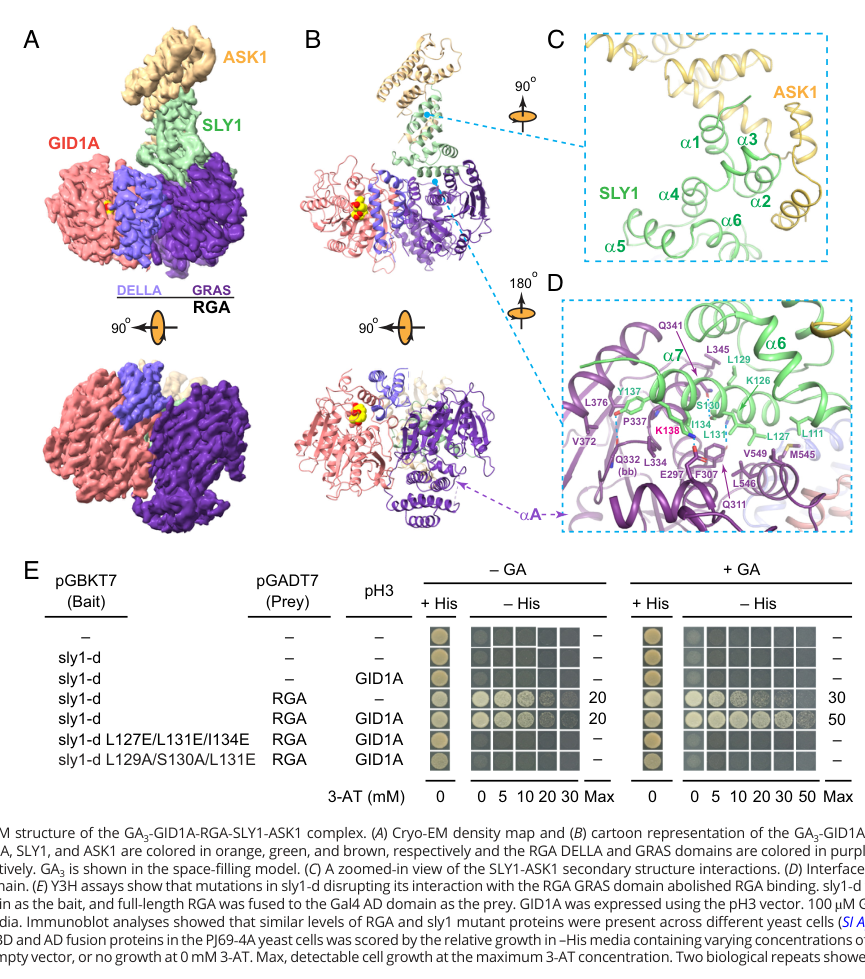

## Question

# Gene Research for Functional Annotation

## ⚠️ CRITICAL: Gene/Protein Identification Context

**BEFORE YOU BEGIN RESEARCH:** You MUST verify you are researching the CORRECT gene/protein. Gene symbols can be ambiguous, especially for less well-characterized genes from non-model organisms.

### Target Gene/Protein Identity (from UniProt):
- **UniProt Accession:** Q9MAA7
- **Protein Description:** RecName: Full=Gibberellin receptor GID1A; EC=3.-.-.-; AltName: Full=AtCXE10; AltName: Full=Carboxylesterase 10; AltName: Full=GID1-like protein 1; AltName: Full=Protein GA INSENSITIVE DWARF 1A; Short=AtGID1A;
- **Gene Information:** Name=GID1A; Synonyms=CXE10, GID1L1; OrderedLocusNames=At3g05120; ORFNames=T12H1.8;
- **Organism (full):** Arabidopsis thaliana (Mouse-ear cress).
- **Protein Family:** Belongs to the 'GDXG' lipolytic enzyme family.
- **Key Domains:** AB_hydrolase_3. (IPR013094); AB_hydrolase_fold. (IPR029058); Carboxylest/Gibb_receptor. (IPR050466); Lipase_GDXG_HIS_AS. (IPR002168); Lipase_GDXG_put_SER_AS. (IPR033140)

### MANDATORY VERIFICATION STEPS:

1. **Check if the gene symbol "GID1A" matches the protein description above**
2. **Verify the organism is correct:** Arabidopsis thaliana (Mouse-ear cress).
3. **Check if protein family/domains align with what you find in literature**
4. **If you find literature for a DIFFERENT gene with the same or similar symbol, STOP**

### If Gene Symbol is Ambiguous or You Cannot Find Relevant Literature:

**DO NOT PROCEED WITH RESEARCH ON A DIFFERENT GENE.** Instead:
- State clearly: "The gene symbol 'GID1A' is ambiguous or literature is limited for this specific protein"
- Explain what you found (e.g., "Found extensive literature on a different gene with the same symbol in a different organism")
- Describe the protein based ONLY on the UniProt information provided above
- Suggest that the protein function can be inferred from domain/family information

### Research Target:

Please provide a comprehensive research report on the gene **GID1A** (gene ID: GID1A, UniProt: Q9MAA7) in ARATH.

The research report should be a detailed narrative explaining the function, biological processes, and localization of the gene product. Citations should be given for all claims.

You should prioritize authoritative reviews and primary scientific literature when conducting research. You can supplement
this with annotations you find in gene/protein databases, but these can be outdated or inaccurate.

We are specifically interested in the primary function of the gene - for enzymes, what reaction is catalyzed, and what is the substrate specificity? For transporters, what is the substrate? For structural proteins or adapters, what is the broader structural role? For signaling molecules, what is the role in the pathway.

We are interested in where in or outside the cell the gene product carries out its function.

We are also interested in the signaling or biochemical pathways in which the gene functions. We are less interested in broad pleiotropic effects, except where these elucidate the precise role.

Include evidence where possible. We are interested in both experimental evidence as well as inference from structure, evolution, or bioinformatic analysis. Precise studies should be prioritized over high-throughput, where available.

## Output

Question: You are an expert researcher providing comprehensive, well-cited information.

Provide detailed information focusing on:
1. Key concepts and definitions with current understanding
2. Recent developments and latest research (prioritize 2023-2024 sources)
3. Current applications and real-world implementations
4. Expert opinions and analysis from authoritative sources
5. Relevant statistics and data from recent studies

Format as a comprehensive research report with proper citations. Include URLs and publication dates where available.
Always prioritize recent, authoritative sources and provide specific citations for all major claims.

# Gene Research for Functional Annotation

## ⚠️ CRITICAL: Gene/Protein Identification Context

**BEFORE YOU BEGIN RESEARCH:** You MUST verify you are researching the CORRECT gene/protein. Gene symbols can be ambiguous, especially for less well-characterized genes from non-model organisms.

### Target Gene/Protein Identity (from UniProt):
- **UniProt Accession:** Q9MAA7
- **Protein Description:** RecName: Full=Gibberellin receptor GID1A; EC=3.-.-.-; AltName: Full=AtCXE10; AltName: Full=Carboxylesterase 10; AltName: Full=GID1-like protein 1; AltName: Full=Protein GA INSENSITIVE DWARF 1A; Short=AtGID1A;
- **Gene Information:** Name=GID1A; Synonyms=CXE10, GID1L1; OrderedLocusNames=At3g05120; ORFNames=T12H1.8;
- **Organism (full):** Arabidopsis thaliana (Mouse-ear cress).
- **Protein Family:** Belongs to the 'GDXG' lipolytic enzyme family.
- **Key Domains:** AB_hydrolase_3. (IPR013094); AB_hydrolase_fold. (IPR029058); Carboxylest/Gibb_receptor. (IPR050466); Lipase_GDXG_HIS_AS. (IPR002168); Lipase_GDXG_put_SER_AS. (IPR033140)

### MANDATORY VERIFICATION STEPS:

1. **Check if the gene symbol "GID1A" matches the protein description above**
2. **Verify the organism is correct:** Arabidopsis thaliana (Mouse-ear cress).
3. **Check if protein family/domains align with what you find in literature**
4. **If you find literature for a DIFFERENT gene with the same or similar symbol, STOP**

### If Gene Symbol is Ambiguous or You Cannot Find Relevant Literature:

**DO NOT PROCEED WITH RESEARCH ON A DIFFERENT GENE.** Instead:
- State clearly: "The gene symbol 'GID1A' is ambiguous or literature is limited for this specific protein"
- Explain what you found (e.g., "Found extensive literature on a different gene with the same symbol in a different organism")
- Describe the protein based ONLY on the UniProt information provided above
- Suggest that the protein function can be inferred from domain/family information

### Research Target:

Please provide a comprehensive research report on the gene **GID1A** (gene ID: GID1A, UniProt: Q9MAA7) in ARATH.

The research report should be a detailed narrative explaining the function, biological processes, and localization of the gene product. Citations should be given for all claims.

You should prioritize authoritative reviews and primary scientific literature when conducting research. You can supplement
this with annotations you find in gene/protein databases, but these can be outdated or inaccurate.

We are specifically interested in the primary function of the gene - for enzymes, what reaction is catalyzed, and what is the substrate specificity? For transporters, what is the substrate? For structural proteins or adapters, what is the broader structural role? For signaling molecules, what is the role in the pathway.

We are interested in where in or outside the cell the gene product carries out its function.

We are also interested in the signaling or biochemical pathways in which the gene functions. We are less interested in broad pleiotropic effects, except where these elucidate the precise role.

Include evidence where possible. We are interested in both experimental evidence as well as inference from structure, evolution, or bioinformatic analysis. Precise studies should be prioritized over high-throughput, where available.

## Research report: Arabidopsis thaliana **GID1A** (At3g05120; UniProt Q9MAA7)

### 0) Target verification (identity and scope)
The research target is **Arabidopsis thaliana GID1A** (GA INSENSITIVE DWARF 1A; AtGID1A), one of three Arabidopsis soluble gibberellin (GA) receptors (GID1A/B/C). The evidence base used here explicitly refers to **Arabidopsis GID1A** as a GA receptor, describes its **hormone-sensitive lipase/carboxylesterase-like fold** and **lack of detectable hydrolase activity**, and links it to canonical **GA–GID1–DELLA** signaling. (ueguchitanaka2007molecularinteractionsof pages 1-2, alabadi2025greenrevolutiondella pages 3-4)

### 1) Key concepts and definitions (current understanding)

#### 1.1 Gibberellins, bioactive ligands, and “perception”
Gibberellins (GAs) are diterpenoid plant hormones that promote growth and developmental transitions. In the modern signaling model, GA **perception** occurs when a bioactive GA binds the soluble receptor **GID1**, enabling GID1 to recognize DELLA repressors and thereby switch GA signaling “on.” (shani2024highlightsingibberellin pages 7-8, ueguchitanaka2007molecularinteractionsof pages 1-2)

A key ligand concept is that different GAs differ strongly in bioactivity and receptor engagement. In receptor–DELLA interaction assays, **GA4** is highlighted as the **highest-affinity** GA and the most effective for driving GID1–DELLA complex formation in planta (e.g., GA4 treatment enabling co-IP of DELLA with GID1). (ueguchitanaka2007molecularinteractionsof pages 1-2)

#### 1.2 DELLA proteins as repressors and the GA–GID1–DELLA module
DELLA proteins (e.g., **RGA, GAI**) are nuclear-localized growth repressors. GA binding to GID1 promotes a **GA–GID1–DELLA** complex that (i) recruits ubiquitin-ligase machinery to degrade DELLA proteins (proteolysis-dependent signaling) and (ii) can also directly inhibit DELLA regulatory activity (proteolysis-independent signaling). (ariizumi2008proteolysisindependentdownregulationof pages 1-2, dahal2025structuralinsightsinto pages 1-2)

A mechanistic definition that matters for functional annotation is that the **N-terminal “DELLA domain”** of DELLA proteins acts as the **receiver** that senses activated (GA-bound) GID1. The isolated DELLA domain can be **sufficient** for GA-dependent interaction with GID1A in yeast assays, and mutations in this region can confer GA insensitivity by disrupting GID1A binding. (willige2007thedelladomain pages 6-7, willige2007thedelladomain pages 1-2)

#### 1.3 GID1A is a receptor derived from an esterase/lipase-like fold (not an enzyme)
Although GID1 proteins are homologous to hormone-sensitive lipases/carboxylesterases, the receptor lacks key catalytic features and shows **no detectable hydrolase activity** in a model substrate assay (p-nitrophenyl acetate). This is central to functional annotation: **GID1A is primarily a hormone receptor/adaptor, not a metabolic enzyme**. (ueguchitanaka2007molecularinteractionsof pages 1-2, alabadi2025greenrevolutiondella pages 3-4)

#### 1.4 Structural “lid” mechanism for allosteric activation
Structural synthesis in recent authoritative reviews emphasizes that bioactive GA acts as an **allosteric inducer**: GA binding within the GID1A pocket closes an N-terminal “lid” and creates hydrophobic surfaces needed for DELLA binding (engaging conserved DELLA, LExLE, and VHYNP motifs). (shani2024highlightsingibberellin pages 7-8)

### 2) Primary function of GID1A (reaction/substrate specificity; binding partners)

#### 2.1 Primary molecular function: GA receptor that binds bioactive GA and recognizes DELLAs
**GID1A’s primary function is binding bioactive GA and, upon GA binding, recognizing DELLA repressors** to switch GA signaling outputs. Direct interaction evidence includes GA-dependent **co-immunoprecipitation** of **RGA** with **GID1:GFP** from Arabidopsis extracts. (willige2007thedelladomain pages 4-6)

#### 2.2 Ligand specificity: GA4 as particularly high-affinity/effective ligand
In comparative GA-binding/interaction studies (Arabidopsis GID1 proteins assayed similarly to rice GID1), **GA4** is described as having the **highest affinity** and being most effective in planta, with DELLA co-IP detected from **GA4-treated** extracts. (ueguchitanaka2007molecularinteractionsof pages 1-2)

#### 2.3 Binding interface: DELLA domain requirements for GA-dependent interaction
Willige et al. provide strong functional dissection: deletion of the DELLA domain abolishes interaction with GID1A, while the **GAI DELLA domain alone (aa 1–73)** is sufficient for GA-dependent interaction with GID1A in yeast two-hybrid assays. These data support the model that the DELLA domain is a dedicated “receiver” for activated GA receptors. (willige2007thedelladomain pages 6-7)

### 3) Pathway role and mechanism (from receptor engagement to transcriptional outcomes)

#### 3.1 Canonical proteolysis-dependent mechanism: DELLA degradation via ubiquitin–proteasome
Genetic and biochemical evidence links GID1 receptors to GA-promoted DELLA turnover. In Arabidopsis plants lacking all three receptors (gid1 triple mutants), DELLA proteins are stabilized: **RGA accumulates** and GA treatment that normally causes DELLA degradation in wild type does not destabilize RGA/GAI in the triple mutant. (willige2007thedelladomain pages 4-6)

Recent structural work further connects receptor engagement to ubiquitin machinery: cryo-EM structures resolve a **GA3–GID1A–RGA–SLY1–ASK1** complex, supporting the model that GA-bound GID1A positions DELLA for recognition by SCF-type ubiquitin ligase components (through SLY1/ASK1 association) and subsequent proteasomal degradation. (dahal2025structuralinsightsinto pages 4-5, dahal2025structuralinsightsinto media 5ad4625d)

#### 3.2 Proteolysis-independent mechanism: repression of DELLA output without DELLA loss
A key extension of functional understanding is that GA-bound GID1 can reduce DELLA repression without necessarily inducing DELLA degradation. In Arabidopsis, **overexpression of GID1 genes** can rescue **sly1** dwarf/infertility phenotypes **without reducing RGA abundance**, implying a DELLA-neutralization mechanism dependent on GA, receptor levels, and an intact DELLA motif. (ariizumi2008proteolysisindependentdownregulationof pages 1-2)

Consistent with this, recent structural/functional analysis proposes a **competition mechanism**: GA–GID1A binding to DELLA’s GRAS region overlaps transcription-factor binding surfaces (e.g., IDD transcription factors), and yeast three-hybrid assays show GA-dependent attenuation of IDD1–RGA interaction by GID1. (dahal2025structuralinsightsinto pages 6-8, dahal2025structuralinsightsinto pages 1-2)

### 4) Cellular and subcellular localization (where GID1A acts)
Willige et al. report that **GID1A:GFP localizes to both nucleus and cytoplasm**, and that this nucleocytoplasmic localization is not detectably altered by GA or paclobutrazol treatment in their assays. This supports a model where receptor availability spans compartments, while key downstream transcriptional regulation occurs in the nucleus through DELLA-associated complexes. (willige2007thedelladomain pages 4-6)

An authoritative 2024 review also summarizes GID1 localization as cytoplasmic and nuclear in Arabidopsis. (shani2024highlightsingibberellin pages 7-8)

### 5) Genetic evidence and phenotypes in Arabidopsis (function in planta)

#### 5.1 Redundancy and essentiality of GID1 receptors
A defining feature of Arabidopsis GID1A functional interpretation is redundancy among the three receptors:
* **gid1 single mutants** show little/no obvious GA growth defects.
* **gid1 double mutants** show partial impairment.
* **gid1a gid1b gid1c triple mutants** are extremely GA-insensitive and severely dwarfed; they can fail to germinate unless manually rescued (seed coat removal), and they never flowered in one study. (willige2007thedelladomain pages 4-6, ariizumi2008proteolysisindependentdownregulationof pages 1-2)

#### 5.2 Relative contribution of GID1A
In adult-stage phenotyping, **gid1a gid1c** double mutants show stronger reductions in GA-induced hypocotyl elongation and adult height compared with combinations involving gid1b, indicating **GID1A contributes strongly** to adult vegetative GA responsiveness. (willige2007thedelladomain pages 7-8)

### 6) Recent developments (prioritizing 2023–2024 sources)

#### 6.1 2024 authoritative synthesis of GA receptor signaling
A 2024 Plant Physiology review (“Highlights in gibberellin research: A tale of the dwarf and the slender”; published **Jan 2024**; https://doi.org/10.1093/plphys/kiae044) summarizes receptor mechanism, emphasizing GA as an allosteric inducer that closes the GID1 “lid,” enabling DELLA binding, and reiterates nucleocytoplasmic localization and redundancy of GID1A/B/C in Arabidopsis. (shani2024highlightsingibberellin pages 7-8)

#### 6.2 2024 real-world implementation: quantitative GA signaling biosensor
A 2024 Nature Communications study (published **May 2024**; https://doi.org/10.1038/s41467-024-48116-4) reports a **ratiometric GA signaling biosensor** engineered from a DELLA protein to preserve GA-responsive degradation while suppressing DELLA’s regulatory output. The biosensor was used to map GA signaling in the shoot apical meristem, revealing high GA signaling in cells between organ primordia that are precursors of internodes, and supporting a role for GA signaling in internode specification. This represents a practical tool that leverages the GA–GID1–DELLA module (including GID1a/b/c receptors) for in vivo quantitative readouts. (dahal2025structuralinsightsinto pages 5-6, shani2024highlightsingibberellin pages 7-8)

*Note:* While this biosensor study is not exclusively about GID1A, it depends on the same core receptor–DELLA degradation logic that GID1A participates in. (dahal2025structuralinsightsinto pages 5-6, shani2024highlightsingibberellin pages 7-8)

### 7) Expert opinion and authoritative interpretation
Across primary and review literature, the consensus expert model is:
1) **GID1A is the soluble GA receptor** that binds bioactive GA and converts it into a protein–protein interaction signal by engaging DELLA motifs. (shani2024highlightsingibberellin pages 7-8, willige2007thedelladomain pages 6-7)
2) GA-bound GID1A initiates DELLA neutralization by **two separable mechanisms**: ubiquitin-mediated degradation and direct inhibition/competition at DELLA interaction surfaces. (ariizumi2008proteolysisindependentdownregulationof pages 1-2, dahal2025structuralinsightsinto pages 6-8)
3) Despite sequence similarity to carboxylesterases/hormone-sensitive lipases, GID1 proteins are interpreted as **non-enzymatic receptors**. (ueguchitanaka2007molecularinteractionsof pages 1-2, alabadi2025greenrevolutiondella pages 3-4)

### 8) Relevant statistics and quantitative data extracted from recent/definitive studies

#### 8.1 Structural/biophysical quantitation (GID1A complexes)
Recent cryo-EM work reports a **GA3–GID1A–RGA–SLY1–ASK1** quaternary complex solved to **2.72 Å** resolution and an alternate conformation at **2.76 Å**, with mass photometry measuring the complex at **148 kDa** (predicted **147 kDa**). These are direct quantitative anchors for the physical signaling complex linking receptor to ubiquitin machinery. (dahal2025structuralinsightsinto pages 4-5, dahal2025structuralinsightsinto pages 5-6)

#### 8.2 Interaction assay conditions
Yeast three-hybrid assays probing GA-dependent attenuation of IDD1–RGA interaction by GID1 used **100 µM GA3** in GA-containing medium, providing an explicit condition for the GA-dependent interaction effects. (dahal2025structuralinsightsinto pages 6-8)

#### 8.3 Genetic/phenotypic “quantitation” (qualitative but strong)
Multiple sources report a graded genetic series (single → double → triple) where the **gid1 triple mutant is extremely GA-insensitive** and shows severe developmental arrest/dwarfism, with **failure to germinate** unless rescued. While not expressed as numeric effect sizes in the excerpts available here, this is a strong, widely cited functional-genetic statistic about essential pathway function. (willige2007thedelladomain pages 4-6, ariizumi2008proteolysisindependentdownregulationof pages 1-2)

### 9) Summary of functional annotation (for database-style use)
**Molecular function:** soluble GA receptor; GA binding promotes DELLA binding and downstream signaling complex assembly. No hydrolase activity detected in model esterase assay (p-nitrophenyl acetate). (ueguchitanaka2007molecularinteractionsof pages 1-2, willige2007thedelladomain pages 6-7)

**Biological process:** GA signal transduction regulating growth and development through DELLA neutralization (proteolysis-dependent via SCFSLY1-mediated degradation, and proteolysis-independent via direct inhibition/competition). (willige2007thedelladomain pages 4-6, ariizumi2008proteolysisindependentdownregulationof pages 1-2)

**Cellular component:** nucleocytoplasmic (nucleus + cytoplasm). (willige2007thedelladomain pages 4-6)

**Key partners:** DELLA repressors such as **RGA** (and GAI in some assays), and SCF components including **SLY1/ASK1** in GA-dependent complexes. (willige2007thedelladomain pages 4-6, dahal2025structuralinsightsinto pages 4-5)

---

### Evidence summary table
| Claim/Function | Key evidence (1-2 sentences) | System/Assay | Quantitative details (if any) | Source (include DOI URL and year) |
|---|---|---|---|---|
| Arabidopsis GID1 proteins, including GID1A, are required GA receptors in vivo | Triple gid1 mutants are GA-insensitive, fail to germinate unless the seed coat is removed, and develop into dark-green, severely dwarfed plants. Single mutants show little phenotype, while double mutants are partially impaired, supporting redundancy with an important contribution from GID1A. (willige2007thedelladomain pages 4-6, ariizumi2008proteolysisindependentdownregulationof pages 1-2) | Arabidopsis genetics; mutant phenotyping | Triple mutant fully impaired in GA responses; single mutants weak, double mutants partial (willige2007thedelladomain pages 4-6, ariizumi2008proteolysisindependentdownregulationof pages 1-2) | Willige et al., 2007, The Plant Cell, https://doi.org/10.1105/tpc.107.051441; Ariizumi et al., 2008, The Plant Cell, https://doi.org/10.1105/tpc.108.058487 |
| GID1A binds DELLA proteins in a GA-dependent manner | GID1:GFP co-immunoprecipitated RGA in a GA-dependent manner from Arabidopsis extracts, and yeast assays showed that the DELLA domain is required and sufficient for GA-dependent interaction with GID1A. This established GID1A as the activated receptor recognized by DELLA repressors. (willige2007thedelladomain pages 4-6, willige2007thedelladomain pages 6-7) | Co-immunoprecipitation from Arabidopsis; yeast two-hybrid | DELLA domain alone (GAI aa 1-73) sufficient; ~10-fold reduced interaction for a DELLA-domain mutant variant (willige2007thedelladomain pages 6-7) | Willige et al., 2007, The Plant Cell, https://doi.org/10.1105/tpc.107.051441 |
| GID1A is nucleocytoplasmic | GFP-tagged Arabidopsis GID1A localized to both nucleus and cytoplasm, and this distribution was not altered by GA or paclobutrazol treatment. This indicates receptor function is not restricted to one compartment, although nuclear action is central to DELLA regulation. (willige2007thedelladomain pages 4-6, shani2024highlightsingibberellin pages 7-8) | GFP fusion localization in Arabidopsis | No GA/PAC-dependent relocalization detected (willige2007thedelladomain pages 4-6) | Willige et al., 2007, The Plant Cell, https://doi.org/10.1105/tpc.107.051441; Shani et al., 2024, Plant Physiology, https://doi.org/10.1093/plphys/kiae044 |
| Arabidopsis GID1 proteins show bioactive GA selectivity, with GA4 most effective | Recombinant Arabidopsis GID1 proteins behaved similarly to rice GID1 in ligand selectivity and affinity, and GA4 had the highest affinity in interaction assays and was most effective in planta. Pull-downs showed DELLA association with GID1 preferentially after GA4 treatment. (ueguchitanaka2007molecularinteractionsof pages 1-2) | Recombinant protein GA-binding; yeast interaction assays; in vivo pull-down | GA4 reported as highest-affinity ligand and most effective GA in planta (ueguchitanaka2007molecularinteractionsof pages 1-2) | Ueguchi-Tanaka et al., 2007, The Plant Cell, https://doi.org/10.1105/tpc.106.043729 |
| GID1A has an esterase/lipase-like fold but no detectable hydrolase activity | Although GID1 proteins are homologous to hormone-sensitive lipases/carboxylesterases, the receptor lacks a conserved catalytic residue and did not show hydrolase activity with p-nitrophenyl acetate. This supports the view that GID1A is a hormone receptor derived from, but not functioning as, a hydrolase. (ueguchitanaka2007molecularinteractionsof pages 1-2, alabadi2025greenrevolutiondella pages 3-4) | Sequence/structural comparison; enzymatic assay | No hydrolase activity detected with p-nitrophenyl acetate; missing conserved HSL catalytic residue (ueguchitanaka2007molecularinteractionsof pages 1-2) | Ueguchi-Tanaka et al., 2007, The Plant Cell, https://doi.org/10.1105/tpc.106.043729; Alabadí & Sun, 2025, Annu Rev Plant Biol, https://doi.org/10.1146/annurev-arplant-053124-050732 |
| GA-bound GID1A can repress DELLA output even without DELLA degradation | Overexpression of GID1 genes rescued sly1 dwarf and infertility phenotypes without reducing RGA abundance, indicating a proteolysis-independent mode of DELLA repression that still depends on GA, receptor abundance, and an intact DELLA motif. (ariizumi2008proteolysisindependentdownregulationof pages 1-2) | Arabidopsis transgenics in sly1 background | Rescue occurred without detectable decrease in DELLA RGA protein level (ariizumi2008proteolysisindependentdownregulationof pages 1-2) | Ariizumi et al., 2008, The Plant Cell, https://doi.org/10.1105/tpc.108.058487 |
| Structural mechanism: GA allosterically activates GID1A for DELLA binding | Structural studies summarized in a 2024 review show that bioactive GA binds the AtGID1A pocket, closes the N-terminal lid, and creates hydrophobic surfaces that engage DELLA-domain motifs (DELLA, LExLE, VHYNP). This explains how ligand perception is coupled to signaling complex assembly. (shani2024highlightsingibberellin pages 7-8) | Structural biology synthesis/review of X-ray studies | Review highlights mechanism in Fig. 2, Fig. 3, Boxes 1 and 2 (shani2024highlightsingibberellin pages 7-8) | Shani et al., 2024, Plant Physiology, https://doi.org/10.1093/plphys/kiae044 |
| GID1A forms a GA3-bound quaternary complex with RGA and SLY1-ASK1 that explains DELLA degradation | Cryo-EM resolved GA3-GID1A-RGA-SLY1-ASK1 complexes, showing the DELLA domain acts as a molecular bridge to stabilize GID1A-GRAS binding and position SLY1 for SCF-mediated ubiquitination. These structures directly connect ligand perception to substrate recognition by the degradation machinery. (dahal2025structuralinsightsinto pages 4-5, dahal2025structuralinsightsinto pages 5-6, dahal2025structuralinsightsinto pages 1-2) | Cryo-EM; mass photometry; Y3H/biochemical validation | Quaternary complex at 2.72 Å; alternate complex at 2.76 Å; measured mass 148 kDa vs 147 kDa predicted; Y3H used 100 µM GA3 (dahal2025structuralinsightsinto pages 4-5, dahal2025structuralinsightsinto pages 5-6, dahal2025structuralinsightsinto pages 6-8) | Dahal et al., 2025, PNAS, https://doi.org/10.1073/pnas.2511012122 |
| GA-GID1A also suppresses DELLA by competing with transcription-factor binding | Recent structural/functional work indicates GID1A binding to the DELLA GRAS region overlaps surfaces used by IDD transcription factors, attenuating IDD1-RGA interaction in a GA-dependent manner. This extends GID1A function beyond DELLA proteolysis to direct repression of DELLA transcriptional activity. (dahal2025structuralinsightsinto pages 6-8, dahal2025structuralinsightsinto pages 1-2) | Cryo-EM, AlphaFold modeling, yeast three-hybrid | IDD1-RGA attenuation observed in +GA medium containing 100 µM GA3 (dahal2025structuralinsightsinto pages 6-8) | Dahal et al., 2025, PNAS, https://doi.org/10.1073/pnas.2511012122 |

*Table: This table compiles the core experimental and review evidence supporting functional annotation of Arabidopsis GID1A as a gibberellin receptor. It highlights genetics, DELLA interaction, localization, ligand selectivity, structural mechanism, and newer evidence for both proteolysis-dependent and proteolysis-independent signaling.*

### Key figure supporting the structural mechanism
The following figure shows the cryo-EM density/model of the **GA3–GID1A–RGA–SLY1–ASK1** complex that physically links GA perception by GID1A to DELLA recognition by SCF machinery. (dahal2025structuralinsightsinto media 5ad4625d)

### Limitations of this evidence set
Some highly relevant Arabidopsis-focused primary papers (e.g., the original Arabidopsis GID1 receptor identification/characterization papers and some localization-focused work) were not obtainable in the current retrieval session. Consequently, the report emphasizes what could be directly supported from the accessible primary/review texts, including definitive genetics, co-IP, ligand ranking statements (GA4), and high-resolution structural complexes. (willige2007thedelladomain pages 4-6, ueguchitanaka2007molecularinteractionsof pages 1-2, dahal2025structuralinsightsinto pages 4-5)

References

1. (ueguchitanaka2007molecularinteractionsof pages 1-2): Miyako Ueguchi-Tanaka, Masatoshi Nakajima, Etsuko Katoh, Hiroko Ohmiya, Kenji Asano, Shoko Saji, Xiang Hongyu, Motoyuki Ashikari, Hidemi Kitano, Isomaro Yamaguchi, and Makoto Matsuoka. Molecular interactions of a soluble gibberellin receptor, gid1, with a rice della protein, slr1, and gibberellin[w]. The Plant Cell Online, 19:2140-2155, Jul 2007. URL: https://doi.org/10.1105/tpc.106.043729, doi:10.1105/tpc.106.043729. This article has 517 citations.

2. (alabadi2025greenrevolutiondella pages 3-4): David Alabadí and Tai-ping Sun. Green revolution della proteins: functional analysis and regulatory mechanisms. Annual Review of Plant Biology, 76(1):373-400, May 2025. URL: https://doi.org/10.1146/annurev-arplant-053124-050732, doi:10.1146/annurev-arplant-053124-050732. This article has 17 citations and is from a domain leading peer-reviewed journal.

3. (shani2024highlightsingibberellin pages 7-8): Eilon Shani, Peter Hedden, and Tai-ping Sun. Highlights in gibberellin research: a tale of the dwarf and the slender. Plant Physiology, 195:111-134, Jan 2024. URL: https://doi.org/10.1093/plphys/kiae044, doi:10.1093/plphys/kiae044. This article has 92 citations and is from a highest quality peer-reviewed journal.

4. (ariizumi2008proteolysisindependentdownregulationof pages 1-2): T. Ariizumi, K. Murase, Tai-ping Sun, and C. Steber. Proteolysis-independent downregulation of della repression in arabidopsis by the gibberellin receptor gibberellin insensitive dwarf1[w]. The Plant Cell Online, 20:2447-2459, Sep 2008. URL: https://doi.org/10.1105/tpc.108.058487, doi:10.1105/tpc.108.058487. This article has 218 citations.

5. (dahal2025structuralinsightsinto pages 1-2): Pawan Dahal, Yan Wang, Jianhong Hu, Jeongmoo Park, Karly Forker, Zhong-Lin Zhang, Kedar Sharma, Mario J. Borgnia, Tai-ping Sun, and Pei Zhou. Structural insights into proteolysis-dependent and -independent suppression of the master regulator della by the gibberellin receptor. Proceedings of the National Academy of Sciences of the United States of America, 122 32:e2511012122, Aug 2025. URL: https://doi.org/10.1073/pnas.2511012122, doi:10.1073/pnas.2511012122. This article has 10 citations and is from a highest quality peer-reviewed journal.

6. (willige2007thedelladomain pages 6-7): Björn C. Willige, Soumya Ghosh, Carola Nill, Melina Zourelidou, Esther M.N. Dohmann, Andreas Maier, and Claus Schwechheimer. The della domain of ga insensitive mediates the interaction with the ga insensitive dwarf1a gibberellin receptor of<i>arabidopsis</i>. The Plant Cell, 19:1209-1220, Apr 2007. URL: https://doi.org/10.1105/tpc.107.051441, doi:10.1105/tpc.107.051441. This article has 616 citations.

7. (willige2007thedelladomain pages 1-2): Björn C. Willige, Soumya Ghosh, Carola Nill, Melina Zourelidou, Esther M.N. Dohmann, Andreas Maier, and Claus Schwechheimer. The della domain of ga insensitive mediates the interaction with the ga insensitive dwarf1a gibberellin receptor of<i>arabidopsis</i>. The Plant Cell, 19:1209-1220, Apr 2007. URL: https://doi.org/10.1105/tpc.107.051441, doi:10.1105/tpc.107.051441. This article has 616 citations.

8. (willige2007thedelladomain pages 4-6): Björn C. Willige, Soumya Ghosh, Carola Nill, Melina Zourelidou, Esther M.N. Dohmann, Andreas Maier, and Claus Schwechheimer. The della domain of ga insensitive mediates the interaction with the ga insensitive dwarf1a gibberellin receptor of<i>arabidopsis</i>. The Plant Cell, 19:1209-1220, Apr 2007. URL: https://doi.org/10.1105/tpc.107.051441, doi:10.1105/tpc.107.051441. This article has 616 citations.

9. (dahal2025structuralinsightsinto pages 4-5): Pawan Dahal, Yan Wang, Jianhong Hu, Jeongmoo Park, Karly Forker, Zhong-Lin Zhang, Kedar Sharma, Mario J. Borgnia, Tai-ping Sun, and Pei Zhou. Structural insights into proteolysis-dependent and -independent suppression of the master regulator della by the gibberellin receptor. Proceedings of the National Academy of Sciences of the United States of America, 122 32:e2511012122, Aug 2025. URL: https://doi.org/10.1073/pnas.2511012122, doi:10.1073/pnas.2511012122. This article has 10 citations and is from a highest quality peer-reviewed journal.

10. (dahal2025structuralinsightsinto media 5ad4625d): Pawan Dahal, Yan Wang, Jianhong Hu, Jeongmoo Park, Karly Forker, Zhong-Lin Zhang, Kedar Sharma, Mario J. Borgnia, Tai-ping Sun, and Pei Zhou. Structural insights into proteolysis-dependent and -independent suppression of the master regulator della by the gibberellin receptor. Proceedings of the National Academy of Sciences of the United States of America, 122 32:e2511012122, Aug 2025. URL: https://doi.org/10.1073/pnas.2511012122, doi:10.1073/pnas.2511012122. This article has 10 citations and is from a highest quality peer-reviewed journal.

11. (dahal2025structuralinsightsinto pages 6-8): Pawan Dahal, Yan Wang, Jianhong Hu, Jeongmoo Park, Karly Forker, Zhong-Lin Zhang, Kedar Sharma, Mario J. Borgnia, Tai-ping Sun, and Pei Zhou. Structural insights into proteolysis-dependent and -independent suppression of the master regulator della by the gibberellin receptor. Proceedings of the National Academy of Sciences of the United States of America, 122 32:e2511012122, Aug 2025. URL: https://doi.org/10.1073/pnas.2511012122, doi:10.1073/pnas.2511012122. This article has 10 citations and is from a highest quality peer-reviewed journal.

12. (willige2007thedelladomain pages 7-8): Björn C. Willige, Soumya Ghosh, Carola Nill, Melina Zourelidou, Esther M.N. Dohmann, Andreas Maier, and Claus Schwechheimer. The della domain of ga insensitive mediates the interaction with the ga insensitive dwarf1a gibberellin receptor of<i>arabidopsis</i>. The Plant Cell, 19:1209-1220, Apr 2007. URL: https://doi.org/10.1105/tpc.107.051441, doi:10.1105/tpc.107.051441. This article has 616 citations.

13. (dahal2025structuralinsightsinto pages 5-6): Pawan Dahal, Yan Wang, Jianhong Hu, Jeongmoo Park, Karly Forker, Zhong-Lin Zhang, Kedar Sharma, Mario J. Borgnia, Tai-ping Sun, and Pei Zhou. Structural insights into proteolysis-dependent and -independent suppression of the master regulator della by the gibberellin receptor. Proceedings of the National Academy of Sciences of the United States of America, 122 32:e2511012122, Aug 2025. URL: https://doi.org/10.1073/pnas.2511012122, doi:10.1073/pnas.2511012122. This article has 10 citations and is from a highest quality peer-reviewed journal.

## Artifacts

- [Edison artifact artifact-00](GID1A-deep-research-falcon_artifacts/artifact-00.md)

## Citations

1. ueguchitanaka2007molecularinteractionsof pages 1-2
2. shani2024highlightsingibberellin pages 7-8
3. willige2007thedelladomain pages 4-6
4. willige2007thedelladomain pages 6-7
5. ariizumi2008proteolysisindependentdownregulationof pages 1-2
6. willige2007thedelladomain pages 7-8
7. dahal2025structuralinsightsinto pages 6-8
8. alabadi2025greenrevolutiondella pages 3-4
9. dahal2025structuralinsightsinto pages 1-2
10. willige2007thedelladomain pages 1-2
11. dahal2025structuralinsightsinto pages 4-5
12. dahal2025structuralinsightsinto pages 5-6
13. w
14. https://doi.org/10.1093/plphys/kiae044
15. https://doi.org/10.1038/s41467-024-48116-4
16. https://doi.org/10.1105/tpc.107.051441;
17. https://doi.org/10.1105/tpc.108.058487
18. https://doi.org/10.1105/tpc.107.051441
19. https://doi.org/10.1105/tpc.106.043729
20. https://doi.org/10.1105/tpc.106.043729;
21. https://doi.org/10.1146/annurev-arplant-053124-050732
22. https://doi.org/10.1073/pnas.2511012122
23. https://doi.org/10.1105/tpc.106.043729,
24. https://doi.org/10.1146/annurev-arplant-053124-050732,
25. https://doi.org/10.1093/plphys/kiae044,
26. https://doi.org/10.1105/tpc.108.058487,
27. https://doi.org/10.1073/pnas.2511012122,
28. https://doi.org/10.1105/tpc.107.051441,