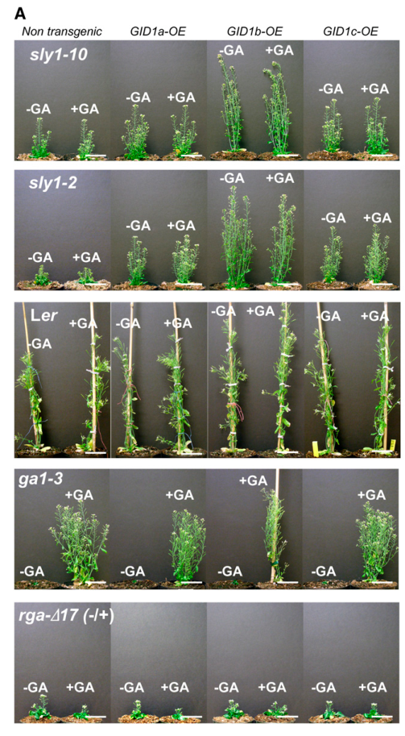

## Question

# Gene Research for Functional Annotation

## ⚠️ CRITICAL: Gene/Protein Identification Context

**BEFORE YOU BEGIN RESEARCH:** You MUST verify you are researching the CORRECT gene/protein. Gene symbols can be ambiguous, especially for less well-characterized genes from non-model organisms.

### Target Gene/Protein Identity (from UniProt):
- **UniProt Accession:** Q940G6
- **Protein Description:** RecName: Full=Gibberellin receptor GID1C; EC=3.-.-.-; AltName: Full=AtCXE19; AltName: Full=Carboxylesterase 19; AltName: Full=GID1-like protein 3; AltName: Full=Protein GA INSENSITIVE DWARF 1C; Short=AtGID1C;
- **Gene Information:** Name=GID1C; Synonyms=CXE19, GID1L3; OrderedLocusNames=At5g27320; ORFNames=F21A20.30;
- **Organism (full):** Arabidopsis thaliana (Mouse-ear cress).
- **Protein Family:** Belongs to the 'GDXG' lipolytic enzyme family.
- **Key Domains:** AB_hydrolase_3. (IPR013094); AB_hydrolase_fold. (IPR029058); Carboxylest/Gibb_receptor. (IPR050466); Lipase_GDXG_HIS_AS. (IPR002168); Lipase_GDXG_put_SER_AS. (IPR033140)

### MANDATORY VERIFICATION STEPS:

1. **Check if the gene symbol "GID1C" matches the protein description above**
2. **Verify the organism is correct:** Arabidopsis thaliana (Mouse-ear cress).
3. **Check if protein family/domains align with what you find in literature**
4. **If you find literature for a DIFFERENT gene with the same or similar symbol, STOP**

### If Gene Symbol is Ambiguous or You Cannot Find Relevant Literature:

**DO NOT PROCEED WITH RESEARCH ON A DIFFERENT GENE.** Instead:
- State clearly: "The gene symbol 'GID1C' is ambiguous or literature is limited for this specific protein"
- Explain what you found (e.g., "Found extensive literature on a different gene with the same symbol in a different organism")
- Describe the protein based ONLY on the UniProt information provided above
- Suggest that the protein function can be inferred from domain/family information

### Research Target:

Please provide a comprehensive research report on the gene **GID1C** (gene ID: GID1C, UniProt: Q940G6) in ARATH.

The research report should be a detailed narrative explaining the function, biological processes, and localization of the gene product. Citations should be given for all claims.

You should prioritize authoritative reviews and primary scientific literature when conducting research. You can supplement
this with annotations you find in gene/protein databases, but these can be outdated or inaccurate.

We are specifically interested in the primary function of the gene - for enzymes, what reaction is catalyzed, and what is the substrate specificity? For transporters, what is the substrate? For structural proteins or adapters, what is the broader structural role? For signaling molecules, what is the role in the pathway.

We are interested in where in or outside the cell the gene product carries out its function.

We are also interested in the signaling or biochemical pathways in which the gene functions. We are less interested in broad pleiotropic effects, except where these elucidate the precise role.

Include evidence where possible. We are interested in both experimental evidence as well as inference from structure, evolution, or bioinformatic analysis. Precise studies should be prioritized over high-throughput, where available.

## Output

Question: You are an expert researcher providing comprehensive, well-cited information.

Provide detailed information focusing on:
1. Key concepts and definitions with current understanding
2. Recent developments and latest research (prioritize 2023-2024 sources)
3. Current applications and real-world implementations
4. Expert opinions and analysis from authoritative sources
5. Relevant statistics and data from recent studies

Format as a comprehensive research report with proper citations. Include URLs and publication dates where available.
Always prioritize recent, authoritative sources and provide specific citations for all major claims.

# Gene Research for Functional Annotation

## ⚠️ CRITICAL: Gene/Protein Identification Context

**BEFORE YOU BEGIN RESEARCH:** You MUST verify you are researching the CORRECT gene/protein. Gene symbols can be ambiguous, especially for less well-characterized genes from non-model organisms.

### Target Gene/Protein Identity (from UniProt):
- **UniProt Accession:** Q940G6
- **Protein Description:** RecName: Full=Gibberellin receptor GID1C; EC=3.-.-.-; AltName: Full=AtCXE19; AltName: Full=Carboxylesterase 19; AltName: Full=GID1-like protein 3; AltName: Full=Protein GA INSENSITIVE DWARF 1C; Short=AtGID1C;
- **Gene Information:** Name=GID1C; Synonyms=CXE19, GID1L3; OrderedLocusNames=At5g27320; ORFNames=F21A20.30;
- **Organism (full):** Arabidopsis thaliana (Mouse-ear cress).
- **Protein Family:** Belongs to the 'GDXG' lipolytic enzyme family.
- **Key Domains:** AB_hydrolase_3. (IPR013094); AB_hydrolase_fold. (IPR029058); Carboxylest/Gibb_receptor. (IPR050466); Lipase_GDXG_HIS_AS. (IPR002168); Lipase_GDXG_put_SER_AS. (IPR033140)

### MANDATORY VERIFICATION STEPS:

1. **Check if the gene symbol "GID1C" matches the protein description above**
2. **Verify the organism is correct:** Arabidopsis thaliana (Mouse-ear cress).
3. **Check if protein family/domains align with what you find in literature**
4. **If you find literature for a DIFFERENT gene with the same or similar symbol, STOP**

### If Gene Symbol is Ambiguous or You Cannot Find Relevant Literature:

**DO NOT PROCEED WITH RESEARCH ON A DIFFERENT GENE.** Instead:
- State clearly: "The gene symbol 'GID1C' is ambiguous or literature is limited for this specific protein"
- Explain what you found (e.g., "Found extensive literature on a different gene with the same symbol in a different organism")
- Describe the protein based ONLY on the UniProt information provided above
- Suggest that the protein function can be inferred from domain/family information

### Research Target:

Please provide a comprehensive research report on the gene **GID1C** (gene ID: GID1C, UniProt: Q940G6) in ARATH.

The research report should be a detailed narrative explaining the function, biological processes, and localization of the gene product. Citations should be given for all claims.

You should prioritize authoritative reviews and primary scientific literature when conducting research. You can supplement
this with annotations you find in gene/protein databases, but these can be outdated or inaccurate.

We are specifically interested in the primary function of the gene - for enzymes, what reaction is catalyzed, and what is the substrate specificity? For transporters, what is the substrate? For structural proteins or adapters, what is the broader structural role? For signaling molecules, what is the role in the pathway.

We are interested in where in or outside the cell the gene product carries out its function.

We are also interested in the signaling or biochemical pathways in which the gene functions. We are less interested in broad pleiotropic effects, except where these elucidate the precise role.

Include evidence where possible. We are interested in both experimental evidence as well as inference from structure, evolution, or bioinformatic analysis. Precise studies should be prioritized over high-throughput, where available.

# Functional annotation report: Arabidopsis GID1C (Q940G6)

**Identity and conclusion.** This report concerns *Arabidopsis thaliana* GID1C, also called GID1L3 or CXE19, rather than a similarly named receptor in another plant. The supplied UniProt accession is **Q940G6**; importantly, an Arabidopsis primary study independently identifies **GID1C as locus AT5G27320** in its construct records. Arabidopsis has three related gibberellin receptors—GID1A, GID1B and GID1C. The best-supported primary annotation for GID1C is **soluble gibberellin-hormone receptor**, not catalytic carboxylesterase. (rizza2017invivogibberellin pages 10-14, shani2024highlightsingibberellin pages 8-10)

The following evidence map distinguishes observations made directly on GID1C from conclusions inferred from the receptor family or engineered sensors. (rizza2017invivogibberellin pages 10-14, ariizumi2008proteolysisindependentdownregulationof pages 2-4, tang2023engineeringanddeploying pages 69-72)

| Annotation question | Evidence and finding | Evidence type / important caveat | Source |
|---|---|---|---|
| Identity | The Arabidopsis construct inventory identifies **GID1C as AGI locus AT5G27320** and encodes residues 1–344, matching the target locus supplied for UniProt Q940G6. | Direct locus-level confirmation in a primary-study methods/primer table; the UniProt accession itself was supplied by the user. | Rizza et al., 2017 ([DOI](https://doi.org/10.1038/s41477-017-0021-9)) (rizza2017invivogibberellin pages 10-14) |
| Primary function and fold | GID1C is one of three partially redundant **gibberellin receptors** in Arabidopsis. GID1 proteins have a carboxylesterase-related α/β-hydrolase/HSL fold, but lack a key catalytic residue; the ancestral catalytic pocket and N-terminal lid have been repurposed for GA binding and DELLA recruitment. It should **not** be annotated as a conventional carboxylesterase. | Authoritative 2024 review plus structural/evolutionary primary research; family/domain labels describe ancestry and fold, not a demonstrated hydrolytic reaction. | Shani et al., 2024 ([DOI](https://doi.org/10.1093/plphys/kiae044)); Yoshida et al., 2018 ([DOI](https://doi.org/10.1073/pnas.1806040115)) (yoshida2018evolutionanddiversification pages 1-2, shani2024highlightsingibberellin pages 8-10) |
| Ligand specificity and application | A GID1C–GAI FRET construct, **GPS1**, responds to bioactive GA₄, GA₁ and GA₃ and shows highest affinity for GA₄; the reported **24 nM Kd** belongs to the engineered multidomain sensor. GPS2 uses charge-exchanged GID1C and GAI interfaces and had an apparent GA₄ Kd of **15.1 nM** in one characterization. | Direct sensor-design and live-imaging evidence, but **neither value is a native full-length GID1C-only binding constant**; the GPS2 number comes from a 2024 dissertation and varied between 2.1 and 19.1 nM across repeats. | Rizza et al., 2017 ([DOI](https://doi.org/10.1038/s41477-017-0021-9)); Tang, 2024 ([DOI](https://doi.org/10.17863/cam.108154)) (tang2023engineeringanddeploying pages 69-72, tang2023engineeringanddeploying pages 72-76, rizza2017invivogibberellin pages 1-10) |
| Cellular location | Arabidopsis GID1 receptors are soluble proteins detected in both the **nucleus and cytoplasm**. Nuclear activity is mechanistically central because DELLA repressors are nuclear transcriptional regulators, although cytosolic receptor activity is also plausible. | Receptor-family localization summarized in an authoritative review; the retrieved passage is not a quantitative GID1C-only localization analysis. | Shani et al., 2024 ([DOI](https://doi.org/10.1093/plphys/kiae044)) (shani2024highlightsingibberellin pages 8-10) |
| Downstream mechanism | GA-dependent GID1C–DELLA association helps relieve DELLA repression. In **sly1** mutants, GID1C overexpression partly rescued growth and strongly improved fertility **without lowering RGA abundance**, supporting a proteolysis-independent receptor effect in addition to canonical SCF^SLY1-mediated DELLA degradation. | Direct Arabidopsis genetics, immunoblotting and overexpression; GID1C did not give the strongest height rescue, and constitutive overexpression is nonphysiological. | Ariizumi et al., 2008 ([DOI](https://doi.org/10.1105/tpc.108.058487)) (ariizumi2008proteolysisindependentdownregulationof pages 4-5, ariizumi2008proteolysisindependentdownregulationof pages 2-4, ariizumi2008proteolysisindependentdownregulationof media 1536f965) |
| In-vivo roles and recent spatial evidence | **gid1a gid1c** plants have more severe hypocotyl/adult-height defects than double mutants containing gid1b; loss of all three receptors prevents germination and stabilizes GAI/RGA. In 2024, GID1C was detected broadly but weakly in the inflorescence shoot apical meristem, and it interacted with an engineered DELLA sensor in receptor assays. | Strong loss-of-function evidence for overlapping GID1A/GID1C growth roles; triple-mutant effects are family-level, while the 2024 meristem study demonstrates GID1C expression/inclusion rather than exclusive control of the measured GA pattern. | Willige et al., 2007 ([DOI](https://doi.org/10.1105/tpc.107.051441)); Shi et al., 2024 ([DOI](https://doi.org/10.1038/s41467-024-48116-4)) (willige2007thedelladomain pages 7-8, shi2024aquantitativegibberellin pages 3-4, shi2024aquantitativegibberellin pages 4-5) |

*Table: Evidence supporting the assignment of Arabidopsis Q940G6/At5g27320 as a soluble gibberellin receptor rather than a catalytic esterase. Caveats distinguish direct GID1C observations from receptor-family inference and engineered-biosensor measurements.*

## Molecular function and ligand specificity

GID1 proteins have a carboxylesterase/hormone-sensitive-lipase-related **α/β-hydrolase fold**. This agrees with the supplied AB-hydrolase and GDXG-lipolytic-family annotations, but does not establish an enzymatic reaction: GID1 lacks a residue required for the usual hydrolase catalytic triad. Its enzyme-like pocket instead recognizes bioactive gibberellins (GAs); a movable N-terminal lid closes over bound hormone and helps create the DELLA-binding surface. **No ester-hydrolysis reaction or esterase substrate specificity should be assigned to GID1C on the basis of its CXE19 name or fold.** (shani2024highlightsingibberellin pages 8-10, yoshida2018evolutionanddiversification pages 1-2)

**The functional ligands are bioactive GAs, prominently GA₄**, the major active GA discussed for Arabidopsis; GA₁ and GA₃ are also recognized by GID1-family receptors, generally less strongly than GA₄. A useful GID1C-specific demonstration comes from the engineered *Gibberellin Perception Sensor 1* (GPS1): its Arabidopsis GID1C domain, paired with a truncated GAI DELLA-interaction domain, responds to GA₄, GA₁ and GA₃, with the highest reported affinity for GA₄. The reported **24 nM GA₄ dissociation constant is for the complete engineered GPS1 sensor, not isolated native GID1C**. Neither an exact native-GID1C binding constant nor a definitive rank order for every naturally occurring GA was established by the retrieved GID1C-specific material. (tang2023engineeringanddeploying pages 69-72, rizza2017invivogibberellin pages 1-10, nelson2015transcriptomicandhormonal pages 28-33)

Receptor paralogs should not be treated as biochemically interchangeable. In a comparative GA₄-dependent GAI interaction assay, GID1B had an EC₅₀ of **3.2 × 10⁻⁹ M**, versus **1.8 × 10⁻⁷ M** for GID1A—approximately a 60-fold difference. Those are **GID1B and GID1A assay values, not a measured affinity of GID1C**. The broader evolutionary study examined 169 GID1 sequences from 66 plant species and associated receptor diversification with differences in ligand recognition and tissue expression. (yoshida2018evolutionanddiversification pages 4-5, yoshida2018evolutionanddiversification pages 1-2)

## Pathway, interaction partners and cellular site of action

In the canonical Arabidopsis pathway, bioactive GA binding enables GID1 to associate with the N-terminal recognition region of a **DELLA growth repressor**. This promotes recognition of DELLA by the **SLY1-containing SCF ubiquitin ligase**, followed by ubiquitination and 26S-proteasome-mediated degradation. Reduced DELLA repression changes the activity of transcriptional regulatory networks; GID1C is therefore an **upstream hormone-perception and protein-interaction component**, not itself a GA-biosynthetic enzyme or DNA-binding transcription factor. Arabidopsis receptor-null plants fail to show normal GA-promoted growth, DELLA degradation and GA-regulated gene expression. (shani2024highlightsingibberellin pages 7-8, willige2007thedelladomain pages 1-2)

There is also experimental support for **DELLA inhibition without its destruction**. In Arabidopsis *sly1* mutants, overexpressed GID1C partly improved growth and improved fertility while RGA/DELLA protein abundance did not decrease. Rescue depended on GA and an intact DELLA receptor-interaction motif. The magnitude was context-dependent: GID1C overexpression was **not** the strongest height-rescuing construct, although it gave stronger fertility rescue than the other receptor-overexpression constructs in this experiment. Figure 1 shows the receptor-overexpression plants alongside the RGA immunoblots; because these are constitutive-overexpression experiments, they establish biochemical capacity rather than the size of GID1C’s contribution at normal expression levels. (ariizumi2008proteolysisindependentdownregulationof pages 2-4, ariizumi2008proteolysisindependentdownregulationof pages 4-5, ariizumi2008proteolysisindependentdownregulationof media 1536f965)

GID1 receptors are **soluble and occur in the cytoplasm and nucleus**. The nucleus is a particularly well-supported site for the signaling function because DELLA repressors act there and receptor–DELLA interaction initiates their suppression. Cytoplasmic detection does not, by itself, establish a distinct GID1C-specific cytoplasmic pathway; no evidence presented here places the protein at a membrane or in the apoplast. A 2025 cryo-EM study refined the physical model of DELLA recognition, SLY1 recruitment and proteolysis-independent inhibition, but its resolved complexes contain **Arabidopsis GID1A**, not GID1C. Applying those atomic details to GID1C remains a paralog-based inference. (shani2024highlightsingibberellin pages 8-10, shani2024highlightsingibberellin pages 7-8, dahal2025structuralinsightsinto pages 1-2)

## Biological role and strength of genetic evidence

GID1C has an overlapping, non-identical role with GID1A and GID1B. The Arabidopsis **gid1a gid1c double mutant** has more severe GA-dependent hypocotyl-elongation and adult-height defects than double-mutant combinations that retain either GID1A or GID1C, supporting a substantial joint contribution to vegetative growth. Loss of **all three** receptors blocks germination, stabilizes the GAI and RGA repressors and, with the *gid1c-2* allele examined by Willige and colleagues, prevented flowering. These are compelling receptor-family and GID1A/GID1C-combination results; the triple-mutant phenotype must not be represented as a GID1C-single-mutant phenotype. The authors noted that differences between published triple-mutant flowering phenotypes could reflect different *gid1c* allele strengths. (willige2007thedelladomain pages 7-8)

Published comparisons summarized from Arabidopsis germination experiments report **4% germination for gid1a gid1c**, the most severe double-mutant result in that comparison. Germination percentages depend on allele and experimental conditions: Willige and colleagues found their receptor double mutants similarly impaired in germination. Thus, the robust conclusion is overlapping receptor control of germination, not a universal 4% effect of deleting GID1C alone. In GA₄-dependent comparisons with all five Arabidopsis DELLAs, no DELLA showed a strong preference for GID1C, whereas other receptor–DELLA pairings exhibited preferences; this further cautions against assigning GID1C an exclusive DELLA substrate. (nelson2015transcriptomicandhormonal pages 28-33, willige2007thedelladomain pages 7-8)

## Recent research and practical applications

**Spatial signaling, 2024.** Shi and colleagues developed a quantitative, modified-DELLA degradation reporter to map GA signaling in the Arabidopsis shoot apical meristem. They tested reporter interactions with **all three** receptors and detected **broad but weak GID1C expression** in the inflorescence meristem, alongside a more peripheral GID1B pattern. Their mapped high-GA-signaling domain lay mainly between organ primordia, where future internodes arise. This is an application of the GID1–DELLA pathway and evidence that GID1C is present in the tissue; it does **not** demonstrate that GID1C alone generates the spatial pattern. Shi et al., *Nature Communications*, published May 2024, https://doi.org/10.1038/s41467-024-48116-4. (shi2024aquantitativegibberellin pages 3-4, shi2024aquantitativegibberellin pages 4-5, shi2024aquantitativegibberellin pages 1-2)

**Direct GA imaging.** The peer-reviewed GPS1 work established a concrete biotechnology use for **the GID1C protein itself** as the hormone-binding module of a genetically encoded FRET sensor. Its methods explicitly list **AT5G27320, amino acids 1–344**; nuclear-targeted sensor imaging was used in living Arabidopsis roots, including experiments perfusing **100 nM GA₄**, and revealed lower GA-associated signal in the meristematic zone than in the elongation zone. Rizza et al., *Nature Plants*, published October 2017, https://doi.org/10.1038/s41477-017-0021-9. (rizza2017invivogibberellin pages 10-14, rizza2017invivogibberellin pages 1-10, tang2023engineeringanddeploying pages 69-72)

A newer sensor, **GPS2**, changes predicted receptor–DELLA interface charges in the GID1C module (**E13K and E28K**) and its GAI partner (**K51E and R54E**) to reduce interference with native signaling. Its reported GA₄ response had an approximately **24% maximum FRET-ratio change** and an apparent **15.1 nM dissociation constant**, with measurements varying from **2.1 to 19.1 nM** across repeats. These are *engineered-sensor*, not native-GID1C, measurements; the detailed values here come from a **2024 dissertation**, not an independently examined peer-reviewed GPS2 methods paper. A 2025 *Annual Review of Plant Biology* corroborates improved GPS2 orthogonality and its use to study light-dependent GA gradients in Arabidopsis hypocotyls. Tang, dissertation, April 2024, https://doi.org/10.17863/cam.108154; Rowe et al., review, May 2025, https://doi.org/10.1146/annurev-arplant-061824-090615. (tang2023engineeringanddeploying pages 72-76, rowe2025quantifyingplantbiology pages 14-15, rowe2025quantifyingplantbiology pages 9-11)

**Expert assessment.** The 2024 review by Shani, Hedden and Sun treats GID1 as the established GA receptor and explicitly separates its hormone-sensitive-lipase ancestry from catalytic lipase activity. Taken together, the strongest GID1C-specific conclusions are its verified Arabidopsis locus, its use as a GA-binding receptor module, its contribution alongside GID1A to GA-dependent growth, and its ability to suppress DELLA repression in genetic experiments. Precise endogenous GID1C ligand-binding constants, a GID1C-resolved signaling-complex structure, and an exclusively GID1C-dependent cellular pathway remain less directly established than the shared receptor mechanism. Shani et al., *Plant Physiology*, advance publication January 30, 2024, https://doi.org/10.1093/plphys/kiae044; Yoshida et al., *PNAS*, August 2018, https://doi.org/10.1073/pnas.1806040115. (shani2024highlightsingibberellin pages 8-10, yoshida2018evolutionanddiversification pages 1-2, willige2007thedelladomain pages 7-8, tang2023engineeringanddeploying pages 69-72, dahal2025structuralinsightsinto pages 1-2)

References

1. (rizza2017invivogibberellin pages 10-14): Annalisa Rizza, Ankit Walia, Viviane Lanquar, Wolf B. Frommer, and Alexander M. Jones. In vivo gibberellin gradients visualized in rapidly elongating tissues. Nature Plants, 3:803-813, Oct 2017. URL: https://doi.org/10.1038/s41477-017-0021-9, doi:10.1038/s41477-017-0021-9. This article has 230 citations and is from a highest quality peer-reviewed journal.

2. (shani2024highlightsingibberellin pages 8-10): Eilon Shani, Peter Hedden, and Tai-ping Sun. Highlights in gibberellin research: a tale of the dwarf and the slender. Plant Physiology, 195:111-134, Jan 2024. URL: https://doi.org/10.1093/plphys/kiae044, doi:10.1093/plphys/kiae044. This article has 123 citations and is from a highest quality peer-reviewed journal.

3. (ariizumi2008proteolysisindependentdownregulationof pages 2-4): Tohru Ariizumi, K. Murase, Tai-Ping Sun, and C. Steber. Proteolysis-independent downregulation of della repression in arabidopsis by the gibberellin receptor gibberellin insensitive dwarf1[w]. The Plant Cell Online, 20:2447-2459, Sep 2008. URL: https://doi.org/10.1105/tpc.108.058487, doi:10.1105/tpc.108.058487. This article has 221 citations.

4. (tang2023engineeringanddeploying pages 69-72): Bijun Tang. Engineering and deploying fret-based biosensors to illuminate cellular phytohormone dynamics coordinating environmental stress responses. Dissertation, Apr 2024. URL: https://doi.org/10.17863/cam.108154, doi:10.17863/cam.108154. This article has 0 citations.

5. (yoshida2018evolutionanddiversification pages 1-2): Hideki Yoshida, Eiichi Tanimoto, Takaaki Hirai, Yohei Miyanoiri, Rie Mitani, Mayuko Kawamura, Mitsuhiro Takeda, Sayaka Takehara, Ko Hirano, Masatsune Kainosho, Takashi Akagi, Makoto Matsuoka, and Miyako Ueguchi-Tanaka. Evolution and diversification of the plant gibberellin receptor gid1. Proceedings of the National Academy of Sciences of the United States of America, 115:E7844-E7853, Aug 2018. URL: https://doi.org/10.1073/pnas.1806040115, doi:10.1073/pnas.1806040115. This article has 101 citations and is from a highest quality peer-reviewed journal.

6. (tang2023engineeringanddeploying pages 72-76): Bijun Tang. Engineering and deploying fret-based biosensors to illuminate cellular phytohormone dynamics coordinating environmental stress responses. Dissertation, Apr 2024. URL: https://doi.org/10.17863/cam.108154, doi:10.17863/cam.108154. This article has 0 citations.

7. (rizza2017invivogibberellin pages 1-10): Annalisa Rizza, Ankit Walia, Viviane Lanquar, Wolf B. Frommer, and Alexander M. Jones. In vivo gibberellin gradients visualized in rapidly elongating tissues. Nature Plants, 3:803-813, Oct 2017. URL: https://doi.org/10.1038/s41477-017-0021-9, doi:10.1038/s41477-017-0021-9. This article has 230 citations and is from a highest quality peer-reviewed journal.

8. (ariizumi2008proteolysisindependentdownregulationof pages 4-5): Tohru Ariizumi, K. Murase, Tai-Ping Sun, and C. Steber. Proteolysis-independent downregulation of della repression in arabidopsis by the gibberellin receptor gibberellin insensitive dwarf1[w]. The Plant Cell Online, 20:2447-2459, Sep 2008. URL: https://doi.org/10.1105/tpc.108.058487, doi:10.1105/tpc.108.058487. This article has 221 citations.

9. (ariizumi2008proteolysisindependentdownregulationof media 1536f965): Tohru Ariizumi, K. Murase, Tai-Ping Sun, and C. Steber. Proteolysis-independent downregulation of della repression in arabidopsis by the gibberellin receptor gibberellin insensitive dwarf1[w]. The Plant Cell Online, 20:2447-2459, Sep 2008. URL: https://doi.org/10.1105/tpc.108.058487, doi:10.1105/tpc.108.058487. This article has 221 citations.

10. (willige2007thedelladomain pages 7-8): Björn C. Willige, Soumya Ghosh, Carola Nill, Melina Zourelidou, Esther M.N. Dohmann, Andreas Maier, and Claus Schwechheimer. The della domain of ga insensitive mediates the interaction with the ga insensitive dwarf1a gibberellin receptor of<i>arabidopsis</i>. The Plant Cell, 19:1209-1220, Apr 2007. URL: https://doi.org/10.1105/tpc.107.051441, doi:10.1105/tpc.107.051441. This article has 627 citations.

11. (shi2024aquantitativegibberellin pages 3-4): Bihai Shi, Amelia Felipo-Benavent, Guillaume Cerutti, Carlos Galvan-Ampudia, Lucas Jilli, Geraldine Brunoud, Jérome Mutterer, Elody Vallet, Lali Sakvarelidze-Achard, Jean-Michel Davière, Alejandro Navarro-Galiano, Ankit Walia, Shani Lazary, Jonathan Legrand, Roy Weinstain, Alexander M. Jones, Salomé Prat, Patrick Achard, and Teva Vernoux. A quantitative gibberellin signaling biosensor reveals a role for gibberellins in internode specification at the shoot apical meristem. Nature Communications, May 2024. URL: https://doi.org/10.1038/s41467-024-48116-4, doi:10.1038/s41467-024-48116-4. This article has 48 citations and is from a highest quality peer-reviewed journal.

12. (shi2024aquantitativegibberellin pages 4-5): Bihai Shi, Amelia Felipo-Benavent, Guillaume Cerutti, Carlos Galvan-Ampudia, Lucas Jilli, Geraldine Brunoud, Jérome Mutterer, Elody Vallet, Lali Sakvarelidze-Achard, Jean-Michel Davière, Alejandro Navarro-Galiano, Ankit Walia, Shani Lazary, Jonathan Legrand, Roy Weinstain, Alexander M. Jones, Salomé Prat, Patrick Achard, and Teva Vernoux. A quantitative gibberellin signaling biosensor reveals a role for gibberellins in internode specification at the shoot apical meristem. Nature Communications, May 2024. URL: https://doi.org/10.1038/s41467-024-48116-4, doi:10.1038/s41467-024-48116-4. This article has 48 citations and is from a highest quality peer-reviewed journal.

13. (nelson2015transcriptomicandhormonal pages 28-33): SK Nelson. Transcriptomic and hormonal analyses to elucidate the control of arabidopsis seed dormancy. Unknown journal, 2015.

14. (yoshida2018evolutionanddiversification pages 4-5): Hideki Yoshida, Eiichi Tanimoto, Takaaki Hirai, Yohei Miyanoiri, Rie Mitani, Mayuko Kawamura, Mitsuhiro Takeda, Sayaka Takehara, Ko Hirano, Masatsune Kainosho, Takashi Akagi, Makoto Matsuoka, and Miyako Ueguchi-Tanaka. Evolution and diversification of the plant gibberellin receptor gid1. Proceedings of the National Academy of Sciences of the United States of America, 115:E7844-E7853, Aug 2018. URL: https://doi.org/10.1073/pnas.1806040115, doi:10.1073/pnas.1806040115. This article has 101 citations and is from a highest quality peer-reviewed journal.

15. (shani2024highlightsingibberellin pages 7-8): Eilon Shani, Peter Hedden, and Tai-ping Sun. Highlights in gibberellin research: a tale of the dwarf and the slender. Plant Physiology, 195:111-134, Jan 2024. URL: https://doi.org/10.1093/plphys/kiae044, doi:10.1093/plphys/kiae044. This article has 123 citations and is from a highest quality peer-reviewed journal.

16. (willige2007thedelladomain pages 1-2): Björn C. Willige, Soumya Ghosh, Carola Nill, Melina Zourelidou, Esther M.N. Dohmann, Andreas Maier, and Claus Schwechheimer. The della domain of ga insensitive mediates the interaction with the ga insensitive dwarf1a gibberellin receptor of<i>arabidopsis</i>. The Plant Cell, 19:1209-1220, Apr 2007. URL: https://doi.org/10.1105/tpc.107.051441, doi:10.1105/tpc.107.051441. This article has 627 citations.

17. (dahal2025structuralinsightsinto pages 1-2): Pawan Dahal, Yan Wang, Jianhong Hu, Jeongmoo Park, Karly Forker, Zhong-Lin Zhang, Kedar Sharma, Mario J. Borgnia, Tai-ping Sun, and Pei Zhou. Structural insights into proteolysis-dependent and -independent suppression of the master regulator della by the gibberellin receptor. Proceedings of the National Academy of Sciences of the United States of America, 122 32:e2511012122, Aug 2025. URL: https://doi.org/10.1073/pnas.2511012122, doi:10.1073/pnas.2511012122. This article has 22 citations and is from a highest quality peer-reviewed journal.

18. (shi2024aquantitativegibberellin pages 1-2): Bihai Shi, Amelia Felipo-Benavent, Guillaume Cerutti, Carlos Galvan-Ampudia, Lucas Jilli, Geraldine Brunoud, Jérome Mutterer, Elody Vallet, Lali Sakvarelidze-Achard, Jean-Michel Davière, Alejandro Navarro-Galiano, Ankit Walia, Shani Lazary, Jonathan Legrand, Roy Weinstain, Alexander M. Jones, Salomé Prat, Patrick Achard, and Teva Vernoux. A quantitative gibberellin signaling biosensor reveals a role for gibberellins in internode specification at the shoot apical meristem. Nature Communications, May 2024. URL: https://doi.org/10.1038/s41467-024-48116-4, doi:10.1038/s41467-024-48116-4. This article has 48 citations and is from a highest quality peer-reviewed journal.

19. (rowe2025quantifyingplantbiology pages 14-15): James H. Rowe, Max Josse, Bijun Tang, and Alexander M. Jones. Quantifying plant biology with fluorescent biosensors. Annual Review of Plant Biology, 76:285-315, May 2025. URL: https://doi.org/10.1146/annurev-arplant-061824-090615, doi:10.1146/annurev-arplant-061824-090615. This article has 17 citations and is from a domain leading peer-reviewed journal.

20. (rowe2025quantifyingplantbiology pages 9-11): James H. Rowe, Max Josse, Bijun Tang, and Alexander M. Jones. Quantifying plant biology with fluorescent biosensors. Annual Review of Plant Biology, 76:285-315, May 2025. URL: https://doi.org/10.1146/annurev-arplant-061824-090615, doi:10.1146/annurev-arplant-061824-090615. This article has 17 citations and is from a domain leading peer-reviewed journal.

## Artifacts

- [Edison artifact artifact-00](GID1C-deep-research-falcon_artifacts/artifact-00.md)

## Citations

1. rizza2017invivogibberellin pages 10-14
2. shani2024highlightsingibberellin pages 8-10
3. willige2007thedelladomain pages 7-8
4. ariizumi2008proteolysisindependentdownregulationof pages 2-4
5. tang2023engineeringanddeploying pages 69-72
6. yoshida2018evolutionanddiversification pages 1-2
7. tang2023engineeringanddeploying pages 72-76
8. rizza2017invivogibberellin pages 1-10
9. ariizumi2008proteolysisindependentdownregulationof pages 4-5
10. shi2024aquantitativegibberellin pages 3-4
11. shi2024aquantitativegibberellin pages 4-5
12. nelson2015transcriptomicandhormonal pages 28-33
13. yoshida2018evolutionanddiversification pages 4-5
14. shani2024highlightsingibberellin pages 7-8
15. willige2007thedelladomain pages 1-2
16. dahal2025structuralinsightsinto pages 1-2
17. shi2024aquantitativegibberellin pages 1-2
18. rowe2025quantifyingplantbiology pages 14-15
19. rowe2025quantifyingplantbiology pages 9-11
20. DOI
21. w
22. https://doi.org/10.1038/s41477-017-0021-9
23. https://doi.org/10.1093/plphys/kiae044
24. https://doi.org/10.1073/pnas.1806040115
25. https://doi.org/10.17863/cam.108154
26. https://doi.org/10.1105/tpc.108.058487
27. https://doi.org/10.1105/tpc.107.051441
28. https://doi.org/10.1038/s41467-024-48116-4
29. https://doi.org/10.1038/s41467-024-48116-4.
30. https://doi.org/10.1038/s41477-017-0021-9.
31. https://doi.org/10.17863/cam.108154;
32. https://doi.org/10.1146/annurev-arplant-061824-090615.
33. https://doi.org/10.1093/plphys/kiae044;
34. https://doi.org/10.1073/pnas.1806040115.
35. https://doi.org/10.1038/s41477-017-0021-9,
36. https://doi.org/10.1093/plphys/kiae044,
37. https://doi.org/10.1105/tpc.108.058487,
38. https://doi.org/10.17863/cam.108154,
39. https://doi.org/10.1073/pnas.1806040115,
40. https://doi.org/10.1105/tpc.107.051441,
41. https://doi.org/10.1038/s41467-024-48116-4,
42. https://doi.org/10.1073/pnas.2511012122,
43. https://doi.org/10.1146/annurev-arplant-061824-090615,