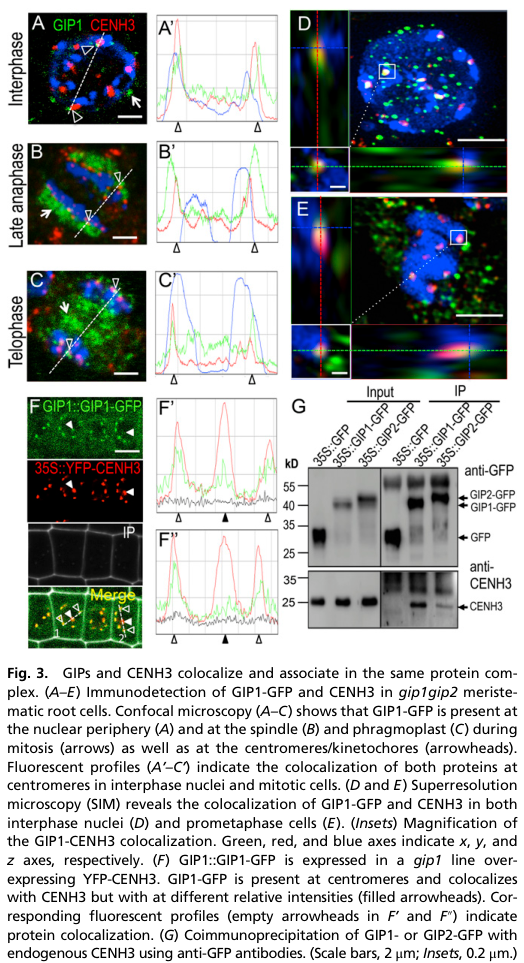

## Question

# Gene Research for Functional Annotation

## ⚠️ CRITICAL: Gene/Protein Identification Context

**BEFORE YOU BEGIN RESEARCH:** You MUST verify you are researching the CORRECT gene/protein. Gene symbols can be ambiguous, especially for less well-characterized genes from non-model organisms.

### Target Gene/Protein Identity (from UniProt):
- **UniProt Accession:** Q9M0N8
- **Protein Description:** RecName: Full=Mitotic-spindle organizing protein 1B; AltName: Full=GCP3-interacting protein 1; Short=AtGIP1; AltName: Full=Mitotic-spindle organizing protein associated with a ring of gamma-tubulin 1B; Short=AtGIP1B;
- **Gene Information:** Name=GIP1; Synonyms=GIP1B; OrderedLocusNames=At4g09550; ORFNames=T15G18.30;
- **Organism (full):** Arabidopsis thaliana (Mouse-ear cress).
- **Protein Family:** Belongs to the MOZART1 family. .
- **Key Domains:** MZT1. (IPR022214); MOZART1 (PF12554)

### MANDATORY VERIFICATION STEPS:

1. **Check if the gene symbol "GIP1" matches the protein description above**
2. **Verify the organism is correct:** Arabidopsis thaliana (Mouse-ear cress).
3. **Check if protein family/domains align with what you find in literature**
4. **If you find literature for a DIFFERENT gene with the same or similar symbol, STOP**

### If Gene Symbol is Ambiguous or You Cannot Find Relevant Literature:

**DO NOT PROCEED WITH RESEARCH ON A DIFFERENT GENE.** Instead:
- State clearly: "The gene symbol 'GIP1' is ambiguous or literature is limited for this specific protein"
- Explain what you found (e.g., "Found extensive literature on a different gene with the same symbol in a different organism")
- Describe the protein based ONLY on the UniProt information provided above
- Suggest that the protein function can be inferred from domain/family information

### Research Target:

Please provide a comprehensive research report on the gene **GIP1** (gene ID: GIP1, UniProt: Q9M0N8) in ARATH.

The research report should be a detailed narrative explaining the function, biological processes, and localization of the gene product. Citations should be given for all claims.

You should prioritize authoritative reviews and primary scientific literature when conducting research. You can supplement
this with annotations you find in gene/protein databases, but these can be outdated or inaccurate.

We are specifically interested in the primary function of the gene - for enzymes, what reaction is catalyzed, and what is the substrate specificity? For transporters, what is the substrate? For structural proteins or adapters, what is the broader structural role? For signaling molecules, what is the role in the pathway.

We are interested in where in or outside the cell the gene product carries out its function.

We are also interested in the signaling or biochemical pathways in which the gene functions. We are less interested in broad pleiotropic effects, except where these elucidate the precise role.

Include evidence where possible. We are interested in both experimental evidence as well as inference from structure, evolution, or bioinformatic analysis. Precise studies should be prioritized over high-throughput, where available.

## Output

Question: You are an expert researcher providing comprehensive, well-cited information.

Provide detailed information focusing on:
1. Key concepts and definitions with current understanding
2. Recent developments and latest research (prioritize 2023-2024 sources)
3. Current applications and real-world implementations
4. Expert opinions and analysis from authoritative sources
5. Relevant statistics and data from recent studies

Format as a comprehensive research report with proper citations. Include URLs and publication dates where available.
Always prioritize recent, authoritative sources and provide specific citations for all major claims.

# Gene Research for Functional Annotation

## ⚠️ CRITICAL: Gene/Protein Identification Context

**BEFORE YOU BEGIN RESEARCH:** You MUST verify you are researching the CORRECT gene/protein. Gene symbols can be ambiguous, especially for less well-characterized genes from non-model organisms.

### Target Gene/Protein Identity (from UniProt):
- **UniProt Accession:** Q9M0N8
- **Protein Description:** RecName: Full=Mitotic-spindle organizing protein 1B; AltName: Full=GCP3-interacting protein 1; Short=AtGIP1; AltName: Full=Mitotic-spindle organizing protein associated with a ring of gamma-tubulin 1B; Short=AtGIP1B;
- **Gene Information:** Name=GIP1; Synonyms=GIP1B; OrderedLocusNames=At4g09550; ORFNames=T15G18.30;
- **Organism (full):** Arabidopsis thaliana (Mouse-ear cress).
- **Protein Family:** Belongs to the MOZART1 family. .
- **Key Domains:** MZT1. (IPR022214); MOZART1 (PF12554)

### MANDATORY VERIFICATION STEPS:

1. **Check if the gene symbol "GIP1" matches the protein description above**
2. **Verify the organism is correct:** Arabidopsis thaliana (Mouse-ear cress).
3. **Check if protein family/domains align with what you find in literature**
4. **If you find literature for a DIFFERENT gene with the same or similar symbol, STOP**

### If Gene Symbol is Ambiguous or You Cannot Find Relevant Literature:

**DO NOT PROCEED WITH RESEARCH ON A DIFFERENT GENE.** Instead:
- State clearly: "The gene symbol 'GIP1' is ambiguous or literature is limited for this specific protein"
- Explain what you found (e.g., "Found extensive literature on a different gene with the same symbol in a different organism")
- Describe the protein based ONLY on the UniProt information provided above
- Suggest that the protein function can be inferred from domain/family information

### Research Target:

Please provide a comprehensive research report on the gene **GIP1** (gene ID: GIP1, UniProt: Q9M0N8) in ARATH.

The research report should be a detailed narrative explaining the function, biological processes, and localization of the gene product. Citations should be given for all claims.

You should prioritize authoritative reviews and primary scientific literature when conducting research. You can supplement
this with annotations you find in gene/protein databases, but these can be outdated or inaccurate.

We are specifically interested in the primary function of the gene - for enzymes, what reaction is catalyzed, and what is the substrate specificity? For transporters, what is the substrate? For structural proteins or adapters, what is the broader structural role? For signaling molecules, what is the role in the pathway.

We are interested in where in or outside the cell the gene product carries out its function.

We are also interested in the signaling or biochemical pathways in which the gene functions. We are less interested in broad pleiotropic effects, except where these elucidate the precise role.

Include evidence where possible. We are interested in both experimental evidence as well as inference from structure, evolution, or bioinformatic analysis. Precise studies should be prioritized over high-throughput, where available.

## Research report: Arabidopsis thaliana **GIP1 / AtGIP1B** (UniProt **Q9M0N8**, locus **At4g09550**) — functional annotation

### Executive summary
Arabidopsis **GIP1** encodes a small (~8 kDa), α-helical **MOZART1/MZT1-family** protein that functions as an integral γ-tubulin–complex–associated factor (γ-TuC). The best-supported primary roles for AtGIP1 are (i) **recruitment/anchoring of γ-tubulin complexes to microtubule nucleation sites**, notably the **nuclear envelope** in acentrosomal plant cells, supporting spindle/phragmoplast microtubule organization, and (ii) an additional, experimentally supported nuclear role in **centromere/kinetochore integrity** including **CENH3 loading/maintenance** and **centromeric cohesion**, with strong consequences for genome stability when GIP function is reduced. (batzenschlager2013thegipgammatubulin pages 1-2, batzenschlager2014gipmzt1proteinsorchestrate pages 1-2, batzenschlager2015arabidopsismzt1homologs pages 3-4, batzenschlager2015arabidopsismzt1homologs pages 2-3)

### Mandatory gene/protein identity verification (critical)
The literature retrieved here matches the UniProt target (Q9M0N8) because it explicitly studies **Arabidopsis thaliana AtGIP1** as a **GCP3-interacting protein**, described as a small (~8 kDa) γ-tubulin complex component and also termed an **MZT1/MOZART1 homolog**. The locus used in these studies is **At4g09550**, consistent with the provided UniProt record. (batzenschlager2013thegipgammatubulin pages 1-2, batzenschlager2014gipmzt1proteinsorchestrate pages 2-3)

---

## 1) Key concepts and definitions (current understanding)

### 1.1 γ-tubulin complexes and plant MTOCs
**γ-Tubulin complexes (γ-TuCs)** are described as **microtubule (MT) nucleators**. Whereas many eukaryotes concentrate γ-TuCs at centrosomes (animals) or spindle pole bodies (yeast), plants rely heavily on **non-centrosomal nucleation sites**, including the **nuclear envelope (NE)**, where γ-TuCs are recruited to nucleate perinuclear MT arrays that contribute to spindle assembly. (batzenschlager2014gipmzt1proteinsorchestrate pages 1-2, batzenschlager2013thegipgammatubulin pages 1-2)

### 1.2 GIP/MZT1 (MOZART1) proteins
Arabidopsis **GIP proteins (GIP1/GIP2)** are defined as **GCP3-interacting proteins** and described as **integral γ-TuC components**. Multiple lines of evidence support that their primary mechanistic contribution is **recruitment/anchoring of γ-TuCs** to MT nucleation sites (e.g., NE), rather than being required for core γ-TuC assembly; this is supported by cross-species logic described in the Arabidopsis-focused review (including evidence from fission yeast Mzt1) and by Arabidopsis mutant phenotypes affecting γ-TuC localization and MT-array robustness. (batzenschlager2014gipmzt1proteinsorchestrate pages 1-2, batzenschlager2014gipmzt1proteinsorchestrate pages 2-3)

---

## 2) Molecular function and mechanisms (experimentally supported)

### 2.1 Molecular interactions: AtGIP1 binds γ-TuC component GCP3
AtGIP1 was discovered as an **AtGCP3 interactor** using **yeast two-hybrid** and validated with a **GST pull-down** assay: radiolabeled AtGIP1 was specifically recovered with **GST-AtGCP3** (not controls), supporting a direct physical interaction consistent with AtGIP1 acting within/alongside the γ-tubulin nucleation machinery. (janski2008identificationofa pages 1-2, janski2008identificationofa pages 3-3)

### 2.2 Recruitment/anchoring of γ-TuCs at the nuclear envelope
In Arabidopsis, γ-TuC subunits such as GCP2/GCP3 can be found at the **nuclear periphery**, but the literature emphasizes that these proteins lack transmembrane domains and thus require **anchoring factors** to associate with the NE. GIP proteins are proposed to provide such anchoring (directly and/or via NE partners such as **TSA1** identified as a GIP interactor), enabling γ-TuC recruitment at the **outer nuclear membrane** for perinuclear MT nucleation. (batzenschlager2014gipmzt1proteinsorchestrate pages 2-3, batzenschlager2013thegipgammatubulin pages 7-9)

### 2.3 Additional nuclear role: centromere/kinetochore integrity
A key advance from primary Arabidopsis work is that AtGIP1/AtGIP2 also physically and spatially associate with centromere components. AtGIP1 localizes to **kinetochores/centromeres** and **colocalizes with CENH3** and centromeric DNA, and coimmunoprecipitation detects endogenous **CENH3 in GIP1 complexes**, supporting in vivo association. (batzenschlager2015arabidopsismzt1homologs pages 3-4, batzenschlager2015arabidopsismzt1homologs pages 4-4)

Mechanistically, this work concludes that **GIPs are essential for CENH3 loading and/or maintenance** in cycling cells, and that loss of GIP function disrupts centromere composition (e.g., CENH3 and CENP-C) and centromeric cohesion (e.g., reduced SMC3 at centromeres), linking GIP biology to genome stability. (batzenschlager2015arabidopsismzt1homologs pages 3-4, batzenschlager2015arabidopsismzt1homologs pages 4-4)

---

## 3) Subcellular localization (where the protein acts)

### 3.1 Interphase
AtGIP1 shows a **punctate/dotted distribution at the nuclear envelope** in interphase cells, and is also detected on both sides of the NE (inner/outer) with association near heterochromatin/chromocenters (as summarized in the Arabidopsis review and supported by primary localization studies). (batzenschlager2014gipmzt1proteinsorchestrate pages 2-3, batzenschlager2013thegipgammatubulin pages 7-9)

### 3.2 Mitosis
During mitosis, AtGIP1 localizes on **microtubule arrays** including **spindle and phragmoplast**, and importantly can be detected at **kinetochores/centromeres**, consistent with its dual microtubule-nucleation and centromere-related functions. Figure-level evidence shows GIP1-GFP at the nuclear periphery and centromeres with CENH3 colocalization. (batzenschlager2015arabidopsismzt1homologs pages 3-4, batzenschlager2015arabidopsismzt1homologs media 33283558)

---

## 4) Biological processes and pathways

### 4.1 Acentrosomal MT nucleation and spindle organization
The plant NE acts as a microtubule nucleation site by recruiting γ-TuCs; GIP proteins are required for γ-TuC recruitment and therefore contribute to robust formation/behavior of mitotic MT arrays. Mutants with reduced GIP function show impaired spindle robustness/organization, consistent with a role in organizing MT nucleation and MT arrays in acentrosomal plant cells. (batzenschlager2014gipmzt1proteinsorchestrate pages 1-2, batzenschlager2013thegipgammatubulin pages 1-2)

### 4.2 Nuclear-envelope organization and nuclear shaping
Beyond MT nucleation, loss of GIP function results in striking NE and nuclear-shape defects, supporting a model in which GIPs help integrate cytoskeletal organization with nuclear architecture (the “nucleo-cytoplasmic continuum”). (batzenschlager2013thegipgammatubulin pages 3-5, batzenschlager2014gipmzt1proteinsorchestrate pages 2-3)

### 4.3 Centromere assembly and cohesion maintenance (CENH3 pathway)
In a centromere-focused framework, a 2024 authoritative review summarizes that **Arabidopsis gip1 gip2 mutants show decreased CENH3 loading and centromeric cohesion defects**, placing GIPs among kinetochore/centromere-associated factors affecting CENH3 homeostasis and centromere identity in plants. (naish2024thestructurefunction pages 4-5)

---

## 5) Mutant phenotypes, statistics, and key datasets

### 5.1 Nuclear morphology and NPC organization
In gip1gip2 knockdown mutants, **>70% of nuclei** in root tips show irregular nuclear shapes (lobulated/dented). Nuclear pore complex (NPC) spacing changes substantially: the mean inter-NPC distance is reported as ~**90 nm** in WT but drops to **<60 nm** in mutants, indicating major NE remodeling. (batzenschlager2013thegipgammatubulin pages 3-5)

### 5.2 Centromere cohesion and aneuploidy (quantitative)
Primary Arabidopsis work reports multiple quantitative indicators of centromere dysfunction and genome instability:

- **Intercentromere distance** increased by **32%** and **interkinetochore distance** by **42%** vs WT. (batzenschlager2015arabidopsismzt1homologs pages 2-3)
- **Isolated chromatids** observed in **16.6%** of gip cells (n = 30), consistent with cohesion defects. (batzenschlager2015arabidopsismzt1homologs pages 2-3)
- **Irregular CENH3 signals** in **49%** of chromocenters (n = 200). (batzenschlager2015arabidopsismzt1homologs pages 3-4)
- **Centromere defects** in **47.6%** of anaphase cells (n = 42). (batzenschlager2015arabidopsismzt1homologs pages 3-4)
- **Micronuclei** in **7%** of interphase cells (n = 426). (batzenschlager2015arabidopsismzt1homologs pages 3-4)
- **Aneuploidy**: **60%** of cells with **11–19 chromosomes** (n = 50). (batzenschlager2015arabidopsismzt1homologs pages 3-4)
- **Centromeric pAL FISH** on flow-sorted nuclei showed excess centromeric signals in both 2C and 4C fractions depending on mutant severity (e.g., up to **38–41%** of 4C nuclei with >10 pAL signals in more severe classes), consistent with ploidy instability. (batzenschlager2015arabidopsismzt1homologs pages 2-3)

### 5.3 CENH3 loading/maintenance measurements
CENH3 signal intensity is quantitatively reduced in gip mutants (WT n = 50; gip n = 156; **P < 0.01**), and CENH3 protein levels decrease despite stable mRNA, supporting a model of impaired CENH3 loading and/or maintenance. (batzenschlager2015arabidopsismzt1homologs pages 4-4)

---

## 6) Current applications and real-world implementations
Although AtGIP1 is not a “biotech application” gene per se, it is widely used in **cell biology and functional genomics workflows** as a mechanistic entry point into plant microtubule nucleation and nuclear organization:

- **Transgenic marker lines** (e.g., **GIP1::GIP1-GFP**, **35S::EYFP-CENH3**) enable live imaging of NE and centromere dynamics. (batzenschlager2015arabidopsismzt1homologs pages 4-4, batzenschlager2015arabidopsismzt1homologs pages 3-4)
- **Protein interaction assays** (Y2H, GST pull-down, coIP) map γ-TuC-associated networks, including GCP3 and centromeric associations. (janski2008identificationofa pages 1-2, batzenschlager2015arabidopsismzt1homologs pages 4-4)
- **Advanced imaging** (structured illumination microscopy, FRAP) is used to quantify colocalization and dynamics at centromeres/NE. (batzenschlager2015arabidopsismzt1homologs pages 3-4, batzenschlager2015arabidopsismzt1homologs media 33283558)
- **Genome-stability assays** (FISH on flow-sorted nuclei; flow cytometry/FACS; chromosome counting) provide quantitative phenotyping of centromere cohesion and aneuploidy. (batzenschlager2015arabidopsismzt1homologs pages 2-3)

These implementations illustrate how AtGIP1 functions as a practical tool and mechanistic factor for dissecting acentrosomal MT nucleation and centromere maintenance in plants. (batzenschlager2015arabidopsismzt1homologs pages 2-3, batzenschlager2013thegipgammatubulin pages 3-5)

---

## 7) Expert opinions and authoritative synthesis (2023–2024 priority)
The strongest 2024 source retrieved for direct GIP context is the **Genome Research (Feb 2024)** centromere review, which explicitly cites the Arabidopsis **gip1 gip2** double-mutant phenotype as decreased CENH3 loading and defective centromeric cohesion. This review places GIP proteins into a current centromere homeostasis model where kinetochore/centromere components can reinforce CENH3 incorporation and stability (a positive-feedback view). (naish2024thestructurefunction pages 4-5)

Separately, Arabidopsis-focused expert synthesis (Frontiers Plant Sci review) emphasizes the NE as a dispersed plant MTOC and highlights GIP/MZT1 proteins as key NE-associated γ-TuC factors connecting microtubule nucleation to nuclear shaping and differentiation-linked nuclear architecture. (batzenschlager2014gipmzt1proteinsorchestrate pages 2-3)

**Limitation:** within the retrieved corpus, a dedicated 2023–2024 plant microtubule nucleation review that explicitly re-analyzes AtGIP1 was not accessible; thus, the most recent “AtGIP1-specific” synthesis is centromere-centric (2024) rather than microtubule-centric. (naish2024thestructurefunction pages 4-5)

---

## Evidence map (table)
The following table provides a compact evidence map linking claims to the best supporting papers (with DOI URLs and dates).

| Claim/Aspect | Key findings | Best supporting sources |
|---|---|---|
| Identity / family / core definition | **AtGIP1 = Arabidopsis thaliana At4g09550, UniProt Q9M0N8**, a small **~8 kDa**, predominantly **α-helical** **MOZART1/MZT1-family** protein and the **smallest γ-tubulin complex (γ-TuC) component** described in Arabidopsis; functions with the paralog AtGIP2 in localizing active γ-TuCs to interphase and mitotic MT nucleation sites. (batzenschlager2013thegipgammatubulin pages 1-2, batzenschlager2014gipmzt1proteinsorchestrate pages 2-3) | **Batzenschlager 2013**, *Frontiers in Plant Science*, Nov 2013, https://doi.org/10.3389/fpls.2013.00480; **Batzenschlager 2014**, *Frontiers in Plant Science*, Feb 2014, https://doi.org/10.3389/fpls.2014.00029 |
| GCP3 interaction (discovery / biochemical support) | AtGIP1 was first identified as a **GCP3-interacting protein** by **yeast two-hybrid**; **GST pull-down** confirmed specificity, with radiolabeled AtGIP1 detected only in the **GST-AtGCP3** fraction; pulled-down AtGIP1 migrated at **~7.8 kDa**. This supports direct association with γ-TuC machinery rather than an unrelated GIP1 gene product. (janski2008identificationofa pages 1-2, janski2008identificationofa pages 3-3) | **Janski 2008**, *Cell Biology International*, May 2008, https://doi.org/10.1016/j.cellbi.2007.11.006 |
| Nuclear-envelope localization and proposed γ-TuC anchoring | AtGIP1-GFP shows a **dotted pattern at the nuclear envelope (NE)** in interphase; EM/immunogold localized GIPs on **both sides of the NE** and near heterochromatin/chromocenters. Reviews and primary studies argue GIPs are needed for **recruitment/anchoring of γ-TuCs at the outer nuclear membrane**, because GCP proteins localize to the nuclear periphery yet lack transmembrane segments; **TSA1** is an NE partner identified for AtGIP1 and proposed to participate in anchoring. (batzenschlager2014gipmzt1proteinsorchestrate pages 2-3, batzenschlager2014gipmzt1proteinsorchestrate pages 1-2, batzenschlager2013thegipgammatubulin pages 7-9, batzenschlager2013thegipgammatubulin pages 1-2) | **Batzenschlager 2014**, *Frontiers in Plant Science*, Feb 2014, https://doi.org/10.3389/fpls.2014.00029; **Batzenschlager 2013**, *Frontiers in Plant Science*, Nov 2013, https://doi.org/10.3389/fpls.2013.00480 |
| Spindle / phragmoplast / mitotic MT-array association | During mitosis, GIP1 localizes on **microtubule arrays**, including **spindle fibers** and the **phragmoplast**, and relocalizes to the reforming NE in telophase. Loss of GIP1/GIP2 impairs formation of a **fully functional mitotic spindle**, consistent with a role in plant acentrosomal MTOCs and MT-array robustness. (batzenschlager2015arabidopsismzt1homologs pages 3-4, batzenschlager2014gipmzt1proteinsorchestrate pages 2-3, batzenschlager2013thegipgammatubulin pages 1-2) | **Batzenschlager 2015**, *PNAS*, Jun 2015, https://doi.org/10.1073/pnas.1506351112; **Batzenschlager 2014**, *Frontiers in Plant Science*, Feb 2014, https://doi.org/10.3389/fpls.2014.00029; **Batzenschlager 2013**, *Frontiers in Plant Science*, Nov 2013, https://doi.org/10.3389/fpls.2013.00480 |
| Nuclear shaping / nuclear-envelope organization / NPC spacing | **gip1gip2** mutants show major nuclear architecture defects: **>70%** of root-tip nuclei are irregular/lobulated; TEM shows deeply invaginated NE with protrusions; **NPC spacing** shifts from about **90 nm in WT** to **<60 nm in mutants**. Mutants also display SUN1 misorganization/mislocalization and increased ploidy, linking GIP function to the nucleo-cytoplasmic continuum and NE integrity. (batzenschlager2013thegipgammatubulin pages 3-5, batzenschlager2014gipmzt1proteinsorchestrate pages 2-3, batzenschlager2013thegipgammatubulin pages 7-9) | **Batzenschlager 2013**, *Frontiers in Plant Science*, Nov 2013, https://doi.org/10.3389/fpls.2013.00480; **Batzenschlager 2014**, *Frontiers in Plant Science*, Feb 2014, https://doi.org/10.3389/fpls.2014.00029 |
| Centromere / kinetochore localization and CENH3 association | GIP1 localizes to the **nuclear periphery** and also to **kinetochores/centromeres**, where it **colocalizes with CENH3 and centromeric DNA** by confocal and **SIM** imaging. **Coimmunoprecipitation** detected endogenous **CENH3 in GIP1 complexes** (weaker for GIP2), indicating in vivo physical association. Figure-based evidence specifically places GIP1-GFP at the NE and centromeres and documents CENH3 colocalization. (batzenschlager2015arabidopsismzt1homologs pages 3-4, batzenschlager2015arabidopsismzt1homologs pages 4-4, batzenschlager2015arabidopsismzt1homologs media 33283558) | **Batzenschlager 2015**, *PNAS*, Jun 2015, https://doi.org/10.1073/pnas.1506351112 |
| Centromeric cohesion, chromosome segregation, and genome instability statistics | GIP loss causes strong centromere/cohesion defects: **intercentromere distance +32%**, **interkinetochore distance +42%**; **isolated chromatids in 16.6%** of gip cells (**n=30**); **49%** of chromocenters with irregular CENH3 (**n=200**); **47.6%** of anaphases with centromere defects (**n=42**); **7%** of interphase cells with micronuclei (**n=426**); **60%** of cells aneuploid with **11–19 chromosomes** (**n=50**). pAL FISH on sorted nuclei also showed excess centromeric signals in multiple mutant classes, consistent with ploidy instability. (batzenschlager2015arabidopsismzt1homologs pages 2-3, batzenschlager2015arabidopsismzt1homologs pages 3-4) | **Batzenschlager 2015**, *PNAS*, Jun 2015, https://doi.org/10.1073/pnas.1506351112 |
| CENH3 loading / maintenance and centromere architecture | The 2015 study concludes GIPs are **essential for CENH3 loading and/or maintenance in cycling cells**. Quantitatively, CENH3 signal intensity was significantly reduced in mutants (**WT n=50; gip n=156; P<0.01**), with protein decrease despite stable mRNA; CENP-C, KNL2, and SMC3 recruitment/localization were also perturbed. This supports a dual model: GIP1 contributes both to **γ-TuC recruitment** and to **centromere identity/cohesion**. (batzenschlager2015arabidopsismzt1homologs pages 4-4, batzenschlager2015arabidopsismzt1homologs pages 1-2) | **Batzenschlager 2015**, *PNAS*, Jun 2015, https://doi.org/10.1073/pnas.1506351112 |
| Experimental implementations / assays used | Evidence comes from integrated cell-biology workflows in Arabidopsis: **transgenic marker lines** (e.g., **GIP1::GIP1-GFP**, **35S::YFP/EYFP-CENH3**, AtSUN1-YFP, AtTSA1-RFP), **Y2H**, **GST pull-down**, **coIP**, **confocal live imaging**, **SIM**, **FRAP**, **FISH on flow-sorted nuclei**, **flow cytometry/FACS**, **TEM/immunogold EM**, **immunolocalization**, **Western blot**, and **qRT-PCR**. These are the main real-world implementations supporting functional annotation. (batzenschlager2015arabidopsismzt1homologs pages 4-4, batzenschlager2015arabidopsismzt1homologs pages 3-4, batzenschlager2013thegipgammatubulin pages 3-5, batzenschlager2013thegipgammatubulin pages 2-3) | **Janski 2008**, *Cell Biology International*, May 2008, https://doi.org/10.1016/j.cellbi.2007.11.006; **Batzenschlager 2013**, *Frontiers in Plant Science*, Nov 2013, https://doi.org/10.3389/fpls.2013.00480; **Batzenschlager 2015**, *PNAS*, Jun 2015, https://doi.org/10.1073/pnas.1506351112 |
| Recent 2024 context / current understanding | A recent authoritative review of plant centromeres states that the **Arabidopsis gip1 gip2 double mutant shows decreased CENH3 loading and centromeric cohesion defects**, placing GIP proteins in the broader contemporary model where kinetochore/centromere factors help stabilize or reinforce CENH3 chromatin. This is the clearest 2024 literature context found for AtGIP1 specifically. (naish2024thestructurefunction pages 4-5) | **Naish 2024**, *Genome Research*, Feb 2024, https://doi.org/10.1101/gr.278409.123 |

*Table: This table summarizes the strongest literature-backed functional annotation evidence for Arabidopsis AtGIP1/Q9M0N8, including molecular interactions, localization, mutant phenotypes, and assay types. It is useful as a compact evidence map linking AtGIP1 to γ-tubulin complex recruitment, nuclear-envelope organization, and centromere biology.*

---

## Key primary sources (with dates and URLs)
- Janski N. et al. **May 2008**. *Cell Biology International*. “Identification of a novel small Arabidopsis protein interacting with gamma-tubulin complex protein 3.” https://doi.org/10.1016/j.cellbi.2007.11.006 (janski2008identificationofa pages 1-2)
- Batzenschlager M. et al. **Nov 2013**. *Frontiers in Plant Science*. “The GIP gamma-tubulin complex-associated proteins are involved in nuclear architecture in Arabidopsis thaliana.” https://doi.org/10.3389/fpls.2013.00480 (batzenschlager2013thegipgammatubulin pages 1-2)
- Batzenschlager M. et al. **Feb 2014**. *Frontiers in Plant Science*. “GIP/MZT1 proteins orchestrate nuclear shaping.” https://doi.org/10.3389/fpls.2014.00029 (batzenschlager2014gipmzt1proteinsorchestrate pages 1-2)
- Batzenschlager M. et al. **Jun 2015**. *PNAS*. “Arabidopsis MZT1 homologs GIP1 and GIP2 are essential for centromere architecture.” https://doi.org/10.1073/pnas.1506351112 (batzenschlager2015arabidopsismzt1homologs pages 2-3)
- Naish M., Henderson I.R. **Feb 2024**. *Genome Research*. “The structure, function, and evolution of plant centromeres.” https://doi.org/10.1101/gr.278409.123 (naish2024thestructurefunction pages 4-5)

References

1. (batzenschlager2013thegipgammatubulin pages 1-2): Morgane Batzenschlager, Kinda Masoud, Natacha Janski, Guy Houlné, Etienne Herzog, Jean-Luc Evrard, Nicolas Baumberger, Mathieu Erhardt, Yves Nominé, Bruno Kieffer, Anne-Catherine Schmit, and Marie-Edith Chabouté. The gip gamma-tubulin complex-associated proteins are involved in nuclear architecture in arabidopsis thaliana. Frontiers in Plant Science, Nov 2013. URL: https://doi.org/10.3389/fpls.2013.00480, doi:10.3389/fpls.2013.00480. This article has 64 citations.

2. (batzenschlager2014gipmzt1proteinsorchestrate pages 1-2): Morgane Batzenschlager, Etienne Herzog, Guy Houlné, Anne-Catherine Schmit, and Marie-Edith Chabouté. Gip/mzt1 proteins orchestrate nuclear shaping. Frontiers in Plant Science, Feb 2014. URL: https://doi.org/10.3389/fpls.2014.00029, doi:10.3389/fpls.2014.00029. This article has 20 citations.

3. (batzenschlager2015arabidopsismzt1homologs pages 3-4): Morgane Batzenschlager, Inna Lermontova, Veit Schubert, Jörg Fuchs, Alexandre Berr, Maria A. Koini, Guy Houlné, Etienne Herzog, Twan Rutten, Abdelmalek Alioua, Paul Fransz, Anne-Catherine Schmit, and Marie-Edith Chabouté. Arabidopsis mzt1 homologs gip1 and gip2 are essential for centromere architecture. Proceedings of the National Academy of Sciences, 112:8656-8660, Jun 2015. URL: https://doi.org/10.1073/pnas.1506351112, doi:10.1073/pnas.1506351112. This article has 63 citations and is from a highest quality peer-reviewed journal.

4. (batzenschlager2015arabidopsismzt1homologs pages 2-3): Morgane Batzenschlager, Inna Lermontova, Veit Schubert, Jörg Fuchs, Alexandre Berr, Maria A. Koini, Guy Houlné, Etienne Herzog, Twan Rutten, Abdelmalek Alioua, Paul Fransz, Anne-Catherine Schmit, and Marie-Edith Chabouté. Arabidopsis mzt1 homologs gip1 and gip2 are essential for centromere architecture. Proceedings of the National Academy of Sciences, 112:8656-8660, Jun 2015. URL: https://doi.org/10.1073/pnas.1506351112, doi:10.1073/pnas.1506351112. This article has 63 citations and is from a highest quality peer-reviewed journal.

5. (batzenschlager2014gipmzt1proteinsorchestrate pages 2-3): Morgane Batzenschlager, Etienne Herzog, Guy Houlné, Anne-Catherine Schmit, and Marie-Edith Chabouté. Gip/mzt1 proteins orchestrate nuclear shaping. Frontiers in Plant Science, Feb 2014. URL: https://doi.org/10.3389/fpls.2014.00029, doi:10.3389/fpls.2014.00029. This article has 20 citations.

6. (janski2008identificationofa pages 1-2): Natacha Janski, Etienne Herzog, and Anne‐Catherine Schmit. Identification of a novel small arabidopsis protein interacting with gamma‐tubulin complex protein 3. Cell Biology International, 32:546-548, May 2008. URL: https://doi.org/10.1016/j.cellbi.2007.11.006, doi:10.1016/j.cellbi.2007.11.006. This article has 39 citations and is from a peer-reviewed journal.

7. (janski2008identificationofa pages 3-3): Natacha Janski, Etienne Herzog, and Anne‐Catherine Schmit. Identification of a novel small arabidopsis protein interacting with gamma‐tubulin complex protein 3. Cell Biology International, 32:546-548, May 2008. URL: https://doi.org/10.1016/j.cellbi.2007.11.006, doi:10.1016/j.cellbi.2007.11.006. This article has 39 citations and is from a peer-reviewed journal.

8. (batzenschlager2013thegipgammatubulin pages 7-9): Morgane Batzenschlager, Kinda Masoud, Natacha Janski, Guy Houlné, Etienne Herzog, Jean-Luc Evrard, Nicolas Baumberger, Mathieu Erhardt, Yves Nominé, Bruno Kieffer, Anne-Catherine Schmit, and Marie-Edith Chabouté. The gip gamma-tubulin complex-associated proteins are involved in nuclear architecture in arabidopsis thaliana. Frontiers in Plant Science, Nov 2013. URL: https://doi.org/10.3389/fpls.2013.00480, doi:10.3389/fpls.2013.00480. This article has 64 citations.

9. (batzenschlager2015arabidopsismzt1homologs pages 4-4): Morgane Batzenschlager, Inna Lermontova, Veit Schubert, Jörg Fuchs, Alexandre Berr, Maria A. Koini, Guy Houlné, Etienne Herzog, Twan Rutten, Abdelmalek Alioua, Paul Fransz, Anne-Catherine Schmit, and Marie-Edith Chabouté. Arabidopsis mzt1 homologs gip1 and gip2 are essential for centromere architecture. Proceedings of the National Academy of Sciences, 112:8656-8660, Jun 2015. URL: https://doi.org/10.1073/pnas.1506351112, doi:10.1073/pnas.1506351112. This article has 63 citations and is from a highest quality peer-reviewed journal.

10. (batzenschlager2015arabidopsismzt1homologs media 33283558): Morgane Batzenschlager, Inna Lermontova, Veit Schubert, Jörg Fuchs, Alexandre Berr, Maria A. Koini, Guy Houlné, Etienne Herzog, Twan Rutten, Abdelmalek Alioua, Paul Fransz, Anne-Catherine Schmit, and Marie-Edith Chabouté. Arabidopsis mzt1 homologs gip1 and gip2 are essential for centromere architecture. Proceedings of the National Academy of Sciences, 112:8656-8660, Jun 2015. URL: https://doi.org/10.1073/pnas.1506351112, doi:10.1073/pnas.1506351112. This article has 63 citations and is from a highest quality peer-reviewed journal.

11. (batzenschlager2013thegipgammatubulin pages 3-5): Morgane Batzenschlager, Kinda Masoud, Natacha Janski, Guy Houlné, Etienne Herzog, Jean-Luc Evrard, Nicolas Baumberger, Mathieu Erhardt, Yves Nominé, Bruno Kieffer, Anne-Catherine Schmit, and Marie-Edith Chabouté. The gip gamma-tubulin complex-associated proteins are involved in nuclear architecture in arabidopsis thaliana. Frontiers in Plant Science, Nov 2013. URL: https://doi.org/10.3389/fpls.2013.00480, doi:10.3389/fpls.2013.00480. This article has 64 citations.

12. (naish2024thestructurefunction pages 4-5): Matthew Naish and Ian R. Henderson. The structure, function, and evolution of plant centromeres. Genome Research, 34:161-178, Feb 2024. URL: https://doi.org/10.1101/gr.278409.123, doi:10.1101/gr.278409.123. This article has 89 citations and is from a highest quality peer-reviewed journal.

13. (batzenschlager2015arabidopsismzt1homologs pages 1-2): Morgane Batzenschlager, Inna Lermontova, Veit Schubert, Jörg Fuchs, Alexandre Berr, Maria A. Koini, Guy Houlné, Etienne Herzog, Twan Rutten, Abdelmalek Alioua, Paul Fransz, Anne-Catherine Schmit, and Marie-Edith Chabouté. Arabidopsis mzt1 homologs gip1 and gip2 are essential for centromere architecture. Proceedings of the National Academy of Sciences, 112:8656-8660, Jun 2015. URL: https://doi.org/10.1073/pnas.1506351112, doi:10.1073/pnas.1506351112. This article has 63 citations and is from a highest quality peer-reviewed journal.

14. (batzenschlager2013thegipgammatubulin pages 2-3): Morgane Batzenschlager, Kinda Masoud, Natacha Janski, Guy Houlné, Etienne Herzog, Jean-Luc Evrard, Nicolas Baumberger, Mathieu Erhardt, Yves Nominé, Bruno Kieffer, Anne-Catherine Schmit, and Marie-Edith Chabouté. The gip gamma-tubulin complex-associated proteins are involved in nuclear architecture in arabidopsis thaliana. Frontiers in Plant Science, Nov 2013. URL: https://doi.org/10.3389/fpls.2013.00480, doi:10.3389/fpls.2013.00480. This article has 64 citations.

## Artifacts

- [Edison artifact artifact-00](GIP1-deep-research-falcon_artifacts/artifact-00.md)

## Citations

1. naish2024thestructurefunction pages 4-5
2. batzenschlager2013thegipgammatubulin pages 3-5
3. janski2008identificationofa pages 1-2
4. batzenschlager2013thegipgammatubulin pages 1-2
5. janski2008identificationofa pages 3-3
6. batzenschlager2013thegipgammatubulin pages 7-9
7. batzenschlager2013thegipgammatubulin pages 2-3
8. https://doi.org/10.3389/fpls.2013.00480;
9. https://doi.org/10.3389/fpls.2014.00029
10. https://doi.org/10.1016/j.cellbi.2007.11.006
11. https://doi.org/10.3389/fpls.2014.00029;
12. https://doi.org/10.3389/fpls.2013.00480
13. https://doi.org/10.1073/pnas.1506351112;
14. https://doi.org/10.1073/pnas.1506351112
15. https://doi.org/10.1016/j.cellbi.2007.11.006;
16. https://doi.org/10.1101/gr.278409.123
17. https://doi.org/10.3389/fpls.2013.00480,
18. https://doi.org/10.3389/fpls.2014.00029,
19. https://doi.org/10.1073/pnas.1506351112,
20. https://doi.org/10.1016/j.cellbi.2007.11.006,
21. https://doi.org/10.1101/gr.278409.123,