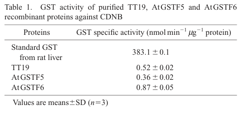

## Question

# Gene Research for Functional Annotation

## ⚠️ CRITICAL: Gene/Protein Identification Context

**BEFORE YOU BEGIN RESEARCH:** You MUST verify you are researching the CORRECT gene/protein. Gene symbols can be ambiguous, especially for less well-characterized genes from non-model organisms.

### Target Gene/Protein Identity (from UniProt):
- **UniProt Accession:** P42760
- **Protein Description:** RecName: Full=Glutathione S-transferase F6; Short=AtGSTF6; EC=2.5.1.18; AltName: Full=AtGSTF3; AltName: Full=GST class-phi member 6; AltName: Full=Glutathione S-transferase 1; Short=AtGST1; AltName: Full=Protein EARLY RESPONSE TO DEHYDRATION 11;
- **Gene Information:** Name=GSTF6; Synonyms=ERD11, GST1, GSTF3; OrderedLocusNames=At1g02930; ORFNames=F22D16.7;
- **Organism (full):** Arabidopsis thaliana (Mouse-ear cress).
- **Protein Family:** Belongs to the GST superfamily. Phi family. .
- **Key Domains:** Glutathione-S-Trfase_C-like. (IPR010987); Glutathione-S-Trfase_C_sf. (IPR036282); Glutathione_S-Trfase. (IPR040079); Glutathione_S-Trfase_N. (IPR004045); GST_C. (IPR004046)

### MANDATORY VERIFICATION STEPS:

1. **Check if the gene symbol "GSTF6" matches the protein description above**
2. **Verify the organism is correct:** Arabidopsis thaliana (Mouse-ear cress).
3. **Check if protein family/domains align with what you find in literature**
4. **If you find literature for a DIFFERENT gene with the same or similar symbol, STOP**

### If Gene Symbol is Ambiguous or You Cannot Find Relevant Literature:

**DO NOT PROCEED WITH RESEARCH ON A DIFFERENT GENE.** Instead:
- State clearly: "The gene symbol 'GSTF6' is ambiguous or literature is limited for this specific protein"
- Explain what you found (e.g., "Found extensive literature on a different gene with the same symbol in a different organism")
- Describe the protein based ONLY on the UniProt information provided above
- Suggest that the protein function can be inferred from domain/family information

### Research Target:

Please provide a comprehensive research report on the gene **GSTF6** (gene ID: GSTF6, UniProt: P42760) in ARATH.

The research report should be a detailed narrative explaining the function, biological processes, and localization of the gene product. Citations should be given for all claims.

You should prioritize authoritative reviews and primary scientific literature when conducting research. You can supplement
this with annotations you find in gene/protein databases, but these can be outdated or inaccurate.

We are specifically interested in the primary function of the gene - for enzymes, what reaction is catalyzed, and what is the substrate specificity? For transporters, what is the substrate? For structural proteins or adapters, what is the broader structural role? For signaling molecules, what is the role in the pathway.

We are interested in where in or outside the cell the gene product carries out its function.

We are also interested in the signaling or biochemical pathways in which the gene functions. We are less interested in broad pleiotropic effects, except where these elucidate the precise role.

Include evidence where possible. We are interested in both experimental evidence as well as inference from structure, evolution, or bioinformatic analysis. Precise studies should be prioritized over high-throughput, where available.

## Output

Question: You are an expert researcher providing comprehensive, well-cited information.

Provide detailed information focusing on:
1. Key concepts and definitions with current understanding
2. Recent developments and latest research (prioritize 2023-2024 sources)
3. Current applications and real-world implementations
4. Expert opinions and analysis from authoritative sources
5. Relevant statistics and data from recent studies

Format as a comprehensive research report with proper citations. Include URLs and publication dates where available.
Always prioritize recent, authoritative sources and provide specific citations for all major claims.

# Gene Research for Functional Annotation

## ⚠️ CRITICAL: Gene/Protein Identification Context

**BEFORE YOU BEGIN RESEARCH:** You MUST verify you are researching the CORRECT gene/protein. Gene symbols can be ambiguous, especially for less well-characterized genes from non-model organisms.

### Target Gene/Protein Identity (from UniProt):
- **UniProt Accession:** P42760
- **Protein Description:** RecName: Full=Glutathione S-transferase F6; Short=AtGSTF6; EC=2.5.1.18; AltName: Full=AtGSTF3; AltName: Full=GST class-phi member 6; AltName: Full=Glutathione S-transferase 1; Short=AtGST1; AltName: Full=Protein EARLY RESPONSE TO DEHYDRATION 11;
- **Gene Information:** Name=GSTF6; Synonyms=ERD11, GST1, GSTF3; OrderedLocusNames=At1g02930; ORFNames=F22D16.7;
- **Organism (full):** Arabidopsis thaliana (Mouse-ear cress).
- **Protein Family:** Belongs to the GST superfamily. Phi family. .
- **Key Domains:** Glutathione-S-Trfase_C-like. (IPR010987); Glutathione-S-Trfase_C_sf. (IPR036282); Glutathione_S-Trfase. (IPR040079); Glutathione_S-Trfase_N. (IPR004045); GST_C. (IPR004046)

### MANDATORY VERIFICATION STEPS:

1. **Check if the gene symbol "GSTF6" matches the protein description above**
2. **Verify the organism is correct:** Arabidopsis thaliana (Mouse-ear cress).
3. **Check if protein family/domains align with what you find in literature**
4. **If you find literature for a DIFFERENT gene with the same or similar symbol, STOP**

### If Gene Symbol is Ambiguous or You Cannot Find Relevant Literature:

**DO NOT PROCEED WITH RESEARCH ON A DIFFERENT GENE.** Instead:
- State clearly: "The gene symbol 'GSTF6' is ambiguous or literature is limited for this specific protein"
- Explain what you found (e.g., "Found extensive literature on a different gene with the same symbol in a different organism")
- Describe the protein based ONLY on the UniProt information provided above
- Suggest that the protein function can be inferred from domain/family information

### Research Target:

Please provide a comprehensive research report on the gene **GSTF6** (gene ID: GSTF6, UniProt: P42760) in ARATH.

The research report should be a detailed narrative explaining the function, biological processes, and localization of the gene product. Citations should be given for all claims.

You should prioritize authoritative reviews and primary scientific literature when conducting research. You can supplement
this with annotations you find in gene/protein databases, but these can be outdated or inaccurate.

We are specifically interested in the primary function of the gene - for enzymes, what reaction is catalyzed, and what is the substrate specificity? For transporters, what is the substrate? For structural proteins or adapters, what is the broader structural role? For signaling molecules, what is the role in the pathway.

We are interested in where in or outside the cell the gene product carries out its function.

We are also interested in the signaling or biochemical pathways in which the gene functions. We are less interested in broad pleiotropic effects, except where these elucidate the precise role.

Include evidence where possible. We are interested in both experimental evidence as well as inference from structure, evolution, or bioinformatic analysis. Precise studies should be prioritized over high-throughput, where available.

# Functional annotation report: Arabidopsis GSTF6 (P42760)

## Identity and annotation scope

**GSTF6 is the *Arabidopsis thaliana* gene At1g02930**, encoding the phi-class glutathione transferase AtGSTF6. This identification is anchored experimentally: the *gstf6-1* insertion disrupts At1g02930, eliminates detectable GSTF6 transcript, and was examined alongside recombinant protein from an AtGSTF6 cDNA. ERD11 and GST1 are documented alternative names. **“GSTF3” is an ambiguous historical alias:** although one review lists it for At1g02930, current Arabidopsis GST nomenclature also assigns GSTF3 to the *different* locus At2g02930. The report therefore uses **At1g02930/P42760**, not an alias alone, to identify its subject. Likewise, TT19/GSTF12 is At5g17220, not GSTF6; findings for a GSTF6 in another plant species cannot be transferred to this protein. (wangwattana2008characterizationofpap1upregulated pages 2-4, dixon2010glutathionetransferases pages 7-9, sylvestregonon2019functionalstructuraland pages 14-16, dixon2010glutathionetransferases pages 5-7)

The supplied UniProt accession **P42760** and its GST N-terminal and C-terminal domain annotations are consistent with this locus-verified phi-family assignment. Canonical soluble plant GSTs have an N-terminal thioredoxin-like glutathione-binding region and a C-terminal predominantly helical region contributing to binding other molecules. Phi GSTs belong to the predominantly serine-type GST group, but family architecture alone cannot identify this particular protein’s physiological substrate. (wangwattana2008characterizationofpap1upregulated pages 2-4, sylvestregonon2019functionalstructuraland pages 2-3, sylvestregonon2019functionalstructuraland pages 1-2)

## Biochemical function and substrate specificity

**Established reaction:** purified recombinant AtGSTF6 catalyzes conjugation of reduced glutathione (**GSH**) with the artificial electrophile **1-chloro-2,4-dinitrobenzene (CDNB)**, yielding the dinitrophenyl–glutathione conjugate. In the published assay, its specific activity was **0.87 ± 0.05 nmol min⁻¹ mg⁻¹ protein** (*n* = 3), compared with **0.52 ± 0.02** for TT19 and **383.1 ± 0.1** for the rat-liver GST reference. This is direct evidence for glutathione-transferase activity, **not** evidence that CDNB is an endogenous substrate or that GSTF6 has unusually high activity on physiological metabolites. The study does not establish a GSTF6-specific *K*m, *k*cat, or ranked physiological substrate panel. [Wangwattana *et al.*, March 2008, *Plant Biotechnology*, DOI: 10.5511/plantbiotechnology.25.191](https://doi.org/10.5511/plantbiotechnology.25.191). (wangwattana2008characterizationofpap1upregulated pages 2-4, wangwattana2008characterizationofpap1upregulated media 1f06e87f)

**Leading proposed endogenous role: glutathione-dependent camalexin formation.** Camalexin is a tryptophan-derived defensive metabolite. In the proposed pathway, CYP79B2/B3 convert tryptophan toward indole-3-acetaldoxime; CYP71A12/A13 generate indole-3-acetonitrile (**IAN**) and participate in its further activation; a GSH-derived intermediate, conventionally called **GS-IAN**, is subsequently processed by γ-glutamyl peptidases GGP1/GGP3 toward cysteine-containing intermediates and ultimately camalexin. GS-IAN has been identified against a chemically synthesized standard in *Arabidopsis* GGP-deficient plants, providing strong evidence for the **GSH-containing pathway intermediate**, but not identifying GSTF6 as its unique forming enzyme. [Geu-Flores *et al.*, June 2011, *The Plant Cell*, DOI: 10.1105/tpc.111.083998](https://doi.org/10.1105/tpc.111.083998); [Mucha *et al.*, September 2019, *The Plant Cell*, DOI: 10.1105/tpc.19.00403](https://doi.org/10.1105/tpc.19.00403). (geuflores2011cytosolicγglutamylpeptidases pages 7-8, mucha2019theformationof pages 2-3)

GSTF6 is implicated genetically: its abundance rose with GSTF2 and GSTF7 during experimentally induced camalexin production; **GSTF6 overexpression increased camalexin**, whereas a *gstf6* single mutant had a **small but significant decrease**—described in a subsequent primary-paper discussion as approximately **20%**. These observations make a **contributory role** credible, not a requirement for all camalexin formation. [Su *et al.*, 2011, *The Plant Cell*, DOI: 10.1105/tpc.110.079145](https://doi.org/10.1105/tpc.110.079145), as evaluated by [Czerniawski and Bednarek, November 2018, *Frontiers in Plant Science*, DOI: 10.3389/fpls.2018.01639](https://doi.org/10.3389/fpls.2018.01639). (czerniawski2018glutathionestransferasesin pages 6-7, pislewskabednarek2018glutathionetransferaseu13 pages 4-6)

**Crucial substrate qualification:** descriptions of GSTF6 simply catalyzing “IAN + GSH → GS-IAN” should be read as a **pathway proposal**, not a demonstrated GSTF6-specific elementary reaction. CYP71A12/A13 can further activate IAN to reactive derivatives—including α-hydroxy-IAN/dehydro-IAN or a proposed indole cyanohydrin—that can add GSH **spontaneously**. The exact GSTF6 physiological electrophile, its substrate preference over those candidates, and the extent to which enzyme catalysis accelerates their reaction in planta remain unresolved. [Czerniawski and Bednarek, 2018](https://doi.org/10.3389/fpls.2018.01639); [Micic *et al.*, September 2024, *Philosophical Transactions of the Royal Society B*, DOI: 10.1098/rstb.2023.0365](https://doi.org/10.1098/rstb.2023.0365). (czerniawski2018glutathionestransferasesin pages 6-7, micic2024overlookedandmisunderstood pages 8-9)

Several results constrain a dedicated-enzyme annotation. After silver-nitrate induction, camalexin did **not** differ significantly from wild type in a *gstf2 gstf3 gstf6* triple knockout or a four-gene knockdown additionally targeting *gstf7*. Adding GSTF6 to a camalexin pathway reconstructed in *Nicotiana benthamiana* likewise did not increase its output. In a 2019 engineered-yeast screen, **41 of 54** tested Arabidopsis GSTs supported GS-IAN formation in the presence of CYP71A13. Such findings point to enzyme redundancy, spontaneous chemistry, host-dependent effects, or spatial organization, rather than unique GSTF6 substrate specificity. [Mucha *et al.*, 2019](https://doi.org/10.1105/tpc.19.00403); [Micic *et al.*, 2024](https://doi.org/10.1098/rstb.2023.0365). (mucha2019theformationof pages 2-3, mucha2019theformationof pages 7-8, micic2024overlookedandmisunderstood pages 8-9)

The distinction from **anthocyanin transport** is especially well tested. Although GSTF6 transcript abundance was reported **17.9-fold higher** in PAP1-overexpressing plants, *gstf6-1* showed **no significant change** in anthocyanin abundance or pattern under the tested high-sucrose conditions; loss of **TT19/GSTF12**, in contrast, reduced anthocyanins **96%**. Direct comparison found a cyanidin-3-*O*-glucoside binding constant **8.4-fold higher for TT19 than GSTF6**, and detected no GSH-conjugated cyanidin or cyanidin-3-*O*-glucoside in that assay. **GSTF6 should therefore not be annotated as the demonstrated TT19-like vacuolar anthocyanin carrier.** [Wangwattana *et al.*, 2008](https://doi.org/10.5511/plantbiotechnology.25.191); [Sun *et al.*, March 2012, *Molecular Plant*, DOI: 10.1093/mp/ssr110](https://doi.org/10.1093/mp/ssr110). (wangwattana2008characterizationofpap1upregulated pages 2-4, sun2012arabidopsistt19functions pages 6-9, wangwattana2008characterizationofpap1upregulated pages 1-2)

The evidence and its limitations are summarized below; the published CDNB activity and phi-family assignment were also checked against the study’s cropped assay table and phylogeny. (wangwattana2008characterizationofpap1upregulated media 1f06e87f, wangwattana2008characterizationofpap1upregulated media ba572d39)

| Claim/function | Evidence and quantitative findings | Inference/limitations | Primary reference (year; DOI) |
|---|---|---|---|
| **Identity and enzyme class** | Recombinant and knockout studies identify the target as *Arabidopsis thaliana* **AtGSTF6, locus At1g02930**; phylogenetic analysis places it in the plant phi GST class. The canonical family architecture comprises an N-terminal thioredoxin-like GSH-binding domain and a C-terminal all-helical hydrophobic-substrate-binding domain. (wangwattana2008characterizationofpap1upregulated pages 2-4, sylvestregonon2019functionalstructuraland pages 1-2) | Assignment is secure at the locus level. Historical nomenclature is hazardous: **GSTF3 at At2g02930 is a separate locus**, so results for that protein must not be assigned to P42760. (dixon2010glutathionetransferases pages 7-9, dixon2010glutathionetransferases pages 5-7) | Wangwattana et al. (2008); [10.5511/plantbiotechnology.25.191](https://doi.org/10.5511/plantbiotechnology.25.191) |
| **Demonstrated catalytic activity with a model substrate** | Purified AtGSTF6 catalyzed conjugation of GSH with **1-chloro-2,4-dinitrobenzene (CDNB)** to form **DNP-GS**, with reported specific activity **0.87 ± 0.05 nmol min⁻¹ mg⁻¹ protein** (*n*=3), versus **0.52 ± 0.02** for TT19 under the same conditions. (wangwattana2008characterizationofpap1upregulated pages 2-4, wangwattana2008characterizationofpap1upregulated media 1f06e87f) | Direct evidence that the protein is a functional GST, but CDNB is an artificial broad-spectrum substrate. No *K*ₘ, *k*cat, catalytic efficiency, or validated endogenous substrate was reported; activity was extremely weak relative to rat-liver GST (**383.1 ± 0.1** in the same assay). | Wangwattana et al. (2008); [10.5511/plantbiotechnology.25.191](https://doi.org/10.5511/plantbiotechnology.25.191) |
| **Contribution to camalexin biosynthesis** | GSTF6 accumulated with GSTF2 and GSTF7 during MAPKK9-driven camalexin production. GSTF6 overexpression in that background significantly increased camalexin, whereas a single **gstf6** knockout caused only a slight significant reduction—reported in a later account as approximately **20%**. (czerniawski2018glutathionestransferasesin pages 6-7, pislewskabednarek2018glutathionetransferaseu13 pages 4-6) | Supports a contributory, redundant role rather than an indispensable dedicated enzyme. The often-stated reaction “IAN + GSH → GS-IAN” is oversimplified: CYP71A12/A13 likely activate IAN to reactive α-hydroxy-IAN/dehydro-IAN or indole cyanohydrin, which can conjugate spontaneously with GSH. Direct GSTF6 kinetics for the physiological intermediate have not been established. (czerniawski2018glutathionestransferasesin pages 6-7, micic2024overlookedandmisunderstood pages 8-9) | Su et al. (2011); [10.1105/tpc.110.079145](https://doi.org/10.1105/tpc.110.079145) |
| **Counterevidence and redundancy in camalexin formation** | Camalexin was not significantly altered in an **gstf2 gstf3 gstf6** triple knockout or an **gstf2 gstf3 gstf6 gstf7** knockdown after AgNO₃ induction. Adding GSTF6 to a reconstituted *Nicotiana benthamiana* pathway likewise did not increase camalexin. A 2019 screen found **41 of 54** Arabidopsis GSTs capable of supporting GS-IAN formation with CYP71A13 in engineered yeast. (mucha2019theformationof pages 2-3, czerniawski2018glutathionestransferasesin pages 6-7, mucha2019theformationof pages 7-8) | Strong evidence against strict GSTF6 substrate exclusivity. Results are compatible with broad GST redundancy, spontaneous GSH addition, host GST substitution, and spatial recruitment rather than unique catalytic specificity. | Mucha et al. (2019); [10.1105/tpc.19.00403](https://doi.org/10.1105/tpc.19.00403); Møldrup et al. (2013); [10.1016/j.jbiotec.2013.06.013](https://doi.org/10.1016/j.jbiotec.2013.06.013) |
| **Not required for anthocyanin accumulation** | Under high-sucrose conditions, loss of **TT19/GSTF12** reduced anthocyanin accumulation by **96%**, whereas the transcript-null **gstf6-1** mutant showed no significant change in total anthocyanin level, anthocyanin pattern, or broader flavonoid profile. (wangwattana2008characterizationofpap1upregulated pages 2-4, wangwattana2008characterizationofpap1upregulated pages 4-6) | Demonstrates that GSTF6 does not substitute for TT19 in the tested anthocyanin-storage pathway. PAP1-induced GSTF6 expression therefore does not by itself establish an anthocyanin transport function. | Wangwattana et al. (2008); [10.5511/plantbiotechnology.25.191](https://doi.org/10.5511/plantbiotechnology.25.191) |
| **Weak anthocyanin binding; no detected pigment glutathionylation** | TT19 bound cyanidin-3-*O*-glucoside (C3G) with a binding constant **8.4-fold higher** than GSTF6 and increased cyanidin solubility far more strongly. Neither protein produced detectable GSH-conjugated cyanidin or C3G in the assay. (sun2012arabidopsistt19functions pages 6-9) | GSTF6 can serve as a comparative low-affinity control, but these data do not establish a physiologically relevant pigment-ligandin function. They also distinguish noncovalent ligand binding from GST catalysis. | Sun et al. (2012); [10.1093/mp/ssr110](https://doi.org/10.1093/mp/ssr110) |
| **Probable cellular site of action** | GSTF6 lacks a reported targeting peptide and belongs to a predominantly soluble GST class; the relevant GSH-conjugate-processing enzymes GGP1/GGP3 were experimentally localized to the cytosol, while camalexin-pathway P450s reside in the ER with catalytic domains facing the cytosol. (dixon2010glutathionetransferases pages 5-7, geuflores2011cytosolicγglutamylpeptidases pages 7-8, mucha2019theformationof pages 2-3) | A **cytosolic or cytosolic face-of-ER** site is mechanistically plausible, but GSTF6-specific GFP localization, membrane fractionation, or organelle-targeting evidence was not identified. Localization measured for TT19, GSTU4, GSTU2, GGP1/GGP3, or P450s must not be transferred to GSTF6. (mucha2019theformationof pages 6-7, dixon2010glutathionetransferases pages 5-7) | Geu-Flores et al. (2011); [10.1105/tpc.111.083998](https://doi.org/10.1105/tpc.111.083998); Mucha et al. (2019); [10.1105/tpc.19.00403](https://doi.org/10.1105/tpc.19.00403) |
| **Stress and immune-response association** | GSTF6 is dehydration/stress inducible, and combined RNAi against GSTF6/7/9/10 caused subtle metabolic changes consistent with reduced oxidative-stress tolerance but no overt phenotype. Independent expression mining reported approximately **10.38-fold** GSTF6 induction across salt/osmotic/drought-stress datasets. (dixon2010glutathionetransferases pages 10-11, seok2020investigationofa pages 8-11) | These are expression and multi-gene perturbation data, not proof that GSTF6 directly detoxifies ROS or a particular electrophile. Individual-gene causality and endogenous stress substrate remain unresolved. | Sappl et al. (2009), as summarized by Dixon & Edwards (2010); [10.1199/tab.0131](https://doi.org/10.1199/tab.0131); Seok et al. (2020); [10.3390/ijms21051595](https://doi.org/10.3390/ijms21051595) |
| **2024 spatial host–microbiome evidence** | Spatial metatranscriptomics of outdoor-grown Arabidopsis leaves identified **GSTF6/AT1G02930** among immune-related, general non-self-response genes associated with microbial infection at micrometer-scale tissue resolution. (saarenpaa2024spatialmetatranscriptomicsresolves pages 9-10, saarenpaa2024spatialmetatranscriptomicsresolves pages 8-9) | This is a spatial **RNA association** after prolonged natural host–microbiota interaction—not protein localization, enzyme activity, direct microbial binding, or evidence of causality. The available passage does not justify a GSTF6-specific causal relationship with *Pseudomonas*. | Saarenpää et al. (2024; online 2023); [10.1038/s41587-023-01979-2](https://doi.org/10.1038/s41587-023-01979-2) |
| **Current evidence-weighted conclusion** | A 2024 authoritative review concludes that GSTF6 is associated with camalexin production, but its knockout effect is slight and heterologous complementation is negative; endogenous GS-conjugates, broad GST promiscuity, spontaneous GSH reactions, and redundancy complicate assignment. (micic2024overlookedandmisunderstood pages 8-9) | **High confidence:** phi-class GSH-transferase capable of CDNB conjugation. **Moderate confidence:** redundant contributor to stress-induced camalexin metabolism. **Low confidence:** exclusive GS-IAN-forming enzyme, anthocyanin carrier, or any precise GSTF6-specific subcellular compartment. | Micic et al. (2024); [10.1098/rstb.2023.0365](https://doi.org/10.1098/rstb.2023.0365) |

*Table: Evidence-strength summary for Arabidopsis GSTF6 specifically anchored to At1g02930/P42760. It separates direct biochemical and genetic results from pathway inference, redundancy, and localization claims.*

## Biological context, localization, and recent developments

**Where does GSTF6 act?** A soluble **cytosolic** site, potentially near the **cytosolic face of the endoplasmic reticulum (ER)** during camalexin synthesis, is the most defensible *inference*, **not an experimentally established GSTF6-specific localization**. GST proteins commonly occur in the cytosol; GGP1/GGP3 fusion proteins have been localized there, while camalexin-pathway P450 enzymes occupy the ER and expose their catalytic machinery toward the cytosolic reaction space. No compelling GSTF6-specific fluorescence-localization or organelle-fractionation result was identified here. In particular, the reported cytosol/tonoplast localization of **TT19** and physical association of **GSTU4**, another GST, with camalexin P450s do **not** demonstrate either location or interaction for GSTF6. Extracellular action is not established. [Dixon and Edwards, January 2010, *The Arabidopsis Book*, DOI: 10.1199/tab.0131](https://doi.org/10.1199/tab.0131); [Geu-Flores *et al.*, 2011](https://doi.org/10.1105/tpc.111.083998); [Mucha *et al.*, 2019](https://doi.org/10.1105/tpc.19.00403). (dixon2010glutathionetransferases pages 5-7, geuflores2011cytosolicγglutamylpeptidases pages 7-8, mucha2019theformationof pages 2-3, mucha2019theformationof pages 6-7)

**Signaling and stress:** GSTF6 expression and abundance respond in contexts involving defense and environmental stress, but this does not make GSTF6 itself an established signaling receptor or kinase. Its association with camalexin connects it to inducible pathogen-defense metabolism downstream of stress-responsive MAPK activation. Combined suppression of **GSTF6, GSTF7, GSTF9, and GSTF10** caused subtle stress-related metabolite changes without an overt phenotype; because four genes were reduced together, these data cannot assign an oxidative-stress substrate specifically to GSTF6. A separate transcriptomic analysis identified At1g02930 among stress-associated genes and reported an approximately **10.377-fold** expression-change statistic in its stress-response analysis, but did not establish GSTF6-dependent salt tolerance. [Dixon and Edwards, 2010](https://doi.org/10.1199/tab.0131); [Seok *et al.*, February 2020, *International Journal of Molecular Sciences*, DOI: 10.3390/ijms21051595](https://doi.org/10.3390/ijms21051595). (dixon2010glutathionetransferases pages 10-11, seok2020investigationofa pages 8-11)

**2024 interpretation and application.** A recent expert review specifically warns that broad GST substrate promiscuity, rapid processing or spontaneous formation of GSH adducts, and overlapping GST activities can make a single knockout look nearly normal. Its assessment of GSTF6 emphasizes the mismatch between increased camalexin after overexpression, the small knockout effect, and the negative *Nicotiana* reconstruction result. Thus the practical use of At1g02930 today is as a **locus-specific candidate in Arabidopsis defense-metabolite and stress-response experiments**, **not** as a validated enzyme for a uniquely specified natural substrate or a deployed crop-engineering intervention. [Micic *et al.*, September 2024](https://doi.org/10.1098/rstb.2023.0365). (micic2024overlookedandmisunderstood pages 8-9)

In an independent 2024 application of spatial metatranscriptomics to **outdoor-grown Arabidopsis leaves**, GSTF6/AT1G02930 appeared among immune-related general non-self-response genes associated with microbial exposure. This is useful **spatial host-RNA evidence** for defense responsiveness, but neither a measurement of GSTF6 protein location nor proof that GSTF6 acts directly on a microbe or its metabolites. [Saarenpää *et al.*, *Nature Biotechnology* **42**, 1384–1393 (2024), DOI: 10.1038/s41587-023-01979-2](https://doi.org/10.1038/s41587-023-01979-2). (saarenpaa2024spatialmetatranscriptomicsresolves pages 9-10, saarenpaa2024spatialmetatranscriptomicsresolves pages 8-9)

**Bottom-line annotation:** AtGSTF6/P42760 is a phi-class, GSH-dependent transferase with experimentally demonstrated activity on **CDNB** and **genetic, but non-exclusive, support for participation in camalexin-producing defense metabolism**. Its **precise endogenous substrate, substrate specificity, catalytic necessity in GS-IAN formation, and GSTF6-specific subcellular position remain unresolved**. Assigning it TT19’s anthocyanin-transport function, a uniquely essential camalexin reaction, or another organism’s GSTF6 properties would overstate the evidence. (wangwattana2008characterizationofpap1upregulated pages 2-4, micic2024overlookedandmisunderstood pages 8-9, czerniawski2018glutathionestransferasesin pages 6-7, mucha2019theformationof pages 2-3, dixon2010glutathionetransferases pages 5-7)

References

1. (wangwattana2008characterizationofpap1upregulated pages 2-4): Bunyapa Wangwattana, Yoko Koyama, Yasutaka Nishiyama, Masahiko Kitayama, Mami Yamazaki, and Kazuki Saito. Characterization of pap1-upregulated glutathione s-transferase genes in arabidopsis thaliana. Plant Biotechnology, 25:191-196, Mar 2008. URL: https://doi.org/10.5511/plantbiotechnology.25.191, doi:10.5511/plantbiotechnology.25.191. This article has 39 citations and is from a peer-reviewed journal.

2. (dixon2010glutathionetransferases pages 7-9): David P. Dixon and Robert Edwards. Glutathione transferases. The Arabidopsis Book, 2010:e0131, Jan 2010. URL: https://doi.org/10.1199/tab.0131, doi:10.1199/tab.0131. This article has 355 citations and is from a peer-reviewed journal.

3. (sylvestregonon2019functionalstructuraland pages 14-16): Elodie Sylvestre-Gonon, Simon R. Law, Mathieu Schwartz, Kevin Robe, Olivier Keech, Claude Didierjean, Christian Dubos, Nicolas Rouhier, and Arnaud Hecker. Functional, structural and biochemical features of plant serinyl-glutathione transferases. Frontiers in Plant Science, May 2019. URL: https://doi.org/10.3389/fpls.2019.00608, doi:10.3389/fpls.2019.00608. This article has 126 citations.

4. (dixon2010glutathionetransferases pages 5-7): David P. Dixon and Robert Edwards. Glutathione transferases. The Arabidopsis Book, 2010:e0131, Jan 2010. URL: https://doi.org/10.1199/tab.0131, doi:10.1199/tab.0131. This article has 355 citations and is from a peer-reviewed journal.

5. (sylvestregonon2019functionalstructuraland pages 2-3): Elodie Sylvestre-Gonon, Simon R. Law, Mathieu Schwartz, Kevin Robe, Olivier Keech, Claude Didierjean, Christian Dubos, Nicolas Rouhier, and Arnaud Hecker. Functional, structural and biochemical features of plant serinyl-glutathione transferases. Frontiers in Plant Science, May 2019. URL: https://doi.org/10.3389/fpls.2019.00608, doi:10.3389/fpls.2019.00608. This article has 126 citations.

6. (sylvestregonon2019functionalstructuraland pages 1-2): Elodie Sylvestre-Gonon, Simon R. Law, Mathieu Schwartz, Kevin Robe, Olivier Keech, Claude Didierjean, Christian Dubos, Nicolas Rouhier, and Arnaud Hecker. Functional, structural and biochemical features of plant serinyl-glutathione transferases. Frontiers in Plant Science, May 2019. URL: https://doi.org/10.3389/fpls.2019.00608, doi:10.3389/fpls.2019.00608. This article has 126 citations.

7. (wangwattana2008characterizationofpap1upregulated media 1f06e87f): Bunyapa Wangwattana, Yoko Koyama, Yasutaka Nishiyama, Masahiko Kitayama, Mami Yamazaki, and Kazuki Saito. Characterization of pap1-upregulated glutathione s-transferase genes in arabidopsis thaliana. Plant Biotechnology, 25:191-196, Mar 2008. URL: https://doi.org/10.5511/plantbiotechnology.25.191, doi:10.5511/plantbiotechnology.25.191. This article has 39 citations and is from a peer-reviewed journal.

8. (geuflores2011cytosolicγglutamylpeptidases pages 7-8): Fernando Geu-Flores, Morten Emil Møldrup, Christoph Böttcher, Carl Erik Olsen, Dierk Scheel, and Barbara Ann Halkier. Cytosolic γ-glutamyl peptidases process glutathione conjugates in the biosynthesis of glucosinolates and camalexin in <i>arabidopsis</i>. Jun 2011. URL: https://doi.org/10.1105/tpc.111.083998, doi:10.1105/tpc.111.083998. This article has 173 citations.

9. (mucha2019theformationof pages 2-3): Stefanie Mucha, Stephanie Heinzlmeir, Verena Kriechbaumer, Benjamin Strickland, Charlotte Kirchhelle, Manisha Choudhary, Natalie Kowalski, Ruth Eichmann, Ralph Hueckelhoven, Erwin Grill, Bernhard Kuster, and Erich Glawischnig. The formation of a camalexin biosynthetic metabolon. Plant Cell, 31:2697-2710, Sep 2019. URL: https://doi.org/10.1105/tpc.19.00403, doi:10.1105/tpc.19.00403. This article has 105 citations and is from a highest quality peer-reviewed journal.

10. (czerniawski2018glutathionestransferasesin pages 6-7): Paweł Czerniawski and Paweł Bednarek. Glutathione s-transferases in the biosynthesis of sulfur-containing secondary metabolites in brassicaceae plants. Frontiers in Plant Science, Nov 2018. URL: https://doi.org/10.3389/fpls.2018.01639, doi:10.3389/fpls.2018.01639. This article has 74 citations.

11. (pislewskabednarek2018glutathionetransferaseu13 pages 4-6): Mariola Piślewska-Bednarek, Ryohei Thomas Nakano, Kei Hiruma, Marta Pastorczyk, Andrea Sanchez-Vallet, Suthitar Singkaravanit-Ogawa, Danuta Ciesiołka, Yoshitaka Takano, Antonio Molina, Paul Schulze-Lefert, and Paweł Bednarek. Glutathione transferase u13 functions in pathogen-triggered glucosinolate metabolism1. Plant Physiology, 176:538-551, Nov 2018. URL: https://doi.org/10.1104/pp.17.01455, doi:10.1104/pp.17.01455. This article has 104 citations and is from a highest quality peer-reviewed journal.

12. (micic2024overlookedandmisunderstood pages 8-9): Nikola Micic, Asta Holmelund Rønager, Mette Sørensen, and Nanna Bjarnholt. Overlooked and misunderstood: can glutathione conjugates be clues to understanding plant glutathione transferases? Philosophical Transactions of the Royal Society B: Biological Sciences, Sep 2024. URL: https://doi.org/10.1098/rstb.2023.0365, doi:10.1098/rstb.2023.0365. This article has 25 citations and is from a domain leading peer-reviewed journal.

13. (mucha2019theformationof pages 7-8): Stefanie Mucha, Stephanie Heinzlmeir, Verena Kriechbaumer, Benjamin Strickland, Charlotte Kirchhelle, Manisha Choudhary, Natalie Kowalski, Ruth Eichmann, Ralph Hueckelhoven, Erwin Grill, Bernhard Kuster, and Erich Glawischnig. The formation of a camalexin biosynthetic metabolon. Plant Cell, 31:2697-2710, Sep 2019. URL: https://doi.org/10.1105/tpc.19.00403, doi:10.1105/tpc.19.00403. This article has 105 citations and is from a highest quality peer-reviewed journal.

14. (sun2012arabidopsistt19functions pages 6-9): Yi Sun, Hong Li, and Ji-Rong Huang. Arabidopsis tt19 functions as a carrier to transport anthocyanin from the cytosol to tonoplasts. Molecular plant, 5 2:387-400, Mar 2012. URL: https://doi.org/10.1093/mp/ssr110, doi:10.1093/mp/ssr110. This article has 332 citations and is from a highest quality peer-reviewed journal.

15. (wangwattana2008characterizationofpap1upregulated pages 1-2): Bunyapa Wangwattana, Yoko Koyama, Yasutaka Nishiyama, Masahiko Kitayama, Mami Yamazaki, and Kazuki Saito. Characterization of pap1-upregulated glutathione s-transferase genes in arabidopsis thaliana. Plant Biotechnology, 25:191-196, Mar 2008. URL: https://doi.org/10.5511/plantbiotechnology.25.191, doi:10.5511/plantbiotechnology.25.191. This article has 39 citations and is from a peer-reviewed journal.

16. (wangwattana2008characterizationofpap1upregulated media ba572d39): Bunyapa Wangwattana, Yoko Koyama, Yasutaka Nishiyama, Masahiko Kitayama, Mami Yamazaki, and Kazuki Saito. Characterization of pap1-upregulated glutathione s-transferase genes in arabidopsis thaliana. Plant Biotechnology, 25:191-196, Mar 2008. URL: https://doi.org/10.5511/plantbiotechnology.25.191, doi:10.5511/plantbiotechnology.25.191. This article has 39 citations and is from a peer-reviewed journal.

17. (wangwattana2008characterizationofpap1upregulated pages 4-6): Bunyapa Wangwattana, Yoko Koyama, Yasutaka Nishiyama, Masahiko Kitayama, Mami Yamazaki, and Kazuki Saito. Characterization of pap1-upregulated glutathione s-transferase genes in arabidopsis thaliana. Plant Biotechnology, 25:191-196, Mar 2008. URL: https://doi.org/10.5511/plantbiotechnology.25.191, doi:10.5511/plantbiotechnology.25.191. This article has 39 citations and is from a peer-reviewed journal.

18. (mucha2019theformationof pages 6-7): Stefanie Mucha, Stephanie Heinzlmeir, Verena Kriechbaumer, Benjamin Strickland, Charlotte Kirchhelle, Manisha Choudhary, Natalie Kowalski, Ruth Eichmann, Ralph Hueckelhoven, Erwin Grill, Bernhard Kuster, and Erich Glawischnig. The formation of a camalexin biosynthetic metabolon. Plant Cell, 31:2697-2710, Sep 2019. URL: https://doi.org/10.1105/tpc.19.00403, doi:10.1105/tpc.19.00403. This article has 105 citations and is from a highest quality peer-reviewed journal.

19. (dixon2010glutathionetransferases pages 10-11): David P. Dixon and Robert Edwards. Glutathione transferases. The Arabidopsis Book, 2010:e0131, Jan 2010. URL: https://doi.org/10.1199/tab.0131, doi:10.1199/tab.0131. This article has 355 citations and is from a peer-reviewed journal.

20. (seok2020investigationofa pages 8-11): Hye-Yeon Seok, Linh Vu Nguyen, Doai Van Nguyen, Sun-Young Lee, and Yong-Hwan Moon. Investigation of a novel salt stress-responsive pathway mediated by arabidopsis dead-box rna helicase gene atrh17 using rna-seq analysis. International Journal of Molecular Sciences, 21:1595, Feb 2020. URL: https://doi.org/10.3390/ijms21051595, doi:10.3390/ijms21051595. This article has 29 citations.

21. (saarenpaa2024spatialmetatranscriptomicsresolves pages 9-10): Sami Saarenpää, Or Shalev, Haim Ashkenazy, Vanessa Carlos, Derek Severi Lundberg, Detlef Weigel, and Stefania Giacomello. Spatial metatranscriptomics resolves host–bacteria–fungi interactomes. Nature Biotechnology, 42:1384-1393, Nov 2024. URL: https://doi.org/10.1038/s41587-023-01979-2, doi:10.1038/s41587-023-01979-2. This article has 171 citations and is from a highest quality peer-reviewed journal.

22. (saarenpaa2024spatialmetatranscriptomicsresolves pages 8-9): Sami Saarenpää, Or Shalev, Haim Ashkenazy, Vanessa Carlos, Derek Severi Lundberg, Detlef Weigel, and Stefania Giacomello. Spatial metatranscriptomics resolves host–bacteria–fungi interactomes. Nature Biotechnology, 42:1384-1393, Nov 2024. URL: https://doi.org/10.1038/s41587-023-01979-2, doi:10.1038/s41587-023-01979-2. This article has 171 citations and is from a highest quality peer-reviewed journal.

## Artifacts

- [Edison artifact artifact-00](GSTF6-deep-research-falcon_artifacts/artifact-00.md)

## Citations

1. micic2024overlookedandmisunderstood pages 8-9
2. dixon2010glutathionetransferases pages 7-9
3. sylvestregonon2019functionalstructuraland pages 14-16
4. dixon2010glutathionetransferases pages 5-7
5. sylvestregonon2019functionalstructuraland pages 2-3
6. sylvestregonon2019functionalstructuraland pages 1-2
7. mucha2019theformationof pages 2-3
8. czerniawski2018glutathionestransferasesin pages 6-7
9. mucha2019theformationof pages 7-8
10. mucha2019theformationof pages 6-7
11. dixon2010glutathionetransferases pages 10-11
12. seok2020investigationofa pages 8-11
13. saarenpaa2024spatialmetatranscriptomicsresolves pages 9-10
14. saarenpaa2024spatialmetatranscriptomicsresolves pages 8-9
15. Wangwattana *et al.*, March 2008, *Plant Biotechnology*, DOI: 10.5511/plantbiotechnology.25.191
16. Geu-Flores *et al.*, June 2011, *The Plant Cell*, DOI: 10.1105/tpc.111.083998
17. Mucha *et al.*, September 2019, *The Plant Cell*, DOI: 10.1105/tpc.19.00403
18. Su *et al.*, 2011, *The Plant Cell*, DOI: 10.1105/tpc.110.079145
19. Czerniawski and Bednarek, November 2018, *Frontiers in Plant Science*, DOI: 10.3389/fpls.2018.01639
20. Czerniawski and Bednarek, 2018
21. Micic *et al.*, September 2024, *Philosophical Transactions of the Royal Society B*, DOI: 10.1098/rstb.2023.0365
22. Mucha *et al.*, 2019
23. Micic *et al.*, 2024
24. Wangwattana *et al.*, 2008
25. Sun *et al.*, March 2012, *Molecular Plant*, DOI: 10.1093/mp/ssr110
26. 10.5511/plantbiotechnology.25.191
27. 10.1105/tpc.110.079145
28. 10.1105/tpc.19.00403
29. 10.1016/j.jbiotec.2013.06.013
30. 10.1093/mp/ssr110
31. 10.1105/tpc.111.083998
32. 10.1199/tab.0131
33. 10.3390/ijms21051595
34. 10.1038/s41587-023-01979-2
35. 10.1098/rstb.2023.0365
36. Dixon and Edwards, January 2010, *The Arabidopsis Book*, DOI: 10.1199/tab.0131
37. Geu-Flores *et al.*, 2011
38. Dixon and Edwards, 2010
39. Seok *et al.*, February 2020, *International Journal of Molecular Sciences*, DOI: 10.3390/ijms21051595
40. Micic *et al.*, September 2024
41. Saarenpää *et al.*, *Nature Biotechnology* **42**, 1384–1393 (2024), DOI: 10.1038/s41587-023-01979-2
42. https://doi.org/10.5511/plantbiotechnology.25.191
43. https://doi.org/10.1105/tpc.111.083998
44. https://doi.org/10.1105/tpc.19.00403
45. https://doi.org/10.1105/tpc.110.079145
46. https://doi.org/10.3389/fpls.2018.01639
47. https://doi.org/10.1098/rstb.2023.0365
48. https://doi.org/10.1093/mp/ssr110
49. https://doi.org/10.1016/j.jbiotec.2013.06.013
50. https://doi.org/10.1199/tab.0131
51. https://doi.org/10.3390/ijms21051595
52. https://doi.org/10.1038/s41587-023-01979-2
53. https://doi.org/10.5511/plantbiotechnology.25.191,
54. https://doi.org/10.1199/tab.0131,
55. https://doi.org/10.3389/fpls.2019.00608,
56. https://doi.org/10.1105/tpc.111.083998,
57. https://doi.org/10.1105/tpc.19.00403,
58. https://doi.org/10.3389/fpls.2018.01639,
59. https://doi.org/10.1104/pp.17.01455,
60. https://doi.org/10.1098/rstb.2023.0365,
61. https://doi.org/10.1093/mp/ssr110,
62. https://doi.org/10.3390/ijms21051595,
63. https://doi.org/10.1038/s41587-023-01979-2,