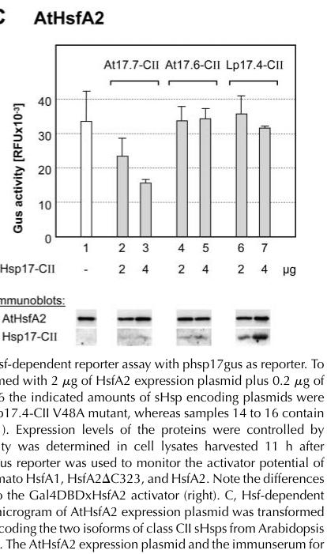

## Question

# Gene Research for Functional Annotation

## ⚠️ CRITICAL: Gene/Protein Identification Context

**BEFORE YOU BEGIN RESEARCH:** You MUST verify you are researching the CORRECT gene/protein. Gene symbols can be ambiguous, especially for less well-characterized genes from non-model organisms.

### Target Gene/Protein Identity (from UniProt):
- **UniProt Accession:** O81822
- **Protein Description:** RecName: Full=17.7 kDa class II heat shock protein; AltName: Full=17.7 kDa heat shock protein; Short=AtHsp17.7;
- **Gene Information:** Name=HSP17.7; OrderedLocusNames=At5g12030; ORFNames=F14F18.200;
- **Organism (full):** Arabidopsis thaliana (Mouse-ear cress).
- **Protein Family:** Belongs to the small heat shock protein (HSP20) family.
- **Key Domains:** A-crystallin/Hsp20_dom. (IPR002068); HSP20-like_chaperone. (IPR008978); Small_HSP. (IPR031107); HSP20 (PF00011)

### MANDATORY VERIFICATION STEPS:

1. **Check if the gene symbol "HSP17.7" matches the protein description above**
2. **Verify the organism is correct:** Arabidopsis thaliana (Mouse-ear cress).
3. **Check if protein family/domains align with what you find in literature**
4. **If you find literature for a DIFFERENT gene with the same or similar symbol, STOP**

### If Gene Symbol is Ambiguous or You Cannot Find Relevant Literature:

**DO NOT PROCEED WITH RESEARCH ON A DIFFERENT GENE.** Instead:
- State clearly: "The gene symbol 'HSP17.7' is ambiguous or literature is limited for this specific protein"
- Explain what you found (e.g., "Found extensive literature on a different gene with the same symbol in a different organism")
- Describe the protein based ONLY on the UniProt information provided above
- Suggest that the protein function can be inferred from domain/family information

### Research Target:

Please provide a comprehensive research report on the gene **HSP17.7** (gene ID: HSP17.7, UniProt: O81822) in ARATH.

The research report should be a detailed narrative explaining the function, biological processes, and localization of the gene product. Citations should be given for all claims.

You should prioritize authoritative reviews and primary scientific literature when conducting research. You can supplement
this with annotations you find in gene/protein databases, but these can be outdated or inaccurate.

We are specifically interested in the primary function of the gene - for enzymes, what reaction is catalyzed, and what is the substrate specificity? For transporters, what is the substrate? For structural proteins or adapters, what is the broader structural role? For signaling molecules, what is the role in the pathway.

We are interested in where in or outside the cell the gene product carries out its function.

We are also interested in the signaling or biochemical pathways in which the gene functions. We are less interested in broad pleiotropic effects, except where these elucidate the precise role.

Include evidence where possible. We are interested in both experimental evidence as well as inference from structure, evolution, or bioinformatic analysis. Precise studies should be prioritized over high-throughput, where available.

## Output

Question: You are an expert researcher providing comprehensive, well-cited information.

Provide detailed information focusing on:
1. Key concepts and definitions with current understanding
2. Recent developments and latest research (prioritize 2023-2024 sources)
3. Current applications and real-world implementations
4. Expert opinions and analysis from authoritative sources
5. Relevant statistics and data from recent studies

Format as a comprehensive research report with proper citations. Include URLs and publication dates where available.
Always prioritize recent, authoritative sources and provide specific citations for all major claims.

# Gene Research for Functional Annotation

## ⚠️ CRITICAL: Gene/Protein Identification Context

**BEFORE YOU BEGIN RESEARCH:** You MUST verify you are researching the CORRECT gene/protein. Gene symbols can be ambiguous, especially for less well-characterized genes from non-model organisms.

### Target Gene/Protein Identity (from UniProt):
- **UniProt Accession:** O81822
- **Protein Description:** RecName: Full=17.7 kDa class II heat shock protein; AltName: Full=17.7 kDa heat shock protein; Short=AtHsp17.7;
- **Gene Information:** Name=HSP17.7; OrderedLocusNames=At5g12030; ORFNames=F14F18.200;
- **Organism (full):** Arabidopsis thaliana (Mouse-ear cress).
- **Protein Family:** Belongs to the small heat shock protein (HSP20) family.
- **Key Domains:** A-crystallin/Hsp20_dom. (IPR002068); HSP20-like_chaperone. (IPR008978); Small_HSP. (IPR031107); HSP20 (PF00011)

### MANDATORY VERIFICATION STEPS:

1. **Check if the gene symbol "HSP17.7" matches the protein description above**
2. **Verify the organism is correct:** Arabidopsis thaliana (Mouse-ear cress).
3. **Check if protein family/domains align with what you find in literature**
4. **If you find literature for a DIFFERENT gene with the same or similar symbol, STOP**

### If Gene Symbol is Ambiguous or You Cannot Find Relevant Literature:

**DO NOT PROCEED WITH RESEARCH ON A DIFFERENT GENE.** Instead:
- State clearly: "The gene symbol 'HSP17.7' is ambiguous or literature is limited for this specific protein"
- Explain what you found (e.g., "Found extensive literature on a different gene with the same symbol in a different organism")
- Describe the protein based ONLY on the UniProt information provided above
- Suggest that the protein function can be inferred from domain/family information

### Research Target:

Please provide a comprehensive research report on the gene **HSP17.7** (gene ID: HSP17.7, UniProt: O81822) in ARATH.

The research report should be a detailed narrative explaining the function, biological processes, and localization of the gene product. Citations should be given for all claims.

You should prioritize authoritative reviews and primary scientific literature when conducting research. You can supplement
this with annotations you find in gene/protein databases, but these can be outdated or inaccurate.

We are specifically interested in the primary function of the gene - for enzymes, what reaction is catalyzed, and what is the substrate specificity? For transporters, what is the substrate? For structural proteins or adapters, what is the broader structural role? For signaling molecules, what is the role in the pathway.

We are interested in where in or outside the cell the gene product carries out its function.

We are also interested in the signaling or biochemical pathways in which the gene functions. We are less interested in broad pleiotropic effects, except where these elucidate the precise role.

Include evidence where possible. We are interested in both experimental evidence as well as inference from structure, evolution, or bioinformatic analysis. Precise studies should be prioritized over high-throughput, where available.

# Research report: Arabidopsis thaliana **HSP17.7 / At5g12030** (UniProt **O81822**) — cytosolic class II small heat shock protein

## Executive summary
Arabidopsis **HSP17.7 (At5g12030; AtHsp17.7-CII)** encodes a ~17.7 kDa **cytosolic class II small heat shock protein (sHSP; HSP20 family)** with an **α-crystallin domain**. Its best-supported primary function is as an **ATP-independent “holdase” chaperone** that binds stress-denatured client proteins to prevent irreversible aggregation and to support subsequent refolding/disaggregation by ATP-dependent chaperone systems (e.g., HSP70/HSP101). Direct gene-specific evidence also indicates a second, regulatory role: **AtHsp17.7-CII selectively represses the activity of the heat shock transcription factor AtHsfA2** in a heterologous plant reporter system, consistent with sHSP-mediated tuning of the heat shock response. Developmentally, AtHsp17.7-CII is a major seed sHSP that accumulates during mid/late seed maturation under control of an **ABI3 → HsfA9 → HSP** transcriptional cascade. Under abiotic and chemical stresses it is highly inducible at the transcript level (e.g., ~15–16× induction in microarray datasets). Recent reviews (2023–2024) place cytosolic class I/II sHSPs within dynamic **heat stress granule (HSG)** regulation of HSFs and thermomemory, supporting current models in which sHSPs act both as protein-quality-control factors and as regulatory components of heat-response circuitry. (sun2002smallheatshock pages 5-6, kotak2007anoveltranscriptional pages 9-10, kotak2007anoveltranscriptional pages 5-6, golisz2008microarrayexpressionprofiling pages 4-5, li2012differentialexpressionof pages 4-5, port2004roleofhsp17.4cii media a91d69d5, bakery2024heatstresstranscription pages 7-8)

---

## 1) Key concepts and definitions (current understanding)

### 1.1 Small heat shock proteins (sHSPs; HSP20 family)
Plant sHSPs are a diverse family of low-molecular-weight heat shock proteins characterized by a conserved **α-crystallin domain** and typically forming oligomers. Functionally, they act as **ATP-independent molecular chaperones** that bind non-native proteins during stress, **prevent aggregation**, and maintain substrates in a folding-competent state for later refolding by ATP-dependent chaperones (e.g., HSP70 systems; HSP100/ClpB-type disaggregases). (sun2002smallheatshock pages 5-6, tariq2010anoverviewon pages 1-2)

### 1.2 Cytosolic class II sHSPs in Arabidopsis
Cytosolic/nuclear sHSPs in plants include multiple classes; **class II (CII)** sHSPs are assigned to the cytosolic compartment (often discussed together with nuclear localization potential at the class level). AtHsp17.7-CII is one of the Arabidopsis cytosolic class II sHSPs. (sun2002smallheatshock pages 4-5, tariq2010anoverviewon pages 1-2)

### 1.3 Heat shock transcription factors (HSFs), HSEs, and developmental regulation
Canonical heat-inducible expression of HSP genes is mediated by **HSFs binding heat shock elements (HSEs)** in promoters. In seeds, plant developmental programs additionally regulate HSP expression: reviews summarize evidence that **ABI3** and HSFs can synergize on Hsp17.7-type promoters by enhancing HSF action at HSEs, linking hormone/developmental signaling to sHSP expression. (sun2002smallheatshock pages 4-5, sun2002smallheatshock pages 5-6)

---

## 2) Gene/protein-specific functional annotation for **AtHsp17.7-CII (At5g12030)**

### 2.1 Primary biochemical function: ATP-independent chaperone (“holdase”) — evidence and inference
**Direct biochemical assays for AtHsp17.7-CII itself were not identified in the retrieved full texts.** However, AtHsp17.7-CII belongs to the plant cytosolic class II sHSP group for which the canonical mechanism is well established: binding partially denatured proteins, preventing aggregation, and enabling downstream refolding/disaggregation by ATP-dependent systems. This is the most defensible primary function assignment for AtHsp17.7-CII based on family membership and conserved mechanistic literature. (sun2002smallheatshock pages 5-6, tariq2010anoverviewon pages 1-2)

**Interpretation:** For functional annotation, AtHsp17.7-CII is best annotated as an **ATP-independent molecular chaperone** involved in **proteostasis during heat and other stresses**, with activity exerted mainly in the **cytosol** (and potentially the nucleus, by class-level assignment). (sun2002smallheatshock pages 4-5, tariq2010anoverviewon pages 1-2)

### 2.2 Regulatory function: selective repression of **AtHsfA2**
A key gene-specific mechanistic result is that **AtHsp17.7-CII represses AtHsfA2 transcriptional activity** in an HSF-dependent reporter assay performed in tobacco protoplasts. Importantly, the repression is **isoform-selective**: the closely related **AtHsp17.6-CII does not repress AtHsfA2** in the same assay, and a tomato Hsp17.4-CII does not repress AtHsfA2, indicating specificity. (port2004roleofhsp17.4cii pages 7-9, port2004roleofhsp17.4cii pages 9-11, port2004roleofhsp17.4cii media a91d69d5)

The figure supporting this (Port et al., 2004, *Plant Physiology*, published July 2004; URL: https://doi.org/10.1104/pp.104.042820) shows **dose-dependent reduction of GUS activity (RFU ×10^-3)** upon increasing AtHsp17.7-CII coexpression (Figure 7C). (port2004roleofhsp17.4cii media a91d69d5)

**Caveat:** The same study reports that for the Arabidopsis proteins the interaction was **not detected in other interaction assays**, so the strongest evidence is functional (reporter output) rather than direct physical binding under their tested conditions. (port2004roleofhsp17.4cii pages 9-11)

**Biological implication (expert synthesis):** AtHsp17.7-CII likely contributes to **tuning/attenuating HsfA2-driven transcription** during stress or recovery, consistent with models where sHSPs participate in feedback regulation of the heat shock response in addition to proteostasis. (port2004roleofhsp17.4cii pages 1-2, bakery2024heatstresstranscription pages 7-8)

### 2.3 Developmental role: seed maturation and desiccation tolerance program
AtHsp17.7-CII is a prominent seed sHSP:

* It **accumulates beginning at mid-maturation** and is **abundant through late maturation and in dry seeds**, consistent with a role in late seed development and desiccation tolerance. (Sun et al., 2002, published Aug 2002; URL: https://doi.org/10.1016/S0167-4781(02)00417-7) (sun2002smallheatshock pages 4-5)

* In the **abi3** mutant (desiccation-intolerant), AtHsp17.7-CII accumulation is **abolished**, supporting dependence on the ABI3-controlled seed maturation program. (sun2002smallheatshock pages 4-5)

Primary evidence for the regulatory cascade comes from Kotak et al. (2007, *The Plant Cell*, published Jan 2007; URL: https://doi.org/10.1105/tpc.106.048165):

* **ABI3 knockout lines** lack detectable **HsfA9** and key seed HSPs, including **Hsp17.7-CII**. (kotak2007anoveltranscriptional pages 1-2, kotak2007anoveltranscriptional pages 5-6)
* **HsfA9** is described as a potent activator that drives seed HSP expression; **Hsp17.7-CII** is among downstream genes requiring HsfA9 for full activation. (kotak2007anoveltranscriptional pages 9-10)

**Stress vs developmental regulation separation:** Kotak et al. also show that **heat induction of Hsp17.7-CII transcripts in siliques** occurs **even in abi3-6**, i.e., heat-inducible expression can be ABI3-independent (in contrast to developmental seed accumulation). (kotak2007anoveltranscriptional pages 5-6)

### 2.4 Stress and chemical induction (quantitative)
Gene-specific transcript induction has been quantified in multiple microarray studies:

* **Gallic acid (allelochemical) exposure:** At5g12030 (annotated as 17.7 kDa class II HSP; HSP17.7-CII) is induced **15.57-fold** after **6 h** exposure; **P = 0.02** (Golisz et al., 2008, *J. Exp. Bot.*, published Jul 2008; URL: https://doi.org/10.1093/jxb/ern168). (golisz2008microarrayexpressionprofiling pages 4-5)

* **Sulfur dioxide (SO2) exposure:** At5g12030 shows **log2 ratio = 4.0** (≈ **16-fold**) with **P < 0.01** among SO2-responsive defense/stress genes (Li & Yi, 2012, *Chemosphere*, published May 2012; URL: https://doi.org/10.1016/j.chemosphere.2011.12.064). (li2012differentialexpressionof pages 4-5)

**Interpretation:** AtHsp17.7-CII is strongly inducible not only by heat but also by oxidative/chemical stress contexts, consistent with sHSP deployment as a general proteostasis mechanism under diverse proteotoxic stresses. (li2012differentialexpressionof pages 4-5, golisz2008microarrayexpressionprofiling pages 4-5, sun2002smallheatshock pages 5-6)

---

## 3) Subcellular localization and cellular context

### 3.1 Localization (evidence available here)
Within the retrieved evidence set, AtHsp17.7 is consistently categorized as **cytosolic class II**, which supports a **cytosolic** site of action (and sometimes class-level cytosol/nucleus discussion in reviews). (sun2002smallheatshock pages 4-5, tariq2010anoverviewon pages 1-2)

A key limitation is that **a direct At5g12030-specific localization assay** (e.g., AtHsp17.7-GFP in Arabidopsis) was **not** extracted from the retrieved texts.

### 3.2 Heat stress granules and cytosolic foci (relevant context for cytosolic class II sHSPs)
Although not specific to At5g12030, Arabidopsis cytosolic class II sHSPs have been localized by immunolocalization to **cytosolic foci** during heat stress and show partial overlap with **HSP101** puncta; genetic perturbation of CI or CII sHSP accumulation alters heat recovery phenotypes, supporting functional relevance of these foci/granules to thermotolerance. (McLoughlin et al., 2016, *Plant Physiology*, published Jul 2016; URL: https://doi.org/10.1104/pp.16.00536) (mcloughlin2016classiand pages 20-23, mcloughlin2016classiand pages 1-4)

Recent synthesis further links HSF biology to granule dynamics: a 2024 New Phytologist review proposes that an HSFA2 isoform can be **sequestered in cytosolic heat stress granules via interactions with class CI and class CII sHSPs**, then released during recovery to participate in transcriptional regulation and heat-stress memory. (Bakery et al., 2024, *New Phytologist*, published Jul 2024; URL: https://doi.org/10.1111/nph.20017) (bakery2024heatstresstranscription pages 7-8)

---

## 4) Pathways and regulatory networks involving AtHsp17.7

### 4.1 Seed developmental program: ABI3 → HsfA9 → HSP17.7
The strongest gene-specific pathway placement is in late seed development:

* ABI3 is required for HsfA9 expression in seeds; loss of ABI3 eliminates HsfA9 and key HSPs including Hsp17.7-CII. (kotak2007anoveltranscriptional pages 1-2, kotak2007anoveltranscriptional pages 5-6)
* HsfA9 activates seed HSP promoters and is required for full activation of Hsp17.7-CII during seed maturation. (kotak2007anoveltranscriptional pages 9-10)

This provides a mechanistically grounded annotation: **AtHsp17.7 contributes to seed maturation/desiccation tolerance proteostasis downstream of ABI3/HsfA9**. (sun2002smallheatshock pages 4-5, kotak2007anoveltranscriptional pages 9-10)

### 4.2 Heat-stress circuitry and feedback: HsfA2 repression
Port et al. show AtHsp17.7-CII selectively represses AtHsfA2 activity in reporter assays, implying a potential **feedback/attenuation loop** within the heat shock response. (port2004roleofhsp17.4cii media a91d69d5)

A 2024 review contextualizes this relationship by citing sHSPs as modulators of HsfA2 localization/activity and integrating these interactions into a broader HSF “rheostat” model of response intensity and recovery. (bakery2024heatstresstranscription pages 13-14, bakery2024heatstresstranscription pages 7-8)

### 4.3 Calcium signaling as upstream regulator (2023 update)
A 2023 review emphasizes that one of the earliest heat responses is a rapid **increase in cytosolic Ca2+**, which is decoded by Ca2+-binding proteins and feeds into downstream cascades, ultimately shaping HSF/HSP induction. While it does not provide AtHsp17.7-specific mechanisms, it frames HSP induction (including sHSP17.x genes across plants) as embedded within Ca2+/NO/ROS cross-talk and thermotolerance signaling networks. (Kang et al., 2023, *Int. J. Mol. Sci.*, published Dec 2023; URL: https://doi.org/10.3390/ijms25010324) (kang2023calciumsignalingand pages 14-16)

---

## 5) Recent developments (prioritizing 2023–2024) relevant to HSP17.7 annotation

### 5.1 HSF “rheostat” model and heat-stress memory
Bakery et al. (2024) synthesize evidence that HSFs act as a molecular rheostat tuning response intensity and recovery. The review highlights mechanistic levers relevant to AtHsp17.7-CII annotation:

* **HSFA2 sequestration in heat stress granules (HSGs)** mediated via interactions with **class CI and class CII sHSPs**, and gradual release during recovery/repeated cycles. (bakery2024heatstresstranscription pages 7-8)
* Thermomemory layers (Mediator recruitment, chromatin changes, proteostasis-linked regulation), which may influence sustained expression of small HSPs. (bakery2024heatstresstranscription pages 7-8, bakery2024heatstresstranscription pages 14-14)

**Relevance to AtHsp17.7-CII:** because AtHsp17.7-CII is a cytosolic class II sHSP and has direct functional evidence for modulating HsfA2 activity (Port et al., 2004), these models support annotating AtHsp17.7 as potentially participating in **HSF/HSG-mediated feedback control** in addition to holdase activity. (port2004roleofhsp17.4cii media a91d69d5, bakery2024heatstresstranscription pages 7-8)

### 5.2 Biotechnology-oriented chaperone use (2024)
A 2024 experimental biotechnology study demonstrates that a plant Hsp17.7 homolog (carrot **DcHsp17.7**) can substantially enhance the activity of a recombinant thermotolerant enzyme in vitro, supporting the view that plant sHSPs can be exploited as chaperones for recombinant protein production. (Jung et al., 2024, published Jul 2024; URL: https://doi.org/10.30498/ijb.2024.442517.3878) (jung2024plantheatshock pages 1-3)

---

## 6) Current applications and real-world implementations (with relevance to AtHsp17.7)

### 6.1 Crop engineering / stress tolerance
Although not Arabidopsis At5g12030, there is strong application evidence for the broader sHSP17.7 class:

* Overexpression of rice **sHSP17.7** increased thermotolerance and UV-B resistance in rice seedlings (transgenic lines; CaMV 35S promoter). (Murakami et al., 2004, published Feb 2004; URL: https://doi.org/10.1023/B:MOLB.0000018764.30795.c1) (murakami2004overexpressionofa pages 8-9)

These results support translational interest in cytosolic sHSPs as **engineering targets/biomarkers** for thermotolerance, but functional non-equivalence among paralogs (as seen for AtHsp17.7 vs AtHsp17.6 in AtHsfA2 repression) argues for caution in assuming interchangeability. (port2004roleofhsp17.4cii media a91d69d5)

### 6.2 Industrial biotechnology: chaperone-assisted recombinant protein production
Jung et al. (2024) provide a direct application: plant Hsps can be used to enhance recombinant enzyme output. DcHsp17.7 increased ADH activity up to **13-fold** at 37°C and showed synergy with Hsp70 systems. This supports consideration of plant sHSPs (including Arabidopsis ortholog classes) as **co-expression partners** in microbial cell factories for improving enzyme activity/solubility. (jung2024plantheatshock pages 1-3)

---

## 7) Relevant statistics and quantitative data (recent and foundational)

### 7.1 Arabidopsis At5g12030 induction statistics
* Gallic acid: **15.57× induction** after 6 h (P=0.02). (golisz2008microarrayexpressionprofiling pages 4-5)
* SO2: **log2 ratio 4.0** (≈16×; P<0.01). (li2012differentialexpressionof pages 4-5)

### 7.2 Quantitative functional assay (gene-specific regulatory effect)
Port et al. (2004) show AtHsp17.7-CII reduces AtHsfA2 reporter output measured as **GUS activity (RFU ×10^-3)** in a **dose-dependent** fashion, while AtHsp17.6-CII does not. (port2004roleofhsp17.4cii media a91d69d5)

### 7.3 2024 quantitative application data (plant Hsp17.7 homolog)
Jung et al. (2024) report:
* DcHsp17.7 increased recombinant ADH activity up to **13.0-fold** at 37°C; combinations reached **13.8–14.2-fold**. (jung2024plantheatshock pages 1-3)
* DcHsp17.7 increased ADH solubility up to **1.6-fold** (with defined in vitro concentrations and temperatures). (jung2024plantheatshock pages 5-9)

### 7.4 Quantitative heterologous heat-protection data (sHSP17.7 class)
Murakami et al. (2004) report, for E. coli expressing rice sHSP17.7:
* Survival **>90% after 15 min at 60°C** and **>60% after 45 min**, about **2× higher** than control. (murakami2004overexpressionofa pages 6-8)

---

## 8) Expert analysis: what is confidently known vs. remaining gaps

### High-confidence annotations for AtHsp17.7-CII (At5g12030)
1. **Cytosolic class II sHSP / HSP20 family holdase chaperone**, supporting proteostasis under heat and other stresses (family-consensus mechanism). (sun2002smallheatshock pages 5-6, tariq2010anoverviewon pages 1-2)
2. **Seed maturation protein** under **ABI3/HsfA9 developmental control**, with strong accumulation in mid/late seed maturation and loss in abi3 mutants. (sun2002smallheatshock pages 4-5, kotak2007anoveltranscriptional pages 5-6)
3. **Functional coregulator of AtHsfA2** in reporter assays with **isoform specificity** (AtHsp17.7-CII positive; AtHsp17.6-CII negative). (port2004roleofhsp17.4cii media a91d69d5)
4. Strong **stress/chemical inducibility** (≥15-fold transcript induction in two independent microarray contexts). (li2012differentialexpressionof pages 4-5, golisz2008microarrayexpressionprofiling pages 4-5)

### Key gaps for locus-specific functional annotation
* No At5g12030 **single-gene loss-of-function/overexpression phenotype** was captured in the retrieved corpus.
* No AtHsp17.7-CII **direct subcellular localization assay** (e.g., Arabidopsis GFP fusion) was captured.
* No AtHsp17.7-CII **direct biochemical chaperone assay** (purified AtHsp17.7-CII) was captured.

Given these gaps, the most defensible gene model is: AtHsp17.7-CII likely behaves as a canonical cytosolic sHSP holdase and participates in regulatory feedback on heat-response transcription (HsfA2), with a particularly prominent role in seed maturation proteostasis; however, the extent to which AtHsp17.7 has unique clients or unique phenotypes distinct from other cytosolic class II paralogs remains unresolved from the present evidence set. (port2004roleofhsp17.4cii media a91d69d5, sun2002smallheatshock pages 4-5)

---

## Evidence summary table

| Claim/annotation (function/localization/regulation) | Evidence type | Key experimental system/conditions | Quantitative data (fold change, log2 ratio, assay units) | Source (authors, year, journal) | URL | Context ID citation |
|---|---|---|---|---|---|---|
| HSP17.7 is the Arabidopsis thaliana At5g12030 gene product, annotated as a cytosolic class II small heat shock protein (AtHsp17.7-CII) in the HSP20/sHSP family | Curated annotation/review synthesis | Arabidopsis sHSP classification and seed/stress expression literature summarized for plant sHSPs | Not applicable | Sun et al., 2002, *Biochim. Biophys. Acta* | https://doi.org/10.1016/S0167-4781(02)00417-7 | (sun2002smallheatshock pages 4-5, sun2002smallheatshock pages 5-6) |
| HSP17.7 accumulates during seed maturation and is abundant in dry seeds, supporting a role in seed maturation/desiccation tolerance | Developmental expression | Arabidopsis seeds across maturation stages; protein/transcript accumulation summarized from primary studies | Begins at mid-maturation; abundant through late maturation and dry seed | Sun et al., 2002, *Biochim. Biophys. Acta* | https://doi.org/10.1016/S0167-4781(02)00417-7 | (sun2002smallheatshock pages 4-5) |
| HSP17.7 seed expression depends on ABI3-dependent developmental regulation | Mutant expression analysis | ABI3 knockout/desiccation-intolerant mutant seeds (abi3 lines) lacking normal seed maturation program | Hsp17.7-CII not detectable in ABI3 knockout lines; no fold value reported | Kotak et al., 2007, *The Plant Cell* | https://doi.org/10.1105/tpc.106.048165 | (kotak2007anoveltranscriptional pages 1-2, kotak2007anoveltranscriptional pages 9-10, kotak2007anoveltranscriptional pages 5-6) |
| HSP17.7 is a downstream target of the ABI3→HsfA9 seed developmental transcriptional cascade | Transcriptional regulation/reporter reconstruction | Arabidopsis seed system plus transient reporter assays showing ABI3 activates HsfA9 promoter and HsfA9 activates Hsp promoters | No direct numeric fold value for HSP17.7 promoter activation provided in excerpt | Kotak et al., 2007, *The Plant Cell* | https://doi.org/10.1105/tpc.106.048165 | (kotak2007anoveltranscriptional pages 1-2, kotak2007anoveltranscriptional pages 9-10) |
| Heat induction of HSP17.7 in siliques does not require ABI3/HsfA9 | Stress-induction RT-PCR/immunoblot | Wild-type and abi3-6 siliques at different developmental stages heat-stressed at 38°C for 2 h | Hsp17.7-CII transcripts induced at comparable levels in heat-stressed WT and abi3-6; no fold value reported | Kotak et al., 2007, *The Plant Cell* | https://doi.org/10.1105/tpc.106.048165 | (kotak2007anoveltranscriptional pages 5-6) |
| HSP17.7 is regulated by HSFs through heat shock elements (HSEs); ABI3 can enhance HSF-dependent activation on Hsp17.7-type promoters | Regulatory inference supported by promoter studies | Plant sHSP promoter analyses summarized in review; HSE integrity and HSF activation domain required for ABI3-dependent enhancement | No gene-specific fold value for At5g12030 reported | Sun et al., 2002, *Biochim. Biophys. Acta* | https://doi.org/10.1016/S0167-4781(02)00417-7 | (sun2002smallheatshock pages 4-5, sun2002smallheatshock pages 5-6) |
| HSP17.7 is strongly inducible by non-heat chemical stress (gallic acid) | Microarray stress induction | Arabidopsis exposed 6 h to allelochemicals in aquaculture medium; Table 2 gene expression profiling | 15.57-fold induction; P=0.02 | Golisz et al., 2008, *Journal of Experimental Botany* | https://doi.org/10.1093/jxb/ern168 | (golisz2008microarrayexpressionprofiling pages 4-5) |
| HSP17.7 is induced by sulfur dioxide stress as part of defense/stress response | Microarray stress induction | SO2-treated Arabidopsis vs untreated control in defense-related gene expression study | Log2 ratio = 4.0 (~16-fold); P<0.01 | Li & Yi, 2012, *Chemosphere* | https://doi.org/10.1016/j.chemosphere.2011.12.064 | (li2012differentialexpressionof pages 4-5) |
| HSP17.7 can specifically repress Arabidopsis HsfA2 activity, indicating a regulatory role beyond generic chaperoning | Reporter assay | Tobacco protoplast Hsf-dependent GUS reporter assay with AtHsfA2 coexpressed with Arabidopsis class II sHSPs | GUS activity (RFU ×10^-3) decreased dose-dependently with increasing AtHsp17.7-CII; exact values not given in excerpt/image summary | Port et al., 2004, *Plant Physiology* | https://doi.org/10.1104/pp.104.042820 | (port2004roleofhsp17.4cii pages 7-9, port2004roleofhsp17.4cii pages 1-2, port2004roleofhsp17.4cii media a91d69d5) |
| Repression of AtHsfA2 is selective: AtHsp17.7-CII represses, but the closely related AtHsp17.6-CII does not | Comparative reporter assay | Same tobacco protoplast GUS reporter system comparing Arabidopsis class II sHSP isoforms | AtHsp17.6-CII showed minimal/no repression; assay axis RFU ×10^-3 | Port et al., 2004, *Plant Physiology* | https://doi.org/10.1104/pp.104.042820 | (port2004roleofhsp17.4cii pages 7-9, port2004roleofhsp17.4cii pages 9-11, port2004roleofhsp17.4cii media a91d69d5) |
| The AtHsp17.7-CII effect on AtHsfA2 appears species-selective; tomato Hsp17.4-CII did not repress Arabidopsis HsfA2 in the same assay | Comparative reporter assay | Tobacco protoplast Hsf-dependent GUS reporter with AtHsfA2 plus tomato Hsp17.4-CII | Minimal/no effect on GUS activity; assay axis RFU ×10^-3 | Port et al., 2004, *Plant Physiology* | https://doi.org/10.1104/pp.104.042820 | (port2004roleofhsp17.4cii pages 7-9, port2004roleofhsp17.4cii pages 1-2, port2004roleofhsp17.4cii media a91d69d5) |
| Direct physical interaction between AtHsp17.7-CII and AtHsfA2 was not detected in non-reporter assays, so the regulatory relationship is strongest at the functional assay level | Interaction assay interpretation | Reporter assays positive, but other interaction assays for Arabidopsis pair negative; contrasted with stronger tomato biochemical interaction data | No quantitative binding constant reported | Port et al., 2004, *Plant Physiology* | https://doi.org/10.1104/pp.104.042820 | (port2004roleofhsp17.4cii pages 9-11) |
| As a class II cytosolic sHSP, HSP17.7 is inferred to function as an ATP-independent molecular chaperone that binds nonnative proteins and helps prevent irreversible aggregation | Family-level mechanistic evidence/inference | General plant sHSP biochemical literature summarized in review; applies to cytosolic class II proteins including AtHsp17.7 by family/domain membership | No AtHsp17.7-specific kinetic values in excerpt | Sun et al., 2002, *Biochim. Biophys. Acta* | https://doi.org/10.1016/S0167-4781(02)00417-7 | (sun2002smallheatshock pages 5-6, tariq2010anoverviewon pages 1-2) |
| Cytosolic/nuclear localization is supported for plant class II sHSPs, but no direct localization assay specific to At5g12030 was identified in the retrieved evidence | Localization by family assignment/inference | Reviews classify class II sHSPs as cytosolic/nuclear; direct AtHsp17.7 localization experiment not extracted here | Not applicable | Tariq et al., 2010, *African Journal of Biotechnology*; Sun et al., 2002, *Biochim. Biophys. Acta* | https://doi.org/10.5897/AJB09.006 ; https://doi.org/10.1016/S0167-4781(02)00417-7 | (sun2002smallheatshock pages 5-6, tariq2010anoverviewon pages 1-2) |

*Table: This table summarizes direct and inferred evidence for Arabidopsis thaliana HSP17.7/At5g12030, covering developmental regulation, abiotic stress induction, functional reporter assays, and localization/function inferences. It is useful for separating gene-specific experiments from family-level annotation.*

---

## Visual evidence: AtHsp17.7-CII represses AtHsfA2
Port et al. (2004) Figure 7C provides direct visual support for isoform-specific repression of AtHsfA2 transcriptional activity by AtHsp17.7-CII (GUS reporter readout; RFU ×10^-3). (port2004roleofhsp17.4cii media a91d69d5)

---

## Key cited sources (with publication dates and URLs)
* Sun et al. 2002-08 (*Biochimica et Biophysica Acta*): https://doi.org/10.1016/S0167-4781(02)00417-7 (sun2002smallheatshock pages 5-6)
* Port et al. 2004-07 (*Plant Physiology*): https://doi.org/10.1104/pp.104.042820 (port2004roleofhsp17.4cii pages 9-11)
* Kotak et al. 2007-01 (*The Plant Cell*): https://doi.org/10.1105/tpc.106.048165 (kotak2007anoveltranscriptional pages 5-6)
* Golisz et al. 2008-07 (*Journal of Experimental Botany*): https://doi.org/10.1093/jxb/ern168 (golisz2008microarrayexpressionprofiling pages 4-5)
* Li & Yi 2012-05 (*Chemosphere*): https://doi.org/10.1016/j.chemosphere.2011.12.064 (li2012differentialexpressionof pages 4-5)
* McLoughlin et al. 2016-07 (*Plant Physiology*): https://doi.org/10.1104/pp.16.00536 (mcloughlin2016classiand pages 1-4)
* Kang et al. 2023-12 (*International Journal of Molecular Sciences*): https://doi.org/10.3390/ijms25010324 (kang2023calciumsignalingand pages 14-16)
* Bakery et al. 2024-07 (*New Phytologist*): https://doi.org/10.1111/nph.20017 (bakery2024heatstresstranscription pages 7-8)
* Jung et al. 2024-07 (*Iranian Journal of Biotechnology*): https://doi.org/10.30498/ijb.2024.442517.3878 (jung2024plantheatshock pages 1-3)
* Murakami et al. 2004-02 (*Molecular Breeding*): https://doi.org/10.1023/B:MOLB.0000018764.30795.c1 (murakami2004overexpressionofa pages 1-3)

References

1. (sun2002smallheatshock pages 5-6): Weining Sun, Marc Van Montagu, and Nathalie Verbruggen. Small heat shock proteins and stress tolerance in plants. Biochimica et biophysica acta, 1577 1:1-9, Aug 2002. URL: https://doi.org/10.1016/s0167-4781(02)00417-7, doi:10.1016/s0167-4781(02)00417-7. This article has 872 citations.

2. (kotak2007anoveltranscriptional pages 9-10): Sachin Kotak, Elizabeth Vierling, Helmut Bäumlein, and Pascal von Koskull-Döring. A novel transcriptional cascade regulating expression of heat stress proteins during seed development of<i>arabidopsis</i>. The Plant Cell, 19:182-195, Jan 2007. URL: https://doi.org/10.1105/tpc.106.048165, doi:10.1105/tpc.106.048165. This article has 367 citations.

3. (kotak2007anoveltranscriptional pages 5-6): Sachin Kotak, Elizabeth Vierling, Helmut Bäumlein, and Pascal von Koskull-Döring. A novel transcriptional cascade regulating expression of heat stress proteins during seed development of<i>arabidopsis</i>. The Plant Cell, 19:182-195, Jan 2007. URL: https://doi.org/10.1105/tpc.106.048165, doi:10.1105/tpc.106.048165. This article has 367 citations.

4. (golisz2008microarrayexpressionprofiling pages 4-5): Anna Golisz, Mami Sugano, and Yoshiharu Fujii. Microarray expression profiling of arabidopsis thaliana l. in response to allelochemicals identified in buckwheat. Journal of Experimental Botany, 59:3099-3109, Jul 2008. URL: https://doi.org/10.1093/jxb/ern168, doi:10.1093/jxb/ern168. This article has 103 citations and is from a domain leading peer-reviewed journal.

5. (li2012differentialexpressionof pages 4-5): Lihong Li and Huilan Yi. Differential expression of arabidopsis defense-related genes in response to sulfur dioxide. Chemosphere, 87 7:718-24, May 2012. URL: https://doi.org/10.1016/j.chemosphere.2011.12.064, doi:10.1016/j.chemosphere.2011.12.064. This article has 59 citations and is from a peer-reviewed journal.

6. (port2004roleofhsp17.4cii media a91d69d5): Markus Port, Joanna Tripp, Dirk Zielinski, Christian Weber, Dirk Heerklotz, Sybille Winkelhaus, Daniela Bublak, and Klaus-Dieter Scharf. Role of hsp17.4-cii as coregulator and cytoplasmic retention factor of tomato heat stress transcription factor hsfa2. Plant Physiology, 135:1457-1470, Jul 2004. URL: https://doi.org/10.1104/pp.104.042820, doi:10.1104/pp.104.042820. This article has 128 citations and is from a highest quality peer-reviewed journal.

7. (bakery2024heatstresstranscription pages 7-8): Ayat Bakery, Stavros Vraggalas, Boushra Shalha, Harsh Chauhan, Moussa Benhamed, and Sotirios Fragkostefanakis. Heat stress transcription factors as the central molecular rheostat to optimize plant survival and recovery from heat stress. The New phytologist, 244:51-64, Jul 2024. URL: https://doi.org/10.1111/nph.20017, doi:10.1111/nph.20017. This article has 90 citations.

8. (tariq2010anoverviewon pages 1-2): Mahmood Tariq, Safdar Waseem, Haider Abbasi Bilal, and M Saqlan Naqvi S. An overview on the small heat shock proteins. African Journal of Biotechnology, 9:927-939, Feb 2010. URL: https://doi.org/10.5897/ajb09.006, doi:10.5897/ajb09.006. This article has 66 citations.

9. (sun2002smallheatshock pages 4-5): Weining Sun, Marc Van Montagu, and Nathalie Verbruggen. Small heat shock proteins and stress tolerance in plants. Biochimica et biophysica acta, 1577 1:1-9, Aug 2002. URL: https://doi.org/10.1016/s0167-4781(02)00417-7, doi:10.1016/s0167-4781(02)00417-7. This article has 872 citations.

10. (port2004roleofhsp17.4cii pages 7-9): Markus Port, Joanna Tripp, Dirk Zielinski, Christian Weber, Dirk Heerklotz, Sybille Winkelhaus, Daniela Bublak, and Klaus-Dieter Scharf. Role of hsp17.4-cii as coregulator and cytoplasmic retention factor of tomato heat stress transcription factor hsfa2. Plant Physiology, 135:1457-1470, Jul 2004. URL: https://doi.org/10.1104/pp.104.042820, doi:10.1104/pp.104.042820. This article has 128 citations and is from a highest quality peer-reviewed journal.

11. (port2004roleofhsp17.4cii pages 9-11): Markus Port, Joanna Tripp, Dirk Zielinski, Christian Weber, Dirk Heerklotz, Sybille Winkelhaus, Daniela Bublak, and Klaus-Dieter Scharf. Role of hsp17.4-cii as coregulator and cytoplasmic retention factor of tomato heat stress transcription factor hsfa2. Plant Physiology, 135:1457-1470, Jul 2004. URL: https://doi.org/10.1104/pp.104.042820, doi:10.1104/pp.104.042820. This article has 128 citations and is from a highest quality peer-reviewed journal.

12. (port2004roleofhsp17.4cii pages 1-2): Markus Port, Joanna Tripp, Dirk Zielinski, Christian Weber, Dirk Heerklotz, Sybille Winkelhaus, Daniela Bublak, and Klaus-Dieter Scharf. Role of hsp17.4-cii as coregulator and cytoplasmic retention factor of tomato heat stress transcription factor hsfa2. Plant Physiology, 135:1457-1470, Jul 2004. URL: https://doi.org/10.1104/pp.104.042820, doi:10.1104/pp.104.042820. This article has 128 citations and is from a highest quality peer-reviewed journal.

13. (kotak2007anoveltranscriptional pages 1-2): Sachin Kotak, Elizabeth Vierling, Helmut Bäumlein, and Pascal von Koskull-Döring. A novel transcriptional cascade regulating expression of heat stress proteins during seed development of<i>arabidopsis</i>. The Plant Cell, 19:182-195, Jan 2007. URL: https://doi.org/10.1105/tpc.106.048165, doi:10.1105/tpc.106.048165. This article has 367 citations.

14. (mcloughlin2016classiand pages 20-23): Fionn McLoughlin, E. Basha, M. Fowler, Minsoo Kim, Juliana R. Bordowitz, Surekha Katiyar-Agarwal, and E. Vierling. Class i and ii small heat shock proteins together with hsp101 protect protein translation factors during heat stress1[open]. Plant Physiology, 172:1221-1236, Jul 2016. URL: https://doi.org/10.1104/pp.16.00536, doi:10.1104/pp.16.00536. This article has 178 citations and is from a highest quality peer-reviewed journal.

15. (mcloughlin2016classiand pages 1-4): Fionn McLoughlin, E. Basha, M. Fowler, Minsoo Kim, Juliana R. Bordowitz, Surekha Katiyar-Agarwal, and E. Vierling. Class i and ii small heat shock proteins together with hsp101 protect protein translation factors during heat stress1[open]. Plant Physiology, 172:1221-1236, Jul 2016. URL: https://doi.org/10.1104/pp.16.00536, doi:10.1104/pp.16.00536. This article has 178 citations and is from a highest quality peer-reviewed journal.

16. (bakery2024heatstresstranscription pages 13-14): Ayat Bakery, Stavros Vraggalas, Boushra Shalha, Harsh Chauhan, Moussa Benhamed, and Sotirios Fragkostefanakis. Heat stress transcription factors as the central molecular rheostat to optimize plant survival and recovery from heat stress. The New phytologist, 244:51-64, Jul 2024. URL: https://doi.org/10.1111/nph.20017, doi:10.1111/nph.20017. This article has 90 citations.

17. (kang2023calciumsignalingand pages 14-16): Xinmiao Kang, Liqun Zhao, and Xiaotong Liu. Calcium signaling and the response to heat shock in crop plants. International Journal of Molecular Sciences, 25:324, Dec 2023. URL: https://doi.org/10.3390/ijms25010324, doi:10.3390/ijms25010324. This article has 44 citations.

18. (bakery2024heatstresstranscription pages 14-14): Ayat Bakery, Stavros Vraggalas, Boushra Shalha, Harsh Chauhan, Moussa Benhamed, and Sotirios Fragkostefanakis. Heat stress transcription factors as the central molecular rheostat to optimize plant survival and recovery from heat stress. The New phytologist, 244:51-64, Jul 2024. URL: https://doi.org/10.1111/nph.20017, doi:10.1111/nph.20017. This article has 90 citations.

19. (jung2024plantheatshock pages 1-3): Minjae Jung, Yunjin Park, and Y. Ahn. Plant heat shock proteins are more effective in enhancing recombinant alcohol dehydrogenase activity than bacterial ones in vitro. Iranian Journal of Biotechnology, 22:e3878-e3878, Jul 2024. URL: https://doi.org/10.30498/ijb.2024.442517.3878, doi:10.30498/ijb.2024.442517.3878. This article has 1 citations.

20. (murakami2004overexpressionofa pages 8-9): Toyotaka Murakami, Shuichi Matsuba, Hideyuki Funatsuki, Kentaro Kawaguchi, Haruo Saruyama, Masatoshi Tanida, and Yutaka Sato. Over-expression of a small heat shock protein, shsp17.7, confers both heat tolerance and uv-b resistance to rice plants. Molecular Breeding, 13:165-175, Feb 2004. URL: https://doi.org/10.1023/b:molb.0000018764.30795.c1, doi:10.1023/b:molb.0000018764.30795.c1. This article has 240 citations and is from a peer-reviewed journal.

21. (jung2024plantheatshock pages 5-9): Minjae Jung, Yunjin Park, and Y. Ahn. Plant heat shock proteins are more effective in enhancing recombinant alcohol dehydrogenase activity than bacterial ones in vitro. Iranian Journal of Biotechnology, 22:e3878-e3878, Jul 2024. URL: https://doi.org/10.30498/ijb.2024.442517.3878, doi:10.30498/ijb.2024.442517.3878. This article has 1 citations.

22. (murakami2004overexpressionofa pages 6-8): Toyotaka Murakami, Shuichi Matsuba, Hideyuki Funatsuki, Kentaro Kawaguchi, Haruo Saruyama, Masatoshi Tanida, and Yutaka Sato. Over-expression of a small heat shock protein, shsp17.7, confers both heat tolerance and uv-b resistance to rice plants. Molecular Breeding, 13:165-175, Feb 2004. URL: https://doi.org/10.1023/b:molb.0000018764.30795.c1, doi:10.1023/b:molb.0000018764.30795.c1. This article has 240 citations and is from a peer-reviewed journal.

23. (murakami2004overexpressionofa pages 1-3): Toyotaka Murakami, Shuichi Matsuba, Hideyuki Funatsuki, Kentaro Kawaguchi, Haruo Saruyama, Masatoshi Tanida, and Yutaka Sato. Over-expression of a small heat shock protein, shsp17.7, confers both heat tolerance and uv-b resistance to rice plants. Molecular Breeding, 13:165-175, Feb 2004. URL: https://doi.org/10.1023/b:molb.0000018764.30795.c1, doi:10.1023/b:molb.0000018764.30795.c1. This article has 240 citations and is from a peer-reviewed journal.

## Artifacts

- [Edison artifact artifact-00](HSP17.7-deep-research-falcon_artifacts/artifact-00.md)

## Citations

1. sun2002smallheatshock pages 4-5
2. kotak2007anoveltranscriptional pages 9-10
3. kotak2007anoveltranscriptional pages 5-6
4. golisz2008microarrayexpressionprofiling pages 4-5
5. li2012differentialexpressionof pages 4-5
6. bakery2024heatstresstranscription pages 7-8
7. kang2023calciumsignalingand pages 14-16
8. jung2024plantheatshock pages 1-3
9. murakami2004overexpressionofa pages 8-9
10. jung2024plantheatshock pages 5-9
11. murakami2004overexpressionofa pages 6-8
12. sun2002smallheatshock pages 5-6
13. mcloughlin2016classiand pages 1-4
14. murakami2004overexpressionofa pages 1-3
15. tariq2010anoverviewon pages 1-2
16. kotak2007anoveltranscriptional pages 1-2
17. mcloughlin2016classiand pages 20-23
18. bakery2024heatstresstranscription pages 13-14
19. bakery2024heatstresstranscription pages 14-14
20. open
21. https://doi.org/10.1104/pp.104.042820
22. https://doi.org/10.1016/S0167-4781(02
23. https://doi.org/10.1105/tpc.106.048165
24. https://doi.org/10.1093/jxb/ern168
25. https://doi.org/10.1016/j.chemosphere.2011.12.064
26. https://doi.org/10.1104/pp.16.00536
27. https://doi.org/10.1111/nph.20017
28. https://doi.org/10.3390/ijms25010324
29. https://doi.org/10.30498/ijb.2024.442517.3878
30. https://doi.org/10.1023/B:MOLB.0000018764.30795.c1
31. https://doi.org/10.5897/AJB09.006
32. https://doi.org/10.1016/s0167-4781(02
33. https://doi.org/10.1105/tpc.106.048165,
34. https://doi.org/10.1093/jxb/ern168,
35. https://doi.org/10.1016/j.chemosphere.2011.12.064,
36. https://doi.org/10.1104/pp.104.042820,
37. https://doi.org/10.1111/nph.20017,
38. https://doi.org/10.5897/ajb09.006,
39. https://doi.org/10.1104/pp.16.00536,
40. https://doi.org/10.3390/ijms25010324,
41. https://doi.org/10.30498/ijb.2024.442517.3878,
42. https://doi.org/10.1023/b:molb.0000018764.30795.c1,