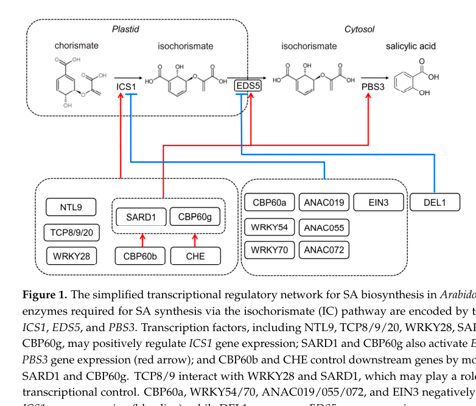

## Question

# Gene Research for Functional Annotation

## ⚠️ CRITICAL: Gene/Protein Identification Context

**BEFORE YOU BEGIN RESEARCH:** You MUST verify you are researching the CORRECT gene/protein. Gene symbols can be ambiguous, especially for less well-characterized genes from non-model organisms.

### Target Gene/Protein Identity (from UniProt):
- **UniProt Accession:** Q9S7H8
- **Protein Description:** RecName: Full=Isochorismate synthase 1, chloroplastic; Short=AtIcs1 {ECO:0000303|PubMed:17190832}; Short=IcsI; EC=5.4.4.2 {ECO:0000269|PubMed:11734859, ECO:0000269|PubMed:17190832}; AltName: Full=Enhanced disease susceptibility 16; Short=Eds16; AltName: Full=Isochorismate mutase 1; AltName: Full=Salicylic acid induction deficient 2; Short=Sid2; AltName: Full=menF-like protein 1; Flags: Precursor;
- **Gene Information:** Name=ICS1; OrderedLocusNames=At1g74710; ORFNames=F1M20.39, F25A4.31;
- **Organism (full):** Arabidopsis thaliana (Mouse-ear cress).
- **Protein Family:** Belongs to the isochorismate synthase family.
- **Key Domains:** ADC_synthase. (IPR005801); Chorismate_C. (IPR015890); IsoChor_synthase. (IPR004561); MenF-like. (IPR044250); Chorismate_bind (PF00425)

### MANDATORY VERIFICATION STEPS:

1. **Check if the gene symbol "ICS1" matches the protein description above**
2. **Verify the organism is correct:** Arabidopsis thaliana (Mouse-ear cress).
3. **Check if protein family/domains align with what you find in literature**
4. **If you find literature for a DIFFERENT gene with the same or similar symbol, STOP**

### If Gene Symbol is Ambiguous or You Cannot Find Relevant Literature:

**DO NOT PROCEED WITH RESEARCH ON A DIFFERENT GENE.** Instead:
- State clearly: "The gene symbol 'ICS1' is ambiguous or literature is limited for this specific protein"
- Explain what you found (e.g., "Found extensive literature on a different gene with the same symbol in a different organism")
- Describe the protein based ONLY on the UniProt information provided above
- Suggest that the protein function can be inferred from domain/family information

### Research Target:

Please provide a comprehensive research report on the gene **ICS1** (gene ID: ICS1, UniProt: Q9S7H8) in ARATH.

The research report should be a detailed narrative explaining the function, biological processes, and localization of the gene product. Citations should be given for all claims.

You should prioritize authoritative reviews and primary scientific literature when conducting research. You can supplement
this with annotations you find in gene/protein databases, but these can be outdated or inaccurate.

We are specifically interested in the primary function of the gene - for enzymes, what reaction is catalyzed, and what is the substrate specificity? For transporters, what is the substrate? For structural proteins or adapters, what is the broader structural role? For signaling molecules, what is the role in the pathway.

We are interested in where in or outside the cell the gene product carries out its function.

We are also interested in the signaling or biochemical pathways in which the gene functions. We are less interested in broad pleiotropic effects, except where these elucidate the precise role.

Include evidence where possible. We are interested in both experimental evidence as well as inference from structure, evolution, or bioinformatic analysis. Precise studies should be prioritized over high-throughput, where available.

## Output

Question: You are an expert researcher providing comprehensive, well-cited information.

Provide detailed information focusing on:
1. Key concepts and definitions with current understanding
2. Recent developments and latest research (prioritize 2023-2024 sources)
3. Current applications and real-world implementations
4. Expert opinions and analysis from authoritative sources
5. Relevant statistics and data from recent studies

Format as a comprehensive research report with proper citations. Include URLs and publication dates where available.
Always prioritize recent, authoritative sources and provide specific citations for all major claims.

# Gene Research for Functional Annotation

## ⚠️ CRITICAL: Gene/Protein Identification Context

**BEFORE YOU BEGIN RESEARCH:** You MUST verify you are researching the CORRECT gene/protein. Gene symbols can be ambiguous, especially for less well-characterized genes from non-model organisms.

### Target Gene/Protein Identity (from UniProt):
- **UniProt Accession:** Q9S7H8
- **Protein Description:** RecName: Full=Isochorismate synthase 1, chloroplastic; Short=AtIcs1 {ECO:0000303|PubMed:17190832}; Short=IcsI; EC=5.4.4.2 {ECO:0000269|PubMed:11734859, ECO:0000269|PubMed:17190832}; AltName: Full=Enhanced disease susceptibility 16; Short=Eds16; AltName: Full=Isochorismate mutase 1; AltName: Full=Salicylic acid induction deficient 2; Short=Sid2; AltName: Full=menF-like protein 1; Flags: Precursor;
- **Gene Information:** Name=ICS1; OrderedLocusNames=At1g74710; ORFNames=F1M20.39, F25A4.31;
- **Organism (full):** Arabidopsis thaliana (Mouse-ear cress).
- **Protein Family:** Belongs to the isochorismate synthase family.
- **Key Domains:** ADC_synthase. (IPR005801); Chorismate_C. (IPR015890); IsoChor_synthase. (IPR004561); MenF-like. (IPR044250); Chorismate_bind (PF00425)

### MANDATORY VERIFICATION STEPS:

1. **Check if the gene symbol "ICS1" matches the protein description above**
2. **Verify the organism is correct:** Arabidopsis thaliana (Mouse-ear cress).
3. **Check if protein family/domains align with what you find in literature**
4. **If you find literature for a DIFFERENT gene with the same or similar symbol, STOP**

### If Gene Symbol is Ambiguous or You Cannot Find Relevant Literature:

**DO NOT PROCEED WITH RESEARCH ON A DIFFERENT GENE.** Instead:
- State clearly: "The gene symbol 'ICS1' is ambiguous or literature is limited for this specific protein"
- Explain what you found (e.g., "Found extensive literature on a different gene with the same symbol in a different organism")
- Describe the protein based ONLY on the UniProt information provided above
- Suggest that the protein function can be inferred from domain/family information

### Research Target:

Please provide a comprehensive research report on the gene **ICS1** (gene ID: ICS1, UniProt: Q9S7H8) in ARATH.

The research report should be a detailed narrative explaining the function, biological processes, and localization of the gene product. Citations should be given for all claims.

You should prioritize authoritative reviews and primary scientific literature when conducting research. You can supplement
this with annotations you find in gene/protein databases, but these can be outdated or inaccurate.

We are specifically interested in the primary function of the gene - for enzymes, what reaction is catalyzed, and what is the substrate specificity? For transporters, what is the substrate? For structural proteins or adapters, what is the broader structural role? For signaling molecules, what is the role in the pathway.

We are interested in where in or outside the cell the gene product carries out its function.

We are also interested in the signaling or biochemical pathways in which the gene functions. We are less interested in broad pleiotropic effects, except where these elucidate the precise role.

Include evidence where possible. We are interested in both experimental evidence as well as inference from structure, evolution, or bioinformatic analysis. Precise studies should be prioritized over high-throughput, where available.

# Comprehensive research report: Arabidopsis thaliana **ICS1** (SID2/EDS16; At1g74710; UniProt **Q9S7H8**)—functional annotation

## 0) Target verification (required disambiguation)
The literature retrieved here consistently matches the UniProt target **Q9S7H8** as **Arabidopsis thaliana** **Isochorismate synthase 1, chloroplastic**, encoded by **ICS1** (synonyms **SID2/EDS16**, locus **At1g74710**). This gene is repeatedly described as the pathogen-inducible plastid/chloroplast isochorismate synthase that commits chorismate to the isochorismate branch of salicylic acid (SA) biosynthesis. No conflicting “ICS1” identities from other organisms were used. (mroueUnknownyearthelec12mutant pages 57-60, spoel2024salicylicacidin pages 1-2, zavaliev2024npr1akey pages 3-4)

## 1) Key concepts and definitions (current understanding)

### 1.1 Salicylic acid (SA) and the ICS pathway
Salicylic acid (SA) is a central signaling metabolite for plant immune responses, especially **local acquired resistance (LAR)** and **systemic acquired resistance (SAR)**. Classic genetic evidence in Arabidopsis showed that exogenous SA can establish SAR and that SA is required for SA-dependent defense gene expression. ()

In Arabidopsis, the **isochorismate synthase (ICS) pathway** is widely considered the dominant route for pathogen-induced SA production. The core step is **ICS1-catalyzed conversion of chorismate to isochorismate**, occurring in the **chloroplast**, after which downstream steps proceed outside the chloroplast. (spoel2024salicylicacidin pages 1-2, goyal2024analysisofthe pages 20-23)

### 1.2 Enzymatic function of ICS1 (reaction and substrate)
**ICS1** catalyzes the **isomerization of chorismate → isochorismate** (reaction consistent with the UniProt EC class **EC 5.4.4.2**). The substrate is **chorismate**, a plastid-derived metabolite at the branch point of aromatic compound biosynthesis, and the product **isochorismate** is the committed precursor for SA in the Arabidopsis ICS route. (spoel2024salicylicacidin pages 1-2, goyal2024analysisofthe pages 20-23)

### 1.3 Compartmentalized SA biosynthesis: chloroplast-to-cytosol pathway
A 2023 review provides a schematic of compartmentation showing that the initial ICS reaction is plastidial and downstream processing is cytosolic (Figure evidence). (yang2023emergingrolesof media fc843825)

The current model supported by recent authoritative reviews is:
- **ICS1** produces isochorismate in the chloroplast. (spoel2024salicylicacidin pages 1-2)
- **EDS5** (a MATE transporter at the chloroplast envelope) exports isochorismate to the cytosol; **eds5 mutants** show severely decreased pathogen-induced SA. (spoel2024salicylicacidin pages 2-3, spoel2024salicylicacidin pages 1-2)
- In the cytosol, **PBS3** conjugates isochorismate to glutamate to form **isochorismate-9-glutamate (IC-9-Glu)**, which can decompose to SA and is further promoted by **EPS1**. (yang2023emergingrolesof pages 2-4, spoel2024salicylicacidin pages 2-3)

This PBS3/EPS1-based cytosolic route is emphasized as a plant solution to the lack of a bacterial isochorismate pyruvate lyase (IPL) homolog. (yang2023emergingrolesof pages 2-4, spoel2024salicylicacidin pages 2-3)

## 2) Biological roles: processes, phenotypes, and pathways

### 2.1 Core biological process: immune-associated SA accumulation
ICS1 is repeatedly described as the **principal SA biosynthetic gene** required for robust infection-induced SA accumulation, enabling both local defense and SAR. (spoel2024salicylicacidin pages 1-2, zavaliev2024npr1akey pages 3-4)

A foundational Nature paper (2001) reports that Arabidopsis SA for defense is synthesized from chorismate via an ICS route defined by cloning and characterizing **SID2**, establishing that this pathway-derived SA is required for **LAR and SAR**. ()

### 2.2 Quantitative importance of ICS1
Multiple syntheses converge on the quantitative dominance of ICS1:
- **ICS1 contributes ~90% of pathogen-induced SA accumulation** in Arabidopsis. (goyal2024analysisofthe pages 23-26, wang2024geneticanalysisof pages 34-39)
- Arabidopsis **ics1/sid2/eds16 mutants** retain only **~5–10% of wild-type SA** after pathogen exposure (residual SA likely reflecting ICS2 and/or PAL contributions). (mroueUnknownyearthelec12mutant pages 57-60)

These values are widely used as benchmark quantitative descriptors for the primary functional annotation of ICS1.

### 2.3 Relationship to SAR signaling architecture
The 2024 Molecular Cell review emphasizes that **de novo ICS1 induction in systemic tissues is required for SAR**, linking local-to-systemic signaling to renewed SA synthesis in distal tissue rather than relying solely on long-distance transport of SA from the infection site. (zavaliev2024npr1akey pages 3-4)

## 3) Subcellular localization of the gene product
Recent reviews describe the **ICS1-catalyzed step as the SA-biosynthetic step localized to chloroplasts**, consistent with UniProt’s “chloroplastic precursor” annotation. (spoel2024salicylicacidin pages 1-2, goyal2024analysisofthe pages 20-23)

The model explicitly separates chloroplast-localized ICS1 activity from cytosolic PBS3/EPS1 steps, and from chloroplast-envelope transport via EDS5. (spoel2024salicylicacidin pages 2-3, yang2023emergingrolesof media fc843825)

## 4) Regulation of ICS1: current regulatory network (expert synthesis)

### 4.1 Major positive regulators: SARD1/CBP60g module
A 2024 Plant Cell review emphasizes transcriptional control as a major SA-regulatory level and states that **SARD1 and CBP60g bind the ICS1 promoter** (and EDS5/PBS3 promoters) during infection; mutants fail to induce SA synthesis and are defective in local/systemic immunity. (spoel2024salicylicacidin pages 2-3)

Additional synthesis indicates that **SARD1 and CBP60g are recruited to promoters of ICS1/EDS5/PBS3** during infection and function as master positive regulators of the SA biosynthetic module. (goyal2024analysisofthe pages 34-37)

### 4.2 Upstream immune signaling: TGA factors and NPR1 connections
A 2024 dissertation synthesis summarizes that **TGA1/TGA4** can directly activate **SARD1**, thereby indirectly controlling expression of SA biosynthesis genes including **ICS1**. (goyal2024analysisofthe pages 34-37)

The 2024 Molecular Cell review describes NPR1 as a SA-regulated transcriptional cofactor forming enhanceosome-like assemblies with TGAs and chromatin-associated factors, and notes that nuclear NPR1 localization is required for regulation of ICS1 expression/SA accumulation in cited work; however, it also highlights unresolved mechanistic details about direct NPR1 action at the ICS1 promoter versus upstream regulators. (zavaliev2024npr1akey pages 14-15, zavaliev2024npr1akey pages 3-4)

### 4.3 Oxidative regulation: CHE as an ICS1-promoter activator
A key 2024 review describes a specific mechanistic link between an oxidative burst and SA synthesis: **RBOHD-generated H2O2 sulfenylates the transcription factor CHE**, promoting CHE binding to the **ICS1 promoter** and triggering SA synthesis—providing a molecular explanation for how systemic oxidative signals can drive systemic SA production required for SAR. (zavaliev2024npr1akey pages 3-4)

### 4.4 Negative regulators and growth–defense tradeoffs
Recent syntheses and primary research indicate multiple brakes on SA/ICS1 induction, consistent with a growth–defense tradeoff.

**NAC triad brake (primary research, 2024):** A 2024 Nature Communications paper shows that **NAC90** (with NAC61/NAC36) functions as a negative regulator of immunity by directly repressing SA/NHP pathway genes including **ICS1**. The study reports that nac90 knockout mutants have higher SA and display constitutive immune activation, while NAC90 overexpression lines are compromised in resistance and have reduced SA; genetic interactions (e.g., nac90 sid2) support that the immune phenotype depends on SA biosynthesis. (cai2024anactriad pages 1-6, cai2024anactriad pages 13-17)

**Other repressors:** Reviews also list **CAMTAs** (repressing CBP60g/SARD1), and additional transcription factor families (WRKY, NAC, TCP, EIN3/EIL1, DEL1) that modulate SA biosynthetic gene expression including ICS1. (spoel2024salicylicacidin pages 2-3, yang2023emergingrolesof pages 2-4)

## 5) Current applications and real-world implementations

### 5.1 Chemical induction of SAR and phenotype rescue
Exogenous application of **SA** or the SA analog **INA (2,6-dichloroisonicotinic acid)** is reported as sufficient to induce SAR (a long-standing experimental and applied concept in plant immunity). (wang2024geneticanalysisof pages 34-39)

In classic mutant context summaries, exogenous SA can restore resistance in SA-deficient ics1/sid2 backgrounds, supporting the interpretation that ICS1 acts primarily through SA accumulation rather than a separate signaling role. (mroueUnknownyearthelec12mutant pages 57-60)

### 5.2 Engineering disease resistance by tuning SA regulators
The NAC-triad study explicitly frames its findings as expanding “molecular genetic tools” to manipulate crops for pathogen resistance with reduced biomass/yield penalties, implying translational relevance of modulating repressors of ICS1/SA pathways. (cai2024anactriad pages 20-24)

A 2023 review similarly discusses the potential for leveraging SA-pathway understanding to improve stress tolerance (including saline stress) and proposes prospects for developing stress-tolerant crops by targeting SA signaling and biosynthesis hubs. (yang2023emergingrolesof pages 2-4)

## 6) Relevant recent statistics and data points (from accessible sources)

**Core quantitative benchmarks for ICS1 function (Arabidopsis):**
- ICS1 contributes **~90%** of pathogen-induced SA. (goyal2024analysisofthe pages 23-26, wang2024geneticanalysisof pages 34-39)
- ics1/sid2/eds16 mutants accumulate only **~5–10%** of WT SA after pathogen exposure. (mroueUnknownyearthelec12mutant pages 57-60)

**Contextual quantitative datapoints informing pathway contributions:**
- In a PAL quadruple mutant, basal SA decreases by **~75%** and pathogen-induced SA by **~50%**, supporting that PAL contributes but does not dominate pathogen-induced SA in Arabidopsis. (wang2024geneticanalysisof pages 34-39, goyal2024analysisofthe pages 23-26)

**Recent primary-study quantitative notes (method/threshold-level):**
- NAC90 protein abundance reported as induced **>100×** in engineered high-NHP plants, linking NHP-driven immune states to strong induction of negative-feedback regulators that include ICS1 repression. (cai2024anactriad pages 6-9)
- In infections in that study, bacterial inoculum used **OD600 = 0.001** for Psm ES4326 assays (useful for reproducibility/implementation context). (cai2024anactriad pages 20-24)

## 7) Limitations of the retrieved full text and how it affects this report
Some classic primary literature (including full Wildermuth 2001 experimental detail beyond the accessible excerpt) and several potentially relevant 2023–2024 primary articles were not fully accessible in the retrieved full-text chunks. Consequently, this report emphasizes:
- Strongly supported pathway and functional statements corroborated across multiple 2023–2024 authoritative reviews and 2024 primary research, and
- Quantitative “benchmark” values widely reiterated in recent syntheses (e.g., ~90% contribution; 5–10% residual SA),
rather than absolute SA concentrations (e.g., ng/g FW) or detailed bacterial growth curves from full primary datasets.

## 8) Summary of functional annotation (for databases)
Arabidopsis **ICS1/SID2/EDS16 (At1g74710; UniProt Q9S7H8)** encodes a **chloroplast-localized isochorismate synthase** that catalyzes **chorismate → isochorismate**, committing carbon flux to the dominant pathogen-induced **salicylic acid (SA)** biosynthetic pathway. Isochorismate is exported by **EDS5** and converted to SA in the cytosol via **PBS3** (IC-9-Glu intermediate) and **EPS1/spontaneous decomposition**, enabling local defense and the systemic SA burst required for **SAR**. ICS1 expression is controlled by a multi-layer transcriptional network integrating immune and redox signaling (e.g., **SARD1/CBP60g**, **TGA1/4→SARD1**, **H2O2–CHE**) and balanced by negative regulators (e.g., **NAC90/61/36**, CAMTAs, WRKYs), reflecting growth–defense tradeoffs. (spoel2024salicylicacidin pages 2-3, spoel2024salicylicacidin pages 1-2, cai2024anactriad pages 1-6, zavaliev2024npr1akey pages 3-4)

---

## Embedded summary table (evidence map)
| Aspect | Key points | Evidence/citation IDs | Key sources with URL + pub date |
|---|---|---|---|
| Gene/protein identity | **Arabidopsis thaliana ICS1** corresponds to **SID2/EDS16**, locus **At1g74710**, UniProt **Q9S7H8**; it is the major pathogen-inducible isochorismate synthase in the Arabidopsis SA pathway. | (mroueUnknownyearthelec12mutant pages 57-60, spoel2024salicylicacidin pages 1-2, zavaliev2024npr1akey pages 3-4) | Spoel & Dong, *The Plant Cell* (Jan 2024), https://doi.org/10.1093/plcell/koad329; Goyal, dissertation/repository (2024), https://doi.org/10.53846/goediss-10781 |
| Enzymatic reaction | ICS1 catalyzes **chorismate → isochorismate** (isomerization; EC **5.4.4.2** consistent with UniProt annotation), the first committed and chloroplast-localized step of the dominant Arabidopsis SA biosynthetic route. | (spoel2024salicylicacidin pages 1-2, goyal2024analysisofthe pages 20-23) | Spoel & Dong, *The Plant Cell* (Jan 2024), https://doi.org/10.1093/plcell/koad329; Goyal (2024), https://doi.org/10.53846/goediss-10781 |
| Substrate specificity / biochemical role | The physiologically relevant substrate is **chorismate**; product **isochorismate** feeds SA synthesis rather than directly yielding SA in plants. Plants lack the bacterial IPL route and instead use downstream cytosolic steps involving PBS3/EPS1. | (yang2023emergingrolesof pages 2-4, spoel2024salicylicacidin pages 2-3, goyal2024analysisofthe pages 23-26) | Yang et al., *Int. J. Mol. Sci.* (Feb 2023), https://doi.org/10.3390/ijms24043388; Spoel & Dong (Jan 2024), https://doi.org/10.1093/plcell/koad329 |
| Subcellular localization | ICS1 activity is localized to the **chloroplast/plastid**; UniProt’s precursor/chloroplastic annotation aligns with literature stating that the ICS step is the only SA-biosynthetic step occurring in chloroplasts. | (mroueUnknownyearthelec12mutant pages 57-60, spoel2024salicylicacidin pages 1-2, goyal2024analysisofthe pages 20-23) | Spoel & Dong (Jan 2024), https://doi.org/10.1093/plcell/koad329; Goyal (2024), https://doi.org/10.53846/goediss-10781 |
| Pathway context: export and conversion | After ICS1 generates isochorismate in plastids, **EDS5** exports isochorismate across the chloroplast envelope to the cytosol; **PBS3** conjugates it with glutamate to form **isochorismate-9-glutamate (IC-9-Glu)**; **EPS1** accelerates conversion/decomposition to **SA**. | (yang2023emergingrolesof pages 2-4, spoel2024salicylicacidin pages 2-3, spoel2024salicylicacidin pages 1-2, goyal2024analysisofthe pages 20-23, yang2023emergingrolesof media fc843825) | Yang et al. (Feb 2023), https://doi.org/10.3390/ijms24043388; Spoel & Dong (Jan 2024), https://doi.org/10.1093/plcell/koad329 |
| Role in immunity | ICS1-dependent SA biosynthesis is central to **local defense** and **systemic acquired resistance (SAR)** and contributes broadly across **PTI/ETI-associated** immune outputs. Mutants defective in ICS1 fail to induce normal SA accumulation and show compromised local/systemic resistance. | (spoel2024salicylicacidin pages 2-3, spoel2024salicylicacidin pages 1-2, goyal2024analysisofthe pages 20-23, zavaliev2024npr1akey pages 3-4) | Spoel & Dong (Jan 2024), https://doi.org/10.1093/plcell/koad329; Zavaliev & Dong, *Molecular Cell* (Jan 2024), https://doi.org/10.1016/j.molcel.2023.11.018 |
| Positive transcriptional regulators | **SARD1** and **CBP60g** are master positive regulators that bind promoters of **ICS1, EDS5, PBS3** during infection; **TGA1/TGA4** act upstream by activating **SARD1**; oxidative signaling via **RBOHD-derived H2O2** promotes **CHE** binding to the **ICS1** promoter and SA synthesis. | (spoel2024salicylicacidin pages 2-3, goyal2024analysisofthe pages 34-37, zavaliev2024npr1akey pages 3-4) | Spoel & Dong (Jan 2024), https://doi.org/10.1093/plcell/koad329; Zavaliev & Dong (Jan 2024), https://doi.org/10.1016/j.molcel.2023.11.018; Goyal (2024), https://doi.org/10.53846/goediss-10781 |
| Negative regulators | Reported repressors of ICS1/SA-biosynthetic output include **CAMTAs** (via repression of CBP60g/SARD1), **WRKY54/70**, **EIN3/EIL1**, and the **NAC90/61/36** triad. **NAC90** was previously reported to bind the ICS1 promoter; 2024 work supports direct repression of ICS1 and related genes with increased SA/immunity in nac mutants and reduced SA/immunity in overexpression lines. | (yang2023emergingrolesof pages 2-4, spoel2024salicylicacidin pages 2-3, cai2024anactriad pages 13-17, cai2024anactriad pages 6-9, cai2024anactriad pages 1-6, zavaliev2024npr1akey pages 4-6) | Yang et al. (Feb 2023), https://doi.org/10.3390/ijms24043388; Cai et al., *Nature Communications* (Aug 2024), https://doi.org/10.1038/s41467-024-51515-2; Zavaliev & Dong (Jan 2024), https://doi.org/10.1016/j.molcel.2023.11.018 |
| NPR1/TGA signaling relevance | **NPR1** is essential for SA/NHP-mediated transcriptional reprogramming and functions with **TGA** factors in nuclear enhanceosome-like complexes. Evidence for direct NPR1 action at ICS1 is less definitive than for SARD1/CBP60g/CHE, but NPR1-TGA modules influence ICS1 indirectly via SARD1 and possibly by relieving WRKY70-mediated repression. | (zavaliev2024npr1akey pages 14-15, goyal2024analysisofthe pages 34-37, zavaliev2024npr1akey pages 4-6) | Zavaliev & Dong (Jan 2024), https://doi.org/10.1016/j.molcel.2023.11.018; Goyal (2024), https://doi.org/10.53846/goediss-10781 |
| Quantitative stats | Recent syntheses report **ICS1 supplies ~90% of pathogen-induced SA** in Arabidopsis. Classical mutant summaries indicate **ics1/sid2/eds16 retains only ~5–10% of WT SA** and shows reduced local/systemic resistance. **PAL quadruple mutants** still retain part of induced SA, supporting ICS1 dominance. | (mroueUnknownyearthelec12mutant pages 57-60, goyal2024analysisofthe pages 23-26, wang2024geneticanalysisof pages 34-39) | Goyal (2024), https://doi.org/10.53846/goediss-10781; summarized classic literature in Mroue excerpt; Wang (2024) |
| Recent 2023–2024 developments | 2023–2024 literature sharpened the **plastid-to-cytosol ICS1→EDS5→PBS3/EPS1** model, connected systemic SA induction to **de novo ICS1 expression in distal tissues**, implicated **CHE sulfenylation by H2O2** in ICS1 activation, and identified **NAC90/61/36** as a brake on SA/NHP biosynthesis and immunity. | (spoel2024salicylicacidin pages 2-3, cai2024anactriad pages 13-17, cai2024anactriad pages 6-9, zavaliev2024npr1akey pages 3-4) | Spoel & Dong (Jan 2024), https://doi.org/10.1093/plcell/koad329; Cai et al. (Aug 2024), https://doi.org/10.1038/s41467-024-51515-2 |
| Functional annotation summary | ICS1 is best annotated as a **chloroplast isochorismate synthase** that commits chorismate to the major Arabidopsis **salicylic acid biosynthetic pathway**, thereby enabling infection-induced SA accumulation and downstream immune responses including **SAR**. | (spoel2024salicylicacidin pages 1-2, goyal2024analysisofthe pages 20-23, zavaliev2024npr1akey pages 3-4) | Spoel & Dong (Jan 2024), https://doi.org/10.1093/plcell/koad329; Zavaliev & Dong (Jan 2024), https://doi.org/10.1016/j.molcel.2023.11.018 |

*Table: This table summarizes the core functional annotation of Arabidopsis ICS1/SID2/EDS16, including its enzymatic role, localization, pathway context, immune function, regulation, and key quantitative findings. It is designed as a compact evidence map for building the final research report.*

References

1. (mroueUnknownyearthelec12mutant pages 57-60): S Mroue. The lec1-2 mutant: a genetic kaleidoscope unleashing unforeseen phenotypic abnormalities. Unknown journal, Unknown year.

2. (spoel2024salicylicacidin pages 1-2): Steven H. Spoel and Xinnian Dong. Salicylic acid in plant immunity and beyond. The Plant Cell, 36:1451-1464, Jan 2024. URL: https://doi.org/10.1093/plcell/koad329, doi:10.1093/plcell/koad329. This article has 210 citations.

3. (zavaliev2024npr1akey pages 3-4): Raul Zavaliev and Xinnian Dong. Npr1, a key immune regulator for plant survival under biotic and abiotic stresses. Molecular Cell, 84:131-141, Jan 2024. URL: https://doi.org/10.1016/j.molcel.2023.11.018, doi:10.1016/j.molcel.2023.11.018. This article has 180 citations and is from a highest quality peer-reviewed journal.

4. (goyal2024analysisofthe pages 20-23): Isha Goyal. Analysis of the regulation of ics1-independent sar gene expression by n-hydroxy-pipecolic acid. ArXiv, 2024. URL: https://doi.org/10.53846/goediss-10781, doi:10.53846/goediss-10781. This article has 0 citations.

5. (yang2023emergingrolesof media fc843825): Wei Yang, Zhou Zhou, and Zhaohui Chu. Emerging roles of salicylic acid in plant saline stress tolerance. International Journal of Molecular Sciences, 24:3388, Feb 2023. URL: https://doi.org/10.3390/ijms24043388, doi:10.3390/ijms24043388. This article has 90 citations.

6. (spoel2024salicylicacidin pages 2-3): Steven H. Spoel and Xinnian Dong. Salicylic acid in plant immunity and beyond. The Plant Cell, 36:1451-1464, Jan 2024. URL: https://doi.org/10.1093/plcell/koad329, doi:10.1093/plcell/koad329. This article has 210 citations.

7. (yang2023emergingrolesof pages 2-4): Wei Yang, Zhou Zhou, and Zhaohui Chu. Emerging roles of salicylic acid in plant saline stress tolerance. International Journal of Molecular Sciences, 24:3388, Feb 2023. URL: https://doi.org/10.3390/ijms24043388, doi:10.3390/ijms24043388. This article has 90 citations.

8. (goyal2024analysisofthe pages 23-26): Isha Goyal. Analysis of the regulation of ics1-independent sar gene expression by n-hydroxy-pipecolic acid. ArXiv, 2024. URL: https://doi.org/10.53846/goediss-10781, doi:10.53846/goediss-10781. This article has 0 citations.

9. (wang2024geneticanalysisof pages 34-39): Y Wang. Genetic analysis of defense pathway downstream of. Unknown journal, 2024.

10. (goyal2024analysisofthe pages 34-37): Isha Goyal. Analysis of the regulation of ics1-independent sar gene expression by n-hydroxy-pipecolic acid. ArXiv, 2024. URL: https://doi.org/10.53846/goediss-10781, doi:10.53846/goediss-10781. This article has 0 citations.

11. (zavaliev2024npr1akey pages 14-15): Raul Zavaliev and Xinnian Dong. Npr1, a key immune regulator for plant survival under biotic and abiotic stresses. Molecular Cell, 84:131-141, Jan 2024. URL: https://doi.org/10.1016/j.molcel.2023.11.018, doi:10.1016/j.molcel.2023.11.018. This article has 180 citations and is from a highest quality peer-reviewed journal.

12. (cai2024anactriad pages 1-6): Jianghua Cai, Sayantan Panda, Yana Kazachkova, Eden Amzallag, Zhengguo Li, Sagit Meir, Ilana Rogachev, and Asaph Aharoni. A nac triad modulates plant immunity by negatively regulating n-hydroxy pipecolic acid biosynthesis. Nature Communications, Aug 2024. URL: https://doi.org/10.1038/s41467-024-51515-2, doi:10.1038/s41467-024-51515-2. This article has 21 citations and is from a highest quality peer-reviewed journal.

13. (cai2024anactriad pages 13-17): Jianghua Cai, Sayantan Panda, Yana Kazachkova, Eden Amzallag, Zhengguo Li, Sagit Meir, Ilana Rogachev, and Asaph Aharoni. A nac triad modulates plant immunity by negatively regulating n-hydroxy pipecolic acid biosynthesis. Nature Communications, Aug 2024. URL: https://doi.org/10.1038/s41467-024-51515-2, doi:10.1038/s41467-024-51515-2. This article has 21 citations and is from a highest quality peer-reviewed journal.

14. (cai2024anactriad pages 20-24): Jianghua Cai, Sayantan Panda, Yana Kazachkova, Eden Amzallag, Zhengguo Li, Sagit Meir, Ilana Rogachev, and Asaph Aharoni. A nac triad modulates plant immunity by negatively regulating n-hydroxy pipecolic acid biosynthesis. Nature Communications, Aug 2024. URL: https://doi.org/10.1038/s41467-024-51515-2, doi:10.1038/s41467-024-51515-2. This article has 21 citations and is from a highest quality peer-reviewed journal.

15. (cai2024anactriad pages 6-9): Jianghua Cai, Sayantan Panda, Yana Kazachkova, Eden Amzallag, Zhengguo Li, Sagit Meir, Ilana Rogachev, and Asaph Aharoni. A nac triad modulates plant immunity by negatively regulating n-hydroxy pipecolic acid biosynthesis. Nature Communications, Aug 2024. URL: https://doi.org/10.1038/s41467-024-51515-2, doi:10.1038/s41467-024-51515-2. This article has 21 citations and is from a highest quality peer-reviewed journal.

16. (zavaliev2024npr1akey pages 4-6): Raul Zavaliev and Xinnian Dong. Npr1, a key immune regulator for plant survival under biotic and abiotic stresses. Molecular Cell, 84:131-141, Jan 2024. URL: https://doi.org/10.1016/j.molcel.2023.11.018, doi:10.1016/j.molcel.2023.11.018. This article has 180 citations and is from a highest quality peer-reviewed journal.

## Artifacts

- [Edison artifact artifact-00](ICS1-deep-research-falcon_artifacts/artifact-00.md)

## Citations

1. spoel2024salicylicacidin pages 1-2
2. spoel2024salicylicacidin pages 2-3
3. goyal2024analysisofthe pages 34-37
4. wang2024geneticanalysisof pages 34-39
5. cai2024anactriad pages 20-24
6. yang2023emergingrolesof pages 2-4
7. cai2024anactriad pages 6-9
8. goyal2024analysisofthe pages 20-23
9. goyal2024analysisofthe pages 23-26
10. cai2024anactriad pages 1-6
11. cai2024anactriad pages 13-17
12. https://doi.org/10.1093/plcell/koad329;
13. https://doi.org/10.53846/goediss-10781
14. https://doi.org/10.3390/ijms24043388;
15. https://doi.org/10.1093/plcell/koad329
16. https://doi.org/10.1016/j.molcel.2023.11.018
17. https://doi.org/10.1016/j.molcel.2023.11.018;
18. https://doi.org/10.1038/s41467-024-51515-2;
19. https://doi.org/10.53846/goediss-10781;
20. https://doi.org/10.1038/s41467-024-51515-2
21. https://doi.org/10.1093/plcell/koad329,
22. https://doi.org/10.1016/j.molcel.2023.11.018,
23. https://doi.org/10.53846/goediss-10781,
24. https://doi.org/10.3390/ijms24043388,
25. https://doi.org/10.1038/s41467-024-51515-2,