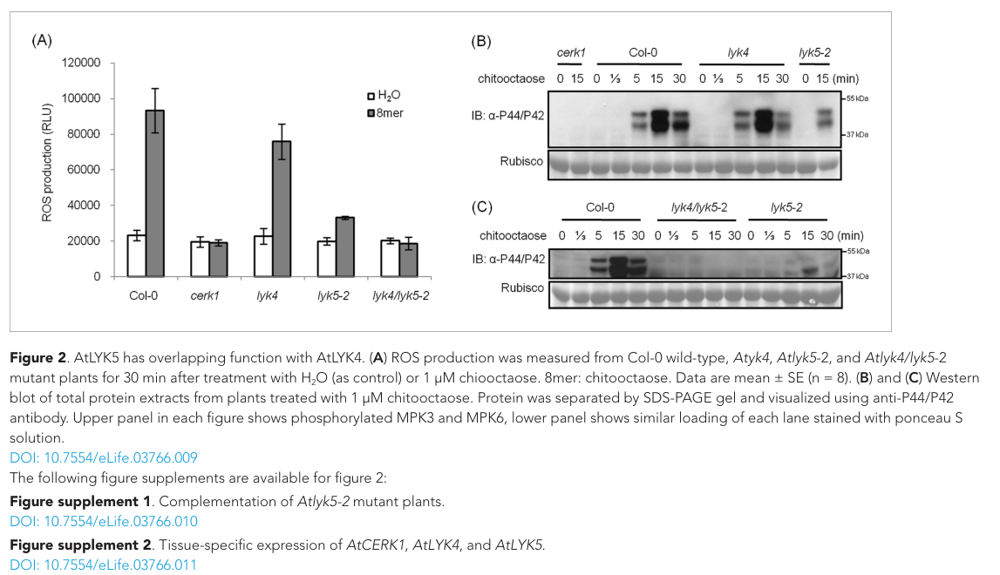

## Question

# Gene Research for Functional Annotation

## ⚠️ CRITICAL: Gene/Protein Identification Context

**BEFORE YOU BEGIN RESEARCH:** You MUST verify you are researching the CORRECT gene/protein. Gene symbols can be ambiguous, especially for less well-characterized genes from non-model organisms.

### Target Gene/Protein Identity (from UniProt):
- **UniProt Accession:** O64825
- **Protein Description:** RecName: Full=LysM domain receptor-like kinase 4; Short=LysM-containing receptor-like kinase 4; EC=2.7.11.1; Flags: Precursor;
- **Gene Information:** Name=LYK4; OrderedLocusNames=At2g23770; ORFNames=F27L4.5;
- **Organism (full):** Arabidopsis thaliana (Mouse-ear cress).
- **Protein Family:** Belongs to the protein kinase superfamily. Ser/Thr protein
- **Key Domains:** Ig-like_dom. (IPR007110); Kinase-like_dom_sf. (IPR011009); LysM. (IPR018392); LysM2_CERK1_LYK3_4_5. (IPR056562); LysM3_LYK4_5. (IPR056563)

### MANDATORY VERIFICATION STEPS:

1. **Check if the gene symbol "LYK4" matches the protein description above**
2. **Verify the organism is correct:** Arabidopsis thaliana (Mouse-ear cress).
3. **Check if protein family/domains align with what you find in literature**
4. **If you find literature for a DIFFERENT gene with the same or similar symbol, STOP**

### If Gene Symbol is Ambiguous or You Cannot Find Relevant Literature:

**DO NOT PROCEED WITH RESEARCH ON A DIFFERENT GENE.** Instead:
- State clearly: "The gene symbol 'LYK4' is ambiguous or literature is limited for this specific protein"
- Explain what you found (e.g., "Found extensive literature on a different gene with the same symbol in a different organism")
- Describe the protein based ONLY on the UniProt information provided above
- Suggest that the protein function can be inferred from domain/family information

### Research Target:

Please provide a comprehensive research report on the gene **LYK4** (gene ID: LYK4, UniProt: O64825) in ARATH.

The research report should be a detailed narrative explaining the function, biological processes, and localization of the gene product. Citations should be given for all claims.

You should prioritize authoritative reviews and primary scientific literature when conducting research. You can supplement
this with annotations you find in gene/protein databases, but these can be outdated or inaccurate.

We are specifically interested in the primary function of the gene - for enzymes, what reaction is catalyzed, and what is the substrate specificity? For transporters, what is the substrate? For structural proteins or adapters, what is the broader structural role? For signaling molecules, what is the role in the pathway.

We are interested in where in or outside the cell the gene product carries out its function.

We are also interested in the signaling or biochemical pathways in which the gene functions. We are less interested in broad pleiotropic effects, except where these elucidate the precise role.

Include evidence where possible. We are interested in both experimental evidence as well as inference from structure, evolution, or bioinformatic analysis. Precise studies should be prioritized over high-throughput, where available.

## Output

Question: You are an expert researcher providing comprehensive, well-cited information.

Provide detailed information focusing on:
1. Key concepts and definitions with current understanding
2. Recent developments and latest research (prioritize 2023-2024 sources)
3. Current applications and real-world implementations
4. Expert opinions and analysis from authoritative sources
5. Relevant statistics and data from recent studies

Format as a comprehensive research report with proper citations. Include URLs and publication dates where available.
Always prioritize recent, authoritative sources and provide specific citations for all major claims.

# Gene Research for Functional Annotation

## ⚠️ CRITICAL: Gene/Protein Identification Context

**BEFORE YOU BEGIN RESEARCH:** You MUST verify you are researching the CORRECT gene/protein. Gene symbols can be ambiguous, especially for less well-characterized genes from non-model organisms.

### Target Gene/Protein Identity (from UniProt):
- **UniProt Accession:** O64825
- **Protein Description:** RecName: Full=LysM domain receptor-like kinase 4; Short=LysM-containing receptor-like kinase 4; EC=2.7.11.1; Flags: Precursor;
- **Gene Information:** Name=LYK4; OrderedLocusNames=At2g23770; ORFNames=F27L4.5;
- **Organism (full):** Arabidopsis thaliana (Mouse-ear cress).
- **Protein Family:** Belongs to the protein kinase superfamily. Ser/Thr protein
- **Key Domains:** Ig-like_dom. (IPR007110); Kinase-like_dom_sf. (IPR011009); LysM. (IPR018392); LysM2_CERK1_LYK3_4_5. (IPR056562); LysM3_LYK4_5. (IPR056563)

### MANDATORY VERIFICATION STEPS:

1. **Check if the gene symbol "LYK4" matches the protein description above**
2. **Verify the organism is correct:** Arabidopsis thaliana (Mouse-ear cress).
3. **Check if protein family/domains align with what you find in literature**
4. **If you find literature for a DIFFERENT gene with the same or similar symbol, STOP**

### If Gene Symbol is Ambiguous or You Cannot Find Relevant Literature:

**DO NOT PROCEED WITH RESEARCH ON A DIFFERENT GENE.** Instead:
- State clearly: "The gene symbol 'LYK4' is ambiguous or literature is limited for this specific protein"
- Explain what you found (e.g., "Found extensive literature on a different gene with the same symbol in a different organism")
- Describe the protein based ONLY on the UniProt information provided above
- Suggest that the protein function can be inferred from domain/family information

### Research Target:

Please provide a comprehensive research report on the gene **LYK4** (gene ID: LYK4, UniProt: O64825) in ARATH.

The research report should be a detailed narrative explaining the function, biological processes, and localization of the gene product. Citations should be given for all claims.

You should prioritize authoritative reviews and primary scientific literature when conducting research. You can supplement
this with annotations you find in gene/protein databases, but these can be outdated or inaccurate.

We are specifically interested in the primary function of the gene - for enzymes, what reaction is catalyzed, and what is the substrate specificity? For transporters, what is the substrate? For structural proteins or adapters, what is the broader structural role? For signaling molecules, what is the role in the pathway.

We are interested in where in or outside the cell the gene product carries out its function.

We are also interested in the signaling or biochemical pathways in which the gene functions. We are less interested in broad pleiotropic effects, except where these elucidate the precise role.

Include evidence where possible. We are interested in both experimental evidence as well as inference from structure, evolution, or bioinformatic analysis. Precise studies should be prioritized over high-throughput, where available.

# Functional annotation report: *Arabidopsis thaliana* LYK4

**Identity and scope.** The target is *A. thaliana* LYK4 (At2g23770; UniProt O64825), a LysM-domain receptor-like protein with an extracellular ligand-recognition region, a membrane-spanning region and an intracellular kinase-like region. The Arabidopsis-specific studies below concern this receptor, not similarly named receptors in grapevine, tomato or *Nicotiana*. Although its supplied UniProt description carries EC 2.7.11.1 and a serine/threonine protein-kinase family assignment, experiments characterize the **LYK4 intracellular domain as catalytically inactive**. Thus, its best-supported primary function is **chitin-responsive receptor-complex assembly and signaling**, not a demonstrated LYK4-catalyzed phosphorylation reaction. (xue2019lyk4isa pages 5-6, erwig2017chitininducedandchitin pages 8-9, zamora2024signalingofplant pages 4-5)

## Primary molecular function and pathway

LYK4 participates in recognition of fungal cell-wall chitin and its immunogenic oligomers at the plant cell surface. Full-length LYK4 and its isolated ectodomain are recovered with chitin beads, consistent with chitin association. Those assays do **not** establish a LYK4 equilibrium binding constant or identify its ligand-contact residues. Under the same experimental conditions, the *different receptor* LYK5 bound chitooctaose with a measured dissociation constant of **1.72 µM**, versus **455 µM** for CERK1/LYK1; these values must not be attributed to LYK4. Chitin-bead recovery of LYK4 was only weakly competed by soluble chitoheptaose or chitooctaose compared with LYK5. (cao2014thekinaselyk5 pages 5-7, xue2019lyk4isa pages 11-12)

The most informative complex-assembly experiments found that LYK4 ectodomains associate with themselves and with LYK5 ectodomains. Chitin or chitoheptaose treatment allowed co-immunoprecipitation of LYK4, LYK5 and CERK1/LYK1. Pairwise assays, including tests in mutant protoplasts, instead support a **ligand-induced LYK5–CERK1 interaction** without establishing a direct LYK4–CERK1 ectodomain interaction. Xue and colleagues consequently proposed that LYK4 is a **LYK5-associated co-receptor or scaffold** that strengthens signaling in a tripartite receptor assembly; the exact intracellular arrangement and phosphorylation sequence remain unresolved. An earlier co-immunoprecipitation study detected CERK1–LYK4 association without chitin dependence, a result that should not by itself be read as evidence of direct ectodomain binding. (xue2019lyk4isa pages 1-2, xue2019lyk4isa pages 17-18, xue2019lyk4isa pages 14-15, cao2014thekinaselyk5 pages 7-9)

LYK4 has no detectable intrinsic kinase-domain autophosphorylation in the cited biochemical assays. Active CERK1 phosphorylated the LYK4 intracellular domain *in vitro*, as did calcium-dependent protein kinases CPK5 and CPK6. This supports a possible role for LYK4 as a **phosphorylation recipient**, not as an established phosphotransfer catalyst. Specific LYK4 phosphorylation sites and a physiologically established chitin-induced LYK4 phosphorylation event remain lacking: native-promoter LYK4–mCitrine did not show a clear phosphorylation-associated mobility shift after chitin treatment, unlike LYK5. Evidence that CERK1-dependent phosphorylation drives receptor endocytosis likewise concerns **LYK5**, not demonstrably LYK4. (huang2020arabidopsiscpk5phosphorylates pages 5-7, erwig2017chitininducedandchitin pages 8-9, erwig2017chitininducedandchitin pages 9-10)

Genetics connects this receptor assembly to pattern-triggered immunity. Compared with wild type, *lyk4* mutant leaves produced approximately **half as much reactive oxygen species** after chitin or chitoheptaose treatment; MAP-kinase phosphorylation, defense-gene induction and callose deposition were also reduced. The *lyk4 lyk5* double mutant lost the tested chitooctaose-induced ROS and MAP-kinase responses, resembling *cerk1*, and failed to acquire the tested chitin-induced resistance to *Alternaria brassicicola*. These results indicate **overlapping LYK4–LYK5 function**, rather than establishing LYK4 alone as the dominant chitin receptor. Increased disease symptoms in *lyk4* after *Fusarium oxysporum* inoculation provide additional, pathogen-challenge evidence. The primary quantitative mutant comparison is shown in Cao *et al.*’s Figure 2. (xue2019lyk4isa pages 14-15, xue2019lyk4isa pages 10-11, cao2014thekinaselyk5 pages 5-7, xue2019lyk4isa pages 11-12, cao2014thekinaselyk5 media 2644a9d9)

The following table separates observations made on LYK4 from measurements made on its receptor partners.

| Question | Directly observed for *Arabidopsis thaliana* LYK4 (O64825) | Limitations / inference | Primary citation (year, DOI, URL) |
|---|---|---|---|
| Ligand binding | Full-length LYK4 and recombinant LYK4 ectodomain were recovered by chitin-bead pull-down, supporting chitin association. In the same receptor system, ITC measured chitooctaose binding only for LYK5 (*K*d = 1.72 μM) and CERK1 (*K*d = 455 μM). (cao2014thekinaselyk5 pages 5-7, xue2019lyk4isa pages 11-12) | No equilibrium affinity (*K*d) or definitive ligand-contact residues have been reported for LYK4. The LYK5 and CERK1 values must not be assigned to LYK4; bead recovery may also reflect direct or complex-assisted binding. | Cao et al. (2014), [10.7554/eLife.03766](https://doi.org/10.7554/eLife.03766); Xue et al. (2019), [10.1093/jxb/erz313](https://doi.org/10.1093/jxb/erz313) |
| Kinase function | Isolated LYK4 intracellular domain lacked detectable autophosphorylation activity. It was trans-phosphorylated *in vitro* by the active CERK1 intracellular domain and by CPK5/CPK6. (huang2020arabidopsiscpk5phosphorylates pages 5-7, erwig2017chitininducedandchitin pages 8-9) | LYK4 is therefore best treated as a kinase-inactive receptor/pseudokinase, notwithstanding its EC-style database classification. LYK4 phosphorylation sites and physiological phosphorylation *in vivo* remain unconfirmed; a clear chitin-induced LYK4 mobility shift was not detected. (erwig2017chitininducedandchitin pages 9-10) | Erwig et al. (2017), [10.1111/nph.14592](https://doi.org/10.1111/nph.14592); Huang et al. (2020), [10.3389/fpls.2020.00702](https://doi.org/10.3389/fpls.2020.00702) |
| Localization | Native-promoter LYK4–mCitrine localized predominantly at the cell periphery/plasma membrane. Rare vesicle-like puncta were seen after chitin exposure and appeared CERK1-dependent. LYK4 homodimerization and LYK4–LYK5 association were also detected at the plasma membrane. (erwig2017chitininducedandchitin pages 4-6, xue2019lyk4isa pages 11-12) | LYK4 fluorescence was weak and puncta were near the detection limit, so chitin-induced LYK4 endocytosis remains tentative. Robust, timed CERK1-dependent endocytosis was demonstrated for LYK5—not LYK4—and must not be transferred to LYK4. | Erwig et al. (2017), [10.1111/nph.14592](https://doi.org/10.1111/nph.14592); Xue et al. (2019), [10.1093/jxb/erz313](https://doi.org/10.1093/jxb/erz313) |
| Receptor complex | LYK4 ectodomain formed constitutive LYK4–LYK4 and LYK4–LYK5 assemblies. Chitin or chitoheptaose enabled co-immunoprecipitation of a complex containing LYK1/CERK1, LYK4 and LYK5; pairwise tests supported ligand-induced LYK1–LYK5 association but not direct LYK1–LYK4 binding. (xue2019lyk4isa pages 1-2, xue2019lyk4isa pages 17-18, xue2019lyk4isa pages 16-17) | The favored model is a tripartite LYK1–LYK5–LYK4 complex in which LYK4 is a LYK5-associated co-receptor/scaffold. Intracellular stoichiometry and trans-phosphorylation sequence remain unresolved. | Xue et al. (2019), [10.1093/jxb/erz313](https://doi.org/10.1093/jxb/erz313) |
| Genetic response | In *lyk4* leaves, chitin- or chitoheptaose-induced ROS was reduced by about 50%; MAPK activation, defense-gene expression and callose deposition were also reduced. The *lyk4 lyk5* double mutant lost essentially all tested chitin-triggered ROS and MAPK responses and chitin-induced resistance to *Alternaria brassicicola*. (xue2019lyk4isa pages 10-11, xue2019lyk4isa pages 14-15, cao2014thekinaselyk5 pages 5-7, cao2014thekinaselyk5 media 2644a9d9) | The intermediate single-mutant phenotype and severe double-mutant phenotype indicate overlapping LYK4/LYK5 function, not that LYK4 alone is the dominant receptor. LYK5 generally contributes the higher-affinity ligand-recognition activity. | Cao et al. (2014), [10.7554/eLife.03766](https://doi.org/10.7554/eLife.03766); Xue et al. (2019), [10.1093/jxb/erz313](https://doi.org/10.1093/jxb/erz313) |

*Table: Direct experimental evidence for ligand association, kinase status, localization, receptor-complex assembly, and genetic function of Arabidopsis LYK4 (O64825), with LYK5-specific findings explicitly separated.*

## Where LYK4 acts

LYK4 functions principally at the **plasma membrane**, positioning its LysM-containing ectodomain outside the cell to encounter fungal chitin-derived material and its kinase-like domain on the cytoplasmic side to participate in receptor-complex signaling. Native-promoter fluorescent LYK4 was seen at the cell periphery, and interaction studies support LYK4–LYK5 association at the plasma membrane. Rare chitin-associated LYK4-positive puncta were reported, but weak fluorescence prevented a robust demonstration of LYK4 endocytosis; the well-characterized CERK1-dependent internalization kinetics apply to LYK5. (cao2014thekinaselyk5 pages 5-7, xue2019lyk4isa pages 11-12, erwig2017chitininducedandchitin pages 4-6, erwig2017chitininducedandchitin pages 9-10)

A thesis indexed as 2023 but **submitted in April 2022** reports that LYK4, LYK5 and the plasmodesmata-associated LysM protein LYM2 are required for chitin-triggered closure of cell-to-cell channels and associate in planta. It identifies **LYM2, not LYK4**, as enriched at plasmodesmata. This is useful evidence for a possible specialized signaling branch, but its thesis status and the unresolved mechanism warrant less weight than the peer-reviewed receptor-complex experiments; it does not establish plasmodesmal enrichment of LYK4. (samwald2023regulationofplasmodesmal pages 1-6)

## Recent interpretation and applications

The 2024 review by Zamora and colleagues places kinase-inactive Arabidopsis LYK4/LYK5 alongside kinase-active CERK1 in the fungal-chitin defense pathway, consistent with the primary biochemical evidence. Its discussion of elicitor-based protection in horticultural crops is **an application rationale, not evidence that Arabidopsis LYK4 has been deployed in a crop or commercial product**. (zamora2024signalingofplant pages 4-5)

A pertinent **2023 laboratory application of the Arabidopsis mutant system** introduced the *grapevine* receptor VvLYK5-1 into *Arabidopsis lyk4 lyk5* plants. This restored chitin-oligomer-responsive MAPK activation, defense-gene expression and callose deposition, and improved resistance in the tested fungal challenge. It shows that the double-mutant background can assess functionally related receptors across species; it does **not** show that Arabidopsis LYK4 itself was engineered into a crop or that grapevine VvLYK5-1 has LYK4’s exact ligand specificity. No field implementation of Arabidopsis LYK4 is established by these sources. (roudaire2023thegrapevinelysm pages 9-11, roudaire2023thegrapevinelysm pages 1-2)

**Outstanding annotation limits.** A purified-LYK4 ligand-binding constant, definitive LYK4 ligand-contact residues, directly verified LYK4 catalytic turnover, mapped physiologically relevant LYK4 phosphorylation sites and a resolved structure of the complete LYK4-containing complex are not established by the studies examined. The EC-style kinase label should therefore not be interpreted as proof that LYK4 catalyzes a specific reaction; the experimentally grounded annotation is a **plasma-membrane, chitin-associated, kinase-inactive signaling co-receptor/scaffold in Arabidopsis antifungal immunity**. (xue2019lyk4isa pages 17-18, cao2014thekinaselyk5 pages 5-7, huang2020arabidopsiscpk5phosphorylates pages 5-7, erwig2017chitininducedandchitin pages 8-9, erwig2017chitininducedandchitin pages 9-10)

### Key sources and publication dates

- Cao *et al.*, *eLife* **3**, e03766 (**October 2014**), receptor binding, mutant genetics and complex formation. https://doi.org/10.7554/eLife.03766 (cao2014thekinaselyk5 pages 5-7, cao2014thekinaselyk5 pages 7-9)
- Erwig *et al.*, *New Phytologist* **215**, 382–396 (**2017**), localization and the distinction between LYK4 and LYK5 phosphorylation/endocytosis. https://doi.org/10.1111/nph.14592 (erwig2017chitininducedandchitin pages 8-9, erwig2017chitininducedandchitin pages 4-6, erwig2017chitininducedandchitin pages 9-10)
- Xue *et al.*, *Journal of Experimental Botany* **70**, 5507–5516 (**October 2019**), LYK4 receptor-complex experiments. https://doi.org/10.1093/jxb/erz313 (xue2019lyk4isa pages 1-2, xue2019lyk4isa pages 17-18)
- Huang *et al.*, *Frontiers in Plant Science* **11**, 702 (**June 2020**), CPK5/CPK6-dependent phosphorylation assays. https://doi.org/10.3389/fpls.2020.00702 (huang2020arabidopsiscpk5phosphorylates pages 5-7)
- Roudaire *et al.*, *Frontiers in Plant Science* **14** (**February 2023**), heterologous grapevine-receptor complementation in Arabidopsis. https://doi.org/10.3389/fpls.2023.1130782 (roudaire2023thegrapevinelysm pages 9-11)
- Zamora *et al.*, *Horticulturae* **10**, 361 (**April 2024**), review of chitin-triggered kinase signaling. https://doi.org/10.3390/horticulturae10040361 (zamora2024signalingofplant pages 4-5)

References

1. (xue2019lyk4isa pages 5-6): De-Xing Xue, Chun-Lian Li, Zhi-Ping Xie, and Christian Staehelin. Lyk4 is a component of a tripartite chitin receptor complex in arabidopsis thaliana. Journal of experimental botany, 70:5507-5516, Oct 2019. URL: https://doi.org/10.1093/jxb/erz313, doi:10.1093/jxb/erz313. This article has 84 citations and is from a domain leading peer-reviewed journal.

2. (erwig2017chitininducedandchitin pages 8-9): Jan Erwig, Hassan Ghareeb, Michaela Kopischke, Ronja Hacke, Alexandra Matei, Elena Petutschnig, and Volker Lipka. Chitin-induced and chitin elicitor receptor kinase1 (cerk1) phosphorylation-dependent endocytosis of arabidopsis thaliana lysin motif-containing receptor-like kinase5 (lyk5). The New phytologist, 215 1:382-396, May 2017. URL: https://doi.org/10.1111/nph.14592, doi:10.1111/nph.14592. This article has 133 citations.

3. (zamora2024signalingofplant pages 4-5): Orlando Reyes Zamora, Rosalba Troncoso-Rojas, María Elena Báez-Flores, Martín Ernesto Tiznado-Hernández, and Agustín Rascón-Chu. Signaling of plant defense mediated by receptor-like kinases, receptor-like cytoplasmic protein kinases and mapks triggered by fungal chitin in horticultural crops. Horticulturae, 10:361, Apr 2024. URL: https://doi.org/10.3390/horticulturae10040361, doi:10.3390/horticulturae10040361. This article has 23 citations.

4. (cao2014thekinaselyk5 pages 5-7): Yangrong Cao, Yan Liang, Kiwamu Tanaka, Cuong T Nguyen, Robert P Jedrzejczak, Andrzej Joachimiak, and Gary Stacey. The kinase lyk5 is a major chitin receptor in arabidopsis and forms a chitin-induced complex with related kinase cerk1. Oct 2014. URL: https://doi.org/10.7554/elife.03766, doi:10.7554/elife.03766. This article has 804 citations and is from a domain leading peer-reviewed journal.

5. (xue2019lyk4isa pages 11-12): De-Xing Xue, Chun-Lian Li, Zhi-Ping Xie, and Christian Staehelin. Lyk4 is a component of a tripartite chitin receptor complex in arabidopsis thaliana. Journal of experimental botany, 70:5507-5516, Oct 2019. URL: https://doi.org/10.1093/jxb/erz313, doi:10.1093/jxb/erz313. This article has 84 citations and is from a domain leading peer-reviewed journal.

6. (xue2019lyk4isa pages 1-2): De-Xing Xue, Chun-Lian Li, Zhi-Ping Xie, and Christian Staehelin. Lyk4 is a component of a tripartite chitin receptor complex in arabidopsis thaliana. Journal of experimental botany, 70:5507-5516, Oct 2019. URL: https://doi.org/10.1093/jxb/erz313, doi:10.1093/jxb/erz313. This article has 84 citations and is from a domain leading peer-reviewed journal.

7. (xue2019lyk4isa pages 17-18): De-Xing Xue, Chun-Lian Li, Zhi-Ping Xie, and Christian Staehelin. Lyk4 is a component of a tripartite chitin receptor complex in arabidopsis thaliana. Journal of experimental botany, 70:5507-5516, Oct 2019. URL: https://doi.org/10.1093/jxb/erz313, doi:10.1093/jxb/erz313. This article has 84 citations and is from a domain leading peer-reviewed journal.

8. (xue2019lyk4isa pages 14-15): De-Xing Xue, Chun-Lian Li, Zhi-Ping Xie, and Christian Staehelin. Lyk4 is a component of a tripartite chitin receptor complex in arabidopsis thaliana. Journal of experimental botany, 70:5507-5516, Oct 2019. URL: https://doi.org/10.1093/jxb/erz313, doi:10.1093/jxb/erz313. This article has 84 citations and is from a domain leading peer-reviewed journal.

9. (cao2014thekinaselyk5 pages 7-9): Yangrong Cao, Yan Liang, Kiwamu Tanaka, Cuong T Nguyen, Robert P Jedrzejczak, Andrzej Joachimiak, and Gary Stacey. The kinase lyk5 is a major chitin receptor in arabidopsis and forms a chitin-induced complex with related kinase cerk1. Oct 2014. URL: https://doi.org/10.7554/elife.03766, doi:10.7554/elife.03766. This article has 804 citations and is from a domain leading peer-reviewed journal.

10. (huang2020arabidopsiscpk5phosphorylates pages 5-7): Congcong Huang, Yijia Yan, Huilin Zhao, Ying Ye, and Yangrong Cao. Arabidopsis cpk5 phosphorylates the chitin receptor lyk5 to regulate plant innate immunity. Frontiers in Plant Science, Jun 2020. URL: https://doi.org/10.3389/fpls.2020.00702, doi:10.3389/fpls.2020.00702. This article has 40 citations.

11. (erwig2017chitininducedandchitin pages 9-10): Jan Erwig, Hassan Ghareeb, Michaela Kopischke, Ronja Hacke, Alexandra Matei, Elena Petutschnig, and Volker Lipka. Chitin-induced and chitin elicitor receptor kinase1 (cerk1) phosphorylation-dependent endocytosis of arabidopsis thaliana lysin motif-containing receptor-like kinase5 (lyk5). The New phytologist, 215 1:382-396, May 2017. URL: https://doi.org/10.1111/nph.14592, doi:10.1111/nph.14592. This article has 133 citations.

12. (xue2019lyk4isa pages 10-11): De-Xing Xue, Chun-Lian Li, Zhi-Ping Xie, and Christian Staehelin. Lyk4 is a component of a tripartite chitin receptor complex in arabidopsis thaliana. Journal of experimental botany, 70:5507-5516, Oct 2019. URL: https://doi.org/10.1093/jxb/erz313, doi:10.1093/jxb/erz313. This article has 84 citations and is from a domain leading peer-reviewed journal.

13. (cao2014thekinaselyk5 media 2644a9d9): Yangrong Cao, Yan Liang, Kiwamu Tanaka, Cuong T Nguyen, Robert P Jedrzejczak, Andrzej Joachimiak, and Gary Stacey. The kinase lyk5 is a major chitin receptor in arabidopsis and forms a chitin-induced complex with related kinase cerk1. Oct 2014. URL: https://doi.org/10.7554/elife.03766, doi:10.7554/elife.03766. This article has 804 citations and is from a domain leading peer-reviewed journal.

14. (erwig2017chitininducedandchitin pages 4-6): Jan Erwig, Hassan Ghareeb, Michaela Kopischke, Ronja Hacke, Alexandra Matei, Elena Petutschnig, and Volker Lipka. Chitin-induced and chitin elicitor receptor kinase1 (cerk1) phosphorylation-dependent endocytosis of arabidopsis thaliana lysin motif-containing receptor-like kinase5 (lyk5). The New phytologist, 215 1:382-396, May 2017. URL: https://doi.org/10.1111/nph.14592, doi:10.1111/nph.14592. This article has 133 citations.

15. (xue2019lyk4isa pages 16-17): De-Xing Xue, Chun-Lian Li, Zhi-Ping Xie, and Christian Staehelin. Lyk4 is a component of a tripartite chitin receptor complex in arabidopsis thaliana. Journal of experimental botany, 70:5507-5516, Oct 2019. URL: https://doi.org/10.1093/jxb/erz313, doi:10.1093/jxb/erz313. This article has 84 citations and is from a domain leading peer-reviewed journal.

16. (samwald2023regulationofplasmodesmal pages 1-6): S Samwald. Regulation of plasmodesmal receptor sorting and signalling by membrane scaffolds–the role of tetraspanins and flotillins. Unknown journal, 2023.

17. (roudaire2023thegrapevinelysm pages 9-11): Thibault Roudaire, Tania Marzari, David Landry, Birgit Löffelhardt, Andrea A. Gust, Angelica Jermakow, Ian Dry, Pascale Winckler, Marie-Claire Héloir, and Benoit Poinssot. The grapevine lysm receptor-like kinase vvlyk5-1 recognizes chitin oligomers through its association with vvlyk1-1. Frontiers in Plant Science, Feb 2023. URL: https://doi.org/10.3389/fpls.2023.1130782, doi:10.3389/fpls.2023.1130782. This article has 26 citations.

18. (roudaire2023thegrapevinelysm pages 1-2): Thibault Roudaire, Tania Marzari, David Landry, Birgit Löffelhardt, Andrea A. Gust, Angelica Jermakow, Ian Dry, Pascale Winckler, Marie-Claire Héloir, and Benoit Poinssot. The grapevine lysm receptor-like kinase vvlyk5-1 recognizes chitin oligomers through its association with vvlyk1-1. Frontiers in Plant Science, Feb 2023. URL: https://doi.org/10.3389/fpls.2023.1130782, doi:10.3389/fpls.2023.1130782. This article has 26 citations.

## Artifacts

- [Edison artifact artifact-00](LYK4-deep-research-falcon_artifacts/artifact-00.md)

## Citations

1. erwig2017chitininducedandchitin pages 9-10
2. samwald2023regulationofplasmodesmal pages 1-6
3. zamora2024signalingofplant pages 4-5
4. roudaire2023thegrapevinelysm pages 9-11
5. erwig2017chitininducedandchitin pages 8-9
6. erwig2017chitininducedandchitin pages 4-6
7. roudaire2023thegrapevinelysm pages 1-2
8. 10.7554/eLife.03766
9. 10.1093/jxb/erz313
10. 10.1111/nph.14592
11. 10.3389/fpls.2020.00702
12. https://doi.org/10.7554/eLife.03766
13. https://doi.org/10.1093/jxb/erz313
14. https://doi.org/10.1111/nph.14592
15. https://doi.org/10.3389/fpls.2020.00702
16. https://doi.org/10.3389/fpls.2023.1130782
17. https://doi.org/10.3390/horticulturae10040361
18. https://doi.org/10.1093/jxb/erz313,
19. https://doi.org/10.1111/nph.14592,
20. https://doi.org/10.3390/horticulturae10040361,
21. https://doi.org/10.7554/elife.03766,
22. https://doi.org/10.3389/fpls.2020.00702,
23. https://doi.org/10.3389/fpls.2023.1130782,