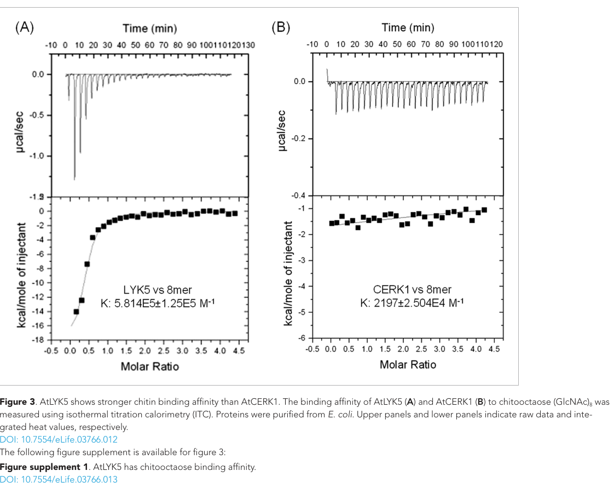

## Question

# Gene Research for Functional Annotation

## ⚠️ CRITICAL: Gene/Protein Identification Context

**BEFORE YOU BEGIN RESEARCH:** You MUST verify you are researching the CORRECT gene/protein. Gene symbols can be ambiguous, especially for less well-characterized genes from non-model organisms.

### Target Gene/Protein Identity (from UniProt):
- **UniProt Accession:** O22808
- **Protein Description:** RecName: Full=Protein LYK5; AltName: Full=LysM domain receptor-like kinase 5; AltName: Full=LysM-containing receptor-like kinase 5; Flags: Precursor;
- **Gene Information:** Name=LYK5; OrderedLocusNames=At2g33580; ORFNames=F4P9.35;
- **Organism (full):** Arabidopsis thaliana (Mouse-ear cress).
- **Protein Family:** Belongs to the protein kinase superfamily. Ser/Thr protein
- **Key Domains:** Kinase-like_dom_sf. (IPR011009); LysM. (IPR018392); LysM2_CERK1_LYK3_4_5. (IPR056562); LysM3_LYK4_5. (IPR056563); NFP_LYK_LysM1. (IPR056561)

### MANDATORY VERIFICATION STEPS:

1. **Check if the gene symbol "LYK5" matches the protein description above**
2. **Verify the organism is correct:** Arabidopsis thaliana (Mouse-ear cress).
3. **Check if protein family/domains align with what you find in literature**
4. **If you find literature for a DIFFERENT gene with the same or similar symbol, STOP**

### If Gene Symbol is Ambiguous or You Cannot Find Relevant Literature:

**DO NOT PROCEED WITH RESEARCH ON A DIFFERENT GENE.** Instead:
- State clearly: "The gene symbol 'LYK5' is ambiguous or literature is limited for this specific protein"
- Explain what you found (e.g., "Found extensive literature on a different gene with the same symbol in a different organism")
- Describe the protein based ONLY on the UniProt information provided above
- Suggest that the protein function can be inferred from domain/family information

### Research Target:

Please provide a comprehensive research report on the gene **LYK5** (gene ID: LYK5, UniProt: O22808) in ARATH.

The research report should be a detailed narrative explaining the function, biological processes, and localization of the gene product. Citations should be given for all claims.

You should prioritize authoritative reviews and primary scientific literature when conducting research. You can supplement
this with annotations you find in gene/protein databases, but these can be outdated or inaccurate.

We are specifically interested in the primary function of the gene - for enzymes, what reaction is catalyzed, and what is the substrate specificity? For transporters, what is the substrate? For structural proteins or adapters, what is the broader structural role? For signaling molecules, what is the role in the pathway.

We are interested in where in or outside the cell the gene product carries out its function.

We are also interested in the signaling or biochemical pathways in which the gene functions. We are less interested in broad pleiotropic effects, except where these elucidate the precise role.

Include evidence where possible. We are interested in both experimental evidence as well as inference from structure, evolution, or bioinformatic analysis. Precise studies should be prioritized over high-throughput, where available.

## Output

Question: You are an expert researcher providing comprehensive, well-cited information.

Provide detailed information focusing on:
1. Key concepts and definitions with current understanding
2. Recent developments and latest research (prioritize 2023-2024 sources)
3. Current applications and real-world implementations
4. Expert opinions and analysis from authoritative sources
5. Relevant statistics and data from recent studies

Format as a comprehensive research report with proper citations. Include URLs and publication dates where available.
Always prioritize recent, authoritative sources and provide specific citations for all major claims.

# Gene Research for Functional Annotation

## ⚠️ CRITICAL: Gene/Protein Identification Context

**BEFORE YOU BEGIN RESEARCH:** You MUST verify you are researching the CORRECT gene/protein. Gene symbols can be ambiguous, especially for less well-characterized genes from non-model organisms.

### Target Gene/Protein Identity (from UniProt):
- **UniProt Accession:** O22808
- **Protein Description:** RecName: Full=Protein LYK5; AltName: Full=LysM domain receptor-like kinase 5; AltName: Full=LysM-containing receptor-like kinase 5; Flags: Precursor;
- **Gene Information:** Name=LYK5; OrderedLocusNames=At2g33580; ORFNames=F4P9.35;
- **Organism (full):** Arabidopsis thaliana (Mouse-ear cress).
- **Protein Family:** Belongs to the protein kinase superfamily. Ser/Thr protein
- **Key Domains:** Kinase-like_dom_sf. (IPR011009); LysM. (IPR018392); LysM2_CERK1_LYK3_4_5. (IPR056562); LysM3_LYK4_5. (IPR056563); NFP_LYK_LysM1. (IPR056561)

### MANDATORY VERIFICATION STEPS:

1. **Check if the gene symbol "LYK5" matches the protein description above**
2. **Verify the organism is correct:** Arabidopsis thaliana (Mouse-ear cress).
3. **Check if protein family/domains align with what you find in literature**
4. **If you find literature for a DIFFERENT gene with the same or similar symbol, STOP**

### If Gene Symbol is Ambiguous or You Cannot Find Relevant Literature:

**DO NOT PROCEED WITH RESEARCH ON A DIFFERENT GENE.** Instead:
- State clearly: "The gene symbol 'LYK5' is ambiguous or literature is limited for this specific protein"
- Explain what you found (e.g., "Found extensive literature on a different gene with the same symbol in a different organism")
- Describe the protein based ONLY on the UniProt information provided above
- Suggest that the protein function can be inferred from domain/family information

### Research Target:

Please provide a comprehensive research report on the gene **LYK5** (gene ID: LYK5, UniProt: O22808) in ARATH.

The research report should be a detailed narrative explaining the function, biological processes, and localization of the gene product. Citations should be given for all claims.

You should prioritize authoritative reviews and primary scientific literature when conducting research. You can supplement
this with annotations you find in gene/protein databases, but these can be outdated or inaccurate.

We are specifically interested in the primary function of the gene - for enzymes, what reaction is catalyzed, and what is the substrate specificity? For transporters, what is the substrate? For structural proteins or adapters, what is the broader structural role? For signaling molecules, what is the role in the pathway.

We are interested in where in or outside the cell the gene product carries out its function.

We are also interested in the signaling or biochemical pathways in which the gene functions. We are less interested in broad pleiotropic effects, except where these elucidate the precise role.

Include evidence where possible. We are interested in both experimental evidence as well as inference from structure, evolution, or bioinformatic analysis. Precise studies should be prioritized over high-throughput, where available.

# Functional annotation of *Arabidopsis thaliana* LYK5

## Identity and principal function

**The target is AtLYK5, locus At2g33580, UniProt O22808**, in *Arabidopsis thaliana* (mouse-ear cress). A 2023 comparative sequence analysis explicitly identifies Arabidopsis AtLYK5 as **AT2G33580**, separately from similarly named grapevine genes. The assigned LysM receptor-like kinase family and extracellular LysM/kinase-like domain architecture agree with experimental studies of Arabidopsis LYK5. Findings about grapevine VvLYK5 or cotton GhLYK5 should not be mistaken for measurements on this protein. (roudaire2023thegrapevinelysm pages 4-6, cao2014thekinaselyk5 pages 7-9, cao2014thekinaselyk5 pages 9-11)

**Primary annotation:** LYK5 is a plasma-membrane pattern-recognition receptor component that binds fungal **chitin-derived oligosaccharides** and enables chitin-triggered innate immune signaling. It is **not a demonstrated active enzyme**: despite its intracellular protein-kinase-like domain, purified LYK5 showed no detectable kinase activity. Its principal role is high-affinity extracellular ligand recognition and assembly of a signaling complex with the catalytically active receptor kinase CERK1, also called LYK1. LYK4 provides partially overlapping chitin-recognition function. (cao2014thekinaselyk5 pages 5-7, cao2014thekinaselyk5 pages 9-11, cao2014thekinaselyk5 pages 11-13)

## Molecular architecture, substrate specificity and evidence

LYK5 has an extracellular region modeled with **three LysM motifs**, a membrane-spanning receptor topology, and a cytoplasmic kinase-like domain. The extracellular region encounters chitin oligomers outside the plasma membrane; the intracellular region enables association with CERK1. The proposed ligand-contact geometry was derived from homology modeling and docking, whereas binding and functional importance were tested experimentally. Missing conserved kinase catalytic features, the negative *in-vitro* kinase assay, and successful rescue by the predicted ATP-binding-defective **K395E** variant support classification as a **pseudokinase**. Deletion of the kinase-like domain abolished rescue and chitin-induced association with CERK1: this domain is functionally important even though its own phosphotransferase activity is not. **No reaction catalyzed by LYK5 or enzymatic substrate has been established.** (cao2014thekinaselyk5 pages 7-9, cao2014thekinaselyk5 pages 9-11, cao2014thekinaselyk5 pages 11-13)

The best-characterized ligand is **chitooctaose**, an eight-unit oligomer of N-acetylglucosamine. Isothermal titration calorimetry of purified extracellular regions gave **Kᵈ = 1.72 µM for LYK5**, compared with **455 µM for CERK1 under the same conditions**; no LYK5 binding to the elicitor-inactive four-unit chitotetraose was detected in that assay. Oligomers of **at least six units** induced LYK5–CERK1 association, whereas five-unit chitopentaose did not. Mutating **Tyr128** substantially weakened chitin-bead binding; mutating **Ser206** abolished it, and neither variant rescued the chitin-induced reactive-oxygen response. These experiments support preference for immunogenic, longer-chain chitin oligomers; they do not establish a complete affinity series for every oligomer length or prove that either residue contacts ligand directly. Affinity estimates depend on assay format and should not be interpreted as an absolute threshold for signaling in intact plants. (cao2014thekinaselyk5 pages 5-7, cao2014thekinaselyk5 pages 7-9, cao2014thekinaselyk5 pages 11-13, cao2014thekinaselyk5 media 8dac4b79)

The following evidence matrix separates direct observations from mechanistic interpretation. (cao2014thekinaselyk5 pages 5-7, cao2014thekinaselyk5 pages 9-11, erwig2017chitininducedandchitin pages 10-12)

| Facet | Direct experiment | Mechanistic interpretation / limitation | Source, DOI URL, publication date |
|---|---|---|---|
| Ligand recognition | Isothermal titration calorimetry with purified ectodomains measured chitooctaose (CO8) binding at **K~d~ = 1.72 µM** for AtLYK5 versus **455 µM** for CERK1; no detectable AtLYK5 binding to elicitor-inactive chitotetraose (CO4). Y128G strongly reduced chitin-bead binding and S206P abolished it; neither variant rescued chitin-triggered ROS in *lyk5-2*. (cao2014thekinaselyk5 pages 5-7, cao2014thekinaselyk5 pages 7-9, cao2014thekinaselyk5 media 8dac4b79) | Establishes AtLYK5 as the high-affinity ligand-binding component for long-chain chitooligosaccharides. Affinity estimates are assay-dependent and do not alone prove the stoichiometry of the native receptor complex. | Cao et al., *eLife*; [https://doi.org/10.7554/eLife.03766](https://doi.org/10.7554/eLife.03766); **1 October 2014** |
| Genetic requirement | The Col-0 *lyk5-2* mutant showed an approximately **90% reduction** and delay in CO8-induced Ca²⁺ influx, reduced ROS, MPK3/MPK6 phosphorylation and WRKY expression, while flagellin responses remained intact. Native-promoter LYK5 restored responses. The *lyk4 lyk5-2* double mutant lost all tested chitin responses and resistance to *Alternaria brassicicola*. (cao2014thekinaselyk5 pages 5-7, cao2014thekinaselyk5 pages 3-5) | LYK5 is a major, stimulus-specific chitin-perception component; residual signaling in *lyk5-2* reflects partial redundancy with LYK4. The variable phenotype of the earlier Ler *lyk5-1* allele makes the Col-0 mutant and complementation evidence especially important. | Cao et al., *eLife*; [https://doi.org/10.7554/eLife.03766](https://doi.org/10.7554/eLife.03766); **1 October 2014** |
| Kinase-like domain | The isolated LYK5 intracellular domain lacked detectable γ-[³²P]-ATP kinase activity and lacks conserved P-loop, RD and DFG residues. ATP-binding-site variant **K395E** still restored ROS, MAPK and CERK1 phosphorylation in *lyk5-2*, whereas deletion of the kinase-like domain (**ΔKD; residues 1–320**) did not restore signaling or chitin-induced association with CERK1. (cao2014thekinaselyk5 pages 9-11, cao2014thekinaselyk5 pages 11-13) | LYK5 is best classified as a **pseudokinase receptor**: it does not catalyze phosphotransfer detectably, but its kinase-like domain has an essential structural/adaptor role in CERK1 association. | Cao et al., *eLife*; [https://doi.org/10.7554/eLife.03766](https://doi.org/10.7554/eLife.03766); **1 October 2014** |
| Membrane dynamics | Native-promoter LYK5–mCitrine was observed at the plasma membrane and entered FM4-64-positive endosomes/MVBs after chitin; vesicle abundance peaked at approximately **1 hour**. LYK5 phosphorylation and internalization were absent with kinase-inactive CERK1, and CERK1 phosphorylated the LYK5 intracellular domain in vitro. (erwig2017chitininducedandchitin pages 9-10, erwig2017chitininducedandchitin pages 10-12, erwig2017chitininducedandchitin pages 6-8) | Supports a model in which activated CERK1 phosphorylates LYK5 and promotes its endocytosis. Direct LYK5 phosphorylation is demonstrated in vitro, but CERK1 could additionally phosphorylate trafficking machinery in vivo. This work did **not** prove that LYK5 internalization is clathrin-dependent. | Erwig et al., *New Phytologist*; [https://doi.org/10.1111/nph.14592](https://doi.org/10.1111/nph.14592); **22 May 2017** |
| PUB13 regulation | PUB13 associated with LYK5 before CO8 treatment and dissociated after treatment. PUB13 ubiquitinated the LYK5 kinase-like domain **in vitro**; untreated *pub13* mutants accumulated more LYK5 and showed enhanced early ROS and MAPK responses, but normal later defense-gene expression and callose deposition. (liao2017arabidopsise3ubiquitin pages 1-2, liao2017arabidopsise3ubiquitin pages 5-7) | PUB13 is a negative regulator of basal LYK5 abundance and early signaling. In-vivo LYK5 ubiquitination by PUB13 was not directly demonstrated, so ubiquitin-mediated turnover remains strongly supported rather than fully resolved. | Liao et al., *New Phytologist*; [https://doi.org/10.1111/nph.14472](https://doi.org/10.1111/nph.14472); **5 June 2017** |
| Plasmodesmal response | *lyk5-2* leaves failed to deposit plasmodesmal callose or restrict intercellular GFP movement after chitin. Tagged LYK5 localized generally to the plasma membrane but was **not detected** in purified plasmodesmal fractions; LYK4, by contrast, was detected there. (cheval2019chitinperceptionin pages 4-7, cheval2019chitinperceptionin pages 9-12) | LYK5 is genetically required upstream of chitin-triggered plasmodesmal closure, probably by regulating LYK4 outside plasmodesmata. It should not be annotated as a demonstrated plasmodesmata-resident receptor, and the proposed LYK5-dependent modification of LYK4 remains mechanistically unresolved. | Cheval et al., bioRxiv preprint; [https://doi.org/10.1101/611582](https://doi.org/10.1101/611582); **18 April 2019** |

*Table: Direct evidence defining Arabidopsis AtLYK5 ligand recognition, genetic requirement, pseudokinase function, trafficking and regulation. Limitations distinguish demonstrated mechanisms from proposed receptor architecture and trafficking models.*

## Site of action and signaling pathway

Fluorescently tagged Arabidopsis LYK5 localized to the **plasma membrane**; thus its extracellular LysM region is positioned to detect chitin fragments in the **apoplast**, while its cytoplasmic region participates in intracellular signaling. Native-promoter LYK5–mCitrine subsequently appeared in intracellular endosomes/multivesicular bodies after chitin treatment. This internalization was transient, peaked at approximately **one hour**, and required CERK1 kinase activity. CERK1 phosphorylated the LYK5 intracellular domain *in vitro*, and LYK5 phosphorylation was observed in chitin-treated plants; whether phosphorylation of LYK5 itself, rather than phosphorylation of additional trafficking factors, is the decisive endocytosis trigger remains unresolved. CERK1 remained predominantly detectable at the plasma membrane in that imaging study. **Clathrin dependence specifically for LYK5 was not established by these experiments.** (cao2014thekinaselyk5 pages 5-7, erwig2017chitininducedandchitin pages 9-10, erwig2017chitininducedandchitin pages 10-12, erwig2017chitininducedandchitin pages 6-8)

A supported receptor-proximal sequence is **extracellular chitin oligomer → LYK5 binding → chitin-induced LYK5–CERK1 association → CERK1 association with itself and phosphorylation → intracellular defense signaling**. LYK5 can also associate with itself before ligand addition. CERK1 association with LYK4, in contrast to its association with LYK5, was detected without chitin. The exact composition and stoichiometry of the active assembly—for example, a proposed heterotetramer—remain a **model**, not a directly established molecular structure. Downstream outputs measured in *lyk5* mutants include diminished calcium influx, reactive-oxygen production, MPK3/MPK6 phosphorylation and WRKY defense-gene induction. CERK1 supplies the receptor complex’s established catalytic activity; these outputs should not be described as reactions catalyzed by LYK5. (cao2014thekinaselyk5 pages 7-9, cao2014thekinaselyk5 pages 9-11, cao2014thekinaselyk5 pages 11-13, cao2014thekinaselyk5 pages 3-5)

The Col-0 **lyk5-2** mutant exhibited approximately **90% lower and delayed chitin-induced calcium influx**, together with reduced ROS and MAP-kinase responses; flagellin-induced calcium influx remained comparable to wild type. Expression of full-length LYK5 from its native promoter restored chitin responses. A *lyk4 lyk5* double mutant lacked the tested chitin-induced ROS and MAP-kinase responses, explaining residual activity in the LYK5 single mutant. The earlier *lyk5-1* allele in a different genetic background showed variable assay-dependent phenotypes; conclusions about LYK5 are therefore strongest when grounded in the Col-0 knockout, complementation, binding and biochemical data together. (cao2014thekinaselyk5 pages 5-7, cao2014thekinaselyk5 pages 3-5)

Chitin signaling ultimately contributes to resistance to fungal challenge: *lyk5-2* plants were more susceptible to ***Alternaria brassicicola***, and unlike wild type did not gain protection from chitooctaose pretreatment. The same pretreatment enhanced resistance to ***Pseudomonas syringae* pv. tomato DC3000** in wild type but not *lyk5-2*; this is evidence for chitin-induced immune priming, **not** evidence that LYK5 directly recognizes that bacterium. Untreated *lyk5-2* plants retained wild-type resistance to the tested bacterial pathogen. (cao2014thekinaselyk5 pages 3-5)

## Regulation and subcellular specialization

PUB13, a plant U-box E3 ubiquitin ligase, associated with LYK5 before chitooctaose treatment and dissociated after treatment. PUB13 ubiquitinated LYK5’s intracellular domain **in vitro**. Untreated *pub13* mutants had higher LYK5 protein abundance and enhanced early chitin-induced ROS and MAP-kinase responses, whereas later measured defense-gene expression and callose deposition were normal. Chitooctaose also increased LYK5 abundance through induced expression and reduced protein degradation. These observations implicate PUB13 in regulating receptor abundance, but **PUB13-dependent ubiquitination of LYK5 in living plants and the precise route of its degradation were not directly resolved** by that study. (liao2017arabidopsise3ubiquitin pages 1-2, liao2017arabidopsise3ubiquitin pages 5-7)

A separate Arabidopsis study found that *lyk5-2* leaves failed to close **plasmodesmata** or deposit local callose after chitin treatment. Importantly, tagged LYK5 was detectable at the general plasma membrane **but not in purified plasmodesmal fractions**; LYK4 was detected there and associated with plasmodesmata-resident LYM2. The proposed role for LYK5 is therefore upstream regulation of LYK4-associated local signaling, **not established residence of LYK5 at plasmodesmata**. The identity of any LYK5-dependent LYK4 modification remains unproven. This finding is reported in the accessible 2019 preprint; it warrants a more qualified interpretation than the direct ligand-binding and knockout-rescue results. (cheval2019chitinperceptionin pages 4-7, cheval2019chitinperceptionin pages 9-12)

## 2023–2024 developments and practical relevance

A **2023 grapevine study** used the Arabidopsis *lyk4 lyk5* double mutant as a functional test of **VvLYK5-1**, a *grapevine* homolog: expressing that homolog restored chitin-oligomer responses, including MAPK activation, defense-gene expression and callose deposition. Chitin-induced interaction of VvLYK5-1 with its grapevine kinase partner and discrimination between chitin and chitosan oligomers add comparative support for conservation of the receptor strategy. **These are not new binding constants or ligand-specificity measurements on native Arabidopsis AtLYK5.** A **2024 review** retains the interpretation that Arabidopsis LYK5/LYK4 supply ligand-recognition capacity and CERK1 supplies signaling kinase activity. (roudaire2023thegrapevinelysm pages 1-2, roudaire2023thegrapevinelysm pages 4-6, zamora2024signalingofplant pages 4-5)

**Current implementation is primarily experimental:** Arabidopsis *lyk5* mutants, complemented lines, fluorescent receptor fusions and purified ectodomains provide tractable assays for ligand recognition, immune signaling and receptor trafficking. Chitin-based immune elicitation and receptor engineering are agriculturally relevant approaches, but the cited grapevine work demonstrates **heterologous, controlled-system complementation**, not field deployment of an AtLYK5-based crop intervention. No crop outcome should be attributed specifically to changing the Arabidopsis O22808 gene without direct evidence. (cao2014thekinaselyk5 pages 5-7, erwig2017chitininducedandchitin pages 10-12, roudaire2023thegrapevinelysm pages 1-2)

**Overall assessment.** Direct genetics, ligand-binding measurements, kinase assays and microscopy establish AtLYK5 as a **high-affinity, plasma-membrane chitin-oligosaccharide receptor component with a catalytically inactive but indispensable kinase-like interaction domain**. Its experimentally supported biochemical task is to couple extracellular fungal-chitin perception to activation of CERK1-dependent immunity; receptor stoichiometry, exact molecular control of endocytosis and proposed secondary localization mechanisms are less certain. (cao2014thekinaselyk5 pages 5-7, cao2014thekinaselyk5 pages 9-11, cao2014thekinaselyk5 pages 11-13, erwig2017chitininducedandchitin pages 10-12)

### Principal publications and links

- Cao Y *et al.* **October 2014**. “The kinase LYK5 is a major chitin receptor in Arabidopsis and forms a chitin-induced complex with related kinase CERK1.” *eLife* 3:e03766. https://doi.org/10.7554/eLife.03766. (cao2014thekinaselyk5 pages 5-7, cao2014thekinaselyk5 pages 9-11)
- Erwig J *et al.* **2017**. “Chitin-induced and CERK1 phosphorylation-dependent endocytosis of Arabidopsis LYK5.” *New Phytologist* 215:382–396. https://doi.org/10.1111/nph.14592. (erwig2017chitininducedandchitin pages 9-10, erwig2017chitininducedandchitin pages 10-12)
- Liao D *et al.* **2017**. “Arabidopsis E3 ubiquitin ligase PUB13 regulates chitin receptor LYK5 protein abundance.” *New Phytologist* 214:1646–1656. https://doi.org/10.1111/nph.14472. (liao2017arabidopsise3ubiquitin pages 1-2)
- Cheval C *et al.* **April 2019, accessible preprint**. “Chitin perception in plasmodesmata identifies subcellular, context-specific immune signalling in plants.” https://doi.org/10.1101/611582. (cheval2019chitinperceptionin pages 4-7, cheval2019chitinperceptionin pages 9-12)
- Roudaire T *et al.* **February 2023**. “The grapevine LysM receptor-like kinase VvLYK5-1 recognizes chitin oligomers through its association with VvLYK1-1.” *Frontiers in Plant Science* 14:1130782. https://doi.org/10.3389/fpls.2023.1130782. **Comparative ortholog evidence, not direct AtLYK5 characterization.** (roudaire2023thegrapevinelysm pages 4-6, roudaire2023thegrapevinelysm pages 1-2)
- Zamora OR *et al.* **April 2024**. “Signaling of Plant Defense Mediated by Receptor-like Kinases, Receptor-like Cytoplasmic Protein Kinases and MAPKs Triggered by Fungal Chitin in Horticultural Crops.” *Horticulturae* 10:361. https://doi.org/10.3390/horticulturae10040361. **Review.** (zamora2024signalingofplant pages 4-5)

References

1. (roudaire2023thegrapevinelysm pages 4-6): Thibault Roudaire, Tania Marzari, David Landry, Birgit Löffelhardt, Andrea A. Gust, Angelica Jermakow, Ian Dry, Pascale Winckler, Marie-Claire Héloir, and Benoit Poinssot. The grapevine lysm receptor-like kinase vvlyk5-1 recognizes chitin oligomers through its association with vvlyk1-1. Frontiers in Plant Science, Feb 2023. URL: https://doi.org/10.3389/fpls.2023.1130782, doi:10.3389/fpls.2023.1130782. This article has 26 citations.

2. (cao2014thekinaselyk5 pages 7-9): Yangrong Cao, Yan Liang, Kiwamu Tanaka, Cuong T Nguyen, Robert P Jedrzejczak, Andrzej Joachimiak, and Gary Stacey. The kinase lyk5 is a major chitin receptor in arabidopsis and forms a chitin-induced complex with related kinase cerk1. Oct 2014. URL: https://doi.org/10.7554/elife.03766, doi:10.7554/elife.03766. This article has 804 citations and is from a domain leading peer-reviewed journal.

3. (cao2014thekinaselyk5 pages 9-11): Yangrong Cao, Yan Liang, Kiwamu Tanaka, Cuong T Nguyen, Robert P Jedrzejczak, Andrzej Joachimiak, and Gary Stacey. The kinase lyk5 is a major chitin receptor in arabidopsis and forms a chitin-induced complex with related kinase cerk1. Oct 2014. URL: https://doi.org/10.7554/elife.03766, doi:10.7554/elife.03766. This article has 804 citations and is from a domain leading peer-reviewed journal.

4. (cao2014thekinaselyk5 pages 5-7): Yangrong Cao, Yan Liang, Kiwamu Tanaka, Cuong T Nguyen, Robert P Jedrzejczak, Andrzej Joachimiak, and Gary Stacey. The kinase lyk5 is a major chitin receptor in arabidopsis and forms a chitin-induced complex with related kinase cerk1. Oct 2014. URL: https://doi.org/10.7554/elife.03766, doi:10.7554/elife.03766. This article has 804 citations and is from a domain leading peer-reviewed journal.

5. (cao2014thekinaselyk5 pages 11-13): Yangrong Cao, Yan Liang, Kiwamu Tanaka, Cuong T Nguyen, Robert P Jedrzejczak, Andrzej Joachimiak, and Gary Stacey. The kinase lyk5 is a major chitin receptor in arabidopsis and forms a chitin-induced complex with related kinase cerk1. Oct 2014. URL: https://doi.org/10.7554/elife.03766, doi:10.7554/elife.03766. This article has 804 citations and is from a domain leading peer-reviewed journal.

6. (cao2014thekinaselyk5 media 8dac4b79): Yangrong Cao, Yan Liang, Kiwamu Tanaka, Cuong T Nguyen, Robert P Jedrzejczak, Andrzej Joachimiak, and Gary Stacey. The kinase lyk5 is a major chitin receptor in arabidopsis and forms a chitin-induced complex with related kinase cerk1. Oct 2014. URL: https://doi.org/10.7554/elife.03766, doi:10.7554/elife.03766. This article has 804 citations and is from a domain leading peer-reviewed journal.

7. (erwig2017chitininducedandchitin pages 10-12): Jan Erwig, Hassan Ghareeb, Michaela Kopischke, Ronja Hacke, Alexandra Matei, Elena Petutschnig, and Volker Lipka. Chitin-induced and chitin elicitor receptor kinase1 (cerk1) phosphorylation-dependent endocytosis of arabidopsis thaliana lysin motif-containing receptor-like kinase5 (lyk5). The New phytologist, 215 1:382-396, May 2017. URL: https://doi.org/10.1111/nph.14592, doi:10.1111/nph.14592. This article has 133 citations.

8. (cao2014thekinaselyk5 pages 3-5): Yangrong Cao, Yan Liang, Kiwamu Tanaka, Cuong T Nguyen, Robert P Jedrzejczak, Andrzej Joachimiak, and Gary Stacey. The kinase lyk5 is a major chitin receptor in arabidopsis and forms a chitin-induced complex with related kinase cerk1. Oct 2014. URL: https://doi.org/10.7554/elife.03766, doi:10.7554/elife.03766. This article has 804 citations and is from a domain leading peer-reviewed journal.

9. (erwig2017chitininducedandchitin pages 9-10): Jan Erwig, Hassan Ghareeb, Michaela Kopischke, Ronja Hacke, Alexandra Matei, Elena Petutschnig, and Volker Lipka. Chitin-induced and chitin elicitor receptor kinase1 (cerk1) phosphorylation-dependent endocytosis of arabidopsis thaliana lysin motif-containing receptor-like kinase5 (lyk5). The New phytologist, 215 1:382-396, May 2017. URL: https://doi.org/10.1111/nph.14592, doi:10.1111/nph.14592. This article has 133 citations.

10. (erwig2017chitininducedandchitin pages 6-8): Jan Erwig, Hassan Ghareeb, Michaela Kopischke, Ronja Hacke, Alexandra Matei, Elena Petutschnig, and Volker Lipka. Chitin-induced and chitin elicitor receptor kinase1 (cerk1) phosphorylation-dependent endocytosis of arabidopsis thaliana lysin motif-containing receptor-like kinase5 (lyk5). The New phytologist, 215 1:382-396, May 2017. URL: https://doi.org/10.1111/nph.14592, doi:10.1111/nph.14592. This article has 133 citations.

11. (liao2017arabidopsise3ubiquitin pages 1-2): Dehua Liao, Yangrong Cao, Xun Sun, Catherine Espinoza, Cuong T. Nguyen, Yan Liang, and Gary Stacey. Arabidopsis e3 ubiquitin ligase plant u-box13 (pub13) regulates chitin receptor lysin motif receptor kinase5 (lyk5) protein abundance. The New phytologist, 214 4:1646-1656, Jun 2017. URL: https://doi.org/10.1111/nph.14472, doi:10.1111/nph.14472. This article has 146 citations.

12. (liao2017arabidopsise3ubiquitin pages 5-7): Dehua Liao, Yangrong Cao, Xun Sun, Catherine Espinoza, Cuong T. Nguyen, Yan Liang, and Gary Stacey. Arabidopsis e3 ubiquitin ligase plant u-box13 (pub13) regulates chitin receptor lysin motif receptor kinase5 (lyk5) protein abundance. The New phytologist, 214 4:1646-1656, Jun 2017. URL: https://doi.org/10.1111/nph.14472, doi:10.1111/nph.14472. This article has 146 citations.

13. (cheval2019chitinperceptionin pages 4-7): Cecilia Cheval, Matthew Johnston, Sebastian Samwald, Xiaokun Liu, Annalisa Bellandi, Andrew Breakspear, Yasuhiro Kadota, Cyril Zipfel, and Christine Faulkner. Chitin perception in plasmodesmata identifies subcellular, context-specific immune signalling in plants. bioRxiv, Apr 2019. URL: https://doi.org/10.1101/611582, doi:10.1101/611582. This article has 2 citations.

14. (cheval2019chitinperceptionin pages 9-12): Cecilia Cheval, Matthew Johnston, Sebastian Samwald, Xiaokun Liu, Annalisa Bellandi, Andrew Breakspear, Yasuhiro Kadota, Cyril Zipfel, and Christine Faulkner. Chitin perception in plasmodesmata identifies subcellular, context-specific immune signalling in plants. bioRxiv, Apr 2019. URL: https://doi.org/10.1101/611582, doi:10.1101/611582. This article has 2 citations.

15. (roudaire2023thegrapevinelysm pages 1-2): Thibault Roudaire, Tania Marzari, David Landry, Birgit Löffelhardt, Andrea A. Gust, Angelica Jermakow, Ian Dry, Pascale Winckler, Marie-Claire Héloir, and Benoit Poinssot. The grapevine lysm receptor-like kinase vvlyk5-1 recognizes chitin oligomers through its association with vvlyk1-1. Frontiers in Plant Science, Feb 2023. URL: https://doi.org/10.3389/fpls.2023.1130782, doi:10.3389/fpls.2023.1130782. This article has 26 citations.

16. (zamora2024signalingofplant pages 4-5): Orlando Reyes Zamora, Rosalba Troncoso-Rojas, María Elena Báez-Flores, Martín Ernesto Tiznado-Hernández, and Agustín Rascón-Chu. Signaling of plant defense mediated by receptor-like kinases, receptor-like cytoplasmic protein kinases and mapks triggered by fungal chitin in horticultural crops. Horticulturae, 10:361, Apr 2024. URL: https://doi.org/10.3390/horticulturae10040361, doi:10.3390/horticulturae10040361. This article has 23 citations.

## Artifacts

- [Edison artifact artifact-00](LYK5-deep-research-falcon_artifacts/artifact-00.md)

## Citations

1. zamora2024signalingofplant pages 4-5
2. roudaire2023thegrapevinelysm pages 4-6
3. erwig2017chitininducedandchitin pages 10-12
4. erwig2017chitininducedandchitin pages 9-10
5. erwig2017chitininducedandchitin pages 6-8
6. cheval2019chitinperceptionin pages 4-7
7. cheval2019chitinperceptionin pages 9-12
8. roudaire2023thegrapevinelysm pages 1-2
9. https://doi.org/10.7554/eLife.03766
10. ³²P
11. https://doi.org/10.1111/nph.14592
12. https://doi.org/10.1111/nph.14472
13. https://doi.org/10.1101/611582
14. https://doi.org/10.7554/eLife.03766](https://doi.org/10.7554/eLife.03766
15. https://doi.org/10.1111/nph.14592](https://doi.org/10.1111/nph.14592
16. https://doi.org/10.1111/nph.14472](https://doi.org/10.1111/nph.14472
17. https://doi.org/10.1101/611582](https://doi.org/10.1101/611582
18. https://doi.org/10.7554/eLife.03766.
19. https://doi.org/10.1111/nph.14592.
20. https://doi.org/10.1111/nph.14472.
21. https://doi.org/10.1101/611582.
22. https://doi.org/10.3389/fpls.2023.1130782.
23. https://doi.org/10.3390/horticulturae10040361.
24. https://doi.org/10.3389/fpls.2023.1130782,
25. https://doi.org/10.7554/elife.03766,
26. https://doi.org/10.1111/nph.14592,
27. https://doi.org/10.1111/nph.14472,
28. https://doi.org/10.1101/611582,
29. https://doi.org/10.3390/horticulturae10040361,