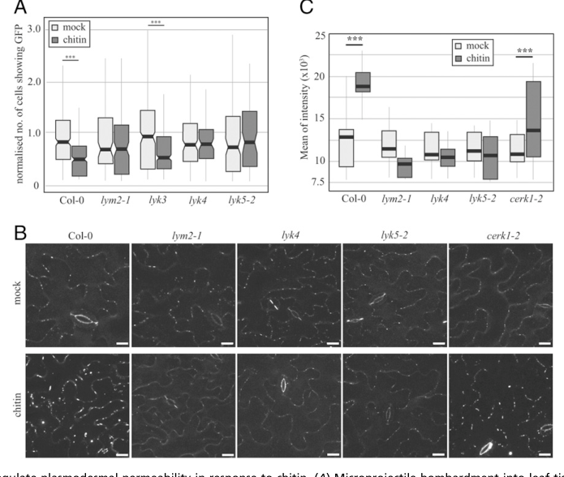

## Question

# Gene Research for Functional Annotation

## ⚠️ CRITICAL: Gene/Protein Identification Context

**BEFORE YOU BEGIN RESEARCH:** You MUST verify you are researching the CORRECT gene/protein. Gene symbols can be ambiguous, especially for less well-characterized genes from non-model organisms.

### Target Gene/Protein Identity (from UniProt):
- **UniProt Accession:** O23006
- **Protein Description:** RecName: Full=LysM domain-containing GPI-anchored protein 2; AltName: Full=Chitin elicitor-binding protein LYM2; Short=CEBiP LYM2; Flags: Precursor;
- **Gene Information:** Name=LYM2; OrderedLocusNames=At2g17120; ORFNames=F6P23.25;
- **Organism (full):** Arabidopsis thaliana (Mouse-ear cress).
- **Protein Family:** Not specified in UniProt
- **Key Domains:** LysM. (IPR018392); LysM_dom_sf. (IPR036779); LysM (PF01476)

### MANDATORY VERIFICATION STEPS:

1. **Check if the gene symbol "LYM2" matches the protein description above**
2. **Verify the organism is correct:** Arabidopsis thaliana (Mouse-ear cress).
3. **Check if protein family/domains align with what you find in literature**
4. **If you find literature for a DIFFERENT gene with the same or similar symbol, STOP**

### If Gene Symbol is Ambiguous or You Cannot Find Relevant Literature:

**DO NOT PROCEED WITH RESEARCH ON A DIFFERENT GENE.** Instead:
- State clearly: "The gene symbol 'LYM2' is ambiguous or literature is limited for this specific protein"
- Explain what you found (e.g., "Found extensive literature on a different gene with the same symbol in a different organism")
- Describe the protein based ONLY on the UniProt information provided above
- Suggest that the protein function can be inferred from domain/family information

### Research Target:

Please provide a comprehensive research report on the gene **LYM2** (gene ID: LYM2, UniProt: O23006) in ARATH.

The research report should be a detailed narrative explaining the function, biological processes, and localization of the gene product. Citations should be given for all claims.

You should prioritize authoritative reviews and primary scientific literature when conducting research. You can supplement
this with annotations you find in gene/protein databases, but these can be outdated or inaccurate.

We are specifically interested in the primary function of the gene - for enzymes, what reaction is catalyzed, and what is the substrate specificity? For transporters, what is the substrate? For structural proteins or adapters, what is the broader structural role? For signaling molecules, what is the role in the pathway.

We are interested in where in or outside the cell the gene product carries out its function.

We are also interested in the signaling or biochemical pathways in which the gene functions. We are less interested in broad pleiotropic effects, except where these elucidate the precise role.

Include evidence where possible. We are interested in both experimental evidence as well as inference from structure, evolution, or bioinformatic analysis. Precise studies should be prioritized over high-throughput, where available.

## Output

Question: You are an expert researcher providing comprehensive, well-cited information.

Provide detailed information focusing on:
1. Key concepts and definitions with current understanding
2. Recent developments and latest research (prioritize 2023-2024 sources)
3. Current applications and real-world implementations
4. Expert opinions and analysis from authoritative sources
5. Relevant statistics and data from recent studies

Format as a comprehensive research report with proper citations. Include URLs and publication dates where available.
Always prioritize recent, authoritative sources and provide specific citations for all major claims.

# Gene Research for Functional Annotation

## ⚠️ CRITICAL: Gene/Protein Identification Context

**BEFORE YOU BEGIN RESEARCH:** You MUST verify you are researching the CORRECT gene/protein. Gene symbols can be ambiguous, especially for less well-characterized genes from non-model organisms.

### Target Gene/Protein Identity (from UniProt):
- **UniProt Accession:** O23006
- **Protein Description:** RecName: Full=LysM domain-containing GPI-anchored protein 2; AltName: Full=Chitin elicitor-binding protein LYM2; Short=CEBiP LYM2; Flags: Precursor;
- **Gene Information:** Name=LYM2; OrderedLocusNames=At2g17120; ORFNames=F6P23.25;
- **Organism (full):** Arabidopsis thaliana (Mouse-ear cress).
- **Protein Family:** Not specified in UniProt
- **Key Domains:** LysM. (IPR018392); LysM_dom_sf. (IPR036779); LysM (PF01476)

### MANDATORY VERIFICATION STEPS:

1. **Check if the gene symbol "LYM2" matches the protein description above**
2. **Verify the organism is correct:** Arabidopsis thaliana (Mouse-ear cress).
3. **Check if protein family/domains align with what you find in literature**
4. **If you find literature for a DIFFERENT gene with the same or similar symbol, STOP**

### If Gene Symbol is Ambiguous or You Cannot Find Relevant Literature:

**DO NOT PROCEED WITH RESEARCH ON A DIFFERENT GENE.** Instead:
- State clearly: "The gene symbol 'LYM2' is ambiguous or literature is limited for this specific protein"
- Explain what you found (e.g., "Found extensive literature on a different gene with the same symbol in a different organism")
- Describe the protein based ONLY on the UniProt information provided above
- Suggest that the protein function can be inferred from domain/family information

### Research Target:

Please provide a comprehensive research report on the gene **LYM2** (gene ID: LYM2, UniProt: O23006) in ARATH.

The research report should be a detailed narrative explaining the function, biological processes, and localization of the gene product. Citations should be given for all claims.

You should prioritize authoritative reviews and primary scientific literature when conducting research. You can supplement
this with annotations you find in gene/protein databases, but these can be outdated or inaccurate.

We are specifically interested in the primary function of the gene - for enzymes, what reaction is catalyzed, and what is the substrate specificity? For transporters, what is the substrate? For structural proteins or adapters, what is the broader structural role? For signaling molecules, what is the role in the pathway.

We are interested in where in or outside the cell the gene product carries out its function.

We are also interested in the signaling or biochemical pathways in which the gene functions. We are less interested in broad pleiotropic effects, except where these elucidate the precise role.

Include evidence where possible. We are interested in both experimental evidence as well as inference from structure, evolution, or bioinformatic analysis. Precise studies should be prioritized over high-throughput, where available.

# Functional annotation report: *Arabidopsis thaliana* LYM2

**Identity verified.** The target is *Arabidopsis thaliana* **LYM2, locus At2g17120**, corresponding to the user-specified UniProt accession [O23006](https://www.uniprot.org/uniprotkb/O23006/entry). Primary literature calls this protein **AtCEBiP** and identifies it as a chitin-binding, glycosylphosphatidylinositol (GPI)-anchored LysM receptor-like protein. This matches the supplied LysM-domain annotation. It is **not** the rice protein OsCEBiP, the Arabidopsis peptidoglycan-associated proteins LYM1 and LYM3, or the kinase CERK1. (shinya2012functionalcharacterizationof pages 1-2, buendia2018lysmreceptorlikekinase pages 9-10, shinya2012functionalcharacterizationof pages 2-3)

## Primary molecular function and location

LYM2 is best annotated as a **cell-surface receptor component for chitin-derived oligosaccharides**, whose clearest demonstrated physiological output is **chitin-induced restriction of molecular movement between plant cells through plasmodesmata**. Its extracellular LysM-containing region recognizes the ligand; its GPI anchor positions it on the outer face of the plasma membrane. LYM2 is enriched specifically in the **plasmodesmal plasma membrane**, the membrane lining channels between neighboring cells. It is not itself a chitin-degrading enzyme, callose synthase, transporter, or intracellular protein kinase. (cheval2020chitinperceptionin pages 1-2, cheval2020chitinperceptionin pages 6-7, shinya2012functionalcharacterizationof pages 2-3, awwanah2026lym2mediateschitininduced pages 1-2)

In a direct binding study, membranes containing expressed Arabidopsis LYM2 bound biotinylated **N-acetylchitooctaose, (GlcNAc)₈**. Binding saturated at approximately **200–300 nM** in that assay; this is a *saturation range*, **not a measured dissociation constant**. Unlabeled N-acetylchitooligosaccharides competed in a chain-length-dependent fashion, whereas the deacetylated **chitosan octasaccharide, (GlcN)₈**, did not compete under the tested conditions. LYM1 and LYM3 did not show comparable chitin binding in the same expression assay. These results establish ligand recognition, but do not establish that every chitin polymer length binds equally or identify an atomic-resolution binding site in Arabidopsis LYM2. (shinya2012functionalcharacterizationof pages 2-3, shinya2012functionalcharacterizationof pages 3-4)

The following evidence matrix separates observations from mechanistic interpretation. (cheval2020chitinperceptionin pages 2-4, cheval2020chitinperceptionin pages 6-7, shinya2012functionalcharacterizationof pages 2-3)

| Feature | Direct evidence and measurement | Interpretation or caution |
|---|---|---|
| Identity and protein class | *Arabidopsis thaliana* LYM2 is At2g17120/AtCEBiP (UniProt O23006), a GPI-anchored extracellular LysM receptor-like protein (shinya2012functionalcharacterizationof pages 2-3, cheval2020chitinperceptionin pages 6-7). | LYM2 lacks an intracellular kinase domain. It is a ligand-binding receptor-like protein, not a receptor kinase or enzyme; LYK4, LYK5, and CERK1 are distinct LysM receptor-like kinases. |
| Ligand and specificity | Microsomal LYM2 bound biotinylated chitooctaose, (GlcNAc)8, with saturation at approximately 200–300 nM. Unlabeled N-acetylchitooligosaccharides competed in a length-dependent manner, whereas chitosan octasaccharide, (GlcN)8, did not compete (shinya2012functionalcharacterizationof pages 2-3, shinya2012functionalcharacterizationof pages 3-4). | The results establish selective chitin-oligosaccharide binding. The 200–300 nM value is the observed saturation range, not a reported equilibrium dissociation constant (Kd). LYM1 and LYM3 did not bind chitin in the same assay. |
| Subcellular location and dynamics | LYM2 occurs in the plasma membrane and is enriched in the plasmodesmal plasma-membrane microdomain. Citrine-LYM2 enrichment at plasmodesmata increased 30 minutes after chitin treatment; at least 18 images were analyzed, with P < 0.001 (cheval2020chitinperceptionin pages 6-7). | Fluorescence anisotropy is consistent with increased LYM2 self-association or clustering at plasmodesmata, but it does not establish a defined oligomeric structure. |
| Requirement for plasmodesmal closure | After chitin treatment, wild type—but not **lym2-1**—restricted bombardment-delivered GFP movement into neighboring cells. The assay included at least 84 bombardment sites and six biological replicates; supported within-genotype treatment effects had P < 0.001 (cheval2020chitinperceptionin pages 2-4, cheval2020chitinperceptionin media 7458e519). | This is direct genetic evidence that LYM2 is required for the chitin-induced reduction of plasmodesmal molecular flux. |
| Callose response and CERK1 independence | At 30 minutes, plasmodesmata-associated callose increased in wild type and **cerk1-2**, but not in **lym2-1**; at least 31 images were quantified, with P < 0.001 for supported treatment comparisons (cheval2020chitinperceptionin pages 2-4, cheval2020chitinperceptionin media 7458e519). | LYM2-dependent plasmodesmal signaling is separable from canonical CERK1-dependent chitin signaling. Callose accumulation explains the reduced flux, but the responsible glucan synthase was not identified directly. |
| LYK4 and LYK5 | **lyk4** and **lyk5-2** mutants failed to restrict GFP movement or deposit plasmodesmal callose after chitin. LYK4, but not LYK5, was detected in purified plasmodesmal fractions. LYK5 associated with LYK4 in the general plasma membrane, and chitin altered this association and receptor mobility (cheval2020chitinperceptionin pages 2-4, cheval2020chitinperceptionin pages 6-7). | Both kinases are genetically required, but LYK5 likely acts upstream or outside the plasmodesmal microdomain. A direct plasmodesmal LYM2–LYK4–LYK5 tripartite complex has not been demonstrated. |
| Downstream RBOHD/CPK module | **rbohD**, **cpk6-1**, and **cpk11-2** mutants failed to close plasmodesmata after chitin. RBOHD S133A and S343A/S347A variants failed to support closure, implicating Ser133 and Ser347; at least 89 bombardment sites were analyzed (cheval2020chitinperceptionin pages 6-7). | Genetic and phosphosite-substitution evidence supports RBOHD, CPK6, CPK11, Ser133, and Ser347. Direct phosphorylation of these sites by those CPKs within an LYM2 complex was not shown, and the downstream callose-synthase identity remains unresolved. |
| Canonical immune outputs | LYM2 knockout—and an LYM1/LYM2/LYM3 triple knockout—retained normal (GlcNAc)8-induced ROS production and defense-gene expression. LYM2 overexpression likewise did not alter ROS output or ligand sensitivity (shinya2012functionalcharacterizationof pages 2-3, shinya2012functionalcharacterizationof pages 3-4). | LYM2 is not required for the canonical whole-cell chitin outputs tested by Shinya et al. Its best-supported primary function is spatially restricted plasmodesmal signaling rather than general CERK1-dependent ROS or transcriptional signaling. |

*Table: High-confidence experimental evidence defining Arabidopsis LYM2 ligand specificity, localization, and plasmodesmal immune function. The cautions distinguish direct findings from proposed receptor-complex and downstream-signaling models.*

## Biological pathway: localized chitin-triggered immunity

**The phenotype is plasmodesmal closure, not loss of all chitin responses.** In Arabidopsis leaf bombardment experiments, chitin reduced movement of GFP into neighboring cells in wild type, but not in **lym2-1**, **lyk4**, or **lyk5-2** mutants. Figure 1 of the primary study documents these genotype comparisons across **six biological replicates and at least 84 bombardment sites**. Chitin increased plasmodesmata-associated **callose**, a β-1,3-glucan that restricts channel permeability, within **30 minutes** in wild type and **cerk1-2**, but not in **lym2-1**, **lyk4**, or **lyk5-2**; at least **31 images** were quantified, with significant within-genotype increases reported at **P < 0.001**. Thus, LYM2 is required for the measured chitin-dependent callose response and reduction in intercellular flux, whereas CERK1 is dispensable for that localized callose response. (cheval2020chitinperceptionin pages 2-4, cheval2020chitinperceptionin media 7458e519)

**The signaling machinery is spatially differentiated.** Imaging and plasmodesmal fractionation place LYM2 and the LysM receptor kinase **LYK4** at plasmodesmata; **LYK5** is required genetically but was not detected in purified plasmodesmal fractions. LYM2 associates with LYK4 even without chitin and in the absence of LYK5. LYK4 and LYK5 associate in the wider plasma membrane; chitin alters their proximity and mobility. Separately, chitin increases LYM2 enrichment at plasmodesmata after **30 minutes**, and fluorescence anisotropy is consistent with increased LYM2 self-association there. These findings support a locally organized receptor system, **not proof of a defined three-protein complex at plasmodesmata**. The authors explicitly leave open whether some plasma-membrane associations involve separate two-protein complexes or a three-protein complex. (cheval2020chitinperceptionin pages 4-4, cheval2020chitinperceptionin pages 2-4, cheval2020chitinperceptionin pages 6-7, cheval2020chitinperceptionin pages 7-8)

**Downstream, genetic evidence implicates calcium-dependent kinases and a localized oxidase response.** Arabidopsis **rbohD**, **cpk6-1**, and **cpk11-2** mutants failed to restrict plasmodesmal GFP movement after chitin. Substitution of **RBOHD Ser133**, or the paired **Ser343/Ser347** sites, likewise disrupted closure; comparison with other substitutions implicates **Ser133 and Ser347** in this response. By contrast, **cpk6-1** and **cpk11-2** retained a broadly measured chitin-triggered oxidative burst, emphasizing that the plasmodesmal response is separable from that whole-seedling readout. A working model is that LYM2-associated signaling engages LYK4, CPK6/CPK11, RBOHD-dependent reactive oxygen species, and local callose synthesis to close the channel. **Direct phosphorylation of RBOHD by those kinases specifically within an LYM2 complex, and the identity of the callose synthase executing this particular response, were not established by these experiments.** (cheval2020chitinperceptionin pages 4-6, cheval2020chitinperceptionin pages 6-7, cheval2020chitinperceptionin pages 7-8)

This resolves an apparent historical discrepancy. The earlier Arabidopsis study found that loss of LYM2—even in an **LYM1/LYM2/LYM3 triple mutant**—did not eliminate the tested chitin-oligosaccharide-induced **bulk ROS production or defense-gene expression**; increasing LYM2 abundance did not enhance the measured ROS response. Those results do **not** contradict its subsequently demonstrated requirement for a *different, spatially restricted* response. Arabidopsis **CERK1** supports canonical chitin responses, whereas LYM2 is particularly important for chitin-responsive plasmodesmal permeability. The rice OsCEBiP–OsCERK1 arrangement should therefore not be assigned unchanged to Arabidopsis LYM2. (shinya2012functionalcharacterizationof pages 2-3, shinya2012functionalcharacterizationof pages 3-4, cheval2020chitinperceptionin pages 2-4)

## Recent research and practical significance

The **2024** receptor-like-protein review lists AtLYM2/At2g17120 as a chitin-associated pattern-recognition protein, while a **2024** plasmodesmata review places callose-dependent changes in channel permeability within the broader plant-defense framework. These reviews are useful syntheses, but the precise LYM2-dependent mechanism above rests primarily on the binding and mutant/imaging experiments rather than on new LYM2 experiments in those reviews. A membrane-scaffold thesis indexed as **2023** proposes tetraspanins and flotillins as additional organizers of chitin-responsive receptor signaling; its title page says **April 2022**, so its indexing date should not be mistaken for the date of a peer-reviewed LYM2-specific discovery. (cai2024receptorlikeproteinsdecisionmakers pages 4-6, chen2024plasmodesmatafunctionand pages 5-6, samwald2023regulationofplasmodesmal pages 1-6)

More recently, a **13 July 2026** study found that **poplar** LYM2-related proteins bind chitin, localize to plasmodesmata when experimentally expressed, and are required for chitin-triggered restriction of plasmodesmal flux in *Populus × canescens* knockout experiments. This provides **cross-species support for a conserved type of function**, but the poplar paralogs **PcLYM2–1/PcLYM2–2 are not Arabidopsis At2g17120**, and their splice variants and knockout phenotypes must not be attributed to the Arabidopsis gene. (awwanah2026lym2mediateschitininduced pages 1-2)

**Present applications are predominantly experimental:** LYM2 mutants and fluorescent LYM2 fusions distinguish plasmodesmal chitin signaling from canonical whole-cell immune outputs and help investigate membrane-microdomain signaling. The observed connection to antifungal defense makes the pathway of potential interest for crop research, but the experiments reviewed here do **not** demonstrate that deploying or overexpressing *Arabidopsis* LYM2 improves field-level resistance or yield. Reports of resistance to *Alternaria brassicicola* appear in secondary literature; without the underlying Arabidopsis infection study available for verification here, no lesion-size or pathogen-biomass effect is assigned to LYM2. (cheval2020chitinperceptionin pages 2-4, chen2020overexpressionofan pages 1-2, awwanah2026lym2mediateschitininduced pages 1-2)

## Key sources and publication dates

- Shinya *et al.*, **October 2012**, “Functional characterization of CEBiP and CERK1 homologs in Arabidopsis and rice,” *Plant & Cell Physiology*. [https://doi.org/10.1093/pcp/pcs113](https://doi.org/10.1093/pcp/pcs113). Primary ligand-binding and conventional-response genetics. (shinya2012functionalcharacterizationof pages 2-3, shinya2012functionalcharacterizationof pages 3-4)
- Cheval *et al.*, **April 2020**, “Chitin perception in plasmodesmata characterizes submembrane immune-signaling specificity in plants,” *PNAS*. [https://doi.org/10.1073/pnas.1907799117](https://doi.org/10.1073/pnas.1907799117). Primary localization, interaction, mutant, flux, and callose evidence; its **Figure 1** directly shows the key genotype comparisons. (cheval2020chitinperceptionin pages 2-4, cheval2020chitinperceptionin pages 6-7, cheval2020chitinperceptionin media 7458e519)
- Cai *et al.*, **November 2024**, “Receptor-like proteins: decision-makers of plant immunity,” *Phytopathology Research*. [https://doi.org/10.1186/s42483-024-00279-0](https://doi.org/10.1186/s42483-024-00279-0). Recent receptor-family review. (cai2024receptorlikeproteinsdecisionmakers pages 4-6)
- Chen *et al.*, **August 2024**, “Plasmodesmata Function and Callose Deposition in Plant Disease Defense,” *Plants*. [https://doi.org/10.3390/plants13162242](https://doi.org/10.3390/plants13162242). Recent review of the callose/permeability context. (chen2024plasmodesmatafunctionand pages 5-6, chen2024plasmodesmatafunctionand pages 4-5)
- Awwanah *et al.*, **13 July 2026**, “LYM2 mediates chitin-induced plasmodesmal flux reduction in *Populus × canescens*,” *Frontiers in Plant Science*. [https://doi.org/10.3389/fpls.2026.1879338](https://doi.org/10.3389/fpls.2026.1879338). Primary study of **poplar homologs**, not of the Arabidopsis target. (awwanah2026lym2mediateschitininduced pages 1-2)

**Bottom line:** The experimentally supported primary annotation for **Arabidopsis LYM2/At2g17120** is a **GPI-anchored, extracellular LysM chitin-oligosaccharide-binding receptor component acting at plasmodesmata to trigger localized callose accumulation and limit cell-to-cell molecular flux**. Its signaling role is distinct from an obligatory role in the conventional CERK1-dependent bulk chitin responses tested to date. (shinya2012functionalcharacterizationof pages 2-3, cheval2020chitinperceptionin pages 2-4, cheval2020chitinperceptionin pages 6-7, shinya2012functionalcharacterizationof pages 3-4)

References

1. (shinya2012functionalcharacterizationof pages 1-2): Tomonori Shinya, Noriko Motoyama, Asahi Ikeda, Miyuki Wada, Kota Kamiya, Masahiro Hayafune, Hanae Kaku, and Naoto Shibuya. Functional characterization of cebip and cerk1 homologs in arabidopsis and rice reveals the presence of different chitin receptor systems in plants. Plant & cell physiology, 53 10:1696-706, Oct 2012. URL: https://doi.org/10.1093/pcp/pcs113, doi:10.1093/pcp/pcs113. This article has 242 citations and is from a domain leading peer-reviewed journal.

2. (buendia2018lysmreceptorlikekinase pages 9-10): Luis Buendia, Ariane Girardin, Tongming Wang, Ludovic Cottret, and Benoit Lefebvre. Lysm receptor-like kinase and lysm receptor-like protein families: an update on phylogeny and functional characterization. Frontiers in Plant Science, Oct 2018. URL: https://doi.org/10.3389/fpls.2018.01531, doi:10.3389/fpls.2018.01531. This article has 196 citations.

3. (shinya2012functionalcharacterizationof pages 2-3): Tomonori Shinya, Noriko Motoyama, Asahi Ikeda, Miyuki Wada, Kota Kamiya, Masahiro Hayafune, Hanae Kaku, and Naoto Shibuya. Functional characterization of cebip and cerk1 homologs in arabidopsis and rice reveals the presence of different chitin receptor systems in plants. Plant & cell physiology, 53 10:1696-706, Oct 2012. URL: https://doi.org/10.1093/pcp/pcs113, doi:10.1093/pcp/pcs113. This article has 242 citations and is from a domain leading peer-reviewed journal.

4. (cheval2020chitinperceptionin pages 1-2): Cécilia Cheval, Sebastian Samwald, Matthew G. Johnston, Jeroen de Keijzer, Andrew Breakspear, Xiaokun Liu, Annalisa Bellandi, Yasuhiro Kadota, Cyril Zipfel, and Christine Faulkner. Chitin perception in plasmodesmata characterizes submembrane immune-signaling specificity in plants. Proceedings of the National Academy of Sciences of the United States of America, 117:9621-9629, Apr 2020. URL: https://doi.org/10.1073/pnas.1907799117, doi:10.1073/pnas.1907799117. This article has 112 citations and is from a highest quality peer-reviewed journal.

5. (cheval2020chitinperceptionin pages 6-7): Cécilia Cheval, Sebastian Samwald, Matthew G. Johnston, Jeroen de Keijzer, Andrew Breakspear, Xiaokun Liu, Annalisa Bellandi, Yasuhiro Kadota, Cyril Zipfel, and Christine Faulkner. Chitin perception in plasmodesmata characterizes submembrane immune-signaling specificity in plants. Proceedings of the National Academy of Sciences of the United States of America, 117:9621-9629, Apr 2020. URL: https://doi.org/10.1073/pnas.1907799117, doi:10.1073/pnas.1907799117. This article has 112 citations and is from a highest quality peer-reviewed journal.

6. (awwanah2026lym2mediateschitininduced pages 1-2): Mo Awwanah, Merle Reinhold, Greta Niemann, Mascha Muhr, Kerstin Schmitt, Oliver Valerius, Andrzej Majcherczyk, Dennis Janz, Elena Petutschnig, Volker Lipka, and Thomas Teichmann. Lym2 mediates chitin-induced plasmodesmal flux reduction in populus x canescens. Frontiers in Plant Science, Jul 2026. URL: https://doi.org/10.3389/fpls.2026.1879338, doi:10.3389/fpls.2026.1879338. This article has 0 citations.

7. (shinya2012functionalcharacterizationof pages 3-4): Tomonori Shinya, Noriko Motoyama, Asahi Ikeda, Miyuki Wada, Kota Kamiya, Masahiro Hayafune, Hanae Kaku, and Naoto Shibuya. Functional characterization of cebip and cerk1 homologs in arabidopsis and rice reveals the presence of different chitin receptor systems in plants. Plant & cell physiology, 53 10:1696-706, Oct 2012. URL: https://doi.org/10.1093/pcp/pcs113, doi:10.1093/pcp/pcs113. This article has 242 citations and is from a domain leading peer-reviewed journal.

8. (cheval2020chitinperceptionin pages 2-4): Cécilia Cheval, Sebastian Samwald, Matthew G. Johnston, Jeroen de Keijzer, Andrew Breakspear, Xiaokun Liu, Annalisa Bellandi, Yasuhiro Kadota, Cyril Zipfel, and Christine Faulkner. Chitin perception in plasmodesmata characterizes submembrane immune-signaling specificity in plants. Proceedings of the National Academy of Sciences of the United States of America, 117:9621-9629, Apr 2020. URL: https://doi.org/10.1073/pnas.1907799117, doi:10.1073/pnas.1907799117. This article has 112 citations and is from a highest quality peer-reviewed journal.

9. (cheval2020chitinperceptionin media 7458e519): Cécilia Cheval, Sebastian Samwald, Matthew G. Johnston, Jeroen de Keijzer, Andrew Breakspear, Xiaokun Liu, Annalisa Bellandi, Yasuhiro Kadota, Cyril Zipfel, and Christine Faulkner. Chitin perception in plasmodesmata characterizes submembrane immune-signaling specificity in plants. Proceedings of the National Academy of Sciences of the United States of America, 117:9621-9629, Apr 2020. URL: https://doi.org/10.1073/pnas.1907799117, doi:10.1073/pnas.1907799117. This article has 112 citations and is from a highest quality peer-reviewed journal.

10. (cheval2020chitinperceptionin pages 4-4): Cécilia Cheval, Sebastian Samwald, Matthew G. Johnston, Jeroen de Keijzer, Andrew Breakspear, Xiaokun Liu, Annalisa Bellandi, Yasuhiro Kadota, Cyril Zipfel, and Christine Faulkner. Chitin perception in plasmodesmata characterizes submembrane immune-signaling specificity in plants. Proceedings of the National Academy of Sciences of the United States of America, 117:9621-9629, Apr 2020. URL: https://doi.org/10.1073/pnas.1907799117, doi:10.1073/pnas.1907799117. This article has 112 citations and is from a highest quality peer-reviewed journal.

11. (cheval2020chitinperceptionin pages 7-8): Cécilia Cheval, Sebastian Samwald, Matthew G. Johnston, Jeroen de Keijzer, Andrew Breakspear, Xiaokun Liu, Annalisa Bellandi, Yasuhiro Kadota, Cyril Zipfel, and Christine Faulkner. Chitin perception in plasmodesmata characterizes submembrane immune-signaling specificity in plants. Proceedings of the National Academy of Sciences of the United States of America, 117:9621-9629, Apr 2020. URL: https://doi.org/10.1073/pnas.1907799117, doi:10.1073/pnas.1907799117. This article has 112 citations and is from a highest quality peer-reviewed journal.

12. (cheval2020chitinperceptionin pages 4-6): Cécilia Cheval, Sebastian Samwald, Matthew G. Johnston, Jeroen de Keijzer, Andrew Breakspear, Xiaokun Liu, Annalisa Bellandi, Yasuhiro Kadota, Cyril Zipfel, and Christine Faulkner. Chitin perception in plasmodesmata characterizes submembrane immune-signaling specificity in plants. Proceedings of the National Academy of Sciences of the United States of America, 117:9621-9629, Apr 2020. URL: https://doi.org/10.1073/pnas.1907799117, doi:10.1073/pnas.1907799117. This article has 112 citations and is from a highest quality peer-reviewed journal.

13. (cai2024receptorlikeproteinsdecisionmakers pages 4-6): Minrui Cai, Hongqiang Yu, E. Sun, and Cunwu Zuo. Receptor-like proteins: decision-makers of plant immunity. Phytopathology Research, Nov 2024. URL: https://doi.org/10.1186/s42483-024-00279-0, doi:10.1186/s42483-024-00279-0. This article has 24 citations and is from a peer-reviewed journal.

14. (chen2024plasmodesmatafunctionand pages 5-6): Jingsheng Chen, Xiaofeng Xu, Wei Liu, Ziyang Feng, Quan Chen, You Zhou, Miao Sun, Liping Gan, Tiange Zhou, and Yuanhu Xuan. Plasmodesmata function and callose deposition in plant disease defense. Aug 2024. URL: https://doi.org/10.3390/plants13162242, doi:10.3390/plants13162242. This article has 27 citations.

15. (samwald2023regulationofplasmodesmal pages 1-6): S Samwald. Regulation of plasmodesmal receptor sorting and signalling by membrane scaffolds–the role of tetraspanins and flotillins. Unknown journal, 2023.

16. (chen2020overexpressionofan pages 1-2): Qiming Chen, Chaohua Dong, Xiaohong Sun, Yugang Zhang, Hongyi Dai, and Suhua Bai. Overexpression of an apple lysm-containing protein gene, mdcerk1–2, confers improved resistance to the pathogenic fungus, alternaria alternata, in nicotiana benthamiana. BMC Plant Biology, Apr 2020. URL: https://doi.org/10.1186/s12870-020-02361-z, doi:10.1186/s12870-020-02361-z. This article has 47 citations and is from a peer-reviewed journal.

17. (chen2024plasmodesmatafunctionand pages 4-5): Jingsheng Chen, Xiaofeng Xu, Wei Liu, Ziyang Feng, Quan Chen, You Zhou, Miao Sun, Liping Gan, Tiange Zhou, and Yuanhu Xuan. Plasmodesmata function and callose deposition in plant disease defense. Aug 2024. URL: https://doi.org/10.3390/plants13162242, doi:10.3390/plants13162242. This article has 27 citations.

## Artifacts

- [Edison artifact artifact-00](LYM2-deep-research-falcon_artifacts/artifact-00.md)

## Citations

1. cheval2020chitinperceptionin pages 6-7
2. cai2024receptorlikeproteinsdecisionmakers pages 4-6
3. shinya2012functionalcharacterizationof pages 1-2
4. buendia2018lysmreceptorlikekinase pages 9-10
5. shinya2012functionalcharacterizationof pages 2-3
6. cheval2020chitinperceptionin pages 1-2
7. shinya2012functionalcharacterizationof pages 3-4
8. cheval2020chitinperceptionin pages 2-4
9. cheval2020chitinperceptionin pages 4-4
10. cheval2020chitinperceptionin pages 7-8
11. cheval2020chitinperceptionin pages 4-6
12. chen2024plasmodesmatafunctionand pages 5-6
13. samwald2023regulationofplasmodesmal pages 1-6
14. chen2020overexpressionofan pages 1-2
15. chen2024plasmodesmatafunctionand pages 4-5
16. O23006
17. https://doi.org/10.1093/pcp/pcs113
18. https://doi.org/10.1073/pnas.1907799117
19. https://doi.org/10.1186/s42483-024-00279-0
20. https://doi.org/10.3390/plants13162242
21. https://doi.org/10.3389/fpls.2026.1879338
22. https://www.uniprot.org/uniprotkb/O23006/entry
23. https://doi.org/10.1093/pcp/pcs113](https://doi.org/10.1093/pcp/pcs113
24. https://doi.org/10.1073/pnas.1907799117](https://doi.org/10.1073/pnas.1907799117
25. https://doi.org/10.1186/s42483-024-00279-0](https://doi.org/10.1186/s42483-024-00279-0
26. https://doi.org/10.3390/plants13162242](https://doi.org/10.3390/plants13162242
27. https://doi.org/10.3389/fpls.2026.1879338](https://doi.org/10.3389/fpls.2026.1879338
28. https://doi.org/10.1093/pcp/pcs113,
29. https://doi.org/10.3389/fpls.2018.01531,
30. https://doi.org/10.1073/pnas.1907799117,
31. https://doi.org/10.3389/fpls.2026.1879338,
32. https://doi.org/10.1186/s42483-024-00279-0,
33. https://doi.org/10.3390/plants13162242,
34. https://doi.org/10.1186/s12870-020-02361-z,