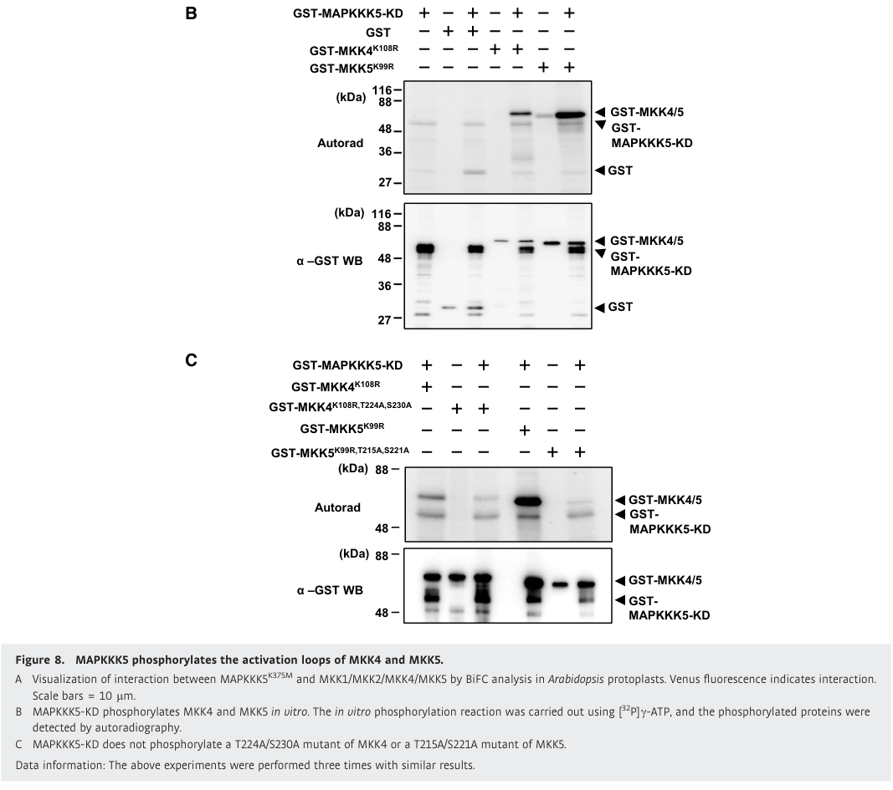

## Question

# Gene Research for Functional Annotation

## ⚠️ CRITICAL: Gene/Protein Identification Context

**BEFORE YOU BEGIN RESEARCH:** You MUST verify you are researching the CORRECT gene/protein. Gene symbols can be ambiguous, especially for less well-characterized genes from non-model organisms.

### Target Gene/Protein Identity (from UniProt):
- **UniProt Accession:** Q9C5H5
- **Protein Description:** RecName: Full=Mitogen-activated protein kinase kinase kinase 5 {ECO:0000303|PubMed:27679653}; EC=2.7.11.25 {ECO:0000269|PubMed:27679653}; AltName: Full=MAP3K gamma protein kinase {ECO:0000303|PubMed:10095117}; Short=AtMAP3Kgamma {ECO:0000303|PubMed:10095117};
- **Gene Information:** Name=MAPKKK5 {ECO:0000303|PubMed:27679653}; Synonyms=MAP3KG {ECO:0000303|PubMed:10095117}; OrderedLocusNames=At5g66850 {ECO:0000312|Araport:AT5G66850}; ORFNames=MUD21.11 {ECO:0000312|EMBL:BAB08627.1};
- **Organism (full):** Arabidopsis thaliana (Mouse-ear cress).
- **Protein Family:** Belongs to the protein kinase superfamily. STE Ser/Thr
- **Key Domains:** Kinase-like_dom_sf. (IPR011009); MAP_kinase_kinase_kinase. (IPR050538); Prot_kinase_dom. (IPR000719); Protein_kinase_ATP_BS. (IPR017441); Pkinase (PF00069)

### MANDATORY VERIFICATION STEPS:

1. **Check if the gene symbol "MAPKKK5" matches the protein description above**
2. **Verify the organism is correct:** Arabidopsis thaliana (Mouse-ear cress).
3. **Check if protein family/domains align with what you find in literature**
4. **If you find literature for a DIFFERENT gene with the same or similar symbol, STOP**

### If Gene Symbol is Ambiguous or You Cannot Find Relevant Literature:

**DO NOT PROCEED WITH RESEARCH ON A DIFFERENT GENE.** Instead:
- State clearly: "The gene symbol 'MAPKKK5' is ambiguous or literature is limited for this specific protein"
- Explain what you found (e.g., "Found extensive literature on a different gene with the same symbol in a different organism")
- Describe the protein based ONLY on the UniProt information provided above
- Suggest that the protein function can be inferred from domain/family information

### Research Target:

Please provide a comprehensive research report on the gene **MAPKKK5** (gene ID: MAPKKK5, UniProt: Q9C5H5) in ARATH.

The research report should be a detailed narrative explaining the function, biological processes, and localization of the gene product. Citations should be given for all claims.

You should prioritize authoritative reviews and primary scientific literature when conducting research. You can supplement
this with annotations you find in gene/protein databases, but these can be outdated or inaccurate.

We are specifically interested in the primary function of the gene - for enzymes, what reaction is catalyzed, and what is the substrate specificity? For transporters, what is the substrate? For structural proteins or adapters, what is the broader structural role? For signaling molecules, what is the role in the pathway.

We are interested in where in or outside the cell the gene product carries out its function.

We are also interested in the signaling or biochemical pathways in which the gene functions. We are less interested in broad pleiotropic effects, except where these elucidate the precise role.

Include evidence where possible. We are interested in both experimental evidence as well as inference from structure, evolution, or bioinformatic analysis. Precise studies should be prioritized over high-throughput, where available.

## Output

Question: You are an expert researcher providing comprehensive, well-cited information.

Provide detailed information focusing on:
1. Key concepts and definitions with current understanding
2. Recent developments and latest research (prioritize 2023-2024 sources)
3. Current applications and real-world implementations
4. Expert opinions and analysis from authoritative sources
5. Relevant statistics and data from recent studies

Format as a comprehensive research report with proper citations. Include URLs and publication dates where available.
Always prioritize recent, authoritative sources and provide specific citations for all major claims.

# Gene Research for Functional Annotation

## ⚠️ CRITICAL: Gene/Protein Identification Context

**BEFORE YOU BEGIN RESEARCH:** You MUST verify you are researching the CORRECT gene/protein. Gene symbols can be ambiguous, especially for less well-characterized genes from non-model organisms.

### Target Gene/Protein Identity (from UniProt):
- **UniProt Accession:** Q9C5H5
- **Protein Description:** RecName: Full=Mitogen-activated protein kinase kinase kinase 5 {ECO:0000303|PubMed:27679653}; EC=2.7.11.25 {ECO:0000269|PubMed:27679653}; AltName: Full=MAP3K gamma protein kinase {ECO:0000303|PubMed:10095117}; Short=AtMAP3Kgamma {ECO:0000303|PubMed:10095117};
- **Gene Information:** Name=MAPKKK5 {ECO:0000303|PubMed:27679653}; Synonyms=MAP3KG {ECO:0000303|PubMed:10095117}; OrderedLocusNames=At5g66850 {ECO:0000312|Araport:AT5G66850}; ORFNames=MUD21.11 {ECO:0000312|EMBL:BAB08627.1};
- **Organism (full):** Arabidopsis thaliana (Mouse-ear cress).
- **Protein Family:** Belongs to the protein kinase superfamily. STE Ser/Thr
- **Key Domains:** Kinase-like_dom_sf. (IPR011009); MAP_kinase_kinase_kinase. (IPR050538); Prot_kinase_dom. (IPR000719); Protein_kinase_ATP_BS. (IPR017441); Pkinase (PF00069)

### MANDATORY VERIFICATION STEPS:

1. **Check if the gene symbol "MAPKKK5" matches the protein description above**
2. **Verify the organism is correct:** Arabidopsis thaliana (Mouse-ear cress).
3. **Check if protein family/domains align with what you find in literature**
4. **If you find literature for a DIFFERENT gene with the same or similar symbol, STOP**

### If Gene Symbol is Ambiguous or You Cannot Find Relevant Literature:

**DO NOT PROCEED WITH RESEARCH ON A DIFFERENT GENE.** Instead:
- State clearly: "The gene symbol 'MAPKKK5' is ambiguous or literature is limited for this specific protein"
- Explain what you found (e.g., "Found extensive literature on a different gene with the same symbol in a different organism")
- Describe the protein based ONLY on the UniProt information provided above
- Suggest that the protein function can be inferred from domain/family information

### Research Target:

Please provide a comprehensive research report on the gene **MAPKKK5** (gene ID: MAPKKK5, UniProt: Q9C5H5) in ARATH.

The research report should be a detailed narrative explaining the function, biological processes, and localization of the gene product. Citations should be given for all claims.

You should prioritize authoritative reviews and primary scientific literature when conducting research. You can supplement
this with annotations you find in gene/protein databases, but these can be outdated or inaccurate.

We are specifically interested in the primary function of the gene - for enzymes, what reaction is catalyzed, and what is the substrate specificity? For transporters, what is the substrate? For structural proteins or adapters, what is the broader structural role? For signaling molecules, what is the role in the pathway.

We are interested in where in or outside the cell the gene product carries out its function.

We are also interested in the signaling or biochemical pathways in which the gene functions. We are less interested in broad pleiotropic effects, except where these elucidate the precise role.

Include evidence where possible. We are interested in both experimental evidence as well as inference from structure, evolution, or bioinformatic analysis. Precise studies should be prioritized over high-throughput, where available.

# Functional annotation report: Arabidopsis MAPKKK5

## Identity and principal function

**MAPKKK5 is the Arabidopsis thaliana protein encoded by At5g66850**, corresponding to the supplied UniProt accession **Q9C5H5**. It is a MEKK-subfamily mitogen-activated protein kinase kinase kinase (MAP3K) with a central protein-kinase domain and regulatory N- and C-terminal regions. It must not be confused with its downstream substrate **MKK5**, its related kinase **MAPKKK3**, or YODA/**MAPKKK4**. The locus, organism, family and domain organization are explicitly corroborated in a primary study. [UniProt: https://www.uniprot.org/uniprotkb/Q9C5H5/entry; Yamada et al., *EMBO Journal*, September 2016, https://doi.org/10.15252/embj.201694248.] (yamada2016thearabidopsiscerk1‐associated pages 2-3)

**Its best-established molecular function is ATP-dependent phosphorylation of the MAPK kinases MKK4 and MKK5**, placing it upstream of the MKK4/MKK5–MPK3/MPK6 signaling module. In purified-protein assays, the MAPKKK5 kinase domain phosphorylated kinase-inactive MKK4 and MKK5. Substituting the paired activation-loop residues **T224/S230 in MKK4** or **T215/S221 in MKK5** with alanine greatly reduced phosphorylation. MKK5 received a stronger signal than MKK4 under those assay conditions; MKK1 was not detectably phosphorylated, and MKK2 received only weak phosphorylation that did not depend on its corresponding activation-loop motif. These findings establish direct substrates and qualitative selectivity, **not** in-vivo kinetic constants or an exhaustive substrate list. [Yamada et al., 2016, https://doi.org/10.15252/embj.201694248; Figure 8.] (yamada2016thearabidopsiscerk1‐associated pages 10-12, yamada2016thearabidopsiscerk1‐associated media b35e07cb)

The following evidence map distinguishes phosphorylation *by* MAPKKK5 from regulatory phosphorylation *of* MAPKKK5.

| Biological step | Observed direct evidence | Qualification |
|---|---|---|
| Catalytic output to MAPKKs | Purified MAPKKK5 kinase domain transferred phosphate from ATP to kinase-inactive MKK4 and MKK5. Double-alanine substitutions in their activation loops—MKK4 T224A/S230A and MKK5 T215A/S221A—largely abolished phosphorylation; MKK5 was phosphorylated more strongly than MKK4 under the assay conditions. Yamada et al. (2016), DOI: 10.15252/embj.201694248. (yamada2016thearabidopsiscerk1‐associated pages 10-12, yamada2016thearabidopsiscerk1‐associated media b35e07cb) | Strongest direct evidence for enzymatic substrate specificity. MKK1 was not phosphorylated; MKK2 showed only weak phosphorylation not dependent on its canonical activation-loop motif. In-vitro preference does not establish quantitative kinetics or exclusive substrates in vivo. (yamada2016thearabidopsiscerk1‐associated pages 10-12) |
| CERK1–PBL27 input | PBL27 phosphorylated six MAPKKK5 C-terminal residues—S617, S622, S658, S660, T677 and S685—in vitro; S622A caused the largest individual reduction. CERK1 kinase activity enhanced PBL27-mediated phosphorylation but CERK1 did not directly phosphorylate the tested MAPKKK5 tail. Yamada et al. (2016), DOI: 10.15252/embj.201694248. (yamada2016thearabidopsiscerk1‐associated pages 9-10, yamada2016thearabidopsiscerk1‐associated pages 6-8, yamada2016thearabidopsiscerk1‐associated pages 8-9) | The six-site alanine variant only partly restored chitin-induced MAPK activation and callose deposition. Bi et al. (2018) could not reproduce a PBL27 requirement: phosphorylation was normal in *pbl27* and instead depended on RLCK VII-4 proteins. Thus, PBL27’s essential in-vivo role remains disputed. DOI: 10.1105/tpc.17.00981. (yamada2016thearabidopsiscerk1‐associated pages 8-9, bi2018receptorlikecytoplasmickinases pages 8-11) |
| BSK1 input | BSK1 physically associated with the MAPKKK5 kinase domain and directly phosphorylated the MAPKKK5 N-terminal region, principally at S289. S289A largely eliminated phosphorylation, failed to restore bacterial and powdery-mildew resistance, whereas phosphomimetic S289D restored resistance. Yan et al. (2018), DOI: 10.1104/pp.17.01757. (yan2018brassinosteroidsignalingkinase1phosphorylates pages 7-11) | S289 phosphorylation was required for tested immune functions but not for MAPKKK5-induced cell death in transiently transformed *Nicotiana benthamiana*. This establishes regulatory phosphorylation of MAPKKK5, not BSK1 as its downstream substrate. (yan2018brassinosteroidsignalingkinase1phosphorylates pages 7-11) |
| RLCK VII-4/PBL19 input | Chitin induced MAPKKK5 S599 phosphorylation. In the presence of the CERK1 kinase domain, PBL19 phosphorylated the MAPKKK5 tail at S599 in vitro; RLCK VII-4 sextuple mutants retained only about 25% of normal chitin-induced MAPKKK5 phosphorylation. S599A failed to restore MPK3/6 activation, whereas wild-type MAPKKK5 and S599D produced about 3.5-fold the empty-vector response. Bi et al. (2018), DOI: 10.1105/tpc.17.00981. (bi2018receptorlikecytoplasmickinases pages 35-41, bi2018receptorlikecytoplasmickinases pages 8-11) | S599D did not activate MPK3/6 without elicitation, showing that S599 phosphorylation is necessary but insufficient. Functional tests used MAPKKK5 transgenes in a *mapkkk3 mapkkk5* background and therefore account for MAPKKK3 redundancy. (bi2018receptorlikecytoplasmickinases pages 11-15, bi2018receptorlikecytoplasmickinases pages 8-11) |
| MPK6 positive feedback | Activated MPK6 directly phosphorylated MAPKKK5 at S682 and S692 in vitro. Phospho-dead substitutions weakened chitin/flg22 signaling, FRK1 induction and pathogen resistance; phosphomimetic substitutions enhanced or prolonged MPK3/6 activation, supporting a positive-feedback loop. Bi et al. (2018), DOI: 10.1105/tpc.17.00981. (bi2018receptorlikecytoplasmickinases pages 11-15, bi2018receptorlikecytoplasmickinases pages 41-45) | MAPKKK5 is the substrate in this feedback reaction; MPK3/6 remain downstream MAPKs rather than direct primary substrates of MAPKKK5. Effects were evaluated mainly through complementation of *mapkkk3 mapkkk5*. (bi2018receptorlikecytoplasmickinases pages 11-15, bi2018receptorlikecytoplasmickinases pages 21-25) |
| Subcellular execution | Fractionation detected MAPKKK5 in soluble/cytosolic and microsomal/plasma-membrane fractions. Co-IP/BiFC placed its PBL27 complex at the plasma membrane, while BiFC localized interactions with MKK4 and MKK5 mainly to the cytosol. Yamada et al. (2016), DOI: 10.15252/embj.201694248. (yamada2016thearabidopsiscerk1‐associated pages 10-12, yamada2016thearabidopsiscerk1‐associated pages 4-5, yamada2016thearabidopsiscerk1‐associated pages 12-13) | The evidence supports dynamic compartmental signaling rather than an exclusively membrane-bound or exclusively cytosolic protein. Chitin induced dissociation of the PBL27–MAPKKK5 complex. (yamada2016thearabidopsiscerk1‐associated pages 6-8, yamada2016thearabidopsiscerk1‐associated pages 1-2) |
| Genetics and redundancy | Yamada et al. reported strong chitin defects in single *mapkkk5* mutants, whereas Bi et al. found normal chitin responses and only slight flg22 reduction in single mutants but marked loss of flg22-, chitin-, elf18- and Pep2-triggered MPK3/6 activation in *mapkkk3 mapkkk5* double mutants. DOI: 10.15252/embj.201694248; 10.1105/tpc.17.00981. (yamada2016thearabidopsiscerk1‐associated pages 2-3, bi2018receptorlikecytoplasmickinases pages 35-41, bi2018receptorlikecytoplasmickinases pages 4-8) | The reproducible higher-order-mutant evidence indicates substantial MAPKKK3/MAPKKK5 redundancy; conclusions from single mutants are laboratory- and assay-dependent. Yamada et al. additionally reported enhanced flg22-triggered MAPK activation, which Bi et al. did not reproduce. (bi2018receptorlikecytoplasmickinases pages 4-8, yamada2016thearabidopsiscerk1‐associated pages 12-13) |
| Development with YDA/MAPKKK4 | *mapkkk5 yda* double-knockout and *mapkkk3 mapkkk5 yda* triple-knockout combinations could not be recovered because embryogenesis failed. Weak CRISPR *yda-del* alleles in the *mapkkk3 mapkkk5* background further reduced PAMP-triggered MPK3/6 activation and increased pathogen susceptibility. Liu et al. (2022), DOI: 10.1111/jipb.13309. (liu2022overlappingfunctionsof pages 7-8, liu2022overlappingfunctionsof pages 1-2) | These are overlapping genetic functions upstream of MKK4/MKK5–MPK3/MPK6, not proof that MAPKKK5 alone controls embryogenesis. MAPKKK5 made the stronger reproductive contribution relative to MAPKKK3 in the YDA-deficient background. (liu2022overlappingfunctionsof pages 7-8, liu2022overlappingfunctionsof pages 1-2) |

*Table: Direct biochemical, localization and genetic evidence for Arabidopsis thaliana MAPKKK5 (At5g66850; Q9C5H5), with assay limitations and conflicting findings explicitly identified.*

## Signaling inputs and biological processes

**Chitin-triggered immunity.** The fungal chitin receptor complex LYK5–CERK1 provides an experimentally studied route into MAPKKK5-dependent signaling. Yamada and colleagues found that receptor-associated PBL27 interacts with MAPKKK5 at the plasma membrane, phosphorylates its C-terminal region in vitro more strongly when PBL27 is activated by CERK1, and dissociates from MAPKKK5 following chitin perception. Mass spectrometry identified six PBL27-phosphorylated MAPKKK5 residues—**S617, S622, S658, S660, T677 and S685**—with S622 particularly influential in their assay. A six-site alanine variant did not fully restore chitin-induced MAPK activation or callose deposition to a *mapkkk5* mutant. CERK1 itself did not directly phosphorylate the tested MAPKKK5 C-terminal fragment. [Yamada et al., 2016, https://doi.org/10.15252/embj.201694248.] (yamada2016thearabidopsiscerk1‐associated pages 1-2, yamada2016thearabidopsiscerk1‐associated pages 6-8, yamada2016thearabidopsiscerk1‐associated pages 8-9)

A separate study identified an **RLCK VII-4-dependent input**, including the kinase PBL19. In the presence of the CERK1 kinase domain, PBL19 phosphorylated MAPKKK5 **S599** in vitro; chitin induced S599 phosphorylation in plants. Introducing wild-type MAPKKK5 or S599D into a *mapkkk3 mapkkk5* background yielded approximately **3.5-fold** the chitin-induced MPK3/MPK6 activation measured in the empty-vector control, whereas S599A did not rescue it. S599D did **not** activate MPK3/MPK6 without elicitation: that modification is important but insufficient on its own. S599-dependent signaling also supported defense-gene induction and resistance in the tested bacterial and fungal challenges. [Bi et al., *The Plant Cell*, June 2018, https://doi.org/10.1105/tpc.17.00981.] (bi2018receptorlikecytoplasmickinases pages 11-15, bi2018receptorlikecytoplasmickinases pages 8-11)

**Feedback and additional regulation.** Activated MPK6 directly phosphorylates MAPKKK5 at **S682 and S692**, establishing feedback *from* a downstream MAPK *to* this MAP3K; MPK3/MPK6 are not thereby demonstrated to be MAPKKK5’s direct catalytic substrates. Altering these sites changed the duration or strength of elicitor-induced MPK3/MPK6 signaling, defense-gene expression and pathogen resistance. Another upstream kinase, **BSK1**, interacts with the MAPKKK5 kinase domain but phosphorylates its **N-terminal S289**. S289A substantially reduced phosphorylation and failed to restore resistance to the tested *Pseudomonas syringae* strains and powdery mildew, whereas S289D restored resistance; neither substitution abolished cell death elicited by transient MAPKKK5 expression in *Nicotiana benthamiana*. [Bi et al., 2018, https://doi.org/10.1105/tpc.17.00981; Yan et al., *Plant Physiology*, February 2018, https://doi.org/10.1104/pp.17.01757.] (bi2018receptorlikecytoplasmickinases pages 11-15, yan2018brassinosteroidsignalingkinase1phosphorylates pages 7-11)

**Genetic outcomes.** A 2016 study found that two independent single-gene *mapkkk5* mutants had strongly reduced chitin-triggered MPK3/MPK4/MPK6 activation; native-promoter MAPKKK5 expression rescued signaling. It also found reduced chitin-induced callose and greater susceptibility to *Alternaria brassicicola*, while the measured chitin-triggered reactive-oxygen burst was unchanged. In that study, **656** expression patterns differed between mutant and wild type among **12,992** genes significantly responsive to chitin in wild type; these are transcriptional associations, not a count of direct MAPKKK5 targets. [Yamada et al., 2016, https://doi.org/10.15252/embj.201694248.] (yamada2016thearabidopsiscerk1‐associated pages 2-3, yamada2016thearabidopsiscerk1‐associated pages 3-4)

The distinction between **single-gene** and **redundant** functions is essential. Bi and colleagues found near-normal chitin responses in single *mapkkk5* mutants but substantially diminished MPK3/MPK6 activation after chitin, flg22, elf18 or Pep2 treatment in *mapkkk3 mapkkk5* double mutants. The double mutants also showed impaired FRK1 induction and greater susceptibility to *P. syringae* and *Botrytis cinerea*. Their S599 and S682/S692 complementation experiments therefore demonstrate what MAPKKK5 can contribute when MAPKKK3 is absent, rather than proving that MAPKKK5 acts alone in intact plants. [Bi et al., 2018, https://doi.org/10.1105/tpc.17.00981.] (bi2018receptorlikecytoplasmickinases pages 35-41)

## Where the protein acts

MAPKKK5 functions **inside the cell, at a receptor-proximal plasma-membrane interface and in the cytosol**, rather than as an extracellular enzyme. Fractionation of heterologously expressed protein detected soluble and membrane-associated pools. Co-immunoprecipitation and fluorescence-complementation assays placed its association with PBL27 at the plasma membrane, while interactions with MKK4/MKK5 were observed mainly in the cytosol of Arabidopsis protoplasts. Chitin-induced separation of the PBL27–MAPKKK5 complex is consistent with a transition between signaling partners; the experiments do not establish that every MAPKKK5 molecule physically translocates from membrane to cytosol. [Yamada et al., 2016, https://doi.org/10.15252/embj.201694248.] (yamada2016thearabidopsiscerk1‐associated pages 6-8, yamada2016thearabidopsiscerk1‐associated pages 4-5, yamada2016thearabidopsiscerk1‐associated pages 10-12)

## More recent findings and relevance

A **2022** genetic analysis established overlap among MAPKKK5, MAPKKK3 and YODA/MAPKKK4 upstream of the MKK4/MKK5–MPK3/MPK6 module. Complete *mapkkk5 yda* double-mutant and *mapkkk3 mapkkk5 yda* triple-mutant combinations could not be recovered because embryogenesis failed; MAPKKK5 therefore contributes with YDA to reproductive development, but is not individually established as indispensable for embryogenesis. Weak CRISPR-generated *yda* alleles in the *mapkkk3 mapkkk5* background further reduced pattern-induced MPK3/MPK6 activation and increased pathogen susceptibility compared with the double mutant. [Liu et al., *Journal of Integrative Plant Biology*, July 2022, https://doi.org/10.1111/jipb.13309.] (liu2022overlappingfunctionsof pages 7-8, liu2022overlappingfunctionsof pages 1-2)

A **July 2026** Arabidopsis study broadened the cascade’s experimentally supported context to **mechanical stimulation**. Touch or wounding activated the combined MAPKKK3/YDA/MAPKKK5–MKK4/MKK5–MPK3/MPK6 module within **60 seconds**, with approximately **800** early touch-responsive genes implicated in the overall response. In a two-week brushing experiment, rosette area fell by approximately **38%** in wild type versus **20%** in a *mapkkk3 mapkkk5 yda* weak-allele background and **28%** in *mkk4 mkk5*. These are **higher-order-genotype**, not MAPKKK5-specific, measurements. [Tran et al., *Nature Communications*, July 2026, https://doi.org/10.1038/s41467-026-74994-x.] (tran2026asequentialmap pages 10-12, tran2026asequentialmap pages 1-2)

The practical implementation of these findings is presently **mechanistic research in Arabidopsis**: knockout, complementation and phosphosite variants identify immune-cascade nodes and experimentally test kinase connectivity. The cited work does not establish a deployed MAPKKK5-directed crop intervention; moreover, embryogenesis defects in combined kinase mutants caution against treating pathway enhancement or disruption as developmentally cost-free. [Bi et al., 2018, https://doi.org/10.1105/tpc.17.00981; Liu et al., 2022, https://doi.org/10.1111/jipb.13309.] (bi2018receptorlikecytoplasmickinases pages 35-41, liu2022overlappingfunctionsof pages 1-2)

## Important disagreements and confidence limits

**The receptor-to-MAPKKK5 connection is not fully settled.** Yamada et al. reported a required PBL27-dependent chitin route and strongly defective chitin signaling in single *mapkkk5* mutants; they also observed *enhanced* flg22-triggered MAPK activation in those mutants. Bi et al. explicitly reported inability to reproduce the PBL27 requirement or those single-mutant outcomes: their *pbl27* cells retained normal MAPKKK5 phosphorylation, whereas an RLCK VII-4 sextuple mutant retained only approximately **25%** of normal chitin-induced MAPKKK5 phosphorylation; their single *mapkkk5* mutants showed normal chitin responses and only slightly reduced flg22-induced MPK3/MPK6 activation. Distinct RLCK routes may exist, but these experiments do **not** establish a unified explanation of the discrepancy. The most secure functional annotation is therefore **MAPKKK5-dependent phosphorylation of MKK4/MKK5 and a partly redundant role in inducible MAPK signaling**, with the requirement for any one proposed upstream RLCK explicitly qualified. [Yamada et al., 2016, https://doi.org/10.15252/embj.201694248; Bi et al., 2018, https://doi.org/10.1105/tpc.17.00981.] (bi2018receptorlikecytoplasmickinases pages 4-8, yamada2016thearabidopsiscerk1‐associated pages 12-13, yamada2016thearabidopsiscerk1‐associated pages 10-12, bi2018receptorlikecytoplasmickinases pages 8-11)

Peer-reviewed **2023** and **2024** papers specifically addressing 14-3-3 regulation and MPK3-dependent phosphorylation of MAPKKK5 were identified in bibliographic search, but their primary full texts were not available for verification here; their detailed mechanistic claims have therefore not been incorporated as established findings. This limits coverage of those requested years, rather than warranting substitution of results from similarly named rice, soybean or mammalian proteins. (yamada2016thearabidopsiscerk1‐associated pages 2-3)

References

1. (yamada2016thearabidopsiscerk1‐associated pages 2-3): Kenta Yamada, Koji Yamaguchi, Tomomi Shirakawa, Hirofumi Nakagami, Akira Mine, Kazuya Ishikawa, Masayuki Fujiwara, Mari Narusaka, Yoshihiro Narusaka, Kazuya Ichimura, Yuka Kobayashi, Hidenori Matsui, Yuko Nomura, Mika Nomoto, Yasuomi Tada, Yoichiro Fukao, Tamo Fukamizo, Kenichi Tsuda, Ken Shirasu, Naoto Shibuya, and Tsutomu Kawasaki. The arabidopsis cerk1‐associated kinase pbl27 connects chitin perception to mapk activation. The EMBO Journal, 35:2468-2483, Sep 2016. URL: https://doi.org/10.15252/embj.201694248, doi:10.15252/embj.201694248. This article has 324 citations.

2. (yamada2016thearabidopsiscerk1‐associated pages 10-12): Kenta Yamada, Koji Yamaguchi, Tomomi Shirakawa, Hirofumi Nakagami, Akira Mine, Kazuya Ishikawa, Masayuki Fujiwara, Mari Narusaka, Yoshihiro Narusaka, Kazuya Ichimura, Yuka Kobayashi, Hidenori Matsui, Yuko Nomura, Mika Nomoto, Yasuomi Tada, Yoichiro Fukao, Tamo Fukamizo, Kenichi Tsuda, Ken Shirasu, Naoto Shibuya, and Tsutomu Kawasaki. The arabidopsis cerk1‐associated kinase pbl27 connects chitin perception to mapk activation. The EMBO Journal, 35:2468-2483, Sep 2016. URL: https://doi.org/10.15252/embj.201694248, doi:10.15252/embj.201694248. This article has 324 citations.

3. (yamada2016thearabidopsiscerk1‐associated media b35e07cb): Kenta Yamada, Koji Yamaguchi, Tomomi Shirakawa, Hirofumi Nakagami, Akira Mine, Kazuya Ishikawa, Masayuki Fujiwara, Mari Narusaka, Yoshihiro Narusaka, Kazuya Ichimura, Yuka Kobayashi, Hidenori Matsui, Yuko Nomura, Mika Nomoto, Yasuomi Tada, Yoichiro Fukao, Tamo Fukamizo, Kenichi Tsuda, Ken Shirasu, Naoto Shibuya, and Tsutomu Kawasaki. The arabidopsis cerk1‐associated kinase pbl27 connects chitin perception to mapk activation. The EMBO Journal, 35:2468-2483, Sep 2016. URL: https://doi.org/10.15252/embj.201694248, doi:10.15252/embj.201694248. This article has 324 citations.

4. (yamada2016thearabidopsiscerk1‐associated pages 9-10): Kenta Yamada, Koji Yamaguchi, Tomomi Shirakawa, Hirofumi Nakagami, Akira Mine, Kazuya Ishikawa, Masayuki Fujiwara, Mari Narusaka, Yoshihiro Narusaka, Kazuya Ichimura, Yuka Kobayashi, Hidenori Matsui, Yuko Nomura, Mika Nomoto, Yasuomi Tada, Yoichiro Fukao, Tamo Fukamizo, Kenichi Tsuda, Ken Shirasu, Naoto Shibuya, and Tsutomu Kawasaki. The arabidopsis cerk1‐associated kinase pbl27 connects chitin perception to mapk activation. The EMBO Journal, 35:2468-2483, Sep 2016. URL: https://doi.org/10.15252/embj.201694248, doi:10.15252/embj.201694248. This article has 324 citations.

5. (yamada2016thearabidopsiscerk1‐associated pages 6-8): Kenta Yamada, Koji Yamaguchi, Tomomi Shirakawa, Hirofumi Nakagami, Akira Mine, Kazuya Ishikawa, Masayuki Fujiwara, Mari Narusaka, Yoshihiro Narusaka, Kazuya Ichimura, Yuka Kobayashi, Hidenori Matsui, Yuko Nomura, Mika Nomoto, Yasuomi Tada, Yoichiro Fukao, Tamo Fukamizo, Kenichi Tsuda, Ken Shirasu, Naoto Shibuya, and Tsutomu Kawasaki. The arabidopsis cerk1‐associated kinase pbl27 connects chitin perception to mapk activation. The EMBO Journal, 35:2468-2483, Sep 2016. URL: https://doi.org/10.15252/embj.201694248, doi:10.15252/embj.201694248. This article has 324 citations.

6. (yamada2016thearabidopsiscerk1‐associated pages 8-9): Kenta Yamada, Koji Yamaguchi, Tomomi Shirakawa, Hirofumi Nakagami, Akira Mine, Kazuya Ishikawa, Masayuki Fujiwara, Mari Narusaka, Yoshihiro Narusaka, Kazuya Ichimura, Yuka Kobayashi, Hidenori Matsui, Yuko Nomura, Mika Nomoto, Yasuomi Tada, Yoichiro Fukao, Tamo Fukamizo, Kenichi Tsuda, Ken Shirasu, Naoto Shibuya, and Tsutomu Kawasaki. The arabidopsis cerk1‐associated kinase pbl27 connects chitin perception to mapk activation. The EMBO Journal, 35:2468-2483, Sep 2016. URL: https://doi.org/10.15252/embj.201694248, doi:10.15252/embj.201694248. This article has 324 citations.

7. (bi2018receptorlikecytoplasmickinases pages 8-11): Guozhi Bi, Zhaoyang Zhou, Weibing Wang, Lin Li, Shaofei Rao, Ying Wu, Xiaojuan Zhang, Frank L. H. Menke, She Chen, and Jian-Min Zhou. Receptor-like cytoplasmic kinases directly link diverse pattern recognition receptors to the activation of mitogen-activated protein kinase cascades in arabidopsis[open]. Plant Cell, 30:1543-1561, Jun 2018. URL: https://doi.org/10.1105/tpc.17.00981, doi:10.1105/tpc.17.00981. This article has 413 citations and is from a highest quality peer-reviewed journal.

8. (yan2018brassinosteroidsignalingkinase1phosphorylates pages 7-11): Haojie Yan, Yaofei Zhao, Hua Shi, Juan Li, Yingchun Wang, and Dingzhong Tang. Brassinosteroid-signaling kinase1 phosphorylates mapkkk5 to regulate immunity in arabidopsis1. Plant Physiology, 176:2991-3002, Feb 2018. URL: https://doi.org/10.1104/pp.17.01757, doi:10.1104/pp.17.01757. This article has 168 citations and is from a highest quality peer-reviewed journal.

9. (bi2018receptorlikecytoplasmickinases pages 35-41): Guozhi Bi, Zhaoyang Zhou, Weibing Wang, Lin Li, Shaofei Rao, Ying Wu, Xiaojuan Zhang, Frank L. H. Menke, She Chen, and Jian-Min Zhou. Receptor-like cytoplasmic kinases directly link diverse pattern recognition receptors to the activation of mitogen-activated protein kinase cascades in arabidopsis[open]. Plant Cell, 30:1543-1561, Jun 2018. URL: https://doi.org/10.1105/tpc.17.00981, doi:10.1105/tpc.17.00981. This article has 413 citations and is from a highest quality peer-reviewed journal.

10. (bi2018receptorlikecytoplasmickinases pages 11-15): Guozhi Bi, Zhaoyang Zhou, Weibing Wang, Lin Li, Shaofei Rao, Ying Wu, Xiaojuan Zhang, Frank L. H. Menke, She Chen, and Jian-Min Zhou. Receptor-like cytoplasmic kinases directly link diverse pattern recognition receptors to the activation of mitogen-activated protein kinase cascades in arabidopsis[open]. Plant Cell, 30:1543-1561, Jun 2018. URL: https://doi.org/10.1105/tpc.17.00981, doi:10.1105/tpc.17.00981. This article has 413 citations and is from a highest quality peer-reviewed journal.

11. (bi2018receptorlikecytoplasmickinases pages 41-45): Guozhi Bi, Zhaoyang Zhou, Weibing Wang, Lin Li, Shaofei Rao, Ying Wu, Xiaojuan Zhang, Frank L. H. Menke, She Chen, and Jian-Min Zhou. Receptor-like cytoplasmic kinases directly link diverse pattern recognition receptors to the activation of mitogen-activated protein kinase cascades in arabidopsis[open]. Plant Cell, 30:1543-1561, Jun 2018. URL: https://doi.org/10.1105/tpc.17.00981, doi:10.1105/tpc.17.00981. This article has 413 citations and is from a highest quality peer-reviewed journal.

12. (bi2018receptorlikecytoplasmickinases pages 21-25): Guozhi Bi, Zhaoyang Zhou, Weibing Wang, Lin Li, Shaofei Rao, Ying Wu, Xiaojuan Zhang, Frank L. H. Menke, She Chen, and Jian-Min Zhou. Receptor-like cytoplasmic kinases directly link diverse pattern recognition receptors to the activation of mitogen-activated protein kinase cascades in arabidopsis[open]. Plant Cell, 30:1543-1561, Jun 2018. URL: https://doi.org/10.1105/tpc.17.00981, doi:10.1105/tpc.17.00981. This article has 413 citations and is from a highest quality peer-reviewed journal.

13. (yamada2016thearabidopsiscerk1‐associated pages 4-5): Kenta Yamada, Koji Yamaguchi, Tomomi Shirakawa, Hirofumi Nakagami, Akira Mine, Kazuya Ishikawa, Masayuki Fujiwara, Mari Narusaka, Yoshihiro Narusaka, Kazuya Ichimura, Yuka Kobayashi, Hidenori Matsui, Yuko Nomura, Mika Nomoto, Yasuomi Tada, Yoichiro Fukao, Tamo Fukamizo, Kenichi Tsuda, Ken Shirasu, Naoto Shibuya, and Tsutomu Kawasaki. The arabidopsis cerk1‐associated kinase pbl27 connects chitin perception to mapk activation. The EMBO Journal, 35:2468-2483, Sep 2016. URL: https://doi.org/10.15252/embj.201694248, doi:10.15252/embj.201694248. This article has 324 citations.

14. (yamada2016thearabidopsiscerk1‐associated pages 12-13): Kenta Yamada, Koji Yamaguchi, Tomomi Shirakawa, Hirofumi Nakagami, Akira Mine, Kazuya Ishikawa, Masayuki Fujiwara, Mari Narusaka, Yoshihiro Narusaka, Kazuya Ichimura, Yuka Kobayashi, Hidenori Matsui, Yuko Nomura, Mika Nomoto, Yasuomi Tada, Yoichiro Fukao, Tamo Fukamizo, Kenichi Tsuda, Ken Shirasu, Naoto Shibuya, and Tsutomu Kawasaki. The arabidopsis cerk1‐associated kinase pbl27 connects chitin perception to mapk activation. The EMBO Journal, 35:2468-2483, Sep 2016. URL: https://doi.org/10.15252/embj.201694248, doi:10.15252/embj.201694248. This article has 324 citations.

15. (yamada2016thearabidopsiscerk1‐associated pages 1-2): Kenta Yamada, Koji Yamaguchi, Tomomi Shirakawa, Hirofumi Nakagami, Akira Mine, Kazuya Ishikawa, Masayuki Fujiwara, Mari Narusaka, Yoshihiro Narusaka, Kazuya Ichimura, Yuka Kobayashi, Hidenori Matsui, Yuko Nomura, Mika Nomoto, Yasuomi Tada, Yoichiro Fukao, Tamo Fukamizo, Kenichi Tsuda, Ken Shirasu, Naoto Shibuya, and Tsutomu Kawasaki. The arabidopsis cerk1‐associated kinase pbl27 connects chitin perception to mapk activation. The EMBO Journal, 35:2468-2483, Sep 2016. URL: https://doi.org/10.15252/embj.201694248, doi:10.15252/embj.201694248. This article has 324 citations.

16. (bi2018receptorlikecytoplasmickinases pages 4-8): Guozhi Bi, Zhaoyang Zhou, Weibing Wang, Lin Li, Shaofei Rao, Ying Wu, Xiaojuan Zhang, Frank L. H. Menke, She Chen, and Jian-Min Zhou. Receptor-like cytoplasmic kinases directly link diverse pattern recognition receptors to the activation of mitogen-activated protein kinase cascades in arabidopsis[open]. Plant Cell, 30:1543-1561, Jun 2018. URL: https://doi.org/10.1105/tpc.17.00981, doi:10.1105/tpc.17.00981. This article has 413 citations and is from a highest quality peer-reviewed journal.

17. (liu2022overlappingfunctionsof pages 7-8): Yidong Liu, Emma N Leary, Obai Saffaf, R. Frank Baker, and Shuqun Zhang. Overlapping functions of yda and mapkkk3/mapkkk5 upstream of mpk3/mpk6 in plant immunity and growth/development. Journal of Integrative Plant Biology, 64:1531-1542, Jul 2022. URL: https://doi.org/10.1111/jipb.13309, doi:10.1111/jipb.13309. This article has 45 citations and is from a peer-reviewed journal.

18. (liu2022overlappingfunctionsof pages 1-2): Yidong Liu, Emma N Leary, Obai Saffaf, R. Frank Baker, and Shuqun Zhang. Overlapping functions of yda and mapkkk3/mapkkk5 upstream of mpk3/mpk6 in plant immunity and growth/development. Journal of Integrative Plant Biology, 64:1531-1542, Jul 2022. URL: https://doi.org/10.1111/jipb.13309, doi:10.1111/jipb.13309. This article has 45 citations and is from a peer-reviewed journal.

19. (yamada2016thearabidopsiscerk1‐associated pages 3-4): Kenta Yamada, Koji Yamaguchi, Tomomi Shirakawa, Hirofumi Nakagami, Akira Mine, Kazuya Ishikawa, Masayuki Fujiwara, Mari Narusaka, Yoshihiro Narusaka, Kazuya Ichimura, Yuka Kobayashi, Hidenori Matsui, Yuko Nomura, Mika Nomoto, Yasuomi Tada, Yoichiro Fukao, Tamo Fukamizo, Kenichi Tsuda, Ken Shirasu, Naoto Shibuya, and Tsutomu Kawasaki. The arabidopsis cerk1‐associated kinase pbl27 connects chitin perception to mapk activation. The EMBO Journal, 35:2468-2483, Sep 2016. URL: https://doi.org/10.15252/embj.201694248, doi:10.15252/embj.201694248. This article has 324 citations.

20. (tran2026asequentialmap pages 10-12): Huy Cuong Tran, Essam Darwish, Viktor Johansson, Guadalupe Fernandez-Milmanda, Tingting Zhu, Cássio Flávio Fonseca de Lima, Brigitte Van De Cotte, Jean Colcombet, Marnik Vuylsteke, Ive De Smet, Alain Goossens, and Olivier Van Aken. A sequential map kinase cascade regulates mechanical signalling. Nature Communications, Jul 2026. URL: https://doi.org/10.1038/s41467-026-74994-x, doi:10.1038/s41467-026-74994-x. This article has 0 citations and is from a highest quality peer-reviewed journal.

21. (tran2026asequentialmap pages 1-2): Huy Cuong Tran, Essam Darwish, Viktor Johansson, Guadalupe Fernandez-Milmanda, Tingting Zhu, Cássio Flávio Fonseca de Lima, Brigitte Van De Cotte, Jean Colcombet, Marnik Vuylsteke, Ive De Smet, Alain Goossens, and Olivier Van Aken. A sequential map kinase cascade regulates mechanical signalling. Nature Communications, Jul 2026. URL: https://doi.org/10.1038/s41467-026-74994-x, doi:10.1038/s41467-026-74994-x. This article has 0 citations and is from a highest quality peer-reviewed journal.

## Artifacts

- [Edison artifact artifact-00](MAPKKK5-deep-research-falcon_artifacts/artifact-00.md)

## Citations

1. bi2018receptorlikecytoplasmickinases pages 35-41
2. bi2018receptorlikecytoplasmickinases pages 8-11
3. bi2018receptorlikecytoplasmickinases pages 11-15
4. bi2018receptorlikecytoplasmickinases pages 41-45
5. bi2018receptorlikecytoplasmickinases pages 21-25
6. bi2018receptorlikecytoplasmickinases pages 4-8
7. liu2022overlappingfunctionsof pages 7-8
8. liu2022overlappingfunctionsof pages 1-2
9. tran2026asequentialmap pages 10-12
10. tran2026asequentialmap pages 1-2
11. UniProt: https://www.uniprot.org/uniprotkb/Q9C5H5/entry; Yamada et al., *EMBO Journal*, September 2016, https://doi.org/10.15252/embj.201694248.
12. Yamada et al., 2016, https://doi.org/10.15252/embj.201694248; Figure 8.
13. Yamada et al., 2016, https://doi.org/10.15252/embj.201694248.
14. Bi et al., *The Plant Cell*, June 2018, https://doi.org/10.1105/tpc.17.00981.
15. Bi et al., 2018, https://doi.org/10.1105/tpc.17.00981; Yan et al., *Plant Physiology*, February 2018, https://doi.org/10.1104/pp.17.01757.
16. Bi et al., 2018, https://doi.org/10.1105/tpc.17.00981.
17. Liu et al., *Journal of Integrative Plant Biology*, July 2022, https://doi.org/10.1111/jipb.13309.
18. Tran et al., *Nature Communications*, July 2026, https://doi.org/10.1038/s41467-026-74994-x.
19. Bi et al., 2018, https://doi.org/10.1105/tpc.17.00981; Liu et al., 2022, https://doi.org/10.1111/jipb.13309.
20. Yamada et al., 2016, https://doi.org/10.15252/embj.201694248; Bi et al., 2018, https://doi.org/10.1105/tpc.17.00981.
21. open
22. https://www.uniprot.org/uniprotkb/Q9C5H5/entry;
23. https://doi.org/10.15252/embj.201694248.]
24. https://doi.org/10.15252/embj.201694248;
25. https://doi.org/10.1105/tpc.17.00981.]
26. https://doi.org/10.1105/tpc.17.00981;
27. https://doi.org/10.1104/pp.17.01757.]
28. https://doi.org/10.1111/jipb.13309.]
29. https://doi.org/10.1038/s41467-026-74994-x.]
30. https://doi.org/10.15252/embj.201694248,
31. https://doi.org/10.1105/tpc.17.00981,
32. https://doi.org/10.1104/pp.17.01757,
33. https://doi.org/10.1111/jipb.13309,
34. https://doi.org/10.1038/s41467-026-74994-x,