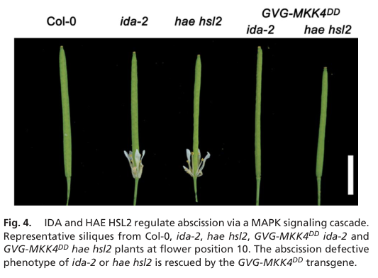

## Question

# Gene Research for Functional Annotation

## ⚠️ CRITICAL: Gene/Protein Identification Context

**BEFORE YOU BEGIN RESEARCH:** You MUST verify you are researching the CORRECT gene/protein. Gene symbols can be ambiguous, especially for less well-characterized genes from non-model organisms.

### Target Gene/Protein Identity (from UniProt):
- **UniProt Accession:** O80397
- **Protein Description:** RecName: Full=Mitogen-activated protein kinase kinase 4; Short=AtMKK4; Short=MAP kinase kinase 4; EC=2.7.12.2;
- **Gene Information:** Name=MKK4; OrderedLocusNames=At1g51660; ORFNames=F19C24.26;
- **Organism (full):** Arabidopsis thaliana (Mouse-ear cress).
- **Protein Family:** Belongs to the protein kinase superfamily. STE Ser/Thr
- **Key Domains:** Kinase-like_dom_sf. (IPR011009); Prot_kinase_dom. (IPR000719); Protein_kinase_ATP_BS. (IPR017441); Ser/Thr_kinase_AS. (IPR008271); Ser_Thr_kinase. (IPR053235)

### MANDATORY VERIFICATION STEPS:

1. **Check if the gene symbol "MKK4" matches the protein description above**
2. **Verify the organism is correct:** Arabidopsis thaliana (Mouse-ear cress).
3. **Check if protein family/domains align with what you find in literature**
4. **If you find literature for a DIFFERENT gene with the same or similar symbol, STOP**

### If Gene Symbol is Ambiguous or You Cannot Find Relevant Literature:

**DO NOT PROCEED WITH RESEARCH ON A DIFFERENT GENE.** Instead:
- State clearly: "The gene symbol 'MKK4' is ambiguous or literature is limited for this specific protein"
- Explain what you found (e.g., "Found extensive literature on a different gene with the same symbol in a different organism")
- Describe the protein based ONLY on the UniProt information provided above
- Suggest that the protein function can be inferred from domain/family information

### Research Target:

Please provide a comprehensive research report on the gene **MKK4** (gene ID: MKK4, UniProt: O80397) in ARATH.

The research report should be a detailed narrative explaining the function, biological processes, and localization of the gene product. Citations should be given for all claims.

You should prioritize authoritative reviews and primary scientific literature when conducting research. You can supplement
this with annotations you find in gene/protein databases, but these can be outdated or inaccurate.

We are specifically interested in the primary function of the gene - for enzymes, what reaction is catalyzed, and what is the substrate specificity? For transporters, what is the substrate? For structural proteins or adapters, what is the broader structural role? For signaling molecules, what is the role in the pathway.

We are interested in where in or outside the cell the gene product carries out its function.

We are also interested in the signaling or biochemical pathways in which the gene functions. We are less interested in broad pleiotropic effects, except where these elucidate the precise role.

Include evidence where possible. We are interested in both experimental evidence as well as inference from structure, evolution, or bioinformatic analysis. Precise studies should be prioritized over high-throughput, where available.

## Output

Question: You are an expert researcher providing comprehensive, well-cited information.

Provide detailed information focusing on:
1. Key concepts and definitions with current understanding
2. Recent developments and latest research (prioritize 2023-2024 sources)
3. Current applications and real-world implementations
4. Expert opinions and analysis from authoritative sources
5. Relevant statistics and data from recent studies

Format as a comprehensive research report with proper citations. Include URLs and publication dates where available.
Always prioritize recent, authoritative sources and provide specific citations for all major claims.

# Gene Research for Functional Annotation

## ⚠️ CRITICAL: Gene/Protein Identification Context

**BEFORE YOU BEGIN RESEARCH:** You MUST verify you are researching the CORRECT gene/protein. Gene symbols can be ambiguous, especially for less well-characterized genes from non-model organisms.

### Target Gene/Protein Identity (from UniProt):
- **UniProt Accession:** O80397
- **Protein Description:** RecName: Full=Mitogen-activated protein kinase kinase 4; Short=AtMKK4; Short=MAP kinase kinase 4; EC=2.7.12.2;
- **Gene Information:** Name=MKK4; OrderedLocusNames=At1g51660; ORFNames=F19C24.26;
- **Organism (full):** Arabidopsis thaliana (Mouse-ear cress).
- **Protein Family:** Belongs to the protein kinase superfamily. STE Ser/Thr
- **Key Domains:** Kinase-like_dom_sf. (IPR011009); Prot_kinase_dom. (IPR000719); Protein_kinase_ATP_BS. (IPR017441); Ser/Thr_kinase_AS. (IPR008271); Ser_Thr_kinase. (IPR053235)

### MANDATORY VERIFICATION STEPS:

1. **Check if the gene symbol "MKK4" matches the protein description above**
2. **Verify the organism is correct:** Arabidopsis thaliana (Mouse-ear cress).
3. **Check if protein family/domains align with what you find in literature**
4. **If you find literature for a DIFFERENT gene with the same or similar symbol, STOP**

### If Gene Symbol is Ambiguous or You Cannot Find Relevant Literature:

**DO NOT PROCEED WITH RESEARCH ON A DIFFERENT GENE.** Instead:
- State clearly: "The gene symbol 'MKK4' is ambiguous or literature is limited for this specific protein"
- Explain what you found (e.g., "Found extensive literature on a different gene with the same symbol in a different organism")
- Describe the protein based ONLY on the UniProt information provided above
- Suggest that the protein function can be inferred from domain/family information

### Research Target:

Please provide a comprehensive research report on the gene **MKK4** (gene ID: MKK4, UniProt: O80397) in ARATH.

The research report should be a detailed narrative explaining the function, biological processes, and localization of the gene product. Citations should be given for all claims.

You should prioritize authoritative reviews and primary scientific literature when conducting research. You can supplement
this with annotations you find in gene/protein databases, but these can be outdated or inaccurate.

We are specifically interested in the primary function of the gene - for enzymes, what reaction is catalyzed, and what is the substrate specificity? For transporters, what is the substrate? For structural proteins or adapters, what is the broader structural role? For signaling molecules, what is the role in the pathway.

We are interested in where in or outside the cell the gene product carries out its function.

We are also interested in the signaling or biochemical pathways in which the gene functions. We are less interested in broad pleiotropic effects, except where these elucidate the precise role.

Include evidence where possible. We are interested in both experimental evidence as well as inference from structure, evolution, or bioinformatic analysis. Precise studies should be prioritized over high-throughput, where available.

# Functional annotation report: Arabidopsis MKK4

**Identity and scope.** The target is *Arabidopsis thaliana* mitogen-activated protein kinase kinase **MKK4**, locus **At1g51660**, corresponding to the UniProt accession **O80397 supplied in the question**. The locus and protein name match the published Arabidopsis literature. MKK4 is a group-C MAP kinase kinase (MAPKK), closely related to MKK5; it must not be confused with the distinct downstream MAP kinase **MPK4** or with MKK4 proteins studied in other organisms. Its conserved kinase and ATP-binding domains agree with this classification. (bayer2012chloroplastlocalizedproteinkinases pages 7-8, zhang2022mitogen‐activatedproteinkinase pages 2-2)

## Primary biochemical function

MKK4 is an **intracellular, dual-specificity protein kinase** in a three-tier signaling cascade: an upstream MAPKK kinase activates MKK4, which phosphorylates the **threonine and tyrosine residues of the TXY activation motif** in downstream MAP kinases. Its best-supported direct protein substrates are Arabidopsis **MPK3 and MPK6**. Takahashi and colleagues reported both as MKK4 targets in an *in-vitro* activation system and found that inducible, constitutively active MKK4 activated both kinases in plants. The paper describes its MKK4 in-vitro confirmation as “data not shown,” so the biochemical substrate assignment is supported by the published statement and convergent cellular evidence, rather than a displayed MKK4-specific kinase-assay panel in that study. Plant MAPKKs also possess an N-terminal MAPK-docking region; a truncation experiment indicates that MKK4’s N terminus is important for downstream kinase activation, although that experiment does not isolate docking from other N-terminal functions. (zhang2022mitogen‐activatedproteinkinase pages 2-2, takahashi2007themitogenactivatedprotein pages 9-10, takahashi2007themitogenactivatedprotein pages 2-4, samuel2008survivingthepassage pages 5-6)

**Substrate specificity matters:** MKK4’s demonstrated signaling targets are MPK3/MPK6, not every Arabidopsis MAP kinase. For example, wound-induced phosphorylation of a band tentatively identified as MPK4 was unaffected in *mkk4 mkk5* plants. Proteins such as the stomatal regulator SPCH and the ethylene-biosynthetic enzymes ACS2/ACS6 are **downstream MPK3/MPK6 substrates**, not established direct substrates of MKK4. Likewise, sharing MPK6 as a target does not make MKK4 equivalent to MKK3: activated MKK4 induced MPK3 and MPK6, whereas the MKK3 signaling examined by Takahashi and colleagues preferentially activated MPK6 and produced different transcriptional outputs. (li2018mitogenactivatedproteinkinases pages 9-12, zhang2022mitogen‐activatedproteinkinase pages 27-27, li2018mitogenactivatedproteinkinases pages 1-4, takahashi2007themitogenactivatedprotein pages 2-4)

## Pathways and biological processes

MKK4 transmits several receptor- or stress-initiated signals through the MKK4/MKK5–MPK3/MPK6 module. The following summary separates **MKK4-specific gain-of-function evidence** from experiments that primarily establish the function of the **MKK4/MKK5 pair**. (cho2008regulationoffloral pages 3-4, li2018mitogenactivatedproteinkinases pages 9-12, meng2012amapkcascade pages 1-2)

| Setting / initiator | MKK4 function and evidence | Important qualifier |
|---|---|---|
| **Catalytic role: MPK3/MPK6** | Group-C dual-specificity MAPK kinase MKK4 activates MPK3 and MPK6 by phosphorylating the Thr and Tyr residues of their TXY activation loops. In vitro assays and inducible MKK4DD experiments identified both MAPKs as targets ([Takahashi et al., 2007](https://doi.org/10.1105/tpc.106.046581)). (zhang2022mitogen‐activatedproteinkinase pages 2-2, takahashi2007themitogenactivatedprotein pages 9-10, takahashi2007themitogenactivatedprotein pages 2-4) | MPK3 and MPK6 are the best-supported **direct MKK4 substrates**. SPCH and ACS2/ACS6 are downstream substrates of MPK3/MPK6, not established direct MKK4 substrates. |
| **Floral abscission: IDA–HAE/HSL2** | Constitutively active MKK4DD rescued floral-organ abscission in both *ida-2* and *hae hsl2*, placing MKK4 downstream of the peptide–receptor module ([Cho et al., 2008](https://doi.org/10.1073/pnas.0805539105)). (cho2008regulationoffloral pages 3-4, cho2008regulationoffloral media a510bbea) | Loss-of-function evidence used combined MKK4/MKK5 RNAi, so endogenous MKK4-specific necessity is not cleanly separated from MKK5 redundancy. |
| **Inflorescence architecture: ERECTA–YDA** | MKK4/MKK5 loss phenocopied *er*, causing short pedicels and clustered inflorescences; activated MKK4 or MKK5 rescued *er* morphology and localized cell-proliferation defects. Genetics orders the pathway as ER → YDA → MKK4/5 → MPK3/6 ([Meng et al., 2012](https://doi.org/10.1105/tpc.112.104695)). (meng2012amapkcascade pages 1-2, meng2012amapkcascade pages 5-6) | Rescue and knockdown establish pathway order but do not prove that ER or YDA directly phosphorylates MKK4 in this context. |
| **Root apical meristem: RGF1–RGI–YDA** | RGF1-dependent MPK3/6 activation required RGIs, YDA and MKK4/MKK5. RGI2-promoter-driven active MKK4 or MKK5 rescued the *rgi1/2/3/4/5* short-root phenotype; the cascade promotes mitosis and PLT1/PLT2 expression ([Shao et al., 2020](https://doi.org/10.1016/j.molp.2020.09.004)). (shao2020theydamkk4mkk5mpk3mpk6cascade pages 1-5, shao2020theydamkk4mkk5mpk3mpk6cascade pages 25-28) | Most genetics resolve the MKK4/MKK5 pair rather than MKK4 alone. PLT1/PLT2 regulation is a downstream output, not evidence that these proteins are direct MKK4 substrates. |
| **Mechanical wounding and ethylene** | Wound-induced ethylene fell by approximately **10%** in *mkk4*, **>50%** in *mkk5* and **>80%** in *mkk4 mkk5*. The double mutant strongly reduced the magnitude and duration of MPK3/6 activation ([Li et al., 2018](https://doi.org/10.1111/pce.12984)). (li2018mitogenactivatedproteinkinases pages 9-12) | The modest *mkk4* effect probably reflects that the tested allele was a **knockdown**, not a null. ACS2/ACS6 phosphorylation is performed downstream by MPK3/6, not directly by MKK4. |
| **Root endodermis: SGN3/FLS2 comparison** | Endodermis-specific activated MKK4a induced ectopic ROS, lignification and excess suberin, moderately improved CASP1-domain fusion and produced a delayed diffusion barrier in *sgn3*. Activated MKK5 had little effect on domain fusion or lignification and only modestly enhanced suberin ([Ma et al., 2024](https://doi.org/10.1038/s41477-024-01768-y)). (ma2024comparisonsoftwo pages 9-10, ma2024comparisonsoftwo pages 12-13) | Constitutively active kinases demonstrate signaling capacity rather than normal activation kinetics. The MKK4–MKK5 contrast shows that their redundancy is context- and cell-type-dependent. |

*Table: Mechanistically focused evidence for Arabidopsis At1g51660 MKK4, separating direct catalytic substrates from genetic pathway placement and downstream outputs. Qualifiers identify redundancy, allele, and constitutive-activation limitations.*

**Developmental receptor signaling.** In floral abscission, the IDA peptide signals through the HAE/HSL2 receptors to the MKK4/MKK5–MPK3/MPK6 module, promoting cell separation in the floral abscission zone. Combined MKK4/MKK5 suppression impairs abscission; critically, activated **MKK4DD restores shedding in both *ida-2* and *hae hsl2***. The primary paper’s Figure 4 shows this rescue directly. This is strong evidence that MKK4 can function **downstream** of the peptide–receptor pair, although rescue by an artificially activated kinase does not establish direct receptor-to-MKK4 phosphorylation. [Cho *et al.*, October 2008, *PNAS*](https://doi.org/10.1073/pnas.0805539105). (cho2008regulationoffloral pages 3-4, cho2008regulationoffloral media a510bbea)

A related IDA–HAE/HSL2 pathway promotes **lateral-root emergence**: loss of the MKK4/MKK5 module obstructs passage of primordia through overlying tissues, while activated MKK4 or MKK5 restores emergence in upstream signaling mutants. The associated output is spatially regulated expression of cell-wall-remodeling genes and pectin degradation; those downstream proteins should not be annotated as direct MKK4 phosphorylation targets. [Zhu *et al.*, April 2019, *Nature Plants*](https://doi.org/10.1038/s41477-019-0396-x). (zhu2019amapkcascade pages 1-2)

In aerial organs, **ERECTA → YODA → MKK4/MKK5 → MPK3/MPK6** promotes localized cell proliferation and pedicel elongation. Loss of MKK4/MKK5 produces short pedicels and clustered inflorescences, and activated MKK4 expressed in the ERECTA domain rescues the *er* phenotype. In the root apical meristem, an **RGF1 peptide → RGI receptors → YODA → MKK4/MKK5 → MPK3/MPK6** pathway supports mitosis and expression of **PLT1/PLT2**; RGF1-induced MPK activation is impaired without MKK4/MKK5, while activated MKK4 can rescue an *rgi* receptor-mutant root phenotype. These are genetic and phosphorylation-response assignments of pathway position, not demonstrations that PLT proteins are direct MKK4 substrates. [Meng *et al.*, December 2012, *The Plant Cell*](https://doi.org/10.1105/tpc.112.104695); [Shao *et al.*, November 2020, *Molecular Plant*](https://doi.org/10.1016/j.molp.2020.09.004). (meng2012amapkcascade pages 1-2, meng2012amapkcascade pages 5-6, shao2020theydamkk4mkk5mpk3mpk6cascade pages 1-5)

In the stomatal lineage, cell-type-restricted activation experiments show that MKK4 and MKK5 **inhibit early lineage entry and meristemoid progression**; their effects depend on developmental stage. MPK3/MPK6-mediated phosphorylation of stomatal transcription factors, including SPCH, provides a plausible downstream mechanism, but SPCH is not thereby a direct MKK4 substrate. [Lampard *et al.*, November 2009, *The Plant Cell*](https://doi.org/10.1105/tpc.109.070110); [Zhang and Zhang, February 2022, *Journal of Integrative Plant Biology*](https://doi.org/10.1111/jipb.13215). (lampard2009novelandexpanded pages 3-6, zhang2022mitogen‐activatedproteinkinase pages 27-27)

**Defense and damage responses.** In pattern-triggered immunity, MAPKKK3 and MAPKKK5 function upstream of the MPK3/MPK6 branch activated by several surface pattern-recognition receptors. Bi *et al.* found that eliminating both MAPKKKs reduced flg22-induced MPK3/MPK6 activation to approximately **45% of wild type**, and activation by chitin, elf18 or Pep2 to approximately **10–20%**. These numbers quantify the **upstream MAPKKK double mutant**, *not* an MKK4 mutant. The same study links this upstream branch to defense-gene expression and resistance; review-level pathway assignments place MKK4/MKK5 between these MAPKKKs and MPK3/MPK6. The historic proposal that **MEKK1** is obligatorily upstream of MKK4/5 for flagellin-induced MPK3/6 activation should not be adopted uncritically: later work distinguished MEKK1’s MPK4 branch from MPK3/6 activation. [Bi *et al.*, June 2018, *The Plant Cell*](https://doi.org/10.1105/tpc.17.00981); [Zhang and Zhang, February 2022](https://doi.org/10.1111/jipb.13215). (bi2018receptorlikecytoplasmickinases pages 4-8, zhang2022mitogen‐activatedproteinkinase pages 5-5, zeng2011dissectingmitogenactivatedprotein pages 23-27)

Mechanical wounding provides unusually informative **MKK4-genotype-specific** data. Relative to wild type, wound-induced ethylene declined by approximately **10% in *mkk4***, **more than 50% in *mkk5*** and **more than 80% in *mkk4 mkk5***. In the double mutant, MPK3/MPK6 activation was substantially weaker and shorter-lived. Importantly, the authors caution that their *mkk4* allele is a **knockdown**, so its small single-mutant effect is not a reliable measure of MKK4’s maximum contribution. The pathway promotes transcription of **ACS2, ACS6, ACS7 and ACS8**; phosphorylation-dependent stabilization of ACS2/ACS6 occurs at the **downstream MPK3/6** step. [Li *et al.*, published in *Plant, Cell & Environment* 41, 2018](https://doi.org/10.1111/pce.12984). (li2018mitogenactivatedproteinkinases pages 9-12, li2018mitogenactivatedproteinkinases pages 12-15, li2018mitogenactivatedproteinkinases pages 1-4)

## Where MKK4 acts

The **best-supported functional location is intracellular, in cytoplasmic and nuclear signaling pools**. Bimolecular-fluorescence experiments detected MKK4–MPK3 interactions in both the cytoplasm and nucleus and MKK4–MYB44 interactions in the nucleus, using transiently expressing Arabidopsis protoplasts and tobacco cells. These experiments localize **detectable fusion-protein complexes**, not every native MKK4 molecule; MYB44 was phosphorylated by **MPK3**, not shown to be phosphorylated directly by MKK4. [Persak and Pitzschke, February 2013, *PLOS ONE*](https://doi.org/10.1371/journal.pone.0057547). (persak2013tightinterconnectionand pages 3-5, persak2013tightinterconnectionand pages 11-12)

**Chloroplast localization remains disputed.** In-vitro-translated Arabidopsis MKK4 entered **isolated pea chloroplasts** in a protease-protected import assay, suggesting import competence; this did not demonstrate functional chloroplast localization in living Arabidopsis or identify a stromal MKK4 substrate. A later chloroplast-kinase inventory explicitly categorized MKK4 localization as **ambiguous**, citing conflicting nuclear/cytoplasmic observations. Chloroplast residence should therefore be recorded as a hypothesis, not its established principal site of action. [Samuel *et al.*, January 2008, *Plant Signaling & Behavior*](https://doi.org/10.4161/psb.3.1.4856); [Bayer *et al.*, February 2012, *Journal of Experimental Botany*](https://doi.org/10.1093/jxb/err377). (samuel2008survivingthepassage pages 3-4, samuel2008survivingthepassage pages 6-7, bayer2012chloroplastlocalizedproteinkinases pages 7-8)

## Recent research and interpretation

A **2024 cell-type-specific comparison** refined the frequent description of MKK4 and MKK5 as interchangeable. In Arabidopsis root endodermis, experimentally activated **MKK4** induced ectopic reactive oxygen species, lignification and excess suberin, modestly improved CASP1-domain fusion, and generated a delayed diffusion barrier in an *sgn3* background. Activated **MKK5** had little effect on CASP1 fusion or ectopic lignin and only a modest suberin effect. The investigators interpret these differences within immune **FLS2** versus developmental **SGN3** receptor signaling: common MAPKs need not produce identical outputs when MAPKK identity, activation strength and cell context differ. Because the experiments used activated kinases, they show **signaling capacity** more directly than normal endogenous activation kinetics. [Ma *et al.*, September 2024, *Nature Plants*](https://doi.org/10.1038/s41477-024-01768-y). (ma2024comparisonsoftwo pages 9-10, ma2024comparisonsoftwo pages 12-13, ma2024comparisonsoftwo pages 1-2)

**Assessment and application.** The experimentally grounded annotation is **“intracellular group-C MAPK kinase that activates MPK3 and MPK6, coupling receptor-, pathogen- and damage-associated signals to development and defense.”** MKK4DD constructs and combined MKK4/MKK5 mutants are research tools for testing pathway order in living Arabidopsis, including abscission, meristem growth and endodermal barrier responses; the cited studies do **not** establish an agricultural deployment or a clinical application of Arabidopsis MKK4. The leading interpretive limitations are MKK5 redundancy, cell-type-dependent divergence, artificial gain-of-function constructs, and unresolved physiological chloroplast localization. [Cho *et al.*, 2008](https://doi.org/10.1073/pnas.0805539105); [Li *et al.*, 2018](https://doi.org/10.1111/pce.12984); [Ma *et al.*, 2024](https://doi.org/10.1038/s41477-024-01768-y). (cho2008regulationoffloral pages 3-4, li2018mitogenactivatedproteinkinases pages 9-12, ma2024comparisonsoftwo pages 9-10, bayer2012chloroplastlocalizedproteinkinases pages 7-8)

References

1. (bayer2012chloroplastlocalizedproteinkinases pages 7-8): Roman G. Bayer, Simon Stael, Agostinho G. Rocha, Andrea Mair, Ute C. Vothknecht, and Markus Teige. Chloroplast-localized protein kinases: a step forward towards a complete inventory. Journal of experimental botany, 63 4:1713-23, Feb 2012. URL: https://doi.org/10.1093/jxb/err377, doi:10.1093/jxb/err377. This article has 80 citations and is from a domain leading peer-reviewed journal.

2. (zhang2022mitogen‐activatedproteinkinase pages 2-2): Mengmeng Zhang and Shuqun Zhang. Mitogen‐activated protein kinase cascades in plant signaling. Feb 2022. URL: https://doi.org/10.1111/jipb.13215, doi:10.1111/jipb.13215. This article has 651 citations and is from a peer-reviewed journal.

3. (takahashi2007themitogenactivatedprotein pages 9-10): Fuminori Takahashi, Riichiro Yoshida, Kazuya Ichimura, Tsuyoshi Mizoguchi, Shigemi Seo, Masahiro Yonezawa, Kyonoshin Maruyama, Kazuko Yamaguchi-Shinozaki, and Kazuo Shinozaki. The mitogen-activated protein kinase cascade mkk3–mpk6 is an important part of the jasmonate signal transduction pathway in <i>arabidopsis</i>. The Plant Cell, 19:805-818, Mar 2007. URL: https://doi.org/10.1105/tpc.106.046581, doi:10.1105/tpc.106.046581. This article has 506 citations.

4. (takahashi2007themitogenactivatedprotein pages 2-4): Fuminori Takahashi, Riichiro Yoshida, Kazuya Ichimura, Tsuyoshi Mizoguchi, Shigemi Seo, Masahiro Yonezawa, Kyonoshin Maruyama, Kazuko Yamaguchi-Shinozaki, and Kazuo Shinozaki. The mitogen-activated protein kinase cascade mkk3–mpk6 is an important part of the jasmonate signal transduction pathway in <i>arabidopsis</i>. The Plant Cell, 19:805-818, Mar 2007. URL: https://doi.org/10.1105/tpc.106.046581, doi:10.1105/tpc.106.046581. This article has 506 citations.

5. (samuel2008survivingthepassage pages 5-6): Marcus A. Samuel, Balbir K. Chaal, Greg Lampard, Beverley R. Green, and Brian E. Ellis. Surviving the passage. Plant Signaling & Behavior, 3:12-6, Jan 2008. URL: https://doi.org/10.4161/psb.3.1.4856, doi:10.4161/psb.3.1.4856. This article has 19 citations and is from a peer-reviewed journal.

6. (li2018mitogenactivatedproteinkinases pages 9-12): Sen Li, Xiaofei Han, Liuyi Yang, Xiangxiong Deng, Hongjiao Wu, Mengmeng Zhang, Yidong Liu, Shuqun Zhang, and Juan Xu. Mitogen-activated protein kinases and calcium-dependent protein kinases are involved in wounding-induced ethylene biosynthesis in arabidopsis thaliana. Plant, cell & environment, 41 1:134-147, Jul 2018. URL: https://doi.org/10.1111/pce.12984, doi:10.1111/pce.12984. This article has 99 citations.

7. (zhang2022mitogen‐activatedproteinkinase pages 27-27): Mengmeng Zhang and Shuqun Zhang. Mitogen‐activated protein kinase cascades in plant signaling. Feb 2022. URL: https://doi.org/10.1111/jipb.13215, doi:10.1111/jipb.13215. This article has 651 citations and is from a peer-reviewed journal.

8. (li2018mitogenactivatedproteinkinases pages 1-4): Sen Li, Xiaofei Han, Liuyi Yang, Xiangxiong Deng, Hongjiao Wu, Mengmeng Zhang, Yidong Liu, Shuqun Zhang, and Juan Xu. Mitogen-activated protein kinases and calcium-dependent protein kinases are involved in wounding-induced ethylene biosynthesis in arabidopsis thaliana. Plant, cell & environment, 41 1:134-147, Jul 2018. URL: https://doi.org/10.1111/pce.12984, doi:10.1111/pce.12984. This article has 99 citations.

9. (cho2008regulationoffloral pages 3-4): Sung Ki Cho, Clayton T. Larue, David Chevalier, Huachun Wang, Tsung-Luo Jinn, Shuqun Zhang, and John C. Walker. Regulation of floral organ abscission in arabidopsis thaliana. Proceedings of the National Academy of Sciences, 105:15629-15634, Oct 2008. URL: https://doi.org/10.1073/pnas.0805539105, doi:10.1073/pnas.0805539105. This article has 431 citations and is from a highest quality peer-reviewed journal.

10. (meng2012amapkcascade pages 1-2): Xiangzong Meng, Huachun Wang, Yunxia He, Yidong Liu, John C. Walker, Keiko U. Torii, and Shuqun Zhang. A mapk cascade downstream of erecta receptor-like protein kinase regulates <i>arabidopsis</i> inflorescence architecture by promoting localized cell proliferation. The Plant Cell, 24(12):4948-4960, Dec 2012. URL: https://doi.org/10.1105/tpc.112.104695, doi:10.1105/tpc.112.104695. This article has 262 citations.

11. (cho2008regulationoffloral media a510bbea): Sung Ki Cho, Clayton T. Larue, David Chevalier, Huachun Wang, Tsung-Luo Jinn, Shuqun Zhang, and John C. Walker. Regulation of floral organ abscission in arabidopsis thaliana. Proceedings of the National Academy of Sciences, 105:15629-15634, Oct 2008. URL: https://doi.org/10.1073/pnas.0805539105, doi:10.1073/pnas.0805539105. This article has 431 citations and is from a highest quality peer-reviewed journal.

12. (meng2012amapkcascade pages 5-6): Xiangzong Meng, Huachun Wang, Yunxia He, Yidong Liu, John C. Walker, Keiko U. Torii, and Shuqun Zhang. A mapk cascade downstream of erecta receptor-like protein kinase regulates <i>arabidopsis</i> inflorescence architecture by promoting localized cell proliferation. The Plant Cell, 24(12):4948-4960, Dec 2012. URL: https://doi.org/10.1105/tpc.112.104695, doi:10.1105/tpc.112.104695. This article has 262 citations.

13. (shao2020theydamkk4mkk5mpk3mpk6cascade pages 1-5): Yiming Shao, Xinxing Yu, Xuwen Xu, Yong Li, Wenxin Yuan, Yan Xu, Chuanzao Mao, Shuqun Zhang, and Juan Xu. The yda-mkk4/mkk5-mpk3/mpk6 cascade functions downstream of the rgf1-rgi ligand–receptor pair in regulating mitotic activity in root apical meristem. Molecular Plant, 13:1608-1623, Nov 2020. URL: https://doi.org/10.1016/j.molp.2020.09.004, doi:10.1016/j.molp.2020.09.004. This article has 134 citations and is from a highest quality peer-reviewed journal.

14. (shao2020theydamkk4mkk5mpk3mpk6cascade pages 25-28): Yiming Shao, Xinxing Yu, Xuwen Xu, Yong Li, Wenxin Yuan, Yan Xu, Chuanzao Mao, Shuqun Zhang, and Juan Xu. The yda-mkk4/mkk5-mpk3/mpk6 cascade functions downstream of the rgf1-rgi ligand–receptor pair in regulating mitotic activity in root apical meristem. Molecular Plant, 13:1608-1623, Nov 2020. URL: https://doi.org/10.1016/j.molp.2020.09.004, doi:10.1016/j.molp.2020.09.004. This article has 134 citations and is from a highest quality peer-reviewed journal.

15. (ma2024comparisonsoftwo pages 9-10): Yan Ma, Isabelle Flückiger, Jade Nicolet, Jia Pang, Joe B. Dickinson, Damien De Bellis, Aurélia Emonet, Satoshi Fujita, and Niko Geldner. Comparisons of two receptor-mapk pathways in a single cell-type reveal mechanisms of signalling specificity. Nature Plants, 10:1343-1362, Sep 2024. URL: https://doi.org/10.1038/s41477-024-01768-y, doi:10.1038/s41477-024-01768-y. This article has 26 citations and is from a highest quality peer-reviewed journal.

16. (ma2024comparisonsoftwo pages 12-13): Yan Ma, Isabelle Flückiger, Jade Nicolet, Jia Pang, Joe B. Dickinson, Damien De Bellis, Aurélia Emonet, Satoshi Fujita, and Niko Geldner. Comparisons of two receptor-mapk pathways in a single cell-type reveal mechanisms of signalling specificity. Nature Plants, 10:1343-1362, Sep 2024. URL: https://doi.org/10.1038/s41477-024-01768-y, doi:10.1038/s41477-024-01768-y. This article has 26 citations and is from a highest quality peer-reviewed journal.

17. (zhu2019amapkcascade pages 1-2): Qiankun Zhu, Yiming Shao, Shating Ge, Mengmeng Zhang, Tianshu Zhang, Xiaotian Hu, Yidong Liu, John C. Walker, Shuqun Zhang, and Juan Xu. A mapk cascade downstream of ida–hae/hsl2 ligand–receptor pair in lateral root emergence. Nature Plants, 5:414-423, Apr 2019. URL: https://doi.org/10.1038/s41477-019-0396-x, doi:10.1038/s41477-019-0396-x. This article has 169 citations and is from a highest quality peer-reviewed journal.

18. (lampard2009novelandexpanded pages 3-6): Gregory R. Lampard, Wolfgang Lukowitz, Brian E. Ellis, and Dominique C. Bergmann. Novel and expanded roles for mapk signaling in <i>arabidopsis</i> stomatal cell fate revealed by cell type–specific manipulations. The Plant Cell, 21:3506-3517, Nov 2009. URL: https://doi.org/10.1105/tpc.109.070110, doi:10.1105/tpc.109.070110. This article has 236 citations.

19. (bi2018receptorlikecytoplasmickinases pages 4-8): Guozhi Bi, Zhaoyang Zhou, Weibing Wang, Lin Li, Shaofei Rao, Ying Wu, Xiaojuan Zhang, Frank L. H. Menke, She Chen, and Jian-Min Zhou. Receptor-like cytoplasmic kinases directly link diverse pattern recognition receptors to the activation of mitogen-activated protein kinase cascades in arabidopsis[open]. Plant Cell, 30:1543-1561, Jun 2018. URL: https://doi.org/10.1105/tpc.17.00981, doi:10.1105/tpc.17.00981. This article has 413 citations and is from a highest quality peer-reviewed journal.

20. (zhang2022mitogen‐activatedproteinkinase pages 5-5): Mengmeng Zhang and Shuqun Zhang. Mitogen‐activated protein kinase cascades in plant signaling. Feb 2022. URL: https://doi.org/10.1111/jipb.13215, doi:10.1111/jipb.13215. This article has 651 citations and is from a peer-reviewed journal.

21. (zeng2011dissectingmitogenactivatedprotein pages 23-27): Qingning Zeng. Dissecting mitogen-activated protein kinase cascades involving arabidopsis mkk6. ArXiv, Jan 2011. URL: https://doi.org/10.14288/1.0071620, doi:10.14288/1.0071620. This article has 0 citations.

22. (li2018mitogenactivatedproteinkinases pages 12-15): Sen Li, Xiaofei Han, Liuyi Yang, Xiangxiong Deng, Hongjiao Wu, Mengmeng Zhang, Yidong Liu, Shuqun Zhang, and Juan Xu. Mitogen-activated protein kinases and calcium-dependent protein kinases are involved in wounding-induced ethylene biosynthesis in arabidopsis thaliana. Plant, cell & environment, 41 1:134-147, Jul 2018. URL: https://doi.org/10.1111/pce.12984, doi:10.1111/pce.12984. This article has 99 citations.

23. (persak2013tightinterconnectionand pages 3-5): Helene Persak and Andrea Pitzschke. Tight interconnection and multi-level control of arabidopsis myb44 in mapk cascade signalling. PLoS ONE, 8:e57547, Feb 2013. URL: https://doi.org/10.1371/journal.pone.0057547, doi:10.1371/journal.pone.0057547. This article has 121 citations and is from a peer-reviewed journal.

24. (persak2013tightinterconnectionand pages 11-12): Helene Persak and Andrea Pitzschke. Tight interconnection and multi-level control of arabidopsis myb44 in mapk cascade signalling. PLoS ONE, 8:e57547, Feb 2013. URL: https://doi.org/10.1371/journal.pone.0057547, doi:10.1371/journal.pone.0057547. This article has 121 citations and is from a peer-reviewed journal.

25. (samuel2008survivingthepassage pages 3-4): Marcus A. Samuel, Balbir K. Chaal, Greg Lampard, Beverley R. Green, and Brian E. Ellis. Surviving the passage. Plant Signaling & Behavior, 3:12-6, Jan 2008. URL: https://doi.org/10.4161/psb.3.1.4856, doi:10.4161/psb.3.1.4856. This article has 19 citations and is from a peer-reviewed journal.

26. (samuel2008survivingthepassage pages 6-7): Marcus A. Samuel, Balbir K. Chaal, Greg Lampard, Beverley R. Green, and Brian E. Ellis. Surviving the passage. Plant Signaling & Behavior, 3:12-6, Jan 2008. URL: https://doi.org/10.4161/psb.3.1.4856, doi:10.4161/psb.3.1.4856. This article has 19 citations and is from a peer-reviewed journal.

27. (ma2024comparisonsoftwo pages 1-2): Yan Ma, Isabelle Flückiger, Jade Nicolet, Jia Pang, Joe B. Dickinson, Damien De Bellis, Aurélia Emonet, Satoshi Fujita, and Niko Geldner. Comparisons of two receptor-mapk pathways in a single cell-type reveal mechanisms of signalling specificity. Nature Plants, 10:1343-1362, Sep 2024. URL: https://doi.org/10.1038/s41477-024-01768-y, doi:10.1038/s41477-024-01768-y. This article has 26 citations and is from a highest quality peer-reviewed journal.

## Artifacts

- [Edison artifact artifact-00](MKK4-deep-research-falcon_artifacts/artifact-00.md)

## Citations

1. li2018mitogenactivatedproteinkinases pages 9-12
2. zhu2019amapkcascade pages 1-2
3. bayer2012chloroplastlocalizedproteinkinases pages 7-8
4. takahashi2007themitogenactivatedprotein pages 9-10
5. takahashi2007themitogenactivatedprotein pages 2-4
6. samuel2008survivingthepassage pages 5-6
7. li2018mitogenactivatedproteinkinases pages 1-4
8. cho2008regulationoffloral pages 3-4
9. meng2012amapkcascade pages 1-2
10. meng2012amapkcascade pages 5-6
11. ma2024comparisonsoftwo pages 9-10
12. ma2024comparisonsoftwo pages 12-13
13. lampard2009novelandexpanded pages 3-6
14. bi2018receptorlikecytoplasmickinases pages 4-8
15. zeng2011dissectingmitogenactivatedprotein pages 23-27
16. li2018mitogenactivatedproteinkinases pages 12-15
17. persak2013tightinterconnectionand pages 3-5
18. persak2013tightinterconnectionand pages 11-12
19. samuel2008survivingthepassage pages 3-4
20. samuel2008survivingthepassage pages 6-7
21. ma2024comparisonsoftwo pages 1-2
22. Takahashi et al., 2007
23. Cho et al., 2008
24. Meng et al., 2012
25. Shao et al., 2020
26. Li et al., 2018
27. Ma et al., 2024
28. Cho *et al.*, October 2008, *PNAS*
29. Zhu *et al.*, April 2019, *Nature Plants*
30. Meng *et al.*, December 2012, *The Plant Cell*
31. Shao *et al.*, November 2020, *Molecular Plant*
32. Lampard *et al.*, November 2009, *The Plant Cell*
33. Zhang and Zhang, February 2022, *Journal of Integrative Plant Biology*
34. Bi *et al.*, June 2018, *The Plant Cell*
35. Zhang and Zhang, February 2022
36. Li *et al.*, published in *Plant, Cell & Environment* 41, 2018
37. Persak and Pitzschke, February 2013, *PLOS ONE*
38. Samuel *et al.*, January 2008, *Plant Signaling & Behavior*
39. Bayer *et al.*, February 2012, *Journal of Experimental Botany*
40. Ma *et al.*, September 2024, *Nature Plants*
41. Cho *et al.*, 2008
42. Li *et al.*, 2018
43. Ma *et al.*, 2024
44. open
45. https://doi.org/10.1105/tpc.106.046581
46. https://doi.org/10.1073/pnas.0805539105
47. https://doi.org/10.1105/tpc.112.104695
48. https://doi.org/10.1016/j.molp.2020.09.004
49. https://doi.org/10.1111/pce.12984
50. https://doi.org/10.1038/s41477-024-01768-y
51. https://doi.org/10.1038/s41477-019-0396-x
52. https://doi.org/10.1105/tpc.109.070110
53. https://doi.org/10.1111/jipb.13215
54. https://doi.org/10.1105/tpc.17.00981
55. https://doi.org/10.1371/journal.pone.0057547
56. https://doi.org/10.4161/psb.3.1.4856
57. https://doi.org/10.1093/jxb/err377
58. https://doi.org/10.1093/jxb/err377,
59. https://doi.org/10.1111/jipb.13215,
60. https://doi.org/10.1105/tpc.106.046581,
61. https://doi.org/10.4161/psb.3.1.4856,
62. https://doi.org/10.1111/pce.12984,
63. https://doi.org/10.1073/pnas.0805539105,
64. https://doi.org/10.1105/tpc.112.104695,
65. https://doi.org/10.1016/j.molp.2020.09.004,
66. https://doi.org/10.1038/s41477-024-01768-y,
67. https://doi.org/10.1038/s41477-019-0396-x,
68. https://doi.org/10.1105/tpc.109.070110,
69. https://doi.org/10.1105/tpc.17.00981,
70. https://doi.org/10.14288/1.0071620,
71. https://doi.org/10.1371/journal.pone.0057547,