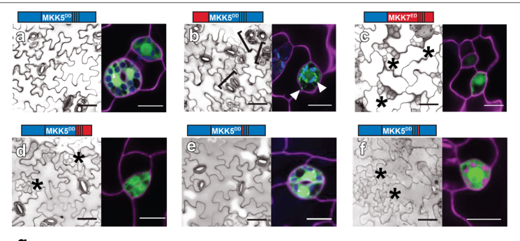

## Question

# Gene Research for Functional Annotation

## ⚠️ CRITICAL: Gene/Protein Identification Context

**BEFORE YOU BEGIN RESEARCH:** You MUST verify you are researching the CORRECT gene/protein. Gene symbols can be ambiguous, especially for less well-characterized genes from non-model organisms.

### Target Gene/Protein Identity (from UniProt):
- **UniProt Accession:** Q8RXG3
- **Protein Description:** RecName: Full=Mitogen-activated protein kinase kinase 5 {ECO:0000303|PubMed:10048483}; Short=AtMAP2Kalpha {ECO:0000303|Ref.2}; Short=AtMEK5 {ECO:0000303|PubMed:11687590}; Short=AtMKK5 {ECO:0000303|PubMed:10048483}; Short=MAP kinase kinase 5 {ECO:0000303|PubMed:10048483}; EC=2.7.12.2 {ECO:0000269|PubMed:11875555};
- **Gene Information:** Name=MKK5 {ECO:0000303|PubMed:10048483}; Synonyms=MEK5 {ECO:0000303|PubMed:11687590}; OrderedLocusNames=At3g21220 {ECO:0000312|Araport:AT3G21220}; ORFNames=MXL8.8 {ECO:0000312|EMBL:BAB01714.1};
- **Organism (full):** Arabidopsis thaliana (Mouse-ear cress).
- **Protein Family:** Belongs to the protein kinase superfamily. STE Ser/Thr
- **Key Domains:** Kinase-like_dom_sf. (IPR011009); Prot_kinase_dom. (IPR000719); Protein_kinase_ATP_BS. (IPR017441); Ser/Thr_kinase_AS. (IPR008271); Ser_Thr_kinase. (IPR053235)

### MANDATORY VERIFICATION STEPS:

1. **Check if the gene symbol "MKK5" matches the protein description above**
2. **Verify the organism is correct:** Arabidopsis thaliana (Mouse-ear cress).
3. **Check if protein family/domains align with what you find in literature**
4. **If you find literature for a DIFFERENT gene with the same or similar symbol, STOP**

### If Gene Symbol is Ambiguous or You Cannot Find Relevant Literature:

**DO NOT PROCEED WITH RESEARCH ON A DIFFERENT GENE.** Instead:
- State clearly: "The gene symbol 'MKK5' is ambiguous or literature is limited for this specific protein"
- Explain what you found (e.g., "Found extensive literature on a different gene with the same symbol in a different organism")
- Describe the protein based ONLY on the UniProt information provided above
- Suggest that the protein function can be inferred from domain/family information

### Research Target:

Please provide a comprehensive research report on the gene **MKK5** (gene ID: MKK5, UniProt: Q8RXG3) in ARATH.

The research report should be a detailed narrative explaining the function, biological processes, and localization of the gene product. Citations should be given for all claims.

You should prioritize authoritative reviews and primary scientific literature when conducting research. You can supplement
this with annotations you find in gene/protein databases, but these can be outdated or inaccurate.

We are specifically interested in the primary function of the gene - for enzymes, what reaction is catalyzed, and what is the substrate specificity? For transporters, what is the substrate? For structural proteins or adapters, what is the broader structural role? For signaling molecules, what is the role in the pathway.

We are interested in where in or outside the cell the gene product carries out its function.

We are also interested in the signaling or biochemical pathways in which the gene functions. We are less interested in broad pleiotropic effects, except where these elucidate the precise role.

Include evidence where possible. We are interested in both experimental evidence as well as inference from structure, evolution, or bioinformatic analysis. Precise studies should be prioritized over high-throughput, where available.

## Output

Question: You are an expert researcher providing comprehensive, well-cited information.

Provide detailed information focusing on:
1. Key concepts and definitions with current understanding
2. Recent developments and latest research (prioritize 2023-2024 sources)
3. Current applications and real-world implementations
4. Expert opinions and analysis from authoritative sources
5. Relevant statistics and data from recent studies

Format as a comprehensive research report with proper citations. Include URLs and publication dates where available.
Always prioritize recent, authoritative sources and provide specific citations for all major claims.

# Gene Research for Functional Annotation

## ⚠️ CRITICAL: Gene/Protein Identification Context

**BEFORE YOU BEGIN RESEARCH:** You MUST verify you are researching the CORRECT gene/protein. Gene symbols can be ambiguous, especially for less well-characterized genes from non-model organisms.

### Target Gene/Protein Identity (from UniProt):
- **UniProt Accession:** Q8RXG3
- **Protein Description:** RecName: Full=Mitogen-activated protein kinase kinase 5 {ECO:0000303|PubMed:10048483}; Short=AtMAP2Kalpha {ECO:0000303|Ref.2}; Short=AtMEK5 {ECO:0000303|PubMed:11687590}; Short=AtMKK5 {ECO:0000303|PubMed:10048483}; Short=MAP kinase kinase 5 {ECO:0000303|PubMed:10048483}; EC=2.7.12.2 {ECO:0000269|PubMed:11875555};
- **Gene Information:** Name=MKK5 {ECO:0000303|PubMed:10048483}; Synonyms=MEK5 {ECO:0000303|PubMed:11687590}; OrderedLocusNames=At3g21220 {ECO:0000312|Araport:AT3G21220}; ORFNames=MXL8.8 {ECO:0000312|EMBL:BAB01714.1};
- **Organism (full):** Arabidopsis thaliana (Mouse-ear cress).
- **Protein Family:** Belongs to the protein kinase superfamily. STE Ser/Thr
- **Key Domains:** Kinase-like_dom_sf. (IPR011009); Prot_kinase_dom. (IPR000719); Protein_kinase_ATP_BS. (IPR017441); Ser/Thr_kinase_AS. (IPR008271); Ser_Thr_kinase. (IPR053235)

### MANDATORY VERIFICATION STEPS:

1. **Check if the gene symbol "MKK5" matches the protein description above**
2. **Verify the organism is correct:** Arabidopsis thaliana (Mouse-ear cress).
3. **Check if protein family/domains align with what you find in literature**
4. **If you find literature for a DIFFERENT gene with the same or similar symbol, STOP**

### If Gene Symbol is Ambiguous or You Cannot Find Relevant Literature:

**DO NOT PROCEED WITH RESEARCH ON A DIFFERENT GENE.** Instead:
- State clearly: "The gene symbol 'MKK5' is ambiguous or literature is limited for this specific protein"
- Explain what you found (e.g., "Found extensive literature on a different gene with the same symbol in a different organism")
- Describe the protein based ONLY on the UniProt information provided above
- Suggest that the protein function can be inferred from domain/family information

### Research Target:

Please provide a comprehensive research report on the gene **MKK5** (gene ID: MKK5, UniProt: Q8RXG3) in ARATH.

The research report should be a detailed narrative explaining the function, biological processes, and localization of the gene product. Citations should be given for all claims.

You should prioritize authoritative reviews and primary scientific literature when conducting research. You can supplement
this with annotations you find in gene/protein databases, but these can be outdated or inaccurate.

We are specifically interested in the primary function of the gene - for enzymes, what reaction is catalyzed, and what is the substrate specificity? For transporters, what is the substrate? For structural proteins or adapters, what is the broader structural role? For signaling molecules, what is the role in the pathway.

We are interested in where in or outside the cell the gene product carries out its function.

We are also interested in the signaling or biochemical pathways in which the gene functions. We are less interested in broad pleiotropic effects, except where these elucidate the precise role.

Include evidence where possible. We are interested in both experimental evidence as well as inference from structure, evolution, or bioinformatic analysis. Precise studies should be prioritized over high-throughput, where available.

# Functional annotation of Arabidopsis MKK5

## Identity and principal function

**The target is *Arabidopsis thaliana* MKK5, locus At3g21220, UniProt Q8RXG3.** A primary study explicitly identifies and clones MKK5 as At3g21220. In the literature it is a mitogen-activated protein kinase kinase (MAPKK, or MAP2K): the middle enzyme of a MAPKKK → MKK5 → MAPK phosphorylation cascade. Its kinase-domain annotation and STE-family classification supplied with the UniProt record are consistent with this experimentally established role. **MKK5 is not MAPKKK5**—a distinct, upstream Arabidopsis kinase—and should not be conflated with similarly named proteins in other organisms. (miles2009suppressionofmkk5 pages 1-3, bi2018receptorlikecytoplasmickinases pages 1-4, wengier2018dissectionofmapk pages 1-3)

MKK5’s principal biochemical reaction is **ATP-dependent phosphorylation of downstream protein kinases**, particularly the Arabidopsis MAPKs **MPK3 and MPK6**, thereby relaying signals from upstream kinases to MAPK-dependent responses. In purified-component assays, an activated MKK5 variant directly phosphorylated kinase-inactive MPK3 and MPK6. MAPKK-mediated activation generally involves phosphorylation of the conserved Thr–X–Tyr activation-loop motif of a MAPK; the available MKK5 assays establish the protein substrates but do not, by themselves, independently map both individual phosphoacceptor residues on MPK3 and MPK6. Thus, Thr/Tyr activation-loop specificity is the well-supported MAPKK mechanism, whereas the direct, assay-demonstrated substrate assignment here is **MPK3/MPK6**. (wengier2018dissectionofmapk pages 5-8, ma2023specificitymodelsin pages 2-4, krysan2018cellularcomplexityin pages 3-4)

A frequently used activated construct, **MKK5DD**, substitutes Asp at MKK5’s regulatory **Thr215 and Ser221**. Those are *MKK5’s own activation-loop positions*, not sites on MPK3 or MPK6. Wengier and colleagues compared its phosphorylation of kinase-inactive MPK3 and MPK6 in triplicate assays and found substantial activity toward both; these experiments do not establish an exhaustive in-vivo substrate list or a kinetic preference between the two. The reported Arabidopsis kinase domain and ATP-binding annotation are therefore supported by functional experiments, while pathway selectivity also depends on regulatory regions and cellular context rather than the catalytic domain alone. (wengier2018dissectionofmapk pages 3-4, wengier2018dissectionofmapk pages 5-8)

The following table separates direct biochemical observations from assignments based on genetic pathway analysis. (wengier2018dissectionofmapk pages 5-8, su2017regulationofstomatal pages 1-2, meng2012amapkcascade pages 1-2)

| Function/pathway | Immediate upstream and downstream | Direct evidence and representative quantitative detail | Subcellular or cell context | Citation |
|---|---|---|---|---|
| Core MAPKK activity | Upstream activation mimicked by T215D/S221D; downstream MPK3 and MPK6 | Constitutively active phosphomimetic **MKK5^T215D/S221D (MKK5DD)** directly phosphorylated kinase-inactive MPK3 and MPK6 in triplicate in-vitro assays. This establishes both as direct substrates but does not measure native MKK5 kinetics or exclude context-dependent substrates. (wengier2018dissectionofmapk pages 3-4, wengier2018dissectionofmapk pages 5-8) | Recombinant assay; MKK5DD–YFP was cytoplasmic in stomatal-lineage cells. | Wengier et al., 2018, https://doi.org/10.1186/s12870-018-1274-9 |
| Pattern-recognition receptor immunity | MAPKKK3/MAPKKK5 → MKK4/MKK5 → MPK3/MPK6 | flg22, elf18, nlp20, chitin, and Pep1 activation of MPK3/6 was significantly compromised in *mapkkk3 mapkkk5* plants; activated MPK6 phosphorylated MAPKKK5 at Ser682/Ser692, forming positive feedback. This primarily establishes the **redundant module**, not MKK5-alone necessity. (bi2018receptorlikecytoplasmickinases pages 41-45, sun2022mapkinasecascades pages 5-6, zhang2022mitogen‐activatedproteinkinase pages 5-5) | Pattern-triggered immunity in Arabidopsis tissues; defense-gene expression and bacterial/fungal resistance outputs. | Bi et al., 2018, https://doi.org/10.1105/tpc.17.00981; Sun & Zhang, 2022, https://doi.org/10.15252/embr.202153817 |
| ERECTA/YODA development | ERECTA-family receptors → YODA → MKK4/MKK5 → MPK3/MPK6 | Loss of MKK4/MKK5 phenocopied ERECTA-pathway defects, whereas activated MKK4/5 rescued *er* morphology. In stomatal-lineage assays, phosphomimetic MKK5DD inhibited early lineage initiation in **78.26% of 69 T1 seedlings**, but **76% of 25 T1 seedlings** remained wild type when expressed at the later FAMA stage, demonstrating stage-specific regulation rather than simple catalytic insufficiency. (meng2012amapkcascade pages 1-2, wengier2018dissectionofmapk pages 3-4) | Localized cell proliferation in pedicels/inflorescences; early versus late stomatal-lineage cells. | Meng et al., 2012, https://doi.org/10.1105/tpc.112.104695; Wengier et al., 2018, https://doi.org/10.1186/s12870-018-1274-9 |
| ABA-regulated root and stomatal response | AIK1/MAPKKK20 → MKK5 → principally MPK6 in this context | Recombinant AIK1 directly phosphorylated kinase-dead MKK5^K99R. *mkk5* and *aik1* showed similar ABA-insensitive root phenotypes; induced MKK5DD rescued *aik1* root insensitivity. MKK5 associated with MPK3/6, while ABA-induced MPK6 activation was impaired in *aik1* and *aik1 mkk5*. (li2017aik1amitogenactivated pages 1-6, li2017aik1amitogenactivated pages 17-20) | AIK1 is cytoplasmic; MKK5–MPK3/6 BiFC interactions occurred in the cytoplasm of mesophyll protoplasts; physiological outputs occurred in roots and stomata. | Li et al., 2017, https://doi.org/10.1104/pp.16.01386 |
| Extracellular-ATP/purinergic signaling | P2K1 → ILK5 → MKK5 → inferred MPK3/MPK6 | Plant-expressed ILK5 directly phosphorylated kinase-dead MKK5^K99R but not detectable MKK4^K108R; MKK5 phosphorylation decreased after T215A/S221A substitution and in *ilk5-1* under ATP treatment. The cited full-text evidence is the **2022 preprint**; the peer-reviewed 2023 version was identified but not available for direct inspection. (kim2022themitogenactivatedprotein pages 4-6) | ILK5–MKK5 BiFC signal was mainly cytoplasmic with some nuclear signal; this localizes the interaction, not necessarily all endogenous MKK5. | Kim et al., 2022 preprint, https://doi.org/10.1101/2022.04.19.488815; peer-reviewed version, 2023, https://doi.org/10.1093/plcell/koad029 |
| Ozone/oxidative-stress signaling | Ozone/ROS-associated input → MKK5 → MPK3/MPK6 | RNAi suppression of **MKK5/At3g21220** markedly reduced ozone-induced activation of both MPK3 and MPK6 and increased visible leaf injury and leaf-localized H₂O₂. This supports in-vivo pathway necessity but is not a purified direct-substrate assay. (miles2009suppressionofmkk5 pages 1-3) | Five-week-old Arabidopsis leaves exposed to ozone; oxidative signaling and ROS homeostasis. | Miles et al., 2009, https://doi.org/10.4161/psb.4.8.9298 |
| Subcellular localization | Context-dependent partners/scaffolds; downstream MPK3/MPK6 | Confocal Figure 4 showed **cytoplasmic MKK5DD–YFP** in stomatal-lineage cells; scale bar 10 μm. Because the construct was YFP-tagged and phosphomimetic, it does not conclusively establish the distribution of native, untagged MKK5. MKK5-containing interactions were also observed in the cytoplasm and, with ILK5, partly in nuclei. (wengier2018dissectionofmapk media 4fae0649, wengier2018dissectionofmapk pages 5-8, kim2022themitogenactivatedprotein pages 4-6) | Primarily cytoplasmic; interaction-dependent nuclear or membrane-proximal pools remain plausible. | Wengier et al., 2018, https://doi.org/10.1186/s12870-018-1274-9 |

*Table: Evidence summary for Arabidopsis thaliana MKK5 (At3g21220/Q8RXG3), distinguishing direct biochemical results from redundant module-level evidence. It also separates localization of phosphomimetic or interacting constructs from definitive localization of native MKK5.*

## Pathways and biological processes

**Pattern-triggered immunity.** In a well-supported immune module, several surface-receptor inputs converge on **MAPKKK3/MAPKKK5 → MKK4/MKK5 → MPK3/MPK6**. Pattern-elicited MAPK activation is reduced when upstream MAPKKK3 and MAPKKK5 are both lost; MPK6 also phosphorylates MAPKKK5, providing positive feedback. The distinction between **MAPKKK5** and the subject of this report, **MKK5**, is essential. MKK4 and MKK5 can overlap in this pathway, so a phenotype assigned to “MKK4/5” does not establish that MKK5 alone is indispensable for every elicitor. The resulting MPK3/6 signaling contributes to defense-gene regulation and resistance to bacterial and fungal infection. (bi2018receptorlikecytoplasmickinases pages 1-4, sun2022mapkinasecascades pages 5-6, zhang2022mitogen‐activatedproteinkinase pages 5-5)

**Stomatal development and organ growth.** In developmental signaling, ERECTA-family receptors and the upstream kinase **YODA** feed into **MKK4/MKK5 → MPK3/MPK6**. Genetic epistasis places this module downstream of ERECTA in the localized cell proliferation that shapes pedicels and inflorescences: MKK4/5 loss produces related defects, and activated MKK4/5 transgenes rescue aspects of the *er* mutant phenotype. During early stomatal development, the cascade restricts entry into and progression through the stomatal lineage; downstream MPK3/6 can phosphorylate the stomatal regulators SPEECHLESS and SCREAM/ICE1. These transcription factors are **downstream MAPK substrates**, not established direct MKK5 substrates. (meng2012amapkcascade pages 1-2, herrmann2025chemicalgeneticsreveals pages 1-2, zhang2022mitogen‐activatedproteinkinase pages 27-27)

This developmental output is notably **stage-specific**. In a cell-type-restricted experiment, MKK5DD inhibited early lineage initiation in **78.26% of 69** primary transformants scored, whereas **76% of 25** transformants expressing it at the later FAMA stage retained a wild-type-appearing stomatal phenotype. Domain swaps with MKK7 implicated MKK5’s N- and C-terminal regions in routing kinase activity to particular developmental outputs. The percentages describe engineered, phosphomimetic transgenes in specified cell types—not endogenous stomatal frequencies or a field-performance estimate. (wengier2018dissectionofmapk pages 3-4, wengier2018dissectionofmapk pages 1-3, wengier2018dissectionofmapk pages 5-8)

**Guard-cell immunity is distinct from stomatal development.** Combined MKK4/MKK5 and MPK3/MPK6 loss-of-function experiments abolished pathogen- or pattern-induced stomatal closure. The investigators connected this cascade to increased **guard-cell malate metabolism** and showed that applied malate or citrate could reverse closure induced by MPK3/6 activation. They proposed coordination with, rather than replacement of, ABA-dependent regulation of guard-cell ion channels. These are pathway-level findings; malate and the ion channels are **not demonstrated MKK5 substrates**. (su2017regulationofstomatal pages 1-2)

**Additional inputs supported experimentally.** In an ABA-response context, **AIK1/MAPKKK20 directly phosphorylated kinase-dead MKK5** in vitro; activated MKK5 rescued the ABA-insensitive root-growth phenotype of *aik1*. The evidence places MKK5 upstream of MPK6 in that response and also associates MKK5 with MPK3, but the relative contribution of the two MAPKs depends on the assay. Under salt treatment, a study linked **MEKK1 → MKK5 → MPK6** to induction of the iron-superoxide-dismutase genes **FSD2/FSD3**; MPK6 activation was lost and MPK3 activation partly reduced when MKK5 was suppressed. Separately, MKK5 RNA interference markedly reduced ozone-induced activation of **both** MPK3 and MPK6 and increased visible leaf injury and leaf-localized hydrogen peroxide. These stress phenotypes support signaling roles, not a claim that MKK5 directly phosphorylates superoxide dismutases. (li2017aik1amitogenactivated pages 1-6, li2017aik1amitogenactivated pages 17-20, xing2015mitogenactivatedproteinkinase pages 1-2, miles2009suppressionofmkk5 pages 1-3)

## Where MKK5 acts

The best direct localization evidence supports a **cytoplasmic MKK5 pool**. Confocal imaging of MKK5DD–YFP in stomatal-lineage cells showed cytoplasmic fluorescence in Figure 4 of Wengier *et al.*; bimolecular-fluorescence experiments detected MKK5 interaction with MPK3 or MPK6 in the cytoplasm of Arabidopsis mesophyll protoplasts. In a separate ATP-signaling study, an ILK5–MKK5 interaction was detected mainly in the cytoplasm and to some extent in nuclei. A review also describes an MKK5-containing, RACK1-scaffolded signaling complex associated with the plasma membrane in a particular pathogen-protease response. **Membrane-associated partners are not evidence that MKK5 itself is an integral membrane protein.** Neither a phosphomimetic fluorescent fusion nor interaction-dependent fluorescence conclusively maps the distribution of endogenous, untagged MKK5 under every stimulus. (wengier2018dissectionofmapk media 4fae0649, wengier2018dissectionofmapk pages 5-8, li2017aik1amitogenactivated pages 17-20, kim2022themitogenactivatedprotein pages 4-6, krysan2018cellularcomplexityin pages 3-4)

## Recent developments and interpretation

**2023–2024 research refined upstream specificity rather than changing MKK5’s core annotation.** An extracellular-ATP study identified the sequence **P2K1 receptor → ILK5 → MKK5**: plant-expressed ILK5 phosphorylated kinase-dead MKK5 in vitro, whereas phosphorylation of a similarly tested MKK4 construct was not detected; ATP-dependent MKK5 phosphorylation declined in an *ilk5* mutant. The directly inspected full text was the **2022 preprint**; a peer-reviewed version appeared in *The Plant Cell* in **2023**, but its full text was unavailable for independent comparison here. Accordingly, the detailed site and assay claims above are attributed to the inspected preprint, not assumed to have been unchanged on publication. A **2023** review emphasizes that shared plant MAPK components gain specificity through docking, compartmentalization and combinatorial or inhibitory regulation, and warns that biochemical interactions do not always predict signaling in intact plants. (kim2022themitogenactivatedprotein pages 4-6, ma2023specificitymodelsin pages 2-4)

A study first available as a **2024 preprint** and subsequently published in **February 2025** used chemical genetics to show that perturbing the downstream kinase **MPK6** changes stomatal differentiation, while activating the flagellin receptor **FLS2** can counteract that effect. It supports the current view that immunity and stomatal development share an MKK4/5–MPK3/6 signaling core yet can yield different outputs depending on receptor activity and cellular state. It does **not** demonstrate that its compound binds MKK5; the reported target is MPK6. (herrmann2025chemicalgeneticsreveals pages 1-2, ma2023specificitymodelsin pages 2-4)

**Applications and limits.** MKK5 is a validated *experimental* handle for testing plant immune signaling, stomatal patterning and responses to ozone, salt or ABA: investigators use loss-of-function or RNA-interference lines, inducible MKK5DD and cell-type-specific constructs to probe those pathways. The retrieved evidence does **not** establish a deployed MKK5-based crop treatment or cultivar, and the shared developmental and immune functions caution against equating constitutive kinase activation with useful agronomic improvement. The strongest functional annotation remains **an intracellular MAPK kinase that phosphorylates MPK3 and MPK6 in stimulus- and cell-context-dependent signaling modules**. (miles2009suppressionofmkk5 pages 1-3, wengier2018dissectionofmapk pages 1-3, wengier2018dissectionofmapk pages 3-4, ma2023specificitymodelsin pages 2-4)

### Selected sources and publication dates

- Wengier *et al.*, *BMC Plant Biology* (**April 2018**), direct MPK3/6 phosphorylation, engineered specificity and Figure 4 localization: https://doi.org/10.1186/s12870-018-1274-9. (wengier2018dissectionofmapk pages 5-8)
- Bi *et al.*, *The Plant Cell* (**June 2018**), upstream pattern-immunity cascade and MAPKKK5 feedback: https://doi.org/10.1105/tpc.17.00981. (bi2018receptorlikecytoplasmickinases pages 1-4, bi2018receptorlikecytoplasmickinases pages 11-15)
- Li *et al.*, *Plant Physiology* (**online December 2016; 2017 volume**), AIK1–MKK5–MPK6 and ABA responses: https://doi.org/10.1104/pp.16.01386. (li2017aik1amitogenactivated pages 1-6, li2017aik1amitogenactivated pages 17-20)
- Su *et al.*, *The Plant Cell* (**March 2017**), MKK4/5–MPK3/6 in stomatal immunity: https://doi.org/10.1105/tpc.16.00577. (su2017regulationofstomatal pages 1-2)
- Ma and Nicolet, *FEBS Open Bio* (**June 2023**), review of MAPK signaling specificity: https://doi.org/10.1002/2211-5463.13619. (ma2023specificitymodelsin pages 2-4)
- Kim *et al.*, *The Plant Cell* (**2023**, peer-reviewed publication): https://doi.org/10.1093/plcell/koad029; directly inspected **April 2022 preprint**: https://doi.org/10.1101/2022.04.19.488815. (kim2022themitogenactivatedprotein pages 4-6)
- Herrmann *et al.*, *Science Advances* (**5 February 2025**; preceded by a **July 2024 preprint**), receptor-pathway cross-regulation acting through MPK6: https://doi.org/10.1126/sciadv.ads3718. (herrmann2025chemicalgeneticsreveals pages 1-2)

References

1. (miles2009suppressionofmkk5 pages 1-3): Godfrey P. Miles, Marcus A. Samuel, and Brian E. Ellis. Suppression of mkk5 reduces ozone-induced signal transmission to both mpk3 and mpk6 and confers increased ozone sensitivity in arabidopsis thaliana. Plant Signaling & Behavior, 4:687-692, Aug 2009. URL: https://doi.org/10.4161/psb.4.8.9298, doi:10.4161/psb.4.8.9298. This article has 27 citations and is from a peer-reviewed journal.

2. (bi2018receptorlikecytoplasmickinases pages 1-4): Guozhi Bi, Zhaoyang Zhou, Weibing Wang, Lin Li, Shaofei Rao, Ying Wu, Xiaojuan Zhang, Frank L. H. Menke, She Chen, and Jian-Min Zhou. Receptor-like cytoplasmic kinases directly link diverse pattern recognition receptors to the activation of mitogen-activated protein kinase cascades in arabidopsis[open]. Plant Cell, 30:1543-1561, Jun 2018. URL: https://doi.org/10.1105/tpc.17.00981, doi:10.1105/tpc.17.00981. This article has 413 citations and is from a highest quality peer-reviewed journal.

3. (wengier2018dissectionofmapk pages 1-3): Diego L. Wengier, Gregory R. Lampard, and Dominique C. Bergmann. Dissection of mapk signaling specificity through protein engineering in a developmental context. BMC Plant Biology, Apr 2018. URL: https://doi.org/10.1186/s12870-018-1274-9, doi:10.1186/s12870-018-1274-9. This article has 15 citations and is from a peer-reviewed journal.

4. (wengier2018dissectionofmapk pages 5-8): Diego L. Wengier, Gregory R. Lampard, and Dominique C. Bergmann. Dissection of mapk signaling specificity through protein engineering in a developmental context. BMC Plant Biology, Apr 2018. URL: https://doi.org/10.1186/s12870-018-1274-9, doi:10.1186/s12870-018-1274-9. This article has 15 citations and is from a peer-reviewed journal.

5. (ma2023specificitymodelsin pages 2-4): Yan Ma and Jade Nicolet. Specificity models in <scp>mapk</scp> cascade signaling. FEBS Open Bio, 13:1177-1192, Jun 2023. URL: https://doi.org/10.1002/2211-5463.13619, doi:10.1002/2211-5463.13619. This article has 91 citations and is from a peer-reviewed journal.

6. (krysan2018cellularcomplexityin pages 3-4): Patrick J. Krysan and Jean Colcombet. Cellular complexity in mapk signaling in plants: questions and emerging tools to answer them. Frontiers in Plant Science, Nov 2018. URL: https://doi.org/10.3389/fpls.2018.01674, doi:10.3389/fpls.2018.01674. This article has 62 citations.

7. (wengier2018dissectionofmapk pages 3-4): Diego L. Wengier, Gregory R. Lampard, and Dominique C. Bergmann. Dissection of mapk signaling specificity through protein engineering in a developmental context. BMC Plant Biology, Apr 2018. URL: https://doi.org/10.1186/s12870-018-1274-9, doi:10.1186/s12870-018-1274-9. This article has 15 citations and is from a peer-reviewed journal.

8. (su2017regulationofstomatal pages 1-2): Jianbin Su, Mengmeng Zhang, Lawrence Zhang, Tiefeng Sun, Yidong Liu, Wolfgang Lukowitz, Juan Xu, and Shuqun Zhang. Regulation of stomatal immunity by interdependent functions of a pathogen-responsive mpk3/mpk6 cascade and abscisic acid. Plant Cell, 29:526-542, Mar 2017. URL: https://doi.org/10.1105/tpc.16.00577, doi:10.1105/tpc.16.00577. This article has 203 citations and is from a highest quality peer-reviewed journal.

9. (meng2012amapkcascade pages 1-2): Xiangzong Meng, Huachun Wang, Yunxia He, Yidong Liu, John C. Walker, Keiko U. Torii, and Shuqun Zhang. A mapk cascade downstream of erecta receptor-like protein kinase regulates <i>arabidopsis</i> inflorescence architecture by promoting localized cell proliferation. The Plant Cell, 24(12):4948-4960, Dec 2012. URL: https://doi.org/10.1105/tpc.112.104695, doi:10.1105/tpc.112.104695. This article has 262 citations.

10. (bi2018receptorlikecytoplasmickinases pages 41-45): Guozhi Bi, Zhaoyang Zhou, Weibing Wang, Lin Li, Shaofei Rao, Ying Wu, Xiaojuan Zhang, Frank L. H. Menke, She Chen, and Jian-Min Zhou. Receptor-like cytoplasmic kinases directly link diverse pattern recognition receptors to the activation of mitogen-activated protein kinase cascades in arabidopsis[open]. Plant Cell, 30:1543-1561, Jun 2018. URL: https://doi.org/10.1105/tpc.17.00981, doi:10.1105/tpc.17.00981. This article has 413 citations and is from a highest quality peer-reviewed journal.

11. (sun2022mapkinasecascades pages 5-6): Tongjun Sun and Yuelin Zhang. Map kinase cascades in plant development and immune signaling. EMBO reports, Jan 2022. URL: https://doi.org/10.15252/embr.202153817, doi:10.15252/embr.202153817. This article has 207 citations and is from a highest quality peer-reviewed journal.

12. (zhang2022mitogen‐activatedproteinkinase pages 5-5): Mengmeng Zhang and Shuqun Zhang. Mitogen‐activated protein kinase cascades in plant signaling. Feb 2022. URL: https://doi.org/10.1111/jipb.13215, doi:10.1111/jipb.13215. This article has 651 citations and is from a peer-reviewed journal.

13. (li2017aik1amitogenactivated pages 1-6): Kun Li, Fengbo Yang, Guozeng Zhang, Shufei Song, Yuan Li, Dongtao Ren, Yuchen Miao, and Chun-Peng Song. Aik1, a mitogen-activated protein kinase, modulates abscisic acid responses through the mkk5-mpk6 kinase cascade1[open]. Plant Physiology, 173:1391-1408, Dec 2017. URL: https://doi.org/10.1104/pp.16.01386, doi:10.1104/pp.16.01386. This article has 154 citations and is from a highest quality peer-reviewed journal.

14. (li2017aik1amitogenactivated pages 17-20): Kun Li, Fengbo Yang, Guozeng Zhang, Shufei Song, Yuan Li, Dongtao Ren, Yuchen Miao, and Chun-Peng Song. Aik1, a mitogen-activated protein kinase, modulates abscisic acid responses through the mkk5-mpk6 kinase cascade1[open]. Plant Physiology, 173:1391-1408, Dec 2017. URL: https://doi.org/10.1104/pp.16.01386, doi:10.1104/pp.16.01386. This article has 154 citations and is from a highest quality peer-reviewed journal.

15. (kim2022themitogenactivatedprotein pages 4-6): Daewon Kim, Dongqin Chen, Nagib Ahsan, Jay J. Thelen, and Gary Stacey. The mitogen-activated protein kinase kinase kinase, ilk5, regulates plant purinergic receptor-mediated, innate immunity. bioRxiv, Apr 2022. URL: https://doi.org/10.1101/2022.04.19.488815, doi:10.1101/2022.04.19.488815. This article has 4 citations.

16. (wengier2018dissectionofmapk media 4fae0649): Diego L. Wengier, Gregory R. Lampard, and Dominique C. Bergmann. Dissection of mapk signaling specificity through protein engineering in a developmental context. BMC Plant Biology, Apr 2018. URL: https://doi.org/10.1186/s12870-018-1274-9, doi:10.1186/s12870-018-1274-9. This article has 15 citations and is from a peer-reviewed journal.

17. (herrmann2025chemicalgeneticsreveals pages 1-2): Arvid Herrmann, Krishna Mohan Sepuru, Pengfei Bai, Hitoshi Endo, Ayami Nakagawa, Shuhei Kusano, Asraa Ziadi, Hiroe Kato, Ayato Sato, Jun Liu, Libo Shan, Seisuke Kimura, Kenichiro Itami, Naoyuki Uchida, Shinya Hagihara, and Keiko U. Torii. Chemical genetics reveals cross-regulation of plant developmental signaling by the immune peptide-receptor pathway. Science Advances, Feb 2025. URL: https://doi.org/10.1126/sciadv.ads3718, doi:10.1126/sciadv.ads3718. This article has 14 citations and is from a highest quality peer-reviewed journal.

18. (zhang2022mitogen‐activatedproteinkinase pages 27-27): Mengmeng Zhang and Shuqun Zhang. Mitogen‐activated protein kinase cascades in plant signaling. Feb 2022. URL: https://doi.org/10.1111/jipb.13215, doi:10.1111/jipb.13215. This article has 651 citations and is from a peer-reviewed journal.

19. (xing2015mitogenactivatedproteinkinase pages 1-2): Yu Xing, Wei-hua Chen, Wensuo Jia, and Jian-Hua Zhang. Mitogen-activated protein kinase kinase 5 (mkk5)-mediated signalling cascade regulates expression of iron superoxide dismutase gene in <i>arabidopsis</i> under salinity stress. Journal of Experimental Botany, 66:5971-5981, Jul 2015. URL: https://doi.org/10.1093/jxb/erv305, doi:10.1093/jxb/erv305. This article has 100 citations and is from a domain leading peer-reviewed journal.

20. (bi2018receptorlikecytoplasmickinases pages 11-15): Guozhi Bi, Zhaoyang Zhou, Weibing Wang, Lin Li, Shaofei Rao, Ying Wu, Xiaojuan Zhang, Frank L. H. Menke, She Chen, and Jian-Min Zhou. Receptor-like cytoplasmic kinases directly link diverse pattern recognition receptors to the activation of mitogen-activated protein kinase cascades in arabidopsis[open]. Plant Cell, 30:1543-1561, Jun 2018. URL: https://doi.org/10.1105/tpc.17.00981, doi:10.1105/tpc.17.00981. This article has 413 citations and is from a highest quality peer-reviewed journal.

## Artifacts

- [Edison artifact artifact-00](MKK5-deep-research-falcon_artifacts/artifact-00.md)

## Citations

1. kim2022themitogenactivatedprotein pages 4-6
2. su2017regulationofstomatal pages 1-2
3. wengier2018dissectionofmapk pages 5-8
4. ma2023specificitymodelsin pages 2-4
5. herrmann2025chemicalgeneticsreveals pages 1-2
6. bi2018receptorlikecytoplasmickinases pages 1-4
7. wengier2018dissectionofmapk pages 1-3
8. krysan2018cellularcomplexityin pages 3-4
9. wengier2018dissectionofmapk pages 3-4
10. meng2012amapkcascade pages 1-2
11. bi2018receptorlikecytoplasmickinases pages 41-45
12. sun2022mapkinasecascades pages 5-6
13. xing2015mitogenactivatedproteinkinase pages 1-2
14. bi2018receptorlikecytoplasmickinases pages 11-15
15. open
16. https://doi.org/10.1186/s12870-018-1274-9
17. https://doi.org/10.1105/tpc.17.00981;
18. https://doi.org/10.15252/embr.202153817
19. https://doi.org/10.1105/tpc.112.104695;
20. https://doi.org/10.1104/pp.16.01386
21. https://doi.org/10.1101/2022.04.19.488815;
22. https://doi.org/10.1093/plcell/koad029
23. https://doi.org/10.4161/psb.4.8.9298
24. https://doi.org/10.1186/s12870-018-1274-9.
25. https://doi.org/10.1105/tpc.17.00981.
26. https://doi.org/10.1104/pp.16.01386.
27. https://doi.org/10.1105/tpc.16.00577.
28. https://doi.org/10.1002/2211-5463.13619.
29. https://doi.org/10.1093/plcell/koad029;
30. https://doi.org/10.1101/2022.04.19.488815.
31. https://doi.org/10.1126/sciadv.ads3718.
32. https://doi.org/10.4161/psb.4.8.9298,
33. https://doi.org/10.1105/tpc.17.00981,
34. https://doi.org/10.1186/s12870-018-1274-9,
35. https://doi.org/10.1002/2211-5463.13619,
36. https://doi.org/10.3389/fpls.2018.01674,
37. https://doi.org/10.1105/tpc.16.00577,
38. https://doi.org/10.1105/tpc.112.104695,
39. https://doi.org/10.15252/embr.202153817,
40. https://doi.org/10.1111/jipb.13215,
41. https://doi.org/10.1104/pp.16.01386,
42. https://doi.org/10.1101/2022.04.19.488815,
43. https://doi.org/10.1126/sciadv.ads3718,
44. https://doi.org/10.1093/jxb/erv305,