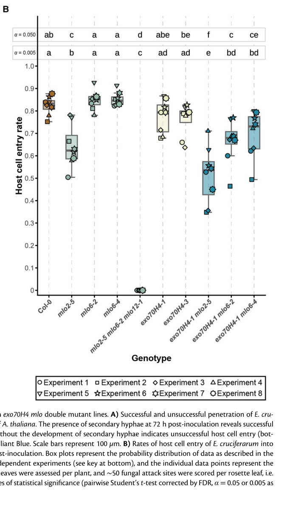

## Question

# Gene Research for Functional Annotation

## ⚠️ CRITICAL: Gene/Protein Identification Context

**BEFORE YOU BEGIN RESEARCH:** You MUST verify you are researching the CORRECT gene/protein. Gene symbols can be ambiguous, especially for less well-characterized genes from non-model organisms.

### Target Gene/Protein Identity (from UniProt):
- **UniProt Accession:** Q9SXB6
- **Protein Description:** RecName: Full=MLO-like protein 2; Short=AtMlo2;
- **Gene Information:** Name=MLO2; OrderedLocusNames=At1g11310; ORFNames=T28P6.4;
- **Organism (full):** Arabidopsis thaliana (Mouse-ear cress).
- **Protein Family:** Belongs to the MLO family. .
- **Key Domains:** Mlo. (IPR004326); Mlo (PF03094)

### MANDATORY VERIFICATION STEPS:

1. **Check if the gene symbol "MLO2" matches the protein description above**
2. **Verify the organism is correct:** Arabidopsis thaliana (Mouse-ear cress).
3. **Check if protein family/domains align with what you find in literature**
4. **If you find literature for a DIFFERENT gene with the same or similar symbol, STOP**

### If Gene Symbol is Ambiguous or You Cannot Find Relevant Literature:

**DO NOT PROCEED WITH RESEARCH ON A DIFFERENT GENE.** Instead:
- State clearly: "The gene symbol 'MLO2' is ambiguous or literature is limited for this specific protein"
- Explain what you found (e.g., "Found extensive literature on a different gene with the same symbol in a different organism")
- Describe the protein based ONLY on the UniProt information provided above
- Suggest that the protein function can be inferred from domain/family information

### Research Target:

Please provide a comprehensive research report on the gene **MLO2** (gene ID: MLO2, UniProt: Q9SXB6) in ARATH.

The research report should be a detailed narrative explaining the function, biological processes, and localization of the gene product. Citations should be given for all claims.

You should prioritize authoritative reviews and primary scientific literature when conducting research. You can supplement
this with annotations you find in gene/protein databases, but these can be outdated or inaccurate.

We are specifically interested in the primary function of the gene - for enzymes, what reaction is catalyzed, and what is the substrate specificity? For transporters, what is the substrate? For structural proteins or adapters, what is the broader structural role? For signaling molecules, what is the role in the pathway.

We are interested in where in or outside the cell the gene product carries out its function.

We are also interested in the signaling or biochemical pathways in which the gene functions. We are less interested in broad pleiotropic effects, except where these elucidate the precise role.

Include evidence where possible. We are interested in both experimental evidence as well as inference from structure, evolution, or bioinformatic analysis. Precise studies should be prioritized over high-throughput, where available.

## Output

Question: You are an expert researcher providing comprehensive, well-cited information.

Provide detailed information focusing on:
1. Key concepts and definitions with current understanding
2. Recent developments and latest research (prioritize 2023-2024 sources)
3. Current applications and real-world implementations
4. Expert opinions and analysis from authoritative sources
5. Relevant statistics and data from recent studies

Format as a comprehensive research report with proper citations. Include URLs and publication dates where available.
Always prioritize recent, authoritative sources and provide specific citations for all major claims.

# Gene Research for Functional Annotation

## ⚠️ CRITICAL: Gene/Protein Identification Context

**BEFORE YOU BEGIN RESEARCH:** You MUST verify you are researching the CORRECT gene/protein. Gene symbols can be ambiguous, especially for less well-characterized genes from non-model organisms.

### Target Gene/Protein Identity (from UniProt):
- **UniProt Accession:** Q9SXB6
- **Protein Description:** RecName: Full=MLO-like protein 2; Short=AtMlo2;
- **Gene Information:** Name=MLO2; OrderedLocusNames=At1g11310; ORFNames=T28P6.4;
- **Organism (full):** Arabidopsis thaliana (Mouse-ear cress).
- **Protein Family:** Belongs to the MLO family. .
- **Key Domains:** Mlo. (IPR004326); Mlo (PF03094)

### MANDATORY VERIFICATION STEPS:

1. **Check if the gene symbol "MLO2" matches the protein description above**
2. **Verify the organism is correct:** Arabidopsis thaliana (Mouse-ear cress).
3. **Check if protein family/domains align with what you find in literature**
4. **If you find literature for a DIFFERENT gene with the same or similar symbol, STOP**

### If Gene Symbol is Ambiguous or You Cannot Find Relevant Literature:

**DO NOT PROCEED WITH RESEARCH ON A DIFFERENT GENE.** Instead:
- State clearly: "The gene symbol 'MLO2' is ambiguous or literature is limited for this specific protein"
- Explain what you found (e.g., "Found extensive literature on a different gene with the same symbol in a different organism")
- Describe the protein based ONLY on the UniProt information provided above
- Suggest that the protein function can be inferred from domain/family information

### Research Target:

Please provide a comprehensive research report on the gene **MLO2** (gene ID: MLO2, UniProt: Q9SXB6) in ARATH.

The research report should be a detailed narrative explaining the function, biological processes, and localization of the gene product. Citations should be given for all claims.

You should prioritize authoritative reviews and primary scientific literature when conducting research. You can supplement
this with annotations you find in gene/protein databases, but these can be outdated or inaccurate.

We are specifically interested in the primary function of the gene - for enzymes, what reaction is catalyzed, and what is the substrate specificity? For transporters, what is the substrate? For structural proteins or adapters, what is the broader structural role? For signaling molecules, what is the role in the pathway.

We are interested in where in or outside the cell the gene product carries out its function.

We are also interested in the signaling or biochemical pathways in which the gene functions. We are less interested in broad pleiotropic effects, except where these elucidate the precise role.

Include evidence where possible. We are interested in both experimental evidence as well as inference from structure, evolution, or bioinformatic analysis. Precise studies should be prioritized over high-throughput, where available.

# Functional annotation of Arabidopsis MLO2

## Identity and principal function

**The target is *Arabidopsis thaliana* MLO2 (AtMLO2; At1g11310; UniProt Q9SXB6),** not a similarly named MLO protein from another species. Its MLO/PF03094-family assignment agrees with the literature: MLO2 is a plant-specific, seven-transmembrane protein with a predicted extracellular or luminal N-terminus and cytosolic C-terminus. MLO2 is one of the Arabidopsis clade-V MLO proteins, alongside MLO6 and MLO12, implicated in powdery-mildew susceptibility. The topology is predicted; it should not be mistaken for an experimentally resolved MLO2 structure. (huebbers2026alphafold3captures pages 70-74, bongartz2023comprehensivecomparativeassessment pages 2-4, bloodgood2025cladevmlo pages 4-6)

**The best-established physiological function is to enable efficient fungal entry into living leaf epidermal cells.** MLO2 is the principal member of the partially redundant MLO2–MLO6–MLO12 susceptibility group. Removing MLO2 alone reduces, but does not abolish, entry by adapted powdery mildews; removing all three confers near-complete penetration resistance. Thus, despite the name *mildew resistance locus O*, functional MLO2 promotes host compatibility: the *loss-of-function mutation* produces resistance. It is not an enzyme with a known catalytic reaction. Its demonstrated molecular activities are divalent-cation conductance in a heterologous system and interaction with calcium-signaling and membrane-trafficking proteins; precisely which activity makes an epidermal cell permissive to fungal entry remains unresolved. (bongartz2023comprehensivecomparativeassessment pages 1-2, huebbers2024interplayofexo70 pages 16-17, gao2022areceptor–channeltrio pages 2-4)

A 2024 infection assay provides a useful scale for MLO2’s contribution. At 72 hours after *Erysiphe cruciferarum* inoculation, successful host-cell entry was approximately **82% in wild-type Col-0**, **64% in mlo2-5**, **51% in exo70H4-1 mlo2-5**, and **0% in mlo2-5 mlo6-2 mlo12-1**. The study scored approximately 2,400 attack sites per genotype across eight independent experiments. These are entry frequencies for this pathogen and assay, not universal resistance percentages. Figure 7B provides the corresponding genotype comparison. (huebbers2024interplayofexo70 pages 16-17, huebbers2024interplayofexo70 pages 13-16, huebbers2024interplayofexo70 media 4328d694)

## Molecular activity and signaling

**Ion conductance.** In the primary calcium-channel study, AtMLO2 expressed alone in COS7 mammalian cells mediated calcium entry and large inward currents dependent on extracellular Ca²⁺. Patch-clamp experiments found permeability to **Ca²⁺, Ba²⁺ and Mg²⁺**, but not detectable conductance of **Na⁺ or K⁺** under the tested conditions; La³⁺ and Gd³⁺ inhibited the currents. MLO2 is therefore better described as a *divalent-cation-permeable channel* than as an exclusively calcium-selective channel. These experiments directly test AtMLO2, but they do **not** demonstrate that its channel current occurs at an Arabidopsis fungal entry site or that channel activity is necessary for mildew susceptibility. [Gao et al., *Nature*, July 2022](https://doi.org/10.1038/s41586-022-04923-7). (gao2022areceptor–channeltrio pages 2-4, gao2022areceptor–channeltrio pages 4-6)

**Calmodulin association.** The cytosolic MLO2 tail contains a predicted amphipathic calmodulin-binding helix at approximately residues **R451–K468**. A 2023 comparative study detected interaction of MLO2 or its C-terminal segment with Arabidopsis CALMODULIN 2 (CAM2) in most tested biochemical and cellular assay formats. Substituting **L456 and W459** with arginines generally weakened the interaction. This supports a calcium-sensor-associated signaling role, but no numerical binding affinity was established, assay formats differed in sensitivity, and the study did not show that disrupting this interaction specifically abolishes MLO2-dependent fungal entry. CAM2 is identical in sequence to CAM3 and CAM5, so these results do not establish CAM2-exclusive specificity. [von Bongartz et al., *Biochemical Journal*, September 2023](https://doi.org/10.1042/BCJ20230255). (bongartz2023comprehensivecomparativeassessment pages 2-4, bongartz2023comprehensivecomparativeassessment pages 14-15)

**Exocyst association and polarized secretion.** The exocyst is a vesicle-tethering complex involved in targeted secretion. In a 2024 study, MLO2 associated with several EXO70 variants in luciferase-complementation assays: relative signals were approximately **0.39 with EXO70H1, 0.40 with EXO70H4 and 0.56 with EXO70B2**. Under these assay conditions, **MLO2–EXO70B2**, not MLO2–EXO70H4, gave the strongest MLO2 signal; the more extensively validated EXO70H4 interaction involved **MLO6**. MLO2 and EXO70H4 also colocalized in trichomes. These findings support isoform-preferential links between MLO proteins and secretion machinery, but neither the complementation signal nor colocalization alone proves a direct, physiologically necessary MLO2–EXO70H4 complex. [Huebbers et al., *The Plant Cell*, 2024 volume; published online December 2023](https://doi.org/10.1093/plcell/koad319). (huebbers2024interplayofexo70 pages 7-9, huebbers2024interplayofexo70 pages 9-11, huebbers2024interplayofexo70 pages 13-16)

The following evidence summary separates findings for **MLO2 itself** from phenotypes measured only after simultaneous removal of three MLO proteins. (bongartz2023comprehensivecomparativeassessment pages 2-4, huebbers2024interplayofexo70 pages 16-17, huebbers2024interplayofexo70 pages 11-13)

| Observation | Experimental basis | Limitation / interpretation | Source (DOI, publication date) |
|---|---|---|---|
| **Identity and topology:** *Arabidopsis thaliana* MLO2 = AtMLO2, **Q9SXB6**, **At1g11310**; a plant MLO-family integral membrane protein with seven predicted transmembrane helices, an extracellular/luminal N-terminus, and a cytosolic C-terminus. | Accession-level identification and sequence/topology analysis; MLO2 topology is computationally predicted rather than determined from an experimental structure. (huebbers2026alphafold3captures pages 70-74, bongartz2023comprehensivecomparativeassessment pages 2-4) | This is specifically Arabidopsis MLO2—not barley Mlo or similarly named MLO2 proteins from cucumber and other species. | [von Bongartz et al., *Biochemical Journal*](https://doi.org/10.1042/BCJ20230255), **September 2023**; [Huebbers et al., bioRxiv](https://doi.org/10.64898/2026.04.10.716904), **April 2026** |
| **Divalent-cation conductance:** AtMLO2 expressed alone in COS7 cells supported Ca²⁺ entry and large inward currents dependent on extracellular Ca²⁺; it was permeable to **Ca²⁺, Ba²⁺, and Mg²⁺**, but not **Na⁺ or K⁺**, and currents were inhibited by La³⁺ and Gd³⁺. | Heterologous mammalian-cell Ca²⁺ imaging and patch-clamp electrophysiology. Other Arabidopsis MLO paralogs were tested separately, but these data directly include AtMLO2. (gao2022areceptor–channeltrio pages 2-4, gao2022areceptor–channeltrio pages 4-6) | Establishes divalent-cation-channel activity in a heterologous system, **not** that MLO2-mediated Ca²⁺ influx causes powdery-mildew susceptibility in native Arabidopsis epidermal cells; direct infection-site electrophysiology is lacking. | [Gao et al., *Nature*](https://doi.org/10.1038/s41586-022-04923-7), **July 2022** |
| **Calmodulin interaction:** cytosolic MLO2 residues **R451–K468** form the predicted amphipathic CAM-binding helix; **L456** and **W459** are important for CAM2 association. | Six of seven assay formats detected interaction between CAM2 and MLO2 or its C-terminal region. L456R/W459R generally weakened binding. (bongartz2023comprehensivecomparativeassessment pages 2-4, bongartz2023comprehensivecomparativeassessment pages 14-15) | No dissociation constant was measured, and results differed by assay: classical Y2H failed to detect binding, while split-ubiquitin and BiFC did not always distinguish wild type from L456R/W459R. CAM2, CAM3, and CAM5 encode identical proteins, limiting claims of CAM2 isoform specificity. | [von Bongartz et al., *Biochemical Journal*](https://doi.org/10.1042/BCJ20230255), **September 2023** |
| **Localization during infection:** MLO2-GFP occurs at the cell periphery/plasma membrane and in Golgi-associated puncta, then accumulates focally beneath powdery-mildew appressoria and around the penetration peg. Accumulation was detected by approximately **7.5–11 hours post-inoculation**, before or during penetration. | Live-cell fluorescence microscopy with functional MLO2-GFP; later imaging placed the signal in collar-like structures and puncta within the peri-penetration-peg membrane region near the haustorial neck. (bloodgood2025cladevmlo pages 12-14, bloodgood2025cladevmlo pages 41-46, qin2020specificrecruitmentof pages 11-12) | Precise compartment assignment depends on infection stage; focal signal should not automatically be equated with the extrahaustorial membrane. Proposed roles in membrane sealing, repair, or haustorium differentiation remain hypotheses. | [Qin et al., *The Plant Cell*](https://doi.org/10.1105/tpc.19.00970), **March 2020**; [Bloodgood et al., bioRxiv](https://doi.org/10.1101/2025.06.18.660284), **June 2025, preprint** |
| **PI(4,5)P₂ controversy:** Qin et al. found strongly reduced MLO2-GFP focal recruitment in **pip5k1 pip5k2** cells where penetration failed; Bloodgood et al. later observed normal focal localization and susceptibility in a different mutant background lacking the same kinases. | Independent genetic and imaging experiments reached different conclusions about whether PIP5K1/PIP5K2-derived PI(4,5)P₂ facilitates MLO2 recruitment. (bloodgood2025cladevmlo pages 22-25, bloodgood2025cladevmlo pages 17-20, qin2020…mechanismsunderlying pages 126-130) | PI(4,5)P₂ dependence remains unresolved; genetic background, pathogen assay, developmental stage, successful versus failed penetration, or transgene behavior may explain the discrepancy. | [Qin et al., *The Plant Cell*](https://doi.org/10.1105/tpc.19.00970), **March 2020**; [Bloodgood et al., bioRxiv](https://doi.org/10.1101/2025.06.18.660284), **June 2025, preprint** |
| **EXO70 associations are isoform-preferential:** MLO2 produced interaction signals with EXO70H1 and EXO70H4 but showed its strongest tested signal with **EXO70B2** (relative luminescence approximately 0.56). By contrast, **MLO6 preferentially associated with EXO70H4** (approximately 0.67), supported by FRET-FLIM and C-terminal-domain Y2H evidence. | Luciferase-complementation screening of MLO2, MLO6, and MLO12 against selected EXO70 proteins; MLO6–EXO70H4 received the strongest orthogonal validation. (huebbers2024interplayofexo70 pages 13-16) | MLO2–EXO70H4 is neither exclusive nor the best-supported pair. Luciferase complementation may reflect direct or indirect association; the detailed trafficking model is centered mainly on MLO6–EXO70H4. | [Huebbers et al., *The Plant Cell*](https://doi.org/10.1093/plcell/koad319), **December 2023 online; 2024 volume** |
| **Powdery-mildew entry statistics:** at 72 hours after *Erysiphe cruciferarum* inoculation, successful entry was approximately **82% in Col-0**, **64% in mlo2-5**, **51% in exo70H4-1 mlo2-5**, and **0% in mlo2-5 mlo6-2 mlo12-1**. | Eight independent experiments, three plants per experiment, two leaves per plant, and approximately 50 attack sites per leaf—about **2,400 sites per genotype**. (huebbers2024interplayofexo70 pages 16-17, huebbers2024interplayofexo70 pages 13-16, huebbers2024interplayofexo70 media 4328d694) | Demonstrates MLO2’s major but genetically redundant susceptibility contribution and an additive effect with EXO70H4 loss; it does not identify Ca²⁺ conductance or EXO70 binding as the causal biochemical mechanism. | [Huebbers et al., *The Plant Cell*](https://doi.org/10.1093/plcell/koad319), **December 2023 online; 2024 volume** |
| **Trichome secretion and wall biogenesis:** the **mlo2 mlo6 mlo12 triple mutant**, not MLO2 alone, phenocopied aspects of exo70H4, including altered secondary-wall composition, disturbed EXO70H4 localization, and reduced plasma-membrane/cell-wall delivery of GFP-PMR4/CALS12 callose synthase. | Colocalization and reciprocal-mislocalization microscopy, PMR4 time-series imaging, histochemistry, carbohydrate analysis, and FTIR. In one assay, the characteristic basal trichome structure occurred in approximately 64% of wild type versus approximately 7% of one triple-mutant line. (huebbers2024interplayofexo70 pages 11-13, huebbers2024interplayofexo70 pages 7-9, huebbers2024interplayofexo70 pages 9-11) | The phenotype is a redundant **MLO2/MLO6/MLO12** effect; evidence and the proposed localized-secretion mechanism point most strongly to MLO6–EXO70H4. It must not be assigned to MLO2 alone or assumed to explain mildew resistance. | [Huebbers et al., *The Plant Cell*](https://doi.org/10.1093/plcell/koad319), **December 2023 online; 2024 volume** |
| **Differential PEN2 dependence:** deleting **PEN2** restored near-wild-type fungal penetration in an **mlo2** background, whereas mlo2 mlo6 mlo12 pen2 remained fully resistant; adding pen1, pen2, and pen3 together likewise did not break triple-mutant resistance. | Genetic epistasis with adapted *Golovinomyces orontii*, including mlo2 pen2, intermediate higher-order combinations, and mlo2 mlo6 mlo12 pen1 pen2 pen3. (kuhn2017keycomponentsof pages 5-7, kuhn2017keycomponentsof pages 3-4, frehjordine2024phenotypicandmolecular pages 31-34) | The incomplete mlo2 single-mutant phenotype depends substantially on PEN-mediated secretion/indolic defense, whereas complete triple-mutant resistance can bypass these pathways. This argues against treating all mlo resistance as one uniform mechanism. | [Kuhn et al., *Frontiers in Plant Science*](https://doi.org/10.3389/fpls.2017.01006), **June 2017** |

*Table: Evidence table for Arabidopsis thaliana AtMLO2 (Q9SXB6; At1g11310), separating direct biochemical, electrophysiological, localization, interaction, and genetic findings from unresolved mechanistic interpretations.*

## Cellular location and biological process

**The relevant native cellular site is the leaf epidermal cell periphery, especially the host membrane region immediately surrounding an attempted fungal penetration peg.** Before challenge, MLO2–GFP has been observed at the cell periphery and in cytoplasmic puncta associated with a Golgi marker. During *E. cruciferarum* infection it becomes concentrated beneath the appressorium by approximately **11 hours post-inoculation**, with pronounced accumulation during penetration at approximately **12–13 hours**. MLO2–YFP also accumulates focally at pathogen attack sites. These are localization observations; the fungal-contact signal should not automatically be assigned to the entire extrahaustorial membrane. [Qin et al., *The Plant Cell*, March 2020](https://doi.org/10.1105/tpc.19.00970); [Huebbers et al., *The Plant Cell*, 2024](https://doi.org/10.1093/plcell/koad319). (huebbers2024interplayofexo70 pages 16-17, qin2020specificrecruitmentof pages 11-12, qin2020specificrecruitmentof pages 12-13)

In leaf trichomes, MLO2–GFP colocalizes with EXO70H4 at plasma-membrane domains, speckles and wall-associated regions. The **mlo2 mlo6 mlo12 triple mutant** shows altered trichome secondary-wall composition and disturbed delivery of GFP-tagged PMR4/CALS12 callose synthase toward the plasma membrane and cell wall. For one staining measure, the characteristic trichome basal-wall pattern occurred in approximately **64% of wild-type trichomes versus 7% of one triple-mutant line**. This supports an MLO-family role in polarized wall-related secretion, but it does **not** establish that MLO2 alone controls PMR4 delivery or that this trichome phenotype causes mildew resistance; the proposed EXO70H4 trafficking mechanism has especially strong evidence for MLO6. [Huebbers et al., *The Plant Cell*, 2024](https://doi.org/10.1093/plcell/koad319). (huebbers2024interplayofexo70 pages 11-13, huebbers2024interplayofexo70 pages 7-9, huebbers2024interplayofexo70 pages 9-11, huebbers2024interplayofexo70 pages 13-16)

## Defense-pathway interpretation

Genetic experiments distinguish the **partial resistance of an mlo2 single mutant** from the **complete resistance of the mlo2 mlo6 mlo12 triple mutant**. Removing the PEN2 defense component restores near-wild-type fungal penetration in an *mlo2* background, whereas the triple mutant remains resistant after *PEN2* loss; combined disruption of *PEN1*, *PEN2* and *PEN3* likewise does not restore susceptibility of the triple mutant. Thus, PEN-associated secretion and indolic defenses contribute to the single-mutant phenotype but are not individually indispensable once all three susceptibility factors are removed. The triple mutant also mounts an earlier, broader defense-associated transcriptional response after *Golovinomyces orontii* challenge. Those transcriptional changes are observations, not proof that one particular defense hormone pathway is the immediate biochemical target of MLO2. [Kuhn et al., *Frontiers in Plant Science*, June 2017](https://doi.org/10.3389/fpls.2017.01006). (kuhn2017keycomponentsof pages 1-2, kuhn2017keycomponentsof pages 5-7, kuhn2017keycomponentsof pages 3-4)

A further **June 2025 preprint, not peer reviewed**, reports that an *mlo2 mlo6 mlo12* combination blocked powdery-mildew development even in an *eds1 pad4 sid2* immune-compromised background. Introducing an MLO2–GFP transgene restored susceptibility, and the protein accumulated in a collar and puncta around the fungal penetration peg, detectable by approximately **7.5 hours** after inoculation. The authors propose that MLO2 supports stabilization or repair of the host membrane junction needed for haustorium formation. The genetic rescue and location are evidence; **membrane sealing and a causal local Ca²⁺ influx are proposed mechanisms**, not directly demonstrated reactions. [Bloodgood et al., bioRxiv preprint, June 2025](https://doi.org/10.1101/2025.06.18.660284). (bloodgood2025cladevmlo pages 1-4, bloodgood2025cladevmlo pages 12-14, bloodgood2025cladevmlo pages 4-6)

**An unresolved localization mechanism warrants caution.** Qin and colleagues reported reduced MLO2–GFP focal accumulation in *pip5k1 pip5k2* plants when fungal penetration failed, implicating PIP5K-derived PI(4,5)P₂. Bloodgood and colleagues later reported preserved focal accumulation and MLO2-dependent susceptibility after disrupting those kinases in their different genetic and infection context. PI(4,5)P₂ dependence should therefore not be annotated as an established requirement for MLO2 recruitment. [Qin et al., *The Plant Cell*, March 2020](https://doi.org/10.1105/tpc.19.00970); [Bloodgood et al., bioRxiv preprint, June 2025](https://doi.org/10.1101/2025.06.18.660284). (bloodgood2025cladevmlo pages 17-20, bloodgood2025cladevmlo pages 22-25, qin2020specificrecruitmentof pages 12-13)

## Applications and annotation conclusion

**Practical use is principally as a susceptibility-gene target and a model for recessive powdery-mildew resistance.** Arabidopsis genetics show why targeting MLO2 alone may leave residual fungal entry, whereas simultaneous impairment of MLO2, MLO6 and MLO12 can produce much stronger resistance. The same experiments caution against treating resistance as a cost-free, universal phenotype: MLO-family disruption can also affect trichome walls and age-associated leaf traits, and effects on other pathogens need separate testing. Crop MLO genes can inform breeding strategies, but a gene called “MLO2” in another organism is **not** the Q9SXB6 product and must not inherit this annotation without its own evidence. (huebbers2024interplayofexo70 pages 16-17, huebbers2024interplayofexo70 pages 11-13, frehjordine2024phenotypicandmolecular pages 31-34)

**Concise functional assignment:** AtMLO2 is a plasma-membrane-associated, calmodulin-binding, divalent-cation-permeable MLO protein whose strongest native genetic assignment is **facilitation of powdery-mildew penetration in Arabidopsis leaf epidermal cells**, with partially redundant contributions from MLO6 and MLO12. A role in spatially organized calcium signaling and membrane trafficking is supported by biochemistry, heterologous electrophysiology and localization, but the causal molecular sequence connecting these activities to fungal entry remains to be established. (bongartz2023comprehensivecomparativeassessment pages 2-4, huebbers2024interplayofexo70 pages 16-17, huebbers2024interplayofexo70 pages 7-9, gao2022areceptor–channeltrio pages 2-4)

References

1. (huebbers2026alphafold3captures pages 70-74): Jan W. Huebbers, Chandan K. Das, Alexander Speck, Myriam E. Fürst, Hanna Simon, Marie Laufens, Sophie C. J. Levecque, Matthias Freh, Maria Fyta, and Ralph Panstruga. Alphafold 3 captures oligomeric states and interaction dynamics of mlo ion channels. bioRxiv, Apr 2026. URL: https://doi.org/10.64898/2026.04.10.716904, doi:10.64898/2026.04.10.716904. This article has 2 citations.

2. (bongartz2023comprehensivecomparativeassessment pages 2-4): Kira von Bongartz, Björn Sabelleck, Anežka Baquero Forero, H. Kuhn, Franz Leissing, and R. Panstruga. Comprehensive comparative assessment of the arabidopsis thaliana mlo2–calmodulin2 interaction by various in vitro and in vivo protein–protein interaction assays. Biochemical Journal, 480:1615-1638, Sep 2023. URL: https://doi.org/10.1042/bcj20230255, doi:10.1042/bcj20230255. This article has 11 citations and is from a domain leading peer-reviewed journal.

3. (bloodgood2025cladevmlo pages 4-6): David Bloodgood, Qiong Zhang, Pai Li, Ying Wu, Michael Pan, Christina Zhou, Apsen Hsu, Jun Zhang, Ralph Panstrgua, Sharon Kessler, Ping He, Libo Shan, Cheng-I Wei, and Shunyuan Xiao. Clade v mlo proteins are bona fide host susceptibility factors required for powdery mildew pathogenesis in arabidopsis. bioRxiv, Jun 2025. URL: https://doi.org/10.1101/2025.06.18.660284, doi:10.1101/2025.06.18.660284. This article has 0 citations.

4. (bongartz2023comprehensivecomparativeassessment pages 1-2): Kira von Bongartz, Björn Sabelleck, Anežka Baquero Forero, H. Kuhn, Franz Leissing, and R. Panstruga. Comprehensive comparative assessment of the arabidopsis thaliana mlo2–calmodulin2 interaction by various in vitro and in vivo protein–protein interaction assays. Biochemical Journal, 480:1615-1638, Sep 2023. URL: https://doi.org/10.1042/bcj20230255, doi:10.1042/bcj20230255. This article has 11 citations and is from a domain leading peer-reviewed journal.

5. (huebbers2024interplayofexo70 pages 16-17): Jan W Huebbers, George A Caldarescu, Zdeňka Kubátová, Peter Sabol, Sophie C J Levecque, Hannah Kuhn, Ivan Kulich, Anja Reinstädler, Kim Büttgen, Alba Manga-Robles, Hugo Mélida, Markus Pauly, Ralph Panstruga, and Viktor Žárský. Interplay of exo70 and mlo proteins modulates trichome cell wall composition and susceptibility to powdery mildew. The Plant Cell, 36:1007-1035, Dec 2024. URL: https://doi.org/10.1093/plcell/koad319, doi:10.1093/plcell/koad319. This article has 38 citations.

6. (gao2022areceptor–channeltrio pages 2-4): Qifei Gao, Chao Wang, Yasheng Xi, Qiaolin Shao, Legong Li, and Sheng Luan. A receptor–channel trio conducts ca2+ signalling for pollen tube reception. Nature, 607:534-539, Jul 2022. URL: https://doi.org/10.1038/s41586-022-04923-7, doi:10.1038/s41586-022-04923-7. This article has 137 citations and is from a highest quality peer-reviewed journal.

7. (huebbers2024interplayofexo70 pages 13-16): Jan W Huebbers, George A Caldarescu, Zdeňka Kubátová, Peter Sabol, Sophie C J Levecque, Hannah Kuhn, Ivan Kulich, Anja Reinstädler, Kim Büttgen, Alba Manga-Robles, Hugo Mélida, Markus Pauly, Ralph Panstruga, and Viktor Žárský. Interplay of exo70 and mlo proteins modulates trichome cell wall composition and susceptibility to powdery mildew. The Plant Cell, 36:1007-1035, Dec 2024. URL: https://doi.org/10.1093/plcell/koad319, doi:10.1093/plcell/koad319. This article has 38 citations.

8. (huebbers2024interplayofexo70 media 4328d694): Jan W Huebbers, George A Caldarescu, Zdeňka Kubátová, Peter Sabol, Sophie C J Levecque, Hannah Kuhn, Ivan Kulich, Anja Reinstädler, Kim Büttgen, Alba Manga-Robles, Hugo Mélida, Markus Pauly, Ralph Panstruga, and Viktor Žárský. Interplay of exo70 and mlo proteins modulates trichome cell wall composition and susceptibility to powdery mildew. The Plant Cell, 36:1007-1035, Dec 2024. URL: https://doi.org/10.1093/plcell/koad319, doi:10.1093/plcell/koad319. This article has 38 citations.

9. (gao2022areceptor–channeltrio pages 4-6): Qifei Gao, Chao Wang, Yasheng Xi, Qiaolin Shao, Legong Li, and Sheng Luan. A receptor–channel trio conducts ca2+ signalling for pollen tube reception. Nature, 607:534-539, Jul 2022. URL: https://doi.org/10.1038/s41586-022-04923-7, doi:10.1038/s41586-022-04923-7. This article has 137 citations and is from a highest quality peer-reviewed journal.

10. (bongartz2023comprehensivecomparativeassessment pages 14-15): Kira von Bongartz, Björn Sabelleck, Anežka Baquero Forero, H. Kuhn, Franz Leissing, and R. Panstruga. Comprehensive comparative assessment of the arabidopsis thaliana mlo2–calmodulin2 interaction by various in vitro and in vivo protein–protein interaction assays. Biochemical Journal, 480:1615-1638, Sep 2023. URL: https://doi.org/10.1042/bcj20230255, doi:10.1042/bcj20230255. This article has 11 citations and is from a domain leading peer-reviewed journal.

11. (huebbers2024interplayofexo70 pages 7-9): Jan W Huebbers, George A Caldarescu, Zdeňka Kubátová, Peter Sabol, Sophie C J Levecque, Hannah Kuhn, Ivan Kulich, Anja Reinstädler, Kim Büttgen, Alba Manga-Robles, Hugo Mélida, Markus Pauly, Ralph Panstruga, and Viktor Žárský. Interplay of exo70 and mlo proteins modulates trichome cell wall composition and susceptibility to powdery mildew. The Plant Cell, 36:1007-1035, Dec 2024. URL: https://doi.org/10.1093/plcell/koad319, doi:10.1093/plcell/koad319. This article has 38 citations.

12. (huebbers2024interplayofexo70 pages 9-11): Jan W Huebbers, George A Caldarescu, Zdeňka Kubátová, Peter Sabol, Sophie C J Levecque, Hannah Kuhn, Ivan Kulich, Anja Reinstädler, Kim Büttgen, Alba Manga-Robles, Hugo Mélida, Markus Pauly, Ralph Panstruga, and Viktor Žárský. Interplay of exo70 and mlo proteins modulates trichome cell wall composition and susceptibility to powdery mildew. The Plant Cell, 36:1007-1035, Dec 2024. URL: https://doi.org/10.1093/plcell/koad319, doi:10.1093/plcell/koad319. This article has 38 citations.

13. (huebbers2024interplayofexo70 pages 11-13): Jan W Huebbers, George A Caldarescu, Zdeňka Kubátová, Peter Sabol, Sophie C J Levecque, Hannah Kuhn, Ivan Kulich, Anja Reinstädler, Kim Büttgen, Alba Manga-Robles, Hugo Mélida, Markus Pauly, Ralph Panstruga, and Viktor Žárský. Interplay of exo70 and mlo proteins modulates trichome cell wall composition and susceptibility to powdery mildew. The Plant Cell, 36:1007-1035, Dec 2024. URL: https://doi.org/10.1093/plcell/koad319, doi:10.1093/plcell/koad319. This article has 38 citations.

14. (bloodgood2025cladevmlo pages 12-14): David Bloodgood, Qiong Zhang, Pai Li, Ying Wu, Michael Pan, Christina Zhou, Apsen Hsu, Jun Zhang, Ralph Panstrgua, Sharon Kessler, Ping He, Libo Shan, Cheng-I Wei, and Shunyuan Xiao. Clade v mlo proteins are bona fide host susceptibility factors required for powdery mildew pathogenesis in arabidopsis. bioRxiv, Jun 2025. URL: https://doi.org/10.1101/2025.06.18.660284, doi:10.1101/2025.06.18.660284. This article has 0 citations.

15. (bloodgood2025cladevmlo pages 41-46): David Bloodgood, Qiong Zhang, Pai Li, Ying Wu, Michael Pan, Christina Zhou, Apsen Hsu, Jun Zhang, Ralph Panstrgua, Sharon Kessler, Ping He, Libo Shan, Cheng-I Wei, and Shunyuan Xiao. Clade v mlo proteins are bona fide host susceptibility factors required for powdery mildew pathogenesis in arabidopsis. bioRxiv, Jun 2025. URL: https://doi.org/10.1101/2025.06.18.660284, doi:10.1101/2025.06.18.660284. This article has 0 citations.

16. (qin2020specificrecruitmentof pages 11-12): Li Qin, Zhuqing Zhou, Qiang Li, Chun Zhai, Lijiang Liu, Teagen D. Quilichini, Peng Gao, Sharon A. Kessler, Yvon Jaillais, Raju Datla, Gary Peng, Daoquan Xiang, and Yangdou Wei. Specific recruitment of phosphoinositide species to the plant-pathogen interfacial membrane underlies arabidopsis susceptibility to fungal infection[open]. Plant Cell, 32:1665-1688, Mar 2020. URL: https://doi.org/10.1105/tpc.19.00970, doi:10.1105/tpc.19.00970. This article has 95 citations and is from a highest quality peer-reviewed journal.

17. (bloodgood2025cladevmlo pages 22-25): David Bloodgood, Qiong Zhang, Pai Li, Ying Wu, Michael Pan, Christina Zhou, Apsen Hsu, Jun Zhang, Ralph Panstrgua, Sharon Kessler, Ping He, Libo Shan, Cheng-I Wei, and Shunyuan Xiao. Clade v mlo proteins are bona fide host susceptibility factors required for powdery mildew pathogenesis in arabidopsis. bioRxiv, Jun 2025. URL: https://doi.org/10.1101/2025.06.18.660284, doi:10.1101/2025.06.18.660284. This article has 0 citations.

18. (bloodgood2025cladevmlo pages 17-20): David Bloodgood, Qiong Zhang, Pai Li, Ying Wu, Michael Pan, Christina Zhou, Apsen Hsu, Jun Zhang, Ralph Panstrgua, Sharon Kessler, Ping He, Libo Shan, Cheng-I Wei, and Shunyuan Xiao. Clade v mlo proteins are bona fide host susceptibility factors required for powdery mildew pathogenesis in arabidopsis. bioRxiv, Jun 2025. URL: https://doi.org/10.1101/2025.06.18.660284, doi:10.1101/2025.06.18.660284. This article has 0 citations.

19. (qin2020…mechanismsunderlying pages 126-130): L Qin. … mechanisms underlying incompatible and compatible interactions between host arabidopsis and powdery mildews. Unknown journal, 2020.

20. (kuhn2017keycomponentsof pages 5-7): Hannah Kuhn, Justine Lorek, Mark Kwaaitaal, Chiara Consonni, Katia Becker, Cristina Micali, Emiel Ver Loren van Themaat, Paweł Bednarek, Tom M. Raaymakers, Michela Appiano, Yuling Bai, Dorothea Meldau, Stephani Baum, Uwe Conrath, Ivo Feussner, and Ralph Panstruga. Key components of different plant defense pathways are dispensable for powdery mildew resistance of the arabidopsis mlo2 mlo6 mlo12 triple mutant. Frontiers in Plant Science, Jun 2017. URL: https://doi.org/10.3389/fpls.2017.01006, doi:10.3389/fpls.2017.01006. This article has 65 citations.

21. (kuhn2017keycomponentsof pages 3-4): Hannah Kuhn, Justine Lorek, Mark Kwaaitaal, Chiara Consonni, Katia Becker, Cristina Micali, Emiel Ver Loren van Themaat, Paweł Bednarek, Tom M. Raaymakers, Michela Appiano, Yuling Bai, Dorothea Meldau, Stephani Baum, Uwe Conrath, Ivo Feussner, and Ralph Panstruga. Key components of different plant defense pathways are dispensable for powdery mildew resistance of the arabidopsis mlo2 mlo6 mlo12 triple mutant. Frontiers in Plant Science, Jun 2017. URL: https://doi.org/10.3389/fpls.2017.01006, doi:10.3389/fpls.2017.01006. This article has 65 citations.

22. (frehjordine2024phenotypicandmolecular pages 31-34): Phenotypic and molecular characterization of pleiotropic phenotypes in Arabidopsis and barley $mlo$ mutants This article has 0 citations.

23. (qin2020specificrecruitmentof pages 12-13): Li Qin, Zhuqing Zhou, Qiang Li, Chun Zhai, Lijiang Liu, Teagen D. Quilichini, Peng Gao, Sharon A. Kessler, Yvon Jaillais, Raju Datla, Gary Peng, Daoquan Xiang, and Yangdou Wei. Specific recruitment of phosphoinositide species to the plant-pathogen interfacial membrane underlies arabidopsis susceptibility to fungal infection[open]. Plant Cell, 32:1665-1688, Mar 2020. URL: https://doi.org/10.1105/tpc.19.00970, doi:10.1105/tpc.19.00970. This article has 95 citations and is from a highest quality peer-reviewed journal.

24. (kuhn2017keycomponentsof pages 1-2): Hannah Kuhn, Justine Lorek, Mark Kwaaitaal, Chiara Consonni, Katia Becker, Cristina Micali, Emiel Ver Loren van Themaat, Paweł Bednarek, Tom M. Raaymakers, Michela Appiano, Yuling Bai, Dorothea Meldau, Stephani Baum, Uwe Conrath, Ivo Feussner, and Ralph Panstruga. Key components of different plant defense pathways are dispensable for powdery mildew resistance of the arabidopsis mlo2 mlo6 mlo12 triple mutant. Frontiers in Plant Science, Jun 2017. URL: https://doi.org/10.3389/fpls.2017.01006, doi:10.3389/fpls.2017.01006. This article has 65 citations.

25. (bloodgood2025cladevmlo pages 1-4): David Bloodgood, Qiong Zhang, Pai Li, Ying Wu, Michael Pan, Christina Zhou, Apsen Hsu, Jun Zhang, Ralph Panstrgua, Sharon Kessler, Ping He, Libo Shan, Cheng-I Wei, and Shunyuan Xiao. Clade v mlo proteins are bona fide host susceptibility factors required for powdery mildew pathogenesis in arabidopsis. bioRxiv, Jun 2025. URL: https://doi.org/10.1101/2025.06.18.660284, doi:10.1101/2025.06.18.660284. This article has 0 citations.

## Artifacts

- [Edison artifact artifact-00](MLO2-deep-research-falcon_artifacts/artifact-00.md)

## Citations

1. bongartz2023comprehensivecomparativeassessment pages 2-4
2. bloodgood2025cladevmlo pages 4-6
3. bongartz2023comprehensivecomparativeassessment pages 1-2
4. bongartz2023comprehensivecomparativeassessment pages 14-15
5. bloodgood2025cladevmlo pages 12-14
6. bloodgood2025cladevmlo pages 41-46
7. qin2020specificrecruitmentof pages 11-12
8. bloodgood2025cladevmlo pages 22-25
9. bloodgood2025cladevmlo pages 17-20
10. kuhn2017keycomponentsof pages 5-7
11. kuhn2017keycomponentsof pages 3-4
12. frehjordine2024phenotypicandmolecular pages 31-34
13. qin2020specificrecruitmentof pages 12-13
14. kuhn2017keycomponentsof pages 1-2
15. bloodgood2025cladevmlo pages 1-4
16. Gao et al., *Nature*, July 2022
17. von Bongartz et al., *Biochemical Journal*, September 2023
18. Huebbers et al., *The Plant Cell*, 2024 volume; published online December 2023
19. von Bongartz et al., *Biochemical Journal*
20. Huebbers et al., bioRxiv
21. Gao et al., *Nature*
22. Qin et al., *The Plant Cell*
23. Bloodgood et al., bioRxiv
24. Huebbers et al., *The Plant Cell*
25. Kuhn et al., *Frontiers in Plant Science*
26. Qin et al., *The Plant Cell*, March 2020
27. Huebbers et al., *The Plant Cell*, 2024
28. Kuhn et al., *Frontiers in Plant Science*, June 2017
29. Bloodgood et al., bioRxiv preprint, June 2025
30. open
31. https://doi.org/10.1038/s41586-022-04923-7
32. https://doi.org/10.1042/BCJ20230255
33. https://doi.org/10.1093/plcell/koad319
34. https://doi.org/10.64898/2026.04.10.716904
35. https://doi.org/10.1105/tpc.19.00970
36. https://doi.org/10.1101/2025.06.18.660284
37. https://doi.org/10.3389/fpls.2017.01006
38. https://doi.org/10.64898/2026.04.10.716904,
39. https://doi.org/10.1042/bcj20230255,
40. https://doi.org/10.1101/2025.06.18.660284,
41. https://doi.org/10.1093/plcell/koad319,
42. https://doi.org/10.1038/s41586-022-04923-7,
43. https://doi.org/10.1105/tpc.19.00970,
44. https://doi.org/10.3389/fpls.2017.01006,