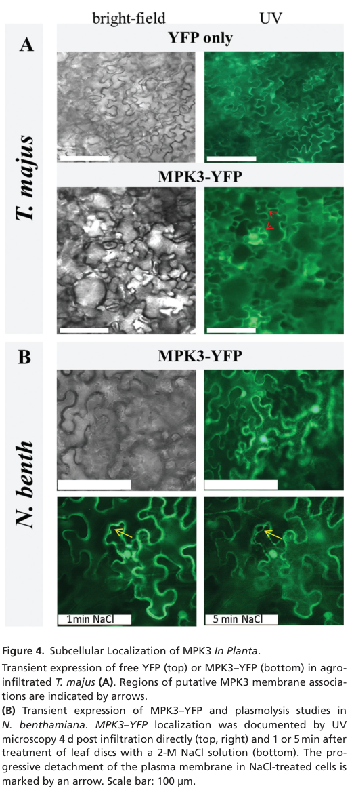

## Question

# Gene Research for Functional Annotation

## ⚠️ CRITICAL: Gene/Protein Identification Context

**BEFORE YOU BEGIN RESEARCH:** You MUST verify you are researching the CORRECT gene/protein. Gene symbols can be ambiguous, especially for less well-characterized genes from non-model organisms.

### Target Gene/Protein Identity (from UniProt):
- **UniProt Accession:** Q39023
- **Protein Description:** RecName: Full=Mitogen-activated protein kinase 3 {ECO:0000303|PubMed:8282107}; Short=AtMPK3 {ECO:0000303|PubMed:8282107}; Short=MAP kinase 3 {ECO:0000303|PubMed:8282107}; EC=2.7.11.24 {ECO:0000255|PROSITE-ProRule:PRU00159, ECO:0000269|PubMed:12220631, ECO:0000269|PubMed:15500467, ECO:0000269|PubMed:21276203};
- **Gene Information:** Name=MPK3 {ECO:0000303|PubMed:8282107}; OrderedLocusNames=At3g45640 {ECO:0000312|Araport:AT3G45640}; ORFNames=F9K21.220 {ECO:0000312|EMBL:CAB75493.1}, T6D9.4 {ECO:0000312|EMBL:AL157735};
- **Organism (full):** Arabidopsis thaliana (Mouse-ear cress).
- **Protein Family:** Belongs to the protein kinase superfamily. CMGC Ser/Thr
- **Key Domains:** Kinase-like_dom_sf. (IPR011009); MAP_kinase_CS. (IPR003527); MAPK. (IPR050117); Prot_kinase_dom. (IPR000719); Protein_kinase_ATP_BS. (IPR017441)

### MANDATORY VERIFICATION STEPS:

1. **Check if the gene symbol "MPK3" matches the protein description above**
2. **Verify the organism is correct:** Arabidopsis thaliana (Mouse-ear cress).
3. **Check if protein family/domains align with what you find in literature**
4. **If you find literature for a DIFFERENT gene with the same or similar symbol, STOP**

### If Gene Symbol is Ambiguous or You Cannot Find Relevant Literature:

**DO NOT PROCEED WITH RESEARCH ON A DIFFERENT GENE.** Instead:
- State clearly: "The gene symbol 'MPK3' is ambiguous or literature is limited for this specific protein"
- Explain what you found (e.g., "Found extensive literature on a different gene with the same symbol in a different organism")
- Describe the protein based ONLY on the UniProt information provided above
- Suggest that the protein function can be inferred from domain/family information

### Research Target:

Please provide a comprehensive research report on the gene **MPK3** (gene ID: MPK3, UniProt: Q39023) in ARATH.

The research report should be a detailed narrative explaining the function, biological processes, and localization of the gene product. Citations should be given for all claims.

You should prioritize authoritative reviews and primary scientific literature when conducting research. You can supplement
this with annotations you find in gene/protein databases, but these can be outdated or inaccurate.

We are specifically interested in the primary function of the gene - for enzymes, what reaction is catalyzed, and what is the substrate specificity? For transporters, what is the substrate? For structural proteins or adapters, what is the broader structural role? For signaling molecules, what is the role in the pathway.

We are interested in where in or outside the cell the gene product carries out its function.

We are also interested in the signaling or biochemical pathways in which the gene functions. We are less interested in broad pleiotropic effects, except where these elucidate the precise role.

Include evidence where possible. We are interested in both experimental evidence as well as inference from structure, evolution, or bioinformatic analysis. Precise studies should be prioritized over high-throughput, where available.

## Output

Question: You are an expert researcher providing comprehensive, well-cited information.

Provide detailed information focusing on:
1. Key concepts and definitions with current understanding
2. Recent developments and latest research (prioritize 2023-2024 sources)
3. Current applications and real-world implementations
4. Expert opinions and analysis from authoritative sources
5. Relevant statistics and data from recent studies

Format as a comprehensive research report with proper citations. Include URLs and publication dates where available.
Always prioritize recent, authoritative sources and provide specific citations for all major claims.

# Gene Research for Functional Annotation

## ⚠️ CRITICAL: Gene/Protein Identification Context

**BEFORE YOU BEGIN RESEARCH:** You MUST verify you are researching the CORRECT gene/protein. Gene symbols can be ambiguous, especially for less well-characterized genes from non-model organisms.

### Target Gene/Protein Identity (from UniProt):
- **UniProt Accession:** Q39023
- **Protein Description:** RecName: Full=Mitogen-activated protein kinase 3 {ECO:0000303|PubMed:8282107}; Short=AtMPK3 {ECO:0000303|PubMed:8282107}; Short=MAP kinase 3 {ECO:0000303|PubMed:8282107}; EC=2.7.11.24 {ECO:0000255|PROSITE-ProRule:PRU00159, ECO:0000269|PubMed:12220631, ECO:0000269|PubMed:15500467, ECO:0000269|PubMed:21276203};
- **Gene Information:** Name=MPK3 {ECO:0000303|PubMed:8282107}; OrderedLocusNames=At3g45640 {ECO:0000312|Araport:AT3G45640}; ORFNames=F9K21.220 {ECO:0000312|EMBL:CAB75493.1}, T6D9.4 {ECO:0000312|EMBL:AL157735};
- **Organism (full):** Arabidopsis thaliana (Mouse-ear cress).
- **Protein Family:** Belongs to the protein kinase superfamily. CMGC Ser/Thr
- **Key Domains:** Kinase-like_dom_sf. (IPR011009); MAP_kinase_CS. (IPR003527); MAPK. (IPR050117); Prot_kinase_dom. (IPR000719); Protein_kinase_ATP_BS. (IPR017441)

### MANDATORY VERIFICATION STEPS:

1. **Check if the gene symbol "MPK3" matches the protein description above**
2. **Verify the organism is correct:** Arabidopsis thaliana (Mouse-ear cress).
3. **Check if protein family/domains align with what you find in literature**
4. **If you find literature for a DIFFERENT gene with the same or similar symbol, STOP**

### If Gene Symbol is Ambiguous or You Cannot Find Relevant Literature:

**DO NOT PROCEED WITH RESEARCH ON A DIFFERENT GENE.** Instead:
- State clearly: "The gene symbol 'MPK3' is ambiguous or literature is limited for this specific protein"
- Explain what you found (e.g., "Found extensive literature on a different gene with the same symbol in a different organism")
- Describe the protein based ONLY on the UniProt information provided above
- Suggest that the protein function can be inferred from domain/family information

### Research Target:

Please provide a comprehensive research report on the gene **MPK3** (gene ID: MPK3, UniProt: Q39023) in ARATH.

The research report should be a detailed narrative explaining the function, biological processes, and localization of the gene product. Citations should be given for all claims.

You should prioritize authoritative reviews and primary scientific literature when conducting research. You can supplement
this with annotations you find in gene/protein databases, but these can be outdated or inaccurate.

We are specifically interested in the primary function of the gene - for enzymes, what reaction is catalyzed, and what is the substrate specificity? For transporters, what is the substrate? For structural proteins or adapters, what is the broader structural role? For signaling molecules, what is the role in the pathway.

We are interested in where in or outside the cell the gene product carries out its function.

We are also interested in the signaling or biochemical pathways in which the gene functions. We are less interested in broad pleiotropic effects, except where these elucidate the precise role.

Include evidence where possible. We are interested in both experimental evidence as well as inference from structure, evolution, or bioinformatic analysis. Precise studies should be prioritized over high-throughput, where available.

# Functional annotation of *Arabidopsis thaliana* MPK3

## Identity and principal molecular function

**Identity verified.** The target is *Arabidopsis thaliana* mitogen-activated protein kinase 3 (**AtMPK3; gene At3g45640; UniProt Q39023**), not the related Arabidopsis MPK6 (At2g43790), the upstream kinase MKK3, the phosphatase MKP1, or an MPK3 ortholog from another species. A primary biochemical study explicitly identifies Arabidopsis MPK3 as At3g45640; its classification as a group-A, TEY-motif MAP kinase agrees with the kinase-family and domain information in the supplied UniProt record. [UniProt Q39023](https://www.uniprot.org/uniprotkb/Q39023/entry); [Feilner *et al.*, October 2005](https://doi.org/10.1074/mcp.m500007-mcp200); [Zhang and Zhang, February 2022](https://doi.org/10.1111/jipb.13215). (feilner2005highthroughputidentification pages 3-4, zhang2022mitogen‐activatedproteinkinase pages 2-2)

**Primary function:** MPK3 is an intracellular, ATP-dependent protein kinase that transfers phosphate from ATP to hydroxyl groups on target-protein serine or threonine residues: **ATP + protein–Ser/Thr–OH → ADP + protein–Ser/Thr–O–phosphate**. It is the terminal, substrate-phosphorylating tier of several MAP kinase cascades, converting receptor- or stress-initiated signaling into altered protein activity, stability, localization, and transcription. Recombinant MPK3 phosphorylates proteins in γ-³²P-ATP assays; myelin basic protein is an assay substrate, **not** an established physiological plant target. [Pitzschke *et al.*, April 2014](https://doi.org/10.1093/mp/sst157); [Zhang and Zhang, February 2022](https://doi.org/10.1111/jipb.13215). (pitzschke2014saltstressin pages 3-5, zhang2022mitogen‐activatedproteinkinase pages 2-2)

**Specificity is broader than a single substrate.** MPK3 preferentially recognizes phosphoacceptor **S/T–P** motifs; docking interactions also help determine which proteins it phosphorylates in cells. An S/T–P sequence alone neither establishes a direct substrate nor uniquely distinguishes MPK3 from MPK6. A 2024 synthetic-peptide screen additionally observed phosphorylation outside canonical motifs and a small fraction of phosphotyrosine signals *in vitro*; these results do **not** establish physiological tyrosine-protein-kinase function for MPK3. [Pitzschke *et al.*, April 2014](https://doi.org/10.1093/mp/sst157); [Bahk *et al.*, March 2024](https://doi.org/10.1080/15592324.2024.2326238). (pitzschke2014saltstressin pages 1-2, bahk2024identificationofmitogenactivated pages 4-6)

## Activation and signaling pathways

MAP kinase kinases **MKK4 and MKK5** phosphorylate the threonine and tyrosine of MPK3’s activation-loop **TEY** motif, activating the kinase; MPK6 shares these upstream activators. In pattern-triggered immunity, cell-surface pattern-recognition receptors—including FLS2, EFR, LYK5, and PEPR-family receptors—signal through receptor-like cytoplasmic kinases to MAPKKK3/MAPKKK5, then MKK4/MKK5 and MPK3/MPK6. Biochemical and genetic experiments show that phosphorylation of **MAPKKK5 Ser599** by an RLCK VII subgroup is important for pattern-induced MPK3/6 activation and resistance. Feedback phosphorylation of MAPKKK5 at Ser682/Ser692 was demonstrated for **MPK6**, and should not automatically be assigned to MPK3. [Bi *et al.*, June 2018](https://doi.org/10.1105/tpc.17.00981); [Zhang and Zhang, February 2022](https://doi.org/10.1111/jipb.13215). (bi2018receptorlikecytoplasmickinases pages 1-4, zhang2022mitogen‐activatedproteinkinase pages 2-2)

The pathway’s clearest mechanistic outputs include **WRKY33-dependent antimicrobial-metabolite synthesis**, **ERF6-dependent fungal-defense transcription**, and developmental control of the stomatal-lineage regulator **SPEECHLESS (SPCH)**. In stomatal development, extracellular EPF-family signals pass through ERECTA-family receptor complexes and the **YODA–MKK4/5–MPK3/6** cascade to restrict inappropriate stomatal-lineage entry. These are distinct inputs converging on related kinases, not evidence that every output is controlled by MPK3 alone. [Mao *et al.*, April 2011](https://doi.org/10.1105/tpc.111.084996); [Meng *et al.*, March 2013](https://doi.org/10.1105/tpc.112.109074); [Chua and Lau, October 2024](https://doi.org/10.1242/dev.202681). (mao2011phosphorylationofa pages 1-2, chua2024stomataldevelopmentin pages 2-4, doczi2018thequestfor pages 10-12)

The following evidence-graded summary distinguishes demonstrated MPK3 phosphorylation from joint MPK3/MPK6 pathway assignments and disputed direct-substrate attribution. (mao2011phosphorylationofa pages 1-2, kersten2009plantphosphoproteomicsan pages 13-14, xu2024thegproteinβ pages 1-2, kim2024phosphorylationofauxin pages 4-6)

| Substrate / pathway | Year | Kinase attribution and sites | Functional outcome / phenotype | Evidence grade and qualification | Primary source |
|---|---:|---|---|---|---|
| **WRKY33** | 2011 | **MPK3 and MPK6**; five clustered N-terminal Ser–Pro sites | Activates **CYP71A13**, **PAD3**, and pathogen-induced camalexin biosynthesis; phospho-deficient WRKY33 achieved at most ~50% rescue at 24 h | **Strong physiological evidence:** direct in-vitro phosphorylation, loss-of-site mutant, native-kinase assays, infection-dependent Phos-tag shift, and genetic complementation. Attribution is to the redundant MPK3/MPK6 module, not uniquely MPK3. | [Mao et al., Plant Cell](https://doi.org/10.1105/tpc.111.084996) |
| **ERF6** | 2013 | **MPK3 and MPK6**; phosphosites not specified here | Phosphorylation stabilizes ERF6, induces fungal-defense genes including **PDF1.1/PDF1.2**, and promotes resistance to *Botrytis cinerea* | **Strong module-level evidence:** biochemical phosphorylation plus gain-of-function, phosphomimic, protein-stability, expression, and disease assays. MPK3-specific contribution was not separated from MPK6. | [Meng et al., Plant Cell](https://doi.org/10.1105/tpc.112.109074) |
| **VIP1** | 2024 | **MPK3-specific pathway**; exact phosphosite not reported in the cited study | Promotes ABA-responsive transcription and drought-associated responses; nuclear AGB1 competes for the MPK3 C terminus and attenuates VIP1 phosphorylation, forming negative feedback | **Strong interaction and pathway evidence:** pull-down, yeast assays, BiFC, split luciferase, competitive interaction/phosphorylation assays, reporter analysis, and genetic epistasis. Site-level mechanism remains unresolved. | [Xu et al., Journal of Experimental Botany](https://doi.org/10.1093/jxb/erad464) |
| **AZI1** | 2014 | **MPK3**; five candidate sites occur in the assayed proline-rich region, but individual residues were not resolved | MPK3 supports AZI1 abundance and AZI1-associated salt tolerance; AZI1 overexpression did not confer its full benefit in an *mpk3* background | **Moderate evidence:** direct recombinant phosphorylation with γ-³²P-ATP, physical association in vitro, and complex formation in planta. Phosphorylation of AZI1 by MPK3 was **not demonstrated in vivo**, and MPK6 could also bind AZI1. | [Pitzschke et al., Molecular Plant](https://doi.org/10.1093/mp/sst157) |
| **IAA8** | 2024 | **MPK3 and MPK6**; **Ser74, Thr77, Ser135** | Phosphorylation reduces polyubiquitination, stabilizes the auxin repressor IAA8, and inhibits floral-organ development under heat. Cell-free IAA8 half-life: **72.3 min in Col-0, 26.1 min in mpk3, and 41.2 min in mpk6** | **Strong module-level evidence:** recombinant kinase and in-gel assays, Phos-tag analysis, phospho-dead/phosphomimic plants, proteolysis assays, and mutant extracts. Direct purified-protein phosphorylation was shown explicitly with MPK6; MPK3 involvement is supported by native activity and mutant-dependent stability rather than unique site attribution. | [Kim et al., Plant Physiology](https://doi.org/10.1093/plphys/kiae470) |
| **SPCH** | 2007–2009; synthesized 2018/2022 | **MPK3 and MPK6**; ten candidate sites in a 93-aa MAPK-target domain, including positively acting **Ser193**, while most sites are inhibitory | Quantitatively represses SPEECHLESS activity and stomatal-lineage entry, helping enforce proper stomatal density and spacing | **Strong direct/module-level evidence:** interaction and phosphorylation of the MAPK-target domain plus non-phosphorylatable mutant phenotypes. The experiments assign SPCH to MPK3/6 collectively, not specifically to MPK3. | [Dóczi and Bögre, Trends in Plant Science](https://doi.org/10.1016/j.tplants.2018.08.002); [Zhang and Zhang, Journal of Integrative Plant Biology](https://doi.org/10.1111/jipb.13215) |
| **ACS2 / ACS6** | 2004–2012 | Commonly described downstream of the **MPK3/MPK6 cascade**, but early biochemical and microarray evidence identified **MPK6—not MPK3—as the direct kinase**, especially for ACS6 | Phosphorylation stabilizes type-I ACC synthases and increases stress/pathogen-induced ethylene; WRKY33 also raises **ACS2/ACS6** transcription downstream of MPK3/6 | **Qualified/disputed MPK3 attribution:** compelling evidence places ACS2/6 downstream of the MPK3/6 signaling module, but this does not establish direct catalysis by MPK3. Functional redundancy and indirect transcriptional control should not be conflated with MPK3 substrate specificity. | [Li et al., PLoS Genetics](https://doi.org/10.1371/journal.pgen.1002767); [Dóczi and Bögre, Trends in Plant Science](https://doi.org/10.1016/j.tplants.2018.08.002) |

*Table: Evidence-graded summary of major Arabidopsis MPK3-associated substrates, phosphosites, biological outcomes, and attribution limits. The table distinguishes direct MPK3 evidence from results assigned jointly to MPK3/MPK6 or primarily to MPK6.*

In particular, **WRKY33** is supported by recombinant phosphorylation, mutation of five N-terminal MAPK-target serines, infection-dependent phosphorylation, and genetic rescue: phosphosite-deficient WRKY33 incompletely restores camalexin production and activation of **CYP71A13** and **PAD3**. For **ACS2/ACS6**, some genetic studies describe direct phosphorylation downstream of the MPK3/6 module, whereas earlier biochemical comparisons identified ACS2/ACS6—especially ACS6—as substrates of **MPK6 but not MPK3**. The secure annotation is therefore that MPK3 participates in regulating pathogen-induced ethylene production, including through WRKY33-dependent **ACS2/ACS6 transcription**; direct MPK3 catalysis on these enzymes should be qualified rather than treated as settled. [Mao *et al.*, April 2011](https://doi.org/10.1105/tpc.111.084996); [Li *et al.*, June 2012](https://doi.org/10.1371/journal.pgen.1002767); [Dóczi and Bögre, October 2018](https://doi.org/10.1016/j.tplants.2018.08.002). (mao2011phosphorylationofa pages 5-6, kersten2009plantphosphoproteomicsan pages 13-14, doczi2018thequestfor pages 5-7)

## Where MPK3 functions

**The principal experimentally supported sites are the cytoplasm and nucleus.** Arabidopsis tissue fractionation detects MPK3 in both compartments; a nucleoporin **MOS7/Nup88** study found that adequate *nuclear* MPK3 abundance is required for full resistance to *Botrytis cinerea*. Nuclear action is consistent with its documented transcription-factor substrates WRKY33 and VIP1. MPK3 is an intracellular signaling kinase, not a secreted enzyme or a transmembrane receptor. [Genenncher *et al.*, September 2016](https://doi.org/10.1104/pp.16.00832); [Xu *et al.*, published online November 2023; journal volume 2024](https://doi.org/10.1093/jxb/erad464). (genenncher2016nucleoporinregulatedmapkinase pages 5-8, xu2024thegproteinβ pages 1-2)

**A membrane-associated pool is plausible but context-dependent.** Imaging of an Arabidopsis MPK3–YFP fusion in *Nicotiana benthamiana* and *Tropaeolum majus* detected predominantly cytoplasmic/nuclear signal plus a smaller membrane-associated fraction; plasmolysis supported association with the plasma-membrane region. This is useful evidence for access to membrane-associated partners such as AZI1, but because the localization experiment used heterologous expression, it does not establish that endogenous Arabidopsis MPK3 is constitutively plasma-membrane bound. The study’s localization figure directly shows the cytoplasmic, nuclear, and membrane-associated signals. [Pitzschke *et al.*, April 2014, Figure 4](https://doi.org/10.1093/mp/sst157). (pitzschke2014saltstressin pages 3-5, pitzschke2014saltstressin media 039ef193)

A further **stress-granule-associated signaling pool** was reported in 2024: the Arabidopsis RNA-binding protein TZF1 recruits MPK3/MPK6 and MKK4/5-associated signaling components to cytoplasmic stress granules. TZF1 phosphorylation affects granule assembly, although this result does not assign the cellular effect exclusively to MPK3. [He *et al.*, November 15, 2024](https://doi.org/10.1016/j.isci.2024.111162). (he2024modulationofstress pages 2-4, he2024modulationofstress pages 1-2)

## Developments in 2023–2024 and quantitative evidence

- **New biochemical clients, March 2024.** A kinase-client screen tested approximately **2,100** Arabidopsis-derived short peptides. It returned **23 candidate MPK3 peptides** and **21 MPK6 peptides**; follow-up assays found phosphorylation of **13/23** MPK3-associated and **9/21** MPK6-associated recombinant proteins. The authors classified **nine MPK3** and **two MPK6** hits as novel *putative* substrates. MPK3 phosphoacceptor assignments in this **in-vitro peptide assay** were **70% serine, 24% threonine, and 6% tyrosine**. These are discovery and biochemical-validation counts, **not counts of physiologically proven MPK3 targets**. [Bahk *et al.*, March 2024](https://doi.org/10.1080/15592324.2024.2326238). (bahk2024identificationofmitogenactivated pages 1-2, bahk2024identificationofmitogenactivated pages 4-6)
- **A more MPK3-centered ABA mechanism, 2024 journal volume.** The G-protein β subunit **AGB1** competes with the transcription factor **VIP1** for binding to MPK3 and attenuates MPK3-mediated VIP1 phosphorylation; genetic and transcriptional experiments implicate the module in ABA and drought responses. The study reports nuclear interactions and negative feedback through VIP1 regulation of **AGB1** expression. Its available evidence does not resolve the exact MPK3-dependent VIP1 phosphosite. [Xu *et al.*, online November 2023; *Journal of Experimental Botany* 75 (2024)](https://doi.org/10.1093/jxb/erad464). (xu2024thegproteinβ pages 1-2, xu2024thegproteinβ pages 12-13, xu2024thegproteinβ pages 13-14)
- **A heat–auxin connection, September 2024.** Heat-responsive MPK3/MPK6 signaling phosphorylates the auxin repressor **IAA8** at **Ser74, Thr77, and Ser135**, reducing its polyubiquitination and stabilizing it, with consequences for flower development. In cell-free assays, IAA8 half-life was **72.3 minutes in wild type, 26.1 minutes in *mpk3*, and 41.2 minutes in *mpk6***. Both mutants thus implicate the kinases in IAA8 stability; purified-protein phosphorylation and the physiological pathway should not be read as proof that MPK3 alone phosphorylates every site *in vivo*. [Kim *et al.*, September 2024](https://doi.org/10.1093/plphys/kiae470). (kim2024phosphorylationofauxin pages 1-2, kim2024phosphorylationofauxin pages 4-6)
- **Signaling specificity, September 2024.** Comparing immune **FLS2/flg22** and developmental **SGN3/CIF** signaling within Arabidopsis root endodermal cells showed that both inputs can activate MPK3/MPK6 yet generate distinct outputs. The authors propose that combinations of activated kinases, rather than MPK3 activity alone, help determine regulation of **MYB36** and cell-wall-barrier development. MYB36 has been phosphorylated by MPK3 and other MPKs *in vitro*; pathway-specific direct phosphorylation *in vivo* remains a separate question. [Ma *et al.*, September 2024](https://doi.org/10.1038/s41477-024-01768-y). (ma2024comparisonsoftwo pages 1-2, ma2024comparisonsoftwo pages 5-6)

## Research use, potential applications, and interpretation

**Established real-world implementation is experimental:** Arabidopsis *mpk3* mutants, kinase activation assays, inducible pathway activation, phosphosite-mutant complementation, and phosphoproteomics are used to dissect defense, development, and stress signaling. These experiments identify actionable processes—for example, WRKY33-dependent camalexin synthesis, AZI1-associated salt tolerance, and MPK3/6 regulation of heat-sensitive flower development—but the cited evidence does **not** demonstrate a deployed crop variety or field-validated treatment obtained by engineering this specific Arabidopsis MPK3 gene. Benefits observed for MPK3 orthologs or for the distinct phosphatase **MKP1** must not be attributed to Q39023. [Mao *et al.*, April 2011](https://doi.org/10.1105/tpc.111.084996); [Pitzschke *et al.*, April 2014](https://doi.org/10.1093/mp/sst157); [Kim *et al.*, September 2024](https://doi.org/10.1093/plphys/kiae470). (mao2011phosphorylationofa pages 1-2, pitzschke2014saltstressin pages 7-8, kim2024phosphorylationofauxin pages 4-6)

**Assessment.** The most defensible primary annotation is **“intracellular, activation-loop-regulated, predominantly Ser/Thr-directed MAP kinase that phosphorylates selected protein substrates downstream of immune, developmental, and stress-responsive signaling cascades.”** Precisely which downstream protein is phosphorylated in a particular cell depends on stimulus, compartment, docking, and overlapping activity of MPK6 and other MAPKs. Expert reviews specifically caution that finding an S/T–P motif or an *in-vitro* hit is insufficient to establish an MPK3-specific physiological substrate; matched kinase genetics, site-specific phosphorylation, and functional rescue provide stronger evidence. [Dóczi and Bögre, October 2018](https://doi.org/10.1016/j.tplants.2018.08.002); [Zhang and Zhang, February 2022](https://doi.org/10.1111/jipb.13215); [Ma *et al.*, September 2024](https://doi.org/10.1038/s41477-024-01768-y). (doczi2018thequestfor pages 5-7, zhang2022mitogen‐activatedproteinkinase pages 2-2, ma2024comparisonsoftwo pages 1-2)

References

1. (feilner2005highthroughputidentification pages 3-4): Tanja Feilner, Claus Hultschig, Justin Lee, Svenja Meyer, Richard G.H. Immink, Andrea Koenig, Alexandra Possling, Harald Seitz, Allan Beveridge, Dierk Scheel, Dolores J. Cahill, Hans Lehrach, Jürgen Kreutzberger, and Birgit Kersten. High throughput identification of potential arabidopsis mitogen-activated protein kinases substrates. Molecular &amp; Cellular Proteomics, 4:1558-1568, Oct 2005. URL: https://doi.org/10.1074/mcp.m500007-mcp200, doi:10.1074/mcp.m500007-mcp200. This article has 313 citations and is from a domain leading peer-reviewed journal.

2. (zhang2022mitogen‐activatedproteinkinase pages 2-2): Mengmeng Zhang and Shuqun Zhang. Mitogen‐activated protein kinase cascades in plant signaling. Feb 2022. URL: https://doi.org/10.1111/jipb.13215, doi:10.1111/jipb.13215. This article has 651 citations and is from a peer-reviewed journal.

3. (pitzschke2014saltstressin pages 3-5): Andrea Pitzschke, Sneha Datta, and Helene Persak. Salt stress in arabidopsis: lipid transfer protein azi1 and its control by mitogen-activated protein kinase mpk3. Apr 2014. URL: https://doi.org/10.1093/mp/sst157, doi:10.1093/mp/sst157. This article has 142 citations and is from a highest quality peer-reviewed journal.

4. (pitzschke2014saltstressin pages 1-2): Andrea Pitzschke, Sneha Datta, and Helene Persak. Salt stress in arabidopsis: lipid transfer protein azi1 and its control by mitogen-activated protein kinase mpk3. Apr 2014. URL: https://doi.org/10.1093/mp/sst157, doi:10.1093/mp/sst157. This article has 142 citations and is from a highest quality peer-reviewed journal.

5. (bahk2024identificationofmitogenactivated pages 4-6): Sunghwa Bahk, Nagib Ahsan, Jonguk An, Sun Ho Kim, Zakiyah Ramadany, Jong Chan Hong, Jay J. Thelen, and Woo Sik Chung. Identification of mitogen-activated protein kinases substrates in arabidopsis using kinase client assay. Plant Signaling & Behavior, Mar 2024. URL: https://doi.org/10.1080/15592324.2024.2326238, doi:10.1080/15592324.2024.2326238. This article has 3 citations and is from a peer-reviewed journal.

6. (bi2018receptorlikecytoplasmickinases pages 1-4): Guozhi Bi, Zhaoyang Zhou, Weibing Wang, Lin Li, Shaofei Rao, Ying Wu, Xiaojuan Zhang, Frank L. H. Menke, She Chen, and Jian-Min Zhou. Receptor-like cytoplasmic kinases directly link diverse pattern recognition receptors to the activation of mitogen-activated protein kinase cascades in arabidopsis[open]. Plant Cell, 30:1543-1561, Jun 2018. URL: https://doi.org/10.1105/tpc.17.00981, doi:10.1105/tpc.17.00981. This article has 413 citations and is from a highest quality peer-reviewed journal.

7. (mao2011phosphorylationofa pages 1-2): Guo-Hong Mao, Xiang-Zong Meng, Yidong Liu, Zu-Yu Zheng, Zhi-Xiang Chen, and Shuqun Zhang. Phosphorylation of a wrky transcription factor by two pathogen-responsive mapks drives phytoalexin biosynthesis in <i>arabidopsis</i>. The Plant Cell, 23:1639-1653, Apr 2011. URL: https://doi.org/10.1105/tpc.111.084996, doi:10.1105/tpc.111.084996. This article has 1056 citations.

8. (chua2024stomataldevelopmentin pages 2-4): Li Cong Chua and On Sun Lau. Stomatal development in the changing climate. Development (Cambridge, England), Oct 2024. URL: https://doi.org/10.1242/dev.202681, doi:10.1242/dev.202681. This article has 52 citations.

9. (doczi2018thequestfor pages 10-12): Róbert Dóczi and László Bögre. The quest for map kinase substrates: gaining momentum. Trends in plant science, 23 10:918-932, Oct 2018. URL: https://doi.org/10.1016/j.tplants.2018.08.002, doi:10.1016/j.tplants.2018.08.002. This article has 56 citations and is from a domain leading peer-reviewed journal.

10. (kersten2009plantphosphoproteomicsan pages 13-14): Birgit Kersten, Ganesh Kumar Agrawal, Pawel Durek, Jost Neigenfind, Waltraud Schulze, Dirk Walther, and Randeep Rakwal. Plant phosphoproteomics: an update. PROTEOMICS, 9:964-988, Feb 2009. URL: https://doi.org/10.1002/pmic.200800548, doi:10.1002/pmic.200800548. This article has 150 citations and is from a peer-reviewed journal.

11. (xu2024thegproteinβ pages 1-2): Dongbei Xu, Wensi Tang, Yanan Ma, Xia Wang, Yanzhi Yang, Xiaoting Wang, Lina Xie, Suo Huang, Tengfei Qin, Weiling Tang, Zhaoshi Xu, Lei Li, Yimiao Tang, Ming Chen, and Youzhi Ma. The g-protein β subunit agb1 represses abscisic acid signaling via attenuation of the mpk3-vip1 phosphorylation cascade in arabidopsis. Journal of experimental botany, 75:1615-1632, Nov 2024. URL: https://doi.org/10.1093/jxb/erad464, doi:10.1093/jxb/erad464. This article has 10 citations and is from a domain leading peer-reviewed journal.

12. (kim2024phosphorylationofauxin pages 4-6): Sun Ho Kim, Shah Hussain, Huyen Trang Thi Pham, Ulhas Sopanrao Kadam, Sunghwa Bahk, Zakiyah Ramadany, Jeongwoo Lee, Young Hun Song, Kyun Oh Lee, Jong Chan Hong, and Woo Sik Chung. Phosphorylation of auxin signaling repressor iaa8 by heat-responsive mpks causes defective flower development. Plant Physiology, 196:2825-2840, Sep 2024. URL: https://doi.org/10.1093/plphys/kiae470, doi:10.1093/plphys/kiae470. This article has 17 citations and is from a highest quality peer-reviewed journal.

13. (mao2011phosphorylationofa pages 5-6): Guo-Hong Mao, Xiang-Zong Meng, Yidong Liu, Zu-Yu Zheng, Zhi-Xiang Chen, and Shuqun Zhang. Phosphorylation of a wrky transcription factor by two pathogen-responsive mapks drives phytoalexin biosynthesis in <i>arabidopsis</i>. The Plant Cell, 23:1639-1653, Apr 2011. URL: https://doi.org/10.1105/tpc.111.084996, doi:10.1105/tpc.111.084996. This article has 1056 citations.

14. (doczi2018thequestfor pages 5-7): Róbert Dóczi and László Bögre. The quest for map kinase substrates: gaining momentum. Trends in plant science, 23 10:918-932, Oct 2018. URL: https://doi.org/10.1016/j.tplants.2018.08.002, doi:10.1016/j.tplants.2018.08.002. This article has 56 citations and is from a domain leading peer-reviewed journal.

15. (genenncher2016nucleoporinregulatedmapkinase pages 5-8): Bianca Genenncher, Lennart Wirthmueller, Charlotte Roth, Melanie Klenke, Liang Ma, Amir Sharon, and Marcel Wiermer. Nucleoporin-regulated map kinase signaling in immunity to a necrotrophic fungal pathogen1. Plant Physiology, 172:1293-1305, Sep 2016. URL: https://doi.org/10.1104/pp.16.00832, doi:10.1104/pp.16.00832. This article has 42 citations and is from a highest quality peer-reviewed journal.

16. (pitzschke2014saltstressin media 039ef193): Andrea Pitzschke, Sneha Datta, and Helene Persak. Salt stress in arabidopsis: lipid transfer protein azi1 and its control by mitogen-activated protein kinase mpk3. Apr 2014. URL: https://doi.org/10.1093/mp/sst157, doi:10.1093/mp/sst157. This article has 142 citations and is from a highest quality peer-reviewed journal.

17. (he2024modulationofstress pages 2-4): Siou-Luan He, Xiling Wang, Sung-Il Kim, Liang Kong, Ailing Liu, Lei Wang, Ying Wang, Libo Shan, Ping He, and Jyan-Chyun Jang. Modulation of stress granule dynamics by phosphorylation and ubiquitination in plants. Nov 2024. URL: https://doi.org/10.1016/j.isci.2024.111162, doi:10.1016/j.isci.2024.111162. This article has 15 citations and is from a peer-reviewed journal.

18. (he2024modulationofstress pages 1-2): Siou-Luan He, Xiling Wang, Sung-Il Kim, Liang Kong, Ailing Liu, Lei Wang, Ying Wang, Libo Shan, Ping He, and Jyan-Chyun Jang. Modulation of stress granule dynamics by phosphorylation and ubiquitination in plants. Nov 2024. URL: https://doi.org/10.1016/j.isci.2024.111162, doi:10.1016/j.isci.2024.111162. This article has 15 citations and is from a peer-reviewed journal.

19. (bahk2024identificationofmitogenactivated pages 1-2): Sunghwa Bahk, Nagib Ahsan, Jonguk An, Sun Ho Kim, Zakiyah Ramadany, Jong Chan Hong, Jay J. Thelen, and Woo Sik Chung. Identification of mitogen-activated protein kinases substrates in arabidopsis using kinase client assay. Plant Signaling & Behavior, Mar 2024. URL: https://doi.org/10.1080/15592324.2024.2326238, doi:10.1080/15592324.2024.2326238. This article has 3 citations and is from a peer-reviewed journal.

20. (xu2024thegproteinβ pages 12-13): Dongbei Xu, Wensi Tang, Yanan Ma, Xia Wang, Yanzhi Yang, Xiaoting Wang, Lina Xie, Suo Huang, Tengfei Qin, Weiling Tang, Zhaoshi Xu, Lei Li, Yimiao Tang, Ming Chen, and Youzhi Ma. The g-protein β subunit agb1 represses abscisic acid signaling via attenuation of the mpk3-vip1 phosphorylation cascade in arabidopsis. Journal of experimental botany, 75:1615-1632, Nov 2024. URL: https://doi.org/10.1093/jxb/erad464, doi:10.1093/jxb/erad464. This article has 10 citations and is from a domain leading peer-reviewed journal.

21. (xu2024thegproteinβ pages 13-14): Dongbei Xu, Wensi Tang, Yanan Ma, Xia Wang, Yanzhi Yang, Xiaoting Wang, Lina Xie, Suo Huang, Tengfei Qin, Weiling Tang, Zhaoshi Xu, Lei Li, Yimiao Tang, Ming Chen, and Youzhi Ma. The g-protein β subunit agb1 represses abscisic acid signaling via attenuation of the mpk3-vip1 phosphorylation cascade in arabidopsis. Journal of experimental botany, 75:1615-1632, Nov 2024. URL: https://doi.org/10.1093/jxb/erad464, doi:10.1093/jxb/erad464. This article has 10 citations and is from a domain leading peer-reviewed journal.

22. (kim2024phosphorylationofauxin pages 1-2): Sun Ho Kim, Shah Hussain, Huyen Trang Thi Pham, Ulhas Sopanrao Kadam, Sunghwa Bahk, Zakiyah Ramadany, Jeongwoo Lee, Young Hun Song, Kyun Oh Lee, Jong Chan Hong, and Woo Sik Chung. Phosphorylation of auxin signaling repressor iaa8 by heat-responsive mpks causes defective flower development. Plant Physiology, 196:2825-2840, Sep 2024. URL: https://doi.org/10.1093/plphys/kiae470, doi:10.1093/plphys/kiae470. This article has 17 citations and is from a highest quality peer-reviewed journal.

23. (ma2024comparisonsoftwo pages 1-2): Yan Ma, Isabelle Flückiger, Jade Nicolet, Jia Pang, Joe B. Dickinson, Damien De Bellis, Aurélia Emonet, Satoshi Fujita, and Niko Geldner. Comparisons of two receptor-mapk pathways in a single cell-type reveal mechanisms of signalling specificity. Nature Plants, 10:1343-1362, Sep 2024. URL: https://doi.org/10.1038/s41477-024-01768-y, doi:10.1038/s41477-024-01768-y. This article has 26 citations and is from a highest quality peer-reviewed journal.

24. (ma2024comparisonsoftwo pages 5-6): Yan Ma, Isabelle Flückiger, Jade Nicolet, Jia Pang, Joe B. Dickinson, Damien De Bellis, Aurélia Emonet, Satoshi Fujita, and Niko Geldner. Comparisons of two receptor-mapk pathways in a single cell-type reveal mechanisms of signalling specificity. Nature Plants, 10:1343-1362, Sep 2024. URL: https://doi.org/10.1038/s41477-024-01768-y, doi:10.1038/s41477-024-01768-y. This article has 26 citations and is from a highest quality peer-reviewed journal.

25. (pitzschke2014saltstressin pages 7-8): Andrea Pitzschke, Sneha Datta, and Helene Persak. Salt stress in arabidopsis: lipid transfer protein azi1 and its control by mitogen-activated protein kinase mpk3. Apr 2014. URL: https://doi.org/10.1093/mp/sst157, doi:10.1093/mp/sst157. This article has 142 citations and is from a highest quality peer-reviewed journal.

## Artifacts

- [Edison artifact artifact-00](MPK3-deep-research-falcon_artifacts/artifact-00.md)

## Citations

1. feilner2005highthroughputidentification pages 3-4
2. pitzschke2014saltstressin pages 3-5
3. pitzschke2014saltstressin pages 1-2
4. bahk2024identificationofmitogenactivated pages 4-6
5. bi2018receptorlikecytoplasmickinases pages 1-4
6. mao2011phosphorylationofa pages 1-2
7. chua2024stomataldevelopmentin pages 2-4
8. doczi2018thequestfor pages 10-12
9. kersten2009plantphosphoproteomicsan pages 13-14
10. kim2024phosphorylationofauxin pages 4-6
11. mao2011phosphorylationofa pages 5-6
12. doczi2018thequestfor pages 5-7
13. genenncher2016nucleoporinregulatedmapkinase pages 5-8
14. he2024modulationofstress pages 2-4
15. he2024modulationofstress pages 1-2
16. bahk2024identificationofmitogenactivated pages 1-2
17. kim2024phosphorylationofauxin pages 1-2
18. ma2024comparisonsoftwo pages 1-2
19. ma2024comparisonsoftwo pages 5-6
20. pitzschke2014saltstressin pages 7-8
21. UniProt Q39023
22. Feilner *et al.*, October 2005
23. Zhang and Zhang, February 2022
24. Pitzschke *et al.*, April 2014
25. Bahk *et al.*, March 2024
26. Bi *et al.*, June 2018
27. Mao *et al.*, April 2011
28. Meng *et al.*, March 2013
29. Chua and Lau, October 2024
30. Mao et al., Plant Cell
31. Meng et al., Plant Cell
32. Xu et al., Journal of Experimental Botany
33. Pitzschke et al., Molecular Plant
34. Kim et al., Plant Physiology
35. Dóczi and Bögre, Trends in Plant Science
36. Zhang and Zhang, Journal of Integrative Plant Biology
37. Li et al., PLoS Genetics
38. Li *et al.*, June 2012
39. Dóczi and Bögre, October 2018
40. Genenncher *et al.*, September 2016
41. Xu *et al.*, published online November 2023; journal volume 2024
42. Pitzschke *et al.*, April 2014, Figure 4
43. He *et al.*, November 15, 2024
44. Xu *et al.*, online November 2023; *Journal of Experimental Botany* 75 (2024)
45. Kim *et al.*, September 2024
46. Ma *et al.*, September 2024
47. open
48. https://www.uniprot.org/uniprotkb/Q39023/entry
49. https://doi.org/10.1074/mcp.m500007-mcp200
50. https://doi.org/10.1111/jipb.13215
51. https://doi.org/10.1093/mp/sst157
52. https://doi.org/10.1080/15592324.2024.2326238
53. https://doi.org/10.1105/tpc.17.00981
54. https://doi.org/10.1105/tpc.111.084996
55. https://doi.org/10.1105/tpc.112.109074
56. https://doi.org/10.1242/dev.202681
57. https://doi.org/10.1093/jxb/erad464
58. https://doi.org/10.1093/plphys/kiae470
59. https://doi.org/10.1016/j.tplants.2018.08.002
60. https://doi.org/10.1371/journal.pgen.1002767
61. https://doi.org/10.1104/pp.16.00832
62. https://doi.org/10.1016/j.isci.2024.111162
63. https://doi.org/10.1038/s41477-024-01768-y
64. https://doi.org/10.1074/mcp.m500007-mcp200,
65. https://doi.org/10.1111/jipb.13215,
66. https://doi.org/10.1093/mp/sst157,
67. https://doi.org/10.1080/15592324.2024.2326238,
68. https://doi.org/10.1105/tpc.17.00981,
69. https://doi.org/10.1105/tpc.111.084996,
70. https://doi.org/10.1242/dev.202681,
71. https://doi.org/10.1016/j.tplants.2018.08.002,
72. https://doi.org/10.1002/pmic.200800548,
73. https://doi.org/10.1093/jxb/erad464,
74. https://doi.org/10.1093/plphys/kiae470,
75. https://doi.org/10.1104/pp.16.00832,
76. https://doi.org/10.1016/j.isci.2024.111162,
77. https://doi.org/10.1038/s41477-024-01768-y,