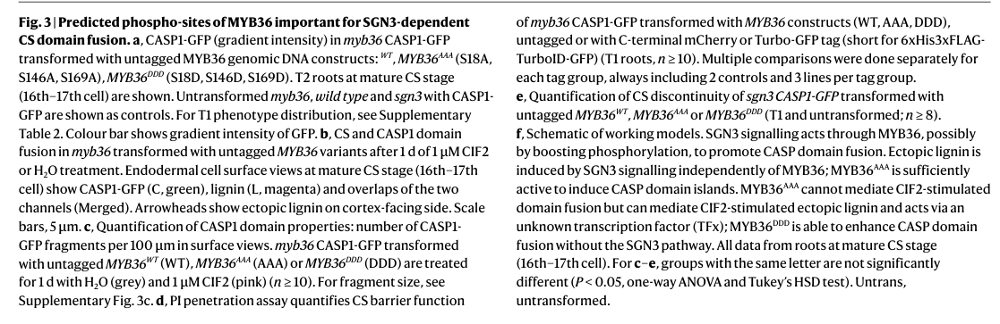

## Question

# Gene Research for Functional Annotation

## ⚠️ CRITICAL: Gene/Protein Identification Context

**BEFORE YOU BEGIN RESEARCH:** You MUST verify you are researching the CORRECT gene/protein. Gene symbols can be ambiguous, especially for less well-characterized genes from non-model organisms.

### Target Gene/Protein Identity (from UniProt):
- **UniProt Accession:** Q39026
- **Protein Description:** RecName: Full=Mitogen-activated protein kinase 6 {ECO:0000303|PubMed:8282107}; Short=AtMPK6 {ECO:0000303|PubMed:8282107}; Short=MAP kinase 6 {ECO:0000303|PubMed:8282107}; EC=2.7.11.24 {ECO:0000255|PROSITE-ProRule:PRU00159, ECO:0000269|PubMed:10713056, ECO:0000269|PubMed:10717008, ECO:0000269|PubMed:11123804, ECO:0000269|PubMed:21276203};
- **Gene Information:** Name=MPK6 {ECO:0000303|PubMed:8282107}; OrderedLocusNames=At2g43790 {ECO:0000312|Araport:AT2G43790}; ORFNames=F18O19.10 {ECO:0000312|EMBL:AAB64027.1};
- **Organism (full):** Arabidopsis thaliana (Mouse-ear cress).
- **Protein Family:** Belongs to the protein kinase superfamily. CMGC Ser/Thr
- **Key Domains:** Kinase-like_dom_sf. (IPR011009); MAP_kinase_CS. (IPR003527); MAPK. (IPR050117); Prot_kinase_dom. (IPR000719); Protein_kinase_ATP_BS. (IPR017441)

### MANDATORY VERIFICATION STEPS:

1. **Check if the gene symbol "MPK6" matches the protein description above**
2. **Verify the organism is correct:** Arabidopsis thaliana (Mouse-ear cress).
3. **Check if protein family/domains align with what you find in literature**
4. **If you find literature for a DIFFERENT gene with the same or similar symbol, STOP**

### If Gene Symbol is Ambiguous or You Cannot Find Relevant Literature:

**DO NOT PROCEED WITH RESEARCH ON A DIFFERENT GENE.** Instead:
- State clearly: "The gene symbol 'MPK6' is ambiguous or literature is limited for this specific protein"
- Explain what you found (e.g., "Found extensive literature on a different gene with the same symbol in a different organism")
- Describe the protein based ONLY on the UniProt information provided above
- Suggest that the protein function can be inferred from domain/family information

### Research Target:

Please provide a comprehensive research report on the gene **MPK6** (gene ID: MPK6, UniProt: Q39026) in ARATH.

The research report should be a detailed narrative explaining the function, biological processes, and localization of the gene product. Citations should be given for all claims.

You should prioritize authoritative reviews and primary scientific literature when conducting research. You can supplement
this with annotations you find in gene/protein databases, but these can be outdated or inaccurate.

We are specifically interested in the primary function of the gene - for enzymes, what reaction is catalyzed, and what is the substrate specificity? For transporters, what is the substrate? For structural proteins or adapters, what is the broader structural role? For signaling molecules, what is the role in the pathway.

We are interested in where in or outside the cell the gene product carries out its function.

We are also interested in the signaling or biochemical pathways in which the gene functions. We are less interested in broad pleiotropic effects, except where these elucidate the precise role.

Include evidence where possible. We are interested in both experimental evidence as well as inference from structure, evolution, or bioinformatic analysis. Precise studies should be prioritized over high-throughput, where available.

## Output

Question: You are an expert researcher providing comprehensive, well-cited information.

Provide detailed information focusing on:
1. Key concepts and definitions with current understanding
2. Recent developments and latest research (prioritize 2023-2024 sources)
3. Current applications and real-world implementations
4. Expert opinions and analysis from authoritative sources
5. Relevant statistics and data from recent studies

Format as a comprehensive research report with proper citations. Include URLs and publication dates where available.
Always prioritize recent, authoritative sources and provide specific citations for all major claims.

# Gene Research for Functional Annotation

## ⚠️ CRITICAL: Gene/Protein Identification Context

**BEFORE YOU BEGIN RESEARCH:** You MUST verify you are researching the CORRECT gene/protein. Gene symbols can be ambiguous, especially for less well-characterized genes from non-model organisms.

### Target Gene/Protein Identity (from UniProt):
- **UniProt Accession:** Q39026
- **Protein Description:** RecName: Full=Mitogen-activated protein kinase 6 {ECO:0000303|PubMed:8282107}; Short=AtMPK6 {ECO:0000303|PubMed:8282107}; Short=MAP kinase 6 {ECO:0000303|PubMed:8282107}; EC=2.7.11.24 {ECO:0000255|PROSITE-ProRule:PRU00159, ECO:0000269|PubMed:10713056, ECO:0000269|PubMed:10717008, ECO:0000269|PubMed:11123804, ECO:0000269|PubMed:21276203};
- **Gene Information:** Name=MPK6 {ECO:0000303|PubMed:8282107}; OrderedLocusNames=At2g43790 {ECO:0000312|Araport:AT2G43790}; ORFNames=F18O19.10 {ECO:0000312|EMBL:AAB64027.1};
- **Organism (full):** Arabidopsis thaliana (Mouse-ear cress).
- **Protein Family:** Belongs to the protein kinase superfamily. CMGC Ser/Thr
- **Key Domains:** Kinase-like_dom_sf. (IPR011009); MAP_kinase_CS. (IPR003527); MAPK. (IPR050117); Prot_kinase_dom. (IPR000719); Protein_kinase_ATP_BS. (IPR017441)

### MANDATORY VERIFICATION STEPS:

1. **Check if the gene symbol "MPK6" matches the protein description above**
2. **Verify the organism is correct:** Arabidopsis thaliana (Mouse-ear cress).
3. **Check if protein family/domains align with what you find in literature**
4. **If you find literature for a DIFFERENT gene with the same or similar symbol, STOP**

### If Gene Symbol is Ambiguous or You Cannot Find Relevant Literature:

**DO NOT PROCEED WITH RESEARCH ON A DIFFERENT GENE.** Instead:
- State clearly: "The gene symbol 'MPK6' is ambiguous or literature is limited for this specific protein"
- Explain what you found (e.g., "Found extensive literature on a different gene with the same symbol in a different organism")
- Describe the protein based ONLY on the UniProt information provided above
- Suggest that the protein function can be inferred from domain/family information

### Research Target:

Please provide a comprehensive research report on the gene **MPK6** (gene ID: MPK6, UniProt: Q39026) in ARATH.

The research report should be a detailed narrative explaining the function, biological processes, and localization of the gene product. Citations should be given for all claims.

You should prioritize authoritative reviews and primary scientific literature when conducting research. You can supplement
this with annotations you find in gene/protein databases, but these can be outdated or inaccurate.

We are specifically interested in the primary function of the gene - for enzymes, what reaction is catalyzed, and what is the substrate specificity? For transporters, what is the substrate? For structural proteins or adapters, what is the broader structural role? For signaling molecules, what is the role in the pathway.

We are interested in where in or outside the cell the gene product carries out its function.

We are also interested in the signaling or biochemical pathways in which the gene functions. We are less interested in broad pleiotropic effects, except where these elucidate the precise role.

Include evidence where possible. We are interested in both experimental evidence as well as inference from structure, evolution, or bioinformatic analysis. Precise studies should be prioritized over high-throughput, where available.

## Comprehensive Research Report: Arabidopsis thaliana **MPK6** (UniProt **Q39026**, gene **MPK6/At2g43790**) Functional Annotation

### 0) Identity verification (mandatory)
The target described in UniProt entry **Q39026** corresponds to **Arabidopsis thaliana Mitogen-activated protein kinase 6 (AtMPK6 / MAP kinase 6)**, a **CMGC family Ser/Thr MAP kinase** that functions as the terminal kinase in canonical three-tier MAPK cascades (MAP3K→MAP2K→MAPK). Reviews compiling experimentally validated MAPK substrates explicitly discuss **Arabidopsis MPK6** and its hallmark role as a **proline-directed kinase** phosphorylating Ser/Thr residues in MAPK target motifs and docking-motif–mediated substrate recognition, consistent with the UniProt identity and family/domain assignment. (doczi2018thequestfor pages 5-7, doczi2018thequestfor pages 7-8)

### 1) Key concepts and current understanding

#### 1.1 MAPK cascade concept and MPK6’s biochemical role
MAPKs are terminal kinases in a conserved signaling architecture in which upstream kinases sequentially activate MAP2Ks and then MAPKs. MPK6 functions as a proline-directed MAP kinase that phosphorylates downstream substrates including transcription factors, enzymes, RNA-metabolism proteins, and developmental regulators, often redundantly with MPK3. (doczi2018thequestfor pages 5-7, doczi2018thequestfor pages 10-12)

A central mechanistic principle is that MAPK output specificity is shaped by **(i)** which upstream MAP3K/MAP2K modules activate MPK6, **(ii)** spatial compartmentalization (e.g., nucleus vs cytoplasmic granules), and **(iii)** substrate docking interactions and phosphorylation-site context. Reviews emphasize that substrate identification and validation typically uses interaction assays (e.g., BiFC/FRET/Y2H), phosphosite mapping and mutagenesis (phospho-dead/phosphomimic), and genetic epistasis. (doczi2018thequestfor pages 5-7, jiang2022mitogenactivatedproteinkinase pages 16-17)

#### 1.2 Substrate spectrum (direct/validated targets)
Authoritative synthesis of MPK6 substrates includes:
- **Ethylene biosynthesis and signaling**: MPK6 phosphorylates ACC synthase isoforms (e.g., ACS6) to affect stability and ethylene output; MPK3/MPK6 can also phosphorylate EIN3 at distinct sites with opposing stability outcomes (stabilization vs degradation), illustrating bifurcating regulation in ethylene signaling. (doczi2018thequestfor pages 5-7)
- **Pattern-triggered immunity (PTI)**: MPK6 phosphorylates the transcription factor **ERF104** in vivo upon flg22 signaling, promoting its release and downstream ethylene/defense gene regulation. (jiang2022mitogenactivatedproteinkinase pages 9-10)
- **Development (stomatal lineage)**: MPK3/MPK6 phosphorylate **SPEECHLESS (SPCH)** downstream of the YODA–MKK4/5 module, modulating stomatal initiation and lineage progression. (jiang2022mitogenactivatedproteinkinase pages 9-10)
- **Abiotic stress TFs and regulators**: compiled substrates include **MYB41, MYB15, HsfA2, ICE1, DCP1** among others, with outcomes such as enhanced DNA binding, altered protein stability, and nuclear accumulation. (doczi2018thequestfor pages 10-12, doczi2018thequestfor pages 7-8)

These curated substrate lists represent the strongest available consensus on MPK6 biochemical function because they are based on multiple independent experimental demonstrations across contexts. (doczi2018thequestfor pages 7-8, jiang2022mitogenactivatedproteinkinase pages 9-10)

### 2) Recent developments and latest research (prioritize 2023–2024)

#### 2.1 Signaling specificity in a shared MPK hub (Nature Plants, 2024)
A key 2024 development is the demonstration that two different receptor pathways (a developmental pathway centered on **SGN3/CIF peptides** and an immune pathway centered on **FLS2/flg22**) can maintain **distinct functional and transcriptional outputs** within the same cell type (Arabidopsis root endodermis), even though both converge on MPK cascades. The study proposes that **combinatorial activation** across MPK cascade components can generate pathway specificity. (ma2024comparisonsoftwo pages 1-2)

Mechanistically, the work provides evidence that **MYB36 predicted phosphosites** (tested via phospho-null MYB36AAA and phosphomimic MYB36DDD constructs) are important for SGN3-dependent outputs such as CASP domain fusion, consistent with MPK-dependent control of an endodermal master transcription factor. (ma2024comparisonsoftwo pages 6-7, ma2024comparisonsoftwo media 51e9261a)

#### 2.2 Quantitative dynamics of MPK6 activation under redox perturbation (bioRxiv, 2024)
Yang et al. (posted Jan 17, 2024) report that the oxidative-stress–associated **cat2-1** background shows **hypersensitivity of MPK3 and MPK6 activation to flg22**. Quantitatively, MAPK3/6 activation is detected after **10 min** of flg22 treatment and peaks after **20 min**, but is **more abundant and longer maintained in cat2-1** than in Col-0. They also note that pad2-1 accumulates ~**20%** of the glutathione level of Col-0, highlighting glutathione homeostasis as a modifier of immune MAPK kinetics. (yang2024mapkactivityand pages 7-9)

This work additionally emphasizes the regulatory role of dual-specificity phosphatases (notably MKP2) as negative regulators of MPK3/6 signaling intensity/duration under oxidative stress. (yang2024mapkactivityand pages 1-3, yang2024mapkactivityand pages 11-13)

#### 2.3 Subcellular organization: MPK3/6 in stress granules and P-bodies (bioRxiv, 2024)
He et al. (posted Nov 2, 2024) extend MPK6 biology into the realm of **biomolecular condensates**, reporting that **TZF1–MPK3/6–MKK4/5** form an interaction network in stress granules (SGs). They propose that **MAPK-mediated phosphorylation** drives redistribution of the PB component **DCP1** (decreased partition to P-bodies and increased assembly into SGs). They further support phosphorylation dependence using DCP1 phospho-dead (S237A) vs phosphomimetic (S237D) variants with different PB/SG preferences. (he2024mapksignalingmodulates pages 1-4)

This is a notable conceptual update: MPK6 is not only a nucleus-centered signaling kinase but can also help regulate post-transcriptional gene regulation environments (PB/SG dynamics). (he2024mapksignalingmodulates pages 1-4, he2024mapksignalingmodulates pages 9-11)

#### 2.4 Updated pathway context reviews (2023)
A 2023 MAP3K review places MPK6 within multiple upstream immune and developmental modules, including the **MEKK1–MKK4/5–MPK3/MPK6** PTI module downstream of FLS2 that contributes to pathogen resistance, and notes that negative regulators (e.g., EDR1) can constrain the MKK4/MKK5→MPK3/6 axis. (xie2023mapkkksinplants pages 8-10)

A 2023 review of asymmetric cell division highlights stomatal lineage control, including SPCH-centered transitions, and provides updated conceptual framing in which MAPK modules (including MPK6-linked cascades) regulate asymmetric division decisions through transcription-factor state changes. (zhang2023asymmetriccelldivision pages 6-8)

### 3) Biological processes, pathways, and localization (functional narrative)

#### 3.1 Immunity and PTI/ETI integration
MPK6 is a core component of immune MAPK cascades activated by pattern recognition receptors. Review evidence in 2024 emphasizes that PRR signaling (e.g., FLS2 stimulated by flg22) activates MAP3K modules (MAPKKK3/5) and downstream MPK3/6; PTI induces rapid/transient MAPK activation whereas ETI can lead to sustained activity, and MPK3/MPK6 phosphorylation is linked to hormone outputs including ethylene via ACS2/ACS6. (yu2024pti‐etisynergisticsignal pages 5-6)

In addition, MPK6 participates in substrate-specific PTI signaling such as ERF104 phosphorylation/release and ethylene/defense gene regulation. (jiang2022mitogenactivatedproteinkinase pages 9-10)

#### 3.2 Ethylene biosynthesis as a primary mechanistic output channel
A major well-defined MPK6 biochemical function is phosphorylation-dependent regulation of ethylene biosynthesis by targeting ACS enzymes. Stabilization of ACS6 after MPK6 phosphorylation links upstream stress/immune activation to increased ethylene production. (doczi2018thequestfor pages 5-7, jiang2022mitogenactivatedproteinkinase pages 9-10)

#### 3.3 Development: stomatal lineage and endodermal barrier formation
MPK6 participates in the canonical stomatal-development module (YODA–MKK4/5–MPK3/6) that phosphorylates SPCH and regulates stomatal initiation/differentiation programs. (jiang2022mitogenactivatedproteinkinase pages 9-10)

In the root endodermis, a 2024 Nature Plants study shows MPK cascade components operate as a “common hub” but can still maintain pathway specificity between developmental SGN3 outputs (Casparian strip domain fusion) and FLS2 immune outputs, with evidence implicating MPK-dependent regulation of MYB36. (ma2024comparisonsoftwo pages 1-2, ma2024comparisonsoftwo pages 6-7)

#### 3.4 Subcellular localization: nucleus, cytoplasm, and condensates
MPK6 substrates include transcription factors and nuclear regulators (e.g., HsfA2 nuclear accumulation) as well as cytoplasmic/post-transcriptional regulators (e.g., DCP1). This implies a functional distribution spanning nucleus and cytoplasm. (doczi2018thequestfor pages 10-12, doczi2018thequestfor pages 7-8)

Recent work directly addresses cytoplasmic granule association: MPK3/6 and MKK4/5 interactions occur mainly in stress granules, and some MPK3/6 interactions are also observed in the nucleus; MPK signaling is proposed to control PB↔SG partitioning of DCP1. (he2024mapksignalingmodulates pages 1-4, he2024mapksignalingmodulates pages 9-11)

### 4) Current applications and real-world implementations

#### 4.1 Chemical genetics and pathway dissection tools
A state-of-the-art implementation is the use of **analog-sensitive MPK alleles** to achieve acute inhibition without the lethality of mpk3 mpk6 double mutants. In Ma et al. (Nature Plants, published online 10 Sep 2024), conditional loss-of-function lines expressing **pMPK6::MPK6YG** (and pMPK3::MPK3TG) are inhibited by **NM-PP1**, and short-term (1 day) inhibitor treatment delayed a barrier-related PI-block readout without broad developmental defects, enabling causal inference about MPK requirements in endodermal signaling. (ma2024comparisonsoftwo pages 6-7, ma2024comparisonsoftwo pages 14-15, ma2024comparisonsoftwo media 0c50f08e)

The same paper also leverages the bacterial effector **HopAI1** (which deactivates multiple MPKs including MPK3/4/6) in an inducible, tissue-specific manner to perturb MPK outputs while minimizing pleiotropy. (ma2024comparisonsoftwo pages 6-7)

#### 4.2 Immunostimulant/priming concepts with MAPK phosphorylation readouts
Fuertes-Rabanal et al. (posted May 30, 2024) present β-1,2-glucan trisaccharide (B2G3) as an elicitor that triggers PTI hallmarks including ROS and MAPK phosphorylation. They also show disease-protection/priming-like outcomes in multiple species: in Arabidopsis, B2G3 pretreatment reduces Pseudomonas syringae DC3000 growth at 3 dpi; in maize, B2G3 pretreatment reduces fungal genomic DNA at 4 dpi after Colletotrichum graminicola infection; in wheat, B2G3 pretreatment reduces lesion area and pycnidia density after Zymoseptoria tritici infection. These results illustrate how MPK3/6 phosphorylation is used as a mechanistic biomarker in translational plant immunity approaches. (fuertesrabanal2024linearβ12glucanstrigger pages 11-13, fuertesrabanal2024linearβ12glucanstrigger pages 1-4)

### 5) Expert analysis and authoritative synthesis (how experts interpret MPK6)

Across authoritative reviews, MPK6 is consistently treated as a **signaling hub** with multiple upstream modules and diverse substrates, where specificity emerges from docking interactions, combinatorial pathway usage, and spatiotemporal activation patterns rather than one-to-one “one kinase–one pathway” mapping. (doczi2018thequestfor pages 5-7, xie2023mapkkksinplants pages 8-10)

The 2024 Nature Plants analysis operationalizes this “hub specificity” problem in a single cell type and supports a model in which pathway-specific receptor inputs achieve distinct outputs through differential activation of MPK cascade components and downstream transcription-factor regulation (e.g., MYB36). (ma2024comparisonsoftwo pages 1-2, ma2024comparisonsoftwo pages 6-7)

### 6) Relevant statistics and quantitative data (recent studies)

- **flg22 activation kinetics (2024 preprint)**: MPK3/6 activation detectable after **10 min** and peaking at **20 min** after flg22 exposure; higher amplitude and longer maintenance in **cat2-1** than Col-0. (yang2024mapkactivityand pages 7-9)
- **glutathione genotype statistic (2007 result cited in 2024 preprint)**: pad2-1 contains ~**20%** of Col-0 glutathione amount. (yang2024mapkactivityand pages 7-9)
- **Endodermal pathway assays (Nature Plants 2024)**: experimental designs include **1 µM CIF2** treatments for **1 day** before analysis; inhibitor **NM-PP1** used at **5 µM** in agar medium (methods) to inhibit analog-sensitive MPK alleles; quantitative plots show CASP1 fragment/coverage measures and PI penetration assays to quantify barrier function and signaling outputs. (ma2024comparisonsoftwo pages 6-7, ma2024comparisonsoftwo pages 14-15, ma2024comparisonsoftwo media 51e9261a)
- **Cellooligomer response phosphosite (2022)**: phosphoproteomics identified increased phosphorylation of MPK6 at **Tyr223** in response contexts linked to cellooligomer-induced responses. (tseng2022cork1alrrmalectin pages 8-11)

### Consolidated evidence map
The following table summarizes the functional landscape, emphasizing 2023–2024 developments and quantitative evidence.

| Category | Key points | Evidence/citations | Source URL/date |
|---|---|---|---|
| Biochemical function | Proline-directed CMGC MAP kinase; terminal kinase in MAPK cascades activated by dual Thr/Tyr phosphorylation in the TxY motif; phosphorylates protein substrates such as ACS6, SPCH, ERF104, MYB41, DCP1, HsfA2 and others to alter stability, localization, DNA binding, or signaling output. | (doczi2018thequestfor pages 5-7, doczi2018thequestfor pages 10-12, jiang2022mitogenactivatedproteinkinase pages 9-10, andreasson2010convergenceandspecificity pages 7-8, yang2024mapkactivityand pages 1-3) | Dóczi & Bögre 2018, https://doi.org/10.1016/j.tplants.2018.08.002, Oct 2018; Jiang et al. 2022, https://doi.org/10.3390/ijms23052744, Mar 2022; Andreasson & Ellis 2010, https://doi.org/10.1016/j.tplants.2009.12.001, Feb 2010; Yang et al. 2024, https://doi.org/10.1101/2024.01.15.575793, posted 17 Jan 2024 |
| Upstream activation | Activated downstream of multiple modules: MEKK1–MKK4/5–MPK3/6 in PTI downstream of FLS2; MAP3K3/5–MKK4/5–MPK3/6 in immunity; YDA/MAP3K4–MKK4/5–MPK3/6 in development; MKK9–MPK3/6 in ethylene signaling; OXI1-linked ROS activation; oxidative stress and flg22 strongly enhance MPK6 activation. | (jiang2022mitogenactivatedproteinkinase pages 4-6, xie2023mapkkksinplants pages 8-10, ma2024comparisonsoftwo pages 6-7, yang2024mapkactivityand pages 7-9, yu2024pti‐etisynergisticsignal pages 5-6) | Jiang et al. 2022, https://doi.org/10.3390/ijms23052744, Mar 2022; Xie et al. 2023, https://doi.org/10.3390/ijms24044117, Feb 2023; Ma et al. 2024, https://doi.org/10.1038/s41477-024-01768-y, published online 10 Sep 2024; Yang et al. 2024, https://doi.org/10.1101/2024.01.15.575793, posted 17 Jan 2024; Yu et al. 2024, https://doi.org/10.1111/pbi.14332, Mar 2024 |
| Direct substrates | Validated/compiled substrates include ACS6 and ACS2 (ethylene biosynthesis), SPCH (stomatal initiation), ERF104 and ERF6 (defense/ethylene signaling), EIN3 (site-specific stabilization vs degradation), WRKY33 and other WRKYs, MYB41, MYB15, HsfA2, ICE1, DCP1, EB1c, MAP65-1-associated targets, and likely MYB36-regulatory phosphosites in endodermal signaling. | (doczi2018thequestfor pages 5-7, doczi2018thequestfor pages 10-12, doczi2018thequestfor pages 7-8, jiang2022mitogenactivatedproteinkinase pages 9-10, ma2024comparisonsoftwo pages 6-7) | Dóczi & Bögre 2018, https://doi.org/10.1016/j.tplants.2018.08.002, Oct 2018; Jiang et al. 2022, https://doi.org/10.3390/ijms23052744, Mar 2022; Ma et al. 2024, https://doi.org/10.1038/s41477-024-01768-y, published online 10 Sep 2024 |
| Biological processes | Central roles in pattern-triggered immunity, ethylene biosynthesis/signaling, ROS and oxidative stress responses, salt/heat/cold responses, stomatal lineage control, cytokinesis/cell division, reproductive development, root/endodermal barrier signaling, and light-regulated development including cotyledon opening. | (doczi2018thequestfor pages 10-12, jiang2022mitogenactivatedproteinkinase pages 4-6, jaggi2018recentadvancementon pages 11-14, xie2023mapkkksinplants pages 8-10, zhang2023asymmetriccelldivision pages 6-8, huang2023shadeinducedrtfldvlpeptides pages 8-9, ma2024comparisonsoftwo pages 6-7, yu2024pti‐etisynergisticsignal pages 5-6, yu2024pti‐etisynergisticsignal pages 9-10) | Dóczi & Bögre 2018, https://doi.org/10.1016/j.tplants.2018.08.002, Oct 2018; Jiang et al. 2022, https://doi.org/10.3390/ijms23052744, Mar 2022; Xie et al. 2023, https://doi.org/10.3390/ijms24044117, Feb 2023; Zhang et al. 2023, https://doi.org/10.1111/jipb.13446, Feb 2023; Huang et al. 2023, https://doi.org/10.1038/s41467-023-42618-3, Oct 2023; Ma et al. 2024, https://doi.org/10.1038/s41477-024-01768-y, published online 10 Sep 2024; Yu et al. 2024, https://doi.org/10.1111/pbi.14332, Mar 2024 |
| Localization | Functions in both nucleus and cytoplasm; stress/development substrates imply nuclear action on TFs; DCP1 and SG/PB work shows cytoplasmic granule-associated roles; MPK3/6 and MKK4/5 interactions occur in SGs, with some MPK3/6 interactions also in nucleus; classic reports note stress-triggered nuclear translocation of MAPKs. | (doczi2018thequestfor pages 10-12, doczi2018thequestfor pages 7-8, andreasson2010convergenceandspecificity pages 7-8, he2024mapksignalingmodulates pages 1-4, he2024mapksignalingmodulates pages 9-11) | Andreasson & Ellis 2010, https://doi.org/10.1016/j.tplants.2009.12.001, Feb 2010; Dóczi & Bögre 2018, https://doi.org/10.1016/j.tplants.2018.08.002, Oct 2018; He et al. 2024, https://doi.org/10.1101/2024.10.31.621288, posted 2 Nov 2024 |
| Recent 2023-2024 developments | 2024 Nature Plants: pathway specificity in root endodermis can be generated despite shared MPK activity; MYB36 phosphosites are important for SGN3-dependent CASP domain fusion and conditional MPK6 tools support requirement for MPK activity. 2024 bioRxiv: cat2-1 shows MPK3/6 hypersensitivity to flg22 under altered glutathione homeostasis. 2024 bioRxiv: MAPK signaling drives DCP1 relocalization from PBs to SGs via DCP1 phosphorylation. 2023 reviews frame MPK6 as shared hub between development and immunity. | (ma2024comparisonsoftwo pages 6-7, yang2024mapkactivityand pages 7-9, yang2024mapkactivityand pages 11-13, he2024mapksignalingmodulates pages 1-4, he2024mapksignalingmodulates pages 9-11, xie2023mapkkksinplants pages 8-10, zhang2023asymmetriccelldivision pages 6-8) | Ma et al. 2024, https://doi.org/10.1038/s41477-024-01768-y, published online 10 Sep 2024; Yang et al. 2024, https://doi.org/10.1101/2024.01.15.575793, posted 17 Jan 2024; He et al. 2024, https://doi.org/10.1101/2024.10.31.621288, posted 2 Nov 2024; Xie et al. 2023, https://doi.org/10.3390/ijms24044117, Feb 2023; Zhang et al. 2023, https://doi.org/10.1111/jipb.13446, Feb 2023 |
| Applications & tools | Chemical/genetic tools include NM-PP1-sensitive MPK6YG and MPK3TG conditional lines, constitutively active kinase modules, HopAI1 effector-mediated MPK inactivation, phosphomimic/phosphodead substrate variants, substrate-docking and phosphoproteomic approaches; MPK6-centered signaling is also leveraged conceptually for priming/immunostimulant studies and crop engineering by ortholog transfer. | (jiang2022mitogenactivatedproteinkinase pages 16-17, ma2024comparisonsoftwo pages 6-7, ma2024comparisonsoftwo pages 14-15, fuertesrabanal2024linearβ12glucanstrigger pages 1-4) | Jiang et al. 2022, https://doi.org/10.3390/ijms23052744, Mar 2022; Ma et al. 2024, https://doi.org/10.1038/s41477-024-01768-y, published online 10 Sep 2024; Fuertes-Rabanal et al. 2024, https://doi.org/10.1101/2024.05.30.596602, posted 30 May 2024 |
| Quantitative data | cat2-1 and Col-0 both show MPK3/6 activation by flg22 by 10 min with a peak at 20 min, but activity is stronger and longer in cat2-1; pad2-1 has ~20% of Col-0 glutathione; in Ma et al., 1-day treatment with NM-PP1 delayed PI block without major developmental defects, and 1 µM CIF2 for 1 day was used to assay MYB36 phosphosite function; Tseng et al. reported Tyr223 phosphorylation increase of MPK6 in cellooligomer response; B2G3 pretreatment reduced Pst DC3000 growth at 3 dpi and protected hypersusceptible pgm plants against C. higginsianum at 3.5 dpi, with crop protection effects also observed in maize (4 dpi) and wheat. | (yang2024mapkactivityand pages 7-9, ma2024comparisonsoftwo pages 6-7, ma2024comparisonsoftwo pages 14-15, tseng2022cork1alrrmalectin pages 8-11, fuertesrabanal2024linearβ12glucanstrigger pages 11-13) | Yang et al. 2024, https://doi.org/10.1101/2024.01.15.575793, posted 17 Jan 2024; Ma et al. 2024, https://doi.org/10.1038/s41477-024-01768-y, published online 10 Sep 2024; Tseng et al. 2022, https://doi.org/10.3390/cells11192960, Sep 2022; Fuertes-Rabanal et al. 2024, https://doi.org/10.1101/2024.05.30.596602, posted 30 May 2024 |

*Table: This table summarizes verified functions, pathways, substrates, localization, recent developments, tools, and quantitative findings for Arabidopsis thaliana MPK6 (UniProt Q39026). It is designed as a compact evidence map for building a comprehensive functional annotation report.*

### References (URLs and publication dates as available in evidence)
- Ma Y. et al. *Nature Plants* — Published online **10 Sep 2024**. DOI: https://doi.org/10.1038/s41477-024-01768-y (ma2024comparisonsoftwo pages 1-2, ma2024comparisonsoftwo pages 6-7, ma2024comparisonsoftwo pages 14-15)
- Yang Y. et al. *bioRxiv* — Posted **17 Jan 2024**. DOI: https://doi.org/10.1101/2024.01.15.575793 (yang2024mapkactivityand pages 1-3, yang2024mapkactivityand pages 7-9, yang2024mapkactivityand pages 11-13)
- He S.-L. et al. *bioRxiv* — Posted **2 Nov 2024**. DOI: https://doi.org/10.1101/2024.10.31.621288 (he2024mapksignalingmodulates pages 1-4, he2024mapksignalingmodulates pages 9-11)
- Xie C. et al. *Int. J. Mol. Sci.* — **Feb 2023**. DOI: https://doi.org/10.3390/ijms24044117 (xie2023mapkkksinplants pages 8-10)
- Zhang Y. et al. *J Integr Plant Biol* — **Feb 2023** (PMC author manuscript May 2023). DOI: https://doi.org/10.1111/jipb.13446 (zhang2023asymmetriccelldivision pages 6-8)
- Dóczi R., Bögre L. *Trends Plant Sci.* — **Oct 2018**. DOI: https://doi.org/10.1016/j.tplants.2018.08.002 (doczi2018thequestfor pages 5-7, doczi2018thequestfor pages 10-12, doczi2018thequestfor pages 7-8)
- Jiang M. et al. *Int. J. Mol. Sci.* — **Mar 2022**. DOI: https://doi.org/10.3390/ijms23052744 (jiang2022mitogenactivatedproteinkinase pages 4-6, jiang2022mitogenactivatedproteinkinase pages 9-10)
- Yu X.-Q. et al. *Plant Biotechnology Journal* — **Mar 2024**. DOI: https://doi.org/10.1111/pbi.14332 (yu2024pti‐etisynergisticsignal pages 5-6, yu2024pti‐etisynergisticsignal pages 9-10)
- Fuertes-Rabanal M. et al. *bioRxiv* — Posted **30 May 2024**. DOI: https://doi.org/10.1101/2024.05.30.596602 (fuertesrabanal2024linearβ12glucanstrigger pages 11-13, fuertesrabanal2024linearβ12glucanstrigger pages 1-4)

References

1. (doczi2018thequestfor pages 5-7): Róbert Dóczi and László Bögre. The quest for map kinase substrates: gaining momentum. Trends in plant science, 23 10:918-932, Oct 2018. URL: https://doi.org/10.1016/j.tplants.2018.08.002, doi:10.1016/j.tplants.2018.08.002. This article has 55 citations and is from a domain leading peer-reviewed journal.

2. (doczi2018thequestfor pages 7-8): Róbert Dóczi and László Bögre. The quest for map kinase substrates: gaining momentum. Trends in plant science, 23 10:918-932, Oct 2018. URL: https://doi.org/10.1016/j.tplants.2018.08.002, doi:10.1016/j.tplants.2018.08.002. This article has 55 citations and is from a domain leading peer-reviewed journal.

3. (doczi2018thequestfor pages 10-12): Róbert Dóczi and László Bögre. The quest for map kinase substrates: gaining momentum. Trends in plant science, 23 10:918-932, Oct 2018. URL: https://doi.org/10.1016/j.tplants.2018.08.002, doi:10.1016/j.tplants.2018.08.002. This article has 55 citations and is from a domain leading peer-reviewed journal.

4. (jiang2022mitogenactivatedproteinkinase pages 16-17): Min Jiang, You-tao Zhang, Peng Li, Jinjing Jian, Changling Zhao, and Guosong Wen. Mitogen-activated protein kinase and substrate identification in plant growth and development. International Journal of Molecular Sciences, 23:2744, Mar 2022. URL: https://doi.org/10.3390/ijms23052744, doi:10.3390/ijms23052744. This article has 66 citations.

5. (jiang2022mitogenactivatedproteinkinase pages 9-10): Min Jiang, You-tao Zhang, Peng Li, Jinjing Jian, Changling Zhao, and Guosong Wen. Mitogen-activated protein kinase and substrate identification in plant growth and development. International Journal of Molecular Sciences, 23:2744, Mar 2022. URL: https://doi.org/10.3390/ijms23052744, doi:10.3390/ijms23052744. This article has 66 citations.

6. (ma2024comparisonsoftwo pages 1-2): Yan Ma, Isabelle Flückiger, Jade Nicolet, Jia Pang, Joe B. Dickinson, Damien De Bellis, Aurélia Emonet, Satoshi Fujita, and Niko Geldner. Comparisons of two receptor-mapk pathways in a single cell-type reveal mechanisms of signalling specificity. Nature Plants, 10:1343-1362, Sep 2024. URL: https://doi.org/10.1038/s41477-024-01768-y, doi:10.1038/s41477-024-01768-y. This article has 18 citations and is from a highest quality peer-reviewed journal.

7. (ma2024comparisonsoftwo pages 6-7): Yan Ma, Isabelle Flückiger, Jade Nicolet, Jia Pang, Joe B. Dickinson, Damien De Bellis, Aurélia Emonet, Satoshi Fujita, and Niko Geldner. Comparisons of two receptor-mapk pathways in a single cell-type reveal mechanisms of signalling specificity. Nature Plants, 10:1343-1362, Sep 2024. URL: https://doi.org/10.1038/s41477-024-01768-y, doi:10.1038/s41477-024-01768-y. This article has 18 citations and is from a highest quality peer-reviewed journal.

8. (ma2024comparisonsoftwo media 51e9261a): Yan Ma, Isabelle Flückiger, Jade Nicolet, Jia Pang, Joe B. Dickinson, Damien De Bellis, Aurélia Emonet, Satoshi Fujita, and Niko Geldner. Comparisons of two receptor-mapk pathways in a single cell-type reveal mechanisms of signalling specificity. Nature Plants, 10:1343-1362, Sep 2024. URL: https://doi.org/10.1038/s41477-024-01768-y, doi:10.1038/s41477-024-01768-y. This article has 18 citations and is from a highest quality peer-reviewed journal.

9. (yang2024mapkactivityand pages 7-9): Yingxue Yang, Sanja Matern, Heike Steininger, Marcos Hamborg Vinde, Thomas Rausch, and Tanja Peskan-Berghöfer. Mapk activity and map kinase phosphatase 2 (atmkp2) protein stability under altered glutathione homeostasis in arabidopsis thaliana. bioRxiv, Jan 2024. URL: https://doi.org/10.1101/2024.01.15.575793, doi:10.1101/2024.01.15.575793. This article has 2 citations.

10. (yang2024mapkactivityand pages 1-3): Yingxue Yang, Sanja Matern, Heike Steininger, Marcos Hamborg Vinde, Thomas Rausch, and Tanja Peskan-Berghöfer. Mapk activity and map kinase phosphatase 2 (atmkp2) protein stability under altered glutathione homeostasis in arabidopsis thaliana. bioRxiv, Jan 2024. URL: https://doi.org/10.1101/2024.01.15.575793, doi:10.1101/2024.01.15.575793. This article has 2 citations.

11. (yang2024mapkactivityand pages 11-13): Yingxue Yang, Sanja Matern, Heike Steininger, Marcos Hamborg Vinde, Thomas Rausch, and Tanja Peskan-Berghöfer. Mapk activity and map kinase phosphatase 2 (atmkp2) protein stability under altered glutathione homeostasis in arabidopsis thaliana. bioRxiv, Jan 2024. URL: https://doi.org/10.1101/2024.01.15.575793, doi:10.1101/2024.01.15.575793. This article has 2 citations.

12. (he2024mapksignalingmodulates pages 1-4): Siou-Luan He, Ying Wang, Libo Shan, Ping He, and Jyan-Chyun Jang. Mapk signaling modulates the partition of dcp1 between p-bodies and stress granules in plant cells. bioRxiv, Nov 2024. URL: https://doi.org/10.1101/2024.10.31.621288, doi:10.1101/2024.10.31.621288. This article has 1 citations.

13. (he2024mapksignalingmodulates pages 9-11): Siou-Luan He, Ying Wang, Libo Shan, Ping He, and Jyan-Chyun Jang. Mapk signaling modulates the partition of dcp1 between p-bodies and stress granules in plant cells. bioRxiv, Nov 2024. URL: https://doi.org/10.1101/2024.10.31.621288, doi:10.1101/2024.10.31.621288. This article has 1 citations.

14. (xie2023mapkkksinplants pages 8-10): Chen Xie, Liu Yang, and Yingping Gai. Mapkkks in plants: multidimensional regulators of plant growth and stress responses. International Journal of Molecular Sciences, 24:4117, Feb 2023. URL: https://doi.org/10.3390/ijms24044117, doi:10.3390/ijms24044117. This article has 50 citations.

15. (zhang2023asymmetriccelldivision pages 6-8): Yi Zhang, Tongda Xu, and Juan Dong. Asymmetric cell division in plant development. Journal of Integrative Plant Biology, 65:343-370, Feb 2023. URL: https://doi.org/10.1111/jipb.13446, doi:10.1111/jipb.13446. This article has 30 citations and is from a peer-reviewed journal.

16. (yu2024pti‐etisynergisticsignal pages 5-6): Xiao‐Qian Yu, Hao‐Qiang Niu, Chao Liu, Hou‐Ling Wang, Weilun Yin, and Xinli Xia. Pti‐eti synergistic signal mechanisms in plant immunity. Plant Biotechnology Journal, 22:2113-2128, Mar 2024. URL: https://doi.org/10.1111/pbi.14332, doi:10.1111/pbi.14332. This article has 244 citations and is from a highest quality peer-reviewed journal.

17. (ma2024comparisonsoftwo pages 14-15): Yan Ma, Isabelle Flückiger, Jade Nicolet, Jia Pang, Joe B. Dickinson, Damien De Bellis, Aurélia Emonet, Satoshi Fujita, and Niko Geldner. Comparisons of two receptor-mapk pathways in a single cell-type reveal mechanisms of signalling specificity. Nature Plants, 10:1343-1362, Sep 2024. URL: https://doi.org/10.1038/s41477-024-01768-y, doi:10.1038/s41477-024-01768-y. This article has 18 citations and is from a highest quality peer-reviewed journal.

18. (ma2024comparisonsoftwo media 0c50f08e): Yan Ma, Isabelle Flückiger, Jade Nicolet, Jia Pang, Joe B. Dickinson, Damien De Bellis, Aurélia Emonet, Satoshi Fujita, and Niko Geldner. Comparisons of two receptor-mapk pathways in a single cell-type reveal mechanisms of signalling specificity. Nature Plants, 10:1343-1362, Sep 2024. URL: https://doi.org/10.1038/s41477-024-01768-y, doi:10.1038/s41477-024-01768-y. This article has 18 citations and is from a highest quality peer-reviewed journal.

19. (fuertesrabanal2024linearβ12glucanstrigger pages 11-13): María Fuertes-Rabanal, Asier Largo-Gosens, Alicia Fischer, Kristina S. Munzert, Cristian Carrasco-López, Andrea Sánchez-Vallet, Timo Engelsdorf, and Hugo Mélida. Linear β-1,2-glucans trigger immune hallmarks and disease resistance in plants. bioRxiv, May 2024. URL: https://doi.org/10.1101/2024.05.30.596602, doi:10.1101/2024.05.30.596602. This article has 1 citations.

20. (fuertesrabanal2024linearβ12glucanstrigger pages 1-4): María Fuertes-Rabanal, Asier Largo-Gosens, Alicia Fischer, Kristina S. Munzert, Cristian Carrasco-López, Andrea Sánchez-Vallet, Timo Engelsdorf, and Hugo Mélida. Linear β-1,2-glucans trigger immune hallmarks and disease resistance in plants. bioRxiv, May 2024. URL: https://doi.org/10.1101/2024.05.30.596602, doi:10.1101/2024.05.30.596602. This article has 1 citations.

21. (tseng2022cork1alrrmalectin pages 8-11): Yu-Heng Tseng, Sandra S. Scholz, Judith Fliegmann, Thomas Krüger, Akanksha Gandhi, Alexandra C. U. Furch, Olaf Kniemeyer, Axel A. Brakhage, and Ralf Oelmüller. Cork1, a lrr-malectin receptor kinase, is required for cellooligomer-induced responses in arabidopsis thaliana. Cells, 11:2960, Sep 2022. URL: https://doi.org/10.3390/cells11192960, doi:10.3390/cells11192960. This article has 56 citations.

22. (andreasson2010convergenceandspecificity pages 7-8): Erik Andreasson and Brian Ellis. Convergence and specificity in the arabidopsis mapk nexus. Trends in plant science, 15 2:106-13, Feb 2010. URL: https://doi.org/10.1016/j.tplants.2009.12.001, doi:10.1016/j.tplants.2009.12.001. This article has 303 citations and is from a domain leading peer-reviewed journal.

23. (jiang2022mitogenactivatedproteinkinase pages 4-6): Min Jiang, You-tao Zhang, Peng Li, Jinjing Jian, Changling Zhao, and Guosong Wen. Mitogen-activated protein kinase and substrate identification in plant growth and development. International Journal of Molecular Sciences, 23:2744, Mar 2022. URL: https://doi.org/10.3390/ijms23052744, doi:10.3390/ijms23052744. This article has 66 citations.

24. (jaggi2018recentadvancementon pages 11-14): Monika Jaggi. Recent advancement on map kinase cascade in biotic stress. ArXiv, pages 139-158, Jan 2018. URL: https://doi.org/10.1007/978-981-10-7371-7\_6, doi:10.1007/978-981-10-7371-7\_6. This article has 10 citations.

25. (huang2023shadeinducedrtfldvlpeptides pages 8-9): Sha Huang, Yu Ma, Yitian Xu, Pengfei Lu, Jie Yang, Yu Xie, Jianhua Gan, and Lin Li. Shade-induced rtfl/dvl peptides negatively regulate the shade response by directly interacting with bsks in arabidopsis. Nature Communications, Oct 2023. URL: https://doi.org/10.1038/s41467-023-42618-3, doi:10.1038/s41467-023-42618-3. This article has 17 citations and is from a highest quality peer-reviewed journal.

26. (yu2024pti‐etisynergisticsignal pages 9-10): Xiao‐Qian Yu, Hao‐Qiang Niu, Chao Liu, Hou‐Ling Wang, Weilun Yin, and Xinli Xia. Pti‐eti synergistic signal mechanisms in plant immunity. Plant Biotechnology Journal, 22:2113-2128, Mar 2024. URL: https://doi.org/10.1111/pbi.14332, doi:10.1111/pbi.14332. This article has 244 citations and is from a highest quality peer-reviewed journal.

## Artifacts

- [Edison artifact artifact-00](MPK6-deep-research-falcon_artifacts/artifact-00.md)

## Citations

1. doczi2018thequestfor pages 5-7
2. jiang2022mitogenactivatedproteinkinase pages 9-10
3. ma2024comparisonsoftwo pages 1-2
4. yang2024mapkactivityand pages 7-9
5. he2024mapksignalingmodulates pages 1-4
6. xie2023mapkkksinplants pages 8-10
7. zhang2023asymmetriccelldivision pages 6-8
8. ma2024comparisonsoftwo pages 6-7
9. doczi2018thequestfor pages 7-8
10. doczi2018thequestfor pages 10-12
11. jiang2022mitogenactivatedproteinkinase pages 16-17
12. yang2024mapkactivityand pages 1-3
13. yang2024mapkactivityand pages 11-13
14. he2024mapksignalingmodulates pages 9-11
15. ma2024comparisonsoftwo pages 14-15
16. andreasson2010convergenceandspecificity pages 7-8
17. jiang2022mitogenactivatedproteinkinase pages 4-6
18. jaggi2018recentadvancementon pages 11-14
19. huang2023shadeinducedrtfldvlpeptides pages 8-9
20. https://doi.org/10.1016/j.tplants.2018.08.002,
21. https://doi.org/10.3390/ijms23052744,
22. https://doi.org/10.1016/j.tplants.2009.12.001,
23. https://doi.org/10.1101/2024.01.15.575793,
24. https://doi.org/10.3390/ijms24044117,
25. https://doi.org/10.1038/s41477-024-01768-y,
26. https://doi.org/10.1111/pbi.14332,
27. https://doi.org/10.1111/jipb.13446,
28. https://doi.org/10.1038/s41467-023-42618-3,
29. https://doi.org/10.1101/2024.10.31.621288,
30. https://doi.org/10.1101/2024.05.30.596602,
31. https://doi.org/10.3390/cells11192960,
32. https://doi.org/10.1038/s41477-024-01768-y
33. https://doi.org/10.1101/2024.01.15.575793
34. https://doi.org/10.1101/2024.10.31.621288
35. https://doi.org/10.3390/ijms24044117
36. https://doi.org/10.1111/jipb.13446
37. https://doi.org/10.1016/j.tplants.2018.08.002
38. https://doi.org/10.3390/ijms23052744
39. https://doi.org/10.1111/pbi.14332
40. https://doi.org/10.1101/2024.05.30.596602
41. https://doi.org/10.1007/978-981-10-7371-7\_6,