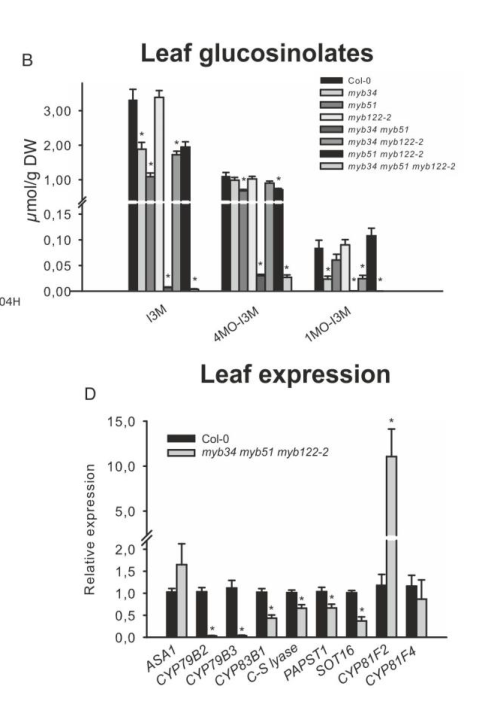

## Question

# Gene Research for Functional Annotation

## ⚠️ CRITICAL: Gene/Protein Identification Context

**BEFORE YOU BEGIN RESEARCH:** You MUST verify you are researching the CORRECT gene/protein. Gene symbols can be ambiguous, especially for less well-characterized genes from non-model organisms.

### Target Gene/Protein Identity (from UniProt):
- **UniProt Accession:** Q9C9C8
- **Protein Description:** RecName: Full=Transcription factor MYB122; AltName: Full=Myb-related protein 122; Short=AtMYB122;
- **Gene Information:** Name=MYB122; OrderedLocusNames=At1g74080; ORFNames=F2P9.5;
- **Organism (full):** Arabidopsis thaliana (Mouse-ear cress).
- **Protein Family:** Not specified in UniProt
- **Key Domains:** Homeodomain-like_sf. (IPR009057); Myb_dom. (IPR017930); Myb_TF_plants. (IPR015495); SANT/Myb. (IPR001005); Myb_DNA-binding (PF00249)

### MANDATORY VERIFICATION STEPS:

1. **Check if the gene symbol "MYB122" matches the protein description above**
2. **Verify the organism is correct:** Arabidopsis thaliana (Mouse-ear cress).
3. **Check if protein family/domains align with what you find in literature**
4. **If you find literature for a DIFFERENT gene with the same or similar symbol, STOP**

### If Gene Symbol is Ambiguous or You Cannot Find Relevant Literature:

**DO NOT PROCEED WITH RESEARCH ON A DIFFERENT GENE.** Instead:
- State clearly: "The gene symbol 'MYB122' is ambiguous or literature is limited for this specific protein"
- Explain what you found (e.g., "Found extensive literature on a different gene with the same symbol in a different organism")
- Describe the protein based ONLY on the UniProt information provided above
- Suggest that the protein function can be inferred from domain/family information

### Research Target:

Please provide a comprehensive research report on the gene **MYB122** (gene ID: MYB122, UniProt: Q9C9C8) in ARATH.

The research report should be a detailed narrative explaining the function, biological processes, and localization of the gene product. Citations should be given for all claims.

You should prioritize authoritative reviews and primary scientific literature when conducting research. You can supplement
this with annotations you find in gene/protein databases, but these can be outdated or inaccurate.

We are specifically interested in the primary function of the gene - for enzymes, what reaction is catalyzed, and what is the substrate specificity? For transporters, what is the substrate? For structural proteins or adapters, what is the broader structural role? For signaling molecules, what is the role in the pathway.

We are interested in where in or outside the cell the gene product carries out its function.

We are also interested in the signaling or biochemical pathways in which the gene functions. We are less interested in broad pleiotropic effects, except where these elucidate the precise role.

Include evidence where possible. We are interested in both experimental evidence as well as inference from structure, evolution, or bioinformatic analysis. Precise studies should be prioritized over high-throughput, where available.

## Output

Question: You are an expert researcher providing comprehensive, well-cited information.

Provide detailed information focusing on:
1. Key concepts and definitions with current understanding
2. Recent developments and latest research (prioritize 2023-2024 sources)
3. Current applications and real-world implementations
4. Expert opinions and analysis from authoritative sources
5. Relevant statistics and data from recent studies

Format as a comprehensive research report with proper citations. Include URLs and publication dates where available.
Always prioritize recent, authoritative sources and provide specific citations for all major claims.

# Gene Research for Functional Annotation

## ⚠️ CRITICAL: Gene/Protein Identification Context

**BEFORE YOU BEGIN RESEARCH:** You MUST verify you are researching the CORRECT gene/protein. Gene symbols can be ambiguous, especially for less well-characterized genes from non-model organisms.

### Target Gene/Protein Identity (from UniProt):
- **UniProt Accession:** Q9C9C8
- **Protein Description:** RecName: Full=Transcription factor MYB122; AltName: Full=Myb-related protein 122; Short=AtMYB122;
- **Gene Information:** Name=MYB122; OrderedLocusNames=At1g74080; ORFNames=F2P9.5;
- **Organism (full):** Arabidopsis thaliana (Mouse-ear cress).
- **Protein Family:** Not specified in UniProt
- **Key Domains:** Homeodomain-like_sf. (IPR009057); Myb_dom. (IPR017930); Myb_TF_plants. (IPR015495); SANT/Myb. (IPR001005); Myb_DNA-binding (PF00249)

### MANDATORY VERIFICATION STEPS:

1. **Check if the gene symbol "MYB122" matches the protein description above**
2. **Verify the organism is correct:** Arabidopsis thaliana (Mouse-ear cress).
3. **Check if protein family/domains align with what you find in literature**
4. **If you find literature for a DIFFERENT gene with the same or similar symbol, STOP**

### If Gene Symbol is Ambiguous or You Cannot Find Relevant Literature:

**DO NOT PROCEED WITH RESEARCH ON A DIFFERENT GENE.** Instead:
- State clearly: "The gene symbol 'MYB122' is ambiguous or literature is limited for this specific protein"
- Explain what you found (e.g., "Found extensive literature on a different gene with the same symbol in a different organism")
- Describe the protein based ONLY on the UniProt information provided above
- Suggest that the protein function can be inferred from domain/family information

### Research Target:

Please provide a comprehensive research report on the gene **MYB122** (gene ID: MYB122, UniProt: Q9C9C8) in ARATH.

The research report should be a detailed narrative explaining the function, biological processes, and localization of the gene product. Citations should be given for all claims.

You should prioritize authoritative reviews and primary scientific literature when conducting research. You can supplement
this with annotations you find in gene/protein databases, but these can be outdated or inaccurate.

We are specifically interested in the primary function of the gene - for enzymes, what reaction is catalyzed, and what is the substrate specificity? For transporters, what is the substrate? For structural proteins or adapters, what is the broader structural role? For signaling molecules, what is the role in the pathway.

We are interested in where in or outside the cell the gene product carries out its function.

We are also interested in the signaling or biochemical pathways in which the gene functions. We are less interested in broad pleiotropic effects, except where these elucidate the precise role.

Include evidence where possible. We are interested in both experimental evidence as well as inference from structure, evolution, or bioinformatic analysis. Precise studies should be prioritized over high-throughput, where available.

# Functional annotation of Arabidopsis MYB122

## Identity and principal function

**MYB122 is the Arabidopsis thaliana gene At1g74080**, corresponding to the protein identified in the question as UniProt **Q9C9C8**. Arabidopsis mutant studies explicitly identify *myb122-2* with At1g74080; the literature classifies its product as an **R2R3-MYB transcription factor**, consistent with the supplied MYB/SANT DNA-binding-domain annotations. It must not be confused with *Brassica rapa* MYB122 homologs, which have different locus identifiers. The UniProt accession itself is supplied identification information; the retrieved primary papers establish the Arabidopsis gene–locus correspondence rather than independently cross-mapping the accession. (frerigmann2015theroleof pages 7-8, seo2017understandingofmyb pages 3-5, kumari2019molecularcharacterizationand pages 3-5)

MYB122’s best-supported **primary function is positive transcriptional regulation of tryptophan-derived indole glucosinolate biosynthesis**. It acts alongside MYB34 and MYB51, but is generally an *accessory, condition-dependent regulator*: MYB34 contributes most strongly in roots, MYB51 in shoots, and MYB122 becomes more evident during induced responses. It is **not an enzyme, glucosinolate transporter, or myrosinase**; assigning it a catalytic reaction or metabolite substrate would mistake the functions of pathway enzymes for those of their transcriptional regulator. Its relevant molecular interactions are with DNA-regulatory machinery and other transcription factors, while precise direct DNA-binding sites for MYB122 at each proposed target require separate demonstration. (frerigmann2014myb34myb51and pages 11-12, frerigmann2014myb34myb51and pages 1-3, frerigmann2014myb34myb51and pages 7-8, schweizer2013arabidopsisbasichelixloophelixtranscription pages 5-7)

## Pathway placement and experimental evidence

The pathway begins with **CYP79B2 and CYP79B3 converting tryptophan to indole-3-acetaldoxime (IAOx)**. IAOx supplies indole glucosinolate synthesis and also serves as a precursor for other defensive indolic metabolites. In the *myb34 myb51 myb122* triple knockout, **CYP79B2, CYP79B3, CYP83B1, SOT16, and PAPST1** transcripts decline, and plants retain only traces of indole glucosinolates. By contrast, the later modification genes **CYP81F2 and CYP81F4** are not transcriptionally reduced. These measurements place the *combined* MYB regulators predominantly at precursor supply and core glucosinolate biosynthesis; they do **not** establish that MYB122 independently binds or activates every named promoter. The 2014 paper’s Figure 2 compares the relevant single, double, and triple mutants and their pathway-gene expression. (frerigmann2015theroleof pages 7-8, frerigmann2014myb34myb51and pages 7-8, frerigmann2014myb34myb51and media 4f027c1e)

The attribution to MYB122 specifically is clearest under challenge. Under ordinary growth conditions, the *myb122-2* single mutant has approximately wild-type indole glucosinolate levels; after methyl jasmonate, its measured indole glucosinolates fall. Under combined ethylene/jasmonate treatment, the triple mutant accumulates slightly but significantly less than *myb34 myb51*. Conversely, a MYB122 gain-of-function allele raises indole glucosinolates even in a *myb34 myb51* background. Thus, a weak basal single-mutant phenotype does not imply that MYB122 is nonfunctional. Among the three regulators, MYB51 is dominant for salicylic-acid- and ethylene-associated induction, MYB34 for abscisic-acid- and jasmonate-associated responses, and MYB122 makes a smaller jasmonate/ethylene-associated contribution. (frerigmann2014myb34myb51and pages 11-12, frerigmann2014myb34myb51and pages 10-11, frerigmann2014myb34myb51and pages 3-4, frerigmann2014myb34myb51and pages 22-24)

**Camalexin is a secondary, indirect pathway connection.** Camalexin decreases in *myb51 myb122* and triple-mutant combinations. Feeding the triple mutant **IAOx or indole-3-acetonitrile** largely rescues camalexin, whereas feeding tryptophan does not. Moreover, the downstream camalexin genes **CYP71A13 and CYP71B15/PAD3** are not suppressed in the triple mutant, and the MYBs do not activate the tested PAD3 promoter reporter. The strongest interpretation is that MYB122 and its paralogs help supply the **upstream IAOx precursor**, not that MYB122 directly controls all camalexin-specific enzymes. (frerigmann2015theroleof pages 1-3, frerigmann2015theroleof pages 3-4)

## Cellular localization and regulatory partners

**The nucleus is the supported functional compartment**, as expected for a DNA-binding transcription factor. More specifically, bimolecular fluorescence complementation examined a **BES1–MYB122 interaction in nuclei**, using a nuclear marker, and Arabidopsis-protoplast co-immunoprecipitation tested their physical association. This is evidence for a nuclear interaction, **not** an independently demonstrated MYB122-only localization experiment or evidence that MYB122 functions in the endoplasmic reticulum or extracellular space. (kim2013mybtranscriptionfactors pages 1-3, liao2020brassinosteroidsantagonizejasmonateactivated pages 42-45)

The regulatory context connects defense and growth signals. **MYC2, MYC3, and MYC4**, jasmonate-associated bHLH transcription factors, interact with MYB122 in yeast interaction and protein pull-down experiments. MYC2 chromatin-immunoprecipitation evidence for binding glucosinolate-gene promoters should be attributed to **MYC2**, not automatically to MYB122. In the opposing brassinosteroid-associated arm, **BES1 physically associates with MYB122** and other indolic-glucosinolate MYBs; BES1 binding and reporter experiments implicate suppression of **CYP79B3** and **UGT74B1** transcription. The proposed balance between MYC–MYB activation and BES1-associated repression is a mechanistic model supported by interaction and reporter experiments, although the exact composition of every complex *in planta* remains to be resolved. (liao2020brassinosteroidsantagonizejasmonateactivated pages 42-45, liao2020brassinosteroidsantagonizejasmonateactivated pages 25-28, liao2020brassinosteroidsantagonizejasmonateactivated pages 28-31, schweizer2013arabidopsisbasichelixloophelixtranscription pages 5-7)

In immunity experiments, **MYB51 and, secondarily, MYB122** support *flg22*-induced indole-glucosinolate production. The combined *myb34 myb51 myb122* mutant also shows increased susceptibility to *Plectosphaerella cucumerina*. Those results support a pathway-level defense role but cannot assign the entire pathogen phenotype to MYB122 alone; separate regulators control important downstream phytoalexin responses. (frerigmann2016regulationofpathogentriggered pages 34-35)

## Recent research and applications

Two **2024 primary studies** extend, rather than replace, this functional annotation. In natural-soil experiments, the *myb34/51/122* triple mutant altered **rhizoplane bacterial-community assembly**, while its fungal-community effect was milder than that of certain metabolic-enzyme mutants. This links the MYB-regulated tryptophan-defense pathway to root–microbe ecology; it is **not** evidence that MYB122 alone determines microbiome composition. (basak2024erbodyresidentmyrosinases pages 4-5)

A separate overexpression study found that **35S:MYB122** plants could develop spontaneous callus-associated phenotypes. Among the reported T1 plants, **1.7% were classified strong, 10.9% medium, and 87.4% weak**; strong plants formed visible callus in root, stem, or leaf tissues within 20 days. This is a useful experimental manipulation of a candidate metabolic regulator, **not proof** that endogenous MYB122 is necessary for callus formation or that an identified glucosinolate directly causes it. The study also examines **IGMT enzymes**: its localization and reactive-oxygen-species results for IGMT3 must not be attributed to MYB122. (cao2024glucosinolateomethyltransferasemediated pages 4-6, cao2024glucosinolateomethyltransferasemediated pages 6-9)

For applied research, manipulating MYB122 or its *Brassica* homologs is a **candidate strategy** for changing indole-glucosinolate composition and associated defense traits; species-specific paralogs, redundancy, tissue dependence, and growth–defense trade-offs constrain straightforward transfer. The studies assessed here establish research applications in mutant analysis, overexpression, and microbiome experiments, **not a validated commercial MYB122 crop implementation**. (kumari2019molecularcharacterizationand pages 3-5, frerigmann2014myb34myb51and pages 11-12, basak2024erbodyresidentmyrosinases pages 4-5, liao2020brassinosteroidsantagonizejasmonateactivated pages 28-31)

The following evidence summary separates MYB122-specific interventions from findings obtained only with multiple-MYB mutants.

| Finding | Experimental evidence | Interpretation/limits | Primary publication date and DOI URL |
|---|---|---|---|
| MYB122 has a minor, conditional role in indole-glucosinolate production | The *myb122-2* single mutant had near-wild-type indole glucosinolates under standard conditions but reduced accumulation after methyl-jasmonate or ethylene/methyl-jasmonate treatment. A MYB122 gain-of-function allele increased indole glucosinolates in a *myb34 myb51* background. (frerigmann2014myb34myb51and pages 10-11, frerigmann2014myb34myb51and pages 22-24) | **Strong genetic/metabolomic evidence.** MYB122 is an accessory regulator, especially under JA/ET-associated induction; MYB34 and MYB51 dominate basal, root, and shoot regulation. | May 2014 — [10.1093/mp/ssu004](https://doi.org/10.1093/mp/ssu004) |
| MYB34/MYB51/MYB122 collectively activate the early indole-glucosinolate pathway | The *myb34 myb51 myb122-2* triple mutant retained only trace indole glucosinolates and resembled *cyp79b2 cyp79b3*. It showed markedly reduced **CYP79B2/CYP79B3** and significantly reduced **CYP83B1**, **SOT16**, and **PAPST1** transcripts; later modification genes **CYP81F2/F4** were not reduced. (frerigmann2014myb34myb51and pages 7-8, frerigmann2014myb34myb51and media 4f027c1e) | **Strong pathway-placement evidence**, but it comes from a triple mutant and does not assign each transcript effect to MYB122 alone. It places the three MYBs chiefly at core-pathway/precursor production rather than all downstream modifications. | May 2014 — [10.1093/mp/ssu004](https://doi.org/10.1093/mp/ssu004) |
| MYB122 contributes to camalexin precursor supply upstream of indole-3-acetaldoxime (IAOx) | Camalexin was reduced in *myb51 myb122* and triple mutants. Feeding IAOx or indole-3-acetonitrile largely restored triple-mutant camalexin, whereas tryptophan did not. **CYP71A13** and **PAD3/CYP71B15** were not suppressed in the triple mutant, and the MYBs did not activate a *PAD3* promoter reporter. (frerigmann2015theroleof pages 7-8, frerigmann2015theroleof pages 1-3, frerigmann2015theroleof pages 3-4) | **Strong metabolic-complementation evidence** that the MYBs promote camalexin indirectly by supplying IAOx. There is no evidence here that MYB122 directly activates PAD3 or catalyzes any reaction; MYB122-specific contribution is partly inferred from combined mutants. | 20 August 2015 — [10.3389/fpls.2015.00654](https://doi.org/10.3389/fpls.2015.00654) |
| JA-responsive MYC factors physically associate with MYB122 | MYC2-, MYC3-, and MYC4-JAZ-interaction-domain fragments interacted with MYB122 in yeast two-hybrid assays; full MYC2/3/4 proteins were recovered using recombinant MBP–MYB122 in pull-down experiments. (schweizer2013arabidopsisbasichelixloophelixtranscription pages 5-7) | **Strong in-vitro/heterologous interaction evidence.** It supports a MYC–MYB122 transcriptional complex, but the paper noted that exact complex composition in vivo remained unresolved. MYC2, rather than MYB122, was shown by ChIP-seq to bind glucosinolate-gene promoters. | 16 August 2013 — [10.1105/tpc.113.115139](https://doi.org/10.1105/tpc.113.115139) |
| BES1 associates with MYB122 in the nucleus and represses indole-glucosinolate transcriptional output | BES1–MYB122 association was tested by co-immunoprecipitation in Arabidopsis protoplasts and nuclear-marker-supported BiFC. BES1 suppressed MYB/MYC-driven **CYP79B3** and **UGT74B1** reporter activity; BES1 gain of function reduced I3M and 1MO-I3M during control and herbivory conditions. (liao2020brassinosteroidsantagonizejasmonateactivated pages 42-45, liao2020brassinosteroidsantagonizejasmonateactivated pages 25-28, liao2020brassinosteroidsantagonizejasmonateactivated pages 28-31) | **Strong physical and reporter evidence** for brassinosteroid–jasmonate crosstalk. Nuclear BiFC localizes the BES1–MYB122 interaction, but it is not an independent MYB122-only localization assay; repression also involves BES1 DNA binding and other MYB/MYC factors. | February 2020 — [10.1104/pp.19.01220](https://doi.org/10.1104/pp.19.01220) |
| The MYB-regulated pathway contributes to root-microbiota assembly | In natural soil, the *myb34/51/122* rhizoplane bacterial community grouped with that of *cyp79b2b3*. Its effect on fungal communities was milder than that of enzyme-encoding mutants; bacterial endosphere and fungal rhizoplane communities did not differ significantly among genotypes. (basak2024erbodyresidentmyrosinases pages 4-5) | **Moderate ecological evidence.** The phenotype belongs to a triple mutant and cannot be attributed to MYB122 alone. Residual metabolites and regulatory redundancy may explain the milder fungal effect. | January 2024; online 21 August 2023 — [10.1111/nph.19289](https://doi.org/10.1111/nph.19289) |
| Ectopic MYB122 expression can trigger callus-associated developmental phenotypes | Among T1 **35S:MYB122** plants, autonomous callus-related phenotypes were classified as strong (1.7%), medium (10.9%), or weak (87.4%); strong plants formed visible callus in roots, stems, and leaves within 20 days. (cao2024glucosinolateomethyltransferasemediated pages 6-9) | **Direct overexpression evidence**, but penetrance was mostly weak, no loss-of-function MYB122 test established necessity, and altered indole-glucosinolate metabolites were not demonstrated to cause the phenotype. MYB122 must not be confused with IGMT3, which was analyzed separately. | January 2024 — [10.1007/s12298-023-01409-2](https://doi.org/10.1007/s12298-023-01409-2) |

*Table: Evidence-strength summary for Arabidopsis thaliana MYB122 (At1g74080), separating MYB122-specific findings from shared triple-mutant and pathway-level effects. It emphasizes direct experiments, mechanistic limits, and recent ecological or developmental observations.*

### Selected primary sources and dates

- Schweizer *et al.*, *The Plant Cell* (**August 2013**), MYC–MYB interactions and glucosinolate-gene regulation: https://doi.org/10.1105/tpc.113.115139. (schweizer2013arabidopsisbasichelixloophelixtranscription pages 5-7)
- Frerigmann and Gigolashvili, *Molecular Plant* (**May 2014**), MYB122 single-, double-, and triple-mutant glucosinolate experiments: https://doi.org/10.1093/mp/ssu004. (frerigmann2014myb34myb51and pages 11-12, frerigmann2014myb34myb51and pages 7-8)
- Frerigmann *et al.*, *Frontiers in Plant Science* (**August 2015**), camalexin precursor-feeding experiments: https://doi.org/10.3389/fpls.2015.00654. (frerigmann2015theroleof pages 1-3)
- Frerigmann *et al.*, *Molecular Plant* (**May 2016**), pathogen-triggered tryptophan metabolism: https://doi.org/10.1016/j.molp.2016.01.006. (frerigmann2016regulationofpathogentriggered pages 34-35)
- Liao *et al.*, *Plant Physiology* (**2020**), BES1–MYB interactions and brassinosteroid/jasmonate crosstalk: https://doi.org/10.1104/pp.19.01220. (liao2020brassinosteroidsantagonizejasmonateactivated pages 42-45, liao2020brassinosteroidsantagonizejasmonateactivated pages 28-31)
- Basak *et al.*, *New Phytologist* (**2024 volume; article accessible online in 2023**), root-microbiota experiments: https://doi.org/10.1111/nph.19289. (basak2024erbodyresidentmyrosinases pages 4-5)
- Cao *et al.*, *Physiology and Molecular Biology of Plants* (**January 2024**), MYB122-overexpression callus observations: https://doi.org/10.1007/s12298-023-01409-2. (cao2024glucosinolateomethyltransferasemediated pages 6-9)

References

1. (frerigmann2015theroleof pages 7-8): Henning Frerigmann, Erich Glawischnig, and Tamara Gigolashvili. The role of myb34, myb51 and myb122 in the regulation of camalexin biosynthesis in arabidopsis thaliana. Frontiers in Plant Science, Aug 2015. URL: https://doi.org/10.3389/fpls.2015.00654, doi:10.3389/fpls.2015.00654. This article has 80 citations.

2. (seo2017understandingofmyb pages 3-5): Mi-Suk Seo and Jung Sun Kim. Understanding of myb transcription factors involved in glucosinolate biosynthesis in brassicaceae. Molecules, 22:1549, Sep 2017. URL: https://doi.org/10.3390/molecules22091549, doi:10.3390/molecules22091549. This article has 112 citations.

3. (kumari2019molecularcharacterizationand pages 3-5): Shipra Kumari, Jung Su Jo, Hyo Seon Choi, Jun Gu Lee, Soo In Lee, Mi-Jeong Jeong, and Jin A Kim. Molecular characterization and expression analysis of myb transcription factors involved in the glucosinolate pathway in chinese cabbage (brassica rapa ssp. pekinensis). Agronomy, 9:807, Nov 2019. URL: https://doi.org/10.3390/agronomy9120807, doi:10.3390/agronomy9120807. This article has 9 citations and is from a peer-reviewed journal.

4. (frerigmann2014myb34myb51and pages 11-12): Henning Frerigmann and Tamara Gigolashvili. Myb34, myb51, and myb122 distinctly regulate indolic glucosinolate biosynthesis in arabidopsis thaliana. Molecular plant, 7 5:814-28, May 2014. URL: https://doi.org/10.1093/mp/ssu004, doi:10.1093/mp/ssu004. This article has 398 citations and is from a highest quality peer-reviewed journal.

5. (frerigmann2014myb34myb51and pages 1-3): Henning Frerigmann and Tamara Gigolashvili. Myb34, myb51, and myb122 distinctly regulate indolic glucosinolate biosynthesis in arabidopsis thaliana. Molecular plant, 7 5:814-28, May 2014. URL: https://doi.org/10.1093/mp/ssu004, doi:10.1093/mp/ssu004. This article has 398 citations and is from a highest quality peer-reviewed journal.

6. (frerigmann2014myb34myb51and pages 7-8): Henning Frerigmann and Tamara Gigolashvili. Myb34, myb51, and myb122 distinctly regulate indolic glucosinolate biosynthesis in arabidopsis thaliana. Molecular plant, 7 5:814-28, May 2014. URL: https://doi.org/10.1093/mp/ssu004, doi:10.1093/mp/ssu004. This article has 398 citations and is from a highest quality peer-reviewed journal.

7. (schweizer2013arabidopsisbasichelixloophelixtranscription pages 5-7): Fabian Schweizer, Patricia Fernández-Calvo, Mark Zander, Monica Diez-Diaz, Sandra Fonseca, Gaétan Glauser, Mathew G. Lewsey, Joseph R. Ecker, Roberto Solano, and Philippe Reymond. <i>arabidopsis</i> basic helix-loop-helix transcription factors myc2, myc3, and myc4 regulate glucosinolate biosynthesis, insect performance, and feeding behavior. The Plant Cell, 25:3117-3132, Aug 2013. URL: https://doi.org/10.1105/tpc.113.115139, doi:10.1105/tpc.113.115139. This article has 638 citations.

8. (frerigmann2014myb34myb51and media 4f027c1e): Henning Frerigmann and Tamara Gigolashvili. Myb34, myb51, and myb122 distinctly regulate indolic glucosinolate biosynthesis in arabidopsis thaliana. Molecular plant, 7 5:814-28, May 2014. URL: https://doi.org/10.1093/mp/ssu004, doi:10.1093/mp/ssu004. This article has 398 citations and is from a highest quality peer-reviewed journal.

9. (frerigmann2014myb34myb51and pages 10-11): Henning Frerigmann and Tamara Gigolashvili. Myb34, myb51, and myb122 distinctly regulate indolic glucosinolate biosynthesis in arabidopsis thaliana. Molecular plant, 7 5:814-28, May 2014. URL: https://doi.org/10.1093/mp/ssu004, doi:10.1093/mp/ssu004. This article has 398 citations and is from a highest quality peer-reviewed journal.

10. (frerigmann2014myb34myb51and pages 3-4): Henning Frerigmann and Tamara Gigolashvili. Myb34, myb51, and myb122 distinctly regulate indolic glucosinolate biosynthesis in arabidopsis thaliana. Molecular plant, 7 5:814-28, May 2014. URL: https://doi.org/10.1093/mp/ssu004, doi:10.1093/mp/ssu004. This article has 398 citations and is from a highest quality peer-reviewed journal.

11. (frerigmann2014myb34myb51and pages 22-24): Henning Frerigmann and Tamara Gigolashvili. Myb34, myb51, and myb122 distinctly regulate indolic glucosinolate biosynthesis in arabidopsis thaliana. Molecular plant, 7 5:814-28, May 2014. URL: https://doi.org/10.1093/mp/ssu004, doi:10.1093/mp/ssu004. This article has 398 citations and is from a highest quality peer-reviewed journal.

12. (frerigmann2015theroleof pages 1-3): Henning Frerigmann, Erich Glawischnig, and Tamara Gigolashvili. The role of myb34, myb51 and myb122 in the regulation of camalexin biosynthesis in arabidopsis thaliana. Frontiers in Plant Science, Aug 2015. URL: https://doi.org/10.3389/fpls.2015.00654, doi:10.3389/fpls.2015.00654. This article has 80 citations.

13. (frerigmann2015theroleof pages 3-4): Henning Frerigmann, Erich Glawischnig, and Tamara Gigolashvili. The role of myb34, myb51 and myb122 in the regulation of camalexin biosynthesis in arabidopsis thaliana. Frontiers in Plant Science, Aug 2015. URL: https://doi.org/10.3389/fpls.2015.00654, doi:10.3389/fpls.2015.00654. This article has 80 citations.

14. (kim2013mybtranscriptionfactors pages 1-3): Yeon Kim, Xiaohua Li, Sun-Ju Kim, Haeng Kim, Jeongyeo Lee, HyeRan Kim, and Sang Park. Myb transcription factors regulate glucosinolate biosynthesis in different organs of chinese cabbage (brassica rapa ssp. pekinensis). Molecules, 18:8682-8695, Jul 2013. URL: https://doi.org/10.3390/molecules18078682, doi:10.3390/molecules18078682. This article has 95 citations.

15. (liao2020brassinosteroidsantagonizejasmonateactivated pages 42-45): Ke Liao, Yu-Jun Peng, Li-Bing Yuan, Yang-Shuo Dai, Qin-Fang Chen, Lu-Jun Yu, Ming-Yi Bai, Wen-Qing Zhang, Li-Juan Xie, and Shi Xiao. Brassinosteroids antagonize jasmonate-activated plant defense responses through bri1-ems-suppressor1 (bes1)1. Plant Physiology, 182:1066-1082, Nov 2020. URL: https://doi.org/10.1104/pp.19.01220, doi:10.1104/pp.19.01220. This article has 104 citations and is from a highest quality peer-reviewed journal.

16. (liao2020brassinosteroidsantagonizejasmonateactivated pages 25-28): Ke Liao, Yu-Jun Peng, Li-Bing Yuan, Yang-Shuo Dai, Qin-Fang Chen, Lu-Jun Yu, Ming-Yi Bai, Wen-Qing Zhang, Li-Juan Xie, and Shi Xiao. Brassinosteroids antagonize jasmonate-activated plant defense responses through bri1-ems-suppressor1 (bes1)1. Plant Physiology, 182:1066-1082, Nov 2020. URL: https://doi.org/10.1104/pp.19.01220, doi:10.1104/pp.19.01220. This article has 104 citations and is from a highest quality peer-reviewed journal.

17. (liao2020brassinosteroidsantagonizejasmonateactivated pages 28-31): Ke Liao, Yu-Jun Peng, Li-Bing Yuan, Yang-Shuo Dai, Qin-Fang Chen, Lu-Jun Yu, Ming-Yi Bai, Wen-Qing Zhang, Li-Juan Xie, and Shi Xiao. Brassinosteroids antagonize jasmonate-activated plant defense responses through bri1-ems-suppressor1 (bes1)1. Plant Physiology, 182:1066-1082, Nov 2020. URL: https://doi.org/10.1104/pp.19.01220, doi:10.1104/pp.19.01220. This article has 104 citations and is from a highest quality peer-reviewed journal.

18. (frerigmann2016regulationofpathogentriggered pages 34-35): Henning Frerigmann, Mariola Piślewska-Bednarek, Andrea Sánchez-Vallet, Antonio Molina, Erich Glawischnig, Tamara Gigolashvili, and Paweł Bednarek. Regulation of pathogen-triggered tryptophan metabolism in arabidopsis thaliana by myb transcription factors and indole glucosinolate conversion products. Molecular plant, 9 5:682-695, May 2016. URL: https://doi.org/10.1016/j.molp.2016.01.006, doi:10.1016/j.molp.2016.01.006. This article has 182 citations and is from a highest quality peer-reviewed journal.

19. (basak2024erbodyresidentmyrosinases pages 4-5): Arpan Kumar Basak, Anna Piasecka, Jana Hucklenbroich, Gözde Merve Türksoy, Rui Guan, Pengfan Zhang, Felix Getzke, Ruben Garrido‐Oter, Stephane Hacquard, Kazimierz Strzałka, Paweł Bednarek, Kenji Yamada, and Ryohei Thomas Nakano. Er body-resident myrosinases and tryptophan specialized metabolism modulate root microbiota assembly. The New phytologist, 241:329-342, Sep 2024. URL: https://doi.org/10.1111/nph.19289, doi:10.1111/nph.19289. This article has 28 citations.

20. (cao2024glucosinolateomethyltransferasemediated pages 4-6): Huifen Cao, Xiao Zhang, Feng Li, Zhiping Han, Xuhu Guo, and Yongfang Zhang. Glucosinolate o-methyltransferase mediated callus formation and affected ros homeostasis in arabidopsis thaliana. Physiology and molecular biology of plants : an international journal of functional plant biology, 30 1:109-121, Jan 2024. URL: https://doi.org/10.1007/s12298-023-01409-2, doi:10.1007/s12298-023-01409-2. This article has 8 citations.

21. (cao2024glucosinolateomethyltransferasemediated pages 6-9): Huifen Cao, Xiao Zhang, Feng Li, Zhiping Han, Xuhu Guo, and Yongfang Zhang. Glucosinolate o-methyltransferase mediated callus formation and affected ros homeostasis in arabidopsis thaliana. Physiology and molecular biology of plants : an international journal of functional plant biology, 30 1:109-121, Jan 2024. URL: https://doi.org/10.1007/s12298-023-01409-2, doi:10.1007/s12298-023-01409-2. This article has 8 citations.

## Artifacts

- [Edison artifact artifact-00](MYB122-deep-research-falcon_artifacts/artifact-00.md)

## Citations

1. frerigmann2016regulationofpathogentriggered pages 34-35
2. basak2024erbodyresidentmyrosinases pages 4-5
3. schweizer2013arabidopsisbasichelixloophelixtranscription pages 5-7
4. cao2024glucosinolateomethyltransferasemediated pages 6-9
5. frerigmann2015theroleof pages 1-3
6. frerigmann2015theroleof pages 7-8
7. seo2017understandingofmyb pages 3-5
8. kumari2019molecularcharacterizationand pages 3-5
9. frerigmann2015theroleof pages 3-4
10. kim2013mybtranscriptionfactors pages 1-3
11. liao2020brassinosteroidsantagonizejasmonateactivated pages 42-45
12. liao2020brassinosteroidsantagonizejasmonateactivated pages 25-28
13. liao2020brassinosteroidsantagonizejasmonateactivated pages 28-31
14. cao2024glucosinolateomethyltransferasemediated pages 4-6
15. 10.1093/mp/ssu004
16. 10.3389/fpls.2015.00654
17. 10.1105/tpc.113.115139
18. 10.1104/pp.19.01220
19. 10.1111/nph.19289
20. 10.1007/s12298-023-01409-2
21. https://doi.org/10.1093/mp/ssu004
22. https://doi.org/10.3389/fpls.2015.00654
23. https://doi.org/10.1105/tpc.113.115139
24. https://doi.org/10.1104/pp.19.01220
25. https://doi.org/10.1111/nph.19289
26. https://doi.org/10.1007/s12298-023-01409-2
27. https://doi.org/10.1105/tpc.113.115139.
28. https://doi.org/10.1093/mp/ssu004.
29. https://doi.org/10.3389/fpls.2015.00654.
30. https://doi.org/10.1016/j.molp.2016.01.006.
31. https://doi.org/10.1104/pp.19.01220.
32. https://doi.org/10.1111/nph.19289.
33. https://doi.org/10.1007/s12298-023-01409-2.
34. https://doi.org/10.3389/fpls.2015.00654,
35. https://doi.org/10.3390/molecules22091549,
36. https://doi.org/10.3390/agronomy9120807,
37. https://doi.org/10.1093/mp/ssu004,
38. https://doi.org/10.1105/tpc.113.115139,
39. https://doi.org/10.3390/molecules18078682,
40. https://doi.org/10.1104/pp.19.01220,
41. https://doi.org/10.1016/j.molp.2016.01.006,
42. https://doi.org/10.1111/nph.19289,
43. https://doi.org/10.1007/s12298-023-01409-2,