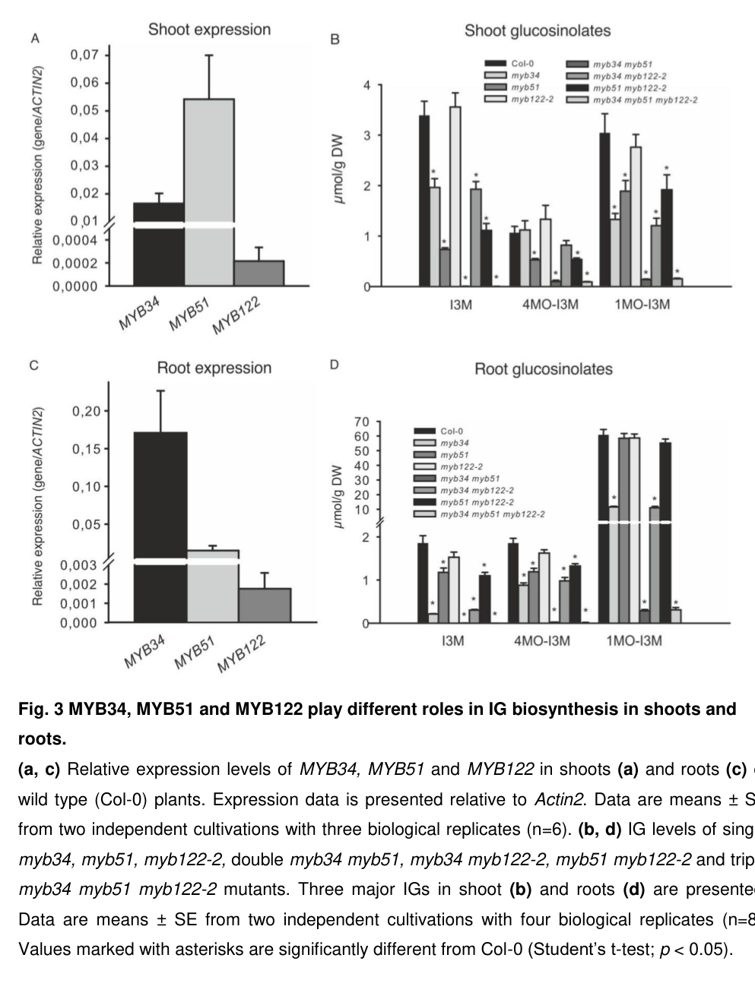

## Question

# Gene Research for Functional Annotation

## ⚠️ CRITICAL: Gene/Protein Identification Context

**BEFORE YOU BEGIN RESEARCH:** You MUST verify you are researching the CORRECT gene/protein. Gene symbols can be ambiguous, especially for less well-characterized genes from non-model organisms.

### Target Gene/Protein Identity (from UniProt):
- **UniProt Accession:** O64399
- **Protein Description:** RecName: Full=Transcription factor MYB34; AltName: Full=Myb-related protein 34; Short=AtMYB34; AltName: Full=Protein ALTERED TRYPTOPHAN REGULATION 1; Short=ATR1;
- **Gene Information:** Name=MYB34; Synonyms=ATR1; OrderedLocusNames=At5g60890; ORFNames=MSL3.10;
- **Organism (full):** Arabidopsis thaliana (Mouse-ear cress).
- **Protein Family:** Not specified in UniProt
- **Key Domains:** Homeodomain-like_sf. (IPR009057); Myb_dom. (IPR017930); Myb_TF_plants. (IPR015495); SANT/Myb. (IPR001005); Myb_DNA-binding (PF00249)

### MANDATORY VERIFICATION STEPS:

1. **Check if the gene symbol "MYB34" matches the protein description above**
2. **Verify the organism is correct:** Arabidopsis thaliana (Mouse-ear cress).
3. **Check if protein family/domains align with what you find in literature**
4. **If you find literature for a DIFFERENT gene with the same or similar symbol, STOP**

### If Gene Symbol is Ambiguous or You Cannot Find Relevant Literature:

**DO NOT PROCEED WITH RESEARCH ON A DIFFERENT GENE.** Instead:
- State clearly: "The gene symbol 'MYB34' is ambiguous or literature is limited for this specific protein"
- Explain what you found (e.g., "Found extensive literature on a different gene with the same symbol in a different organism")
- Describe the protein based ONLY on the UniProt information provided above
- Suggest that the protein function can be inferred from domain/family information

### Research Target:

Please provide a comprehensive research report on the gene **MYB34** (gene ID: MYB34, UniProt: O64399) in ARATH.

The research report should be a detailed narrative explaining the function, biological processes, and localization of the gene product. Citations should be given for all claims.

You should prioritize authoritative reviews and primary scientific literature when conducting research. You can supplement
this with annotations you find in gene/protein databases, but these can be outdated or inaccurate.

We are specifically interested in the primary function of the gene - for enzymes, what reaction is catalyzed, and what is the substrate specificity? For transporters, what is the substrate? For structural proteins or adapters, what is the broader structural role? For signaling molecules, what is the role in the pathway.

We are interested in where in or outside the cell the gene product carries out its function.

We are also interested in the signaling or biochemical pathways in which the gene functions. We are less interested in broad pleiotropic effects, except where these elucidate the precise role.

Include evidence where possible. We are interested in both experimental evidence as well as inference from structure, evolution, or bioinformatic analysis. Precise studies should be prioritized over high-throughput, where available.

## Output

Question: You are an expert researcher providing comprehensive, well-cited information.

Provide detailed information focusing on:
1. Key concepts and definitions with current understanding
2. Recent developments and latest research (prioritize 2023-2024 sources)
3. Current applications and real-world implementations
4. Expert opinions and analysis from authoritative sources
5. Relevant statistics and data from recent studies

Format as a comprehensive research report with proper citations. Include URLs and publication dates where available.
Always prioritize recent, authoritative sources and provide specific citations for all major claims.

# Gene Research for Functional Annotation

## ⚠️ CRITICAL: Gene/Protein Identification Context

**BEFORE YOU BEGIN RESEARCH:** You MUST verify you are researching the CORRECT gene/protein. Gene symbols can be ambiguous, especially for less well-characterized genes from non-model organisms.

### Target Gene/Protein Identity (from UniProt):
- **UniProt Accession:** O64399
- **Protein Description:** RecName: Full=Transcription factor MYB34; AltName: Full=Myb-related protein 34; Short=AtMYB34; AltName: Full=Protein ALTERED TRYPTOPHAN REGULATION 1; Short=ATR1;
- **Gene Information:** Name=MYB34; Synonyms=ATR1; OrderedLocusNames=At5g60890; ORFNames=MSL3.10;
- **Organism (full):** Arabidopsis thaliana (Mouse-ear cress).
- **Protein Family:** Not specified in UniProt
- **Key Domains:** Homeodomain-like_sf. (IPR009057); Myb_dom. (IPR017930); Myb_TF_plants. (IPR015495); SANT/Myb. (IPR001005); Myb_DNA-binding (PF00249)

### MANDATORY VERIFICATION STEPS:

1. **Check if the gene symbol "MYB34" matches the protein description above**
2. **Verify the organism is correct:** Arabidopsis thaliana (Mouse-ear cress).
3. **Check if protein family/domains align with what you find in literature**
4. **If you find literature for a DIFFERENT gene with the same or similar symbol, STOP**

### If Gene Symbol is Ambiguous or You Cannot Find Relevant Literature:

**DO NOT PROCEED WITH RESEARCH ON A DIFFERENT GENE.** Instead:
- State clearly: "The gene symbol 'MYB34' is ambiguous or literature is limited for this specific protein"
- Explain what you found (e.g., "Found extensive literature on a different gene with the same symbol in a different organism")
- Describe the protein based ONLY on the UniProt information provided above
- Suggest that the protein function can be inferred from domain/family information

### Research Target:

Please provide a comprehensive research report on the gene **MYB34** (gene ID: MYB34, UniProt: O64399) in ARATH.

The research report should be a detailed narrative explaining the function, biological processes, and localization of the gene product. Citations should be given for all claims.

You should prioritize authoritative reviews and primary scientific literature when conducting research. You can supplement
this with annotations you find in gene/protein databases, but these can be outdated or inaccurate.

We are specifically interested in the primary function of the gene - for enzymes, what reaction is catalyzed, and what is the substrate specificity? For transporters, what is the substrate? For structural proteins or adapters, what is the broader structural role? For signaling molecules, what is the role in the pathway.

We are interested in where in or outside the cell the gene product carries out its function.

We are also interested in the signaling or biochemical pathways in which the gene functions. We are less interested in broad pleiotropic effects, except where these elucidate the precise role.

Include evidence where possible. We are interested in both experimental evidence as well as inference from structure, evolution, or bioinformatic analysis. Precise studies should be prioritized over high-throughput, where available.

# Functional annotation report: *Arabidopsis thaliana* MYB34/ATR1

## Identity and primary function

**The target is the Arabidopsis gene MYB34 (ATR1; At5g60890), corresponding to the user-specified UniProt accession O64399—not its related genes MYB51/HIG1 or MYB122.** Primary studies explicitly identify Arabidopsis ATR1 as AtMYB34 and classify MYB34 among the R2R3-MYB transcription factors; this agrees with the supplied MYB/SANT DNA-binding-domain annotations. Its established primary function is **positive transcriptional regulation of tryptophan-derived indolic glucosinolate biosynthesis**, particularly production of indole-3-ylmethylglucosinolate (I3M, glucobrassicin). MYB34 is neither a biosynthetic enzyme nor a glucosinolate transporter: its immediate functional output is altered expression of pathway genes. (celenza2005thearabidopsisatr1 pages 2-3, malitsky2008thetranscriptand pages 2-3, frerigmann2014myb34myb51and pages 6-7)

**Pathway position.** CYP79B2 and CYP79B3 convert tryptophan into indole-3-acetaldoxime (IAOx). CYP83B1 directs IAOx toward the indolic-glucosinolate core; downstream processing produces I3M and modified indolic glucosinolates. IAOx is also a precursor for other tryptophan-derived products, including some indole-3-acetic acid (IAA, auxin) and camalexin. MYB34 promotes precursor supply and the glucosinolate branch principally by increasing expression of *CYP79B2*, *CYP79B3*, and *CYP83B1*; it is **not** the enzyme catalyzing any of those reactions. [Celenza et al., *Plant Physiology*, January 2005](https://doi.org/10.1104/pp.104.054395); [Choi et al., *Plant Physiology*, 2024](https://doi.org/10.1093/plphys/kiae284). (celenza2005thearabidopsisatr1 pages 1-2, choi2024elongatedhypocotyl5 pages 2-3)

## Experimental basis and biochemical specificity

The dominant *atr1D* gain-of-function allele raised I3M-related indolic glucosinolate abundance approximately **tenfold** over wild type in both seedlings and adult leaves, without a corresponding increase in methionine-derived aliphatic glucosinolates. In contrast, the *atr1-2* insertion, which interrupts the conserved MYB DNA-binding region, reduced adult-leaf *CYP79B2*, *CYP79B3*, and *CYP83B1* transcripts and lowered indolic glucosinolates by approximately **20%**. Eliminating both CYP79B2 and CYP79B3 abolished the *atr1D* indolic-glucosinolate increase, genetically placing MYB34’s effect upstream of IAOx production. These are measurements from particular genotypes and tissues, not universal estimates of MYB34’s effect size. [Celenza et al., January 2005](https://doi.org/10.1104/pp.104.054395). (celenza2005thearabidopsisatr1 pages 3-5)

MYB34 also stimulates pathway-gene **promoter–reporter activity**: transactivation experiments showed responses of *CYP79B2*, *CYP79B3*, and *CYP83B1* promoters, but not promoters of the camalexin-specific genes *CYP71A13* and *CYP71B15/PAD3*. This supports pathway-selective transcriptional regulation; a reporter response does **not**, by itself, prove direct physical occupancy of those promoters by MYB34. Indeed, promoter ChIP evidence in the MYC–MYB regulatory literature identifies **MYC2** occupancy and should not be attributed to MYB34. [Frerigmann et al., *Molecular Plant*, May 2016](https://doi.org/10.1016/j.molp.2016.01.006); [Schweizer et al., *The Plant Cell*, August 2013](https://doi.org/10.1105/tpc.113.115139). (frerigmann2016regulationofpathogentriggered pages 7-10, schweizer2013arabidopsisbasichelixloophelixtranscription pages 5-7, schweizer2013arabidopsisbasichelixloophelixtranscription pages 7-9)

The accompanying evidence table separates direct observations from mechanistic inference.

| Biological question | Experimentally demonstrated observations | Interpretation / caution | Key source |
|---|---|---|---|
| Is the target correctly identified? | The target is *Arabidopsis thaliana* MYB34/ATR1 (UniProt O64399; locus At5g60890), an R2R3-MYB regulator. Null *myb34* insertion lines lacked detectable transcript; MYB51 and MYB122 were separate paralogs. | Findings for MYB51/HIG1 or MYB122/HIG2 must not be assigned to MYB34. | Frerigmann & Gigolashvili (2014), [doi:10.1093/mp/ssu004](https://doi.org/10.1093/mp/ssu004) (frerigmann2014myb34myb51and pages 6-7) |
| What is MYB34’s primary function? | Gain- and loss-of-function experiments show that MYB34 positively regulates genes producing indole-3-acetaldoxime (IAOx) and indolic glucosinolates (IGs), including *CYP79B2*, *CYP79B3*, and *CYP83B1*. | MYB34 is a transcriptional regulator, not an enzyme; it controls pathway flux from tryptophan toward IAOx and IGs. | Celenza et al. (2005), [doi:10.1104/pp.104.054395](https://doi.org/10.1104/pp.104.054395) (celenza2005thearabidopsisatr1 pages 1-2) |
| How strong is the gain-of-function phenotype? | The dominant overexpression allele *atr1D* produced approximately **10-fold more IG** than wild type in seedlings and adult leaves. Free IAA was **5.3 ± 0.33 ng/g** fresh weight in Col, **7.7 ± 0.88** in 35S–ATR1, and **11.0 ± 2.1** in *atr1D*. | Overexpression strongly increases IG flux and more modestly raises auxin; developmental effects may depend on the expression pattern. | Celenza et al. (2005), [doi:10.1104/pp.104.054395](https://doi.org/10.1104/pp.104.054395) (celenza2005thearabidopsisatr1 pages 3-5) |
| What does loss of function establish? | The *atr1-2* insertion disrupted the conserved MYB DNA-binding region, reduced adult-leaf *CYP79B2*, *CYP79B3*, and *CYP83B1* transcripts, and lowered adult-leaf IG by approximately **20%**. | The modest single-mutant phenotype reflects redundancy with MYB51 and, under some conditions, MYB122—not absence of MYB34 function. | Celenza et al. (2005), [doi:10.1104/pp.104.054395](https://doi.org/10.1104/pp.104.054395) (celenza2005thearabidopsisatr1 pages 3-5) |
| Where is MYB34 most important? | MYB34 transcript was about **10-fold higher in roots than shoots** and about **11-fold higher than MYB51 in roots**. *myb34* roots retained only **11% of wild-type I3M** and **19% of wild-type 1MO-I3M**. | MYB34 is the dominant basal IG regulator in roots; MYB51 is the principal paralog in shoots. | Frerigmann & Gigolashvili (2014), [doi:10.1093/mp/ssu004](https://doi.org/10.1093/mp/ssu004) (frerigmann2014myb34myb51and pages 8-10, frerigmann2014myb34myb51and media eee3158c) |
| How extensive is paralog redundancy? | The *myb34 myb51* double mutant retained only **0.75% of wild-type IG in roots** and **2.5% in shoots**. Adding *myb122* caused little further reduction under standard conditions. | MYB34 and MYB51 provide most basal regulatory capacity; MYB122 is mainly accessory or stress dependent. These double-mutant values are not MYB34-single-mutant effects. | Frerigmann & Gigolashvili (2014), [doi:10.1093/mp/ssu004](https://doi.org/10.1093/mp/ssu004) (frerigmann2014myb34myb51and pages 8-10, frerigmann2014myb34myb51and pages 10-11) |
| Which hormone pathways use MYB34? | ABA specifically induced MYB34, and ABA approximately doubled I3M in wild type but not in *myb34*-containing mutants. MeJA induced MYB34 and MYB122; MeJA-dependent I3M and 1MO-I3M accumulation required MYB34. By contrast, SA and ethylene/ACC principally induced MYB51. | MYB34 is the key IG regulator downstream of ABA and JA, whereas MYB51 dominates SA and ethylene responses; the paralogs’ hormone roles are not interchangeable. | Frerigmann & Gigolashvili (2014), [doi:10.1093/mp/ssu004](https://doi.org/10.1093/mp/ssu004) (frerigmann2014myb34myb51and pages 8-10, frerigmann2014myb34myb51and pages 10-11) |
| Are pathway genes direct MYB34 targets? | MYB34 activated *CYP79B2*, *CYP79B3*, and *CYP83B1* promoter–reporter constructs in Arabidopsis-cell cotransformation assays, but did not activate the camalexin-specific *CYP71A13* or *CYP71B15/PAD3* reporters. | This is direct **promoter-reporter transactivation** evidence, not proof of direct MYB34–DNA occupancy. MYB34 ChIP or purified-protein DNA-binding evidence was not demonstrated in these experiments. | Frerigmann et al. (2016), [doi:10.1016/j.molp.2016.01.006](https://doi.org/10.1016/j.molp.2016.01.006) (frerigmann2016regulationofpathogentriggered pages 7-10) |
| Does MYB34 cooperate with JA-signaling MYCs? | Yeast two-hybrid and pull-down assays supported MYB34 interactions with MYC2, MYC3, and MYC4; MYC2 ChIP identified occupancy at numerous glucosinolate-gene promoters, including *CYP79B3*. | Protein interaction supports a MYC–MYB regulatory complex, but direct promoter occupancy in this study was shown for MYC2—not MYB34, MYC3, or MYC4. | Schweizer et al. (2013), [doi:10.1105/tpc.113.115139](https://doi.org/10.1105/tpc.113.115139) (schweizer2013arabidopsisbasichelixloophelixtranscription pages 5-7, schweizer2013arabidopsisbasichelixloophelixtranscription pages 7-9) |
| Where does MYB34 act within the cell? | MYB34–nYFP plus BES1–cYFP reconstituted BiFC fluorescence in Arabidopsis protoplast nuclei, colocalizing with a nuclear marker; CoIP independently supported BES1–MYB34 association. | This demonstrates a **nuclear BES1–MYB34 interaction**, consistent with transcriptional function, but it is not a standalone MYB34–GFP localization experiment and does not establish exclusive nuclear localization. | Liao et al. (2020), [doi:10.1104/pp.19.01220](https://doi.org/10.1104/pp.19.01220) (liao2020brassinosteroidsantagonizejasmonateactivated pages 19-25) |
| How does brassinosteroid signaling modulate MYB34? | BES1 associated with the *MYB34* promoter, suppressed *MYB34*, *CYP79B3*, and *UGT74B1* promoter reporters, physically interacted with MYB34, and attenuated MYB34-driven *CYP79B3* and *UGT74B1* reporter activation. | BES1 links brassinosteroid signaling to antagonism of JA/IG defense. BES1 promoter occupancy must not be misreported as MYB34 promoter occupancy. | Liao et al. (2020), [doi:10.1104/pp.19.01220](https://doi.org/10.1104/pp.19.01220) (liao2020brassinosteroidsantagonizejasmonateactivated pages 25-28, liao2020brassinosteroidsantagonizejasmonateactivated pages 19-25) |
| Does MYB34 directly regulate camalexin? | IAOx or indole-3-acetonitrile feeding largely restored camalexin in the *myb34 myb51 myb122* mutant, whereas tryptophan did not; the MYBs failed to activate the camalexin-specific *CYP71B15/PAD3* reporter. | MYB34 affects camalexin mainly upstream by supplying IAOx through *CYP79B2* and *CYP79B3*, rather than directly activating committed camalexin genes. | Frerigmann et al. (2015), [doi:10.3389/fpls.2015.00654](https://doi.org/10.3389/fpls.2015.00654) (frerigmann2015theroleof pages 1-3) |
| What did recent 2024 work add? | A 2024 study documented diurnal glucosinolate dynamics and HY5–HDA9-mediated repression while citing MYB34, MYB51, and MYB122 as established indolic-GSL regulators. Its direct targets concerned other pathway components rather than a new MYB34 mechanism. | This is useful current pathway context but **not a direct 2024 MYB34 discovery**. The strongest MYB34-specific evidence remains the earlier genetic, metabolomic, reporter, and interaction work. | Choi et al. (2024), published 21 June 2024, [doi:10.1093/plphys/kiae284](https://doi.org/10.1093/plphys/kiae284) (choi2024elongatedhypocotyl5 pages 2-3, choi2024elongatedhypocotyl5 pages 4-5) |

*Table: A compact evidence hierarchy for Arabidopsis MYB34/ATR1 (O64399; At5g60890), separating demonstrated phenotypes and interactions from mechanistic inferences. It distinguishes MYB34 from MYB51 and MYB122 and flags localization and DNA-binding limitations.*

## Tissue specificity, redundancy, and signaling

MYB34’s principal physiological contribution is **root indolic-glucosinolate production**. In a comparative knockout study, root *MYB34* transcript abundance was approximately **10 times** its shoot abundance and **11 times** root *MYB51* abundance. *myb34* roots retained **11%** of wild-type I3M and **19%** of wild-type 1-methoxy-I3M. The *myb34 myb51* double mutant retained only **0.75%** of wild-type root indolic glucosinolates and **2.5%** in shoots. By contrast, MYB51 predominated in shoots, whereas MYB122 made a relatively small contribution under ordinary growth conditions. These measurements are from the comparative Columbia-background mutants; they should not be conflated with the earlier *atr1-2* adult-leaf result from a different background. Figure 3 provides the corresponding root/shoot expression and metabolite comparisons. [Frerigmann and Gigolashvili, *Molecular Plant*, May 2014](https://doi.org/10.1093/mp/ssu004). (frerigmann2014myb34myb51and pages 6-7, frerigmann2014myb34myb51and pages 8-10, frerigmann2014myb34myb51and media eee3158c)

Hormone experiments refine that assignment. **Abscisic acid (ABA)** selectively induced *MYB34* in the comparison of the three MYBs; ABA approximately doubled wild-type I3M accumulation, but the response was lost in *myb34*-containing mutants. **Methyl jasmonate (MeJA)** induced *MYB34* and *MYB122*, and MeJA-induced I3M and 1-methoxy-I3M production was impaired without MYB34. Conversely, MYB51 was the principal regulator in the tested **salicylic-acid and ethylene/ACC** responses. MYB122 contributed more noticeably under certain combined hormone challenges. These conclusions describe experimentally tested signaling conditions, rather than universal exclusivity of any one regulator. [Frerigmann and Gigolashvili, May 2014](https://doi.org/10.1093/mp/ssu004). (frerigmann2014myb34myb51and pages 8-10, frerigmann2014myb34myb51and pages 10-11)

Mechanistically, MYB34 cooperates with jasmonate-associated **MYC2, MYC3, and MYC4**: yeast two-hybrid and protein pull-down experiments tested interactions between MYB34 and these factors. MYC2-associated DNA was found at multiple glucosinolate-biosynthesis promoters. **Brassinosteroid signaling can oppose this defensive program** through BES1, which associated with the *MYB34* promoter, physically interacted with MYB34, and suppressed MYB34-driven *CYP79B3* and *UGT74B1* promoter reporters. The BES1 study also found reduced indolic glucosinolates in the BES1 gain-of-function background during insect feeding. BES1 binding to the *MYB34* promoter must not be confused with MYB34 binding to a target promoter. [Schweizer et al., August 2013](https://doi.org/10.1105/tpc.113.115139); [Liao et al., *Plant Physiology*, 2020](https://doi.org/10.1104/pp.19.01220). (schweizer2013arabidopsisbasichelixloophelixtranscription pages 5-7, schweizer2013arabidopsisbasichelixloophelixtranscription pages 7-9, liao2020brassinosteroidsantagonizejasmonateactivated pages 19-25, liao2020brassinosteroidsantagonizejasmonateactivated pages 25-28)

## Cellular localization and related pathways

**The supported site of MYB34 action is the nucleus**, consistent with regulation of transcription. In Arabidopsis protoplasts, a split-fluorescent-protein assay detected a **nuclear MYB34–BES1 interaction**, with co-immunoprecipitation providing independent interaction evidence. This directly establishes where the *observed complex* forms; it does **not** establish that a standalone MYB34 protein is exclusively nuclear, because it was not a MYB34-only localization assay. Root versus shoot differences above refer to tissues of action, not different intracellular compartments. [Liao et al., 2020](https://doi.org/10.1104/pp.19.01220). (liao2020brassinosteroidsantagonizejasmonateactivated pages 19-25)

MYB34’s connection to **auxin** is primarily metabolic rather than evidence that MYB34 is an auxin receptor or dedicated auxin-signaling component. By increasing production of shared precursor IAOx, MYB34 overexpression modestly increased free IAA: **5.3 ± 0.33 ng/g fresh weight** in wild-type seedlings, **7.7 ± 0.88** in 35S–ATR1 seedlings, and **11.0 ± 2.1** in *atr1D* seedlings. Its strongest established metabolic phenotype remains indolic-glucosinolate accumulation. [Celenza et al., January 2005](https://doi.org/10.1104/pp.104.054395). (celenza2005thearabidopsisatr1 pages 3-5, celenza2005thearabidopsisatr1 pages 1-2)

The connection to the antimicrobial phytoalexin **camalexin** is likewise primarily **upstream precursor provision**, not demonstrated direct activation of camalexin-specific biosynthetic genes: feeding IAOx or indole-3-acetonitrile largely rescued camalexin production in the triple-*myb* mutant, whereas tryptophan did not. In a later flg22 experiment, MYB34 loss lowered some basal pathway-gene expression, but MYB51—not MYB34—was most important for the pathogen-associated induced indolic-glucosinolate response. This distinction limits extrapolation from general defense phenotypes to a direct MYB34 immune-signaling role. [Frerigmann et al., *Frontiers in Plant Science*, 25 August 2015](https://doi.org/10.3389/fpls.2015.00654); [Frerigmann et al., May 2016](https://doi.org/10.1016/j.molp.2016.01.006). (frerigmann2015theroleof pages 1-3, frerigmann2016regulationofpathogentriggered pages 5-7, frerigmann2016regulationofpathogentriggered pages 7-10)

## Recent research and applications

The **2024** literature continues to place MYB34 alongside MYB51 and MYB122 as regulators of indolic glucosinolates. A 2024 light-signaling study investigated diurnal glucosinolate abundance and HY5–HDA9 regulation, but its demonstrated direct regulatory mechanism concerns other genes; it should **not** be presented as a new direct MYB34 binding or localization result. The most discriminating MYB34-specific quantitative and mechanistic evidence retrieved here remains the earlier knockout, metabolite, promoter-reporter, and protein-interaction studies. [Choi et al., *Plant Physiology*, 2024, DOI publication available at the linked article](https://doi.org/10.1093/plphys/kiae284). (choi2024elongatedhypocotyl5 pages 2-3, choi2024elongatedhypocotyl5 pages 4-5)

As a **research implementation**, MYB34 overexpression and loss-of-function lines provide experimentally validated ways to alter glucosinolate flux, distinguish root from shoot regulation, and examine the growth–defense trade-off. They suggest a potential route to engineering Brassicaceae chemical profiles; the cited work demonstrates effects in experimental *Arabidopsis* plants, **not** an established deployed crop cultivar or a validated field-performance benefit. MYB34’s concurrent effects on IAA and its redundancy with MYB51 are material cautions for such applications. [Celenza et al., January 2005](https://doi.org/10.1104/pp.104.054395); [Frerigmann and Gigolashvili, May 2014](https://doi.org/10.1093/mp/ssu004); [Gigolashvili et al., *The Plant Journal*, April 2007](https://doi.org/10.1111/j.1365-313x.2007.03099.x). (celenza2005thearabidopsisatr1 pages 1-2, frerigmann2014myb34myb51and pages 8-10, gigolashvili2007thetranscriptionfactor pages 1-2)

**Annotation conclusion:** O64399/At5g60890 encodes a predominantly root-relevant, nuclear-acting **R2R3-MYB transcriptional activator of the tryptophan-to-indolic-glucosinolate program**, responsive particularly to ABA and jasmonate signaling. Its auxin and camalexin effects are best interpreted through regulation of shared IAOx precursor supply; individual MYB34 DNA-occupancy sites and exclusive subcellular localization should not be asserted from the cited reporter and interaction assays. (frerigmann2014myb34myb51and pages 8-10, frerigmann2016regulationofpathogentriggered pages 7-10, liao2020brassinosteroidsantagonizejasmonateactivated pages 19-25, frerigmann2015theroleof pages 1-3)

References

1. (celenza2005thearabidopsisatr1 pages 2-3): John L. Celenza, Juan A. Quiel, Gromoslaw A. Smolen, Houra Merrikh, Angela R. Silvestro, Jennifer Normanly, and Judith Bender. The arabidopsis atr1 myb transcription factor controls indolic glucosinolate homeostasis1. Plant Physiology, 137:253-262, Jan 2005. URL: https://doi.org/10.1104/pp.104.054395, doi:10.1104/pp.104.054395. This article has 381 citations and is from a highest quality peer-reviewed journal.

2. (malitsky2008thetranscriptand pages 2-3): Sergey Malitsky, Eyal Blum, Hadar Less, Ilya Venger, Moshe Elbaz, Shai Morin, Yuval Eshed, and Asaph Aharoni. The transcript and metabolite networks affected by the two clades of arabidopsis glucosinolate biosynthesis regulators1[w]. Plant Physiology, 148:2021-2049, Oct 2008. URL: https://doi.org/10.1104/pp.108.124784, doi:10.1104/pp.108.124784. This article has 231 citations and is from a highest quality peer-reviewed journal.

3. (frerigmann2014myb34myb51and pages 6-7): Henning Frerigmann and Tamara Gigolashvili. Myb34, myb51, and myb122 distinctly regulate indolic glucosinolate biosynthesis in arabidopsis thaliana. Molecular plant, 7 5:814-28, May 2014. URL: https://doi.org/10.1093/mp/ssu004, doi:10.1093/mp/ssu004. This article has 398 citations and is from a highest quality peer-reviewed journal.

4. (celenza2005thearabidopsisatr1 pages 1-2): John L. Celenza, Juan A. Quiel, Gromoslaw A. Smolen, Houra Merrikh, Angela R. Silvestro, Jennifer Normanly, and Judith Bender. The arabidopsis atr1 myb transcription factor controls indolic glucosinolate homeostasis1. Plant Physiology, 137:253-262, Jan 2005. URL: https://doi.org/10.1104/pp.104.054395, doi:10.1104/pp.104.054395. This article has 381 citations and is from a highest quality peer-reviewed journal.

5. (choi2024elongatedhypocotyl5 pages 2-3): Dasom Choi, Seong-Hyeon Kim, Da-Min Choi, Heewon Moon, Jeong-Il Kim, Enamul Huq, and Dong-Hwan Kim. Elongated hypocotyl 5 interacts with histone deacetylase 9 to suppress glucosinolate biosynthesis in arabidopsis. Plant physiology, 196:1340-1355, May 2024. URL: https://doi.org/10.1093/plphys/kiae284, doi:10.1093/plphys/kiae284. This article has 22 citations and is from a highest quality peer-reviewed journal.

6. (celenza2005thearabidopsisatr1 pages 3-5): John L. Celenza, Juan A. Quiel, Gromoslaw A. Smolen, Houra Merrikh, Angela R. Silvestro, Jennifer Normanly, and Judith Bender. The arabidopsis atr1 myb transcription factor controls indolic glucosinolate homeostasis1. Plant Physiology, 137:253-262, Jan 2005. URL: https://doi.org/10.1104/pp.104.054395, doi:10.1104/pp.104.054395. This article has 381 citations and is from a highest quality peer-reviewed journal.

7. (frerigmann2016regulationofpathogentriggered pages 7-10): Henning Frerigmann, Mariola Piślewska-Bednarek, Andrea Sánchez-Vallet, Antonio Molina, Erich Glawischnig, Tamara Gigolashvili, and Paweł Bednarek. Regulation of pathogen-triggered tryptophan metabolism in arabidopsis thaliana by myb transcription factors and indole glucosinolate conversion products. Molecular plant, 9 5:682-695, May 2016. URL: https://doi.org/10.1016/j.molp.2016.01.006, doi:10.1016/j.molp.2016.01.006. This article has 182 citations and is from a highest quality peer-reviewed journal.

8. (schweizer2013arabidopsisbasichelixloophelixtranscription pages 5-7): Fabian Schweizer, Patricia Fernández-Calvo, Mark Zander, Monica Diez-Diaz, Sandra Fonseca, Gaétan Glauser, Mathew G. Lewsey, Joseph R. Ecker, Roberto Solano, and Philippe Reymond. <i>arabidopsis</i> basic helix-loop-helix transcription factors myc2, myc3, and myc4 regulate glucosinolate biosynthesis, insect performance, and feeding behavior. The Plant Cell, 25:3117-3132, Aug 2013. URL: https://doi.org/10.1105/tpc.113.115139, doi:10.1105/tpc.113.115139. This article has 638 citations.

9. (schweizer2013arabidopsisbasichelixloophelixtranscription pages 7-9): Fabian Schweizer, Patricia Fernández-Calvo, Mark Zander, Monica Diez-Diaz, Sandra Fonseca, Gaétan Glauser, Mathew G. Lewsey, Joseph R. Ecker, Roberto Solano, and Philippe Reymond. <i>arabidopsis</i> basic helix-loop-helix transcription factors myc2, myc3, and myc4 regulate glucosinolate biosynthesis, insect performance, and feeding behavior. The Plant Cell, 25:3117-3132, Aug 2013. URL: https://doi.org/10.1105/tpc.113.115139, doi:10.1105/tpc.113.115139. This article has 638 citations.

10. (frerigmann2014myb34myb51and pages 8-10): Henning Frerigmann and Tamara Gigolashvili. Myb34, myb51, and myb122 distinctly regulate indolic glucosinolate biosynthesis in arabidopsis thaliana. Molecular plant, 7 5:814-28, May 2014. URL: https://doi.org/10.1093/mp/ssu004, doi:10.1093/mp/ssu004. This article has 398 citations and is from a highest quality peer-reviewed journal.

11. (frerigmann2014myb34myb51and media eee3158c): Henning Frerigmann and Tamara Gigolashvili. Myb34, myb51, and myb122 distinctly regulate indolic glucosinolate biosynthesis in arabidopsis thaliana. Molecular plant, 7 5:814-28, May 2014. URL: https://doi.org/10.1093/mp/ssu004, doi:10.1093/mp/ssu004. This article has 398 citations and is from a highest quality peer-reviewed journal.

12. (frerigmann2014myb34myb51and pages 10-11): Henning Frerigmann and Tamara Gigolashvili. Myb34, myb51, and myb122 distinctly regulate indolic glucosinolate biosynthesis in arabidopsis thaliana. Molecular plant, 7 5:814-28, May 2014. URL: https://doi.org/10.1093/mp/ssu004, doi:10.1093/mp/ssu004. This article has 398 citations and is from a highest quality peer-reviewed journal.

13. (liao2020brassinosteroidsantagonizejasmonateactivated pages 19-25): Ke Liao, Yu-Jun Peng, Li-Bing Yuan, Yang-Shuo Dai, Qin-Fang Chen, Lu-Jun Yu, Ming-Yi Bai, Wen-Qing Zhang, Li-Juan Xie, and Shi Xiao. Brassinosteroids antagonize jasmonate-activated plant defense responses through bri1-ems-suppressor1 (bes1)1. Plant Physiology, 182:1066-1082, Nov 2020. URL: https://doi.org/10.1104/pp.19.01220, doi:10.1104/pp.19.01220. This article has 104 citations and is from a highest quality peer-reviewed journal.

14. (liao2020brassinosteroidsantagonizejasmonateactivated pages 25-28): Ke Liao, Yu-Jun Peng, Li-Bing Yuan, Yang-Shuo Dai, Qin-Fang Chen, Lu-Jun Yu, Ming-Yi Bai, Wen-Qing Zhang, Li-Juan Xie, and Shi Xiao. Brassinosteroids antagonize jasmonate-activated plant defense responses through bri1-ems-suppressor1 (bes1)1. Plant Physiology, 182:1066-1082, Nov 2020. URL: https://doi.org/10.1104/pp.19.01220, doi:10.1104/pp.19.01220. This article has 104 citations and is from a highest quality peer-reviewed journal.

15. (frerigmann2015theroleof pages 1-3): Henning Frerigmann, Erich Glawischnig, and Tamara Gigolashvili. The role of myb34, myb51 and myb122 in the regulation of camalexin biosynthesis in arabidopsis thaliana. Frontiers in Plant Science, Aug 2015. URL: https://doi.org/10.3389/fpls.2015.00654, doi:10.3389/fpls.2015.00654. This article has 80 citations.

16. (choi2024elongatedhypocotyl5 pages 4-5): Dasom Choi, Seong-Hyeon Kim, Da-Min Choi, Heewon Moon, Jeong-Il Kim, Enamul Huq, and Dong-Hwan Kim. Elongated hypocotyl 5 interacts with histone deacetylase 9 to suppress glucosinolate biosynthesis in arabidopsis. Plant physiology, 196:1340-1355, May 2024. URL: https://doi.org/10.1093/plphys/kiae284, doi:10.1093/plphys/kiae284. This article has 22 citations and is from a highest quality peer-reviewed journal.

17. (frerigmann2016regulationofpathogentriggered pages 5-7): Henning Frerigmann, Mariola Piślewska-Bednarek, Andrea Sánchez-Vallet, Antonio Molina, Erich Glawischnig, Tamara Gigolashvili, and Paweł Bednarek. Regulation of pathogen-triggered tryptophan metabolism in arabidopsis thaliana by myb transcription factors and indole glucosinolate conversion products. Molecular plant, 9 5:682-695, May 2016. URL: https://doi.org/10.1016/j.molp.2016.01.006, doi:10.1016/j.molp.2016.01.006. This article has 182 citations and is from a highest quality peer-reviewed journal.

18. (gigolashvili2007thetranscriptionfactor pages 1-2): Tamara Gigolashvili, Bettina Berger, Hans‐Peter Mock, Caroline Müller, Bernd Weisshaar, and Ulf‐Ingo Flügge. The transcription factor hig1/myb51 regulates indolic glucosinolate biosynthesis in arabidopsis thaliana. The Plant journal : for cell and molecular biology, 50 5:886-901, Apr 2007. URL: https://doi.org/10.1111/j.1365-313x.2007.03099.x, doi:10.1111/j.1365-313x.2007.03099.x. This article has 496 citations.

## Artifacts

- [Edison artifact artifact-00](MYB34-deep-research-falcon_artifacts/artifact-00.md)

## Citations

1. frerigmann2016regulationofpathogentriggered pages 7-10
2. liao2020brassinosteroidsantagonizejasmonateactivated pages 19-25
3. frerigmann2015theroleof pages 1-3
4. malitsky2008thetranscriptand pages 2-3
5. schweizer2013arabidopsisbasichelixloophelixtranscription pages 5-7
6. schweizer2013arabidopsisbasichelixloophelixtranscription pages 7-9
7. liao2020brassinosteroidsantagonizejasmonateactivated pages 25-28
8. frerigmann2016regulationofpathogentriggered pages 5-7
9. gigolashvili2007thetranscriptionfactor pages 1-2
10. Celenza et al., *Plant Physiology*, January 2005
11. Choi et al., *Plant Physiology*, 2024
12. Celenza et al., January 2005
13. Frerigmann et al., *Molecular Plant*, May 2016
14. Schweizer et al., *The Plant Cell*, August 2013
15. doi:10.1093/mp/ssu004
16. doi:10.1104/pp.104.054395
17. doi:10.1016/j.molp.2016.01.006
18. doi:10.1105/tpc.113.115139
19. doi:10.1104/pp.19.01220
20. doi:10.3389/fpls.2015.00654
21. doi:10.1093/plphys/kiae284
22. Frerigmann and Gigolashvili, *Molecular Plant*, May 2014
23. Frerigmann and Gigolashvili, May 2014
24. Schweizer et al., August 2013
25. Liao et al., *Plant Physiology*, 2020
26. Liao et al., 2020
27. Frerigmann et al., *Frontiers in Plant Science*, 25 August 2015
28. Frerigmann et al., May 2016
29. Choi et al., *Plant Physiology*, 2024, DOI publication available at the linked article
30. Gigolashvili et al., *The Plant Journal*, April 2007
31. w
32. https://doi.org/10.1104/pp.104.054395
33. https://doi.org/10.1093/plphys/kiae284
34. https://doi.org/10.1016/j.molp.2016.01.006
35. https://doi.org/10.1105/tpc.113.115139
36. https://doi.org/10.1093/mp/ssu004
37. https://doi.org/10.1104/pp.19.01220
38. https://doi.org/10.3389/fpls.2015.00654
39. https://doi.org/10.1111/j.1365-313x.2007.03099.x
40. https://doi.org/10.1104/pp.104.054395,
41. https://doi.org/10.1104/pp.108.124784,
42. https://doi.org/10.1093/mp/ssu004,
43. https://doi.org/10.1093/plphys/kiae284,
44. https://doi.org/10.1016/j.molp.2016.01.006,
45. https://doi.org/10.1105/tpc.113.115139,
46. https://doi.org/10.1104/pp.19.01220,
47. https://doi.org/10.3389/fpls.2015.00654,
48. https://doi.org/10.1111/j.1365-313x.2007.03099.x,