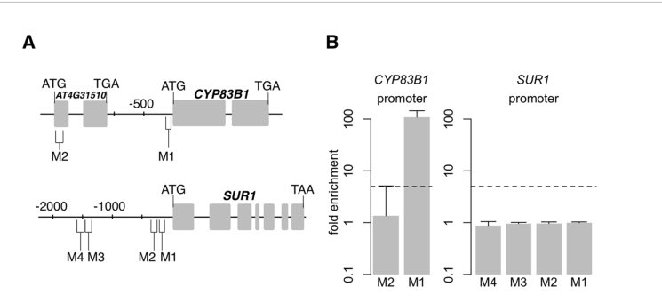

## Question

# Gene Research for Functional Annotation

## ⚠️ CRITICAL: Gene/Protein Identification Context

**BEFORE YOU BEGIN RESEARCH:** You MUST verify you are researching the CORRECT gene/protein. Gene symbols can be ambiguous, especially for less well-characterized genes from non-model organisms.

### Target Gene/Protein Identity (from UniProt):
- **UniProt Accession:** O49782
- **Protein Description:** RecName: Full=Transcription factor MYB51; AltName: Full=Myb-related protein 51; Short=AtMYB51; AltName: Full=Protein HIGH INDOLIC GLUCOSINOLATE 1; AltName: Full=Transcription factor HIG1;
- **Gene Information:** Name=MYB51; Synonyms=HIG1; OrderedLocusNames=At1g18570; ORFNames=F25I16.9;
- **Organism (full):** Arabidopsis thaliana (Mouse-ear cress).
- **Protein Family:** Not specified in UniProt
- **Key Domains:** Homeodomain-like_sf. (IPR009057); Myb_dom. (IPR017930); Myb_TF_plants. (IPR015495); SANT/Myb. (IPR001005); Myb_DNA-binding (PF00249)

### MANDATORY VERIFICATION STEPS:

1. **Check if the gene symbol "MYB51" matches the protein description above**
2. **Verify the organism is correct:** Arabidopsis thaliana (Mouse-ear cress).
3. **Check if protein family/domains align with what you find in literature**
4. **If you find literature for a DIFFERENT gene with the same or similar symbol, STOP**

### If Gene Symbol is Ambiguous or You Cannot Find Relevant Literature:

**DO NOT PROCEED WITH RESEARCH ON A DIFFERENT GENE.** Instead:
- State clearly: "The gene symbol 'MYB51' is ambiguous or literature is limited for this specific protein"
- Explain what you found (e.g., "Found extensive literature on a different gene with the same symbol in a different organism")
- Describe the protein based ONLY on the UniProt information provided above
- Suggest that the protein function can be inferred from domain/family information

### Research Target:

Please provide a comprehensive research report on the gene **MYB51** (gene ID: MYB51, UniProt: O49782) in ARATH.

The research report should be a detailed narrative explaining the function, biological processes, and localization of the gene product. Citations should be given for all claims.

You should prioritize authoritative reviews and primary scientific literature when conducting research. You can supplement
this with annotations you find in gene/protein databases, but these can be outdated or inaccurate.

We are specifically interested in the primary function of the gene - for enzymes, what reaction is catalyzed, and what is the substrate specificity? For transporters, what is the substrate? For structural proteins or adapters, what is the broader structural role? For signaling molecules, what is the role in the pathway.

We are interested in where in or outside the cell the gene product carries out its function.

We are also interested in the signaling or biochemical pathways in which the gene functions. We are less interested in broad pleiotropic effects, except where these elucidate the precise role.

Include evidence where possible. We are interested in both experimental evidence as well as inference from structure, evolution, or bioinformatic analysis. Precise studies should be prioritized over high-throughput, where available.

## Output

Question: You are an expert researcher providing comprehensive, well-cited information.

Provide detailed information focusing on:
1. Key concepts and definitions with current understanding
2. Recent developments and latest research (prioritize 2023-2024 sources)
3. Current applications and real-world implementations
4. Expert opinions and analysis from authoritative sources
5. Relevant statistics and data from recent studies

Format as a comprehensive research report with proper citations. Include URLs and publication dates where available.
Always prioritize recent, authoritative sources and provide specific citations for all major claims.

# Gene Research for Functional Annotation

## ⚠️ CRITICAL: Gene/Protein Identification Context

**BEFORE YOU BEGIN RESEARCH:** You MUST verify you are researching the CORRECT gene/protein. Gene symbols can be ambiguous, especially for less well-characterized genes from non-model organisms.

### Target Gene/Protein Identity (from UniProt):
- **UniProt Accession:** O49782
- **Protein Description:** RecName: Full=Transcription factor MYB51; AltName: Full=Myb-related protein 51; Short=AtMYB51; AltName: Full=Protein HIGH INDOLIC GLUCOSINOLATE 1; AltName: Full=Transcription factor HIG1;
- **Gene Information:** Name=MYB51; Synonyms=HIG1; OrderedLocusNames=At1g18570; ORFNames=F25I16.9;
- **Organism (full):** Arabidopsis thaliana (Mouse-ear cress).
- **Protein Family:** Not specified in UniProt
- **Key Domains:** Homeodomain-like_sf. (IPR009057); Myb_dom. (IPR017930); Myb_TF_plants. (IPR015495); SANT/Myb. (IPR001005); Myb_DNA-binding (PF00249)

### MANDATORY VERIFICATION STEPS:

1. **Check if the gene symbol "MYB51" matches the protein description above**
2. **Verify the organism is correct:** Arabidopsis thaliana (Mouse-ear cress).
3. **Check if protein family/domains align with what you find in literature**
4. **If you find literature for a DIFFERENT gene with the same or similar symbol, STOP**

### If Gene Symbol is Ambiguous or You Cannot Find Relevant Literature:

**DO NOT PROCEED WITH RESEARCH ON A DIFFERENT GENE.** Instead:
- State clearly: "The gene symbol 'MYB51' is ambiguous or literature is limited for this specific protein"
- Explain what you found (e.g., "Found extensive literature on a different gene with the same symbol in a different organism")
- Describe the protein based ONLY on the UniProt information provided above
- Suggest that the protein function can be inferred from domain/family information

### Research Target:

Please provide a comprehensive research report on the gene **MYB51** (gene ID: MYB51, UniProt: O49782) in ARATH.

The research report should be a detailed narrative explaining the function, biological processes, and localization of the gene product. Citations should be given for all claims.

You should prioritize authoritative reviews and primary scientific literature when conducting research. You can supplement
this with annotations you find in gene/protein databases, but these can be outdated or inaccurate.

We are specifically interested in the primary function of the gene - for enzymes, what reaction is catalyzed, and what is the substrate specificity? For transporters, what is the substrate? For structural proteins or adapters, what is the broader structural role? For signaling molecules, what is the role in the pathway.

We are interested in where in or outside the cell the gene product carries out its function.

We are also interested in the signaling or biochemical pathways in which the gene functions. We are less interested in broad pleiotropic effects, except where these elucidate the precise role.

Include evidence where possible. We are interested in both experimental evidence as well as inference from structure, evolution, or bioinformatic analysis. Precise studies should be prioritized over high-throughput, where available.

# Functional annotation of *Arabidopsis thaliana* MYB51

## Identity and principal function

**The target is *Arabidopsis thaliana* MYB51/HIG1, locus At1g18570, corresponding to the supplied UniProt accession O49782—not a similarly named gene in another species.** The original locus-specific study identified At1g18570 as HIGH INDOLIC GLUCOSINOLATE 1 and classified its 352-amino-acid product as a subgroup-12 **R2R3-MYB transcription factor**. Its paired MYB DNA-binding repeats agree with the MYB/SANT-related domains specified in the query; the broad “homeodomain-like” annotation should not be mistaken for evidence that it is a classical homeobox protein. (gigolashvili2007thetranscriptionfactor pages 2-3, berger2007theroleofa pages 34-39)

MYB51’s primary function is **transcriptional control of tryptophan-derived indole glucosinolate biosynthesis**, particularly in shoots and during some immune responses. It is **not an enzyme or a metabolite transporter**: it has no assigned catalytic reaction, chemical substrate specificity, or transported substrate. Its experimentally supported molecular targets are promoter regions of biosynthetic genes; the metabolic reactions themselves are catalyzed by the enzymes whose expression it regulates. (gigolashvili2007thetranscriptionfactor pages 2-3, barco2020hierarchicalanddynamic pages 6-7, frerigmann2014myb34myb51and pages 3-4)

## Molecular mechanism and pathway position

Indole glucosinolates are sulfur-containing specialized metabolites derived from tryptophan. CYP79B2 and CYP79B3 catalyze conversion of tryptophan into indole-3-acetaldoxime (**IAOx**), a branch-point precursor also used in other indolic defense pathways. CYP83B1 channels IAOx toward the indole-glucosinolate core, leading to indol-3-ylmethyl glucosinolate (**I3M**, glucobrassicin); downstream modification produces, among other compounds, 4-methoxy-I3M. MYB51 controls *flux into and through this branch by regulating gene expression*, rather than performing any of these conversions itself. (frerigmann2014myb34myb51and pages 3-4, barco2020hierarchicalanddynamic pages 2-4, barco2020hierarchicalanddynamic pages 6-7)

The distinction between **promoter activation** and **demonstrated chromatin occupancy** matters. In 2007, MYB51 activated reporter promoters of *DHS1, TSB1, CYP79B2, CYP79B3, CYP83B1* and *AtST5a*; *ASA1* was not activated. These reporter assays established transcriptional capacity but did not alone prove physical promoter occupancy. In pathogen-elicited Arabidopsis seedlings, a 2020 chromatin-immunoprecipitation study subsequently found **greater than tenfold MYB51 enrichment** at proximal MYB-responsive regions of *CYP79B2, CYP79B3* and *CYP83B1*. Its promoter maps and ChIP results directly support these three loci as in-vivo chromatin-associated targets; *SUR1* expression responded to MYB51, but none of the four tested *SUR1* promoter regions showed MYB51 occupancy, favoring indirect regulation there. ChIP demonstrates occupancy in plant chromatin, not, by itself, a purified-protein binding affinity or an exclusive consensus sequence. (gigolashvili2007thetranscriptionfactor pages 3-5, barco2020hierarchicalanddynamic pages 6-7, barco2020hierarchicalanddynamic media c75a5469)

The following summary separates directly supported promoter effects from downstream metabolic consequences. (gigolashvili2007thetranscriptionfactor pages 3-5, barco2020hierarchicalanddynamic pages 7-10, barco2020hierarchicalanddynamic pages 6-7)

| Target/pathway | Experimental evidence in *Arabidopsis thaliana* AtMYB51/HIG1 | Regulatory direction | Source |
|---|---|---|---|
| **CYP79B2 and CYP79B3** — Trp → indole-3-acetaldoxime entry step | Promoter–GUS assays showed MYB51-dependent transactivation in 2007. During *Pseudomonas syringae* avrRpm1 elicitation, MYB51 restored reduced expression in *myb51 myb122*; ChIP–PCR showed **greater than 10-fold enrichment** at proximal SMRE-containing promoter regions. ChIP demonstrates in-vivo chromatin occupancy, not purified-protein sequence-specific binding. | Direct activation | [Gigolashvili et al., 2007](https://doi.org/10.1111/j.1365-313x.2007.03099.x); [Barco and Clay, 2020](https://doi.org/10.3389/fpls.2019.01775) (gigolashvili2007thetranscriptionfactor pages 3-5, barco2020hierarchicalanddynamic pages 6-7, barco2020hierarchicalanddynamic media c75a5469) |
| **CYP83B1** — commitment toward indole-glucosinolate synthesis | Promoter–GUS transactivation was reported in 2007. Pathogen-elicited ChIP–PCR in 2020 detected **greater than 10-fold enrichment** at a proximal SMRE-containing promoter region, with MYB51-dependent restoration of transcript abundance. | Direct activation | [Gigolashvili et al., 2007](https://doi.org/10.1111/j.1365-313x.2007.03099.x); [Barco and Clay, 2020](https://doi.org/10.3389/fpls.2019.01775) (gigolashvili2007thetranscriptionfactor pages 3-5, barco2020hierarchicalanddynamic pages 6-7, barco2020hierarchicalanddynamic media c75a5469) |
| **SUR1** — core glucosinolate C–S lyase step | *SUR1* expression decreased in *myb51 myb122* and was restored by induced MYB51, but MYB51 did **not** occupy any of four tested SMRE-containing *SUR1* promoter regions by ChIP–PCR. | Indirect activation | [Barco and Clay, 2020](https://doi.org/10.3389/fpls.2019.01775) (barco2020hierarchicalanddynamic pages 6-7) |
| **CYP82C2** — ICN → 4OH-ICN branch | *CYP82C2* expression was **3.5-fold higher** in *myb51 myb122* after pathogen elicitation and returned toward wild-type levels after MYB51 induction. MYB51 showed **greater than 10-fold ChIP enrichment** at two SMRE-containing promoter regions. | Direct repression | [Barco and Clay, 2020](https://doi.org/10.3389/fpls.2019.01775) (barco2020hierarchicalanddynamic pages 7-10) |
| **CYP71A12, CYP71A13 and CYP71B15/PAD3** — 4OH-ICN and camalexin branches | MYB51 induction did not activate *CYP71A12* or *CYP71A13*, and prior assays did not support activation of *PAD3*. Effects on camalexin and 4OH-ICN therefore arise chiefly through upstream flux control rather than demonstrated direct targeting. BES1 physically interacts with MYB51 and suppresses MYB51-driven *CYP79B3* and *UGT74B1* reporters, adding a negative regulatory layer. | No demonstrated direct activation; downstream effects are indirect and context-dependent | [Barco and Clay, 2020](https://doi.org/10.3389/fpls.2019.01775); [Liao et al., 2020](https://doi.org/10.1104/pp.19.01220) (barco2020hierarchicalanddynamic pages 6-7, liao2020brassinosteroidsantagonizejasmonateactivated pages 19-25) |

*Table: Direct and indirect molecular targets of Arabidopsis At1g18570/MYB51, separated by evidence type and regulatory direction. Chromatin occupancy is distinguished from purified-protein DNA-binding evidence.*

MYB51 is **not invariably an activator**. Under effector-triggered immunity elicited by *Pseudomonas syringae* carrying *avrRpm1*, MYB51 occupied MYB-responsive regions of *CYP82C2* and repressed its expression; *CYP82C2* transcripts were **3.5-fold higher** in *myb51 myb122* than in wild type. CYP82C2 participates in production of 4-hydroxy-indole-3-carbonylnitrile (**4OH-ICN**). Thus MYB51 can promote precursor supply via *CYP79B2/B3* while restraining this particular downstream branch via *CYP82C2*. In the same study, evidence did **not** support MYB51 directly activating the tested downstream camalexin or 4OH-ICN genes *CYP71A12, CYP71A13* or *CYP71B15/PAD3*. (barco2020hierarchicalanddynamic pages 7-10, barco2020hierarchicalanddynamic pages 6-7)

## Where the protein acts

**Subcellular site: nucleus.** Full-length MYB51–GFP accumulated in nuclei of tobacco BY2 protoplasts, cultured Arabidopsis cells and transiently transformed Arabidopsis leaves, consistent with a protein acting on nuclear gene transcription. The proposed basic amino-acid stretch *KKRLIKK* is a candidate localization signal, not a separately demonstrated import mechanism. Promoter-reporter experiments detected *MYB51* expression in vascular-associated regions as well as leaf mesophyll, young-leaf pavement cells and trichomes; these expression territories should not be confused with additional protein compartments. The protein’s established functional site is the nucleus, **not** the chloroplast, glucosinolate storage compartment or extracellular space. (gigolashvili2007thetranscriptionfactor pages 2-3, gigolashvili2007thetranscriptionfactor pages 12-13)

## Genetic, metabolic and physiological evidence

Activation-tagged **HIG1-1D** plants accumulated approximately **six times** as much I3M as wild type; independent constitutive MYB51-overexpression lines accumulated **three- to eightfold** as much. Other indolic glucosinolates, including 4-methoxy-I3M and 1-methoxy-I3M, also rose. Total glucosinolates increased by up to **threefold**, whereas the *hig1-1* loss-of-function line had total glucosinolates at approximately **one-third** of wild-type levels. These are genotype- and growth-condition-specific results, not universal effect sizes; the same original study also noted changes in an aliphatic glucosinolate, so MYB51 should not be described as metabolically insulated from the rest of glucosinolate metabolism. (gigolashvili2007thetranscriptionfactor pages 2-3)

Comparative Arabidopsis mutant analyses clarified redundancy: **MYB51 is particularly important for indole glucosinolate production in shoots; MYB34 has the stronger basal role in roots; MYB122 contributes more modestly.** The *myb34 myb51 myb122* triple mutant lacked detectable indole glucosinolates under the study’s standard conditions. With hormone treatments, MYB51 was the central regulator of the indole-glucosinolate response to **salicylic acid and ethylene**, whereas MYB34 was more important under **abscisic acid and jasmonate** treatments. These are relative roles, not claims that individual hormones act exclusively through one factor. (frerigmann2014myb34myb51and pages 3-4, frerigmann2014myb34myb51and pages 11-12)

The defense phenotype has direct experimental support. In a dual-choice leaf-feeding assay with the generalist herbivore *Spodoptera exigua* (**20 larvae per comparison**), larvae avoided high-indolic-glucosinolate HIG1-1D tissue compared with wild type (**P = 0.0026**) and *hig1-1* (**P = 0.0113**); wild type versus *hig1-1* was not significantly different (**P = 0.757**). This demonstrates a feeding preference associated with the overexpression genotype, **not** that MYB51 alone determines all insect resistance. MYB51 transcripts also rose within approximately **10 minutes** after mechanical injury, peaked around **30 minutes** and declined after an hour. (gigolashvili2007thetranscriptionfactor pages 9-10, gigolashvili2007thetranscriptionfactor pages 8-9)

## Integration with immunity and other transcription factors

Under the bacterial flagellin elicitor **flg22**, MYB51 is strongly induced and is especially important for inducing *CYP79B2/B3* and *CYP83B1* and for accumulating indole glucosinolates. A 2016 study distinguished its principal action on I3M biosynthesis from the **PEN2-dependent hydrolysis** of modified glucosinolates and subsequent feedback affecting other indolic metabolites. During infection by *Plectosphaerella cucumerina*, combined MYB loss impaired indole-glucosinolate defense and the triple mutant showed **pen2-like susceptibility**, but pathogen-induced camalexin could remain intact: reduced indole glucosinolates should therefore not be equated with a constitutive inability to synthesize every tryptophan-derived phytoalexin. (frerigmann2016regulationofpathogentriggered pages 7-10, frerigmann2016regulationofpathogentriggered pages 10-13, frerigmann2016regulationofpathogentriggered pages 1-5)

The regulatory hierarchy becomes more context-dependent in effector-triggered immunity. MYB51 expression increased approximately **100-fold** after the *P. syringae avrRpm1* challenge in the reported seedling system. WRKY33 occupied and activated the *MYB51* promoter; both factors contributed to *CYP79B2/B3* expression, but their effects on *CYP82C2* opposed one another—WRKY33 activating and MYB51 repressing it. This explains why MYB51’s contribution to **camalexin and 4OH-ICN is conditional and partly mediated through shared precursor supply**, rather than demonstrating that it is their sole master regulator. (barco2020hierarchicalanddynamic pages 2-4, barco2020hierarchicalanddynamic pages 10-12, barco2020hierarchicalanddynamic pages 7-10, barco2020hierarchicalanddynamic pages 6-7)

A second regulatory input connects hormone signaling to MYB51 activity: the brassinosteroid-responsive factor **BES1** associated with MYB51 in co-immunoprecipitation and nuclear bimolecular-fluorescence-complementation experiments, and BES1 reduced MYB51-dependent *CYP79B3* and *UGT74B1* promoter-reporter activation. This provides a mechanistic example of growth–defense signaling constraining MYB51-driven indole-glucosinolate transcription; it does not show that MYB51 is itself a brassinosteroid receptor. (liao2020brassinosteroidsantagonizejasmonateactivated pages 19-25)

## Recent research, applications and limits of inference

**Recency and organism boundary.** The strongest locus-specific functional experiments identified here date from **2007–2020**. Relevant **2023–2024** publications frequently investigate *other* glucosinolate regulators or MYB51 **orthologs**, rather than adding comparable direct molecular evidence for Arabidopsis **At1g18570**. For example, a **2024** Arabidopsis light-signaling study experimentally implicated HY5–HDA9 repression at *MYB29* and *IMD1* promoters; it does **not** demonstrate HY5 binding the *MYB51* promoter. Likewise, results for *Brassica* genes named *BnaMYB51* or *BoMYB51* must not be presented as experiments on O49782. This is a limit of the identified gene-specific literature, not evidence that the established MYB51 function has changed. (choi2024elongatedhypocotyl5 pages 1-1, gigolashvili2007thetranscriptionfactor pages 2-3, barco2020hierarchicalanddynamic pages 6-7)

**Practical use remains chiefly research-stage.** Arabidopsis MYB51 overexpression provides an experimentally demonstrated lever for increasing indole glucosinolates and altering herbivore feeding. As a translational example, a **2022** mapping study of **139 F₄ rocket (*Eruca*) lines** identified **20 QTL** and associated an *Eruca* MYB51 ortholog, among other candidates, with 4-methoxyglucobrassicin concentration. That is a *candidate association for crop breeding*, **not** functional validation of the Arabidopsis protein in rocket or evidence of a deployed MYB51-engineered cultivar. Context-dependent hormone inputs, regulator redundancy and MYB51-mediated repression of *CYP82C2* also argue against assuming that simply increasing MYB51 will raise every desirable indolic defense product simultaneously. (gigolashvili2007thetranscriptionfactor pages 2-3, bell2022quantitativetraitloci pages 1-3, barco2020hierarchicalanddynamic pages 7-10, frerigmann2014myb34myb51and pages 3-4)

### Key sources, with publication dates and URLs

- Gigolashvili *et al.*, **April 2007**, *The Plant Journal*: original At1g18570/HIG1 identification, localization, genetic and herbivore experiments. https://doi.org/10.1111/j.1365-313x.2007.03099.x (gigolashvili2007thetranscriptionfactor pages 2-3, gigolashvili2007thetranscriptionfactor pages 9-10)
- Frerigmann and Gigolashvili, **May 2014**, *Molecular Plant*: shoot/root and hormone-dependent genetic dissection. https://doi.org/10.1093/mp/ssu004 (frerigmann2014myb34myb51and pages 3-4)
- Frerigmann *et al.*, **May 2016**, *Molecular Plant*: flg22, fungal infection and PEN2-dependent pathway distinctions. https://doi.org/10.1016/j.molp.2016.01.006 (frerigmann2016regulationofpathogentriggered pages 7-10, frerigmann2016regulationofpathogentriggered pages 1-5)
- Barco and Clay, **January 2020**, *Frontiers in Plant Science*: MYB51 promoter occupancy and opposing activation/repression within the immune metabolic network. https://doi.org/10.3389/fpls.2019.01775 (barco2020hierarchicalanddynamic pages 6-7, barco2020hierarchicalanddynamic pages 7-10)
- Liao *et al.*, **2020**, *Plant Physiology*: BES1–MYB51 interaction and reporter inhibition. https://doi.org/10.1104/pp.19.01220 (liao2020brassinosteroidsantagonizejasmonateactivated pages 19-25)
- Bell *et al.*, **October 2022**, *Molecular Horticulture*: MYB51-ortholog QTL candidate in rocket, **not** the Arabidopsis locus. https://doi.org/10.1186/s43897-022-00044-x (bell2022quantitativetraitloci pages 1-3)
- Choi *et al.*, **16 May 2024 online**, *Plant Physiology*: contemporary Arabidopsis glucosinolate regulation through HY5, HDA9, *MYB29* and *IMD1*; useful pathway context, **not** direct MYB51-target evidence. https://doi.org/10.1093/plphys/kiae284 (choi2024elongatedhypocotyl5 pages 1-1)

References

1. (gigolashvili2007thetranscriptionfactor pages 2-3): Tamara Gigolashvili, Bettina Berger, Hans‐Peter Mock, Caroline Müller, Bernd Weisshaar, and Ulf‐Ingo Flügge. The transcription factor hig1/myb51 regulates indolic glucosinolate biosynthesis in arabidopsis thaliana. The Plant journal : for cell and molecular biology, 50 5:886-901, Apr 2007. URL: https://doi.org/10.1111/j.1365-313x.2007.03099.x, doi:10.1111/j.1365-313x.2007.03099.x. This article has 496 citations.

2. (berger2007theroleofa pages 34-39): B Berger. The role of hig1/myb51 in the regulation of indolic glucosinolate biosynthesis. Unknown journal, 2007.

3. (barco2020hierarchicalanddynamic pages 6-7): Brenden Barco and Nicole K. Clay. Hierarchical and dynamic regulation of defense-responsive specialized metabolism by wrky and myb transcription factors. Frontiers in Plant Science, Jan 2020. URL: https://doi.org/10.3389/fpls.2019.01775, doi:10.3389/fpls.2019.01775. This article has 48 citations.

4. (frerigmann2014myb34myb51and pages 3-4): Henning Frerigmann and Tamara Gigolashvili. Myb34, myb51, and myb122 distinctly regulate indolic glucosinolate biosynthesis in arabidopsis thaliana. Molecular plant, 7 5:814-28, May 2014. URL: https://doi.org/10.1093/mp/ssu004, doi:10.1093/mp/ssu004. This article has 398 citations and is from a highest quality peer-reviewed journal.

5. (barco2020hierarchicalanddynamic pages 2-4): Brenden Barco and Nicole K. Clay. Hierarchical and dynamic regulation of defense-responsive specialized metabolism by wrky and myb transcription factors. Frontiers in Plant Science, Jan 2020. URL: https://doi.org/10.3389/fpls.2019.01775, doi:10.3389/fpls.2019.01775. This article has 48 citations.

6. (gigolashvili2007thetranscriptionfactor pages 3-5): Tamara Gigolashvili, Bettina Berger, Hans‐Peter Mock, Caroline Müller, Bernd Weisshaar, and Ulf‐Ingo Flügge. The transcription factor hig1/myb51 regulates indolic glucosinolate biosynthesis in arabidopsis thaliana. The Plant journal : for cell and molecular biology, 50 5:886-901, Apr 2007. URL: https://doi.org/10.1111/j.1365-313x.2007.03099.x, doi:10.1111/j.1365-313x.2007.03099.x. This article has 496 citations.

7. (barco2020hierarchicalanddynamic media c75a5469): Brenden Barco and Nicole K. Clay. Hierarchical and dynamic regulation of defense-responsive specialized metabolism by wrky and myb transcription factors. Frontiers in Plant Science, Jan 2020. URL: https://doi.org/10.3389/fpls.2019.01775, doi:10.3389/fpls.2019.01775. This article has 48 citations.

8. (barco2020hierarchicalanddynamic pages 7-10): Brenden Barco and Nicole K. Clay. Hierarchical and dynamic regulation of defense-responsive specialized metabolism by wrky and myb transcription factors. Frontiers in Plant Science, Jan 2020. URL: https://doi.org/10.3389/fpls.2019.01775, doi:10.3389/fpls.2019.01775. This article has 48 citations.

9. (liao2020brassinosteroidsantagonizejasmonateactivated pages 19-25): Ke Liao, Yu-Jun Peng, Li-Bing Yuan, Yang-Shuo Dai, Qin-Fang Chen, Lu-Jun Yu, Ming-Yi Bai, Wen-Qing Zhang, Li-Juan Xie, and Shi Xiao. Brassinosteroids antagonize jasmonate-activated plant defense responses through bri1-ems-suppressor1 (bes1)1. Plant Physiology, 182:1066-1082, Nov 2020. URL: https://doi.org/10.1104/pp.19.01220, doi:10.1104/pp.19.01220. This article has 104 citations and is from a highest quality peer-reviewed journal.

10. (gigolashvili2007thetranscriptionfactor pages 12-13): Tamara Gigolashvili, Bettina Berger, Hans‐Peter Mock, Caroline Müller, Bernd Weisshaar, and Ulf‐Ingo Flügge. The transcription factor hig1/myb51 regulates indolic glucosinolate biosynthesis in arabidopsis thaliana. The Plant journal : for cell and molecular biology, 50 5:886-901, Apr 2007. URL: https://doi.org/10.1111/j.1365-313x.2007.03099.x, doi:10.1111/j.1365-313x.2007.03099.x. This article has 496 citations.

11. (frerigmann2014myb34myb51and pages 11-12): Henning Frerigmann and Tamara Gigolashvili. Myb34, myb51, and myb122 distinctly regulate indolic glucosinolate biosynthesis in arabidopsis thaliana. Molecular plant, 7 5:814-28, May 2014. URL: https://doi.org/10.1093/mp/ssu004, doi:10.1093/mp/ssu004. This article has 398 citations and is from a highest quality peer-reviewed journal.

12. (gigolashvili2007thetranscriptionfactor pages 9-10): Tamara Gigolashvili, Bettina Berger, Hans‐Peter Mock, Caroline Müller, Bernd Weisshaar, and Ulf‐Ingo Flügge. The transcription factor hig1/myb51 regulates indolic glucosinolate biosynthesis in arabidopsis thaliana. The Plant journal : for cell and molecular biology, 50 5:886-901, Apr 2007. URL: https://doi.org/10.1111/j.1365-313x.2007.03099.x, doi:10.1111/j.1365-313x.2007.03099.x. This article has 496 citations.

13. (gigolashvili2007thetranscriptionfactor pages 8-9): Tamara Gigolashvili, Bettina Berger, Hans‐Peter Mock, Caroline Müller, Bernd Weisshaar, and Ulf‐Ingo Flügge. The transcription factor hig1/myb51 regulates indolic glucosinolate biosynthesis in arabidopsis thaliana. The Plant journal : for cell and molecular biology, 50 5:886-901, Apr 2007. URL: https://doi.org/10.1111/j.1365-313x.2007.03099.x, doi:10.1111/j.1365-313x.2007.03099.x. This article has 496 citations.

14. (frerigmann2016regulationofpathogentriggered pages 7-10): Henning Frerigmann, Mariola Piślewska-Bednarek, Andrea Sánchez-Vallet, Antonio Molina, Erich Glawischnig, Tamara Gigolashvili, and Paweł Bednarek. Regulation of pathogen-triggered tryptophan metabolism in arabidopsis thaliana by myb transcription factors and indole glucosinolate conversion products. Molecular plant, 9 5:682-695, May 2016. URL: https://doi.org/10.1016/j.molp.2016.01.006, doi:10.1016/j.molp.2016.01.006. This article has 182 citations and is from a highest quality peer-reviewed journal.

15. (frerigmann2016regulationofpathogentriggered pages 10-13): Henning Frerigmann, Mariola Piślewska-Bednarek, Andrea Sánchez-Vallet, Antonio Molina, Erich Glawischnig, Tamara Gigolashvili, and Paweł Bednarek. Regulation of pathogen-triggered tryptophan metabolism in arabidopsis thaliana by myb transcription factors and indole glucosinolate conversion products. Molecular plant, 9 5:682-695, May 2016. URL: https://doi.org/10.1016/j.molp.2016.01.006, doi:10.1016/j.molp.2016.01.006. This article has 182 citations and is from a highest quality peer-reviewed journal.

16. (frerigmann2016regulationofpathogentriggered pages 1-5): Henning Frerigmann, Mariola Piślewska-Bednarek, Andrea Sánchez-Vallet, Antonio Molina, Erich Glawischnig, Tamara Gigolashvili, and Paweł Bednarek. Regulation of pathogen-triggered tryptophan metabolism in arabidopsis thaliana by myb transcription factors and indole glucosinolate conversion products. Molecular plant, 9 5:682-695, May 2016. URL: https://doi.org/10.1016/j.molp.2016.01.006, doi:10.1016/j.molp.2016.01.006. This article has 182 citations and is from a highest quality peer-reviewed journal.

17. (barco2020hierarchicalanddynamic pages 10-12): Brenden Barco and Nicole K. Clay. Hierarchical and dynamic regulation of defense-responsive specialized metabolism by wrky and myb transcription factors. Frontiers in Plant Science, Jan 2020. URL: https://doi.org/10.3389/fpls.2019.01775, doi:10.3389/fpls.2019.01775. This article has 48 citations.

18. (choi2024elongatedhypocotyl5 pages 1-1): Dasom Choi, Seong-Hyeon Kim, Da-Min Choi, Heewon Moon, Jeong-Il Kim, Enamul Huq, and Dong-Hwan Kim. Elongated hypocotyl 5 interacts with histone deacetylase 9 to suppress glucosinolate biosynthesis in arabidopsis. Plant physiology, 196:1340-1355, May 2024. URL: https://doi.org/10.1093/plphys/kiae284, doi:10.1093/plphys/kiae284. This article has 22 citations and is from a highest quality peer-reviewed journal.

19. (bell2022quantitativetraitloci pages 1-3): Luke Bell, Martin Chadwick, Manik Puranik, Richard Tudor, Lisa Methven, and Carol Wagstaff. Quantitative trait loci analysis of glucosinolate, sugar, and organic acid concentrations in eruca vesicaria subsp. sativa. Molecular Horticulture, Oct 2022. URL: https://doi.org/10.1186/s43897-022-00044-x, doi:10.1186/s43897-022-00044-x. This article has 6 citations.

## Artifacts

- [Edison artifact artifact-00](MYB51-deep-research-falcon_artifacts/artifact-00.md)

## Citations

1. barco2020hierarchicalanddynamic pages 6-7
2. barco2020hierarchicalanddynamic pages 7-10
3. gigolashvili2007thetranscriptionfactor pages 2-3
4. liao2020brassinosteroidsantagonizejasmonateactivated pages 19-25
5. bell2022quantitativetraitloci pages 1-3
6. berger2007theroleofa pages 34-39
7. barco2020hierarchicalanddynamic pages 2-4
8. gigolashvili2007thetranscriptionfactor pages 3-5
9. gigolashvili2007thetranscriptionfactor pages 12-13
10. gigolashvili2007thetranscriptionfactor pages 9-10
11. gigolashvili2007thetranscriptionfactor pages 8-9
12. frerigmann2016regulationofpathogentriggered pages 7-10
13. frerigmann2016regulationofpathogentriggered pages 10-13
14. frerigmann2016regulationofpathogentriggered pages 1-5
15. barco2020hierarchicalanddynamic pages 10-12
16. Gigolashvili et al., 2007
17. Barco and Clay, 2020
18. Liao et al., 2020
19. https://doi.org/10.1111/j.1365-313x.2007.03099.x
20. https://doi.org/10.3389/fpls.2019.01775
21. https://doi.org/10.1104/pp.19.01220
22. https://doi.org/10.1093/mp/ssu004
23. https://doi.org/10.1016/j.molp.2016.01.006
24. https://doi.org/10.1186/s43897-022-00044-x
25. https://doi.org/10.1093/plphys/kiae284
26. https://doi.org/10.1111/j.1365-313x.2007.03099.x,
27. https://doi.org/10.3389/fpls.2019.01775,
28. https://doi.org/10.1093/mp/ssu004,
29. https://doi.org/10.1104/pp.19.01220,
30. https://doi.org/10.1016/j.molp.2016.01.006,
31. https://doi.org/10.1093/plphys/kiae284,
32. https://doi.org/10.1186/s43897-022-00044-x,