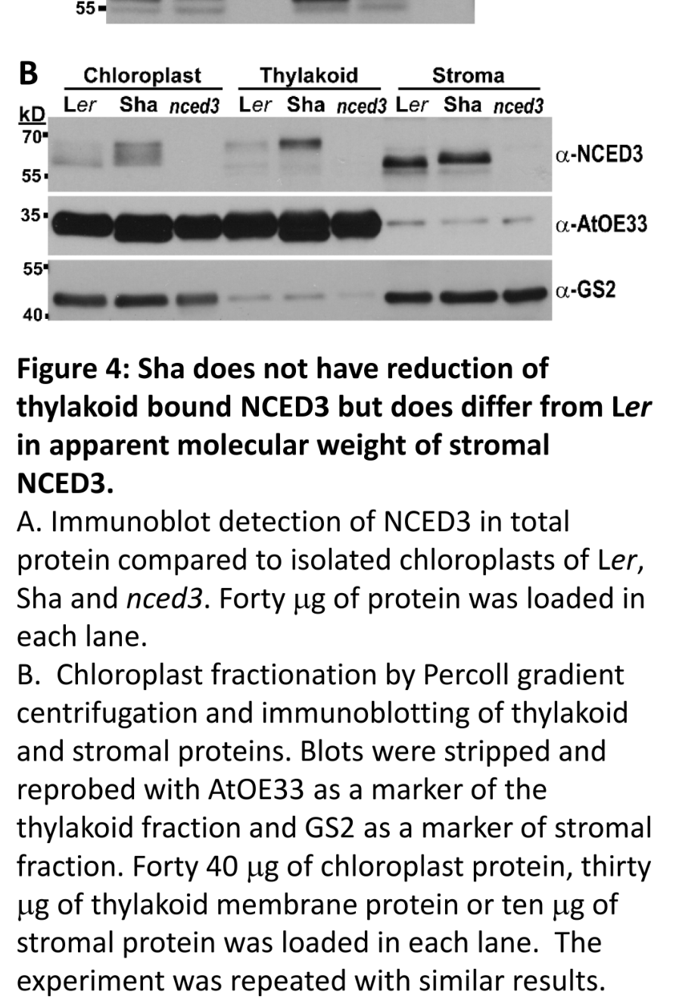

## Question

# Gene Research for Functional Annotation

## ⚠️ CRITICAL: Gene/Protein Identification Context

**BEFORE YOU BEGIN RESEARCH:** You MUST verify you are researching the CORRECT gene/protein. Gene symbols can be ambiguous, especially for less well-characterized genes from non-model organisms.

### Target Gene/Protein Identity (from UniProt):
- **UniProt Accession:** Q9LRR7
- **Protein Description:** RecName: Full=9-cis-epoxycarotenoid dioxygenase NCED3, chloroplastic {ECO:0000303|PubMed:11532178}; Short=AtNCED3 {ECO:0000303|PubMed:11532178}; EC=1.13.11.51 {ECO:0000269|PubMed:11532178, ECO:0000269|PubMed:15466233}; AltName: Full=Protein SALT TOLERANT 1 {ECO:0000303|PubMed:15466233}; Flags: Precursor;
- **Gene Information:** Name=NCED3 {ECO:0000303|PubMed:11532178}; Synonyms=STO1 {ECO:0000303|PubMed:15466233}; OrderedLocusNames=At3g14440 {ECO:0000312|Araport:AT3G14440}; ORFNames=MOA2.4 {ECO:0000312|EMBL:BAB01336.1};
- **Organism (full):** Arabidopsis thaliana (Mouse-ear cress).
- **Protein Family:** Belongs to the carotenoid oxygenase family. .
- **Key Domains:** Carotenoid_Oase. (IPR004294); RPE65 (PF03055)

### MANDATORY VERIFICATION STEPS:

1. **Check if the gene symbol "NCED3" matches the protein description above**
2. **Verify the organism is correct:** Arabidopsis thaliana (Mouse-ear cress).
3. **Check if protein family/domains align with what you find in literature**
4. **If you find literature for a DIFFERENT gene with the same or similar symbol, STOP**

### If Gene Symbol is Ambiguous or You Cannot Find Relevant Literature:

**DO NOT PROCEED WITH RESEARCH ON A DIFFERENT GENE.** Instead:
- State clearly: "The gene symbol 'NCED3' is ambiguous or literature is limited for this specific protein"
- Explain what you found (e.g., "Found extensive literature on a different gene with the same symbol in a different organism")
- Describe the protein based ONLY on the UniProt information provided above
- Suggest that the protein function can be inferred from domain/family information

### Research Target:

Please provide a comprehensive research report on the gene **NCED3** (gene ID: NCED3, UniProt: Q9LRR7) in ARATH.

The research report should be a detailed narrative explaining the function, biological processes, and localization of the gene product. Citations should be given for all claims.

You should prioritize authoritative reviews and primary scientific literature when conducting research. You can supplement
this with annotations you find in gene/protein databases, but these can be outdated or inaccurate.

We are specifically interested in the primary function of the gene - for enzymes, what reaction is catalyzed, and what is the substrate specificity? For transporters, what is the substrate? For structural proteins or adapters, what is the broader structural role? For signaling molecules, what is the role in the pathway.

We are interested in where in or outside the cell the gene product carries out its function.

We are also interested in the signaling or biochemical pathways in which the gene functions. We are less interested in broad pleiotropic effects, except where these elucidate the precise role.

Include evidence where possible. We are interested in both experimental evidence as well as inference from structure, evolution, or bioinformatic analysis. Precise studies should be prioritized over high-throughput, where available.

## Output

Question: You are an expert researcher providing comprehensive, well-cited information.

Provide detailed information focusing on:
1. Key concepts and definitions with current understanding
2. Recent developments and latest research (prioritize 2023-2024 sources)
3. Current applications and real-world implementations
4. Expert opinions and analysis from authoritative sources
5. Relevant statistics and data from recent studies

Format as a comprehensive research report with proper citations. Include URLs and publication dates where available.
Always prioritize recent, authoritative sources and provide specific citations for all major claims.

# Gene Research for Functional Annotation

## ⚠️ CRITICAL: Gene/Protein Identification Context

**BEFORE YOU BEGIN RESEARCH:** You MUST verify you are researching the CORRECT gene/protein. Gene symbols can be ambiguous, especially for less well-characterized genes from non-model organisms.

### Target Gene/Protein Identity (from UniProt):
- **UniProt Accession:** Q9LRR7
- **Protein Description:** RecName: Full=9-cis-epoxycarotenoid dioxygenase NCED3, chloroplastic {ECO:0000303|PubMed:11532178}; Short=AtNCED3 {ECO:0000303|PubMed:11532178}; EC=1.13.11.51 {ECO:0000269|PubMed:11532178, ECO:0000269|PubMed:15466233}; AltName: Full=Protein SALT TOLERANT 1 {ECO:0000303|PubMed:15466233}; Flags: Precursor;
- **Gene Information:** Name=NCED3 {ECO:0000303|PubMed:11532178}; Synonyms=STO1 {ECO:0000303|PubMed:15466233}; OrderedLocusNames=At3g14440 {ECO:0000312|Araport:AT3G14440}; ORFNames=MOA2.4 {ECO:0000312|EMBL:BAB01336.1};
- **Organism (full):** Arabidopsis thaliana (Mouse-ear cress).
- **Protein Family:** Belongs to the carotenoid oxygenase family. .
- **Key Domains:** Carotenoid_Oase. (IPR004294); RPE65 (PF03055)

### MANDATORY VERIFICATION STEPS:

1. **Check if the gene symbol "NCED3" matches the protein description above**
2. **Verify the organism is correct:** Arabidopsis thaliana (Mouse-ear cress).
3. **Check if protein family/domains align with what you find in literature**
4. **If you find literature for a DIFFERENT gene with the same or similar symbol, STOP**

### If Gene Symbol is Ambiguous or You Cannot Find Relevant Literature:

**DO NOT PROCEED WITH RESEARCH ON A DIFFERENT GENE.** Instead:
- State clearly: "The gene symbol 'NCED3' is ambiguous or literature is limited for this specific protein"
- Explain what you found (e.g., "Found extensive literature on a different gene with the same symbol in a different organism")
- Describe the protein based ONLY on the UniProt information provided above
- Suggest that the protein function can be inferred from domain/family information

### Research Target:

Please provide a comprehensive research report on the gene **NCED3** (gene ID: NCED3, UniProt: Q9LRR7) in ARATH.

The research report should be a detailed narrative explaining the function, biological processes, and localization of the gene product. Citations should be given for all claims.

You should prioritize authoritative reviews and primary scientific literature when conducting research. You can supplement
this with annotations you find in gene/protein databases, but these can be outdated or inaccurate.

We are specifically interested in the primary function of the gene - for enzymes, what reaction is catalyzed, and what is the substrate specificity? For transporters, what is the substrate? For structural proteins or adapters, what is the broader structural role? For signaling molecules, what is the role in the pathway.

We are interested in where in or outside the cell the gene product carries out its function.

We are also interested in the signaling or biochemical pathways in which the gene functions. We are less interested in broad pleiotropic effects, except where these elucidate the precise role.

Include evidence where possible. We are interested in both experimental evidence as well as inference from structure, evolution, or bioinformatic analysis. Precise studies should be prioritized over high-throughput, where available.

## Research Report: Arabidopsis thaliana **NCED3 / STO1** (UniProt **Q9LRR7**, locus **At3g14440**) — Functional Annotation

### 0) Target verification (critical identity check)
Primary literature explicitly equates **STO1** with **NCED3** in *Arabidopsis thaliana* and identifies it as a **9-cis-epoxycarotenoid dioxygenase** in the abscisic acid (ABA) biosynthetic pathway, matching the UniProt description for Q9LRR7 (chloroplast precursor; carotenoid oxygenase family). (ruggiero2004uncouplingtheeffects pages 1-2, ruggiero2004uncouplingtheeffects pages 2-4)

---

### 1) Key concepts and definitions (current understanding)

#### 1.1 NCED3 is a carotenoid cleavage dioxygenase (CCO/CCD-family enzyme)
NCED3 belongs to the plant carotenoid cleavage dioxygenase family responsible for producing hormone precursors via oxidative cleavage of carotenoids. In ABA biosynthesis, NCED enzymes catalyze the **first committed** and frequently **rate-limiting** step by cleaving epoxycarotenoids to generate **xanthoxin**, the immediate ABA precursor exported to the cytosol for further conversion to ABA. (kalladan2019naturalvariationin pages 1-5, harrison2014biochemicalinvestigationsof pages 57-62)

#### 1.2 Reaction and substrate specificity (what NCED3 does biochemically)
In *Arabidopsis*, NCED3 catalyzes carotenoid cleavage of **9-cis-neoxanthin** and **9-cis-violoxanthin** in chloroplasts to yield **xanthoxin**, which is then exported to the cytoplasm and metabolized to ABA. (kalladan2019naturalvariationin pages 1-5)

Mechanistically, NCED-family enzymes (demonstrated biochemically in characterized NCEDs such as maize VP14) catalyze cleavage at the **11’,12’ double bond** of **9-cis-epoxycarotenoids** and show selectivity for **9-cis** epoxycarotenoid isomers over all-trans forms. (harrison2014biochemicalinvestigationsof pages 57-62)

#### 1.3 Pathway position
NCED3 is described as having a **predominant role in stress-induced ABA accumulation in vegetative tissue** and is a **rate-limiting enzyme for stress-induced ABA synthesis**. (kalladan2019naturalvariationin pages 1-5)

A recent authoritative review of drought/cold regulatory networks emphasizes NCED as rate-limiting for ABA biosynthesis and notes that **NCED3 shows rapid drought-responsive transcript accumulation**, with **nced3 loss-of-function mutants** having reduced ABA and impaired stomatal responses/survival. (kim2024regulatorynetworksin pages 2-3)

#### 1.4 Subcellular localization and where catalysis occurs
NCED3 is plastid-localized via an N-terminal targeting sequence (stroma targeting domain reported for NCED proteins). (kalladan2019naturalvariationin pages 1-5)

Within chloroplasts, NCED3 exists in at least two pools:
- A **thylakoid-associated** form thought to support access to lipid-soluble carotenoid substrates
- A **stromal** form, consistent with processing/release from membranes

Experimental chloroplast fractionation and immunoblotting support NCED3 presence in **both thylakoid and stroma fractions**. (kalladan2019naturalvariationin pages 1-5, kalladan2019naturalvariationin pages 21-24, kalladan2019naturalvariationin media 328d4c21)

This compartmentation is plausibly functional: thylakoid attachment is proposed to be important for accessing membrane-localized substrates and enzymatic activity, and changes in stromal vs thylakoid pools are suggested to reflect post-translational regulation. (kalladan2019naturalvariationin pages 1-5, kalladan2019naturalvariationin pages 5-7)

#### 1.5 Structural/mechanistic features of the enzyme
NCED3 contains conserved iron-chelating histidines (**His-297, His-346, His-411, His-585**) consistent with Fe-dependent dioxygenase chemistry. (kalladan2019naturalvariationin pages 7-10)

Mechanistic proposals for NCED/CCD catalysis include Fe(II)-dependent O2 activation and radical/cation intermediates; inhibition of Arabidopsis NCED3 by abamine has been interpreted as consistent with a substrate cation-like intermediate (reported in a biochemical overview of CCD enzymes). (harrison2014biochemicalinvestigationsof pages 57-62)

---

### 2) Experimental evidence for biological roles (stress physiology and signaling)

#### 2.1 Genetic evidence: sto1/nced3 mutants
The **sto1/nced3** T-DNA mutant demonstrates that NCED3 is required for appropriate stress-induced ABA accumulation:
- Mutants show a confirmed inability to **accumulate ABA during osmotic/salt stress** (basal ABA only moderately altered). (ruggiero2004uncouplingtheeffects pages 1-2, ruggiero2004uncouplingtheeffects pages 2-4)
- Mutants show drought/desiccation-related defects (e.g., increased water loss and soil desiccation sensitivity), consistent with impaired ABA-mediated water conservation. (ruggiero2004uncouplingtheeffects pages 2-4)

At the same time, sto1/nced3 mutants show complex phenotypes under ionic stress:
- Enhanced germination/growth on **NaCl/KCl** media (but hypersensitivity to **LiCl**) and altered ethylene-related outputs, interpreted as uncoupling ABA-dependent growth inhibition from some salt-growth responses. (ruggiero2004uncouplingtheeffects pages 1-2, ruggiero2004uncouplingtheeffects pages 6-7, ruggiero2004uncouplingtheeffects pages 2-4)

Quantitative examples reported include ~**20% higher daily water loss** under extreme desiccation conditions and germination rates of **~80%** (160 mM KCl) and **~60%** (160 mM NaCl) in the mutant. (ruggiero2004uncouplingtheeffects pages 10-11, ruggiero2004uncouplingtheeffects pages 2-4)

#### 2.2 Natural variation and post-translational regulation (chloroplast processing)
A major-effect QTL for ABA accumulation under low water potential identified **NCED3** as a causal locus; accession Sha exhibits ~**40% lower ABA** than Ler under low water potential, and the QTL containing NCED3 explains **26%** of ABA variation. (kalladan2019naturalvariationin pages 5-7)

Functionally, Sha encodes a reduced-function NCED3 allele: despite similar transcript/protein abundance, Sha differs by four amino acid substitutions and shows altered apparent molecular mass patterns consistent with altered post-translational processing and/or release between thylakoid and stroma pools. (kalladan2019naturalvariationin pages 5-7, kalladan2019naturalvariationin pages 7-10)

This line of evidence supports a current model in which **NCED3 activity is regulated not only transcriptionally** (strong stress induction) but also via **chloroplast-localized post-translational processing and membrane association**. (kalladan2019naturalvariationin pages 1-5, kalladan2019naturalvariationin pages 5-7, kalladan2019naturalvariationin pages 7-10)

---

### 3) Recent developments and latest research (prioritizing 2023–2024)

#### 3.1 2023: High-resolution ABA dynamics with next-generation ABACUS2 biosensors
Rowe et al. (Nature Plants; **June 2023**; https://doi.org/10.1038/s41477-023-01447-4) developed high-affinity ABA FRET biosensors (ABACUS2), reporting **KD ≈ 98 nM** for ABACUS2–100n and an **in vitro emission ratio change of +67%**. (rowe2023nextgenerationabacusbiosensors pages 1-2)

Using these sensors and microscopy, they mapped endogenous ABA dynamics and showed that **reduced foliar humidity** triggers ABA accumulation in **root elongation-zone cells** and that long-distance ABA transport contributes to root ABA patterns; they report significant treatment effects (e.g., Treatment F=24.1, P<0.0001) in relevant analyses. (rowe2023nextgenerationabacusbiosensors pages 6-7)

Although NCED3 was not directly manipulated in the extracted excerpts, this work is important context: it provides state-of-the-art methods and quantitative evidence for ABA distribution and dynamics downstream of ABA biosynthesis nodes such as NCED3. (rowe2023nextgenerationabacusbiosensors pages 6-7, rowe2023nextgenerationabacusbiosensors pages 1-2)

#### 3.2 2024: Authoritative synthesis of drought/cold regulatory networks highlights NCED3
Kim et al. (*Plant Physiology*; **March 2024**; https://doi.org/10.1093/plphys/kiae105) summarize ABA homeostasis and emphasize NCED3 as a **rapidly drought-induced** ABA biosynthesis gene, linking nced3 loss-of-function to reduced ABA and impaired stomatal closure/survival. The review also details ABA transport logic (e.g., exporters in vasculature and importers in guard cells), framing NCED3 as a key node in vascular-to-guard-cell ABA signaling. (kim2024regulatorynetworksin pages 2-3)

#### 3.3 2024: ABA-driven stomatal defense in herbivory
Rosa-Díaz et al. (*Plant Physiology*; **April 2024**; https://doi.org/10.1093/plphys/kiae215) show spider-mite herbivory induces ABA accumulation and stomatal closure; ABA deficiency increased susceptibility despite intact canonical biotic signaling, supporting an ABA-mediated defense axis. (rosadiaz2024spidermiteherbivory pages 1-2)

This supports a modern view of ABA (and therefore ABA-biosynthetic control points such as NCED3) as an integrator of abiotic and biotic stress responses via stomatal regulation. (rosadiaz2024spidermiteherbivory pages 1-2)

---

### 4) Current applications and real-world implementations

#### 4.1 Crop engineering: AtNCED3 overexpression in soybean (greenhouse and field)
Molinari et al. (*Genetics and Molecular Biology*; **June 2020**; https://doi.org/10.1590/1678-4685-gmb-2019-0292) engineered soybean expressing **AtNCED3** and evaluated drought-related traits in greenhouse and field contexts. Under water deficit, the transgenic event exhibited **~80% higher intrinsic water-use efficiency (A/gs)** compared to wild type, and AtNCED3 transcript levels increased under water deficit (reported as ~6× in one excerpt). (molinari2020overexpressionofatnced3 pages 1-2, molinari2020overexpressionofatnced3 pages 7-8, molinari2020overexpressionofatnced3 pages 4-5)

The authors also report higher ABA levels under water deficit and improved yield-related traits in at least one field season; however, numeric yield and absolute ABA concentration values were not present in the extracted passages, indicating that quantitative agronomic outcomes likely reside in figures/tables not retrieved here. (molinari2020overexpressionofatnced3 pages 1-2, molinari2020overexpressionofatnced3 pages 8-10)

#### 4.2 Regulatory engineering: transcription-factor control of AtNCED3 as a drought-tolerance strategy
A 2024 study on wheat TaWRKY31 (BMC Plant Biology; **Jan 2024**; https://doi.org/10.1186/s12870-023-04709-7) reports that TaWRKY31 overexpression in Arabidopsis increases expression of ABA/stress genes including **AtNCED3**, accompanied by reduced stomatal opening, reduced water loss, and reduced oxidative damage markers, illustrating a practical approach: manipulating upstream TFs to modulate the NCED3-controlled ABA biosynthesis node. (ge2024tawrky31anovel pages 1-2)

---

### 5) Expert opinion and analysis (authoritative interpretation)

**Consensus position:** NCED3 is consistently framed as a major control point for **stress-induced ABA biosynthesis** in vegetative tissues. Primary evidence supports that (i) it catalyzes the xanthoxin-producing cleavage of 9-cis epoxycarotenoids in plastids, (ii) it is strongly stress-inducible, and (iii) loss-of-function compromises ABA accumulation during stress with downstream impacts on water relations and stress survival. (kalladan2019naturalvariationin pages 1-5, ruggiero2004uncouplingtheeffects pages 1-2, ruggiero2004uncouplingtheeffects pages 2-4, kim2024regulatorynetworksin pages 2-3)

**Emerging nuance:** Beyond transcriptional induction, NCED3 regulation appears to include **sub-chloroplast partitioning** and **post-translational processing** affecting thylakoid association vs stromal pools, potentially tuning activity by altering substrate access or enzyme stability. Natural allelic variation that changes processing patterns correlates with large differences in stress ABA accumulation, supporting physiological relevance of these chloroplast-level regulatory mechanisms. (kalladan2019naturalvariationin pages 5-7, kalladan2019naturalvariationin pages 7-10, kalladan2019naturalvariationin media 328d4c21)

---

### Evidence map (summary table)
The following table consolidates key claims, evidence types, and citations.

| Aspect | Key findings | Evidence type | Source (authors, year, journal) | DOI/URL | Citation ID |
|---|---|---|---|---|---|
| Identity | Target matches **Arabidopsis thaliana NCED3 / STO1 / At3g14440**, a carotenoid-cleavage enzyme in the ABA pathway; sto1 was identified as NCED3. | Primary | Ruggiero et al., 2004, *Plant Physiology* | https://doi.org/10.1104/pp.104.046169 | (ruggiero2004uncouplingtheeffects pages 1-2, ruggiero2004uncouplingtheeffects pages 2-4) |
| Reaction | NCED3 catalyzes cleavage of 9-cis-epoxycarotenoids in the chloroplast to produce **xanthoxin**, the committed ABA precursor; NCED activity cleaves the **11’,12’ double bond** of a 9-cis-epoxycarotenoid. | Primary/review | Kalladan et al., 2019, *Plant Physiology*; Harrison, 2014 | https://doi.org/10.1104/pp.18.01185 | (kalladan2019naturalvariationin pages 1-5, harrison2014biochemicalinvestigationsof pages 57-62) |
| Substrates | Experimentally supported substrates for Arabidopsis NCED3 are **9-cis-neoxanthin** and **9-cis-violoxanthin**; NCED-family enzymes are selective for **9-cis epoxycarotenoids** and not all-trans isomers. | Primary/review | Kalladan et al., 2019, *Plant Physiology*; Harrison, 2014 | https://doi.org/10.1104/pp.18.01185 | (kalladan2019naturalvariationin pages 1-5, harrison2014biochemicalinvestigationsof pages 57-62) |
| Products | The immediate product of NCED3-catalyzed cleavage is **xanthoxin**, which is exported to the cytoplasm for conversion to ABA. | Primary | Kalladan et al., 2019, *Plant Physiology* | https://doi.org/10.1104/pp.18.01185 | (kalladan2019naturalvariationin pages 1-5) |
| Pathway position | NCED3 performs the **rate-limiting, first committed step** of stress-induced ABA biosynthesis in vegetative tissue; downstream enzymes convert xanthoxin to ABA. | Primary/review | Kalladan et al., 2019, *Plant Physiology*; Kim et al., 2024, *Plant Physiology* | https://doi.org/10.1104/pp.18.01185; https://doi.org/10.1093/plphys/kiae105 | (kalladan2019naturalvariationin pages 1-5, kim2024regulatorynetworksin pages 2-3) |
| Subcellular localization | NCED3 has an **N-terminal plastid/stroma-targeting region**, associates with the **thylakoid membrane**, and also exists as a **stromal cleaved form**; chloroplast fractionation/immunoblotting supports partitioning between thylakoid and stroma. | Primary | Kalladan et al., 2019, *Plant Physiology* | https://doi.org/10.1104/pp.18.01185 | (kalladan2019naturalvariationin pages 1-5, kalladan2019naturalvariationin pages 21-24, kalladan2019naturalvariationin pages 5-7, kalladan2019naturalvariationin media 328d4c21) |
| Mechanistic/structural detail | NCED3 contains four conserved **iron-chelating histidines** (**His-297, His-346, His-411, His-585**); structural work on maize VP14 provides the template for plant NCEDs and supports Fe-dependent dioxygenase chemistry. | Primary/review | Kalladan et al., 2019, *Plant Physiology*; Messing et al., 2010, *Plant Cell*; Harrison, 2014 | https://doi.org/10.1104/pp.18.01185; https://doi.org/10.1105/tpc.110.074815 | (kalladan2019naturalvariationin pages 7-10, harrison2014biochemicalinvestigationsof pages 57-62) |
| Regulation | NCED3 transcript/protein are rapidly induced by **drought, salt, low water potential, and osmotic stress**; ABA can positively reinforce expression in some genetic backgrounds. | Primary/review | Kalladan et al., 2019, *Plant Physiology*; Xiong et al., 2002, *JBC*; Kim et al., 2024, *Plant Physiology* | https://doi.org/10.1104/pp.18.01185; https://doi.org/10.1074/jbc.m109275200; https://doi.org/10.1093/plphys/kiae105 | (kalladan2019naturalvariationin pages 1-5, kalladan2019naturalvariationin pages 5-7, kim2024regulatorynetworksin pages 2-3) |
| Mutant phenotype | **sto1/nced3** mutants are ABA-deficient under osmotic/salt stress, fail to accumulate ABA appropriately, show increased water loss and desiccation sensitivity, yet display enhanced germination/growth on NaCl or KCl and hypersensitivity to LiCl; complementation or exogenous ABA restores wild type behavior. | Primary | Ruggiero et al., 2004, *Plant Physiology* | https://doi.org/10.1104/pp.104.046169 | (ruggiero2004uncouplingtheeffects pages 1-2, ruggiero2004uncouplingtheeffects pages 6-7, ruggiero2004uncouplingtheeffects pages 10-11, ruggiero2004uncouplingtheeffects pages 2-4) |
| Quantitative data | Reported values include: **~20% higher daily water loss** in sto1/nced3 under extreme desiccation; after 1 week without irrigation sto1 plants weighed **~30% of wild type**; **80%** and **60%** of sto1 seeds germinated on **160 mM KCl** and **160 mM NaCl**, respectively; Sha accession had **~40% lower ABA** than Ler and a chromosome-3 QTL containing NCED3 explained **26%** of ABA variation; ABA at 96 h low-ψw was **~50-fold** above baseline. | Primary | Ruggiero et al., 2004, *Plant Physiology*; Kalladan et al., 2019, *Plant Physiology* | https://doi.org/10.1104/pp.104.046169; https://doi.org/10.1104/pp.18.01185 | (ruggiero2004uncouplingtheeffects pages 10-11, ruggiero2004uncouplingtheeffects pages 2-4, kalladan2019naturalvariationin pages 5-7) |
| Natural variation | Arabidopsis natural variation identified a **reduced-function Sha NCED3 allele** with four nonsynonymous substitutions and altered post-translational processing; one substitution near residue **271** was critical for altered banding, and coding-region effects were distinguished from transcript-level effects. | Primary | Kalladan et al., 2019, *Plant Physiology* | https://doi.org/10.1104/pp.18.01185 | (kalladan2019naturalvariationin pages 5-7, kalladan2019naturalvariationin pages 7-10) |
| Recent 2023–2024 developments/applications | Recent Arabidopsis work strengthens the physiological context of NCED3-driven ABA biology: next-generation **ABACUS2** biosensors mapped cellular ABA accumulation in roots under low aerial humidity and showed ABA is required to maintain root growth; a 2024 study showed **ABA-driven stomatal closure** limits spider-mite feeding; a 2024 review highlights NCED3 as the rapidly drought-induced Arabidopsis NCED with key roles in stomatal closure and survival. NCED3 is direct background/mechanistic context in these studies rather than always the manipulated gene. | Primary/review | Rowe et al., 2023, *Nature Plants*; Rosa-Díaz et al., 2024, *Plant Physiology*; Kim et al., 2024, *Plant Physiology* | https://doi.org/10.1038/s41477-023-01447-4; https://doi.org/10.1093/plphys/kiae215; https://doi.org/10.1093/plphys/kiae105 | (rowe2023nextgenerationabacusbiosensors pages 6-7, rowe2023nextgenerationabacusbiosensors pages 1-2, rosadiaz2024spidermiteherbivory pages 1-2, kim2024regulatorynetworksin pages 2-3) |

*Table: This table summarizes the main functional annotation evidence for Arabidopsis thaliana NCED3/At3g14440, including enzymatic role, localization, regulation, mutant phenotypes, and recent 2023–2024 developments. It is useful as a compact evidence map linking specific claims to primary literature and review sources.*

---

### Key figure (visual evidence: sub-chloroplast localization)
An immunoblot-based chloroplast fractionation panel shows NCED3 in both **thylakoid** and **stroma** fractions (and accession-dependent banding patterns consistent with processing differences). (kalladan2019naturalvariationin media 328d4c21)

---

### References (URLs and publication dates)
- Kalladan R. et al. **2019-02**. *Plant Physiology* 179:1620–1631. “Natural variation in 9-cis-epoxycarotenoid dioxygenase 3 and ABA accumulation.” https://doi.org/10.1104/pp.18.01185 (kalladan2019naturalvariationin pages 1-5)
- Ruggiero B. et al. **2004-10**. *Plant Physiology* 136:3134–3147. “Analysis of sto1/nced3…” https://doi.org/10.1104/pp.104.046169 (ruggiero2004uncouplingtheeffects pages 1-2)
- Kim J.-S. et al. **2024-03**. *Plant Physiology* 195:170–189. “Regulatory networks in plant responses to drought and cold stress.” https://doi.org/10.1093/plphys/kiae105 (kim2024regulatorynetworksin pages 2-3)
- Rowe J. et al. **2023-06**. *Nature Plants* 9:1103–1115. “Next-generation ABACUS biosensors…” https://doi.org/10.1038/s41477-023-01447-4 (rowe2023nextgenerationabacusbiosensors pages 1-2)
- Rosa-Díaz I. et al. **2024-04**. *Plant Physiology* 195:2970–2984. “Spider mite herbivory induces an ABA-driven stomatal defense.” https://doi.org/10.1093/plphys/kiae215 (rosadiaz2024spidermiteherbivory pages 1-2)
- Ge M. et al. **2024-01**. *BMC Plant Biology* 24. “TaWRKY31…” https://doi.org/10.1186/s12870-023-04709-7 (ge2024tawrky31anovel pages 1-2)
- Molinari M.D.C. et al. **2020-06**. *Genetics and Molecular Biology* 43. “Overexpression of AtNCED3 gene improved drought tolerance in soybean…” https://doi.org/10.1590/1678-4685-gmb-2019-0292 (molinari2020overexpressionofatnced3 pages 1-2)

References

1. (ruggiero2004uncouplingtheeffects pages 1-2): Bruno Ruggiero, Hisashi Koiwa, Yuzuki Manabe, Tanya M. Quist, Gunsu Inan, Franco Saccardo, Robert J. Joly, Paul M. Hasegawa, Ray A. Bressan, and Albino Maggio. Uncoupling the effects of abscisic acid on plant growth and water relations. analysis of <i>sto1/nced3</i>, an abscisic acid-deficient but salt stress-tolerant mutant in arabidopsis. Plant Physiology, 136:3134-3147, Oct 2004. URL: https://doi.org/10.1104/pp.104.046169, doi:10.1104/pp.104.046169. This article has 196 citations and is from a highest quality peer-reviewed journal.

2. (ruggiero2004uncouplingtheeffects pages 2-4): Bruno Ruggiero, Hisashi Koiwa, Yuzuki Manabe, Tanya M. Quist, Gunsu Inan, Franco Saccardo, Robert J. Joly, Paul M. Hasegawa, Ray A. Bressan, and Albino Maggio. Uncoupling the effects of abscisic acid on plant growth and water relations. analysis of <i>sto1/nced3</i>, an abscisic acid-deficient but salt stress-tolerant mutant in arabidopsis. Plant Physiology, 136:3134-3147, Oct 2004. URL: https://doi.org/10.1104/pp.104.046169, doi:10.1104/pp.104.046169. This article has 196 citations and is from a highest quality peer-reviewed journal.

3. (kalladan2019naturalvariationin pages 1-5): Rajesh Kalladan, Jesse R. Lasky, Sandeep Sharma, M. Nagaraj Kumar, Thomas E. Juenger, David L. Des Marais, and Paul E. Verslues. Natural variation in 9-cis-epoxycartenoid dioxygenase 3 and aba accumulation1[open]. Plant Physiology, 179:1620-1631, Feb 2019. URL: https://doi.org/10.1104/pp.18.01185, doi:10.1104/pp.18.01185. This article has 51 citations and is from a highest quality peer-reviewed journal.

4. (harrison2014biochemicalinvestigationsof pages 57-62): PJ Harrison. Biochemical investigations of the carotenoid cleavage dioxygenase enzyme family. Unknown journal, 2014.

5. (kim2024regulatorynetworksin pages 2-3): June-Sik Kim, Satoshi Kidokoro, Kazuko Yamaguchi-Shinozaki, and Kazuo Shinozaki. Regulatory networks in plant responses to drought and cold stress. Plant Physiology, 195:170-189, Mar 2024. URL: https://doi.org/10.1093/plphys/kiae105, doi:10.1093/plphys/kiae105. This article has 274 citations and is from a highest quality peer-reviewed journal.

6. (kalladan2019naturalvariationin pages 21-24): Rajesh Kalladan, Jesse R. Lasky, Sandeep Sharma, M. Nagaraj Kumar, Thomas E. Juenger, David L. Des Marais, and Paul E. Verslues. Natural variation in 9-cis-epoxycartenoid dioxygenase 3 and aba accumulation1[open]. Plant Physiology, 179:1620-1631, Feb 2019. URL: https://doi.org/10.1104/pp.18.01185, doi:10.1104/pp.18.01185. This article has 51 citations and is from a highest quality peer-reviewed journal.

7. (kalladan2019naturalvariationin media 328d4c21): Rajesh Kalladan, Jesse R. Lasky, Sandeep Sharma, M. Nagaraj Kumar, Thomas E. Juenger, David L. Des Marais, and Paul E. Verslues. Natural variation in 9-cis-epoxycartenoid dioxygenase 3 and aba accumulation1[open]. Plant Physiology, 179:1620-1631, Feb 2019. URL: https://doi.org/10.1104/pp.18.01185, doi:10.1104/pp.18.01185. This article has 51 citations and is from a highest quality peer-reviewed journal.

8. (kalladan2019naturalvariationin pages 5-7): Rajesh Kalladan, Jesse R. Lasky, Sandeep Sharma, M. Nagaraj Kumar, Thomas E. Juenger, David L. Des Marais, and Paul E. Verslues. Natural variation in 9-cis-epoxycartenoid dioxygenase 3 and aba accumulation1[open]. Plant Physiology, 179:1620-1631, Feb 2019. URL: https://doi.org/10.1104/pp.18.01185, doi:10.1104/pp.18.01185. This article has 51 citations and is from a highest quality peer-reviewed journal.

9. (kalladan2019naturalvariationin pages 7-10): Rajesh Kalladan, Jesse R. Lasky, Sandeep Sharma, M. Nagaraj Kumar, Thomas E. Juenger, David L. Des Marais, and Paul E. Verslues. Natural variation in 9-cis-epoxycartenoid dioxygenase 3 and aba accumulation1[open]. Plant Physiology, 179:1620-1631, Feb 2019. URL: https://doi.org/10.1104/pp.18.01185, doi:10.1104/pp.18.01185. This article has 51 citations and is from a highest quality peer-reviewed journal.

10. (ruggiero2004uncouplingtheeffects pages 6-7): Bruno Ruggiero, Hisashi Koiwa, Yuzuki Manabe, Tanya M. Quist, Gunsu Inan, Franco Saccardo, Robert J. Joly, Paul M. Hasegawa, Ray A. Bressan, and Albino Maggio. Uncoupling the effects of abscisic acid on plant growth and water relations. analysis of <i>sto1/nced3</i>, an abscisic acid-deficient but salt stress-tolerant mutant in arabidopsis. Plant Physiology, 136:3134-3147, Oct 2004. URL: https://doi.org/10.1104/pp.104.046169, doi:10.1104/pp.104.046169. This article has 196 citations and is from a highest quality peer-reviewed journal.

11. (ruggiero2004uncouplingtheeffects pages 10-11): Bruno Ruggiero, Hisashi Koiwa, Yuzuki Manabe, Tanya M. Quist, Gunsu Inan, Franco Saccardo, Robert J. Joly, Paul M. Hasegawa, Ray A. Bressan, and Albino Maggio. Uncoupling the effects of abscisic acid on plant growth and water relations. analysis of <i>sto1/nced3</i>, an abscisic acid-deficient but salt stress-tolerant mutant in arabidopsis. Plant Physiology, 136:3134-3147, Oct 2004. URL: https://doi.org/10.1104/pp.104.046169, doi:10.1104/pp.104.046169. This article has 196 citations and is from a highest quality peer-reviewed journal.

12. (rowe2023nextgenerationabacusbiosensors pages 1-2): James Rowe, Mathieu Grangé-Guermente, Marino Exposito-Rodriguez, Rinukshi Wimalasekera, Martin O. Lenz, Kartika N. Shetty, Sean R. Cutler, and Alexander M. Jones. Next-generation abacus biosensors reveal cellular aba dynamics driving root growth at low aerial humidity. Nature Plants, 9:1103-1115, Jun 2023. URL: https://doi.org/10.1038/s41477-023-01447-4, doi:10.1038/s41477-023-01447-4. This article has 84 citations and is from a highest quality peer-reviewed journal.

13. (rowe2023nextgenerationabacusbiosensors pages 6-7): James Rowe, Mathieu Grangé-Guermente, Marino Exposito-Rodriguez, Rinukshi Wimalasekera, Martin O. Lenz, Kartika N. Shetty, Sean R. Cutler, and Alexander M. Jones. Next-generation abacus biosensors reveal cellular aba dynamics driving root growth at low aerial humidity. Nature Plants, 9:1103-1115, Jun 2023. URL: https://doi.org/10.1038/s41477-023-01447-4, doi:10.1038/s41477-023-01447-4. This article has 84 citations and is from a highest quality peer-reviewed journal.

14. (rosadiaz2024spidermiteherbivory pages 1-2): Irene Rosa-Díaz, James Rowe, Ana Cayuela-Lopez, Vicent Arbona, Isabel Díaz, and Alexander M. Jones. Spider mite herbivory induces an aba-driven stomatal defense. Plant Physiology, 195:2970-2984, Apr 2024. URL: https://doi.org/10.1093/plphys/kiae215, doi:10.1093/plphys/kiae215. This article has 23 citations and is from a highest quality peer-reviewed journal.

15. (molinari2020overexpressionofatnced3 pages 1-2): Mayla Daiane Correa Molinari, Renata Fuganti-Pagliarini, Silvana Regina Rockenbach Marin, Leonardo Cesar Ferreira, Daniel de Amorim Barbosa, Juliana Marcolino-Gomes, Maria Cristina Neves de Oliveira, Liliane Marcia Mertz-Henning, Norihito Kanamori, Hironori Takasaki, Kaoru Urano, Kazuo Shinozaki, Kazuo Nakashima, Kazuko Yamaguchi-Shinozaki, and Alexandre Lima Nepomuceno. Overexpression of atnced3 gene improved drought tolerance in soybean in greenhouse and field conditions. Genetics and Molecular Biology, Jun 2020. URL: https://doi.org/10.1590/1678-4685-gmb-2019-0292, doi:10.1590/1678-4685-gmb-2019-0292. This article has 51 citations and is from a peer-reviewed journal.

16. (molinari2020overexpressionofatnced3 pages 7-8): Mayla Daiane Correa Molinari, Renata Fuganti-Pagliarini, Silvana Regina Rockenbach Marin, Leonardo Cesar Ferreira, Daniel de Amorim Barbosa, Juliana Marcolino-Gomes, Maria Cristina Neves de Oliveira, Liliane Marcia Mertz-Henning, Norihito Kanamori, Hironori Takasaki, Kaoru Urano, Kazuo Shinozaki, Kazuo Nakashima, Kazuko Yamaguchi-Shinozaki, and Alexandre Lima Nepomuceno. Overexpression of atnced3 gene improved drought tolerance in soybean in greenhouse and field conditions. Genetics and Molecular Biology, Jun 2020. URL: https://doi.org/10.1590/1678-4685-gmb-2019-0292, doi:10.1590/1678-4685-gmb-2019-0292. This article has 51 citations and is from a peer-reviewed journal.

17. (molinari2020overexpressionofatnced3 pages 4-5): Mayla Daiane Correa Molinari, Renata Fuganti-Pagliarini, Silvana Regina Rockenbach Marin, Leonardo Cesar Ferreira, Daniel de Amorim Barbosa, Juliana Marcolino-Gomes, Maria Cristina Neves de Oliveira, Liliane Marcia Mertz-Henning, Norihito Kanamori, Hironori Takasaki, Kaoru Urano, Kazuo Shinozaki, Kazuo Nakashima, Kazuko Yamaguchi-Shinozaki, and Alexandre Lima Nepomuceno. Overexpression of atnced3 gene improved drought tolerance in soybean in greenhouse and field conditions. Genetics and Molecular Biology, Jun 2020. URL: https://doi.org/10.1590/1678-4685-gmb-2019-0292, doi:10.1590/1678-4685-gmb-2019-0292. This article has 51 citations and is from a peer-reviewed journal.

18. (molinari2020overexpressionofatnced3 pages 8-10): Mayla Daiane Correa Molinari, Renata Fuganti-Pagliarini, Silvana Regina Rockenbach Marin, Leonardo Cesar Ferreira, Daniel de Amorim Barbosa, Juliana Marcolino-Gomes, Maria Cristina Neves de Oliveira, Liliane Marcia Mertz-Henning, Norihito Kanamori, Hironori Takasaki, Kaoru Urano, Kazuo Shinozaki, Kazuo Nakashima, Kazuko Yamaguchi-Shinozaki, and Alexandre Lima Nepomuceno. Overexpression of atnced3 gene improved drought tolerance in soybean in greenhouse and field conditions. Genetics and Molecular Biology, Jun 2020. URL: https://doi.org/10.1590/1678-4685-gmb-2019-0292, doi:10.1590/1678-4685-gmb-2019-0292. This article has 51 citations and is from a peer-reviewed journal.

19. (ge2024tawrky31anovel pages 1-2): Miaomiao Ge, Yan Tang, Yijun Guan, Meicheng Lv, Chunjv Zhou, Huiling Ma, and Jinyin Lv. Tawrky31, a novel wrky transcription factor in wheat, participates in regulation of plant drought stress tolerance. BMC Plant Biology, Jan 2024. URL: https://doi.org/10.1186/s12870-023-04709-7, doi:10.1186/s12870-023-04709-7. This article has 69 citations and is from a peer-reviewed journal.

## Artifacts

- [Edison artifact artifact-00](NCED3-deep-research-falcon_artifacts/artifact-00.md)

## Citations

1. kalladan2019naturalvariationin pages 1-5
2. harrison2014biochemicalinvestigationsof pages 57-62
3. kim2024regulatorynetworksin pages 2-3
4. kalladan2019naturalvariationin pages 7-10
5. ruggiero2004uncouplingtheeffects pages 2-4
6. kalladan2019naturalvariationin pages 5-7
7. rowe2023nextgenerationabacusbiosensors pages 1-2
8. rowe2023nextgenerationabacusbiosensors pages 6-7
9. rosadiaz2024spidermiteherbivory pages 1-2
10. ruggiero2004uncouplingtheeffects pages 1-2
11. kalladan2019naturalvariationin pages 21-24
12. ruggiero2004uncouplingtheeffects pages 6-7
13. ruggiero2004uncouplingtheeffects pages 10-11
14. open
15. https://doi.org/10.1038/s41477-023-01447-4
16. https://doi.org/10.1093/plphys/kiae105
17. https://doi.org/10.1093/plphys/kiae215
18. https://doi.org/10.1590/1678-4685-gmb-2019-0292
19. https://doi.org/10.1186/s12870-023-04709-7
20. https://doi.org/10.1104/pp.104.046169
21. https://doi.org/10.1104/pp.18.01185
22. https://doi.org/10.1104/pp.18.01185;
23. https://doi.org/10.1105/tpc.110.074815
24. https://doi.org/10.1074/jbc.m109275200;
25. https://doi.org/10.1104/pp.104.046169;
26. https://doi.org/10.1038/s41477-023-01447-4;
27. https://doi.org/10.1093/plphys/kiae215;
28. https://doi.org/10.1104/pp.104.046169,
29. https://doi.org/10.1104/pp.18.01185,
30. https://doi.org/10.1093/plphys/kiae105,
31. https://doi.org/10.1038/s41477-023-01447-4,
32. https://doi.org/10.1093/plphys/kiae215,
33. https://doi.org/10.1590/1678-4685-gmb-2019-0292,
34. https://doi.org/10.1186/s12870-023-04709-7,