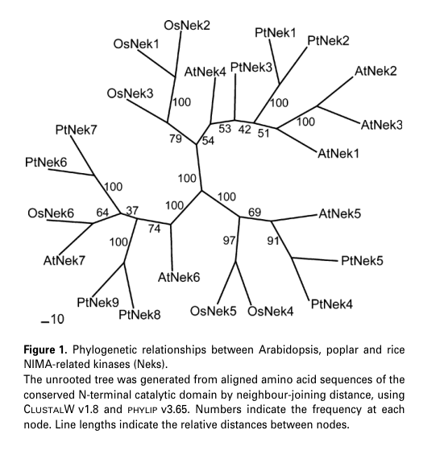

## Question

# Gene Research for Functional Annotation

## ⚠️ CRITICAL: Gene/Protein Identification Context

**BEFORE YOU BEGIN RESEARCH:** You MUST verify you are researching the CORRECT gene/protein. Gene symbols can be ambiguous, especially for less well-characterized genes from non-model organisms.

### Target Gene/Protein Identity (from UniProt):
- **UniProt Accession:** Q8RX66
- **Protein Description:** RecName: Full=Serine/threonine-protein kinase Nek3; EC=2.7.11.1; AltName: Full=NimA-related protein kinase 3; Short=AtNek3;
- **Gene Information:** Name=NEK3; OrderedLocusNames=At5g28290; ORFNames=T8M17.60;
- **Organism (full):** Arabidopsis thaliana (Mouse-ear cress).
- **Protein Family:** Belongs to the protein kinase superfamily. NEK Ser/Thr
- **Key Domains:** Kinase-like_dom_sf. (IPR011009); NEK_Ser/Thr_kinase. (IPR050660); Prot_kinase_dom. (IPR000719); Protein_kinase_ATP_BS. (IPR017441); Ser/Thr_kinase_AS. (IPR008271)

### MANDATORY VERIFICATION STEPS:

1. **Check if the gene symbol "NEK3" matches the protein description above**
2. **Verify the organism is correct:** Arabidopsis thaliana (Mouse-ear cress).
3. **Check if protein family/domains align with what you find in literature**
4. **If you find literature for a DIFFERENT gene with the same or similar symbol, STOP**

### If Gene Symbol is Ambiguous or You Cannot Find Relevant Literature:

**DO NOT PROCEED WITH RESEARCH ON A DIFFERENT GENE.** Instead:
- State clearly: "The gene symbol 'NEK3' is ambiguous or literature is limited for this specific protein"
- Explain what you found (e.g., "Found extensive literature on a different gene with the same symbol in a different organism")
- Describe the protein based ONLY on the UniProt information provided above
- Suggest that the protein function can be inferred from domain/family information

### Research Target:

Please provide a comprehensive research report on the gene **NEK3** (gene ID: NEK3, UniProt: Q8RX66) in ARATH.

The research report should be a detailed narrative explaining the function, biological processes, and localization of the gene product. Citations should be given for all claims.

You should prioritize authoritative reviews and primary scientific literature when conducting research. You can supplement
this with annotations you find in gene/protein databases, but these can be outdated or inaccurate.

We are specifically interested in the primary function of the gene - for enzymes, what reaction is catalyzed, and what is the substrate specificity? For transporters, what is the substrate? For structural proteins or adapters, what is the broader structural role? For signaling molecules, what is the role in the pathway.

We are interested in where in or outside the cell the gene product carries out its function.

We are also interested in the signaling or biochemical pathways in which the gene functions. We are less interested in broad pleiotropic effects, except where these elucidate the precise role.

Include evidence where possible. We are interested in both experimental evidence as well as inference from structure, evolution, or bioinformatic analysis. Precise studies should be prioritized over high-throughput, where available.

## Output

Question: You are an expert researcher providing comprehensive, well-cited information.

Provide detailed information focusing on:
1. Key concepts and definitions with current understanding
2. Recent developments and latest research (prioritize 2023-2024 sources)
3. Current applications and real-world implementations
4. Expert opinions and analysis from authoritative sources
5. Relevant statistics and data from recent studies

Format as a comprehensive research report with proper citations. Include URLs and publication dates where available.
Always prioritize recent, authoritative sources and provide specific citations for all major claims.

# Gene Research for Functional Annotation

## ⚠️ CRITICAL: Gene/Protein Identification Context

**BEFORE YOU BEGIN RESEARCH:** You MUST verify you are researching the CORRECT gene/protein. Gene symbols can be ambiguous, especially for less well-characterized genes from non-model organisms.

### Target Gene/Protein Identity (from UniProt):
- **UniProt Accession:** Q8RX66
- **Protein Description:** RecName: Full=Serine/threonine-protein kinase Nek3; EC=2.7.11.1; AltName: Full=NimA-related protein kinase 3; Short=AtNek3;
- **Gene Information:** Name=NEK3; OrderedLocusNames=At5g28290; ORFNames=T8M17.60;
- **Organism (full):** Arabidopsis thaliana (Mouse-ear cress).
- **Protein Family:** Belongs to the protein kinase superfamily. NEK Ser/Thr
- **Key Domains:** Kinase-like_dom_sf. (IPR011009); NEK_Ser/Thr_kinase. (IPR050660); Prot_kinase_dom. (IPR000719); Protein_kinase_ATP_BS. (IPR017441); Ser/Thr_kinase_AS. (IPR008271)

### MANDATORY VERIFICATION STEPS:

1. **Check if the gene symbol "NEK3" matches the protein description above**
2. **Verify the organism is correct:** Arabidopsis thaliana (Mouse-ear cress).
3. **Check if protein family/domains align with what you find in literature**
4. **If you find literature for a DIFFERENT gene with the same or similar symbol, STOP**

### If Gene Symbol is Ambiguous or You Cannot Find Relevant Literature:

**DO NOT PROCEED WITH RESEARCH ON A DIFFERENT GENE.** Instead:
- State clearly: "The gene symbol 'NEK3' is ambiguous or literature is limited for this specific protein"
- Explain what you found (e.g., "Found extensive literature on a different gene with the same symbol in a different organism")
- Describe the protein based ONLY on the UniProt information provided above
- Suggest that the protein function can be inferred from domain/family information

### Research Target:

Please provide a comprehensive research report on the gene **NEK3** (gene ID: NEK3, UniProt: Q8RX66) in ARATH.

The research report should be a detailed narrative explaining the function, biological processes, and localization of the gene product. Citations should be given for all claims.

You should prioritize authoritative reviews and primary scientific literature when conducting research. You can supplement
this with annotations you find in gene/protein databases, but these can be outdated or inaccurate.

We are specifically interested in the primary function of the gene - for enzymes, what reaction is catalyzed, and what is the substrate specificity? For transporters, what is the substrate? For structural proteins or adapters, what is the broader structural role? For signaling molecules, what is the role in the pathway.

We are interested in where in or outside the cell the gene product carries out its function.

We are also interested in the signaling or biochemical pathways in which the gene functions. We are less interested in broad pleiotropic effects, except where these elucidate the precise role.

Include evidence where possible. We are interested in both experimental evidence as well as inference from structure, evolution, or bioinformatic analysis. Precise studies should be prioritized over high-throughput, where available.

## Research report: Arabidopsis thaliana NEK3 (AtNek3; At5g28290; UniProt Q8RX66)

### 0) Executive summary (scope and evidence limits)
Arabidopsis **NEK3 (AtNek3; At5g28290; UniProt Q8RX66)** is a **plant NIMA-related serine/threonine protein kinase (EC 2.7.11.1)** in the NEK family, defined by a conserved **N-terminal protein-kinase catalytic domain** and a long basic C-terminal extension typical of NIMA-related kinases. In the accessible literature retrieved here, the strongest **AtNek3-specific** evidence concerns **gene identity, domain architecture, phylogenetic placement, and organ/tissue expression patterns**; **direct experimental evidence** for AtNek3 subcellular localization, biochemical substrates, or mutant/overexpression phenotypes was **not found**. Therefore, mechanistic insights are largely **inferred from the broader plant NEK family** and are explicitly labeled as such. (vigneault2007membersofthe pages 1-2, vigneault2007membersofthe pages 2-4, vigneault2007membersofthe pages 4-6, vigneault2007membersofthe pages 8-10, vigneault2009caractérisationdela pages 130-134, vigneault2009caractérisationdela pages 70-74)

### 1) Key concepts and definitions (current understanding)

#### 1.1 NIMA-related kinases (NEKs)
NIMA-related kinases (Neks/NEKs) are a conserved family of **serine/threonine kinases** originally linked to mitotic control in fungi and animals, but in plants they have been strongly connected to **microtubule-associated regulation of cell expansion and organ morphogenesis** (family-level concept). (vigneault2007membersofthe pages 1-2, motose2012nimarelatedkinasesregulate pages 1-3, motose2012nimarelatedkinasesregulate pages 3-4)

#### 1.2 What “functional annotation” means here
For NEK3, functional annotation ideally includes: (i) catalytic activity and substrate specificity; (ii) cellular compartment(s) of action; (iii) pathway context (developmental/stress signaling modules); and (iv) phenotype under perturbation. In the retrieved evidence, AtNek3 is best annotated at (a) **molecular class** (Ser/Thr kinase) and (b) **likely biological-process context** (developmental/vascular and meristem-associated expression), while (i), (ii), and (iv) remain gaps for AtNek3 specifically. (vigneault2007membersofthe pages 4-6, vigneault2007membersofthe pages 8-10, vigneault2009caractérisationdela pages 130-134)

### 2) Target verification (critical gene/protein identification)
The gene symbol **NEK3** is ambiguous across organisms. The sources retrieved explicitly map **AtNek3** to **Arabidopsis thaliana locus At5g28290**, consistent with the UniProt target Q8RX66 and the NEK/NIMA-related Ser/Thr kinase family. (vigneault2007membersofthe pages 1-2, vigneault2007membersofthe pages 2-4, vigneault2009caractérisationdela pages 130-134)

### 3) Molecular features of AtNek3

#### 3.1 Enzymatic class and domain architecture
Plant NEKs (including AtNek3) are described as **serine/threonine protein kinases** with a conserved **N-terminal catalytic kinase domain** and a longer **C-terminal non-catalytic extension**, consistent with the UniProt domain calls (protein kinase domain; ATP-binding and activation-segment motifs). Sequence excerpts in the plant-NEK thesis include conserved Ser/Thr kinase motifs for AtNek3 (At5g28290), supporting the enzyme-class assignment. (vigneault2007membersofthe pages 1-2, vigneault2009caractérisationdela pages 70-74, vigneault2009caractérisationdela pages 130-134)

#### 3.2 Phylogenetic context
AtNek3 clusters with **AtNek1–AtNek3** in a plant-specific clade distinct from fungal and mammalian NEKs, supporting the idea that plant NEKs have evolved specialized roles. (vigneault2007membersofthe pages 8-10, vigneault2007membersofthe media 26e7bf46, vigneault2009caractérisationdela pages 70-74)

### 4) Biological processes and pathway context supported for AtNek3

#### 4.1 Expression-supported roles in development and vascularization
A key AtNek3-specific result is its **organ/tissue expression profile**. In Arabidopsis, AtNek3 shows **strong expression in root tips** and relatively high expression in the **shoot apex**; expression is preferentially associated with **young leaves and vascular elements**, and it declines in **senescent leaves**. These patterns were interpreted by the authors as consistent with roles in **organ development/tissue differentiation and vascularization** (inference from expression and family context). (vigneault2007membersofthe pages 4-6, vigneault2007membersofthe pages 8-10, vigneault2007membersofthe media 26e7bf46, vigneault2007membersofthe media 77c1eb59)

#### 4.2 Cell-cycle association (transcriptional)
A dissertation on Arabidopsis NIMA-like kinases reports that **AtNIMA3** has an **organ-specific transcription profile not associated with the mitotic cell cycle**, suggesting AtNek3 transcription is not tightly coupled to mitosis (unlike many fungal/animal NEKs). (agueci2010characterizationofnimalike pages 5-9)

### 5) Subcellular localization and direct mechanism (evidence gaps for AtNek3)
No AtNek3-specific experimental evidence of **subcellular localization** (e.g., GFP fusions) or direct **microtubule association** was found in the retrieved evidence set. Consequently, AtNek3 localization cannot be asserted beyond domain-based speculation. (vigneault2007membersofthe pages 4-6, vigneault2009caractérisationdela pages 130-134)

### 6) Recent developments (prioritizing 2023–2024)

#### 6.1 2023: Plant NEK functional insights from Marchantia (family-level inference)
A 2023 preprint in the liverwort *Marchantia polymorpha* investigated **MpNEK1** using estradiol-inducible overexpression. Overexpression caused severe growth suppression (rhizoids and thalli), with dose sensitivity detectable even at **10–100 nM** estradiol and MpNEK1 transcript induction of approximately **4–15×** in responsive lines. Cell proliferation readouts (EdU labeling and reduced mitotic counts) supported suppressed proliferation, while microtubule arrays were not grossly disrupted. Importantly, kinase-deficient MpNEK1 variants still suppressed growth (milder), suggesting a potentially **phosphorylation-independent component** to NEK function in plants. These findings update the field’s thinking about how plant NEKs may operate, but they do **not** directly establish AtNek3 function in Arabidopsis. (mase2023overexpressionofnimarelated pages 5-8, mase2023overexpressionofnimarelated pages 1-5, mase2023overexpressionofnimarelated pages 8-11, mase2023overexpressionofnimarelated pages 11-13)

#### 6.2 2023: Microtubule regulation and stress adaptation (context)
A 2023 review summarizes how microtubules participate in abiotic stress responses (heat, salinity, drought) through rapid reorganization and regulation by diverse microtubule-associated proteins. This contextualizes why plant NEKs—given their family-level links to microtubule function—remain relevant candidates for stress-adaptation biology, although the retrieved pages did not specifically mention AtNek3. (hsiao2023microtubuleregulationin pages 6-7, hsiao2023microtubuleregulationin pages 7-9, hsiao2023microtubuleregulationin pages 9-10)

### 7) Applications and real-world implementations (NEK family; not AtNek3-specific)

#### 7.1 Stress tolerance and growth engineering in crops and model plants
Although AtNek3 itself lacks application-grade evidence in the retrieved set, the **plant NEK family** has been implemented in transgenic contexts:
- **Soybean GmNEK1**: Overexpression in Arabidopsis increased leaf growth with statistical reporting (**n = 24, P < 0.01**) and GmNEK1 co-localized with a tubulin marker (GFP–TUB6), supporting a microtubule-linked mechanism; the study also reports stress-responsive induction patterns (e.g., salt/cold) and improved tolerance phenotypes under stress assays. (pan2017soybeannimarelatedkinase1 pages 2-4, pan2017soybeannimarelatedkinase1 pages 8-9, pan2017soybeannimarelatedkinase1 pages 6-8)
- **Arabidopsis NEK6**: Overexpression and mutant analysis show altered growth and improved tolerance to osmotic/salt stress in controlled assays, indicating potential leverage points for engineering growth robustness. (zhang2011nimarelatedkinasenek6 pages 7-8, zhang2011nimarelatedkinasenek6 pages 1-2)

These examples support “real-world implementation” in the sense of **genetic engineering strategies** to modify growth and stress tolerance, but they should not be conflated with AtNek3-specific applications. (pan2017soybeannimarelatedkinase1 pages 2-4, zhang2011nimarelatedkinasenek6 pages 7-8)

### 8) Expert opinions and authoritative analysis (what the field argues)
A peer-reviewed short review on Arabidopsis NEKs argues that plant NEKs regulate **directional cell growth and organ development through microtubule function**, with emphasis on NEK4/NEK5/NEK6 interactions and a model in which NEK6 destabilizes microtubules (potentially via β-tubulin phosphorylation). This is an authoritative synthesis for the NEK family, but it provides no direct AtNek3 mechanistic claims. (motose2012nimarelatedkinasesregulate pages 1-3, motose2012nimarelatedkinasesregulate pages 3-4, motose2012nimarelatedkinasesregulate pages 4-4)

### 9) Data and statistics (recent studies; with appropriate scope)

#### 9.1 Quantitative data directly in retrieved evidence
- MpNEK1 (Marchantia) inducible overexpression: **4–15×** induction of transcript upon estradiol treatment; phenotypes observed even at **10–100 nM** estradiol; growth suppression reversible ≤3 days induction but irreversible after ≥7 days. (mase2023overexpressionofnimarelated pages 5-8, mase2023overexpressionofnimarelated pages 1-5)
- GmNEK1 (soybean) overexpression in Arabidopsis: increased leaf growth with **n = 24, P < 0.01** (as reported in excerpt), supporting that NEK-family manipulation can yield measurable growth differences. (pan2017soybeannimarelatedkinase1 pages 2-4)

#### 9.2 AtNek3-specific quantitative data
AtNek3-specific quantitative phenotype or biochemical data were not present in the retrieved evidence. The key quantitative-like outputs for AtNek3 are expression patterns across organs/tissues (qualitatively described and visually presented). (vigneault2007membersofthe pages 4-6, vigneault2007membersofthe media 26e7bf46, vigneault2007membersofthe media 77c1eb59)

### 10) Practical functional-annotation conclusions for AtNek3 (what can be stated with evidence)
1. **Molecular function (supported)**: AtNek3 is a **NIMA-related serine/threonine protein kinase** by sequence/domain architecture and family definition; reaction class is ATP-dependent phosphorylation of protein substrates (EC 2.7.11.1), but **substrate identity and specificity remain unknown** for AtNek3 based on retrieved evidence. (vigneault2007membersofthe pages 1-2, vigneault2009caractérisationdela pages 130-134, vigneault2009caractérisationdela pages 70-74)
2. **Biological process (supported/inferred)**: Expression patterns suggest roles in **developmental programs** associated with **root tips, shoot apex, young leaves, and vascular tissues**, consistent with proposed roles in **organ development and vascularization** (inference from expression). (vigneault2007membersofthe pages 4-6, vigneault2007membersofthe pages 8-10, vigneault2007membersofthe media 26e7bf46)
3. **Cellular location (unsupported for AtNek3)**: No AtNek3-specific localization evidence retrieved; cannot assert cytosolic/nuclear/microtubule localization for AtNek3 from this corpus. (vigneault2009caractérisationdela pages 130-134)
4. **Pathway context (inferred)**: While other plant NEKs (e.g., NEK4/5/6) participate in microtubule-based growth-direction control, AtNek3’s pathway membership is not established here; the most defensible hypothesis is that AtNek3 participates in plant-specific NEK signaling linked to developmental and/or vascular processes, pending direct experiments. (vigneault2007membersofthe pages 8-10, motose2012nimarelatedkinasesregulate pages 1-3, motose2012nimarelatedkinasesregulate pages 3-4)

### Evidence summary table
| Claim/Aspect | Evidence summary | Source (author/year, journal) | URL/DOI | Notes/limitations |
|---|---|---|---|---|
| Identity | AtNek3 is explicitly identified as the Arabidopsis thaliana NIMA-related kinase family member encoded by locus **At5g28290**; the family description matches the UniProt target NEK3/Q8RX66. (vigneault2007membersofthe pages 1-2, vigneault2007membersofthe pages 2-4) | Vigneault et al., 2007, *The Plant Journal* | https://doi.org/10.1111/j.1365-313x.2007.03161.x | Confirms the correct Arabidopsis gene and distinguishes it from non-plant NEK3 proteins. |
| Domain architecture | Plant Neks, including AtNek3, are described as **serine/threonine kinases** with a conserved **N-terminal catalytic kinase domain** and a longer **C-terminal non-catalytic extension**; sequence-level evidence in the thesis shows conserved Ser/Thr kinase motifs in AtNek3. (vigneault2007membersofthe pages 1-2, vigneault2009caractérisationdela pages 130-134, vigneault2009caractérisationdela pages 70-74) | Vigneault et al., 2007, *The Plant Journal*; Vigneault, 2009, thesis | https://doi.org/10.1111/j.1365-313x.2007.03161.x; thesis DOI: 10.25673/202 | Strong family/domain inference, but no AtNek3-specific biochemical assay was reported in the gathered evidence. |
| Phylogenetic placement | AtNek3 clusters with the **AtNek1–AtNek3** subgroup within a **plant-specific Nek clade**, distinct from fungal and mammalian Neks; plant Neks were inferred to descend from an ancestral plant Nek. (vigneault2007membersofthe pages 8-10, vigneault2009caractérisationdela pages 70-74, vigneault2007membersofthe media 26e7bf46) | Vigneault et al., 2007, *The Plant Journal*; Vigneault, 2009, thesis | https://doi.org/10.1111/j.1365-313x.2007.03161.x; thesis DOI: 10.25673/202 | Evolutionary evidence supports likely conserved plant-specific function, but does not by itself establish mechanism. |
| Expression pattern in Arabidopsis organs/tissues | AtNek3 transcripts are reported as **strong in root tips** and **relatively high in the shoot apex**, with expression preferentially associated with **young leaves** and **vascular elements**; AtNek3 expression is **very low in hypocotyl, xylem, and cork extracts** and decreases strongly in **senescent leaves**. (vigneault2007membersofthe pages 4-6, vigneault2007membersofthe pages 8-10, vigneault2007membersofthe media 26e7bf46) | Vigneault et al., 2007, *The Plant Journal* | https://doi.org/10.1111/j.1365-313x.2007.03161.x | Evidence is expression-based and tissue-level; it does not prove subcellular localization or direct function. |
| Cell-cycle association | A dissertation summary states that **AtNIMA3/AtNek3** shows an **organ-specific transcription profile not associated with the mitotic cell cycle**, contrasting with some NEKs in fungi/animals. (agueci2010characterizationofnimalike pages 5-9) | Agueci, 2010, dissertation | https://doi.org/10.25673/202 | Mapping to At5g28290/Q8RX66 is inferential within the gathered evidence; no direct AtNek3 cell-cycle assay was cited here. |
| Inferred biological role | Based on expression in root tips, shoot apex, young leaves, and vascular tissues, the authors infer that AtNek3 is involved more in **organ development, tissue differentiation, and vascularization** than in core mitotic control. (vigneault2007membersofthe pages 4-6, vigneault2007membersofthe pages 8-10) | Vigneault et al., 2007, *The Plant Journal* | https://doi.org/10.1111/j.1365-313x.2007.03161.x | This is an inference from comparative expression and phylogeny; no direct AtNek3 mutant or overexpression phenotype was provided. |
| Subcellular localization | No AtNek3-specific experimental subcellular localization was identified in the gathered evidence. Localization data in the available literature concern other plant NEKs such as PNek1, not AtNek3. (vigneault2009caractérisationdela pages 74-79) | Vigneault, 2009, thesis | thesis DOI: 10.25673/202 | Important evidence gap: localization for AtNek3 remains unresolved in the retrieved sources. |
| Enzymatic activity / substrates | Although AtNek3 is classified as a serine/threonine protein kinase by family/domain features, **no AtNek3-specific kinase assay, substrate, or substrate specificity** was found in the gathered evidence. (vigneault2009caractérisationdela pages 130-134, vigneault2009caractérisationdela pages 70-74) | Vigneault, 2009, thesis | thesis DOI: 10.25673/202 | Functional annotation at the reaction/substrate level is currently unsupported by direct evidence in the retrieved literature. |
| Mutant or overexpression phenotype | The gathered evidence did **not** provide a direct **AtNek3 loss-of-function or overexpression phenotype** in Arabidopsis. Family-level papers discuss developmental functions for plant NEKs, but AtNek3-specific phenotype data were not reported in the retrieved excerpts. (vigneault2007membersofthe pages 4-6, vigneault2007membersofthe pages 1-2) | Vigneault et al., 2007, *The Plant Journal* | https://doi.org/10.1111/j.1365-313x.2007.03161.x | Another major evidence gap; conclusions for AtNek3 remain largely inferential. |

*Table: This table summarizes what the gathered evidence supports for Arabidopsis thaliana NEK3/AtNek3 (At5g28290; UniProt Q8RX66). It highlights that identity, kinase-family assignment, and expression-based developmental inferences are supported, while direct localization, substrates, and phenotype evidence remain limited.*

### Key cited sources (with publication dates and URLs)
- Vigneault F. et al. **2007-07**. *The Plant Journal*. “Members of the plant NIMA-related kinases are involved in organ development and vascularization in poplar, Arabidopsis and rice.” https://doi.org/10.1111/j.1365-313x.2007.03161.x (vigneault2007membersofthe pages 1-2, vigneault2007membersofthe pages 4-6, vigneault2007membersofthe pages 8-10, vigneault2007membersofthe media 26e7bf46, vigneault2007membersofthe media 77c1eb59)
- Agueci F. **2010-01**. Dissertation. “Characterization of NIMA-like kinases in Arabidopsis thaliana.” https://doi.org/10.25673/202 (agueci2010characterizationofnimalike pages 5-9)
- Motose H. et al. **2012-12**. *Plant Signaling & Behavior*. “NIMA-related kinases regulate directional cell growth and organ development through microtubule function in Arabidopsis thaliana.” https://doi.org/10.4161/psb.22412 (motose2012nimarelatedkinasesregulate pages 1-3, motose2012nimarelatedkinasesregulate pages 3-4)
- Mase H. et al. **2023-07** (preprint). bioRxiv. “Overexpression of NIMA-related kinase suppresses cell proliferation and tip growth in a liverwort Marchantia polymorpha.” https://doi.org/10.1101/2023.01.25.525476 (mase2023overexpressionofnimarelated pages 5-8, mase2023overexpressionofnimarelated pages 1-5, mase2023overexpressionofnimarelated pages 8-11)
- Hsiao A.-S., Huang J.-Y. **2023-03**. *Biomolecules*. “Microtubule Regulation in Plants: From Morphological Development to Stress Adaptation.” https://doi.org/10.3390/biom13040627 (hsiao2023microtubuleregulationin pages 6-7, hsiao2023microtubuleregulationin pages 7-9, hsiao2023microtubuleregulationin pages 9-10)
- Pan W.-J. et al. **2017-07**. *Plant and Cell Physiology*. “Soybean NIMA-Related Kinase1 Promotes Plant Growth and Improves Salt and Cold Tolerance.” https://doi.org/10.1093/pcp/pcx060 (pan2017soybeannimarelatedkinase1 pages 2-4)
- Zhang B. et al. **2011-12**. *The Plant Journal*. “NIMA-related kinase NEK6 affects plant growth and stress response in Arabidopsis.” https://doi.org/10.1111/j.1365-313x.2011.04733.x (zhang2011nimarelatedkinasenek6 pages 7-8, zhang2011nimarelatedkinasenek6 pages 1-2)

References

1. (vigneault2007membersofthe pages 1-2): Frédéric Vigneault, Denis Lachance, Monikca Cloutier, Gervais Pelletier, Caroline Levasseur, and Armand Séguin. Members of the plant nima‐related kinases are involved in organ development and vascularization in poplar, arabidopsis and rice. The Plant Journal, 51:575-588, Jul 2007. URL: https://doi.org/10.1111/j.1365-313x.2007.03161.x, doi:10.1111/j.1365-313x.2007.03161.x. This article has 56 citations.

2. (vigneault2007membersofthe pages 2-4): Frédéric Vigneault, Denis Lachance, Monikca Cloutier, Gervais Pelletier, Caroline Levasseur, and Armand Séguin. Members of the plant nima‐related kinases are involved in organ development and vascularization in poplar, arabidopsis and rice. The Plant Journal, 51:575-588, Jul 2007. URL: https://doi.org/10.1111/j.1365-313x.2007.03161.x, doi:10.1111/j.1365-313x.2007.03161.x. This article has 56 citations.

3. (vigneault2007membersofthe pages 4-6): Frédéric Vigneault, Denis Lachance, Monikca Cloutier, Gervais Pelletier, Caroline Levasseur, and Armand Séguin. Members of the plant nima‐related kinases are involved in organ development and vascularization in poplar, arabidopsis and rice. The Plant Journal, 51:575-588, Jul 2007. URL: https://doi.org/10.1111/j.1365-313x.2007.03161.x, doi:10.1111/j.1365-313x.2007.03161.x. This article has 56 citations.

4. (vigneault2007membersofthe pages 8-10): Frédéric Vigneault, Denis Lachance, Monikca Cloutier, Gervais Pelletier, Caroline Levasseur, and Armand Séguin. Members of the plant nima‐related kinases are involved in organ development and vascularization in poplar, arabidopsis and rice. The Plant Journal, 51:575-588, Jul 2007. URL: https://doi.org/10.1111/j.1365-313x.2007.03161.x, doi:10.1111/j.1365-313x.2007.03161.x. This article has 56 citations.

5. (vigneault2009caractérisationdela pages 130-134): F Vigneault. Caractérisation de la famille des protéines kinases de type nima chez les plantes et analyse fonctionnelle de pnek1, une nek du peuplier (populus tremula x p …. Unknown journal, 2009.

6. (vigneault2009caractérisationdela pages 70-74): F Vigneault. Caractérisation de la famille des protéines kinases de type nima chez les plantes et analyse fonctionnelle de pnek1, une nek du peuplier (populus tremula x p …. Unknown journal, 2009.

7. (motose2012nimarelatedkinasesregulate pages 1-3): Hiroyasu Motose, Shogo Takatani, Tatsuya Ikeda, and Taku Takahashi. Nima-related kinases regulate directional cell growth and organ development through microtubule function in<i>arabidopsis thaliana</i>. Plant Signaling &amp; Behavior, 7:1552-1555, Dec 2012. URL: https://doi.org/10.4161/psb.22412, doi:10.4161/psb.22412. This article has 30 citations and is from a peer-reviewed journal.

8. (motose2012nimarelatedkinasesregulate pages 3-4): Hiroyasu Motose, Shogo Takatani, Tatsuya Ikeda, and Taku Takahashi. Nima-related kinases regulate directional cell growth and organ development through microtubule function in<i>arabidopsis thaliana</i>. Plant Signaling &amp; Behavior, 7:1552-1555, Dec 2012. URL: https://doi.org/10.4161/psb.22412, doi:10.4161/psb.22412. This article has 30 citations and is from a peer-reviewed journal.

9. (vigneault2007membersofthe media 26e7bf46): Frédéric Vigneault, Denis Lachance, Monikca Cloutier, Gervais Pelletier, Caroline Levasseur, and Armand Séguin. Members of the plant nima‐related kinases are involved in organ development and vascularization in poplar, arabidopsis and rice. The Plant Journal, 51:575-588, Jul 2007. URL: https://doi.org/10.1111/j.1365-313x.2007.03161.x, doi:10.1111/j.1365-313x.2007.03161.x. This article has 56 citations.

10. (vigneault2007membersofthe media 77c1eb59): Frédéric Vigneault, Denis Lachance, Monikca Cloutier, Gervais Pelletier, Caroline Levasseur, and Armand Séguin. Members of the plant nima‐related kinases are involved in organ development and vascularization in poplar, arabidopsis and rice. The Plant Journal, 51:575-588, Jul 2007. URL: https://doi.org/10.1111/j.1365-313x.2007.03161.x, doi:10.1111/j.1365-313x.2007.03161.x. This article has 56 citations.

11. (agueci2010characterizationofnimalike pages 5-9): Francesco Agueci. Characterization of nima-like kinases in arabidopsis thaliana. Dissertation, Jan 2010. URL: https://doi.org/10.25673/202, doi:10.25673/202. This article has 0 citations.

12. (mase2023overexpressionofnimarelated pages 5-8): Hikari Mase, Yoshihiro Yoshitake, Takayuki Kohchi, Taku Takahashi, and Hiroyasu Motose. Overexpression of nima-related kinase suppresses cell proliferation and tip growth in a liverwort marchantia polymorpha. bioRxiv, Jul 2023. URL: https://doi.org/10.1101/2023.01.25.525476, doi:10.1101/2023.01.25.525476. This article has 0 citations.

13. (mase2023overexpressionofnimarelated pages 1-5): Hikari Mase, Yoshihiro Yoshitake, Takayuki Kohchi, Taku Takahashi, and Hiroyasu Motose. Overexpression of nima-related kinase suppresses cell proliferation and tip growth in a liverwort marchantia polymorpha. bioRxiv, Jul 2023. URL: https://doi.org/10.1101/2023.01.25.525476, doi:10.1101/2023.01.25.525476. This article has 0 citations.

14. (mase2023overexpressionofnimarelated pages 8-11): Hikari Mase, Yoshihiro Yoshitake, Takayuki Kohchi, Taku Takahashi, and Hiroyasu Motose. Overexpression of nima-related kinase suppresses cell proliferation and tip growth in a liverwort marchantia polymorpha. bioRxiv, Jul 2023. URL: https://doi.org/10.1101/2023.01.25.525476, doi:10.1101/2023.01.25.525476. This article has 0 citations.

15. (mase2023overexpressionofnimarelated pages 11-13): Hikari Mase, Yoshihiro Yoshitake, Takayuki Kohchi, Taku Takahashi, and Hiroyasu Motose. Overexpression of nima-related kinase suppresses cell proliferation and tip growth in a liverwort marchantia polymorpha. bioRxiv, Jul 2023. URL: https://doi.org/10.1101/2023.01.25.525476, doi:10.1101/2023.01.25.525476. This article has 0 citations.

16. (hsiao2023microtubuleregulationin pages 6-7): An-Shan Hsiao and Ji-Ying Huang. Microtubule regulation in plants: from morphological development to stress adaptation. Biomolecules, 13:627, Mar 2023. URL: https://doi.org/10.3390/biom13040627, doi:10.3390/biom13040627. This article has 28 citations.

17. (hsiao2023microtubuleregulationin pages 7-9): An-Shan Hsiao and Ji-Ying Huang. Microtubule regulation in plants: from morphological development to stress adaptation. Biomolecules, 13:627, Mar 2023. URL: https://doi.org/10.3390/biom13040627, doi:10.3390/biom13040627. This article has 28 citations.

18. (hsiao2023microtubuleregulationin pages 9-10): An-Shan Hsiao and Ji-Ying Huang. Microtubule regulation in plants: from morphological development to stress adaptation. Biomolecules, 13:627, Mar 2023. URL: https://doi.org/10.3390/biom13040627, doi:10.3390/biom13040627. This article has 28 citations.

19. (pan2017soybeannimarelatedkinase1 pages 2-4): Wen-Jia Pan, Jian-Jun Tao, Tong Cheng, Ming Shen, Jin-Biao Ma, Wan-Ke Zhang, Qin Lin, Biao Ma, Shou-Yi Chen, and Jin-Song Zhang. Soybean nima-related kinase1 promotes plant growth and improves salt and cold tolerance. Plant and Cell Physiology, 58:1268–1278, Jul 2017. URL: https://doi.org/10.1093/pcp/pcx060, doi:10.1093/pcp/pcx060. This article has 30 citations and is from a domain leading peer-reviewed journal.

20. (pan2017soybeannimarelatedkinase1 pages 8-9): Wen-Jia Pan, Jian-Jun Tao, Tong Cheng, Ming Shen, Jin-Biao Ma, Wan-Ke Zhang, Qin Lin, Biao Ma, Shou-Yi Chen, and Jin-Song Zhang. Soybean nima-related kinase1 promotes plant growth and improves salt and cold tolerance. Plant and Cell Physiology, 58:1268–1278, Jul 2017. URL: https://doi.org/10.1093/pcp/pcx060, doi:10.1093/pcp/pcx060. This article has 30 citations and is from a domain leading peer-reviewed journal.

21. (pan2017soybeannimarelatedkinase1 pages 6-8): Wen-Jia Pan, Jian-Jun Tao, Tong Cheng, Ming Shen, Jin-Biao Ma, Wan-Ke Zhang, Qin Lin, Biao Ma, Shou-Yi Chen, and Jin-Song Zhang. Soybean nima-related kinase1 promotes plant growth and improves salt and cold tolerance. Plant and Cell Physiology, 58:1268–1278, Jul 2017. URL: https://doi.org/10.1093/pcp/pcx060, doi:10.1093/pcp/pcx060. This article has 30 citations and is from a domain leading peer-reviewed journal.

22. (zhang2011nimarelatedkinasenek6 pages 7-8): Bo Zhang, Hao‐Wei Chen, Rui‐Ling Mu, Wang‐Ke Zhang, Ming‐Yu Zhao, Wei Wei, Fang Wang, Hui Yu, Gang Lei, Hong‐Feng Zou, Biao Ma, Shou‐Yi Chen, and Jin‐Song Zhang. Nima-related kinase nek6 affects plant growth and stress response in arabidopsis. The Plant journal : for cell and molecular biology, 68 5:830-43, Dec 2011. URL: https://doi.org/10.1111/j.1365-313x.2011.04733.x, doi:10.1111/j.1365-313x.2011.04733.x. This article has 55 citations.

23. (zhang2011nimarelatedkinasenek6 pages 1-2): Bo Zhang, Hao‐Wei Chen, Rui‐Ling Mu, Wang‐Ke Zhang, Ming‐Yu Zhao, Wei Wei, Fang Wang, Hui Yu, Gang Lei, Hong‐Feng Zou, Biao Ma, Shou‐Yi Chen, and Jin‐Song Zhang. Nima-related kinase nek6 affects plant growth and stress response in arabidopsis. The Plant journal : for cell and molecular biology, 68 5:830-43, Dec 2011. URL: https://doi.org/10.1111/j.1365-313x.2011.04733.x, doi:10.1111/j.1365-313x.2011.04733.x. This article has 55 citations.

24. (motose2012nimarelatedkinasesregulate pages 4-4): Hiroyasu Motose, Shogo Takatani, Tatsuya Ikeda, and Taku Takahashi. Nima-related kinases regulate directional cell growth and organ development through microtubule function in<i>arabidopsis thaliana</i>. Plant Signaling &amp; Behavior, 7:1552-1555, Dec 2012. URL: https://doi.org/10.4161/psb.22412, doi:10.4161/psb.22412. This article has 30 citations and is from a peer-reviewed journal.

25. (vigneault2009caractérisationdela pages 74-79): F Vigneault. Caractérisation de la famille des protéines kinases de type nima chez les plantes et analyse fonctionnelle de pnek1, une nek du peuplier (populus tremula x p …. Unknown journal, 2009.

## Artifacts

- [Edison artifact artifact-00](NEK3-deep-research-falcon_artifacts/artifact-00.md)

## Citations

1. agueci2010characterizationofnimalike pages 5-9
2. vigneault2007membersofthe pages 1-2
3. vigneault2007membersofthe pages 2-4
4. vigneault2007membersofthe pages 4-6
5. vigneault2007membersofthe pages 8-10
6. motose2012nimarelatedkinasesregulate pages 1-3
7. motose2012nimarelatedkinasesregulate pages 3-4
8. mase2023overexpressionofnimarelated pages 5-8
9. mase2023overexpressionofnimarelated pages 1-5
10. mase2023overexpressionofnimarelated pages 8-11
11. mase2023overexpressionofnimarelated pages 11-13
12. hsiao2023microtubuleregulationin pages 6-7
13. hsiao2023microtubuleregulationin pages 7-9
14. hsiao2023microtubuleregulationin pages 9-10
15. motose2012nimarelatedkinasesregulate pages 4-4
16. https://doi.org/10.1111/j.1365-313x.2007.03161.x
17. https://doi.org/10.1111/j.1365-313x.2007.03161.x;
18. https://doi.org/10.25673/202
19. https://doi.org/10.4161/psb.22412
20. https://doi.org/10.1101/2023.01.25.525476
21. https://doi.org/10.3390/biom13040627
22. https://doi.org/10.1093/pcp/pcx060
23. https://doi.org/10.1111/j.1365-313x.2011.04733.x
24. https://doi.org/10.1111/j.1365-313x.2007.03161.x,
25. https://doi.org/10.4161/psb.22412,
26. https://doi.org/10.25673/202,
27. https://doi.org/10.1101/2023.01.25.525476,
28. https://doi.org/10.3390/biom13040627,
29. https://doi.org/10.1093/pcp/pcx060,
30. https://doi.org/10.1111/j.1365-313x.2011.04733.x,