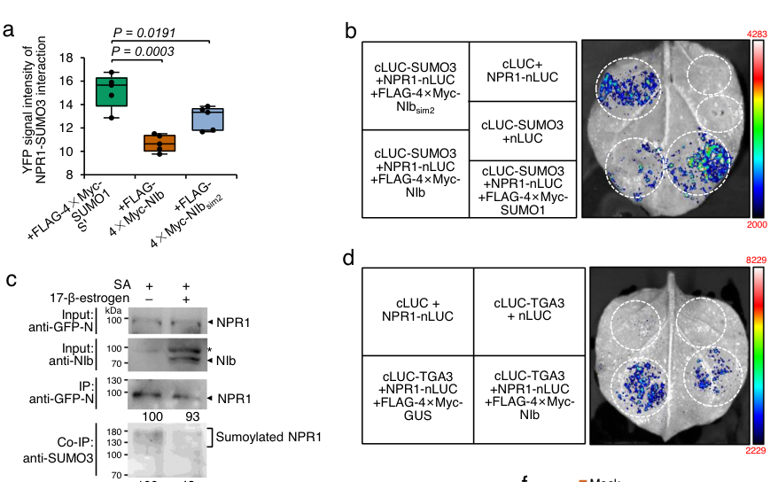

## Question

# Gene Research for Functional Annotation

## ⚠️ CRITICAL: Gene/Protein Identification Context

**BEFORE YOU BEGIN RESEARCH:** You MUST verify you are researching the CORRECT gene/protein. Gene symbols can be ambiguous, especially for less well-characterized genes from non-model organisms.

### Target Gene/Protein Identity (from UniProt):
- **UniProt Accession:** P93002
- **Protein Description:** RecName: Full=Regulatory protein NPR1 {ECO:0000303|PubMed:9019406}; AltName: Full=BTB/POZ domain-containing protein NPR1 {ECO:0000303|PubMed:9019406}; AltName: Full=Non-inducible immunity protein 1 {ECO:0000303|PubMed:9090885}; Short=Nim1 {ECO:0000303|PubMed:9090885}; AltName: Full=Nonexpresser of PR genes 1 {ECO:0000303|PubMed:9019406}; AltName: Full=Salicylic acid insensitive 1 {ECO:0000303|PubMed:9002272}; Short=Sai1 {ECO:0000303|PubMed:9002272};
- **Gene Information:** Name=NPR1 {ECO:0000303|PubMed:9019406}; Synonyms=NIM1 {ECO:0000303|PubMed:9090885}, SAI1 {ECO:0000303|PubMed:9002272}; OrderedLocusNames=At1g64280 {ECO:0000312|Araport:AT1G64280}; ORFNames=F15H21.6 {ECO:0000312|EMBL:AAG51705.1};
- **Organism (full):** Arabidopsis thaliana (Mouse-ear cress).
- **Protein Family:** Belongs to the plant 'ANKYRIN-BTB/POZ' family. 'NPR1-like'
- **Key Domains:** Ankyrin_rpt. (IPR002110); Ankyrin_rpt-contain_sf. (IPR036770); BTB/POZ_dom. (IPR000210); NPR. (IPR044292); NPR1/NIM1-like_C. (IPR021094)

### MANDATORY VERIFICATION STEPS:

1. **Check if the gene symbol "NPR1" matches the protein description above**
2. **Verify the organism is correct:** Arabidopsis thaliana (Mouse-ear cress).
3. **Check if protein family/domains align with what you find in literature**
4. **If you find literature for a DIFFERENT gene with the same or similar symbol, STOP**

### If Gene Symbol is Ambiguous or You Cannot Find Relevant Literature:

**DO NOT PROCEED WITH RESEARCH ON A DIFFERENT GENE.** Instead:
- State clearly: "The gene symbol 'NPR1' is ambiguous or literature is limited for this specific protein"
- Explain what you found (e.g., "Found extensive literature on a different gene with the same symbol in a different organism")
- Describe the protein based ONLY on the UniProt information provided above
- Suggest that the protein function can be inferred from domain/family information

### Research Target:

Please provide a comprehensive research report on the gene **NPR1** (gene ID: NPR1, UniProt: P93002) in ARATH.

The research report should be a detailed narrative explaining the function, biological processes, and localization of the gene product. Citations should be given for all claims.

You should prioritize authoritative reviews and primary scientific literature when conducting research. You can supplement
this with annotations you find in gene/protein databases, but these can be outdated or inaccurate.

We are specifically interested in the primary function of the gene - for enzymes, what reaction is catalyzed, and what is the substrate specificity? For transporters, what is the substrate? For structural proteins or adapters, what is the broader structural role? For signaling molecules, what is the role in the pathway.

We are interested in where in or outside the cell the gene product carries out its function.

We are also interested in the signaling or biochemical pathways in which the gene functions. We are less interested in broad pleiotropic effects, except where these elucidate the precise role.

Include evidence where possible. We are interested in both experimental evidence as well as inference from structure, evolution, or bioinformatic analysis. Precise studies should be prioritized over high-throughput, where available.

## Output

Question: You are an expert researcher providing comprehensive, well-cited information.

Provide detailed information focusing on:
1. Key concepts and definitions with current understanding
2. Recent developments and latest research (prioritize 2023-2024 sources)
3. Current applications and real-world implementations
4. Expert opinions and analysis from authoritative sources
5. Relevant statistics and data from recent studies

Format as a comprehensive research report with proper citations. Include URLs and publication dates where available.
Always prioritize recent, authoritative sources and provide specific citations for all major claims.

# Gene Research for Functional Annotation

## ⚠️ CRITICAL: Gene/Protein Identification Context

**BEFORE YOU BEGIN RESEARCH:** You MUST verify you are researching the CORRECT gene/protein. Gene symbols can be ambiguous, especially for less well-characterized genes from non-model organisms.

### Target Gene/Protein Identity (from UniProt):
- **UniProt Accession:** P93002
- **Protein Description:** RecName: Full=Regulatory protein NPR1 {ECO:0000303|PubMed:9019406}; AltName: Full=BTB/POZ domain-containing protein NPR1 {ECO:0000303|PubMed:9019406}; AltName: Full=Non-inducible immunity protein 1 {ECO:0000303|PubMed:9090885}; Short=Nim1 {ECO:0000303|PubMed:9090885}; AltName: Full=Nonexpresser of PR genes 1 {ECO:0000303|PubMed:9019406}; AltName: Full=Salicylic acid insensitive 1 {ECO:0000303|PubMed:9002272}; Short=Sai1 {ECO:0000303|PubMed:9002272};
- **Gene Information:** Name=NPR1 {ECO:0000303|PubMed:9019406}; Synonyms=NIM1 {ECO:0000303|PubMed:9090885}, SAI1 {ECO:0000303|PubMed:9002272}; OrderedLocusNames=At1g64280 {ECO:0000312|Araport:AT1G64280}; ORFNames=F15H21.6 {ECO:0000312|EMBL:AAG51705.1};
- **Organism (full):** Arabidopsis thaliana (Mouse-ear cress).
- **Protein Family:** Belongs to the plant 'ANKYRIN-BTB/POZ' family. 'NPR1-like'
- **Key Domains:** Ankyrin_rpt. (IPR002110); Ankyrin_rpt-contain_sf. (IPR036770); BTB/POZ_dom. (IPR000210); NPR. (IPR044292); NPR1/NIM1-like_C. (IPR021094)

### MANDATORY VERIFICATION STEPS:

1. **Check if the gene symbol "NPR1" matches the protein description above**
2. **Verify the organism is correct:** Arabidopsis thaliana (Mouse-ear cress).
3. **Check if protein family/domains align with what you find in literature**
4. **If you find literature for a DIFFERENT gene with the same or similar symbol, STOP**

### If Gene Symbol is Ambiguous or You Cannot Find Relevant Literature:

**DO NOT PROCEED WITH RESEARCH ON A DIFFERENT GENE.** Instead:
- State clearly: "The gene symbol 'NPR1' is ambiguous or literature is limited for this specific protein"
- Explain what you found (e.g., "Found extensive literature on a different gene with the same symbol in a different organism")
- Describe the protein based ONLY on the UniProt information provided above
- Suggest that the protein function can be inferred from domain/family information

### Research Target:

Please provide a comprehensive research report on the gene **NPR1** (gene ID: NPR1, UniProt: P93002) in ARATH.

The research report should be a detailed narrative explaining the function, biological processes, and localization of the gene product. Citations should be given for all claims.

You should prioritize authoritative reviews and primary scientific literature when conducting research. You can supplement
this with annotations you find in gene/protein databases, but these can be outdated or inaccurate.

We are specifically interested in the primary function of the gene - for enzymes, what reaction is catalyzed, and what is the substrate specificity? For transporters, what is the substrate? For structural proteins or adapters, what is the broader structural role? For signaling molecules, what is the role in the pathway.

We are interested in where in or outside the cell the gene product carries out its function.

We are also interested in the signaling or biochemical pathways in which the gene functions. We are less interested in broad pleiotropic effects, except where these elucidate the precise role.

Include evidence where possible. We are interested in both experimental evidence as well as inference from structure, evolution, or bioinformatic analysis. Precise studies should be prioritized over high-throughput, where available.

## Research report: Arabidopsis thaliana NPR1 (UniProt P93002; At1g64280; NIM1/SAI1)

### 1) Verification of correct gene/protein identity
The target protein is **Arabidopsis thaliana NPR1** (synonyms **NIM1/SAI1**), explicitly equated with **UniProt P93002** in the retrieved literature, and described as a nucleo-cytoplasmic defense regulator containing a **BTB/POZ domain** and **ankyrin repeats**, matching the UniProt domain architecture provided in the prompt (goyal2024analysisofthe pages 26-29).

### 2) Key concepts and definitions (current understanding)
**NONEXPRESSER OF PATHOGENESIS-RELATED GENES 1 (NPR1)** is currently understood as a central node in **salicylic acid (SA)-mediated immunity**, functioning as a **transcriptional co-regulator** required for induction of SA-responsive defense genes such as **PR1** and for **systemic acquired resistance (SAR)** (kim2023salicylicacidand pages 2-4, goyal2024analysisofthe pages 29-31). NPR1-family signaling is often conceptualized as a receptor/co-regulator module in which **NPR1 (positive regulator)** works alongside **NPR3/NPR4 (negative regulators/SA receptors)** to tune transcriptional output and protein turnover in response to SA concentrations (goyal2024analysisofthe pages 26-29, kim2023salicylicacidand pages 2-4).

**Systemic acquired resistance (SAR)** is a whole-plant immune state induced after local infection, requiring long-distance signaling and distal tissue reprogramming. A recent synthesis emphasizes that **SA itself can function as a mobile signal** with preferential **apoplastic transport**, and that distal immune activation includes NPR1-dependent transcriptional changes (kim2023salicylicacidand pages 4-5).

### 3) Molecular function, domains, and mechanism of action
#### 3.1 Domain architecture and inferred biochemical role
NPR1 contains a **BTB/POZ domain** and **four ankyrin repeats**, consistent with a primary role in **protein–protein interactions** rather than DNA binding (goyal2024analysisofthe pages 26-29, kim2023salicylicacidand pages 2-4). Consistent with this, NPR1 (and NPR3/4) are described as lacking DNA-binding domains and acting through transcription factors, particularly the **bZIP/TGA family** (kim2023salicylicacidand pages 2-4).

#### 3.2 Core transcriptional mechanism: partnering with TGA factors at PR promoters
NPR1 interacts with **TGA transcription factors** to activate SA-inducible promoters such as **PR1**, functioning as a coactivator that enables robust PR gene induction (goyal2024analysisofthe pages 34-37, kim2023salicylicacidand pages 2-4). A mechanistic layer relevant to functional annotation is that viral suppression of NPR1-mediated immunity can occur by disrupting the **NPR1–TGA3 interaction** (liu2023aplantrna pages 4-5). These concepts support the central annotation that NPR1’s primary molecular function is as a **signal-dependent transcriptional co-regulator**.

### 4) Subcellular localization and where NPR1 acts
NPR1 is best described as a **nucleo-cytoplasmic** protein whose function is executed primarily in the **nucleus** (transcriptional co-regulation), but whose activation state is controlled in the **cytosol**.

A current model supported by recent synthesis is:
- In uninduced conditions, NPR1 can exist as **cytosolic oligomers stabilized by intermolecular disulfide bonds** involving **Cys82 and Cys216** (goyal2024analysisofthe pages 29-31).
- Immune induction with SA is associated with **redox changes** that reduce disulfides, producing monomeric NPR1 that **translocates to the nucleus** (goyal2024analysisofthe pages 29-31, goyal2024analysisofthe pages 95-98).
- Nuclear localization is described as **necessary but not sufficient**; an additional SA-dependent activation/conformational step is required for full transcriptional activation (goyal2024analysisofthe pages 29-31).

In a distinct physiological context—**guard cells**—NPR1 is implicated in systemic acquired stomatal immunity, consistent with NPR1 activity being relevant in specific cell types during SAR (guan2023roleofnpr1 pages 2-3).

### 5) Regulation of NPR1 (recent developments emphasized)
#### 5.1 Redox and thiol-based regulation
Recent synthesis highlights thiol-switch regulation whereby oligomer–monomer transitions are mediated by cysteine redox state and modulated by **S-nitrosylation at Cys156**, which promotes oligomer accumulation by interfering with thioredoxin-mediated reduction (goyal2024analysisofthe pages 29-31). This positions NPR1 as a redox-sensitive immune regulator whose localization and activity are coupled to cellular redox status.

#### 5.2 Phosphorylation–SUMOylation coupling and viral subversion (2023 primary study)
A major 2023 advance relevant to functional annotation is the description of NPR1 control by **SUMO3-mediated SUMOylation** and **phosphorylation at Ser11/Ser15**, and how a virus suppresses this module.

Liu et al. (**Nature Communications**, publication date **2023-06**, URL https://doi.org/10.1038/s41467-023-39254-2) report that **Turnip mosaic virus (TuMV)** induces NPR1 SUMOylation and phosphorylation while activating SA–NPR1 output, but the viral RNA-dependent RNA polymerase **NIb** binds NPR1 (via NPR1’s **SIM3** motif) to block interaction with **SUMO3**, thereby reducing NPR1 SUMOylation and suppressing downstream signaling (liu2023aplantrna pages 1-2, liu2023aplantrna pages 4-5). NIb also disrupts the **NPR1–TGA3 interaction**, providing a direct molecular route to transcriptional suppression (liu2023aplantrna pages 4-5). Mechanistically, NIb binding is supported by multiple interaction assays (Y2H, BiFC, Co-IP, pulldown) and mapped to NPR1’s **central ankyrin (ANK) domain**, with dependence on the SIM3 region (liu2023aplantrna pages 2-3).

This mechanism is summarized in the paper’s experimental figures and schematic model (Figure 3 and Figure 7 excerpts) showing NIb-mediated inhibition of NPR1 SUMOylation and downstream transcriptional activation circuitry (liu2023aplantrna media 090e7eb9, liu2023aplantrna media f98ddbf5).

#### 5.3 Ubiquitin–proteasome control of nuclear NPR1 activity
A recent synthesis also emphasizes that **proteasome-mediated turnover of nuclear NPR1** is integral to its coactivator function; ubiquitination is described as initiated at an N-terminal **IκB-like phosphodegron** requiring **Ser11/Ser15 phosphorylation**, and multiple E3/deubiquitinase components modulate NPR1 abundance and PR gene output (goyal2024analysisofthe pages 29-31). In parallel, the 2023 SA-transport/SAR review describes **NPR3/NPR4 as SA receptors and CRL3 substrate adaptors** that can mediate NPR1 polyubiquitination/degradation, with SA disrupting NPR1–NPR4 interaction and thereby stabilizing/activating NPR1 (kim2023salicylicacidand pages 4-5, kim2023salicylicacidand pages 2-4).

### 6) Pathways and biological processes involving NPR1
#### 6.1 SA perception/signaling and systemic immunity
NPR1 is positioned as a core effector of SA signaling required for PR gene expression and broad-spectrum resistance (kim2023salicylicacidand pages 2-4). In the systemic context, SA transport and partitioning (apoplast, cuticle, transpiration effects) are integrated upstream of NPR1-dependent transcriptional responses that underlie SAR (kim2023salicylicacidand pages 4-5).

#### 6.2 Systemic acquired stomatal immunity (2023 primary study)
Guan et al. (**Plants**, publication date **2023-05**, URL https://doi.org/10.3390/plants12112137) provide evidence that NPR1 is required for **systemic stomatal closure responses** after priming/infection. In their experimental design, a local leaf is infiltrated with Pst DC3000 (or mock), then a distal leaf is challenged days later, and stomatal apertures are scored over time. The **npr1-1** mutant failed to close stomata following pathogen exposure and showed increased systemic susceptibility compared with wild type (guan2023roleofnpr1 pages 2-3). Their quantitative label-free proteomics revealed large, genotype- and priming-dependent proteome shifts (e.g., **526** differentially abundant proteins in **npr1-1 primed** systemic leaves versus **204** in **WT primed**, with some proteins showing large changes such as ribosomal proteins up to **log2FC ~6** and CAT2 ~**log2FC 3.94**) (guan2023roleofnpr1 pages 8-10). These data support NPR1 as a regulator linking systemic immune signals to guard-cell-associated defense physiology.

### 7) Recent developments and latest research (prioritizing 2023–2024)
Key 2023–2024 developments supported by the retrieved sources include:
- **Direct viral targeting of NPR1’s PTM circuitry**: NIb binding to NPR1 SIM3 blocks SUMO3 interaction/sumoylation and disrupts NPR1–TGA3, thereby subverting SA-mediated antiviral immunity (Liu 2023) (liu2023aplantrna pages 10-11, liu2023aplantrna pages 4-5).
- **Integration of NPR1 into systemic stomatal immunity with proteome-scale data** (Guan 2023), expanding NPR1’s well-known SAR transcriptional role into guard-cell-centered systemic defense physiology (guan2023roleofnpr1 pages 2-3, guan2023roleofnpr1 pages 8-10).
- **Updated, review-level consensus on SA mobility and SA receptor modules**: SA can move systemically via the apoplast; NPR3/NPR4 act as SA receptors/CRL3 adaptors controlling NPR1 stability and downstream transcriptional activation (Kim & Lim 2023) (kim2023salicylicacidand pages 4-5, kim2023salicylicacidand pages 2-4).
- **Expanded, application-oriented review of SA-pathway activators** emphasizing NPR1 as a key mechanistic node for chemical immunity priming and crop protection (Naz 2024) (naz2024thepastpresent pages 9-11, naz2024thepastpresent pages 2-5).

### 8) Current applications and real-world implementations
#### 8.1 Chemical activators targeting the SA–NPR1 pathway
Naz et al. (**Genes**, publication date **2024-09**, URL https://doi.org/10.3390/genes15091237) review multiple **plant activators** that induce SAR and are used in crop protection. **BTH/ASM (acibenzolar-S-methyl; trade name “Bion”)** is highlighted as a commercial SA analog developed for widespread crop use and supported by greenhouse/field evidence across many crop species and pathogens (naz2024thepastpresent pages 9-11). The review further notes activators whose induced resistance is **genetically NPR1-dependent**, e.g., compounds that fail to confer protection in **npr1** mutants while remaining active in SA-depleted (NahG) contexts (naz2024thepastpresent pages 9-11, naz2024thepastpresent pages 11-13).

#### 8.2 Quantified efficacy examples (activators/analogs)
Naz et al. also report quantified lesion-size reductions against TMV by SA analogs in tobacco, e.g., SA reduced lesion size by **80.3 ± 7.2%**, while related chlorinated SA analogs showed similar magnitudes (e.g., **4-CSA: 76.0 ± 11.0%**) (naz2024thepastpresent pages 11-13). While these data are not Arabidopsis-specific, they illustrate real-world screening/efficacy metrics used in SA/NPR1-targeting activator development.

#### 8.3 Translational engineering in crops (NPR1-centered strategies)
A 2024 wheat systemic-resistance review reiterates that SA analogs (BTH/INA) can trigger SAR-like resistance in crops and notes that BTH-induced resistance can be **partially NPR1-dependent**, reinforcing NPR1’s translational importance as a target node for broad-spectrum resistance strategies (Zhao et al., **Frontiers in Plant Science**, publication date **2024-02**, URL https://doi.org/10.3389/fpls.2024.1355178) (zhao2024enhancementofbroadspectrum pages 1-2).

### 9) Expert opinions and analysis (authoritative synthesis)
Recent reviews converge on a consistent “expert consensus” that NPR1 is a **master regulator/coactivator** for SA-mediated systemic immunity, whose output is controlled by (i) **SA perception** (including NPR3/4 receptor functions), (ii) **protein stability/turnover via ubiquitin–proteasome pathways**, and (iii) **protein–protein interactions with TGAs and other regulators**, enabling broad transcriptional reprogramming (kim2023salicylicacidand pages 2-4, goyal2024analysisofthe pages 29-31). Application-focused experts further argue that the same pathway logic underlies the success of commercial plant activators such as BTH/ASM in crop protection, and that improved mechanistic mapping of compound action sites within the pathway (including NPR1 dependence) is a key future direction (naz2024thepastpresent pages 9-11, naz2024thepastpresent pages 2-5).

### 10) Summary of key quantitative findings from recent studies
- **TuMV antiviral immunity (Arabidopsis)**: TuMV infection induces **PR1 >5-fold** in WT; **npr1 mutants** show **~1.8–2.1-fold higher viral particle accumulation** than WT (Liu 2023) (liu2023aplantrna pages 5-6, liu2023aplantrna pages 4-5).
- **Systemic acquired stomatal immunity proteomics (Arabidopsis)**: numbers of differentially abundant proteins include **WT mock-only 335**, **WT primed-only 204**, and **npr1-1 primed 526**, with large fold changes for subsets of proteins (e.g., ribosomal proteins up to **log2FC ~6**; CAT2 **log2FC ~3.94**) (Guan 2023) (guan2023roleofnpr1 pages 8-10).
- **Plant activator/analog efficacy (tobacco TMV lesions; review-cited)**: lesion-size reductions including **SA 80.3 ± 7.2%** and **4-CSA 76.0 ± 11.0%** (Naz 2024) (naz2024thepastpresent pages 11-13).

### 11) Concise functional annotation statement (usable for gene annotation)
**NPR1 (P93002)** is a **salicylic-acid-responsive nucleo-cytoplasmic transcriptional co-regulator** that controls **SA-induced defense gene expression (e.g., PR1)** and **systemic acquired resistance** by partnering with **TGA transcription factors** in the nucleus; its activity is gated by **redox-dependent oligomer–monomer transitions**, **nuclear PTMs (SUMOylation/phosphorylation)**, and **ubiquitin–proteasome turnover** coordinated by SA receptor/adaptor proteins **NPR3/NPR4** (goyal2024analysisofthe pages 29-31, kim2023salicylicacidand pages 2-4).

| Category | Key points | Recent evidence (2023-2024) | Notes |
|---|---|---|---|
| definition/concept | • Arabidopsis **NPR1 = AtNPR1 / NIM1 / SAI1**, matching UniProt **P93002** • Central **salicylic acid (SA) signaling co-regulator/receptor** required for **PR gene induction** and **systemic acquired resistance (SAR)** • Functions as a **nucleo-cytoplasmic master regulator** of defense transcription (goyal2024analysisofthe pages 26-29, goyal2024analysisofthe pages 29-31, goyal2024analysisofthe pages 23-26, saur2024arabidopsisnim1interacting1(nimin1) pages 1-4) | Goyal 2024 dissertation excerpt; Kim & Lim 2023; Saur 2024 bioRxiv (goyal2024analysisofthe pages 26-29, kim2023salicylicacidand pages 4-5, saur2024arabidopsisnim1interacting1(nimin1) pages 1-4) | Recent reviews/dissertation excerpts consistently support the classic Arabidopsis NPR1 identity; some mechanistic points remain model-dependent across studies. |
| domains | • Contains **BTB/POZ domain** plus **four ankyrin repeats** consistent with protein-protein interaction roles • Includes **nuclear localization signal** and **LENRV-like SA-binding motif** • NIb interaction mapped to the **central ankyrin domain** and depends on **SIM3** region for viral interference (goyal2024analysisofthe pages 29-31, goyal2024analysisofthe pages 26-29, liu2023aplantrna pages 2-3, saur2024arabidopsisnim1interacting1(nimin1) pages 1-4) | Liu et al. 2023 Nature Communications; Goyal 2024 dissertation excerpt; Saur 2024 bioRxiv (goyal2024analysisofthe pages 29-31, liu2023aplantrna pages 2-3, saur2024arabidopsisnim1interacting1(nimin1) pages 1-4) | Structural details are partly summarized indirectly from excerpts; Zhang 2025 notes 2022 structural work but the primary structure paper was not directly excerpted here (zhang2025salicylicacidand pages 10-11). |
| localization | • In uninduced cells, NPR1 is largely in **cytosolic oligomeric complexes** • SA-associated redox change promotes **monomerization** and **nuclear translocation** • In guard cells/systemic leaves, NPR1 is important for **stomatal immunity** and distal defense responses (goyal2024analysisofthe pages 29-31, goyal2024analysisofthe pages 95-98, guan2023roleofnpr1 pages 2-3) | Guan et al. 2023 Plants; Goyal 2024 dissertation excerpt (guan2023roleofnpr1 pages 2-3, goyal2024analysisofthe pages 29-31, goyal2024analysisofthe pages 95-98) | Nuclear localization is necessary but not sufficient; excerpts note an additional **SA-dependent conformational activation** step (goyal2024analysisofthe pages 29-31). |
| regulation PTMs | • **Redox control:** disulfide-linked oligomers involve **Cys82/Cys216**; **S-nitrosylation at Cys156** favors oligomer accumulation • **Phosphorylation:** **Ser11/Ser15** phosphodegron promotes transcriptional activity/turnover • **SUMOylation/ubiquitination:** SUMO3-linked activation interfaces with CRL3/CUL3-, UBE4-, and UBP6/7-mediated turnover (goyal2024analysisofthe pages 29-31, liu2023aplantrna pages 1-2, liu2023aplantrna pages 8-9, liu2023aplantrna pages 10-11, liu2023aplantrna pages 5-6) | Liu et al. 2023 Nature Communications; Goyal 2024 dissertation excerpt (liu2023aplantrna pages 1-2, liu2023aplantrna pages 10-11, liu2023aplantrna pages 5-6, goyal2024analysisofthe pages 29-31) | Strongest 2023 primary evidence here concerns viral suppression of NPR1 SUMOylation/phosphorylation; some broader PTM framework is synthesized in the dissertation excerpt rather than directly from each primary paper. |
| key partners | • Interacts with **TGA transcription factors** to activate SA-responsive promoters such as **PR1** • **NPR3/NPR4** act as SA receptors/CRL3 substrate adaptors modulating NPR1 stability • **NIMIN proteins** bind NPR1 and can repress or tune SA responses; **NIb** from potyvirus targets NPR1 to suppress immunity (goyal2024analysisofthe pages 34-37, saur2024arabidopsisnim1interacting1(nimin1) pages 4-7, kim2023salicylicacidand pages 4-5, kim2023salicylicacidand pages 2-4, kim2023salicylicacidand pages 10-11, liu2023aplantrna pages 1-2) | Kim & Lim 2023; Liu et al. 2023; Saur 2024 bioRxiv (goyal2024analysisofthe pages 34-37, saur2024arabidopsisnim1interacting1(nimin1) pages 4-7, kim2023salicylicacidand pages 4-5, kim2023salicylicacidand pages 2-4, liu2023aplantrna pages 1-2) | NIMIN-related mechanisms in 2024 are from bioRxiv and should be treated as provisional until peer reviewed. |
| phenotypes/quantitative data | • In **npr1** mutants, viral accumulation increased **~1.8- to 2.1-fold** versus WT in the TuMV pathosystem • TuMV infection induced **PR1 >5-fold** in WT, consistent with NPR1 pathway activation • In systemic stomatal immunity, proteomics found **335 WT-mock-only**, **204 WT-primed-only**, **337 npr1-1 mock**, and **526 npr1-1 primed** DAPs; some ribosomal protein changes reached **log2FC ~6**, catalase 2 **~3.94 log2FC** (liu2023aplantrna pages 4-5, guan2023roleofnpr1 pages 8-10, guan2023roleofnpr1 pages 1-2) | Liu et al. 2023 Nature Communications; Guan et al. 2023 Plants (liu2023aplantrna pages 4-5, guan2023roleofnpr1 pages 8-10, guan2023roleofnpr1 pages 1-2) | Useful recent quantitative evidence exists, but many aperture/ROS numeric values were not present in the available excerpts. |
| applications | • NPR1 is the canonical node leveraged by **SA-pathway plant activators** and **SAR engineering** • Commercial or field-relevant activators include **BTH/ASM (Bion)** and **INA**; several downstream activators fail in **npr1** backgrounds, supporting NPR1 dependence • Translational relevance extends across crops including wheat, rice, tomato, cucumber, maize, cotton, soybean (naz2024thepastpresent pages 9-11, naz2024thepastpresent pages 11-13, naz2024thepastpresent pages 2-5, zhao2024enhancementofbroadspectrum pages 1-2) | Naz et al. 2024 Genes; Zhao et al. 2024 Frontiers review (naz2024thepastpresent pages 9-11, naz2024thepastpresent pages 11-13, naz2024thepastpresent pages 2-5, zhao2024enhancementofbroadspectrum pages 1-2) | Application evidence is largely review-based and often crop-translational rather than direct Arabidopsis functional annotation; however it shows how NPR1 knowledge is implemented in agriculture. |

*Table: This table summarizes the verified identity, molecular function, localization, regulatory mechanisms, partners, quantitative phenotypes, and applications of Arabidopsis thaliana NPR1 (UniProt P93002). It uses only the provided context snippets, emphasizing recent 2023-2024 evidence.*

References

1. (goyal2024analysisofthe pages 26-29): Isha Goyal. Analysis of the regulation of ics1-independent sar gene expression by n-hydroxy-pipecolic acid. ArXiv, 2024. URL: https://doi.org/10.53846/goediss-10781, doi:10.53846/goediss-10781. This article has 0 citations.

2. (kim2023salicylicacidand pages 2-4): Tae-Jin Kim and Gah-Hyun Lim. Salicylic acid and mobile regulators of systemic immunity in plants: transport and metabolism. Plants, 12:1013, Feb 2023. URL: https://doi.org/10.3390/plants12051013, doi:10.3390/plants12051013. This article has 63 citations.

3. (goyal2024analysisofthe pages 29-31): Isha Goyal. Analysis of the regulation of ics1-independent sar gene expression by n-hydroxy-pipecolic acid. ArXiv, 2024. URL: https://doi.org/10.53846/goediss-10781, doi:10.53846/goediss-10781. This article has 0 citations.

4. (kim2023salicylicacidand pages 4-5): Tae-Jin Kim and Gah-Hyun Lim. Salicylic acid and mobile regulators of systemic immunity in plants: transport and metabolism. Plants, 12:1013, Feb 2023. URL: https://doi.org/10.3390/plants12051013, doi:10.3390/plants12051013. This article has 63 citations.

5. (goyal2024analysisofthe pages 34-37): Isha Goyal. Analysis of the regulation of ics1-independent sar gene expression by n-hydroxy-pipecolic acid. ArXiv, 2024. URL: https://doi.org/10.53846/goediss-10781, doi:10.53846/goediss-10781. This article has 0 citations.

6. (liu2023aplantrna pages 4-5): Jiahui Liu, Xiaoyun Wu, Yue Fang, Ye Liu, Esther Oreofe Bello, Yong Li, Ruyi Xiong, Yinzi Li, Zheng Qing Fu, Aiming Wang, and Xiaofei Cheng. A plant rna virus inhibits npr1 sumoylation and subverts npr1-mediated plant immunity. Nature Communications, Jun 2023. URL: https://doi.org/10.1038/s41467-023-39254-2, doi:10.1038/s41467-023-39254-2. This article has 65 citations and is from a highest quality peer-reviewed journal.

7. (goyal2024analysisofthe pages 95-98): Isha Goyal. Analysis of the regulation of ics1-independent sar gene expression by n-hydroxy-pipecolic acid. ArXiv, 2024. URL: https://doi.org/10.53846/goediss-10781, doi:10.53846/goediss-10781. This article has 0 citations.

8. (guan2023roleofnpr1 pages 2-3): Qijie Guan, Lisa David, Riley Moran, Ivan Grela, Angelica Ortega, Peter Scott, Lindsey Warnock, and Sixue Chen. Role of npr1 in systemic acquired stomatal immunity. Plants, 12:2137, May 2023. URL: https://doi.org/10.3390/plants12112137, doi:10.3390/plants12112137. This article has 16 citations.

9. (liu2023aplantrna pages 1-2): Jiahui Liu, Xiaoyun Wu, Yue Fang, Ye Liu, Esther Oreofe Bello, Yong Li, Ruyi Xiong, Yinzi Li, Zheng Qing Fu, Aiming Wang, and Xiaofei Cheng. A plant rna virus inhibits npr1 sumoylation and subverts npr1-mediated plant immunity. Nature Communications, Jun 2023. URL: https://doi.org/10.1038/s41467-023-39254-2, doi:10.1038/s41467-023-39254-2. This article has 65 citations and is from a highest quality peer-reviewed journal.

10. (liu2023aplantrna pages 2-3): Jiahui Liu, Xiaoyun Wu, Yue Fang, Ye Liu, Esther Oreofe Bello, Yong Li, Ruyi Xiong, Yinzi Li, Zheng Qing Fu, Aiming Wang, and Xiaofei Cheng. A plant rna virus inhibits npr1 sumoylation and subverts npr1-mediated plant immunity. Nature Communications, Jun 2023. URL: https://doi.org/10.1038/s41467-023-39254-2, doi:10.1038/s41467-023-39254-2. This article has 65 citations and is from a highest quality peer-reviewed journal.

11. (liu2023aplantrna media 090e7eb9): Jiahui Liu, Xiaoyun Wu, Yue Fang, Ye Liu, Esther Oreofe Bello, Yong Li, Ruyi Xiong, Yinzi Li, Zheng Qing Fu, Aiming Wang, and Xiaofei Cheng. A plant rna virus inhibits npr1 sumoylation and subverts npr1-mediated plant immunity. Nature Communications, Jun 2023. URL: https://doi.org/10.1038/s41467-023-39254-2, doi:10.1038/s41467-023-39254-2. This article has 65 citations and is from a highest quality peer-reviewed journal.

12. (liu2023aplantrna media f98ddbf5): Jiahui Liu, Xiaoyun Wu, Yue Fang, Ye Liu, Esther Oreofe Bello, Yong Li, Ruyi Xiong, Yinzi Li, Zheng Qing Fu, Aiming Wang, and Xiaofei Cheng. A plant rna virus inhibits npr1 sumoylation and subverts npr1-mediated plant immunity. Nature Communications, Jun 2023. URL: https://doi.org/10.1038/s41467-023-39254-2, doi:10.1038/s41467-023-39254-2. This article has 65 citations and is from a highest quality peer-reviewed journal.

13. (guan2023roleofnpr1 pages 8-10): Qijie Guan, Lisa David, Riley Moran, Ivan Grela, Angelica Ortega, Peter Scott, Lindsey Warnock, and Sixue Chen. Role of npr1 in systemic acquired stomatal immunity. Plants, 12:2137, May 2023. URL: https://doi.org/10.3390/plants12112137, doi:10.3390/plants12112137. This article has 16 citations.

14. (liu2023aplantrna pages 10-11): Jiahui Liu, Xiaoyun Wu, Yue Fang, Ye Liu, Esther Oreofe Bello, Yong Li, Ruyi Xiong, Yinzi Li, Zheng Qing Fu, Aiming Wang, and Xiaofei Cheng. A plant rna virus inhibits npr1 sumoylation and subverts npr1-mediated plant immunity. Nature Communications, Jun 2023. URL: https://doi.org/10.1038/s41467-023-39254-2, doi:10.1038/s41467-023-39254-2. This article has 65 citations and is from a highest quality peer-reviewed journal.

15. (naz2024thepastpresent pages 9-11): Misbah Naz, Dongqin Zhang, Kangcen Liao, Xulong Chen, Nazeer Ahmed, Delu Wang, Jing-Jiang Zhou, and Zhuo Chen. The past, present, and future of plant activators targeting the salicylic acid signaling pathway. Genes, 15:1237, Sep 2024. URL: https://doi.org/10.3390/genes15091237, doi:10.3390/genes15091237. This article has 27 citations.

16. (naz2024thepastpresent pages 2-5): Misbah Naz, Dongqin Zhang, Kangcen Liao, Xulong Chen, Nazeer Ahmed, Delu Wang, Jing-Jiang Zhou, and Zhuo Chen. The past, present, and future of plant activators targeting the salicylic acid signaling pathway. Genes, 15:1237, Sep 2024. URL: https://doi.org/10.3390/genes15091237, doi:10.3390/genes15091237. This article has 27 citations.

17. (naz2024thepastpresent pages 11-13): Misbah Naz, Dongqin Zhang, Kangcen Liao, Xulong Chen, Nazeer Ahmed, Delu Wang, Jing-Jiang Zhou, and Zhuo Chen. The past, present, and future of plant activators targeting the salicylic acid signaling pathway. Genes, 15:1237, Sep 2024. URL: https://doi.org/10.3390/genes15091237, doi:10.3390/genes15091237. This article has 27 citations.

18. (zhao2024enhancementofbroadspectrum pages 1-2): Shuqing Zhao, Mengyu Li, Xiaopeng Ren, Chuyuan Wang, Xinbo Sun, Manli Sun, Xiumei Yu, and Xiaodong Wang. Enhancement of broad-spectrum disease resistance in wheat through key genes involved in systemic acquired resistance. Frontiers in Plant Science, Feb 2024. URL: https://doi.org/10.3389/fpls.2024.1355178, doi:10.3389/fpls.2024.1355178. This article has 40 citations.

19. (liu2023aplantrna pages 5-6): Jiahui Liu, Xiaoyun Wu, Yue Fang, Ye Liu, Esther Oreofe Bello, Yong Li, Ruyi Xiong, Yinzi Li, Zheng Qing Fu, Aiming Wang, and Xiaofei Cheng. A plant rna virus inhibits npr1 sumoylation and subverts npr1-mediated plant immunity. Nature Communications, Jun 2023. URL: https://doi.org/10.1038/s41467-023-39254-2, doi:10.1038/s41467-023-39254-2. This article has 65 citations and is from a highest quality peer-reviewed journal.

20. (goyal2024analysisofthe pages 23-26): Isha Goyal. Analysis of the regulation of ics1-independent sar gene expression by n-hydroxy-pipecolic acid. ArXiv, 2024. URL: https://doi.org/10.53846/goediss-10781, doi:10.53846/goediss-10781. This article has 0 citations.

21. (saur2024arabidopsisnim1interacting1(nimin1) pages 1-4): Mathias Saur, Kristin Steilner, Ashir Masroor, Philipp Hubel, Artur J.P. Pfitzner, and Ursula M. Pfitzner. Arabidopsis nim1-interacting1 (nimin1) is a multi-domain protein controlling transition from systemic acquired resistance (sar) to cell death. bioRxiv, Jul 2024. URL: https://doi.org/10.1101/2024.07.22.604541, doi:10.1101/2024.07.22.604541. This article has 0 citations.

22. (zhang2025salicylicacidand pages 10-11): Pingyu Zhang, Edan Jackson, Xin Li, and Yuelin Zhang. Salicylic acid and jasmonic acid in plant immunity. Horticulture Research, Mar 2025. URL: https://doi.org/10.1093/hr/uhaf082, doi:10.1093/hr/uhaf082. This article has 80 citations and is from a domain leading peer-reviewed journal.

23. (liu2023aplantrna pages 8-9): Jiahui Liu, Xiaoyun Wu, Yue Fang, Ye Liu, Esther Oreofe Bello, Yong Li, Ruyi Xiong, Yinzi Li, Zheng Qing Fu, Aiming Wang, and Xiaofei Cheng. A plant rna virus inhibits npr1 sumoylation and subverts npr1-mediated plant immunity. Nature Communications, Jun 2023. URL: https://doi.org/10.1038/s41467-023-39254-2, doi:10.1038/s41467-023-39254-2. This article has 65 citations and is from a highest quality peer-reviewed journal.

24. (saur2024arabidopsisnim1interacting1(nimin1) pages 4-7): Mathias Saur, Kristin Steilner, Ashir Masroor, Philipp Hubel, Artur J.P. Pfitzner, and Ursula M. Pfitzner. Arabidopsis nim1-interacting1 (nimin1) is a multi-domain protein controlling transition from systemic acquired resistance (sar) to cell death. bioRxiv, Jul 2024. URL: https://doi.org/10.1101/2024.07.22.604541, doi:10.1101/2024.07.22.604541. This article has 0 citations.

25. (kim2023salicylicacidand pages 10-11): Tae-Jin Kim and Gah-Hyun Lim. Salicylic acid and mobile regulators of systemic immunity in plants: transport and metabolism. Plants, 12:1013, Feb 2023. URL: https://doi.org/10.3390/plants12051013, doi:10.3390/plants12051013. This article has 63 citations.

26. (guan2023roleofnpr1 pages 1-2): Qijie Guan, Lisa David, Riley Moran, Ivan Grela, Angelica Ortega, Peter Scott, Lindsey Warnock, and Sixue Chen. Role of npr1 in systemic acquired stomatal immunity. Plants, 12:2137, May 2023. URL: https://doi.org/10.3390/plants12112137, doi:10.3390/plants12112137. This article has 16 citations.

## Artifacts

- [Edison artifact artifact-00](NPR1-deep-research-falcon_artifacts/artifact-00.md)

## Citations

1. goyal2024analysisofthe pages 26-29
2. kim2023salicylicacidand pages 4-5
3. kim2023salicylicacidand pages 2-4
4. liu2023aplantrna pages 4-5
5. goyal2024analysisofthe pages 29-31
6. liu2023aplantrna pages 2-3
7. naz2024thepastpresent pages 9-11
8. naz2024thepastpresent pages 11-13
9. zhao2024enhancementofbroadspectrum pages 1-2
10. zhang2025salicylicacidand pages 10-11
11. goyal2024analysisofthe pages 34-37
12. goyal2024analysisofthe pages 95-98
13. liu2023aplantrna pages 1-2
14. liu2023aplantrna pages 10-11
15. naz2024thepastpresent pages 2-5
16. liu2023aplantrna pages 5-6
17. goyal2024analysisofthe pages 23-26
18. liu2023aplantrna pages 8-9
19. kim2023salicylicacidand pages 10-11
20. https://doi.org/10.1038/s41467-023-39254-2
21. https://doi.org/10.3390/plants12112137
22. https://doi.org/10.3390/genes15091237
23. https://doi.org/10.3389/fpls.2024.1355178
24. https://doi.org/10.53846/goediss-10781,
25. https://doi.org/10.3390/plants12051013,
26. https://doi.org/10.1038/s41467-023-39254-2,
27. https://doi.org/10.3390/plants12112137,
28. https://doi.org/10.3390/genes15091237,
29. https://doi.org/10.3389/fpls.2024.1355178,
30. https://doi.org/10.1101/2024.07.22.604541,
31. https://doi.org/10.1093/hr/uhaf082,