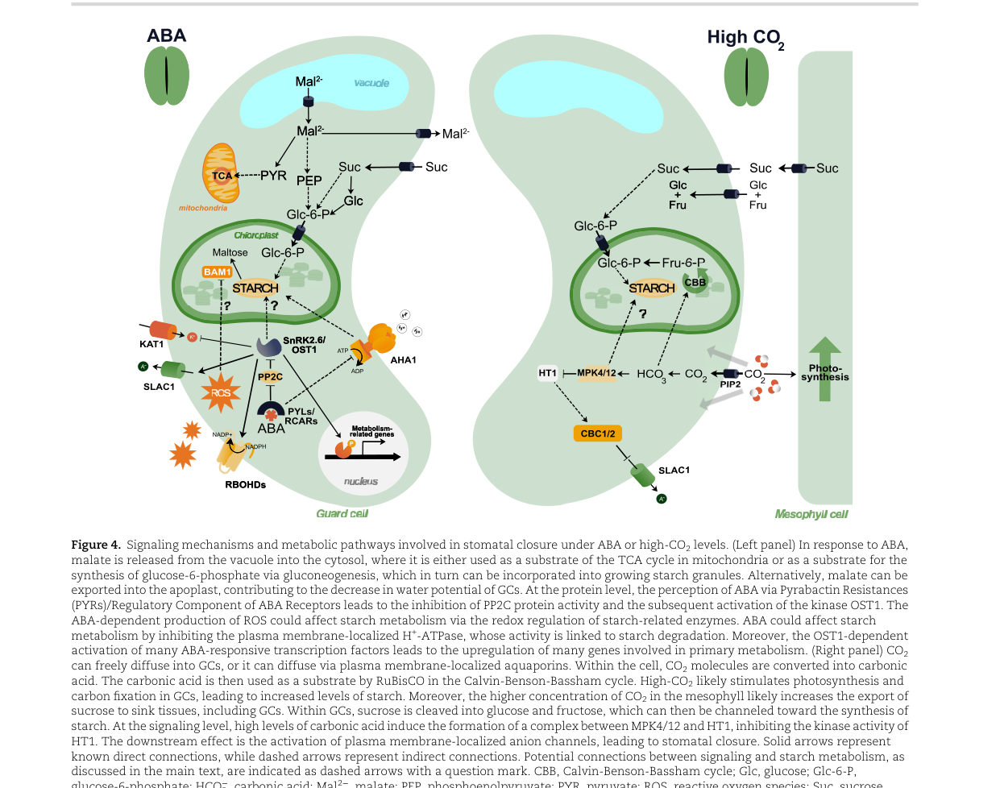

## Question

# Gene Research for Functional Annotation

## ⚠️ CRITICAL: Gene/Protein Identification Context

**BEFORE YOU BEGIN RESEARCH:** You MUST verify you are researching the CORRECT gene/protein. Gene symbols can be ambiguous, especially for less well-characterized genes from non-model organisms.

### Target Gene/Protein Identity (from UniProt):
- **UniProt Accession:** Q940H6
- **Protein Description:** RecName: Full=Serine/threonine-protein kinase SRK2E {ECO:0000303|PubMed:12514244}; EC=2.7.11.1 {ECO:0000269|PubMed:12468729, ECO:0000269|PubMed:12514244, ECO:0000269|PubMed:19955427, ECO:0000269|PubMed:26943172, ECO:0000269|PubMed:30361234}; AltName: Full=Protein OPEN STOMATA 1 {ECO:0000303|PubMed:12468729}; AltName: Full=SNF1-related kinase 2.6 {ECO:0000303|PubMed:12805596}; Short=SnRK2.6 {ECO:0000303|PubMed:12805596}; AltName: Full=Serine/threonine-protein kinase OST1 {ECO:0000303|PubMed:12468729};
- **Gene Information:** Name=SRK2E {ECO:0000303|PubMed:12514244}; Synonyms=OST1 {ECO:0000303|PubMed:12468729}, SNRK2.6 {ECO:0000303|PubMed:12805596}; OrderedLocusNames=At4g33950 {ECO:0000312|Araport:AT4G33950}; ORFNames=F17I5.140 {ECO:0000312|EMBL:CAA19877.1};
- **Organism (full):** Arabidopsis thaliana (Mouse-ear cress).
- **Protein Family:** Belongs to the protein kinase superfamily. Ser/Thr protein
- **Key Domains:** Kinase-like_dom_sf. (IPR011009); Prot_kinase_dom. (IPR000719); Protein_kinase_ATP_BS. (IPR017441); Ser/Thr_kinase_AS. (IPR008271); Pkinase (PF00069)

### MANDATORY VERIFICATION STEPS:

1. **Check if the gene symbol "SRK2E" matches the protein description above**
2. **Verify the organism is correct:** Arabidopsis thaliana (Mouse-ear cress).
3. **Check if protein family/domains align with what you find in literature**
4. **If you find literature for a DIFFERENT gene with the same or similar symbol, STOP**

### If Gene Symbol is Ambiguous or You Cannot Find Relevant Literature:

**DO NOT PROCEED WITH RESEARCH ON A DIFFERENT GENE.** Instead:
- State clearly: "The gene symbol 'SRK2E' is ambiguous or literature is limited for this specific protein"
- Explain what you found (e.g., "Found extensive literature on a different gene with the same symbol in a different organism")
- Describe the protein based ONLY on the UniProt information provided above
- Suggest that the protein function can be inferred from domain/family information

### Research Target:

Please provide a comprehensive research report on the gene **SRK2E** (gene ID: OST1, UniProt: Q940H6) in ARATH.

The research report should be a detailed narrative explaining the function, biological processes, and localization of the gene product. Citations should be given for all claims.

You should prioritize authoritative reviews and primary scientific literature when conducting research. You can supplement
this with annotations you find in gene/protein databases, but these can be outdated or inaccurate.

We are specifically interested in the primary function of the gene - for enzymes, what reaction is catalyzed, and what is the substrate specificity? For transporters, what is the substrate? For structural proteins or adapters, what is the broader structural role? For signaling molecules, what is the role in the pathway.

We are interested in where in or outside the cell the gene product carries out its function.

We are also interested in the signaling or biochemical pathways in which the gene functions. We are less interested in broad pleiotropic effects, except where these elucidate the precise role.

Include evidence where possible. We are interested in both experimental evidence as well as inference from structure, evolution, or bioinformatic analysis. Precise studies should be prioritized over high-throughput, where available.

## Output

Question: You are an expert researcher providing comprehensive, well-cited information.

Provide detailed information focusing on:
1. Key concepts and definitions with current understanding
2. Recent developments and latest research (prioritize 2023-2024 sources)
3. Current applications and real-world implementations
4. Expert opinions and analysis from authoritative sources
5. Relevant statistics and data from recent studies

Format as a comprehensive research report with proper citations. Include URLs and publication dates where available.
Always prioritize recent, authoritative sources and provide specific citations for all major claims.

# Gene Research for Functional Annotation

## ⚠️ CRITICAL: Gene/Protein Identification Context

**BEFORE YOU BEGIN RESEARCH:** You MUST verify you are researching the CORRECT gene/protein. Gene symbols can be ambiguous, especially for less well-characterized genes from non-model organisms.

### Target Gene/Protein Identity (from UniProt):
- **UniProt Accession:** Q940H6
- **Protein Description:** RecName: Full=Serine/threonine-protein kinase SRK2E {ECO:0000303|PubMed:12514244}; EC=2.7.11.1 {ECO:0000269|PubMed:12468729, ECO:0000269|PubMed:12514244, ECO:0000269|PubMed:19955427, ECO:0000269|PubMed:26943172, ECO:0000269|PubMed:30361234}; AltName: Full=Protein OPEN STOMATA 1 {ECO:0000303|PubMed:12468729}; AltName: Full=SNF1-related kinase 2.6 {ECO:0000303|PubMed:12805596}; Short=SnRK2.6 {ECO:0000303|PubMed:12805596}; AltName: Full=Serine/threonine-protein kinase OST1 {ECO:0000303|PubMed:12468729};
- **Gene Information:** Name=SRK2E {ECO:0000303|PubMed:12514244}; Synonyms=OST1 {ECO:0000303|PubMed:12468729}, SNRK2.6 {ECO:0000303|PubMed:12805596}; OrderedLocusNames=At4g33950 {ECO:0000312|Araport:AT4G33950}; ORFNames=F17I5.140 {ECO:0000312|EMBL:CAA19877.1};
- **Organism (full):** Arabidopsis thaliana (Mouse-ear cress).
- **Protein Family:** Belongs to the protein kinase superfamily. Ser/Thr protein
- **Key Domains:** Kinase-like_dom_sf. (IPR011009); Prot_kinase_dom. (IPR000719); Protein_kinase_ATP_BS. (IPR017441); Ser/Thr_kinase_AS. (IPR008271); Pkinase (PF00069)

### MANDATORY VERIFICATION STEPS:

1. **Check if the gene symbol "SRK2E" matches the protein description above**
2. **Verify the organism is correct:** Arabidopsis thaliana (Mouse-ear cress).
3. **Check if protein family/domains align with what you find in literature**
4. **If you find literature for a DIFFERENT gene with the same or similar symbol, STOP**

### If Gene Symbol is Ambiguous or You Cannot Find Relevant Literature:

**DO NOT PROCEED WITH RESEARCH ON A DIFFERENT GENE.** Instead:
- State clearly: "The gene symbol 'SRK2E' is ambiguous or literature is limited for this specific protein"
- Explain what you found (e.g., "Found extensive literature on a different gene with the same symbol in a different organism")
- Describe the protein based ONLY on the UniProt information provided above
- Suggest that the protein function can be inferred from domain/family information

### Research Target:

Please provide a comprehensive research report on the gene **SRK2E** (gene ID: OST1, UniProt: Q940H6) in ARATH.

The research report should be a detailed narrative explaining the function, biological processes, and localization of the gene product. Citations should be given for all claims.

You should prioritize authoritative reviews and primary scientific literature when conducting research. You can supplement
this with annotations you find in gene/protein databases, but these can be outdated or inaccurate.

We are specifically interested in the primary function of the gene - for enzymes, what reaction is catalyzed, and what is the substrate specificity? For transporters, what is the substrate? For structural proteins or adapters, what is the broader structural role? For signaling molecules, what is the role in the pathway.

We are interested in where in or outside the cell the gene product carries out its function.

We are also interested in the signaling or biochemical pathways in which the gene functions. We are less interested in broad pleiotropic effects, except where these elucidate the precise role.

Include evidence where possible. We are interested in both experimental evidence as well as inference from structure, evolution, or bioinformatic analysis. Precise studies should be prioritized over high-throughput, where available.

## Comprehensive research report: SRK2E / OST1 / SnRK2.6 (Arabidopsis thaliana; UniProt Q940H6; locus At4g33950)

### Executive summary
SRK2E (also called OPEN STOMATA 1, OST1, and SnRK2.6) is an Arabidopsis thaliana subclass III SNF1-related protein kinase 2 (SnRK2) that functions as a central Ser/Thr kinase hub in abscisic acid (ABA) and osmotic-stress signaling. It integrates ABA-dependent signaling (via ABA receptors and clade A PP2C phosphatases) with ABA-independent osmotic activation, and it drives key guard-cell effectors—including the S-type anion channel SLAC1 and NADPH oxidases (RBOHs)—to induce stomatal closure and associated drought resistance responses. Canonical guard-cell reconstitution experiments establish an OST1–PP2C–SLAC1 regulatory module, while recent work extends SnRK2 signaling to longer-term adaptation via compartmentalized signaling and metabolic redox homeostasis. (yoshida2006theregulatorydomain pages 2-3, brandt2012reconstitutionofabscisic pages 1-2, geiger2009activityofguard pages 1-2, lu2024nglycosylationofsnrk2s pages 1-2)

---

### 1) Key concepts and definitions (current understanding)

#### 1.1 Gene/protein identity verification (critical disambiguation)
Primary literature explicitly ties the gene OST1 to SRK2E and identifies this locus as At4g33950, establishing that SRK2E ≡ OST1 ≡ SnRK2.6 in Arabidopsis. (yoshida2006theregulatorydomain pages 1-2)

**Target verified:** Arabidopsis thaliana SRK2E/OST1/SnRK2.6 (At4g33950) corresponds to the UniProt target described in the prompt. (yoshida2006theregulatorydomain pages 1-2)

#### 1.2 Functional definition: what OST1 does biochemically
OST1/SRK2E/SnRK2.6 is a SnRK2-type protein kinase activated in ABA signaling that phosphorylates downstream effectors to execute ABA responses; PP2C phosphatases antagonize this by inhibiting the kinase and/or promoting dephosphorylation. (lee2009aproteinkinasephosphatase pages 1-2, wei2025snrk2skinasesor pages 11-12)

At the systems level, OST1 is best understood as an **ABA-to-guard-cell effector kinase**, connecting hormone perception to ion channel regulation and reactive oxygen species (ROS) production during stomatal closure. (geiger2009activityofguard pages 1-2)

#### 1.3 Core ABA signaling module (PYR/PYL–PP2C–SnRK2)
A widely accepted ABA signaling framework places SnRK2 kinases (including OST1/SnRK2.6) downstream of ABA receptors (PYR/PYL/RCAR) and clade A PP2Cs. In the absence of ABA, PP2Cs inhibit SnRK2s; ABA perception relieves this inhibition, enabling kinase activation and phosphorylation of downstream targets. (wei2025snrk2skinasesor pages 11-12, lu2024nglycosylationofsnrk2s pages 1-2)

---

### 2) Mechanistic function, regulation, substrates, and pathways

#### 2.1 Dual activation modes: ABA-dependent and ABA-independent osmotic activation
Yoshida et al. showed SRK2E/OST1 is activated in vivo by both ABA and osmotic stress, and critically that **osmotic-stress activation is ABA-independent**, implying at least two activation routes. (yoshida2006theregulatorydomain pages 2-3)

Domain mapping in the same study separated the regulatory C-terminus into regions required for ABA-dependent versus ABA-independent/osmotic activation, and demonstrated physical interaction with ABI1 (PP2C) that links OST1 to ABA signaling control. (yoshida2006theregulatorydomain pages 1-2, yoshida2006theregulatorydomain pages 8-9)

#### 2.2 Direct regulatory antagonism by PP2Cs (ABI1/PP2CA)
Evidence from multiple foundational studies establishes that PP2C phosphatases inhibit OST1 signaling outputs in guard cells.

* OST1 physically interacts with ABI1; the abi1-1 mutation inhibits ABA-dependent OST1 activation, supporting ABI1 as an upstream negative regulator of OST1 activation in ABA signaling. (yoshida2006theregulatorydomain pages 1-2, yoshida2006theregulatorydomain pages 8-9)
* In guard-cell reconstitution contexts, including Xenopus oocytes, ABI1 incorporated into the OST1–SLAC1 complex prevents SLAC1 activation, consistent with a phosphorylation/dephosphorylation switch controlled by OST1 and ABI1. (geiger2009activityofguard pages 1-2)
* PP2CA inhibits SLAC1 and also physically interacts with OST1 to inhibit the kinase, indicating PP2C regulation can act at multiple nodes (OST1 and channel). (lee2009aproteinkinasephosphatase pages 1-2)

#### 2.3 Key direct substrates and substrate specificity

##### 2.3.1 SLAC1 (S-type anion channel): primary guard-cell effector
Two high-citation PNAS studies established that OST1 interacts with SLAC1 and activates it via phosphorylation, linking ABA signaling to anion efflux and stomatal closure. (lee2009aproteinkinasephosphatase pages 1-2, geiger2009activityofguard pages 1-2)

Brandt et al. provided functional site evidence: **SLAC1 S120A prevents channel activation by OST1**, supporting S120 as a key residue for OST1-dependent regulation. (brandt2012reconstitutionofabscisic pages 1-2)

##### 2.3.2 NADPH oxidases (RBOHs): ROS generation module
A recent synthesis of primary evidence reports residue-level phosphorylation by OST1:
* OST1 phosphorylates **RBOHF at Ser13 and Ser174**.
* OST1 phosphorylates **RBOHD at Ser343 and Ser347** (and also lists Ser163 as a SnRK2.6 site).
These phosphorylation events are linked to ROS production in guard cells and stomatal closure. (wei2025snrk2skinasesor pages 9-11)

##### 2.3.3 Ca2+ signaling and broader target landscape
Recent reviews synthesize evidence that SnRK2s (including SnRK2.6) phosphorylate numerous ion channels and transcriptional regulators, including CNGCs (Ca2+ influx), QUAC1, KAT1, PIP2;1, and chromatin remodelers (e.g., BRM), thereby connecting OST1 activity to both plasma membrane signaling and nuclear gene regulation. (wei2025snrk2skinasesor pages 2-4)

#### 2.4 Subcellular localization and where OST1 acts
The strongest localization evidence is **functional and interaction-based**:

* OST1 forms complexes with plasma membrane-localized SLAC1 in heterologous oocyte systems and in plant interaction assays, supporting plasma-membrane-proximal action in guard cells. (geiger2009activityofguard pages 1-2, lee2009aproteinkinasephosphatase pages 5-5)
* OST1’s direct phosphorylation targets include plasma-membrane NADPH oxidases (RBOHs), further reinforcing a membrane-proximal signaling role during acute ABA responses. (wei2025snrk2skinasesor pages 9-11)
* OST1 is also implicated in nuclear-proximal functions through phosphorylation of transcriptional regulators and chromatin-associated proteins (as synthesized in recent reviews), consistent with compartment-spanning kinase action. (wei2025snrk2skinasesor pages 2-4, chong2022beyondstressresponse pages 2-3)

---

### 3) Recent developments and latest research (prioritizing 2023–2024)

#### 3.1 Long-term ABA signaling: desensitization and compartmentalized SnRK2 functions (2024)
A major 2024 Nature Communications study demonstrated that prolonged ABA signaling involves PTM-driven relocalization and metabolic outputs: SnRK2.2/2.3 undergo N-glycosylation that promotes redistribution from nucleus to peroxisomes in Arabidopsis roots, where SnRK2s interact with GPT1 to regulate NADPH homeostasis and modulate H2O2 accumulation, alleviating ABA-induced root growth inhibition. (lu2024nglycosylationofsnrk2s pages 1-2, lu2024nglycosylationofsnrk2s pages 8-9)

Although this work centers on SnRK2.2/2.3, it reframes the **SnRK2 module (including OST1/SnRK2.6 in early ABA signaling) as temporally staged and compartmentalized**, separating short-term transcriptional/ROS signaling from longer-term metabolic acclimation. (lu2024nglycosylationofsnrk2s pages 8-9, lu2024nglycosylationofsnrk2s pages 1-2)

#### 3.2 Quantitative datasets (recent statistics)
Lu et al. (2024) reported time-course transcriptome structure under ABA:
* 8/20 clusters comprising **12,337 genes** showed ABA-induced biphasic patterns.
* **5,271 ABA-upregulated genes** formed four clusters with rapid induction then attenuation.
* In stt3a-2, the desensitization switch of **1,632/5,271** genes was delayed. (lu2024nglycosylationofsnrk2s pages 1-2)

A recent quantitative phosphoproteomics synthesis reported ABA increased phosphorylation of **166 peptides** and decreased **117** in WT, and that **84/166 ABA-induced phosphopeptides (58 proteins)** were reduced or lost in snrk2.2/2.3/2.6 mutants, supporting broad SnRK2-dependent phosphorylation outputs. (wei2025snrk2skinasesor pages 2-4)

#### 3.3 Guard-cell metabolism integration as an emerging theme (2024)
A 2024 Plant Physiology review connects canonical OST1 ion-channel signaling to guard-cell metabolic regulation, emphasizing convergence of signaling pathways onto guard-cell starch metabolism and proposing manipulation of guard-cell starch dynamics as an underutilized strategy to improve stomatal behavior under changing environments. (dang2024starchmetabolismin pages 1-2)

A supporting schematic from this review summarizes ABA-induced stomatal closure pathways and explicitly includes OST1 (SnRK2.6) acting on ion channels such as SLAC1 while connecting to nuclear regulation and metabolism. (dang2024starchmetabolismin media 01ae2909)

---

### 4) Current applications and real-world implementations

#### 4.1 Agricultural implementation of ABA-pathway manipulation
A 2024 review summarizes that ABA is registered/used agriculturally for reducing transpiration and improving drought resistance (among other uses such as ripening and transplant tolerance), and that both chemical and genetic manipulation of ABA signaling can increase abiotic stress tolerance and productivity. (mo2024unveilingthecrucial pages 15-16, mo2024unveilingthecrucial pages 1-2)

#### 4.2 Chemical tools: agonists/antagonists and engineered ABA ligands
The same 2024 review highlights applied chemical biology:
* ABA receptor agonists (e.g., AM1) and analog optimization (AMF) can protect against water loss/drought, with AMF described as providing prolonged stomatal closure and induction of stress-responsive genes.
* Opabactin is described as an ABA receptor agonist active in monocots and eudicots that significantly enhances drought resistance.
* Antabactin is described as an ABA antagonist that can accelerate seed germination.
These approaches are relevant to OST1 because OST1 is the core kinase activated downstream of the receptor–PP2C module. (mo2024unveilingthecrucial pages 16-17, mo2024unveilingthecrucial pages 15-16)

#### 4.3 Engineering stomatal behavior as a route to drought resilience
The guard-cell starch metabolism review explicitly proposes that manipulating guard-cell starch dynamics can improve stomatal behavior and thereby plant productivity and stress tolerance, aligning with OST1’s role as a key guard-cell kinase controlling stomatal closure. (dang2024starchmetabolismin pages 1-2, dang2024starchmetabolismin media 01ae2909)

---

### 5) Expert opinions and authoritative synthesis

Authoritative reviews agree on OST1/SnRK2.6 as a central ABA signaling kinase linking receptor/PP2C control to ion-channel gating and stress physiology, while emphasizing growing complexity: multi-layer upstream kinase cascades, extensive post-translational modifications, and cross-talk with redox/gasotransmitter signaling. (chong2022beyondstressresponse pages 2-3, wei2025snrk2skinasesor pages 11-12)

A 2024 review on gasotransmitters notes that nitric oxide can negatively regulate ABA signaling in guard cells by S-nitrosylation of OST1, highlighting expert consensus that redox and small-molecule signals tune OST1 outputs and providing routes for chemical modulation of stomatal responses. (yastreb2024gasotransmittersaskey pages 38-40)

---

### Evidence-backed functional summary table

| Category | Summary |
|---|---|
| Identity | Arabidopsis thaliana OST1 is the same gene/protein as SRK2E and SnRK2.6; primary literature explicitly identifies OST1 as identical to SRK2E (At4g33950), matching the UniProt target Q940H6 and placing it in subclass III SnRK2 ABA/stress kinases (yoshida2006theregulatorydomain pages 2-3, yoshida2006theregulatorydomain pages 8-9) |
| Enzymatic function | OST1/SRK2E/SnRK2.6 is an ABA-activated Ser/Thr protein kinase that transfers phosphate from ATP to serine/threonine residues on downstream effectors in ABA, osmotic-stress, and guard-cell signaling pathways; PP2C phosphatases antagonize this by dephosphorylation (yoshida2006theregulatorydomain pages 2-3, brandt2012reconstitutionofabscisic pages 1-2, lee2009aproteinkinasephosphatase pages 1-2) |
| Key upstream regulators | Major regulators include clade A PP2Cs such as ABI1 and PP2CA that bind/inhibit OST1; ABA-bound PYR/PYL receptors relieve PP2C repression; upstream kinases include B2/B3 RAFs and other kinases such as BAK1, BIK1, CPKs, and HT1 that modulate OST1 phosphorylation and activity in context-dependent ways (yoshida2006theregulatorydomain pages 2-3, wei2025snrk2skinasesor pages 11-12, chong2022beyondstressresponse pages 2-3, wei2025snrk2skinasesor pages 12-14) |
| Key direct substrates/targets | Best-established direct target is the guard-cell S-type anion channel SLAC1, activated by OST1-dependent phosphorylation; key functionally supported SLAC1 residue includes S120. Additional reported direct targets include RBOHF (Ser13, Ser174), RBOHD (Ser343, Ser347; also listed Ser163), CNGC5/6/9/12, KAT1, QUAC1, PIP2;1, BRM, ICE1, PUB25/26, AtANN1, and other transcriptional/metabolic regulators (lee2009aproteinkinasephosphatase pages 1-2, brandt2012reconstitutionofabscisic pages 1-2, wei2025snrk2skinasesor pages 2-4, chong2022beyondstressresponse pages 2-3, wei2025snrk2skinasesor pages 9-11, wei2025snrk2skinasesor pages 8-9) |
| Cellular localization/compartments | Functional evidence places OST1 in guard cells at plasma-membrane-proximal signaling complexes with SLAC1, ABI1/PP2CA, BAK1, RBOHs, and CNGCs, while additional targets such as transcription factors/chromatin regulators indicate nuclear and cytosolic activity; related SnRK2 studies emphasize nucleus-to-peroxisome relocalization for SnRK2.2/2.3 during prolonged ABA, highlighting compartmentalized SnRK2 signaling even if that long-term relocalization is not yet directly assigned to OST1 (lee2009aproteinkinasephosphatase pages 1-2, geiger2009activityofguard pages 1-2, lu2024nglycosylationofsnrk2s pages 8-9, wei2025snrk2skinasesor pages 2-4, wei2025snrk2skinasesor pages 11-12) |
| Physiological roles | OST1 is a core positive regulator of ABA-induced stomatal closure, drought and osmotic-stress responses, ROS production in guard cells, and broader stress signaling; loss-of-function ost1 mutants are ABA-insensitive in stomata, fail to close properly, lose more water, and are drought sensitive (lee2009aproteinkinasephosphatase pages 1-2, chong2022beyondstressresponse pages 2-3, geiger2009activityofguard pages 1-2) |
| Recent 2023-2024 developments | Recent work expanded SnRK2/OST1 biology beyond the canonical PYL-PP2C-SnRK2 pathway: new upstream kinase layers (RAF/BIK1/CPKs), new PTM control (persulfidation, S-nitrosylation, ubiquitination, SUMOylation), new Ca2+ entry targets (CNGCs), and broader network integration with metabolism/cytoskeleton. A major 2024 advance showed prolonged ABA signaling can drive N-glycosylation-dependent relocalization of related SnRK2s to peroxisomes to control NADPH/H2O2 homeostasis, reframing SnRK2 signaling as temporally compartmentalized rather than only acute and nuclear/PM-centered (wei2025snrk2skinasesor pages 2-4, wei2025snrk2skinasesor pages 11-12, lu2024nglycosylationofsnrk2s pages 1-2, lu2024nglycosylationofsnrk2s pages 8-9, wei2025snrk2skinasesor pages 12-14) |
| Quantitative data points | In transcriptome time courses under ABA, 8/20 clusters (12,337 genes) showed biphasic patterns and 5,271 ABA-upregulated genes were identified; in glycosylation mutant stt3a-2, the desensitization switch of 1,632/5,271 genes was delayed. Guard-cell phosphoproteomics found 166 peptides increased and 117 decreased after ABA in WT, with 84 of the 166 ABA-induced phosphopeptides (58 proteins) reduced or lost in snrk2.2/2.3/2.6 mutants. Pharmacology in prolonged ABA signaling used 10 μM polydatin or 3 μM GN6P to block late NADPH accumulation (wei2025snrk2skinasesor pages 2-4, lu2024nglycosylationofsnrk2s pages 1-2, lu2024nglycosylationofsnrk2s pages 8-9) |
| Applications | OST1 is a leading target for improving drought resilience, transpiration efficiency, stomatal control, and possibly productivity by engineering ABA signaling or guard-cell metabolism. Recent reviews explicitly frame activation of ABA signaling and manipulation of guard-cell pathways, including OST1-linked starch dynamics and ion-channel regulation, as practical strategies for enhancing stress tolerance and crop performance under changing climates (mo2024unveilingthecrucial pages 1-2, dang2024starchmetabolismin pages 1-2, dang2024starchmetabolismin media 01ae2909) |

*Table: This table summarizes the verified identity, biochemical role, regulation, targets, localization, physiology, recent advances, quantitative findings, and application relevance of Arabidopsis OST1/SRK2E/SnRK2.6. It is useful as a compact evidence map for writing a full functional annotation report.*

---

### Key figure supporting the pathway context
A guard-cell pathway schematic highlighting OST1’s connection to SLAC1 and metabolic/nuclear outputs is available from Dang et al. (2024), Figure 4. (dang2024starchmetabolismin media 01ae2909)

---

### References (URLs and publication dates as captured in retrieved texts)

* Yoshida R. et al. **Journal of Biological Chemistry**. Feb 2006. “The Regulatory Domain of SRK2E/OST1/SnRK2.6 Interacts with ABI1…” https://doi.org/10.1074/jbc.m509820200 (yoshida2006theregulatorydomain pages 2-3)
* Lee S.C. et al. **PNAS**. Dec 2009. “A protein kinase-phosphatase pair interacts with an ion channel…” https://doi.org/10.1073/pnas.0910601106 (lee2009aproteinkinasephosphatase pages 1-2)
* Geiger D. et al. **PNAS**. Dec 2009. “Activity of guard cell anion channel SLAC1 is controlled…” https://doi.org/10.1073/pnas.0912021106 (geiger2009activityofguard pages 1-2)
* Brandt B. et al. **PNAS**. Jun 2012. “Reconstitution of abscisic acid activation of SLAC1…” https://doi.org/10.1073/pnas.1116590109 (brandt2012reconstitutionofabscisic pages 1-2)
* Lu J. et al. **Nature Communications**. Accepted Jul 2024; published 2024 (vol 15). “N-glycosylation of SnRK2s affects NADPH maintenance…” https://doi.org/10.1038/s41467-024-50720-3 (lu2024nglycosylationofsnrk2s pages 1-2)
* Dang T. et al. **Plant Physiology**. Advance access publication 8 Aug 2024. “Starch metabolism in guard cells…” https://doi.org/10.1093/plphys/kiae414 (dang2024starchmetabolismin pages 1-2)
* Mo W. et al. **Frontiers in Plant Science**. Published 21 Nov 2024. “Unveiling the crucial roles of abscisic acid…” https://doi.org/10.3389/fpls.2024.1437184 (mo2024unveilingthecrucial pages 1-2)
* Yastreb T.O. et al. **Phyton**. Jan 2024. “Gasotransmitters as Key Members…” https://doi.org/10.32604/phyton.2024.057922 (yastreb2024gasotransmittersaskey pages 38-40)

---

### Limitations of this report (evidence constraints)
1) The UniProt-specific enzymatic metadata (EC=2.7.11.1) was provided by the user but was not directly quoted from the retrieved papers; therefore, this report treats OST1 functionally as a Ser/Thr kinase based on the primary literature but does not re-cite UniProt itself. (lee2009aproteinkinasephosphatase pages 1-2, yoshida2006theregulatorydomain pages 2-3)
2) Several 2023–2024 primary studies referenced by reviews (e.g., on specific new OST1 targets such as CNGCs in Plant Cell) were not directly retrievable in full text in this run; claims about those targets are therefore presented as review-synthesized rather than newly extracted from the primary articles. (wei2025snrk2skinasesor pages 2-4)

References

1. (yoshida2006theregulatorydomain pages 2-3): Riichiro Yoshida, Taishi Umezawa, Tsuyoshi Mizoguchi, Seiji Takahashi, Fuminori Takahashi, and Kazuo Shinozaki. The regulatory domain of srk2e/ost1/snrk2.6 interacts with abi1 and integrates abscisic acid (aba) and osmotic stress signals controlling stomatal closure in arabidopsis*. Journal of Biological Chemistry, 281:5310-5318, Feb 2006. URL: https://doi.org/10.1074/jbc.m509820200, doi:10.1074/jbc.m509820200. This article has 701 citations and is from a domain leading peer-reviewed journal.

2. (brandt2012reconstitutionofabscisic pages 1-2): Benjamin Brandt, Dennis E. Brodsky, Shaowu Xue, Juntaro Negi, Koh Iba, Jaakko Kangasjärvi, Majid Ghassemian, Aaron B. Stephan, Honghong Hu, and Julian I. Schroeder. Reconstitution of abscisic acid activation of slac1 anion channel by cpk6 and ost1 kinases and branched abi1 pp2c phosphatase action. Proceedings of the National Academy of Sciences, 109:10593-10598, Jun 2012. URL: https://doi.org/10.1073/pnas.1116590109, doi:10.1073/pnas.1116590109. This article has 540 citations and is from a highest quality peer-reviewed journal.

3. (geiger2009activityofguard pages 1-2): Dietmar Geiger, Sönke Scherzer, Patrick Mumm, Annette Stange, Irene Marten, Hubert Bauer, Peter Ache, Susanne Matschi, Anja Liese, Khaled A. S. Al-Rasheid, Tina Romeis, and Rainer Hedrich. Activity of guard cell anion channel slac1 is controlled by drought-stress signaling kinase-phosphatase pair. Proceedings of the National Academy of Sciences, 106:21425-21430, Dec 2009. URL: https://doi.org/10.1073/pnas.0912021106, doi:10.1073/pnas.0912021106. This article has 1071 citations and is from a highest quality peer-reviewed journal.

4. (lu2024nglycosylationofsnrk2s pages 1-2): Junyao Lu, Ning Li, Gaojian Li, Ziang Tian, Lianping Shi, Yan Wang, Yingao Cai, Kaiyuan Zhang, Wanting Sun, Danyang Wang, Jinxin Lin, Jinguang Huang, Changai Wu, Kang Yan, Shizhong Zhang, Chengchao Zheng, and Guodong Yang. N-glycosylation of snrk2s affects nadph maintenance in peroxisomes during prolonged aba signalling. Nature Communications, Aug 2024. URL: https://doi.org/10.1038/s41467-024-50720-3, doi:10.1038/s41467-024-50720-3. This article has 29 citations and is from a highest quality peer-reviewed journal.

5. (yoshida2006theregulatorydomain pages 1-2): Riichiro Yoshida, Taishi Umezawa, Tsuyoshi Mizoguchi, Seiji Takahashi, Fuminori Takahashi, and Kazuo Shinozaki. The regulatory domain of srk2e/ost1/snrk2.6 interacts with abi1 and integrates abscisic acid (aba) and osmotic stress signals controlling stomatal closure in arabidopsis*. Journal of Biological Chemistry, 281:5310-5318, Feb 2006. URL: https://doi.org/10.1074/jbc.m509820200, doi:10.1074/jbc.m509820200. This article has 701 citations and is from a domain leading peer-reviewed journal.

6. (lee2009aproteinkinasephosphatase pages 1-2): Sung Chul Lee, Wenzhi Lan, Bob B. Buchanan, and Sheng Luan. A protein kinase-phosphatase pair interacts with an ion channel to regulate aba signaling in plant guard cells. Proceedings of the National Academy of Sciences, 106:21419-21424, Dec 2009. URL: https://doi.org/10.1073/pnas.0910601106, doi:10.1073/pnas.0910601106. This article has 735 citations and is from a highest quality peer-reviewed journal.

7. (wei2025snrk2skinasesor pages 11-12): Yunmin Wei, Linzhu Peng, and Xiangui Zhou. Snrk2s: kinases or substrates? Apr 2025. URL: https://doi.org/10.3390/plants14081171, doi:10.3390/plants14081171. This article has 6 citations.

8. (yoshida2006theregulatorydomain pages 8-9): Riichiro Yoshida, Taishi Umezawa, Tsuyoshi Mizoguchi, Seiji Takahashi, Fuminori Takahashi, and Kazuo Shinozaki. The regulatory domain of srk2e/ost1/snrk2.6 interacts with abi1 and integrates abscisic acid (aba) and osmotic stress signals controlling stomatal closure in arabidopsis*. Journal of Biological Chemistry, 281:5310-5318, Feb 2006. URL: https://doi.org/10.1074/jbc.m509820200, doi:10.1074/jbc.m509820200. This article has 701 citations and is from a domain leading peer-reviewed journal.

9. (wei2025snrk2skinasesor pages 9-11): Yunmin Wei, Linzhu Peng, and Xiangui Zhou. Snrk2s: kinases or substrates? Apr 2025. URL: https://doi.org/10.3390/plants14081171, doi:10.3390/plants14081171. This article has 6 citations.

10. (wei2025snrk2skinasesor pages 2-4): Yunmin Wei, Linzhu Peng, and Xiangui Zhou. Snrk2s: kinases or substrates? Apr 2025. URL: https://doi.org/10.3390/plants14081171, doi:10.3390/plants14081171. This article has 6 citations.

11. (lee2009aproteinkinasephosphatase pages 5-5): Sung Chul Lee, Wenzhi Lan, Bob B. Buchanan, and Sheng Luan. A protein kinase-phosphatase pair interacts with an ion channel to regulate aba signaling in plant guard cells. Proceedings of the National Academy of Sciences, 106:21419-21424, Dec 2009. URL: https://doi.org/10.1073/pnas.0910601106, doi:10.1073/pnas.0910601106. This article has 735 citations and is from a highest quality peer-reviewed journal.

12. (chong2022beyondstressresponse pages 2-3): Leelyn Chong, Rui Xu, Lixia Ku, and Yingfang Zhu. Beyond stress response: ost1 opening doors for plants to grow. Stress Biology, Oct 2022. URL: https://doi.org/10.1007/s44154-022-00069-8, doi:10.1007/s44154-022-00069-8. This article has 26 citations.

13. (lu2024nglycosylationofsnrk2s pages 8-9): Junyao Lu, Ning Li, Gaojian Li, Ziang Tian, Lianping Shi, Yan Wang, Yingao Cai, Kaiyuan Zhang, Wanting Sun, Danyang Wang, Jinxin Lin, Jinguang Huang, Changai Wu, Kang Yan, Shizhong Zhang, Chengchao Zheng, and Guodong Yang. N-glycosylation of snrk2s affects nadph maintenance in peroxisomes during prolonged aba signalling. Nature Communications, Aug 2024. URL: https://doi.org/10.1038/s41467-024-50720-3, doi:10.1038/s41467-024-50720-3. This article has 29 citations and is from a highest quality peer-reviewed journal.

14. (dang2024starchmetabolismin pages 1-2): Trang Dang, Lucia Piro, Carlo Pasini, and Diana Santelia. Starch metabolism in guard cells: at the intersection of environmental stimuli and stomatal movement. Plant Physiology, 196:1758-1777, Aug 2024. URL: https://doi.org/10.1093/plphys/kiae414, doi:10.1093/plphys/kiae414. This article has 16 citations and is from a highest quality peer-reviewed journal.

15. (dang2024starchmetabolismin media 01ae2909): Trang Dang, Lucia Piro, Carlo Pasini, and Diana Santelia. Starch metabolism in guard cells: at the intersection of environmental stimuli and stomatal movement. Plant Physiology, 196:1758-1777, Aug 2024. URL: https://doi.org/10.1093/plphys/kiae414, doi:10.1093/plphys/kiae414. This article has 16 citations and is from a highest quality peer-reviewed journal.

16. (mo2024unveilingthecrucial pages 15-16): Weiliang Mo, Xunan Zheng, Qingchi Shi, Xuelai Zhao, Xiaoyu Chen, Zhenming Yang, and Zecheng Zuo. Unveiling the crucial roles of abscisic acid in plant physiology: implications for enhancing stress tolerance and productivity. Frontiers in Plant Science, Nov 2024. URL: https://doi.org/10.3389/fpls.2024.1437184, doi:10.3389/fpls.2024.1437184. This article has 55 citations.

17. (mo2024unveilingthecrucial pages 1-2): Weiliang Mo, Xunan Zheng, Qingchi Shi, Xuelai Zhao, Xiaoyu Chen, Zhenming Yang, and Zecheng Zuo. Unveiling the crucial roles of abscisic acid in plant physiology: implications for enhancing stress tolerance and productivity. Frontiers in Plant Science, Nov 2024. URL: https://doi.org/10.3389/fpls.2024.1437184, doi:10.3389/fpls.2024.1437184. This article has 55 citations.

18. (mo2024unveilingthecrucial pages 16-17): Weiliang Mo, Xunan Zheng, Qingchi Shi, Xuelai Zhao, Xiaoyu Chen, Zhenming Yang, and Zecheng Zuo. Unveiling the crucial roles of abscisic acid in plant physiology: implications for enhancing stress tolerance and productivity. Frontiers in Plant Science, Nov 2024. URL: https://doi.org/10.3389/fpls.2024.1437184, doi:10.3389/fpls.2024.1437184. This article has 55 citations.

19. (yastreb2024gasotransmittersaskey pages 38-40): Tetiana O. Yastreb, Yuriy E. Kolupaev, and Alexander P. Dmitriev. Gasotransmitters as key members of the signaling network regulating stomatal response: interaction with other molecules. Phyton, 93:3151-3195, Jan 2024. URL: https://doi.org/10.32604/phyton.2024.057922, doi:10.32604/phyton.2024.057922. This article has 2 citations.

20. (wei2025snrk2skinasesor pages 12-14): Yunmin Wei, Linzhu Peng, and Xiangui Zhou. Snrk2s: kinases or substrates? Apr 2025. URL: https://doi.org/10.3390/plants14081171, doi:10.3390/plants14081171. This article has 6 citations.

21. (wei2025snrk2skinasesor pages 8-9): Yunmin Wei, Linzhu Peng, and Xiangui Zhou. Snrk2s: kinases or substrates? Apr 2025. URL: https://doi.org/10.3390/plants14081171, doi:10.3390/plants14081171. This article has 6 citations.

## Artifacts

- [Edison artifact artifact-00](OST1-deep-research-falcon_artifacts/artifact-00.md)

## Citations

1. yoshida2006theregulatorydomain pages 1-2
2. geiger2009activityofguard pages 1-2
3. yoshida2006theregulatorydomain pages 2-3
4. lee2009aproteinkinasephosphatase pages 1-2
5. brandt2012reconstitutionofabscisic pages 1-2
6. dang2024starchmetabolismin pages 1-2
7. yastreb2024gasotransmittersaskey pages 38-40
8. mo2024unveilingthecrucial pages 1-2
9. yoshida2006theregulatorydomain pages 8-9
10. lee2009aproteinkinasephosphatase pages 5-5
11. chong2022beyondstressresponse pages 2-3
12. mo2024unveilingthecrucial pages 15-16
13. mo2024unveilingthecrucial pages 16-17
14. https://doi.org/10.1074/jbc.m509820200
15. https://doi.org/10.1073/pnas.0910601106
16. https://doi.org/10.1073/pnas.0912021106
17. https://doi.org/10.1073/pnas.1116590109
18. https://doi.org/10.1038/s41467-024-50720-3
19. https://doi.org/10.1093/plphys/kiae414
20. https://doi.org/10.3389/fpls.2024.1437184
21. https://doi.org/10.32604/phyton.2024.057922
22. https://doi.org/10.1074/jbc.m509820200,
23. https://doi.org/10.1073/pnas.1116590109,
24. https://doi.org/10.1073/pnas.0912021106,
25. https://doi.org/10.1038/s41467-024-50720-3,
26. https://doi.org/10.1073/pnas.0910601106,
27. https://doi.org/10.3390/plants14081171,
28. https://doi.org/10.1007/s44154-022-00069-8,
29. https://doi.org/10.1093/plphys/kiae414,
30. https://doi.org/10.3389/fpls.2024.1437184,
31. https://doi.org/10.32604/phyton.2024.057922,