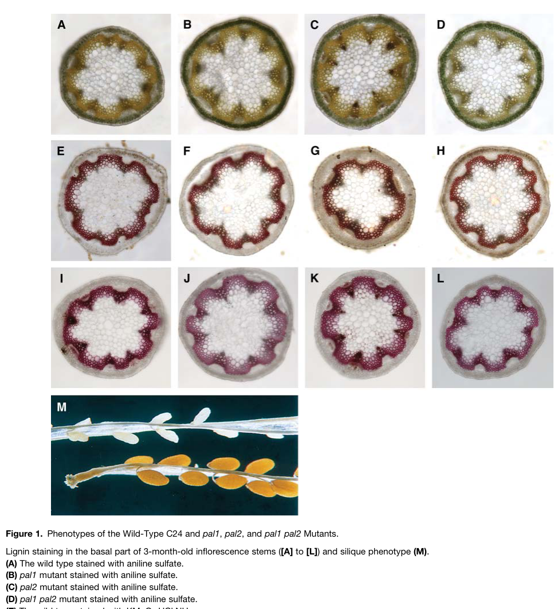

## Question

# Gene Research for Functional Annotation

## ⚠️ CRITICAL: Gene/Protein Identification Context

**BEFORE YOU BEGIN RESEARCH:** You MUST verify you are researching the CORRECT gene/protein. Gene symbols can be ambiguous, especially for less well-characterized genes from non-model organisms.

### Target Gene/Protein Identity (from UniProt):
- **UniProt Accession:** P35510
- **Protein Description:** RecName: Full=Phenylalanine ammonia-lyase 1; EC=4.3.1.24 {ECO:0000269|PubMed:15276452};
- **Gene Information:** Name=PAL1; OrderedLocusNames=At2g37040; ORFNames=T1J8.22;
- **Organism (full):** Arabidopsis thaliana (Mouse-ear cress).
- **Protein Family:** Belongs to the PAL/histidase family. .
- **Key Domains:** Aromatic_Lyase. (IPR001106); Fumarase/histidase_N. (IPR024083); L-Aspartase-like. (IPR008948); Phe/His_NH3-lyase_AS. (IPR022313); Phe_NH3-lyase. (IPR005922)

### MANDATORY VERIFICATION STEPS:

1. **Check if the gene symbol "PAL1" matches the protein description above**
2. **Verify the organism is correct:** Arabidopsis thaliana (Mouse-ear cress).
3. **Check if protein family/domains align with what you find in literature**
4. **If you find literature for a DIFFERENT gene with the same or similar symbol, STOP**

### If Gene Symbol is Ambiguous or You Cannot Find Relevant Literature:

**DO NOT PROCEED WITH RESEARCH ON A DIFFERENT GENE.** Instead:
- State clearly: "The gene symbol 'PAL1' is ambiguous or literature is limited for this specific protein"
- Explain what you found (e.g., "Found extensive literature on a different gene with the same symbol in a different organism")
- Describe the protein based ONLY on the UniProt information provided above
- Suggest that the protein function can be inferred from domain/family information

### Research Target:

Please provide a comprehensive research report on the gene **PAL1** (gene ID: PAL1, UniProt: P35510) in ARATH.

The research report should be a detailed narrative explaining the function, biological processes, and localization of the gene product. Citations should be given for all claims.

You should prioritize authoritative reviews and primary scientific literature when conducting research. You can supplement
this with annotations you find in gene/protein databases, but these can be outdated or inaccurate.

We are specifically interested in the primary function of the gene - for enzymes, what reaction is catalyzed, and what is the substrate specificity? For transporters, what is the substrate? For structural proteins or adapters, what is the broader structural role? For signaling molecules, what is the role in the pathway.

We are interested in where in or outside the cell the gene product carries out its function.

We are also interested in the signaling or biochemical pathways in which the gene functions. We are less interested in broad pleiotropic effects, except where these elucidate the precise role.

Include evidence where possible. We are interested in both experimental evidence as well as inference from structure, evolution, or bioinformatic analysis. Precise studies should be prioritized over high-throughput, where available.

## Output

Question: You are an expert researcher providing comprehensive, well-cited information.

Provide detailed information focusing on:
1. Key concepts and definitions with current understanding
2. Recent developments and latest research (prioritize 2023-2024 sources)
3. Current applications and real-world implementations
4. Expert opinions and analysis from authoritative sources
5. Relevant statistics and data from recent studies

Format as a comprehensive research report with proper citations. Include URLs and publication dates where available.
Always prioritize recent, authoritative sources and provide specific citations for all major claims.

# Gene Research for Functional Annotation

## ⚠️ CRITICAL: Gene/Protein Identification Context

**BEFORE YOU BEGIN RESEARCH:** You MUST verify you are researching the CORRECT gene/protein. Gene symbols can be ambiguous, especially for less well-characterized genes from non-model organisms.

### Target Gene/Protein Identity (from UniProt):
- **UniProt Accession:** P35510
- **Protein Description:** RecName: Full=Phenylalanine ammonia-lyase 1; EC=4.3.1.24 {ECO:0000269|PubMed:15276452};
- **Gene Information:** Name=PAL1; OrderedLocusNames=At2g37040; ORFNames=T1J8.22;
- **Organism (full):** Arabidopsis thaliana (Mouse-ear cress).
- **Protein Family:** Belongs to the PAL/histidase family. .
- **Key Domains:** Aromatic_Lyase. (IPR001106); Fumarase/histidase_N. (IPR024083); L-Aspartase-like. (IPR008948); Phe/His_NH3-lyase_AS. (IPR022313); Phe_NH3-lyase. (IPR005922)

### MANDATORY VERIFICATION STEPS:

1. **Check if the gene symbol "PAL1" matches the protein description above**
2. **Verify the organism is correct:** Arabidopsis thaliana (Mouse-ear cress).
3. **Check if protein family/domains align with what you find in literature**
4. **If you find literature for a DIFFERENT gene with the same or similar symbol, STOP**

### If Gene Symbol is Ambiguous or You Cannot Find Relevant Literature:

**DO NOT PROCEED WITH RESEARCH ON A DIFFERENT GENE.** Instead:
- State clearly: "The gene symbol 'PAL1' is ambiguous or literature is limited for this specific protein"
- Explain what you found (e.g., "Found extensive literature on a different gene with the same symbol in a different organism")
- Describe the protein based ONLY on the UniProt information provided above
- Suggest that the protein function can be inferred from domain/family information

### Research Target:

Please provide a comprehensive research report on the gene **PAL1** (gene ID: PAL1, UniProt: P35510) in ARATH.

The research report should be a detailed narrative explaining the function, biological processes, and localization of the gene product. Citations should be given for all claims.

You should prioritize authoritative reviews and primary scientific literature when conducting research. You can supplement
this with annotations you find in gene/protein databases, but these can be outdated or inaccurate.

We are specifically interested in the primary function of the gene - for enzymes, what reaction is catalyzed, and what is the substrate specificity? For transporters, what is the substrate? For structural proteins or adapters, what is the broader structural role? For signaling molecules, what is the role in the pathway.

We are interested in where in or outside the cell the gene product carries out its function.

We are also interested in the signaling or biochemical pathways in which the gene functions. We are less interested in broad pleiotropic effects, except where these elucidate the precise role.

Include evidence where possible. We are interested in both experimental evidence as well as inference from structure, evolution, or bioinformatic analysis. Precise studies should be prioritized over high-throughput, where available.

## Comprehensive Research Report: Arabidopsis thaliana PAL1 (At2g37040; UniProt P35510)

### 1) Gene/protein identity verification (critical disambiguation)
The research target is **Arabidopsis thaliana PAL1**, mapping unambiguously to **locus At2g37040** and **UniProt accession P35510**, annotated as **phenylalanine ammonia-lyase 1 (PAL1; EC 4.3.1.24)** and belonging to the PAL/histidase (MIO-dependent aromatic lyase) family. (liu2023molecularidentificationof pages 2-3, hayford2022understandingplantstress pages 128-134, chahyadi2017biochemicalandmolecular pages 17-21)

### 2) Key concepts and definitions (current understanding)
#### 2.1 Phenylalanine ammonia-lyase (PAL): committed entry point into phenylpropanoid metabolism
PAL catalyzes the **non-oxidative deamination of L-phenylalanine (Phe) to trans-cinnamic acid (t-cinnamate) and ammonia (NH3)**, representing the first committed step channelling carbon from primary metabolism into the **phenylpropanoid pathway**. (rohde2004molecularphenotypingof pages 1-2, chahyadi2017biochemicalandmolecular pages 17-21)

In Arabidopsis, PAL is encoded by **four genes** (PAL1–PAL4), with PAL1/PAL2 and PAL3/PAL4 forming two related subgroups. (rohde2004molecularphenotypingof pages 1-2, chahyadi2017biochemicalandmolecular pages 17-21)

#### 2.2 Mechanistic/structural features of PAL-family enzymes
PAL proteins are aromatic lyases with conserved active-site features consistent with MIO (4-methylideneimidazole-5-one) chemistry; this provides mechanistic support for UniProt’s assignment of PAL1 to the aromatic-lyase family. (hayford2022understandingplantstress pages 128-134)

### 3) Primary biochemical function and substrate specificity
#### 3.1 Catalyzed reaction and pathway placement
PAL1’s primary biochemical role is to generate **t-cinnamate** from **L-Phe**, supplying substrate to downstream phenylpropanoid reactions (e.g., cinnamate-4-hydroxylase) and enabling synthesis of **lignin monomers (monolignols)**, **flavonoids/anthocyanins**, and related soluble phenolics. (rohde2004molecularphenotypingof pages 1-2, chahyadi2017biochemicalandmolecular pages 17-21)

#### 3.2 Substrate specificity and isoform functional differences
In vitro, Arabidopsis PAL isoforms differ in apparent activity: **AtPAL1, AtPAL2, and AtPAL4** show robust phenylalanine deamination activity, whereas **AtPAL3** has low activity, supporting a major catalytic role for PAL1 among Arabidopsis PALs. (chahyadi2017biochemicalandmolecular pages 17-21)

**Evidence limitation (2023–2024 focus):** within the retrieved corpus, **direct PAL1-specific kinetic constants (Km, kcat) and quantitative comparisons of alternative substrates (e.g., tyrosine)** for Arabidopsis PAL1 are not available; older primary literature is referenced but not fully retrievable here. (chahyadi2017biochemicalandmolecular pages 17-21, hayford2022understandingplantstress pages 141-145)

### 4) Biological processes and pathways involving PAL1
#### 4.1 Lignin biosynthesis and vascular development
PAL1 is strongly linked to **developmental lignification** in vascular tissues: PAL1 is highly expressed in **inflorescence stems** and is implicated in supplying precursors for monolignol/lignin synthesis. (rohde2004molecularphenotypingof pages 1-2, rohde2004molecularphenotypingof pages 2-4)

Consistent with this, pal1/pal2 perturbation causes lignin defects and altered secondary wall ultrastructure, supporting PAL1 as an upstream control point for lignin supply. (rohde2004molecularphenotypingof pages 2-4)

#### 4.2 Flavonoid/anthocyanin biosynthesis
PAL1 contributes substantially to flavonoid metabolism, with genetic evidence indicating that combined reduction of PAL1 and PAL2 strongly decreases flavonoid-related soluble phenolics (notably kaempferol glycosides) and anthocyanin-associated phenotypes. (chahyadi2017biochemicalandmolecular pages 17-21, rohde2004molecularphenotypingof pages 13-15)

A broader comparative statement in a 2023 study (non-Arabidopsis PALs) also notes that **AtPAL1/AtPAL2 double knockouts nearly abolish flavonoid synthesis**, reinforcing the centrality of PAL1/2 for flavonoid precursor supply in Arabidopsis. (liu2023molecularidentificationof pages 2-3)

#### 4.3 Salicylic acid (SA) biosynthesis (PAL-derived branch)
PAL1 also participates in the **cytosolic “PAL pathway” contributing to salicylic acid (SA) biosynthesis** (via benzoate intermediates or via coumarate-associated routes). In Arabidopsis, this PAL-derived branch is reported to contribute **~10% of defense-related SA**, indicating a quantitatively smaller—but biologically meaningful—contribution relative to the dominant isochorismate pathway. (lin2020duallocalizedwhirly1affects pages 1-2)

### 5) Cellular and tissue localization (where PAL1 acts)
#### 5.1 Subcellular localization
Direct imaging/biochemical fractionation evidence for the **PAL1 protein’s** subcellular localization (e.g., PAL1–GFP localization in Arabidopsis tissues) was **not present in the retrieved corpus**. However, PAL-dependent SA production is explicitly described as operating in a **cytosolic PAL pathway**, providing strong pathway-level evidence that PAL enzymatic activity relevant to SA occurs in the cytosol. (lin2020duallocalizedwhirly1affects pages 1-2)

#### 5.2 Tissue and developmental expression
PAL1 is broadly expressed across tissues and is reported as **most abundant in roots and stems**, increasing during later stages of inflorescence stem development—consistent with roles in vascular lignification and phenylpropanoid allocation. (rohde2004molecularphenotypingof pages 2-4)

Additionally, PAL1 transcript is described as **upregulated by low temperature and light**, correlating with anthocyanin-related responses. (chahyadi2017biochemicalandmolecular pages 17-21)

### 6) Regulation of PAL1 (expert-level synthesis from authoritative sources)
PAL1 sits at a high-flux metabolic branch point; accordingly, regulation occurs at multiple levels.

#### 6.1 Transcriptional regulation in immunity/defense
The AP2/ERF transcription factor **ERF114** directly regulates PAL1: PAL1 and downstream phenylpropanoid genes are suppressed in erf114 mutants; RT-qPCR confirms PAL1 mRNA increases in ERF114 overexpression lines and decreases in erf114; and **ChIP-qPCR plus EMSA** demonstrate ERF114 binding to the PAL1 promoter. ERF114 positively modulates elicitor-induced **lignin and SA accumulation**, likely via PAL1 activation. (li2022ethylene‐responsivefactorerf114 pages 1-2)

#### 6.2 Developmental regulation connecting PAL1 to SA-mediated senescence timing
WHY1 (dual localized; nuclear function highlighted) represses PAL1 expression **indirectly via MYB15** during early development, linking PAL1 to developmental control of SA dynamics and senescence phenotypes in Arabidopsis. (lin2020duallocalizedwhirly1affects pages 1-2)

#### 6.3 Post-translational control via proteasome-mediated PAL turnover
Phenylpropanoid and glucosinolate metabolism are linked through **proteasome-dependent PAL degradation** mediated by **Kelch-domain F-box (KFB)** proteins. This provides a mechanism by which plants modulate PAL abundance (and thus phenylpropanoid flux) in response to broader metabolic state and crosstalk. (kim2020glucosinolateandphenylpropanoid pages 1-4)

### 7) Genetics and phenotypes: what PAL1 disruption reveals about function
A major body of Arabidopsis evidence comes from **pal1**, **pal2**, and **pal1 pal2** mutant analysis.

#### 7.1 Gross and reproductive phenotypes
The **pal1 pal2 double mutant** is sterile and produces much smaller siliques (**~3–4 mm**) compared with wild type (**~12 mm**). (rohde2004molecularphenotypingof pages 2-4)

#### 7.2 Enzyme activity allocation among PAL isoforms
In inflorescence stems, PAL activity is reduced in **pal1** but not **pal2**, indicating PAL1 is a larger contributor to stem PAL activity; the **pal1 pal2** double retains **~25% residual PAL activity**, attributed mainly to PAL4. (rohde2004molecularphenotypingof pages 2-4)

#### 7.3 Quantitative impacts on metabolites and lignin (selected statistics)
**Aromatic amino acids:** In the pal1 pal2 double mutant, phenylalanine accumulates **>100-fold** vs wild type, while Tyr and Trp increase **~4-fold**, consistent with blocked flux from Phe into phenylpropanoids. (rohde2004molecularphenotypingof pages 11-13)

**Soluble phenolics:** Total soluble phenolic signal (HPLC peak heights, mV/mg DW) drops from **99.87 ± 6.65 (WT)** to **34.14 ± 5.73 (pal1 pal2)**, and major kaempferol glycosides become nearly absent in the double mutant (e.g., Glc-Glc-Rha-kaempferol **19.12 ± 2.07** in WT vs **0.21 ± 0.08** in pal1 pal2). (rohde2004molecularphenotypingof pages 13-15)

**Lignin amount and composition:** Inflorescence stem lignin decreases from **200** (WT) to **69** (pal1 pal2) (units as reported), and S/G ratio increases from **0.21 (WT)** to **0.38 (pal1 pal2)**, indicating altered monolignol composition in addition to reduced lignin. (rohde2004molecularphenotypingof pages 17-18)

### 8) Recent developments (prioritizing 2023–2024) and current gaps
Within the retrieved corpus, **direct 2023–2024 peer-reviewed Arabidopsis PAL1-focused biochemical or mechanistic studies** were not obtained. The most recent Arabidopsis-relevant items retrieved include theses/dissertations that position PAL1 within lignification regulatory networks (e.g., MYB-driven phenylpropanoid upregulation), and a 2023 Frontiers in Plant Science paper that references Arabidopsis PAL1/PAL2 genetic outcomes while studying PALs in another plant. (kuo2024dissectingtheroles pages 30-32, liu2023molecularidentificationof pages 2-3)

A 2024 thesis explicitly lists PAL1 (At2g37040) among phenylpropanoid pathway genes responsive to lignification-related transcription factor perturbation, reinforcing that PAL1 remains a core node used in current lignification studies even when not the central target. (kuo2024dissectingtheroles pages 30-32)

### 9) Current applications and real-world implementations
#### 9.1 Microbial biosynthesis of flavonoids using Arabidopsis PAL1 pathway genes
A clear implementation of PAL1 knowledge is heterologous pathway reconstruction: **Saccharomyces cerevisiae** was engineered with **Arabidopsis PAL1** and other Arabidopsis flavonoid genes to produce **naringenin de novo from glucose**.

Quantitative performance reported:
- Baseline production from Arabidopsis genes: **<5.5 μM extracellular naringenin**. (koopman2012denovoproduction pages 1-2)
- After chassis and pathway optimization: **~200 μM** in shake-flask culture (≈40-fold increase). (koopman2012denovoproduction pages 1-2)
- In aerated, pH-controlled batch reactors: **>400 μM extracellular naringenin**. (koopman2012denovoproduction pages 1-2)

This demonstrates a practical route by which PAL1 (as a gateway enzyme into phenylpropanoid metabolism) is used in real production systems, and highlights engineering levers (aromatic amino-acid supply, competing byproduct removal, and pathway balancing) that are broadly transferable to other phenylpropanoid products. (koopman2012denovoproduction pages 1-2)

#### 9.2 Engineering levers from Arabidopsis regulatory biology
The identification of **proteasome-dependent PAL turnover** via KFB F-box proteins provides an actionable control layer (protein abundance control) for tuning phenylpropanoid output—conceptually relevant to crop engineering for lignin/phenolic traits and to synthetic biology for flux control. (kim2020glucosinolateandphenylpropanoid pages 1-4)

### 10) Visual evidence from primary literature
The Rohde et al. mutant study includes figures/tables documenting phenotypes, PAL activity, phenolic and lignin changes, and a phenylpropanoid network diagram placing PAL1 at the pathway entry point. (rohde2004molecularphenotypingof media ffaf8aa1, rohde2004molecularphenotypingof media 498606f4, rohde2004molecularphenotypingof media b84a60ca, rohde2004molecularphenotypingof media 178f14b2, rohde2004molecularphenotypingof media d0bd5951, rohde2004molecularphenotypingof media 2a2374f3)

### 11) Summary table of functional annotation evidence
| Category | Key findings | Primary evidence/citation IDs |
|---|---|---|
| Identity | The target is correctly identified as **Arabidopsis thaliana PAL1**, locus **At2g37040**, UniProt **P35510**, one of four Arabidopsis PAL genes; evidence in the corpus explicitly maps AT2G37040 to PAL1 and P35510. | (liu2023molecularidentificationof pages 2-3, hayford2022understandingplantstress pages 128-134, chahyadi2017biochemicalandmolecular pages 17-21) |
| Reaction | PAL1 is a **phenylalanine ammonia-lyase** that catalyzes the **non-oxidative deamination of L-phenylalanine to trans-cinnamic acid and NH3**, the committed entry step into phenylpropanoid metabolism. | (rohde2004molecularphenotypingof pages 1-2, chahyadi2017biochemicalandmolecular pages 17-21) |
| Substrate specificity | Direct Arabidopsis family evidence in the corpus indicates **AtPAL1, AtPAL2, and AtPAL4 show robust in vitro phenylalanine deamination**, whereas AtPAL3 is weak. The broader PAL literature in the corpus supports PAL enzymes as MIO-dependent aromatic lyases; however, **direct 2023-2024 AtPAL1-specific kinetic constants/substrate comparisons are not present in our corpus**. | (chahyadi2017biochemicalandmolecular pages 17-21, hayford2022understandingplantstress pages 128-134) |
| Pathway roles | PAL1 functions at the entry to the **phenylpropanoid pathway**, supplying precursors for **lignin**, **flavonoids/anthocyanins**, and contributing to **salicylic acid (SA)** biosynthesis. Recent mechanistic studies in the corpus link PAL1 transcription to induced **lignin and SA accumulation** during defense signaling. | (rohde2004molecularphenotypingof pages 1-2, li2022ethylene‐responsivefactorerf114 pages 1-2, lin2020duallocalizedwhirly1affects pages 1-2) |
| Localization | The corpus supports PAL1 acting in the **cytosolic PAL pathway** for SA biosynthesis, but it does **not contain a direct PAL1 protein subcellular localization experiment** for At2g37040 itself. Tissue expression is strongest in **roots and stems**, especially **inflorescence stems/vascular tissues** during lignification. | (lin2020duallocalizedwhirly1affects pages 1-2, chahyadi2017biochemicalandmolecular pages 17-21, rohde2004molecularphenotypingof pages 1-2, rohde2004molecularphenotypingof pages 2-4, rohde2004molecularphenotypingof pages 4-5) |
| Regulation | PAL1 is regulated transcriptionally and post-translationally. In the corpus, **ERF114 directly binds the PAL1 promoter** and activates its expression in pathogen/elicitor-triggered defense; **WHY1 represses PAL1 indirectly via MYB15** in developmental SA control; **KFB F-box proteins mediate proteasome-dependent PAL degradation**, linking PAL abundance to glucosinolate crosstalk and carbon signaling. | (li2022ethylene‐responsivefactorerf114 pages 1-2, lin2020duallocalizedwhirly1affects pages 1-2, kim2020glucosinolateandphenylpropanoid pages 1-4) |
| Mutant phenotype | **pal1** single mutants reduce stem PAL activity without major gross visible defects; **pal1 pal2** double mutants show strong metabolic and reproductive phenotypes, including reduced lignification, altered cell-wall ultrastructure, sterility, and loss of multiple soluble phenylpropanoids/flavonoids. PAL1 appears more important than PAL2 for phenylpropanoid generation. | (rohde2004molecularphenotypingof pages 1-2, rohde2004molecularphenotypingof pages 2-4) |
| Quantitative data | Specific values captured in the corpus include: **pal1 pal2 siliques ~3–4 mm vs ~12 mm in wild type**; the **double mutant retains ~25% residual PAL activity** in inflorescence stems (likely from PAL4); leaf PAL activity is reported as **~50% reduced** across genotypes in one assay context; the cytosolic PAL pathway contributes **~10% of defense-related SA** in Arabidopsis. | (rohde2004molecularphenotypingof pages 2-4, lin2020duallocalizedwhirly1affects pages 1-2) |
| Recent developments/applications | Direct **2023-2024 primary Arabidopsis PAL1 papers are limited in our corpus**; newer relevant corpus items are mainly dissertations/theses or broader Arabidopsis studies rather than PAL1-focused primary enzymology. Still, recent work reinforces PAL1 as a regulatory node for **defense-induced lignin/SA** and as a control point for **phenylpropanoid flux engineering** via KFB/SnRK1/MED5-linked PAL turnover. | (kuo2024dissectingtheroles pages 30-32, kim2020glucosinolateandphenylpropanoid pages 1-4, li2022ethylene‐responsivefactorerf114 pages 1-2) |

*Table: This table summarizes the key functional annotation evidence for Arabidopsis thaliana PAL1 (At2g37040; UniProt P35510), including identity, reaction, pathway role, regulation, localization, and mutant phenotypes. It also highlights quantitative findings and where direct 2023-2024 PAL1-specific primary literature is limited in the available corpus.*

### 12) Key primary sources with URLs and publication dates (from retrieved corpus)
- Rohde A. et al. **“Molecular phenotyping of the pal1 and pal2 mutants of Arabidopsis thaliana…”** *The Plant Cell* (Oct 2004). https://doi.org/10.1105/tpc.104.023705 (rohde2004molecularphenotypingof pages 1-2, rohde2004molecularphenotypingof pages 2-4, rohde2004molecularphenotypingof pages 13-15, rohde2004molecularphenotypingof pages 17-18)
- Lin W. et al. **“Dual-localized WHIRLY1 affects salicylic acid biosynthesis via coordination of… PAL1 …”** *Plant Physiology* (Sep 2020). https://doi.org/10.1104/pp.20.00964 (lin2020duallocalizedwhirly1affects pages 1-2)
- Kim J.I. et al. **“Glucosinolate and phenylpropanoid biosynthesis are linked by proteasome-dependent degradation of PAL”** *New Phytologist* (Sep 2020). https://doi.org/10.1111/nph.16108 (kim2020glucosinolateandphenylpropanoid pages 1-4)
- Li Z. et al. **“ERF114 mediates … disease resistance …”** *Molecular Plant Pathology* (Mar 2022). https://doi.org/10.1111/mpp.13208 (li2022ethylene‐responsivefactorerf114 pages 1-2)
- Koopman F. et al. **“De novo production of the flavonoid naringenin in engineered Saccharomyces cerevisiae”** *Microbial Cell Factories* (Dec 2012). https://doi.org/10.1186/1475-2859-11-155 (koopman2012denovoproduction pages 1-2)
- Liu A. et al. **“Molecular identification of phenylalanine ammonia lyase-encoding genes …”** *Frontiers in Plant Science* (Mar 2023). https://doi.org/10.3389/fpls.2023.1114345 (liu2023molecularidentificationof pages 2-3)

References

1. (liu2023molecularidentificationof pages 2-3): AiLian Liu, Yue Zhu, YuHao Wang, TianYu Wang, ShuPing Zhao, Kai Feng, LiangJun Li, and Peng Wu. Molecular identification of phenylalanine ammonia lyase-encoding genes efpals and efpal2-interacting transcription factors in euryale ferox. Frontiers in Plant Science, Mar 2023. URL: https://doi.org/10.3389/fpls.2023.1114345, doi:10.3389/fpls.2023.1114345. This article has 31 citations.

2. (hayford2022understandingplantstress pages 128-134): Understanding plant stress responses: using systems biology approach and text mining methods This article has 0 citations.

3. (chahyadi2017biochemicalandmolecular pages 17-21): Agus Chahyadi. Biochemical and molecular investigations of arabidopsis thaliana transformed with genes of rosmarinic acid biosynthesis. Text, Jan 2017. URL: https://doi.org/10.17192/z2017.0508, doi:10.17192/z2017.0508. This article has 1 citations and is from a peer-reviewed journal.

4. (rohde2004molecularphenotypingof pages 1-2): A. Rohde, Kris Morreel, J. Ralph, G. Goeminne, Vanessa Hostyn, R. De Rycke, Sergej Kushnir, J. Van Doorsselaere, J. Joseleau, M. Vuylsteke, G. van Driessche, J. V. Van Beeumen, E. Messens, and W. Boerjan. Molecular phenotyping of the pal1 and pal2 mutants of arabidopsis thaliana reveals far-reaching consequences on phenylpropanoid, amino acid, and carbohydrate metabolism. The Plant Cell Online, 16:2749-2771, Oct 2004. URL: https://doi.org/10.1105/tpc.104.023705, doi:10.1105/tpc.104.023705. This article has 519 citations.

5. (hayford2022understandingplantstress pages 141-145): Understanding plant stress responses: using systems biology approach and text mining methods This article has 0 citations.

6. (rohde2004molecularphenotypingof pages 2-4): A. Rohde, Kris Morreel, J. Ralph, G. Goeminne, Vanessa Hostyn, R. De Rycke, Sergej Kushnir, J. Van Doorsselaere, J. Joseleau, M. Vuylsteke, G. van Driessche, J. V. Van Beeumen, E. Messens, and W. Boerjan. Molecular phenotyping of the pal1 and pal2 mutants of arabidopsis thaliana reveals far-reaching consequences on phenylpropanoid, amino acid, and carbohydrate metabolism. The Plant Cell Online, 16:2749-2771, Oct 2004. URL: https://doi.org/10.1105/tpc.104.023705, doi:10.1105/tpc.104.023705. This article has 519 citations.

7. (rohde2004molecularphenotypingof pages 13-15): A. Rohde, Kris Morreel, J. Ralph, G. Goeminne, Vanessa Hostyn, R. De Rycke, Sergej Kushnir, J. Van Doorsselaere, J. Joseleau, M. Vuylsteke, G. van Driessche, J. V. Van Beeumen, E. Messens, and W. Boerjan. Molecular phenotyping of the pal1 and pal2 mutants of arabidopsis thaliana reveals far-reaching consequences on phenylpropanoid, amino acid, and carbohydrate metabolism. The Plant Cell Online, 16:2749-2771, Oct 2004. URL: https://doi.org/10.1105/tpc.104.023705, doi:10.1105/tpc.104.023705. This article has 519 citations.

8. (lin2020duallocalizedwhirly1affects pages 1-2): Wenfang Lin, Hong Zhang, Dongmei Huang, Dirk Schenke, Daguang Cai, Binghua Wu, and Ying Miao. Dual-localized whirly1 affects salicylic acid biosynthesis via coordination of isochorismate synthase1, phenylalanine ammonia lyase1, and <i>s</i>-adenosyl-l-methionine-dependent methyltransferase1. Sep 2020. URL: https://doi.org/10.1104/pp.20.00964, doi:10.1104/pp.20.00964. This article has 44 citations and is from a highest quality peer-reviewed journal.

9. (li2022ethylene‐responsivefactorerf114 pages 1-2): Ze Li, Yi Zhang, Jie Ren, Fenglian Jia, Hongmei Zeng, Guangyue Li, and Xiufen Yang. Ethylene‐responsive factor erf114 mediates fungal pathogen effector pevd1‐induced disease resistance in arabidopsis thaliana. Molecular Plant Pathology, 23:819-831, Mar 2022. URL: https://doi.org/10.1111/mpp.13208, doi:10.1111/mpp.13208. This article has 71 citations and is from a peer-reviewed journal.

10. (kim2020glucosinolateandphenylpropanoid pages 1-4): Jeong Im Kim, Xuebin Zhang, Pete E. Pascuzzi, Chang‐Jun Liu, and Clint Chapple. Glucosinolate and phenylpropanoid biosynthesis are linked by proteasome‐dependent degradation of <scp>pal</scp>. Sep 2020. URL: https://doi.org/10.1111/nph.16108, doi:10.1111/nph.16108. This article has 114 citations and is from a highest quality peer-reviewed journal.

11. (rohde2004molecularphenotypingof pages 11-13): A. Rohde, Kris Morreel, J. Ralph, G. Goeminne, Vanessa Hostyn, R. De Rycke, Sergej Kushnir, J. Van Doorsselaere, J. Joseleau, M. Vuylsteke, G. van Driessche, J. V. Van Beeumen, E. Messens, and W. Boerjan. Molecular phenotyping of the pal1 and pal2 mutants of arabidopsis thaliana reveals far-reaching consequences on phenylpropanoid, amino acid, and carbohydrate metabolism. The Plant Cell Online, 16:2749-2771, Oct 2004. URL: https://doi.org/10.1105/tpc.104.023705, doi:10.1105/tpc.104.023705. This article has 519 citations.

12. (rohde2004molecularphenotypingof pages 17-18): A. Rohde, Kris Morreel, J. Ralph, G. Goeminne, Vanessa Hostyn, R. De Rycke, Sergej Kushnir, J. Van Doorsselaere, J. Joseleau, M. Vuylsteke, G. van Driessche, J. V. Van Beeumen, E. Messens, and W. Boerjan. Molecular phenotyping of the pal1 and pal2 mutants of arabidopsis thaliana reveals far-reaching consequences on phenylpropanoid, amino acid, and carbohydrate metabolism. The Plant Cell Online, 16:2749-2771, Oct 2004. URL: https://doi.org/10.1105/tpc.104.023705, doi:10.1105/tpc.104.023705. This article has 519 citations.

13. (kuo2024dissectingtheroles pages 30-32): Chak Chung Kuo. Dissecting the roles of monolignol supply and oxidative enzymes in arabidopsis thaliana lignification. Text, Jan 2024. URL: https://doi.org/10.14288/1.0438616, doi:10.14288/1.0438616. This article has 0 citations and is from a peer-reviewed journal.

14. (koopman2012denovoproduction pages 1-2): Frank Koopman, Jules Beekwilder, Barbara Crimi, Adele van Houwelingen, Robert D Hall, Dirk Bosch, Antonius JA van Maris, Jack T Pronk, and Jean-Marc Daran. De novo production of the flavonoid naringenin in engineered saccharomyces cerevisiae. Microbial Cell Factories, 11:155-155, Dec 2012. URL: https://doi.org/10.1186/1475-2859-11-155, doi:10.1186/1475-2859-11-155. This article has 438 citations and is from a peer-reviewed journal.

15. (rohde2004molecularphenotypingof media ffaf8aa1): A. Rohde, Kris Morreel, J. Ralph, G. Goeminne, Vanessa Hostyn, R. De Rycke, Sergej Kushnir, J. Van Doorsselaere, J. Joseleau, M. Vuylsteke, G. van Driessche, J. V. Van Beeumen, E. Messens, and W. Boerjan. Molecular phenotyping of the pal1 and pal2 mutants of arabidopsis thaliana reveals far-reaching consequences on phenylpropanoid, amino acid, and carbohydrate metabolism. The Plant Cell Online, 16:2749-2771, Oct 2004. URL: https://doi.org/10.1105/tpc.104.023705, doi:10.1105/tpc.104.023705. This article has 519 citations.

16. (rohde2004molecularphenotypingof media 498606f4): A. Rohde, Kris Morreel, J. Ralph, G. Goeminne, Vanessa Hostyn, R. De Rycke, Sergej Kushnir, J. Van Doorsselaere, J. Joseleau, M. Vuylsteke, G. van Driessche, J. V. Van Beeumen, E. Messens, and W. Boerjan. Molecular phenotyping of the pal1 and pal2 mutants of arabidopsis thaliana reveals far-reaching consequences on phenylpropanoid, amino acid, and carbohydrate metabolism. The Plant Cell Online, 16:2749-2771, Oct 2004. URL: https://doi.org/10.1105/tpc.104.023705, doi:10.1105/tpc.104.023705. This article has 519 citations.

17. (rohde2004molecularphenotypingof media b84a60ca): A. Rohde, Kris Morreel, J. Ralph, G. Goeminne, Vanessa Hostyn, R. De Rycke, Sergej Kushnir, J. Van Doorsselaere, J. Joseleau, M. Vuylsteke, G. van Driessche, J. V. Van Beeumen, E. Messens, and W. Boerjan. Molecular phenotyping of the pal1 and pal2 mutants of arabidopsis thaliana reveals far-reaching consequences on phenylpropanoid, amino acid, and carbohydrate metabolism. The Plant Cell Online, 16:2749-2771, Oct 2004. URL: https://doi.org/10.1105/tpc.104.023705, doi:10.1105/tpc.104.023705. This article has 519 citations.

18. (rohde2004molecularphenotypingof media 178f14b2): A. Rohde, Kris Morreel, J. Ralph, G. Goeminne, Vanessa Hostyn, R. De Rycke, Sergej Kushnir, J. Van Doorsselaere, J. Joseleau, M. Vuylsteke, G. van Driessche, J. V. Van Beeumen, E. Messens, and W. Boerjan. Molecular phenotyping of the pal1 and pal2 mutants of arabidopsis thaliana reveals far-reaching consequences on phenylpropanoid, amino acid, and carbohydrate metabolism. The Plant Cell Online, 16:2749-2771, Oct 2004. URL: https://doi.org/10.1105/tpc.104.023705, doi:10.1105/tpc.104.023705. This article has 519 citations.

19. (rohde2004molecularphenotypingof media d0bd5951): A. Rohde, Kris Morreel, J. Ralph, G. Goeminne, Vanessa Hostyn, R. De Rycke, Sergej Kushnir, J. Van Doorsselaere, J. Joseleau, M. Vuylsteke, G. van Driessche, J. V. Van Beeumen, E. Messens, and W. Boerjan. Molecular phenotyping of the pal1 and pal2 mutants of arabidopsis thaliana reveals far-reaching consequences on phenylpropanoid, amino acid, and carbohydrate metabolism. The Plant Cell Online, 16:2749-2771, Oct 2004. URL: https://doi.org/10.1105/tpc.104.023705, doi:10.1105/tpc.104.023705. This article has 519 citations.

20. (rohde2004molecularphenotypingof media 2a2374f3): A. Rohde, Kris Morreel, J. Ralph, G. Goeminne, Vanessa Hostyn, R. De Rycke, Sergej Kushnir, J. Van Doorsselaere, J. Joseleau, M. Vuylsteke, G. van Driessche, J. V. Van Beeumen, E. Messens, and W. Boerjan. Molecular phenotyping of the pal1 and pal2 mutants of arabidopsis thaliana reveals far-reaching consequences on phenylpropanoid, amino acid, and carbohydrate metabolism. The Plant Cell Online, 16:2749-2771, Oct 2004. URL: https://doi.org/10.1105/tpc.104.023705, doi:10.1105/tpc.104.023705. This article has 519 citations.

21. (rohde2004molecularphenotypingof pages 4-5): A. Rohde, Kris Morreel, J. Ralph, G. Goeminne, Vanessa Hostyn, R. De Rycke, Sergej Kushnir, J. Van Doorsselaere, J. Joseleau, M. Vuylsteke, G. van Driessche, J. V. Van Beeumen, E. Messens, and W. Boerjan. Molecular phenotyping of the pal1 and pal2 mutants of arabidopsis thaliana reveals far-reaching consequences on phenylpropanoid, amino acid, and carbohydrate metabolism. The Plant Cell Online, 16:2749-2771, Oct 2004. URL: https://doi.org/10.1105/tpc.104.023705, doi:10.1105/tpc.104.023705. This article has 519 citations.

## Artifacts

- [Edison artifact artifact-00](PAL1-deep-research-falcon_artifacts/artifact-00.md)

## Citations

1. hayford2022understandingplantstress pages 128-134
2. chahyadi2017biochemicalandmolecular pages 17-21
3. rohde2004molecularphenotypingof pages 2-4
4. liu2023molecularidentificationof pages 2-3
5. kim2020glucosinolateandphenylpropanoid pages 1-4
6. rohde2004molecularphenotypingof pages 11-13
7. rohde2004molecularphenotypingof pages 13-15
8. rohde2004molecularphenotypingof pages 17-18
9. kuo2024dissectingtheroles pages 30-32
10. koopman2012denovoproduction pages 1-2
11. rohde2004molecularphenotypingof pages 1-2
12. hayford2022understandingplantstress pages 141-145
13. rohde2004molecularphenotypingof pages 4-5
14. https://doi.org/10.1105/tpc.104.023705
15. https://doi.org/10.1104/pp.20.00964
16. https://doi.org/10.1111/nph.16108
17. https://doi.org/10.1111/mpp.13208
18. https://doi.org/10.1186/1475-2859-11-155
19. https://doi.org/10.3389/fpls.2023.1114345
20. https://doi.org/10.3389/fpls.2023.1114345,
21. https://doi.org/10.17192/z2017.0508,
22. https://doi.org/10.1105/tpc.104.023705,
23. https://doi.org/10.1104/pp.20.00964,
24. https://doi.org/10.1111/mpp.13208,
25. https://doi.org/10.1111/nph.16108,
26. https://doi.org/10.14288/1.0438616,
27. https://doi.org/10.1186/1475-2859-11-155,