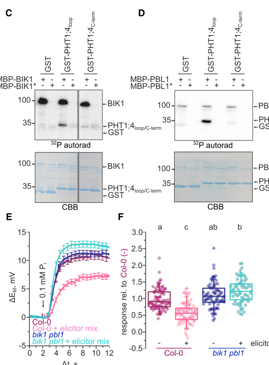
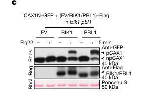

## Question

# Gene Research for Functional Annotation

## ⚠️ CRITICAL: Gene/Protein Identification Context

**BEFORE YOU BEGIN RESEARCH:** You MUST verify you are researching the CORRECT gene/protein. Gene symbols can be ambiguous, especially for less well-characterized genes from non-model organisms.

### Target Gene/Protein Identity (from UniProt):
- **UniProt Accession:** Q8H186
- **Protein Description:** RecName: Full=Probable serine/threonine-protein kinase PBL1 {ECO:0000305}; EC=2.7.11.1 {ECO:0000305}; AltName: Full=BIK1-like protein kinase {ECO:0000303|PubMed:20404519}; AltName: Full=PBS1-like protein 1 {ECO:0000303|PubMed:20413097}; AltName: Full=Protein CHANGED CALCIUM ELEVATION 5 {ECO:0000303|PubMed:25522736};
- **Gene Information:** Name=PBL1 {ECO:0000303|PubMed:20413097}; Synonyms=BLK {ECO:0000303|PubMed:20404519}, CCE5 {ECO:0000303|PubMed:25522736}; OrderedLocusNames=At3g55450 {ECO:0000312|Araport:AT3G55450}; ORFNames=T22E16.110 {ECO:0000312|EMBL:CAB75903.1};
- **Organism (full):** Arabidopsis thaliana (Mouse-ear cress).
- **Protein Family:** Belongs to the protein kinase superfamily. Ser/Thr protein
- **Key Domains:** Kinase-like_dom_sf. (IPR011009); Plant_Ser_Thr_Prot_Kinase. (IPR050823); Prot_kinase_dom. (IPR000719); Protein_kinase_ATP_BS. (IPR017441); Ser-Thr/Tyr_kinase_cat_dom. (IPR001245)

### MANDATORY VERIFICATION STEPS:

1. **Check if the gene symbol "PBL1" matches the protein description above**
2. **Verify the organism is correct:** Arabidopsis thaliana (Mouse-ear cress).
3. **Check if protein family/domains align with what you find in literature**
4. **If you find literature for a DIFFERENT gene with the same or similar symbol, STOP**

### If Gene Symbol is Ambiguous or You Cannot Find Relevant Literature:

**DO NOT PROCEED WITH RESEARCH ON A DIFFERENT GENE.** Instead:
- State clearly: "The gene symbol 'PBL1' is ambiguous or literature is limited for this specific protein"
- Explain what you found (e.g., "Found extensive literature on a different gene with the same symbol in a different organism")
- Describe the protein based ONLY on the UniProt information provided above
- Suggest that the protein function can be inferred from domain/family information

### Research Target:

Please provide a comprehensive research report on the gene **PBL1** (gene ID: PBL1, UniProt: Q8H186) in ARATH.

The research report should be a detailed narrative explaining the function, biological processes, and localization of the gene product. Citations should be given for all claims.

You should prioritize authoritative reviews and primary scientific literature when conducting research. You can supplement
this with annotations you find in gene/protein databases, but these can be outdated or inaccurate.

We are specifically interested in the primary function of the gene - for enzymes, what reaction is catalyzed, and what is the substrate specificity? For transporters, what is the substrate? For structural proteins or adapters, what is the broader structural role? For signaling molecules, what is the role in the pathway.

We are interested in where in or outside the cell the gene product carries out its function.

We are also interested in the signaling or biochemical pathways in which the gene functions. We are less interested in broad pleiotropic effects, except where these elucidate the precise role.

Include evidence where possible. We are interested in both experimental evidence as well as inference from structure, evolution, or bioinformatic analysis. Precise studies should be prioritized over high-throughput, where available.

## Output

Question: You are an expert researcher providing comprehensive, well-cited information.

Provide detailed information focusing on:
1. Key concepts and definitions with current understanding
2. Recent developments and latest research (prioritize 2023-2024 sources)
3. Current applications and real-world implementations
4. Expert opinions and analysis from authoritative sources
5. Relevant statistics and data from recent studies

Format as a comprehensive research report with proper citations. Include URLs and publication dates where available.
Always prioritize recent, authoritative sources and provide specific citations for all major claims.

# Gene Research for Functional Annotation

## ⚠️ CRITICAL: Gene/Protein Identification Context

**BEFORE YOU BEGIN RESEARCH:** You MUST verify you are researching the CORRECT gene/protein. Gene symbols can be ambiguous, especially for less well-characterized genes from non-model organisms.

### Target Gene/Protein Identity (from UniProt):
- **UniProt Accession:** Q8H186
- **Protein Description:** RecName: Full=Probable serine/threonine-protein kinase PBL1 {ECO:0000305}; EC=2.7.11.1 {ECO:0000305}; AltName: Full=BIK1-like protein kinase {ECO:0000303|PubMed:20404519}; AltName: Full=PBS1-like protein 1 {ECO:0000303|PubMed:20413097}; AltName: Full=Protein CHANGED CALCIUM ELEVATION 5 {ECO:0000303|PubMed:25522736};
- **Gene Information:** Name=PBL1 {ECO:0000303|PubMed:20413097}; Synonyms=BLK {ECO:0000303|PubMed:20404519}, CCE5 {ECO:0000303|PubMed:25522736}; OrderedLocusNames=At3g55450 {ECO:0000312|Araport:AT3G55450}; ORFNames=T22E16.110 {ECO:0000312|EMBL:CAB75903.1};
- **Organism (full):** Arabidopsis thaliana (Mouse-ear cress).
- **Protein Family:** Belongs to the protein kinase superfamily. Ser/Thr protein
- **Key Domains:** Kinase-like_dom_sf. (IPR011009); Plant_Ser_Thr_Prot_Kinase. (IPR050823); Prot_kinase_dom. (IPR000719); Protein_kinase_ATP_BS. (IPR017441); Ser-Thr/Tyr_kinase_cat_dom. (IPR001245)

### MANDATORY VERIFICATION STEPS:

1. **Check if the gene symbol "PBL1" matches the protein description above**
2. **Verify the organism is correct:** Arabidopsis thaliana (Mouse-ear cress).
3. **Check if protein family/domains align with what you find in literature**
4. **If you find literature for a DIFFERENT gene with the same or similar symbol, STOP**

### If Gene Symbol is Ambiguous or You Cannot Find Relevant Literature:

**DO NOT PROCEED WITH RESEARCH ON A DIFFERENT GENE.** Instead:
- State clearly: "The gene symbol 'PBL1' is ambiguous or literature is limited for this specific protein"
- Explain what you found (e.g., "Found extensive literature on a different gene with the same symbol in a different organism")
- Describe the protein based ONLY on the UniProt information provided above
- Suggest that the protein function can be inferred from domain/family information

### Research Target:

Please provide a comprehensive research report on the gene **PBL1** (gene ID: PBL1, UniProt: Q8H186) in ARATH.

The research report should be a detailed narrative explaining the function, biological processes, and localization of the gene product. Citations should be given for all claims.

You should prioritize authoritative reviews and primary scientific literature when conducting research. You can supplement
this with annotations you find in gene/protein databases, but these can be outdated or inaccurate.

We are specifically interested in the primary function of the gene - for enzymes, what reaction is catalyzed, and what is the substrate specificity? For transporters, what is the substrate? For structural proteins or adapters, what is the broader structural role? For signaling molecules, what is the role in the pathway.

We are interested in where in or outside the cell the gene product carries out its function.

We are also interested in the signaling or biochemical pathways in which the gene functions. We are less interested in broad pleiotropic effects, except where these elucidate the precise role.

Include evidence where possible. We are interested in both experimental evidence as well as inference from structure, evolution, or bioinformatic analysis. Precise studies should be prioritized over high-throughput, where available.

# Functional annotation of Arabidopsis PBL1 (UniProt Q8H186)

## Identity and principal function

**Identity verified.** The protein specified by UniProt **Q8H186** is *Arabidopsis thaliana* **PBL1**, encoded at **At3g55450** and also called **CCE5** or **BLK**. Genetic mapping and sequencing identified mutations in this locus in five independently isolated *cce5* alleles. PBL1 is a 389-amino-acid **PBS1-like receptor-like cytoplasmic kinase**, in the RLCK-VII family; it is a distinct protein from both PBS1 and its close relative BIK1. Its experimentally observed autophosphorylation and the loss of activity caused by kinase-domain mutations agree with its annotated protein-kinase catalytic domain. (ranf2014microbeassociatedmolecularpatterninduced pages 2-5, ranf2014microbeassociatedmolecularpatterninduced pages 5-8, zhang2010receptorlikecytoplasmickinases pages 1-2, ranf2014microbeassociatedmolecularpatterninduced pages 8-9)

**Primary functional annotation:** PBL1 is a membrane-associated immune-signaling protein kinase. It transfers phosphate from ATP to protein substrates, linking cell-surface pattern recognition to early defense responses and to regulation of calcium and phosphate transport. The most securely established *direct PBL1 phosphorylation substrates* are the phosphate transporters **PHT1;1/PHT1;4** and the calcium exchangers **CAX1/CAX3**. This is protein-substrate specificity, not evidence that PBL1 itself transports phosphate or calcium. The available experiments define substrate regions—the PHT1 cytosolic loop and the CAX amino-terminal serine-rich regulatory cluster—more securely than individual PBL1-specific phosphoacceptor residues. (julian2022directinhibitionof pages 5-7, wang2024mechanismsofcalcium pages 4-5)

The following evidence hierarchy distinguishes those direct substrates from receptor partners and targets established principally for BIK1.

| Partner/substrate | PBL1-specific evidence | Physiological consequence | Evidence strength / caveat |
|---|---|---|---|
| **PHT1;1 and PHT1;4** plasma-membrane phosphate transporters—cytosolic loop | Recombinant PBL1, but not its kinase-dead variant, directly phosphorylated the cytosolic loops of PHT1;1 and PHT1;4 in vitro. Pattern treatment failed to inhibit PHT1;4-mediated phosphate uptake in *bik1 pbl1* roots. [Dindas et al., 2022](https://doi.org/10.1016/j.cub.2021.11.063) (julian2022directinhibitionof pages 1-3, julian2022directinhibitionof pages 5-7, dindas2022directinhibitionof media fd53d7d2) | Connects pattern-triggered immunity to rapid inhibition of root phosphate uptake; altered PHT1 activity affects antibacterial defense and root-microbiome composition. | **Direct PBL1 substrate evidence.** The phosphorylated region is established, but individual PBL1-dependent residues were not mapped. PBL1 is the kinase regulator, not a phosphate transporter. |
| **CAX1 and CAX3** tonoplast Ca²⁺/H⁺ antiporters—N-terminal serine-rich regulatory cluster | Purified recombinant PBL1 directly phosphorylated CAX1/3 in vitro; PBL1 expression restored flg22-induced CAX1 phosphorylation in *bik1 pbl1* protoplasts. [Wang et al., 2024](https://doi.org/10.1038/s41586-024-07100-0) (wang2024mechanismsofcalcium pages 4-5, wang2024mechanismsofcalcium media 0a2bbb94) | Phosphorylation relieves CAX autoinhibition, promoting vacuolar sequestration of cytosolic Ca²⁺ and shaping or terminating immune Ca²⁺ signals. | **Direct biochemical plus in-planta redundancy evidence.** The functional N-terminal serine cluster is supported, but individual serines should not be assigned specifically to PBL1 without site-resolved evidence. Trafficking toward intracellular CAX targets was demonstrated mechanistically for BIK1, not PBL1. |
| **FLS2 immune-receptor complex** | PBL1 co-immunoprecipitated with FLS2 in Arabidopsis and underwent rapid, phosphatase-sensitive phosphorylation after flg22 treatment; PBL1 subsequently dissociated from FLS2. [Zhang et al., 2010](https://doi.org/10.1016/j.chom.2010.03.007) (zhang2010receptorlikecytoplasmickinases pages 5-6, zhang2010receptorlikecytoplasmickinases pages 1-2, zhang2010receptorlikecytoplasmickinases pages 3-4) | Positions PBL1 at an early plasma-membrane signaling node downstream of flagellin perception, contributing to Ca²⁺ elevation, ROS production, and callose deposition. | **Strong complex-association and activation evidence.** Co-immunoprecipitation does not establish direct binding or prove that PBL1 phosphorylates FLS2; receptor–substrate directionality should not be asserted. |
| **RBOHD** plasma-membrane NADPH oxidase—cytosolic N terminus | PBL1 directly bound RBOHD-N in vitro; flg22-induced phosphorylation of RBOHD S39 and S343 was reduced by approximately **40%** and **80%**, respectively, in *bik1 pbl1*. [Kadota et al., 2014](https://doi.org/10.1016/j.molcel.2014.02.021) (kadota2015regulationofthe pages 3-4, yasuhiro2014directregulationof pages 2-3, yasuhiro2014directregulationof pages 5-6) | Supports participation of the BIK1/PBL1 module in activation of the apoplastic ROS burst and associated stomatal and antibacterial immunity. | **Direct PBL1 binding; genetic/pathway-level phosphorylation evidence.** Direct phosphorylation and site assignment at S39, S339, S343, and related N-terminal sites were demonstrated for **BIK1**, not individually for PBL1. |
| **CNGC2/CNGC4** plasma-membrane Ca²⁺-permeable channels | Loss of BIK1 and PBL1 compromises flagellin- and EF-Tu-induced Ca²⁺ influx, placing PBL1 upstream of immune Ca²⁺ entry. Direct CNGC2/4 phosphorylation assays identify BIK1 as the kinase. [Sun and Zhang, 2020](https://doi.org/10.1093/femsre/fuaa035) (sun2020regulatoryroleof pages 9-10, sun2020regulatoryroleof pages 8-9) | CNGC2/4-mediated Ca²⁺ influx contributes to early immune calcium signatures and ROS production. | **Pathway inference for PBL1, not a confirmed direct PBL1-substrate relationship.** Direct phosphorylation of CNGC2/4 by PBL1 and PBL1-specific sites have not been established by the cited evidence. |

*Table: Evidence hierarchy for experimentally supported partners and substrates of Arabidopsis PBL1 (Q8H186; At3g55450). The table distinguishes direct PBL1 kinase evidence from genetic inference and findings demonstrated only for the related kinase BIK1.*

## Catalysis and experimentally defined substrates

**Phosphate uptake: direct phosphorylation of PHT1 transporters.** Purified active PBL1 phosphorylates the large cytosolic loops of **PHT1;4** and **PHT1;1** *in vitro*; kinase-dead PBL1 does not. For PHT1;4, phosphorylation was observed on the loop but not the tested C-terminal region. In roots, a mixture of flg22, elf18 and AtPep1 suppressed PHT1;4-dependent, proton-coupled phosphate uptake in wild type but not in *bik1 pbl1* plants. Thus the biochemical substrate assignment is **direct for PBL1**, whereas the uptake phenotype establishes the requirement for the **BIK1/PBL1 module**, not the quantitative contribution of PBL1 alone. The proposed physiological result is rapid limitation of phosphate acquisition when immune receptors detect danger. These experiments were performed in Arabidopsis root hairs and seedlings; PHT1 transport occurs at the plasma membrane. (julian2022directinhibitionof pages 1-3, julian2022directinhibitionof pages 5-7, dindas2022directinhibitionof media fd53d7d2)

**Calcium homeostasis: direct phosphorylation of CAX exchangers.** The important 2024 advance was evidence that recombinant PBL1, like BIK1, **directly phosphorylates CAX1 and CAX3** *in vitro*. Their cytosol-facing amino-terminal **serine-rich “S-cluster”** regulates autoinhibition: phospho-ablating the cluster prevents normal activation, whereas phosphomimetic substitutions activate the exchangers. Flg22-induced CAX1 phosphorylation was impaired in *bik1 pbl1* cells and restored by expressing either kinase, supporting partly redundant action **in cells**. CAX1/CAX3 are **tonoplast** Ca²⁺/H⁺ exchangers that sequester cytosolic Ca²⁺ into the vacuole. Accordingly, this route can help shape or resolve an immune calcium signal; it does **not** make PBL1 itself a calcium channel or pump. A distinct CBL2/3–CIPK3/9/26 pathway can also activate CAX1/CAX3 during calcium homeostasis, whereas the flg22 route involves BAK1–BIK1/PBL1. Specific endocytic requirements were tested mechanistically for **BIK1**; equivalent trafficking of PBL1 to a tonoplast-associated site should not be treated as established. (wang2024mechanismsofcalcium pages 3-4, wang2024mechanismsofcalcium pages 4-5, wang2024mechanismsofcalcium pages 6-7, wang2024mechanismsofcalcium media 0a2bbb94)

## Signaling pathways and biological evidence

**Early pattern-triggered immunity.** PBL1 associates with the flagellin receptor **FLS2** in Arabidopsis, as shown by co-immunoprecipitation from plants expressing PBL1 under its native promoter. Following perception of **flg22**, PBL1 shows a phosphatase-sensitive mobility shift and dissociates from the FLS2 complex. These findings place it immediately downstream of plasma-membrane pattern recognition, but co-immunoprecipitation alone neither proves a direct physical FLS2–PBL1 contact nor identifies FLS2 as a direct PBL1 phosphorylation substrate. Studies also place the BIK1/PBL1 module downstream of the **EFR–elf18** and **PEPR–AtPep1** immune pathways. (zhang2010receptorlikecytoplasmickinases pages 5-6, zhang2010receptorlikecytoplasmickinases pages 1-2, julian2022directinhibitionof pages 5-7, zhang2010receptorlikecytoplasmickinases pages 3-4)

**Calcium responses and ligand specificity.** An apoaequorin-based genetic screen recovered **five *cce5/pbl1* alleles**. Their seedlings had reduced cytosolic calcium elevations after **flg22, elf18 or AtPep1**, but responded comparatively normally to **chitin octamers**. Independent *pbl1* insertion mutants, double-mutant comparisons with *bik1*, and complementation by genomic PBL1 supported the assignment. Three missense variants—**G70D, A97V and R172Q**—had absent or strongly diminished PBL1 autophosphorylation; restoring a catalytically and properly targeted kinase is therefore important to this signaling branch. Unlike some other RLCKs, PBL1 is not established as the indispensable link to chitin-induced MAPK signaling: *pbl1*, *bik1* and *pbl1 bik1* insertion mutants retained broadly normal elicitor-induced MAPK activation in the reported experiments, despite impaired calcium responses. (ranf2014microbeassociatedmolecularpatterninduced pages 2-5, ranf2014microbeassociatedmolecularpatterninduced pages 5-8, ranf2014microbeassociatedmolecularpatterninduced pages 8-9, ranf2014microbeassociatedmolecularpatterninduced pages 9-12)

**Oxidative burst: distinguish association from direct catalysis.** PBL1 binds the amino-terminal cytosolic region of **RBOHD** *in vitro*. Flg22-induced phosphorylation of RBOHD **S39** and **S343** was approximately **40%** and **80%** lower, respectively, in *bik1 pbl1* than wild type. Those percentages measure loss in a **double mutant**: they do not assign either phosphosite specifically to PBL1. Direct phosphorylation and detailed phosphosite mapping in that study were demonstrated for **BIK1**. The evidence therefore supports PBL1 participation in an RBOHD-associated, reactive-oxygen signaling pathway, but is weaker for a claim that PBL1 itself phosphorylates RBOHD at S39 or S343. Likewise, BIK1 has direct channel-phosphorylation evidence for CNGC2/CNGC4; PBL1’s genetic role in the calcium response should not be converted into a claim of direct PBL1 phosphorylation of those channels. (sun2020regulatoryroleof pages 9-10, kadota2015regulationofthe pages 3-4, yasuhiro2014directregulationof pages 2-3, yasuhiro2014directregulationof pages 5-6)

**Additional receptor input.** The peptide receptor **MIK2**, with BAK1/SERK-family co-receptors, senses endogenous SCOOP peptides and related microbial sequences. A *bik1 pbl1* line showed compromised SCOOP-triggered oxidative burst and root-growth inhibition. This extends the **module’s** relevance beyond flg22, but those particular phenotypes do not isolate the contribution of PBL1 from BIK1; the reported peptide-induced kinase mobility-shift assay specifically visualized BIK1. (hou2021thearabidopsismik2 pages 8-9, hou2021thearabidopsismik2 pages 7-8)

## Site of action and physiological significance

The **cytoplasmic face of the plasma membrane** is PBL1’s best-supported initial functional location, where it participates in surface-receptor signaling. Its N-terminal **Gly2**, a predicted myristoylation site, is functionally critical: a **G2A** variant retained detectable autophosphorylation in an immunoprecipitate but failed to undergo normal flg22-induced phosphorylation and failed to rescue the *pbl1* calcium and root-growth phenotypes. This strongly supports a need for correct membrane targeting, although a Gly2 experiment by itself is not a direct measurement of PBL1 lipid modification or a complete localization map. PBL1’s CAX substrates act at the vacuolar membrane; direct phosphorylation *in vitro* and rescue *in cells* do not by themselves establish where PBL1 encounters them in an intact plant. (ranf2014microbeassociatedmolecularpatterninduced pages 8-9, ranf2014microbeassociatedmolecularpatterninduced pages 9-12, wang2024mechanismsofcalcium pages 4-5)

The observed outputs include elicitor-induced calcium elevations, oxidative bursts and inhibition of root growth. The phosphate-transport study additionally connects this kinase module to **root phosphate uptake**, antibacterial defense and microbiome assembly: reduced PHT1-mediated uptake was associated with stronger defense against the tested soil-borne bacterium under low-phosphate conditions. These are mechanistic laboratory findings, **not evidence of an established agricultural implementation or a PBL1-engineered crop**. As an annotation, PBL1 is best described as an **immune-receptor-proximal phosphorylation relay with experimentally verified transporter substrates**, rather than as a general-purpose defense marker or a function inferred solely from homology. (ranf2014microbeassociatedmolecularpatterninduced pages 5-8, julian2022directinhibitionof pages 7-8, julian2022directinhibitionof pages 5-7, wang2024mechanismsofcalcium pages 4-5)

## Key primary sources and dates

- **Wang et al.**, “Mechanisms of calcium homeostasis orchestrate plant growth and immunity,” *Nature* **627**, 382–388; published **February 2024**. Direct PBL1/CAX biochemistry and immune-dependent CAX regulation. https://doi.org/10.1038/s41586-024-07100-0 (wang2024mechanismsofcalcium pages 4-5)
- **Dindas et al.**, “Direct inhibition of phosphate transport by immune signaling in Arabidopsis,” *Current Biology* **32**, 488–495.e5; published online **16 December 2021**, issue dated **24 January 2022**. Direct PBL1/PHT1 kinase assays and root phosphate-uptake experiments. https://doi.org/10.1016/j.cub.2021.11.063 (julian2022directinhibitionof pages 7-8, julian2022directinhibitionof pages 1-3, julian2022directinhibitionof pages 5-7)
- **Hou et al.**, “The Arabidopsis MIK2 receptor elicits immunity by sensing a conserved signature from phytocytokines and microbes,” *Nature Communications* **12**; **September 2021**. SCOOP–MIK2 receptor signaling and *bik1 pbl1* phenotypes. https://doi.org/10.1038/s41467-021-25580-w (hou2021thearabidopsismik2 pages 8-9, hou2021thearabidopsismik2 pages 7-8)
- **Ranf et al.**, “Microbe-associated molecular pattern-induced calcium signaling requires the receptor-like cytoplasmic kinases, PBL1 and BIK1,” *BMC Plant Biology* **14**, 374; **December 2014**. Identification of CCE5 as PBL1, kinase alleles, calcium responses and membrane-targeting requirement. https://doi.org/10.1186/s12870-014-0374-4 (ranf2014microbeassociatedmolecularpatterninduced pages 2-5, ranf2014microbeassociatedmolecularpatterninduced pages 8-9)
- **Kadota et al.**, “Direct regulation of the NADPH oxidase RBOHD by the PRR-associated kinase BIK1 during plant immunity,” *Molecular Cell* **54**, 43–55; **April 2014**. PBL1–RBOHD binding and double-mutant evidence, with direct site-resolved kinase evidence for BIK1. https://doi.org/10.1016/j.molcel.2014.02.021 (yasuhiro2014directregulationof pages 2-3, yasuhiro2014directregulationof pages 5-6)
- **Zhang et al.**, “Receptor-like cytoplasmic kinases integrate signaling from multiple plant immune receptors and are targeted by a *Pseudomonas syringae* effector,” *Cell Host & Microbe* **7**, 290–301; **April 2010**. PBL1–FLS2 association and receptor-triggered phosphorylation. https://doi.org/10.1016/j.chom.2010.03.007 (zhang2010receptorlikecytoplasmickinases pages 5-6, zhang2010receptorlikecytoplasmickinases pages 3-4)

References

1. (ranf2014microbeassociatedmolecularpatterninduced pages 2-5): Stefanie Ranf, Lennart Eschen-Lippold, Katja Fröhlich, Lore Westphal, Dierk Scheel, and Justin Lee. Microbe-associated molecular pattern-induced calcium signaling requires the receptor-like cytoplasmic kinases, pbl1 and bik1. BMC Plant Biology, Dec 2014. URL: https://doi.org/10.1186/s12870-014-0374-4, doi:10.1186/s12870-014-0374-4. This article has 164 citations and is from a peer-reviewed journal.

2. (ranf2014microbeassociatedmolecularpatterninduced pages 5-8): Stefanie Ranf, Lennart Eschen-Lippold, Katja Fröhlich, Lore Westphal, Dierk Scheel, and Justin Lee. Microbe-associated molecular pattern-induced calcium signaling requires the receptor-like cytoplasmic kinases, pbl1 and bik1. BMC Plant Biology, Dec 2014. URL: https://doi.org/10.1186/s12870-014-0374-4, doi:10.1186/s12870-014-0374-4. This article has 164 citations and is from a peer-reviewed journal.

3. (zhang2010receptorlikecytoplasmickinases pages 1-2): Jie Zhang, Wei Li, Tingting Xiang, Zixu Liu, Kristin Laluk, Xiaojun Ding, Yan Zou, Minghui Gao, Xiaojuan Zhang, She Chen, Tesfaye Mengiste, Yuelin Zhang, and Jian-Min Zhou. Receptor-like cytoplasmic kinases integrate signaling from multiple plant immune receptors and are targeted by a pseudomonas syringae effector. Cell host & microbe, 7 4:290-301, Apr 2010. URL: https://doi.org/10.1016/j.chom.2010.03.007, doi:10.1016/j.chom.2010.03.007. This article has 1056 citations and is from a highest quality peer-reviewed journal.

4. (ranf2014microbeassociatedmolecularpatterninduced pages 8-9): Stefanie Ranf, Lennart Eschen-Lippold, Katja Fröhlich, Lore Westphal, Dierk Scheel, and Justin Lee. Microbe-associated molecular pattern-induced calcium signaling requires the receptor-like cytoplasmic kinases, pbl1 and bik1. BMC Plant Biology, Dec 2014. URL: https://doi.org/10.1186/s12870-014-0374-4, doi:10.1186/s12870-014-0374-4. This article has 164 citations and is from a peer-reviewed journal.

5. (julian2022directinhibitionof pages 5-7): Julian Dindas, Thomas A. DeFalco, Gang Yu, Lu Zhang, Pascale David, Marta Bjornson, Marie-Christine Thibaud, Valéria Custódio, Gabriel Castrillo, Laurent Nussaume, Alberto P. Macho, and Cyril Zipfel. Direct inhibition of phosphate transport by immune signaling in arabidopsis. Current Biology, 32:488-495.e5, Jan 2022. URL: https://doi.org/10.1016/j.cub.2021.11.063, doi:10.1016/j.cub.2021.11.063. This article has 61 citations and is from a highest quality peer-reviewed journal.

6. (wang2024mechanismsofcalcium pages 4-5): Chao Wang, Ren-Jie Tang, Senhao Kou, Xiaoshu Xu, Yi Lu, Kenda Rauscher, Angela Voelker, and Sheng Luan. Mechanisms of calcium homeostasis orchestrate plant growth and immunity. Nature, 627:382-388, Feb 2024. URL: https://doi.org/10.1038/s41586-024-07100-0, doi:10.1038/s41586-024-07100-0. This article has 181 citations and is from a highest quality peer-reviewed journal.

7. (julian2022directinhibitionof pages 1-3): Julian Dindas, Thomas A. DeFalco, Gang Yu, Lu Zhang, Pascale David, Marta Bjornson, Marie-Christine Thibaud, Valéria Custódio, Gabriel Castrillo, Laurent Nussaume, Alberto P. Macho, and Cyril Zipfel. Direct inhibition of phosphate transport by immune signaling in arabidopsis. Current Biology, 32:488-495.e5, Jan 2022. URL: https://doi.org/10.1016/j.cub.2021.11.063, doi:10.1016/j.cub.2021.11.063. This article has 61 citations and is from a highest quality peer-reviewed journal.

8. (dindas2022directinhibitionof media fd53d7d2): Julian Dindas, Thomas A. DeFalco, Gang Yu, Lu Zhang, Pascale David, Marta Bjornson, Marie-Christine Thibaud, Valéria Custódio, Gabriel Castrillo, Laurent Nussaume, Alberto P. Macho, and Cyril Zipfel. Direct inhibition of phosphate transport by immune signaling in arabidopsis. Current Biology, 32:488-495.e5, Jan 2022. URL: https://doi.org/10.1016/j.cub.2021.11.063, doi:10.1016/j.cub.2021.11.063. This article has 61 citations and is from a highest quality peer-reviewed journal.

9. (wang2024mechanismsofcalcium media 0a2bbb94): Chao Wang, Ren-Jie Tang, Senhao Kou, Xiaoshu Xu, Yi Lu, Kenda Rauscher, Angela Voelker, and Sheng Luan. Mechanisms of calcium homeostasis orchestrate plant growth and immunity. Nature, 627:382-388, Feb 2024. URL: https://doi.org/10.1038/s41586-024-07100-0, doi:10.1038/s41586-024-07100-0. This article has 181 citations and is from a highest quality peer-reviewed journal.

10. (zhang2010receptorlikecytoplasmickinases pages 5-6): Jie Zhang, Wei Li, Tingting Xiang, Zixu Liu, Kristin Laluk, Xiaojun Ding, Yan Zou, Minghui Gao, Xiaojuan Zhang, She Chen, Tesfaye Mengiste, Yuelin Zhang, and Jian-Min Zhou. Receptor-like cytoplasmic kinases integrate signaling from multiple plant immune receptors and are targeted by a pseudomonas syringae effector. Cell host & microbe, 7 4:290-301, Apr 2010. URL: https://doi.org/10.1016/j.chom.2010.03.007, doi:10.1016/j.chom.2010.03.007. This article has 1056 citations and is from a highest quality peer-reviewed journal.

11. (zhang2010receptorlikecytoplasmickinases pages 3-4): Jie Zhang, Wei Li, Tingting Xiang, Zixu Liu, Kristin Laluk, Xiaojun Ding, Yan Zou, Minghui Gao, Xiaojuan Zhang, She Chen, Tesfaye Mengiste, Yuelin Zhang, and Jian-Min Zhou. Receptor-like cytoplasmic kinases integrate signaling from multiple plant immune receptors and are targeted by a pseudomonas syringae effector. Cell host & microbe, 7 4:290-301, Apr 2010. URL: https://doi.org/10.1016/j.chom.2010.03.007, doi:10.1016/j.chom.2010.03.007. This article has 1056 citations and is from a highest quality peer-reviewed journal.

12. (kadota2015regulationofthe pages 3-4): Yasuhiro Kadota, Ken Shirasu, and Cyril Zipfel. Regulation of the nadph oxidase rbohd during plant immunity. Plant & cell physiology, 56 8:1472-80, Aug 2015. URL: https://doi.org/10.1093/pcp/pcv063, doi:10.1093/pcp/pcv063. This article has 779 citations and is from a domain leading peer-reviewed journal.

13. (yasuhiro2014directregulationof pages 2-3): Yasuhiro Kadota, Jan Sklenar, Paul Derbyshire, Lena Stransfeld, Shuta Asai, Vardis Ntoukakis, Jonathan DG Jones, Ken Shirasu, Frank Menke, Alexandra Jones, and Cyril Zipfel. Direct regulation of the nadph oxidase rbohd by the prr-associated kinase bik1 during plant immunity. Molecular cell, 54 1:43-55, Apr 2014. URL: https://doi.org/10.1016/j.molcel.2014.02.021, doi:10.1016/j.molcel.2014.02.021. This article has 1201 citations and is from a highest quality peer-reviewed journal.

14. (yasuhiro2014directregulationof pages 5-6): Yasuhiro Kadota, Jan Sklenar, Paul Derbyshire, Lena Stransfeld, Shuta Asai, Vardis Ntoukakis, Jonathan DG Jones, Ken Shirasu, Frank Menke, Alexandra Jones, and Cyril Zipfel. Direct regulation of the nadph oxidase rbohd by the prr-associated kinase bik1 during plant immunity. Molecular cell, 54 1:43-55, Apr 2014. URL: https://doi.org/10.1016/j.molcel.2014.02.021, doi:10.1016/j.molcel.2014.02.021. This article has 1201 citations and is from a highest quality peer-reviewed journal.

15. (sun2020regulatoryroleof pages 9-10): Lifan Sun and Jie Zhang. Regulatory role of receptor-like cytoplasmic kinases in early immune signaling events in plants. FEMS microbiology reviews, 44:845-856, Jul 2020. URL: https://doi.org/10.1093/femsre/fuaa035, doi:10.1093/femsre/fuaa035. This article has 72 citations and is from a domain leading peer-reviewed journal.

16. (sun2020regulatoryroleof pages 8-9): Lifan Sun and Jie Zhang. Regulatory role of receptor-like cytoplasmic kinases in early immune signaling events in plants. FEMS microbiology reviews, 44:845-856, Jul 2020. URL: https://doi.org/10.1093/femsre/fuaa035, doi:10.1093/femsre/fuaa035. This article has 72 citations and is from a domain leading peer-reviewed journal.

17. (wang2024mechanismsofcalcium pages 3-4): Chao Wang, Ren-Jie Tang, Senhao Kou, Xiaoshu Xu, Yi Lu, Kenda Rauscher, Angela Voelker, and Sheng Luan. Mechanisms of calcium homeostasis orchestrate plant growth and immunity. Nature, 627:382-388, Feb 2024. URL: https://doi.org/10.1038/s41586-024-07100-0, doi:10.1038/s41586-024-07100-0. This article has 181 citations and is from a highest quality peer-reviewed journal.

18. (wang2024mechanismsofcalcium pages 6-7): Chao Wang, Ren-Jie Tang, Senhao Kou, Xiaoshu Xu, Yi Lu, Kenda Rauscher, Angela Voelker, and Sheng Luan. Mechanisms of calcium homeostasis orchestrate plant growth and immunity. Nature, 627:382-388, Feb 2024. URL: https://doi.org/10.1038/s41586-024-07100-0, doi:10.1038/s41586-024-07100-0. This article has 181 citations and is from a highest quality peer-reviewed journal.

19. (ranf2014microbeassociatedmolecularpatterninduced pages 9-12): Stefanie Ranf, Lennart Eschen-Lippold, Katja Fröhlich, Lore Westphal, Dierk Scheel, and Justin Lee. Microbe-associated molecular pattern-induced calcium signaling requires the receptor-like cytoplasmic kinases, pbl1 and bik1. BMC Plant Biology, Dec 2014. URL: https://doi.org/10.1186/s12870-014-0374-4, doi:10.1186/s12870-014-0374-4. This article has 164 citations and is from a peer-reviewed journal.

20. (hou2021thearabidopsismik2 pages 8-9): Shuguo Hou, Derui Liu, Shijia Huang, Dexian Luo, Zunyong Liu, Qingyuan Xiang, Ping Wang, Ruimin Mu, Zhifu Han, Sixue Chen, Jijie Chai, Libo Shan, and Ping He. The arabidopsis mik2 receptor elicits immunity by sensing a conserved signature from phytocytokines and microbes. Nature Communications, Sep 2021. URL: https://doi.org/10.1038/s41467-021-25580-w, doi:10.1038/s41467-021-25580-w. This article has 190 citations and is from a highest quality peer-reviewed journal.

21. (hou2021thearabidopsismik2 pages 7-8): Shuguo Hou, Derui Liu, Shijia Huang, Dexian Luo, Zunyong Liu, Qingyuan Xiang, Ping Wang, Ruimin Mu, Zhifu Han, Sixue Chen, Jijie Chai, Libo Shan, and Ping He. The arabidopsis mik2 receptor elicits immunity by sensing a conserved signature from phytocytokines and microbes. Nature Communications, Sep 2021. URL: https://doi.org/10.1038/s41467-021-25580-w, doi:10.1038/s41467-021-25580-w. This article has 190 citations and is from a highest quality peer-reviewed journal.

22. (julian2022directinhibitionof pages 7-8): Julian Dindas, Thomas A. DeFalco, Gang Yu, Lu Zhang, Pascale David, Marta Bjornson, Marie-Christine Thibaud, Valéria Custódio, Gabriel Castrillo, Laurent Nussaume, Alberto P. Macho, and Cyril Zipfel. Direct inhibition of phosphate transport by immune signaling in arabidopsis. Current Biology, 32:488-495.e5, Jan 2022. URL: https://doi.org/10.1016/j.cub.2021.11.063, doi:10.1016/j.cub.2021.11.063. This article has 61 citations and is from a highest quality peer-reviewed journal.

## Artifacts

- [Edison artifact artifact-00](PBL1-deep-research-falcon_artifacts/artifact-00.md)

## Citations

1. wang2024mechanismsofcalcium pages 4-5
2. ranf2014microbeassociatedmolecularpatterninduced pages 2-5
3. ranf2014microbeassociatedmolecularpatterninduced pages 5-8
4. zhang2010receptorlikecytoplasmickinases pages 1-2
5. ranf2014microbeassociatedmolecularpatterninduced pages 8-9
6. julian2022directinhibitionof pages 5-7
7. julian2022directinhibitionof pages 1-3
8. zhang2010receptorlikecytoplasmickinases pages 5-6
9. zhang2010receptorlikecytoplasmickinases pages 3-4
10. kadota2015regulationofthe pages 3-4
11. yasuhiro2014directregulationof pages 2-3
12. yasuhiro2014directregulationof pages 5-6
13. sun2020regulatoryroleof pages 9-10
14. sun2020regulatoryroleof pages 8-9
15. wang2024mechanismsofcalcium pages 3-4
16. wang2024mechanismsofcalcium pages 6-7
17. ranf2014microbeassociatedmolecularpatterninduced pages 9-12
18. julian2022directinhibitionof pages 7-8
19. Dindas et al., 2022
20. Wang et al., 2024
21. Zhang et al., 2010
22. Kadota et al., 2014
23. Sun and Zhang, 2020
24. https://doi.org/10.1016/j.cub.2021.11.063
25. https://doi.org/10.1038/s41586-024-07100-0
26. https://doi.org/10.1016/j.chom.2010.03.007
27. https://doi.org/10.1016/j.molcel.2014.02.021
28. https://doi.org/10.1093/femsre/fuaa035
29. https://doi.org/10.1038/s41467-021-25580-w
30. https://doi.org/10.1186/s12870-014-0374-4
31. https://doi.org/10.1186/s12870-014-0374-4,
32. https://doi.org/10.1016/j.chom.2010.03.007,
33. https://doi.org/10.1016/j.cub.2021.11.063,
34. https://doi.org/10.1038/s41586-024-07100-0,
35. https://doi.org/10.1093/pcp/pcv063,
36. https://doi.org/10.1016/j.molcel.2014.02.021,
37. https://doi.org/10.1093/femsre/fuaa035,
38. https://doi.org/10.1038/s41467-021-25580-w,