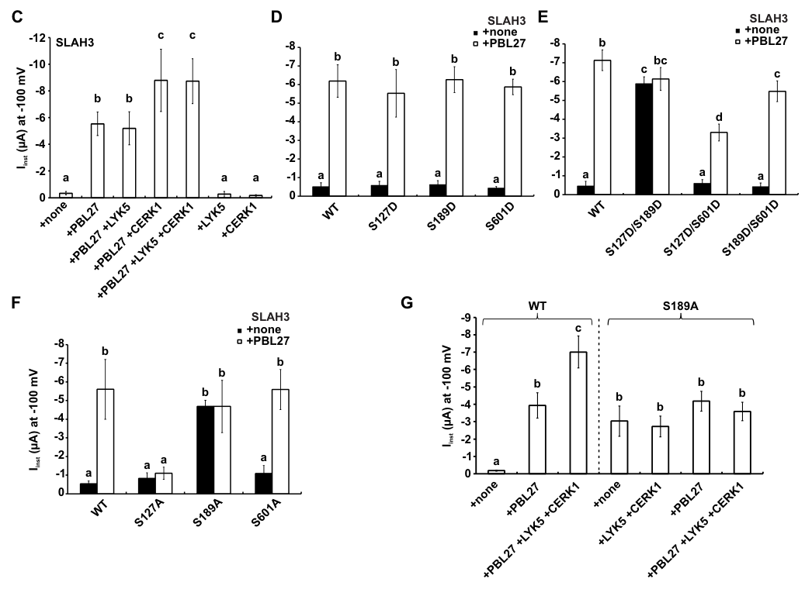

## Question

# Gene Research for Functional Annotation

## ⚠️ CRITICAL: Gene/Protein Identification Context

**BEFORE YOU BEGIN RESEARCH:** You MUST verify you are researching the CORRECT gene/protein. Gene symbols can be ambiguous, especially for less well-characterized genes from non-model organisms.

### Target Gene/Protein Identity (from UniProt):
- **UniProt Accession:** Q1PDV6
- **Protein Description:** RecName: Full=Serine/threonine-protein kinase PBL27 {ECO:0000303|PubMed:20413097}; EC=2.7.11.1 {ECO:0000269|PubMed:27679653}; AltName: Full=PBS1-like protein 27 {ECO:0000303|PubMed:20413097}; AltName: Full=Receptor-like cytoplasmic kinase PBL27 {ECO:0000303|PubMed:27679653};
- **Gene Information:** Name=PBL27 {ECO:0000303|PubMed:20413097}; OrderedLocusNames=At5g18610 {ECO:0000312|Araport:AT5G18610}; ORFNames=T28N17.90 {ECO:0000312|EMBL:AC069328};
- **Organism (full):** Arabidopsis thaliana (Mouse-ear cress).
- **Protein Family:** Belongs to the protein kinase superfamily. Ser/Thr protein
- **Key Domains:** Kinase-like_dom_sf. (IPR011009); Prot_kinase_dom. (IPR000719); Protein_kinase_ATP_BS. (IPR017441); Ser-Thr/Tyr_kinase_cat_dom. (IPR001245); Ser/Thr_kinase_AS. (IPR008271)

### MANDATORY VERIFICATION STEPS:

1. **Check if the gene symbol "PBL27" matches the protein description above**
2. **Verify the organism is correct:** Arabidopsis thaliana (Mouse-ear cress).
3. **Check if protein family/domains align with what you find in literature**
4. **If you find literature for a DIFFERENT gene with the same or similar symbol, STOP**

### If Gene Symbol is Ambiguous or You Cannot Find Relevant Literature:

**DO NOT PROCEED WITH RESEARCH ON A DIFFERENT GENE.** Instead:
- State clearly: "The gene symbol 'PBL27' is ambiguous or literature is limited for this specific protein"
- Explain what you found (e.g., "Found extensive literature on a different gene with the same symbol in a different organism")
- Describe the protein based ONLY on the UniProt information provided above
- Suggest that the protein function can be inferred from domain/family information

### Research Target:

Please provide a comprehensive research report on the gene **PBL27** (gene ID: PBL27, UniProt: Q1PDV6) in ARATH.

The research report should be a detailed narrative explaining the function, biological processes, and localization of the gene product. Citations should be given for all claims.

You should prioritize authoritative reviews and primary scientific literature when conducting research. You can supplement
this with annotations you find in gene/protein databases, but these can be outdated or inaccurate.

We are specifically interested in the primary function of the gene - for enzymes, what reaction is catalyzed, and what is the substrate specificity? For transporters, what is the substrate? For structural proteins or adapters, what is the broader structural role? For signaling molecules, what is the role in the pathway.

We are interested in where in or outside the cell the gene product carries out its function.

We are also interested in the signaling or biochemical pathways in which the gene functions. We are less interested in broad pleiotropic effects, except where these elucidate the precise role.

Include evidence where possible. We are interested in both experimental evidence as well as inference from structure, evolution, or bioinformatic analysis. Precise studies should be prioritized over high-throughput, where available.

## Output

Question: You are an expert researcher providing comprehensive, well-cited information.

Provide detailed information focusing on:
1. Key concepts and definitions with current understanding
2. Recent developments and latest research (prioritize 2023-2024 sources)
3. Current applications and real-world implementations
4. Expert opinions and analysis from authoritative sources
5. Relevant statistics and data from recent studies

Format as a comprehensive research report with proper citations. Include URLs and publication dates where available.
Always prioritize recent, authoritative sources and provide specific citations for all major claims.

# Gene Research for Functional Annotation

## ⚠️ CRITICAL: Gene/Protein Identification Context

**BEFORE YOU BEGIN RESEARCH:** You MUST verify you are researching the CORRECT gene/protein. Gene symbols can be ambiguous, especially for less well-characterized genes from non-model organisms.

### Target Gene/Protein Identity (from UniProt):
- **UniProt Accession:** Q1PDV6
- **Protein Description:** RecName: Full=Serine/threonine-protein kinase PBL27 {ECO:0000303|PubMed:20413097}; EC=2.7.11.1 {ECO:0000269|PubMed:27679653}; AltName: Full=PBS1-like protein 27 {ECO:0000303|PubMed:20413097}; AltName: Full=Receptor-like cytoplasmic kinase PBL27 {ECO:0000303|PubMed:27679653};
- **Gene Information:** Name=PBL27 {ECO:0000303|PubMed:20413097}; OrderedLocusNames=At5g18610 {ECO:0000312|Araport:AT5G18610}; ORFNames=T28N17.90 {ECO:0000312|EMBL:AC069328};
- **Organism (full):** Arabidopsis thaliana (Mouse-ear cress).
- **Protein Family:** Belongs to the protein kinase superfamily. Ser/Thr protein
- **Key Domains:** Kinase-like_dom_sf. (IPR011009); Prot_kinase_dom. (IPR000719); Protein_kinase_ATP_BS. (IPR017441); Ser-Thr/Tyr_kinase_cat_dom. (IPR001245); Ser/Thr_kinase_AS. (IPR008271)

### MANDATORY VERIFICATION STEPS:

1. **Check if the gene symbol "PBL27" matches the protein description above**
2. **Verify the organism is correct:** Arabidopsis thaliana (Mouse-ear cress).
3. **Check if protein family/domains align with what you find in literature**
4. **If you find literature for a DIFFERENT gene with the same or similar symbol, STOP**

### If Gene Symbol is Ambiguous or You Cannot Find Relevant Literature:

**DO NOT PROCEED WITH RESEARCH ON A DIFFERENT GENE.** Instead:
- State clearly: "The gene symbol 'PBL27' is ambiguous or literature is limited for this specific protein"
- Explain what you found (e.g., "Found extensive literature on a different gene with the same symbol in a different organism")
- Describe the protein based ONLY on the UniProt information provided above
- Suggest that the protein function can be inferred from domain/family information

### Research Target:

Please provide a comprehensive research report on the gene **PBL27** (gene ID: PBL27, UniProt: Q1PDV6) in ARATH.

The research report should be a detailed narrative explaining the function, biological processes, and localization of the gene product. Citations should be given for all claims.

You should prioritize authoritative reviews and primary scientific literature when conducting research. You can supplement
this with annotations you find in gene/protein databases, but these can be outdated or inaccurate.

We are specifically interested in the primary function of the gene - for enzymes, what reaction is catalyzed, and what is the substrate specificity? For transporters, what is the substrate? For structural proteins or adapters, what is the broader structural role? For signaling molecules, what is the role in the pathway.

We are interested in where in or outside the cell the gene product carries out its function.

We are also interested in the signaling or biochemical pathways in which the gene functions. We are less interested in broad pleiotropic effects, except where these elucidate the precise role.

Include evidence where possible. We are interested in both experimental evidence as well as inference from structure, evolution, or bioinformatic analysis. Precise studies should be prioritized over high-throughput, where available.

# Functional annotation report: Arabidopsis PBL27 (Q1PDV6)

## Identity and principal function

**Identity verified.** PBL27 is the *Arabidopsis thaliana* protein encoded by **At5g18610**, matching the supplied UniProt accession **Q1PDV6**; an independent Arabidopsis study explicitly identifies At5g18610 as PBL27. It is a PBS1-like, receptor-like **cytoplasmic** kinase of the RLCK-VII-1 group, not a transmembrane chitin receptor. Its protein-kinase domains and experiments with kinase-inactive PBL27 establish its function as a protein-phosphorylating enzyme. (uemura2020soyandarabidopsis pages 7-8, liu2019anionchannelslah3 pages 10-12, liu2019anionchannelslah3 pages 5-6)

**Reaction and specificity.** PBL27 transfers phosphate from ATP to serine/threonine residues on selected signaling proteins. Its demonstrated substrates include the MAP kinase kinase kinase **MAPKKK5**, the anion channel **SLAH3**, and, in a 2025 study, the aluminium-response receptor **ALR1/PSKR1**. This is *protein-substrate* specificity: fungal chitin and herbivore-derived polysaccharides are inputs sensed by upstream receptors, **not substrates phosphorylated by PBL27**. The strongest integrated functional annotation is a plasma-membrane-associated signaling kinase that relays receptor activity to immune effectors and, in a distinct context, restrains aluminium signaling. (yamada2016thearabidopsiscerk1‐associated pages 5-6, liu2019anionchannelslah3 pages 9-10, xu2025thepp2chand pages 1-2, desaki2023cytoplasmickinasenetwork pages 1-2)

## Cellular location and signaling mechanism

PBL27 operates principally on the **cytoplasmic face of the plasma membrane**. Interaction imaging and co-immunoprecipitation place it with the chitin receptor CERK1 and MAPKKK5 at the membrane; a PBL27–SLAH3 complex is detectable at the cell periphery before chitin treatment. Chitin promotes PBL27–MAPKKK5 dissociation, whereas it enhances the phosphorylation capacity of recovered PBL27 toward SLAH3. These are observations about a membrane-associated cytoplasmic kinase, not evidence that PBL27 is secreted or itself binds extracellular chitin. (yamada2016thearabidopsiscerk1‐associated pages 1-2, yamada2016thearabidopsiscerk1‐associated pages 4-5, liu2019anionchannelslah3 pages 5-6)

In the chitin pathway, extracellular chitin oligomers are recognized by the **LYK5–CERK1** receptor complex; CERK1 phosphorylates PBL27. Substitution of the three putative PBL27 activation-loop acceptors **S244, T245 and S250** markedly diminished CERK1-dependent phosphorylation. Because those substitutions also impaired PBL27’s own catalytic activity, the experiment supports regulation at this region but does not individually prove how each site controls activity *in vivo*. [Yamada and colleagues, *EMBO Journal*, September 2016](https://doi.org/10.15252/embj.201694248). (yamada2016thearabidopsiscerk1‐associated pages 8-9, liu2019anionchannelslah3 pages 1-2)

The substrate-level evidence is organized below; the distinction between **direct phosphorylation** and an **indispensable role in the intact plant** is particularly important for MAPKKK5.

| Stimulus / upstream input | PBL27 direct substrate and phosphosites | Experimental evidence / biological outcome | Key caveat |
|---|---|---|---|
| **Chitin–LYK5/CERK1 (2016)** | **MAPKKK5:** PBL27 phosphorylated **S617, S622, S658, S660, T677, and S685** *in vitro*; S622A had the strongest individual effect. CERK1 phosphorylated the PBL27 activation-loop region (**S244/T245/S250**) and enhanced PBL27-dependent MAPKKK5 phosphorylation. [DOI](https://doi.org/10.15252/embj.201694248) (yamada2016thearabidopsiscerk1‐associated pages 8-9, yamada2016thearabidopsiscerk1‐associated pages 6-8) | PBL27 and MAPKKK5 associated at the plasma membrane and dissociated after chitin treatment. A MAPKKK5 six-alanine variant incompletely restored chitin-induced MAPK activation and callose deposition, supporting a proposed CERK1→PBL27→MAPKKK5→MKK4/5→MPK3/6 pathway. *mapkkk5* mutants also had weakened transcriptional responses and larger *Alternaria brassicicola* lesions. (yamada2016thearabidopsiscerk1‐associated pages 10-12, yamada2016thearabidopsiscerk1‐associated pages 4-5, yamada2016thearabidopsiscerk1‐associated pages 3-4) | **PBL27’s necessity for this MAPK branch is disputed.** Two 2018 studies found normal MAPKKK5 phosphorylation or MAPK activation in *pbl27* and RLCK-VII-1 higher-order mutants, but strong defects in an RLCK-VII-4 sextuple mutant. CERK1-activated PBL19 directly phosphorylated MAPKKK5 **S599**, which was essential for MAPK activation and resistance. MAPKKK5 is therefore a biochemical PBL27 substrate, but redundant RLCK-VII-4 proteins may be its dominant kinases *in vivo*. [DOI](https://doi.org/10.1105/tpc.17.00981) (rao2018rolesofreceptorlike pages 11-14, rao2018rolesofreceptorlike pages 8-11, bi2018receptorlikecytoplasmickinases pages 8-11) |
| **Chitin–LYK5/CERK1 (2019)** | **SLAH3 anion channel:** PBL27 directly phosphorylated **S127, S189, and S601**; S127 and S189 jointly controlled channel opening, whereas S601 was dispensable. [DOI](https://doi.org/10.7554/eLife.44474) (liu2019anionchannelslah3 pages 6-8, liu2019anionchannelslah3 pages 9-10) | PBL27 and SLAH3 formed a pre-existing peripheral complex. PBL27 generated approximately **8-µA** S-type anion currents in *Xenopus* oocytes, and CERK1 amplified the current about threefold. SLAH3-S127A and SLAH3-S189A failed to restore chitin-induced stomatal closure, whereas S601A behaved like wild type. (liu2019anionchannelslah3 pages 6-8, liu2019anionchannelslah3 pages 9-10, liu2019anionchannelslah3 pages 10-12) | *slah3* and S127A/S189A lines developed larger *Botrytis cinerea* lesions, but *pbl27* did not, probably because PBL1 and other pathways can also activate SLAH3. The whole-leaf lesion assay supports SLAH3 phosphosite function but does not prove that PBL27-dependent stomatal closure alone determines fungal resistance. (liu2019anionchannelslah3 pages 10-12) |
| **Herbivore oral-secretion polysaccharide Frα–HAK1 (2020; 2023)** | No downstream direct substrate of PBL27 was demonstrated. **CRK2 acts upstream by phosphorylating PBL27**; CRK2 also phosphorylates ERF13 directly. [2020 DOI](https://doi.org/10.1038/s42003-020-0959-4); [2023 DOI](https://doi.org/10.3390/plants12091747) (desaki2023cytoplasmickinasenetwork pages 2-4, uemura2020soyandarabidopsis pages 7-8) | HAK1 associated with PBL27 (**At5g18610**). *hak1* and *pbl27* mutants emitted less Frα-induced ethylene and supported greater *Spodoptera litura* larval development. In 2023, PBL27 interacted with CRK2/CRK3, CRK2 phosphorylated kinase-dead PBL27, and Frα-induced **ERF13** and **PDF1.2** expression required PBL27 and CRK2. (desaki2023cytoplasmickinasenetwork pages 4-7, desaki2023cytoplasmickinasenetwork pages 2-4, uemura2020soyandarabidopsis pages 7-8, uemura2020soyandarabidopsis pages 5-7) | The proposed PBL27→MAPK→ethylene→ERF13 pathway is mechanistically plausible but not fully demonstrated. PBL27 did not directly increase ERF13-dependent reporter activity, and the Frα-responsive PBL27 phosphosites and complete downstream phosphorylation chain remain unknown. (desaki2023cytoplasmickinasenetwork pages 4-7, desaki2023cytoplasmickinasenetwork pages 1-2) |
| **Aluminium–ALR1/PSKR1 signaling (2025)** | **ALR1/PSKR1 is a PBL27 substrate:** PBL27 phosphorylates ALR1 **S696/S698** in its cytoplasmic juxtamembrane region. ALR1 is **not** established as an upstream kinase for PBL27. [DOI](https://doi.org/10.1038/s41477-025-01983-1) (xu2025thepp2chand pages 1-2, xu2025thepp2chand pages 4-5, xu2025thepp2chand pages 9-10) | PBL27-mediated S696/S698 phosphorylation weakened ALR1–BAK1 complex formation and negatively regulated aluminium sensing and resistance. Phospho-dead ALR1-S696/698A enhanced resistance, whereas phosphomimetic ALR1-S696/698D resembled aluminium-sensitive *alr1*. Aluminium-induced **PP2CH1/PP2CH2** accumulation reverses the switch by dephosphorylating these sites, promoting ALR1–BAK1 signaling. (xu2025thepp2chand pages 1-2, xu2025thepp2chand pages 9-10) | This expands PBL27 beyond immunity into abiotic-stress signaling, but the evidence is from a **2025** study rather than the requested 2023–2024 window. PBL27 overexpression reduced aluminium resistance; available evidence does not clearly establish the complete loss-of-function phenotype or whether this pathway shares machinery with chitin signaling. (xu2025thepp2chand pages 4-5, xu2025thepp2chand pages 8-9) |

*Table: Experimentally supported signaling inputs, direct substrates, phosphorylation sites, and biological outcomes for Arabidopsis At5g18610/PBL27. The matrix distinguishes established catalytic relationships from contested or still-hypothetical pathway assignments.*

### Chitin-responsive MAPK branch: biochemical evidence and a major qualification

Yamada and colleagues found that PBL27 phosphorylates the MAPKKK5 C-terminal region *in vitro* at **S617, S622, S658, S660, T677 and S685**; **S622A** caused the largest individual reduction. A six-site alanine MAPKKK5 variant retained PBL27 binding but did not fully restore chitin-induced MAPK activation or callose deposition in *mapkkk5* plants. They proposed a **CERK1 → PBL27 → MAPKKK5 → MKK4/MKK5 → MPK3/MPK6** route; MAPKKK5 directly phosphorylated MKK4 and MKK5 in their assays. Two *mapkkk5* mutant lines showed reduced chitin-induced MAPK activation, while *mapkkk5* and *pbl27* mutants developed larger lesions following *Alternaria brassicicola* challenge. In that study, *mapkkk5* mutation did **not** diminish the chitin-induced ROS burst, consistent with a separable signaling output. [Yamada *et al.*, *EMBO Journal*, September 2016](https://doi.org/10.15252/embj.201694248). (yamada2016thearabidopsiscerk1‐associated pages 5-6, yamada2016thearabidopsiscerk1‐associated pages 6-8, yamada2016thearabidopsiscerk1‐associated pages 10-12, yamada2016thearabidopsiscerk1‐associated pages 3-4)

**The claim that PBL27 is the uniquely required chitin-to-MAPK connector remains contested.** Rao and colleagues tested the previously used *pbl27* allele and an RLCK-VII-1 quintuple mutant but did **not** reproduce impaired chitin-induced MAPK activation. Their RLCK-VII-4 sextuple mutant, by contrast, was almost unresponsive in this assay. Bi and colleagues likewise observed approximately **25% of wild-type chitin-induced MAPKKK5 phosphorylation** in RLCK-VII-4 mutant protoplasts, but normal phosphorylation in *pbl27* protoplasts; CERK1-activated RLCK-VII-4 protein PBL19 phosphorylated a distinct MAPKKK5 residue, **S599**. MAPKKK5-S599A failed to restore normal MPK3/6 activation and pathogen resistance. Thus, MAPKKK5 is a credible **biochemical** PBL27 substrate, but current genetic evidence does not establish PBL27 as the dominant or obligatory MAPKKK5 kinase across experimental settings. [Rao *et al.*, *Plant Physiology*, June 2018](https://doi.org/10.1104/pp.18.00486); [Bi *et al.*, *The Plant Cell*, June 2018](https://doi.org/10.1105/tpc.17.00981). (rao2018rolesofreceptorlike pages 8-11, bi2018receptorlikecytoplasmickinases pages 8-11, rao2018rolesofreceptorlike pages 11-14)

### Guard-cell channel branch: a comparatively well-resolved PBL27 output

Liu and colleagues identified **SLAH3** as a direct PBL27 target. Mass spectrometry mapped phosphorylation to **S127 and S189** in its N-terminal region and **S601** in its C-terminal region. Kinase-dead PBL27 failed to phosphorylate SLAH3, while chitin treatment increased the ability of immunopurified PBL27 to do so. In *Xenopus* oocytes PBL27 activated SLAH3-dependent anion currents, and signaling-competent CERK1 amplified channel opening. SLAH3-S127A prevented activation by PBL27; the roles of S127 and S189 are **not interchangeable**, because S189A was unexpectedly constitutively active in oocytes yet failed to support chitin-responsive stomatal closure in plants. S601A did not show the same functional defect. These phosphosite and stomatal results are also shown in the study’s cropped experimental figures. [Liu *et al.*, *eLife*, published September 2019](https://doi.org/10.7554/eLife.44474). (liu2019anionchannelslah3 pages 5-6, liu2019anionchannelslah3 pages 6-8, liu2019anionchannelslah3 pages 9-10, liu2019anionchannelslah3 media 2533baf8, liu2019anionchannelslah3 media ff9abe1e)

In stable Arabidopsis lines, SLAH3-S127A and SLAH3-S189A failed to restore **chitin-induced stomatal closure**; each variant also increased whole-leaf *Botrytis cinerea* lesion size relative to wild-type SLAH3 complementation. These endpoints should not be conflated: the investigators explicitly noted that they had **not demonstrated** that stomatal closure itself caused the observed whole-leaf resistance. Moreover, *pbl27* mutants did **not** show increased *B. cinerea* lesions in that assay, consistent with other signaling routes converging on SLAH3. This branch therefore supports a precise PBL27 function in chitin-responsive guard-cell ion-channel regulation without establishing that PBL27 alone determines resistance to every fungus. [Liu *et al.*, *eLife*, September 2019](https://doi.org/10.7554/eLife.44474). (liu2019anionchannelslah3 pages 10-12)

## Recent research and additional biological processes

**Herbivore defense, 2020–2023.** *Spodoptera litura* larval oral secretions contain a polysaccharide-rich elicitor fraction, **Frα**, associated with HAK1 receptor signaling. Arabidopsis HAK1 interacts with PBL27; *hak1* and *pbl27* mutants emitted less elicitor-induced **ethylene** and supported greater larval development over **four days**, while the study did not detect corresponding genotype differences in jasmonate levels. [Uemura *et al.*, *Communications Biology*, May 2020](https://doi.org/10.1038/s42003-020-0959-4). (uemura2020soyandarabidopsis pages 7-8, uemura2020soyandarabidopsis pages 1-2)

A [primary study published **24 April 2023** in *Plants*](https://doi.org/10.3390/plants12091747) found PBL27 interactions with **CRK2** and **CRK3** and phosphorylation of kinase-inactive PBL27 upon CRK2 co-expression. Frα plus mechanical damage induced the defense-gene transcript **PDF1.2** in wild-type leaves but not in *pbl27* or *crk2* mutants; PBL27 was also needed for the full elicitor-induced **ERF13** transcript response. The authors propose an ethylene/ERF13 route, but did **not** map the elicitor-responsive PBL27 phosphosites or show that PBL27 directly phosphorylates ERF13. Indeed, adding PBL27 did not enhance ERF13-driven promoter-reporter activity in their test, unlike adding CRK2. CRK2 is therefore an **upstream kinase of PBL27 in these assays**, not a demonstrated PBL27 substrate. (desaki2023cytoplasmickinasenetwork pages 2-4, desaki2023cytoplasmickinasenetwork pages 4-7, desaki2023cytoplasmickinasenetwork pages 1-2)

**Interpretation of 2024 literature.** A [2024 review of chitin-responsive receptor/kinase signaling, published April 2024](https://doi.org/10.3390/horticulturae10040361), summarizes the LYK5–CERK1–PBL27 model and discusses analogous pathways as potential horticultural defense targets. That is useful pathway context, **not evidence that manipulating PBL27 has already produced a deployed disease-resistant crop**. For functional annotation, the direct primary experiments—and the opposing 2018 genetics—deserve greater weight than an unqualified review diagram. (zamora2024signalingofplant pages 7-7, rao2018rolesofreceptorlike pages 8-11, bi2018receptorlikecytoplasmickinases pages 8-11)

**New substrate reported after the requested 2023–2024 priority period.** A [*Nature Plants* study published April 2025](https://doi.org/10.1038/s41477-025-01983-1) identifies the aluminium-sensing receptor **ALR1/PSKR1** as a PBL27 phosphorylation target at **S696/S698**. Unlike the positive chitin-defense outputs, this phosphorylation **suppresses** ALR1–BAK1 association and aluminium-resistance signaling; phospho-dead ALR1-S696/698A enhanced resistance, while the phosphomimetic variant resembled an aluminium-sensitive *alr1* mutant. Aluminium-responsive phosphatases **PP2CH1/PP2CH2** counteract PBL27 by dephosphorylating ALR1. PBL27 overexpression reduced aluminium resistance. This expands the experimentally supported substrate repertoire beyond immunity, although it does not establish a shared biochemical cascade with chitin signaling. (xu2025thepp2chand pages 1-2, xu2025thepp2chand pages 4-5, xu2025thepp2chand pages 9-10)

## Annotation assessment and application status

**High-confidence annotation:** *Arabidopsis* At5g18610/PBL27 is a plasma-membrane-associated, ATP-dependent serine/threonine signaling kinase with direct experimental evidence for SLAH3 phosphorylation and chitin-responsive channel regulation, MAPKKK5 phosphorylation *in vitro*, and ALR1 phosphorylation in aluminium-response experiments. **Qualified annotation:** PBL27 participates in HAK1-associated anti-herbivore signaling, but its direct downstream substrate there is unresolved; its status as the *essential* chitin-triggered MAPK-activating kinase is disputed by independent higher-order genetics. The demonstrated implementations are research assays and experimental Arabidopsis mutant/transgenic lines; the cited studies do not establish a field-deployed PBL27-based crop intervention. (liu2019anionchannelslah3 pages 9-10, rao2018rolesofreceptorlike pages 8-11, bi2018receptorlikecytoplasmickinases pages 8-11, desaki2023cytoplasmickinasenetwork pages 2-4, xu2025thepp2chand pages 1-2, uemura2020soyandarabidopsis pages 7-8)

References

1. (uemura2020soyandarabidopsis pages 7-8): Takuya Uemura, Masakazu Hachisu, Yoshitake Desaki, Ayaka Ito, Ryosuke Hoshino, Yuka Sano, Akira Nozawa, Kadis Mujiono, Ivan Galis, Ayako Yoshida, Keiichirou Nemoto, Shigetoshi Miura, Makoto Nishiyama, Chiharu Nishiyama, Shigeomi Horito, Tatsuya Sawasaki, and Gen-ichiro Arimura. Soy and arabidopsis receptor-like kinases respond to polysaccharide signals from spodoptera species and mediate herbivore resistance. Communications Biology, May 2020. URL: https://doi.org/10.1038/s42003-020-0959-4, doi:10.1038/s42003-020-0959-4. This article has 54 citations and is from a peer-reviewed journal.

2. (liu2019anionchannelslah3 pages 10-12): Yi Liu, Tobias Maierhofer, Katarzyna Rybak, Jan Sklenar, Andy Breakspear, Matthew G Johnston, Judith Fliegmann, Shouguang Huang, M Rob G Roelfsema, Georg Felix, Christine Faulkner, Frank LH Menke, Dietmar Geiger, Rainer Hedrich, and Silke Robatzek. Anion channel slah3 is a regulatory target of chitin receptor-associated kinase pbl27 in microbial stomatal closure. eLife, Sep 2019. URL: https://doi.org/10.7554/elife.44474, doi:10.7554/elife.44474. This article has 81 citations and is from a domain leading peer-reviewed journal.

3. (liu2019anionchannelslah3 pages 5-6): Yi Liu, Tobias Maierhofer, Katarzyna Rybak, Jan Sklenar, Andy Breakspear, Matthew G Johnston, Judith Fliegmann, Shouguang Huang, M Rob G Roelfsema, Georg Felix, Christine Faulkner, Frank LH Menke, Dietmar Geiger, Rainer Hedrich, and Silke Robatzek. Anion channel slah3 is a regulatory target of chitin receptor-associated kinase pbl27 in microbial stomatal closure. eLife, Sep 2019. URL: https://doi.org/10.7554/elife.44474, doi:10.7554/elife.44474. This article has 81 citations and is from a domain leading peer-reviewed journal.

4. (yamada2016thearabidopsiscerk1‐associated pages 5-6): Kenta Yamada, Koji Yamaguchi, Tomomi Shirakawa, Hirofumi Nakagami, Akira Mine, Kazuya Ishikawa, Masayuki Fujiwara, Mari Narusaka, Yoshihiro Narusaka, Kazuya Ichimura, Yuka Kobayashi, Hidenori Matsui, Yuko Nomura, Mika Nomoto, Yasuomi Tada, Yoichiro Fukao, Tamo Fukamizo, Kenichi Tsuda, Ken Shirasu, Naoto Shibuya, and Tsutomu Kawasaki. The arabidopsis cerk1‐associated kinase pbl27 connects chitin perception to mapk activation. The EMBO Journal, 35:2468-2483, Sep 2016. URL: https://doi.org/10.15252/embj.201694248, doi:10.15252/embj.201694248. This article has 324 citations.

5. (liu2019anionchannelslah3 pages 9-10): Yi Liu, Tobias Maierhofer, Katarzyna Rybak, Jan Sklenar, Andy Breakspear, Matthew G Johnston, Judith Fliegmann, Shouguang Huang, M Rob G Roelfsema, Georg Felix, Christine Faulkner, Frank LH Menke, Dietmar Geiger, Rainer Hedrich, and Silke Robatzek. Anion channel slah3 is a regulatory target of chitin receptor-associated kinase pbl27 in microbial stomatal closure. eLife, Sep 2019. URL: https://doi.org/10.7554/elife.44474, doi:10.7554/elife.44474. This article has 81 citations and is from a domain leading peer-reviewed journal.

6. (xu2025thepp2chand pages 1-2): Chen Xu, Ke Ke Gao, Meng Qi Cui, Yu Xuan Wang, Ze Yu Cen, Ji Ming Xu, Yun Rong Wu, Wo Na Ding, Jing Ying Yan, Gui Xin Li, Moussa Benhamed, Chong Wei Jin, Shao Jian Zheng, and Zhong Jie Ding. The pp2ch- and pbl27-mediated phosphorylation switch of aluminium ion receptor pskr1/alr1 controls plant aluminum sensing ability. Nature Plants, 11(5):1074-1088, Apr 2025. URL: https://doi.org/10.1038/s41477-025-01983-1, doi:10.1038/s41477-025-01983-1. This article has 13 citations and is from a highest quality peer-reviewed journal.

7. (desaki2023cytoplasmickinasenetwork pages 1-2): Yoshitake Desaki, Minami Morishima, Yuka Sano, Takuya Uemura, Ayaka Ito, Keiichirou Nemoto, Akira Nozawa, Tatsuya Sawasaki, and Gen-ichiro Arimura. Cytoplasmic kinase network mediates defense response to spodoptera litura in arabidopsis. Plants, 12:1747, Apr 2023. URL: https://doi.org/10.3390/plants12091747, doi:10.3390/plants12091747. This article has 11 citations.

8. (yamada2016thearabidopsiscerk1‐associated pages 1-2): Kenta Yamada, Koji Yamaguchi, Tomomi Shirakawa, Hirofumi Nakagami, Akira Mine, Kazuya Ishikawa, Masayuki Fujiwara, Mari Narusaka, Yoshihiro Narusaka, Kazuya Ichimura, Yuka Kobayashi, Hidenori Matsui, Yuko Nomura, Mika Nomoto, Yasuomi Tada, Yoichiro Fukao, Tamo Fukamizo, Kenichi Tsuda, Ken Shirasu, Naoto Shibuya, and Tsutomu Kawasaki. The arabidopsis cerk1‐associated kinase pbl27 connects chitin perception to mapk activation. The EMBO Journal, 35:2468-2483, Sep 2016. URL: https://doi.org/10.15252/embj.201694248, doi:10.15252/embj.201694248. This article has 324 citations.

9. (yamada2016thearabidopsiscerk1‐associated pages 4-5): Kenta Yamada, Koji Yamaguchi, Tomomi Shirakawa, Hirofumi Nakagami, Akira Mine, Kazuya Ishikawa, Masayuki Fujiwara, Mari Narusaka, Yoshihiro Narusaka, Kazuya Ichimura, Yuka Kobayashi, Hidenori Matsui, Yuko Nomura, Mika Nomoto, Yasuomi Tada, Yoichiro Fukao, Tamo Fukamizo, Kenichi Tsuda, Ken Shirasu, Naoto Shibuya, and Tsutomu Kawasaki. The arabidopsis cerk1‐associated kinase pbl27 connects chitin perception to mapk activation. The EMBO Journal, 35:2468-2483, Sep 2016. URL: https://doi.org/10.15252/embj.201694248, doi:10.15252/embj.201694248. This article has 324 citations.

10. (yamada2016thearabidopsiscerk1‐associated pages 8-9): Kenta Yamada, Koji Yamaguchi, Tomomi Shirakawa, Hirofumi Nakagami, Akira Mine, Kazuya Ishikawa, Masayuki Fujiwara, Mari Narusaka, Yoshihiro Narusaka, Kazuya Ichimura, Yuka Kobayashi, Hidenori Matsui, Yuko Nomura, Mika Nomoto, Yasuomi Tada, Yoichiro Fukao, Tamo Fukamizo, Kenichi Tsuda, Ken Shirasu, Naoto Shibuya, and Tsutomu Kawasaki. The arabidopsis cerk1‐associated kinase pbl27 connects chitin perception to mapk activation. The EMBO Journal, 35:2468-2483, Sep 2016. URL: https://doi.org/10.15252/embj.201694248, doi:10.15252/embj.201694248. This article has 324 citations.

11. (liu2019anionchannelslah3 pages 1-2): Yi Liu, Tobias Maierhofer, Katarzyna Rybak, Jan Sklenar, Andy Breakspear, Matthew G Johnston, Judith Fliegmann, Shouguang Huang, M Rob G Roelfsema, Georg Felix, Christine Faulkner, Frank LH Menke, Dietmar Geiger, Rainer Hedrich, and Silke Robatzek. Anion channel slah3 is a regulatory target of chitin receptor-associated kinase pbl27 in microbial stomatal closure. eLife, Sep 2019. URL: https://doi.org/10.7554/elife.44474, doi:10.7554/elife.44474. This article has 81 citations and is from a domain leading peer-reviewed journal.

12. (yamada2016thearabidopsiscerk1‐associated pages 6-8): Kenta Yamada, Koji Yamaguchi, Tomomi Shirakawa, Hirofumi Nakagami, Akira Mine, Kazuya Ishikawa, Masayuki Fujiwara, Mari Narusaka, Yoshihiro Narusaka, Kazuya Ichimura, Yuka Kobayashi, Hidenori Matsui, Yuko Nomura, Mika Nomoto, Yasuomi Tada, Yoichiro Fukao, Tamo Fukamizo, Kenichi Tsuda, Ken Shirasu, Naoto Shibuya, and Tsutomu Kawasaki. The arabidopsis cerk1‐associated kinase pbl27 connects chitin perception to mapk activation. The EMBO Journal, 35:2468-2483, Sep 2016. URL: https://doi.org/10.15252/embj.201694248, doi:10.15252/embj.201694248. This article has 324 citations.

13. (yamada2016thearabidopsiscerk1‐associated pages 10-12): Kenta Yamada, Koji Yamaguchi, Tomomi Shirakawa, Hirofumi Nakagami, Akira Mine, Kazuya Ishikawa, Masayuki Fujiwara, Mari Narusaka, Yoshihiro Narusaka, Kazuya Ichimura, Yuka Kobayashi, Hidenori Matsui, Yuko Nomura, Mika Nomoto, Yasuomi Tada, Yoichiro Fukao, Tamo Fukamizo, Kenichi Tsuda, Ken Shirasu, Naoto Shibuya, and Tsutomu Kawasaki. The arabidopsis cerk1‐associated kinase pbl27 connects chitin perception to mapk activation. The EMBO Journal, 35:2468-2483, Sep 2016. URL: https://doi.org/10.15252/embj.201694248, doi:10.15252/embj.201694248. This article has 324 citations.

14. (yamada2016thearabidopsiscerk1‐associated pages 3-4): Kenta Yamada, Koji Yamaguchi, Tomomi Shirakawa, Hirofumi Nakagami, Akira Mine, Kazuya Ishikawa, Masayuki Fujiwara, Mari Narusaka, Yoshihiro Narusaka, Kazuya Ichimura, Yuka Kobayashi, Hidenori Matsui, Yuko Nomura, Mika Nomoto, Yasuomi Tada, Yoichiro Fukao, Tamo Fukamizo, Kenichi Tsuda, Ken Shirasu, Naoto Shibuya, and Tsutomu Kawasaki. The arabidopsis cerk1‐associated kinase pbl27 connects chitin perception to mapk activation. The EMBO Journal, 35:2468-2483, Sep 2016. URL: https://doi.org/10.15252/embj.201694248, doi:10.15252/embj.201694248. This article has 324 citations.

15. (rao2018rolesofreceptorlike pages 11-14): Shaofei Rao, Zhaoyang Zhou, Pei Miao, Guozhi Bi, Man Hu, Ying Wu, Feng Feng, Xiaojuan Zhang, and Jian-Min Zhou. Roles of receptor-like cytoplasmic kinase vii members in pattern-triggered immune signaling1. Plant Physiology, 177:1679-1690, Jun 2018. URL: https://doi.org/10.1104/pp.18.00486, doi:10.1104/pp.18.00486. This article has 251 citations and is from a highest quality peer-reviewed journal.

16. (rao2018rolesofreceptorlike pages 8-11): Shaofei Rao, Zhaoyang Zhou, Pei Miao, Guozhi Bi, Man Hu, Ying Wu, Feng Feng, Xiaojuan Zhang, and Jian-Min Zhou. Roles of receptor-like cytoplasmic kinase vii members in pattern-triggered immune signaling1. Plant Physiology, 177:1679-1690, Jun 2018. URL: https://doi.org/10.1104/pp.18.00486, doi:10.1104/pp.18.00486. This article has 251 citations and is from a highest quality peer-reviewed journal.

17. (bi2018receptorlikecytoplasmickinases pages 8-11): Guozhi Bi, Zhaoyang Zhou, Weibing Wang, Lin Li, Shaofei Rao, Ying Wu, Xiaojuan Zhang, Frank L. H. Menke, She Chen, and Jian-Min Zhou. Receptor-like cytoplasmic kinases directly link diverse pattern recognition receptors to the activation of mitogen-activated protein kinase cascades in arabidopsis[open]. Plant Cell, 30:1543-1561, Jun 2018. URL: https://doi.org/10.1105/tpc.17.00981, doi:10.1105/tpc.17.00981. This article has 413 citations and is from a highest quality peer-reviewed journal.

18. (liu2019anionchannelslah3 pages 6-8): Yi Liu, Tobias Maierhofer, Katarzyna Rybak, Jan Sklenar, Andy Breakspear, Matthew G Johnston, Judith Fliegmann, Shouguang Huang, M Rob G Roelfsema, Georg Felix, Christine Faulkner, Frank LH Menke, Dietmar Geiger, Rainer Hedrich, and Silke Robatzek. Anion channel slah3 is a regulatory target of chitin receptor-associated kinase pbl27 in microbial stomatal closure. eLife, Sep 2019. URL: https://doi.org/10.7554/elife.44474, doi:10.7554/elife.44474. This article has 81 citations and is from a domain leading peer-reviewed journal.

19. (desaki2023cytoplasmickinasenetwork pages 2-4): Yoshitake Desaki, Minami Morishima, Yuka Sano, Takuya Uemura, Ayaka Ito, Keiichirou Nemoto, Akira Nozawa, Tatsuya Sawasaki, and Gen-ichiro Arimura. Cytoplasmic kinase network mediates defense response to spodoptera litura in arabidopsis. Plants, 12:1747, Apr 2023. URL: https://doi.org/10.3390/plants12091747, doi:10.3390/plants12091747. This article has 11 citations.

20. (desaki2023cytoplasmickinasenetwork pages 4-7): Yoshitake Desaki, Minami Morishima, Yuka Sano, Takuya Uemura, Ayaka Ito, Keiichirou Nemoto, Akira Nozawa, Tatsuya Sawasaki, and Gen-ichiro Arimura. Cytoplasmic kinase network mediates defense response to spodoptera litura in arabidopsis. Plants, 12:1747, Apr 2023. URL: https://doi.org/10.3390/plants12091747, doi:10.3390/plants12091747. This article has 11 citations.

21. (uemura2020soyandarabidopsis pages 5-7): Takuya Uemura, Masakazu Hachisu, Yoshitake Desaki, Ayaka Ito, Ryosuke Hoshino, Yuka Sano, Akira Nozawa, Kadis Mujiono, Ivan Galis, Ayako Yoshida, Keiichirou Nemoto, Shigetoshi Miura, Makoto Nishiyama, Chiharu Nishiyama, Shigeomi Horito, Tatsuya Sawasaki, and Gen-ichiro Arimura. Soy and arabidopsis receptor-like kinases respond to polysaccharide signals from spodoptera species and mediate herbivore resistance. Communications Biology, May 2020. URL: https://doi.org/10.1038/s42003-020-0959-4, doi:10.1038/s42003-020-0959-4. This article has 54 citations and is from a peer-reviewed journal.

22. (xu2025thepp2chand pages 4-5): Chen Xu, Ke Ke Gao, Meng Qi Cui, Yu Xuan Wang, Ze Yu Cen, Ji Ming Xu, Yun Rong Wu, Wo Na Ding, Jing Ying Yan, Gui Xin Li, Moussa Benhamed, Chong Wei Jin, Shao Jian Zheng, and Zhong Jie Ding. The pp2ch- and pbl27-mediated phosphorylation switch of aluminium ion receptor pskr1/alr1 controls plant aluminum sensing ability. Nature Plants, 11(5):1074-1088, Apr 2025. URL: https://doi.org/10.1038/s41477-025-01983-1, doi:10.1038/s41477-025-01983-1. This article has 13 citations and is from a highest quality peer-reviewed journal.

23. (xu2025thepp2chand pages 9-10): Chen Xu, Ke Ke Gao, Meng Qi Cui, Yu Xuan Wang, Ze Yu Cen, Ji Ming Xu, Yun Rong Wu, Wo Na Ding, Jing Ying Yan, Gui Xin Li, Moussa Benhamed, Chong Wei Jin, Shao Jian Zheng, and Zhong Jie Ding. The pp2ch- and pbl27-mediated phosphorylation switch of aluminium ion receptor pskr1/alr1 controls plant aluminum sensing ability. Nature Plants, 11(5):1074-1088, Apr 2025. URL: https://doi.org/10.1038/s41477-025-01983-1, doi:10.1038/s41477-025-01983-1. This article has 13 citations and is from a highest quality peer-reviewed journal.

24. (xu2025thepp2chand pages 8-9): Chen Xu, Ke Ke Gao, Meng Qi Cui, Yu Xuan Wang, Ze Yu Cen, Ji Ming Xu, Yun Rong Wu, Wo Na Ding, Jing Ying Yan, Gui Xin Li, Moussa Benhamed, Chong Wei Jin, Shao Jian Zheng, and Zhong Jie Ding. The pp2ch- and pbl27-mediated phosphorylation switch of aluminium ion receptor pskr1/alr1 controls plant aluminum sensing ability. Nature Plants, 11(5):1074-1088, Apr 2025. URL: https://doi.org/10.1038/s41477-025-01983-1, doi:10.1038/s41477-025-01983-1. This article has 13 citations and is from a highest quality peer-reviewed journal.

25. (liu2019anionchannelslah3 media 2533baf8): Yi Liu, Tobias Maierhofer, Katarzyna Rybak, Jan Sklenar, Andy Breakspear, Matthew G Johnston, Judith Fliegmann, Shouguang Huang, M Rob G Roelfsema, Georg Felix, Christine Faulkner, Frank LH Menke, Dietmar Geiger, Rainer Hedrich, and Silke Robatzek. Anion channel slah3 is a regulatory target of chitin receptor-associated kinase pbl27 in microbial stomatal closure. eLife, Sep 2019. URL: https://doi.org/10.7554/elife.44474, doi:10.7554/elife.44474. This article has 81 citations and is from a domain leading peer-reviewed journal.

26. (liu2019anionchannelslah3 media ff9abe1e): Yi Liu, Tobias Maierhofer, Katarzyna Rybak, Jan Sklenar, Andy Breakspear, Matthew G Johnston, Judith Fliegmann, Shouguang Huang, M Rob G Roelfsema, Georg Felix, Christine Faulkner, Frank LH Menke, Dietmar Geiger, Rainer Hedrich, and Silke Robatzek. Anion channel slah3 is a regulatory target of chitin receptor-associated kinase pbl27 in microbial stomatal closure. eLife, Sep 2019. URL: https://doi.org/10.7554/elife.44474, doi:10.7554/elife.44474. This article has 81 citations and is from a domain leading peer-reviewed journal.

27. (uemura2020soyandarabidopsis pages 1-2): Takuya Uemura, Masakazu Hachisu, Yoshitake Desaki, Ayaka Ito, Ryosuke Hoshino, Yuka Sano, Akira Nozawa, Kadis Mujiono, Ivan Galis, Ayako Yoshida, Keiichirou Nemoto, Shigetoshi Miura, Makoto Nishiyama, Chiharu Nishiyama, Shigeomi Horito, Tatsuya Sawasaki, and Gen-ichiro Arimura. Soy and arabidopsis receptor-like kinases respond to polysaccharide signals from spodoptera species and mediate herbivore resistance. Communications Biology, May 2020. URL: https://doi.org/10.1038/s42003-020-0959-4, doi:10.1038/s42003-020-0959-4. This article has 54 citations and is from a peer-reviewed journal.

28. (zamora2024signalingofplant pages 7-7): Orlando Reyes Zamora, Rosalba Troncoso-Rojas, María Elena Báez-Flores, Martín Ernesto Tiznado-Hernández, and Agustín Rascón-Chu. Signaling of plant defense mediated by receptor-like kinases, receptor-like cytoplasmic protein kinases and mapks triggered by fungal chitin in horticultural crops. Horticulturae, 10:361, Apr 2024. URL: https://doi.org/10.3390/horticulturae10040361, doi:10.3390/horticulturae10040361. This article has 23 citations.

## Artifacts

- [Edison artifact artifact-00](PBL27-deep-research-falcon_artifacts/artifact-00.md)

## Citations

1. uemura2020soyandarabidopsis pages 7-8
2. desaki2023cytoplasmickinasenetwork pages 1-2
3. rao2018rolesofreceptorlike pages 11-14
4. rao2018rolesofreceptorlike pages 8-11
5. bi2018receptorlikecytoplasmickinases pages 8-11
6. desaki2023cytoplasmickinasenetwork pages 2-4
7. desaki2023cytoplasmickinasenetwork pages 4-7
8. uemura2020soyandarabidopsis pages 5-7
9. uemura2020soyandarabidopsis pages 1-2
10. zamora2024signalingofplant pages 7-7
11. Yamada and colleagues, *EMBO Journal*, September 2016
12. DOI
13. 2020 DOI
14. 2023 DOI
15. Yamada *et al.*, *EMBO Journal*, September 2016
16. Rao *et al.*, *Plant Physiology*, June 2018
17. Bi *et al.*, *The Plant Cell*, June 2018
18. Liu *et al.*, *eLife*, published September 2019
19. Liu *et al.*, *eLife*, September 2019
20. Uemura *et al.*, *Communications Biology*, May 2020
21. primary study published **24 April 2023** in *Plants*
22. 2024 review of chitin-responsive receptor/kinase signaling, published April 2024
23. *Nature Plants* study published April 2025
24. open
25. https://doi.org/10.15252/embj.201694248
26. https://doi.org/10.1105/tpc.17.00981
27. https://doi.org/10.7554/eLife.44474
28. https://doi.org/10.1038/s42003-020-0959-4
29. https://doi.org/10.3390/plants12091747
30. https://doi.org/10.1038/s41477-025-01983-1
31. https://doi.org/10.1104/pp.18.00486
32. https://doi.org/10.3390/horticulturae10040361
33. https://doi.org/10.1038/s42003-020-0959-4,
34. https://doi.org/10.7554/elife.44474,
35. https://doi.org/10.15252/embj.201694248,
36. https://doi.org/10.1038/s41477-025-01983-1,
37. https://doi.org/10.3390/plants12091747,
38. https://doi.org/10.1104/pp.18.00486,
39. https://doi.org/10.1105/tpc.17.00981,
40. https://doi.org/10.3390/horticulturae10040361,