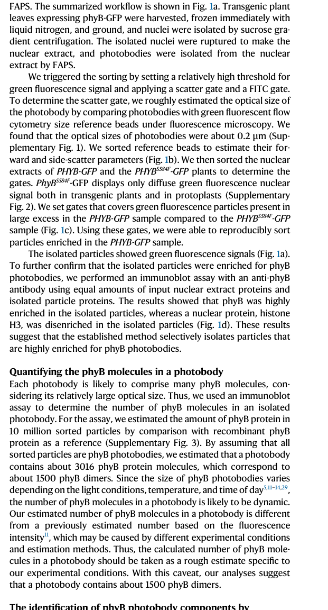

## Question

# Gene Research for Functional Annotation

## ⚠️ CRITICAL: Gene/Protein Identification Context

**BEFORE YOU BEGIN RESEARCH:** You MUST verify you are researching the CORRECT gene/protein. Gene symbols can be ambiguous, especially for less well-characterized genes from non-model organisms.

### Target Gene/Protein Identity (from UniProt):
- **UniProt Accession:** P14713
- **Protein Description:** RecName: Full=Phytochrome B {ECO:0000303|PubMed:2606345}; AltName: Full=Protein LONG HYPOCOTYL 3 {ECO:0000303|PubMed:8453299}; AltName: Full=Protein OUT OF PHASE 1 {ECO:0000303|PubMed:12177480};
- **Gene Information:** Name=PHYB {ECO:0000303|PubMed:2606345}; Synonyms=HY3 {ECO:0000303|PubMed:8453299}, OOP1 {ECO:0000303|PubMed:12177480}; OrderedLocusNames=At2g18790 {ECO:0000312|Araport:AT2G18790}; ORFNames=MSF3.17 {ECO:0000312|EMBL:AAD08948.1};
- **Organism (full):** Arabidopsis thaliana (Mouse-ear cress).
- **Protein Family:** Belongs to the phytochrome family. .
- **Key Domains:** GAF. (IPR003018); GAF-like_dom_sf. (IPR029016); HATPase_C_sf. (IPR036890); His_kinase_dom. (IPR005467); HisK_dim/P_dom. (IPR003661)

### MANDATORY VERIFICATION STEPS:

1. **Check if the gene symbol "PHYB" matches the protein description above**
2. **Verify the organism is correct:** Arabidopsis thaliana (Mouse-ear cress).
3. **Check if protein family/domains align with what you find in literature**
4. **If you find literature for a DIFFERENT gene with the same or similar symbol, STOP**

### If Gene Symbol is Ambiguous or You Cannot Find Relevant Literature:

**DO NOT PROCEED WITH RESEARCH ON A DIFFERENT GENE.** Instead:
- State clearly: "The gene symbol 'PHYB' is ambiguous or literature is limited for this specific protein"
- Explain what you found (e.g., "Found extensive literature on a different gene with the same symbol in a different organism")
- Describe the protein based ONLY on the UniProt information provided above
- Suggest that the protein function can be inferred from domain/family information

### Research Target:

Please provide a comprehensive research report on the gene **PHYB** (gene ID: PHYB, UniProt: P14713) in ARATH.

The research report should be a detailed narrative explaining the function, biological processes, and localization of the gene product. Citations should be given for all claims.

You should prioritize authoritative reviews and primary scientific literature when conducting research. You can supplement
this with annotations you find in gene/protein databases, but these can be outdated or inaccurate.

We are specifically interested in the primary function of the gene - for enzymes, what reaction is catalyzed, and what is the substrate specificity? For transporters, what is the substrate? For structural proteins or adapters, what is the broader structural role? For signaling molecules, what is the role in the pathway.

We are interested in where in or outside the cell the gene product carries out its function.

We are also interested in the signaling or biochemical pathways in which the gene functions. We are less interested in broad pleiotropic effects, except where these elucidate the precise role.

Include evidence where possible. We are interested in both experimental evidence as well as inference from structure, evolution, or bioinformatic analysis. Precise studies should be prioritized over high-throughput, where available.

## Output

Question: You are an expert researcher providing comprehensive, well-cited information.

Provide detailed information focusing on:
1. Key concepts and definitions with current understanding
2. Recent developments and latest research (prioritize 2023-2024 sources)
3. Current applications and real-world implementations
4. Expert opinions and analysis from authoritative sources
5. Relevant statistics and data from recent studies

Format as a comprehensive research report with proper citations. Include URLs and publication dates where available.
Always prioritize recent, authoritative sources and provide specific citations for all major claims.

# Gene Research for Functional Annotation

## ⚠️ CRITICAL: Gene/Protein Identification Context

**BEFORE YOU BEGIN RESEARCH:** You MUST verify you are researching the CORRECT gene/protein. Gene symbols can be ambiguous, especially for less well-characterized genes from non-model organisms.

### Target Gene/Protein Identity (from UniProt):
- **UniProt Accession:** P14713
- **Protein Description:** RecName: Full=Phytochrome B {ECO:0000303|PubMed:2606345}; AltName: Full=Protein LONG HYPOCOTYL 3 {ECO:0000303|PubMed:8453299}; AltName: Full=Protein OUT OF PHASE 1 {ECO:0000303|PubMed:12177480};
- **Gene Information:** Name=PHYB {ECO:0000303|PubMed:2606345}; Synonyms=HY3 {ECO:0000303|PubMed:8453299}, OOP1 {ECO:0000303|PubMed:12177480}; OrderedLocusNames=At2g18790 {ECO:0000312|Araport:AT2G18790}; ORFNames=MSF3.17 {ECO:0000312|EMBL:AAD08948.1};
- **Organism (full):** Arabidopsis thaliana (Mouse-ear cress).
- **Protein Family:** Belongs to the phytochrome family. .
- **Key Domains:** GAF. (IPR003018); GAF-like_dom_sf. (IPR029016); HATPase_C_sf. (IPR036890); His_kinase_dom. (IPR005467); HisK_dim/P_dom. (IPR003661)

### MANDATORY VERIFICATION STEPS:

1. **Check if the gene symbol "PHYB" matches the protein description above**
2. **Verify the organism is correct:** Arabidopsis thaliana (Mouse-ear cress).
3. **Check if protein family/domains align with what you find in literature**
4. **If you find literature for a DIFFERENT gene with the same or similar symbol, STOP**

### If Gene Symbol is Ambiguous or You Cannot Find Relevant Literature:

**DO NOT PROCEED WITH RESEARCH ON A DIFFERENT GENE.** Instead:
- State clearly: "The gene symbol 'PHYB' is ambiguous or literature is limited for this specific protein"
- Explain what you found (e.g., "Found extensive literature on a different gene with the same symbol in a different organism")
- Describe the protein based ONLY on the UniProt information provided above
- Suggest that the protein function can be inferred from domain/family information

### Research Target:

Please provide a comprehensive research report on the gene **PHYB** (gene ID: PHYB, UniProt: P14713) in ARATH.

The research report should be a detailed narrative explaining the function, biological processes, and localization of the gene product. Citations should be given for all claims.

You should prioritize authoritative reviews and primary scientific literature when conducting research. You can supplement
this with annotations you find in gene/protein databases, but these can be outdated or inaccurate.

We are specifically interested in the primary function of the gene - for enzymes, what reaction is catalyzed, and what is the substrate specificity? For transporters, what is the substrate? For structural proteins or adapters, what is the broader structural role? For signaling molecules, what is the role in the pathway.

We are interested in where in or outside the cell the gene product carries out its function.

We are also interested in the signaling or biochemical pathways in which the gene functions. We are less interested in broad pleiotropic effects, except where these elucidate the precise role.

Include evidence where possible. We are interested in both experimental evidence as well as inference from structure, evolution, or bioinformatic analysis. Precise studies should be prioritized over high-throughput, where available.

## Research Report: Arabidopsis thaliana **PHYB** (Phytochrome B; UniProt **P14713**) — Functional Annotation

### 0) Mandatory identity verification (to avoid symbol ambiguity)
The target protein is **Arabidopsis thaliana phytochrome B (phyB)** encoded by **PHYB (At2g18790)**, corresponding to **UniProt accession P14713**. The literature synthesized here explicitly concerns Arabidopsis **phytochrome B**, a red/far-red photoreceptor and thermosensor that forms **nuclear photobodies** and regulates **PIF** transcription factors. These features match the UniProt description of a phytochrome-family protein with a photosensory region and a C-terminal output module consistent with **GAF** and histidine-kinase–related (HKRD) output architecture. (willige2024whatisgoing pages 1-2, kim2024photobodyformationspatially pages 1-2)

### 1) Key concepts and definitions (current understanding)

#### 1.1 What PHYB is (definition)
PHYB is a **plant phytochrome-family photoreceptor** that functions as a **dual sensor**: it perceives **red/far-red light** and also senses **ambient temperature**. This duality arises because the light-activated signaling state can decay back to the inactive state via **temperature-dependent thermal reversion**. (willige2024whatisgoing pages 1-2, kim2024photobodyformationspatially pages 1-2, kim2023phytochromebphotobodies pages 1-2)

#### 1.2 Domain/module architecture (how the protein is built)
Recent review synthesis describes PHYB as a ~**125 kDa** protein organized into two major functional modules:
- An **N-terminal photosensory module** (including N-terminal extension (NTE), PAS, GAF, PHY) that binds a bilin chromophore via a conserved cysteine and mediates photochemistry.
- A **C-terminal output module** (PAS-related region + **HKRD**) implicated in **dimerization**, **nuclear localization**, and **photobody formation**.
This architecture supports the interpretation that PHYB is a photoreversible sensor coupled to downstream signaling through protein–protein interactions and subcellular compartmentalization. (willige2024whatisgoing pages 1-2)

#### 1.3 Photochemistry and activity states (Pr/Pfr)
PHYB exists in two interconvertible forms:
- **Pr**: inactive state.
- **Pfr**: active state produced by red light; far-red light drives reversion.
The biologically active **Pfr** accumulates in the nucleus and is associated with downstream signaling, including photobody formation and transcriptional regulation. (kim2023phytochromebphotobodies pages 1-2, willige2024whatisgoing pages 1-2)

#### 1.4 Thermosensing: thermal reversion as a temperature readout
A key mechanistic concept is that PHYB acts as a thermosensor because **Pfr thermally reverts to Pr** at rates that depend on ambient temperature; thus warmer temperatures reduce active PHYB signaling even under constant light, enabling phyB to integrate light and temperature cues. (kim2024photobodyformationspatially pages 1-2, kim2023phytochromebphotobodies pages 1-2, jean2024investigatingthefunctional pages 17-22)

#### 1.5 Photobodies (PBs) and liquid–liquid phase separation (LLPS)
**Photobodies** are subnuclear compartments enriched in phyB that form upon activation. Recent reviews frame photobody formation as **phase separation**, where dense phyB-enriched assemblies form within a less dense nucleoplasmic phase. Evidence summarized includes **spherical morphology**, **mobility/coalescence**, and **FRAP-based exchange** of phyB between photobodies and nucleoplasm. Functionally, photobodies are described as **biochemical hotspots** that can concentrate signaling proteins and influence specificity and kinetics of downstream events (e.g., transcriptional regulation and protein degradation/sequestration). (willige2024whatisgoing pages 3-5, willige2024whatisgoing pages 1-2)

### 2) Core molecular function and pathway placement (mechanistic functional annotation)

#### 2.1 Primary molecular function: environmental signal perception coupled to transcriptional control
PHYB’s primary function is to **convert red/far-red light and temperature inputs into changes in gene expression and development** by controlling the activity and abundance of transcriptional regulators, especially the **phytochrome-interacting factors (PIFs)**. (willige2024whatisgoing pages 7-9, kim2023phytochromebphotobodies pages 1-2)

#### 2.2 Key signaling mechanism: PHYB–PIF interactions and PIF regulation
A central mechanism is **direct binding** of photoactivated PHYB to PIF transcription factors (e.g., PIF1/3/4/5/7) via PIF recognition motifs (e.g., APB motifs), followed by PIF inhibition through multiple routes:
- **Phosphorylation and proteasome-dependent degradation** of certain PIFs (PIF3 is frequently discussed), involving phosphorylation by kinases (e.g., PPKs) and ubiquitination by E3 ligases (examples include CRL3^LRB and CRL1^EBF pathways in summarized evidence).
- **Sequestration** of PIFs within photobodies and/or masking of their activation domains.
- **Indirect regulation** through antagonizing PIF-stabilizing factors such as **COP1/SPAs**.
This multi-layered control places PHYB at the top of a red-light signaling cascade regulating photomorphogenesis and temperature-dependent growth responses. (kim2024photobodyformationspatially pages 1-2, kim2023phytochromebphotobodies pages 1-2, willige2024whatisgoing pages 7-9, kim2023phytochromebphotobodies pages 9-10)

#### 2.3 Photobodies as organized signaling compartments (composition and logic)
A major advance is the explicit demonstration that phyB photobodies are not just “phyB-only” foci: they include many primary and secondary interacting proteins, supporting a scaffold/client model of condensate organization.

**Representative components and roles supported in 2023–2024 sources include:**
- **PCH1/PCHL**: stabilize phyB Pfr and prevent photobody disassembly; promote maintenance of large photobodies at night; can link photobodies to transcriptional corepression by recruiting **TOPLESS (TPL)** in specific contexts.
- **COP1/SPA**: colocalize with nuclear speckles with photobody identity; participate in phosphorylation/degradation logic around photomorphogenesis regulators and can promote ubiquitination/degradation of some photobody-associated factors in the dark.
- **TZP**: recruited by phyB into transcriptionally active photobodies; binds ssDNA in vitro; gene activation requiring TZP is inhibited when photobodies are disrupted.
- **HMR/PAP5, PAP8, RCB, NCP**: dual-localized factors implicated in photobody growth/formation and in coupling nuclear light signaling to chloroplast development programs.
- **PPKs**: kinases linked to phosphorylation of phyB and/or PIFs and movement between nuclear body types.
These observations support a model where photobodies integrate signaling, protein turnover, and transcriptional regulation across cellular compartments. (willige2024whatisgoing pages 9-10, willige2024whatisgoing pages 7-9, kim2023phytochromebphotobodies pages 9-10, willige2024whatisgoing pages 10-12)

### 3) Subcellular localization (where PHYB acts)

#### 3.1 Cytosol-to-nucleus transition
In dark-grown seedlings, PHYB is described as largely **cytosolic and inactive**; red light induces formation of the Pfr state and promotes **nuclear accumulation**, a prerequisite for photobody assembly and much of downstream signaling. (willige2024whatisgoing pages 1-2)

#### 3.2 Nuclear photobodies and nucleoplasm as distinct functional compartments
Photobodies are **subnuclear membraneless organelles/condensates** whose assembly state is regulated by light and temperature. Importantly, recent mechanistic work proposes that photobodies are not merely correlated with signaling but can encode signaling outcomes by spatially organizing components between photobodies and nucleoplasm. (kim2024photobodyformationspatially pages 1-2, willige2024whatisgoing pages 3-5)

### 4) Recent developments and latest research (prioritizing 2023–2024)

#### 4.1 2023: Direct isolation and quantitative composition of photobodies (Nature Communications)
Kim et al. (published **March 2023**, URL: https://doi.org/10.1038/s41467-023-37421-z) isolated phyB photobodies and used quantitative approaches to estimate:
- **Optical photobody size ~0.2 μm**.
- **~1,500 phyB dimers per photobody**.
They proposed a composition framework distinguishing **primary** phyB-binding proteins from **secondary** proteins recruited through primary interactors (e.g., TOPLESS recruited via PCH1). This substantially advanced functional annotation by turning “photobodies” into a quantifiable organelle-like entity with a measurable molecular inventory. (kim2023phytochromebphotobodies pages 1-2, kim2023phytochromebphotobodies media fb26d370)

#### 4.2 2024: Photobodies as LLPS signaling hubs (The Plant Cell review)
Willige et al. (published **March 2024**, URL: https://doi.org/10.1093/plcell/koae084) synthesized evidence that phyB photobodies form via **liquid–liquid phase separation**, emphasizing dynamic properties (exchange with nucleoplasm by FRAP; coalescence) and proposing photobodies function as **biochemical hotspots** coordinating light and temperature signaling to gene regulation on multiple levels. (willige2024whatisgoing pages 3-5, willige2024whatisgoing pages 1-2)

#### 4.3 2024: “Two-compartment logic” — photobodies segregate antagonistic outcomes for PIF5 (Nature Communications)
Kim et al. (published **April 2024**, URL: https://doi.org/10.1038/s41467-024-47790-8) showed PHYB recruits **PIF5** to photobodies and exerts **opposing roles**:
- **Stabilization of PIF5 in enlarged photobodies**.
- **Promotion of PIF5 degradation in the surrounding nucleoplasm**.
Perturbations that change photobody size/dynamics (e.g., changing PHYB levels or light conditions) shift the balance between these outcomes, providing an explicit mechanistic role for photobodies in tuning transcription factor abundance and environmental responses. (kim2024photobodyformationspatially pages 1-2)

#### 4.4 2024: Reproductive thermomorphogenesis quantified as a PHYB–PIF4-dependent phenotype set (BMC Plant Biology)
Naghani et al. (published **July 2024**, URL: https://doi.org/10.1186/s12870-024-05394-w) used integrative phenotyping and transcriptomics to show that elevated ambient temperature causes strong reproductive defects modulated by phyB–PIF4 pathway status, including major increases in ovule and embryo defect rates plus large transcriptomic shifts in pistils. These data broaden PHYB functional annotation from seedling growth to reproductive robustness under warming conditions. (naghani2024integrativephenotypinganalyses pages 10-12, naghani2024integrativephenotypinganalyses pages 15-17)

### 5) Quantitative statistics and data highlights (recent primary studies)

#### 5.1 Photobody physical/molecular metrics
- **Photobody optical size ~0.2 μm** and **~1,500 phyB dimers per photobody** (quantified from isolated photobodies). (kim2023phytochromebphotobodies pages 1-2, kim2023phytochromebphotobodies media fb26d370)
- Independent reports summarized in a 2024 thesis-style source describe regimes of **2–10 large photobodies (0.7–2 μm)** under intense red light, versus many small foci under dim red light (noting these are secondary sources and should be treated cautiously versus peer-reviewed quantification). (jean2024investigatingthefunctional pages 97-102)

#### 5.2 Reproductive high-temperature phenotypes linked to PHYB–PIF4
Under high ambient temperature, Naghani et al. report:
- **Ovule defect rates (Col-0: 5.4% → 30.6%; phyB: 17.9% → 62.6%; 35S::PIF4: 16.1% → 84.3%)**. (naghani2024integrativephenotypinganalyses pages 15-17, naghani2024integrativephenotypinganalyses pages 10-12)
- **Embryo defects (Col-0: 2.42% → 40.77%; phyB: 3.4% → 30.85%; 35S::PIF4: 3.79% → 21.95%; pif4: 4.1% → 44.23%)**. (naghani2024integrativephenotypinganalyses pages 17-20)
- **Seed area increases** at high temperature (e.g., Col-0 +34.74%; phyB +47.83%; pif4 +25.20%). (naghani2024integrativephenotypinganalyses pages 15-17)
- Pistil RNA-seq in wild type identified **8,485 DEGs** under high ambient temperature (**5,032 up; 3,453 down**). (naghani2024integrativephenotypinganalyses pages 10-12)
These provide a quantitative link from PHYB signaling state to reproductive output and gene regulation in warming-relevant contexts. (naghani2024integrativephenotypinganalyses pages 10-12)

### 6) Current applications and real-world implementations

#### 6.1 Optogenetics: PHYB–PIF as a red/far-red reversible molecular switch
While Arabidopsis PHYB’s native role is plant environmental sensing, an important real-world implementation is use of the **PhyB–PIF** interaction as an optogenetic dimerization tool. Recent evidence summarized in optogenetics sources describes:
- **Association under red light (~630 nm)** and **dissociation under far-red/near-IR (~>720 nm; one system uses 780 nm)**.
- A 2025 implementation controlling extracellular co-stimulation of human T cells reports attenuation/dissociation within **~2 minutes** upon far-red illumination (630 nm on / 780 nm off). (ehret2025optocd28reactoptogeneticcostimulatory pages 1-2)
- Review-level sources also note very fast switching potential (millisecond-scale), along with reversible membrane recruitment architectures used to control signaling cascades. (wurz2024optogeneticregulationof pages 19-24, wurz2024optogeneticregulationof pages 13-19)
These implementations exemplify how PHYB’s photochemistry can be repurposed for programmable control in mammalian and microbial contexts, although they use the PHYB/PIF module rather than full native phyB signaling. (ehret2025optocd28reactoptogeneticcostimulatory pages 1-2, wurz2024optogeneticregulationof pages 19-24)

#### 6.2 Plant-focused applications (evidence limitations in retrieved 2023–2024 sources)
Within the retrieved 2023–2024 evidence set, explicit “deployment” case studies in agriculture (e.g., field-scale breeding strategies directly manipulating PHYB alleles) were not strongly represented. However, the 2024 reproductive thermomorphogenesis study provides quantitative phenotypes and candidate pathways that could inform breeding for heat resilience by targeting the phyB–PIF4 axis. (naghani2024integrativephenotypinganalyses pages 10-12, naghani2024integrativephenotypinganalyses pages 15-17)

### 7) Expert synthesis and analysis (authoritative interpretations)

#### 7.1 Photobodies: from correlation to mechanism
The Plant Cell 2024 review highlights that photobodies have moved from being debated artifacts to being treated as **LLPS-based, functional nuclear condensates**. This provides a conceptual framework for why photobody assembly state can encode environmental information (light quality/intensity and temperature) into biochemical outcomes such as transcription factor stability and transcriptional regulation. (willige2024whatisgoing pages 3-5)

#### 7.2 Spatial logic in signaling: a mature mechanistic model
The 2024 Nature Communications study provides strong mechanistic evidence that photobody formation can **separate antagonistic regulatory reactions** into different nuclear regions (photobody vs nucleoplasm), enabling tunable control (e.g., PIF5 stabilization vs degradation). This supports an expert view of PHYB not merely as a receptor but as an organizer of intracellular reaction environments. (kim2024photobodyformationspatially pages 1-2)

### 8) Summary table (evidence-based)
The following table condenses key functional annotation statements, recent advances, quantitative metrics, and applications.

| Topic | Summary |
|---|---|
| Identity/domains | **Verified target:** Arabidopsis thaliana **PHYB / phytochrome B** encoded by **At2g18790**, corresponding to UniProt **P14713**. PHYB is a ~125 kDa phytochrome-family homodimer with an **N-terminal photosensory module** (N-terminal extension, PAS, GAF, PHY; chromophore-binding cysteine in the photosensory region) and a **C-terminal output module** containing a PAS-related region and **HKRD**; the C-terminus supports dimerization, nuclear localization, and photobody formation. (willige2024whatisgoing pages 1-2, kim2024photobodyformationspatially pages 1-2) |
| Photochemistry | PHYB is a **red/far-red photoreceptor** that reversibly interconverts between inactive **Pr** and active **Pfr** states. Red light generates the biologically active Pfr state that accumulates in the nucleus, while far-red light drives reversion toward Pr; this photoreversibility underlies canonical red/far-red signaling. (willige2024whatisgoing pages 1-2, kim2023phytochromebphotobodies pages 1-2) |
| Thermosensing | Current understanding is that PHYB is also an **ambient-temperature sensor** because active Pfr undergoes **temperature-dependent thermal reversion** back to Pr. Warmer conditions accelerate loss of active PHYB, thereby releasing downstream transcriptional programs such as thermomorphogenesis and extending PHYB’s role beyond light sensing alone. (kim2024photobodyformationspatially pages 1-2, jean2024investigatingthefunctional pages 17-22) |
| Localization/photobodies | In dark-grown seedlings PHYB is largely cytosolic/inactive; upon photoactivation it accumulates in the **nucleus** and condenses into **photobodies (PBs)**, subnuclear membraneless compartments. Recent work supports that PBs form by **liquid-liquid phase separation (LLPS)** and function as dynamic biochemical hubs rather than passive aggregates. (willige2024whatisgoing pages 1-2, willige2024whatisgoing pages 3-5, jean2024investigatingthefunctional pages 65-70) |
| Key interactors | Major direct or PB-associated partners include **PIF transcription factors** (PIF1/3/4/5/7), **PCH1/PCHL**, **COP1/SPA**, **TZP**, **HMR/PAP5**, **RCB**, **NCP**, **PAP8**, **TPL/TPRs**, and **PPKs**. These proteins help determine whether PHYB signaling is routed toward transcriptional repression/activation, protein degradation, photobody stabilization, or nucleus-to-plastid signaling. (kim2023phytochromebphotobodies pages 1-2, willige2024whatisgoing pages 9-10, willige2024whatisgoing pages 7-9, jean2024investigatingthefunctional pages 33-37, kim2023phytochromebphotobodies pages 9-10) |
| Mechanisms | A core mechanism is **direct binding of photoactivated PHYB to PIFs**, followed by PIF phosphorylation and proteasome-dependent turnover; PHYB also suppresses PIF activity by sequestration in PBs and by antagonizing PIF-stabilizing factors such as COP1/SPAs. A key 2024 refinement is that PBs can **spatially separate two opposing outputs**: **PIF5 degradation in the nucleoplasm** versus **PIF5 stabilization within enlarged PBs**, providing environmentally tunable signal balancing. (kim2024photobodyformationspatially pages 1-2, jean2024investigatingthefunctional pages 17-22, kim2023photobodyformationspatially pages 1-5, willige2024whatisgoing pages 7-9) |
| 2023-2024 advances | In **2023**, isolated Arabidopsis phyB photobodies were shown to contain PHYB plus **primary and secondary interacting proteins**, clarifying PB composition. In **2024**, reviews synthesized evidence that PBs behave as LLPS condensates, and primary research showed PB formation can spatially encode antagonistic signaling outputs toward PIF5, substantially sharpening mechanistic understanding of PB function. (kim2023phytochromebphotobodies pages 1-2, willige2024whatisgoing pages 3-5, kim2024photobodyformationspatially pages 1-2) |
| Quantitative stats | Recent quantitative data include estimates of **~1,500 PHYB dimers per photobody** and optical PB sizes around **~0.2 µm** in isolated Arabidopsis material; other reports describe **2–10 large PBs of ~0.7–2 µm** under stronger red light versus many smaller foci under dim light. In reproductive thermomorphogenesis, high ambient temperature increased ovule defects from **5.4% to 30.6% in Col-0**, **17.9% to 62.6% in phyB**, and **16.1% to 84.3% in 35S::PIF4**, linking PHYB-PIF4 signaling to strong developmental outcomes. (kim2023phytochromebphotobodies pages 1-2, kim2023phytochromebphotobodies media fb26d370, jean2024investigatingthefunctional pages 97-102, naghani2024integrativephenotypinganalyses pages 15-17, naghani2024integrativephenotypinganalyses pages 10-12) |
| Applications | Although Arabidopsis PHYB is primarily a basic-research signaling protein, its **PHYB-PIF light-switch** has become a widely used **optogenetic module**. Reported implementations use **~630 nm red light** for association and **~780 nm far-red light** for reversal, with attenuation in one 2025 T-cell system occurring within **~2 min**; broader optogenetic literature also highlights millisecond-scale switching potential and reversible control of protein localization/signaling. (wurz2024optogeneticregulationof pages 19-24, ehret2025optocd28reactoptogeneticcostimulatory pages 1-2, wurz2024optogeneticregulationof pages 13-19, jia2025structuralinsightinto pages 8-9) |

*Table: This table summarizes the verified identity, molecular function, signaling mechanisms, localization, recent advances, quantitative findings, and applications of Arabidopsis thaliana PHYB (UniProt P14713). It is designed as a compact evidence-based reference for functional annotation.*

### 9) Key figure evidence (photobody quantification)
A cropped figure region from Kim et al. 2023 visually supports the photobody isolation/size and quantification framework described above. (kim2023phytochromebphotobodies media fb26d370)

### References (URLs and publication dates highlighted)
- Kim C. et al. **“Phytochrome B photobodies are comprised of phytochrome B and its primary and secondary interacting proteins.”** *Nature Communications* (Mar 2023). https://doi.org/10.1038/s41467-023-37421-z (kim2023phytochromebphotobodies pages 1-2)
- Willige B.C. et al. **“What is going on inside of phytochrome B photobodies?”** *The Plant Cell* (Mar 2024). https://doi.org/10.1093/plcell/koae084 (willige2024whatisgoing pages 1-2)
- Kim R.J.A. et al. **“Photobody formation spatially segregates two opposing phytochrome B signaling actions of PIF5 degradation and stabilization.”** *Nature Communications* (Apr 2024). https://doi.org/10.1038/s41467-024-47790-8 (kim2024photobodyformationspatially pages 1-2)
- Naghani S.E. et al. **“Integrative phenotyping analyses reveal the relevance of the phyB-PIF4 pathway in Arabidopsis thaliana reproductive organs at high ambient temperature.”** *BMC Plant Biology* (Jul 2024). https://doi.org/10.1186/s12870-024-05394-w (naghani2024integrativephenotypinganalyses pages 10-12)
- Ehret A.K. et al. **“Opto-CD28-REACT: optogenetic co-stimulatory receptor activation on non-engineered human T cells.”** *Frontiers in Immunology* (Sep 2025). https://doi.org/10.3389/fimmu.2025.1646135 (ehret2025optocd28reactoptogeneticcostimulatory pages 1-2)

References

1. (willige2024whatisgoing pages 1-2): Björn Christopher Willige, Chan Yul Yoo, and Jessica Paola Saldierna Guzmán. What is going on inside of phytochrome b photobodies? The Plant Cell, 36:2065-2085, Mar 2024. URL: https://doi.org/10.1093/plcell/koae084, doi:10.1093/plcell/koae084. This article has 13 citations.

2. (kim2024photobodyformationspatially pages 1-2): Ruth Jean Ae Kim, De Fan, Jiangman He, Keunhwa Kim, Juan Du, and Meng Chen. Photobody formation spatially segregates two opposing phytochrome b signaling actions of pif5 degradation and stabilization. Nature Communications, Apr 2024. URL: https://doi.org/10.1038/s41467-024-47790-8, doi:10.1038/s41467-024-47790-8. This article has 21 citations and is from a highest quality peer-reviewed journal.

3. (kim2023phytochromebphotobodies pages 1-2): Chanhee Kim, Yongmin Kwon, Jaehoon Jeong, Minji Kang, Ga Seul Lee, Jeong Hee Moon, Hyo-Jun Lee, Youn-Il Park, and Giltsu Choi. Phytochrome b photobodies are comprised of phytochrome b and its primary and secondary interacting proteins. Nature Communications, Mar 2023. URL: https://doi.org/10.1038/s41467-023-37421-z, doi:10.1038/s41467-023-37421-z. This article has 86 citations and is from a highest quality peer-reviewed journal.

4. (jean2024investigatingthefunctional pages 17-22): R Jean. Investigating the functional relationship of photobodies and phytochrome interacting factors in phytochrome b signaling. Unknown journal, 2024.

5. (willige2024whatisgoing pages 3-5): Björn Christopher Willige, Chan Yul Yoo, and Jessica Paola Saldierna Guzmán. What is going on inside of phytochrome b photobodies? The Plant Cell, 36:2065-2085, Mar 2024. URL: https://doi.org/10.1093/plcell/koae084, doi:10.1093/plcell/koae084. This article has 13 citations.

6. (willige2024whatisgoing pages 7-9): Björn Christopher Willige, Chan Yul Yoo, and Jessica Paola Saldierna Guzmán. What is going on inside of phytochrome b photobodies? The Plant Cell, 36:2065-2085, Mar 2024. URL: https://doi.org/10.1093/plcell/koae084, doi:10.1093/plcell/koae084. This article has 13 citations.

7. (kim2023phytochromebphotobodies pages 9-10): Chanhee Kim, Yongmin Kwon, Jaehoon Jeong, Minji Kang, Ga Seul Lee, Jeong Hee Moon, Hyo-Jun Lee, Youn-Il Park, and Giltsu Choi. Phytochrome b photobodies are comprised of phytochrome b and its primary and secondary interacting proteins. Nature Communications, Mar 2023. URL: https://doi.org/10.1038/s41467-023-37421-z, doi:10.1038/s41467-023-37421-z. This article has 86 citations and is from a highest quality peer-reviewed journal.

8. (willige2024whatisgoing pages 9-10): Björn Christopher Willige, Chan Yul Yoo, and Jessica Paola Saldierna Guzmán. What is going on inside of phytochrome b photobodies? The Plant Cell, 36:2065-2085, Mar 2024. URL: https://doi.org/10.1093/plcell/koae084, doi:10.1093/plcell/koae084. This article has 13 citations.

9. (willige2024whatisgoing pages 10-12): Björn Christopher Willige, Chan Yul Yoo, and Jessica Paola Saldierna Guzmán. What is going on inside of phytochrome b photobodies? The Plant Cell, 36:2065-2085, Mar 2024. URL: https://doi.org/10.1093/plcell/koae084, doi:10.1093/plcell/koae084. This article has 13 citations.

10. (kim2023phytochromebphotobodies media fb26d370): Chanhee Kim, Yongmin Kwon, Jaehoon Jeong, Minji Kang, Ga Seul Lee, Jeong Hee Moon, Hyo-Jun Lee, Youn-Il Park, and Giltsu Choi. Phytochrome b photobodies are comprised of phytochrome b and its primary and secondary interacting proteins. Nature Communications, Mar 2023. URL: https://doi.org/10.1038/s41467-023-37421-z, doi:10.1038/s41467-023-37421-z. This article has 86 citations and is from a highest quality peer-reviewed journal.

11. (naghani2024integrativephenotypinganalyses pages 10-12): Shekoufeh Ebrahimi Naghani, Ján Šmeringai, Barbora Pleskačová, Tereza Dobisová, Klára Panzarová, Markéta Pernisová, and Hélène S. Robert. Integrative phenotyping analyses reveal the relevance of the phyb-pif4 pathway in arabidopsis thaliana reproductive organs at high ambient temperature. BMC Plant Biology, Jul 2024. URL: https://doi.org/10.1186/s12870-024-05394-w, doi:10.1186/s12870-024-05394-w. This article has 11 citations and is from a peer-reviewed journal.

12. (naghani2024integrativephenotypinganalyses pages 15-17): Shekoufeh Ebrahimi Naghani, Ján Šmeringai, Barbora Pleskačová, Tereza Dobisová, Klára Panzarová, Markéta Pernisová, and Hélène S. Robert. Integrative phenotyping analyses reveal the relevance of the phyb-pif4 pathway in arabidopsis thaliana reproductive organs at high ambient temperature. BMC Plant Biology, Jul 2024. URL: https://doi.org/10.1186/s12870-024-05394-w, doi:10.1186/s12870-024-05394-w. This article has 11 citations and is from a peer-reviewed journal.

13. (jean2024investigatingthefunctional pages 97-102): R Jean. Investigating the functional relationship of photobodies and phytochrome interacting factors in phytochrome b signaling. Unknown journal, 2024.

14. (naghani2024integrativephenotypinganalyses pages 17-20): Shekoufeh Ebrahimi Naghani, Ján Šmeringai, Barbora Pleskačová, Tereza Dobisová, Klára Panzarová, Markéta Pernisová, and Hélène S. Robert. Integrative phenotyping analyses reveal the relevance of the phyb-pif4 pathway in arabidopsis thaliana reproductive organs at high ambient temperature. BMC Plant Biology, Jul 2024. URL: https://doi.org/10.1186/s12870-024-05394-w, doi:10.1186/s12870-024-05394-w. This article has 11 citations and is from a peer-reviewed journal.

15. (ehret2025optocd28reactoptogeneticcostimulatory pages 1-2): Anna K. Ehret, Sara Hartmann, Pavel Salavei, Virginia Andreani, Nicole Gensch, Laura Gámez-Díaz, and Wolfgang W. Schamel. Opto-cd28-react: optogenetic co-stimulatory receptor activation on non-engineered human t cells. Sep 2025. URL: https://doi.org/10.3389/fimmu.2025.1646135, doi:10.3389/fimmu.2025.1646135. This article has 0 citations and is from a peer-reviewed journal.

16. (wurz2024optogeneticregulationof pages 19-24): AI Wurz. Optogenetic regulation of membrane-associated proteins. Unknown journal, 2024.

17. (wurz2024optogeneticregulationof pages 13-19): AI Wurz. Optogenetic regulation of membrane-associated proteins. Unknown journal, 2024.

18. (jean2024investigatingthefunctional pages 65-70): R Jean. Investigating the functional relationship of photobodies and phytochrome interacting factors in phytochrome b signaling. Unknown journal, 2024.

19. (jean2024investigatingthefunctional pages 33-37): R Jean. Investigating the functional relationship of photobodies and phytochrome interacting factors in phytochrome b signaling. Unknown journal, 2024.

20. (kim2023photobodyformationspatially pages 1-5): Ruth Jean Ae Kim, De Fan, Jiangman He, Keunhwa Kim, Juan Du, and Meng Chen. Photobody formation spatially segregates two opposing phytochrome b signaling actions to titrate plant environmental responses. bioRxiv, Nov 2023. URL: https://doi.org/10.1101/2023.11.12.566724, doi:10.1101/2023.11.12.566724. This article has 3 citations.

21. (jia2025structuralinsightinto pages 8-9): Hanli Jia, Zeyuan Guan, Junya Ding, Xiaoyu Wang, Dingfang Tian, Yan Zhu, Delin Zhang, Zhu Liu, Ling Ma, and Ping Yin. Structural insight into pif6-mediated red light signal transduction of plant phytochrome b. Cell Discovery, May 2025. URL: https://doi.org/10.1038/s41421-025-00802-3, doi:10.1038/s41421-025-00802-3. This article has 15 citations and is from a peer-reviewed journal.

## Artifacts

- [Edison artifact artifact-00](PHYB-deep-research-falcon_artifacts/artifact-00.md)

## Citations

1. willige2024whatisgoing pages 1-2
2. kim2024photobodyformationspatially pages 1-2
3. jean2024investigatingthefunctional pages 97-102
4. naghani2024integrativephenotypinganalyses pages 17-20
5. naghani2024integrativephenotypinganalyses pages 15-17
6. naghani2024integrativephenotypinganalyses pages 10-12
7. willige2024whatisgoing pages 3-5
8. kim2023phytochromebphotobodies pages 1-2
9. jean2024investigatingthefunctional pages 17-22
10. willige2024whatisgoing pages 7-9
11. kim2023phytochromebphotobodies pages 9-10
12. willige2024whatisgoing pages 9-10
13. willige2024whatisgoing pages 10-12
14. wurz2024optogeneticregulationof pages 19-24
15. wurz2024optogeneticregulationof pages 13-19
16. jean2024investigatingthefunctional pages 65-70
17. jean2024investigatingthefunctional pages 33-37
18. kim2023photobodyformationspatially pages 1-5
19. jia2025structuralinsightinto pages 8-9
20. https://doi.org/10.1038/s41467-023-37421-z
21. https://doi.org/10.1093/plcell/koae084
22. https://doi.org/10.1038/s41467-024-47790-8
23. https://doi.org/10.1186/s12870-024-05394-w
24. https://doi.org/10.3389/fimmu.2025.1646135
25. https://doi.org/10.1093/plcell/koae084,
26. https://doi.org/10.1038/s41467-024-47790-8,
27. https://doi.org/10.1038/s41467-023-37421-z,
28. https://doi.org/10.1186/s12870-024-05394-w,
29. https://doi.org/10.3389/fimmu.2025.1646135,
30. https://doi.org/10.1101/2023.11.12.566724,
31. https://doi.org/10.1038/s41421-025-00802-3,