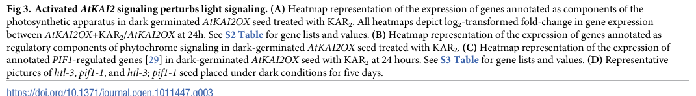

## Question

# Gene Research for Functional Annotation

## ⚠️ CRITICAL: Gene/Protein Identification Context

**BEFORE YOU BEGIN RESEARCH:** You MUST verify you are researching the CORRECT gene/protein. Gene symbols can be ambiguous, especially for less well-characterized genes from non-model organisms.

### Target Gene/Protein Identity (from UniProt):
- **UniProt Accession:** Q8GZM7
- **Protein Description:** RecName: Full=Transcription factor PIF1 {ECO:0000303|PubMed:15448264}; AltName: Full=Basic helix-loop-helix protein 15 {ECO:0000303|PubMed:12679534}; Short=AtbHLH15 {ECO:0000303|PubMed:12679534}; Short=bHLH 15 {ECO:0000303|PubMed:12679534}; AltName: Full=Phytochrome-interacting factor 1 {ECO:0000303|PubMed:15448264}; AltName: Full=Protein PHYTOCHROME INTERACTING FACTOR 3-LIKE 5 {ECO:0000303|PubMed:12826627}; AltName: Full=Transcription factor EN 101 {ECO:0000303|PubMed:12897250}; AltName: Full=bHLH transcription factor bHLH015 {ECO:0000303|PubMed:12679534};
- **Gene Information:** Name=PIF1 {ECO:0000303|PubMed:15448264}; Synonyms=BHLH15 {ECO:0000303|PubMed:12679534}, EN101 {ECO:0000303|PubMed:12897250}, PIL5 {ECO:0000303|PubMed:12826627}; OrderedLocusNames=At2g20180 {ECO:0000312|Araport:AT2G20180}; ORFNames=T2G17.2 {ECO:0000312|EMBL:AAD24380.1};
- **Organism (full):** Arabidopsis thaliana (Mouse-ear cress).
- **Protein Family:** Not specified in UniProt
- **Key Domains:** bHLH_dom. (IPR011598); HLH_DNA-bd_sf. (IPR036638); PIF1-like_bHLH. (IPR047265); PIF3-like. (IPR044273); HLH (PF00010)

### MANDATORY VERIFICATION STEPS:

1. **Check if the gene symbol "PIF1" matches the protein description above**
2. **Verify the organism is correct:** Arabidopsis thaliana (Mouse-ear cress).
3. **Check if protein family/domains align with what you find in literature**
4. **If you find literature for a DIFFERENT gene with the same or similar symbol, STOP**

### If Gene Symbol is Ambiguous or You Cannot Find Relevant Literature:

**DO NOT PROCEED WITH RESEARCH ON A DIFFERENT GENE.** Instead:
- State clearly: "The gene symbol 'PIF1' is ambiguous or literature is limited for this specific protein"
- Explain what you found (e.g., "Found extensive literature on a different gene with the same symbol in a different organism")
- Describe the protein based ONLY on the UniProt information provided above
- Suggest that the protein function can be inferred from domain/family information

### Research Target:

Please provide a comprehensive research report on the gene **PIF1** (gene ID: PIF1, UniProt: Q8GZM7) in ARATH.

The research report should be a detailed narrative explaining the function, biological processes, and localization of the gene product. Citations should be given for all claims.

You should prioritize authoritative reviews and primary scientific literature when conducting research. You can supplement
this with annotations you find in gene/protein databases, but these can be outdated or inaccurate.

We are specifically interested in the primary function of the gene - for enzymes, what reaction is catalyzed, and what is the substrate specificity? For transporters, what is the substrate? For structural proteins or adapters, what is the broader structural role? For signaling molecules, what is the role in the pathway.

We are interested in where in or outside the cell the gene product carries out its function.

We are also interested in the signaling or biochemical pathways in which the gene functions. We are less interested in broad pleiotropic effects, except where these elucidate the precise role.

Include evidence where possible. We are interested in both experimental evidence as well as inference from structure, evolution, or bioinformatic analysis. Precise studies should be prioritized over high-throughput, where available.

## Output

Question: You are an expert researcher providing comprehensive, well-cited information.

Provide detailed information focusing on:
1. Key concepts and definitions with current understanding
2. Recent developments and latest research (prioritize 2023-2024 sources)
3. Current applications and real-world implementations
4. Expert opinions and analysis from authoritative sources
5. Relevant statistics and data from recent studies

Format as a comprehensive research report with proper citations. Include URLs and publication dates where available.
Always prioritize recent, authoritative sources and provide specific citations for all major claims.

# Gene Research for Functional Annotation

## ⚠️ CRITICAL: Gene/Protein Identification Context

**BEFORE YOU BEGIN RESEARCH:** You MUST verify you are researching the CORRECT gene/protein. Gene symbols can be ambiguous, especially for less well-characterized genes from non-model organisms.

### Target Gene/Protein Identity (from UniProt):
- **UniProt Accession:** Q8GZM7
- **Protein Description:** RecName: Full=Transcription factor PIF1 {ECO:0000303|PubMed:15448264}; AltName: Full=Basic helix-loop-helix protein 15 {ECO:0000303|PubMed:12679534}; Short=AtbHLH15 {ECO:0000303|PubMed:12679534}; Short=bHLH 15 {ECO:0000303|PubMed:12679534}; AltName: Full=Phytochrome-interacting factor 1 {ECO:0000303|PubMed:15448264}; AltName: Full=Protein PHYTOCHROME INTERACTING FACTOR 3-LIKE 5 {ECO:0000303|PubMed:12826627}; AltName: Full=Transcription factor EN 101 {ECO:0000303|PubMed:12897250}; AltName: Full=bHLH transcription factor bHLH015 {ECO:0000303|PubMed:12679534};
- **Gene Information:** Name=PIF1 {ECO:0000303|PubMed:15448264}; Synonyms=BHLH15 {ECO:0000303|PubMed:12679534}, EN101 {ECO:0000303|PubMed:12897250}, PIL5 {ECO:0000303|PubMed:12826627}; OrderedLocusNames=At2g20180 {ECO:0000312|Araport:AT2G20180}; ORFNames=T2G17.2 {ECO:0000312|EMBL:AAD24380.1};
- **Organism (full):** Arabidopsis thaliana (Mouse-ear cress).
- **Protein Family:** Not specified in UniProt
- **Key Domains:** bHLH_dom. (IPR011598); HLH_DNA-bd_sf. (IPR036638); PIF1-like_bHLH. (IPR047265); PIF3-like. (IPR044273); HLH (PF00010)

### MANDATORY VERIFICATION STEPS:

1. **Check if the gene symbol "PIF1" matches the protein description above**
2. **Verify the organism is correct:** Arabidopsis thaliana (Mouse-ear cress).
3. **Check if protein family/domains align with what you find in literature**
4. **If you find literature for a DIFFERENT gene with the same or similar symbol, STOP**

### If Gene Symbol is Ambiguous or You Cannot Find Relevant Literature:

**DO NOT PROCEED WITH RESEARCH ON A DIFFERENT GENE.** Instead:
- State clearly: "The gene symbol 'PIF1' is ambiguous or literature is limited for this specific protein"
- Explain what you found (e.g., "Found extensive literature on a different gene with the same symbol in a different organism")
- Describe the protein based ONLY on the UniProt information provided above
- Suggest that the protein function can be inferred from domain/family information

### Research Target:

Please provide a comprehensive research report on the gene **PIF1** (gene ID: PIF1, UniProt: Q8GZM7) in ARATH.

The research report should be a detailed narrative explaining the function, biological processes, and localization of the gene product. Citations should be given for all claims.

You should prioritize authoritative reviews and primary scientific literature when conducting research. You can supplement
this with annotations you find in gene/protein databases, but these can be outdated or inaccurate.

We are specifically interested in the primary function of the gene - for enzymes, what reaction is catalyzed, and what is the substrate specificity? For transporters, what is the substrate? For structural proteins or adapters, what is the broader structural role? For signaling molecules, what is the role in the pathway.

We are interested in where in or outside the cell the gene product carries out its function.

We are also interested in the signaling or biochemical pathways in which the gene functions. We are less interested in broad pleiotropic effects, except where these elucidate the precise role.

Include evidence where possible. We are interested in both experimental evidence as well as inference from structure, evolution, or bioinformatic analysis. Precise studies should be prioritized over high-throughput, where available.

# Functional annotation of Arabidopsis PIF1 (UniProt Q8GZM7)

## Identity and principal function

**Identity verified:** The specified protein is *Arabidopsis thaliana* PIF1, also called **PIL5** or **bHLH15**, encoded by **At2g20180** (UniProt [Q8GZM7](https://www.uniprot.org/uniprotkb/Q8GZM7/entry)). Arabidopsis studies explicitly equate PIL5 with PIF1 and identify it as a phytochrome-interacting basic helix–loop–helix (**bHLH**) transcription factor. It is **not** the unrelated PIF1 DNA helicase named in other organisms. Its annotated bHLH/HLH domains accord with experimentally demonstrated DNA binding; its role is transcriptional regulation, **not catalysis of a metabolic reaction**. (oh2009genomewideanalysisof pages 2-4, moon2008pif1directlyand pages 1-3)

**Primary annotation:** PIF1 converts information about light perceived by phytochromes into changes in nuclear gene expression. Its best-established individual function is to **prevent completion of seed germination when light is unfavorable**, chiefly by reducing gibberellin (GA) production and responsiveness and favoring abscisic-acid (ABA)-dependent inhibition. It also tunes chlorophyll-precursor metabolism in dark-grown seedlings so that initial illumination does not cause excessive photooxidative damage. These are experimentally established roles in Arabidopsis, not functions inferred solely from the protein family. (oh2006lightactivatesthe pages 1-2, oh2009genomewideanalysisof pages 2-4, tang2012transposasederivedproteinsfhy3far1 pages 1-2, moon2008pif1directlyand pages 1-1)

## Molecular action, light input, and localization

PIF1 recognizes promoter DNA, particularly the **G-box sequence CACGTG**, through its bHLH transcription-factor machinery. It preferentially interacts with the active **Pfr** forms of phytochromes A and B; the PIF1 family member possesses motifs associated with binding active phyA and phyB. In the dark, nuclear PIF1 can regulate transcription. Light-activated phytochromes enter the nucleus and inhibit PIF1, including by promoting its phosphorylation, ubiquitination, and degradation through the **26S proteasome**. Red-light/phyB and, under appropriate seed-imbibition conditions, far-red-light/phyA responses thus remove a brake on germination. The *PIF1-specific* red- and far-red-induced proteasomal-loss experiments were reported by Oh and colleagues in **July 2006**; degradation rates reported for other PIFs should not be attributed to PIF1. [Oh et al., *The Plant Journal*, 2006](https://doi.org/10.1111/j.1365-313x.2006.02773.x). (oh2006lightactivatesthe pages 1-2, yang2020pif1andrve1 pages 1-2, qi2020phytochromeinteractingfactorsinteract pages 1-2, willige2024whatisgoing pages 5-6)

**Site of action: the nucleus**, particularly chromatin in imbibed seeds and etiolated seedlings. PIF1 occupancy of endogenous promoters was demonstrated by chromatin immunoprecipitation, and interaction with the F-box protein CTG10 was detected by co-immunoprecipitation in Arabidopsis and by **nuclear** bimolecular fluorescence complementation in tobacco cells. These are strong functional and interaction-localization evidence, although the latter is **not** an independent fluorescence-localization experiment using intact PIF1 alone. PIF1 regulates genes whose products act in plastids or cell walls, but this does **not** mean that PIF1 itself catalyzes reactions in those compartments. [Oh et al., *The Plant Cell*, February 2009](https://doi.org/10.1105/tpc.108.064691); [Majee et al., *PNAS*, April 2018](https://doi.org/10.1073/pnas.1711919115). (oh2009genomewideanalysisof pages 2-4, moon2008pif1directlyand pages 1-3, majee2018kelchfboxprotein pages 4-5)

## Seed-germination pathway: direct targets versus downstream consequences

In imbibed seeds, PIF1 **directly occupies and activates** promoters of the GA-response repressors **GAI** and **RGA**, and directly targets **SOMNUS (SOM)**, a regulator of hormone-metabolism genes. Its target network also includes the ABA-signaling regulator **ABI3** and other hormone-related transcription factors. By contrast, the experimentally tested GA- and ABA-*metabolic* gene promoters were **not** bound detectably by PIF1: their regulation is largely **indirect**, mediated through SOM and other downstream factors. This distinction matters because altered enzyme-gene expression does not make PIF1 an enzyme or establish direct promoter binding. [Oh et al., *The Plant Cell*, February 2009](https://doi.org/10.1105/tpc.108.064691). (oh2009genomewideanalysisof pages 2-4, oh2009genomewideanalysisof pages 4-5)

The downstream transcriptional pattern in darkness suppresses **GA3ox1/GA3ox2** (GA biosynthesis) and promotes **GA2ox2** (GA inactivation), while favoring ABA accumulation through **ABA1, NCED6, and NCED9** and reduced expression of the ABA-catabolic **CYP707A2**. Increased GAI/RGA expression also decreases responsiveness to available GA. Conversely, phytochrome-mediated PIF1 removal permits a hormonal shift favorable to germination. GA involvement was tested causally: the GA-biosynthesis inhibitor **paclobutrazol** prevented *pif1* mutant germination, **ga1** was epistatic to *pif1*, and exogenous GA overcame inhibition caused by PIF1 overexpression. These results establish a pathway role rather than merely a correlation with transcript abundance. [Oh et al., *The Plant Journal*, July 2006](https://doi.org/10.1111/j.1365-313x.2006.02773.x); [Oh et al., *The Plant Cell*, February 2009](https://doi.org/10.1105/tpc.108.064691). (oh2006lightactivatesthe pages 1-2, oh2009genomewideanalysisof pages 2-4, oh2006lightactivatesthe pages 2-4)

The transcription factor **RVE1** provides another experimentally supported integration point: PIF1 and RVE1 interact, each directly activates the other's promoter, and together affect **GA3ox2** and **ABI3** regulation. This is a feedback mechanism that refines, rather than replaces, the core phytochrome–PIF1–GA/ABA model. [Yang et al., *Journal of Integrative Plant Biology*, 2020](https://doi.org/10.1111/jipb.12938). (yang2020pif1andrve1 pages 1-2)

## Seedling establishment and chlorophyll biochemistry

PIF1's contribution to dark-to-light seedling survival is more precise than a blanket statement that it “inhibits chlorophyll.” PIF1 **directly binds the G-box in the *PORC* promoter** and activates *PORC* transcription: chromatin immunoprecipitation, in-vitro DNA-binding assays, and mutation of the promoter G-box in reporter assays support this assignment. *PORC* encodes a protochlorophyllide oxidoreductase; **that enzyme, not PIF1, catalyzes** the light-dependent protochlorophyllide-to-chlorophyllide step. Changes in *PORA*, *PORB*, and ferrochelatase-related expression have weaker or indirect PIF1-target evidence. Dark-grown *pif1* seedlings had excess phototoxic protochlorophyllide, less apparent POR activity after illumination, and an approximately **twofold higher rate of 5-aminolevulinic-acid synthesis** than wild type, consistent with disturbed tetrapyrrole balance and increased bleaching risk. [Moon et al., *PNAS*, July 2008](https://doi.org/10.1073/pnas.0803611105). (moon2008pif1directlyand pages 3-4, moon2008pif1directlyand pages 1-3, moon2008pif1directlyand pages 4-5, moon2008pif1directlyand pages 1-1)

PIF1 also interacts with the transcription factor **FHY3** and restrains FHY3/FAR1-dependent activation of **HEMB1**, which encodes 5-aminolevulinic-acid dehydratase. Here *HEMB1* is a **direct FHY3 target**, while the evidence places PIF1 in the interacting regulatory mechanism rather than identifying PIF1 as the HEMB1 enzyme. [Tang et al., *The Plant Cell*, May 2012](https://doi.org/10.1105/tpc.112.097022). (tang2012transposasederivedproteinsfhy3far1 pages 1-2)

## Recent developments and evidence strength

**2024 — convergence with karrikin signaling.** Hountalas and colleagues showed that activating the **AtKAI2–MAX2–SMAX1/SMXL2** pathway can permit Arabidopsis germination under experimental dark conditions. KAR2 treatment of dark-germinated AtKAI2-overexpression seeds increased expression by at least twofold for **94 of 166 previously identified PIF1 direct targets (approximately 57%)**. *smax1 smxl2* mutants germinated efficiently in darkness, and genetic epistasis with *pif1* supported pathway convergence. Importantly, the overlap measures **expression changes among previously defined PIF1 targets**; it does **not** show that SMAX1 physically binds PIF1. Dark-germination results also depend on carefully controlled seed age, sterilization, medium, and light history. [Hountalas et al., *PLOS Genetics*, published **21 October 2024**](https://doi.org/10.1371/journal.pgen.1011447); the study's [Figure 3C–D](https://doi.org/10.1371/journal.pgen.1011447.g003) depicts the target-expression and genetic evidence. (hountalas2024htlkai2signalingsubstitutes pages 1-2, hountalas2024htlkai2signalingsubstitutes pages 7-9, hountalas2024htlkai2signalingsubstitutes pages 3-5, hountalas2024htlkai2signalingsubstitutes media 931211fd)

**2023–2024 — chromatin-level regulation.** A **2023** study described a shared **PIF1/PIF3–MED25–HDA19** transcriptional repression complex affecting the photomorphogenesis-promoting genes **BBX21** and **GLK1** through histone deacetylation and reduced chromatin accessibility. A **2024** specialist review places this within the broader concept that PIF transcription factors recruit chromatin regulators rather than enzymatically modifying histones themselves. The available synthesis supports the **shared PIF1/PIF3 mechanism**, not a measured PIF1-only contribution to each target. [Guo et al., *New Phytologist*, 2023](https://doi.org/10.1111/nph.19205); [Ammari et al., *Frontiers in Epigenetics and Epigenomics*, published **16 May 2024**](https://doi.org/10.3389/freae.2024.1404958). (ammari2024piftranscriptionfactorsversatile pages 1-2, ammari2024piftranscriptionfactorsversatile pages 4-6)

The following evidence summary separates established PIF1 promoter binding and physical interactions from pathway relationships inferred genetically.

| Biological module | Molecular action and directness | Key experimental evidence / quantitative result | Principal studies |
|---|---|---|---|
| Identity, localization, and phytochrome input | **PIF1/PIL5 (At2g20180; Q8GZM7)** is a nuclear bHLH transcription factor with active phyA- and phyB-binding motifs and preferential interaction with photoactivated Pfr phyA/phyB. Light promotes phosphorylation, ubiquitination, and 26S-proteasome degradation. Nuclear function is supported by chromatin occupancy and nuclear interaction assays, but CTG10–PIF1 BiFC in tobacco is **not** a direct PIF1-fusion localization assay. | PIF1–CTG10 association was detected by Arabidopsis co-IP and nuclear BiFC in *Nicotiana tabacum*. CTG10 overexpression produced **75% germination versus 20%** for vector controls after 5 days and accelerated light-induced PIF1 loss. (majee2018kelchfboxprotein pages 1-2, yang2020pif1andrve1 pages 1-2, majee2018kelchfboxprotein pages 4-5) | Oh et al. 2006, [10.1111/j.1365-313x.2006.02773.x](https://doi.org/10.1111/j.1365-313x.2006.02773.x); Majee et al. 2018, [10.1073/pnas.1711919115](https://doi.org/10.1073/pnas.1711919115) |
| Seed germination: GA/ABA integration | PIF1 **directly** binds G-box-containing promoters of **GAI**, **RGA**, **SOM**, and **ABI3**, increasing DELLA- and ABA-associated repression. Through SOM and other intermediates, it **indirectly** represses GA-biosynthetic **GA3ox1/GA3ox2**, activates GA-catabolic **GA2ox2**, activates ABA-biosynthetic **ABA1/NCED6/NCED9**, and represses ABA-catabolic **CYP707A2**. PIF1 was not detected at these metabolic-gene promoters. | ChIP-chip found **748 bound regions**, assigned by proximity to **750 putative target loci**; **71%** were promoter-localized. Integrating binding and expression identified **166 binding-plus-expression-linked direct targets**, not 748 expression-regulated genes. Paclobutrazol blocked *pif1* germination, *ga1* was epistatic to *pif1*, and exogenous GA rescued PIF1-overexpression inhibition. (oh2006lightactivatesthe pages 1-2, oh2009genomewideanalysisof pages 2-4, oh2006lightactivatesthe pages 2-4, oh2006lightactivatesthe pages 7-8, oh2009genomewideanalysisof pages 4-5) | Oh et al. 2006, [10.1111/j.1365-313x.2006.02773.x](https://doi.org/10.1111/j.1365-313x.2006.02773.x); Oh et al. 2009, [10.1105/tpc.108.064691](https://doi.org/10.1105/tpc.108.064691) |
| Cotyledon greening and tetrapyrrole metabolism | PIF1 **directly** occupies and activates the **PORC** promoter through its CACGTG G-box, supporting protochlorophyllide oxidoreductase capacity. Regulation of **PORA**, **PORB**, **FeChII**, and other tetrapyrrole genes is partly indirect. PIF1 also inhibits FHY3/FAR1 activation of **HEMB1**; HEMB1 is therefore a **direct FHY3/FAR1 target but an indirect PIF1-regulated target**. | ChIP, EMSA, and G-box-mutant reporter assays established direct PORC regulation. Dark-grown *pif1* seedlings had reduced POR activity, excess phototoxic protochlorophyllide, and an approximately **twofold increase in ALA-synthesis rate** relative to wild type. (moon2008pif1directlyand pages 3-4, moon2008pif1directlyand pages 1-3, tang2012transposasederivedproteinsfhy3far1 pages 1-2, moon2008pif1directlyand pages 4-5, moon2008pif1directlyand pages 1-1) | Moon et al. 2008, [10.1073/pnas.0803611105](https://doi.org/10.1073/pnas.0803611105); Tang et al. 2012, [10.1105/tpc.112.097022](https://doi.org/10.1105/tpc.112.097022) |
| Karrikin/AtKAI2–SMAX1 convergence | Activated AtKAI2 signaling promotes SMAX1/SMXL2 degradation and generates a transcriptional state resembling PIF1 loss, shifting expression toward lower ABA and higher GA action. Epistasis places PIF1 at or downstream of AtKAI2. This demonstrates pathway convergence, **not physical binding between PIF1 and SMAX1/SMXL2**. | KAR2 activation in dark-germinated AtKAI2-overexpression seeds increased **94 of 166 known PIF1 direct targets (57%) by at least twofold**. *smax1 smxl2* seeds germinated nearly constitutively in darkness, and the *htl-3 pif1-1* phenotype supported genetic dependence. (hountalas2024htlkai2signalingsubstitutes pages 1-2, hountalas2024htlkai2signalingsubstitutes pages 7-9, hountalas2024htlkai2signalingsubstitutes pages 5-7, hountalas2024htlkai2signalingsubstitutes pages 3-5, hountalas2024htlkai2signalingsubstitutes media 931211fd) | Hountalas et al. 2024, published October 21, [10.1371/journal.pgen.1011447](https://doi.org/10.1371/journal.pgen.1011447) |
| Chromatin-level repression during de-etiolation | PIF1 and PIF3 associate with **MED25** and histone deacetylase **HDA19**, forming a repression complex that downregulates photomorphogenesis-promoting **BBX21** and **GLK1** through histone deacetylation and reduced chromatin accessibility. MED25 can form condensates with PIF1/3 and HDA19. Evidence supports a shared PIF1/PIF3 complex; PIF1-specific quantitative contributions remain incompletely resolved. | The 2023 primary study used physical-interaction, chromatin, transcriptional, and phenotypic evidence. Available syntheses support promoter recruitment and reduced histone acetylation/accessibility but provide no validated PIF1-specific numerical effect size. (ammari2024piftranscriptionfactorsversatile pages 4-6, wang2024plantresponsesto pages 4-5) | Guo et al. 2023, [10.1111/nph.19205](https://doi.org/10.1111/nph.19205); Ammari et al. 2024, [10.3389/freae.2024.1404958](https://doi.org/10.3389/freae.2024.1404958) |

*Table: Evidence-weighted summary of Arabidopsis PIF1/PIL5 identity, localization, direct and indirect regulatory targets, quantitative findings, and recent pathway extensions. It distinguishes experimentally demonstrated interactions from genetic or transcriptomic convergence.*

## Quantitative scope and applications

In the foundational seed ChIP-chip study, investigators identified **748 PIF1/PIL5-bound genomic regions**; **71%** were promoter-localized. Assigning nearby genes to bound regions generated a larger **putative binding-target** list, whereas integrating binding with PIF1-dependent expression identified **166 expression-linked direct targets**. These numbers answer different questions and should not be treated as interchangeable counts of functionally regulated genes. [Oh et al., *The Plant Cell*, February 2009](https://doi.org/10.1105/tpc.108.064691). (oh2009genomewideanalysisof pages 1-2, oh2009genomewideanalysisof pages 2-4, oh2009genomewideanalysisof pages 4-5)

PIF1 is already useful **in practice as an Arabidopsis experimental handle** for studying light-quality-dependent germination and protecting seedlings during greening: phyB-on/off illumination, GA inhibition or supplementation, *pif1* genetics, and KAR2/AtKAI2 perturbation each probe a defined part of the pathway. CTG10 overexpression, for example, accelerated light-dependent PIF1 loss and yielded **75% germination after five days versus 20% for vector controls** in the reported after-ripened-seed experiment. These are **research implementations**, not evidence that engineering Arabidopsis PIF1 has already improved commercial crop establishment. Translation to other species remains a hypothesis requiring species-specific validation. [Majee et al., *PNAS*, April 2018](https://doi.org/10.1073/pnas.1711919115); [Hountalas et al., *PLOS Genetics*, October 2024](https://doi.org/10.1371/journal.pgen.1011447). (majee2018kelchfboxprotein pages 1-2, hountalas2024htlkai2signalingsubstitutes pages 5-7, hountalas2024htlkai2signalingsubstitutes pages 3-5)

**Overall conclusion.** The strongest functional annotation for Q8GZM7 is **a nuclear, sequence-specific phytochrome-response transcription factor that suppresses seed germination in darkness by directly controlling regulatory genes upstream of GA/ABA metabolism and signaling**. Its additional experimentally defined contribution is to tune dark-seedling tetrapyrrole metabolism, particularly through direct *PORC* activation, for safe greening upon illumination. Recent research expands its regulatory context to karrikin-dependent germination and chromatin repression without changing that primary molecular identity. (oh2009genomewideanalysisof pages 2-4, moon2008pif1directlyand pages 1-3, tang2012transposasederivedproteinsfhy3far1 pages 1-2, hountalas2024htlkai2signalingsubstitutes pages 7-9, ammari2024piftranscriptionfactorsversatile pages 4-6)

References

1. (oh2009genomewideanalysisof pages 2-4): Eunkyoo Oh, Hyojin Kang, Shinjiro Yamaguchi, Jeongmoo Park, Doheon Lee, Yuji Kamiya, and Giltsu Choi. Genome-wide analysis of genes targeted by phytochrome interacting factor 3-like5 during seed germination in<i>arabidopsis</i>. The Plant Cell, 21:403-419, Feb 2009. URL: https://doi.org/10.1105/tpc.108.064691, doi:10.1105/tpc.108.064691. This article has 456 citations.

2. (moon2008pif1directlyand pages 1-3): Jennifer Moon, Ling Zhu, Hui Shen, and Enamul Huq. Pif1 directly and indirectly regulates chlorophyll biosynthesis to optimize the greening process in arabidopsis. Proceedings of the National Academy of Sciences, 105:9433-9438, Jul 2008. URL: https://doi.org/10.1073/pnas.0803611105, doi:10.1073/pnas.0803611105. This article has 305 citations and is from a highest quality peer-reviewed journal.

3. (oh2006lightactivatesthe pages 1-2): Eunkyoo Oh, Shinjiro Yamaguchi, Yuji Kamiya, Gabyong Bae, Won‐Il Chung, and Giltsu Choi. Light activates the degradation of pil5 protein to promote seed germination through gibberellin in arabidopsis. The Plant journal : for cell and molecular biology, 47 1:124-39, Jul 2006. URL: https://doi.org/10.1111/j.1365-313x.2006.02773.x, doi:10.1111/j.1365-313x.2006.02773.x. This article has 501 citations.

4. (tang2012transposasederivedproteinsfhy3far1 pages 1-2): Weijiang Tang, Wanqing Wang, Dongqin Chen, Qiang Ji, Yanjun Jing, Hai-Yang Wang, and Rongcheng Lin. Transposase-derived proteins fhy3/far1 interact with phytochrome-interacting factor1 to regulate chlorophyll biosynthesis by modulating hemb1 during deetiolation in arabidopsis[w]. Plant Cell, 24:1984-2000, May 2012. URL: https://doi.org/10.1105/tpc.112.097022, doi:10.1105/tpc.112.097022. This article has 207 citations and is from a highest quality peer-reviewed journal.

5. (moon2008pif1directlyand pages 1-1): Jennifer Moon, Ling Zhu, Hui Shen, and Enamul Huq. Pif1 directly and indirectly regulates chlorophyll biosynthesis to optimize the greening process in arabidopsis. Proceedings of the National Academy of Sciences, 105:9433-9438, Jul 2008. URL: https://doi.org/10.1073/pnas.0803611105, doi:10.1073/pnas.0803611105. This article has 305 citations and is from a highest quality peer-reviewed journal.

6. (yang2020pif1andrve1 pages 1-2): Liwen Yang, Zhimin Jiang, Yanjun Jing, and Rongcheng Lin. Pif1 and rve1 form a transcriptional feedback loop to control light‐mediated seed germination in <i>arabidopsis</i>. Journal of Integrative Plant Biology, 62:1372-1384, May 2020. URL: https://doi.org/10.1111/jipb.12938, doi:10.1111/jipb.12938. This article has 67 citations and is from a peer-reviewed journal.

7. (qi2020phytochromeinteractingfactorsinteract pages 1-2): Lijuan Qi, Shan Liu, Cong Li, Jingying Fu, Yanjun Jing, Jinkui Cheng, Hong Li, Dun Zhang, Xiaoji Wang, Xiaojing Dong, Run Han, Bosheng Li, Yu Zhang, Zhen Li, William Terzaghi, Chun-Peng Song, Rongcheng Lin, Zhizhong Gong, and Jigang Li. Phytochrome-interacting factors interact with the aba receptors pyl8 and pyl9 to orchestrate aba signaling in darkness. Molecular Plant, 13:414-430, Mar 2020. URL: https://doi.org/10.1016/j.molp.2020.02.001, doi:10.1016/j.molp.2020.02.001. This article has 141 citations and is from a highest quality peer-reviewed journal.

8. (willige2024whatisgoing pages 5-6): Björn Christopher Willige, Chan Yul Yoo, and Jessica Paola Saldierna Guzmán. What is going on inside of phytochrome b photobodies? The Plant Cell, 36:2065-2085, Mar 2024. URL: https://doi.org/10.1093/plcell/koae084, doi:10.1093/plcell/koae084. This article has 20 citations.

9. (majee2018kelchfboxprotein pages 4-5): Manoj Majee, Santosh Kumar, Praveen Kumar Kathare, Shuiqin Wu, Derek Gingerich, Nihar R. Nayak, Louai Salaita, Randy Dinkins, Kathleen Martin, Michael Goodin, Lynnette M. A. Dirk, Taylor D. Lloyd, Ling Zhu, Joseph Chappell, Arthur G. Hunt, Richard Vierstra, Enamul Huq, and A. Bruce Downie. Kelch f-box protein positively influences arabidopsis seed germination by targeting phytochrome-interacting factor1. Proceedings of the National Academy of Sciences of the United States of America, 115:E4120-E4129, Apr 2018. URL: https://doi.org/10.1073/pnas.1711919115, doi:10.1073/pnas.1711919115. This article has 83 citations and is from a highest quality peer-reviewed journal.

10. (oh2009genomewideanalysisof pages 4-5): Eunkyoo Oh, Hyojin Kang, Shinjiro Yamaguchi, Jeongmoo Park, Doheon Lee, Yuji Kamiya, and Giltsu Choi. Genome-wide analysis of genes targeted by phytochrome interacting factor 3-like5 during seed germination in<i>arabidopsis</i>. The Plant Cell, 21:403-419, Feb 2009. URL: https://doi.org/10.1105/tpc.108.064691, doi:10.1105/tpc.108.064691. This article has 456 citations.

11. (oh2006lightactivatesthe pages 2-4): Eunkyoo Oh, Shinjiro Yamaguchi, Yuji Kamiya, Gabyong Bae, Won‐Il Chung, and Giltsu Choi. Light activates the degradation of pil5 protein to promote seed germination through gibberellin in arabidopsis. The Plant journal : for cell and molecular biology, 47 1:124-39, Jul 2006. URL: https://doi.org/10.1111/j.1365-313x.2006.02773.x, doi:10.1111/j.1365-313x.2006.02773.x. This article has 501 citations.

12. (moon2008pif1directlyand pages 3-4): Jennifer Moon, Ling Zhu, Hui Shen, and Enamul Huq. Pif1 directly and indirectly regulates chlorophyll biosynthesis to optimize the greening process in arabidopsis. Proceedings of the National Academy of Sciences, 105:9433-9438, Jul 2008. URL: https://doi.org/10.1073/pnas.0803611105, doi:10.1073/pnas.0803611105. This article has 305 citations and is from a highest quality peer-reviewed journal.

13. (moon2008pif1directlyand pages 4-5): Jennifer Moon, Ling Zhu, Hui Shen, and Enamul Huq. Pif1 directly and indirectly regulates chlorophyll biosynthesis to optimize the greening process in arabidopsis. Proceedings of the National Academy of Sciences, 105:9433-9438, Jul 2008. URL: https://doi.org/10.1073/pnas.0803611105, doi:10.1073/pnas.0803611105. This article has 305 citations and is from a highest quality peer-reviewed journal.

14. (hountalas2024htlkai2signalingsubstitutes pages 1-2): Jenna E. Hountalas, Michael Bunsick, Zhenhua Xu, Andrea A. Taylor, Gianni Pescetto, George Ly, François-Didier Boyer, Christopher S. P. McErlean, and Shelley Lumba. Htl/kai2 signaling substitutes for light to control plant germination. PLOS Genetics, 20:e1011447, Oct 2024. URL: https://doi.org/10.1371/journal.pgen.1011447, doi:10.1371/journal.pgen.1011447. This article has 12 citations and is from a domain leading peer-reviewed journal.

15. (hountalas2024htlkai2signalingsubstitutes pages 7-9): Jenna E. Hountalas, Michael Bunsick, Zhenhua Xu, Andrea A. Taylor, Gianni Pescetto, George Ly, François-Didier Boyer, Christopher S. P. McErlean, and Shelley Lumba. Htl/kai2 signaling substitutes for light to control plant germination. PLOS Genetics, 20:e1011447, Oct 2024. URL: https://doi.org/10.1371/journal.pgen.1011447, doi:10.1371/journal.pgen.1011447. This article has 12 citations and is from a domain leading peer-reviewed journal.

16. (hountalas2024htlkai2signalingsubstitutes pages 3-5): Jenna E. Hountalas, Michael Bunsick, Zhenhua Xu, Andrea A. Taylor, Gianni Pescetto, George Ly, François-Didier Boyer, Christopher S. P. McErlean, and Shelley Lumba. Htl/kai2 signaling substitutes for light to control plant germination. PLOS Genetics, 20:e1011447, Oct 2024. URL: https://doi.org/10.1371/journal.pgen.1011447, doi:10.1371/journal.pgen.1011447. This article has 12 citations and is from a domain leading peer-reviewed journal.

17. (hountalas2024htlkai2signalingsubstitutes media 931211fd): Jenna E. Hountalas, Michael Bunsick, Zhenhua Xu, Andrea A. Taylor, Gianni Pescetto, George Ly, François-Didier Boyer, Christopher S. P. McErlean, and Shelley Lumba. Htl/kai2 signaling substitutes for light to control plant germination. PLOS Genetics, 20:e1011447, Oct 2024. URL: https://doi.org/10.1371/journal.pgen.1011447, doi:10.1371/journal.pgen.1011447. This article has 12 citations and is from a domain leading peer-reviewed journal.

18. (ammari2024piftranscriptionfactorsversatile pages 1-2): Moonia Ammari, Kashif Maseh, and Mark Zander. Pif transcription factors-versatile plant epigenome landscapers. Frontiers in Epigenetics and Epigenomics, May 2024. URL: https://doi.org/10.3389/freae.2024.1404958, doi:10.3389/freae.2024.1404958. This article has 8 citations.

19. (ammari2024piftranscriptionfactorsversatile pages 4-6): Moonia Ammari, Kashif Maseh, and Mark Zander. Pif transcription factors-versatile plant epigenome landscapers. Frontiers in Epigenetics and Epigenomics, May 2024. URL: https://doi.org/10.3389/freae.2024.1404958, doi:10.3389/freae.2024.1404958. This article has 8 citations.

20. (majee2018kelchfboxprotein pages 1-2): Manoj Majee, Santosh Kumar, Praveen Kumar Kathare, Shuiqin Wu, Derek Gingerich, Nihar R. Nayak, Louai Salaita, Randy Dinkins, Kathleen Martin, Michael Goodin, Lynnette M. A. Dirk, Taylor D. Lloyd, Ling Zhu, Joseph Chappell, Arthur G. Hunt, Richard Vierstra, Enamul Huq, and A. Bruce Downie. Kelch f-box protein positively influences arabidopsis seed germination by targeting phytochrome-interacting factor1. Proceedings of the National Academy of Sciences of the United States of America, 115:E4120-E4129, Apr 2018. URL: https://doi.org/10.1073/pnas.1711919115, doi:10.1073/pnas.1711919115. This article has 83 citations and is from a highest quality peer-reviewed journal.

21. (oh2006lightactivatesthe pages 7-8): Eunkyoo Oh, Shinjiro Yamaguchi, Yuji Kamiya, Gabyong Bae, Won‐Il Chung, and Giltsu Choi. Light activates the degradation of pil5 protein to promote seed germination through gibberellin in arabidopsis. The Plant journal : for cell and molecular biology, 47 1:124-39, Jul 2006. URL: https://doi.org/10.1111/j.1365-313x.2006.02773.x, doi:10.1111/j.1365-313x.2006.02773.x. This article has 501 citations.

22. (hountalas2024htlkai2signalingsubstitutes pages 5-7): Jenna E. Hountalas, Michael Bunsick, Zhenhua Xu, Andrea A. Taylor, Gianni Pescetto, George Ly, François-Didier Boyer, Christopher S. P. McErlean, and Shelley Lumba. Htl/kai2 signaling substitutes for light to control plant germination. PLOS Genetics, 20:e1011447, Oct 2024. URL: https://doi.org/10.1371/journal.pgen.1011447, doi:10.1371/journal.pgen.1011447. This article has 12 citations and is from a domain leading peer-reviewed journal.

23. (wang2024plantresponsesto pages 4-5): Fei Wang, Chong-Hua Li, Ying Liu, Ling-Feng He, Ping Li, Jun-Xin Guo, Na Zhang, Bing Zhao, and Yang-Dong Guo. Plant responses to abiotic stress regulated by histone acetylation. Frontiers in Plant Science, Jul 2024. URL: https://doi.org/10.3389/fpls.2024.1404977, doi:10.3389/fpls.2024.1404977. This article has 51 citations.

24. (oh2009genomewideanalysisof pages 1-2): Eunkyoo Oh, Hyojin Kang, Shinjiro Yamaguchi, Jeongmoo Park, Doheon Lee, Yuji Kamiya, and Giltsu Choi. Genome-wide analysis of genes targeted by phytochrome interacting factor 3-like5 during seed germination in<i>arabidopsis</i>. The Plant Cell, 21:403-419, Feb 2009. URL: https://doi.org/10.1105/tpc.108.064691, doi:10.1105/tpc.108.064691. This article has 456 citations.

## Artifacts

- [Edison artifact artifact-00](PIF1-deep-research-falcon_artifacts/artifact-00.md)

## Citations

1. oh2009genomewideanalysisof pages 2-4
2. oh2006lightactivatesthe pages 1-2
3. qi2020phytochromeinteractingfactorsinteract pages 1-2
4. willige2024whatisgoing pages 5-6
5. majee2018kelchfboxprotein pages 4-5
6. oh2009genomewideanalysisof pages 4-5
7. oh2006lightactivatesthe pages 2-4
8. ammari2024piftranscriptionfactorsversatile pages 1-2
9. ammari2024piftranscriptionfactorsversatile pages 4-6
10. majee2018kelchfboxprotein pages 1-2
11. oh2006lightactivatesthe pages 7-8
12. wang2024plantresponsesto pages 4-5
13. oh2009genomewideanalysisof pages 1-2
14. Q8GZM7
15. Oh et al., *The Plant Journal*, 2006
16. Oh et al., *The Plant Cell*, February 2009
17. Majee et al., *PNAS*, April 2018
18. Oh et al., *The Plant Journal*, July 2006
19. Yang et al., *Journal of Integrative Plant Biology*, 2020
20. Moon et al., *PNAS*, July 2008
21. Tang et al., *The Plant Cell*, May 2012
22. Hountalas et al., *PLOS Genetics*, published **21 October 2024**
23. Figure 3C–D
24. Guo et al., *New Phytologist*, 2023
25. Ammari et al., *Frontiers in Epigenetics and Epigenomics*, published **16 May 2024**
26. 10.1111/j.1365-313x.2006.02773.x
27. 10.1073/pnas.1711919115
28. 10.1105/tpc.108.064691
29. 10.1073/pnas.0803611105
30. 10.1105/tpc.112.097022
31. 10.1371/journal.pgen.1011447
32. 10.1111/nph.19205
33. 10.3389/freae.2024.1404958
34. Hountalas et al., *PLOS Genetics*, October 2024
35. w
36. https://www.uniprot.org/uniprotkb/Q8GZM7/entry
37. https://doi.org/10.1111/j.1365-313x.2006.02773.x
38. https://doi.org/10.1105/tpc.108.064691
39. https://doi.org/10.1073/pnas.1711919115
40. https://doi.org/10.1111/jipb.12938
41. https://doi.org/10.1073/pnas.0803611105
42. https://doi.org/10.1105/tpc.112.097022
43. https://doi.org/10.1371/journal.pgen.1011447
44. https://doi.org/10.1371/journal.pgen.1011447.g003
45. https://doi.org/10.1111/nph.19205
46. https://doi.org/10.3389/freae.2024.1404958
47. https://doi.org/10.1105/tpc.108.064691,
48. https://doi.org/10.1073/pnas.0803611105,
49. https://doi.org/10.1111/j.1365-313x.2006.02773.x,
50. https://doi.org/10.1105/tpc.112.097022,
51. https://doi.org/10.1111/jipb.12938,
52. https://doi.org/10.1016/j.molp.2020.02.001,
53. https://doi.org/10.1093/plcell/koae084,
54. https://doi.org/10.1073/pnas.1711919115,
55. https://doi.org/10.1371/journal.pgen.1011447,
56. https://doi.org/10.3389/freae.2024.1404958,
57. https://doi.org/10.3389/fpls.2024.1404977,