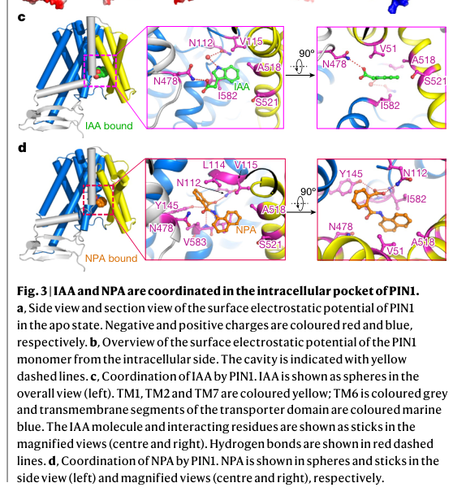

## Question

# Gene Research for Functional Annotation

## ⚠️ CRITICAL: Gene/Protein Identification Context

**BEFORE YOU BEGIN RESEARCH:** You MUST verify you are researching the CORRECT gene/protein. Gene symbols can be ambiguous, especially for less well-characterized genes from non-model organisms.

### Target Gene/Protein Identity (from UniProt):
- **UniProt Accession:** Q9C6B8
- **Protein Description:** RecName: Full=Auxin efflux carrier component 1 {ECO:0000303|PubMed:9856939}; AltName: Full=Protein PIN-FORMED {ECO:0000303|PubMed:9856939}; Short=AtPIN1 {ECO:0000303|PubMed:9856939};
- **Gene Information:** Name=PIN1 {ECO:0000303|PubMed:9856939}; OrderedLocusNames=At1g73590 {ECO:0000312|Araport:AT1G73590}; ORFNames=F6D5.2 {ECO:0000312|EMBL:AAG51807.1};
- **Organism (full):** Arabidopsis thaliana (Mouse-ear cress).
- **Protein Family:** Belongs to the auxin efflux carrier (TC 2.A.69.1) family.
- **Key Domains:** Auxin_eff_plant. (IPR014024); Auxin_Efflux_Carrier. (IPR051107); Mem_transp_PIN-like. (IPR004776); Mem_trans (PF03547)

### MANDATORY VERIFICATION STEPS:

1. **Check if the gene symbol "PIN1" matches the protein description above**
2. **Verify the organism is correct:** Arabidopsis thaliana (Mouse-ear cress).
3. **Check if protein family/domains align with what you find in literature**
4. **If you find literature for a DIFFERENT gene with the same or similar symbol, STOP**

### If Gene Symbol is Ambiguous or You Cannot Find Relevant Literature:

**DO NOT PROCEED WITH RESEARCH ON A DIFFERENT GENE.** Instead:
- State clearly: "The gene symbol 'PIN1' is ambiguous or literature is limited for this specific protein"
- Explain what you found (e.g., "Found extensive literature on a different gene with the same symbol in a different organism")
- Describe the protein based ONLY on the UniProt information provided above
- Suggest that the protein function can be inferred from domain/family information

### Research Target:

Please provide a comprehensive research report on the gene **PIN1** (gene ID: PIN1, UniProt: Q9C6B8) in ARATH.

The research report should be a detailed narrative explaining the function, biological processes, and localization of the gene product. Citations should be given for all claims.

You should prioritize authoritative reviews and primary scientific literature when conducting research. You can supplement
this with annotations you find in gene/protein databases, but these can be outdated or inaccurate.

We are specifically interested in the primary function of the gene - for enzymes, what reaction is catalyzed, and what is the substrate specificity? For transporters, what is the substrate? For structural proteins or adapters, what is the broader structural role? For signaling molecules, what is the role in the pathway.

We are interested in where in or outside the cell the gene product carries out its function.

We are also interested in the signaling or biochemical pathways in which the gene functions. We are less interested in broad pleiotropic effects, except where these elucidate the precise role.

Include evidence where possible. We are interested in both experimental evidence as well as inference from structure, evolution, or bioinformatic analysis. Precise studies should be prioritized over high-throughput, where available.

## Output

Question: You are an expert researcher providing comprehensive, well-cited information.

Provide detailed information focusing on:
1. Key concepts and definitions with current understanding
2. Recent developments and latest research (prioritize 2023-2024 sources)
3. Current applications and real-world implementations
4. Expert opinions and analysis from authoritative sources
5. Relevant statistics and data from recent studies

Format as a comprehensive research report with proper citations. Include URLs and publication dates where available.
Always prioritize recent, authoritative sources and provide specific citations for all major claims.

# Gene Research for Functional Annotation

## ⚠️ CRITICAL: Gene/Protein Identification Context

**BEFORE YOU BEGIN RESEARCH:** You MUST verify you are researching the CORRECT gene/protein. Gene symbols can be ambiguous, especially for less well-characterized genes from non-model organisms.

### Target Gene/Protein Identity (from UniProt):
- **UniProt Accession:** Q9C6B8
- **Protein Description:** RecName: Full=Auxin efflux carrier component 1 {ECO:0000303|PubMed:9856939}; AltName: Full=Protein PIN-FORMED {ECO:0000303|PubMed:9856939}; Short=AtPIN1 {ECO:0000303|PubMed:9856939};
- **Gene Information:** Name=PIN1 {ECO:0000303|PubMed:9856939}; OrderedLocusNames=At1g73590 {ECO:0000312|Araport:AT1G73590}; ORFNames=F6D5.2 {ECO:0000312|EMBL:AAG51807.1};
- **Organism (full):** Arabidopsis thaliana (Mouse-ear cress).
- **Protein Family:** Belongs to the auxin efflux carrier (TC 2.A.69.1) family.
- **Key Domains:** Auxin_eff_plant. (IPR014024); Auxin_Efflux_Carrier. (IPR051107); Mem_transp_PIN-like. (IPR004776); Mem_trans (PF03547)

### MANDATORY VERIFICATION STEPS:

1. **Check if the gene symbol "PIN1" matches the protein description above**
2. **Verify the organism is correct:** Arabidopsis thaliana (Mouse-ear cress).
3. **Check if protein family/domains align with what you find in literature**
4. **If you find literature for a DIFFERENT gene with the same or similar symbol, STOP**

### If Gene Symbol is Ambiguous or You Cannot Find Relevant Literature:

**DO NOT PROCEED WITH RESEARCH ON A DIFFERENT GENE.** Instead:
- State clearly: "The gene symbol 'PIN1' is ambiguous or literature is limited for this specific protein"
- Explain what you found (e.g., "Found extensive literature on a different gene with the same symbol in a different organism")
- Describe the protein based ONLY on the UniProt information provided above
- Suggest that the protein function can be inferred from domain/family information

### Research Target:

Please provide a comprehensive research report on the gene **PIN1** (gene ID: PIN1, UniProt: Q9C6B8) in ARATH.

The research report should be a detailed narrative explaining the function, biological processes, and localization of the gene product. Citations should be given for all claims.

You should prioritize authoritative reviews and primary scientific literature when conducting research. You can supplement
this with annotations you find in gene/protein databases, but these can be outdated or inaccurate.

We are specifically interested in the primary function of the gene - for enzymes, what reaction is catalyzed, and what is the substrate specificity? For transporters, what is the substrate? For structural proteins or adapters, what is the broader structural role? For signaling molecules, what is the role in the pathway.

We are interested in where in or outside the cell the gene product carries out its function.

We are also interested in the signaling or biochemical pathways in which the gene functions. We are less interested in broad pleiotropic effects, except where these elucidate the precise role.

Include evidence where possible. We are interested in both experimental evidence as well as inference from structure, evolution, or bioinformatic analysis. Precise studies should be prioritized over high-throughput, where available.

## Research report: Functional annotation of *Arabidopsis thaliana* **PIN1** (UniProt **Q9C6B8**, At1g73590)

### 0) Target verification (critical disambiguation)
The symbol **PIN1** is highly ambiguous across biology; in animals it often denotes a prolyl isomerase. The present target is explicitly the *Arabidopsis thaliana* **PIN-FORMED1** auxin transporter (auxin efflux carrier component 1). The 2022 cryo-EM structural/biochemical study of *A. thaliana* PIN1 explicitly references UniProt accession **Q9C6B8**, and demonstrates PIN1-mediated auxin (IAA) efflux and inhibitor (NPA) binding, matching the UniProt record provided. (yang2022structuralinsightsinto pages 1-2, yang2022structuralinsightsinto pages 4-5)

### 1) Key concepts and definitions (current understanding)

#### 1.1 PIN1 as a canonical PIN auxin exporter
**PIN1** is a **canonical (long-loop) PIN-FORMED auxin efflux carrier** that exports auxin from the cytosol toward the apoplast, thereby enabling **polar auxin transport (PAT)**—directional, cell-to-cell auxin movement that organizes plant development. Canonical long PINs (including PIN1) are predominantly **plasma-membrane localized** and can exhibit **strongly asymmetric (polar) distribution** across distinct plasma-membrane domains, which determines the direction of auxin flow between neighboring cells. (yang2022structuralinsightsinto pages 1-2, luschnig2024over25years pages 2-3)

#### 1.2 Chemiosmotic framework for auxin movement
A widely used conceptual model is the **chemiosmotic hypothesis**: the **apoplast is moderately acidic (~pH 5.5)** while the **cytosol is near neutral (~pH 7.0)**, favoring diffusion of **protonated IAAH** into the cell and trapping auxin as **IAA−** in the cytosol. Export of the anionic form (IAA−) then requires efflux carriers (notably PINs), and **PIN polar localization defines where IAA− exits**, shaping tissue-scale auxin gradients and maxima. (luschnig2024over25years pages 2-3)

#### 1.3 Molecular function (substrate)
Structural and biochemical evidence directly supports **indole-3-acetic acid (IAA)** as a **direct ligand/substrate** for PIN1. PIN1 contains an **intracellular binding pocket** that coordinates IAA through hydrophobic and hydrogen-bond interactions; this provides a molecular definition of PIN1’s substrate recognition. (yang2022structuralinsightsinto pages 1-2, yang2022structuralinsightsinto pages 4-5)

### 2) Molecular mechanism and quantitative biochemical evidence

#### 2.1 Cryo-EM structures and binding pocket chemistry
Arabidopsis PIN1 was solved in multiple inward-facing conformations (apo, IAA-bound, NPA-bound), revealing a conserved transporter fold and a defined intracellular binding pocket that coordinates IAA. (yang2022structuralinsightsinto pages 1-2)

A key quantitative result is ligand binding affinity measured by ITC at pH 7.0:
- **IAA–PIN1 Kd = 83 ± 10 μM**
- **NPA–PIN1 Kd = 0.15 ± 0.08 μM**
Thus, the inhibitor **NPA binds several hundred-fold more tightly** than IAA and competes for the same binding pocket. (yang2022structuralinsightsinto pages 4-4, yang2022structuralinsightsinto media 2cf96299)

Mutational analyses identify residues critical for recognition/transport: for example, mutations in pocket-coordinating residues can prevent IAA binding, markedly increase cellular [3H]IAA retention, and decrease net efflux (e.g., effects reported for variants including N112A/I582A and transport-impairing mutants such as R547A/Q580A). (yang2022structuralinsightsinto pages 4-5, yang2022structuralinsightsinto pages 4-4)

#### 2.2 Transport model and energetics (current consensus and open questions)
Across PIN-family structural studies, an **elevator-like alternating-access** mechanism is supported, with conformational transitions moving the substrate-binding site from the cytosolic side toward the non-cytosolic side. (ung2022structuresandmechanism pages 1-2, ung2022structuresandmechanism pages 4-5)

Energetically, available biochemical systems support transport that is **largely independent of classical proton/ion gradients**:
- In the PIN1 study, relative [3H]IAA retention did not differ significantly between **pH 5.5 and 6.5** in the referenced assay, suggesting no strong pH-gradient dependence under those conditions. (yang2022structuralinsightsinto pages 4-5)
- For a related PIN structure/function dataset, activity was reported as minimally pH dependent and consistent with a **uniport-like** mechanism. (ung2022structuresandmechanism pages 4-5, ung2022structuresandmechanism pages 1-2)

However, expert synthesis emphasizes that the **energy source for PIN1-mediated transport in vivo remains unresolved**, and mechanistic coupling could be context-dependent in planta. (yang2022structuralinsightsinto pages 4-5)

### 3) Subcellular localization and where PIN1 acts

#### 3.1 Plasma membrane polarity as a functional determinant
PIN1 is a plasma-membrane localized auxin exporter whose **polar distribution** is central to its function. In vascular tissues and the root stele, PIN1 is frequently described as **basally localized**, aligning with directional auxin transport routes and supporting tissue-scale patterning. (luschnig2024over25years pages 4-5, luschnig2024over25years pages 2-3)

#### 3.2 Expression/tissue context
PIN1 is described as broadly important in **embryos, apical meristems, vascular tissues, and developing organs**. Loss of function leads to characteristic **organ initiation defects** (notably naked “pin-like” inflorescences), consistent with PIN1’s role in generating auxin maxima that specify sites of organogenesis. (yang2022structuralinsightsinto pages 1-2, reiter2025ovuledefectsin pages 12-15)

### 4) Biological processes and pathway context (PIN1-centered)

#### 4.1 Organ initiation and phyllotactic patterning
PIN1’s polar transport contributes to **local auxin maxima** that specify where new organs initiate in shoots/flowers. pin1 mutants exhibit severe organ initiation failures, producing “pin-like” stems with reduced or absent flowers/organs, supporting a causal link between PIN1-mediated PAT and organogenesis. (reiter2025ovuledefectsin pages 12-15, reiter2025ovuledefectsin pages 15-19)

A 2024 quantitative modeling + experimental study links robustness of primordium initiation to PIN1 **repolarization dynamics**: the model explains phenotypes via CUC1-mediated effects on PIN1 repolarization, connecting PIN1 polarization kinetics to the number/position of auxin maxima in developing floral buds. (kong2024tradeoffbetweenspeed pages 9-10)

#### 4.2 Vascular patterning and canalization
Expert synthesis identifies PIN1 as a major contributor to **vascular tissue patterning** and auxin “canalization”-like processes underlying vein formation, consistent with long-standing conceptual models where directed auxin efflux reinforces provascular strands. (luschnig2024over25years pages 8-9, luschnig2024over25years pages 2-3)

#### 4.3 Reproductive development (gynoecium/ovules)
PIN1-mediated PAT is implicated in **gynoecium patterning, carpel/ovule initiation, and megagametogenesis**, supported by observed PIN1 localization in developing ovule-related tissues and by phenotypes induced through pharmacological manipulation of PAT. In particular, application of the auxin transport inhibitor **NPA** can shift auxin gradients and produce morphological alterations in gynoecial tissues (e.g., style/stigma changes and altered carpel valve formation), connecting auxin efflux modulation to reproductive morphology and (indirectly) seed-setting capacity. (reiter2025ovuledefectsin pages 35-38)

### 5) Regulation of PIN1 activity, polarity, abundance, and trafficking

#### 5.1 Phosphorylation and kinase control (expert consensus)
PIN1 function is regulated by phosphorylation in its long cytosolic loop, with different kinase modules tuning either polarity sorting or transport activity. A key experimentally supported example is that **D6PK activates PIN1** in heterologous [3H]IAA efflux assays, indicating that kinase co-expression can increase functional efflux. (yang2022structuralinsightsinto pages 1-2)

High-level expert synthesis (2024) further describes how AGCVIII kinases (e.g., PID/WAG, D6PK, and context-specific modules) modulate PIN polarity decisions and transport activity, while phosphatases act antagonistically to tune polarity states. (luschnig2024over25years pages 5-6, luschnig2024over25years pages 4-5)

#### 5.2 Trafficking, recycling, and turnover
PIN1 polarity is maintained by **endocytosis and recycling**; ARF-GEF–dependent recycling (notably GNOM) is described as important for maintaining basal targeting of PINs. (luschnig2024over25years pages 4-5)

Ubiquitin-linked vacuolar targeting is also emphasized as a mechanism regulating PIN abundance (e.g., reversible K63-linked polyubiquitination promoting vacuolar turnover), integrating signaling with transporter lifetime at the plasma membrane. (luschnig2024over25years pages 5-6)

#### 5.3 Recent developments (prioritized 2023–2024)

**(i) 2023: Phosphoinositide–peptide signaling hub controlling PIN1 patterns in protophloem**
A 2023 *Nature Communications* study connected **CLE45 peptide signaling (BAM3 receptor)**, **RLCK-VII/PBL kinases**, and **phosphoinositide 5-kinases (PIP5K)** to regulation of auxin efflux through dynamic control of PIN patterning/abundance in developing protophloem sieve elements. Quantitative imaging analyses were performed at substantial scale (e.g., **n = 19–51 roots, 210–540 PPSEs per genotype**, with **p < 0.0001** for reported comparisons), supporting the conclusion that these signaling/ lipid modules converge on local PIN control. (wang2023aphosphoinositidehub pages 7-8, wang2023aphosphoinositidehub pages 1-2)

**(ii) 2024: ENHANCER OF PINOID (ENP) as a PIN1-supporting/recruiting factor**
A 2024 preprint provides evidence that ENP contains separable domains for its own polarization versus **supporting PIN1 function**, with an intrinsically disordered region that interacts with PIN cytosolic regions (via FLIM-FRET evidence) and is required to support PIN1 activity/recruitment at apical plasma-membrane domains; genetic interactions (enp pid) suggest PID-independent inputs into PIN1 functional polarity. (matthes2024separatedomainsof pages 1-6)

**(iii) 2024: Field-level synthesis of PIN biology**
A 2024 *Nature Communications* review summarizes “25 years” of progress and frames PIN1 as a master regulator whose activity emerges from coordinated control of **expression, phosphorylation, trafficking, clustering, and degradation**, integrating environmental and endogenous signals into developmental patterning. (luschnig2024over25years pages 1-2, luschnig2024over25years pages 5-6)

### 6) Current applications and real-world implementations

#### 6.1 Chemical perturbation of PIN1/PAT (NPA as a tool and prototype)
The auxin transport inhibitor **NPA** is widely used experimentally to manipulate PAT; authoritative synthesis notes that NPA treatment of wild-type plants can **phenocopy pin1 developmental defects**, making it a practical tool to functionally interrogate PIN1-mediated transport. (luschnig2024over25years pages 1-2)

At the molecular level, the resolved PIN1 binding pocket and the quantitative affinity gap between IAA and NPA (Kd 83 μM vs 0.15 μM) provide a rationale for NPA’s potency and a framework for designing/optimizing transport modulators. (yang2022structuralinsightsinto pages 4-4, yang2022structuralinsightsinto media 2cf96299)

#### 6.2 Reporter- and imaging-based implementation
A 2023 study deployed **PIN1-GFP** (and multiple CITRINE-tagged pathway components) as quantitative reporters in vivo to track protein polarity/abundance dynamics in specific tissues (protophloem), exemplifying a real-world implementation pipeline for monitoring PIN1 behavior under genetic and peptide perturbations. (wang2023aphosphoinositidehub pages 1-2)

#### 6.3 Structure-enabled engineering and screening paradigms
The PIN1 structure defines a concrete set of residues governing binding and efflux, and the authors explicitly position the structure as a framework for structure-based functional analysis and the design of auxin analogues/inhibitors relevant to agriculture. (yang2022structuralinsightsinto pages 4-5)

### 7) Expert opinions and analysis (authoritative synthesis)
Two high-authority Nature-family sources provide field-level consensus:
- The 2024 review emphasizes that PIN-mediated development arises from a regulated network of PIN expression, localization, and activity and that PIN1’s polar localization provides a plant-specific mechanism for directional distribution of the major coordinative signal auxin. (luschnig2024over25years pages 1-2, luschnig2024over25years pages 2-3)
- The 2022 structural work advances the field from phenomenological models toward a molecular mechanism by defining the IAA/NPA binding pocket and supporting an alternating-access model, while explicitly noting unresolved questions about energy coupling in vivo. (yang2022structuralinsightsinto pages 1-2, yang2022structuralinsightsinto pages 4-5)

### 8) Recent statistics and quantitative data highlights
Key quantitative/statistical datapoints from recent studies include:
- **Ligand affinities (ITC, pH 7.0):** IAA Kd = **83 ± 10 μM**; NPA Kd = **0.15 ± 0.08 μM**. (yang2022structuralinsightsinto pages 4-4, yang2022structuralinsightsinto media 2cf96299)
- **Protophloem imaging quantification sample sizes:** **n = 19–51 roots** and **210–540 PPSEs per genotype**, with **p < 0.0001** for reported comparisons of localization/abundance metrics in the CLE45–PIP5K–rheostat–PIN regulatory context. (wang2023aphosphoinositidehub pages 7-8)
- **Structural resolutions/scale (cryo-EM):** PIN1 structures captured at ~**3.1–3.2 Å** with hundreds of thousands of particles contributing to reconstructions across apo/IAA/NPA states. (yang2022structuralinsightsinto pages 6-7)

### 9) Summary table of key findings (with URLs and dates)
The following table consolidates the most important functional annotation points and recent developments:

| Topic | Key takeaways | Key evidence | Key recent sources | URL |
|---|---|---|---|---|
| Definition | Arabidopsis thaliana PIN1 (UniProt Q9C6B8; At1g73590) is the canonical long PIN-FORMED auxin exporter matching the UniProt description for an auxin efflux carrier, not the unrelated animal PIN1 prolyl isomerase. It is a plasma-membrane transporter central to polar auxin transport. (yang2022structuralinsightsinto pages 1-2, luschnig2024over25years pages 2-3, luschnig2024over25years pages 1-2) | Nature structural work explicitly identifies Arabidopsis PIN1 with UniProt Q9C6B8 and shows PIN1-mediated auxin efflux in heterologous assays; reviews describe PIN1/2 as auxin exporters with 10 transmembrane helices and a long hydrophilic loop. Assays included cryo-EM and [3H]IAA efflux in HEK293F cells. (yang2022structuralinsightsinto pages 1-2, luschnig2024over25years pages 2-3) | Luschnig & Friml, 2024 Nov; Yang et al., 2022 Aug | https://doi.org/10.1038/s41467-024-54240-y ; https://doi.org/10.1038/s41586-022-05143-9 |
| Primary function | PIN1’s primary molecular function is auxin export, specifically transport of indole-3-acetic acid (IAA/IAA−) from the cytosol toward the apoplast to establish directional cell-to-cell auxin flow. Long PINs such as PIN1 are the major plasma-membrane auxin efflux carriers. (yang2022structuralinsightsinto pages 1-2, luschnig2024over25years pages 2-3, seifu2004ofthesisbiochemical pages 9-13) | PIN1 is described as the “main PIN auxin exporter” in Arabidopsis; in transport assays, loss or mutation of key residues increases cellular [3H]IAA retention and reduces net efflux. Chemiosmotic context: apoplast ~pH 5.5, cytosol ~pH 7.0, with IAAH diffusion inward and PIN-dependent IAA− export outward. (yang2022structuralinsightsinto pages 4-5, luschnig2024over25years pages 2-3) | Luschnig & Friml, 2024 Nov; Yang et al., 2022 Aug | https://doi.org/10.1038/s41467-024-54240-y ; https://doi.org/10.1038/s41586-022-05143-9 |
| Transport mechanism | Structural studies support an elevator-like alternating-access mechanism for PIN-family auxin transporters, with PIN1 captured in inward-facing apo, IAA-bound, and NPA-bound states. NPA competitively occupies the same intracellular pocket as auxin and locks the transporter in an inward-open state. (yang2022structuralinsightsinto pages 4-5, luschnig2024over25years pages 2-3, ung2022structuresandmechanism pages 1-2) | PIN1 cryo-EM structures were solved at ~3.1–3.2 Å for apo/IAA/NPA states; IAA binds an intracellular pocket coordinated by residues including V51, N112, N478, I582. For the related PIN8 family structure, transporter domains rotate ~20° and move the binding site ~5 Å, supporting the elevator model. (yang2022structuralinsightsinto pages 4-5, yang2022structuralinsightsinto pages 6-7, ung2022structuresandmechanism pages 3-4, ung2022structuresandmechanism pages 4-5) | Luschnig & Friml, 2024 Nov; Yang et al., 2022 Aug; Ung et al., 2022 Jun | https://doi.org/10.1038/s41467-024-54240-y ; https://doi.org/10.1038/s41586-022-05143-9 ; https://doi.org/10.1038/s41586-022-04883-y |
| Substrate specificity and inhibitor pharmacology | PIN1 directly recognizes natural auxin IAA, while N-1-naphthylphthalamic acid (NPA) is a high-affinity competitive inhibitor of the same site. Current structural evidence supports IAA as the principal demonstrated substrate. (yang2022structuralinsightsinto pages 4-4, yang2022structuralinsightsinto pages 4-5, yang2022structuralinsightsinto media 2cf96299) | ITC at pH 7.0: PIN1 binds IAA with Kd = 83 ± 10 µM and NPA with Kd = 0.15 ± 0.08 µM, showing several-hundred-fold tighter binding of NPA. V51A raised IAA Kd to 1.39 mM (~17-fold weaker than WT); N112A and I582A prevented IAA binding, and Y145A impaired both IAA transport and NPA inhibition. (yang2022structuralinsightsinto pages 4-4, yang2022structuralinsightsinto pages 4-5, yang2022structuralinsightsinto media 2cf96299) | Yang et al., 2022 Aug | https://doi.org/10.1038/s41586-022-05143-9 |
| Energetics | PIN-family transport appears largely independent of classical proton or ion gradients in available biochemical systems, although the in vivo energy source for PIN1 remains unresolved. Expert synthesis therefore favors a uniport-like mechanism but does not fully exclude context-dependent coupling in planta. (yang2022structuralinsightsinto pages 4-5, ung2022structuresandmechanism pages 4-5, ung2022structuresandmechanism pages 1-2) | For PIN1, no significant difference in relative [3H]IAA retention was observed between pH 5.5 and 6.5 in the cited assay. For PIN8, activity was reported as minimally pH-dependent, insensitive to proton-motive-force decouplers, and retained in sodium- or potassium-exclusive buffers; authors concluded the data support a uniport mechanism. (yang2022structuralinsightsinto pages 4-5, ung2022structuresandmechanism pages 4-5, ung2022structuresandmechanism pages 1-2) | Luschnig & Friml, 2024 Nov; Yang et al., 2022 Aug; Ung et al., 2022 Jun | https://doi.org/10.1038/s41467-024-54240-y ; https://doi.org/10.1038/s41586-022-05143-9 ; https://doi.org/10.1038/s41586-022-04883-y |
| Localization | PIN1 is a canonical long PIN predominantly localized asymmetrically at the plasma membrane, especially with basal polarity in vascular tissues and dynamic localization in shoot meristems and developing organs. Its polar localization determines auxin flow direction. (yang2022structuralinsightsinto pages 1-2, luschnig2024over25years pages 2-3, luschnig2024over25years pages 3-4) | Reviews highlight basal PIN1 localization in stem vasculature matching known auxin transport routes; PIN1 is widely expressed in embryos, meristems, and vascular tissues. Long PINs localize to the PM and are dynamically regulated by endocytosis and recycling. (yang2022structuralinsightsinto pages 1-2, luschnig2024over25years pages 2-3) | Luschnig & Friml, 2024 Nov; Yang et al., 2022 Aug | https://doi.org/10.1038/s41467-024-54240-y ; https://doi.org/10.1038/s41586-022-05143-9 |
| Regulation: phosphorylation and trafficking | PIN1 polarity, abundance, and activity are tightly regulated by phosphorylation and membrane trafficking. PID/WAG kinases bias apical sorting/polarity, D6PK stimulates transport activity, GNOM-dependent trafficking maintains polar domains, and ubiquitin/vacuolar pathways tune turnover. (luschnig2024over25years pages 5-6, bilanovicovaUnknownyearfacultyofscience pages 21-24, luschnig2024over25years pages 3-4, yang2022structuralinsightsinto pages 1-2) | PID/WAG target conserved hydrophilic-loop phosphosites and can shift PIN1 from basal to apical localization; pid mutants phenocopy pin1-like naked inflorescences. D6PK activates PIN1 in HEK293F [3H]IAA efflux assays. Brefeldin A-sensitive GNOM controls recycling; reversible K63-linked polyubiquitination promotes vacuolar targeting. (bilanovicovaUnknownyearfacultyofscience pages 21-24, luschnig2024over25years pages 5-6, yang2022structuralinsightsinto pages 1-2) | Luschnig & Friml, 2024 Nov; Wang et al., 2023 Jan; Yang et al., 2022 Aug | https://doi.org/10.1038/s41467-024-54240-y ; https://doi.org/10.1038/s41467-023-36200-0 ; https://doi.org/10.1038/s41586-022-05143-9 |
| Recent regulation advances (2023-2024) | Recent work links PIN1 control to phosphoinositide signaling, CLE peptide signaling, and ENHANCER OF PINOID (ENP), refining the view that PIN1 behavior is embedded in multiprotein polarity modules rather than controlled by phosphorylation alone. (wang2023aphosphoinositidehub pages 2-3, wang2023aphosphoinositidehub pages 1-2, wang2023aphosphoinositidehub pages 7-8, matthes2024separatedomainsof pages 1-6) | In developing protophloem, CLE45-BAM3-PBL signaling antagonizes PIP5K-dependent phosphoinositide control of PAX/BRX rheostat polarity, thereby affecting PIN1 patterning; imaging quantification used n = 19–51 roots and 210–540 PPSEs per genotype, with p < 0.0001 in reported comparisons. ENP bioRxiv 2024 showed its IDR interacts with PINs and is required to recruit/support PIN1 at apical PM domains; enp pid double mutants lacked cotyledons and flowers. (wang2023aphosphoinositidehub pages 2-3, wang2023aphosphoinositidehub pages 7-8, matthes2024separatedomainsof pages 1-6) | Wang et al., 2023 Jan 27; Matthes et al., 2024 Mar 11; Luschnig & Friml, 2024 Nov | https://doi.org/10.1038/s41467-023-36200-0 ; https://doi.org/10.1101/2024.03.11.584374 ; https://doi.org/10.1038/s41467-024-54240-y |
| Developmental roles | PIN1 is a master regulator of auxin-dependent patterning in embryogenesis, organ initiation, phyllotaxis, vascular formation/canalization, and reproductive development. Its developmental effects are best explained by its role in creating local auxin maxima and directional fluxes. (luschnig2024over25years pages 8-9, luschnig2024over25years pages 4-5, kong2024tradeoffbetweenspeed pages 9-10) | pin1 loss-of-function mutants produce naked, pin-like inflorescences or sterile stems lacking normal flowers; pid mutants show a similar phenotype. Reviews and modeling connect PIN1 to organ initiation, lateral organ positioning, embryonic axis formation, vascular patterning, and female gametophyte development. (luschnig2024over25years pages 8-9, luschnig2024over25years pages 4-5, reiter2025ovuledefectsin pages 12-15, luschnig2024over25years pages 3-4) | Kong et al., 2024 Jul; Luschnig & Friml, 2024 Nov | https://doi.org/10.1038/s41467-024-50172-9 ; https://doi.org/10.1038/s41467-024-54240-y |
| Reproductive and ovule-associated roles | PIN1-mediated auxin transport contributes to gynoecium, carpel, and ovule patterning, linking sporophytic auxin transport to seed-setting capacity. In these contexts, localization and transport inhibition studies support a spatial patterning role rather than a direct enzymatic one. (reiter2025ovuledefectsin pages 35-38) | PIN1 localizes in ovule primordia, developing nucellus, and funiculus. NPA treatment altered carpel auxin gradients and caused increased stigma/style elongation, basalized style/ovary boundary, reduced ovary production, fewer carpel valves, and altered ovule initiation along the placenta. (reiter2025ovuledefectsin pages 35-38) | Reiter, 2025; synthesized against 2024 review context | N/A |
| Applications and real-world implementation | Direct translational deployment of AtPIN1 itself was not demonstrated in the gathered Arabidopsis-specific sources, but the evidence supports PIN1 as a validated mechanistic target for engineering plant architecture through auxin transport control. Real-world implementation in this evidence base is strongest at the level of chemical inhibition (NPA) and developmental modeling/reporter systems. (yang2022structuralinsightsinto pages 4-5, kong2024tradeoffbetweenspeed pages 9-10, wang2023aphosphoinositidehub pages 2-3) | Practical implementations in the gathered studies include use of NPA to manipulate auxin transport and morphology, pPIN1::PIN1-GFP reporter lines to monitor polarity, and quantitative image-based protophloem analyses with large sample sizes. Structural resolution of the IAA/NPA pocket provides a framework for future rational modulation of auxin transport. (reiter2025ovuledefectsin pages 35-38, kong2024tradeoffbetweenspeed pages 9-10, wang2023aphosphoinositidehub pages 2-3, yang2022structuralinsightsinto media 2cf96299) | Wang et al., 2023 Jan 27; Kong et al., 2024 Jul 18; Luschnig & Friml, 2024 Nov; Yang et al., 2022 Aug | https://doi.org/10.1038/s41467-023-36200-0 ; https://doi.org/10.1038/s41467-024-50172-9 ; https://doi.org/10.1038/s41467-024-54240-y ; https://doi.org/10.1038/s41586-022-05143-9 |

*Table: This table summarizes the verified identity, function, mechanism, regulation, localization, developmental roles, and application-relevant findings for Arabidopsis thaliana PIN1 (Q9C6B8). It prioritizes 2023-2024 sources where available and includes quantitative evidence such as binding affinities, assay types, and sample sizes.*

### 10) Figures supporting binding pocket and affinity claims
The structural binding pocket (IAA vs NPA) and ITC affinity plots were extracted from the PIN1 structural study figures; these directly support the quantitative claims above. (yang2022structuralinsightsinto media 2cf96299, yang2022structuralinsightsinto media 46dbabc4, yang2022structuralinsightsinto media eb31d734)

### Key citations (with publication dates and URLs)
- Yang Z. et al. **Structural insights into auxin recognition and efflux by Arabidopsis PIN1**. *Nature* (Aug 2022). https://doi.org/10.1038/s41586-022-05143-9 (yang2022structuralinsightsinto pages 1-2, yang2022structuralinsightsinto pages 4-4)
- Wang Q. et al. **A phosphoinositide hub connects CLE peptide signaling and polar auxin efflux regulation**. *Nature Communications* (Jan 2023). https://doi.org/10.1038/s41467-023-36200-0 (wang2023aphosphoinositidehub pages 1-2, wang2023aphosphoinositidehub pages 7-8)
- Kong S. et al. **Tradeoff between speed and robustness in primordium initiation mediated by auxin-CUC1 interaction**. *Nature Communications* (Jul 2024). https://doi.org/10.1038/s41467-024-50172-9 (kong2024tradeoffbetweenspeed pages 9-10)
- Luschnig C., Friml J. **Over 25 years of decrypting PIN-mediated plant development**. *Nature Communications* (Nov 2024). https://doi.org/10.1038/s41467-024-54240-y (luschnig2024over25years pages 1-2, luschnig2024over25years pages 5-6)
- Matthes M.S. et al. **Separate domains of the Arabidopsis ENHANCER OF PINOID drive its own polarization and recruit PIN1 to the plasma membrane**. *bioRxiv* (Mar 11, 2024). https://doi.org/10.1101/2024.03.11.584374 (matthes2024separatedomainsof pages 1-6)

References

1. (yang2022structuralinsightsinto pages 1-2): Zhisen Yang, Jing Xia, Jingjing Hong, Chenxi Zhang, Hong Wei, Wei Ying, Chunqiao Sun, Lianghanxiao Sun, Yanbo Mao, Yongxiang Gao, Shutang Tan, Jiří Friml, Dianfan Li, Xin Liu, and Linfeng Sun. Structural insights into auxin recognition and efflux by arabidopsis pin1. Nature, 609:611-615, Aug 2022. URL: https://doi.org/10.1038/s41586-022-05143-9, doi:10.1038/s41586-022-05143-9. This article has 148 citations and is from a highest quality peer-reviewed journal.

2. (yang2022structuralinsightsinto pages 4-5): Zhisen Yang, Jing Xia, Jingjing Hong, Chenxi Zhang, Hong Wei, Wei Ying, Chunqiao Sun, Lianghanxiao Sun, Yanbo Mao, Yongxiang Gao, Shutang Tan, Jiří Friml, Dianfan Li, Xin Liu, and Linfeng Sun. Structural insights into auxin recognition and efflux by arabidopsis pin1. Nature, 609:611-615, Aug 2022. URL: https://doi.org/10.1038/s41586-022-05143-9, doi:10.1038/s41586-022-05143-9. This article has 148 citations and is from a highest quality peer-reviewed journal.

3. (luschnig2024over25years pages 2-3): Christian Luschnig and Jiří Friml. Over 25 years of decrypting pin-mediated plant development. Nature Communications, Nov 2024. URL: https://doi.org/10.1038/s41467-024-54240-y, doi:10.1038/s41467-024-54240-y. This article has 42 citations and is from a highest quality peer-reviewed journal.

4. (yang2022structuralinsightsinto pages 4-4): Zhisen Yang, Jing Xia, Jingjing Hong, Chenxi Zhang, Hong Wei, Wei Ying, Chunqiao Sun, Lianghanxiao Sun, Yanbo Mao, Yongxiang Gao, Shutang Tan, Jiří Friml, Dianfan Li, Xin Liu, and Linfeng Sun. Structural insights into auxin recognition and efflux by arabidopsis pin1. Nature, 609:611-615, Aug 2022. URL: https://doi.org/10.1038/s41586-022-05143-9, doi:10.1038/s41586-022-05143-9. This article has 148 citations and is from a highest quality peer-reviewed journal.

5. (yang2022structuralinsightsinto media 2cf96299): Zhisen Yang, Jing Xia, Jingjing Hong, Chenxi Zhang, Hong Wei, Wei Ying, Chunqiao Sun, Lianghanxiao Sun, Yanbo Mao, Yongxiang Gao, Shutang Tan, Jiří Friml, Dianfan Li, Xin Liu, and Linfeng Sun. Structural insights into auxin recognition and efflux by arabidopsis pin1. Nature, 609:611-615, Aug 2022. URL: https://doi.org/10.1038/s41586-022-05143-9, doi:10.1038/s41586-022-05143-9. This article has 148 citations and is from a highest quality peer-reviewed journal.

6. (ung2022structuresandmechanism pages 1-2): Kien Lam Ung, Mikael Winkler, Lukas Schulz, Martina Kolb, Dorina P. Janacek, Emil Dedic, David L. Stokes, Ulrich Z. Hammes, and Bjørn Panyella Pedersen. Structures and mechanism of the plant pin-formed auxin transporter. Nature, 609:605-610, Jun 2022. URL: https://doi.org/10.1038/s41586-022-04883-y, doi:10.1038/s41586-022-04883-y. This article has 164 citations and is from a highest quality peer-reviewed journal.

7. (ung2022structuresandmechanism pages 4-5): Kien Lam Ung, Mikael Winkler, Lukas Schulz, Martina Kolb, Dorina P. Janacek, Emil Dedic, David L. Stokes, Ulrich Z. Hammes, and Bjørn Panyella Pedersen. Structures and mechanism of the plant pin-formed auxin transporter. Nature, 609:605-610, Jun 2022. URL: https://doi.org/10.1038/s41586-022-04883-y, doi:10.1038/s41586-022-04883-y. This article has 164 citations and is from a highest quality peer-reviewed journal.

8. (luschnig2024over25years pages 4-5): Christian Luschnig and Jiří Friml. Over 25 years of decrypting pin-mediated plant development. Nature Communications, Nov 2024. URL: https://doi.org/10.1038/s41467-024-54240-y, doi:10.1038/s41467-024-54240-y. This article has 42 citations and is from a highest quality peer-reviewed journal.

9. (reiter2025ovuledefectsin pages 12-15): JW Reiter. Ovule defects in arabidopsis thaliana pin localization pathway mutants lead to reduced seed set. Unknown journal, 2025.

10. (reiter2025ovuledefectsin pages 15-19): JW Reiter. Ovule defects in arabidopsis thaliana pin localization pathway mutants lead to reduced seed set. Unknown journal, 2025.

11. (kong2024tradeoffbetweenspeed pages 9-10): Shuyao Kong, Mingyuan Zhu, David Pan, Brendan Lane, Richard S. Smith, and Adrienne H. K. Roeder. Tradeoff between speed and robustness in primordium initiation mediated by auxin-cuc1 interaction. Nature Communications, Jul 2024. URL: https://doi.org/10.1038/s41467-024-50172-9, doi:10.1038/s41467-024-50172-9. This article has 18 citations and is from a highest quality peer-reviewed journal.

12. (luschnig2024over25years pages 8-9): Christian Luschnig and Jiří Friml. Over 25 years of decrypting pin-mediated plant development. Nature Communications, Nov 2024. URL: https://doi.org/10.1038/s41467-024-54240-y, doi:10.1038/s41467-024-54240-y. This article has 42 citations and is from a highest quality peer-reviewed journal.

13. (reiter2025ovuledefectsin pages 35-38): JW Reiter. Ovule defects in arabidopsis thaliana pin localization pathway mutants lead to reduced seed set. Unknown journal, 2025.

14. (luschnig2024over25years pages 5-6): Christian Luschnig and Jiří Friml. Over 25 years of decrypting pin-mediated plant development. Nature Communications, Nov 2024. URL: https://doi.org/10.1038/s41467-024-54240-y, doi:10.1038/s41467-024-54240-y. This article has 42 citations and is from a highest quality peer-reviewed journal.

15. (wang2023aphosphoinositidehub pages 7-8): Qian Wang, A. Cecilia Aliaga Fandino, Moritz Graeff, Thomas A. DeFalco, Cyril Zipfel, and Christian S. Hardtke. A phosphoinositide hub connects cle peptide signaling and polar auxin efflux regulation. Nature Communications, Jan 2023. URL: https://doi.org/10.1038/s41467-023-36200-0, doi:10.1038/s41467-023-36200-0. This article has 25 citations and is from a highest quality peer-reviewed journal.

16. (wang2023aphosphoinositidehub pages 1-2): Qian Wang, A. Cecilia Aliaga Fandino, Moritz Graeff, Thomas A. DeFalco, Cyril Zipfel, and Christian S. Hardtke. A phosphoinositide hub connects cle peptide signaling and polar auxin efflux regulation. Nature Communications, Jan 2023. URL: https://doi.org/10.1038/s41467-023-36200-0, doi:10.1038/s41467-023-36200-0. This article has 25 citations and is from a highest quality peer-reviewed journal.

17. (matthes2024separatedomainsof pages 1-6): Michaela S. Matthes, Nicole Yun, Miriam Luichtl, Ulrich Büschges, Birgit S. Fiesselmann, Benjamin Strickland, Marietta S. Lehnardt, and Ramon A. Torres Ruiz. Separate domains of the arabidopsis enhancer of pinoid drive its own polarization and recruit pin1 to the plasma membrane. bioRxiv, Mar 2024. URL: https://doi.org/10.1101/2024.03.11.584374, doi:10.1101/2024.03.11.584374. This article has 1 citations.

18. (luschnig2024over25years pages 1-2): Christian Luschnig and Jiří Friml. Over 25 years of decrypting pin-mediated plant development. Nature Communications, Nov 2024. URL: https://doi.org/10.1038/s41467-024-54240-y, doi:10.1038/s41467-024-54240-y. This article has 42 citations and is from a highest quality peer-reviewed journal.

19. (yang2022structuralinsightsinto pages 6-7): Zhisen Yang, Jing Xia, Jingjing Hong, Chenxi Zhang, Hong Wei, Wei Ying, Chunqiao Sun, Lianghanxiao Sun, Yanbo Mao, Yongxiang Gao, Shutang Tan, Jiří Friml, Dianfan Li, Xin Liu, and Linfeng Sun. Structural insights into auxin recognition and efflux by arabidopsis pin1. Nature, 609:611-615, Aug 2022. URL: https://doi.org/10.1038/s41586-022-05143-9, doi:10.1038/s41586-022-05143-9. This article has 148 citations and is from a highest quality peer-reviewed journal.

20. (seifu2004ofthesisbiochemical pages 9-13): YW Seifu. Of thesis: biochemical and structural insights into pin-mediated auxin. Unknown journal, 2004.

21. (ung2022structuresandmechanism pages 3-4): Kien Lam Ung, Mikael Winkler, Lukas Schulz, Martina Kolb, Dorina P. Janacek, Emil Dedic, David L. Stokes, Ulrich Z. Hammes, and Bjørn Panyella Pedersen. Structures and mechanism of the plant pin-formed auxin transporter. Nature, 609:605-610, Jun 2022. URL: https://doi.org/10.1038/s41586-022-04883-y, doi:10.1038/s41586-022-04883-y. This article has 164 citations and is from a highest quality peer-reviewed journal.

22. (luschnig2024over25years pages 3-4): Christian Luschnig and Jiří Friml. Over 25 years of decrypting pin-mediated plant development. Nature Communications, Nov 2024. URL: https://doi.org/10.1038/s41467-024-54240-y, doi:10.1038/s41467-024-54240-y. This article has 42 citations and is from a highest quality peer-reviewed journal.

23. (bilanovicovaUnknownyearfacultyofscience pages 21-24): V Bilanovičová. Faculty of science. Unknown journal, Unknown year.

24. (wang2023aphosphoinositidehub pages 2-3): Qian Wang, A. Cecilia Aliaga Fandino, Moritz Graeff, Thomas A. DeFalco, Cyril Zipfel, and Christian S. Hardtke. A phosphoinositide hub connects cle peptide signaling and polar auxin efflux regulation. Nature Communications, Jan 2023. URL: https://doi.org/10.1038/s41467-023-36200-0, doi:10.1038/s41467-023-36200-0. This article has 25 citations and is from a highest quality peer-reviewed journal.

25. (yang2022structuralinsightsinto media 46dbabc4): Zhisen Yang, Jing Xia, Jingjing Hong, Chenxi Zhang, Hong Wei, Wei Ying, Chunqiao Sun, Lianghanxiao Sun, Yanbo Mao, Yongxiang Gao, Shutang Tan, Jiří Friml, Dianfan Li, Xin Liu, and Linfeng Sun. Structural insights into auxin recognition and efflux by arabidopsis pin1. Nature, 609:611-615, Aug 2022. URL: https://doi.org/10.1038/s41586-022-05143-9, doi:10.1038/s41586-022-05143-9. This article has 148 citations and is from a highest quality peer-reviewed journal.

26. (yang2022structuralinsightsinto media eb31d734): Zhisen Yang, Jing Xia, Jingjing Hong, Chenxi Zhang, Hong Wei, Wei Ying, Chunqiao Sun, Lianghanxiao Sun, Yanbo Mao, Yongxiang Gao, Shutang Tan, Jiří Friml, Dianfan Li, Xin Liu, and Linfeng Sun. Structural insights into auxin recognition and efflux by arabidopsis pin1. Nature, 609:611-615, Aug 2022. URL: https://doi.org/10.1038/s41586-022-05143-9, doi:10.1038/s41586-022-05143-9. This article has 148 citations and is from a highest quality peer-reviewed journal.

## Artifacts

- [Edison artifact artifact-00](PIN1-deep-research-falcon_artifacts/artifact-00.md)

## Citations

1. yang2022structuralinsightsinto pages 1-2
2. yang2022structuralinsightsinto pages 4-5
3. kong2024tradeoffbetweenspeed pages 9-10
4. reiter2025ovuledefectsin pages 35-38
5. matthes2024separatedomainsof pages 1-6
6. wang2023aphosphoinositidehub pages 1-2
7. wang2023aphosphoinositidehub pages 7-8
8. yang2022structuralinsightsinto pages 6-7
9. yang2022structuralinsightsinto pages 4-4
10. ung2022structuresandmechanism pages 1-2
11. ung2022structuresandmechanism pages 4-5
12. reiter2025ovuledefectsin pages 12-15
13. reiter2025ovuledefectsin pages 15-19
14. seifu2004ofthesisbiochemical pages 9-13
15. ung2022structuresandmechanism pages 3-4
16. wang2023aphosphoinositidehub pages 2-3
17. 3H
18. https://doi.org/10.1038/s41467-024-54240-y
19. https://doi.org/10.1038/s41586-022-05143-9
20. https://doi.org/10.1038/s41586-022-04883-y
21. https://doi.org/10.1038/s41467-023-36200-0
22. https://doi.org/10.1101/2024.03.11.584374
23. https://doi.org/10.1038/s41467-024-50172-9
24. https://doi.org/10.1038/s41586-022-05143-9,
25. https://doi.org/10.1038/s41467-024-54240-y,
26. https://doi.org/10.1038/s41586-022-04883-y,
27. https://doi.org/10.1038/s41467-024-50172-9,
28. https://doi.org/10.1038/s41467-023-36200-0,
29. https://doi.org/10.1101/2024.03.11.584374,