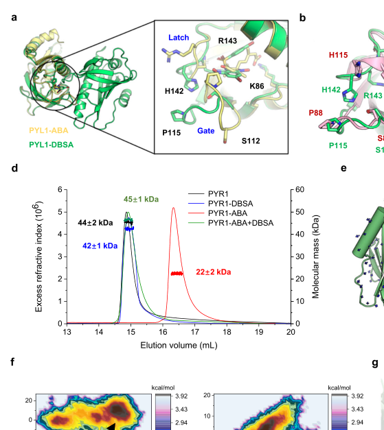

## Question

# Gene Research for Functional Annotation

## ⚠️ CRITICAL: Gene/Protein Identification Context

**BEFORE YOU BEGIN RESEARCH:** You MUST verify you are researching the CORRECT gene/protein. Gene symbols can be ambiguous, especially for less well-characterized genes from non-model organisms.

### Target Gene/Protein Identity (from UniProt):
- **UniProt Accession:** O49686
- **Protein Description:** RecName: Full=Abscisic acid receptor PYR1 {ECO:0000303|PubMed:19624469, ECO:0000303|PubMed:19898494}; AltName: Full=ABI1-binding protein 6 {ECO:0000303|PubMed:19874541}; AltName: Full=Protein PYRABACTIN RESISTANCE 1 {ECO:0000303|PubMed:19624469, ECO:0000303|PubMed:19898494}; AltName: Full=Regulatory components of ABA receptor 11 {ECO:0000303|PubMed:19407143};
- **Gene Information:** Name=PYR1 {ECO:0000303|PubMed:19624469, ECO:0000303|PubMed:19898494}; Synonyms=ABIP6 {ECO:0000303|PubMed:19874541}, RCAR11 {ECO:0000303|PubMed:19407143}; OrderedLocusNames=At4g17870 {ECO:0000312|Araport:AT4G17870}; ORFNames=T6K21.50 {ECO:0000312|EMBL:CAA17130.1};
- **Organism (full):** Arabidopsis thaliana (Mouse-ear cress).
- **Protein Family:** Belongs to the PYR/PYL/RCAR abscisic acid intracellular
- **Key Domains:** Plant_def-hormone_signal. (IPR050279); Polyketide_cyclase/dehydratase. (IPR019587); START-like_dom_sf. (IPR023393); Polyketide_cyc2 (PF10604)

### MANDATORY VERIFICATION STEPS:

1. **Check if the gene symbol "PYR1" matches the protein description above**
2. **Verify the organism is correct:** Arabidopsis thaliana (Mouse-ear cress).
3. **Check if protein family/domains align with what you find in literature**
4. **If you find literature for a DIFFERENT gene with the same or similar symbol, STOP**

### If Gene Symbol is Ambiguous or You Cannot Find Relevant Literature:

**DO NOT PROCEED WITH RESEARCH ON A DIFFERENT GENE.** Instead:
- State clearly: "The gene symbol 'PYR1' is ambiguous or literature is limited for this specific protein"
- Explain what you found (e.g., "Found extensive literature on a different gene with the same symbol in a different organism")
- Describe the protein based ONLY on the UniProt information provided above
- Suggest that the protein function can be inferred from domain/family information

### Research Target:

Please provide a comprehensive research report on the gene **PYR1** (gene ID: PYR1, UniProt: O49686) in ARATH.

The research report should be a detailed narrative explaining the function, biological processes, and localization of the gene product. Citations should be given for all claims.

You should prioritize authoritative reviews and primary scientific literature when conducting research. You can supplement
this with annotations you find in gene/protein databases, but these can be outdated or inaccurate.

We are specifically interested in the primary function of the gene - for enzymes, what reaction is catalyzed, and what is the substrate specificity? For transporters, what is the substrate? For structural proteins or adapters, what is the broader structural role? For signaling molecules, what is the role in the pathway.

We are interested in where in or outside the cell the gene product carries out its function.

We are also interested in the signaling or biochemical pathways in which the gene functions. We are less interested in broad pleiotropic effects, except where these elucidate the precise role.

Include evidence where possible. We are interested in both experimental evidence as well as inference from structure, evolution, or bioinformatic analysis. Precise studies should be prioritized over high-throughput, where available.

## Output

Question: You are an expert researcher providing comprehensive, well-cited information.

Provide detailed information focusing on:
1. Key concepts and definitions with current understanding
2. Recent developments and latest research (prioritize 2023-2024 sources)
3. Current applications and real-world implementations
4. Expert opinions and analysis from authoritative sources
5. Relevant statistics and data from recent studies

Format as a comprehensive research report with proper citations. Include URLs and publication dates where available.
Always prioritize recent, authoritative sources and provide specific citations for all major claims.

# Gene Research for Functional Annotation

## ⚠️ CRITICAL: Gene/Protein Identification Context

**BEFORE YOU BEGIN RESEARCH:** You MUST verify you are researching the CORRECT gene/protein. Gene symbols can be ambiguous, especially for less well-characterized genes from non-model organisms.

### Target Gene/Protein Identity (from UniProt):
- **UniProt Accession:** O49686
- **Protein Description:** RecName: Full=Abscisic acid receptor PYR1 {ECO:0000303|PubMed:19624469, ECO:0000303|PubMed:19898494}; AltName: Full=ABI1-binding protein 6 {ECO:0000303|PubMed:19874541}; AltName: Full=Protein PYRABACTIN RESISTANCE 1 {ECO:0000303|PubMed:19624469, ECO:0000303|PubMed:19898494}; AltName: Full=Regulatory components of ABA receptor 11 {ECO:0000303|PubMed:19407143};
- **Gene Information:** Name=PYR1 {ECO:0000303|PubMed:19624469, ECO:0000303|PubMed:19898494}; Synonyms=ABIP6 {ECO:0000303|PubMed:19874541}, RCAR11 {ECO:0000303|PubMed:19407143}; OrderedLocusNames=At4g17870 {ECO:0000312|Araport:AT4G17870}; ORFNames=T6K21.50 {ECO:0000312|EMBL:CAA17130.1};
- **Organism (full):** Arabidopsis thaliana (Mouse-ear cress).
- **Protein Family:** Belongs to the PYR/PYL/RCAR abscisic acid intracellular
- **Key Domains:** Plant_def-hormone_signal. (IPR050279); Polyketide_cyclase/dehydratase. (IPR019587); START-like_dom_sf. (IPR023393); Polyketide_cyc2 (PF10604)

### MANDATORY VERIFICATION STEPS:

1. **Check if the gene symbol "PYR1" matches the protein description above**
2. **Verify the organism is correct:** Arabidopsis thaliana (Mouse-ear cress).
3. **Check if protein family/domains align with what you find in literature**
4. **If you find literature for a DIFFERENT gene with the same or similar symbol, STOP**

### If Gene Symbol is Ambiguous or You Cannot Find Relevant Literature:

**DO NOT PROCEED WITH RESEARCH ON A DIFFERENT GENE.** Instead:
- State clearly: "The gene symbol 'PYR1' is ambiguous or literature is limited for this specific protein"
- Explain what you found (e.g., "Found extensive literature on a different gene with the same symbol in a different organism")
- Describe the protein based ONLY on the UniProt information provided above
- Suggest that the protein function can be inferred from domain/family information

### Research Target:

Please provide a comprehensive research report on the gene **PYR1** (gene ID: PYR1, UniProt: O49686) in ARATH.

The research report should be a detailed narrative explaining the function, biological processes, and localization of the gene product. Citations should be given for all claims.

You should prioritize authoritative reviews and primary scientific literature when conducting research. You can supplement
this with annotations you find in gene/protein databases, but these can be outdated or inaccurate.

We are specifically interested in the primary function of the gene - for enzymes, what reaction is catalyzed, and what is the substrate specificity? For transporters, what is the substrate? For structural proteins or adapters, what is the broader structural role? For signaling molecules, what is the role in the pathway.

We are interested in where in or outside the cell the gene product carries out its function.

We are also interested in the signaling or biochemical pathways in which the gene functions. We are less interested in broad pleiotropic effects, except where these elucidate the precise role.

Include evidence where possible. We are interested in both experimental evidence as well as inference from structure, evolution, or bioinformatic analysis. Precise studies should be prioritized over high-throughput, where available.

## Research report: Arabidopsis thaliana PYR1 (UniProt O49686; At4g17870; RCAR11/ABIP6)

### 0) Target verification (critical disambiguation)
The UniProt accession **O49686** corresponds to *Arabidopsis thaliana* **PYR1** (aliases **RCAR11**, **ABIP6**), the founding member of the **PYR/PYL/RCAR** family of soluble intracellular **abscisic acid (ABA) receptors** discovered through **pyrabactin resistance** screens. Multiple independent primary studies explicitly define Arabidopsis **PYR1** as an ABA receptor that binds (+)-ABA and regulates ABA signaling through PP2C inhibition, matching the protein description, organism, and family/domain context provided. (park2009abscisicacidinhibits pages 2-4, nishimura2009structuralmechanismof pages 2-4, nishimura2009structuralmechanismof pages 1-2)

### 1) Key concepts and definitions (current understanding)

#### 1.1 Core ABA signaling module involving PYR1
The current canonical model for ABA perception in vascular plants is a **ternary complex** in which **ABA-bound PYR/PYL/RCAR receptors** bind and **inhibit clade A PP2C phosphatases**, releasing **SnRK2 kinases** from PP2C-mediated repression and enabling phosphorylation-driven ABA responses (e.g., gene expression programs, stomatal closure, growth inhibition, seed dormancy). (kim2024regulatorynetworksin pages 3-5, umezawa2010molecularbasisof pages 10-11)

PYR1 is a central receptor within this module: it directly binds ABA and engages PP2Cs such as **ABI1** and **HAB1**, functioning as a ligand-dependent inhibitor of PP2Cs. (park2009abscisicacidinhibits pages 2-4, nishimura2009structuralmechanismof pages 2-4)

#### 1.2 “Gate–latch–lock” mechanism (structural definition)
Mechanistically, PYR1 and other PYR/PYL receptors act as **allosteric switches**. ABA binding induces conformational changes in conserved loops (commonly described as **gate** and **latch** loops) that close over the ligand pocket and create a PP2C-binding surface. PP2C docking completes a **gate–latch–lock** mechanism in which the receptor’s closed loops occlude the PP2C active site (competitive inhibition), stabilized by conserved PP2C residues (including a conserved tryptophan “lock” inserting between receptor loops). (umezawa2010molecularbasisof pages 10-11, peterson2010structuralbasisfor pages 1-2, melcher2010thirstyplantsand pages 4-5)

#### 1.3 Receptor oligomeric state (dimeric vs monomeric)
PYR/PYL receptors exist in **different oligomeric states**. **PYR1 is a dimeric receptor** (PYR1, PYL1–3 are commonly classified as dimeric), whereas many other PYLs are monomeric. Dimeric receptors tend to be more ABA-dependent in PP2C inhibition; monomeric receptors can display more ABA-independent PP2C inhibition depending on receptor class. (wang2024stabilizationofdimeric pages 1-2, mo2024unveilingthecrucial pages 8-10)

### 2) Molecular function and pathway placement of PYR1

#### 2.1 Primary biochemical function: ABA receptor that inhibits PP2Cs
**Primary function:** PYR1 is an **intracellular ABA receptor** that binds ABA and inhibits clade A PP2C phosphatases.

Evidence includes:
- **Direct ABA binding** to PYR1 observed by NMR chemical shift perturbations upon ABA addition. (park2009abscisicacidinhibits pages 2-4, park2009abscisicacidinhibits pages 10-10)
- **ABA-dependent inhibition of PP2C activity** by PYR1 in biochemical assays, consistent with receptor-mediated phosphatase inhibition. (park2009abscisicacidinhibits pages 10-10)

Quantitative example: Park et al. measured **PP2C inhibition potency** for PYR1 with **IC50 ≈ 125 nM**, while the coupling mutant **PYR1 P88S** showed much weaker activity (**~50 µM**), linking structural switching to PP2C inhibition output. (park2009abscisicacidinhibits pages 10-10)

#### 2.2 Interaction partners: ABI1/HAB1 (PP2Cs) and downstream SnRK2 concept
PYR1 engages clade A PP2Cs, including **ABI1** and **HAB1**, in an ABA-dependent manner to suppress PP2C negative regulation in ABA signaling. (park2009abscisicacidinhibits pages 2-4, nishimura2009structuralmechanismof pages 2-4)

In planta interaction evidence is strong for ABI1:
- PYR1 peptides were detected in **YFP–ABI1 affinity purifications** by LC–MS/MS, with ABA treatment increasing PYR1 representation in ABI1 complexes (sequence coverage increased in ABA-treated samples). (nishimura2010pyrpylrcarfamilymembers pages 4-5)
- Co-immunoprecipitation with anti-PYR1 antibodies showed an **ABA-enhanced ABI1–PYR1 interaction within minutes** (reported enhancement within ~5 minutes of ABA). (nishimura2010pyrpylrcarfamilymembers pages 5-6)

By inhibiting PP2Cs, PYR1 contributes to the “double-negative” core circuit **[PYR/PYL/RCAR —| PP2C —| SnRK2]**, allowing activation of SnRK2-driven phosphorylation cascades and ABA-responsive transcription. (umezawa2010molecularbasisof pages 10-11, kim2024regulatorynetworksin pages 3-5)

#### 2.3 Structure–function determinants and ligand recognition
PYR1 has a **START/helix-grip fold** with an internal ligand cavity. The crystal structure shows ABA bound in a large internal cavity and identifies key binding/coupling residues:
- The ABA carboxylate is anchored by **Lys59**, and other contacts include **Arg116** (water-mediated interactions). Mutations **K59Q** and **R116G** disrupt ABA-induced PYR1 binding to ABI1, supporting these residues as critical for ABA sensing and PP2C engagement. (nishimura2009structuralmechanismof pages 2-4)
- **Pro88** helps couple ligand binding to PP2C binding; the **P88S** mutant retains ABA binding but is defective in PP2C interaction and inhibition. (park2009abscisicacidinhibits pages 2-4, park2009abscisicacidinhibits pages 10-10)

### 3) Expression, localization, and physiological roles

#### 3.1 Tissue context and phenotypes (seeds and guard cells)
PYR/PYL transcripts (including PYR1) are reported as **highly expressed in seeds and guard cells** and respond to ABA. This expression pattern aligns with strong roles in **seed germination/dormancy** and likely stomatal regulation. (park2009abscisicacidinhibits pages 2-4)

Genetic redundancy is prominent:
- Single **pyr1** mutants affect pyrabactin sensitivity but can show minimal ABA phenotypes, whereas higher-order mutants (e.g., **pyr1 pyl1 pyl4** triple; **pyr1 pyl1 pyl2 pyl4** quadruple) show **strong ABA insensitivity** in assays including seed germination and root growth. (park2009abscisicacidinhibits pages 2-4)

#### 3.2 Subcellular localization and receptor turnover
PYR1 is an intracellular receptor that forms signaling complexes with PP2Cs (and, by extension, influences SnRK2 activation), and its abundance is controlled by protein turnover pathways.

**Plasma membrane-associated receptor pool and proteasome turnover:**
- The plasma-membrane anchored RING E3 ligase **RSL1** interacts with **PYR1** at the **plasma membrane** (BiFC localization) and promotes receptor ubiquitylation and degradation, acting as a negative regulator of ABA signaling. (bueso2014thesinglesubunitringtype pages 1-4)
- PYR1 protein is **short-lived** and proteasome-regulated: blocking translation reduces levels (cycloheximide), while proteasome inhibition (**MG132**) increases PYR1 accumulation by about **~2-fold** in the reported system. (bueso2014thesinglesubunitringtype pages 4-7)

**Endosomal/vacuolar turnover (family-level evidence):**
- ALIX/ESCRT-mediated trafficking promotes vacuolar degradation of ABA receptors; impaired ALIX function increases receptor accumulation and causes ABA-hypersensitive phenotypes including enhanced stomatal closure, linking receptor localization/turnover to physiological output (though not PYR1-exclusive in the excerpt). (garcialeon2019arabidopsisalixregulates pages 1-3)

### 4) Recent developments and latest research (prioritizing 2023–2024)

#### 4.1 2023: Ca2+ feedback regulation via CBL1/9–CIPK1 phosphorylation of ABA receptors
A 2023 Nature Communications study identified a **CBL1/9–CIPK1** calcium-sensing module that **negatively regulates drought responses** by phosphorylating multiple ABA receptors (7 of 14 PYLs) at a conserved site (corresponding to PYL4 Ser129), thereby suppressing receptor activity and promoting PP2C activity under non-stress conditions. Phenotypically, **cbl1/9** and **cipk1** mutants show **ABA hypersensitivity** and **enhanced drought resilience**, indicating that calcium signaling feeds back onto ABA perception at the receptor layer. (you2023thecbl19cipk1calcium pages 1-2)

This study also contextualizes PYR1-family regulation within broader post-translational control of receptors (e.g., kinase-mediated inactivation and phosphorylation-linked degradation pathways), emphasizing that receptor activity is dynamically tuned beyond ligand binding alone. (you2023thecbl19cipk1calcium pages 1-2)

#### 4.2 2024: Chemical modulation of dimeric receptors—DBSA stabilizes PYR1 dimers and alters seed germination
A 2024 Nature Communications study introduced a chemical-genetics approach targeting **dimeric receptors** (including PYR1) by stabilizing the receptor dimer interface. The computationally designed probe **di-nitrobensulfamide (DBSA)**:
- **Maintains PYR1 in a dimeric state** and **reverses ABA-induced inhibition of seed germination**, with recovery of ABA-responsive gene expression. (wang2024stabilizationofdimeric pages 1-2)
- Displays a ~10-fold higher affinity for PYR1 compared with ABA (visual/table evidence): **Kd(DBSA)=2.34 ± 0.03 µM** vs **Kd(ABA)=21.95 ± 1.18 µM**. (wang2024stabilizationofdimeric media b38aa11e, wang2024stabilizationofdimeric media 34c11869)
- Is supported by **X-ray crystallography** indicating DBSA binds a **pocket at the PYL/PYR dimer interface** and may stabilize dimers through hydrogen-bond networks. (wang2024stabilizationofdimeric media b38aa11e, wang2024stabilizationofdimeric media ef3e2aff)

These findings establish receptor oligomeric-state targeting as a mechanistically distinct lever for controlling ABA outcomes (here, germination). (wang2024stabilizationofdimeric pages 1-2)

#### 4.3 2024: Systems-level and applied context—drought/cold networks and receptor-targeted ligands
A 2024 Plant Physiology review frames PYR1/PYL receptors as core drought/cold stress regulators via PP2C inhibition and SnRK2 activation, and highlights ongoing development of receptor-targeting ligands for agricultural application, including **quinabactin** and **opabactin** as agonists with stronger sensitivity and greater receptor selectivity. (kim2024regulatorynetworksin pages 2-3)

A 2024 Frontiers in Plant Science review summarizes the gate–latch–lock mechanism, oligomeric-state distinctions (monomeric vs dimeric receptor behaviors), and genetic redundancy of the 14-member receptor family, placing PYR1 within current consensus understanding. (mo2024unveilingthecrucial pages 8-10)

### 5) Current applications and real-world implementations

#### 5.1 Agonists that activate PYR1/PYL signaling (drought-management concept)
Recent authoritative sources emphasize that receptor agonists can be used to **activate ABA signaling** to reduce transpiration (via stomatal closure) and improve stress tolerance, and that synthetic agonists (e.g., quinabactin/opabactin) have been developed with improved sensitivity/selectivity compared with ABA. (kim2024regulatorynetworksin pages 2-3)

A 2024 applied review focused on seed/fruit and agronomic strategies notes that natural ABA is limited by instability, motivating more stable analogs and receptor agonists. It cites use cases including inhibition of germination/seedling growth and transpiration-related traits, and mentions compounds (e.g., JFA) that activate **PYR1/PYL1** to inhibit seed germination and cotyledon greening. (zheng2024fromregulationto pages 13-14)

#### 5.2 Antagonists that block receptor–PP2C signaling (germination and dormancy tools)
Antagonists can be used to **relieve ABA-imposed dormancy and germination inhibition**, enabling controlled germination in agricultural or research contexts.

The 2024 dimer-stabilization study explicitly references **antabactin** as a compound that can relieve ABA inhibition of germination across species (Arabidopsis, barley, tomato), highlighting the practicality of receptor-level antagonism. (wang2024stabilizationofdimeric pages 1-2)

A 2024 application-oriented source on antabactin describes a click-chemistry-derived, high-affinity pan-receptor antagonist that blocks receptor–PP2C interactions and reports cross-species phenotypes including accelerated seed germination and increased transpiration (tomato, wheat), positioning such antagonists both as **dormancy research tools** and potential **germination agrochemicals**. (eckhardt2024apotentaba pages 36-41, eckhardt2024apotentabaa pages 36-41)

#### 5.3 Chemical genetics targeting receptor oligomeric state: DBSA as a germination modulator
DBSA provides a 2024 example of modulating ABA outputs (seed germination) by targeting the **dimer interface** of receptors such as PYR1, rather than the canonical ABA pocket alone. This illustrates an emerging application space: small molecules that tune receptor assembly state to reshape ABA phenotypes. (wang2024stabilizationofdimeric pages 1-2, wang2024stabilizationofdimeric media b38aa11e)

### 6) Expert opinion and analysis (authoritative synthesis)
Collectively, authoritative reviews and primary mechanistic studies converge on the view that PYR1 is best understood as a **ligand-gated PP2C inhibitor** that converts ABA concentration into a change in phosphatase activity and thus kinase signaling. (umezawa2010molecularbasisof pages 10-11, melcher2010thirstyplantsand pages 4-5)

Recent expert synthesis further emphasizes that the receptor layer is not simply “on/off” with ABA binding: receptor function is modulated by **(i)** oligomeric state (dimeric vs monomeric receptors), **(ii)** post-translational regulation (phosphorylation, ubiquitination, trafficking), and **(iii)** chemical ligands that can act as agonists, antagonists, or interface modulators—together offering multiple intervention points for engineering drought resilience or controlling germination. (wang2024stabilizationofdimeric pages 1-2, you2023thecbl19cipk1calcium pages 1-2, garcialeon2019arabidopsisalixregulates pages 1-3)

### 7) Key recent statistics and quantitative data
- **PYR1 PP2C inhibition potency:** IC50 **~125 nM** for PYR1 vs **~50 µM** for PYR1P88S (strong reduction in functional inhibition upon mutation that disrupts PP2C coupling). (park2009abscisicacidinhibits pages 10-10)
- **DBSA vs ABA binding affinity (PYR1):** **Kd(DBSA)=2.34 ± 0.03 µM** vs **Kd(ABA)=21.95 ± 1.18 µM**, ~10-fold affinity improvement (2024). (wang2024stabilizationofdimeric media b38aa11e, wang2024stabilizationofdimeric media 34c11869)
- **Proteasome control of PYR1 abundance:** MG132 increases PYR1 accumulation by about **~2-fold** in the reported receptor stability assay system (2014). (bueso2014thesinglesubunitringtype pages 4-7)

### 8) Summary functional annotation (narrative)
Arabidopsis **PYR1 (O49686)** encodes a soluble intracellular **ABA receptor** that binds (+)-ABA in a helix-grip/START-like pocket and, upon ligand binding, undergoes **gate–latch–lock** conformational closure enabling tight binding to and inhibition of clade A **PP2C phosphatases** (e.g., ABI1/HAB1). This inhibition relieves PP2C repression of ABA-activated kinases (SnRK2s), enabling ABA-responsive phosphorylation cascades that regulate germination, growth, and stress responses. PYR1 is expressed strongly in seeds (and the receptor family in guard cells), consistent with roles in **seed dormancy/germination** and stomatal physiology. PYR1 function is spatially and temporally tuned by receptor turnover pathways including plasma-membrane-associated ubiquitylation by the E3 ligase **RSL1**, and by endosomal trafficking mechanisms controlling receptor abundance. Recent work (2023–2024) expands receptor regulation to calcium-dependent kinase modules that phosphorylate receptors (CIPK1) and to chemical-genetics strategies that modulate receptor oligomeric state (DBSA stabilizing PYR1 dimers), highlighting translational potential for agrochemical and crop-management applications.

---

### Evidence synthesis table
| Aspect | Key points | Evidence type | Key citations (with year, journal, URL, and pqac id) |
|---|---|---|---|
| Identity / aliases | **PYR1** in *Arabidopsis thaliana* corresponds to the intracellular ABA receptor **PYRABACTIN RESISTANCE 1**; aliases include **RCAR11** and **ABIP6**. It is the founding member of the **PYR/PYL/RCAR** receptor family and matches UniProt **O49686** / locus **At4g17870**. | Genetic, biochemical, structural | Park et al., 2009, *Science*, https://doi.org/10.1126/science.1173041 (park2009abscisicacidinhibits pages 2-4, park2009abscisicacidinhibits pages 10-10); Nishimura et al., 2009, *Science*, https://doi.org/10.1126/science.1181829 (nishimura2009structuralmechanismof pages 1-2) |
| Ligand | PYR1 directly binds **(+)-ABA** and also the synthetic agonist **pyrabactin**. Ligand binding causes conformational change required for signaling output. | Ligand-binding biophysics, structural biology, chemical genetics | Park et al., 2009, *Science*, https://doi.org/10.1126/science.1173041 (park2009abscisicacidinhibits pages 2-4, park2009abscisicacidinhibits pages 10-10); Nishimura et al., 2009, *Science*, https://doi.org/10.1126/science.1181829 (nishimura2009structuralmechanismof pages 2-4, nishimura2009structuralmechanismof pages 1-2); Peterson et al., 2010, *Nature Structural & Molecular Biology*, https://doi.org/10.1038/nsmb.1898 (peterson2010structuralbasisfor pages 1-2) |
| Mechanism | ABA binding closes receptor loops via the **gate–latch–lock** mechanism, creating a PP2C-binding surface. ABA-loaded PYR1 then inhibits clade A **PP2Cs** by plugging/occluding the phosphatase active site, acting as an allosteric inhibitor rather than ABA binding PP2C directly. | X-ray structures, mechanistic biochemistry, review synthesis | Umezawa et al., 2010, *Plant and Cell Physiology*, https://doi.org/10.1093/pcp/pcq156 (umezawa2010molecularbasisof pages 10-11); Peterson et al., 2010, *Nature Structural & Molecular Biology*, https://doi.org/10.1038/nsmb.1898 (peterson2010structuralbasisfor pages 1-2); Nishimura et al., 2009, *Science*, https://doi.org/10.1126/science.1181829 (nishimura2009structuralmechanismof pages 2-4, nishimura2009structuralmechanismof pages 1-2) |
| Key interaction partners | PYR1 interacts with clade A PP2Cs including **ABI1** and **HAB1**; these interactions are ABA dependent for canonical PYR1 signaling. By inhibiting PP2Cs, PYR1 releases **SnRK2** kinases from PP2C-mediated repression, enabling downstream phosphorylation and ABA-responsive transcription. | Yeast two-hybrid, co-IP, in vitro reconstitution, structural analysis | Park et al., 2009, *Science*, https://doi.org/10.1126/science.1173041 (park2009abscisicacidinhibits pages 2-4, park2009abscisicacidinhibits pages 10-10); Fujii et al., 2009, *Nature*, https://doi.org/10.1038/nature08599; summarized in Umezawa et al., 2010, *Plant and Cell Physiology*, https://doi.org/10.1093/pcp/pcq156 (umezawa2010molecularbasisof pages 10-11); Hao et al., 2010, *Journal of Biological Chemistry*, https://doi.org/10.1074/jbc.m110.149005 (hao2010functionalmechanismof pages 1-1) |
| Structural features | PYR1 has a **START/helix-grip fold** with a conserved hydrophobic ligand pocket and gate/latch loops. It forms a **homodimer** in apo and solution states; ABA induces a more compact closed-lid conformation. Key residues implicated in ABA sensing / PP2C coupling include **Lys59**, **Pro88**, and **Arg116**. | Crystal structures, SAXS/MALS, mutational analysis | Nishimura et al., 2009, *Science*, https://doi.org/10.1126/science.1181829 (nishimura2009structuralmechanismof pages 2-4, nishimura2009structuralmechanismof pages 1-2); Peterson et al., 2010, *Nature Structural & Molecular Biology*, https://doi.org/10.1038/nsmb.1898 (peterson2010structuralbasisfor pages 1-2) |
| Quantitative data | In phosphatase inhibition assays, **PYR1** inhibited PP2C activity with **IC50 ≈ 125 nM**, whereas **PYR1 P88S** was much weaker (**~50 µM**). In 2024 chemical-probe work, **DBSA** bound **PYR1** with **Kd 2.34 ± 0.03 µM** versus **21.95 ± 1.18 µM** for **ABA**, about a 10-fold affinity improvement. | Biochemical inhibition assay, ITC, structural/chemical biology | Park et al., 2009, *Science*, https://doi.org/10.1126/science.1173041 (park2009abscisicacidinhibits pages 10-10); Wang et al., 2024, *Nature Communications*, https://doi.org/10.1038/s41467-024-52426-y (wang2024stabilizationofdimeric media b38aa11e, wang2024stabilizationofdimeric media 34c11869, wang2024stabilizationofdimeric media ef3e2aff, wang2024stabilizationofdimeric media cdcf6576, wang2024stabilizationofdimeric media 547f2c21) |
| Regulation / turnover | PYR1 is a **short-lived, ubiquitylated** receptor. The plasma-membrane-anchored RING E3 ligase **RSL1** interacts with **PYR1** and promotes its degradation; **MG132** increased PYR1 accumulation about **2-fold**. ABA receptor abundance is also controlled by **ALIX/ESCRT-mediated** endosomal trafficking and vacuolar degradation, affecting ABA sensitivity and stomatal responses. | Protein stability assays, ubiquitin enrichment, BiFC, trafficking genetics | Bueso et al., 2014, *The Plant Journal*, https://doi.org/10.1111/tpj.12708 (bueso2014thesinglesubunitringtype pages 4-7, bueso2014thesinglesubunitringtype pages 1-4); García-León et al., 2019, *Plant Cell*, https://doi.org/10.1105/tpc.19.00399 (garcialeon2019arabidopsisalixregulates pages 1-3) |
| Localization | PYR1 functions as an **intracellular** receptor, with evidence supporting localization in the **cytosol and nucleus**; a membrane-associated receptor pool is additionally subject to **RSL1**-dependent turnover at the **plasma membrane** and late endosome/vacuolar routing. | Cell biology, interaction localization, receptor turnover studies | Umezawa et al., 2010, *Plant and Cell Physiology*, https://doi.org/10.1093/pcp/pcq156 (umezawa2010molecularbasisof pages 10-11); Bueso et al., 2014, *The Plant Journal*, https://doi.org/10.1111/tpj.12708 (bueso2014thesinglesubunitringtype pages 4-7, bueso2014thesinglesubunitringtype pages 1-4); García-León et al., 2019, *Plant Cell*, https://doi.org/10.1105/tpc.19.00399 (garcialeon2019arabidopsisalixregulates pages 1-3) |
| 2023 development: kinase control | A **CBL1/9–CIPK1** calcium-sensing module negatively regulates ABA receptors by phosphorylating multiple PYLs, suppressing receptor activity and promoting PP2C action under non-stress conditions; **cipk1** and **cbl1/9** mutants are ABA hypersensitive and more drought resilient. This extends PYR1-family regulation into Ca²⁺ feedback control of ABA signaling. | Recent primary research, genetics, kinase signaling | You et al., 2023, *Nature Communications*, https://doi.org/10.1038/s41467-023-41657-0 (you2023thecbl19cipk1calcium pages 1-2) |
| 2024 development: dimer stabilization / chemical modulation | **DBSA** is a computationally designed probe that **stabilizes dimeric PYL/PYR receptors** and can relieve ABA-induced seed germination inhibition. Structural work located a DBSA pocket at the **dimer interface**; for PYR1 the affinity was about 10-fold stronger than ABA. This provides a mechanistically novel route to modulate PYR1-family signaling. | Recent primary research, chemical genetics, crystallography, germination assays | Wang et al., 2024, *Nature Communications*, https://doi.org/10.1038/s41467-024-52426-y (wang2024stabilizationofdimeric media b38aa11e, wang2024stabilizationofdimeric media 34c11869, wang2024stabilizationofdimeric media ef3e2aff, wang2024stabilizationofdimeric media cdcf6576, wang2024stabilizationofdimeric media 547f2c21) |

*Table: This table summarizes the core functional annotation of Arabidopsis thaliana PYR1/RCAR11, including molecular mechanism, interaction partners, localization, quantitative measurements, and recent 2023-2024 advances relevant to receptor regulation and chemical modulation.*

### Visual evidence from 2024 (DBSA)
DBSA binding pocket/structure, affinity measurements, and germination assay panels supporting the quantitative and phenotypic claims are shown in the retrieved cropped figures/tables from Wang et al. 2024 (Nature Communications). (wang2024stabilizationofdimeric media b38aa11e, wang2024stabilizationofdimeric media 34c11869, wang2024stabilizationofdimeric media ef3e2aff, wang2024stabilizationofdimeric media cdcf6576)

References

1. (park2009abscisicacidinhibits pages 2-4): Sang-Youl Park, Pauline Fung, Noriyuki Nishimura, Davin R. Jensen, Hiroaki Fujii, Yang Zhao, Shelley Lumba, Julia Santiago, Americo Rodrigues, Tsz-fung F. Chow, Simon E. Alfred, Dario Bonetta, Ruth Finkelstein, Nicholas J. Provart, Darrell Desveaux, Pedro L. Rodriguez, Peter McCourt, Jian-Kang Zhu, Julian I. Schroeder, Brian F. Volkman, and Sean R. Cutler. Abscisic acid inhibits type 2c protein phosphatases via the pyr/pyl family of start proteins. Science, 324:1068-1071, May 2009. URL: https://doi.org/10.1126/science.1173041, doi:10.1126/science.1173041. This article has 3411 citations and is from a highest quality peer-reviewed journal.

2. (nishimura2009structuralmechanismof pages 2-4): Noriyuki Nishimura, Kenichi Hitomi, Andrew S. Arvai, Robert P. Rambo, Chiharu Hitomi, Sean R. Cutler, Julian I. Schroeder, and Elizabeth D. Getzoff. Structural mechanism of abscisic acid binding and signaling by dimeric pyr1. Science, 326:1373-1379, Dec 2009. URL: https://doi.org/10.1126/science.1181829, doi:10.1126/science.1181829. This article has 632 citations and is from a highest quality peer-reviewed journal.

3. (nishimura2009structuralmechanismof pages 1-2): Noriyuki Nishimura, Kenichi Hitomi, Andrew S. Arvai, Robert P. Rambo, Chiharu Hitomi, Sean R. Cutler, Julian I. Schroeder, and Elizabeth D. Getzoff. Structural mechanism of abscisic acid binding and signaling by dimeric pyr1. Science, 326:1373-1379, Dec 2009. URL: https://doi.org/10.1126/science.1181829, doi:10.1126/science.1181829. This article has 632 citations and is from a highest quality peer-reviewed journal.

4. (kim2024regulatorynetworksin pages 3-5): June-Sik Kim, Satoshi Kidokoro, Kazuko Yamaguchi-Shinozaki, and Kazuo Shinozaki. Regulatory networks in plant responses to drought and cold stress. Plant Physiology, 195:170-189, Mar 2024. URL: https://doi.org/10.1093/plphys/kiae105, doi:10.1093/plphys/kiae105. This article has 274 citations and is from a highest quality peer-reviewed journal.

5. (umezawa2010molecularbasisof pages 10-11): T. Umezawa, K. Nakashima, T. Miyakawa, T. Kuromori, M. Tanokura, K. Shinozaki, and K. Yamaguchi-Shinozaki. Molecular basis of the core regulatory network in aba responses: sensing, signaling and transport. Plant and Cell Physiology, 51:1821-1839, Oct 2010. URL: https://doi.org/10.1093/pcp/pcq156, doi:10.1093/pcp/pcq156. This article has 1055 citations and is from a domain leading peer-reviewed journal.

6. (peterson2010structuralbasisfor pages 1-2): Francis C Peterson, E Sethe Burgie, Sang-Youl Park, Davin R Jensen, Joshua J Weiner, Craig A Bingman, Chia-En A Chang, Sean R Cutler, George N Phillips, and Brian F Volkman. Structural basis for selective activation of aba receptors. Aug 2010. URL: https://doi.org/10.1038/nsmb.1898, doi:10.1038/nsmb.1898. This article has 136 citations and is from a highest quality peer-reviewed journal.

7. (melcher2010thirstyplantsand pages 4-5): Karsten Melcher, X Edward Zhou, and H Eric Xu. Thirsty plants and beyond: structural mechanisms of abscisic acid perception and signaling. Current opinion in structural biology, 20 6:722-9, Dec 2010. URL: https://doi.org/10.1016/j.sbi.2010.09.007, doi:10.1016/j.sbi.2010.09.007. This article has 103 citations and is from a peer-reviewed journal.

8. (wang2024stabilizationofdimeric pages 1-2): Zhi-Zheng Wang, Min-Jie Cao, Junjie Yan, Jin Dong, Mo-Xian Chen, Jing-Fang Yang, Jian-Hong Li, Rui-Ning Ying, Yang-Yang Gao, Li Li, Ya-Nan Leng, Yuan Tian, Kamalani Achala H. Hewage, Rong-Jie Pei, Zhi-You Huang, Ping Yin, Jian-Kang Zhu, Ge-Fei Hao, and Guang-Fu Yang. Stabilization of dimeric pyr/pyl/rcar family members relieves abscisic acid-induced inhibition of seed germination. Nature Communications, Sep 2024. URL: https://doi.org/10.1038/s41467-024-52426-y, doi:10.1038/s41467-024-52426-y. This article has 23 citations and is from a highest quality peer-reviewed journal.

9. (mo2024unveilingthecrucial pages 8-10): Weiliang Mo, Xunan Zheng, Qingchi Shi, Xuelai Zhao, Xiaoyu Chen, Zhenming Yang, and Zecheng Zuo. Unveiling the crucial roles of abscisic acid in plant physiology: implications for enhancing stress tolerance and productivity. Frontiers in Plant Science, Nov 2024. URL: https://doi.org/10.3389/fpls.2024.1437184, doi:10.3389/fpls.2024.1437184. This article has 55 citations.

10. (park2009abscisicacidinhibits pages 10-10): Sang-Youl Park, Pauline Fung, Noriyuki Nishimura, Davin R. Jensen, Hiroaki Fujii, Yang Zhao, Shelley Lumba, Julia Santiago, Americo Rodrigues, Tsz-fung F. Chow, Simon E. Alfred, Dario Bonetta, Ruth Finkelstein, Nicholas J. Provart, Darrell Desveaux, Pedro L. Rodriguez, Peter McCourt, Jian-Kang Zhu, Julian I. Schroeder, Brian F. Volkman, and Sean R. Cutler. Abscisic acid inhibits type 2c protein phosphatases via the pyr/pyl family of start proteins. Science, 324:1068-1071, May 2009. URL: https://doi.org/10.1126/science.1173041, doi:10.1126/science.1173041. This article has 3411 citations and is from a highest quality peer-reviewed journal.

11. (nishimura2010pyrpylrcarfamilymembers pages 4-5): Noriyuki Nishimura, Ali Sarkeshik, Kazumasa Nito, Sang‐Youl Park, Angela Wang, Paulo C. Carvalho, Stephen Lee, Daniel F. Caddell, Sean R. Cutler, Joanne Chory, John R. Yates, and Julian I. Schroeder. Pyr/pyl/rcar family members are major <i>in‐vivo</i> abi1 protein phosphatase 2c‐interacting proteins in arabidopsis. The Plant Journal, 61:290-299, Jan 2010. URL: https://doi.org/10.1111/j.1365-313x.2009.04054.x, doi:10.1111/j.1365-313x.2009.04054.x. This article has 599 citations.

12. (nishimura2010pyrpylrcarfamilymembers pages 5-6): Noriyuki Nishimura, Ali Sarkeshik, Kazumasa Nito, Sang‐Youl Park, Angela Wang, Paulo C. Carvalho, Stephen Lee, Daniel F. Caddell, Sean R. Cutler, Joanne Chory, John R. Yates, and Julian I. Schroeder. Pyr/pyl/rcar family members are major <i>in‐vivo</i> abi1 protein phosphatase 2c‐interacting proteins in arabidopsis. The Plant Journal, 61:290-299, Jan 2010. URL: https://doi.org/10.1111/j.1365-313x.2009.04054.x, doi:10.1111/j.1365-313x.2009.04054.x. This article has 599 citations.

13. (bueso2014thesinglesubunitringtype pages 1-4): Eduardo Bueso, Lesia Rodriguez, Laura Lorenzo‐Orts, Miguel Gonzalez‐Guzman, Enric Sayas, Jesús Muñoz‐Bertomeu, Carla Ibañez, Ramón Serrano, and Pedro L. Rodriguez. The single-subunit ring-type e3 ubiquitin ligase rsl1 targets pyl4 and pyr1 aba receptors in plasma membrane to modulate abscisic acid signaling. The Plant journal : for cell and molecular biology, 80 6:1057-71, Dec 2014. URL: https://doi.org/10.1111/tpj.12708, doi:10.1111/tpj.12708. This article has 214 citations.

14. (bueso2014thesinglesubunitringtype pages 4-7): Eduardo Bueso, Lesia Rodriguez, Laura Lorenzo‐Orts, Miguel Gonzalez‐Guzman, Enric Sayas, Jesús Muñoz‐Bertomeu, Carla Ibañez, Ramón Serrano, and Pedro L. Rodriguez. The single-subunit ring-type e3 ubiquitin ligase rsl1 targets pyl4 and pyr1 aba receptors in plasma membrane to modulate abscisic acid signaling. The Plant journal : for cell and molecular biology, 80 6:1057-71, Dec 2014. URL: https://doi.org/10.1111/tpj.12708, doi:10.1111/tpj.12708. This article has 214 citations.

15. (garcialeon2019arabidopsisalixregulates pages 1-3): Marta García-León, Laura Cuyas, Diaa Abd El-Moneim, Lesia Rodriguez, Borja Belda-Palazón, Eva Sanchez-Quant, Yolanda Fernández, Brice Roux, Ángel María Zamarreño, José María García-Mina, Laurent Nussaume, Pedro L. Rodriguez, Javier Paz-Ares, Nathalie Leonhardt, and Vicente Rubio. Arabidopsis alix regulates stomatal aperture and turnover of abscisic acid receptors. Plant Cell, 31:2411-2429, Jul 2019. URL: https://doi.org/10.1105/tpc.19.00399, doi:10.1105/tpc.19.00399. This article has 69 citations and is from a highest quality peer-reviewed journal.

16. (you2023thecbl19cipk1calcium pages 1-2): Zhang You, Shiyuan Guo, Qiao Li, Yanjun Fang, Panpan Huang, Chuanfeng Ju, and Cun Wang. The cbl1/9-cipk1 calcium sensor negatively regulates drought stress by phosphorylating the pyls aba receptor. Nature Communications, Sep 2023. URL: https://doi.org/10.1038/s41467-023-41657-0, doi:10.1038/s41467-023-41657-0. This article has 92 citations and is from a highest quality peer-reviewed journal.

17. (wang2024stabilizationofdimeric media b38aa11e): Zhi-Zheng Wang, Min-Jie Cao, Junjie Yan, Jin Dong, Mo-Xian Chen, Jing-Fang Yang, Jian-Hong Li, Rui-Ning Ying, Yang-Yang Gao, Li Li, Ya-Nan Leng, Yuan Tian, Kamalani Achala H. Hewage, Rong-Jie Pei, Zhi-You Huang, Ping Yin, Jian-Kang Zhu, Ge-Fei Hao, and Guang-Fu Yang. Stabilization of dimeric pyr/pyl/rcar family members relieves abscisic acid-induced inhibition of seed germination. Nature Communications, Sep 2024. URL: https://doi.org/10.1038/s41467-024-52426-y, doi:10.1038/s41467-024-52426-y. This article has 23 citations and is from a highest quality peer-reviewed journal.

18. (wang2024stabilizationofdimeric media 34c11869): Zhi-Zheng Wang, Min-Jie Cao, Junjie Yan, Jin Dong, Mo-Xian Chen, Jing-Fang Yang, Jian-Hong Li, Rui-Ning Ying, Yang-Yang Gao, Li Li, Ya-Nan Leng, Yuan Tian, Kamalani Achala H. Hewage, Rong-Jie Pei, Zhi-You Huang, Ping Yin, Jian-Kang Zhu, Ge-Fei Hao, and Guang-Fu Yang. Stabilization of dimeric pyr/pyl/rcar family members relieves abscisic acid-induced inhibition of seed germination. Nature Communications, Sep 2024. URL: https://doi.org/10.1038/s41467-024-52426-y, doi:10.1038/s41467-024-52426-y. This article has 23 citations and is from a highest quality peer-reviewed journal.

19. (wang2024stabilizationofdimeric media ef3e2aff): Zhi-Zheng Wang, Min-Jie Cao, Junjie Yan, Jin Dong, Mo-Xian Chen, Jing-Fang Yang, Jian-Hong Li, Rui-Ning Ying, Yang-Yang Gao, Li Li, Ya-Nan Leng, Yuan Tian, Kamalani Achala H. Hewage, Rong-Jie Pei, Zhi-You Huang, Ping Yin, Jian-Kang Zhu, Ge-Fei Hao, and Guang-Fu Yang. Stabilization of dimeric pyr/pyl/rcar family members relieves abscisic acid-induced inhibition of seed germination. Nature Communications, Sep 2024. URL: https://doi.org/10.1038/s41467-024-52426-y, doi:10.1038/s41467-024-52426-y. This article has 23 citations and is from a highest quality peer-reviewed journal.

20. (kim2024regulatorynetworksin pages 2-3): June-Sik Kim, Satoshi Kidokoro, Kazuko Yamaguchi-Shinozaki, and Kazuo Shinozaki. Regulatory networks in plant responses to drought and cold stress. Plant Physiology, 195:170-189, Mar 2024. URL: https://doi.org/10.1093/plphys/kiae105, doi:10.1093/plphys/kiae105. This article has 274 citations and is from a highest quality peer-reviewed journal.

21. (zheng2024fromregulationto pages 13-14): Xunan Zheng, Weiliang Mo, Zecheng Zuo, Qingchi Shi, Xiaoyu Chen, Xuelai Zhao, and Junyou Han. From regulation to application: the role of abscisic acid in seed and fruit development and agronomic production strategies. International Journal of Molecular Sciences, 25:12024, Nov 2024. URL: https://doi.org/10.3390/ijms252212024, doi:10.3390/ijms252212024. This article has 12 citations.

22. (eckhardt2024apotentaba pages 36-41): JA Eckhardt. A potent aba antagonist, antabactin, as a tool for dormancy research and a germination agrochemical. Unknown journal, 2024.

23. (eckhardt2024apotentabaa pages 36-41): JA Eckhardt. A potent aba antagonist, antabactin, as a tool for dormancy research and a germination agrochemical. Unknown journal, 2024.

24. (hao2010functionalmechanismof pages 1-1): Qi Hao, Ping Yin, Chuangye Yan, Xiaoqiu Yuan, Wenqi Li, Zhiping Zhang, Lei Liu, Jiawei Wang, and Nieng Yan. Functional mechanism of the abscisic acid agonist pyrabactin. Journal of Biological Chemistry, 285:28946-28952, Sep 2010. URL: https://doi.org/10.1074/jbc.m110.149005, doi:10.1074/jbc.m110.149005. This article has 72 citations and is from a domain leading peer-reviewed journal.

25. (wang2024stabilizationofdimeric media cdcf6576): Zhi-Zheng Wang, Min-Jie Cao, Junjie Yan, Jin Dong, Mo-Xian Chen, Jing-Fang Yang, Jian-Hong Li, Rui-Ning Ying, Yang-Yang Gao, Li Li, Ya-Nan Leng, Yuan Tian, Kamalani Achala H. Hewage, Rong-Jie Pei, Zhi-You Huang, Ping Yin, Jian-Kang Zhu, Ge-Fei Hao, and Guang-Fu Yang. Stabilization of dimeric pyr/pyl/rcar family members relieves abscisic acid-induced inhibition of seed germination. Nature Communications, Sep 2024. URL: https://doi.org/10.1038/s41467-024-52426-y, doi:10.1038/s41467-024-52426-y. This article has 23 citations and is from a highest quality peer-reviewed journal.

26. (wang2024stabilizationofdimeric media 547f2c21): Zhi-Zheng Wang, Min-Jie Cao, Junjie Yan, Jin Dong, Mo-Xian Chen, Jing-Fang Yang, Jian-Hong Li, Rui-Ning Ying, Yang-Yang Gao, Li Li, Ya-Nan Leng, Yuan Tian, Kamalani Achala H. Hewage, Rong-Jie Pei, Zhi-You Huang, Ping Yin, Jian-Kang Zhu, Ge-Fei Hao, and Guang-Fu Yang. Stabilization of dimeric pyr/pyl/rcar family members relieves abscisic acid-induced inhibition of seed germination. Nature Communications, Sep 2024. URL: https://doi.org/10.1038/s41467-024-52426-y, doi:10.1038/s41467-024-52426-y. This article has 23 citations and is from a highest quality peer-reviewed journal.

## Artifacts

- [Edison artifact artifact-00](PYR1-deep-research-falcon_artifacts/artifact-00.md)

## Citations

1. park2009abscisicacidinhibits pages 10-10
2. nishimura2010pyrpylrcarfamilymembers pages 4-5
3. nishimura2010pyrpylrcarfamilymembers pages 5-6
4. nishimura2009structuralmechanismof pages 2-4
5. park2009abscisicacidinhibits pages 2-4
6. bueso2014thesinglesubunitringtype pages 1-4
7. bueso2014thesinglesubunitringtype pages 4-7
8. garcialeon2019arabidopsisalixregulates pages 1-3
9. wang2024stabilizationofdimeric pages 1-2
10. kim2024regulatorynetworksin pages 2-3
11. mo2024unveilingthecrucial pages 8-10
12. zheng2024fromregulationto pages 13-14
13. nishimura2009structuralmechanismof pages 1-2
14. peterson2010structuralbasisfor pages 1-2
15. umezawa2010molecularbasisof pages 10-11
16. hao2010functionalmechanismof pages 1-1
17. kim2024regulatorynetworksin pages 3-5
18. melcher2010thirstyplantsand pages 4-5
19. eckhardt2024apotentaba pages 36-41
20. eckhardt2024apotentabaa pages 36-41
21. PYR/PYL/RCAR —| PP2C —| SnRK2
22. https://doi.org/10.1126/science.1173041
23. https://doi.org/10.1126/science.1181829
24. https://doi.org/10.1038/nsmb.1898
25. https://doi.org/10.1093/pcp/pcq156
26. https://doi.org/10.1038/nature08599;
27. https://doi.org/10.1074/jbc.m110.149005
28. https://doi.org/10.1038/s41467-024-52426-y
29. https://doi.org/10.1111/tpj.12708
30. https://doi.org/10.1105/tpc.19.00399
31. https://doi.org/10.1038/s41467-023-41657-0
32. https://doi.org/10.1126/science.1173041,
33. https://doi.org/10.1126/science.1181829,
34. https://doi.org/10.1093/plphys/kiae105,
35. https://doi.org/10.1093/pcp/pcq156,
36. https://doi.org/10.1038/nsmb.1898,
37. https://doi.org/10.1016/j.sbi.2010.09.007,
38. https://doi.org/10.1038/s41467-024-52426-y,
39. https://doi.org/10.3389/fpls.2024.1437184,
40. https://doi.org/10.1111/j.1365-313x.2009.04054.x,
41. https://doi.org/10.1111/tpj.12708,
42. https://doi.org/10.1105/tpc.19.00399,
43. https://doi.org/10.1038/s41467-023-41657-0,
44. https://doi.org/10.3390/ijms252212024,
45. https://doi.org/10.1074/jbc.m110.149005,