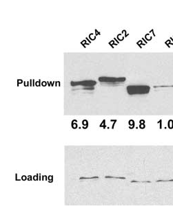

## Question

# Gene Research for Functional Annotation

## ⚠️ CRITICAL: Gene/Protein Identification Context

**BEFORE YOU BEGIN RESEARCH:** You MUST verify you are researching the CORRECT gene/protein. Gene symbols can be ambiguous, especially for less well-characterized genes from non-model organisms.

### Target Gene/Protein Identity (from UniProt):
- **UniProt Accession:** Q1G3K8
- **Protein Description:** RecName: Full=CRIB domain-containing protein RIC7; AltName: Full=ROP-interactive CRIB motif-containing protein 7; AltName: Full=Target of ROP protein RIC7;
- **Gene Information:** Name=RIC7; OrderedLocusNames=At4g28556; ORFNames=F20O9;
- **Organism (full):** Arabidopsis thaliana (Mouse-ear cress).
- **Protein Family:** Not specified in UniProt
- **Key Domains:** CRIB_dom. (IPR000095); CRIB_dom_sf. (IPR036936); PBD (PF00786)

### MANDATORY VERIFICATION STEPS:

1. **Check if the gene symbol "RIC7" matches the protein description above**
2. **Verify the organism is correct:** Arabidopsis thaliana (Mouse-ear cress).
3. **Check if protein family/domains align with what you find in literature**
4. **If you find literature for a DIFFERENT gene with the same or similar symbol, STOP**

### If Gene Symbol is Ambiguous or You Cannot Find Relevant Literature:

**DO NOT PROCEED WITH RESEARCH ON A DIFFERENT GENE.** Instead:
- State clearly: "The gene symbol 'RIC7' is ambiguous or literature is limited for this specific protein"
- Explain what you found (e.g., "Found extensive literature on a different gene with the same symbol in a different organism")
- Describe the protein based ONLY on the UniProt information provided above
- Suggest that the protein function can be inferred from domain/family information

### Research Target:

Please provide a comprehensive research report on the gene **RIC7** (gene ID: Q1G3K8, UniProt: Q1G3K8) in ARATH.

The research report should be a detailed narrative explaining the function, biological processes, and localization of the gene product. Citations should be given for all claims.

You should prioritize authoritative reviews and primary scientific literature when conducting research. You can supplement
this with annotations you find in gene/protein databases, but these can be outdated or inaccurate.

We are specifically interested in the primary function of the gene - for enzymes, what reaction is catalyzed, and what is the substrate specificity? For transporters, what is the substrate? For structural proteins or adapters, what is the broader structural role? For signaling molecules, what is the role in the pathway.

We are interested in where in or outside the cell the gene product carries out its function.

We are also interested in the signaling or biochemical pathways in which the gene functions. We are less interested in broad pleiotropic effects, except where these elucidate the precise role.

Include evidence where possible. We are interested in both experimental evidence as well as inference from structure, evolution, or bioinformatic analysis. Precise studies should be prioritized over high-throughput, where available.

## Output

Question: You are an expert researcher providing comprehensive, well-cited information.

Provide detailed information focusing on:
1. Key concepts and definitions with current understanding
2. Recent developments and latest research (prioritize 2023-2024 sources)
3. Current applications and real-world implementations
4. Expert opinions and analysis from authoritative sources
5. Relevant statistics and data from recent studies

Format as a comprehensive research report with proper citations. Include URLs and publication dates where available.
Always prioritize recent, authoritative sources and provide specific citations for all major claims.

# Gene Research for Functional Annotation

## ⚠️ CRITICAL: Gene/Protein Identification Context

**BEFORE YOU BEGIN RESEARCH:** You MUST verify you are researching the CORRECT gene/protein. Gene symbols can be ambiguous, especially for less well-characterized genes from non-model organisms.

### Target Gene/Protein Identity (from UniProt):
- **UniProt Accession:** Q1G3K8
- **Protein Description:** RecName: Full=CRIB domain-containing protein RIC7; AltName: Full=ROP-interactive CRIB motif-containing protein 7; AltName: Full=Target of ROP protein RIC7;
- **Gene Information:** Name=RIC7; OrderedLocusNames=At4g28556; ORFNames=F20O9;
- **Organism (full):** Arabidopsis thaliana (Mouse-ear cress).
- **Protein Family:** Not specified in UniProt
- **Key Domains:** CRIB_dom. (IPR000095); CRIB_dom_sf. (IPR036936); PBD (PF00786)

### MANDATORY VERIFICATION STEPS:

1. **Check if the gene symbol "RIC7" matches the protein description above**
2. **Verify the organism is correct:** Arabidopsis thaliana (Mouse-ear cress).
3. **Check if protein family/domains align with what you find in literature**
4. **If you find literature for a DIFFERENT gene with the same or similar symbol, STOP**

### If Gene Symbol is Ambiguous or You Cannot Find Relevant Literature:

**DO NOT PROCEED WITH RESEARCH ON A DIFFERENT GENE.** Instead:
- State clearly: "The gene symbol 'RIC7' is ambiguous or literature is limited for this specific protein"
- Explain what you found (e.g., "Found extensive literature on a different gene with the same symbol in a different organism")
- Describe the protein based ONLY on the UniProt information provided above
- Suggest that the protein function can be inferred from domain/family information

### Research Target:

Please provide a comprehensive research report on the gene **RIC7** (gene ID: Q1G3K8, UniProt: Q1G3K8) in ARATH.

The research report should be a detailed narrative explaining the function, biological processes, and localization of the gene product. Citations should be given for all claims.

You should prioritize authoritative reviews and primary scientific literature when conducting research. You can supplement
this with annotations you find in gene/protein databases, but these can be outdated or inaccurate.

We are specifically interested in the primary function of the gene - for enzymes, what reaction is catalyzed, and what is the substrate specificity? For transporters, what is the substrate? For structural proteins or adapters, what is the broader structural role? For signaling molecules, what is the role in the pathway.

We are interested in where in or outside the cell the gene product carries out its function.

We are also interested in the signaling or biochemical pathways in which the gene functions. We are less interested in broad pleiotropic effects, except where these elucidate the precise role.

Include evidence where possible. We are interested in both experimental evidence as well as inference from structure, evolution, or bioinformatic analysis. Precise studies should be prioritized over high-throughput, where available.

# Functional annotation report: Arabidopsis RIC7 (Q1G3K8)

## Executive conclusion

The target is **RIC7 from *Arabidopsis thaliana***, supplied as UniProt **Q1G3K8**, gene/locus **RIC7 / At4g28556**, and aliases “ROP-interactive CRIB motif-containing protein 7” and “Target of ROP protein RIC7.” Its description and CRIB/PBD annotations are consistent with the Arabidopsis RIC family discovered as plant-specific effectors of ROP small GTPases. The foundational study places RIC7 in RIC group II with RIC6 and RIC8; RIC6 and RIC7 share 66% amino-acid identity. However, the retrieved paper does not explicitly connect its historical RIC7 sequence identifier to Q1G3K8/At4g28556, so that exact accession–locus mapping rests on the supplied UniProt record rather than an independently verified statement in the paper. No evidence concerning a similarly named protein from another organism was used. (wu2001agenomewideanalysis pages 2-3)

The most defensible functional annotation is: **RIC7 is a small, nonenzymatic CRIB-domain ROP-binding protein—probably an effector or adaptor that couples activated, membrane-associated ROP GTPases to an as-yet-unidentified downstream process.** Direct evidence shows recombinant RIC7 binding to constitutively active ROP1, apical plasma-membrane localization in a heterologous pollen-tube assay, redistribution upon ROP1 overexpression, broad transcription in Arabidopsis organs, and severe inhibition of pollen-tube elongation when overexpressed. There is no established catalytic reaction, substrate, transporter activity, endogenous downstream partner, native loss-of-function phenotype, or demonstrated localization at endogenous abundance. (wu2001agenomewideanalysis pages 6-7, wu2001agenomewideanalysis pages 7-9, wu2001agenomewideanalysis pages 9-11)

## Identity and molecular classification

RIC proteins were identified as a family of 11 Arabidopsis proteins containing a conserved **CRIB motif**—the Cdc42/Rac-interactive binding module that recognizes the effector surface of activated Rho-family GTPases. Nine RIC cDNAs, including RIC7, were recovered and sequence-confirmed; RIC8 and RIC11 were the exceptions. RIC proteins are only approximately 116–224 amino acids long and are highly divergent outside the conserved ROP-interactive region. Most—including group-II RIC7—carry the CRIB motif near the N terminus and a downstream conserved PSWMXDFK block. (wu2001agenomewideanalysis pages 2-3, wu2001agenomewideanalysis pages 3-6)

The supplied InterPro/Pfam annotations—**CRIB_dom (IPR000095), CRIB-domain superfamily (IPR036936), and PBD (PF00786)**—therefore align with the literature. Here PBD denotes a p21-binding/CRIB-containing interaction domain, not an enzyme active site. RIC7 should consequently not be annotated as an enzyme or transporter; its likely molecular function is regulated protein–protein interaction with the GTP-loaded state of a ROP GTPase.

## Biochemical function and ROP binding

The family’s nucleotide-state mechanism was demonstrated most rigorously for RIC1: RIC1 bound GTP-loaded constitutively active ROP1 but not GDP-loaded dominant-negative ROP1, and substitutions of conserved CRIB histidines sharply reduced binding and plasma-membrane localization. This establishes the CRIB motif as the family’s active-ROP recognition element, but that complete active-versus-inactive comparison was not performed individually for RIC7. (wu2001agenomewideanalysis pages 2-3, wu2001agenomewideanalysis pages 6-7)

RIC7 itself was included in a recombinant GST–CA-ROP1/MBP–RIC pulldown and bound constitutively active ROP1 strongly. Figure 6 reports a loading-normalized relative signal of **9.8**, higher in that assay than the displayed RIC4 and RIC2 values of 6.9 and 4.7. This supports direct biochemical association with active CA-ROP1, although the numbers are relative blot intensities rather than an affinity constant and should not be interpreted as a dissociation constant or universal ranking of physiological partners. (wu2001agenomewideanalysis pages 6-7, wu2001agenomewideanalysis pages 7-9, wu2001agenomewideanalysis media a6b14423)

Accordingly, RIC7’s primary biochemical role is best described as **binding activated ROP-family GTPases through its CRIB/PBD region and potentially presenting or recruiting an unknown downstream partner**. The original authors also considered that RIC7 might preferentially serve another pollen-expressed ROP rather than ROP1, but candidate ROP8/ARAC8/ARAC10 relationships were speculative and were not experimentally assigned to RIC7. (wu2001agenomewideanalysis pages 13-14, wu2001agenomewideanalysis pages 11-13)

## Cellular localization

In transiently transformed tobacco pollen tubes, LAT52-driven GFP–RIC7 localized predominantly to the **apical plasma-membrane region**, with a cytoplasmic pool. This is spatially compatible with signaling from active ROPs at the tip-growth domain. ROP1 co-overexpression did not intensify RIC7’s apical enrichment; instead, it redistributed GFP–RIC7 across the plasma membrane along the entire tube. That behavior indicates ROP-sensitive membrane association but differs from the strongly ROP1-enhanced apical recruitment reported for RIC4. (wu2001agenomewideanalysis pages 3-6, wu2001agenomewideanalysis pages 6-7, wu2001agenomewideanalysis pages 9-11)

This localization requires careful qualification: it was observed after overexpression of a GFP fusion in **tobacco**, not by imaging endogenous RIC7 in Arabidopsis. Therefore “apical plasma membrane in pollen tubes” is an experimentally supported localization capacity, but not yet a validated native Arabidopsis localization.

## Biological process and pathway placement

ROP1 is a polarly localized molecular switch controlling Arabidopsis pollen-tube tip growth. At pathway level, activated ROP1 coordinates calcium signaling, actin dynamics, secretion and endocytosis, cell-wall remodeling, and polarized expansion. A 2020 ROP1 immunoprecipitation–mass-spectrometry study recovered **654 candidate associated proteins**, including membrane and trafficking components; 12 of 39 previously reported interactors were recovered, and 8 of 32 tested candidate mutants showed pollen germination or growth defects. These data reinforce the breadth of the ROP1 signaling network, but they did **not** recover or validate RIC7. (li2020rhogtpaserop1 pages 1-3, li2020rhogtpaserop1 pages 5-8, li2020rhogtpaserop1 pages 3-5)

The specific downstream branches often associated with RIC proteins must not be transferred automatically to RIC7. RIC3 has been linked to tip-focused Ca²⁺ signaling, whereas RIC4 is linked to actin organization and turnover; the modern interactome recovered RIC1, RIC3, and RIC5, not RIC7. No RIC7-specific calcium, actin, membrane-trafficking, exocyst, or cell-wall effector has been demonstrated in the retrieved evidence. (li2020rhogtpaserop1 pages 1-3, li2020rhogtpaserop1 pages 5-8)

Thus, the supported pathway statement is narrow: **RIC7 can engage active ROP1 and can occupy a tip-associated plasma-membrane domain, placing it as a candidate branch-specific ROP signaling adaptor in polarized growth.** Whether that is its principal endogenous role, and what output it transmits, remain unknown.

## Expression and phenotypic evidence

Conventional RT-PCR detected RIC7 transcript in mature Arabidopsis pollen and in both reproductive and vegetative organs, including flowers/inflorescences, leaves, roots, and stems. Its expression was broader than that of the flower-enriched group-II paralog RIC6. These results establish broad transcription but provide neither cell-type resolution nor quantitative protein abundance. (wu2001agenomewideanalysis pages 6-7, wu2001agenomewideanalysis pages 7-9)

RIC7 overexpression produced one of the strongest phenotypes in the original tobacco pollen assay. Five hours after bombardment, GFP-control tubes averaged **297 ± 26 µm** in length, whereas GFP–RIC7 tubes averaged **54.5 ± 5.4 µm**, an approximately **82% reduction**. Mean width was 9.8 ± 0.18 µm versus 8.8 ± 0.24 µm for control, and the width/length ratio rose from 0.03 to **0.18 ± 0.01**, mainly because elongation was strongly curtailed. (wu2001agenomewideanalysis pages 3-6, wu2001agenomewideanalysis pages 7-9)

This is a heterologous gain-of-function result, not evidence that endogenous RIC7 normally inhibits pollen growth. The original authors explicitly considered alternative explanations: excess RIC7 could competitively sequester active ROP, bind another limiting partner, or generate a dominant-negative effect by occupying ROP without productively activating the correct downstream machinery. No ric7 loss-of-function analysis was presented to distinguish these models. (wu2001agenomewideanalysis pages 9-11, wu2001agenomewideanalysis pages 11-13)

The evidence and its limitations are summarized below.

| Topic | RIC7-specific finding | Evidence type/model | Confidence/limitation |
|---|---|---|---|
| Identity and domain | Target record: *Arabidopsis thaliana* RIC7, locus At4g28556, UniProt Q1G3K8; annotated as a CRIB/PBD-domain ROP-interactive protein. The primary study independently places RIC7 in CRIB-containing RIC group II with RIC6 and RIC8; RIC6 and RIC7 share 66% amino-acid identity. (wu2001agenomewideanalysis pages 2-3) | Accession and locus mapping are database-provided; family placement and CRIB architecture derive from sequence analysis and cloned-cDNA confirmation. | **Moderate.** Identity is internally consistent, but the retrieved paper does not explicitly map its historical RIC7 sequence to Q1G3K8/At4g28556. The CRIB domain supports a ROP-effector role but does not establish a specific physiological pathway by itself. |
| Active ROP binding | Recombinant RIC7 bound constitutively active, GTP-bound CA-ROP1 in vitro; the normalized pulldown signal reported in Figure 6 was **9.8**. (wu2001agenomewideanalysis pages 6-7, wu2001agenomewideanalysis pages 7-9, wu2001agenomewideanalysis media a6b14423) | GST–CA-ROP1/MBP–RIC7 affinity pulldown using bacterially expressed proteins. | **Moderate–high for in-vitro binding.** The experiment supports direct association with active CA-ROP1, but RIC7 was not individually compared with GDP-bound ROP1; nucleotide-state specificity is demonstrated most directly for RIC1 and inferred for RIC7 from the conserved CRIB motif. |
| Basal localization | GFP–RIC7 localized predominantly to the **apical plasma-membrane region**, with a cytoplasmic pool, in growing pollen tubes. (wu2001agenomewideanalysis pages 3-6, wu2001agenomewideanalysis pages 9-11, wu2001agenomewideanalysis pages 11-13) | Transient LAT52-driven overexpression of GFP–RIC7 in heterologous tobacco pollen tubes; confocal microscopy approximately 5 h after bombardment. | **Moderate.** Demonstrates localization capacity in a tip-growing cell, but not endogenous localization in *Arabidopsis* or localization at native expression levels. |
| ROP1-dependent redistribution | ROP1 co-overexpression shifted GFP–RIC7 from the apical membrane/cytoplasm to the **plasma membrane throughout the pollen tube**, without enhancing its apical enrichment. (wu2001agenomewideanalysis pages 6-7, wu2001agenomewideanalysis pages 9-11, wu2001agenomewideanalysis pages 11-13) | Transient GFP–RIC7 and ROP1 co-overexpression in tobacco pollen tubes. | **Moderate.** Supports ROP-sensitive membrane recruitment or redistribution, but overexpression complicates physiological interpretation and does not prove that endogenous ROP1 is RIC7’s principal upstream GTPase. |
| Expression | RIC7 transcripts were detected in mature *Arabidopsis* pollen and broadly across reproductive and vegetative organs, including flowers/inflorescences, leaves, roots, and stems. (wu2001agenomewideanalysis pages 6-7, wu2001agenomewideanalysis pages 7-9) | Conventional RT-PCR of RNA from mature pollen and dissected *Arabidopsis* organs. | **Moderate.** Supports broad transcription but is not cell-resolved or quantitative; transcript detection does not establish protein abundance or localization. |
| Overexpression phenotype | GFP–RIC7 strongly inhibited pollen-tube elongation: mean length **54.5 ± 5.4 µm**, versus **297 ± 26 µm** for GFP control—approximately an 82% reduction. Width/length increased to **0.18 ± 0.01**, versus **0.03 ± 0.00** for control. (wu2001agenomewideanalysis pages 3-6, wu2001agenomewideanalysis pages 7-9) | Transient overexpression in tobacco pollen; morphometry 5 h after particle bombardment. | **Moderate for the overexpression effect; low for endogenous function.** A heterologous gain-of-function phenotype may reflect sequestration of active ROPs or other partners and cannot establish whether native RIC7 promotes or inhibits growth. |
| Endogenous downstream mechanism | No RIC7-specific endogenous downstream effector, biochemical output, or substrate has been established. RIC7 is therefore best considered a candidate **nonenzymatic CRIB-domain ROP effector/adaptor**, not an enzyme or transporter. (wu2001agenomewideanalysis pages 9-11, wu2001agenomewideanalysis pages 11-13) | Domain-based inference combined with the original authors’ ROP–RIC signaling model. | **Low.** Actin and calcium mechanisms established or proposed for RIC4 and RIC3 must not be transferred to RIC7. |
| Loss-of-function evidence | No validated RIC7 knockout or knockdown phenotype was identified in the retrieved primary or recent literature. The original study explicitly noted that knockout analysis was required to resolve functions of inhibitory RICs. (wu2001agenomewideanalysis pages 9-11, wu2001agenomewideanalysis pages 11-13) | Literature-gap assessment. | **Unknown.** Necessity, redundancy, tissue-specific physiological roles, and direction of endogenous action remain unresolved. |
| Native localization | Endogenous RIC7 protein localization in *Arabidopsis* cells has not been demonstrated in the retrieved evidence. | Literature-gap assessment contrasted with transient tobacco-pollen imaging. | **Unknown.** Apical plasma-membrane localization should be reported as an overexpression result in a heterologous pollen system, not as established native localization. |

*Table: This table separates direct RIC7 observations from domain-based inference and unresolved questions. It highlights the heterologous or overexpression context of most functional evidence and distinguishes database identity mapping from primary-paper results.*

## Recent developments, applications, and research status

Targeted searches found **no RIC7-specific primary publication from 2023–2024**. The direct functional record remains dominated by the 2001 genome-wide RIC study. The 2020 ROP1 interactome substantially expanded the known pollen ROP network but did not provide modern validation for RIC7. Consequently, the absence of recent studies is scientifically important: RIC7 remains much less characterized than RIC1, RIC3, or RIC4. (li2020rhogtpaserop1 pages 1-3, li2020rhogtpaserop1 pages 5-8)

There is no documented agricultural, biotechnological, diagnostic, or therapeutic implementation of RIC7. Its present application is principally as a **research candidate** for studying how activated plant Rho GTPases select among small CRIB-domain effectors and establish spatially restricted signaling at the plasma membrane. Because RIC7 is broadly transcribed and strongly perturbs tip growth when overexpressed, rigorous future applications would require endogenous tagging, CRISPR null and separation-of-function alleles, quantitative active-ROP binding, and tissue-resolved phenotyping before crop-engineering claims would be justified.

## Expert assessment and annotation confidence

**High-confidence statements:** the target belongs to the Arabidopsis CRIB-containing RIC class; RIC7 is a group-II RIC closely related to RIC6; recombinant RIC7 binds CA-ROP1; and overexpressed GFP–RIC7 can associate with the apical pollen-tube plasma membrane. (wu2001agenomewideanalysis pages 2-3, wu2001agenomewideanalysis pages 6-7, wu2001agenomewideanalysis media a6b14423)

**Moderate-confidence functional interpretation:** RIC7 is a noncatalytic effector/adaptor for activated ROP GTPases. This combines direct in-vitro binding with domain architecture and membrane redistribution, but the physiologically dominant upstream ROP is not established.

**Low-confidence or unresolved:** endogenous molecular output, direction of action, native subcellular localization, essentiality, genetic redundancy, and roles outside pollen. No specific actin, calcium, exocyst, trafficking, or cell-wall mechanism should currently be assigned to RIC7.

A concise annotation suitable for a curated record would be: **“CRIB-domain-containing candidate effector/adaptor of activated ROP small GTPases. RIC7 binds constitutively active ROP1 in vitro and, when overexpressed in tobacco pollen tubes, localizes to the apical plasma membrane and strongly inhibits elongation. Its endogenous downstream partner and physiological function in Arabidopsis remain uncharacterized.”**

## Key references

1. Wu G, Gu Y, Li S, Yang Z. **A Genome-Wide Analysis of Arabidopsis Rop-Interactive CRIB Motif–Containing Proteins That Act as Rop GTPase Targets.** *The Plant Cell*. Published December 2001;13(12):2841–2856. DOI/URL: https://doi.org/10.1105/tpc.010218. This is the foundational and principal RIC7-specific source. (wu2001agenomewideanalysis pages 2-3, wu2001agenomewideanalysis pages 7-9)
2. Li H, Hu J, Pang J, et al. **Rho GTPase ROP1 Interactome Analysis Reveals Novel ROP1-Associated Pathways for Pollen Tube Polar Growth in Arabidopsis.** *International Journal of Molecular Sciences*. Published September 2020;21:7033. DOI/URL: https://doi.org/10.3390/ijms21197033. This provides modern pathway context but no direct RIC7 validation. (li2020rhogtpaserop1 pages 1-3, li2020rhogtpaserop1 pages 3-5)

References

1. (wu2001agenomewideanalysis pages 2-3): Guang Wu, Ying Gu, Shundai Li, and Zhenbiao Yang. A genome-wide analysis of arabidopsis rop-interactive crib motif–containing proteins that act as rop gtpase targets article, publication date, and citation information can be found at www.plantcell.org/cgi/doi/10.1105/tpc.010218. The Plant Cell Online, 13:2841-2856, Dec 2001. URL: https://doi.org/10.1105/tpc.010218, doi:10.1105/tpc.010218. This article has 296 citations.

2. (wu2001agenomewideanalysis pages 6-7): Guang Wu, Ying Gu, Shundai Li, and Zhenbiao Yang. A genome-wide analysis of arabidopsis rop-interactive crib motif–containing proteins that act as rop gtpase targets article, publication date, and citation information can be found at www.plantcell.org/cgi/doi/10.1105/tpc.010218. The Plant Cell Online, 13:2841-2856, Dec 2001. URL: https://doi.org/10.1105/tpc.010218, doi:10.1105/tpc.010218. This article has 296 citations.

3. (wu2001agenomewideanalysis pages 7-9): Guang Wu, Ying Gu, Shundai Li, and Zhenbiao Yang. A genome-wide analysis of arabidopsis rop-interactive crib motif–containing proteins that act as rop gtpase targets article, publication date, and citation information can be found at www.plantcell.org/cgi/doi/10.1105/tpc.010218. The Plant Cell Online, 13:2841-2856, Dec 2001. URL: https://doi.org/10.1105/tpc.010218, doi:10.1105/tpc.010218. This article has 296 citations.

4. (wu2001agenomewideanalysis pages 9-11): Guang Wu, Ying Gu, Shundai Li, and Zhenbiao Yang. A genome-wide analysis of arabidopsis rop-interactive crib motif–containing proteins that act as rop gtpase targets article, publication date, and citation information can be found at www.plantcell.org/cgi/doi/10.1105/tpc.010218. The Plant Cell Online, 13:2841-2856, Dec 2001. URL: https://doi.org/10.1105/tpc.010218, doi:10.1105/tpc.010218. This article has 296 citations.

5. (wu2001agenomewideanalysis pages 3-6): Guang Wu, Ying Gu, Shundai Li, and Zhenbiao Yang. A genome-wide analysis of arabidopsis rop-interactive crib motif–containing proteins that act as rop gtpase targets article, publication date, and citation information can be found at www.plantcell.org/cgi/doi/10.1105/tpc.010218. The Plant Cell Online, 13:2841-2856, Dec 2001. URL: https://doi.org/10.1105/tpc.010218, doi:10.1105/tpc.010218. This article has 296 citations.

6. (wu2001agenomewideanalysis media a6b14423): Guang Wu, Ying Gu, Shundai Li, and Zhenbiao Yang. A genome-wide analysis of arabidopsis rop-interactive crib motif–containing proteins that act as rop gtpase targets article, publication date, and citation information can be found at www.plantcell.org/cgi/doi/10.1105/tpc.010218. The Plant Cell Online, 13:2841-2856, Dec 2001. URL: https://doi.org/10.1105/tpc.010218, doi:10.1105/tpc.010218. This article has 296 citations.

7. (wu2001agenomewideanalysis pages 13-14): Guang Wu, Ying Gu, Shundai Li, and Zhenbiao Yang. A genome-wide analysis of arabidopsis rop-interactive crib motif–containing proteins that act as rop gtpase targets article, publication date, and citation information can be found at www.plantcell.org/cgi/doi/10.1105/tpc.010218. The Plant Cell Online, 13:2841-2856, Dec 2001. URL: https://doi.org/10.1105/tpc.010218, doi:10.1105/tpc.010218. This article has 296 citations.

8. (wu2001agenomewideanalysis pages 11-13): Guang Wu, Ying Gu, Shundai Li, and Zhenbiao Yang. A genome-wide analysis of arabidopsis rop-interactive crib motif–containing proteins that act as rop gtpase targets article, publication date, and citation information can be found at www.plantcell.org/cgi/doi/10.1105/tpc.010218. The Plant Cell Online, 13:2841-2856, Dec 2001. URL: https://doi.org/10.1105/tpc.010218, doi:10.1105/tpc.010218. This article has 296 citations.

9. (li2020rhogtpaserop1 pages 1-3): Hui Li, Jinbo Hu, Jing Pang, Liangtao Zhao, Bing Yang, Xinlei Kang, Aimin Wang, Tongda Xu, and Zhenbiao Yang. Rho gtpase rop1 interactome analysis reveals novel rop1-associated pathways for pollen tube polar growth in arabidopsis. International Journal of Molecular Sciences, 21:7033, Sep 2020. URL: https://doi.org/10.3390/ijms21197033, doi:10.3390/ijms21197033. This article has 12 citations.

10. (li2020rhogtpaserop1 pages 5-8): Hui Li, Jinbo Hu, Jing Pang, Liangtao Zhao, Bing Yang, Xinlei Kang, Aimin Wang, Tongda Xu, and Zhenbiao Yang. Rho gtpase rop1 interactome analysis reveals novel rop1-associated pathways for pollen tube polar growth in arabidopsis. International Journal of Molecular Sciences, 21:7033, Sep 2020. URL: https://doi.org/10.3390/ijms21197033, doi:10.3390/ijms21197033. This article has 12 citations.

11. (li2020rhogtpaserop1 pages 3-5): Hui Li, Jinbo Hu, Jing Pang, Liangtao Zhao, Bing Yang, Xinlei Kang, Aimin Wang, Tongda Xu, and Zhenbiao Yang. Rho gtpase rop1 interactome analysis reveals novel rop1-associated pathways for pollen tube polar growth in arabidopsis. International Journal of Molecular Sciences, 21:7033, Sep 2020. URL: https://doi.org/10.3390/ijms21197033, doi:10.3390/ijms21197033. This article has 12 citations.

## Artifacts

- [Edison artifact artifact-00](Q1G3K8-deep-research-falcon_artifacts/artifact-00.md)

## Citations

1. wu2001agenomewideanalysis pages 2-3
2. wu2001agenomewideanalysis pages 6-7
3. wu2001agenomewideanalysis pages 7-9
4. wu2001agenomewideanalysis pages 9-11
5. wu2001agenomewideanalysis pages 3-6
6. wu2001agenomewideanalysis pages 13-14
7. wu2001agenomewideanalysis pages 11-13
8. https://doi.org/10.1105/tpc.010218.
9. https://doi.org/10.3390/ijms21197033.
10. https://doi.org/10.1105/tpc.010218,
11. https://doi.org/10.3390/ijms21197033,