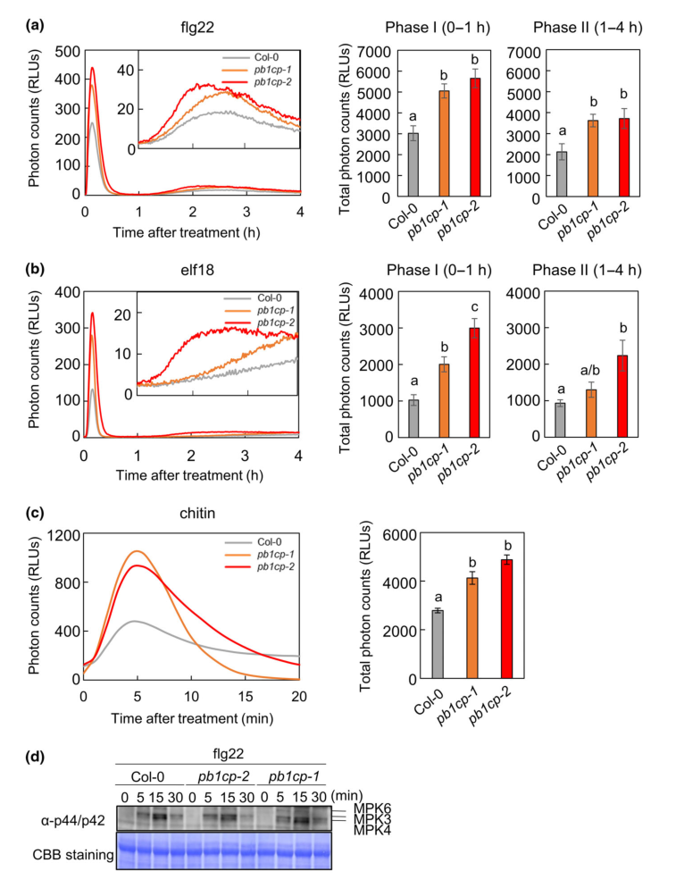

## Question

# Gene Research for Functional Annotation

## ⚠️ CRITICAL: Gene/Protein Identification Context

**BEFORE YOU BEGIN RESEARCH:** You MUST verify you are researching the CORRECT gene/protein. Gene symbols can be ambiguous, especially for less well-characterized genes from non-model organisms.

### Target Gene/Protein Identity (from UniProt):
- **UniProt Accession:** Q9FIJ0
- **Protein Description:** RecName: Full=Respiratory burst oxidase homolog protein D {ECO:0000303|PubMed:9628030}; EC=1.11.1.-; EC=1.6.3.-; AltName: Full=NADPH oxidase RBOHD {ECO:0000303|PubMed:9628030}; Short=AtRBOHD {ECO:0000303|PubMed:9628030};
- **Gene Information:** Name=RBOHD {ECO:0000303|PubMed:9628030}; OrderedLocusNames=At5g47910 {ECO:0000312|Araport:AT5G47910}; ORFNames=MCA23.25 {ECO:0000312|EMBL:BAB11338.1};
- **Organism (full):** Arabidopsis thaliana (Mouse-ear cress).
- **Protein Family:** Belongs to the RBOH (TC 5.B.1.3) family. .
- **Key Domains:** Cyt_b245_heavy_chain. (IPR000778); EF-hand-dom_pair. (IPR011992); EF_Hand_1_Ca_BS. (IPR018247); EF_hand_dom. (IPR002048); FAD-bd_8. (IPR013112)

### MANDATORY VERIFICATION STEPS:

1. **Check if the gene symbol "RBOHD" matches the protein description above**
2. **Verify the organism is correct:** Arabidopsis thaliana (Mouse-ear cress).
3. **Check if protein family/domains align with what you find in literature**
4. **If you find literature for a DIFFERENT gene with the same or similar symbol, STOP**

### If Gene Symbol is Ambiguous or You Cannot Find Relevant Literature:

**DO NOT PROCEED WITH RESEARCH ON A DIFFERENT GENE.** Instead:
- State clearly: "The gene symbol 'RBOHD' is ambiguous or literature is limited for this specific protein"
- Explain what you found (e.g., "Found extensive literature on a different gene with the same symbol in a different organism")
- Describe the protein based ONLY on the UniProt information provided above
- Suggest that the protein function can be inferred from domain/family information

### Research Target:

Please provide a comprehensive research report on the gene **RBOHD** (gene ID: RBOHD, UniProt: Q9FIJ0) in ARATH.

The research report should be a detailed narrative explaining the function, biological processes, and localization of the gene product. Citations should be given for all claims.

You should prioritize authoritative reviews and primary scientific literature when conducting research. You can supplement
this with annotations you find in gene/protein databases, but these can be outdated or inaccurate.

We are specifically interested in the primary function of the gene - for enzymes, what reaction is catalyzed, and what is the substrate specificity? For transporters, what is the substrate? For structural proteins or adapters, what is the broader structural role? For signaling molecules, what is the role in the pathway.

We are interested in where in or outside the cell the gene product carries out its function.

We are also interested in the signaling or biochemical pathways in which the gene functions. We are less interested in broad pleiotropic effects, except where these elucidate the precise role.

Include evidence where possible. We are interested in both experimental evidence as well as inference from structure, evolution, or bioinformatic analysis. Precise studies should be prioritized over high-throughput, where available.

## Output

Question: You are an expert researcher providing comprehensive, well-cited information.

Provide detailed information focusing on:
1. Key concepts and definitions with current understanding
2. Recent developments and latest research (prioritize 2023-2024 sources)
3. Current applications and real-world implementations
4. Expert opinions and analysis from authoritative sources
5. Relevant statistics and data from recent studies

Format as a comprehensive research report with proper citations. Include URLs and publication dates where available.
Always prioritize recent, authoritative sources and provide specific citations for all major claims.

# Gene Research for Functional Annotation

## ⚠️ CRITICAL: Gene/Protein Identification Context

**BEFORE YOU BEGIN RESEARCH:** You MUST verify you are researching the CORRECT gene/protein. Gene symbols can be ambiguous, especially for less well-characterized genes from non-model organisms.

### Target Gene/Protein Identity (from UniProt):
- **UniProt Accession:** Q9FIJ0
- **Protein Description:** RecName: Full=Respiratory burst oxidase homolog protein D {ECO:0000303|PubMed:9628030}; EC=1.11.1.-; EC=1.6.3.-; AltName: Full=NADPH oxidase RBOHD {ECO:0000303|PubMed:9628030}; Short=AtRBOHD {ECO:0000303|PubMed:9628030};
- **Gene Information:** Name=RBOHD {ECO:0000303|PubMed:9628030}; OrderedLocusNames=At5g47910 {ECO:0000312|Araport:AT5G47910}; ORFNames=MCA23.25 {ECO:0000312|EMBL:BAB11338.1};
- **Organism (full):** Arabidopsis thaliana (Mouse-ear cress).
- **Protein Family:** Belongs to the RBOH (TC 5.B.1.3) family. .
- **Key Domains:** Cyt_b245_heavy_chain. (IPR000778); EF-hand-dom_pair. (IPR011992); EF_Hand_1_Ca_BS. (IPR018247); EF_hand_dom. (IPR002048); FAD-bd_8. (IPR013112)

### MANDATORY VERIFICATION STEPS:

1. **Check if the gene symbol "RBOHD" matches the protein description above**
2. **Verify the organism is correct:** Arabidopsis thaliana (Mouse-ear cress).
3. **Check if protein family/domains align with what you find in literature**
4. **If you find literature for a DIFFERENT gene with the same or similar symbol, STOP**

### If Gene Symbol is Ambiguous or You Cannot Find Relevant Literature:

**DO NOT PROCEED WITH RESEARCH ON A DIFFERENT GENE.** Instead:
- State clearly: "The gene symbol 'RBOHD' is ambiguous or literature is limited for this specific protein"
- Explain what you found (e.g., "Found extensive literature on a different gene with the same symbol in a different organism")
- Describe the protein based ONLY on the UniProt information provided above
- Suggest that the protein function can be inferred from domain/family information

### Research Target:

Please provide a comprehensive research report on the gene **RBOHD** (gene ID: RBOHD, UniProt: Q9FIJ0) in ARATH.

The research report should be a detailed narrative explaining the function, biological processes, and localization of the gene product. Citations should be given for all claims.

You should prioritize authoritative reviews and primary scientific literature when conducting research. You can supplement
this with annotations you find in gene/protein databases, but these can be outdated or inaccurate.

We are specifically interested in the primary function of the gene - for enzymes, what reaction is catalyzed, and what is the substrate specificity? For transporters, what is the substrate? For structural proteins or adapters, what is the broader structural role? For signaling molecules, what is the role in the pathway.

We are interested in where in or outside the cell the gene product carries out its function.

We are also interested in the signaling or biochemical pathways in which the gene functions. We are less interested in broad pleiotropic effects, except where these elucidate the precise role.

Include evidence where possible. We are interested in both experimental evidence as well as inference from structure, evolution, or bioinformatic analysis. Precise studies should be prioritized over high-throughput, where available.

## Research report: Arabidopsis thaliana **RBOHD** (UniProt **Q9FIJ0**, locus **At5g47910**) — functional annotation and current understanding

### 1) Gene/protein identity verification (mandatory)
The target protein is **Arabidopsis thaliana Respiratory burst oxidase homolog protein D (RBOHD; AtRBOHD)**, a member of the plant RBOH/NOX family of plasma-membrane NADPH oxidases that generate apoplastic reactive oxygen species (ROS). Multiple sources converge on the defining features expected from the UniProt entry: an N‑terminal regulatory region with **EF‑hand Ca2+‑binding motifs**, a C‑terminal catalytic core with **FAD- and NADPH-binding regions**, and a multi-pass membrane region with **heme cofactors** enabling electron transport across the membrane to reduce O2 to superoxide. (hasan2019theroleof pages 24-27, krainiukova2025regulationofplant pages 7-10, hu2020nadphoxidasesthe pages 3-5, zhang2023evolutionaryanalysisof pages 1-2, torres2024unveilingwhatmakes pages 2-2)

### 2) Key concepts and definitions (current understanding)

#### 2.1 What is RBOHD?
**RBOHD** is a **plant NADPH oxidase** (also called an RBOH) that catalyzes **electron transfer from cytosolic NADPH to molecular oxygen (O2)** to generate **superoxide (O2•−)** in the **apoplast**, which can subsequently form **H2O2** (spontaneously or via superoxide dismutase). (hasan2019theroleof pages 24-27, zhang2023evolutionaryanalysisof pages 1-2, torres2024unveilingwhatmakes pages 2-2)

#### 2.2 Domain architecture and catalytic mechanism
RBOHD matches the canonical plant RBOH domain logic:
- **N‑terminal cytosolic region** with **two EF‑hand Ca2+‑binding motifs** and multiple regulatory phosphorylation sites; Ca2+ can directly stimulate activity via EF‑hands. (hasan2019theroleof pages 24-27, krainiukova2025regulationofplant pages 7-10, torres2024unveilingwhatmakes pages 2-2)
- **C‑terminal cytosolic catalytic region** containing **FAD- and NADPH-binding domains**, supporting electron flow from NADPH → FAD → hemes. (hasan2019theroleof pages 24-27, krainiukova2025regulationofplant pages 7-10, hu2020nadphoxidasesthe pages 3-5)
- **Six transmembrane helices** with **two heme groups**, with conserved histidines acting as axial ligands—consistent with intramembrane electron transfer. (hasan2019theroleof pages 24-27, krainiukova2025regulationofplant pages 7-10, zhang2023evolutionaryanalysisof pages 1-2)

These structural concepts explain how RBOHD can produce extracellular ROS while drawing reducing equivalents from the cytosolic NADPH pool. (krainiukova2025regulationofplant pages 7-10, zhang2023evolutionaryanalysisof pages 1-2)

#### 2.3 “ROS burst” in plant immunity
A **PAMP-triggered ROS burst** is a rapid, transient increase in apoplastic ROS (often measured by luminol-based chemiluminescence) following recognition of pathogen-associated molecular patterns (PAMPs) by **pattern recognition receptors (PRRs)**. Expert synthesis identifies RBOHD as the **major NADPH oxidase responsible for pathogen-triggered ROS** in Arabidopsis and highlights that its activity must be transient and tightly controlled to avoid damage. (torres2024unveilingwhatmakes pages 2-2)

### 3) Mechanistic regulation of RBOHD (with residue-level detail where available)

#### 3.1 Calcium-dependent regulation
RBOHD can be activated directly by **Ca2+ binding** to its EF-hand motifs, and indirectly via **Ca2+-dependent protein kinases (CPKs/CDPKs)** that phosphorylate regulatory regions. (torres2024unveilingwhatmakes pages 2-2, krainiukova2025regulationofplant pages 7-10)

#### 3.2 Phosphorylation sites and kinases (residue-level evidence)
A compilation source with residue mapping lists multiple phosphorylation sites on Arabidopsis RBOHD and associated kinases:
- **DORN1** → **S22, T24** (krainiukova2025regulationofplant pages 14-18)
- **BIK1** → **S39, S343, S347** (activation) (krainiukova2025regulationofplant pages 14-18)
- **RIPK** → **S343, S347** (krainiukova2025regulationofplant pages 14-18)
- **MAP4Ks** → **S347** (krainiukova2025regulationofplant pages 14-18)
- **CPK16** → **S133, S148, S163, S347** (krainiukova2025regulationofplant pages 14-18)
- **ALR1** → **S39** (krainiukova2025regulationofplant pages 14-18)
- **LKS4** → **S39** on AtRBOHC/D/F (krainiukova2025regulationofplant pages 14-18)
Conserved/featured sites include **S133, S163, S343, S347, T912** (with S39 moderately conserved and S148 weakly conserved in this summary). (krainiukova2025regulationofplant pages 14-18)

Expert commentary also highlights layered kinase control in immunity: **BIK1/RIPK** phosphorylation of N‑terminal residues and **CRK2** phosphorylation of C‑terminal residues, with **SIK1** acting directly or through BIK1. (torres2024unveilingwhatmakes pages 2-2)

#### 3.3 Negative regulation, endocytosis, and turnover
Tight downregulation is a core principle: excessive ROS is detrimental, so plants employ both post-translational and post-transcriptional controls. (torres2024unveilingwhatmakes pages 2-2)

A 2024 primary study (New Phytologist) identifies **PB1CP** as a **negative regulator** of RBOHD:
- PB1CP was identified by **co-immunoprecipitation + mass spectrometry** as an RBOHD-associated factor. (goto2024thephagocytosisoxidasebem1p pages 1-2)
- PB1CP **competes with BIK1** for binding to RBOHD in vitro; after PAMP treatment, PB1CP–RBOHD interaction increases and promotes **dissociation of phosphorylated BIK1** from RBOHD in vivo. (goto2024thephagocytosisoxidasebem1p pages 1-2)
- PB1CP and RBOHD co-localize at the **cell periphery** and relocalize to **small endomembrane compartments** upon PAMP stimulation, consistent with a role in **endocytosis**. (goto2024thephagocytosisoxidasebem1p pages 1-2)
- PB1CP overexpression reduces **RBOHD protein abundance**, consistent with promoting removal/turnover. (goto2024thephagocytosisoxidasebem1p pages 1-2)

In a complementary expert synthesis focused on why the ROS burst is transient, additional deactivation layers are emphasized:
- **PBL13** phosphorylates the RBOHD C‑terminus in the resting state and this promotes **PIRE-mediated ubiquitination** and **vacuolar degradation**.
- **C‑terminal nitrosylation** is described as a deactivation mechanism.
- PB1CP is framed as part of the endocytic/vacuolar downregulation pathway. (torres2024unveilingwhatmakes pages 2-2)

#### 3.4 Post-transcriptional/translational control of RBOHD abundance (2023 primary study)
A 2023 *Journal of Biological Chemistry* study reports that **CBE1 (MOB7; AT4G01290)**, an eIF4E1-binding protein associated with the **5′ mRNA cap and translation initiation machinery**, **negatively regulates accumulation of RBOHD protein**. Loss/knockdown of CBE1 and related decapping/translation regulators leads to increased RBOHD abundance, elevated elicitor-induced apoplastic ROS, and enhanced antibacterial immunity—supporting a model in which RBOHD output is controlled at the level of translation/decapping-associated ribonucleoprotein regulation rather than only transcription. (george2023arabidopsistranslationinitiation pages 1-2)

### 4) Pathways and biological roles (where RBOHD acts)

#### 4.1 Pattern-triggered immunity (PTI) and receptor-proximal signaling
In PTI, PRRs such as FLS2/EFR activate downstream cytoplasmic kinases (e.g., BIK1) that phosphorylate RBOHD to drive a rapid ROS burst. (goto2024theleucinerichrepeat pages 1-2)

A 2024 *Plant Cell* paper places RBOHD in a PRR-associated complex context by identifying **QSK1**, an LRR receptor kinase, as a **PRR–RBOHD complex-associated negative regulator** that downregulates PRR abundance (FLS2 and EFR), thereby dampening PTI; the bacterial effector **HopF2Pto** exploits QSK1 to suppress immunity. (goto2024theleucinerichrepeat pages 1-2)

#### 4.2 Guard cell ABA signaling and stomatal closure
RBOHD (with RBOHF) is described as a **pivotal ROS source for guard cell ABA signaling**, supporting ABA-induced stomatal closure. (shen2020persulfidationbasedmodificationof pages 1-4)

In guard cells, redox post-translational modifications provide a mechanistic integration point: **persulfidation** of RBOHD at **Cys825 and Cys890** enhances ROS production and is physiologically relevant to ABA-induced stomatal closure; the same Cys890 is also discussed as a site where **S-nitrosylation** can suppress ROS during defense. (shen2020persulfidationbasedmodificationof pages 1-4)

#### 4.3 Abiotic stress, wound/damage signaling, and broader roles
A regulation-focused synthesis lists RBOHD involvement in diverse processes including **wound-induced responses**, **damage-induced lignification**, **biotic and abiotic stress responses**, and **ABA-/JA-mediated stomatal closure** (among others), consistent with its role as a major ROS-producing hub at the plasma membrane. (krainiukova2025regulationofplant pages 10-14)

A stress integration perspective similarly describes RBOHD as a major isoform active in both **abiotic and biotic stress**, producing apoplastic superoxide/H2O2 that can re-enter cells via aquaporins and function as a signal integrator across stress inputs. (kumar2025principlesofsignal pages 3-4)

### 5) Recent developments (prioritizing 2023–2024)

#### 5.1 2023: Translational repression as an RBOHD control layer
The identification of **CBE1** as a negative regulator of **RBOHD protein accumulation** adds a distinct “supply-side” mechanism controlling the amplitude of ROS bursts and immunity outcomes by modulating how much oxidase is available at baseline and/or after elicitation. (george2023arabidopsistranslationinitiation pages 1-2)

#### 5.2 2024: Active downregulation mechanisms explaining burst transience
- **PB1CP**: discovered as an RBOHD-binding factor that antagonizes BIK1 association and promotes endocytic relocalization/turnover, providing a mechanistic explanation for how plants terminate ROS production following activation. (goto2024thephagocytosisoxidasebem1p pages 1-2)
- **QSK1**: positioned upstream by controlling PRR abundance in PRR–RBOHD complexes and exploited by HopF2Pto, clarifying how pathogens target the PRR→RBOHD axis. (goto2024theleucinerichrepeat pages 1-2)
- Expert synthesis integrates these with PBL13/PIRE-mediated degradation and nitrosylation to frame RBOHD control as a multi-layer “on/off + removal” system. (torres2024unveilingwhatmakes pages 2-2)

### 6) Current applications and real-world implementations
Because RBOHD is a central hub for receptor-proximal ROS signaling across immunity and stress acclimation, it is widely discussed as a potential node for **engineering stress resilience** (e.g., tuning ROS amplitude/duration to improve disease resistance or abiotic stress tolerance), but with a key caveat: inappropriate ROS elevation can be detrimental, so strategies increasingly focus on **regulatory modules** (kinases/phosphatases, endocytosis/turnover factors, translation control) rather than constitutively increasing oxidase activity. This “tight-control” principle is explicitly emphasized in expert commentary regarding the need to avoid detrimental effects of ROS while enabling defense signaling. (torres2024unveilingwhatmakes pages 2-2, krainiukova2025regulationofplant pages 10-14)

### 7) Quantitative/statistical data available from the retrieved sources
Direct numeric effect sizes (e.g., fold-changes, kinetics parameters, pathogen growth values) were not present in the accessible text snippets. However, **quantitative experimental outputs are available as figure evidence** from the 2024 PB1CP paper:
- Luminol-based ROS burst assays show that **pb1cp mutants display enhanced ROS bursts** (triggered by flg22/elf18/chitin) whereas **PB1CP overexpression reduces ROS bursts**. (goto2024thephagocytosisoxidasebem1p media a584d7aa, goto2024thephagocytosisoxidasebem1p media 2bfdfcb1)
- An immunoblot shows **reduced RBOHD protein abundance** in PB1CP overexpression lines (basal and flg22-induced). (goto2024thephagocytosisoxidasebem1p media ed823380)

These figure-level data support the central quantitative claim that PB1CP modulates both ROS output and RBOHD protein abundance, even though the exact numeric values are not extractable from the current text-only snippets. (goto2024thephagocytosisoxidasebem1p media a584d7aa, goto2024thephagocytosisoxidasebem1p media ed823380)

### 8) Expert opinions and authoritative synthesis
Authoritative synthesis converges on a consensus model in which RBOHD serves as a **receptor-proximal, plasma-membrane ROS generator** whose activity integrates **Ca2+ influx**, **kinase/phosphorylation circuits**, and **turnover/endocytosis** to ensure ROS is produced with the correct magnitude and duration. This is clearly articulated in a 2024 expert commentary focused on why the immune ROS burst is transient, which highlights coordinated activation (EF-hands, BIK1/RIPK/CRK2/SIK1) and multiple shut-off/removal mechanisms (PBL13/PIRE ubiquitination, nitrosylation, PB1CP-mediated endocytosis). (torres2024unveilingwhatmakes pages 2-2)

---

## Summary table
The following table consolidates key functional annotation points with the best supporting sources.

| Functional aspect | Key points | Best supporting sources with year/venue and URL where available |
|---|---|---|
| Catalytic reaction | Arabidopsis thaliana RBOHD (UniProt Q9FIJ0; At5g47910) is a canonical plant NADPH oxidase/RBOH that transfers electrons from cytosolic NADPH to molecular oxygen, producing apoplastic superoxide (O2•−), which then dismutates to H2O2 for signaling and defense. RBOHD is identified as the major generator of pathogen-triggered ROS in Arabidopsis. (hasan2019theroleof pages 24-27, zhang2023evolutionaryanalysisof pages 1-2, torres2024unveilingwhatmakes pages 2-2) | Hasan 2019, review-like source/thesis (URL not available in snippet); Zhang et al. 2023, *Int J Mol Sci* https://doi.org/10.3390/ijms24043858; Torres 2024, *New Phytologist* https://doi.org/10.1111/nph.19502 |
| Electron transfer cofactors/domains | Defining RBOHD/RBOH architecture includes an extended cytosolic N-terminus with two EF-hand Ca2+-binding motifs and phosphorylation sites; a catalytic C-terminal core with FAD- and NADPH-binding domains; six transmembrane helices; and two heme groups coordinated by conserved His residues for electron transfer across the plasma membrane. These features align with the UniProt annotation and distinguish RBOHD from non-RBOH oxidoreductases such as FROs. (hasan2019theroleof pages 24-27, krainiukova2025regulationofplant pages 7-10, hu2020nadphoxidasesthe pages 3-5, zhang2023evolutionaryanalysisof pages 1-2, krainiukova2025regulationofplant pages 35-37) | Hu et al. 2020, *Cells* https://doi.org/10.3390/cells9020437; Zhang et al. 2023, *Int J Mol Sci* https://doi.org/10.3390/ijms24043858; Hasan 2019, review-like source/thesis (URL not available in snippet) |
| Activation inputs: Ca2+ and phosphoregulation | RBOHD is activated by direct Ca2+ binding to EF-hands and by phosphorylation. Residue-level sites supported in the available evidence: DORN1→S22/T24; BIK1→S39/S343/S347; RIPK→S343/S347; MAP4Ks→S347; CPK16→S133/S148/S163/S347; ALR1→S39; LKS4→S39 on AtRBOHC/D/F. Conserved phosphosites highlighted include S133, S163, S343, S347, and T912, with S39 moderately conserved and S148 weakly conserved. These modifications are linked to enzyme activation and ROS production. (krainiukova2025regulationofplantc pages 14-18, krainiukova2025regulationofplant pages 14-18, krainiukova2025regulationofplantd pages 14-18, krainiukova2025regulationofplanta pages 14-18) | Krainiukova 2025, regulation review (journal not specified in snippet; URL not available); Torres 2024, *New Phytologist* https://doi.org/10.1111/nph.19502 |
| PRR-linked activation and signaling complexes | In PTI, PRR-BAK1 signaling activates BIK1, which phosphorylates RBOHD to trigger rapid ROS production. QSK1 is a PRR-RBOHD complex-associated LRR receptor kinase that downregulates FLS2 and EFR abundance and dampens PRR-triggered immunity. HopF2Pto exploits QSK1 to suppress this module. RBOHD therefore functions in a receptor-proximal signaling hub coupling PRRs to ROS and Ca2+ signaling. (goto2024theleucinerichrepeat pages 1-2, torres2024unveilingwhatmakes pages 2-2) | Goto et al. 2024, *Plant Cell* https://doi.org/10.1093/plcell/koae267; Torres 2024, *New Phytologist* https://doi.org/10.1111/nph.19502 |
| Negative regulation and turnover | RBOHD is tightly downregulated to prevent excessive ROS. PB1CP is a 2024-defined negative regulator that binds RBOHD, competes with BIK1 for RBOHD association, enhances dissociation of phosphorylated BIK1 from RBOHD after PAMP treatment, and relocalizes with RBOHD to small endomembrane compartments, consistent with promotion of endocytosis. Overexpression of PB1CP lowers RBOHD protein abundance. Expert commentary further states that PBL13 phosphorylates the RBOHD C-terminus, promoting PIRE-mediated ubiquitination and vacuolar degradation; deactivation also involves C-terminal nitrosylation. (goto2024thephagocytosisoxidasebem1p pages 1-2, goto2024thephagocytosisoxidasebem1p pages 2-3, torres2024unveilingwhatmakes pages 2-2) | Goto et al. 2024, *New Phytologist* https://doi.org/10.1111/nph.19302; Torres 2024, *New Phytologist* https://doi.org/10.1111/nph.19502 |
| Post-transcriptional / translational control | Beyond post-translational regulation, RBOHD abundance is controlled post-transcriptionally. George et al. identified CBE1, an eIF4E1-binding protein associated with the 5′ mRNA cap/translation initiation machinery, as a negative regulator of RBOHD accumulation. Loss or knockdown of CBE1 and related decapping/translation-initiation regulators increases RBOHD protein levels, enhances elicitor-induced apoplastic ROS, and increases antibacterial immunity, supporting translational control of RBOHD output. (george2023arabidopsistranslationinitiation pages 1-2) | George et al. 2023, *J Biol Chem* https://doi.org/10.1016/j.jbc.2023.105018 |
| Cellular localization | RBOHD is a plasma membrane-localized NADPH oxidase that produces ROS into the apoplast. Its activity and spatial control are tied to membrane microdomains and receptor complexes at the cell periphery. Upon PAMP treatment, PB1CP and RBOHD relocalize from the cell periphery to small endomembrane compartments, consistent with regulated endocytosis/turnover. (hasan2019theroleof pages 24-27, krainiukova2025regulationofplant pages 35-37, goto2024thephagocytosisoxidasebem1p pages 1-2) | Hasan 2019, review-like source/thesis (URL not available in snippet); Goto et al. 2024, *New Phytologist* https://doi.org/10.1111/nph.19302 |
| Key biological processes | Supported roles include pathogen-triggered immunity/PTI, fungal resistance, ROS-Ca2+ signal coupling, abiotic stress responses, wound/damage signaling, lignification, and ABA-/JA-related stomatal closure in broader RBOHD-focused regulation reviews/commentaries. In the supplied evidence, RBOHD is especially central to rapid PAMP-induced ROS production and downstream immune signaling. (krainiukova2025regulationofplant pages 10-14, torres2024unveilingwhatmakes pages 2-2, goto2024thephagocytosisoxidasebem1p pages 1-2, goto2024theleucinerichrepeat pages 1-2) | Torres 2024, *New Phytologist* https://doi.org/10.1111/nph.19502; Goto et al. 2024, *New Phytologist* https://doi.org/10.1111/nph.19302; Goto et al. 2024, *Plant Cell* https://doi.org/10.1093/plcell/koae267 |
| 2023–2024 advances | Notable recent advances in the supplied evidence are: (i) CBE1-mediated translational repression of RBOHD accumulation (2023); (ii) PB1CP as a negative regulator that removes phosphorylated BIK1 and promotes RBOHD endocytosis (2024); (iii) QSK1 as a PRR-RBOHD complex-associated regulator exploited by HopF2Pto (2024); and (iv) expert synthesis highlighting transient ROS burst control via PBL13/PIRE-mediated degradation, PB1CP action, and kinase layering (BIK1/RIPK/CRK2/SIK1). Direct quantitative fold-changes are not given in the available snippets, but the cited figures reportedly show enhanced ROS in pb1cp mutants, reduced ROS in PB1CP overexpressors, and reduced RBOHD protein abundance upon PB1CP overexpression. (goto2024thephagocytosisoxidasebem1p pages 1-2, goto2024theleucinerichrepeat pages 1-2, george2023arabidopsistranslationinitiation pages 1-2, torres2024unveilingwhatmakes pages 2-2, goto2024thephagocytosisoxidasebem1p media a584d7aa) | George et al. 2023, *J Biol Chem* https://doi.org/10.1016/j.jbc.2023.105018; Goto et al. 2024, *New Phytologist* https://doi.org/10.1111/nph.19302; Goto et al. 2024, *Plant Cell* https://doi.org/10.1093/plcell/koae267; Torres 2024, *New Phytologist* https://doi.org/10.1111/nph.19502 |

*Table: This table condenses the most relevant supported findings for Arabidopsis thaliana RBOHD, including catalytic function, domain architecture, residue-level regulation, localization, pathway context, and key 2023-2024 advances. It is useful as a citation-linked functional annotation snapshot restricted to claims supported by the provided evidence snippets.*

---

## Key primary references (2023–2024 prioritized; with dates and URLs)
- George J. et al. (Aug 2023). *Journal of Biological Chemistry*. “CBE1 negatively regulates accumulation of the NADPH oxidase RBOHD.” https://doi.org/10.1016/j.jbc.2023.105018 (george2023arabidopsistranslationinitiation pages 1-2)
- Goto Y. et al. (Oct 2024). *The Plant Cell*. “QSK1 regulates PRR–RBOHD complexes targeted by HopF2Pto.” https://doi.org/10.1093/plcell/koae267 (goto2024theleucinerichrepeat pages 1-2)
- Goto Y. et al. (Oct 2024). *New Phytologist*. “PB1CP negatively regulates the NADPH oxidase RBOHD.” https://doi.org/10.1111/nph.19302 (goto2024thephagocytosisoxidasebem1p pages 1-2)
- Torres M.-Á. (Jan 2024). *New Phytologist* (Commentary). “What makes the ROS burst transient: PB1CP in plant immunity.” https://doi.org/10.1111/nph.19502 (torres2024unveilingwhatmakes pages 2-2)

## Supporting synthesis/seminal mechanistic reference
- Shen J. et al. (Feb 2020). *The Plant Cell*. “Persulfidation-based modification of RBOHD controls guard cell ABA signaling.” https://doi.org/10.1105/tpc.19.00826 (shen2020persulfidationbasedmodificationof pages 1-4)
- Zhang H. et al. (Feb 2023). *International Journal of Molecular Sciences*. “Evolutionary analysis of plant RBOHs; domain architecture and roles; Arabidopsis RBOHD/F in salt tolerance.” https://doi.org/10.3390/ijms24043858 (zhang2023evolutionaryanalysisof pages 1-2)
- Hu C.-H. et al. (Feb 2020). *Cells*. “NADPH oxidases as central hubs in plant growth and signaling.” https://doi.org/10.3390/cells9020437 (hu2020nadphoxidasesthe pages 3-5)

### Limitations of this report
This report is restricted to evidence retrievable in the current tool session. Some highly specific quantitative statistics (exact fold changes, kinetic parameters, pathogen growth CFU differences, precise PRR abundance changes) likely exist in the full primary papers but were not extractable from the available text snippets; where possible, figure-level evidence was retrieved to support quantitative claims (ROS burst and immunoblot changes in the PB1CP study). (goto2024thephagocytosisoxidasebem1p media a584d7aa, goto2024thephagocytosisoxidasebem1p media ed823380)

References

1. (hasan2019theroleof pages 24-27): MS Hasan. The role of rboh-mediated ros and glutathione in plant-nematode interaction. Unknown journal, 2019.

2. (krainiukova2025regulationofplant pages 7-10): E Krainiukova. Regulation of plant nadph oxidases: roles in development, cell polarity, and stress responses. Unknown journal, 2025.

3. (hu2020nadphoxidasesthe pages 3-5): Chun-Hong Hu, Peng-Qi Wang, Peng-Peng Zhang, Xiu-Min Nie, Bin-Bin Li, Li Tai, Wen-Ting Liu, Wen-Qiang Li, and Kun-Ming Chen. Nadph oxidases: the vital performers and center hubs during plant growth and signaling. Cells, 9:437, Feb 2020. URL: https://doi.org/10.3390/cells9020437, doi:10.3390/cells9020437. This article has 187 citations.

4. (zhang2023evolutionaryanalysisof pages 1-2): Haiyang Zhang, Xu Wang, An Yan, Jie Deng, Yanping Xie, Shiyuan Liu, Debin Liu, Lin He, Jianfeng Weng, and Jingyu Xu. Evolutionary analysis of respiratory burst oxidase homolog (rboh) genes in plants and characterization of zmrbohs. International Journal of Molecular Sciences, 24:3858, Feb 2023. URL: https://doi.org/10.3390/ijms24043858, doi:10.3390/ijms24043858. This article has 44 citations.

5. (torres2024unveilingwhatmakes pages 2-2): Miguel‐Ángel Torres. Unveiling what makes the reactive oxygen species burst transient: the role of pb1cp in plant immunity. The New phytologist, 241:1384-1386, Jan 2024. URL: https://doi.org/10.1111/nph.19502, doi:10.1111/nph.19502. This article has 3 citations.

6. (krainiukova2025regulationofplant pages 14-18): E Krainiukova. Regulation of plant nadph oxidases: roles in development, cell polarity, and stress responses. Unknown journal, 2025.

7. (goto2024thephagocytosisoxidasebem1p pages 1-2): Yukihisa Goto, Noriko Maki, Jan Sklenar, Paul Derbyshire, Frank L. H. Menke, Cyril Zipfel, Yasuhiro Kadota, and Ken Shirasu. The phagocytosis oxidase/bem1p domain-containing protein pb1cp negatively regulates the nadph oxidase rbohd in plant immunity. The New phytologist, 241:1763-1779, Oct 2024. URL: https://doi.org/10.1111/nph.19302, doi:10.1111/nph.19302. This article has 20 citations.

8. (george2023arabidopsistranslationinitiation pages 1-2): Jeoffrey George, Martin Stegmann, Jacqueline Monaghan, Julia Bailey-Serres, and Cyril Zipfel. Arabidopsis translation initiation factor binding protein cbe1 negatively regulates accumulation of the nadph oxidase respiratory burst oxidase homolog d. Journal of Biological Chemistry, 299:105018, Aug 2023. URL: https://doi.org/10.1016/j.jbc.2023.105018, doi:10.1016/j.jbc.2023.105018. This article has 10 citations and is from a domain leading peer-reviewed journal.

9. (goto2024theleucinerichrepeat pages 1-2): Yukihisa Goto, Yasuhiro Kadota, Malick Mbengue, Jennifer D Lewis, Hidenori Matsui, Noriko Maki, Bruno Pok Man Ngou, Jan Sklenar, Paul Derbyshire, Arisa Shibata, Yasunori Ichihashi, David S Guttman, Hirofumi Nakagami, Takamasa Suzuki, Frank L H Menke, Silke Robatzek, Darrell Desveaux, Cyril Zipfel, and Ken Shirasu. The leucine-rich repeat receptor kinase qsk1 regulates prr-rbohd complexes targeted by the bacterial effector hopf2pto. The Plant Cell, 36:4932-4951, Oct 2024. URL: https://doi.org/10.1093/plcell/koae267, doi:10.1093/plcell/koae267. This article has 19 citations.

10. (shen2020persulfidationbasedmodificationof pages 1-4): Jie Shen, Jing Zhang, Mingjian Zhou, Heng Zhou, Beimi Cui, Cecilia Gotor, Luis C. Romero, Ling Fu, Jing Yang, Christine Helen Foyer, Qiaona Pan, Wenbiao Shen, and Yanjie Xie. Persulfidation-based modification of cysteine desulfhydrase and the nadph oxidase rbohd controls guard cell abscisic acid signaling. Plant Cell, 32:1000-1017, Feb 2020. URL: https://doi.org/10.1105/tpc.19.00826, doi:10.1105/tpc.19.00826. This article has 295 citations and is from a highest quality peer-reviewed journal.

11. (krainiukova2025regulationofplant pages 10-14): E Krainiukova. Regulation of plant nadph oxidases: roles in development, cell polarity, and stress responses. Unknown journal, 2025.

12. (kumar2025principlesofsignal pages 3-4): Vijay Kumar, Madita Knieper, Lara Vogelsang, Ibadete Denjali, Thorsten Seidel, and Karl-Josef Dietz. Principles of signal integration in combinatorial stress acclimatization. Philosophical Transactions of the Royal Society B: Biological Sciences, May 2025. URL: https://doi.org/10.1098/rstb.2024.0243, doi:10.1098/rstb.2024.0243. This article has 2 citations and is from a domain leading peer-reviewed journal.

13. (goto2024thephagocytosisoxidasebem1p media a584d7aa): Yukihisa Goto, Noriko Maki, Jan Sklenar, Paul Derbyshire, Frank L. H. Menke, Cyril Zipfel, Yasuhiro Kadota, and Ken Shirasu. The phagocytosis oxidase/bem1p domain-containing protein pb1cp negatively regulates the nadph oxidase rbohd in plant immunity. The New phytologist, 241:1763-1779, Oct 2024. URL: https://doi.org/10.1111/nph.19302, doi:10.1111/nph.19302. This article has 20 citations.

14. (goto2024thephagocytosisoxidasebem1p media 2bfdfcb1): Yukihisa Goto, Noriko Maki, Jan Sklenar, Paul Derbyshire, Frank L. H. Menke, Cyril Zipfel, Yasuhiro Kadota, and Ken Shirasu. The phagocytosis oxidase/bem1p domain-containing protein pb1cp negatively regulates the nadph oxidase rbohd in plant immunity. The New phytologist, 241:1763-1779, Oct 2024. URL: https://doi.org/10.1111/nph.19302, doi:10.1111/nph.19302. This article has 20 citations.

15. (goto2024thephagocytosisoxidasebem1p media ed823380): Yukihisa Goto, Noriko Maki, Jan Sklenar, Paul Derbyshire, Frank L. H. Menke, Cyril Zipfel, Yasuhiro Kadota, and Ken Shirasu. The phagocytosis oxidase/bem1p domain-containing protein pb1cp negatively regulates the nadph oxidase rbohd in plant immunity. The New phytologist, 241:1763-1779, Oct 2024. URL: https://doi.org/10.1111/nph.19302, doi:10.1111/nph.19302. This article has 20 citations.

16. (krainiukova2025regulationofplant pages 35-37): E Krainiukova. Regulation of plant nadph oxidases: roles in development, cell polarity, and stress responses. Unknown journal, 2025.

17. (krainiukova2025regulationofplantc pages 14-18): E Krainiukova. Regulation of plant nadph oxidases: roles in development, cell polarity, and stress responses. Unknown journal, 2025.

18. (krainiukova2025regulationofplantd pages 14-18): E Krainiukova. Regulation of plant nadph oxidases: roles in development, cell polarity, and stress responses. Unknown journal, 2025.

19. (krainiukova2025regulationofplanta pages 14-18): E Krainiukova. Regulation of plant nadph oxidases: roles in development, cell polarity, and stress responses. Unknown journal, 2025.

20. (goto2024thephagocytosisoxidasebem1p pages 2-3): Yukihisa Goto, Noriko Maki, Jan Sklenar, Paul Derbyshire, Frank L. H. Menke, Cyril Zipfel, Yasuhiro Kadota, and Ken Shirasu. The phagocytosis oxidase/bem1p domain-containing protein pb1cp negatively regulates the nadph oxidase rbohd in plant immunity. The New phytologist, 241:1763-1779, Oct 2024. URL: https://doi.org/10.1111/nph.19302, doi:10.1111/nph.19302. This article has 20 citations.

## Artifacts

- [Edison artifact artifact-00](RBOHD-deep-research-falcon_artifacts/artifact-00.md)

## Citations

1. torres2024unveilingwhatmakes pages 2-2
2. krainiukova2025regulationofplant pages 14-18
3. george2023arabidopsistranslationinitiation pages 1-2
4. goto2024theleucinerichrepeat pages 1-2
5. shen2020persulfidationbasedmodificationof pages 1-4
6. krainiukova2025regulationofplant pages 10-14
7. kumar2025principlesofsignal pages 3-4
8. zhang2023evolutionaryanalysisof pages 1-2
9. hu2020nadphoxidasesthe pages 3-5
10. hasan2019theroleof pages 24-27
11. krainiukova2025regulationofplant pages 7-10
12. krainiukova2025regulationofplant pages 35-37
13. krainiukova2025regulationofplantc pages 14-18
14. krainiukova2025regulationofplantd pages 14-18
15. krainiukova2025regulationofplanta pages 14-18
16. https://doi.org/10.3390/ijms24043858;
17. https://doi.org/10.1111/nph.19502
18. https://doi.org/10.3390/cells9020437;
19. https://doi.org/10.1093/plcell/koae267;
20. https://doi.org/10.1111/nph.19302;
21. https://doi.org/10.1016/j.jbc.2023.105018
22. https://doi.org/10.1111/nph.19302
23. https://doi.org/10.1111/nph.19502;
24. https://doi.org/10.1093/plcell/koae267
25. https://doi.org/10.1016/j.jbc.2023.105018;
26. https://doi.org/10.1105/tpc.19.00826
27. https://doi.org/10.3390/ijms24043858
28. https://doi.org/10.3390/cells9020437
29. https://doi.org/10.3390/cells9020437,
30. https://doi.org/10.3390/ijms24043858,
31. https://doi.org/10.1111/nph.19502,
32. https://doi.org/10.1111/nph.19302,
33. https://doi.org/10.1016/j.jbc.2023.105018,
34. https://doi.org/10.1093/plcell/koae267,
35. https://doi.org/10.1105/tpc.19.00826,
36. https://doi.org/10.1098/rstb.2024.0243,