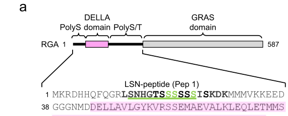

## Question

# Gene Research for Functional Annotation

## ⚠️ CRITICAL: Gene/Protein Identification Context

**BEFORE YOU BEGIN RESEARCH:** You MUST verify you are researching the CORRECT gene/protein. Gene symbols can be ambiguous, especially for less well-characterized genes from non-model organisms.

### Target Gene/Protein Identity (from UniProt):
- **UniProt Accession:** Q9SLH3
- **Protein Description:** RecName: Full=DELLA protein RGA {ECO:0000303|PubMed:9490740}; AltName: Full=GAI-related sequence {ECO:0000303|PubMed:9389651}; AltName: Full=GRAS family protein 10; Short=AtGRAS-10; AltName: Full=Repressor on the ga1-3 mutant {ECO:0000303|PubMed:9389651}; AltName: Full=Restoration of growth on ammonia protein 1 {ECO:0000303|PubMed:9237632};
- **Gene Information:** Name=RGA {ECO:0000303|PubMed:9490740}; Synonyms=GRS {ECO:0000303|PubMed:9389651}, RGA1 {ECO:0000303|PubMed:9237632}; OrderedLocusNames=At2g01570 {ECO:0000312|Araport:AT2G01570}; ORFNames=F2I9.19 {ECO:0000312|EMBL:AAC67333.1};
- **Organism (full):** Arabidopsis thaliana (Mouse-ear cress).
- **Protein Family:** Belongs to the GRAS family. DELLA subfamily. .
- **Key Domains:** DELLA_N_sf. (IPR038088); TF_DELLA_N. (IPR021914); TF_GRAS. (IPR005202); DELLA (PF12041); GRAS (PF03514)

### MANDATORY VERIFICATION STEPS:

1. **Check if the gene symbol "RGA" matches the protein description above**
2. **Verify the organism is correct:** Arabidopsis thaliana (Mouse-ear cress).
3. **Check if protein family/domains align with what you find in literature**
4. **If you find literature for a DIFFERENT gene with the same or similar symbol, STOP**

### If Gene Symbol is Ambiguous or You Cannot Find Relevant Literature:

**DO NOT PROCEED WITH RESEARCH ON A DIFFERENT GENE.** Instead:
- State clearly: "The gene symbol 'RGA' is ambiguous or literature is limited for this specific protein"
- Explain what you found (e.g., "Found extensive literature on a different gene with the same symbol in a different organism")
- Describe the protein based ONLY on the UniProt information provided above
- Suggest that the protein function can be inferred from domain/family information

### Research Target:

Please provide a comprehensive research report on the gene **RGA** (gene ID: RGA, UniProt: Q9SLH3) in ARATH.

The research report should be a detailed narrative explaining the function, biological processes, and localization of the gene product. Citations should be given for all claims.

You should prioritize authoritative reviews and primary scientific literature when conducting research. You can supplement
this with annotations you find in gene/protein databases, but these can be outdated or inaccurate.

We are specifically interested in the primary function of the gene - for enzymes, what reaction is catalyzed, and what is the substrate specificity? For transporters, what is the substrate? For structural proteins or adapters, what is the broader structural role? For signaling molecules, what is the role in the pathway.

We are interested in where in or outside the cell the gene product carries out its function.

We are also interested in the signaling or biochemical pathways in which the gene functions. We are less interested in broad pleiotropic effects, except where these elucidate the precise role.

Include evidence where possible. We are interested in both experimental evidence as well as inference from structure, evolution, or bioinformatic analysis. Precise studies should be prioritized over high-throughput, where available.

## Output

Question: You are an expert researcher providing comprehensive, well-cited information.

Provide detailed information focusing on:
1. Key concepts and definitions with current understanding
2. Recent developments and latest research (prioritize 2023-2024 sources)
3. Current applications and real-world implementations
4. Expert opinions and analysis from authoritative sources
5. Relevant statistics and data from recent studies

Format as a comprehensive research report with proper citations. Include URLs and publication dates where available.
Always prioritize recent, authoritative sources and provide specific citations for all major claims.

# Gene Research for Functional Annotation

## ⚠️ CRITICAL: Gene/Protein Identification Context

**BEFORE YOU BEGIN RESEARCH:** You MUST verify you are researching the CORRECT gene/protein. Gene symbols can be ambiguous, especially for less well-characterized genes from non-model organisms.

### Target Gene/Protein Identity (from UniProt):
- **UniProt Accession:** Q9SLH3
- **Protein Description:** RecName: Full=DELLA protein RGA {ECO:0000303|PubMed:9490740}; AltName: Full=GAI-related sequence {ECO:0000303|PubMed:9389651}; AltName: Full=GRAS family protein 10; Short=AtGRAS-10; AltName: Full=Repressor on the ga1-3 mutant {ECO:0000303|PubMed:9389651}; AltName: Full=Restoration of growth on ammonia protein 1 {ECO:0000303|PubMed:9237632};
- **Gene Information:** Name=RGA {ECO:0000303|PubMed:9490740}; Synonyms=GRS {ECO:0000303|PubMed:9389651}, RGA1 {ECO:0000303|PubMed:9237632}; OrderedLocusNames=At2g01570 {ECO:0000312|Araport:AT2G01570}; ORFNames=F2I9.19 {ECO:0000312|EMBL:AAC67333.1};
- **Organism (full):** Arabidopsis thaliana (Mouse-ear cress).
- **Protein Family:** Belongs to the GRAS family. DELLA subfamily. .
- **Key Domains:** DELLA_N_sf. (IPR038088); TF_DELLA_N. (IPR021914); TF_GRAS. (IPR005202); DELLA (PF12041); GRAS (PF03514)

### MANDATORY VERIFICATION STEPS:

1. **Check if the gene symbol "RGA" matches the protein description above**
2. **Verify the organism is correct:** Arabidopsis thaliana (Mouse-ear cress).
3. **Check if protein family/domains align with what you find in literature**
4. **If you find literature for a DIFFERENT gene with the same or similar symbol, STOP**

### If Gene Symbol is Ambiguous or You Cannot Find Relevant Literature:

**DO NOT PROCEED WITH RESEARCH ON A DIFFERENT GENE.** Instead:
- State clearly: "The gene symbol 'RGA' is ambiguous or literature is limited for this specific protein"
- Explain what you found (e.g., "Found extensive literature on a different gene with the same symbol in a different organism")
- Describe the protein based ONLY on the UniProt information provided above
- Suggest that the protein function can be inferred from domain/family information

### Research Target:

Please provide a comprehensive research report on the gene **RGA** (gene ID: RGA, UniProt: Q9SLH3) in ARATH.

The research report should be a detailed narrative explaining the function, biological processes, and localization of the gene product. Citations should be given for all claims.

You should prioritize authoritative reviews and primary scientific literature when conducting research. You can supplement
this with annotations you find in gene/protein databases, but these can be outdated or inaccurate.

We are specifically interested in the primary function of the gene - for enzymes, what reaction is catalyzed, and what is the substrate specificity? For transporters, what is the substrate? For structural proteins or adapters, what is the broader structural role? For signaling molecules, what is the role in the pathway.

We are interested in where in or outside the cell the gene product carries out its function.

We are also interested in the signaling or biochemical pathways in which the gene functions. We are less interested in broad pleiotropic effects, except where these elucidate the precise role.

Include evidence where possible. We are interested in both experimental evidence as well as inference from structure, evolution, or bioinformatic analysis. Precise studies should be prioritized over high-throughput, where available.

## Research report: Arabidopsis thaliana RGA (UniProt Q9SLH3; AT2G01570)

### Executive summary
REPRESSOR OF ga1-3 (RGA; UniProt Q9SLH3; locus AT2G01570) is a nuclear DELLA-subfamily GRAS protein that functions as a master transcriptional regulator in gibberellin (GA) signaling and broader growth–environment integration. RGA does not bind DNA directly; instead, it acts through protein–protein interactions with transcription factors (TFs) and chromatin components, including histone H2A, to reprogram gene expression. GA perception by GID1 triggers RGA inactivation primarily via SCF^SLY1-mediated ubiquitination and proteasomal degradation, but recent structural work supports additional proteolysis-independent suppression mechanisms. 2023–2024 studies refined DELLA/RGA chromatin mechanisms (H2A binding essential for genome-wide regulation) and discovered phosphorylation events in PolyS/PolyS-T regions that enhance RGA chromatin engagement without changing GA-induced degradation, and these insights have already enabled real-world implementations such as an RGA-derived GA signaling biosensor. (huang2024phosphorylationactivatesmaster pages 1-2, huang2023themastergrowth pages 5-9, shani2024highlightsingibberellin pages 7-8, huang2024phosphorylationactivatesmaster pages 4-5, shi2024aquantitativegibberellin pages 1-2)

### 1) Target verification and definitions (disambiguation)
**Identity confirmation.** The target is Arabidopsis thaliana **DELLA protein RGA** (REPRESSOR OF ga1-3), explicitly treated as an Arabidopsis DELLA member in recent primary literature and identified as **AT2G01570** in a 2024 Nature Communications study (huang2024phosphorylationactivatesmaster pages 10-11). DELLA proteins are a subfamily within the GRAS family defined by a characteristic **N-terminal DELLA regulatory domain** and a **C-terminal GRAS domain** (huang2024phosphorylationactivatesmaster pages 1-2). 

**Core concept: DELLA proteins.** DELLAs are “master growth regulators” that repress GA responses; GA binding to its receptor promotes DELLA inactivation, classically by targeted degradation (shani2024highlightsingibberellin pages 7-8). RGA is one of the Arabidopsis DELLA proteins and is studied as a representative DELLA regulator in mechanistic work on GA signaling and transcriptional reprogramming (huang2024phosphorylationactivatesmaster pages 1-2, shani2024highlightsingibberellin pages 7-8).

### 2) Molecular function and current mechanistic understanding
#### 2.1 RGA is a nuclear transcriptional regulator (not an enzyme)
RGA is described as a **nuclear-localized transcription regulator** that controls expression of GA-responsive and other genes via protein interactions rather than catalytic activity (huang2024phosphorylationactivatesmaster pages 1-2, shani2024highlightsingibberellin pages 7-8). A 2024 Plant Physiology review summarizes that DELLAs are nucleus-localized regulators that generally do not bind DNA directly and instead control transcription by interacting with many TFs and transcriptional regulators, with chromatin association detectable by ChIP/ChIP-seq (shani2024highlightsingibberellin pages 7-8).

#### 2.2 Domain architecture and “division of labor” across subdomains
RGA contains:
- An N-terminal **DELLA regulatory domain** (with conserved motifs **DELLA, LExLE, VHYNP**) important for GA receptor binding and GA responsiveness (islam2025structuralanalysesof pages 1-4, dahal2025structuralinsightsinto pages 1-2).
- A C-terminal **GRAS domain** comprising conserved subdomains **LHR1, VHIID, LHR2, PFYRE, SAW** (huang2024phosphorylationactivatesmaster pages 1-2, alabadi2025greenrevolutiondella pages 6-7).

Mechanistic mapping from recent synthesis and experiments indicates:
- **LHR1** is crucial for binding DELLA-interacting TFs/transcription regulators (alabadi2025greenrevolutiondella pages 6-7).
- **PFYRE** mediates **histone H2A binding**, stabilizing RGA at chromatin (alabadi2025greenrevolutiondella pages 6-7, huang2024phosphorylationactivatesmaster pages 1-2).
- **VHIID/LHR2** contribute to interactions relevant to F-box binding (and thus degradation control) (huang2024phosphorylationactivatesmaster pages 2-3, alabadi2025greenrevolutiondella pages 6-7).

#### 2.3 Chromatin mechanism: TF recruitment + H2A stabilization
A key 2023 Nature Plants study concluded that **DELLA binding to histone H2A is essential for DELLA-mediated global transcription regulation**, using new RGA missense alleles and ChIP-seq/biochemical assays to support a TF–RGA–H2A model (huang2023themastergrowth pages 5-9). This model is elaborated in 2024 work: RGA is recruited to target promoters by TFs (via LHR1) and stabilized by **histone H2A** (via PFYRE), with formation of a stable TF–RGA–H2A complex being essential for robust transcriptional regulation (huang2024phosphorylationactivatesmaster pages 1-2).

**Quantitative dataset (recent statistic).** Integrating ChIP-seq and RNA-seq, the 2023 Nature Plants study identified RGA as a **direct repressor of 129 genes** and a **direct activator of 280 genes** (huang2023themastergrowth pages 5-9). This supports a modern view of DELLAs as context-dependent transcriptional regulators (coactivator/corepressor roles) rather than simple repressors.

### 3) Pathway placement: canonical GA–GID1–DELLA–SCF^SLY1 module
#### 3.1 Canonical proteolysis-dependent inactivation
In the canonical pathway:
1. Bioactive **GA binds GID1**; GA induces a “lid” conformational change in GID1 that promotes DELLA binding (shani2024highlightsingibberellin pages 7-8).
2. GA–GID1 binds the **DELLA domain** of RGA (conserved DELLA/LExLE/VHYNP motifs) to form a GA–GID1–RGA complex (islam2025structuralanalysesof pages 1-4, dahal2025structuralinsightsinto pages 1-2).
3. This complex enhances recognition by **SCF^SLY1/GID2** (F-box-containing E3 ligase), leading to DELLA **polyubiquitination** and **26S proteasome degradation** (shani2024highlightsingibberellin pages 7-8, islam2025structuralanalysesof pages 1-4).

A key genetic hallmark is that deletion of the DELLA motif (e.g., rga-Δ17) abolishes GA-induced degradation and causes a GA-unresponsive dwarf phenotype (shani2024highlightsingibberellin pages 7-8).

#### 3.2 Proteolysis-independent suppression and structural insights
Recent cryo-EM/structural work supports that GA–GID1 can suppress DELLA output beyond degradation. Specifically, **GID1 binding to the RGA GRAS domain can block interactions with TF targets (e.g., IDD family)**, providing a proteolysis-independent suppression mechanism (dahal2025structuralinsightsinto pages 1-2, dahal2025structuralinsightsinto pages 2-3). A 2025 bioRxiv structural analysis reports cryo-EM structures of **GID1A–GA3–RGA** and **GID1A–GA3–RGA–SLY1–ASK2**, showing non-overlapping interfaces and suggesting that when RGA is engaged by SLY1 it cannot simultaneously bind IDD TFs (mutual exclusivity between degradation-targeting and TF-binding surfaces) (islam2025structuralanalysesof pages 1-4).

**Recent quantitative structural data.** The reported cryo-EM resolutions include **2.66 Å and 2.80 Å** for complexes in one study (islam2025structuralanalysesof pages 1-4) and **2.72 Å** for a quaternary complex in another study (dahal2025structuralinsightsinto pages 4-5).

### 4) Subcellular localization
RGA is described as **nuclear-localized**, consistent with its transcriptional regulatory function and its promoter/chromatin association (huang2024phosphorylationactivatesmaster pages 1-2, shani2024highlightsingibberellin pages 7-8). 2024 phosphorylation work also reports that phosphorylation does **not** alter RGA nuclear localization while changing chromatin engagement (huang2024phosphorylationactivatesmaster pages 4-5).

### 5) Recent developments (prioritizing 2023–2024)
#### 5.1 2023: H2A binding as an essential, genome-wide mechanism
The 2023 Nature Plants study provided strong evidence that RGA binding to histone H2A is essential for genome-wide chromatin association and global transcriptional regulation (huang2023themastergrowth pages 5-9). This advanced the field from a “TF sequestration” model toward a chromatin-stabilization model in which DELLAs act as chromatin-bound regulators at many loci.

#### 5.2 2024: Phosphorylation activates RGA by promoting H2A binding at chromatin
A 2024 Nature Communications study mapped in vivo phosphorylation sites and showed that phosphorylation in serine/threonine-rich regions (Pep1/PolyS and Pep2/PolyS-T) **enhances RGA activity** by promoting histone H2A binding and association with target promoters, without measurably affecting GA-induced degradation or TF interactions (huang2024phosphorylationactivatesmaster pages 1-2, huang2024phosphorylationactivatesmaster pages 4-5). Phosphorylation is concentrated in **Pep1** (LSNHGTSSSSSSISK…) and **Pep2** ((LK)SCSSPDSMVTSTSTGTQIGK), and Pep2 phosphorylation has a stronger functional effect (huang2024phosphorylationactivatesmaster pages 4-5).

**Quantitative PTM statistic.** The same 2024 study quantified high O-GlcNAcylation on a poly-T “GVI peptide” (GVIGTTVTTTTTTTTAAGESTR), reported as ~**69.7% in ga1** (GA-deficient) background (huang2024phosphorylationactivatesmaster pages 4-5). These measurements support a multi-PTM “rheostat” model for DELLA output.

#### 5.3 2024: RGA-engineering enables a quantitative GA signaling biosensor
A 2024 Nature Communications study engineered a **ratiometric GA signaling biosensor** by modifying an RGA/DELLA protein to suppress master transcriptional output while preserving GA-dependent degradation (shi2024aquantitativegibberellin pages 1-2). This biosensor mapped high GA signaling at the shoot apical meristem in cells between organ primordia (internode precursors) and connected GA to internode specification via regulation of cell division plane orientation (shi2024aquantitativegibberellin pages 1-2).

### 6) Post-translational regulation (PTMs) and expert synthesis
Recent primary and review sources agree that DELLA/RGA activity is extensively regulated post-translationally. In addition to the canonical GA-triggered ubiquitination/proteolysis route (shani2024highlightsingibberellin pages 7-8, islam2025structuralanalysesof pages 1-4), 2023–2024 evidence supports phosphorylation as a chromatin-engagement enhancer (huang2024phosphorylationactivatesmaster pages 4-5). The 2024 phosphorylation paper also summarizes that other PTMs can modulate DELLA interactions: **O-fucosylation** can enhance DELLA–TF interactions whereas **O-GlcNAcylation** can inhibit DELLA activity, emphasizing that DELLA output is not dictated solely by protein abundance (huang2024phosphorylationactivatesmaster pages 2-3, huang2024phosphorylationactivatesmaster pages 4-5).

Authoritative expert synthesis (Annual Review of Plant Biology) emphasizes DELLAs (including RGA) as interaction hubs that coordinate diverse signaling pathways and details GRAS-subdomain functions (e.g., LHR1 for TF binding; PFYRE for H2A binding) (alabadi2025greenrevolutiondella pages 6-7).

### 7) Current applications and real-world implementations
#### 7.1 Plant architecture and growth control (Green Revolution context)
A 2024 Plant Physiology review reiterates that semidwarf varieties central to the Green Revolution were later shown to be defective in GA biosynthesis or action, linking GA–DELLA modules to agricultural dwarfing traits (shani2024highlightsingibberellin pages 1-2). Although RGA itself is from Arabidopsis, DELLA/GA pathway logic is conserved and informs breeding/engineering strategies across crops.

#### 7.2 Biosensing and developmental mapping (direct 2024 implementation)
The RGA-derived degradation-based biosensor is a concrete modern implementation enabling spatial mapping of GA signaling and mechanistic discovery at cellular resolution (shi2024aquantitativegibberellin pages 1-2).

#### 7.3 Engineering stress resilience/yield via DELLA modification (crop example)
A 2024 crop study in rice showed that increasing SUMOylated DELLA (SLR1) levels improved yield under salt stress, likely by altering DELLA interaction networks and GA biosynthesis gene expression (fernandes2024sumoylationofrice pages 1-2). While not Arabidopsis RGA, this represents a translational implementation of DELLA post-translational tuning conceptually aligned with RGA PTM regulation.

### 8) Visual evidence (domain architecture and mechanism)
The following images from the 2024 Nature Communications RGA phosphorylation study provide a compact visual summary of (i) RGA domain organization (DELLA, PolyS/PolyS-T, GRAS), (ii) GRAS subdomains including LHR1 and PFYRE, and (iii) a mechanistic model for phosphorylation-enhanced TF–RGA–H2A chromatin complex formation (huang2024phosphorylationactivatesmaster media bd4c17d2, huang2024phosphorylationactivatesmaster media 0e1bf6cb, huang2024phosphorylationactivatesmaster media 4477eb36).

### 9) High-confidence functional annotation (concise statement)
**Primary function:** RGA is a nuclear DELLA/GRAS transcriptional regulator that integrates GA perception into transcriptional reprogramming by binding TFs (for promoter recruitment) and histone H2A (for chromatin stabilization), thereby controlling expression of growth and developmental genes; GA–GID1 signaling inactivates RGA primarily via SCF^SLY1-dependent ubiquitination and proteasomal degradation, with additional GA–GID1-mediated proteolysis-independent suppression possible via blocking TF interactions. (huang2024phosphorylationactivatesmaster pages 1-2, huang2023themastergrowth pages 5-9, shani2024highlightsingibberellin pages 7-8, dahal2025structuralinsightsinto pages 1-2)

---

## Evidence map (table)
| Aspect | Key points | Best supporting citations (pqac ids) | Primary sources (author-year, journal, date, URL) |
|---|---|---|---|
| Identity/Domains | RGA is the Arabidopsis thaliana DELLA protein REPRESSOR OF ga1-3, encoded by AT2G01570/UniProt Q9SLH3, in the GRAS family/DELLA subfamily. It has an N-terminal DELLA regulatory region and a C-terminal GRAS domain with conserved subdomains LHR1, VHIID, LHR2, PFYRE, SAW; DELLA/LExLE/VHYNP motifs mediate GA receptor interaction. | (huang2024phosphorylationactivatesmaster pages 1-2, huang2024phosphorylationactivatesmaster pages 10-11, alabadi2025greenrevolutiondella pages 6-7, islam2025structuralanalysesof pages 1-4) | Huang et al., 2024, Nature Communications, Sep 2024, https://doi.org/10.1038/s41467-024-52033-x; Alabadí & Sun, 2025, Annual Review of Plant Biology, Dec 2025, https://doi.org/10.1146/annurev-arplant-053124-050732; Islam et al., 2025, bioRxiv, Feb 2025, https://doi.org/10.1101/2025.02.08.637281 |
| Molecular function | RGA is a nuclear transcriptional regulator, not a catalytic enzyme or transporter. It regulates gene expression mainly through protein–protein interactions with transcription factors/transcriptional regulators and chromatin components, acting as both direct repressor and activator at different loci. | (huang2024phosphorylationactivatesmaster pages 1-2, huang2023themastergrowth pages 5-9, alabadi2025greenrevolutiondella pages 4-6, shani2024highlightsingibberellin pages 7-8) | Huang et al., 2024, Nature Communications, Sep 2024, https://doi.org/10.1038/s41467-024-52033-x; Huang et al., 2023, Nature Plants, Aug 2023, https://doi.org/10.1038/s41477-023-01477-y; Shani et al., 2024, Plant Physiology, Jan 2024, https://doi.org/10.1093/plphys/kiae044 |
| Mechanism in GA signaling | Canonical pathway: bioactive GA binds GID1; GA-bound GID1 closes its lid and binds the DELLA domain of RGA; the GA–GID1–RGA complex is recognized by SCF^SLY1/GID2, causing polyubiquitination and 26S proteasomal degradation of RGA, thereby relieving growth repression. Structural work also supports proteolysis-independent suppression because GID1 binding to RGA can block transcription-factor interactions. | (shani2024highlightsingibberellin pages 7-8, islam2025structuralanalysesof pages 1-4, dahal2025structuralinsightsinto pages 1-2, dahal2025structuralinsightsinto pages 4-5) | Shani et al., 2024, Plant Physiology, Jan 2024, https://doi.org/10.1093/plphys/kiae044; Islam et al., 2025, bioRxiv, Feb 2025, https://doi.org/10.1101/2025.02.08.637281; Dahal et al., 2025, PNAS, Aug 2025, https://doi.org/10.1073/pnas.2511012122 |
| Chromatin mechanism | RGA is recruited to promoters by TF binding through LHR1 and stabilized on chromatin by histone H2A binding through the PFYRE subdomain, forming TF–RGA–H2A complexes. ChIP-seq and mutant analyses show H2A binding is essential for global chromatin association and transcriptional regulation. | (alabadi2025greenrevolutiondella pages 6-7, huang2023phosphorylationpromotesdella pages 29-31, huang2024phosphorylationactivatesmaster pages 1-2, huang2023themastergrowth pages 5-9) | Huang et al., 2023, Nature Plants, Aug 2023, https://doi.org/10.1038/s41477-023-01477-y; Huang et al., 2024, Nature Communications, Sep 2024, https://doi.org/10.1038/s41467-024-52033-x |
| PTMs | RGA activity is modulated by several PTMs. 2023–2024 work mapped phosphorylation mainly to PolyS/Pep1 and PolyS/T/Pep2 regions; phosphorylation promotes H2A binding and promoter association but does not measurably change nuclear localization or GA-induced degradation. Prior work cited in these papers indicates O-fucosylation enhances DELLA–TF interactions, O-GlcNAcylation inhibits them, and SUMOylation can stabilize DELLAs; Arabidopsis GAI SUMOylation at K49 is highlighted in review literature. | (huang2023phosphorylationpromotesdella pages 9-12, huang2024phosphorylationactivatesmaster pages 4-5, huang2024phosphorylationactivatesmaster pages 1-2, alabadi2025greenrevolutiondella pages 14-16) | Huang et al., 2024, Nature Communications, Sep 2024, https://doi.org/10.1038/s41467-024-52033-x; Huang et al., 2023, bioRxiv, Oct 2023, https://doi.org/10.1101/2023.10.10.561786; Alabadí & Sun, 2025, Annual Review of Plant Biology, Dec 2025, https://doi.org/10.1146/annurev-arplant-053124-050732 |
| Key interaction partners | Core upstream partners are GID1A/B/C and SLY1/ASK1(2). Downstream/functional partners include multiple TF families and regulators such as PIF3, PIF4, BZR1, IDD proteins (e.g., IDD1, IDD3), MYC2, MED15, and histone H2A. Different GRAS subdomains contribute to these interactions. | (alabadi2025greenrevolutiondella pages 6-7, huang2023themastergrowth pages 5-9, dahal2025structuralinsightsinto pages 6-6, dahal2025structuralinsightsinto pages 4-5) | Huang et al., 2023, Nature Plants, Aug 2023, https://doi.org/10.1038/s41477-023-01477-y; Dahal et al., 2025, PNAS, Aug 2025, https://doi.org/10.1073/pnas.2511012122; Huang et al., 2024, Nature Communications, Sep 2024, https://doi.org/10.1038/s41467-024-52033-x |
| Subcellular localization | RGA is described as a nuclear-localized transcriptional regulator acting at target chromatin. Functional evidence places it in promoter-associated complexes with TFs and histone H2A. | (huang2024phosphorylationactivatesmaster pages 1-2, shani2024highlightsingibberellin pages 7-8) | Huang et al., 2024, Nature Communications, Sep 2024, https://doi.org/10.1038/s41467-024-52033-x; Shani et al., 2024, Plant Physiology, Jan 2024, https://doi.org/10.1093/plphys/kiae044 |
| Recent 2023-2024 advances | Major recent advances include: (1) demonstration that DELLA/RGA binding to histone H2A is essential for genome-wide transcription regulation (2023); (2) identification of phosphorylation-based activation of RGA via enhanced H2A binding and chromatin association (2024); (3) engineering of an RGA-derived ratiometric GA signaling biosensor that preserves degradation but suppresses transcriptional repression (2024). | (huang2023themastergrowth pages 5-9, huang2024phosphorylationactivatesmaster pages 4-5, shi2024aquantitativegibberellin pages 1-2) | Huang et al., 2023, Nature Plants, Aug 2023, https://doi.org/10.1038/s41477-023-01477-y; Huang et al., 2024, Nature Communications, Sep 2024, https://doi.org/10.1038/s41467-024-52033-x; Shi et al., 2024, Nature Communications, May 2024, https://doi.org/10.1038/s41467-024-48116-4 |
| Applications/implementations | DELLA biology underpins Green Revolution semi-dwarfing strategies and modern crop engineering. Recent implementations include an RGA-based GA biosensor for mapping GA signaling in the shoot apical meristem and crop DELLA manipulation (e.g., SUMOylated rice SLR1) to protect yield under salinity. RGA alleles/constructs can confer GA-unresponsive dwarf phenotypes in experimental systems. | (shi2024aquantitativegibberellin pages 1-2, fernandes2024sumoylationofrice pages 1-2, huang2023themastergrowth pages 1-5, shani2024highlightsingibberellin pages 1-2) | Shi et al., 2024, Nature Communications, May 2024, https://doi.org/10.1038/s41467-024-48116-4; Fernandes et al., 2024, Planta, Nov 2024, https://doi.org/10.1007/s00425-024-04565-1; Shani et al., 2024, Plant Physiology, Jan 2024, https://doi.org/10.1093/plphys/kiae044 |
| Quantitative/statistical data | ChIP-seq/RNA-seq integration identified RGA as a direct repressor of 129 genes and direct activator of 280 genes. A GA biosensor study reported cryo-EM-inspired engineered RGA variants and mapped high GA signaling to internode precursor cells in the SAM. Structural studies resolved GID1A–GA3–RGA and GID1A–GA3–RGA–SLY1–ASK2/ASK1 complexes at 2.66–2.80 Å or 2.72 Å. PTM mapping quantified high O-GlcNAcylation (~69.7% in ga1) on a poly-T GVI peptide and showed additive loss of activity in phospho-abolishing m12A mutants. | (huang2023themastergrowth pages 5-9, islam2025structuralanalysesof pages 1-4, dahal2025structuralinsightsinto pages 4-5, huang2024phosphorylationactivatesmaster pages 4-5, shi2024aquantitativegibberellin pages 1-2) | Huang et al., 2023, Nature Plants, Aug 2023, https://doi.org/10.1038/s41477-023-01477-y; Islam et al., 2025, bioRxiv, Feb 2025, https://doi.org/10.1101/2025.02.08.637281; Dahal et al., 2025, PNAS, Aug 2025, https://doi.org/10.1073/pnas.2511012122; Huang et al., 2024, Nature Communications, Sep 2024, https://doi.org/10.1038/s41467-024-52033-x; Shi et al., 2024, Nature Communications, May 2024, https://doi.org/10.1038/s41467-024-48116-4 |

*Table: This table condenses the functional annotation of Arabidopsis RGA (Q9SLH3/AT2G01570), emphasizing validated molecular function, GA signaling mechanism, chromatin biology, PTMs, and recent 2023–2024 advances. It is useful as a high-density evidence map linking each annotation point to specific primary sources and context IDs.*

### Key recent sources (URLs and publication dates)
- Huang X. et al. **“The master growth regulator DELLA binding to histone H2A is essential for DELLA-mediated global transcription regulation.”** *Nature Plants* (Aug 2023). https://doi.org/10.1038/s41477-023-01477-y (huang2023themastergrowth pages 5-9)
- Shani E. et al. **“Highlights in gibberellin research: A tale of the dwarf and the slender.”** *Plant Physiology* (Jan 2024). https://doi.org/10.1093/plphys/kiae044 (shani2024highlightsingibberellin pages 7-8)
- Shi B. et al. **“A quantitative gibberellin signaling biosensor reveals a role for gibberellins in internode specification at the shoot apical meristem.”** *Nature Communications* (May 2024). https://doi.org/10.1038/s41467-024-48116-4 (shi2024aquantitativegibberellin pages 1-2)
- Huang X. et al. **“Phosphorylation activates master growth regulator DELLA by promoting histone H2A binding at chromatin in Arabidopsis.”** *Nature Communications* (Sep 2024). https://doi.org/10.1038/s41467-024-52033-x (huang2024phosphorylationactivatesmaster pages 4-5)
- Fernandes T. et al. **“SUMOylation of rice DELLA SLR1 modulates transcriptional responses and improves yield under salt stress.”** *Planta* (Nov 2024). https://doi.org/10.1007/s00425-024-04565-1 (fernandes2024sumoylationofrice pages 1-2)

References

1. (huang2024phosphorylationactivatesmaster pages 1-2): Xu Huang, Rodolfo Zentella, Jeongmoo Park, Larry Reser, Dina L. Bai, Mark M. Ross, Jeffrey Shabanowitz, Donald F. Hunt, and Tai-ping Sun. Phosphorylation activates master growth regulator della by promoting histone h2a binding at chromatin in arabidopsis. Nature Communications, Sep 2024. URL: https://doi.org/10.1038/s41467-024-52033-x, doi:10.1038/s41467-024-52033-x. This article has 11 citations and is from a highest quality peer-reviewed journal.

2. (huang2023themastergrowth pages 5-9): Xu Huang, Hao Tian, Jeongmoo Park, Dong-Ha Oh, Jianhong Hu, Rodolfo Zentella, Hong Qiao, Maheshi Dassanayake, and Tai-Ping Sun. The master growth regulator della binding to histone h2a is essential for della-mediated global transcription regulation. Nature Plants, 9:1291-1305, Aug 2023. URL: https://doi.org/10.1038/s41477-023-01477-y, doi:10.1038/s41477-023-01477-y. This article has 34 citations and is from a highest quality peer-reviewed journal.

3. (shani2024highlightsingibberellin pages 7-8): Eilon Shani, Peter Hedden, and Tai-ping Sun. Highlights in gibberellin research: a tale of the dwarf and the slender. Plant Physiology, 195:111-134, Jan 2024. URL: https://doi.org/10.1093/plphys/kiae044, doi:10.1093/plphys/kiae044. This article has 92 citations and is from a highest quality peer-reviewed journal.

4. (huang2024phosphorylationactivatesmaster pages 4-5): Xu Huang, Rodolfo Zentella, Jeongmoo Park, Larry Reser, Dina L. Bai, Mark M. Ross, Jeffrey Shabanowitz, Donald F. Hunt, and Tai-ping Sun. Phosphorylation activates master growth regulator della by promoting histone h2a binding at chromatin in arabidopsis. Nature Communications, Sep 2024. URL: https://doi.org/10.1038/s41467-024-52033-x, doi:10.1038/s41467-024-52033-x. This article has 11 citations and is from a highest quality peer-reviewed journal.

5. (shi2024aquantitativegibberellin pages 1-2): Bihai Shi, Amelia Felipo-Benavent, Guillaume Cerutti, Carlos Galvan-Ampudia, Lucas Jilli, Geraldine Brunoud, Jérome Mutterer, Elody Vallet, Lali Sakvarelidze-Achard, Jean-Michel Davière, Alejandro Navarro-Galiano, Ankit Walia, Shani Lazary, Jonathan Legrand, Roy Weinstain, Alexander M. Jones, Salomé Prat, Patrick Achard, and Teva Vernoux. A quantitative gibberellin signaling biosensor reveals a role for gibberellins in internode specification at the shoot apical meristem. Nature Communications, May 2024. URL: https://doi.org/10.1038/s41467-024-48116-4, doi:10.1038/s41467-024-48116-4. This article has 37 citations and is from a highest quality peer-reviewed journal.

6. (huang2024phosphorylationactivatesmaster pages 10-11): Xu Huang, Rodolfo Zentella, Jeongmoo Park, Larry Reser, Dina L. Bai, Mark M. Ross, Jeffrey Shabanowitz, Donald F. Hunt, and Tai-ping Sun. Phosphorylation activates master growth regulator della by promoting histone h2a binding at chromatin in arabidopsis. Nature Communications, Sep 2024. URL: https://doi.org/10.1038/s41467-024-52033-x, doi:10.1038/s41467-024-52033-x. This article has 11 citations and is from a highest quality peer-reviewed journal.

7. (islam2025structuralanalysesof pages 1-4): Soyaab Islam, KunWoong Park, Eunju Kwon, and Dong Young Kim. Structural analyses of gibberellin-mediated della protein degradation. bioRxiv, Feb 2025. URL: https://doi.org/10.1101/2025.02.08.637281, doi:10.1101/2025.02.08.637281. This article has 0 citations.

8. (dahal2025structuralinsightsinto pages 1-2): Pawan Dahal, Yan Wang, Jianhong Hu, Jeongmoo Park, Karly Forker, Zhong-Lin Zhang, Kedar Sharma, Mario J. Borgnia, Tai-ping Sun, and Pei Zhou. Structural insights into proteolysis-dependent and -independent suppression of the master regulator della by the gibberellin receptor. Proceedings of the National Academy of Sciences of the United States of America, 122 32:e2511012122, Aug 2025. URL: https://doi.org/10.1073/pnas.2511012122, doi:10.1073/pnas.2511012122. This article has 10 citations and is from a highest quality peer-reviewed journal.

9. (alabadi2025greenrevolutiondella pages 6-7): David Alabadí and Tai-ping Sun. Green revolution della proteins: functional analysis and regulatory mechanisms. Annual review of plant biology, Dec 2025. URL: https://doi.org/10.1146/annurev-arplant-053124-050732, doi:10.1146/annurev-arplant-053124-050732. This article has 24 citations and is from a domain leading peer-reviewed journal.

10. (huang2024phosphorylationactivatesmaster pages 2-3): Xu Huang, Rodolfo Zentella, Jeongmoo Park, Larry Reser, Dina L. Bai, Mark M. Ross, Jeffrey Shabanowitz, Donald F. Hunt, and Tai-ping Sun. Phosphorylation activates master growth regulator della by promoting histone h2a binding at chromatin in arabidopsis. Nature Communications, Sep 2024. URL: https://doi.org/10.1038/s41467-024-52033-x, doi:10.1038/s41467-024-52033-x. This article has 11 citations and is from a highest quality peer-reviewed journal.

11. (dahal2025structuralinsightsinto pages 2-3): Pawan Dahal, Yan Wang, Jianhong Hu, Jeongmoo Park, Karly Forker, Zhong-Lin Zhang, Kedar Sharma, Mario J. Borgnia, Tai-ping Sun, and Pei Zhou. Structural insights into proteolysis-dependent and -independent suppression of the master regulator della by the gibberellin receptor. Proceedings of the National Academy of Sciences of the United States of America, 122 32:e2511012122, Aug 2025. URL: https://doi.org/10.1073/pnas.2511012122, doi:10.1073/pnas.2511012122. This article has 10 citations and is from a highest quality peer-reviewed journal.

12. (dahal2025structuralinsightsinto pages 4-5): Pawan Dahal, Yan Wang, Jianhong Hu, Jeongmoo Park, Karly Forker, Zhong-Lin Zhang, Kedar Sharma, Mario J. Borgnia, Tai-ping Sun, and Pei Zhou. Structural insights into proteolysis-dependent and -independent suppression of the master regulator della by the gibberellin receptor. Proceedings of the National Academy of Sciences of the United States of America, 122 32:e2511012122, Aug 2025. URL: https://doi.org/10.1073/pnas.2511012122, doi:10.1073/pnas.2511012122. This article has 10 citations and is from a highest quality peer-reviewed journal.

13. (shani2024highlightsingibberellin pages 1-2): Eilon Shani, Peter Hedden, and Tai-ping Sun. Highlights in gibberellin research: a tale of the dwarf and the slender. Plant Physiology, 195:111-134, Jan 2024. URL: https://doi.org/10.1093/plphys/kiae044, doi:10.1093/plphys/kiae044. This article has 92 citations and is from a highest quality peer-reviewed journal.

14. (fernandes2024sumoylationofrice pages 1-2): Telma Fernandes, Nuno M. Gonçalves, Cleverson C. Matiolli, Mafalda A. A. Rodrigues, Pedro M. Barros, M. Margarida Oliveira, and Isabel A. Abreu. Sumoylation of rice della slr1 modulates transcriptional responses and improves yield under salt stress. Planta, Nov 2024. URL: https://doi.org/10.1007/s00425-024-04565-1, doi:10.1007/s00425-024-04565-1. This article has 11 citations and is from a peer-reviewed journal.

15. (huang2024phosphorylationactivatesmaster media bd4c17d2): Xu Huang, Rodolfo Zentella, Jeongmoo Park, Larry Reser, Dina L. Bai, Mark M. Ross, Jeffrey Shabanowitz, Donald F. Hunt, and Tai-ping Sun. Phosphorylation activates master growth regulator della by promoting histone h2a binding at chromatin in arabidopsis. Nature Communications, Sep 2024. URL: https://doi.org/10.1038/s41467-024-52033-x, doi:10.1038/s41467-024-52033-x. This article has 11 citations and is from a highest quality peer-reviewed journal.

16. (huang2024phosphorylationactivatesmaster media 0e1bf6cb): Xu Huang, Rodolfo Zentella, Jeongmoo Park, Larry Reser, Dina L. Bai, Mark M. Ross, Jeffrey Shabanowitz, Donald F. Hunt, and Tai-ping Sun. Phosphorylation activates master growth regulator della by promoting histone h2a binding at chromatin in arabidopsis. Nature Communications, Sep 2024. URL: https://doi.org/10.1038/s41467-024-52033-x, doi:10.1038/s41467-024-52033-x. This article has 11 citations and is from a highest quality peer-reviewed journal.

17. (huang2024phosphorylationactivatesmaster media 4477eb36): Xu Huang, Rodolfo Zentella, Jeongmoo Park, Larry Reser, Dina L. Bai, Mark M. Ross, Jeffrey Shabanowitz, Donald F. Hunt, and Tai-ping Sun. Phosphorylation activates master growth regulator della by promoting histone h2a binding at chromatin in arabidopsis. Nature Communications, Sep 2024. URL: https://doi.org/10.1038/s41467-024-52033-x, doi:10.1038/s41467-024-52033-x. This article has 11 citations and is from a highest quality peer-reviewed journal.

18. (alabadi2025greenrevolutiondella pages 4-6): David Alabadí and Tai-ping Sun. Green revolution della proteins: functional analysis and regulatory mechanisms. Annual review of plant biology, Dec 2025. URL: https://doi.org/10.1146/annurev-arplant-053124-050732, doi:10.1146/annurev-arplant-053124-050732. This article has 24 citations and is from a domain leading peer-reviewed journal.

19. (huang2023phosphorylationpromotesdella pages 29-31): Xu Huang, Rodolfo Zentella, Jeongmoo Park, Larry Reser, Dina L. Bai, Mark M. Ross, Jeffrey Shabanowitz, Donald F. Hunt, and Tai-ping Sun. Phosphorylation promotes della activity by enhancing its binding to histone h2a at target chromatin in arabidopsis. bioRxiv, Oct 2023. URL: https://doi.org/10.1101/2023.10.10.561786, doi:10.1101/2023.10.10.561786. This article has 1 citations.

20. (huang2023phosphorylationpromotesdella pages 9-12): Xu Huang, Rodolfo Zentella, Jeongmoo Park, Larry Reser, Dina L. Bai, Mark M. Ross, Jeffrey Shabanowitz, Donald F. Hunt, and Tai-ping Sun. Phosphorylation promotes della activity by enhancing its binding to histone h2a at target chromatin in arabidopsis. bioRxiv, Oct 2023. URL: https://doi.org/10.1101/2023.10.10.561786, doi:10.1101/2023.10.10.561786. This article has 1 citations.

21. (alabadi2025greenrevolutiondella pages 14-16): David Alabadí and Tai-ping Sun. Green revolution della proteins: functional analysis and regulatory mechanisms. Annual review of plant biology, Dec 2025. URL: https://doi.org/10.1146/annurev-arplant-053124-050732, doi:10.1146/annurev-arplant-053124-050732. This article has 24 citations and is from a domain leading peer-reviewed journal.

22. (dahal2025structuralinsightsinto pages 6-6): Pawan Dahal, Yan Wang, Jianhong Hu, Jeongmoo Park, Karly Forker, Zhong-Lin Zhang, Kedar Sharma, Mario J. Borgnia, Tai-ping Sun, and Pei Zhou. Structural insights into proteolysis-dependent and -independent suppression of the master regulator della by the gibberellin receptor. Proceedings of the National Academy of Sciences of the United States of America, 122 32:e2511012122, Aug 2025. URL: https://doi.org/10.1073/pnas.2511012122, doi:10.1073/pnas.2511012122. This article has 10 citations and is from a highest quality peer-reviewed journal.

23. (huang2023themastergrowth pages 1-5): Xu Huang, Hao Tian, Jeongmoo Park, Dong-Ha Oh, Jianhong Hu, Rodolfo Zentella, Hong Qiao, Maheshi Dassanayake, and Tai-Ping Sun. The master growth regulator della binding to histone h2a is essential for della-mediated global transcription regulation. Nature Plants, 9:1291-1305, Aug 2023. URL: https://doi.org/10.1038/s41477-023-01477-y, doi:10.1038/s41477-023-01477-y. This article has 34 citations and is from a highest quality peer-reviewed journal.

## Artifacts

- [Edison artifact artifact-00](RGA-deep-research-falcon_artifacts/artifact-00.md)

## Citations

1. huang2024phosphorylationactivatesmaster pages 10-11
2. huang2024phosphorylationactivatesmaster pages 1-2
3. shani2024highlightsingibberellin pages 7-8
4. alabadi2025greenrevolutiondella pages 6-7
5. huang2023themastergrowth pages 5-9
6. islam2025structuralanalysesof pages 1-4
7. dahal2025structuralinsightsinto pages 4-5
8. huang2024phosphorylationactivatesmaster pages 4-5
9. shi2024aquantitativegibberellin pages 1-2
10. shani2024highlightsingibberellin pages 1-2
11. fernandes2024sumoylationofrice pages 1-2
12. dahal2025structuralinsightsinto pages 1-2
13. huang2024phosphorylationactivatesmaster pages 2-3
14. dahal2025structuralinsightsinto pages 2-3
15. alabadi2025greenrevolutiondella pages 4-6
16. huang2023phosphorylationpromotesdella pages 29-31
17. huang2023phosphorylationpromotesdella pages 9-12
18. alabadi2025greenrevolutiondella pages 14-16
19. dahal2025structuralinsightsinto pages 6-6
20. huang2023themastergrowth pages 1-5
21. https://doi.org/10.1038/s41467-024-52033-x;
22. https://doi.org/10.1146/annurev-arplant-053124-050732;
23. https://doi.org/10.1101/2025.02.08.637281
24. https://doi.org/10.1038/s41477-023-01477-y;
25. https://doi.org/10.1093/plphys/kiae044
26. https://doi.org/10.1093/plphys/kiae044;
27. https://doi.org/10.1101/2025.02.08.637281;
28. https://doi.org/10.1073/pnas.2511012122
29. https://doi.org/10.1038/s41467-024-52033-x
30. https://doi.org/10.1101/2023.10.10.561786;
31. https://doi.org/10.1146/annurev-arplant-053124-050732
32. https://doi.org/10.1073/pnas.2511012122;
33. https://doi.org/10.1038/s41467-024-48116-4
34. https://doi.org/10.1038/s41467-024-48116-4;
35. https://doi.org/10.1007/s00425-024-04565-1;
36. https://doi.org/10.1038/s41477-023-01477-y
37. https://doi.org/10.1007/s00425-024-04565-1
38. https://doi.org/10.1038/s41467-024-52033-x,
39. https://doi.org/10.1038/s41477-023-01477-y,
40. https://doi.org/10.1093/plphys/kiae044,
41. https://doi.org/10.1038/s41467-024-48116-4,
42. https://doi.org/10.1101/2025.02.08.637281,
43. https://doi.org/10.1073/pnas.2511012122,
44. https://doi.org/10.1146/annurev-arplant-053124-050732,
45. https://doi.org/10.1007/s00425-024-04565-1,
46. https://doi.org/10.1101/2023.10.10.561786,