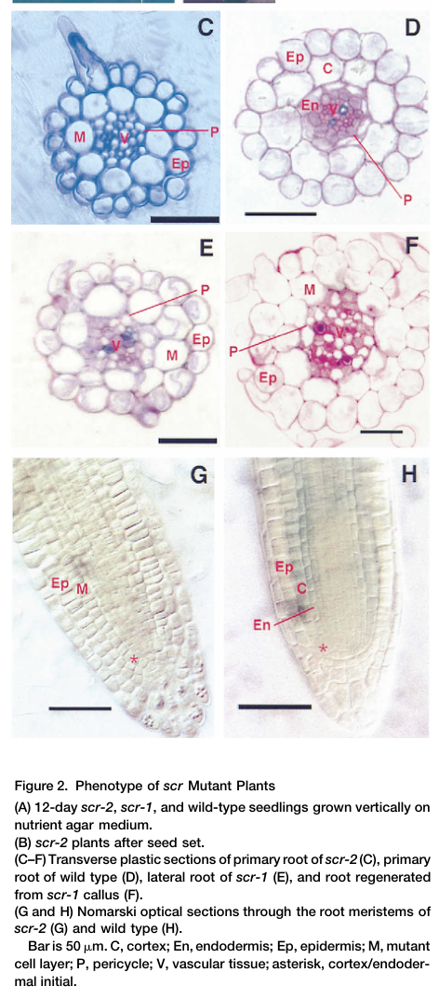

## Question

# Gene Research for Functional Annotation

## ⚠️ CRITICAL: Gene/Protein Identification Context

**BEFORE YOU BEGIN RESEARCH:** You MUST verify you are researching the CORRECT gene/protein. Gene symbols can be ambiguous, especially for less well-characterized genes from non-model organisms.

### Target Gene/Protein Identity (from UniProt):
- **UniProt Accession:** Q9M384
- **Protein Description:** RecName: Full=Protein SCARECROW {ECO:0000303|PubMed:8756724}; Short=AtSCR {ECO:0000303|PubMed:8756724}; AltName: Full=GRAS family protein 20; Short=AtGRAS-20; AltName: Full=Protein SHOOT GRAVITROPISM 1 {ECO:0000303|PubMed:9670559};
- **Gene Information:** Name=SCR {ECO:0000303|PubMed:8756724}; Synonyms=SGR1 {ECO:0000303|PubMed:9670559}; OrderedLocusNames=At3g54220 {ECO:0000312|Araport:AT3G54220}; ORFNames=F24B22.180 {ECO:0000312|EMBL:CAB70996.1};
- **Organism (full):** Arabidopsis thaliana (Mouse-ear cress).
- **Protein Family:** Belongs to the GRAS family. {ECO:0000255|PROSITE-
- **Key Domains:** TF_GRAS. (IPR005202); GRAS (PF03514)

### MANDATORY VERIFICATION STEPS:

1. **Check if the gene symbol "SCR" matches the protein description above**
2. **Verify the organism is correct:** Arabidopsis thaliana (Mouse-ear cress).
3. **Check if protein family/domains align with what you find in literature**
4. **If you find literature for a DIFFERENT gene with the same or similar symbol, STOP**

### If Gene Symbol is Ambiguous or You Cannot Find Relevant Literature:

**DO NOT PROCEED WITH RESEARCH ON A DIFFERENT GENE.** Instead:
- State clearly: "The gene symbol 'SCR' is ambiguous or literature is limited for this specific protein"
- Explain what you found (e.g., "Found extensive literature on a different gene with the same symbol in a different organism")
- Describe the protein based ONLY on the UniProt information provided above
- Suggest that the protein function can be inferred from domain/family information

### Research Target:

Please provide a comprehensive research report on the gene **SCR** (gene ID: SCR, UniProt: Q9M384) in ARATH.

The research report should be a detailed narrative explaining the function, biological processes, and localization of the gene product. Citations should be given for all claims.

You should prioritize authoritative reviews and primary scientific literature when conducting research. You can supplement
this with annotations you find in gene/protein databases, but these can be outdated or inaccurate.

We are specifically interested in the primary function of the gene - for enzymes, what reaction is catalyzed, and what is the substrate specificity? For transporters, what is the substrate? For structural proteins or adapters, what is the broader structural role? For signaling molecules, what is the role in the pathway.

We are interested in where in or outside the cell the gene product carries out its function.

We are also interested in the signaling or biochemical pathways in which the gene functions. We are less interested in broad pleiotropic effects, except where these elucidate the precise role.

Include evidence where possible. We are interested in both experimental evidence as well as inference from structure, evolution, or bioinformatic analysis. Precise studies should be prioritized over high-throughput, where available.

## Output

Question: You are an expert researcher providing comprehensive, well-cited information.

Provide detailed information focusing on:
1. Key concepts and definitions with current understanding
2. Recent developments and latest research (prioritize 2023-2024 sources)
3. Current applications and real-world implementations
4. Expert opinions and analysis from authoritative sources
5. Relevant statistics and data from recent studies

Format as a comprehensive research report with proper citations. Include URLs and publication dates where available.
Always prioritize recent, authoritative sources and provide specific citations for all major claims.

# Gene Research for Functional Annotation

## ⚠️ CRITICAL: Gene/Protein Identification Context

**BEFORE YOU BEGIN RESEARCH:** You MUST verify you are researching the CORRECT gene/protein. Gene symbols can be ambiguous, especially for less well-characterized genes from non-model organisms.

### Target Gene/Protein Identity (from UniProt):
- **UniProt Accession:** Q9M384
- **Protein Description:** RecName: Full=Protein SCARECROW {ECO:0000303|PubMed:8756724}; Short=AtSCR {ECO:0000303|PubMed:8756724}; AltName: Full=GRAS family protein 20; Short=AtGRAS-20; AltName: Full=Protein SHOOT GRAVITROPISM 1 {ECO:0000303|PubMed:9670559};
- **Gene Information:** Name=SCR {ECO:0000303|PubMed:8756724}; Synonyms=SGR1 {ECO:0000303|PubMed:9670559}; OrderedLocusNames=At3g54220 {ECO:0000312|Araport:AT3G54220}; ORFNames=F24B22.180 {ECO:0000312|EMBL:CAB70996.1};
- **Organism (full):** Arabidopsis thaliana (Mouse-ear cress).
- **Protein Family:** Belongs to the GRAS family. {ECO:0000255|PROSITE-
- **Key Domains:** TF_GRAS. (IPR005202); GRAS (PF03514)

### MANDATORY VERIFICATION STEPS:

1. **Check if the gene symbol "SCR" matches the protein description above**
2. **Verify the organism is correct:** Arabidopsis thaliana (Mouse-ear cress).
3. **Check if protein family/domains align with what you find in literature**
4. **If you find literature for a DIFFERENT gene with the same or similar symbol, STOP**

### If Gene Symbol is Ambiguous or You Cannot Find Relevant Literature:

**DO NOT PROCEED WITH RESEARCH ON A DIFFERENT GENE.** Instead:
- State clearly: "The gene symbol 'SCR' is ambiguous or literature is limited for this specific protein"
- Explain what you found (e.g., "Found extensive literature on a different gene with the same symbol in a different organism")
- Describe the protein based ONLY on the UniProt information provided above
- Suggest that the protein function can be inferred from domain/family information

### Research Target:

Please provide a comprehensive research report on the gene **SCR** (gene ID: SCR, UniProt: Q9M384) in ARATH.

The research report should be a detailed narrative explaining the function, biological processes, and localization of the gene product. Citations should be given for all claims.

You should prioritize authoritative reviews and primary scientific literature when conducting research. You can supplement
this with annotations you find in gene/protein databases, but these can be outdated or inaccurate.

We are specifically interested in the primary function of the gene - for enzymes, what reaction is catalyzed, and what is the substrate specificity? For transporters, what is the substrate? For structural proteins or adapters, what is the broader structural role? For signaling molecules, what is the role in the pathway.

We are interested in where in or outside the cell the gene product carries out its function.

We are also interested in the signaling or biochemical pathways in which the gene functions. We are less interested in broad pleiotropic effects, except where these elucidate the precise role.

Include evidence where possible. We are interested in both experimental evidence as well as inference from structure, evolution, or bioinformatic analysis. Precise studies should be prioritized over high-throughput, where available.

## Research Report: Functional Annotation of *Arabidopsis thaliana* **SCARECROW (SCR)** (UniProt Q9M384; At3g54220)

### Executive summary
*Arabidopsis thaliana* **SCARECROW (SCR)** encodes a GRAS-family nuclear regulatory protein that acts primarily as a **developmental transcriptional regulator** controlling **formative asymmetric divisions** and **ground tissue patterning**—most classically the periclinal division of the cortex/endodermis initial that produces distinct cortex and endodermis layers in the root. This canonical role is supported by high-impact genetics and expression studies in *Cell* (1996). In shoots, SCR is also required for proper **endodermis (starch sheath) differentiation** that underlies **shoot gravitropism** (Plant Journal, 1998). Recent work (eLife, 2023) expands SCR’s functional repertoire in the **shoot apical meristem (SAM)**, where SCR participates in SHR-centered GRAS complexes, influences **auxin maxima** formation linked to lateral organ initiation, and regulates cell division programs (e.g., CYCD6;1). Recent reviews (Frontiers 2023; Antioxidants 2024) emphasize SCR’s integration into SHR–SCR modules that connect root stem cell niche maintenance, hormone/ROS crosstalk, and division-plane control.

### 1. Identity verification and disambiguation (mandatory)
The literature used here matches the UniProt target **Q9M384** described as *Arabidopsis thaliana* “Protein SCARECROW / AtSCR / AtGRAS-20,” belonging to the **GRAS transcription factor family**. The defining, cloned **SCR** locus was characterized as controlling the cortex/endodermis formative division in *Arabidopsis* root radial patterning (Di Laurenzio et al., Aug 1996, *Cell*, https://doi.org/10.1016/S0092-8674(00)80115-4). (laurenzio1996thescarecrowgene pages 1-2, laurenzio1996thescarecrowgene pages 4-6)

A separate *Arabidopsis* naming context links **shoot gravitropism mutants (sgr1)** to **scr** by allelism testing, indicating that “sgr1 and sgr7 are allelic to… scr and shr, respectively” (Fukaki et al., May 1998, *Plant Journal*, https://doi.org/10.1046/j.1365-313X.1998.00137.x). This connection is consistent with UniProt’s “AltName: SHOOT GRAVITROPISM 1 (SGR1)” annotation for Q9M384. (fukaki1998geneticevidencethat pages 1-2)

### 2. Key concepts and current understanding

#### 2.1 Core developmental concept: formative asymmetric division and radial patterning
In the *Arabidopsis* primary root, a key formative (periclinal) division of the **cortex/endodermis initial** generates two distinct ground tissue lineages: cortex (outer) and endodermis (inner). Loss-of-function **scr** mutants fail this periclinal division, producing **one heterogeneous ground-tissue layer** between epidermis and pericycle rather than separate cortex and endodermis, demonstrating SCR’s role in division-plane regulation rather than wholesale abolishment of differentiation programs. (laurenzio1996thescarecrowgene pages 1-2, laurenzio1996thescarecrowgene pages 8-9, laurenzio1996thescarecrowgene pages 6-8)

This phenotype is also visually supported by the root cross-section images retrieved from the 1996 paper, where wild type shows distinct layers and **scr** lacks one layer. (laurenzio1996thescarecrowgene media 2ce522a2, laurenzio1996thescarecrowgene media 85cd7823)

#### 2.2 Molecular role concept: GRAS-family transcriptional regulator
Di Laurenzio et al. inferred SCR’s transcriptional regulator function from its amino-acid sequence and domain-like features (e.g., low-complexity regions and motifs consistent with regulatory proteins). They noted a **bZIP-like basic region** that could act as a **nuclear localization signal** and **leucine heptad repeats** consistent with protein–protein interaction potential, supporting nuclear regulatory function. (laurenzio1996thescarecrowgene pages 4-6)

#### 2.3 Network concept: SHR–SCR module as an intercellular patterning system
More recent syntheses describe SCR as acting in a **SHR–SCR module**, where SHR movement into adjacent cells induces/enhances SCR expression and **SCR directly interacts with SHR**, with effects including restricting SHR to the nucleus and coordinating downstream patterning and stem cell niche functions. (liu2024hydrogenperoxidesignaling pages 4-6)

### 3. Molecular function, interactions, and subcellular localization

#### 3.1 Subcellular localization
Direct experimental localization in shoots: In the SAM, a **pSCR:SCR-YFP** reporter is described as **nuclear-localized** (e.g., in L1 cells of the central zone, with extension into deeper layers in peripheral zone and lateral organ primordia). (bahafid2023thearabidopsisshortroot pages 3-5)

In roots, Di Laurenzio et al. provided transcriptional and reporter evidence consistent with SCR acting in the endodermal lineage and initials; while the 1996 paper’s excerpt emphasizes expression rather than protein localization, the sequence analysis suggests nuclear targeting via a basic region. (laurenzio1996thescarecrowgene pages 6-8, laurenzio1996thescarecrowgene pages 4-6)

#### 3.2 Protein–protein interactions and complex formation
A central mechanism is SCR’s participation in GRAS-factor complexes:

* In the SAM, Bahafid et al. report colocalization and FRET-FLIM evidence consistent with GRAS complexes involving SCR (and partners such as SHR and JKD). For example, coexpression of **JKD-YFP** with **SCR-RFP** reduced fluorescence lifetime by up to **0.17 ± 0.02 ns**, supporting close interaction/complex formation in meristem peripheral/primordia regions. (bahafid2023thearabidopsisshortroot pages 7-9)

* The same study reports that SCR co-localizes with SHR in nuclei in primordia, and supports direct SHR–SCR interaction in these contexts. (bahafid2023thearabidopsisshortroot pages 3-5)

Reviews further emphasize SCR’s direct interaction with SHR and SCR’s role in confining SHR to nuclei. (liu2024hydrogenperoxidesignaling pages 4-6)

### 4. Biological processes and pathways

#### 4.1 Root ground tissue patterning and endodermis specification
SCR’s best-supported primary function is controlling the formative division that creates cortex and endodermis, thereby establishing the root’s radial architecture. SCR expression initiates near/within the cortex/endodermis initials and then becomes restricted to the endodermal lineage after division, consistent with lineage control. (laurenzio1996thescarecrowgene pages 6-8, laurenzio1996thescarecrowgene pages 1-2)

In the SHR–SCR framework summarized in recent literature, SCR is positioned within regulatory modules affecting asymmetric divisions and ground-tissue maturation, with hormone/ROS interactions discussed through the broader network (including SCL3). (oh2023transcriptionalcontrolof pages 11-11)

#### 4.2 Root apical meristem (RAM) and stem cell niche (QC/SCN) maintenance
A 2024 review summarizes that SCR (with SHR) supports **QC identity** and **stem cell niche maintenance**, and that the SHR–SCR complex promotes expression of **WOX5**, a QC regulator. It also emphasizes that SHR/SCR levels can influence division-plane decisions early in the cell cycle. (liu2024hydrogenperoxidesignaling pages 4-6)

#### 4.3 Shoot apical meristem (SAM) development and organ initiation (recent developments)
Bahafid et al. (Oct 2023) provide evidence that SCR operates beyond roots:

* SCR is expressed in specific SAM domains and overlaps with SHR/JKD; where they overlap, these factors participate in complexes linked to cell-cycle regulation (e.g., CYCD6;1 expression domains overlapping SHR/SCR/JKD). (bahafid2023thearabidopsisshortroot pages 7-9)

* scr (scr-4) and shr (shr-2) mutants show altered auxin readouts: the average number of **DR5-positive auxin output domains** in mutant SAMs is significantly reduced; statistical testing reported **** **p < 0.0001**. This supports a role for SCR (within the SHR network) in establishing auxin maxima that drive lateral organ initiation. (bahafid2023thearabidopsisshortroot pages 3-5)

#### 4.4 Shoot gravitropism via endodermis/starch sheath integrity
Fukaki et al. (May 1998) provide genetic and anatomical evidence that shoot endodermis integrity is essential for shoot gravitropism and that **sgr1 is allelic to scr**. They describe the key defect in scr (and shr) gravitropism mutants as **absence of a normal endodermal cell layer (starch sheath)** in hypocotyls and inflorescence stems. They also describe a qualitative defect: **amyloplasts in scr do not sediment in response to gravity**, consistent with impaired gravity sensing. (fukaki1998geneticevidencethat pages 1-2, fukaki1998geneticevidencethat pages 3-5)

### 5. Relevant quantitative statistics and data points
The strongest explicit quantitative data available in the retrieved evidence are from Di Laurenzio et al. (1996) and Bahafid et al. (2023):

* **Genetic/segregation evidence and mapping (Di Laurenzio et al., 1996):** In a kanamycin-linked cosegregation assay, **1557 seeds** were germinated; **all 284 phenotypically mutant seedlings were antibiotic-resistant**, while **834 of 1273 phenotypically wild-type seedlings** were resistant. Recombination counts included **1/238 mutant chromosomes** recombinant for **BGL1** and **1/210** for **cdc2b**. (laurenzio1996thescarecrowgene pages 9-10, laurenzio1996thescarecrowgene pages 9-9)

* **Molecular size/structure:** SCR encodes a **653 aa** polypeptide; scr-2 truncation is predicted near **codon 607**; an enhancer-trap insertion used for reporter analysis was ~**1 kb upstream** of the SCR start codon. (laurenzio1996thescarecrowgene pages 4-6, laurenzio1996thescarecrowgene pages 9-10, laurenzio1996thescarecrowgene pages 6-8)

* **In planta interaction metric (Bahafid et al., 2023):** FRET-FLIM lifetime reductions up to **0.17 ± 0.02 ns** in JKD-YFP with SCR-RFP relative to JKD-YFP alone. (bahafid2023thearabidopsisshortroot pages 7-9)

* **Auxin readout statistics (Bahafid et al., 2023):** Reduced DR5-positive auxin output domains in shr-2 and scr-4 SAMs with reported significance **** **p < 0.0001**. (bahafid2023thearabidopsisshortroot pages 3-5)

Fukaki et al. (1998) excerpts in the current evidence provide qualitative gravitropism and amyloplast observations but do not include explicit curvature angle/degree measurements in the retrieved passages. (fukaki1998geneticevidencethat pages 3-5)

### 6. Current applications and real-world implementations
SCR is widely used as a **cell type and lineage marker** and as a **developmental regulator node** for engineering or interrogating tissue patterning:

* **Reporter-based cell type identification and live imaging:** The 1996 work used an enhancer-trap (ET199) reflecting endogenous SCR expression; modern studies use pSCR-driven fluorescent fusions (e.g., pSCR:SCR-YFP) to define specific meristematic and ground-tissue domains and to quantify developmental processes in vivo. (laurenzio1996thescarecrowgene pages 6-8, bahafid2023thearabidopsisshortroot pages 3-5)

* **Systems-level developmental modeling and perturbation:** The 2023 eLife work illustrates a current implementation: leveraging SCR reporters, mutant analysis (scr-4), hormone reporters (DR5, R2D2), and interaction assays (FRET-FLIM) to connect transcription factor network logic (SHR–SCR–JKD/SCL23) with auxin patterning and organogenesis in the SAM. This is a template for using SCR-centered modules in predictive developmental biology and synthetic manipulation of meristem behavior. (bahafid2023thearabidopsisshortroot pages 3-5, bahafid2023thearabidopsisshortroot pages 7-9)

### 7. Expert opinions/authoritative synthesis (2023–2024)
Recent authoritative synthesis frames SCR as a central GRAS module component:

* A 2024 review in *Antioxidants* highlights SCR (with SHR) among key RAM regulators and places SCR within ROS (H2O2)–auxin interplay affecting meristem activity and QC/stem cell niche regulation, emphasizing SCR’s contribution to WOX5 regulation through SHR–SCR activity. (liu2024hydrogenperoxidesignaling pages 4-6)

* A 2023 article in *Frontiers in Plant Science* discusses SCR within a SHR–SCR–SCL3 framework connected to H2O2 homeostasis and gibberellin-related control of ground tissue patterning, emphasizing SCR’s place in hormonal and redox-regulated maturation programs. (oh2023transcriptionalcontrolof pages 11-11)

### 8. Key figure evidence (visual)
The retrieved figure crops from Di Laurenzio et al. (1996) provide direct visual evidence for the defining phenotype and expression pattern: (i) wild type vs scr transverse sections showing loss of a ground-tissue layer, and (ii) SCR expression restricted to endodermal lineage after the formative division. (laurenzio1996thescarecrowgene media 2ce522a2, laurenzio1996thescarecrowgene media 85cd7823)

### Summary table of key evidence
| Aspect | Key findings | Evidence/source (paper + year + URL) | Citation ID(s) |
|---|---|---|---|
| Identity | Verified target is **Arabidopsis thaliana SCARECROW (SCR)**, locus **At3g54220**, a **GRAS-family** regulatory protein matching UniProt **Q9M384**; literature also links **sgr1** (shoot gravitropism 1) as an allele/name associated with **scr** in Arabidopsis shoots. | Di Laurenzio et al., 1996, *Cell*, https://doi.org/10.1016/S0092-8674(00)80115-4; Fukaki et al., 1998, *Plant Journal*, https://doi.org/10.1046/j.1365-313X.1998.00137.x | (laurenzio1996thescarecrowgene pages 8-9, laurenzio1996thescarecrowgene pages 4-6, fukaki1998geneticevidencethat pages 1-2) |
| Molecular function | SCR is a **putative transcriptional regulator/transcription factor** required for the asymmetric periclinal division that generates cortex and endodermis. Sequence features include a **bZIP-like basic region** that may act as a **nuclear localization signal**, plus **leucine heptad repeats** and acidic/low-complexity regions consistent with regulatory and protein-interaction functions. | Di Laurenzio et al., 1996, *Cell*, https://doi.org/10.1016/S0092-8674(00)80115-4; Liu et al., 2024, *Antioxidants*, https://doi.org/10.3390/antiox13050554 | (laurenzio1996thescarecrowgene pages 4-6, laurenzio1996thescarecrowgene pages 9-9, laurenzio1996thescarecrowgene pages 1-2, liu2024hydrogenperoxidesignaling pages 4-6) |
| Interactions | SCR directly interacts with **SHORTROOT (SHR)** and functions in the **SHR–SCR** module; recent work also supports interaction with **JKD** and participation in complexes regulating **CYCD6;1**. In SAM FRET-FLIM, **JKD-YFP + SCR-RFP** reduced fluorescence lifetime by up to **0.17 ± 0.02 ns** relative to JKD-YFP alone, supporting complex formation; SHR/SCR are also reported to interact directly in lateral organs. | Bahafid et al., 2023, *eLife*, https://doi.org/10.7554/eLife.83334; Liu et al., 2024, *Antioxidants*, https://doi.org/10.3390/antiox13050554 | (bahafid2023thearabidopsisshortroot pages 1-2, bahafid2023thearabidopsisshortroot pages 7-9, bahafid2023thearabidopsisshortroot pages 3-5, liu2024hydrogenperoxidesignaling pages 4-6) |
| Expression/localization | In roots, SCR transcript is detected in **cortex/endodermal initials** and then becomes **restricted to the endodermal lineage** after division; strongest GUS/in situ signal is in the **endodermis**. In 2024 review synthesis, SCR is described as produced mainly in the **endodermis, quiescent center (QC), and cortex/endodermal initials**. In the shoot apical meristem, SCR reporter signal is **nuclear** in L1 cells of the central zone and extends into deeper layers of the peripheral zone/lateral organ primordia. | Di Laurenzio et al., 1996, *Cell*, https://doi.org/10.1016/S0092-8674(00)80115-4; Bahafid et al., 2023, *eLife*, https://doi.org/10.7554/eLife.83334; Liu et al., 2024, *Antioxidants*, https://doi.org/10.3390/antiox13050554 | (laurenzio1996thescarecrowgene pages 6-8, laurenzio1996thescarecrowgene pages 1-2, laurenzio1996thescarecrowgene media 2ce522a2, laurenzio1996thescarecrowgene media 85cd7823, bahafid2023thearabidopsisshortroot pages 3-5, liu2024hydrogenperoxidesignaling pages 4-6) |
| Developmental roles in root | Core root function is to regulate the **formative asymmetric periclinal division** of the cortex/endodermis initial/daughter, generating separate **cortex** and **endodermis** layers and thus normal **radial organization**. In **scr** mutants, the second asymmetric division fails and a **single heterogeneous ground-tissue layer** forms instead of separate cortex and endodermis. | Di Laurenzio et al., 1996, *Cell*, https://doi.org/10.1016/S0092-8674(00)80115-4; Oh et al., 2023, *Frontiers in Plant Science*, https://doi.org/10.3389/fpls.2023.1242211 | (laurenzio1996thescarecrowgene pages 1-2, laurenzio1996thescarecrowgene pages 8-9, laurenzio1996thescarecrowgene pages 6-8, oh2023transcriptionalcontrolof pages 11-11) |
| Roles in QC/stem cell niche | SCR, together with SHR, contributes to **QC identity** and **root stem cell niche maintenance**. Review evidence states the SHR–SCR complex promotes **WOX5** expression and that early SHR/SCR levels influence division-plane orientation, linking SCR to SCN maintenance and ground-tissue patterning. | Liu et al., 2024, *Antioxidants*, https://doi.org/10.3390/antiox13050554; Bahafid et al., 2023, *eLife* (citing foundational studies), https://doi.org/10.7554/eLife.83334 | (liu2024hydrogenperoxidesignaling pages 4-6, bahafid2023thearabidopsisshortroot pages 1-2, bahafid2023thearabidopsisshortroot pages 28-29) |
| Roles in shoot/SAM | SCR is not root-specific: in the **shoot apical meristem**, SCR is coexpressed with SHR/JKD/SCL23 in distinct domains and contributes to **meristem size control**, **lateral organ initiation**, and regulation of **CYCD6;1**. In **shr-2** and **scr-4** SAMs, the average number of **DR5-positive auxin output domains** is significantly reduced, indicating SCR is needed for normal auxin maxima formation during organ initiation. | Bahafid et al., 2023, *eLife*, https://doi.org/10.7554/eLife.83334 | (bahafid2023thearabidopsisshortroot pages 3-5, bahafid2023thearabidopsisshortroot pages 1-2, bahafid2023thearabidopsisshortroot pages 7-9) |
| Role in shoot gravitropism | SCR is required for proper **shoot endodermis/starch sheath** formation, which is essential for **shoot gravitropism**. Fukaki et al. showed **sgr1** is allelic to **scr**; **scr** and **shr** mutants lack a normal endodermal layer in hypocotyls/inflorescence stems and show defective **amyloplast sedimentation**, explaining impaired gravitropic responses. These mutants remained phototropic, arguing against a gross general auxin-transport defect. | Fukaki et al., 1998, *Plant Journal*, https://doi.org/10.1046/j.1365-313X.1998.00137.x | (fukaki1998geneticevidencethat pages 1-2, fukaki1998geneticevidencethat pages 3-5) |
| Quantitative data/statistics | Reported quantitative evidence includes: **1557** seeds screened in SCR genetic analysis; all **284** phenotypically mutant seedlings were kanamycin-resistant, while **834/1273** phenotypically wild-type seedlings were resistant; mapping recombinants **1/238** chromosomes for **BGL1** and **1/210** for **cdc2b**; SCR ORF encodes **653 aa**; scr-2 truncation predicted near **codon 607**; T-DNA insertion ~**1 kb** upstream of ATG in ET199 context; in SAM FRET-FLIM, lifetime reduction up to **0.17 ± 0.02 ns**; reduced auxin maxima in mutants reported with **** **p < 0.0001**. | Di Laurenzio et al., 1996, *Cell*, https://doi.org/10.1016/S0092-8674(00)80115-4; Bahafid et al., 2023, *eLife*, https://doi.org/10.7554/eLife.83334 | (laurenzio1996thescarecrowgene pages 9-9, laurenzio1996thescarecrowgene pages 9-10, laurenzio1996thescarecrowgene pages 4-6, bahafid2023thearabidopsisshortroot pages 7-9, bahafid2023thearabidopsisshortroot pages 3-5) |

*Table: This table summarizes the experimentally supported functional annotation of Arabidopsis thaliana SCARECROW (SCR/At3g54220; UniProt Q9M384), integrating classic and recent evidence on molecular role, localization, developmental functions, and quantitative findings.*

### References (URLs and publication dates)
* Di Laurenzio L. et al. **“The SCARECROW Gene Regulates an Asymmetric Cell Division That Is Essential for Generating the Radial Organization of the Arabidopsis Root.”** *Cell* (Aug 1996). https://doi.org/10.1016/S0092-8674(00)80115-4 (laurenzio1996thescarecrowgene pages 1-2)
* Fukaki H. et al. **“Genetic evidence that the endodermis is essential for shoot gravitropism in Arabidopsis thaliana.”** *The Plant Journal* (May 1998). https://doi.org/10.1046/j.1365-313X.1998.00137.x (fukaki1998geneticevidencethat pages 1-2)
* Bahafid E. et al. **“The Arabidopsis SHORTROOT network coordinates shoot apical meristem development with auxin-dependent lateral organ initiation.”** *eLife* (Oct 2023). https://doi.org/10.7554/eLife.83334 (bahafid2023thearabidopsisshortroot pages 1-2)
* Oh J. et al. **“Transcriptional control of hydrogen peroxide homeostasis regulates ground tissue patterning in the Arabidopsis root.”** *Frontiers in Plant Science* (Aug 2023). https://doi.org/10.3389/fpls.2023.1242211 (oh2023transcriptionalcontrolof pages 11-11)
* Liu H. et al. **“Hydrogen Peroxide Signaling in the Maintenance of Plant Root Apical Meristem Activity.”** *Antioxidants* (Apr 2024). https://doi.org/10.3390/antiox13050554 (liu2024hydrogenperoxidesignaling pages 4-6)

References

1. (laurenzio1996thescarecrowgene pages 1-2): Laura Di Laurenzio, Joanna Wysocka-Diller, Jocelyn E Malamy, Leonard Pysh, Yrjo Helariutta, Glenn Freshour, Michael G Hahn, Kenneth A Feldmann, and Philip N Benfey. The scarecrow gene regulates an asymmetric cell division that is essential for generating the radial organization of the arabidopsis root. Cell, 86:423-433, Aug 1996. URL: https://doi.org/10.1016/s0092-8674(00)80115-4, doi:10.1016/s0092-8674(00)80115-4. This article has 1325 citations and is from a highest quality peer-reviewed journal.

2. (laurenzio1996thescarecrowgene pages 4-6): Laura Di Laurenzio, Joanna Wysocka-Diller, Jocelyn E Malamy, Leonard Pysh, Yrjo Helariutta, Glenn Freshour, Michael G Hahn, Kenneth A Feldmann, and Philip N Benfey. The scarecrow gene regulates an asymmetric cell division that is essential for generating the radial organization of the arabidopsis root. Cell, 86:423-433, Aug 1996. URL: https://doi.org/10.1016/s0092-8674(00)80115-4, doi:10.1016/s0092-8674(00)80115-4. This article has 1325 citations and is from a highest quality peer-reviewed journal.

3. (fukaki1998geneticevidencethat pages 1-2): Hidehiro Fukaki, Joanna Wysocka‐Diller, Takehide Kato, Hisao Fujisawa, Philip N. Benfey, and Masao Tasaka. Genetic evidence that the endodermis is essential for shoot gravitropism in arabidopsis thaliana. The Plant journal : for cell and molecular biology, 14 4:425-30, May 1998. URL: https://doi.org/10.1046/j.1365-313x.1998.00137.x, doi:10.1046/j.1365-313x.1998.00137.x. This article has 450 citations.

4. (laurenzio1996thescarecrowgene pages 8-9): Laura Di Laurenzio, Joanna Wysocka-Diller, Jocelyn E Malamy, Leonard Pysh, Yrjo Helariutta, Glenn Freshour, Michael G Hahn, Kenneth A Feldmann, and Philip N Benfey. The scarecrow gene regulates an asymmetric cell division that is essential for generating the radial organization of the arabidopsis root. Cell, 86:423-433, Aug 1996. URL: https://doi.org/10.1016/s0092-8674(00)80115-4, doi:10.1016/s0092-8674(00)80115-4. This article has 1325 citations and is from a highest quality peer-reviewed journal.

5. (laurenzio1996thescarecrowgene pages 6-8): Laura Di Laurenzio, Joanna Wysocka-Diller, Jocelyn E Malamy, Leonard Pysh, Yrjo Helariutta, Glenn Freshour, Michael G Hahn, Kenneth A Feldmann, and Philip N Benfey. The scarecrow gene regulates an asymmetric cell division that is essential for generating the radial organization of the arabidopsis root. Cell, 86:423-433, Aug 1996. URL: https://doi.org/10.1016/s0092-8674(00)80115-4, doi:10.1016/s0092-8674(00)80115-4. This article has 1325 citations and is from a highest quality peer-reviewed journal.

6. (laurenzio1996thescarecrowgene media 2ce522a2): Laura Di Laurenzio, Joanna Wysocka-Diller, Jocelyn E Malamy, Leonard Pysh, Yrjo Helariutta, Glenn Freshour, Michael G Hahn, Kenneth A Feldmann, and Philip N Benfey. The scarecrow gene regulates an asymmetric cell division that is essential for generating the radial organization of the arabidopsis root. Cell, 86:423-433, Aug 1996. URL: https://doi.org/10.1016/s0092-8674(00)80115-4, doi:10.1016/s0092-8674(00)80115-4. This article has 1325 citations and is from a highest quality peer-reviewed journal.

7. (laurenzio1996thescarecrowgene media 85cd7823): Laura Di Laurenzio, Joanna Wysocka-Diller, Jocelyn E Malamy, Leonard Pysh, Yrjo Helariutta, Glenn Freshour, Michael G Hahn, Kenneth A Feldmann, and Philip N Benfey. The scarecrow gene regulates an asymmetric cell division that is essential for generating the radial organization of the arabidopsis root. Cell, 86:423-433, Aug 1996. URL: https://doi.org/10.1016/s0092-8674(00)80115-4, doi:10.1016/s0092-8674(00)80115-4. This article has 1325 citations and is from a highest quality peer-reviewed journal.

8. (liu2024hydrogenperoxidesignaling pages 4-6): Hui Liu, Yangwei Mu, Yuxin Xuan, Xiaoling Wu, Wei Wang, and Hui Zhang. Hydrogen peroxide signaling in the maintenance of plant root apical meristem activity. Antioxidants, 13:554, Apr 2024. URL: https://doi.org/10.3390/antiox13050554, doi:10.3390/antiox13050554. This article has 16 citations.

9. (bahafid2023thearabidopsisshortroot pages 3-5): Elmehdi Bahafid, Imke Bradtmöller, Ann M Thies, Thi TON Nguyen, Crisanto Gutierrez, Bénédicte Desvoyes, Yvonne Stahl, Ikram Blilou, and Rüdiger GW Simon. The arabidopsis shortroot network coordinates shoot apical meristem development with auxin-dependent lateral organ initiation. eLife, Oct 2023. URL: https://doi.org/10.7554/elife.83334, doi:10.7554/elife.83334. This article has 20 citations and is from a domain leading peer-reviewed journal.

10. (bahafid2023thearabidopsisshortroot pages 7-9): Elmehdi Bahafid, Imke Bradtmöller, Ann M Thies, Thi TON Nguyen, Crisanto Gutierrez, Bénédicte Desvoyes, Yvonne Stahl, Ikram Blilou, and Rüdiger GW Simon. The arabidopsis shortroot network coordinates shoot apical meristem development with auxin-dependent lateral organ initiation. eLife, Oct 2023. URL: https://doi.org/10.7554/elife.83334, doi:10.7554/elife.83334. This article has 20 citations and is from a domain leading peer-reviewed journal.

11. (oh2023transcriptionalcontrolof pages 11-11): Jiyeong Oh, Ji Won Choi, Sejeong Jang, Seung Woo Kim, Jung-Ok Heo, Eun Kyung Yoon, Soo-Hwan Kim, and Jun Lim. Transcriptional control of hydrogen peroxide homeostasis regulates ground tissue patterning in the arabidopsis root. Frontiers in Plant Science, Aug 2023. URL: https://doi.org/10.3389/fpls.2023.1242211, doi:10.3389/fpls.2023.1242211. This article has 6 citations.

12. (fukaki1998geneticevidencethat pages 3-5): Hidehiro Fukaki, Joanna Wysocka‐Diller, Takehide Kato, Hisao Fujisawa, Philip N. Benfey, and Masao Tasaka. Genetic evidence that the endodermis is essential for shoot gravitropism in arabidopsis thaliana. The Plant journal : for cell and molecular biology, 14 4:425-30, May 1998. URL: https://doi.org/10.1046/j.1365-313x.1998.00137.x, doi:10.1046/j.1365-313x.1998.00137.x. This article has 450 citations.

13. (laurenzio1996thescarecrowgene pages 9-10): Laura Di Laurenzio, Joanna Wysocka-Diller, Jocelyn E Malamy, Leonard Pysh, Yrjo Helariutta, Glenn Freshour, Michael G Hahn, Kenneth A Feldmann, and Philip N Benfey. The scarecrow gene regulates an asymmetric cell division that is essential for generating the radial organization of the arabidopsis root. Cell, 86:423-433, Aug 1996. URL: https://doi.org/10.1016/s0092-8674(00)80115-4, doi:10.1016/s0092-8674(00)80115-4. This article has 1325 citations and is from a highest quality peer-reviewed journal.

14. (laurenzio1996thescarecrowgene pages 9-9): Laura Di Laurenzio, Joanna Wysocka-Diller, Jocelyn E Malamy, Leonard Pysh, Yrjo Helariutta, Glenn Freshour, Michael G Hahn, Kenneth A Feldmann, and Philip N Benfey. The scarecrow gene regulates an asymmetric cell division that is essential for generating the radial organization of the arabidopsis root. Cell, 86:423-433, Aug 1996. URL: https://doi.org/10.1016/s0092-8674(00)80115-4, doi:10.1016/s0092-8674(00)80115-4. This article has 1325 citations and is from a highest quality peer-reviewed journal.

15. (bahafid2023thearabidopsisshortroot pages 1-2): Elmehdi Bahafid, Imke Bradtmöller, Ann M Thies, Thi TON Nguyen, Crisanto Gutierrez, Bénédicte Desvoyes, Yvonne Stahl, Ikram Blilou, and Rüdiger GW Simon. The arabidopsis shortroot network coordinates shoot apical meristem development with auxin-dependent lateral organ initiation. eLife, Oct 2023. URL: https://doi.org/10.7554/elife.83334, doi:10.7554/elife.83334. This article has 20 citations and is from a domain leading peer-reviewed journal.

16. (bahafid2023thearabidopsisshortroot pages 28-29): Elmehdi Bahafid, Imke Bradtmöller, Ann M Thies, Thi TON Nguyen, Crisanto Gutierrez, Bénédicte Desvoyes, Yvonne Stahl, Ikram Blilou, and Rüdiger GW Simon. The arabidopsis shortroot network coordinates shoot apical meristem development with auxin-dependent lateral organ initiation. eLife, Oct 2023. URL: https://doi.org/10.7554/elife.83334, doi:10.7554/elife.83334. This article has 20 citations and is from a domain leading peer-reviewed journal.

## Artifacts

- [Edison artifact artifact-00](SCR-deep-research-falcon_artifacts/artifact-00.md)

## Citations

1. fukaki1998geneticevidencethat pages 1-2
2. laurenzio1996thescarecrowgene pages 4-6
3. liu2024hydrogenperoxidesignaling pages 4-6
4. bahafid2023thearabidopsisshortroot pages 3-5
5. bahafid2023thearabidopsisshortroot pages 7-9
6. oh2023transcriptionalcontrolof pages 11-11
7. fukaki1998geneticevidencethat pages 3-5
8. laurenzio1996thescarecrowgene pages 1-2
9. bahafid2023thearabidopsisshortroot pages 1-2
10. laurenzio1996thescarecrowgene pages 8-9
11. laurenzio1996thescarecrowgene pages 6-8
12. laurenzio1996thescarecrowgene pages 9-10
13. laurenzio1996thescarecrowgene pages 9-9
14. bahafid2023thearabidopsisshortroot pages 28-29
15. https://doi.org/10.1016/S0092-8674(00
16. https://doi.org/10.1046/j.1365-313X.1998.00137.x
17. https://doi.org/10.3390/antiox13050554
18. https://doi.org/10.7554/eLife.83334;
19. https://doi.org/10.3389/fpls.2023.1242211
20. https://doi.org/10.3390/antiox13050554;
21. https://doi.org/10.7554/eLife.83334
22. https://doi.org/10.1016/s0092-8674(00
23. https://doi.org/10.1046/j.1365-313x.1998.00137.x,
24. https://doi.org/10.3390/antiox13050554,
25. https://doi.org/10.7554/elife.83334,
26. https://doi.org/10.3389/fpls.2023.1242211,