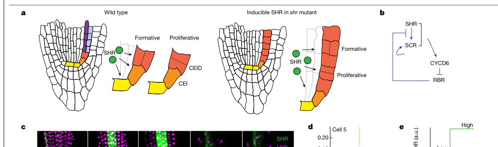

## Question

# Gene Research for Functional Annotation

## ⚠️ CRITICAL: Gene/Protein Identification Context

**BEFORE YOU BEGIN RESEARCH:** You MUST verify you are researching the CORRECT gene/protein. Gene symbols can be ambiguous, especially for less well-characterized genes from non-model organisms.

### Target Gene/Protein Identity (from UniProt):
- **UniProt Accession:** Q9SZF7
- **Protein Description:** RecName: Full=Protein SHORT-ROOT {ECO:0000303|PubMed:10850497}; Short=AtSHR {ECO:0000303|PubMed:10850497}; AltName: Full=GRAS family protein 26; Short=AtGRAS-26; AltName: Full=Protein SHOOT GRAVITROPISM 7 {ECO:0000303|PubMed:9670559};
- **Gene Information:** Name=SHR {ECO:0000303|PubMed:10850497}; Synonyms=SGR7 {ECO:0000303|PubMed:9670559}; OrderedLocusNames=At4g37650 {ECO:0000312|Araport:AT4G37650}; ORFNames=F19F18.140 {ECO:0000312|EMBL:CAB38304.1};
- **Organism (full):** Arabidopsis thaliana (Mouse-ear cress).
- **Protein Family:** Belongs to the GRAS family. {ECO:0000255|PROSITE-
- **Key Domains:** TF_GRAS. (IPR005202); GRAS (PF03514)

### MANDATORY VERIFICATION STEPS:

1. **Check if the gene symbol "SHR" matches the protein description above**
2. **Verify the organism is correct:** Arabidopsis thaliana (Mouse-ear cress).
3. **Check if protein family/domains align with what you find in literature**
4. **If you find literature for a DIFFERENT gene with the same or similar symbol, STOP**

### If Gene Symbol is Ambiguous or You Cannot Find Relevant Literature:

**DO NOT PROCEED WITH RESEARCH ON A DIFFERENT GENE.** Instead:
- State clearly: "The gene symbol 'SHR' is ambiguous or literature is limited for this specific protein"
- Explain what you found (e.g., "Found extensive literature on a different gene with the same symbol in a different organism")
- Describe the protein based ONLY on the UniProt information provided above
- Suggest that the protein function can be inferred from domain/family information

### Research Target:

Please provide a comprehensive research report on the gene **SHR** (gene ID: SHR, UniProt: Q9SZF7) in ARATH.

The research report should be a detailed narrative explaining the function, biological processes, and localization of the gene product. Citations should be given for all claims.

You should prioritize authoritative reviews and primary scientific literature when conducting research. You can supplement
this with annotations you find in gene/protein databases, but these can be outdated or inaccurate.

We are specifically interested in the primary function of the gene - for enzymes, what reaction is catalyzed, and what is the substrate specificity? For transporters, what is the substrate? For structural proteins or adapters, what is the broader structural role? For signaling molecules, what is the role in the pathway.

We are interested in where in or outside the cell the gene product carries out its function.

We are also interested in the signaling or biochemical pathways in which the gene functions. We are less interested in broad pleiotropic effects, except where these elucidate the precise role.

Include evidence where possible. We are interested in both experimental evidence as well as inference from structure, evolution, or bioinformatic analysis. Precise studies should be prioritized over high-throughput, where available.

## Output

Question: You are an expert researcher providing comprehensive, well-cited information.

Provide detailed information focusing on:
1. Key concepts and definitions with current understanding
2. Recent developments and latest research (prioritize 2023-2024 sources)
3. Current applications and real-world implementations
4. Expert opinions and analysis from authoritative sources
5. Relevant statistics and data from recent studies

Format as a comprehensive research report with proper citations. Include URLs and publication dates where available.
Always prioritize recent, authoritative sources and provide specific citations for all major claims.

# Gene Research for Functional Annotation

## ⚠️ CRITICAL: Gene/Protein Identification Context

**BEFORE YOU BEGIN RESEARCH:** You MUST verify you are researching the CORRECT gene/protein. Gene symbols can be ambiguous, especially for less well-characterized genes from non-model organisms.

### Target Gene/Protein Identity (from UniProt):
- **UniProt Accession:** Q9SZF7
- **Protein Description:** RecName: Full=Protein SHORT-ROOT {ECO:0000303|PubMed:10850497}; Short=AtSHR {ECO:0000303|PubMed:10850497}; AltName: Full=GRAS family protein 26; Short=AtGRAS-26; AltName: Full=Protein SHOOT GRAVITROPISM 7 {ECO:0000303|PubMed:9670559};
- **Gene Information:** Name=SHR {ECO:0000303|PubMed:10850497}; Synonyms=SGR7 {ECO:0000303|PubMed:9670559}; OrderedLocusNames=At4g37650 {ECO:0000312|Araport:AT4G37650}; ORFNames=F19F18.140 {ECO:0000312|EMBL:CAB38304.1};
- **Organism (full):** Arabidopsis thaliana (Mouse-ear cress).
- **Protein Family:** Belongs to the GRAS family. {ECO:0000255|PROSITE-
- **Key Domains:** TF_GRAS. (IPR005202); GRAS (PF03514)

### MANDATORY VERIFICATION STEPS:

1. **Check if the gene symbol "SHR" matches the protein description above**
2. **Verify the organism is correct:** Arabidopsis thaliana (Mouse-ear cress).
3. **Check if protein family/domains align with what you find in literature**
4. **If you find literature for a DIFFERENT gene with the same or similar symbol, STOP**

### If Gene Symbol is Ambiguous or You Cannot Find Relevant Literature:

**DO NOT PROCEED WITH RESEARCH ON A DIFFERENT GENE.** Instead:
- State clearly: "The gene symbol 'SHR' is ambiguous or literature is limited for this specific protein"
- Explain what you found (e.g., "Found extensive literature on a different gene with the same symbol in a different organism")
- Describe the protein based ONLY on the UniProt information provided above
- Suggest that the protein function can be inferred from domain/family information

### Research Target:

Please provide a comprehensive research report on the gene **SHR** (gene ID: SHR, UniProt: Q9SZF7) in ARATH.

The research report should be a detailed narrative explaining the function, biological processes, and localization of the gene product. Citations should be given for all claims.

You should prioritize authoritative reviews and primary scientific literature when conducting research. You can supplement
this with annotations you find in gene/protein databases, but these can be outdated or inaccurate.

We are specifically interested in the primary function of the gene - for enzymes, what reaction is catalyzed, and what is the substrate specificity? For transporters, what is the substrate? For structural proteins or adapters, what is the broader structural role? For signaling molecules, what is the role in the pathway.

We are interested in where in or outside the cell the gene product carries out its function.

We are also interested in the signaling or biochemical pathways in which the gene functions. We are less interested in broad pleiotropic effects, except where these elucidate the precise role.

Include evidence where possible. We are interested in both experimental evidence as well as inference from structure, evolution, or bioinformatic analysis. Precise studies should be prioritized over high-throughput, where available.

# Comprehensive Research Report: Arabidopsis SHORT-ROOT (SHR/SGR7; UniProt Q9SZF7; At4g37650)

## 0. Gene/protein identity verification (critical disambiguation)
The target gene **SHR** discussed here is **Arabidopsis thaliana SHORT-ROOT**, also known as **SGR7 (SHOOT GRAVITROPISM 7)**, encoding a **GRAS-family transcription factor** (TF) that functions as a **mobile intercellular regulatory protein** in development. The retrieved literature consistently defines SHR as a GRAS TF produced in the stele that moves to adjacent tissues to control patterning and cell division, matching the UniProt record for **Q9SZF7 / At4g37650**. (yoon2022(don’t)lookup! pages 2-4, winter2024shrandscr pages 1-2)

## 1. Key concepts and definitions (current understanding)

### 1.1 SHR is a mobile, non-cell-autonomous GRAS transcription factor
A defining concept for SHR biology is **transcription factor mobility**: SHR is synthesized in one tissue domain but acts in neighboring cells after intercellular movement through plasmodesmata, thereby delivering positional information. In the canonical root model, SHR is produced in the **central tissues (stele)** and moves outward into adjacent cells including the **endodermis** and the **cortex–endodermal initial daughter (CEID)**. (winter2024shrandscr pages 1-2, yoon2022(don’t)lookup! pages 2-4)

### 1.2 SHR-centered transcriptional modules specify tissue identity and division behavior
In roots, SHR is central to a transcriptional module involving **SCARECROW (SCR)** and other partners that specifies **ground tissue patterning** (separating cortex and endodermis) and supports **stem cell niche maintenance**. Loss-of-function shr mutants show characteristic defects including loss of correct ground tissue layering (single layer instead of cortex+endodermis) and stem-cell niche abnormalities. (yoon2022(don’t)lookup! pages 2-4, winter2024shrandscr pages 1-2)

### 1.3 SHR acts through protein complexes with other TFs
SHR functions through **protein–protein interactions** forming cell-type-specific complexes. In roots, SHR interacts with **SCR**, and evidence supports complexes including **SCL23 (SCARECROW-LIKE23)** and **JKD (JACKDAW; a BIRD/IDD TF)**. (long2015scarecrowlike23andscarecrow pages 1-2, bahafid2023thearabidopsisshortroot pages 1-2)

## 2. Molecular function, biological processes, and localization

### 2.1 Molecular function (what the protein does)
SHR is best described as a **DNA-binding transcriptional regulator** (GRAS TF) whose primary molecular function is to:
1) **move intercellularly**, and
2) **activate or coordinate transcription** of developmental regulators and cell-cycle components in recipient cells, often in partnership with SCR and other factors.

In roots, SHR and SCR together activate **CYCLIND6;1 (CYCD6;1)** in the CEID to trigger the formative (asymmetric) division that generates separate cortex and endodermis lineages. (winter2024shrandscr pages 1-2, yoon2022(don’t)lookup! pages 2-4)

### 2.2 Tissue and subcellular localization
**Root:** SHR is produced in the **stele** and moves into adjacent layers (endodermis/CEID) where it acts to regulate fate and divisions. (winter2024shrandscr pages 1-2, yoon2022(don’t)lookup! pages 2-4)

**Shoot apical meristem (SAM):** A recent demonstration of SHR network redeployment in the shoot shows that SHR transcriptional reporters are detected in primordia-associated inner layers (e.g., L3 and weakly L2), whereas SHR protein is detected in outer layers and shows **nuclear preference** in L2/L1 cells, implying intercellular movement from inner to outer layers in developing lateral organ primordia. (bahafid2023thearabidopsisshortroot pages 3-5)

### 2.3 Interaction partners and complex logic (experimentally supported)
**SHR–SCR–SCL23 axis:**
* Long et al. (Plant Journal, 2015-11; https://doi.org/10.1111/tpj.13038) demonstrated that **SCL23 interacts with both SHR and SCR** and that these complexes influence the **range of SHR movement** and contribute redundantly with SCR to endodermal fate specification. (long2015scarecrowlike23andscarecrow pages 1-2, long2015scarecrowlike23andscarecrow pages 8-9)

**SAM complexes and physical interaction evidence:**
* Bahafid et al. (eLife, 2023-10-20; https://doi.org/10.7554/eLife.83334) report that SHR and its network TFs (SCR, SCL23, JKD) are expressed in distinct but overlapping shoot domains, can physically interact, and that **FRET-FLIM** detects **SHR–SCR interaction** in lateral organ primordia. (bahafid2023thearabidopsisshortroot pages 3-5, bahafid2023thearabidopsisshortroot pages 1-2)

## 3. Signaling/pathways and downstream outputs

### 3.1 Root formative division / cell-cycle coupling
The canonical root pathway positions SHR and SCR upstream of a cell-cycle decision point:
* SHR moves into CEID and activates SCR.
* SHR and SCR together activate **CYCD6;1**, which functions in the **CYCLIN D–RBR** axis linked to formative division. (winter2024shrandscr pages 1-2, yoon2022(don’t)lookup! pages 2-4)

### 3.2 Endodermal barrier (Casparian strip) formation pathway (SHR → MYB36 → CASP1)
SHR also functions as an upstream regulator of endodermal differentiation programs required for the **Casparian strip** (lignin-based apoplastic barrier):
* Li et al. (Current Biology, 2018-09; https://doi.org/10.1016/j.cub.2018.07.028) provide evidence that SHR activates a hierarchical cascade where **MYB36 is required downstream of SHR** for induction of barrier genes including **CASP1**; ectopic SHR expression (including inducible SHR) can induce ectopic CASP1 expression patterns in non-endodermal ground tissues. (li2018constructionofa pages 3-4, li2018constructionofa pages 1-3)

This positions SHR as a master regulator that can initiate key transcriptional programs for endodermal barrier components, while additional signals are needed to achieve full functionality and correct positioning (as described in the same study). (li2018constructionofa pages 1-3)

### 3.3 Shoot auxin integration and organ initiation (SHR promoter auxin responsiveness)
In the SAM context, SHR is coupled to auxin-dependent patterning:
* Bahafid et al. (eLife, 2023-10-20; https://doi.org/10.7554/eLife.83334) show that SHR and SCR contribute to establishing proper **auxin output maxima** in the SAM and that SHR expression at organ initiation sites is auxin-linked via promoter auxin-response elements and the auxin response factor **MONOPTEROS (MP)** as described in the paper’s conceptual model and experiments. (bahafid2023thearabidopsisshortroot pages 1-2, bahafid2023thearabidopsisshortroot pages 3-5)

### 3.4 Transcriptional control of SHR expression boundaries (promoter repressors)
Defining the SHR expression domain is itself regulated at the promoter level:
* Sparks et al. (Developmental Cell, 2016-12; https://doi.org/10.1016/j.devcel.2016.09.031) provide evidence that specific promoter motifs (including **ZML1** and **DDF1** motifs) can repress expression outside the normal central domain, supporting a mechanism for maintaining SHR spatial specificity. (sparks2016establishmentofexpression pages 24-24)

## 4. Recent developments and latest research (prioritizing 2023–2024)

### 4.1 2024: SHR/SCR dynamics and a revised mechanistic view of division control (Nature)
Winter et al. (Nature, published online 2024-01-31; https://doi.org/10.1038/s41586-023-06971-z) provide a major update to SHR/SCR mechanistic understanding:
* Using long-term 4D imaging, they quantified SHR and SCR dynamics **every 15 minutes for up to 48 hours** in living roots. (winter2024shrandscr pages 1-2)
* They conclude that SHR/SCR dynamics **do not match the expected behavior of a bistable system**, and that **low transient levels early in the cell cycle** are sufficient for formative divisions. (winter2024shrandscr pages 1-2, winter2024shrandscr pages 5-6)

These results shift the field from a “high-stable-state” view toward a **timing/window-of-sensitivity** view, in which SHR/SCR act as temporally gated regulators of division orientation rather than merely steady-state fate determinants. (winter2024shrandscr pages 5-6)

Evidence from the paper’s figures (model and quantitative time courses) is captured in retrieved figure crops. (winter2024shrandscr media 9f392d2b, winter2024shrandscr media b35ad366)

### 4.2 2023: SHR network reuse in shoot meristem and organ initiation (eLife)
Bahafid et al. (eLife, 2023-10-20; https://doi.org/10.7554/eLife.83334) extend SHR biology beyond the root:
* SHR together with SCR/SCL23/JKD controls aspects of **shoot meristem size** and **lateral organ primordia formation**. (bahafid2023thearabidopsisshortroot pages 1-2)
* Quantitatively, the **average number of DR5-positive auxin maxima** in the SAM was significantly reduced in shr-2 and scr-4 mutants; for the auxin maxima quantification: **WT n=6, shr-2 n=4, scr-4 n=4** and **p<0.0001** (Student’s t-test). (bahafid2023thearabidopsisshortroot pages 3-5)

### 4.3 2024: Engineering SHR transcripts using programmable RNA m6A editing (Plant Biotechnology Journal)
Shi et al. (Plant Biotechnology Journal, 2024-02; https://doi.org/10.1111/pbi.14307) demonstrate a direct, programmable way to modulate SHR expression:
* CRISPR/dCas13a-based tools were used to **increase m6A levels on SHR mRNA**, accelerating its degradation and reducing SHR expression.
* This moderate reduction of SHR was associated with **enhanced growth** phenotypes (longer roots, larger rosette leaves, increased biomass traits), supporting SHR as a tunable growth node rather than a simple “more is better” determinant.
* Quantitatively, their transgenic controls illustrate the SHR dosage range: **OE-SHR ~15-fold expression** vs Col-0; **KD-SHR ~0.5-fold and ~0.05-fold** expression. (shi2024programmablernan6‐methyladenosine pages 6-7)

## 5. Current applications and real-world implementations

### 5.1 Targeted epitranscriptomic editing for growth modulation
The Shi et al. 2024 study is an example of real-world implementation of SHR knowledge in plant biotechnology: a programmable RNA methylation editor (dCas13a fusion) was applied to SHR transcripts to tune abundance and produce agronomically relevant traits (biomass, grain weight reported in the paper), illustrating translational potential of SHR regulatory control. (shi2024programmablernan6‐methyladenosine pages 6-7)

### 5.2 Developmental reprogramming of barrier features (synthetic/endodermis-like traits)
Li et al. 2018 demonstrates a mechanistic route toward engineering barrier properties in non-native lineages by ectopic activation of SHR-driven transcriptional cascades (e.g., MYB36/CASP1) in combination with other signals, providing a conceptual foundation for reprogramming endodermal functions. (li2018constructionofa pages 3-4, li2018constructionofa pages 1-3)

## 6. Expert opinions and analysis (from authoritative sources in the retrieved corpus)

### 6.1 SHR as a paradigmatic mobile transcription factor in plants
The field treats SHR as a canonical example of how mobile TFs provide positional information to specify fate. This framing is explicitly articulated in reviews emphasizing mobility, plasmodesmatal regulation, and complex-dependent restriction of movement. (gundu2020movingwithpurpose pages 8-9)

### 6.2 Emerging expert consensus: timing and kinetics matter
The 2024 Nature study provides strong experimental support for a conceptual shift: rather than requiring a stable bistable attractor, SHR/SCR appear to act through **transient early-cell-cycle dynamics** to influence division orientation and patterning. This provides a mechanistic lens that integrates cell biology (cell cycle phase) with developmental patterning. (winter2024shrandscr pages 1-2, winter2024shrandscr pages 5-6)

## 7. Relevant statistics and data points (recent studies emphasized)
* **Imaging statistics (Nature 2024):** Quantitative SHR/SCR dynamics tracked in vivo **every 15 min for up to 48 h**. (winter2024shrandscr pages 1-2)
* **Auxin maxima stats (eLife 2023):** Auxin maxima quantification used **WT n=6; shr-2 n=4; scr-4 n=4; p<0.0001** (Student’s t-test). (bahafid2023thearabidopsisshortroot pages 3-5)
* **Expression fold-changes (Plant Biotech J 2024):** SHR overexpression lines ~**15-fold**; knockdown lines ~**0.5-fold** and **0.05-fold** relative expression. (shi2024programmablernan6‐methyladenosine pages 6-7)

## Evidence map (summary table)
The following table condenses key functional-annotation elements (function, localization, interactors, targets, phenotypes, and 2023–2024 advances) into a single evidence-indexed view.

| Category | Summary for Arabidopsis SHR (Q9SZF7 / At4g37650) | Key quantitative details | Citation IDs |
|---|---|---|---|
| Molecular nature / identity | SHR is the Arabidopsis **SHORT-ROOT** protein, a **GRAS-family transcription factor** that acts as a **mobile intercellular signal**. In roots, it is transcribed in the **stele** and moves outward into the **endodermis** and **cortex/endodermis initial daughter (CEID)**, where it acts non-cell-autonomously to pattern ground tissue. This matches the UniProt identity (AtSHR/SGR7; GRAS domain protein). | 2024 Nature tracked SHR/SCR in living roots by **4D light-sheet/confocal imaging every 15 min for up to 48 h**. | (winter2024shrandscr pages 1-2, gundu2020movingwithpurpose pages 8-9) |
| Mobility and localization | In roots, SHR protein moves **one cell layer outward** from stele into adjacent cells; movement is constrained to define a **single endodermal layer**. In shoots/SAM, SHR promoter activity is mainly in **L3 and weakly L2** of initiating primordia, while SHR protein is detected in **L1-L3 nuclei**, indicating movement from inner to outer layers. | SAM auxin/meristem analyses in 2023 eLife used **WT n=6, shr-2 n=4, scr-4 n=4** for auxin maxima quantification. | (bahafid2023thearabidopsisshortroot pages 3-5, yoon2022(don’t)lookup! pages 2-4) |
| Core interaction partners / complexes | SHR forms regulatory complexes with **SCR**, **SCL23**, and **JKD/BIRD** proteins. SHR-SCR activates downstream genes and helps retain/confine SHR in the endodermis; SCL23 also interacts with SHR and SCR and can restrict SHR spread without the same nuclear-retention mechanism used by SCR. In the SAM, **FRET-FLIM** detected SHR-SCR interaction in lateral organ primordia. | 2023 eLife showed physical SHR-SCR interaction in shoot primordia by **FRET-FLIM**; 2015 Plant J identified **SCL23** as an in vivo partner of both SHR and SCR. | (bahafid2023thearabidopsisshortroot pages 3-5, long2015scarecrowlike23andscarecrow pages 1-2, long2015scarecrowlike23andscarecrow pages 8-9) |
| Core root pathway / formative division | Canonical root pathway: **SHR -> SCR/BIRD network -> CYCD6;1 -> relief of RBR inhibition -> asymmetric CEI/CEID division**, producing cortex and endodermis. 2024 work revised prior bistable-network assumptions, showing that **low transient early-cell-cycle SHR and SCR levels** are sufficient to specify formative division orientation. | 2024 Nature: imaging every **15 min up to 48 h**; observed kinetics were inconsistent with a strict bistable model; only **low transient early G1/S levels** were required for formative divisions. | (winter2024shrandscr pages 1-2, winter2024shrandscr pages 3-4, winter2024shrandscr pages 5-6, yoon2022(don’t)lookup! pages 2-4) |
| Casparian strip / endodermal barrier pathway | SHR is an upstream regulator of endodermal barrier formation through a hierarchical pathway in which **MYB36 acts downstream of SHR** to induce **CASP1** and other lignification/barrier genes. **SCR** contributes to correct subcellular positioning, and SHR-mediated transcription alone is insufficient for a fully functional strip without additional stele-derived peptide input (e.g., CIF signaling). | In inducible **iSHR** roots, **10 mM estradiol for 2 days** expanded **pMYB36:GFP-GUS** expression and induced ectopic **CASP1-GFP** puncta in non-endodermal tissues. | (li2018constructionofa pages 3-4, li2018constructionofa pages 1-3) |
| Auxin-linked shoot pathway | In the SAM, SHR coordinates meristem size and lateral organ initiation. Auxin activates SHR expression through **MONOPTEROS (MP)** and auxin-response elements in the SHR promoter; SHR network components then help regulate cell division and organ initiation, including **CYCD6;1** activation in appropriate contexts. | 2023 eLife: average number of **DR5-positive auxin maxima** was reduced in **shr-2** and **scr-4**; statistical test reported **p < 0.0001**. Sample sizes: **WT n=6, shr-2 n=4, scr-4 n=4**. | (bahafid2023thearabidopsisshortroot pages 1-2, bahafid2023thearabidopsisshortroot pages 3-5, bahafid2023thearabidopsisshortroot pages 21-23) |
| Promoter-level regulation of SHR expression | SHR expression is transcriptionally sharpened by **repressor motifs** in its promoter, including **ZML1** and **DDF1** motif sites, which repress expression outside the central vasculature and help establish proper SHR-domain boundaries. | Synthetic promoter tests used **3 or 6 motif copies**; **3 or 6 ZML1** copies reduced outer-cell-file GFP, **3 DDF1** copies reduced GFP similarly, while **6 DDF1** copies caused ectopic QC GFP. | (sparks2016establishmentofexpression pages 24-24) |
| Root biological processes / phenotypes | SHR is required for **root radial patterning**, **endodermis specification**, **quiescent center/stem cell niche maintenance**, and **vascular patterning**. Loss of SHR causes a **single ground tissue layer**, defective QC, reduced meristem size, short roots, and defects in xylem/phloem patterning. | shr mutants show loss of functional QC and reduced meristem size; 2024 Nature further links SHR/SCR levels to division-plane choice between proliferative vs formative divisions. | (yoon2022(don’t)lookup! pages 2-4, yoon2022(don’t)lookup! pages 5-6, winter2024shrandscr pages 1-2) |
| Shoot biological processes / phenotypes | SHR also functions in shoots: historical **sgr7** alleles are allelic to **shr** and impair shoot gravitropism due to absent **starch sheath/endodermis equivalent**. SHR contributes to **bundle sheath/endodermis-equivalent specification**, **leaf/hypocotyl development**, **cell elongation**, and **shoot apical meristem/lateral organ initiation**. | Review-reported shoot biomass phenotype: shr fresh/dry weights were approximately **one-tenth of WT**; shoot phenotype datasets reported **n > 30** with Student's t-test in summarized studies. | (yoon2022(don’t)lookup! pages 2-4, yoon2022(don’t)lookup! pages 4-5, bahafid2023thearabidopsisshortroot pages 20-21) |
| 2023-2024 advance: dynamic cell-cycle control | A major 2024 advance is the demonstration that SHR/SCR do not need a stable high-state bistable switch; instead, **transient early-cell-cycle accumulation** is enough to orient formative division. This reframes SHR as a temporally gated developmental regulator coupled directly to the cell cycle. | **Nature 2024**, imaging every **15 min** for **up to 48 h** in live roots. | (winter2024shrandscr pages 1-2, winter2024shrandscr pages 3-4, winter2024shrandscr pages 5-6, winter2024shrandscr media 9f392d2b) |
| 2023-2024 advance: shoot meristem reuse of SHR network | 2023 work showed the SHR network is redeployed in the **shoot apical meristem**, where it integrates **auxin input**, controls meristem size, and promotes lateral organ initiation through interactions among **SHR, SCR, SCL23, JKD**, plus crosstalk with **WUS/CLV** signaling via SCL23. | Quantified SAM traits included plastochron, meristem size, epidermal cell number, and auxin maxima; for auxin maxima, **p < 0.0001** with **WT n=6, shr-2 n=4, scr-4 n=4**. | (bahafid2023thearabidopsisshortroot pages 1-2, bahafid2023thearabidopsisshortroot pages 3-5, bahafid2023thearabidopsisshortroot pages 20-21) |
| 2024 application / engineering | A 2024 plant biotechnology application used **CRISPR/dCas13a programmable m6A editors** to tune SHR transcript methylation. Increasing SHR m6A accelerated SHR mRNA decay and, paradoxically, **improved growth** when SHR was moderately reduced, showing SHR is an actionable engineering node for growth optimization. | **OE-SHR ~15-fold** higher expression than Col-0; **KD-SHR ~0.5-fold and ~0.05-fold**. Demethylation decreased m6A on SHR by about **49.38 ± 6.28%** and **56.92 ± 8.31%** relative to controls reported in the study. | (shi2024programmablernan6‐methyladenosine pages 6-7) |

*Table: This table summarizes the molecular function, pathways, partners, phenotypes, and recent 2023-2024 advances for Arabidopsis SHORT-ROOT (SHR/At4g37650/Q9SZF7). It is designed as a compact evidence map for functional annotation with citation IDs for each row.*

## Key figure evidence (visual)
Winter et al. (Nature 2024) provides schematic and quantitative plots supporting the “early transient levels” mechanism and division orientation model; retrieved figure crops are available here. (winter2024shrandscr media 9f392d2b, winter2024shrandscr media b35ad366)

## References (retrieved core sources; publication dates and URLs)
* Winter CM et al. **Nature**. Published online **31 Jan 2024**. “SHR and SCR coordinate root patterning and growth early in the cell cycle.” https://doi.org/10.1038/s41586-023-06971-z (winter2024shrandscr pages 1-2)
* Bahafid E et al. **eLife**. Published **20 Oct 2023**. “The Arabidopsis SHORTROOT network coordinates shoot apical meristem development with auxin-dependent lateral organ initiation.” https://doi.org/10.7554/eLife.83334 (bahafid2023thearabidopsisshortroot pages 1-2)
* Shi C et al. **Plant Biotechnology Journal**. **Feb 2024**. “Programmable RNA N6-methyladenosine editing with CRISPR/dCas13a in plants.” https://doi.org/10.1111/pbi.14307 (shi2024programmablernan6‐methyladenosine pages 6-7)
* Li P et al. **Current Biology**. **Sep 2018**. “Construction of a Functional Casparian Strip in Non-endodermal Lineages Is Orchestrated by Two Parallel Signaling Systems in Arabidopsis thaliana.” https://doi.org/10.1016/j.cub.2018.07.028 (li2018constructionofa pages 1-3)
* Long Y et al. **The Plant Journal**. Published online **28 Sep 2015** (issue **Nov 2015**). “SCARECROW-LIKE23 and SCARECROW jointly specify endodermal cell fate but distinctly control SHORT-ROOT movement.” https://doi.org/10.1111/tpj.13038 (long2015scarecrowlike23andscarecrow pages 1-2)
* Sparks EE et al. **Developmental Cell**. **Dec 2016**. “Establishment of Expression in the SHORTROOT-SCARECROW Transcriptional Cascade through Opposing Activities of Both Activators and Repressors.” https://doi.org/10.1016/j.devcel.2016.09.031 (sparks2016establishmentofexpression pages 24-24)
* Yoon EK et al. **Frontiers in Plant Science**. Published **17 Nov 2022**. “(Don’t) Look Up!: Is short-root just a short-root plant?” https://doi.org/10.3389/fpls.2022.1069996 (yoon2022(don’t)lookup! pages 2-4)
* Gundu S et al. **Current Opinion in Plant Biology**. **Oct 2020**. “Moving with purpose and direction: transcription factor movement and cell fate determination revisited.” https://doi.org/10.1016/j.pbi.2020.08.003 (gundu2020movingwithpurpose pages 8-9)

References

1. (yoon2022(don’t)lookup! pages 2-4): Eun Kyung Yoon, Jiyeong Oh, and Jun Lim. (don’t) look up!: is short-root just a short‐root plant? Frontiers in Plant Science, Nov 2022. URL: https://doi.org/10.3389/fpls.2022.1069996, doi:10.3389/fpls.2022.1069996. This article has 4 citations.

2. (winter2024shrandscr pages 1-2): Cara M. Winter, Pablo Szekely, Vladimir Popov, Heather Belcher, Raina Carter, Matthew Jones, Scott E. Fraser, Thai V. Truong, and Philip N. Benfey. Shr and scr coordinate root patterning and growth early in the cell cycle. Nature, 626:611-616, Jan 2024. URL: https://doi.org/10.1038/s41586-023-06971-z, doi:10.1038/s41586-023-06971-z. This article has 62 citations and is from a highest quality peer-reviewed journal.

3. (long2015scarecrowlike23andscarecrow pages 1-2): Yuchen Long, Joachim Goedhart, Martinus Schneijderberg, Inez Terpstra, Akie Shimotohno, Benjamin P. Bouchet, Anna Akhmanova, Theodorus W. J. Gadella, Renze Heidstra, Ben Scheres, and Ikram Blilou. Scarecrow-like23 and scarecrow jointly specify endodermal cell fate but distinctly control short-root movement. The Plant journal : for cell and molecular biology, 84 4:773-84, Nov 2015. URL: https://doi.org/10.1111/tpj.13038, doi:10.1111/tpj.13038. This article has 65 citations.

4. (bahafid2023thearabidopsisshortroot pages 1-2): Elmehdi Bahafid, Imke Bradtmöller, Ann M Thies, Thi TON Nguyen, Crisanto Gutierrez, Bénédicte Desvoyes, Yvonne Stahl, Ikram Blilou, and Rüdiger GW Simon. The arabidopsis shortroot network coordinates shoot apical meristem development with auxin-dependent lateral organ initiation. eLife, Oct 2023. URL: https://doi.org/10.7554/elife.83334, doi:10.7554/elife.83334. This article has 20 citations and is from a domain leading peer-reviewed journal.

5. (bahafid2023thearabidopsisshortroot pages 3-5): Elmehdi Bahafid, Imke Bradtmöller, Ann M Thies, Thi TON Nguyen, Crisanto Gutierrez, Bénédicte Desvoyes, Yvonne Stahl, Ikram Blilou, and Rüdiger GW Simon. The arabidopsis shortroot network coordinates shoot apical meristem development with auxin-dependent lateral organ initiation. eLife, Oct 2023. URL: https://doi.org/10.7554/elife.83334, doi:10.7554/elife.83334. This article has 20 citations and is from a domain leading peer-reviewed journal.

6. (long2015scarecrowlike23andscarecrow pages 8-9): Yuchen Long, Joachim Goedhart, Martinus Schneijderberg, Inez Terpstra, Akie Shimotohno, Benjamin P. Bouchet, Anna Akhmanova, Theodorus W. J. Gadella, Renze Heidstra, Ben Scheres, and Ikram Blilou. Scarecrow-like23 and scarecrow jointly specify endodermal cell fate but distinctly control short-root movement. The Plant journal : for cell and molecular biology, 84 4:773-84, Nov 2015. URL: https://doi.org/10.1111/tpj.13038, doi:10.1111/tpj.13038. This article has 65 citations.

7. (li2018constructionofa pages 3-4): Pengxue Li, Qiaozhi Yu, Xu Gu, Chunmiao Xu, Shilian Qi, Hong Wang, Fenglin Zhong, Tobias I. Baskin, Abidur Rahman, and Shuang Wu. Construction of a functional casparian strip in non-endodermal lineages is orchestrated by two parallel signaling systems in arabidopsis thaliana. Current Biology, 28:2777-2786.e2, Sep 2018. URL: https://doi.org/10.1016/j.cub.2018.07.028, doi:10.1016/j.cub.2018.07.028. This article has 67 citations and is from a highest quality peer-reviewed journal.

8. (li2018constructionofa pages 1-3): Pengxue Li, Qiaozhi Yu, Xu Gu, Chunmiao Xu, Shilian Qi, Hong Wang, Fenglin Zhong, Tobias I. Baskin, Abidur Rahman, and Shuang Wu. Construction of a functional casparian strip in non-endodermal lineages is orchestrated by two parallel signaling systems in arabidopsis thaliana. Current Biology, 28:2777-2786.e2, Sep 2018. URL: https://doi.org/10.1016/j.cub.2018.07.028, doi:10.1016/j.cub.2018.07.028. This article has 67 citations and is from a highest quality peer-reviewed journal.

9. (sparks2016establishmentofexpression pages 24-24): Erin E. Sparks, Colleen Drapek, Allison Gaudinier, Song Li, Mitra Ansariola, Ning Shen, Jessica H. Hennacy, Jingyuan Zhang, Gina Turco, Jalean J. Petricka, Jessica Foret, Alexander J. Hartemink, Raluca Gordân, Molly Megraw, Siobhan M. Brady, and Philip N. Benfey. Establishment of expression in the shortroot-scarecrow transcriptional cascade through opposing activities of both activators and repressors. Developmental cell, 39 5:585-596, Dec 2016. URL: https://doi.org/10.1016/j.devcel.2016.09.031, doi:10.1016/j.devcel.2016.09.031. This article has 73 citations and is from a highest quality peer-reviewed journal.

10. (winter2024shrandscr pages 5-6): Cara M. Winter, Pablo Szekely, Vladimir Popov, Heather Belcher, Raina Carter, Matthew Jones, Scott E. Fraser, Thai V. Truong, and Philip N. Benfey. Shr and scr coordinate root patterning and growth early in the cell cycle. Nature, 626:611-616, Jan 2024. URL: https://doi.org/10.1038/s41586-023-06971-z, doi:10.1038/s41586-023-06971-z. This article has 62 citations and is from a highest quality peer-reviewed journal.

11. (winter2024shrandscr media 9f392d2b): Cara M. Winter, Pablo Szekely, Vladimir Popov, Heather Belcher, Raina Carter, Matthew Jones, Scott E. Fraser, Thai V. Truong, and Philip N. Benfey. Shr and scr coordinate root patterning and growth early in the cell cycle. Nature, 626:611-616, Jan 2024. URL: https://doi.org/10.1038/s41586-023-06971-z, doi:10.1038/s41586-023-06971-z. This article has 62 citations and is from a highest quality peer-reviewed journal.

12. (winter2024shrandscr media b35ad366): Cara M. Winter, Pablo Szekely, Vladimir Popov, Heather Belcher, Raina Carter, Matthew Jones, Scott E. Fraser, Thai V. Truong, and Philip N. Benfey. Shr and scr coordinate root patterning and growth early in the cell cycle. Nature, 626:611-616, Jan 2024. URL: https://doi.org/10.1038/s41586-023-06971-z, doi:10.1038/s41586-023-06971-z. This article has 62 citations and is from a highest quality peer-reviewed journal.

13. (shi2024programmablernan6‐methyladenosine pages 6-7): Chuanlin Shi, Wenli Zou, Xiangpei Liu, Hong Zhang, Xiaofang Li, Guiling Fu, Qili Fei, Qian Qian, and Lianguang Shang. Programmable rna n6‐methyladenosine editing with crispr/dcas13a in plants. Plant Biotechnology Journal, 22:1867-1880, Feb 2024. URL: https://doi.org/10.1111/pbi.14307, doi:10.1111/pbi.14307. This article has 29 citations and is from a highest quality peer-reviewed journal.

14. (gundu2020movingwithpurpose pages 8-9): Shyam Gundu, Naheed Tabassum, and Ikram Blilou. Moving with purpose and direction: transcription factor movement and cell fate determination revisited. Oct 2020. URL: https://doi.org/10.1016/j.pbi.2020.08.003, doi:10.1016/j.pbi.2020.08.003. This article has 18 citations and is from a peer-reviewed journal.

15. (winter2024shrandscr pages 3-4): Cara M. Winter, Pablo Szekely, Vladimir Popov, Heather Belcher, Raina Carter, Matthew Jones, Scott E. Fraser, Thai V. Truong, and Philip N. Benfey. Shr and scr coordinate root patterning and growth early in the cell cycle. Nature, 626:611-616, Jan 2024. URL: https://doi.org/10.1038/s41586-023-06971-z, doi:10.1038/s41586-023-06971-z. This article has 62 citations and is from a highest quality peer-reviewed journal.

16. (bahafid2023thearabidopsisshortroot pages 21-23): Elmehdi Bahafid, Imke Bradtmöller, Ann M Thies, Thi TON Nguyen, Crisanto Gutierrez, Bénédicte Desvoyes, Yvonne Stahl, Ikram Blilou, and Rüdiger GW Simon. The arabidopsis shortroot network coordinates shoot apical meristem development with auxin-dependent lateral organ initiation. eLife, Oct 2023. URL: https://doi.org/10.7554/elife.83334, doi:10.7554/elife.83334. This article has 20 citations and is from a domain leading peer-reviewed journal.

17. (yoon2022(don’t)lookup! pages 5-6): Eun Kyung Yoon, Jiyeong Oh, and Jun Lim. (don’t) look up!: is short-root just a short‐root plant? Frontiers in Plant Science, Nov 2022. URL: https://doi.org/10.3389/fpls.2022.1069996, doi:10.3389/fpls.2022.1069996. This article has 4 citations.

18. (yoon2022(don’t)lookup! pages 4-5): Eun Kyung Yoon, Jiyeong Oh, and Jun Lim. (don’t) look up!: is short-root just a short‐root plant? Frontiers in Plant Science, Nov 2022. URL: https://doi.org/10.3389/fpls.2022.1069996, doi:10.3389/fpls.2022.1069996. This article has 4 citations.

19. (bahafid2023thearabidopsisshortroot pages 20-21): Elmehdi Bahafid, Imke Bradtmöller, Ann M Thies, Thi TON Nguyen, Crisanto Gutierrez, Bénédicte Desvoyes, Yvonne Stahl, Ikram Blilou, and Rüdiger GW Simon. The arabidopsis shortroot network coordinates shoot apical meristem development with auxin-dependent lateral organ initiation. eLife, Oct 2023. URL: https://doi.org/10.7554/elife.83334, doi:10.7554/elife.83334. This article has 20 citations and is from a domain leading peer-reviewed journal.

## Artifacts

- [Edison artifact artifact-00](SHR-deep-research-falcon_artifacts/artifact-00.md)

## Citations

1. bahafid2023thearabidopsisshortroot pages 3-5
2. li2018constructionofa pages 1-3
3. sparks2016establishmentofexpression pages 24-24
4. winter2024shrandscr pages 1-2
5. winter2024shrandscr pages 5-6
6. bahafid2023thearabidopsisshortroot pages 1-2
7. gundu2020movingwithpurpose pages 8-9
8. li2018constructionofa pages 3-4
9. winter2024shrandscr pages 3-4
10. bahafid2023thearabidopsisshortroot pages 21-23
11. bahafid2023thearabidopsisshortroot pages 20-21
12. https://doi.org/10.1111/tpj.13038
13. https://doi.org/10.7554/eLife.83334
14. https://doi.org/10.1016/j.cub.2018.07.028
15. https://doi.org/10.1016/j.devcel.2016.09.031
16. https://doi.org/10.1038/s41586-023-06971-z
17. https://doi.org/10.1111/pbi.14307
18. https://doi.org/10.3389/fpls.2022.1069996
19. https://doi.org/10.1016/j.pbi.2020.08.003
20. https://doi.org/10.3389/fpls.2022.1069996,
21. https://doi.org/10.1038/s41586-023-06971-z,
22. https://doi.org/10.1111/tpj.13038,
23. https://doi.org/10.7554/elife.83334,
24. https://doi.org/10.1016/j.cub.2018.07.028,
25. https://doi.org/10.1016/j.devcel.2016.09.031,
26. https://doi.org/10.1111/pbi.14307,
27. https://doi.org/10.1016/j.pbi.2020.08.003,