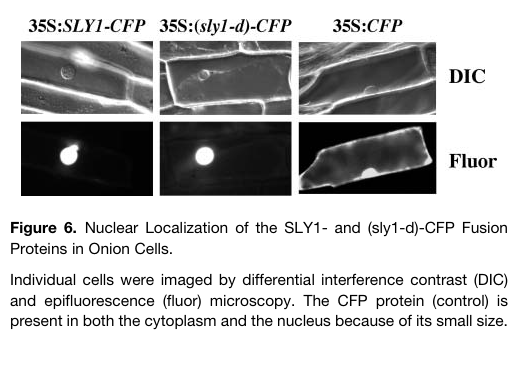

## Question

# Gene Research for Functional Annotation

## ⚠️ CRITICAL: Gene/Protein Identification Context

**BEFORE YOU BEGIN RESEARCH:** You MUST verify you are researching the CORRECT gene/protein. Gene symbols can be ambiguous, especially for less well-characterized genes from non-model organisms.

### Target Gene/Protein Identity (from UniProt):
- **UniProt Accession:** Q9STX3
- **Protein Description:** RecName: Full=F-box protein GID2; AltName: Full=Protein SLEEPY 1;
- **Gene Information:** Name=GID2; Synonyms=SLY1; OrderedLocusNames=At4g24210; ORFNames=T22A6.40;
- **Organism (full):** Arabidopsis thaliana (Mouse-ear cress).
- **Protein Family:** Not specified in UniProt
- **Key Domains:** F-box-like_dom_sf. (IPR036047); F-box_dom. (IPR001810); SNE/GID2. (IPR044184); F-box (PF00646)

### MANDATORY VERIFICATION STEPS:

1. **Check if the gene symbol "GID2" matches the protein description above**
2. **Verify the organism is correct:** Arabidopsis thaliana (Mouse-ear cress).
3. **Check if protein family/domains align with what you find in literature**
4. **If you find literature for a DIFFERENT gene with the same or similar symbol, STOP**

### If Gene Symbol is Ambiguous or You Cannot Find Relevant Literature:

**DO NOT PROCEED WITH RESEARCH ON A DIFFERENT GENE.** Instead:
- State clearly: "The gene symbol 'GID2' is ambiguous or literature is limited for this specific protein"
- Explain what you found (e.g., "Found extensive literature on a different gene with the same symbol in a different organism")
- Describe the protein based ONLY on the UniProt information provided above
- Suggest that the protein function can be inferred from domain/family information

### Research Target:

Please provide a comprehensive research report on the gene **GID2** (gene ID: SLY1, UniProt: Q9STX3) in ARATH.

The research report should be a detailed narrative explaining the function, biological processes, and localization of the gene product. Citations should be given for all claims.

You should prioritize authoritative reviews and primary scientific literature when conducting research. You can supplement
this with annotations you find in gene/protein databases, but these can be outdated or inaccurate.

We are specifically interested in the primary function of the gene - for enzymes, what reaction is catalyzed, and what is the substrate specificity? For transporters, what is the substrate? For structural proteins or adapters, what is the broader structural role? For signaling molecules, what is the role in the pathway.

We are interested in where in or outside the cell the gene product carries out its function.

We are also interested in the signaling or biochemical pathways in which the gene functions. We are less interested in broad pleiotropic effects, except where these elucidate the precise role.

Include evidence where possible. We are interested in both experimental evidence as well as inference from structure, evolution, or bioinformatic analysis. Precise studies should be prioritized over high-throughput, where available.

## Output

Question: You are an expert researcher providing comprehensive, well-cited information.

Provide detailed information focusing on:
1. Key concepts and definitions with current understanding
2. Recent developments and latest research (prioritize 2023-2024 sources)
3. Current applications and real-world implementations
4. Expert opinions and analysis from authoritative sources
5. Relevant statistics and data from recent studies

Format as a comprehensive research report with proper citations. Include URLs and publication dates where available.
Always prioritize recent, authoritative sources and provide specific citations for all major claims.

# Gene Research for Functional Annotation

## ⚠️ CRITICAL: Gene/Protein Identification Context

**BEFORE YOU BEGIN RESEARCH:** You MUST verify you are researching the CORRECT gene/protein. Gene symbols can be ambiguous, especially for less well-characterized genes from non-model organisms.

### Target Gene/Protein Identity (from UniProt):
- **UniProt Accession:** Q9STX3
- **Protein Description:** RecName: Full=F-box protein GID2; AltName: Full=Protein SLEEPY 1;
- **Gene Information:** Name=GID2; Synonyms=SLY1; OrderedLocusNames=At4g24210; ORFNames=T22A6.40;
- **Organism (full):** Arabidopsis thaliana (Mouse-ear cress).
- **Protein Family:** Not specified in UniProt
- **Key Domains:** F-box-like_dom_sf. (IPR036047); F-box_dom. (IPR001810); SNE/GID2. (IPR044184); F-box (PF00646)

### MANDATORY VERIFICATION STEPS:

1. **Check if the gene symbol "GID2" matches the protein description above**
2. **Verify the organism is correct:** Arabidopsis thaliana (Mouse-ear cress).
3. **Check if protein family/domains align with what you find in literature**
4. **If you find literature for a DIFFERENT gene with the same or similar symbol, STOP**

### If Gene Symbol is Ambiguous or You Cannot Find Relevant Literature:

**DO NOT PROCEED WITH RESEARCH ON A DIFFERENT GENE.** Instead:
- State clearly: "The gene symbol 'GID2' is ambiguous or literature is limited for this specific protein"
- Explain what you found (e.g., "Found extensive literature on a different gene with the same symbol in a different organism")
- Describe the protein based ONLY on the UniProt information provided above
- Suggest that the protein function can be inferred from domain/family information

### Research Target:

Please provide a comprehensive research report on the gene **GID2** (gene ID: SLY1, UniProt: Q9STX3) in ARATH.

The research report should be a detailed narrative explaining the function, biological processes, and localization of the gene product. Citations should be given for all claims.

You should prioritize authoritative reviews and primary scientific literature when conducting research. You can supplement
this with annotations you find in gene/protein databases, but these can be outdated or inaccurate.

We are specifically interested in the primary function of the gene - for enzymes, what reaction is catalyzed, and what is the substrate specificity? For transporters, what is the substrate? For structural proteins or adapters, what is the broader structural role? For signaling molecules, what is the role in the pathway.

We are interested in where in or outside the cell the gene product carries out its function.

We are also interested in the signaling or biochemical pathways in which the gene functions. We are less interested in broad pleiotropic effects, except where these elucidate the precise role.

Include evidence where possible. We are interested in both experimental evidence as well as inference from structure, evolution, or bioinformatic analysis. Precise studies should be prioritized over high-throughput, where available.

# Functional annotation report: Arabidopsis SLY1/GID2 (At4g24210; UniProt Q9STX3)

## Identity and scope

The protein specified by the supplied UniProt accession **Q9STX3** is *Arabidopsis thaliana* SLEEPY1 (**SLY1**), encoded at **At4g24210** and also named GID2 in the supplied annotation. The primary literature explicitly identifies Arabidopsis SLY1 as At4g24210. **Rice GID2 is a homologous protein in a different organism, not the Arabidopsis gene studied here**; likewise, Arabidopsis SNEEZY/SLY2 is a separate paralog, At5g48170. The experimentally established N-terminal F-box and C-terminal DELLA-interaction region are consistent with the supplied F-box and SNE/GID2 domain annotations. The Q9STX3 accession and GID2 alias are taken from the user-provided UniProt identity; the retrieved primary articles independently corroborate the organism, SLY1 name, locus and protein function. (ariizumi2011theroleof pages 8-9, sun2008gibberellinmetabolismperception pages 14-15, ariizumi2011theroleof pages 1-2)

## Primary molecular function and pathway

**SLY1 is a substrate-recognition adaptor, not a gibberellin-metabolizing enzyme or transporter.** Its N-terminal F-box connects it to the Arabidopsis SKP1-like protein ASK1 and the CUL1–RBX1 SCF ubiquitin E3-ligase machinery; its C-terminal region recruits DELLA growth repressors. In planta, deleting the F-box prevents SLY1 association with CUL1, whereas deleting the C terminus prevents association with the DELLA RGA. Thus SLY1 supplies substrate specificity to **SCF^SLY1**; ubiquitin transfer is a property of the assembled E3 system with its ubiquitin-conjugating enzyme, not a standalone catalytic reaction of SLY1. (ariizumi2011theroleof pages 4-6, nelson2015transcriptomicandhormonal pages 39-43)

In canonical **gibberellin (GA) signaling**, bioactive GA binds a GID1 receptor; Arabidopsis has GID1A, GID1B and GID1C. GA–GID1 binding to a DELLA protein favors its recruitment by SCF^SLY1, polyubiquitination and degradation by the 26S proteasome. Removing DELLA repression permits GA-responsive transcription and growth. Arabidopsis FLAG–SLY1 co-immunoprecipitates with GID1b, consistent with recruitment in the receptor-containing complex. Importantly, SLY1 recognizes a *protein substrate*, not GA itself: GID1 is the GA receptor, and SLY1 is the downstream F-box adaptor. (ariizumi2011theroleof pages 1-2, shani2024highlightsingibberellin pages 7-8, ariizumi2011theroleof pages 8-9)

**Substrate specificity has unequal levels of experimental support.** Dill and colleagues established direct binding of SLY1 to the DELLA proteins **RGA and GAI**, including binding through their C-terminal GRAS domains, and found that combined *rga gai* loss suppresses the *sly1* phenotype. Ariizumi and colleagues subsequently demonstrated SLY1–RGA co-immunoprecipitation in plants and found that SLY1 overexpression lowers both **RGA and RGL2** protein abundance. These data support SLY1-dependent regulation of RGL2, but the cited RGL2 result is not the same direct-binding demonstration available for RGA and GAI. No equally specific biochemical claim is warranted here for every member of the five-protein Arabidopsis DELLA family. (dill2004thearabidopsisfbox pages 1-2, ariizumi2011theroleof pages 4-6, ariizumi2011theroleof pages 1-2)

The following evidence summary distinguishes physical interactions from protein-abundance and genetic results.

| Factor | Observed evidence | Evidence strength / interpretation |
|---|---|---|
| **RGA (DELLA)** | SLY1 bound RGA in yeast two-hybrid and *in-vitro* pull-down assays; HA-SLY1 also co-immunoprecipitated RGA from Arabidopsis. The SLY1 C-terminal region was required for RGA association, whereas the F-box was required for SCF/CUL1 association. [Dill et al., 2004, DOI: 10.1105/tpc.020958](https://doi.org/10.1105/tpc.020958); [Ariizumi et al., 2011, DOI: 10.1104/pp.110.166272](https://doi.org/10.1104/pp.110.166272) (dill2004thearabidopsisfbox pages 4-5, ariizumi2011theroleof pages 4-6) | **Strongest direct support:** orthogonal *in-vitro* and in-planta interaction evidence establishes RGA as a directly recognized SLY1 substrate. The data support substrate recruitment by SCF^SLY1, not ubiquitin-transfer catalysis by purified SLY1 alone. |
| **GAI (DELLA)** | SLY1 interacted directly with GAI in yeast two-hybrid assays through GAI’s C-terminal GRAS domain; combined *rga gai* null mutations additively suppressed the recessive *sly1* phenotype. [Dill et al., 2004, DOI: 10.1105/tpc.020958](https://doi.org/10.1105/tpc.020958) (dill2004thearabidopsisfbox pages 1-2, dill2004thearabidopsisfbox pages 4-5) | **Strong direct plus genetic support:** interaction and epistasis identify GAI as an SCF^SLY1 target. The retrieved evidence is not as extensive in planta as that for RGA. |
| **RGL2 (DELLA)** | SLY1 overexpression reduced RGL2 protein abundance, whereas the related F-box protein SNE reduced RGA but not RGL2 under the tested conditions. [Ariizumi et al., 2011, DOI: 10.1104/pp.110.166272](https://doi.org/10.1104/pp.110.166272) (ariizumi2011theroleof pages 1-2) | **Functional abundance evidence:** consistent with SLY1-dependent regulation of RGL2 and broader SLY1 substrate scope, but the cited experiments do not supply the same direct binding evidence available for RGA and GAI. |
| **SNE/SLEEPY2 (At5g48170 paralog)** | SNE overexpression partially rescued *sly1* phenotypes. SNE associated with CUL1 through its F-box and with RGA through its C terminus; its overexpression lowered RGA but not RGL2 abundance in the reported comparison. [Ariizumi et al., 2011, DOI: 10.1104/pp.110.166272](https://doi.org/10.1104/pp.110.166272) (ariizumi2011theroleof pages 4-6, ariizumi2011theroleof pages 1-2) | **Strong evidence for partial functional redundancy, with narrower tested output:** SNE can substitute incompletely for SLY1/At4g24210 and showed substrate selectivity distinct from SLY1. |

*Table: Evidence hierarchy for DELLA recognition by Arabidopsis SLY1/At4g24210 and comparison with its SNE/SLY2 paralog. The table separates direct binding evidence from protein-abundance and genetic evidence.*

## Site of action and physiological significance

**The best-supported site of SLY1 action is the nucleus.** Fluorescently tagged Arabidopsis SLY1 and the gain-of-function sly1-d protein accumulated specifically in nuclei when transiently expressed in onion epidermal cells, whereas unfused fluorescent protein appeared in nuclei and cytoplasm. This is direct imaging of **SLY1 fusion proteins in a heterologous plant-cell assay**, not proof that native SLY1 is exclusively nuclear in every Arabidopsis tissue. Nuclear localization is mechanistically consistent with SLY1 targeting nuclear DELLA regulators. Dill *et al.*, Figure 6, provides the visual experimental comparison. (dill2004thearabidopsisfbox pages 7-9, dill2004thearabidopsisfbox media 4205101a)

The direction of the genetics fits the biochemical mechanism: *sly1* loss-of-function plants accumulate DELLA repressors and exhibit GA-insensitive dwarfism, delayed flowering, reduced fertility and pronounced seed dormancy. RGA and GAI are particularly important for growth repression, while RGL2 is a major repressor of seed germination. Overexpressing the distinct paralog SNE partially rescues *sly1*, but SNE reduced RGA without reducing RGL2 in the reported comparison, illustrating incomplete functional redundancy. These are consequences of altered DELLA regulation, rather than evidence that SLY1 directly controls each downstream developmental program. (dill2004thearabidopsisfbox pages 1-2, ariizumi2011theroleof pages 1-2)

## Recent research and current interpretation

**2024 — regulation associated with the retromer.** Min *et al.* studied the Arabidopsis *vps29-3* mutant and found that SLY1 protein in 15-day-old mutant leaves had a relative immunoblot intensity of **0.18 versus 1.00** in wild type, while RGA was approximately **5.43-fold** higher; SLY1 transcript was higher and RGA transcript lower in the mutant. In their GA₃-response assay, leaf size and root length increased **2.56-fold and 1.50-fold** in wild type, versus **1.40-fold and 1.10-fold** in *vps29-3*, respectively. The mutant also had fewer root-meristem cells. The authors infer that AtVPS29 positively influences SLY1 protein abundance and GA responsiveness. These comparisons **do not establish direct VPS29–SLY1 binding or a proven route by which retromer activity stabilizes SLY1**. [Min *et al.*, *Plant Cell Reports*, published February 2024, https://doi.org/10.1007/s00299-024-03144-8](https://doi.org/10.1007/s00299-024-03144-8). (min2024arabidopsisretromersubunit pages 4-5, min2024arabidopsisretromersubunit pages 5-7)

**2024 — DELLA regulation beyond SLY1-mediated turnover.** Huang *et al.* identified phosphorylation sites on Arabidopsis RGA and showed that phosphorylation in its PolyS and PolyS/T regions enhances histone-H2A binding and promoter association **without detectably changing RGA stability**. This modifies how a SLY1-regulated substrate functions; it is **not** evidence that SLY1 itself is phosphorylated or that the canonical SCF^SLY1 degradation mechanism is dispensable. The authoritative 2024 synthesis by Shani, Hedden and Sun likewise distinguishes GA–GID1–SCF^SLY1-dependent DELLA proteolysis from other mechanisms that alter DELLA abundance or activity. [Huang *et al.*, *Nature Communications*, published September 2024, https://doi.org/10.1038/s41467-024-52033-x](https://doi.org/10.1038/s41467-024-52033-x); [Shani, Hedden and Sun, *Plant Physiology*, 2024, https://doi.org/10.1093/plphys/kiae044](https://doi.org/10.1093/plphys/kiae044). (huang2024phosphorylationactivatesmaster pages 1-2, shani2024highlightsingibberellin pages 10-11)

**2025 — structural refinement of Arabidopsis SLY1 recognition.** Cryo-EM of an Arabidopsis **GA₃–GID1A–RGA–SLY1–ASK1** assembly placed the SLY1 N-terminal F-box against ASK1 and its C-terminal four-helix bundle against the concave surface of the RGA GRAS domain. The reported **2.72 Å** assembly used the interaction-enhancing **sly1-d/E138K variant**, an important qualification when extrapolating to wild-type SLY1. The structures indicate that RGA’s DELLA domain bridges contacts between GID1A and the GRAS domain; SLY1 docking did not require the previously proposed large conformational change in GRAS. The study also supports a separate way GA–GID1 can suppress RGA activity—competition with its transcription-factor partners—even without RGA destruction. [Dahal *et al.*, *PNAS*, published 6 August 2025, https://doi.org/10.1073/pnas.2511012122](https://doi.org/10.1073/pnas.2511012122). (dahal2025structuralinsightsinto pages 1-2, dahal2025structuralinsightsinto pages 4-5)

**Environmental integration.** Arabidopsis experiments published in 2021 showed that blue-light-activated cryptochrome CRY1 interacts with GID1 and DELLA proteins, reduces DELLA–SLY1 association and inhibits DELLA ubiquitination. This provides a specific route by which light can restrain the otherwise growth-promoting GA–SLY1 pathway; it does not change SLY1’s primary designation as a DELLA-selective F-box adaptor. [Xu *et al.*, *The Plant Cell*, published May 2021, https://doi.org/10.1093/plcell/koab124](https://doi.org/10.1093/plcell/koab124). (xu2021bluelightdependentinteractions pages 1-2)

## Applications and annotation conclusion

SLY1 is primarily used as an **Arabidopsis genetic and biochemical model** for manipulating DELLA stability, GA responsiveness and seed dormancy; *sly1* mutants, SLY1 overexpression and its interaction-enhancing allele are experimental perturbations of this pathway. Work on DELLA signaling informs crop-growth research, but observations concerning **rice GID2 or crop DELLA alleles must not be represented as an agricultural deployment of Arabidopsis Q9STX3**. The most defensible functional annotation is: **nuclear-acting F-box substrate adaptor of the Arabidopsis SCF^SLY1 ubiquitin ligase that recruits DELLA repressors—directly demonstrated for RGA and GAI—for GA-responsive proteasomal turnover, thereby positively regulating GA signaling**. Its exact tissue-specific native distribution and the mechanism linking AtVPS29 to SLY1 protein abundance remain less firmly established than its core substrate-adaptor function. (dill2004thearabidopsisfbox pages 1-2, dill2004thearabidopsisfbox pages 7-9, min2024arabidopsisretromersubunit pages 5-7, shani2024highlightsingibberellin pages 7-8)

References

1. (ariizumi2011theroleof pages 8-9): Tohru Ariizumi, Paulraj K. Lawrence, and Camille M. Steber. The role of two f-box proteins, sleepy1 and sneezy, in arabidopsis gibberellin signaling. Plant Physiology, 155:765-775, Dec 2011. URL: https://doi.org/10.1104/pp.110.166272, doi:10.1104/pp.110.166272. This article has 221 citations and is from a highest quality peer-reviewed journal.

2. (sun2008gibberellinmetabolismperception pages 14-15): Tai-ping Sun. Gibberellin metabolism, perception and signaling pathways in arabidopsis. The arabidopsis book, 6:e0103, Sep 2008. URL: https://doi.org/10.1199/tab.0103, doi:10.1199/tab.0103. This article has 377 citations and is from a peer-reviewed journal.

3. (ariizumi2011theroleof pages 1-2): Tohru Ariizumi, Paulraj K. Lawrence, and Camille M. Steber. The role of two f-box proteins, sleepy1 and sneezy, in arabidopsis gibberellin signaling. Plant Physiology, 155:765-775, Dec 2011. URL: https://doi.org/10.1104/pp.110.166272, doi:10.1104/pp.110.166272. This article has 221 citations and is from a highest quality peer-reviewed journal.

4. (ariizumi2011theroleof pages 4-6): Tohru Ariizumi, Paulraj K. Lawrence, and Camille M. Steber. The role of two f-box proteins, sleepy1 and sneezy, in arabidopsis gibberellin signaling. Plant Physiology, 155:765-775, Dec 2011. URL: https://doi.org/10.1104/pp.110.166272, doi:10.1104/pp.110.166272. This article has 221 citations and is from a highest quality peer-reviewed journal.

5. (nelson2015transcriptomicandhormonal pages 39-43): SK Nelson. Transcriptomic and hormonal analyses to elucidate the control of arabidopsis seed dormancy. Unknown journal, 2015.

6. (shani2024highlightsingibberellin pages 7-8): Eilon Shani, Peter Hedden, and Tai-ping Sun. Highlights in gibberellin research: a tale of the dwarf and the slender. Plant Physiology, 195:111-134, Jan 2024. URL: https://doi.org/10.1093/plphys/kiae044, doi:10.1093/plphys/kiae044. This article has 123 citations and is from a highest quality peer-reviewed journal.

7. (dill2004thearabidopsisfbox pages 1-2): Alyssa Dill, Stephen G. Thomas, Jianhong Hu, Camille M. Steber, and Tai-ping Sun. The arabidopsis f-box protein sleepy1 targets gibberellin signaling repressors for gibberellin-induced degradation. The Plant Cell Online, 16:1392-1405, Jun 2004. URL: https://doi.org/10.1105/tpc.020958, doi:10.1105/tpc.020958. This article has 810 citations.

8. (dill2004thearabidopsisfbox pages 4-5): Alyssa Dill, Stephen G. Thomas, Jianhong Hu, Camille M. Steber, and Tai-ping Sun. The arabidopsis f-box protein sleepy1 targets gibberellin signaling repressors for gibberellin-induced degradation. The Plant Cell Online, 16:1392-1405, Jun 2004. URL: https://doi.org/10.1105/tpc.020958, doi:10.1105/tpc.020958. This article has 810 citations.

9. (dill2004thearabidopsisfbox pages 7-9): Alyssa Dill, Stephen G. Thomas, Jianhong Hu, Camille M. Steber, and Tai-ping Sun. The arabidopsis f-box protein sleepy1 targets gibberellin signaling repressors for gibberellin-induced degradation. The Plant Cell Online, 16:1392-1405, Jun 2004. URL: https://doi.org/10.1105/tpc.020958, doi:10.1105/tpc.020958. This article has 810 citations.

10. (dill2004thearabidopsisfbox media 4205101a): Alyssa Dill, Stephen G. Thomas, Jianhong Hu, Camille M. Steber, and Tai-ping Sun. The arabidopsis f-box protein sleepy1 targets gibberellin signaling repressors for gibberellin-induced degradation. The Plant Cell Online, 16:1392-1405, Jun 2004. URL: https://doi.org/10.1105/tpc.020958, doi:10.1105/tpc.020958. This article has 810 citations.

11. (min2024arabidopsisretromersubunit pages 4-5): Wang Ki Min, Dae Hwan Kwon, Jong Tae Song, and Hak Soo Seo. Arabidopsis retromer subunit atvps29 is involved in sly1-mediated gibberellin signaling. Plant Cell Reports, Feb 2024. URL: https://doi.org/10.1007/s00299-024-03144-8, doi:10.1007/s00299-024-03144-8. This article has 5 citations and is from a peer-reviewed journal.

12. (min2024arabidopsisretromersubunit pages 5-7): Wang Ki Min, Dae Hwan Kwon, Jong Tae Song, and Hak Soo Seo. Arabidopsis retromer subunit atvps29 is involved in sly1-mediated gibberellin signaling. Plant Cell Reports, Feb 2024. URL: https://doi.org/10.1007/s00299-024-03144-8, doi:10.1007/s00299-024-03144-8. This article has 5 citations and is from a peer-reviewed journal.

13. (huang2024phosphorylationactivatesmaster pages 1-2): Xu Huang, Rodolfo Zentella, Jeongmoo Park, Larry Reser, Dina L. Bai, Mark M. Ross, Jeffrey Shabanowitz, Donald F. Hunt, and Tai-ping Sun. Phosphorylation activates master growth regulator della by promoting histone h2a binding at chromatin in arabidopsis. Nature Communications, Sep 2024. URL: https://doi.org/10.1038/s41467-024-52033-x, doi:10.1038/s41467-024-52033-x. This article has 21 citations and is from a highest quality peer-reviewed journal.

14. (shani2024highlightsingibberellin pages 10-11): Eilon Shani, Peter Hedden, and Tai-ping Sun. Highlights in gibberellin research: a tale of the dwarf and the slender. Plant Physiology, 195:111-134, Jan 2024. URL: https://doi.org/10.1093/plphys/kiae044, doi:10.1093/plphys/kiae044. This article has 123 citations and is from a highest quality peer-reviewed journal.

15. (dahal2025structuralinsightsinto pages 1-2): Pawan Dahal, Yan Wang, Jianhong Hu, Jeongmoo Park, Karly Forker, Zhong-Lin Zhang, Kedar Sharma, Mario J. Borgnia, Tai-ping Sun, and Pei Zhou. Structural insights into proteolysis-dependent and -independent suppression of the master regulator della by the gibberellin receptor. Proceedings of the National Academy of Sciences of the United States of America, 122 32:e2511012122, Aug 2025. URL: https://doi.org/10.1073/pnas.2511012122, doi:10.1073/pnas.2511012122. This article has 22 citations and is from a highest quality peer-reviewed journal.

16. (dahal2025structuralinsightsinto pages 4-5): Pawan Dahal, Yan Wang, Jianhong Hu, Jeongmoo Park, Karly Forker, Zhong-Lin Zhang, Kedar Sharma, Mario J. Borgnia, Tai-ping Sun, and Pei Zhou. Structural insights into proteolysis-dependent and -independent suppression of the master regulator della by the gibberellin receptor. Proceedings of the National Academy of Sciences of the United States of America, 122 32:e2511012122, Aug 2025. URL: https://doi.org/10.1073/pnas.2511012122, doi:10.1073/pnas.2511012122. This article has 22 citations and is from a highest quality peer-reviewed journal.

17. (xu2021bluelightdependentinteractions pages 1-2): Pengbo Xu, Huiru Chen, Ting Li, Feng Xu, Zhilei Mao, Xiaoli Cao, Langxi Miao, Shasha Du, Jie Hua, Jiachen Zhao, Tongtong Guo, Shuang Kou, Wenxiu Wang, and Hongquan Yang. Blue light-dependent interactions of cry1 with gid1 and della proteins regulate gibberellin signaling and photomorphogenesis in arabidopsis. The Plant cell, 33:2375-2394, May 2021. URL: https://doi.org/10.1093/plcell/koab124, doi:10.1093/plcell/koab124. This article has 114 citations.

## Artifacts

- [Edison artifact artifact-00](SLY1-deep-research-falcon_artifacts/artifact-00.md)

## Citations

1. ariizumi2011theroleof pages 1-2
2. xu2021bluelightdependentinteractions pages 1-2
3. ariizumi2011theroleof pages 8-9
4. sun2008gibberellinmetabolismperception pages 14-15
5. ariizumi2011theroleof pages 4-6
6. nelson2015transcriptomicandhormonal pages 39-43
7. shani2024highlightsingibberellin pages 7-8
8. dill2004thearabidopsisfbox pages 1-2
9. dill2004thearabidopsisfbox pages 4-5
10. dill2004thearabidopsisfbox pages 7-9
11. min2024arabidopsisretromersubunit pages 4-5
12. min2024arabidopsisretromersubunit pages 5-7
13. huang2024phosphorylationactivatesmaster pages 1-2
14. shani2024highlightsingibberellin pages 10-11
15. dahal2025structuralinsightsinto pages 1-2
16. dahal2025structuralinsightsinto pages 4-5
17. Dill et al., 2004, DOI: 10.1105/tpc.020958
18. Ariizumi et al., 2011, DOI: 10.1104/pp.110.166272
19. Min *et al.*, *Plant Cell Reports*, published February 2024, https://doi.org/10.1007/s00299-024-03144-8
20. Huang *et al.*, *Nature Communications*, published September 2024, https://doi.org/10.1038/s41467-024-52033-x
21. Shani, Hedden and Sun, *Plant Physiology*, 2024, https://doi.org/10.1093/plphys/kiae044
22. Dahal *et al.*, *PNAS*, published 6 August 2025, https://doi.org/10.1073/pnas.2511012122
23. Xu *et al.*, *The Plant Cell*, published May 2021, https://doi.org/10.1093/plcell/koab124
24. https://doi.org/10.1105/tpc.020958
25. https://doi.org/10.1104/pp.110.166272
26. https://doi.org/10.1007/s00299-024-03144-8](https://doi.org/10.1007/s00299-024-03144-8
27. https://doi.org/10.1038/s41467-024-52033-x](https://doi.org/10.1038/s41467-024-52033-x
28. https://doi.org/10.1093/plphys/kiae044](https://doi.org/10.1093/plphys/kiae044
29. https://doi.org/10.1073/pnas.2511012122](https://doi.org/10.1073/pnas.2511012122
30. https://doi.org/10.1093/plcell/koab124](https://doi.org/10.1093/plcell/koab124
31. https://doi.org/10.1104/pp.110.166272,
32. https://doi.org/10.1199/tab.0103,
33. https://doi.org/10.1093/plphys/kiae044,
34. https://doi.org/10.1105/tpc.020958,
35. https://doi.org/10.1007/s00299-024-03144-8,
36. https://doi.org/10.1038/s41467-024-52033-x,
37. https://doi.org/10.1073/pnas.2511012122,
38. https://doi.org/10.1093/plcell/koab124,