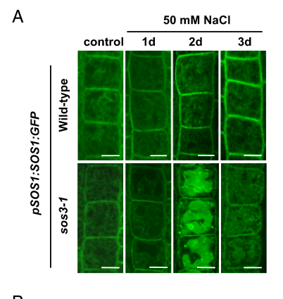

## Question

# Gene Research for Functional Annotation

## ⚠️ CRITICAL: Gene/Protein Identification Context

**BEFORE YOU BEGIN RESEARCH:** You MUST verify you are researching the CORRECT gene/protein. Gene symbols can be ambiguous, especially for less well-characterized genes from non-model organisms.

### Target Gene/Protein Identity (from UniProt):
- **UniProt Accession:** Q9LKW9
- **Protein Description:** RecName: Full=Sodium/hydrogen exchanger 7; AltName: Full=Na(+)/H(+) exchanger 7; Short=NHE-7; AltName: Full=Protein SALT OVERLY SENSITIVE 1;
- **Gene Information:** Name=NHX7; Synonyms=SOS1; OrderedLocusNames=At2g01980; ORFNames=F14H20.5;
- **Organism (full):** Arabidopsis thaliana (Mouse-ear cress).
- **Protein Family:** Belongs to the monovalent cation:proton antiporter 1 (CPA1)
- **Key Domains:** Cation/H_exchanger_CPA1. (IPR018422); Cation/H_exchanger_TM. (IPR006153); cNMP-bd_dom_sf. (IPR018490); Na_H_Exchanger (PF00999)

### MANDATORY VERIFICATION STEPS:

1. **Check if the gene symbol "NHX7" matches the protein description above**
2. **Verify the organism is correct:** Arabidopsis thaliana (Mouse-ear cress).
3. **Check if protein family/domains align with what you find in literature**
4. **If you find literature for a DIFFERENT gene with the same or similar symbol, STOP**

### If Gene Symbol is Ambiguous or You Cannot Find Relevant Literature:

**DO NOT PROCEED WITH RESEARCH ON A DIFFERENT GENE.** Instead:
- State clearly: "The gene symbol 'NHX7' is ambiguous or literature is limited for this specific protein"
- Explain what you found (e.g., "Found extensive literature on a different gene with the same symbol in a different organism")
- Describe the protein based ONLY on the UniProt information provided above
- Suggest that the protein function can be inferred from domain/family information

### Research Target:

Please provide a comprehensive research report on the gene **NHX7** (gene ID: SOS1, UniProt: Q9LKW9) in ARATH.

The research report should be a detailed narrative explaining the function, biological processes, and localization of the gene product. Citations should be given for all claims.

You should prioritize authoritative reviews and primary scientific literature when conducting research. You can supplement
this with annotations you find in gene/protein databases, but these can be outdated or inaccurate.

We are specifically interested in the primary function of the gene - for enzymes, what reaction is catalyzed, and what is the substrate specificity? For transporters, what is the substrate? For structural proteins or adapters, what is the broader structural role? For signaling molecules, what is the role in the pathway.

We are interested in where in or outside the cell the gene product carries out its function.

We are also interested in the signaling or biochemical pathways in which the gene functions. We are less interested in broad pleiotropic effects, except where these elucidate the precise role.

Include evidence where possible. We are interested in both experimental evidence as well as inference from structure, evolution, or bioinformatic analysis. Precise studies should be prioritized over high-throughput, where available.

## Output

Question: You are an expert researcher providing comprehensive, well-cited information.

Provide detailed information focusing on:
1. Key concepts and definitions with current understanding
2. Recent developments and latest research (prioritize 2023-2024 sources)
3. Current applications and real-world implementations
4. Expert opinions and analysis from authoritative sources
5. Relevant statistics and data from recent studies

Format as a comprehensive research report with proper citations. Include URLs and publication dates where available.
Always prioritize recent, authoritative sources and provide specific citations for all major claims.

# Gene Research for Functional Annotation

## ⚠️ CRITICAL: Gene/Protein Identification Context

**BEFORE YOU BEGIN RESEARCH:** You MUST verify you are researching the CORRECT gene/protein. Gene symbols can be ambiguous, especially for less well-characterized genes from non-model organisms.

### Target Gene/Protein Identity (from UniProt):
- **UniProt Accession:** Q9LKW9
- **Protein Description:** RecName: Full=Sodium/hydrogen exchanger 7; AltName: Full=Na(+)/H(+) exchanger 7; Short=NHE-7; AltName: Full=Protein SALT OVERLY SENSITIVE 1;
- **Gene Information:** Name=NHX7; Synonyms=SOS1; OrderedLocusNames=At2g01980; ORFNames=F14H20.5;
- **Organism (full):** Arabidopsis thaliana (Mouse-ear cress).
- **Protein Family:** Belongs to the monovalent cation:proton antiporter 1 (CPA1)
- **Key Domains:** Cation/H_exchanger_CPA1. (IPR018422); Cation/H_exchanger_TM. (IPR006153); cNMP-bd_dom_sf. (IPR018490); Na_H_Exchanger (PF00999)

### MANDATORY VERIFICATION STEPS:

1. **Check if the gene symbol "NHX7" matches the protein description above**
2. **Verify the organism is correct:** Arabidopsis thaliana (Mouse-ear cress).
3. **Check if protein family/domains align with what you find in literature**
4. **If you find literature for a DIFFERENT gene with the same or similar symbol, STOP**

### If Gene Symbol is Ambiguous or You Cannot Find Relevant Literature:

**DO NOT PROCEED WITH RESEARCH ON A DIFFERENT GENE.** Instead:
- State clearly: "The gene symbol 'NHX7' is ambiguous or literature is limited for this specific protein"
- Explain what you found (e.g., "Found extensive literature on a different gene with the same symbol in a different organism")
- Describe the protein based ONLY on the UniProt information provided above
- Suggest that the protein function can be inferred from domain/family information

### Research Target:

Please provide a comprehensive research report on the gene **NHX7** (gene ID: SOS1, UniProt: Q9LKW9) in ARATH.

The research report should be a detailed narrative explaining the function, biological processes, and localization of the gene product. Citations should be given for all claims.

You should prioritize authoritative reviews and primary scientific literature when conducting research. You can supplement
this with annotations you find in gene/protein databases, but these can be outdated or inaccurate.

We are specifically interested in the primary function of the gene - for enzymes, what reaction is catalyzed, and what is the substrate specificity? For transporters, what is the substrate? For structural proteins or adapters, what is the broader structural role? For signaling molecules, what is the role in the pathway.

We are interested in where in or outside the cell the gene product carries out its function.

We are also interested in the signaling or biochemical pathways in which the gene functions. We are less interested in broad pleiotropic effects, except where these elucidate the precise role.

Include evidence where possible. We are interested in both experimental evidence as well as inference from structure, evolution, or bioinformatic analysis. Precise studies should be prioritized over high-throughput, where available.

## Research report: Arabidopsis thaliana NHX7/SOS1 (UniProt Q9LKW9; At2g01980)

### 0) Target verification (mandatory)
The UniProt accession **Q9LKW9** corresponds to **Arabidopsis thaliana** gene **NHX7**, synonymous with **SALT OVERLY SENSITIVE 1 (SOS1)** and locus **At2g01980**. The literature retrieved here consistently describes this protein as a **plasma-membrane Na+/H+ antiporter** (CPA1 family) with a large cytosolic C-terminal regulatory tail, matching the UniProt description and domain architecture (xie2022structurefunctionand pages 2-3, xie2022structurefunctionand pages 3-5).

### 1) Key concepts and definitions (current understanding)

#### 1.1 What SOS1/NHX7 is
**SOS1 (NHX7)** is the principal **plasma membrane (PM) Na+/H+ antiporter** in Arabidopsis that supports salt tolerance by exporting Na+ from the cytosol to the apoplast/extracellular space in exchange for H+ (xie2022structurefunctionand pages 2-3, zhang2025salinitysurvivalmolecular pages 5-6). This exchanger is considered the terminal effector of the canonical **SOS (Salt Overly Sensitive) pathway**, which links salt-induced Ca2+ signals to Na+ extrusion (zhang2025salinitysurvivalmolecular pages 6-7, xie2022structurefunctionand pages 5-6).

#### 1.2 Transporter coupling and driving force
The SOS1 antiport reaction is **energetically coupled to the H+ electrochemical gradient** generated by the PM **H+-ATPase**; thus, Na+ export via SOS1 is ultimately powered by ATP hydrolysis through the pump (xie2022structurefunctionand pages 2-3). Conceptually, this is a secondary-active transport process: **Na+ efflux is driven by H+ influx** down its electrochemical potential (xie2022structurefunctionand pages 2-3, zhang2025salinitysurvivalmolecular pages 5-6).

#### 1.3 The SOS signaling pathway (conceptual definition)
The core SOS pathway is typically defined as:
- **SOS3/CBL4** (a Ca2+-binding sensor) detects salt-triggered Ca2+ transients and recruits/activates
- **SOS2/CIPK24** (a SnRK3/CIPK protein kinase), which phosphorylates
- **SOS1/NHX7**, relieving autoinhibition and increasing Na+/H+ exchange activity (xie2022structurefunctionand pages 6-8, zhang2025salinitysurvivalmolecular pages 6-7, li2023howdoplants pages 10-10).

### 2) Molecular function, structure, and regulation (evidence-based)

#### 2.1 Substrate specificity and directionality
**Primary substrate:** Na+ (export) coupled to H+ (import). SOS1 activity is described as **Na+ efflux** to reduce cytosolic Na+ under salinity (xie2022structurefunctionand pages 2-3, zhang2025salinitysurvivalmolecular pages 5-6).

#### 2.2 Domain architecture relevant to function
SOS1 is a large membrane protein (reported as **~1,146 amino acids**) with an N-terminal multi-pass transmembrane transport domain and a long cytosolic C-terminal regulatory region (xie2022structurefunctionand pages 3-5). The C-terminal tail contains regulatory segments (including CNBD-like motifs and inhibitory regions) that participate in autoinhibition and activation (xie2022structurefunctionand pages 3-5, zhang2025salinitysurvivalmolecular pages 5-6).

#### 2.3 Autoinhibition and phosphorylation-based activation (SOS2/CIPK24)
A central regulatory concept is that SOS1 is maintained in a **self-inhibited state** via its C-terminal tail and becomes activated by phosphorylation during salt stress (xie2022structurefunctionand pages 5-6, xie2022structurefunctionand pages 6-8).

Specific residue-level evidence summarized in a 2022 SOS1-focused review:
- SOS2/CIPK24 phosphorylates SOS1 at conserved serines **Ser1136/Ser1138** in the self-inhibitory C-terminal region, which **relieves autoinhibition** and activates Na+ export (xie2022structurefunctionand pages 6-8).
- Mutational evidence (as summarized in the review) indicates **Ser→Ala** substitutions reduce salt tolerance, while phosphomimic substitutions can enhance SOS2 interaction (xie2022structurefunctionand pages 6-8).

#### 2.4 Ca2+ sensors and kinase recruitment: SOS3/CBL4 and SCaBP8/CBL10
Salt stress increases cytosolic Ca2+; Ca2+ sensor proteins **SOS3/CBL4** and **SCaBP8/CBL10** bind and recruit SOS2 to the PM, promoting downstream SOS1 activation by phosphorylation (xie2022structurefunctionand pages 5-6, zhang2025salinitysurvivalmolecular pages 6-7).

A 2025 synthesis (reviewing Arabidopsis work) further supports **tissue/organ specialization**: the SOS2–SOS3 module acts mainly in roots, while SOS2–SCaBP8/CBL10 is emphasized in shoots (zhang2025salinitysurvivalmolecular pages 6-7).

#### 2.5 2024 primary advance: SOS3/CBL4 directly controls SOS1 localization and coordinates SOS1 vs HKT1
A key 2024 primary study (PNAS; publication month Feb 2024) provides mechanistic evidence that SOS3 does not only activate SOS2, but also **directly binds SOS1 and controls its localization/stability at the plasma membrane under salt stress** (gamezarjona2024inverseregulationof pages 1-2, gamezarjona2024inverseregulationof pages 3-4).

Key findings include:
- SOS3 binds a mapped **SOS3-binding domain (S3BD)** in SOS1 (**K460–L482**). Deleting this domain (SOS1ΔS3BD) abolishes SOS3 binding and **fails to complement** sos1-1 in planta (gamezarjona2024inverseregulationof pages 2-3).
- Confocal imaging shows that under **50 mM NaCl**, SOS1:GFP becomes increasingly recruited to the plasma membrane over **1–3 days** in roots with functional SOS3; in sos3 mutants, SOS1:GFP redistributes to intracellular compartments and ultimately vacuolar localization after ~2 days (gamezarjona2024inverseregulationof pages 3-4, gamezarjona2024inverseregulationof pages 5-6).
- Imaging quantification in this study reports evaluation of **≥70 cells and ≥7 plants** (gamezarjona2024inverseregulationof pages 5-6).

This work proposes SOS3 as a Ca2+-sensor “molecular switch” that simultaneously promotes SOS1 PM recruitment/activation while triggering degradation of HKT1;1 (a major xylem Na+ unloading system), thus shifting vascular Na+ handling under acute salinity (gamezarjona2024inverseregulationof pages 1-2, gamezarjona2024inverseregulationof pages 5-6).

### 3) Cellular/subcellular localization and expression context

#### 3.1 Subcellular localization
SOS1 localizes to the **plasma membrane**, consistent with its function in Na+ extrusion to the extracellular space (xie2022structurefunctionand pages 2-3, xie2022structurefunctionand pages 5-6).

The 2024 PNAS study adds that SOS1’s PM localization is **dynamic and salt-inducible**, and is strongly **SOS3-dependent** in roots under 50 mM NaCl (gamezarjona2024inverseregulationof pages 3-4, gamezarjona2024inverseregulationof pages 5-6).

#### 3.2 Tissue-level expression domains relevant to function
SOS1 expression/localization is repeatedly associated with **root epidermis** and **xylem-associated parenchyma**, consistent with roles in both direct Na+ efflux at the root surface and regulation of long-distance Na+ transport via xylem loading/unloading (xie2022structurefunctionand pages 5-6, ferrandi2023investigatingthemolecular pages 30-33).

### 4) Biological processes and pathways

#### 4.1 Primary biological role: salt tolerance via Na+ extrusion and ion homeostasis
Loss-of-function sos mutants (sos1, sos2, sos3) exhibit strong salt sensitivity, supporting the conclusion that the SOS pathway is essential for salt tolerance through ion homeostasis maintenance (zhang2025salinitysurvivalmolecular pages 6-7, xie2022structurefunctionand pages 5-6).

#### 4.2 Long-distance Na+ transport (root–shoot partitioning)
Evidence summarized in the 2022 review indicates that the **effect of SOS1 on shoot Na+ accumulation is stress-dependent**: under **100 mM NaCl**, shoots of sos1 mutants accumulated significantly more Na+ than wild type, whereas under milder conditions some studies report altered (including reduced) shoot Na+ (xie2022structurefunctionand pages 5-6). This supports a dual role in **root Na+ exclusion** and **vascular Na+ management**.

#### 4.3 Integration with other transporters and stress modules (systems view)
SOS1-mediated Na+ efflux is functionally coordinated with other salt tolerance systems, such as vacuolar compartmentation (e.g., NHX1) and xylem Na+ transport/unloading systems (HKT1), to balance cytosolic Na+ toxicity with osmotic adjustment (xie2022structurefunctionand pages 8-9).

The 2024 PNAS paper gives a concrete mechanistic coupling between SOS1 and HKT1 at the protein regulation level: SOS3 promotes SOS1 PM recruitment while directing HKT1;1 proteasomal degradation under salt/high Ca2+ (gamezarjona2024inverseregulationof pages 1-2, gamezarjona2024inverseregulationof pages 5-6).

### 5) Recent developments (prioritizing 2023–2024)

#### 5.1 2023 review synthesis: ion/pH homeostasis framing
A 2023 Frontiers in Plant Science review frames SOS1 as a central actor in plant **ion and pH homeostasis** under saline-alkali stress and highlights SOS2–CBL partnerships (including SCaBP8/CBL10) as key regulatory modules for SOS1 activation (Oct 2023; URL in citation) (li2023howdoplants pages 10-10).

#### 5.2 2024 primary mechanism: SOS3 as the missing co-regulator of SOS1 and HKT1
The most substantial new mechanistic evidence in the retrieved 2023–2024 corpus is the PNAS 2024 finding that SOS3 directly governs **SOS1 plasma-membrane recruitment** (beyond SOS2 activation) and inversely regulates **HKT1;1 stability**, shifting vascular Na+ flux under acute salinity (gamezarjona2024inverseregulationof pages 1-2, gamezarjona2024inverseregulationof pages 5-6).

Quantitative/operational details reported include:
- SOS1:GFP PM recruitment assay condition: **50 mM NaCl** for **1–3 days** (gamezarjona2024inverseregulationof pages 5-6).
- HKT1 degradation is **proteasome-dependent** and prevented by **MG132**, with degradation observed over **24 h** of salt treatment; a similar response is triggered by **3 mM CaCl2** and requires SOS3 (gamezarjona2024inverseregulationof pages 5-6).

#### 5.3 Structural advances (availability limitation)
The 2024 PNAS paper cites that a **cryo-EM structure of SOS1** is consistent with current models for the pore domain and C-terminal regulatory topology, but the primary cryo-EM structure paper itself was not available in retrieved full text (gamezarjona2024inverseregulationof pages 2-3). Consequently, the report here does not reproduce cryo-EM-derived quantitative structural metrics.

### 6) Current applications and real-world implementations

#### 6.1 Translational use: engineering salt tolerance traits
Across plant stress biology, SOS1 ortholog manipulation (overexpression/allele mining) is widely treated as a plausible strategy to improve salt tolerance by enhancing Na+ exclusion capacity. Reviews of SOS1 emphasize feasibility of genetic improvement strategies that target the SOS network and ion transport components (xie2022structurefunctionand pages 12-13, xie2022structurefunctionand pages 6-8).

#### 6.2 Practical design implications from 2024 mechanistic findings
The 2024 SOS3-dependent mechanism implies that engineering SOS1 activity alone may be insufficient if **proper PM recruitment and stability** are limiting. The SOS3–SOS1 interaction domain (S3BD K460–L482) and the regulatory axis coordinating SOS1 vs HKT1 suggest concrete intervention points for tuning **root Na+ retention vs shoot delivery** dynamics under different salinity regimes (gamezarjona2024inverseregulationof pages 2-3, gamezarjona2024inverseregulationof pages 1-2).

### 7) Expert opinions and analysis (authoritative perspectives)

- A dedicated SOS1-focused review (Frontiers in Plant Science, 2022) characterizes SOS1 as the **main Na+ efflux system** in the SOS pathway and emphasizes that SOS1 regulation is multi-layered (autoinhibition, phosphorylation, protein–protein interactions, and cross-talk with ROS and lipid signaling), underscoring that SOS signaling operates as an integrated network rather than a simple linear cascade (xie2022structurefunctionand pages 12-13, xie2022structurefunctionand pages 8-9).
- The 2024 PNAS authors interpret SOS3 as a **molecular switch** that coordinately regulates two opposing Na+ transport processes (SOS1-mediated Na+ loading/efflux vs HKT1-mediated xylem unloading), highlighting the importance of avoiding futile cycling and enabling phase-specific salt responses (root osmotic adjustment vs acute stress evacuation) (gamezarjona2024inverseregulationof pages 1-2).

### 8) Statistics and data points from recent and foundational studies (as available in retrieved texts)
The retrieved full texts contain several explicit quantitative conditions and measured/quantified elements relevant to functional annotation:
- **Salt treatment regimes linked to SOS1 phenotypes/ion outcomes:** 25 mM vs 100 mM NaCl were discussed as contrasting regimes associated with different shoot Na+ accumulation behavior in sos1 mutants vs wild type (ferrandi2023investigatingthemolecular pages 30-33, xie2022structurefunctionand pages 5-6).
- **Dynamic localization experiment (2024):** SOS1:GFP PM recruitment in root epidermal cells after **50 mM NaCl** for **1–3 days**; imaging quantified over **≥70 cells and ≥7 plants** (gamezarjona2024inverseregulationof pages 5-6).
- **Protein degradation assay (2024):** HKT1 abundance decreases over **24 h** salt treatment and is **blocked by MG132** (proteasome inhibitor); **3 mM CaCl2** induces similar degradation; genetic evidence indicates requirement for SOS3 but not SOS1/SOS2 (gamezarjona2024inverseregulationof pages 5-6).

### 9) Evidence map (summary table)
The following table provides a compact link between major annotation claims and the primary evidence/reviews supporting them.

| Aspect | Key findings | Evidence type/assays | Key citations with year & URL |
|---|---|---|---|
| Identity verified | Arabidopsis thaliana NHX7 is the same protein as SOS1/At2g01980 (UniProt Q9LKW9), a plasma-membrane Na+/H+ antiporter in the CPA1 family with a long regulatory C-terminus; this distinguishes it from vacuolar NHX proteins and similarly named genes in other species. | Gene cloning/annotation synthesis; comparative structural/domain analysis | Xie et al., 2022, Front Plant Sci, https://doi.org/10.3389/fpls.2022.866265 (xie2022structurefunctionand pages 2-3, xie2022structurefunctionand pages 3-5) |
| Transport function and coupling | SOS1/NHX7 mediates active Na+ efflux from the cytosol in exchange for H+, lowering cytosolic Na+ during salt stress. Transport is driven by the proton electrochemical gradient generated by the plasma-membrane H+-ATPase. | Genetics, heterologous yeast complementation, pathway reconstitution, physiological transport analyses | Xie et al., 2022, https://doi.org/10.3389/fpls.2022.866265; Zhang et al., 2025 review summarizing Arabidopsis work, https://doi.org/10.3389/fpls.2025.1527952 (xie2022structurefunctionand pages 2-3, zhang2025salinitysurvivalmolecular pages 5-6) |
| Localization and expression domains | SOS1 is plasma-membrane localized and strongly associated with root epidermis and xylem-associated parenchyma; expression is also reported in stems and leaves and is induced by salt stress. | GFP localization, promoter-GUS, expression analyses, mutant phenotypes | Xie et al., 2022, https://doi.org/10.3389/fpls.2022.866265; Ferrandi, 2023 summary of Arabidopsis literature (unknown journal) (xie2022structurefunctionand pages 5-6, ferrandi2023investigatingthemolecular pages 30-33) |
| Physiological role in salt tolerance | sos1 loss-of-function mutants are highly salt sensitive. SOS1 supports root Na+ extrusion and contributes to long-distance Na+ transport/xylem ion handling, with context-dependent effects on shoot Na+ accumulation under mild versus severe salinity. | Mutant phenotyping, shoot/root ion measurements, xylem sap analyses | Xie et al., 2022, https://doi.org/10.3389/fpls.2022.866265; Ferrandi, 2023 summary (xie2022structurefunctionand pages 5-6, ferrandi2023investigatingthemolecular pages 30-33) |
| Core SOS pathway: SOS3/CBL4 → SOS2/CIPK24 → SOS1 | Salt-induced cytosolic Ca2+ is sensed by SOS3/CBL4, which recruits/activates SOS2/CIPK24 at the plasma membrane; SOS2 then phosphorylates the C-terminal inhibitory region of SOS1 to activate Na+ export. | Genetic epistasis, kinase-substrate studies, protein interaction assays, yeast reconstitution | Xie et al., 2022, https://doi.org/10.3389/fpls.2022.866265; Li & Yang, 2023, https://doi.org/10.3389/fpls.2023.1217193; Zhang et al., 2025, https://doi.org/10.3389/fpls.2025.1527952 (xie2022structurefunctionand pages 6-8, li2023howdoplants pages 10-10, zhang2025salinitysurvivalmolecular pages 6-7) |
| CBL10/SCaBP8 branch | SCaBP8/CBL10 also binds SOS2 and recruits it to the plasma membrane, functioning especially in shoots; recent reviews further note that SCaBP8 relieves inhibition of SOS1 by repressing PP2C.D phosphatases. | Protein interaction, phosphorylation studies, review synthesis of recent Arabidopsis work | Zhang et al., 2025, https://doi.org/10.3389/fpls.2025.1527952; Li & Yang, 2023, https://doi.org/10.3389/fpls.2023.1217193; Fu & Yang, 2023, https://doi.org/10.3390/cimb45070374 (zhang2025salinitysurvivalmolecular pages 6-7, li2023howdoplants pages 10-10) |
| Regulatory domains/residues: S3BD | A SOS3-binding domain (S3BD) in SOS1 was mapped to K460-L482. SOS3 binds this region directly; deleting S3BD abolishes SOS3 binding and prevents complementation of sos1-1 in planta, although basal transporter activity can increase in yeast. | BiFC, co-IP, fluorescence titration, structure-guided modeling, yeast complementation, plant complementation | Gámez-Arjona et al., 2024, PNAS, https://doi.org/10.1073/pnas.2320657121 (gamezarjona2024inverseregulationof pages 2-3, gamezarjona2024inverseregulationof pages 3-4, gamezarjona2024inverseregulationof pages 4-5) |
| Regulatory domains/residues: autoinhibitory region | The C-terminal autoinhibitory region around L1005-L1047 keeps SOS1 inactive under non-stress conditions; deletion of the C-terminus causes constitutive activation. | Domain deletion/mutagenesis, heterologous functional assays, structural modeling/review synthesis | Gámez-Arjona et al., 2024, https://doi.org/10.1073/pnas.2320657121; Xie et al., 2022, https://doi.org/10.3389/fpls.2022.866265 (gamezarjona2024inverseregulationof pages 2-3, xie2022structurefunctionand pages 6-8) |
| Regulatory phosphorylation sites | SOS2/CIPK24 phosphorylates conserved serines S1136/S1138 in the self-inhibitory domain, relieving autoinhibition and activating SOS1; Ser→Ala substitutions reduce salt tolerance, while phosphomimic mutations increase SOS2 binding. | Site-directed mutagenesis, kinase regulation studies, salt-tolerance assays | Xie et al., 2022, https://doi.org/10.3389/fpls.2022.866265 (xie2022structurefunctionand pages 6-8) |
| 2024 PNAS: SOS3-dependent PM recruitment of SOS1 | Under 50 mM NaCl, SOS1:GFP is recruited to the plasma membrane over 1-3 days in wild-type roots, but in sos3 mutants it redistributes to intracellular compartments/vacuoles. Imaging was quantified from at least 70 cells and at least 7 plants. | Confocal microscopy of SOS1:GFP in roots under salt treatment | Gámez-Arjona et al., 2024, PNAS, https://doi.org/10.1073/pnas.2320657121 (gamezarjona2024inverseregulationof pages 3-4, gamezarjona2024inverseregulationof pages 5-6, gamezarjona2024inverseregulationof media a48c6807) |
| 2024 PNAS: inverse regulation of HKT1;1 | SOS3 also binds HKT1;1 and promotes its salt- and Ca2+-dependent proteasomal degradation, shifting Na+ handling away from root retention toward SOS1-mediated efflux/xylem loading under acute salinity. Coexpression of SOS3 did not alter HKT1;1 currents in oocytes, supporting regulation via localization/stability rather than channel gating. | BiFC, co-IP, degradation assays, Xenopus oocyte electrophysiology | Gámez-Arjona et al., 2024, PNAS, https://doi.org/10.1073/pnas.2320657121 (gamezarjona2024inverseregulationof pages 4-5, gamezarjona2024inverseregulationof pages 5-6) |
| 2024 PNAS: MG132 evidence | HKT1;1 protein abundance declines over 24 h of salt treatment, and this degradation is blocked by the 26S proteasome inhibitor MG132; similar effects are induced by 3 mM CaCl2, and the degradation response is absent in sos3-1. | Immunoblot/protein stability assays with MG132 and Ca2+ treatments | Gámez-Arjona et al., 2024, PNAS, https://doi.org/10.1073/pnas.2320657121 (gamezarjona2024inverseregulationof pages 5-6, gamezarjona2024inverseregulationof media f2745787) |
| Structural state of the field | Recent Arabidopsis work cites a cryo-EM structure of SOS1 consistent with the topology of the pore domain and C-terminal autoinhibitory/helical-cytosolic regions, strengthening current models of activation, though the detailed structural paper itself was not directly available in retrieved full text. | Structure-guided interpretation cited by recent primary literature | Gámez-Arjona et al., 2024, https://doi.org/10.1073/pnas.2320657121 (gamezarjona2024inverseregulationof pages 2-3) |

*Table: This table summarizes verified identity, transport function, localization, regulation, and recent 2024 mechanistic findings for Arabidopsis SOS1/NHX7. It is useful as a compact evidence map linking each major claim to the assays and citations supporting it.*

### 10) Visual evidence (from primary 2024 study)
- Confocal microscopy panels show salinity- and SOS3-dependent recruitment of SOS1:GFP to the plasma membrane over 1–3 days (gamezarjona2024inverseregulationof media a48c6807).
- Immunoblot panels show salt/high-Ca2+-dependent HKT1 degradation and rescue by MG132 (proteasome inhibition) (gamezarjona2024inverseregulationof media f2745787).

### 11) Limitations of this tool-run (transparency)
Some highly relevant 2023 primary structural/regulatory papers (including a Nature Plants 2023 study on the structural basis of Arabidopsis SOS1 regulation, and a Plant Cell 2023 study on PP2C.D6/D7 inhibition of SOS1) were identified by search but were not obtainable as full text in this run; therefore, this report restricts detailed claims to the retrieved full-text evidence above (gamezarjona2024inverseregulationof pages 2-3, zhang2025salinitysurvivalmolecular pages 6-7).

References

1. (xie2022structurefunctionand pages 2-3): Qing Xie, Yang Zhou, and Xingyu Jiang. Structure, function, and regulation of the plasma membrane na+/h+ antiporter salt overly sensitive 1 in plants. Frontiers in Plant Science, Mar 2022. URL: https://doi.org/10.3389/fpls.2022.866265, doi:10.3389/fpls.2022.866265. This article has 80 citations.

2. (xie2022structurefunctionand pages 3-5): Qing Xie, Yang Zhou, and Xingyu Jiang. Structure, function, and regulation of the plasma membrane na+/h+ antiporter salt overly sensitive 1 in plants. Frontiers in Plant Science, Mar 2022. URL: https://doi.org/10.3389/fpls.2022.866265, doi:10.3389/fpls.2022.866265. This article has 80 citations.

3. (zhang2025salinitysurvivalmolecular pages 5-6): Huankai Zhang, Caiyu Yu, Qian Zhang, Zihan Qiu, Xiansheng Zhang, Yifeng Hou, and Jie Zang. Salinity survival: molecular mechanisms and adaptive strategies in plants. Frontiers in Plant Science, Feb 2025. URL: https://doi.org/10.3389/fpls.2025.1527952, doi:10.3389/fpls.2025.1527952. This article has 42 citations.

4. (zhang2025salinitysurvivalmolecular pages 6-7): Huankai Zhang, Caiyu Yu, Qian Zhang, Zihan Qiu, Xiansheng Zhang, Yifeng Hou, and Jie Zang. Salinity survival: molecular mechanisms and adaptive strategies in plants. Frontiers in Plant Science, Feb 2025. URL: https://doi.org/10.3389/fpls.2025.1527952, doi:10.3389/fpls.2025.1527952. This article has 42 citations.

5. (xie2022structurefunctionand pages 5-6): Qing Xie, Yang Zhou, and Xingyu Jiang. Structure, function, and regulation of the plasma membrane na+/h+ antiporter salt overly sensitive 1 in plants. Frontiers in Plant Science, Mar 2022. URL: https://doi.org/10.3389/fpls.2022.866265, doi:10.3389/fpls.2022.866265. This article has 80 citations.

6. (xie2022structurefunctionand pages 6-8): Qing Xie, Yang Zhou, and Xingyu Jiang. Structure, function, and regulation of the plasma membrane na+/h+ antiporter salt overly sensitive 1 in plants. Frontiers in Plant Science, Mar 2022. URL: https://doi.org/10.3389/fpls.2022.866265, doi:10.3389/fpls.2022.866265. This article has 80 citations.

7. (li2023howdoplants pages 10-10): Jing Li and Yongqing Yang. How do plants maintain ph and ion homeostasis under saline-alkali stress? Frontiers in Plant Science, Oct 2023. URL: https://doi.org/10.3389/fpls.2023.1217193, doi:10.3389/fpls.2023.1217193. This article has 85 citations.

8. (gamezarjona2024inverseregulationof pages 1-2): Francisco Gámez-Arjona, Hee Jin Park, Elena García, Rashid Aman, Irene Villalta, Natalia Raddatz, Raul Carranco, Akhtar Ali, Zahir Ali, Shah Zareen, Anna De Luca, Eduardo O. Leidi, Miguel Daniel-Mozo, Zheng-Yi Xu, Armando Albert, Woe-Yeon Kim, Jose M. Pardo, Clara Sánchez-Rodriguez, Dae-Jin Yun, and Francisco J. Quintero. Inverse regulation of sos1 and hkt1 protein localization and stability by sos3/cbl4 in arabidopsis thaliana. Proceedings of the National Academy of Sciences of the United States of America, Feb 2024. URL: https://doi.org/10.1073/pnas.2320657121, doi:10.1073/pnas.2320657121. This article has 42 citations and is from a highest quality peer-reviewed journal.

9. (gamezarjona2024inverseregulationof pages 3-4): Francisco Gámez-Arjona, Hee Jin Park, Elena García, Rashid Aman, Irene Villalta, Natalia Raddatz, Raul Carranco, Akhtar Ali, Zahir Ali, Shah Zareen, Anna De Luca, Eduardo O. Leidi, Miguel Daniel-Mozo, Zheng-Yi Xu, Armando Albert, Woe-Yeon Kim, Jose M. Pardo, Clara Sánchez-Rodriguez, Dae-Jin Yun, and Francisco J. Quintero. Inverse regulation of sos1 and hkt1 protein localization and stability by sos3/cbl4 in arabidopsis thaliana. Proceedings of the National Academy of Sciences of the United States of America, Feb 2024. URL: https://doi.org/10.1073/pnas.2320657121, doi:10.1073/pnas.2320657121. This article has 42 citations and is from a highest quality peer-reviewed journal.

10. (gamezarjona2024inverseregulationof pages 2-3): Francisco Gámez-Arjona, Hee Jin Park, Elena García, Rashid Aman, Irene Villalta, Natalia Raddatz, Raul Carranco, Akhtar Ali, Zahir Ali, Shah Zareen, Anna De Luca, Eduardo O. Leidi, Miguel Daniel-Mozo, Zheng-Yi Xu, Armando Albert, Woe-Yeon Kim, Jose M. Pardo, Clara Sánchez-Rodriguez, Dae-Jin Yun, and Francisco J. Quintero. Inverse regulation of sos1 and hkt1 protein localization and stability by sos3/cbl4 in arabidopsis thaliana. Proceedings of the National Academy of Sciences of the United States of America, Feb 2024. URL: https://doi.org/10.1073/pnas.2320657121, doi:10.1073/pnas.2320657121. This article has 42 citations and is from a highest quality peer-reviewed journal.

11. (gamezarjona2024inverseregulationof pages 5-6): Francisco Gámez-Arjona, Hee Jin Park, Elena García, Rashid Aman, Irene Villalta, Natalia Raddatz, Raul Carranco, Akhtar Ali, Zahir Ali, Shah Zareen, Anna De Luca, Eduardo O. Leidi, Miguel Daniel-Mozo, Zheng-Yi Xu, Armando Albert, Woe-Yeon Kim, Jose M. Pardo, Clara Sánchez-Rodriguez, Dae-Jin Yun, and Francisco J. Quintero. Inverse regulation of sos1 and hkt1 protein localization and stability by sos3/cbl4 in arabidopsis thaliana. Proceedings of the National Academy of Sciences of the United States of America, Feb 2024. URL: https://doi.org/10.1073/pnas.2320657121, doi:10.1073/pnas.2320657121. This article has 42 citations and is from a highest quality peer-reviewed journal.

12. (ferrandi2023investigatingthemolecular pages 30-33): P Ferrandi. Investigating the molecular mechanism whereby auxin modulates arabidopsis thaliana growth under salinity stress conditions. Unknown journal, 2023.

13. (xie2022structurefunctionand pages 8-9): Qing Xie, Yang Zhou, and Xingyu Jiang. Structure, function, and regulation of the plasma membrane na+/h+ antiporter salt overly sensitive 1 in plants. Frontiers in Plant Science, Mar 2022. URL: https://doi.org/10.3389/fpls.2022.866265, doi:10.3389/fpls.2022.866265. This article has 80 citations.

14. (xie2022structurefunctionand pages 12-13): Qing Xie, Yang Zhou, and Xingyu Jiang. Structure, function, and regulation of the plasma membrane na+/h+ antiporter salt overly sensitive 1 in plants. Frontiers in Plant Science, Mar 2022. URL: https://doi.org/10.3389/fpls.2022.866265, doi:10.3389/fpls.2022.866265. This article has 80 citations.

15. (gamezarjona2024inverseregulationof pages 4-5): Francisco Gámez-Arjona, Hee Jin Park, Elena García, Rashid Aman, Irene Villalta, Natalia Raddatz, Raul Carranco, Akhtar Ali, Zahir Ali, Shah Zareen, Anna De Luca, Eduardo O. Leidi, Miguel Daniel-Mozo, Zheng-Yi Xu, Armando Albert, Woe-Yeon Kim, Jose M. Pardo, Clara Sánchez-Rodriguez, Dae-Jin Yun, and Francisco J. Quintero. Inverse regulation of sos1 and hkt1 protein localization and stability by sos3/cbl4 in arabidopsis thaliana. Proceedings of the National Academy of Sciences of the United States of America, Feb 2024. URL: https://doi.org/10.1073/pnas.2320657121, doi:10.1073/pnas.2320657121. This article has 42 citations and is from a highest quality peer-reviewed journal.

16. (gamezarjona2024inverseregulationof media a48c6807): Francisco Gámez-Arjona, Hee Jin Park, Elena García, Rashid Aman, Irene Villalta, Natalia Raddatz, Raul Carranco, Akhtar Ali, Zahir Ali, Shah Zareen, Anna De Luca, Eduardo O. Leidi, Miguel Daniel-Mozo, Zheng-Yi Xu, Armando Albert, Woe-Yeon Kim, Jose M. Pardo, Clara Sánchez-Rodriguez, Dae-Jin Yun, and Francisco J. Quintero. Inverse regulation of sos1 and hkt1 protein localization and stability by sos3/cbl4 in arabidopsis thaliana. Proceedings of the National Academy of Sciences of the United States of America, Feb 2024. URL: https://doi.org/10.1073/pnas.2320657121, doi:10.1073/pnas.2320657121. This article has 42 citations and is from a highest quality peer-reviewed journal.

17. (gamezarjona2024inverseregulationof media f2745787): Francisco Gámez-Arjona, Hee Jin Park, Elena García, Rashid Aman, Irene Villalta, Natalia Raddatz, Raul Carranco, Akhtar Ali, Zahir Ali, Shah Zareen, Anna De Luca, Eduardo O. Leidi, Miguel Daniel-Mozo, Zheng-Yi Xu, Armando Albert, Woe-Yeon Kim, Jose M. Pardo, Clara Sánchez-Rodriguez, Dae-Jin Yun, and Francisco J. Quintero. Inverse regulation of sos1 and hkt1 protein localization and stability by sos3/cbl4 in arabidopsis thaliana. Proceedings of the National Academy of Sciences of the United States of America, Feb 2024. URL: https://doi.org/10.1073/pnas.2320657121, doi:10.1073/pnas.2320657121. This article has 42 citations and is from a highest quality peer-reviewed journal.

## Artifacts

- [Edison artifact artifact-00](SOS1-deep-research-falcon_artifacts/artifact-00.md)

## Citations

1. xie2022structurefunctionand pages 2-3
2. xie2022structurefunctionand pages 3-5
3. xie2022structurefunctionand pages 6-8
4. zhang2025salinitysurvivalmolecular pages 6-7
5. gamezarjona2024inverseregulationof pages 2-3
6. gamezarjona2024inverseregulationof pages 5-6
7. xie2022structurefunctionand pages 5-6
8. xie2022structurefunctionand pages 8-9
9. li2023howdoplants pages 10-10
10. gamezarjona2024inverseregulationof pages 1-2
11. zhang2025salinitysurvivalmolecular pages 5-6
12. gamezarjona2024inverseregulationof pages 3-4
13. ferrandi2023investigatingthemolecular pages 30-33
14. xie2022structurefunctionand pages 12-13
15. gamezarjona2024inverseregulationof pages 4-5
16. https://doi.org/10.3389/fpls.2022.866265
17. https://doi.org/10.3389/fpls.2022.866265;
18. https://doi.org/10.3389/fpls.2025.1527952
19. https://doi.org/10.3389/fpls.2023.1217193;
20. https://doi.org/10.3389/fpls.2025.1527952;
21. https://doi.org/10.3390/cimb45070374
22. https://doi.org/10.1073/pnas.2320657121
23. https://doi.org/10.1073/pnas.2320657121;
24. https://doi.org/10.3389/fpls.2022.866265,
25. https://doi.org/10.3389/fpls.2025.1527952,
26. https://doi.org/10.3389/fpls.2023.1217193,
27. https://doi.org/10.1073/pnas.2320657121,