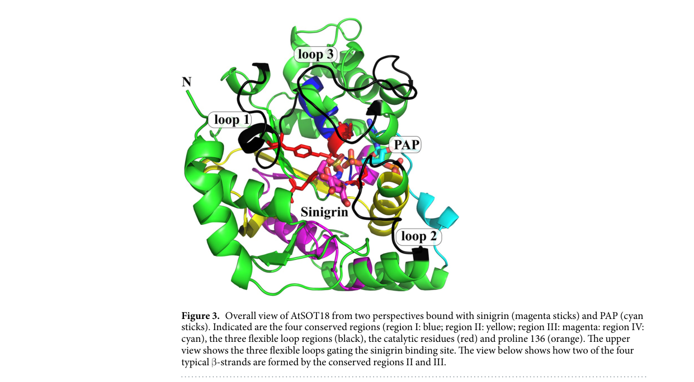
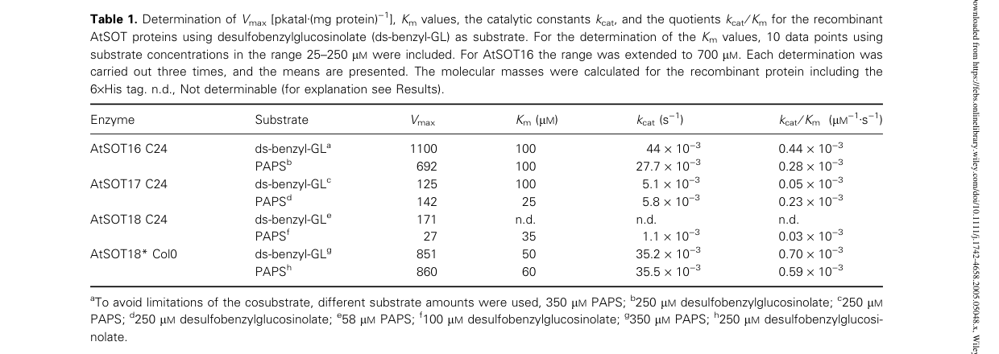

## Question

# Gene Research for Functional Annotation

## ⚠️ CRITICAL: Gene/Protein Identification Context

**BEFORE YOU BEGIN RESEARCH:** You MUST verify you are researching the CORRECT gene/protein. Gene symbols can be ambiguous, especially for less well-characterized genes from non-model organisms.

### Target Gene/Protein Identity (from UniProt):
- **UniProt Accession:** Q9C9C9
- **Protein Description:** RecName: Full=Cytosolic sulfotransferase 18; Short=AtSOT18; EC=2.8.2.38 {ECO:0000269|PubMed:16367753, ECO:0000269|PubMed:19077143}; AltName: Full=Desulfo-glucosinolate sulfotransferase B; AltName: Full=Sulfotransferase 5B; Short=AtST5b;
- **Gene Information:** Name=SOT18; Synonyms=ST5B; OrderedLocusNames=At1g74090; ORFNames=F2P9.4;
- **Organism (full):** Arabidopsis thaliana (Mouse-ear cress).
- **Protein Family:** Belongs to the sulfotransferase 1 family. .
- **Key Domains:** P-loop_NTPase. (IPR027417); Sulfotransferase_dom. (IPR000863); Sulfotransfer_1 (PF00685)

### MANDATORY VERIFICATION STEPS:

1. **Check if the gene symbol "SOT18" matches the protein description above**
2. **Verify the organism is correct:** Arabidopsis thaliana (Mouse-ear cress).
3. **Check if protein family/domains align with what you find in literature**
4. **If you find literature for a DIFFERENT gene with the same or similar symbol, STOP**

### If Gene Symbol is Ambiguous or You Cannot Find Relevant Literature:

**DO NOT PROCEED WITH RESEARCH ON A DIFFERENT GENE.** Instead:
- State clearly: "The gene symbol 'SOT18' is ambiguous or literature is limited for this specific protein"
- Explain what you found (e.g., "Found extensive literature on a different gene with the same symbol in a different organism")
- Describe the protein based ONLY on the UniProt information provided above
- Suggest that the protein function can be inferred from domain/family information

### Research Target:

Please provide a comprehensive research report on the gene **SOT18** (gene ID: SOT18, UniProt: Q9C9C9) in ARATH.

The research report should be a detailed narrative explaining the function, biological processes, and localization of the gene product. Citations should be given for all claims.

You should prioritize authoritative reviews and primary scientific literature when conducting research. You can supplement
this with annotations you find in gene/protein databases, but these can be outdated or inaccurate.

We are specifically interested in the primary function of the gene - for enzymes, what reaction is catalyzed, and what is the substrate specificity? For transporters, what is the substrate? For structural proteins or adapters, what is the broader structural role? For signaling molecules, what is the role in the pathway.

We are interested in where in or outside the cell the gene product carries out its function.

We are also interested in the signaling or biochemical pathways in which the gene functions. We are less interested in broad pleiotropic effects, except where these elucidate the precise role.

Include evidence where possible. We are interested in both experimental evidence as well as inference from structure, evolution, or bioinformatic analysis. Precise studies should be prioritized over high-throughput, where available.

## Output

Question: You are an expert researcher providing comprehensive, well-cited information.

Provide detailed information focusing on:
1. Key concepts and definitions with current understanding
2. Recent developments and latest research (prioritize 2023-2024 sources)
3. Current applications and real-world implementations
4. Expert opinions and analysis from authoritative sources
5. Relevant statistics and data from recent studies

Format as a comprehensive research report with proper citations. Include URLs and publication dates where available.
Always prioritize recent, authoritative sources and provide specific citations for all major claims.

# Gene Research for Functional Annotation

## ⚠️ CRITICAL: Gene/Protein Identification Context

**BEFORE YOU BEGIN RESEARCH:** You MUST verify you are researching the CORRECT gene/protein. Gene symbols can be ambiguous, especially for less well-characterized genes from non-model organisms.

### Target Gene/Protein Identity (from UniProt):
- **UniProt Accession:** Q9C9C9
- **Protein Description:** RecName: Full=Cytosolic sulfotransferase 18; Short=AtSOT18; EC=2.8.2.38 {ECO:0000269|PubMed:16367753, ECO:0000269|PubMed:19077143}; AltName: Full=Desulfo-glucosinolate sulfotransferase B; AltName: Full=Sulfotransferase 5B; Short=AtST5b;
- **Gene Information:** Name=SOT18; Synonyms=ST5B; OrderedLocusNames=At1g74090; ORFNames=F2P9.4;
- **Organism (full):** Arabidopsis thaliana (Mouse-ear cress).
- **Protein Family:** Belongs to the sulfotransferase 1 family. .
- **Key Domains:** P-loop_NTPase. (IPR027417); Sulfotransferase_dom. (IPR000863); Sulfotransfer_1 (PF00685)

### MANDATORY VERIFICATION STEPS:

1. **Check if the gene symbol "SOT18" matches the protein description above**
2. **Verify the organism is correct:** Arabidopsis thaliana (Mouse-ear cress).
3. **Check if protein family/domains align with what you find in literature**
4. **If you find literature for a DIFFERENT gene with the same or similar symbol, STOP**

### If Gene Symbol is Ambiguous or You Cannot Find Relevant Literature:

**DO NOT PROCEED WITH RESEARCH ON A DIFFERENT GENE.** Instead:
- State clearly: "The gene symbol 'SOT18' is ambiguous or literature is limited for this specific protein"
- Explain what you found (e.g., "Found extensive literature on a different gene with the same symbol in a different organism")
- Describe the protein based ONLY on the UniProt information provided above
- Suggest that the protein function can be inferred from domain/family information

### Research Target:

Please provide a comprehensive research report on the gene **SOT18** (gene ID: SOT18, UniProt: Q9C9C9) in ARATH.

The research report should be a detailed narrative explaining the function, biological processes, and localization of the gene product. Citations should be given for all claims.

You should prioritize authoritative reviews and primary scientific literature when conducting research. You can supplement
this with annotations you find in gene/protein databases, but these can be outdated or inaccurate.

We are specifically interested in the primary function of the gene - for enzymes, what reaction is catalyzed, and what is the substrate specificity? For transporters, what is the substrate? For structural proteins or adapters, what is the broader structural role? For signaling molecules, what is the role in the pathway.

We are interested in where in or outside the cell the gene product carries out its function.

We are also interested in the signaling or biochemical pathways in which the gene functions. We are less interested in broad pleiotropic effects, except where these elucidate the precise role.

Include evidence where possible. We are interested in both experimental evidence as well as inference from structure, evolution, or bioinformatic analysis. Precise studies should be prioritized over high-throughput, where available.

# Comprehensive Research Report: SOT18 (At1g74090) - Cytosolic Sulfotransferase 18 from Arabidopsis thaliana

## Gene Identity and Overview

SOT18 (also known as ST5B or AtSOT18, locus At1g74090, UniProt Q9C9C9) encodes a cytosolic sulfotransferase in *Arabidopsis thaliana* that catalyzes the final sulfation step in glucosinolate biosynthesis (klein2006thethreedesulfoglucosinolate pages 2-2, hirai2005elucidationofgenetogene pages 3-4). The protein is officially designated as cytosolic sulfotransferase 18 or desulfo-glucosinolate sulfotransferase B, with the enzyme classification EC 2.8.2.38 (klein2006thethreedesulfoglucosinolate pages 2-2). This gene is part of a small subfamily of three closely related desulfo-glucosinolate sulfotransferases in Arabidopsis: AtSOT16, AtSOT17, and AtSOT18, which differ in substrate specificity and expression patterns (klein2006thethreedesulfoglucosinolate pages 2-2, klein2006thethreedesulfoglucosinolate pages 1-2).

## Primary Enzymatic Function and Catalyzed Reaction

### The Sulfotransferase Reaction

AtSOT18 catalyzes the PAPS-dependent sulfation of desulfo-glucosinolates, representing a critical terminal step in glucosinolate core biosynthesis (klein2006thethreedesulfoglucosinolate pages 2-2, klein2006thethreedesulfoglucosinolate pages 1-2). The specific reaction catalyzed is:

**Desulfo-glucosinolate + PAPS → Glucosinolate + PAP**

In this reaction, AtSOT18 transfers a sulfuryl group from 3'-phosphoadenosine-5'-phosphosulfate (PAPS) to the hydroxyl group of a desulfo-glucosinolate substrate, producing the corresponding sulfated glucosinolate and releasing 3'-phosphoadenosine-5'-phosphate (PAP) as a coproduct (hirschmann2017structuralandbiochemical pages 1-2, hirschmann2017structuralandbiochemical pages 8-9, klein2006thethreedesulfoglucosinolate pages 2-2). The reaction was experimentally validated using recombinant protein: when incubated with desulfo-allyl glucosinolate and PAPS, AtSOT18 converted the substrate to allyl glucosinolate (sinigrin), confirming the predicted enzymatic function (hirai2005elucidationofgenetogene pages 3-4, klein2007characterizationofsulfotransferase pages 45-48).

### Catalytic Mechanism

High-resolution crystal structures of AtSOT18 in complex with PAP alone (PDB 5MEK) and with PAP plus sinigrin (PDB 5MEX) revealed the detailed catalytic mechanism (hirschmann2017structuralandbiochemical pages 2-4, hirschmann2017structuralandbiochemical pages 1-2). The enzyme employs five key catalytic residues: His155, Lys93, Thr96, Thr97, and Tyr130 (hirschmann2017characterizationofdesulfoglucosinolate pages 74-77, hirschmann2017structuralandbiochemical pages 2-4). In the proposed mechanism, His155 acts as a catalytic base to abstract a proton from the desulfo-glucosinolate hydroxyl group, generating a nucleophile that attacks the sulfur atom of PAPS (hirschmann2017characterizationofdesulfoglucosinolate pages 74-77, hirschmann2017structuralandbiochemical pages 8-9). Lys93 assists in completing sulfate dissociation from PAP through charge stabilization, while Thr96 and Tyr130 form hydrogen bonds with the sulfate oxygens to stabilize the transition state and product (hirschmann2017characterizationofdesulfoglucosinolate pages 74-77). The reaction proceeds via an inline sulfuryl-transfer mechanism consistent with that observed in mammalian sulfotransferases, demonstrating evolutionary conservation (hirschmann2017characterizationofdesulfoglucosinolate pages 28-60, hirschmann2017structuralandbiochemical pages 1-2).

## Substrate Specificity

### Preferred Substrates

AtSOT18 exhibits specificity for desulfo-glucosinolate substrates, with preference varying among different Arabidopsis ecotypes (klein2006thethreedesulfoglucosinolate pages 1-2). Structural and biochemical studies indicate that AtSOT18 preferentially acts on long-chain, methionine-derived aliphatic desulfo-glucosinolates, particularly 7-methylthioheptyl glucosinolate and 8-methylthiooctyl glucosinolate (hirschmann2017structuralandbiochemical pages 1-2). In initial biochemical assays, the C24 ecotype AtSOT18 showed very narrow substrate specificity, with activity detected only toward desulfoallyl glucosinolate among 12 tested substrates (klein2006thethreedesulfoglucosinolate pages 2-3). However, optimized assays and the Col-0 ecotype protein (AtSOT18*) demonstrated broader activity (klein2007characterizationofsulfotransferase pages 61-64).

### Ecotype Variation and Determinants of Specificity

A remarkable finding is that AtSOT18 proteins from the C24 and Col-0 ecotypes differ at only two of 350 amino acid positions, yet exhibit substantially different substrate specificities (klein2006thethreedesulfoglucosinolate pages 1-2). A single amino acid substitution, G301D, increased specific activity toward desulfobenzylglucosinolate by approximately 25-fold, converting the narrow C24 enzyme to a broader specificity profile resembling Col-0 AtSOT18* (klein2006thethreedesulfoglucosinolate pages 4-4). The mutagenized AtSOT18G301D protein showed high activity toward 4-methylthiobutyl glucosinolate (100% relative activity), benzyl glucosinolate (94%), 6-methylthiohexyl glucosinolate (94%), and the indolic substrate indol-3-yl-methyl glucosinolate (80%) (klein2006thethreedesulfoglucosinolate pages 6-7).

Substrate specificity is determined primarily by three flexible loops that gate the substrate-binding site, rather than by the highly conserved catalytic center (hirschmann2017characterizationofdesulfoglucosinolate pages 74-77, hirschmann2017structuralandbiochemical pages 6-8, hirschmann2017characterizationofdesulfoglucosinolate pages 70-74). Loop 2 is particularly variable among the three desulfo-glucosinolate sulfotransferases and plays a key role in accommodating different glucosinolate side chains (hirschmann2017characterizationofdesulfoglucosinolate pages 28-60, hirschmann2017characterizationofdesulfoglucosinolate pages 70-74). In contrast, the PAPS-binding region is highly conserved, reflecting the common sulfate donor across all three enzymes (hirschmann2017structuralandbiochemical pages 6-8).

### Non-Glucosinolate Substrates

AtSOT18 does not accept tested non-glucosinolate compounds including steroids, flavonoids, and phenolic acids, confirming its specificity for the glucosinolate substrate class (klein2007characterizationofsulfotransferase pages 68-71).

## Subcellular Localization

AtSOT18 is localized to the cytosol/cytoplasm, where it carries out its sulfotransferase function (shimels2025theroleof pages 4-4, klein2007characterizationofsulfotransferase pages 34-38, klein2006thethreedesulfoglucosinolate pages 4-5, klein2006thethreedesulfoglucosinolate pages 4-4). This localization was determined experimentally using GFP fusion constructs transiently expressed in Arabidopsis thaliana protoplasts, which demonstrated cytoplasmic fluorescence (klein2007characterizationofsulfotransferase pages 34-38, klein2006thethreedesulfoglucosinolate pages 4-5). Although computational prediction programs initially suggested possible peroxisomal localization, the experimental GFP fusion data conclusively showed that AtSOT18 remains in the cytoplasm (klein2006thethreedesulfoglucosinolate pages 4-5). The protein is soluble and lacks both transmembrane domains and organelle-targeting peptides at either terminus (klein2006thethreedesulfoglucosinolate pages 4-5, klein2007characterizationofsulfotransferase pages 28-31).

The cytoplasmic localization is consistent with the proposed compartmentalization of the glucosinolate biosynthetic pathway, which involves reactions occurring across plastids, endoplasmic reticulum, and cytoplasm, with the sulfotransferase step occurring in the cytoplasm (klein2006thethreedesulfoglucosinolate pages 9-10).

## Structural Features

### Overall Architecture

AtSOT18 adopts the classical fold of soluble eukaryotic sulfotransferases, consisting of a central core of four β-strands surrounded by 12 α-helices, plus two smaller β-strands (hirschmann2017structuralandbiochemical pages 2-4, hirschmann2017characterizationofdesulfoglucosinolate pages 60-65). The structure contains conserved PAPS-binding motifs including the 5'-phosphosulfate-binding (5'-PSB) loop, the 3'-phosphate-binding (3'-PB) loop, and a P-loop-like motif (hirschmann2017structuralandbiochemical pages 6-8). Unlike mammalian sulfotransferases, AtSOT18 lacks a conserved dimerization domain and appears to function as a monomer (hirschmann2017characterizationofdesulfoglucosinolate pages 60-65).

Three flexible loops (loops 1, 2, and 3) gate the substrate-binding site and undergo conformational changes upon substrate binding (hirschmann2017structuralandbiochemical pages 2-4, hirschmann2017structuralandbiochemical media 980acd37, hirschmann2017structuralandbiochemical media 8925b8f2). The structural studies revealed that PAP is deeply embedded in the active site, stabilized by extensive hydrogen bonds involving residues including Arg177, Ser185, Arg313, Lys314, Gly315, Lys93, Gly95, Thr96, Thr97, Cys282, and Tyr243 (hirschmann2017structuralandbiochemical pages 2-4, hirschmann2017structuralandbiochemical media 2206a0af). Sinigrin binds with its sulfate group positioned by Thr96 and Tyr130, while the glucosinolate portion interacts with Arg51, Glu54, and Tyr306 (hirschmann2017structuralandbiochemical pages 2-4, hirschmann2017structuralandbiochemical media 2206a0af, hirschmann2017structuralandbiochemical media 415a7d94).

## Role in Glucosinolate Biosynthesis Pathway

### Pathway Position

AtSOT18 functions at the terminal sulfation step of glucosinolate core biosynthesis, downstream of a complex multi-step pathway (klein2006thethreedesulfoglucosinolate pages 2-2, hirai2005elucidationofgenetogene pages 3-4, klein2006thethreedesulfoglucosinolate pages 1-2). The broader glucosinolate biosynthetic pathway can be divided into three major phases: (1) amino acid side-chain elongation, (2) formation of the glucosinolate core structure, and (3) secondary modifications of the side chain (klein2006thethreedesulfoglucosinolate pages 1-2).

The core biosynthesis pathway preceding AtSOT18 involves several enzyme families:
- Methylthioalkylmalate synthases (MAM) for methionine side-chain elongation (hirai2005elucidationofgenetogene pages 3-4, klein2006thethreedesulfoglucosinolate pages 9-10, klein2006thethreedesulfoglucosinolate pages 1-2)
- CYP79 cytochrome P450 enzymes that convert amino acids to aldoximes (klein2006thethreedesulfoglucosinolate pages 2-2, klein2006thethreedesulfoglucosinolate pages 2-3, klein2006thethreedesulfoglucosinolate pages 1-2)
- CYP83 cytochrome P450 enzymes that oxidize aldoximes (klein2006thethreedesulfoglucosinolate pages 2-2, klein2006thethreedesulfoglucosinolate pages 2-3)
- Glutathione S-transferases that conjugate glutathione (klein2006thethreedesulfoglucosinolate pages 2-3)
- C-S lyase SUR1 (SUPERROOT1) that produces thiohydroximic acids (klein2006thethreedesulfoglucosinolate pages 2-2, hirai2005elucidationofgenetogene pages 3-4, klein2006thethreedesulfoglucosinolate pages 9-10)
- UDP-glucose:thiohydroximate glucosyltransferases (such as UGT74) that glycosylate the intermediate to form desulfo-glucosinolates (klein2006thethreedesulfoglucosinolate pages 2-3, klein2006thethreedesulfoglucosinolate pages 9-10)

Following this sequence, AtSOT18 and its paralogs AtSOT16 and AtSOT17 catalyze the final sulfation step, converting desulfo-glucosinolates into mature, sulfated glucosinolates (klein2006thethreedesulfoglucosinolate pages 2-2, klein2006thethreedesulfoglucosinolate pages 2-3). While sulfation is generally the terminal step for core biosynthesis, some side-chain modifications can occur before or after sulfation, so the pathway order is not strictly identical for every glucosinolate structure (klein2007characterizationofsulfotransferase pages 71-74).

### Biological Importance of Sulfation

The sulfotransferase step is physiologically critical because desulfo-glucosinolates are relatively inactive and cannot be hydrolyzed by myrosinases (klein2007characterizationofsulfotransferase pages 71-74, shimels2025theroleof pages 3-4). Desulfo-glucosinolates may serve primarily as less-toxic storage or transport forms (shimels2025theroleof pages 3-4). Only the fully sulfated glucosinolates can participate in the glucosinolate-myrosinase defense system: glucosinolates are stored in vacuoles, and upon tissue damage by herbivores or pathogens, they come into contact with myrosinases located in separate cellular compartments (hirschmann2017characterizationofdesulfoglucosinolate pages 13-18, berger2007theroleof pages 9-12, hirschmann2014themultiproteinfamily pages 6-7). Myrosinase hydrolysis removes the glucose moiety and releases biologically active breakdown products including isothiocyanates, nitriles, thiocyanates, and epithionitriles (hirschmann2017characterizationofdesulfoglucosinolate pages 13-18, berger2007theroleof pages 9-12, klein2007characterizationofsulfotransferase pages 12-15). These products deter generalist herbivores and contribute to defense against pathogens (hirschmann2017characterizationofdesulfoglucosinolate pages 13-18, klein2006thethreedesulfoglucosinolate pages 1-2, hirschmann2014themultiproteinfamily pages 6-7).

Thus, AtSOT18 does not directly generate toxic defense compounds but rather builds the pool of sulfated glucosinolate precursors required for the damage-triggered release of defensive products (shimels2025theroleof pages 3-4, klein2007characterizationofsulfotransferase pages 45-48).

## Expression Patterns and Regulation

### Tissue and Organ Expression

AtSOT18 exhibits tissue-specific and developmentally regulated expression (klein2006thethreedesulfoglucosinolate pages 10-10, klein2006thethreedesulfoglucosinolate pages 5-5). Among different plant organs, AtSOT18 transcripts are most abundant in roots, with intermediate levels in mature rosette leaves and stems, lower expression in flowers, and the lowest expression in siliques (klein2006thethreedesulfoglucosinolate pages 5-5). Young leaves contain approximately half the transcript levels measured in mature rosette leaves and stems (klein2006thethreedesulfoglucosinolate pages 5-5). This distribution pattern differs from those of AtSOT16 and AtSOT17, with all three genes showing constitutive but differentially regulated expression across vegetative and reproductive organs (hirschmann2014themultiproteinfamily pages 7-8, klein2006thethreedesulfoglucosinolate pages 5-5).

### Developmental Regulation

AtSOT18 displays a distinctive developmental expression pattern compared to its paralogs (klein2006thethreedesulfoglucosinolate pages 10-10, hirschmann2014themultiproteinfamily pages 7-8, klein2006thethreedesulfoglucosinolate pages 5-5). While AtSOT16 and AtSOT17 transcripts peak in two-week-old seedlings and decline in older plants, AtSOT18 transcript levels are relatively low in young plants and increase modestly after approximately 5-6 weeks of growth (hirschmann2014themultiproteinfamily pages 7-8, klein2006thethreedesulfoglucosinolate pages 5-5). A particularly notable feature is that AtSOT18 expression increases with leaf age and during senescence, whereas glucosinolate concentrations typically decline during this period (klein2006thethreedesulfoglucosinolate pages 10-10). This age-related upregulation has led to speculation that SOT18 may have a specialized role in defense against pathogens in older tissues (klein2006thethreedesulfoglucosinolate pages 10-10), though the precise physiological significance remains to be fully elucidated.

### Environmental and Hormonal Regulation

Under the growth conditions tested, AtSOT18 showed minimal transcriptional responses to sulfur availability, salicylic acid, and jasmonic acid treatments, though differences might become more pronounced under biotic or abiotic stress (klein2006thethreedesulfoglucosinolate pages 11-11). The three AtSOT genes showed only slight changes in mRNA levels despite substantial fluctuations in glucosinolate concentrations during diurnal cycles, suggesting possible post-translational regulation when these enzymes are rate-limiting (klein2006thethreedesulfoglucosinolate pages 10-11).

## Comparison with Paralogous Enzymes

AtSOT18 is one of three cytosolic desulfo-glucosinolate sulfotransferases in Arabidopsis, together with AtSOT16 and AtSOT17 (klein2006thethreedesulfoglucosinolate pages 5-5, klein2006thethreedesulfoglucosinolate pages 2-2, hirschmann2017characterizationofdesulfoglucosinolate pages 28-60). These enzymes share high sequence identity (at least 72%) but have distinct substrate specificities and expression patterns (hirschmann2017characterizationofdesulfoglucosinolate pages 28-60).

AtSOT16 exhibits the broadest substrate specificity, accepting all tested desulfo-glucosinolates including tryptophan-derived (indolic), phenylalanine-derived (aromatic), and methionine-derived (aliphatic) substrates (hirschmann2014themultiproteinfamily pages 7-8, klein2006thethreedesulfoglucosinolate pages 4-4). It shows particularly high activity toward tryptophan- and phenylalanine-derived substrates and can also act on methionine-derived substrates with side-chain lengths from C3 to C8, though with lower activity for the longer chains (hirschmann2014themultiproteinfamily pages 7-8).

AtSOT17 is more selective than AtSOT16 but differs from AtSOT18 in its preferences (klein2006thethreedesulfoglucosinolate pages 4-5, hirschmann2014themultiproteinfamily pages 7-8, klein2006thethreedesulfoglucosinolate pages 4-4). It principally accepts phenylalanine-derived desulfobenzylglucosinolate and favors methionine-derived substrates with longer side chains (C6-C8), while showing no activity toward tryptophan-derived indolic substrates (hirschmann2014themultiproteinfamily pages 7-8).

In contrast, AtSOT18 shows variable specificity depending on ecotype, with some forms being quite narrow (klein2006thethreedesulfoglucosinolate pages 2-3, hirschmann2014themultiproteinfamily pages 7-8). The enzyme does not act on tryptophan-derived substrates and shows preference for specific long-chain aliphatic glucosinolates (hirschmann2014themultiproteinfamily pages 7-8, hirschmann2017characterizationofdesulfoglucosinolate pages 28-60). The overlapping but distinct substrate ranges of these three paralogs mean that whole-plant glucosinolate profiles cannot be attributed to any single enzyme without genetic evidence (hirschmann2014themultiproteinfamily pages 7-8).

## Recent Developments and Current Understanding

Recent studies have continued to explore the role of sulfotransferases in glucosinolate metabolism across Brassicales species. A 2024 study examined natural variation in sulfur content and glucosinolate metabolism in Arabidopsis accessions, finding that SOT18 expression correlated with glucosinolate synthesis in high-sulfur accessions (hirschmann2017characterizationofdesulfoglucosinolate pages 13-18). A comprehensive 2025 phylogenetic analysis of plant sulfotransferases confirmed that the three desulfo-glucosinolate sulfotransferases (SOT16, SOT17, SOT18) form a distinct clade within the plant sulfotransferase family, with evidence of lineage-specific expansion through tandem duplication (hirschmann2017characterizationofdesulfoglucosinolate pages 28-60).

The molecular mechanisms underlying substrate specificity continue to be refined. The loop-gating model proposed by Hirschmann et al. (2017) has been supported by subsequent comparative structural studies showing that while the PAPS-binding site and catalytic center are highly conserved across plant sulfotransferases, the flexible loops surrounding the acceptor-binding pocket are the primary determinants of substrate preference (hirschmann2017characterizationofdesulfoglucosinolate pages 74-77, hirschmann2017characterizationofdesulfoglucosinolate pages 28-60, hirschmann2017structuralandbiochemical pages 6-8).

## Summary

| Category | AtSOT18 / SOT18 characteristic | Evidence and key references |
|---|---|---|
| Gene identity | *Arabidopsis thaliana* **SOT18**; synonyms **ST5B** and **AtST5b**; locus **At1g74090**; UniProt **Q9C9C9**. The literature consistently identifies it as an Arabidopsis desulfo-glucosinolate sulfotransferase. | Recombinant-enzyme and structural studies match the specified identity. (hirai2005elucidationofgenetogene pages 3-4, hirschmann2017structuralandbiochemical pages 2-4) |
| Enzyme class | Soluble, PAPS-dependent cytosolic sulfotransferase; designated cytosolic sulfotransferase 18 or desulfo-glucosinolate sulfotransferase B; **EC 2.8.2.38**. | It is one of three closely related Arabidopsis desulfo-glucosinolate sulfotransferases: AtSOT16, AtSOT17, and AtSOT18. (klein2006thethreedesulfoglucosinolate pages 2-2, hirschmann2017characterizationofdesulfoglucosinolate pages 28-60) |
| Catalyzed reaction | **Desulfo-glucosinolate + PAPS → glucosinolate + PAP**. AtSOT18 transfers a sulfuryl group from 3′-phosphoadenosine-5′-phosphosulfate (PAPS) to the hydroxy group of a desulfo-glucosinolate, producing the corresponding sulfate ester and 3′-phosphoadenosine-5′-phosphate (PAP). | Recombinant AtSOT18 converted desulfo-allyl glucosinolate to allyl glucosinolate (sinigrin); product-bound structures corroborate the chemistry. (hirschmann2017structuralandbiochemical pages 2-4, klein2006thethreedesulfoglucosinolate pages 2-3, hirai2005elucidationofgenetogene pages 3-4) |
| Physiological substrate class | Desulfo-glucosinolates are the supported acceptor class. Tested non-glucosinolate steroids, flavonoids, and phenolic acids were not accepted. | Assays support glucosinolate-class selectivity, although the detected breadth depends on assay sensitivity and ecotype. (klein2007characterizationofsulfotransferase pages 61-64, klein2007characterizationofsulfotransferase pages 68-71) |
| Substrate preference | The best-supported interpretation is preference for **long-chain, methionine-derived aliphatic desulfo-glucosinolates**, especially 7-methylthioheptyl and 8-methylthiooctyl substrates. Desulfo-allyl glucosinolate is also experimentally validated. Specificity is not absolute and varies among variants and ecotypes. | Structural and biochemical studies distinguish AtSOT18 from the broader AtSOT16 and differently selective AtSOT17. (hirschmann2017structuralandbiochemical pages 1-2, klein2006thethreedesulfoglucosinolate pages 2-3, hirschmann2014themultiproteinfamily pages 7-8) |
| Natural variation | C24 and Col-0 AtSOT18 proteins differ at only two of 350 residues but have substantially different substrate profiles. The **G301D** substitution increased activity toward desulfobenzylglucosinolate by approximately **25-fold**, making the C24-derived mutant resemble the broader Col-0 form. | This demonstrates that minor sequence variation outside the most conserved catalytic motifs can reshape acceptor recognition. (klein2006thethreedesulfoglucosinolate pages 1-2, klein2006thethreedesulfoglucosinolate pages 4-4) |
| Subcellular localization | **Cytosol/cytoplasm**. GFP-fusion experiments in Arabidopsis protoplasts showed cytoplasmic localization. The soluble protein lacks an evident transmembrane region or organelle-targeting peptide. | Experimental localization overrides earlier ambiguous computational predictions of possible peroxisomal targeting. (klein2007characterizationofsulfotransferase pages 34-38, klein2006thethreedesulfoglucosinolate pages 4-5, klein2007characterizationofsulfotransferase pages 28-31) |
| Overall structure | Classical soluble eukaryotic sulfotransferase fold with a central four-stranded β-sheet, surrounding α-helices, a conserved nucleotide-binding region, and flexible loops gating the acceptor site. Structures were solved with PAP alone (**PDB 5MEK**) and PAP plus sinigrin (**PDB 5MEX**). | These high-resolution structures revealed strong conservation between plant and mammalian soluble sulfotransferases. (hirschmann2017structuralandbiochemical pages 2-4, hirschmann2017characterizationofdesulfoglucosinolate pages 60-65, hirschmann2017structuralandbiochemical pages 1-2) |
| Key catalytic residues | **His155** acts as the catalytic base; **Lys93** assists sulfuryl-group departure; **Thr96**, **Thr97**, and **Tyr130** position and stabilize donor, product, or transition-state oxygens. Alanine substitutions caused major activity losses. | The proposed chemistry is an inline sulfuryl-transfer reaction in which the activated acceptor attacks PAPS sulfur. (hirschmann2017characterizationofdesulfoglucosinolate pages 74-77) |
| Specificity mechanism | Three flexible gating loops, especially the variable second loop, regulate access and accommodation of glucosinolate side chains. The PAPS-binding site and immediate catalytic center are strongly conserved; non-conserved loop and second-shell residues provide most acceptor specificity. | This loop-gating model explains how SOT16–18 can have high sequence identity but distinct substrate preferences. (hirschmann2017characterizationofdesulfoglucosinolate pages 74-77, hirschmann2017structuralandbiochemical pages 6-8, hirschmann2017characterizationofdesulfoglucosinolate pages 70-74) |
| Pathway position | AtSOT18 performs a generally **terminal sulfation step in glucosinolate core biosynthesis**, downstream of amino-acid side-chain elongation and reactions involving CYP79, CYP83, glutathione-dependent enzymes, SUR1 C–S lyase, and UGT74 glucosyltransferases. It is not the sole terminal enzyme for every glucosinolate branch. | Some side-chain tailoring can occur before or after sulfation, so pathway order is not identical for every product. (klein2006thethreedesulfoglucosinolate pages 2-2, hirai2005elucidationofgenetogene pages 3-4, klein2006thethreedesulfoglucosinolate pages 9-10, klein2007characterizationofsulfotransferase pages 71-74) |
| Biological role | Sulfation converts desulfo-glucosinolate precursors into mature glucosinolates. Following tissue damage, myrosinases hydrolyze glucosinolates to isothiocyanates, nitriles, and related products that contribute to defense against herbivores and pathogens. AtSOT18 builds the precursor pool rather than directly generating the toxic hydrolysis products. | The enzyme links sulfur metabolism to the glucosinolate–myrosinase defense system. (hirschmann2017characterizationofdesulfoglucosinolate pages 13-18, klein2006thethreedesulfoglucosinolate pages 1-2, hirschmann2014themultiproteinfamily pages 6-7) |
| Organ expression | Transcripts occur in roots, leaves, stems, flowers, and siliques. Expression is highest in **roots**, intermediate in mature rosette leaves and stems, lower in flowers, and lowest in siliques; young leaves contain about half the transcript abundance measured in mature leaves and stems. | Expression is spatially regulated and overlaps with the other desulfo-glucosinolate sulfotransferases. (klein2006thethreedesulfoglucosinolate pages 5-5) |
| Developmental regulation | AtSOT18 is relatively low in young plants, rises modestly after approximately 5–6 weeks, and increases with leaf age or senescence. This contrasts with AtSOT16 and AtSOT17, which peak in young seedlings and decline toward flowering. | A defensive role in older tissues has been proposed, but that physiological interpretation remains inferential. (klein2006thethreedesulfoglucosinolate pages 10-10, hirschmann2014themultiproteinfamily pages 7-8) |
| Comparison with paralogs | AtSOT16, AtSOT17, and AtSOT18 are cytosolic paralogs with overlapping but distinct functions. AtSOT16 is generally broad and favors indolic or phenylalanine-derived substrates; AtSOT17 is more selective, favoring benzyl and longer-chain methionine-derived substrates; AtSOT18 often favors long-chain aliphatic substrates and can be narrow in some ecotypes. | Their overlapping activities mean whole-plant glucosinolate profiles should not be attributed to AtSOT18 alone without genetic evidence. (klein2006thethreedesulfoglucosinolate pages 4-5, hirschmann2014themultiproteinfamily pages 7-8, klein2006thethreedesulfoglucosinolate pages 4-4) |
| Key references | Hirai et al., published **July 2005**, DOI: [10.1074/jbc.M502332200](https://doi.org/10.1074/jbc.M502332200); Klein et al., published **January 2006**, DOI: [10.1111/j.1742-4658.2005.05048.x](https://doi.org/10.1111/j.1742-4658.2005.05048.x); Hirschmann et al., published **June 2017**, DOI: [10.1038/s41598-017-04539-2](https://doi.org/10.1038/s41598-017-04539-2). | Together these studies provide functional-genomic, biochemical, localization, expression, mutational, kinetic, and structural evidence. (hirai2005elucidationofgenetogene pages 3-4, klein2006thethreedesulfoglucosinolate pages 1-2, hirschmann2017structuralandbiochemical pages 2-4) |

*Table: This table consolidates the identity, enzymatic reaction, substrate specificity, localization, structure, expression, and pathway role of Arabidopsis AtSOT18. It also distinguishes experimentally established findings from context-dependent substrate preferences and broader pathway interpretations.*

AtSOT18 (SOT18, ST5B, At1g74090) is a cytosolic sulfotransferase that catalyzes the PAPS-dependent sulfation of desulfo-glucosinolates in the final step of glucosinolate core biosynthesis in *Arabidopsis thaliana* (klein2006thethreedesulfoglucosinolate pages 2-2, hirai2005elucidationofgenetogene pages 3-4). The enzyme preferentially acts on long-chain methionine-derived aliphatic glucosinolates, though substrate specificity varies substantially among Arabidopsis ecotypes due to single amino acid polymorphisms outside the conserved catalytic center (hirschmann2017structuralandbiochemical pages 1-2, klein2006thethreedesulfoglucosinolate pages 1-2, klein2006thethreedesulfoglucosinolate pages 4-4). High-resolution crystal structures have revealed a conserved sulfotransferase fold with five key catalytic residues (His155, Lys93, Thr96, Thr97, Tyr130) that mediate sulfuryl transfer through a proton-abstraction and nucleophilic attack mechanism (hirschmann2017characterizationofdesulfoglucosinolate pages 74-77, hirschmann2017structuralandbiochemical pages 2-4). The protein localizes to the cytoplasm, where it converts desulfo-glucosinolate precursors into mature, sulfated glucosinolates that can subsequently be hydrolyzed by myrosinases to generate defensive isothiocyanates and related compounds (klein2007characterizationofsulfotransferase pages 34-38, hirschmann2017characterizationofdesulfoglucosinolate pages 13-18, hirschmann2014themultiproteinfamily pages 6-7). AtSOT18 expression is highest in roots and increases with leaf age, distinguishing it from its paralogs AtSOT16 and AtSOT17, which together provide overlapping but complementary desulfo-glucosinolate sulfotransferase activities (klein2006thethreedesulfoglucosinolate pages 10-10, klein2006thethreedesulfoglucosinolate pages 5-5, hirschmann2014themultiproteinfamily pages 7-8).

## Key References

1. Hirai, M.Y., Klein, M., Fujikawa, Y., Yano, M., Goodenowe, D.B., Yamazaki, Y., Kanaya, S., Nakamura, Y., Kitayama, M., Suzuki, H., Sakurai, N., Shibata, D., Tokuhisa, J., Reichelt, M., Gershenzon, J., Papenbrock, J., and Saito, K. (2005). Elucidation of gene-to-gene and metabolite-to-gene networks in Arabidopsis by integration of metabolomics and transcriptomics. *J. Biol. Chem.* 280:25590-25595. DOI: 10.1074/jbc.M502332200

2. Klein, M., Reichelt, M., Gershenzon, J., and Papenbrock, J. (2006). The three desulfoglucosinolate sulfotransferase proteins in Arabidopsis have different substrate specificities and are differentially expressed. *FEBS J.* 273:122-136. DOI: 10.1111/j.1742-4658.2005.05048.x

3. Hirschmann, F., Krause, F., and Papenbrock, J. (2014). The multi-protein family of sulfotransferases in plants: composition, occurrence, substrate specificity, and functions. *Front. Plant Sci.* 5:556. DOI: 10.3389/fpls.2014.00556

4. Hirschmann, F., Krause, F., Baruch, P., Chizhov, I., Mueller, J.W., Manstein, D.J., Papenbrock, J., and Fedorov, R. (2017). Structural and biochemical studies of sulphotransferase 18 from Arabidopsis thaliana explain its substrate specificity and reaction mechanism. *Sci. Rep.* 7:4160. DOI: 10.1038/s41598-017-04539-2

5. Günal, S., Hardman, R., Kopriva, S., and Mueller, J.W. (2019). Sulfation pathways from red to green. *J. Biol. Chem.* 294:12293-12312. DOI: 10.1074/jbc.REV119.007422

References

1. (klein2006thethreedesulfoglucosinolate pages 2-2): Marion Klein, Michael Reichelt, Jonathan Gershenzon, and Jutta Papenbrock. The three desulfoglucosinolate sulfotransferase proteins in arabidopsis have different substrate specificities and are differentially expressed. The FEBS Journal, 273:122-136, Jan 2006. URL: https://doi.org/10.1111/j.1742-4658.2005.05048.x, doi:10.1111/j.1742-4658.2005.05048.x. This article has 123 citations.

2. (hirai2005elucidationofgenetogene pages 3-4): Masami Yokota Hirai, Marion Klein, Yuuta Fujikawa, Mitsuru Yano, Dayan B. Goodenowe, Yasuyo Yamazaki, Shigehiko Kanaya, Yukiko Nakamura, Masahiko Kitayama, Hideyuki Suzuki, Nozomu Sakurai, Daisuke Shibata, Jim Tokuhisa, Michael Reichelt, Jonathan Gershenzon, Jutta Papenbrock, and Kazuki Saito. Elucidation of gene-to-gene and metabolite-to-gene networks in arabidopsis by integration of metabolomics and transcriptomics*. Journal of Biological Chemistry, 280:25590-25595, Jul 2005. URL: https://doi.org/10.1074/jbc.m502332200, doi:10.1074/jbc.m502332200. This article has 617 citations and is from a domain leading peer-reviewed journal.

3. (klein2006thethreedesulfoglucosinolate pages 1-2): Marion Klein, Michael Reichelt, Jonathan Gershenzon, and Jutta Papenbrock. The three desulfoglucosinolate sulfotransferase proteins in arabidopsis have different substrate specificities and are differentially expressed. The FEBS Journal, 273:122-136, Jan 2006. URL: https://doi.org/10.1111/j.1742-4658.2005.05048.x, doi:10.1111/j.1742-4658.2005.05048.x. This article has 123 citations.

4. (hirschmann2017structuralandbiochemical pages 1-2): Felix Hirschmann, Florian Krause, Petra Baruch, Igor Chizhov, Jonathan Wolf Mueller, Dietmar J. Manstein, Jutta Papenbrock, and Roman Fedorov. Structural and biochemical studies of sulphotransferase 18 from arabidopsis thaliana explain its substrate specificity and reaction mechanism. Scientific Reports, Jun 2017. URL: https://doi.org/10.1038/s41598-017-04539-2, doi:10.1038/s41598-017-04539-2. This article has 42 citations and is from a peer-reviewed journal.

5. (hirschmann2017structuralandbiochemical pages 8-9): Felix Hirschmann, Florian Krause, Petra Baruch, Igor Chizhov, Jonathan Wolf Mueller, Dietmar J. Manstein, Jutta Papenbrock, and Roman Fedorov. Structural and biochemical studies of sulphotransferase 18 from arabidopsis thaliana explain its substrate specificity and reaction mechanism. Scientific Reports, Jun 2017. URL: https://doi.org/10.1038/s41598-017-04539-2, doi:10.1038/s41598-017-04539-2. This article has 42 citations and is from a peer-reviewed journal.

6. (klein2007characterizationofsulfotransferase pages 45-48): Marion Klein. Characterization of sulfotransferase proteins from arabidopsis thaliana. Text, Jan 2007. URL: https://doi.org/10.15488/6905, doi:10.15488/6905. This article has 0 citations and is from a peer-reviewed journal.

7. (hirschmann2017structuralandbiochemical pages 2-4): Felix Hirschmann, Florian Krause, Petra Baruch, Igor Chizhov, Jonathan Wolf Mueller, Dietmar J. Manstein, Jutta Papenbrock, and Roman Fedorov. Structural and biochemical studies of sulphotransferase 18 from arabidopsis thaliana explain its substrate specificity and reaction mechanism. Scientific Reports, Jun 2017. URL: https://doi.org/10.1038/s41598-017-04539-2, doi:10.1038/s41598-017-04539-2. This article has 42 citations and is from a peer-reviewed journal.

8. (hirschmann2017characterizationofdesulfoglucosinolate pages 74-77): F Hirschmann. Characterization of desulfo-glucosinolate sulfotransferases by sequence-and 3d-structure analysis. Unknown journal, 2017.

9. (hirschmann2017characterizationofdesulfoglucosinolate pages 28-60): F Hirschmann. Characterization of desulfo-glucosinolate sulfotransferases by sequence-and 3d-structure analysis. Unknown journal, 2017.

10. (klein2006thethreedesulfoglucosinolate pages 2-3): Marion Klein, Michael Reichelt, Jonathan Gershenzon, and Jutta Papenbrock. The three desulfoglucosinolate sulfotransferase proteins in arabidopsis have different substrate specificities and are differentially expressed. The FEBS Journal, 273:122-136, Jan 2006. URL: https://doi.org/10.1111/j.1742-4658.2005.05048.x, doi:10.1111/j.1742-4658.2005.05048.x. This article has 123 citations.

11. (klein2007characterizationofsulfotransferase pages 61-64): Marion Klein. Characterization of sulfotransferase proteins from arabidopsis thaliana. Text, Jan 2007. URL: https://doi.org/10.15488/6905, doi:10.15488/6905. This article has 0 citations and is from a peer-reviewed journal.

12. (klein2006thethreedesulfoglucosinolate pages 4-4): Marion Klein, Michael Reichelt, Jonathan Gershenzon, and Jutta Papenbrock. The three desulfoglucosinolate sulfotransferase proteins in arabidopsis have different substrate specificities and are differentially expressed. The FEBS Journal, 273:122-136, Jan 2006. URL: https://doi.org/10.1111/j.1742-4658.2005.05048.x, doi:10.1111/j.1742-4658.2005.05048.x. This article has 123 citations.

13. (klein2006thethreedesulfoglucosinolate pages 6-7): Marion Klein, Michael Reichelt, Jonathan Gershenzon, and Jutta Papenbrock. The three desulfoglucosinolate sulfotransferase proteins in arabidopsis have different substrate specificities and are differentially expressed. The FEBS Journal, 273:122-136, Jan 2006. URL: https://doi.org/10.1111/j.1742-4658.2005.05048.x, doi:10.1111/j.1742-4658.2005.05048.x. This article has 123 citations.

14. (hirschmann2017structuralandbiochemical pages 6-8): Felix Hirschmann, Florian Krause, Petra Baruch, Igor Chizhov, Jonathan Wolf Mueller, Dietmar J. Manstein, Jutta Papenbrock, and Roman Fedorov. Structural and biochemical studies of sulphotransferase 18 from arabidopsis thaliana explain its substrate specificity and reaction mechanism. Scientific Reports, Jun 2017. URL: https://doi.org/10.1038/s41598-017-04539-2, doi:10.1038/s41598-017-04539-2. This article has 42 citations and is from a peer-reviewed journal.

15. (hirschmann2017characterizationofdesulfoglucosinolate pages 70-74): F Hirschmann. Characterization of desulfo-glucosinolate sulfotransferases by sequence-and 3d-structure analysis. Unknown journal, 2017.

16. (klein2007characterizationofsulfotransferase pages 68-71): Marion Klein. Characterization of sulfotransferase proteins from arabidopsis thaliana. Text, Jan 2007. URL: https://doi.org/10.15488/6905, doi:10.15488/6905. This article has 0 citations and is from a peer-reviewed journal.

17. (shimels2025theroleof pages 4-4): Mahdere Z. Shimels, Stefano Rendine, Carolien Ruyter‐Spira, Patrick J. Rich, Gebisa Ejeta, and Harro J. Bouwmeester. The role of strigolactone structural diversity in the host specificity and control of striga, a major constraint to sub‐saharan agriculture. Plants, 7:318-330, Aug 2025. URL: https://doi.org/10.1002/ppp3.10549, doi:10.1002/ppp3.10549. This article has 17 citations.

18. (klein2007characterizationofsulfotransferase pages 34-38): Marion Klein. Characterization of sulfotransferase proteins from arabidopsis thaliana. Text, Jan 2007. URL: https://doi.org/10.15488/6905, doi:10.15488/6905. This article has 0 citations and is from a peer-reviewed journal.

19. (klein2006thethreedesulfoglucosinolate pages 4-5): Marion Klein, Michael Reichelt, Jonathan Gershenzon, and Jutta Papenbrock. The three desulfoglucosinolate sulfotransferase proteins in arabidopsis have different substrate specificities and are differentially expressed. The FEBS Journal, 273:122-136, Jan 2006. URL: https://doi.org/10.1111/j.1742-4658.2005.05048.x, doi:10.1111/j.1742-4658.2005.05048.x. This article has 123 citations.

20. (klein2007characterizationofsulfotransferase pages 28-31): Marion Klein. Characterization of sulfotransferase proteins from arabidopsis thaliana. Text, Jan 2007. URL: https://doi.org/10.15488/6905, doi:10.15488/6905. This article has 0 citations and is from a peer-reviewed journal.

21. (klein2006thethreedesulfoglucosinolate pages 9-10): Marion Klein, Michael Reichelt, Jonathan Gershenzon, and Jutta Papenbrock. The three desulfoglucosinolate sulfotransferase proteins in arabidopsis have different substrate specificities and are differentially expressed. The FEBS Journal, 273:122-136, Jan 2006. URL: https://doi.org/10.1111/j.1742-4658.2005.05048.x, doi:10.1111/j.1742-4658.2005.05048.x. This article has 123 citations.

22. (hirschmann2017characterizationofdesulfoglucosinolate pages 60-65): F Hirschmann. Characterization of desulfo-glucosinolate sulfotransferases by sequence-and 3d-structure analysis. Unknown journal, 2017.

23. (hirschmann2017structuralandbiochemical media 980acd37): Felix Hirschmann, Florian Krause, Petra Baruch, Igor Chizhov, Jonathan Wolf Mueller, Dietmar J. Manstein, Jutta Papenbrock, and Roman Fedorov. Structural and biochemical studies of sulphotransferase 18 from arabidopsis thaliana explain its substrate specificity and reaction mechanism. Scientific Reports, Jun 2017. URL: https://doi.org/10.1038/s41598-017-04539-2, doi:10.1038/s41598-017-04539-2. This article has 42 citations and is from a peer-reviewed journal.

24. (hirschmann2017structuralandbiochemical media 8925b8f2): Felix Hirschmann, Florian Krause, Petra Baruch, Igor Chizhov, Jonathan Wolf Mueller, Dietmar J. Manstein, Jutta Papenbrock, and Roman Fedorov. Structural and biochemical studies of sulphotransferase 18 from arabidopsis thaliana explain its substrate specificity and reaction mechanism. Scientific Reports, Jun 2017. URL: https://doi.org/10.1038/s41598-017-04539-2, doi:10.1038/s41598-017-04539-2. This article has 42 citations and is from a peer-reviewed journal.

25. (hirschmann2017structuralandbiochemical media 2206a0af): Felix Hirschmann, Florian Krause, Petra Baruch, Igor Chizhov, Jonathan Wolf Mueller, Dietmar J. Manstein, Jutta Papenbrock, and Roman Fedorov. Structural and biochemical studies of sulphotransferase 18 from arabidopsis thaliana explain its substrate specificity and reaction mechanism. Scientific Reports, Jun 2017. URL: https://doi.org/10.1038/s41598-017-04539-2, doi:10.1038/s41598-017-04539-2. This article has 42 citations and is from a peer-reviewed journal.

26. (hirschmann2017structuralandbiochemical media 415a7d94): Felix Hirschmann, Florian Krause, Petra Baruch, Igor Chizhov, Jonathan Wolf Mueller, Dietmar J. Manstein, Jutta Papenbrock, and Roman Fedorov. Structural and biochemical studies of sulphotransferase 18 from arabidopsis thaliana explain its substrate specificity and reaction mechanism. Scientific Reports, Jun 2017. URL: https://doi.org/10.1038/s41598-017-04539-2, doi:10.1038/s41598-017-04539-2. This article has 42 citations and is from a peer-reviewed journal.

27. (klein2007characterizationofsulfotransferase pages 71-74): Marion Klein. Characterization of sulfotransferase proteins from arabidopsis thaliana. Text, Jan 2007. URL: https://doi.org/10.15488/6905, doi:10.15488/6905. This article has 0 citations and is from a peer-reviewed journal.

28. (shimels2025theroleof pages 3-4): Mahdere Z. Shimels, Stefano Rendine, Carolien Ruyter‐Spira, Patrick J. Rich, Gebisa Ejeta, and Harro J. Bouwmeester. The role of strigolactone structural diversity in the host specificity and control of striga, a major constraint to sub‐saharan agriculture. Plants, 7:318-330, Aug 2025. URL: https://doi.org/10.1002/ppp3.10549, doi:10.1002/ppp3.10549. This article has 17 citations.

29. (hirschmann2017characterizationofdesulfoglucosinolate pages 13-18): F Hirschmann. Characterization of desulfo-glucosinolate sulfotransferases by sequence-and 3d-structure analysis. Unknown journal, 2017.

30. (berger2007theroleof pages 9-12): B Berger. The role of hig1/myb51 in the regulation of indolic glucosinolate biosynthesis. Unknown journal, 2007.

31. (hirschmann2014themultiproteinfamily pages 6-7): Felix Hirschmann, Florian Krause, and Jutta Papenbrock. The multi-protein family of sulfotransferases in plants: composition, occurrence, substrate specificity, and functions. Frontiers in Plant Science, Oct 2014. URL: https://doi.org/10.3389/fpls.2014.00556, doi:10.3389/fpls.2014.00556. This article has 145 citations.

32. (klein2007characterizationofsulfotransferase pages 12-15): Marion Klein. Characterization of sulfotransferase proteins from arabidopsis thaliana. Text, Jan 2007. URL: https://doi.org/10.15488/6905, doi:10.15488/6905. This article has 0 citations and is from a peer-reviewed journal.

33. (klein2006thethreedesulfoglucosinolate pages 10-10): Marion Klein, Michael Reichelt, Jonathan Gershenzon, and Jutta Papenbrock. The three desulfoglucosinolate sulfotransferase proteins in arabidopsis have different substrate specificities and are differentially expressed. The FEBS Journal, 273:122-136, Jan 2006. URL: https://doi.org/10.1111/j.1742-4658.2005.05048.x, doi:10.1111/j.1742-4658.2005.05048.x. This article has 123 citations.

34. (klein2006thethreedesulfoglucosinolate pages 5-5): Marion Klein, Michael Reichelt, Jonathan Gershenzon, and Jutta Papenbrock. The three desulfoglucosinolate sulfotransferase proteins in arabidopsis have different substrate specificities and are differentially expressed. The FEBS Journal, 273:122-136, Jan 2006. URL: https://doi.org/10.1111/j.1742-4658.2005.05048.x, doi:10.1111/j.1742-4658.2005.05048.x. This article has 123 citations.

35. (hirschmann2014themultiproteinfamily pages 7-8): Felix Hirschmann, Florian Krause, and Jutta Papenbrock. The multi-protein family of sulfotransferases in plants: composition, occurrence, substrate specificity, and functions. Frontiers in Plant Science, Oct 2014. URL: https://doi.org/10.3389/fpls.2014.00556, doi:10.3389/fpls.2014.00556. This article has 145 citations.

36. (klein2006thethreedesulfoglucosinolate pages 11-11): Marion Klein, Michael Reichelt, Jonathan Gershenzon, and Jutta Papenbrock. The three desulfoglucosinolate sulfotransferase proteins in arabidopsis have different substrate specificities and are differentially expressed. The FEBS Journal, 273:122-136, Jan 2006. URL: https://doi.org/10.1111/j.1742-4658.2005.05048.x, doi:10.1111/j.1742-4658.2005.05048.x. This article has 123 citations.

37. (klein2006thethreedesulfoglucosinolate pages 10-11): Marion Klein, Michael Reichelt, Jonathan Gershenzon, and Jutta Papenbrock. The three desulfoglucosinolate sulfotransferase proteins in arabidopsis have different substrate specificities and are differentially expressed. The FEBS Journal, 273:122-136, Jan 2006. URL: https://doi.org/10.1111/j.1742-4658.2005.05048.x, doi:10.1111/j.1742-4658.2005.05048.x. This article has 123 citations.

## Artifacts

- [Edison artifact artifact-00](SOT18-deep-research-falcon_artifacts/artifact-00.md)

## Citations

1. klein2006thethreedesulfoglucosinolate pages 2-2
2. hirschmann2017characterizationofdesulfoglucosinolate pages 74-77
3. klein2006thethreedesulfoglucosinolate pages 1-2
4. hirschmann2017structuralandbiochemical pages 1-2
5. klein2006thethreedesulfoglucosinolate pages 2-3
6. klein2007characterizationofsulfotransferase pages 61-64
7. klein2006thethreedesulfoglucosinolate pages 4-4
8. klein2006thethreedesulfoglucosinolate pages 6-7
9. hirschmann2017structuralandbiochemical pages 6-8
10. klein2007characterizationofsulfotransferase pages 68-71
11. klein2006thethreedesulfoglucosinolate pages 4-5
12. klein2006thethreedesulfoglucosinolate pages 9-10
13. hirschmann2017characterizationofdesulfoglucosinolate pages 60-65
14. klein2007characterizationofsulfotransferase pages 71-74
15. shimels2025theroleof pages 3-4
16. klein2006thethreedesulfoglucosinolate pages 5-5
17. klein2006thethreedesulfoglucosinolate pages 10-10
18. klein2006thethreedesulfoglucosinolate pages 11-11
19. klein2006thethreedesulfoglucosinolate pages 10-11
20. hirschmann2017characterizationofdesulfoglucosinolate pages 28-60
21. hirschmann2014themultiproteinfamily pages 7-8
22. hirschmann2017characterizationofdesulfoglucosinolate pages 13-18
23. hirai2005elucidationofgenetogene pages 3-4
24. hirschmann2017structuralandbiochemical pages 8-9
25. klein2007characterizationofsulfotransferase pages 45-48
26. hirschmann2017structuralandbiochemical pages 2-4
27. hirschmann2017characterizationofdesulfoglucosinolate pages 70-74
28. shimels2025theroleof pages 4-4
29. klein2007characterizationofsulfotransferase pages 34-38
30. klein2007characterizationofsulfotransferase pages 28-31
31. berger2007theroleof pages 9-12
32. hirschmann2014themultiproteinfamily pages 6-7
33. klein2007characterizationofsulfotransferase pages 12-15
34. 10.1074/jbc.M502332200
35. 10.1111/j.1742-4658.2005.05048.x
36. 10.1038/s41598-017-04539-2
37. https://doi.org/10.1074/jbc.M502332200
38. https://doi.org/10.1111/j.1742-4658.2005.05048.x
39. https://doi.org/10.1038/s41598-017-04539-2
40. https://doi.org/10.1111/j.1742-4658.2005.05048.x,
41. https://doi.org/10.1074/jbc.m502332200,
42. https://doi.org/10.1038/s41598-017-04539-2,
43. https://doi.org/10.15488/6905,
44. https://doi.org/10.1002/ppp3.10549,
45. https://doi.org/10.3389/fpls.2014.00556,