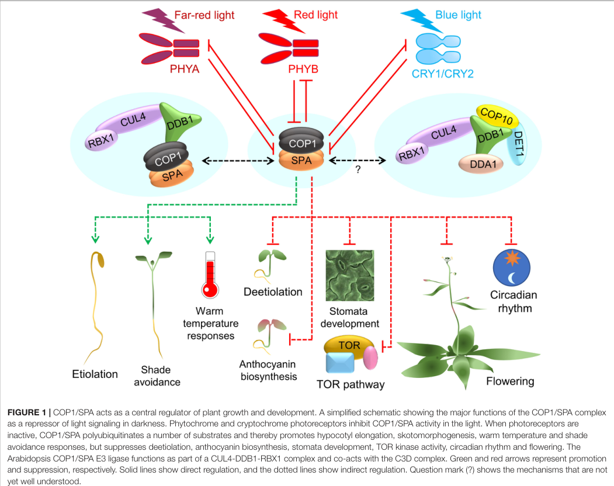

## Question

# Gene Research for Functional Annotation

## ⚠️ CRITICAL: Gene/Protein Identification Context

**BEFORE YOU BEGIN RESEARCH:** You MUST verify you are researching the CORRECT gene/protein. Gene symbols can be ambiguous, especially for less well-characterized genes from non-model organisms.

### Target Gene/Protein Identity (from UniProt):
- **UniProt Accession:** Q9SYX2
- **Protein Description:** RecName: Full=Protein SUPPRESSOR OF PHYA-105 1; EC=2.7.-.-;
- **Gene Information:** Name=SPA1; OrderedLocusNames=At2g46340/At2g46350; ORFNames=F11C10.3/F11C10.4;
- **Organism (full):** Arabidopsis thaliana (Mouse-ear cress).
- **Protein Family:** Not specified in UniProt
- **Key Domains:** Kinase-like_dom_sf. (IPR011009); Prot_kinase_dom. (IPR000719); SPA1/2/3/4. (IPR044630); WD40/YVTN_repeat-like_dom_sf. (IPR015943); WD40_PAC1. (IPR020472)

### MANDATORY VERIFICATION STEPS:

1. **Check if the gene symbol "SPA1" matches the protein description above**
2. **Verify the organism is correct:** Arabidopsis thaliana (Mouse-ear cress).
3. **Check if protein family/domains align with what you find in literature**
4. **If you find literature for a DIFFERENT gene with the same or similar symbol, STOP**

### If Gene Symbol is Ambiguous or You Cannot Find Relevant Literature:

**DO NOT PROCEED WITH RESEARCH ON A DIFFERENT GENE.** Instead:
- State clearly: "The gene symbol 'SPA1' is ambiguous or literature is limited for this specific protein"
- Explain what you found (e.g., "Found extensive literature on a different gene with the same symbol in a different organism")
- Describe the protein based ONLY on the UniProt information provided above
- Suggest that the protein function can be inferred from domain/family information

### Research Target:

Please provide a comprehensive research report on the gene **SPA1** (gene ID: SPA1, UniProt: Q9SYX2) in ARATH.

The research report should be a detailed narrative explaining the function, biological processes, and localization of the gene product. Citations should be given for all claims.

You should prioritize authoritative reviews and primary scientific literature when conducting research. You can supplement
this with annotations you find in gene/protein databases, but these can be outdated or inaccurate.

We are specifically interested in the primary function of the gene - for enzymes, what reaction is catalyzed, and what is the substrate specificity? For transporters, what is the substrate? For structural proteins or adapters, what is the broader structural role? For signaling molecules, what is the role in the pathway.

We are interested in where in or outside the cell the gene product carries out its function.

We are also interested in the signaling or biochemical pathways in which the gene functions. We are less interested in broad pleiotropic effects, except where these elucidate the precise role.

Include evidence where possible. We are interested in both experimental evidence as well as inference from structure, evolution, or bioinformatic analysis. Precise studies should be prioritized over high-throughput, where available.

## Output

Question: You are an expert researcher providing comprehensive, well-cited information.

Provide detailed information focusing on:
1. Key concepts and definitions with current understanding
2. Recent developments and latest research (prioritize 2023-2024 sources)
3. Current applications and real-world implementations
4. Expert opinions and analysis from authoritative sources
5. Relevant statistics and data from recent studies

Format as a comprehensive research report with proper citations. Include URLs and publication dates where available.
Always prioritize recent, authoritative sources and provide specific citations for all major claims.

# Gene Research for Functional Annotation

## ⚠️ CRITICAL: Gene/Protein Identification Context

**BEFORE YOU BEGIN RESEARCH:** You MUST verify you are researching the CORRECT gene/protein. Gene symbols can be ambiguous, especially for less well-characterized genes from non-model organisms.

### Target Gene/Protein Identity (from UniProt):
- **UniProt Accession:** Q9SYX2
- **Protein Description:** RecName: Full=Protein SUPPRESSOR OF PHYA-105 1; EC=2.7.-.-;
- **Gene Information:** Name=SPA1; OrderedLocusNames=At2g46340/At2g46350; ORFNames=F11C10.3/F11C10.4;
- **Organism (full):** Arabidopsis thaliana (Mouse-ear cress).
- **Protein Family:** Not specified in UniProt
- **Key Domains:** Kinase-like_dom_sf. (IPR011009); Prot_kinase_dom. (IPR000719); SPA1/2/3/4. (IPR044630); WD40/YVTN_repeat-like_dom_sf. (IPR015943); WD40_PAC1. (IPR020472)

### MANDATORY VERIFICATION STEPS:

1. **Check if the gene symbol "SPA1" matches the protein description above**
2. **Verify the organism is correct:** Arabidopsis thaliana (Mouse-ear cress).
3. **Check if protein family/domains align with what you find in literature**
4. **If you find literature for a DIFFERENT gene with the same or similar symbol, STOP**

### If Gene Symbol is Ambiguous or You Cannot Find Relevant Literature:

**DO NOT PROCEED WITH RESEARCH ON A DIFFERENT GENE.** Instead:
- State clearly: "The gene symbol 'SPA1' is ambiguous or literature is limited for this specific protein"
- Explain what you found (e.g., "Found extensive literature on a different gene with the same symbol in a different organism")
- Describe the protein based ONLY on the UniProt information provided above
- Suggest that the protein function can be inferred from domain/family information

### Research Target:

Please provide a comprehensive research report on the gene **SPA1** (gene ID: SPA1, UniProt: Q9SYX2) in ARATH.

The research report should be a detailed narrative explaining the function, biological processes, and localization of the gene product. Citations should be given for all claims.

You should prioritize authoritative reviews and primary scientific literature when conducting research. You can supplement
this with annotations you find in gene/protein databases, but these can be outdated or inaccurate.

We are specifically interested in the primary function of the gene - for enzymes, what reaction is catalyzed, and what is the substrate specificity? For transporters, what is the substrate? For structural proteins or adapters, what is the broader structural role? For signaling molecules, what is the role in the pathway.

We are interested in where in or outside the cell the gene product carries out its function.

We are also interested in the signaling or biochemical pathways in which the gene functions. We are less interested in broad pleiotropic effects, except where these elucidate the precise role.

Include evidence where possible. We are interested in both experimental evidence as well as inference from structure, evolution, or bioinformatic analysis. Precise studies should be prioritized over high-throughput, where available.

# Functional annotation of *Arabidopsis thaliana* SPA1

## Identity and principal function

**Identity check.** This report concerns *Arabidopsis thaliana* SUPPRESSOR OF PHYA-105 1 (**SPA1**), matching the protein description and organism supplied for UniProt **Q9SYX2**, rather than an unrelated use of the symbol SPA1. The supplied locus labels are **At2g46340/At2g46350**; the retrieved primary papers establish the Arabidopsis SPA1 protein’s identity and function but do not independently resolve those two locus labels. SPA1 belongs to the four-member Arabidopsis SPA1–SPA4 group. Its N-terminal kinase-like domain, central coiled-coil region and C-terminal WD40 repeats agree with the supplied protein-domain annotation; the coiled coil supports complex assembly, while the WD40 region participates in protein interactions. (chang2024thephosphorylationof pages 3-4, ponnu2021illuminatingthecop1spa pages 2-4)

**Best-supported annotation:** SPA1 is both a **protein serine/threonine kinase** and a **regulatory/assembly component of COP1–SPA ubiquitin-ligase complexes**. Its established phosphorylation targets include PIF1 and HY5; biochemical studies also demonstrate phosphorylation of PIF4 and the C-terminal regions of both Arabidopsis eIF2α proteins. SPA1 is *not* the COP1 RING-domain ubiquitin-transfer component and, in the blue-light CRY2–SPA1–FIO1 pathway, is *not* the RNA methyltransferase: FIO1 performs methyl transfer. Thus, the incomplete kinase EC designation in the supplied annotation should not be mistaken for evidence that SPA1 itself ubiquitinates proteins or methylates RNA. (paik2019aphybpif1spa1kinase pages 3-5, wang2021directphosphorylationof pages 4-6, ponnu2021illuminatingthecop1spa pages 2-4, chang2024thephosphorylationof pages 7-8, jiang2023lightinducedllpsof pages 10-11)

The following table separates direct SPA1 activities from functions of its partner enzymes and indicates where mechanistic interpretation remains qualified. (paik2019aphybpif1spa1kinase pages 3-5, wang2021directphosphorylationof pages 4-6, jiang2023lightinducedllpsof pages 10-11, chang2024thephosphorylationof pages 7-8)

| Direct SPA1 role | Physical compartment or condition | Mechanistic experimental evidence and strength |
|---|---|---|
| COP1/CUL4-ligase adaptor and assembly factor, not the ubiquitin-transfer catalytic subunit | Predominantly nuclear and most active in darkness | SPA1 dimerizes with COP1 and contributes to target recognition in a CUL4–DDB1–RBX1 complex. COP1 supplies the E2-recruiting RING domain, whereas SPA1 has a kinase-like N-terminus. **Strong complex-level evidence; some substrate-recognition details remain inferred from domain conservation.** (ponnu2021illuminatingthecop1spa pages 2-4) |
| Ser/Thr kinase for PIF1 | Red-light-activated phyB–PIF1–SPA1 complex | Purified SPA1 directly phosphorylated PIF1 in ATP- and time-dependent assays. Kinase-impaired SPA1 retained PIF1 binding but showed reduced catalysis; PIF1 phosphorylation, polyubiquitination, and degradation were impaired in spaQ. **Strong direct biochemical and genetic evidence.** (paik2019aphybpif1spa1kinase pages 3-5) |
| Ser/Thr kinase for HY5 at Ser36 | Dark- and light-grown seedlings; principally nuclear pathway | SPA1 directly phosphorylated HY5; HY5-S36A abolished detectable phosphorylation, SPA1-R517E reduced it, and phosphorylated HY5 was absent in spaQ. Phosphorylation stabilizes HY5 but reduces its transcriptional activity. **Strong site-directed biochemical and in-vivo evidence.** (wang2021directphosphorylationof pages 4-6) |
| Kinase for PIF4 in thermomorphogenesis | Warm-temperature phyB–PIF4 pathway in shoots and roots | SPA1 directly phosphorylates PIF4 in vitro, and kinase-impaired SPA1 fails to rescue spaQ thermomorphogenic defects. PIF4 accumulation depends on SPAs, but whether phosphorylation alone directly causes stabilization remains unresolved. **Strong phosphorylation and functional evidence; causal stabilization mechanism is qualified.** (lee2021spatialregulationof pages 4-6, ponnu2021illuminatingthecop1spa pages 7-9) |
| Scaffold and activator in the CRY2–SPA1–FIO1 condensate | Nuclear photobodies under blue light | SPA1 recruits FIO1 into photoexcited CRY2 condensates, and its WD domain stimulates FIO1 activity. **FIO1, not SPA1, is the mRNA m6A writer. Strong interaction, imaging, mutant, and enzymatic evidence, partly from heterologous cells.** (jiang2023lightinducedllpsof pages 7-8, jiang2023lightinducedllpsof pages 10-11) |
| Ser/Thr kinase for the eIF2α C-terminal region | Cytosol after illumination | SPA1–eIF2α interaction is light-dependent. SPA1-GFP was nuclear in 91.3% of dark-treated protoplasts, while 37.5% of illuminated cells showed cytosolic speckles. SPA1 phosphorylates the eIF2α.1 and eIF2α.2 C termini rather than Ser56; individual C-terminal sites were not confirmed by mass spectrometry. **Strong regional biochemical and genetic evidence; exact sites remain unresolved.** (chang2024thephosphorylationof pages 7-8, chang2024thephosphorylationof pages 4-5) |

*Table: SPA1 molecular functions and strength of evidence, distinguishing its kinase and scaffolding activities from the ubiquitin- and RNA-methyl-transfer catalytic components with which it associates.*

## Biochemical reactions and signaling pathways

**COP1–SPA pathway.** In darkness, a COP1–SPA complex helps repress photomorphogenesis by promoting ubiquitination and proteasomal degradation of positive light-signaling regulators, including HY5. A characterized assembly contains two COP1 and two SPA proteins and associates with CUL4–DDB1–RBX1; the two SPA positions need not both be SPA1. SPA1’s coiled-coil-mediated assembly and interaction surfaces contribute to this machinery, whereas COP1 supplies its RING domain. Light-activated photoreceptors inhibit or reorganize COP1–SPA activity, allowing light-response regulators to accumulate. The associated biological transition is from dark-grown seedling development to de-etiolation, **not** a generic assertion that every SPA1 action suppresses growth in light. The review’s pathway schematic visually summarizes these distinctions. (ponnu2021illuminatingthecop1spa pages 2-4, holtkotte2016mutationsinthe pages 1-4, ponnu2021illuminatingthecop1spa media 7f7df264)

**PIF1 and phytochrome B.** Purified SPA1 directly transfers phosphate from ATP to the transcription factor **PIF1** in time- and ATP-dependent assays. A kinase-impaired SPA1 variant still binds PIF1 but phosphorylates it less efficiently; in the *spa1 spa2 spa3 spa4* quadruple mutant (**spaQ**), red-light-induced PIF1 phosphorylation, polyubiquitination and degradation are impaired. Red-light-activated phyB binds SPA1 and enhances PIF1 recruitment. SPA1 thereby couples a kinase reaction to subsequent removal of a photomorphogenesis-repressing factor—an important light-condition-specific role alongside its dark repressor function. These results establish PIF1 as a protein substrate, although they do not specify a single universal SPA1 phosphorylation motif. (paik2019aphybpif1spa1kinase pages 3-5, paik2019aphybpif1spa1kinase pages 1-2)

**HY5.** SPA kinases phosphorylate the photomorphogenesis-promoting transcription factor **HY5**; for SPA1, the experimentally tested site is **Ser36**. An HY5-S36A substitution prevents detectable phosphorylation in the reported assay, and phosphorylated HY5 is absent in spaQ seedlings. The consequence is nuanced: unphosphorylated HY5 binds COP1/SPA1 more strongly and is preferentially degraded, but is also the more active promoter-binding form; phosphorylated HY5 is comparatively stable yet less active. SPA1 therefore helps tune HY5 *activity as well as abundance*, rather than merely switching HY5 on. Other SPA paralogs can also phosphorylate HY5 in vitro, so the quadruple-mutant result alone does not assign every endogenous HY5 phosphorylation event exclusively to SPA1. (wang2021directphosphorylationof pages 1-2, wang2021directphosphorylationof pages 4-6)

**PIF4 and temperature signaling.** SPA1 phosphorylates **PIF4** in vitro. Genetic experiments place SPA activity in the phyB–PIF4 warm-temperature pathway: PIF4 fails to accumulate normally in spaQ, and kinase-impaired SPA1 fails to restore the reported thermomorphogenic response. Experiments compared **22 °C and 28 °C**. Reviews interpret SPA1-dependent phosphorylation as favoring PIF4 accumulation, but direct phosphorylation has not by itself resolved every causal step connecting the phosphate modification to PIF4 stabilization in vivo. Effects on hypocotyl growth and temperature-responsive transcription are consequences of this pathway, not separate demonstrated SPA1 enzymatic reactions. (lee2020spaspromotethermomorphogenesis pages 4-7, lee2022regulationofthermomorphogenesis pages 32-36, lee2021spatialregulationof pages 4-6, ponnu2021illuminatingthecop1spa pages 7-9)

## Recent mechanistic advances, 2023–2024

**Blue-light-regulated RNA processing, 2023.** Jiang and colleagues showed that photoexcited **CRY2** uses SPA1 to recruit **FIO1** into dynamic nuclear condensates. SPA1 binds FIO1; its WD region, together with a CRY2 region, stimulates FIO1’s RNA-*N*⁶-methyladenosine (**m6A**) writer activity in vitro. Together the activating regions increased the measured catalytic efficiency approximately **four- to eightfold**, compared with approximately **one- to threefold** for either separately. CRY2–SPA1 condensates appeared within approximately **5 seconds** in the reported imaging experiment, whereas FIO1-containing condensates appeared after approximately **30 minutes**. Genetic and RNA analyses linked this pathway to blue-light-induced methylation and translation of transcripts encoding chlorophyll-homeostasis regulators; SPA triple mutants showed reduced relevant methylation and chlorophyll phenotypes. **FIO1 catalyzes RNA methylation; SPA1 organizes and activates the complex.** Some condensate reconstitution was performed in heterologous tobacco cells, so those imaging kinetics should not be treated as a whole-plant rate constant. (jiang2023lightinducedllpsof pages 7-8, jiang2023lightinducedllpsof pages 10-11, jiang2023lightinducedllpsof pages 8-9, jiang2023lightinducedllpsof pages 3-4, jiang2023lightinducedllpsof pages 1-2)

**Light-induced translation, 2024.** Chang and colleagues established that SPA1 directly phosphorylates the **C-terminal region of eIF2α.1 and eIF2α.2**, two α-subunits of the translation-initiation factor eIF2. Replacing the conserved N-terminal **Ser56** did not eliminate this phosphorylation. In fragment assays, the phosphorylated C-terminal fragments gave relative signals of **0.47** and **0.57**, respectively, when each full-length eIF2α signal was normalized to **1.00**. Alanine-substitution panels and SPA kinase controls support a C-terminal, SPA-dependent effect; importantly, the authors **could not unambiguously identify individual C-terminal phosphoresidues by mass spectrometry**. Candidate residues listed from prediction and tested in multi-site mutants should therefore not be annotated individually as definitively mapped SPA1 sites. C-terminal phosphomimetic eIF2α increased its association with eIF2β/eIF2γ and favored translation-initiation-complex assembly; phospho-null eIF2α reduced polysome-associated translation and delayed aspects of seedling greening. The spaQ mutant showed impaired translation after illumination, supporting a physiological role for SPA kinases, while the purified-protein experiments directly assign catalytic capacity to SPA1. (chang2024thephosphorylationof pages 5-7, chang2024thephosphorylationof pages 1-2, chang2024thephosphorylationof pages 7-8, chang2024thephosphorylationof pages 10-12, chang2024thephosphorylationof pages 9-10)

## Where SPA1 acts

SPA1 function is **intracellular and condition-dependent**, rather than confined to one compartment. The dark-active COP1–SPA pathway principally acts on nuclear light-response regulators. Direct SPA1 measurements in the 2024 study found SPA1-GFP predominantly nuclear in **91.3%** of dark-treated protoplasts; after illumination, **37.5%** of cells displayed cytosolic SPA1-GFP speckles. Seedling fractionation found SPA1 more abundant in nuclei in darkness and largely cytosolic after **four hours of light**. Its light-enhanced interaction with eIF2α was observed in the **cytosol**, matching a role in translation regulation. Separately, blue-light-responsive CRY2–SPA1–FIO1 assemblies were visualized as **nuclear photobodies**, supporting a nuclear RNA-regulatory role. These observations describe distinct experimental conditions and functions, not a claim that all SPA1 exits the nucleus whenever seedlings encounter light. (chang2024thephosphorylationof pages 4-5, chang2024thephosphorylationof pages 3-4, jiang2023lightinducedllpsof pages 7-8)

## Research use, interpretation and limits

SPA1 has well-established **laboratory implementations** as a mechanistic light-signaling target: spaQ and single-*spa1* mutant plants, SPA1 complementation lines, kinase-impaired constructs, purified-protein phosphorylation assays and light-controlled interaction assays distinguish kinase activity from complex assembly. For example, SPA1 mutants help test PIF1 turnover, HY5 regulation, blue-light-dependent m6A and eIF2α-dependent translation. A separate Arabidopsis genetic study linked **PEAPOD-dependent repression of SPA1 transcription** to light-intensity responses involving hypocotyl length, flowering and stomatal density. These are research applications and potential routes for crop investigation; the reviewed evidence does **not** establish a field-deployed SPA1-engineered crop or commercial implementation. (holtkotte2016mutationsinthe pages 1-4, white2022peapodrepressorsmodulate pages 1-2, paik2019aphybpif1spa1kinase pages 3-5, holtkotte2016mutationsinthe pages 15-18, jiang2023lightinducedllpsof pages 9-10)

An important expert-level distinction is **context-specific substrate fate**: phosphorylation within the phyB–SPA1–PIF1 pathway accompanies PIF1 removal, whereas SPA-associated PIF4 phosphorylation correlates with PIF4 accumulation, and HY5 phosphorylation trades higher stability for lower transcriptional activity. Consequently, neither “SPA1 is only a dark E3-ligase accessory” nor “SPA1 phosphorylation always causes substrate degradation” is an adequate annotation. The 2023 condensate and 2024 eIF2α findings further show separable SPA1 scaffolding and cytosolic kinase actions. (paik2019aphybpif1spa1kinase pages 3-5, wang2021directphosphorylationof pages 4-6, jiang2023lightinducedllpsof pages 10-11, chang2024thephosphorylationof pages 7-8, ponnu2021illuminatingthecop1spa pages 7-9)

### Key sources and publication dates

- **Chang et al., April 2024**, *Nature Communications*, “The phosphorylation of carboxyl-terminal eIF2α by SPA kinases contributes to enhanced translation efficiency during photomorphogenesis.” https://doi.org/10.1038/s41467-024-47848-7. (chang2024thephosphorylationof pages 7-8)
- **Jiang et al., December 2023**, *Nature Plants*, “Light-induced LLPS of the CRY2/SPA1/FIO1 complex regulating mRNA methylation and chlorophyll homeostasis in Arabidopsis.” https://doi.org/10.1038/s41477-023-01580-0. (jiang2023lightinducedllpsof pages 1-2)
- **Wang et al., April 2021**, *New Phytologist*, “Direct phosphorylation of HY5 by SPA kinases to regulate photomorphogenesis in Arabidopsis.” https://doi.org/10.1111/nph.17332. (wang2021directphosphorylationof pages 4-6)
- **Paik et al., September 2019**, *Nature Communications*, “A phyB-PIF1-SPA1 kinase regulatory complex promotes photomorphogenesis in Arabidopsis.” https://doi.org/10.1038/s41467-019-12110-y. (paik2019aphybpif1spa1kinase pages 3-5)
- **Ponnu and Hoecker, March 2021**, *Frontiers in Plant Science*, authoritative COP1–SPA structure-and-function review. https://doi.org/10.3389/fpls.2021.662793. (ponnu2021illuminatingthecop1spa pages 2-4)
- **Holtkotte et al., October 2016**, *The Plant Journal*, SPA1 domain-deletion and missense-mutant analysis. https://doi.org/10.1111/tpj.13241. (holtkotte2016mutationsinthe pages 1-4)

References

1. (chang2024thephosphorylationof pages 3-4): Hui-Hsien Chang, Lin-Chen Huang, Karen S. Browning, Enamul Huq, and Mei-Chun Cheng. The phosphorylation of carboxyl-terminal eif2α by spa kinases contributes to enhanced translation efficiency during photomorphogenesis. Nature Communications, Apr 2024. URL: https://doi.org/10.1038/s41467-024-47848-7, doi:10.1038/s41467-024-47848-7. This article has 10 citations and is from a highest quality peer-reviewed journal.

2. (ponnu2021illuminatingthecop1spa pages 2-4): Jathish Ponnu and Ute Hoecker. Illuminating the cop1/spa ubiquitin ligase: fresh insights into its structure and functions during plant photomorphogenesis. Frontiers in Plant Science, Mar 2021. URL: https://doi.org/10.3389/fpls.2021.662793, doi:10.3389/fpls.2021.662793. This article has 124 citations.

3. (paik2019aphybpif1spa1kinase pages 3-5): Inyup Paik, Fulu Chen, Vinh Ngoc Pham, Ling Zhu, Jeong-Il Kim, and Enamul Huq. A phyb-pif1-spa1 kinase regulatory complex promotes photomorphogenesis in arabidopsis. Nature Communications, Sep 2019. URL: https://doi.org/10.1038/s41467-019-12110-y, doi:10.1038/s41467-019-12110-y. This article has 117 citations and is from a highest quality peer-reviewed journal.

4. (wang2021directphosphorylationof pages 4-6): Wenli Wang, Inyup Paik, Junghyun Kim, Xilin Hou, Sibum Sung, and Enamul Huq. Direct phosphorylation of hy5 by spa kinases to regulate photomorphogenesis in arabidopsis. New Phytologist, 230:2311-2326, Apr 2021. URL: https://doi.org/10.1111/nph.17332, doi:10.1111/nph.17332. This article has 69 citations and is from a highest quality peer-reviewed journal.

5. (chang2024thephosphorylationof pages 7-8): Hui-Hsien Chang, Lin-Chen Huang, Karen S. Browning, Enamul Huq, and Mei-Chun Cheng. The phosphorylation of carboxyl-terminal eif2α by spa kinases contributes to enhanced translation efficiency during photomorphogenesis. Nature Communications, Apr 2024. URL: https://doi.org/10.1038/s41467-024-47848-7, doi:10.1038/s41467-024-47848-7. This article has 10 citations and is from a highest quality peer-reviewed journal.

6. (jiang2023lightinducedllpsof pages 10-11): Bochen Jiang, Zhenhui Zhong, Lianfeng Gu, Xueyang Zhang, Jiangbo Wei, Chang Ye, Guifang Lin, Gaoping Qu, Xian Xiang, Chenjin Wen, Maureen Hummel, Julia Bailey-Serres, Qin Wang, Chuan He, Xu Wang, and Chentao Lin. Light-induced llps of the cry2/spa1/fio1 complex regulating mrna methylation and chlorophyll homeostasis in arabidopsis. Nature Plants, 9:2042-2058, Dec 2023. URL: https://doi.org/10.1038/s41477-023-01580-0, doi:10.1038/s41477-023-01580-0. This article has 95 citations and is from a highest quality peer-reviewed journal.

7. (lee2021spatialregulationof pages 4-6): Sanghwa Lee, Wenli Wang, and Enamul Huq. Spatial regulation of thermomorphogenesis by hy5 and pif4 in arabidopsis. Nature Communications, Jun 2021. URL: https://doi.org/10.1038/s41467-021-24018-7, doi:10.1038/s41467-021-24018-7. This article has 142 citations and is from a highest quality peer-reviewed journal.

8. (ponnu2021illuminatingthecop1spa pages 7-9): Jathish Ponnu and Ute Hoecker. Illuminating the cop1/spa ubiquitin ligase: fresh insights into its structure and functions during plant photomorphogenesis. Frontiers in Plant Science, Mar 2021. URL: https://doi.org/10.3389/fpls.2021.662793, doi:10.3389/fpls.2021.662793. This article has 124 citations.

9. (jiang2023lightinducedllpsof pages 7-8): Bochen Jiang, Zhenhui Zhong, Lianfeng Gu, Xueyang Zhang, Jiangbo Wei, Chang Ye, Guifang Lin, Gaoping Qu, Xian Xiang, Chenjin Wen, Maureen Hummel, Julia Bailey-Serres, Qin Wang, Chuan He, Xu Wang, and Chentao Lin. Light-induced llps of the cry2/spa1/fio1 complex regulating mrna methylation and chlorophyll homeostasis in arabidopsis. Nature Plants, 9:2042-2058, Dec 2023. URL: https://doi.org/10.1038/s41477-023-01580-0, doi:10.1038/s41477-023-01580-0. This article has 95 citations and is from a highest quality peer-reviewed journal.

10. (chang2024thephosphorylationof pages 4-5): Hui-Hsien Chang, Lin-Chen Huang, Karen S. Browning, Enamul Huq, and Mei-Chun Cheng. The phosphorylation of carboxyl-terminal eif2α by spa kinases contributes to enhanced translation efficiency during photomorphogenesis. Nature Communications, Apr 2024. URL: https://doi.org/10.1038/s41467-024-47848-7, doi:10.1038/s41467-024-47848-7. This article has 10 citations and is from a highest quality peer-reviewed journal.

11. (holtkotte2016mutationsinthe pages 1-4): Xu Holtkotte, Stefan Dieterle, Leonie Kokkelink, Oliver Artz, Lisa Leson, Kirsten Fittinghoff, Ryosuke Hayama, Margaret Ahmad, and Ute Hoecker. Mutations in the n-terminal kinase-like domain of the repressor of photomorphogenesis spa1 severely impair spa1 function but not light responsiveness in arabidopsis. The Plant journal : for cell and molecular biology, 88 2:205-218, Oct 2016. URL: https://doi.org/10.1111/tpj.13241, doi:10.1111/tpj.13241. This article has 23 citations.

12. (ponnu2021illuminatingthecop1spa media 7f7df264): Jathish Ponnu and Ute Hoecker. Illuminating the cop1/spa ubiquitin ligase: fresh insights into its structure and functions during plant photomorphogenesis. Frontiers in Plant Science, Mar 2021. URL: https://doi.org/10.3389/fpls.2021.662793, doi:10.3389/fpls.2021.662793. This article has 124 citations.

13. (paik2019aphybpif1spa1kinase pages 1-2): Inyup Paik, Fulu Chen, Vinh Ngoc Pham, Ling Zhu, Jeong-Il Kim, and Enamul Huq. A phyb-pif1-spa1 kinase regulatory complex promotes photomorphogenesis in arabidopsis. Nature Communications, Sep 2019. URL: https://doi.org/10.1038/s41467-019-12110-y, doi:10.1038/s41467-019-12110-y. This article has 117 citations and is from a highest quality peer-reviewed journal.

14. (wang2021directphosphorylationof pages 1-2): Wenli Wang, Inyup Paik, Junghyun Kim, Xilin Hou, Sibum Sung, and Enamul Huq. Direct phosphorylation of hy5 by spa kinases to regulate photomorphogenesis in arabidopsis. New Phytologist, 230:2311-2326, Apr 2021. URL: https://doi.org/10.1111/nph.17332, doi:10.1111/nph.17332. This article has 69 citations and is from a highest quality peer-reviewed journal.

15. (lee2020spaspromotethermomorphogenesis pages 4-7): Sanghwa Lee, Inyup Paik, and Enamul Huq. Spas promote thermomorphogenesis via regulating the phyb-pif4 module in<i>arabidopsis</i>. BioRxiv, Feb 2020. URL: https://doi.org/10.1101/2020.02.07.938951, doi:10.1101/2020.02.07.938951. This article has 71 citations.

16. (lee2022regulationofthermomorphogenesis pages 32-36): Sanghwa Lee and 0000-0002-6032-2525. Regulation of thermomorphogenesis by phytochrome interacting factors (pifs) in arabidopsis. Text, Aug 2022. URL: https://doi.org/10.26153/tsw/46027, doi:10.26153/tsw/46027. This article has 0 citations and is from a peer-reviewed journal.

17. (jiang2023lightinducedllpsof pages 8-9): Bochen Jiang, Zhenhui Zhong, Lianfeng Gu, Xueyang Zhang, Jiangbo Wei, Chang Ye, Guifang Lin, Gaoping Qu, Xian Xiang, Chenjin Wen, Maureen Hummel, Julia Bailey-Serres, Qin Wang, Chuan He, Xu Wang, and Chentao Lin. Light-induced llps of the cry2/spa1/fio1 complex regulating mrna methylation and chlorophyll homeostasis in arabidopsis. Nature Plants, 9:2042-2058, Dec 2023. URL: https://doi.org/10.1038/s41477-023-01580-0, doi:10.1038/s41477-023-01580-0. This article has 95 citations and is from a highest quality peer-reviewed journal.

18. (jiang2023lightinducedllpsof pages 3-4): Bochen Jiang, Zhenhui Zhong, Lianfeng Gu, Xueyang Zhang, Jiangbo Wei, Chang Ye, Guifang Lin, Gaoping Qu, Xian Xiang, Chenjin Wen, Maureen Hummel, Julia Bailey-Serres, Qin Wang, Chuan He, Xu Wang, and Chentao Lin. Light-induced llps of the cry2/spa1/fio1 complex regulating mrna methylation and chlorophyll homeostasis in arabidopsis. Nature Plants, 9:2042-2058, Dec 2023. URL: https://doi.org/10.1038/s41477-023-01580-0, doi:10.1038/s41477-023-01580-0. This article has 95 citations and is from a highest quality peer-reviewed journal.

19. (jiang2023lightinducedllpsof pages 1-2): Bochen Jiang, Zhenhui Zhong, Lianfeng Gu, Xueyang Zhang, Jiangbo Wei, Chang Ye, Guifang Lin, Gaoping Qu, Xian Xiang, Chenjin Wen, Maureen Hummel, Julia Bailey-Serres, Qin Wang, Chuan He, Xu Wang, and Chentao Lin. Light-induced llps of the cry2/spa1/fio1 complex regulating mrna methylation and chlorophyll homeostasis in arabidopsis. Nature Plants, 9:2042-2058, Dec 2023. URL: https://doi.org/10.1038/s41477-023-01580-0, doi:10.1038/s41477-023-01580-0. This article has 95 citations and is from a highest quality peer-reviewed journal.

20. (chang2024thephosphorylationof pages 5-7): Hui-Hsien Chang, Lin-Chen Huang, Karen S. Browning, Enamul Huq, and Mei-Chun Cheng. The phosphorylation of carboxyl-terminal eif2α by spa kinases contributes to enhanced translation efficiency during photomorphogenesis. Nature Communications, Apr 2024. URL: https://doi.org/10.1038/s41467-024-47848-7, doi:10.1038/s41467-024-47848-7. This article has 10 citations and is from a highest quality peer-reviewed journal.

21. (chang2024thephosphorylationof pages 1-2): Hui-Hsien Chang, Lin-Chen Huang, Karen S. Browning, Enamul Huq, and Mei-Chun Cheng. The phosphorylation of carboxyl-terminal eif2α by spa kinases contributes to enhanced translation efficiency during photomorphogenesis. Nature Communications, Apr 2024. URL: https://doi.org/10.1038/s41467-024-47848-7, doi:10.1038/s41467-024-47848-7. This article has 10 citations and is from a highest quality peer-reviewed journal.

22. (chang2024thephosphorylationof pages 10-12): Hui-Hsien Chang, Lin-Chen Huang, Karen S. Browning, Enamul Huq, and Mei-Chun Cheng. The phosphorylation of carboxyl-terminal eif2α by spa kinases contributes to enhanced translation efficiency during photomorphogenesis. Nature Communications, Apr 2024. URL: https://doi.org/10.1038/s41467-024-47848-7, doi:10.1038/s41467-024-47848-7. This article has 10 citations and is from a highest quality peer-reviewed journal.

23. (chang2024thephosphorylationof pages 9-10): Hui-Hsien Chang, Lin-Chen Huang, Karen S. Browning, Enamul Huq, and Mei-Chun Cheng. The phosphorylation of carboxyl-terminal eif2α by spa kinases contributes to enhanced translation efficiency during photomorphogenesis. Nature Communications, Apr 2024. URL: https://doi.org/10.1038/s41467-024-47848-7, doi:10.1038/s41467-024-47848-7. This article has 10 citations and is from a highest quality peer-reviewed journal.

24. (white2022peapodrepressorsmodulate pages 1-2): Derek W. R. White. Peapod repressors modulate and coordinate developmental responses to light intensity in <i>arabidopsis</i>. New Phytologist, 235:1470-1485, May 2022. URL: https://doi.org/10.1111/nph.18198, doi:10.1111/nph.18198. This article has 17 citations and is from a highest quality peer-reviewed journal.

25. (holtkotte2016mutationsinthe pages 15-18): Xu Holtkotte, Stefan Dieterle, Leonie Kokkelink, Oliver Artz, Lisa Leson, Kirsten Fittinghoff, Ryosuke Hayama, Margaret Ahmad, and Ute Hoecker. Mutations in the n-terminal kinase-like domain of the repressor of photomorphogenesis spa1 severely impair spa1 function but not light responsiveness in arabidopsis. The Plant journal : for cell and molecular biology, 88 2:205-218, Oct 2016. URL: https://doi.org/10.1111/tpj.13241, doi:10.1111/tpj.13241. This article has 23 citations.

26. (jiang2023lightinducedllpsof pages 9-10): Bochen Jiang, Zhenhui Zhong, Lianfeng Gu, Xueyang Zhang, Jiangbo Wei, Chang Ye, Guifang Lin, Gaoping Qu, Xian Xiang, Chenjin Wen, Maureen Hummel, Julia Bailey-Serres, Qin Wang, Chuan He, Xu Wang, and Chentao Lin. Light-induced llps of the cry2/spa1/fio1 complex regulating mrna methylation and chlorophyll homeostasis in arabidopsis. Nature Plants, 9:2042-2058, Dec 2023. URL: https://doi.org/10.1038/s41477-023-01580-0, doi:10.1038/s41477-023-01580-0. This article has 95 citations and is from a highest quality peer-reviewed journal.

## Artifacts

- [Edison artifact artifact-00](SPA1-deep-research-falcon_artifacts/artifact-00.md)

## Citations

1. wang2021directphosphorylationof pages 4-6
2. chang2024thephosphorylationof pages 7-8
3. jiang2023lightinducedllpsof pages 1-2
4. holtkotte2016mutationsinthe pages 1-4
5. chang2024thephosphorylationof pages 3-4
6. jiang2023lightinducedllpsof pages 10-11
7. lee2021spatialregulationof pages 4-6
8. jiang2023lightinducedllpsof pages 7-8
9. chang2024thephosphorylationof pages 4-5
10. wang2021directphosphorylationof pages 1-2
11. lee2020spaspromotethermomorphogenesis pages 4-7
12. lee2022regulationofthermomorphogenesis pages 32-36
13. jiang2023lightinducedllpsof pages 8-9
14. jiang2023lightinducedllpsof pages 3-4
15. chang2024thephosphorylationof pages 5-7
16. chang2024thephosphorylationof pages 1-2
17. chang2024thephosphorylationof pages 10-12
18. chang2024thephosphorylationof pages 9-10
19. white2022peapodrepressorsmodulate pages 1-2
20. holtkotte2016mutationsinthe pages 15-18
21. jiang2023lightinducedllpsof pages 9-10
22. https://doi.org/10.1038/s41467-024-47848-7.
23. https://doi.org/10.1038/s41477-023-01580-0.
24. https://doi.org/10.1111/nph.17332.
25. https://doi.org/10.1038/s41467-019-12110-y.
26. https://doi.org/10.3389/fpls.2021.662793.
27. https://doi.org/10.1111/tpj.13241.
28. https://doi.org/10.1038/s41467-024-47848-7,
29. https://doi.org/10.3389/fpls.2021.662793,
30. https://doi.org/10.1038/s41467-019-12110-y,
31. https://doi.org/10.1111/nph.17332,
32. https://doi.org/10.1038/s41477-023-01580-0,
33. https://doi.org/10.1038/s41467-021-24018-7,
34. https://doi.org/10.1111/tpj.13241,
35. https://doi.org/10.1101/2020.02.07.938951,
36. https://doi.org/10.26153/tsw/46027,
37. https://doi.org/10.1111/nph.18198,