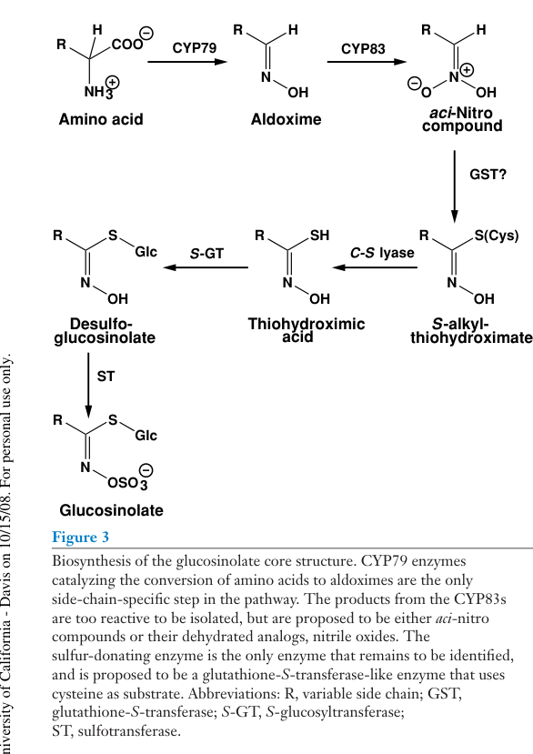

## Question

# Gene Research for Functional Annotation

## ⚠️ CRITICAL: Gene/Protein Identification Context

**BEFORE YOU BEGIN RESEARCH:** You MUST verify you are researching the CORRECT gene/protein. Gene symbols can be ambiguous, especially for less well-characterized genes from non-model organisms.

### Target Gene/Protein Identity (from UniProt):
- **UniProt Accession:** Q9SIV0
- **Protein Description:** RecName: Full=S-alkyl-thiohydroximate lyase SUR1; EC=4.4.1.-; AltName: Full=Protein ABERRANT LATERAL ROOT FORMATION 1; AltName: Full=Protein HOOKLESS 3; AltName: Full=Protein ROOTY; AltName: Full=Protein ROOTY 1; AltName: Full=Protein SUPERROOT 1;
- **Gene Information:** Name=SUR1; Synonyms=ALF1, HLS3, RTY, RTY1; OrderedLocusNames=At2g20610; ORFNames=F23N11.7;
- **Organism (full):** Arabidopsis thaliana (Mouse-ear cress).
- **Protein Family:** Belongs to the class-I pyridoxal-phosphate-dependent
- **Key Domains:** Aminotransferase_I/II_large. (IPR004839); PyrdxlP-dep_Trfase. (IPR015424); PyrdxlP-dep_Trfase_major. (IPR015421); PyrdxlP-dep_Trfase_small. (IPR015422); TyrNic_aminoTrfase. (IPR005958)

### MANDATORY VERIFICATION STEPS:

1. **Check if the gene symbol "SUR1" matches the protein description above**
2. **Verify the organism is correct:** Arabidopsis thaliana (Mouse-ear cress).
3. **Check if protein family/domains align with what you find in literature**
4. **If you find literature for a DIFFERENT gene with the same or similar symbol, STOP**

### If Gene Symbol is Ambiguous or You Cannot Find Relevant Literature:

**DO NOT PROCEED WITH RESEARCH ON A DIFFERENT GENE.** Instead:
- State clearly: "The gene symbol 'SUR1' is ambiguous or literature is limited for this specific protein"
- Explain what you found (e.g., "Found extensive literature on a different gene with the same symbol in a different organism")
- Describe the protein based ONLY on the UniProt information provided above
- Suggest that the protein function can be inferred from domain/family information

### Research Target:

Please provide a comprehensive research report on the gene **SUR1** (gene ID: SUR1, UniProt: Q9SIV0) in ARATH.

The research report should be a detailed narrative explaining the function, biological processes, and localization of the gene product. Citations should be given for all claims.

You should prioritize authoritative reviews and primary scientific literature when conducting research. You can supplement
this with annotations you find in gene/protein databases, but these can be outdated or inaccurate.

We are specifically interested in the primary function of the gene - for enzymes, what reaction is catalyzed, and what is the substrate specificity? For transporters, what is the substrate? For structural proteins or adapters, what is the broader structural role? For signaling molecules, what is the role in the pathway.

We are interested in where in or outside the cell the gene product carries out its function.

We are also interested in the signaling or biochemical pathways in which the gene functions. We are less interested in broad pleiotropic effects, except where these elucidate the precise role.

Include evidence where possible. We are interested in both experimental evidence as well as inference from structure, evolution, or bioinformatic analysis. Precise studies should be prioritized over high-throughput, where available.

## Output

Question: You are an expert researcher providing comprehensive, well-cited information.

Provide detailed information focusing on:
1. Key concepts and definitions with current understanding
2. Recent developments and latest research (prioritize 2023-2024 sources)
3. Current applications and real-world implementations
4. Expert opinions and analysis from authoritative sources
5. Relevant statistics and data from recent studies

Format as a comprehensive research report with proper citations. Include URLs and publication dates where available.
Always prioritize recent, authoritative sources and provide specific citations for all major claims.

# Gene Research for Functional Annotation

## ⚠️ CRITICAL: Gene/Protein Identification Context

**BEFORE YOU BEGIN RESEARCH:** You MUST verify you are researching the CORRECT gene/protein. Gene symbols can be ambiguous, especially for less well-characterized genes from non-model organisms.

### Target Gene/Protein Identity (from UniProt):
- **UniProt Accession:** Q9SIV0
- **Protein Description:** RecName: Full=S-alkyl-thiohydroximate lyase SUR1; EC=4.4.1.-; AltName: Full=Protein ABERRANT LATERAL ROOT FORMATION 1; AltName: Full=Protein HOOKLESS 3; AltName: Full=Protein ROOTY; AltName: Full=Protein ROOTY 1; AltName: Full=Protein SUPERROOT 1;
- **Gene Information:** Name=SUR1; Synonyms=ALF1, HLS3, RTY, RTY1; OrderedLocusNames=At2g20610; ORFNames=F23N11.7;
- **Organism (full):** Arabidopsis thaliana (Mouse-ear cress).
- **Protein Family:** Belongs to the class-I pyridoxal-phosphate-dependent
- **Key Domains:** Aminotransferase_I/II_large. (IPR004839); PyrdxlP-dep_Trfase. (IPR015424); PyrdxlP-dep_Trfase_major. (IPR015421); PyrdxlP-dep_Trfase_small. (IPR015422); TyrNic_aminoTrfase. (IPR005958)

### MANDATORY VERIFICATION STEPS:

1. **Check if the gene symbol "SUR1" matches the protein description above**
2. **Verify the organism is correct:** Arabidopsis thaliana (Mouse-ear cress).
3. **Check if protein family/domains align with what you find in literature**
4. **If you find literature for a DIFFERENT gene with the same or similar symbol, STOP**

### If Gene Symbol is Ambiguous or You Cannot Find Relevant Literature:

**DO NOT PROCEED WITH RESEARCH ON A DIFFERENT GENE.** Instead:
- State clearly: "The gene symbol 'SUR1' is ambiguous or literature is limited for this specific protein"
- Explain what you found (e.g., "Found extensive literature on a different gene with the same symbol in a different organism")
- Describe the protein based ONLY on the UniProt information provided above
- Suggest that the protein function can be inferred from domain/family information

### Research Target:

Please provide a comprehensive research report on the gene **SUR1** (gene ID: SUR1, UniProt: Q9SIV0) in ARATH.

The research report should be a detailed narrative explaining the function, biological processes, and localization of the gene product. Citations should be given for all claims.

You should prioritize authoritative reviews and primary scientific literature when conducting research. You can supplement
this with annotations you find in gene/protein databases, but these can be outdated or inaccurate.

We are specifically interested in the primary function of the gene - for enzymes, what reaction is catalyzed, and what is the substrate specificity? For transporters, what is the substrate? For structural proteins or adapters, what is the broader structural role? For signaling molecules, what is the role in the pathway.

We are interested in where in or outside the cell the gene product carries out its function.

We are also interested in the signaling or biochemical pathways in which the gene functions. We are less interested in broad pleiotropic effects, except where these elucidate the precise role.

Include evidence where possible. We are interested in both experimental evidence as well as inference from structure, evolution, or bioinformatic analysis. Precise studies should be prioritized over high-throughput, where available.

# Comprehensive Research Report: SUR1 (SUPERROOT1) - S-Alkyl-Thiohydroximate Lyase in Arabidopsis thaliana

## Gene Identity Verification

The research target corresponds to the correct gene: **SUR1** (SUPERROOT1, also known as ALF1, HLS3, RTY, RTY1) at locus **At2g20610** in *Arabidopsis thaliana* (UniProt Q9SIV0). This gene encodes an S-alkyl-thiohydroximate lyase (EC 4.4.1.-) involved in glucosinolate biosynthesis, not a different gene with the same symbol from other organisms (mikkelsen2004arabidopsismutantsin pages 1-2, grubb2004arabidopsisglucosyltransferaseugt74b1 pages 16-16).

## Primary Enzymatic Function and Substrate Specificity

### Catalytic Activity

SUR1 functions as a non-redundant **carbon-sulfur (C–S) lyase** that catalyzes the cleavage of S-alkyl-thiohydroximates to produce thiohydroximic acid intermediates in the core glucosinolate biosynthetic pathway (grubb2004arabidopsisglucosyltransferaseugt74b1 pages 9-10, morant2010metabolomictranscriptionalhormonal pages 1-2, kitainda2024molecularmechanismsbehind pages 16-20). This enzymatic transformation is essential for converting sulfur-containing intermediates generated by upstream CYP83 enzymes into substrates for subsequent UDP-glucosyltransferase-mediated S-glucosylation (kitainda2021structuralstudiesof pages 4-6, halkier2006biologyandbiochemistry media 7d9ba68d).

The catalyzed reaction proceeds as follows: **S-alkyl-thiohydroximate → thiohydroximic acid + products of C–S bond cleavage**. The thiohydroximic acid product is then glucosylated by UGT74 family enzymes to form desulfoglucosinolates, which are subsequently sulfated by sulfotransferases to yield mature glucosinolates (kitainda2024molecularmechanismsbehind pages 16-20, chhajed2020glucosinolatebiosynthesisand pages 3-5).

### Substrate Specificity

SUR1 exhibits broad substrate specificity across glucosinolate classes, accepting S-alkyl-thiohydroximates derived from:

1. **Aliphatic glucosinolates** - Processing intermediates from chain-elongated methionine derivatives
2. **Indole glucosinolates** - Acting on indole-3-acetothiohydroximate derived from tryptophan metabolism
3. **Aromatic glucosinolates** - Converting phenylalanine-derived intermediates

This broad specificity is demonstrated by the complete absence of detectable glucosinolates of all classes in *sur1* knockout mutants, establishing that SUR1 performs a shared, non-redundant core-assembly reaction (kitainda2021structuralstudiesof pages 2-4, chhajed2020glucosinolatebiosynthesisand pages 3-5, kitainda2024molecularmechanismsbehind pages 16-20, grubb2004arabidopsisglucosyltransferaseugt74b1 pages 9-10).

### Experimental Evidence

Biochemical characterization demonstrated that recombinant SUR1 expressed in *Escherichia coli* exhibits C–S lyase activity with **djenkolic acid** as a model substrate. Additionally, radiolabeled aldoxime feeding experiments in *sur1* mutants resulted in accumulation of the corresponding C–S lyase substrate (S-alkyl-thiohydroximate), providing independent confirmation of SUR1's enzymatic function in vivo (mikkelsen2004arabidopsismutantsin pages 1-2).

## Protein Structure and Molecular Characteristics

Based on domain analysis, SUR1 (Q9SIV0) belongs to the **class-I pyridoxal-5′-phosphate (PLP)-dependent enzyme family**, possessing characteristic aminotransferase class I/II large and small domains (IPR004839, IPR015421, IPR015422). This structural architecture is consistent with PLP-dependent C–S lyase chemistry, although detailed structural analysis of SUR1 protein, including resolved three-dimensional structure or catalytic residue identification, has not been reported in the available literature. The enzyme is also classified within the pyridoxal-phosphate-dependent transferase superfamily (IPR015424) and shows homology to tyrosine/nicotinate aminotransferases (IPR005958).

## Subcellular Localization

SUR1 functions in the **cytoplasm** as part of the soluble glucosinolate biosynthetic machinery. Pathway mapping studies position SUR1 in the cytosolic compartment, downstream of CYP83-dependent production of reactive intermediates and upstream of cytosolic UGT74 glucosyltransferases (morant2010metabolomictranscriptionalhormonal pages 1-2, halkier2006biologyandbiochemistry media 7d9ba68d, halkier2006biologyandbiochemistry media 6e2e2970). The pathway organization shows that ER-associated CYP79B2/B3 enzymes produce indole-3-acetaldoxime (IAOx), which enters the cytoplasmic pathway involving CYP83B1 (SUR2) and subsequently SUR1. While direct high-resolution localization experiments for endogenous SUR1 protein were not identified in the retrieved literature, the pathway context strongly supports cytoplasmic function.

## Biological Processes and Signaling Pathways

### Glucosinolate Biosynthesis Pathway

SUR1 occupies a critical position in the core glucosinolate biosynthetic pathway, which proceeds through the following sequence:

1. **Amino acid side-chain modification** - CYP79 enzymes (CYP79F1/F2 for aliphatic, CYP79B2/B3 for indole) convert amino acid derivatives into aldoximes
2. **Oxidation** - CYP83 enzymes (CYP83A1 for aliphatic, CYP83B1/SUR2 for indole) metabolize aldoximes to reactive aci-nitro compounds
3. **Sulfur conjugation** - Glutathione S-transferases (proposed) introduce sulfur, generating S-alkyl-thiohydroximates
4. **C–S lyase step (SUR1)** - Converts S-alkyl-thiohydroximates to thiohydroximic acids
5. **Glucosylation** - UGT74 enzymes (UGT74C1/B1 for aliphatic, UGT74B1 for indole) add glucose
6. **Sulfation** - Sulfotransferases complete glucosinolate formation

This pathway position places SUR1 at a bottleneck for all glucosinolate production, explaining why *sur1* mutants are completely deficient in these defense compounds (kitainda2024molecularmechanismsbehind pages 16-20, chhajed2020glucosinolatebiosynthesisand pages 3-5, soundararajan2021influenceofgenotype pages 14-15, grubb2004arabidopsisglucosyltransferaseugt74b1 pages 9-10, halkier2006biologyandbiochemistry media 7d9ba68d).

### Auxin Homeostasis and Metabolic Branching

SUR1 plays a crucial indirect role in **auxin (indole-3-acetic acid, IAA) homeostasis** by controlling metabolic flux at the tryptophan-indole-3-acetaldoxime branch point. Indole-3-acetaldoxime (IAOx) serves as a shared intermediate between indole glucosinolate biosynthesis and IAA production pathways (aoi2020gh3auxinamidosynthetases pages 7-9, aoi2020gh3auxinamidosynthetases pages 25-27, perez2021aldoximesareprecursors pages 1-3).

When SUR1 function is disrupted:

1. **Metabolic rerouting** - IAOx that would normally enter the glucosinolate pathway becomes available for auxin biosynthesis
2. **IAA accumulation** - Increased flux through IAOx-to-indole-3-acetonitrile (IAN) or indole-3-acetamide (IAM) routes leads to elevated IAA levels
3. **Alternative decomposition** - Unstable indole-3-acetothiohydroximate can spontaneously decompose to IAN and elemental sulfur, contributing additional IAA precursors

This metabolic interconnection positions SUR1 at a critical crossroads between **plant defense (glucosinolates)** and **growth regulation (auxin)**, with disruption favoring auxin accumulation at the expense of defense compound production (grubb2004arabidopsisglucosyltransferaseugt74b1 pages 9-10, kitainda2024molecularmechanismsbehind pages 39-44, aoi2020gh3auxinamidosynthetases pages 7-9, bak2001cyp83b1acytochrome pages 6-7, bak2001cyp83b1acytochrome pages 5-6, bak2001cyp83b1acytochrome pages 3-5, aoi2020gh3auxinamidosynthetases pages 5-7).

### Transcriptional Regulation

SUR1 expression is coordinated with other glucosinolate biosynthetic genes through **MYB transcription factor networks**:

- **Aliphatic glucosinolate pathway**: MYB28, MYB29, and MYB76 activate CYP79F1/F2, CYP83A1, GGP1, SUR1, and UGT74C1/B1
- **Indole glucosinolate pathway**: MYB34, MYB51, and MYB122 activate CYP79B2/B3, CYP83B1, GGP1, SUR1, and UGT74B1

This co-regulation ensures coordinated expression of the complete biosynthetic machinery (soundararajan2021influenceofgenotype pages 14-15, grubb2004arabidopsisglucosyltransferaseugt74b1 pages 9-10, kitainda2024molecularmechanismsbehind pages 39-44).

## Mutant Phenotypes and Physiological Effects

### Classical High-Auxin Phenotype

Loss-of-function *sur1* mutants display a severe **"superroot" phenotype** characteristic of auxin overproduction:

1. **Root architecture**: Excessive lateral and adventitious root formation, the defining characteristic of the superroot phenotype
2. **Hypocotyl development**: Elongated hypocotyls
3. **Cotyledon morphology**: Epinastic (downward-curving) cotyledons
4. **Metabolic changes**: Strongly elevated IAA-associated signaling and complete absence of detectable glucosinolates

These phenotypes demonstrate that SUR1 loss simultaneously eliminates glucosinolate-based defense capacity while creating auxin-mediated developmental abnormalities (grubb2004arabidopsisglucosyltransferaseugt74b1 pages 9-10, morant2010metabolomictranscriptionalhormonal pages 1-2, aoi2020gh3auxinamidosynthetases pages 7-9).

### Developmental Stage-Specific Responses

Recent studies (2024) examining auxin responses across development revealed that *sur1* mutants exhibit **earlier flowering when treated with exogenous auxin**, contrasting with the delayed flowering observed in most other auxin-related mutants (sydow2024aboveandbelowground pages 8-9, sydow2024aboveandbelowground pages 9-10). This finding suggests that SUR1 function affects auxin-mediated reproductive timing in addition to vegetative development, although comprehensive stage-specific phenotypic characterization remains incomplete.

### Lethality and Genetic Redundancy

Complete loss of SUR1 function has been reported as lethal in some genetic backgrounds, underscoring its essential role (grubb2004arabidopsisglucosyltransferaseugt74b1 pages 10-11). The enzyme constitutes a **single-gene family** with no functionally redundant paralogs in Arabidopsis, making it a unique bottleneck in glucosinolate metabolism. This non-redundancy contrasts with other pathway enzymes like UGT74B1, which shows partial functional overlap with related glucosyltransferases (grubb2004arabidopsisglucosyltransferaseugt74b1 pages 9-10).

## Evidence from Precise Experimental Studies

### Genetic Evidence

The original forward genetic screen that identified *sur1* established its role through metabolite profiling showing complete absence of both aliphatic and indole glucosinolates in mutant plants (mikkelsen2004arabidopsismutantsin pages 1-2). This selective metabolite loss, combined with the high-auxin phenotype, distinguished SUR1 from other auxin-overproduction mutants like *sur2/cyp83b1* and *yucca*.

### Biochemical Characterization

Direct biochemical evidence for SUR1 C–S lyase activity came from heterologous expression studies where recombinant SUR1 protein demonstrated activity with djenkolic acid, a sulfur-containing amino acid that serves as a model C–S lyase substrate. This in vitro demonstration confirmed the predicted enzymatic function (mikkelsen2004arabidopsismutantsin pages 1-2).

### Metabolite Feeding Studies

In vivo substrate accumulation was demonstrated by feeding radiolabeled p-hydroxyphenylacetaldoxime to *sur1* mutants, which accumulated the corresponding S-alkyl-thiohydroximate (the C–S lyase substrate), providing independent confirmation of the enzymatic block (mikkelsen2004arabidopsismutantsin pages 1-2).

### Structural and Bioinformatic Inference

Domain architecture analysis places SUR1 within the pyridoxal-phosphate-dependent enzyme superfamily. The presence of aminotransferase class I/II domains (IPR004839, IPR015421, IPR015422) and classification as a pyridoxal-phosphate-dependent transferase (IPR015424) support the cofactor requirement and catalytic mechanism, although detailed mechanistic studies including PLP-binding confirmation, catalytic residue identification, and kinetic parameters remain to be reported.

## Current Understanding and Knowledge Gaps

### Established Knowledge

1. **Essential enzymatic function**: Non-redundant C–S lyase required for all glucosinolate production
2. **Broad substrate specificity**: Processes intermediates from aliphatic, indole, and aromatic pathways
3. **Metabolic interconnection**: Links glucosinolate biosynthesis with auxin homeostasis via IAOx branch point
4. **Regulatory integration**: Coordinated expression with pathway enzymes through MYB transcription factors
5. **Cytoplasmic function**: Part of soluble glucosinolate biosynthetic machinery

### Remaining Uncertainties

1. **Three-dimensional structure**: No experimentally resolved protein structure
2. **Catalytic mechanism**: Detailed reaction mechanism, PLP coordination, and catalytic residues uncharacterized
3. **Substrate kinetics**: Physiological kinetic constants (Km, kcat) and comprehensive substrate preference series unavailable
4. **Precise localization**: High-resolution subcellular localization of endogenous protein not definitively established
5. **Protein-protein interactions**: Potential metabolon formation or enzyme channeling with upstream/downstream enzymes unexplored

## Summary Table of Key Characteristics

| Characteristic | Evidence-based summary |
|---|---|
| Gene identity | **SUR1** (*SUPERROOT1*), Arabidopsis locus **At2g20610**, UniProt **Q9SIV0**; synonyms **ALF1, HLS3, RTY, RTY1**. This identity matches the glucosinolate-biosynthetic C–S lyase characterized in *Arabidopsis thaliana*, not an unrelated SUR1 symbol (mikkelsen2004arabidopsismutantsin pages 1-2, grubb2004arabidopsisglucosyltransferaseugt74b1 pages 16-16). |
| Primary protein function | Non-redundant **S-alkyl-thiohydroximate C–S lyase** in glucosinolate core biosynthesis. It processes sulfur-containing intermediates downstream of CYP83 enzymes and upstream of UGT74-mediated S-glucosylation (grubb2004arabidopsisglucosyltransferaseugt74b1 pages 9-10, kitainda2024molecularmechanismsbehind pages 16-20, chhajed2020glucosinolatebiosynthesisand pages 3-5). |
| Catalyzed transformation | Converts an **S-alkyl-thiohydroximate** into the corresponding **thiohydroximic acid/thiohydroximate** by C–S bond cleavage; the product is subsequently S-glucosylated to a desulfoglucosinolate and sulfated to form a glucosinolate (kitainda2024molecularmechanismsbehind pages 16-20, kitainda2021structuralstudiesof pages 4-6, halkier2006biologyandbiochemistry media 7d9ba68d). |
| Physiological substrates | A family of side-chain-variable S-alkyl-thiohydroximates generated during core assembly of **aliphatic, indole, and aromatic glucosinolates**. In the indole branch, the relevant intermediate is derived from indole-3-acetaldoxime; broad pathway activity is supported by the reported absence of both aliphatic and indole glucosinolates in *sur1* mutants (kitainda2021structuralstudiesof pages 2-4, chhajed2020glucosinolatebiosynthesisand pages 3-5, grubb2004arabidopsisglucosyltransferaseugt74b1 pages 9-10). |
| Biochemical evidence | Recombinant SUR1 expressed in *Escherichia coli* displayed C–S-lyase activity with the model substrate **djenkolic acid**. Radiolabeled aldoxime feeding to *sur1* caused accumulation of the corresponding C–S-lyase substrate, independently supporting the assigned pathway step (mikkelsen2004arabidopsismutantsin pages 1-2). |
| Cofactor and domains | Q9SIV0 is annotated as a **class-I pyridoxal-5′-phosphate-dependent enzyme** with aminotransferase class I/II large and small domains. This architecture is consistent with PLP-dependent C–S-lyase chemistry, although the retrieved literature did not provide a SUR1 structure, catalytic-residue analysis, or quantitative PLP-dependence experiment. |
| Subcellular localization | Best-supported working localization is the **cytosol/cytoplasmic face of the glucosinolate biosynthetic machinery**. Pathway maps place soluble SUR1 after CYP83-dependent production of reactive intermediates and before soluble UGT74 enzymes; direct, high-resolution localization evidence for endogenous SUR1 remains limited in the retrieved literature (morant2010metabolomictranscriptionalhormonal pages 1-2, halkier2006biologyandbiochemistry media 7d9ba68d, halkier2006biologyandbiochemistry media 6e2e2970). |
| Glucosinolate pathway role | SUR1 executes a shared core-assembly reaction used by multiple glucosinolate classes. Upstream, CYP79 enzymes form aldoximes, CYP83 enzymes produce reactive aci-nitro species, and glutathione-associated processing generates S-alkyl-thiohydroximates; downstream, UGT74 enzymes glucosylate and sulfotransferases sulfate the SUR1 product (kitainda2024molecularmechanismsbehind pages 16-20, chhajed2020glucosinolatebiosynthesisand pages 3-5, soundararajan2021influenceofgenotype pages 14-15). |
| Auxin-homeostasis connection | In the tryptophan-derived network, indole-3-acetaldoxime is shared between indole-glucosinolate and IAA-associated metabolism. Blocking SUR1-dependent glucosinolate flux increases availability of IAOx-derived intermediates for auxin formation; decomposition of indole-3-acetothiohydroximate to indole-3-acetonitrile has also been proposed as a route contributing to elevated IAA (aoi2020gh3auxinamidosynthetases pages 7-9, perez2021aldoximesareprecursors pages 1-3, grubb2004arabidopsisglucosyltransferaseugt74b1 pages 9-10). |
| Loss-of-function phenotype | *sur1* mutants show a severe **high-auxin/superroot phenotype**, including excessive lateral or adventitious rooting, hypocotyl elongation, and epinastic cotyledons. Metabolically, they have strongly elevated IAA-associated signaling and were originally reported to lack detectable glucosinolates, demonstrating that SUR1 is not readily replaced by another enzyme (grubb2004arabidopsisglucosyltransferaseugt74b1 pages 9-10, morant2010metabolomictranscriptionalhormonal pages 1-2, aoi2020gh3auxinamidosynthetases pages 7-9). |
| Recent phenotypic evidence | A 2024 study found development- and genotype-dependent responses to exogenous auxin; *sur1* was notable for **earlier flowering after auxin treatment**, unlike the general delayed-flowering response among tested mutants. The study did not provide separate *sur1*-specific values for every root or biomass trait (sydow2024aboveandbelowground pages 8-9, sydow2024aboveandbelowground pages 9-10). |
| Regulatory connections | The aliphatic glucosinolate network is regulated principally by **MYB28, MYB29, and MYB76**, whereas **MYB34, MYB51, and MYB122** control the indole branch. Genes operating around SUR1 include **CYP79F1/F2–CYP83A1–GGP1–UGT74C1/B1** in aliphatic metabolism and **CYP79B2/B3–CYP83B1–GGP1–UGT74B1** in indole metabolism (soundararajan2021influenceofgenotype pages 14-15, grubb2004arabidopsisglucosyltransferaseugt74b1 pages 9-10). |
| Biological significance and applications | SUR1 partitions amino-acid-derived metabolites toward defensive glucosinolates rather than auxin, linking specialized metabolism to development. Its orthologs are therefore candidate targets for engineering glucosinolate abundance and composition in *Brassica* crops, but complete loss is unlikely to be agronomically useful because it simultaneously disrupts defense chemistry and auxin homeostasis (kitainda2024molecularmechanismsbehind pages 39-44, chhajed2020glucosinolatebiosynthesisand pages 3-5, borpatragohain2016fireandbrimstone pages 4-5). |
| Major knowledge gaps | No experimentally resolved SUR1 three-dimensional structure, physiological kinetic constants, comprehensive substrate-preference series, or definitive endogenous localization experiment was identified. Consequently, broad substrate scope is strongly supported genetically and metabolically, whereas detailed catalytic mechanism and intracellular organization remain less certain (kitainda2024molecularmechanismsbehind pages 16-20, kitainda2021structuralstudiesof pages 4-6, morant2010metabolomictranscriptionalhormonal pages 1-2). |

*Table: This table consolidates the identity, enzymatic activity, substrate scope, localization, pathways, phenotypes, and regulation of Arabidopsis SUR1/Q9SIV0. It distinguishes experimentally established findings from domain-based inference and remaining knowledge gaps.*

## Recent Developments and Future Perspectives

Recent work (2020-2025) has expanded understanding of SUR1's role in several directions:

1. **Aldoxime-derived auxin biosynthesis**: Studies using *sur1* mutants demonstrated that aldoxime-to-auxin conversion occurs independently of glucosinolate hydrolysis, establishing direct metabolic routing from aldoximes to auxins beyond Brassicales (perez2021aldoximesareprecursors pages 1-3).

2. **Temperature-regulated auxin production**: SUR1 expression suppression by microRNA miR10515 under elevated temperature promotes IAA biosynthesis, linking environmental sensing to developmental responses through SUR1-mediated metabolic flux control (aoi2020gh3auxinamidosynthetases pages 7-9).

3. **Crop applications**: Identification of SUR1 orthologs in *Brassica* crops and correlation with glucosinolate content variation suggests potential for metabolic engineering to modulate both defense chemistry and growth characteristics, although complete loss-of-function would simultaneously eliminate beneficial glucosinolates and cause auxin-related developmental problems (borpatragohain2016fireandbrimstone pages 4-5).

4. **Pathway evolution**: Comparative analysis across Brassicaceae species has revealed that while the core SUR1-dependent pathway is conserved, pathway regulation and substrate preferences vary, contributing to glucosinolate diversity (kitainda2024molecularmechanismsbehind pages 39-44, kitainda2024molecularmechanismsbehind pages 16-20).

## Conclusions

SUR1 (Q9SIV0) functions as an essential, non-redundant S-alkyl-thiohydroximate lyase in *Arabidopsis thaliana*, occupying a bottleneck position in the core glucosinolate biosynthetic pathway. By cleaving carbon-sulfur bonds in S-alkyl-thiohydroximates derived from multiple amino acid precursors, SUR1 enables production of all glucosinolate classes—aliphatic, indole, and aromatic. This cytoplasmic enzyme, belonging to the pyridoxal-phosphate-dependent enzyme family, operates downstream of CYP83-mediated oxidation and upstream of UGT74-catalyzed glucosylation.

Beyond its direct role in specialized metabolism, SUR1 indirectly regulates auxin homeostasis by controlling metabolic flux through the shared indole-3-acetaldoxime intermediate. Disruption of SUR1 function eliminates glucosinolate-based chemical defense while simultaneously causing auxin overproduction and associated developmental abnormalities, including the characteristic "superroot" phenotype with excessive lateral rooting and altered shoot development.

The enzyme is transcriptionally co-regulated with other pathway components through MYB transcription factor networks, ensuring coordinated biosynthetic capacity. While genetic, biochemical, and metabolic evidence firmly establishes SUR1's function and pathway position, detailed structural characterization, mechanistic understanding, and kinetic analysis remain important objectives for future research. Understanding SUR1 function has implications for both fundamental plant biology—illuminating the intersection of specialized metabolism and developmental regulation—and applied crop improvement through targeted modulation of glucosinolate profiles.

References

1. (mikkelsen2004arabidopsismutantsin pages 1-2): Michael Dalgaard Mikkelsen, Peter Naur, and Barbara Ann Halkier. <i>arabidopsis</i> mutants in the <i>c–s</i> lyase of glucosinolate biosynthesis establish a critical role for indole‐3‐acetaldoxime in auxin homeostasis. The Plant Journal, 37:770-777, Jan 2004. URL: https://doi.org/10.1111/j.1365-313x.2004.02002.x, doi:10.1111/j.1365-313x.2004.02002.x. This article has 439 citations.

2. (grubb2004arabidopsisglucosyltransferaseugt74b1 pages 16-16): C. Douglas Grubb, Brandon J. Zipp, Jutta Ludwig‐Müller, Makoto N. Masuno, Tadeusz F. Molinski, and Steffen Abel. Arabidopsis glucosyltransferase ugt74b1 functions in glucosinolate biosynthesis and auxin homeostasis. The Plant journal : for cell and molecular biology, 40 6:893-908, Dec 2004. URL: https://doi.org/10.1111/j.1365-313x.2004.02261.x, doi:10.1111/j.1365-313x.2004.02261.x. This article has 355 citations.

3. (grubb2004arabidopsisglucosyltransferaseugt74b1 pages 9-10): C. Douglas Grubb, Brandon J. Zipp, Jutta Ludwig‐Müller, Makoto N. Masuno, Tadeusz F. Molinski, and Steffen Abel. Arabidopsis glucosyltransferase ugt74b1 functions in glucosinolate biosynthesis and auxin homeostasis. The Plant journal : for cell and molecular biology, 40 6:893-908, Dec 2004. URL: https://doi.org/10.1111/j.1365-313x.2004.02261.x, doi:10.1111/j.1365-313x.2004.02261.x. This article has 355 citations.

4. (morant2010metabolomictranscriptionalhormonal pages 1-2): Marc Morant, Claus Ekstrøm, Peter Ulvskov, Charlotte Kristensen, Mats Rudemo, Carl Erik Olsen, Jørgen Hansen, Kirsten Jørgensen, Bodil Jørgensen, Birger Lindberg Møller, and Søren Bak. Metabolomic, transcriptional, hormonal, and signaling cross-talk in superroot2. Jan 2010. URL: https://doi.org/10.1093/mp/ssp098, doi:10.1093/mp/ssp098. This article has 61 citations and is from a highest quality peer-reviewed journal.

5. (kitainda2024molecularmechanismsbehind pages 16-20): Molecular Mechanisms Behind Methionine-Derived Glucosinolate Diversity in Brassica Plants This article has 0 citations.

6. (kitainda2021structuralstudiesof pages 4-6): Vivian Kitainda and Joseph M. Jez. Structural studies of aliphatic glucosinolate chain-elongation enzymes. Antioxidants, 10:1500, Sep 2021. URL: https://doi.org/10.3390/antiox10091500, doi:10.3390/antiox10091500. This article has 34 citations.

7. (halkier2006biologyandbiochemistry media 7d9ba68d): Barbara Ann Halkier and Jonathan Gershenzon. Biology and biochemistry of glucosinolates. Jun 2006. URL: https://doi.org/10.1146/annurev.arplant.57.032905.105228, doi:10.1146/annurev.arplant.57.032905.105228. This article has 2950 citations and is from a domain leading peer-reviewed journal.

8. (chhajed2020glucosinolatebiosynthesisand pages 3-5): Shweta Chhajed, Islam Mostafa, Yan He, Maged Abou-Hashem, Maher El-Domiaty, and Sixue Chen. Glucosinolate biosynthesis and the glucosinolate–myrosinase system in plant defense. Agronomy, 10:1786, Nov 2020. URL: https://doi.org/10.3390/agronomy10111786, doi:10.3390/agronomy10111786. This article has 194 citations and is from a peer-reviewed journal.

9. (kitainda2021structuralstudiesof pages 2-4): Vivian Kitainda and Joseph M. Jez. Structural studies of aliphatic glucosinolate chain-elongation enzymes. Antioxidants, 10:1500, Sep 2021. URL: https://doi.org/10.3390/antiox10091500, doi:10.3390/antiox10091500. This article has 34 citations.

10. (halkier2006biologyandbiochemistry media 6e2e2970): Barbara Ann Halkier and Jonathan Gershenzon. Biology and biochemistry of glucosinolates. Jun 2006. URL: https://doi.org/10.1146/annurev.arplant.57.032905.105228, doi:10.1146/annurev.arplant.57.032905.105228. This article has 2950 citations and is from a domain leading peer-reviewed journal.

11. (soundararajan2021influenceofgenotype pages 14-15): Prabhakaran Soundararajan, Sin-Gi Park, So Youn Won, Mi-Sun Moon, Hyun Woo Park, Kang-Mo Ku, and Jung Sun Kim. Influence of genotype on high glucosinolate synthesis lines of brassica rapa. International Journal of Molecular Sciences, 22:7301, Jul 2021. URL: https://doi.org/10.3390/ijms22147301, doi:10.3390/ijms22147301. This article has 15 citations.

12. (aoi2020gh3auxinamidosynthetases pages 7-9): Yuki Aoi, Keita Tanaka, Sam David Cook, Ken-Ichiro Hayashi, and Hiroyuki Kasahara. Gh3 auxin-amido synthetases alter the ratio of indole-3-acetic acid and phenylacetic acid in arabidopsis. Plant and Cell Physiology, 61:596-605, Dec 2020. URL: https://doi.org/10.1093/pcp/pcz223, doi:10.1093/pcp/pcz223. This article has 80 citations and is from a domain leading peer-reviewed journal.

13. (aoi2020gh3auxinamidosynthetases pages 25-27): Yuki Aoi, Keita Tanaka, Sam David Cook, Ken-Ichiro Hayashi, and Hiroyuki Kasahara. Gh3 auxin-amido synthetases alter the ratio of indole-3-acetic acid and phenylacetic acid in arabidopsis. Plant and Cell Physiology, 61:596-605, Dec 2020. URL: https://doi.org/10.1093/pcp/pcz223, doi:10.1093/pcp/pcz223. This article has 80 citations and is from a domain leading peer-reviewed journal.

14. (perez2021aldoximesareprecursors pages 1-3): Veronica C. Perez, Ru Dai, Bing Bai, Breanna Tomiczek, Bryce C. Askey, Yi Zhang, Garret M. Rubin, Yousong Ding, Alexander Grenning, Anna K. Block, and Jeongim Kim. Aldoximes are precursors of auxins in arabidopsis and maize. Jun 2021. URL: https://doi.org/10.1111/nph.17447, doi:10.1111/nph.17447. This article has 43 citations and is from a highest quality peer-reviewed journal.

15. (kitainda2024molecularmechanismsbehind pages 39-44): Molecular Mechanisms Behind Methionine-Derived Glucosinolate Diversity in Brassica Plants This article has 0 citations.

16. (bak2001cyp83b1acytochrome pages 6-7): Soren Bak, Frans E. Tax, Kenneth A. Feldmann, David W. Galbraith, and Rene Feyereisen. Cyp83b1, a cytochrome p450 at the metabolic branch point in auxin and indole glucosinolate biosynthesis in arabidopsis. Plant Cell, 13:101-111, Jan 2001. URL: https://doi.org/10.1105/tpc.13.1.101, doi:10.1105/tpc.13.1.101. This article has 537 citations and is from a highest quality peer-reviewed journal.

17. (bak2001cyp83b1acytochrome pages 5-6): Soren Bak, Frans E. Tax, Kenneth A. Feldmann, David W. Galbraith, and Rene Feyereisen. Cyp83b1, a cytochrome p450 at the metabolic branch point in auxin and indole glucosinolate biosynthesis in arabidopsis. Plant Cell, 13:101-111, Jan 2001. URL: https://doi.org/10.1105/tpc.13.1.101, doi:10.1105/tpc.13.1.101. This article has 537 citations and is from a highest quality peer-reviewed journal.

18. (bak2001cyp83b1acytochrome pages 3-5): Soren Bak, Frans E. Tax, Kenneth A. Feldmann, David W. Galbraith, and Rene Feyereisen. Cyp83b1, a cytochrome p450 at the metabolic branch point in auxin and indole glucosinolate biosynthesis in arabidopsis. Plant Cell, 13:101-111, Jan 2001. URL: https://doi.org/10.1105/tpc.13.1.101, doi:10.1105/tpc.13.1.101. This article has 537 citations and is from a highest quality peer-reviewed journal.

19. (aoi2020gh3auxinamidosynthetases pages 5-7): Yuki Aoi, Keita Tanaka, Sam David Cook, Ken-Ichiro Hayashi, and Hiroyuki Kasahara. Gh3 auxin-amido synthetases alter the ratio of indole-3-acetic acid and phenylacetic acid in arabidopsis. Plant and Cell Physiology, 61:596-605, Dec 2020. URL: https://doi.org/10.1093/pcp/pcz223, doi:10.1093/pcp/pcz223. This article has 80 citations and is from a domain leading peer-reviewed journal.

20. (sydow2024aboveandbelowground pages 8-9): Patrick Sydow and C. Murren. Above and belowground phenotypic response to exogenous auxin across arabidopsis thaliana mutants and natural accessions varies from seedling to reproductive maturity. PeerJ, Feb 2024. URL: https://doi.org/10.7717/peerj.16873, doi:10.7717/peerj.16873. This article has 0 citations and is from a peer-reviewed journal.

21. (sydow2024aboveandbelowground pages 9-10): Patrick Sydow and C. Murren. Above and belowground phenotypic response to exogenous auxin across arabidopsis thaliana mutants and natural accessions varies from seedling to reproductive maturity. PeerJ, Feb 2024. URL: https://doi.org/10.7717/peerj.16873, doi:10.7717/peerj.16873. This article has 0 citations and is from a peer-reviewed journal.

22. (grubb2004arabidopsisglucosyltransferaseugt74b1 pages 10-11): C. Douglas Grubb, Brandon J. Zipp, Jutta Ludwig‐Müller, Makoto N. Masuno, Tadeusz F. Molinski, and Steffen Abel. Arabidopsis glucosyltransferase ugt74b1 functions in glucosinolate biosynthesis and auxin homeostasis. The Plant journal : for cell and molecular biology, 40 6:893-908, Dec 2004. URL: https://doi.org/10.1111/j.1365-313x.2004.02261.x, doi:10.1111/j.1365-313x.2004.02261.x. This article has 355 citations.

23. (borpatragohain2016fireandbrimstone pages 4-5): Priyakshee Borpatragohain, Terry J. Rose, and Graham J. King. Fire and brimstone: molecular interactions between sulfur and glucosinolate biosynthesis in model and crop brassicaceae. Frontiers in Plant Science, Nov 2016. URL: https://doi.org/10.3389/fpls.2016.01735, doi:10.3389/fpls.2016.01735. This article has 53 citations.

## Artifacts

- [Edison artifact artifact-00](SUR1-deep-research-falcon_artifacts/artifact-00.md)

## Citations

1. mikkelsen2004arabidopsismutantsin pages 1-2
2. perez2021aldoximesareprecursors pages 1-3
3. borpatragohain2016fireandbrimstone pages 4-5
4. morant2010metabolomictranscriptionalhormonal pages 1-2
5. kitainda2024molecularmechanismsbehind pages 16-20
6. kitainda2021structuralstudiesof pages 4-6
7. chhajed2020glucosinolatebiosynthesisand pages 3-5
8. kitainda2021structuralstudiesof pages 2-4
9. soundararajan2021influenceofgenotype pages 14-15
10. kitainda2024molecularmechanismsbehind pages 39-44
11. sydow2024aboveandbelowground pages 8-9
12. sydow2024aboveandbelowground pages 9-10
13. https://doi.org/10.1111/j.1365-313x.2004.02002.x,
14. https://doi.org/10.1111/j.1365-313x.2004.02261.x,
15. https://doi.org/10.1093/mp/ssp098,
16. https://doi.org/10.3390/antiox10091500,
17. https://doi.org/10.1146/annurev.arplant.57.032905.105228,
18. https://doi.org/10.3390/agronomy10111786,
19. https://doi.org/10.3390/ijms22147301,
20. https://doi.org/10.1093/pcp/pcz223,
21. https://doi.org/10.1111/nph.17447,
22. https://doi.org/10.1105/tpc.13.1.101,
23. https://doi.org/10.7717/peerj.16873,
24. https://doi.org/10.3389/fpls.2016.01735,