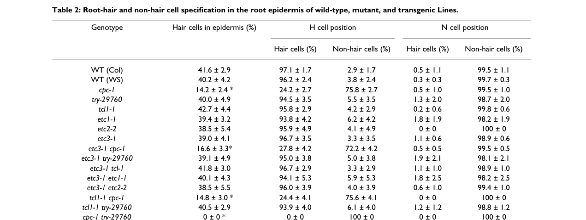

## Question

# Gene Research for Functional Annotation

## ⚠️ CRITICAL: Gene/Protein Identification Context

**BEFORE YOU BEGIN RESEARCH:** You MUST verify you are researching the CORRECT gene/protein. Gene symbols can be ambiguous, especially for less well-characterized genes from non-model organisms.

### Target Gene/Protein Identity (from UniProt):
- **UniProt Accession:** Q8GV05
- **Protein Description:** RecName: Full=Transcription factor TRY; AltName: Full=Protein TRIPTYCHON;
- **Gene Information:** Name=TRY; OrderedLocusNames=At5g53200; ORFNames=MFH8.14;
- **Organism (full):** Arabidopsis thaliana (Mouse-ear cress).
- **Protein Family:** Not specified in UniProt
- **Key Domains:** Homeodomain-like_sf. (IPR009057); Myb_TF_plants. (IPR015495); SANT/Myb. (IPR001005); Myb_DNA-binding (PF00249)

### MANDATORY VERIFICATION STEPS:

1. **Check if the gene symbol "TRY" matches the protein description above**
2. **Verify the organism is correct:** Arabidopsis thaliana (Mouse-ear cress).
3. **Check if protein family/domains align with what you find in literature**
4. **If you find literature for a DIFFERENT gene with the same or similar symbol, STOP**

### If Gene Symbol is Ambiguous or You Cannot Find Relevant Literature:

**DO NOT PROCEED WITH RESEARCH ON A DIFFERENT GENE.** Instead:
- State clearly: "The gene symbol 'TRY' is ambiguous or literature is limited for this specific protein"
- Explain what you found (e.g., "Found extensive literature on a different gene with the same symbol in a different organism")
- Describe the protein based ONLY on the UniProt information provided above
- Suggest that the protein function can be inferred from domain/family information

### Research Target:

Please provide a comprehensive research report on the gene **TRY** (gene ID: TRY, UniProt: Q8GV05) in ARATH.

The research report should be a detailed narrative explaining the function, biological processes, and localization of the gene product. Citations should be given for all claims.

You should prioritize authoritative reviews and primary scientific literature when conducting research. You can supplement
this with annotations you find in gene/protein databases, but these can be outdated or inaccurate.

We are specifically interested in the primary function of the gene - for enzymes, what reaction is catalyzed, and what is the substrate specificity? For transporters, what is the substrate? For structural proteins or adapters, what is the broader structural role? For signaling molecules, what is the role in the pathway.

We are interested in where in or outside the cell the gene product carries out its function.

We are also interested in the signaling or biochemical pathways in which the gene functions. We are less interested in broad pleiotropic effects, except where these elucidate the precise role.

Include evidence where possible. We are interested in both experimental evidence as well as inference from structure, evolution, or bioinformatic analysis. Precise studies should be prioritized over high-throughput, where available.

## Output

Question: You are an expert researcher providing comprehensive, well-cited information.

Provide detailed information focusing on:
1. Key concepts and definitions with current understanding
2. Recent developments and latest research (prioritize 2023-2024 sources)
3. Current applications and real-world implementations
4. Expert opinions and analysis from authoritative sources
5. Relevant statistics and data from recent studies

Format as a comprehensive research report with proper citations. Include URLs and publication dates where available.
Always prioritize recent, authoritative sources and provide specific citations for all major claims.

# Gene Research for Functional Annotation

## ⚠️ CRITICAL: Gene/Protein Identification Context

**BEFORE YOU BEGIN RESEARCH:** You MUST verify you are researching the CORRECT gene/protein. Gene symbols can be ambiguous, especially for less well-characterized genes from non-model organisms.

### Target Gene/Protein Identity (from UniProt):
- **UniProt Accession:** Q8GV05
- **Protein Description:** RecName: Full=Transcription factor TRY; AltName: Full=Protein TRIPTYCHON;
- **Gene Information:** Name=TRY; OrderedLocusNames=At5g53200; ORFNames=MFH8.14;
- **Organism (full):** Arabidopsis thaliana (Mouse-ear cress).
- **Protein Family:** Not specified in UniProt
- **Key Domains:** Homeodomain-like_sf. (IPR009057); Myb_TF_plants. (IPR015495); SANT/Myb. (IPR001005); Myb_DNA-binding (PF00249)

### MANDATORY VERIFICATION STEPS:

1. **Check if the gene symbol "TRY" matches the protein description above**
2. **Verify the organism is correct:** Arabidopsis thaliana (Mouse-ear cress).
3. **Check if protein family/domains align with what you find in literature**
4. **If you find literature for a DIFFERENT gene with the same or similar symbol, STOP**

### If Gene Symbol is Ambiguous or You Cannot Find Relevant Literature:

**DO NOT PROCEED WITH RESEARCH ON A DIFFERENT GENE.** Instead:
- State clearly: "The gene symbol 'TRY' is ambiguous or literature is limited for this specific protein"
- Explain what you found (e.g., "Found extensive literature on a different gene with the same symbol in a different organism")
- Describe the protein based ONLY on the UniProt information provided above
- Suggest that the protein function can be inferred from domain/family information

### Research Target:

Please provide a comprehensive research report on the gene **TRY** (gene ID: TRY, UniProt: Q8GV05) in ARATH.

The research report should be a detailed narrative explaining the function, biological processes, and localization of the gene product. Citations should be given for all claims.

You should prioritize authoritative reviews and primary scientific literature when conducting research. You can supplement
this with annotations you find in gene/protein databases, but these can be outdated or inaccurate.

We are specifically interested in the primary function of the gene - for enzymes, what reaction is catalyzed, and what is the substrate specificity? For transporters, what is the substrate? For structural proteins or adapters, what is the broader structural role? For signaling molecules, what is the role in the pathway.

We are interested in where in or outside the cell the gene product carries out its function.

We are also interested in the signaling or biochemical pathways in which the gene functions. We are less interested in broad pleiotropic effects, except where these elucidate the precise role.

Include evidence where possible. We are interested in both experimental evidence as well as inference from structure, evolution, or bioinformatic analysis. Precise studies should be prioritized over high-throughput, where available.

# Functional annotation report: Arabidopsis TRY

## Identity and primary function

**TRY is TRIPTYCHON, the Arabidopsis thaliana gene At5g53200.** Fine mapping of a natural fruit-trichome locus explicitly identified **TRY (At5g53200)**; the target accession **Q8GV05** is the UniProt identifier supplied in the question, rather than an accession independently established by that mapping study. The literature identifies TRY as a small **single-repeat R3 MYB regulatory protein**, consistent with the supplied Myb_DNA-binding, SANT/Myb and Myb_TF_plants annotations. The broader *homeodomain-like superfamily* label should **not** be interpreted as evidence that TRY is the homeodomain protein GLABRA2 (GL2): GL2 is a distinct, downstream regulator. (arteaga2021mybtranscriptionfactors pages 9-9, wang2008comprehensiveanalysisof pages 1-2, wang2014regulationofcell pages 2-3)

TRY’s best-established function is **lateral inhibition of trichome initiation**: it helps prevent neighboring shoot epidermal cells from adopting trichome fate, thereby maintaining trichome spacing. In roots, it contributes—largely redundantly with CAPRICE (CPC)—to specification of hair-forming epidermal cells. TRY is **not an enzyme or substrate transporter**; its relevant molecular partners are transcriptional regulators, particularly the bHLH protein GLABRA3 (GL3). Single-repeat R3 MYBs are short proteins composed largely of one MYB repeat and lack the conventional intrinsic transcription-activation region, so a MYB-domain annotation alone does not establish direct DNA binding by TRY. (pesch2011roleoftriptychon pages 1-2, wang2008comprehensiveanalysisof pages 5-6, wang2008comprehensiveanalysisof pages 1-2, wang2014regulationofcell pages 2-3)

## Molecular mechanism and pathway

In the shoot epidermis, **GL1–GL3/EGL3–TTG1**, a MYB–bHLH–WD40 regulatory complex, promotes trichome fate, including activation of **GL2**. TRY associates with GL3 and can compete with GL1 for the GL3 interaction, reducing the activity of the trichome-promoting network. TRY–GL3 interaction has been observed in Arabidopsis protoplast protein-interaction assays and in bimolecular-fluorescence-complementation experiments; yeast three-hybrid assays demonstrate interference with GL1–GL3 interaction. In the latter assay, competitive effectiveness ranked **CPC > ETC1 > TRY > ETC3 > ETC2**. That ranking is assay-specific, not a measurement of in-planta binding constants. Direct binding of TRY itself to the GL2 promoter has **not** been established by these results. (wang2008comprehensiveanalysisof pages 5-6, wester2009functionaldiversityof pages 6-7, wang2014regulationofcell pages 2-3)

This inhibition is embedded in feedback: combinations of GL1 or the root MYB **WER** with GL3 or EGL3 activate TRY transcription in protoplast assays, while TRY or CPC can suppress activator-induced TRY-promoter expression without first decreasing activator transcription. Reciprocal TRY/CPC promoter-and-coding-sequence swaps provide particularly strong functional evidence: either promoter driving the **TRY protein** rescued *try* trichome clustering, whereas the TRY promoter driving **CPC** did not. Thus, preventing clusters depends on TRY-specific protein properties, not simply where the gene is transcribed. (wang2008comprehensiveanalysisof pages 1-2, pesch2011roleoftriptychon pages 1-2, pesch2011roleoftriptychon pages 6-7)

Developmental timing provides a second input. **SPL9**, regulated by **miR156**, increases TRY expression during reproductive development: induced SPL9 rapidly increased TRY transcripts, mutating SPL-binding elements weakened TRY-promoter activity in stems and flowers, and SPL9 chromatin immunoprecipitation enriched TRY promoter fragments. This is evidence of **SPL9 binding the TRY gene’s promoter**, not evidence that TRY binds DNA directly. In the root, the analogous WER–GL3/EGL3–TTG1 pathway promotes the non-hair program through GL2; competing R3 MYBs, including TRY, favor hair-cell specification. (yu2010temporalcontrolof pages 6-8, yu2010temporalcontrolof pages 1-2, wang2008comprehensiveanalysisof pages 5-6)

## Biological sites and quantitative genetic evidence

TRY acts in the **developing epidermis**, notably in young leaves where trichome positions are selected, and participates in trichome regulation in reproductive organs. A distinctive *try* loss-of-function phenotype is **adjacent or aggregated leaf trichomes**, rather than merely a uniform increase in hair density; one study also reported fewer total leaf trichomes in *try* mutants. TRY’s root role is easier to see when CPC is absent. In the root-epidermis assay of Wang and colleagues, the fraction of hair cells was **41.6 ± 2.9%** in wild-type Columbia, **40.0 ± 4.9%** in *try-29760*, **14.2 ± 2.4%** in *cpc-1*, and **0 ± 0%** in *cpc-1 try-29760*; values are mean ± SD from **at least ten roots per genotype**. Thus CPC has the larger detectable single-mutant effect, but TRY is essential to the residual hair-forming capacity in that double-mutant background. (pesch2011roleoftriptychon pages 1-2, wang2008comprehensiveanalysisof pages 5-6, wang2008comprehensiveanalysisof media 2985fae2)

**Where the protein acts within and between cells:** its interaction with GL3 and its effect on transcriptional-complex function support a nuclear regulatory role. A transient Arabidopsis cotyledon-epidermis experiment detected overexpressed **EYFP–TRY in both cytoplasm and nucleus**, including nuclei of neighboring cells lacking the cell-autonomous cotransfection marker; this supports an ability of tagged TRY to move between epidermal cells. However, that direct TRY-localization experiment comes from a **2004 thesis**, rather than an endogenous-protein localization study in a peer-reviewed article. Peer-reviewed mobility measurements for related proteins CPC and ETC3 support the family-level model, but should not be substituted for a quantitative measurement of native TRY trafficking from a trichome initial. Neither secretion outside the plant cell nor a specific TRY transport route was established by the retrieved evidence. (srinivas2004understandingthefunction pages 60-65, wester2009functionaldiversityof pages 6-7, arteaga2021mybtranscriptionfactors pages 11-12)

The following evidence table distinguishes observations from interpretations and gives the underlying publication dates and links. The cropped source image of the root-hair phenotype table was also checked against its transcribed values. (wang2008comprehensiveanalysisof pages 5-6, wang2008comprehensiveanalysisof media 2985fae2)

| Function / claim | Direct experimental observation | Inference / limitation | Study URL / publication date |
|---|---|---|---|
| **Identity:** *Arabidopsis thaliana* **TRY / TRIPTYCHON**, locus **At5g53200** | Fine mapping placed MAU5 in a 3.5-kb interval containing only **TRY (At5g53200)**; the locus encodes an R3-MYB negative regulator of trichome development. This matches the supplied UniProt Q8GV05 identity. (arteaga2021mybtranscriptionfactors pages 9-9) | This evidence verifies the gene symbol, locus, organism and protein class; it excludes unrelated genes with similar names. | [Arteaga et al., *The Plant Cell*](https://doi.org/10.1093/plcell/koaa041), advance publication **2021-01-04** |
| **Primary molecular mechanism:** TRY binds the bHLH factor GL3 and disrupts the GL1–GL3 activator interaction | Arabidopsis protoplast two-hybrid assays demonstrated TRY–GL3 interaction. Yeast two-/three-hybrid and BiFC assays independently supported GL3 binding and ranked inhibition of GL1–GL3 interaction as CPC > ETC1 > **TRY** > ETC3 > ETC2. (wang2008comprehensiveanalysisof pages 5-6, wester2009functionaldiversityof pages 6-7) | Supports protein–protein competition within the MBW patterning network. TRY lacks an intrinsic activation domain; these experiments do **not** show direct TRY binding to DNA or establish a binding affinity. (wang2008comprehensiveanalysisof pages 6-9) | [Wang et al., *BMC Plant Biology*](https://doi.org/10.1186/1471-2229-8-81), **2008-07-21**; [Wester et al., *Development*](https://doi.org/10.1242/dev.021733), **2009-05** |
| **Leaf trichome spacing:** TRY specifically prevents adjacent trichomes from forming clusters | Loss-of-function **try** plants produced trichome clusters and fewer trichomes. Reciprocal TRY/CPC promoter–CDS swaps showed that either promoter driving the **TRY coding sequence** completely rescued clustering, whereas the TRY promoter driving CPC did not. (pesch2011roleoftriptychon pages 1-2, pesch2011roleoftriptychon pages 6-7) | Demonstrates that TRY-specific protein properties—not merely its expression pattern—underlie cluster prevention. The precise biochemical feature distinguishing TRY from CPC remains unresolved. | [Pesch & Hülskamp, *BMC Plant Biology*](https://doi.org/10.1186/1471-2229-11-130), **2011-09** |
| **Root-hair specification:** TRY acts redundantly with CPC to promote hair-cell fate | Epidermal hair cells were **41.6 ± 2.9%** in wild type, **40.0 ± 4.9%** in *try*, **14.2 ± 2.4%** in *cpc*, and **0 ± 0%** in the *cpc try* double mutant; values are mean ± SD from **at least 10 roots per genotype**. (wang2008comprehensiveanalysisof pages 5-6, wang2008comprehensiveanalysisof media 2985fae2) | TRY alone has little detectable effect in this assay, but the double-mutant result establishes strong redundancy with CPC. It does not imply that TRY is the predominant root-hair regulator. | [Wang et al., *BMC Plant Biology*](https://doi.org/10.1186/1471-2229-8-81), **2008-07-21** |
| **Subcellular localization and mobility:** TRY can occupy the cytoplasm and nucleus and move into neighboring epidermal cells | In transient cotyledon bombardment, 35S:EYFP–TRY was detected in the nucleus and cytoplasm of the transfected cell and in nuclei of neighboring cells lacking the cell-autonomous cotransfection marker. (srinivas2004understandingthefunction pages 60-65) | Direct for the tagged, overexpressed fusion, but reported in an **unpublished 2004 thesis**, not a peer-reviewed endogenous-locus study. It does not prove native TRY movement from trichome initials or identify plasmodesmata as the route. | Srinivas, doctoral thesis, **2004**; no verified journal URL available |
| **Natural cis-regulatory variation:** the Don-0 TRY allele is hypomorphic in reproductive organs | Don-0 and Ler lacked TRY missense differences, but Don-0 had lower TRY expression. Genomic transgenes complemented leaf clustering, while Don-0 versus Ler alleles differed in fruit trichome number (**P = 0.008**). Intronic **SNP-701** gave the strongest association with fruit trichomes (**−log₁₀P = 11.0**) and was in strong linkage disequilibrium with seven variants. (arteaga2021mybtranscriptionfactors pages 9-10, arteaga2021mybtranscriptionfactors pages 9-9) | Supports cis-regulatory TRY hypofunction, but SNP-701 is a marker within a linked haplotype; it was not individually proven causal. TRY expression is also affected by genetic background and TCL1-associated trans-regulation. | [Arteaga et al., *The Plant Cell*](https://doi.org/10.1093/plcell/koaa041), advance publication **2021-01-04** |
| **Recent development:** TRY participates in epistatic control of natural fruit-trichome variation with EGL3, GL1 and TCL1 | Hairy-fruit introgression lines required the Don-0 TRY region together with other network alleles. The interactions **MAU1/EGL3 × GL1 × TRY** and **MAU1/EGL3 × TCL1 × TRY** explained **21.2%** and **12.3%** of fruit-trichome-number variance, respectively. (mendezvigo2025thebhlhtranscription pages 2-3) | Establishes network-level genetic epistasis, not a newly measured TRY–EGL3 biochemical interaction. The adaptive significance of fruit trichomes remains suggested rather than experimentally demonstrated. | [Méndez-Vigo et al., *Plant Physiology*](https://doi.org/10.1093/plphys/kiae673), advance publication **2024-12-22**; volume issue **2025** |

*Table: Evidence-grade summary for Arabidopsis thaliana TRY/At5g53200, separating direct observations from mechanistic inference and unresolved limitations. It includes molecular, localization, developmental, natural-variation and recent epistasis evidence.*

## Recent findings and applications

Natural variation supplies evidence for TRY function beyond laboratory mutants. **Arteaga et al.**, published online **4 January 2021**, mapped the fruit-trichome locus **MAU5** to TRY. Don-0 and Ler TRY alleles differed in reproductive-organ expression but **not in amino-acid-altering substitutions**; transgenic genomic alleles differed in fruit-trichome effects (**P = 0.008**). An intronic variant termed **SNP-701** had a strong association with fruit trichomes (**−log₁₀P = 11.0**), but it is linked to seven other polymorphisms and was **not individually proved causal**. These results support reduced TRY expression as a contributor to the Don-0 fruit-hair phenotype, while showing that genetic background and TCL1-associated regulation also matter. (arteaga2021mybtranscriptionfactors pages 9-9)

The most relevant **2024** advance located was **Méndez-Vigo et al.**, published online **22 December 2024** and assigned to a **2025** *Plant Physiology* issue. It identified a hyperactive natural **EGL3** allele whose effects on fruit trichomes depend strongly on the **TRY, TCL1 and GL1** genetic background. In the tested introgression lines, the **EGL3 × GL1 × TRY** and **EGL3 × TCL1 × TRY** interactions accounted for **21.2%** and **12.3%**, respectively, of variation in fruit trichome number; the **EGL3 × TRY** interaction accounted for **14.6%**. These are statistical contributions in that study’s genetic backgrounds, **not** evidence of a newly demonstrated TRY–EGL3 physical interaction. (mendezvigo2025thebhlhtranscription pages 1-2, mendezvigo2025thebhlhtranscription pages 2-3)

**Current implementation is principally experimental:** *try* mutants, complementation constructs, promoter reporters and natural-allele introgression lines are used to dissect plant epidermal fate and engineer or test trichome patterns in Arabidopsis. Hairy fruits in the sampled Iberian relict populations were associated with lower spring precipitation, suggesting a possible adaptive role, but association does **not** establish that manipulating TRY improves drought tolerance or crop yield. Likewise, transcript profiling implicates TRY alongside other R3 MYBs in root responses to phosphate scarcity, yet the proposed downstream metabolic mechanisms remain less securely established than its trichome-spacing and root-hair-fate functions. The available 2023–2024 search did not yield a stronger, TRY-specific biochemical or native-localization study that would supersede these primary functional experiments. (arteaga2021mybtranscriptionfactors pages 1-2, chen2015theparalogousr3 pages 1-2, chen2015theparalogousr3 pages 12-13, mendezvigo2025thebhlhtranscription pages 1-2)

### Principal sources

- Wang et al. **21 July 2008**, *BMC Plant Biology* 8:81. Root-hair mutant measurements and TRY–GL3 interaction: https://doi.org/10.1186/1471-2229-8-81. (wang2008comprehensiveanalysisof pages 5-6, wang2008comprehensiveanalysisof pages 1-2)
- Wester et al. **May 2009**, *Development* 136:1487–1496. R3-MYB competition assays and measurements on related mobile inhibitors: https://doi.org/10.1242/dev.021733. (wester2009functionaldiversityof pages 6-7)
- Yu et al. **July 2010**, *The Plant Cell* 22:2322–2335. SPL9/miR156 regulation and TRY-promoter ChIP: https://doi.org/10.1105/tpc.109.072579. (yu2010temporalcontrolof pages 6-8)
- Pesch and Hülskamp **September 2011**, *BMC Plant Biology* 11:130. TRY-promoter analysis and TRY/CPC coding-sequence swaps: https://doi.org/10.1186/1471-2229-11-130. (pesch2011roleoftriptychon pages 1-2, pesch2011roleoftriptychon pages 6-7)
- Arteaga et al. **4 January 2021 online**, *The Plant Cell* 33:548–565. Explicit TRY/At5g53200 identification and natural cis-regulatory variation: https://doi.org/10.1093/plcell/koaa041. (arteaga2021mybtranscriptionfactors pages 9-9, arteaga2021mybtranscriptionfactors pages 1-2)
- Méndez-Vigo et al. **22 December 2024 online; 2025 issue**, *Plant Physiology* 197. Natural EGL3–TRY genetic interactions: https://doi.org/10.1093/plphys/kiae673. (mendezvigo2025thebhlhtranscription pages 1-2, mendezvigo2025thebhlhtranscription pages 2-3)

References

1. (arteaga2021mybtranscriptionfactors pages 9-9): Noelia Arteaga, Marija Savic, Belén Méndez-Vigo, Alberto Fuster-Pons, Rafael Torres-Pérez, Juan Carlos Oliveros, F Xavier Picó, and Carlos Alonso-Blanco. Myb transcription factors drive evolutionary innovations in arabidopsis fruit trichome patterning. The Plant Cell, 33:548-565, Jan 2021. URL: https://doi.org/10.1093/plcell/koaa041, doi:10.1093/plcell/koaa041. This article has 34 citations.

2. (wang2008comprehensiveanalysisof pages 1-2): Shucai Wang, Leah Hubbard, Ying Chang, Jianjun Guo, John Schiefelbein, and Jin-Gui Chen. Comprehensive analysis of single-repeat r3 myb proteins in epidermal cell patterning and their transcriptional regulation in arabidopsis. BMC Plant Biology, 8:81-81, Jul 2008. URL: https://doi.org/10.1186/1471-2229-8-81, doi:10.1186/1471-2229-8-81. This article has 153 citations and is from a peer-reviewed journal.

3. (wang2014regulationofcell pages 2-3): Shucai Wang and Jin-Gui Chen. Regulation of cell fate determination by single-repeat r3 myb transcription factors in arabidopsis. Frontiers in Plant Science, Apr 2014. URL: https://doi.org/10.3389/fpls.2014.00133, doi:10.3389/fpls.2014.00133. This article has 135 citations.

4. (pesch2011roleoftriptychon pages 1-2): Martina Pesch and Martin Hülskamp. Role of triptychon in trichome patterning in arabidopsis. BMC Plant Biology, 11:130-130, Sep 2011. URL: https://doi.org/10.1186/1471-2229-11-130, doi:10.1186/1471-2229-11-130. This article has 57 citations and is from a peer-reviewed journal.

5. (wang2008comprehensiveanalysisof pages 5-6): Shucai Wang, Leah Hubbard, Ying Chang, Jianjun Guo, John Schiefelbein, and Jin-Gui Chen. Comprehensive analysis of single-repeat r3 myb proteins in epidermal cell patterning and their transcriptional regulation in arabidopsis. BMC Plant Biology, 8:81-81, Jul 2008. URL: https://doi.org/10.1186/1471-2229-8-81, doi:10.1186/1471-2229-8-81. This article has 153 citations and is from a peer-reviewed journal.

6. (wester2009functionaldiversityof pages 6-7): Katja Wester, Simona Digiuni, Florian Geier, Jens Timmer, Christian Fleck, and Martin Hülskamp. Functional diversity of r3 single-repeat genes in trichome development. Development, 136:1487-1496, May 2009. URL: https://doi.org/10.1242/dev.021733, doi:10.1242/dev.021733. This article has 195 citations and is from a domain leading peer-reviewed journal.

7. (pesch2011roleoftriptychon pages 6-7): Martina Pesch and Martin Hülskamp. Role of triptychon in trichome patterning in arabidopsis. BMC Plant Biology, 11:130-130, Sep 2011. URL: https://doi.org/10.1186/1471-2229-11-130, doi:10.1186/1471-2229-11-130. This article has 57 citations and is from a peer-reviewed journal.

8. (yu2010temporalcontrolof pages 6-8): N. Yu, Wenjuan Cai, Shucai Wang, Chun-Min Shan, Ling-Jian Wang, and Xiao-Ya Chen. Temporal control of trichome distribution by microrna156-targeted spl genes in arabidopsis thaliana[w][oa]. Plant Cell, 22:2322-2335, Jul 2010. URL: https://doi.org/10.1105/tpc.109.072579, doi:10.1105/tpc.109.072579. This article has 401 citations and is from a highest quality peer-reviewed journal.

9. (yu2010temporalcontrolof pages 1-2): N. Yu, Wenjuan Cai, Shucai Wang, Chun-Min Shan, Ling-Jian Wang, and Xiao-Ya Chen. Temporal control of trichome distribution by microrna156-targeted spl genes in arabidopsis thaliana[w][oa]. Plant Cell, 22:2322-2335, Jul 2010. URL: https://doi.org/10.1105/tpc.109.072579, doi:10.1105/tpc.109.072579. This article has 401 citations and is from a highest quality peer-reviewed journal.

10. (wang2008comprehensiveanalysisof media 2985fae2): Shucai Wang, Leah Hubbard, Ying Chang, Jianjun Guo, John Schiefelbein, and Jin-Gui Chen. Comprehensive analysis of single-repeat r3 myb proteins in epidermal cell patterning and their transcriptional regulation in arabidopsis. BMC Plant Biology, 8:81-81, Jul 2008. URL: https://doi.org/10.1186/1471-2229-8-81, doi:10.1186/1471-2229-8-81. This article has 153 citations and is from a peer-reviewed journal.

11. (srinivas2004understandingthefunction pages 60-65): BP Srinivas. Understanding the function of the arabidopsis glabra 2 gene in trichome patterning, morphogenesis and differentiation. Unknown journal, 2004.

12. (arteaga2021mybtranscriptionfactors pages 11-12): Noelia Arteaga, Marija Savic, Belén Méndez-Vigo, Alberto Fuster-Pons, Rafael Torres-Pérez, Juan Carlos Oliveros, F Xavier Picó, and Carlos Alonso-Blanco. Myb transcription factors drive evolutionary innovations in arabidopsis fruit trichome patterning. The Plant Cell, 33:548-565, Jan 2021. URL: https://doi.org/10.1093/plcell/koaa041, doi:10.1093/plcell/koaa041. This article has 34 citations.

13. (wang2008comprehensiveanalysisof pages 6-9): Shucai Wang, Leah Hubbard, Ying Chang, Jianjun Guo, John Schiefelbein, and Jin-Gui Chen. Comprehensive analysis of single-repeat r3 myb proteins in epidermal cell patterning and their transcriptional regulation in arabidopsis. BMC Plant Biology, 8:81-81, Jul 2008. URL: https://doi.org/10.1186/1471-2229-8-81, doi:10.1186/1471-2229-8-81. This article has 153 citations and is from a peer-reviewed journal.

14. (arteaga2021mybtranscriptionfactors pages 9-10): Noelia Arteaga, Marija Savic, Belén Méndez-Vigo, Alberto Fuster-Pons, Rafael Torres-Pérez, Juan Carlos Oliveros, F Xavier Picó, and Carlos Alonso-Blanco. Myb transcription factors drive evolutionary innovations in arabidopsis fruit trichome patterning. The Plant Cell, 33:548-565, Jan 2021. URL: https://doi.org/10.1093/plcell/koaa041, doi:10.1093/plcell/koaa041. This article has 34 citations.

15. (mendezvigo2025thebhlhtranscription pages 2-3): Belén Méndez-Vigo, Noelia Arteaga, Alba Murillo-Sánchez, Sonia Alba, and Carlos Alonso-Blanco. The bhlh transcription factor gene <i>egl3</i> accounts for the natural diversity in arabidopsis fruit trichome pattern and morphology. Plant Physiology, Dec 2025. URL: https://doi.org/10.1093/plphys/kiae673, doi:10.1093/plphys/kiae673. This article has 9 citations and is from a highest quality peer-reviewed journal.

16. (mendezvigo2025thebhlhtranscription pages 1-2): Belén Méndez-Vigo, Noelia Arteaga, Alba Murillo-Sánchez, Sonia Alba, and Carlos Alonso-Blanco. The bhlh transcription factor gene <i>egl3</i> accounts for the natural diversity in arabidopsis fruit trichome pattern and morphology. Plant Physiology, Dec 2025. URL: https://doi.org/10.1093/plphys/kiae673, doi:10.1093/plphys/kiae673. This article has 9 citations and is from a highest quality peer-reviewed journal.

17. (arteaga2021mybtranscriptionfactors pages 1-2): Noelia Arteaga, Marija Savic, Belén Méndez-Vigo, Alberto Fuster-Pons, Rafael Torres-Pérez, Juan Carlos Oliveros, F Xavier Picó, and Carlos Alonso-Blanco. Myb transcription factors drive evolutionary innovations in arabidopsis fruit trichome patterning. The Plant Cell, 33:548-565, Jan 2021. URL: https://doi.org/10.1093/plcell/koaa041, doi:10.1093/plcell/koaa041. This article has 34 citations.

18. (chen2015theparalogousr3 pages 1-2): Chun-Ying Chen and Wolfgang Schmidt. The paralogous r3 myb proteins caprice, triptychon and enhancer of try and cpc1 play pleiotropic and partly non-redundant roles in the phosphate starvation response of <i>arabidopsis</i> roots. Journal of Experimental Botany, 66:4821-4834, May 2015. URL: https://doi.org/10.1093/jxb/erv259, doi:10.1093/jxb/erv259. This article has 40 citations and is from a domain leading peer-reviewed journal.

19. (chen2015theparalogousr3 pages 12-13): Chun-Ying Chen and Wolfgang Schmidt. The paralogous r3 myb proteins caprice, triptychon and enhancer of try and cpc1 play pleiotropic and partly non-redundant roles in the phosphate starvation response of <i>arabidopsis</i> roots. Journal of Experimental Botany, 66:4821-4834, May 2015. URL: https://doi.org/10.1093/jxb/erv259, doi:10.1093/jxb/erv259. This article has 40 citations and is from a domain leading peer-reviewed journal.

## Artifacts

- [Edison artifact artifact-00](TRY-deep-research-falcon_artifacts/artifact-00.md)

## Citations

1. arteaga2021mybtranscriptionfactors pages 9-9
2. wang2008comprehensiveanalysisof pages 6-9
3. srinivas2004understandingthefunction pages 60-65
4. mendezvigo2025thebhlhtranscription pages 2-3
5. wester2009functionaldiversityof pages 6-7
6. yu2010temporalcontrolof pages 6-8
7. wang2008comprehensiveanalysisof pages 1-2
8. wang2014regulationofcell pages 2-3
9. pesch2011roleoftriptychon pages 1-2
10. wang2008comprehensiveanalysisof pages 5-6
11. pesch2011roleoftriptychon pages 6-7
12. yu2010temporalcontrolof pages 1-2
13. arteaga2021mybtranscriptionfactors pages 11-12
14. arteaga2021mybtranscriptionfactors pages 9-10
15. mendezvigo2025thebhlhtranscription pages 1-2
16. arteaga2021mybtranscriptionfactors pages 1-2
17. Arteaga et al., *The Plant Cell*
18. Wang et al., *BMC Plant Biology*
19. Wester et al., *Development*
20. Pesch & Hülskamp, *BMC Plant Biology*
21. Méndez-Vigo et al., *Plant Physiology*
22. w
23. oa
24. https://doi.org/10.1093/plcell/koaa041
25. https://doi.org/10.1186/1471-2229-8-81
26. https://doi.org/10.1242/dev.021733
27. https://doi.org/10.1186/1471-2229-11-130
28. https://doi.org/10.1093/plphys/kiae673
29. https://doi.org/10.1186/1471-2229-8-81.
30. https://doi.org/10.1242/dev.021733.
31. https://doi.org/10.1105/tpc.109.072579.
32. https://doi.org/10.1186/1471-2229-11-130.
33. https://doi.org/10.1093/plcell/koaa041.
34. https://doi.org/10.1093/plphys/kiae673.
35. https://doi.org/10.1093/plcell/koaa041,
36. https://doi.org/10.1186/1471-2229-8-81,
37. https://doi.org/10.3389/fpls.2014.00133,
38. https://doi.org/10.1186/1471-2229-11-130,
39. https://doi.org/10.1242/dev.021733,
40. https://doi.org/10.1105/tpc.109.072579,
41. https://doi.org/10.1093/plphys/kiae673,
42. https://doi.org/10.1093/jxb/erv259,