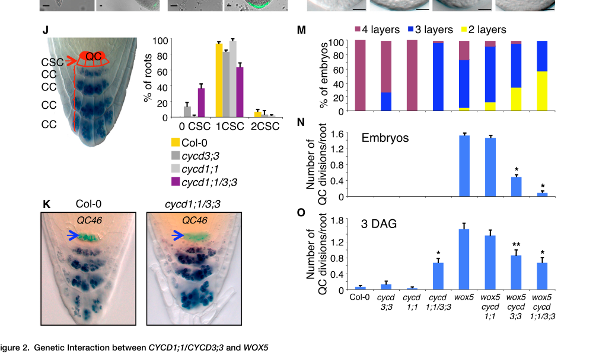

## Question

# Gene Research for Functional Annotation

## ⚠️ CRITICAL: Gene/Protein Identification Context

**BEFORE YOU BEGIN RESEARCH:** You MUST verify you are researching the CORRECT gene/protein. Gene symbols can be ambiguous, especially for less well-characterized genes from non-model organisms.

### Target Gene/Protein Identity (from UniProt):
- **UniProt Accession:** Q8H1D2
- **Protein Description:** RecName: Full=WUSCHEL-related homeobox 5;
- **Gene Information:** Name=WOX5; OrderedLocusNames=At3g11260; ORFNames=F11B9.18;
- **Organism (full):** Arabidopsis thaliana (Mouse-ear cress).
- **Protein Family:** Belongs to the WUS homeobox family. .
- **Key Domains:** HD. (IPR001356); Homeodomain-like_sf. (IPR009057); WUSCHEL-like. (IPR044555); Homeodomain (PF00046)

### MANDATORY VERIFICATION STEPS:

1. **Check if the gene symbol "WOX5" matches the protein description above**
2. **Verify the organism is correct:** Arabidopsis thaliana (Mouse-ear cress).
3. **Check if protein family/domains align with what you find in literature**
4. **If you find literature for a DIFFERENT gene with the same or similar symbol, STOP**

### If Gene Symbol is Ambiguous or You Cannot Find Relevant Literature:

**DO NOT PROCEED WITH RESEARCH ON A DIFFERENT GENE.** Instead:
- State clearly: "The gene symbol 'WOX5' is ambiguous or literature is limited for this specific protein"
- Explain what you found (e.g., "Found extensive literature on a different gene with the same symbol in a different organism")
- Describe the protein based ONLY on the UniProt information provided above
- Suggest that the protein function can be inferred from domain/family information

### Research Target:

Please provide a comprehensive research report on the gene **WOX5** (gene ID: WOX5, UniProt: Q8H1D2) in ARATH.

The research report should be a detailed narrative explaining the function, biological processes, and localization of the gene product. Citations should be given for all claims.

You should prioritize authoritative reviews and primary scientific literature when conducting research. You can supplement
this with annotations you find in gene/protein databases, but these can be outdated or inaccurate.

We are specifically interested in the primary function of the gene - for enzymes, what reaction is catalyzed, and what is the substrate specificity? For transporters, what is the substrate? For structural proteins or adapters, what is the broader structural role? For signaling molecules, what is the role in the pathway.

We are interested in where in or outside the cell the gene product carries out its function.

We are also interested in the signaling or biochemical pathways in which the gene functions. We are less interested in broad pleiotropic effects, except where these elucidate the precise role.

Include evidence where possible. We are interested in both experimental evidence as well as inference from structure, evolution, or bioinformatic analysis. Precise studies should be prioritized over high-throughput, where available.

## Output

Question: You are an expert researcher providing comprehensive, well-cited information.

Provide detailed information focusing on:
1. Key concepts and definitions with current understanding
2. Recent developments and latest research (prioritize 2023-2024 sources)
3. Current applications and real-world implementations
4. Expert opinions and analysis from authoritative sources
5. Relevant statistics and data from recent studies

Format as a comprehensive research report with proper citations. Include URLs and publication dates where available.
Always prioritize recent, authoritative sources and provide specific citations for all major claims.

# Gene Research for Functional Annotation

## ⚠️ CRITICAL: Gene/Protein Identification Context

**BEFORE YOU BEGIN RESEARCH:** You MUST verify you are researching the CORRECT gene/protein. Gene symbols can be ambiguous, especially for less well-characterized genes from non-model organisms.

### Target Gene/Protein Identity (from UniProt):
- **UniProt Accession:** Q8H1D2
- **Protein Description:** RecName: Full=WUSCHEL-related homeobox 5;
- **Gene Information:** Name=WOX5; OrderedLocusNames=At3g11260; ORFNames=F11B9.18;
- **Organism (full):** Arabidopsis thaliana (Mouse-ear cress).
- **Protein Family:** Belongs to the WUS homeobox family. .
- **Key Domains:** HD. (IPR001356); Homeodomain-like_sf. (IPR009057); WUSCHEL-like. (IPR044555); Homeodomain (PF00046)

### MANDATORY VERIFICATION STEPS:

1. **Check if the gene symbol "WOX5" matches the protein description above**
2. **Verify the organism is correct:** Arabidopsis thaliana (Mouse-ear cress).
3. **Check if protein family/domains align with what you find in literature**
4. **If you find literature for a DIFFERENT gene with the same or similar symbol, STOP**

### If Gene Symbol is Ambiguous or You Cannot Find Relevant Literature:

**DO NOT PROCEED WITH RESEARCH ON A DIFFERENT GENE.** Instead:
- State clearly: "The gene symbol 'WOX5' is ambiguous or literature is limited for this specific protein"
- Explain what you found (e.g., "Found extensive literature on a different gene with the same symbol in a different organism")
- Describe the protein based ONLY on the UniProt information provided above
- Suggest that the protein function can be inferred from domain/family information

### Research Target:

Please provide a comprehensive research report on the gene **WOX5** (gene ID: WOX5, UniProt: Q8H1D2) in ARATH.

The research report should be a detailed narrative explaining the function, biological processes, and localization of the gene product. Citations should be given for all claims.

You should prioritize authoritative reviews and primary scientific literature when conducting research. You can supplement
this with annotations you find in gene/protein databases, but these can be outdated or inaccurate.

We are specifically interested in the primary function of the gene - for enzymes, what reaction is catalyzed, and what is the substrate specificity? For transporters, what is the substrate? For structural proteins or adapters, what is the broader structural role? For signaling molecules, what is the role in the pathway.

We are interested in where in or outside the cell the gene product carries out its function.

We are also interested in the signaling or biochemical pathways in which the gene functions. We are less interested in broad pleiotropic effects, except where these elucidate the precise role.

Include evidence where possible. We are interested in both experimental evidence as well as inference from structure, evolution, or bioinformatic analysis. Precise studies should be prioritized over high-throughput, where available.

# Functional annotation research report: **WOX5** (Arabidopsis thaliana; At3g11260; UniProt Q8H1D2)

## Executive summary
WOX5 (WUSCHEL-RELATED HOMEOBOX 5) is a WUS-clade homeobox transcription factor that is specifically expressed in the **root quiescent center (QC)** and acts as a **stem cell organizer hub** that (i) maintains QC mitotic quiescence and identity and (ii) maintains the distal **columella stem cells (CSCs)** in an undifferentiated state through QC-to-CSC signaling. (zhang2024decipheringthemolecular pages 1-2, pi2015organizerderivedwox5signal pages 1-3)

Recent 2024 work provides a genomic-scale view of WOX5 function in the QC, showing that WOX5 acts as both an **activator and repressor** and reshapes chromatin accessibility and histone modifications in QC nuclei, with **1,423 genes activated and 947 genes repressed** by WOX5. (zhang2024decipheringthemolecular pages 4-6, zhang2024decipheringthemolecular pages 1-2)

A major mechanistic axis is WOX5-mediated chromatin repression of the differentiation factor **CDF4** via recruitment of the co-repressors **TOPLESS/TOPLESS-RELATED (TPL/TPR)** and **HDA19**, coupled to reduced histone acetylation at the CDF4 locus. (pi2015organizerderivedwox5signal pages 3-4, pi2015organizerderivedwox5signal pages 11-12)

---

## 1) Key concepts and definitions (current understanding)

### 1.1 Root stem cell niche and quiescent center (QC)
The Arabidopsis root stem cell niche is organized around a small group of slowly dividing cells termed the **quiescent center (QC)**, which acts as a stem cell organizer. Loss or ablation of QC function disrupts neighboring stem cells and promotes their differentiation. (zhang2024decipheringthemolecular pages 1-2)

A recent review (published **9 May 2024**) synthesizes modern understanding of meristem quiescence, emphasizing that the QC is a low-mitotic reservoir that maintains surrounding stem cells and supports long-term root growth and environmental responsiveness. (eljebbawi2024stemcellquiescence pages 1-3)

### 1.2 WOX5 as a “stem cell organizer” transcription factor
WOX5 is described as a **QC-specific** WUSCHEL-related homeobox transcription factor that is a central regulator of QC function and QC-to-stem-cell signaling. (zhang2024decipheringthemolecular pages 1-2)

Functionally, WOX5 is now understood as a **bifunctional transcription factor** (context-dependent repressor and activator) that can also drive changes in chromatin state (histone modifications, accessibility). (zhang2024decipheringthemolecular pages 1-2, zhang2024decipheringthemolecular pages 4-6)

---

## 2) Recent developments and latest research (prioritizing 2023–2024)

### 2.1 Genomic-scale QC profiling of WOX5 function (EMBO Journal, online 18 Nov 2024)
A key 2024 resource study profiled QC and columella nuclei to define WOX5-dependent programs, concluding that WOX5 affects both transcription and epigenetic features of QC identity. (Zhang et al.; published online **18 Nov 2024**; https://doi.org/10.1038/s44318-024-00302-2) (zhang2024decipheringthemolecular pages 1-2, zhang2024decipheringthemolecular pages 4-6)

Quantitatively, in sorted QC nuclei, WOX5 was associated with **1,423 activated** and **947 repressed** genes. These include categories of (i) cell division regulators (e.g., cyclins/inhibitors), (ii) differentiation regulators (including CDF4), and (iii) auxin-related regulators. (zhang2024decipheringthemolecular pages 4-6)

This 2024 work also expands the putative QC functional repertoire by reporting WOX5 regulation of pathways such as **nitrate transport** and basal expression of genes typically associated with more mature root tissues, supporting a view of QC cells as “reserve/primed” cells. (zhang2024decipheringthemolecular pages 1-2)

### 2.2 A WOX5–HAN–CDF4 coherent feed-forward loop linking auxin biosynthesis and CSC maintenance (Nature Plants, Oct 2024)
A 2024 Nature Plants study defined a **coherent feed-forward loop (cFFL)** where WOX5 and HAN repress CDF4, with an important output being expression of **TAA1** (auxin biosynthesis) and maintenance of an **auxin response maximum** in the organizer. (Sharma et al.; **Oct 2024**; https://doi.org/10.1038/s41477-024-01810-z) (sharma2024acoherentfeedforward pages 1-7)

In inducible WOX5 activation experiments, **HAN** was identified as the most strongly upregulated transcript, increasing **~8–9-fold at 1 and 4 hours** after WOX5 activation, and HAN was shown to be required for WOX5-driven ectopic CSC-like states. (sharma2024acoherentfeedforward pages 7-11)

### 2.3 Reassessment of the requirement for WOX5 protein movement
Earlier work supported a model in which WOX5 protein moves from QC into CSCs and that this movement is required for CSC maintenance. (pi2015organizerderivedwox5signal pages 1-3, pi2015organizerderivedwox5signal pages 4-5)

However, a 2024 thesis-style analysis highlights a controversy: recombination/transgene contamination in a key immobile WOX5 reporter line could confound conclusions, and regenerated transgenics suggest that while movement is observed, **WOX5 movement may not be required** for rescuing CSC identity—raising the possibility of secondary mobile signals downstream of QC-local WOX5 activity. (vikram2024regulationofcytokinin pages 83-86)

---

## 3) Molecular function, mechanisms, and pathways

### 3.1 Molecular function: transcription factor activity (not an enzyme/transporter)
WOX5 is a homeobox transcription factor; experimentally, it binds cis-regulatory DNA elements and controls transcription of developmental regulators. (pi2015organizerderivedwox5signal pages 1-3, pi2015organizerderivedwox5signal pages 4-5)

### 3.2 Direct target and chromatin mechanism: repression of **CDF4**
A central mechanistic insight is that WOX5 directly represses **CDF4** (a differentiation-promoting DOF transcription factor) in the QC/CSC region.

Evidence includes:
- **Ectopic CDF4 expression in wox5-1**, including at/near QC, and repression of CDF4 by inducible WOX5. (pi2015organizerderivedwox5signal pages 3-4)
- **WOX5 enrichment at a cis-regulatory region** upstream of CDF4 containing TAAT motifs. (pi2015organizerderivedwox5signal pages 3-4)
- A chromatin repression mechanism in which WOX5 interacts with **TPL/TPR** co-repressors and—via these—recruits **HDA19**, reducing histone H3 acetylation at the CDF4 regulatory region. (Pi et al., **Jun 2015**; https://doi.org/10.1016/j.devcel.2015.04.024) (pi2015organizerderivedwox5signal pages 11-12, pi2015organizerderivedwox5signal pages 11-11)

### 3.3 QC quiescence mechanism: repression of **CYCD3;3** and cyclin D activity
WOX5 promotes QC mitotic quiescence by repressing D-type cyclin activity, with strong genetic evidence that CYCD1;1/CYCD3;3 mediate much of the wox5 QC-division phenotype.

Quantitative embryonic data:
- Additional QC transverse divisions occurred in **89%** of **wox5-1** embryos, reduced to **45%** in **wox5 cycd3;3**, and to **8%** in **wox5 cycd1;1 cycd3;3**. (Forzani et al., **Aug 2014**; https://doi.org/10.1016/j.cub.2014.07.019) (forzani2014wox5suppressescyclin pages 3-4)
- QC-specific ectopic **CYCD3;3** expression (pWOX5:vYFP-CYCD3;3) induced QC divisions in **100%** of embryos, demonstrating sufficiency to break quiescence. (forzani2014wox5suppressescyclin pages 3-4)

These quantitative results are also captured in the extracted figure panels from the paper. (forzani2014wox5suppressescyclin media 14bfa87e, forzani2014wox5suppressescyclin media 435d2f04)

### 3.4 Protein–protein interactions and stem-cell-niche complexes
WOX5 function is associated with interaction/complex formation with other niche regulators, including **BRAVO** and **PLT3**, in the context of QC quiescence regulation. (zhang2024decipheringthemolecular pages 1-2)

A 2024 preprint further emphasizes that WOX5 participates in **cell-type-specific transcription factor complex formation** with BRAVO and PLT3, using quantitative live-cell interaction approaches (FRET-FLIM) and modeling to argue that complex “signatures” contribute to cell specificity in niche regulation. (Strotmann et al., **Apr 2024**; https://doi.org/10.1101/2024.04.26.591257) (strotmann2024stemcellhomeostasis pages 1-5)

### 3.5 Auxin pathway integration (transport maximum and local biosynthesis)
WOX5 sits in an organizer network tightly coupled to auxin:
- WOX5 promotes local auxin biosynthesis in the QC and participates in a regulatory relationship with auxin response maxima that support organizer function. (zhang2024decipheringthemolecular pages 1-2, sharma2024acoherentfeedforward pages 1-7)
- The 2024 WOX5–HAN–CDF4 cFFL explicitly links WOX5-regulated transcription to **TAA1** expression and organizer auxin maxima. (sharma2024acoherentfeedforward pages 1-7)

### 3.6 Peptide signaling context (TPST-dependent niche signaling)
Secreted peptide signals contribute to root stem cell niche maintenance, with WOX5 widely used as a QC marker in this context (e.g., QC expansion assessed via WOX5 expression). (Matsuzaki et al., **Aug 2010**; https://doi.org/10.1126/science.1191132) (lou2024genomewideanalysisof pages 15-17)

---

## 4) Expression pattern and localization (cell/tissue and subcellular)

### 4.1 Cell-type specificity
WOX5 is described as **specifically expressed in QC cells** in the Arabidopsis root meristem. (zhang2024decipheringthemolecular pages 1-2)

Classic genetic work analyzing organizers and markers also documented WOX5 reporter/transcript assays and notes contexts where WOX5-associated staining/expression extends into adjacent stem cells (including columella stem cell region), consistent with QC-centered expression with proximal influence. (Sarkar et al., **Apr 2007**; https://doi.org/10.1038/nature05703) (sarkar2007conservedfactorsregulate pages 1-10)

### 4.2 Subcellular localization
Direct “nuclear localization” phrasing was limited in the available excerpts; however, WOX5 is consistently characterized and experimentally used as a transcription factor with direct DNA binding and promoter occupancy (e.g., CDF4 promoter binding and ChIP enrichment), implying **nuclear function**. (pi2015organizerderivedwox5signal pages 3-4, pi2015organizerderivedwox5signal pages 4-5)

### 4.3 Intercellular movement and non-cell autonomy
WOX5 expression in the QC is **non-cell-autonomously necessary** for maintaining underlying CSCs undifferentiated. (zhang2024decipheringthemolecular pages 1-2)

Protein movement evidence:
- WOX5 protein movement from QC into CSCs is reported, forming a QC-to-CSC gradient, and movement-blocking fusions were used to test this model. (pi2015organizerderivedwox5signal pages 4-5, pi2015organizerderivedwox5signal pages 1-3)
- A 2024 reassessment suggests movement may not be required for CSC maintenance in some transgenic rescue assays, highlighting an active area of debate and motivating hypotheses about alternative mobile factors. (vikram2024regulationofcytokinin pages 83-86)

---

## 5) Applications and real-world implementations

### 5.1 Regeneration and cellular reprogramming (concept to practice)
WOX5’s organizer/stemness functions connect directly to applied regeneration biology because they encode a transcriptional program capable of maintaining or reinstating stem-cell-like states.

A peer-reviewed 2025 study reported that WOX5 contributes to **somatic embryogenesis induction** in Arabidopsis and links this to auxin-related pathways and regulators (e.g., TAA1, YUC1, PIN1, LEC2), highlighting WOX5 as a potential lever to improve in vitro regeneration in recalcitrant species (application rationale and translational framing). (Wójcik et al., **May 2025**; https://doi.org/10.1186/s12870-025-06687-4) (wojcik2025fromrootto pages 1-2)

### 5.2 Expert review perspective: WOX/WUS family as morphogenic regulators in transformation pipelines
An authoritative Plant Journal review (published **Dec 2025**) frames WOX/WUS family regulators as practical tools to improve transformation/regeneration, especially in recalcitrant crop genotypes, and discusses implementation strategies (ortholog choice, promoter/induction control, and “altruistic transformation” to reduce pleiotropy). (Youngstrom et al., **Dec 2025**; https://doi.org/10.1111/tpj.17193) (youngstrom2025unlockingregenerationpotential pages 5-6)

Although many quantitative gains in transformation frequency in that review pertain to WOX/WUS orthologs in crops (rather than AtWOX5 directly), these represent real-world implementations of the same mechanistic class of factors that WOX5 belongs to and provides a roadmap for how WOX-like regulators are deployed in biotechnology. (youngstrom2025unlockingregenerationpotential pages 5-6)

---

## 6) Key statistics and data points (recent and foundational)

Selected quantitative findings most relevant for functional annotation:
- **QC transcriptome scale (2024):** WOX5-associated differential expression in QC nuclei includes **1,423 activated** and **947 repressed** genes. (zhang2024decipheringthemolecular pages 4-6)
- **Rapid transcriptional response (2015):** after 1 h WOX5 induction (with cycloheximide), **18 genes** were significantly changed (≥2-fold; p ≤ 0.05), with **17/18 downregulated**, consistent with strong repressor capacity in that assay context. (pi2015organizerderivedwox5signal pages 4-5)
- **WOX5→HAN module (2024):** HAN induced **~8–9-fold** at 1 h and 4 h after WOX5 activation. (sharma2024acoherentfeedforward pages 7-11)
- **QC division penetrance (2014):** 89% QC divisions in wox5-1 embryos; suppression to 45% and 8% in cycd mutant combinations; and 100% QC divisions upon QC-driven CYCD3;3 expression. (forzani2014wox5suppressescyclin pages 3-4, forzani2014wox5suppressescyclin media 14bfa87e)

---

## Evidence summary table
The following table consolidates core functional-annotation facts, mechanisms, and quantitative data.

| Finding | Evidence/Details | Key reference (authors/year) | DOI URL | Citation ID |
|---|---|---|---|---|
| Molecular function / domains | Arabidopsis WOX5 (At3g11260; UniProt Q8H1D2) is a WUSCHEL-related homeobox transcription factor of the WUS clade, specifically expressed in the quiescent center (QC). Recent genomic work shows it functions as both transcriptional repressor and activator and alters histone modifications and chromatin accessibility in QC cells. This aligns with the UniProt/domain assignment of a homeodomain-containing regulator rather than an enzyme or transporter. (zhang2024decipheringthemolecular pages 1-2) | Zhang et al. 2024 | https://doi.org/10.1038/s44318-024-00302-2 | (zhang2024decipheringthemolecular pages 1-2) |
| Key biological role in QC and columella stem cells | WOX5 is a central organizer factor in the root stem cell niche: it promotes QC mitotic quiescence and maintains the underlying columella stem cells (CSCs) in an undifferentiated state. Loss of WOX5 causes CSC differentiation beneath the QC and ectopic QC divisions; ectopic WOX5 can induce stem-cell-like traits in columella cells. (sharma2024acoherentfeedforward pages 1-7, pi2015organizerderivedwox5signal pages 1-3, zhang2024decipheringthemolecular pages 1-2) | Sarkar et al. 2007; Pi et al. 2015; Zhang et al. 2024 | https://doi.org/10.1038/nature05703; https://doi.org/10.1016/j.devcel.2015.04.024; https://doi.org/10.1038/s44318-024-00302-2 | (pi2015organizerderivedwox5signal pages 1-3, zhang2024decipheringthemolecular pages 1-2) |
| Direct target: CDF4 | CDF4 is a direct differentiation-promoting target repressed by WOX5. In wox5-1, CDF4 expression expands into QC/CSC territory; inducible WOX5 represses CDF4; WOX5 binds a cis-regulatory fragment ~200–121 bp upstream containing TAAT motifs. Mutation of a WOX5-binding site (BS2) phenocopies ectopic QC/CSC reporter expression. (pi2015organizerderivedwox5signal pages 3-4, pi2015organizerderivedwox5signal pages 4-5) | Pi et al. 2015 | https://doi.org/10.1016/j.devcel.2015.04.024 | (pi2015organizerderivedwox5signal pages 3-4, pi2015organizerderivedwox5signal pages 4-5) |
| Direct target: CYCD3;3 | WOX5 represses CYCD3;3 to establish QC quiescence. CYCD3;3 promoter interaction and genetic suppression data support this mechanism: extra QC divisions in wox5 are reduced in cycd mutant backgrounds, and QC-specific CYCD3;3 expression is sufficient to force QC divisions. (zhang2024decipheringthemolecular pages 1-2, forzani2014wox5suppressescyclin pages 3-4, forzani2014wox5suppressescyclin media 14bfa87e) | Forzani et al. 2014; Zhang et al. 2024 | https://doi.org/10.1016/j.cub.2014.07.019; https://doi.org/10.1038/s44318-024-00302-2 | (forzani2014wox5suppressescyclin pages 3-4, forzani2014wox5suppressescyclin media 14bfa87e, zhang2024decipheringthemolecular pages 1-2) |
| Direct/functional targets: HAN and TAA1 | Recent work places HAN as a key WOX5-induced mediator and TAA1 as an output of the WOX5–HAN–CDF4 coherent feed-forward loop. HAN was the most strongly induced transcript after WOX5 induction (~8–9-fold at 1 and 4 h), is required for WOX5-induced ectopic CSC formation, and its promoter contains a distal WOX5-responsive region. TAA1 links WOX5 function to local auxin biosynthesis in the organizer. (sharma2024acoherentfeedforward pages 1-7, sharma2024acoherentfeedforward pages 7-11, zhang2024decipheringthemolecular pages 4-6) | Sharma et al. 2024; Zhang et al. 2024 | https://doi.org/10.1038/s41477-024-01810-z; https://doi.org/10.1038/s44318-024-00302-2 | (sharma2024acoherentfeedforward pages 1-7, sharma2024acoherentfeedforward pages 7-11, zhang2024decipheringthemolecular pages 4-6) |
| Chromatin / co-repressor mechanism | WOX5 represses CDF4 through a chromatin-based mechanism involving TOPLESS/TOPLESS-RELATED (TPL/TPR) co-repressors and HDA19. WOX5 interacts with TPL/TPR; via TPL/TPRs it recruits HDA19, reducing histone H3 acetylation at the CDF4 regulatory region. Sharma 2024 further links WOX5/CDF4 antagonism to H3K9Ac/H3K14Ac removal, while Zhang 2024 broadens this to QC-wide effects on H3K9ac, H3K4me3, H3K27me3 and chromatin accessibility. (pi2015organizerderivedwox5signal pages 11-12, pi2015organizerderivedwox5signal pages 11-11, sharma2024acoherentfeedforward pages 1-7, zhang2024decipheringthemolecular pages 4-6) | Pi et al. 2015; Sharma et al. 2024; Zhang et al. 2024 | https://doi.org/10.1016/j.devcel.2015.04.024; https://doi.org/10.1038/s41477-024-01810-z; https://doi.org/10.1038/s44318-024-00302-2 | (pi2015organizerderivedwox5signal pages 11-12, pi2015organizerderivedwox5signal pages 11-11, sharma2024acoherentfeedforward pages 1-7, zhang2024decipheringthemolecular pages 4-6) |
| Intercellular movement and controversy | Foundational work reported that WOX5 protein moves from the QC into CSCs, forming a gradient highest in QC and weaker in CSCs, consistent with non-cell-autonomous maintenance of CSC identity. However, recent reassessment indicates earlier evidence for movement-dependent rescue was confounded by transgene contamination; fresh transgenics suggest WOX5 movement occurs but is not strictly required for CSC maintenance, raising the possibility of downstream mobile signals. (pi2015organizerderivedwox5signal pages 11-12, pi2015organizerderivedwox5signal pages 1-3, vikram2024regulationofcytokinin pages 83-86, vikram2024regulationofcytokinina pages 83-86) | Pi et al. 2015; Vikram 2024 thesis/excerpt | https://doi.org/10.1016/j.devcel.2015.04.024 | (pi2015organizerderivedwox5signal pages 11-12, pi2015organizerderivedwox5signal pages 1-3, vikram2024regulationofcytokinin pages 83-86, vikram2024regulationofcytokinina pages 83-86) |
| Quantitative data: genome-scale and inducible responses | Recent QC-specific profiling found 1,423 WOX5-activated and 947 WOX5-repressed genes in sorted QC nuclei, expanding WOX5 biology beyond classic stem-cell maintenance to nitrate transport and mature-root-associated programs. Earlier rapid induction assays found 18 genes significantly changed after 1 h of WOX5 induction, 17 of them downregulated, highlighting strong repressor activity in that context. HAN induction after WOX5 activation reached ~8–9-fold at 1 and 4 h. (zhang2024decipheringthemolecular pages 4-6, sharma2024acoherentfeedforward pages 7-11, pi2015organizerderivedwox5signal pages 4-5) | Zhang et al. 2024; Sharma et al. 2024; Pi et al. 2015 | https://doi.org/10.1038/s44318-024-00302-2; https://doi.org/10.1038/s41477-024-01810-z; https://doi.org/10.1016/j.devcel.2015.04.024 | (zhang2024decipheringthemolecular pages 4-6, sharma2024acoherentfeedforward pages 7-11, pi2015organizerderivedwox5signal pages 4-5) |
| Quantitative data: QC division genetics | In embryos, additional QC transverse divisions occurred in 89% of wox5-1 roots, dropping to 45% in wox5 cycd3;3 and 8% in wox5 cycd1;1 cycd3;3. QC-specific ectopic CYCD3;3 expression caused QC divisions in 100% of embryos, showing CYCD3;3 is sufficient to break QC quiescence. (forzani2014wox5suppressescyclin pages 3-4, forzani2014wox5suppressescyclin media 14bfa87e) | Forzani et al. 2014 | https://doi.org/10.1016/j.cub.2014.07.019 | (forzani2014wox5suppressescyclin pages 3-4, forzani2014wox5suppressescyclin media 14bfa87e) |
| Pathway context | WOX5 sits in a broader stem-cell-niche network integrating auxin, peptide signaling, and other transcription factors. It participates in a positive relationship with local auxin biosynthesis/auxin response maxima in the QC (notably via TAA1), while secreted sulfated peptide pathways (TPST-dependent) and CLE/CLV/ACR4 signaling are part of the niche context that constrains stemness and WOX5-domain behavior. Reviews from 2024 emphasize WOX5 together with PLTs and SCR as core QC regulators. (sharma2024acoherentfeedforward pages 1-7, lou2024genomewideanalysisof pages 15-17, eljebbawi2024stemcellquiescence pages 1-3) | Sharma et al. 2024; Matsuzaki et al. 2010; Eljebbawi et al. 2024 | https://doi.org/10.1038/s41477-024-01810-z; https://doi.org/10.1126/science.1191132; https://doi.org/10.1093/jxb/erae201 | (sharma2024acoherentfeedforward pages 1-7, lou2024genomewideanalysisof pages 15-17, eljebbawi2024stemcellquiescence pages 1-3) |

*Table: This table summarizes core functional-annotation facts for Arabidopsis thaliana WOX5, emphasizing experimentally supported molecular roles, direct targets, chromatin mechanisms, pathway context, and recent quantitative findings useful for a final evidence-based report.*

---

## 7) Synthesis and expert interpretation

WOX5’s primary function in Arabidopsis is best annotated as a **QC-expressed homeobox transcription factor** that stabilizes the stem cell niche by combining two mechanistic modes: (i) enforcing a low-division organizer state (via repression of cyclin D programs such as CYCD3;3) and (ii) actively repressing differentiation programs in the distal stem-cell lineage (via chromatin-mediated repression of CDF4, involving TPL/TPR and HDA19). (forzani2014wox5suppressescyclin pages 3-4, pi2015organizerderivedwox5signal pages 3-4, pi2015organizerderivedwox5signal pages 11-12)

The most impactful 2024 advance is the shift from single-gene mechanistic models to a **genome-scale organizer regulatory architecture**, where WOX5 remodels chromatin accessibility and histone marks in QC nuclei and coordinates hormone-related (auxin biosynthesis) and differentiation-related outputs through defined motifs such as the WOX5–HAN–CDF4 coherent feed-forward loop. (zhang2024decipheringthemolecular pages 4-6, sharma2024acoherentfeedforward pages 1-7)

Finally, a key open issue at present is whether the WOX5 protein itself must move into CSCs to maintain CSC fate, or whether its QC-local activity produces other mobile cues; recent transgenic re-analyses argue the latter may be sufficient, indicating an actively evolving mechanistic interpretation. (vikram2024regulationofcytokinin pages 83-86, pi2015organizerderivedwox5signal pages 4-5)

---

## References (selected; with publication timing and URLs)
- Zhang N. et al. **Published online 18 Nov 2024**. *Deciphering the molecular logic of WOX5 function in the root stem cell organizer.* The EMBO Journal. https://doi.org/10.1038/s44318-024-00302-2 (zhang2024decipheringthemolecular pages 1-2)
- Sharma M. et al. **Oct 2024**. *A coherent feed-forward loop in the Arabidopsis root stem cell organizer regulates auxin biosynthesis and columella stem cell maintenance.* Nature Plants. https://doi.org/10.1038/s41477-024-01810-z (sharma2024acoherentfeedforward pages 1-7)
- Eljebbawi A. et al. **Advance Access 9 May 2024**. *Stem cell quiescence and dormancy in plant meristems.* Journal of Experimental Botany. https://doi.org/10.1093/jxb/erae201 (eljebbawi2024stemcellquiescence pages 1-3)
- Pi L. et al. **Jun 2015**. *Organizer-Derived WOX5 Signal Maintains Root Columella Stem Cells through Chromatin-Mediated Repression of CDF4 Expression.* Developmental Cell. https://doi.org/10.1016/j.devcel.2015.04.024 (pi2015organizerderivedwox5signal pages 3-4)
- Forzani C. et al. **Aug 2014**. *WOX5 suppresses CYCLIN D activity to establish quiescence at the center of the root stem cell niche.* Current Biology. https://doi.org/10.1016/j.cub.2014.07.019 (forzani2014wox5suppressescyclin pages 3-4)
- Sarkar A.K. et al. **Apr 2007**. *Conserved factors regulate signalling in Arabidopsis thaliana shoot and root stem cell organizers.* Nature. https://doi.org/10.1038/nature05703 (sarkar2007conservedfactorsregulate pages 1-10)
- Matsuzaki Y. et al. **Aug 2010**. *Secreted Peptide Signals Required for Maintenance of Root Stem Cell Niche in Arabidopsis.* Science. https://doi.org/10.1126/science.1191132 (lou2024genomewideanalysisof pages 15-17)
- Strotmann V.I. et al. **Apr 2024** (preprint). *Stem cell homeostasis in the root of Arabidopsis involves cell type specific complex formation of key transcription factors.* bioRxiv. https://doi.org/10.1101/2024.04.26.591257 (strotmann2024stemcellhomeostasis pages 1-5)
- Vikram V. **2024** (thesis/excerpt). *Regulation of cytokinin biosynthesis by WOX9 and HD-ZIPIII interaction in Arabidopsis root meristem size control.* (movement requirement reassessment). (vikram2024regulationofcytokinin pages 83-86)
- Youngstrom C. et al. **Dec 2025**. *Unlocking regeneration potential: harnessing morphogenic regulators and small peptides for enhanced plant engineering.* The Plant Journal. https://doi.org/10.1111/tpj.17193 (youngstrom2025unlockingregenerationpotential pages 5-6)
- Wójcik A.M. et al. **May 2025**. *From root to embryogenic transition: WOX5 reprograms plant somatic cells via auxin-mediated pathways.* BMC Plant Biology. https://doi.org/10.1186/s12870-025-06687-4 (wojcik2025fromrootto pages 1-2)

References

1. (zhang2024decipheringthemolecular pages 1-2): Ning Zhang, Pamela Bitterli, Peter Oluoch, Marita Hermann, Ernst Aichinger, Edwin P Groot, and Thomas Laux. Deciphering the molecular logic of wox5 function in the root stem cell organizer. The EMBO Journal, 44:281-303, Nov 2024. URL: https://doi.org/10.1038/s44318-024-00302-2, doi:10.1038/s44318-024-00302-2. This article has 15 citations.

2. (pi2015organizerderivedwox5signal pages 1-3): Limin Pi, Ernst Aichinger, Eric van der Graaff, Cristina I. Llavata-Peris, Dolf Weijers, Lars Hennig, Edwin Groot, and Thomas Laux. Organizer-derived wox5 signal maintains root columella stem cells through chromatin-mediated repression of cdf4 expression. Developmental cell, 33 5:576-88, Jun 2015. URL: https://doi.org/10.1016/j.devcel.2015.04.024, doi:10.1016/j.devcel.2015.04.024. This article has 429 citations and is from a highest quality peer-reviewed journal.

3. (zhang2024decipheringthemolecular pages 4-6): Ning Zhang, Pamela Bitterli, Peter Oluoch, Marita Hermann, Ernst Aichinger, Edwin P Groot, and Thomas Laux. Deciphering the molecular logic of wox5 function in the root stem cell organizer. The EMBO Journal, 44:281-303, Nov 2024. URL: https://doi.org/10.1038/s44318-024-00302-2, doi:10.1038/s44318-024-00302-2. This article has 15 citations.

4. (pi2015organizerderivedwox5signal pages 3-4): Limin Pi, Ernst Aichinger, Eric van der Graaff, Cristina I. Llavata-Peris, Dolf Weijers, Lars Hennig, Edwin Groot, and Thomas Laux. Organizer-derived wox5 signal maintains root columella stem cells through chromatin-mediated repression of cdf4 expression. Developmental cell, 33 5:576-88, Jun 2015. URL: https://doi.org/10.1016/j.devcel.2015.04.024, doi:10.1016/j.devcel.2015.04.024. This article has 429 citations and is from a highest quality peer-reviewed journal.

5. (pi2015organizerderivedwox5signal pages 11-12): Limin Pi, Ernst Aichinger, Eric van der Graaff, Cristina I. Llavata-Peris, Dolf Weijers, Lars Hennig, Edwin Groot, and Thomas Laux. Organizer-derived wox5 signal maintains root columella stem cells through chromatin-mediated repression of cdf4 expression. Developmental cell, 33 5:576-88, Jun 2015. URL: https://doi.org/10.1016/j.devcel.2015.04.024, doi:10.1016/j.devcel.2015.04.024. This article has 429 citations and is from a highest quality peer-reviewed journal.

6. (eljebbawi2024stemcellquiescence pages 1-3): Ali Eljebbawi, Anika Dolata, Vivien I Strotmann, and Yvonne Stahl. Stem cell quiescence and dormancy in plant meristems. Journal of Experimental Botany, 75:6022-6036, May 2024. URL: https://doi.org/10.1093/jxb/erae201, doi:10.1093/jxb/erae201. This article has 18 citations and is from a domain leading peer-reviewed journal.

7. (sharma2024acoherentfeedforward pages 1-7): Mohan Sharma, Thomas Friedrich, Peter Oluoch, Ning Zhang, Federico Peruzzo, Vikram Jha, Limin Pi, Edwin Philip Groot, Noortje Kornet, Marie Follo, Ernst Aichinger, Christian Fleck, and Thomas Laux. A coherent feed-forward loop in the arabidopsis root stem cell organizer regulates auxin biosynthesis and columella stem cell maintenance. Nature plants, 10:1737-1748, Oct 2024. URL: https://doi.org/10.1038/s41477-024-01810-z, doi:10.1038/s41477-024-01810-z. This article has 15 citations and is from a highest quality peer-reviewed journal.

8. (sharma2024acoherentfeedforward pages 7-11): Mohan Sharma, Thomas Friedrich, Peter Oluoch, Ning Zhang, Federico Peruzzo, Vikram Jha, Limin Pi, Edwin Philip Groot, Noortje Kornet, Marie Follo, Ernst Aichinger, Christian Fleck, and Thomas Laux. A coherent feed-forward loop in the arabidopsis root stem cell organizer regulates auxin biosynthesis and columella stem cell maintenance. Nature plants, 10:1737-1748, Oct 2024. URL: https://doi.org/10.1038/s41477-024-01810-z, doi:10.1038/s41477-024-01810-z. This article has 15 citations and is from a highest quality peer-reviewed journal.

9. (pi2015organizerderivedwox5signal pages 4-5): Limin Pi, Ernst Aichinger, Eric van der Graaff, Cristina I. Llavata-Peris, Dolf Weijers, Lars Hennig, Edwin Groot, and Thomas Laux. Organizer-derived wox5 signal maintains root columella stem cells through chromatin-mediated repression of cdf4 expression. Developmental cell, 33 5:576-88, Jun 2015. URL: https://doi.org/10.1016/j.devcel.2015.04.024, doi:10.1016/j.devcel.2015.04.024. This article has 429 citations and is from a highest quality peer-reviewed journal.

10. (vikram2024regulationofcytokinin pages 83-86): V Vikram. Regulation of cytokinin biosynthesis by wox9 and hd-zipiii interaction in arabidopsis thaliana root meristem size control. Unknown journal, 2024.

11. (pi2015organizerderivedwox5signal pages 11-11): Limin Pi, Ernst Aichinger, Eric van der Graaff, Cristina I. Llavata-Peris, Dolf Weijers, Lars Hennig, Edwin Groot, and Thomas Laux. Organizer-derived wox5 signal maintains root columella stem cells through chromatin-mediated repression of cdf4 expression. Developmental cell, 33 5:576-88, Jun 2015. URL: https://doi.org/10.1016/j.devcel.2015.04.024, doi:10.1016/j.devcel.2015.04.024. This article has 429 citations and is from a highest quality peer-reviewed journal.

12. (forzani2014wox5suppressescyclin pages 3-4): Celine Forzani, Ernst Aichinger, Emily Sornay, Viola Willemsen, Thomas Laux, Walter Dewitte, and James A.H. Murray. Wox5 suppresses cyclin d activity to establish quiescence at the center of the root stem cell niche. Current Biology, 24:1939-1944, Aug 2014. URL: https://doi.org/10.1016/j.cub.2014.07.019, doi:10.1016/j.cub.2014.07.019. This article has 291 citations and is from a highest quality peer-reviewed journal.

13. (forzani2014wox5suppressescyclin media 14bfa87e): Celine Forzani, Ernst Aichinger, Emily Sornay, Viola Willemsen, Thomas Laux, Walter Dewitte, and James A.H. Murray. Wox5 suppresses cyclin d activity to establish quiescence at the center of the root stem cell niche. Current Biology, 24:1939-1944, Aug 2014. URL: https://doi.org/10.1016/j.cub.2014.07.019, doi:10.1016/j.cub.2014.07.019. This article has 291 citations and is from a highest quality peer-reviewed journal.

14. (forzani2014wox5suppressescyclin media 435d2f04): Celine Forzani, Ernst Aichinger, Emily Sornay, Viola Willemsen, Thomas Laux, Walter Dewitte, and James A.H. Murray. Wox5 suppresses cyclin d activity to establish quiescence at the center of the root stem cell niche. Current Biology, 24:1939-1944, Aug 2014. URL: https://doi.org/10.1016/j.cub.2014.07.019, doi:10.1016/j.cub.2014.07.019. This article has 291 citations and is from a highest quality peer-reviewed journal.

15. (strotmann2024stemcellhomeostasis pages 1-5): Vivien I. Strotmann, Monica L. García-Gómez, and Yvonne Stahl. Stem cell homeostasis in the root of arabidopsis involves cell type specific complex formation of key transcription factors. bioRxiv, Apr 2024. URL: https://doi.org/10.1101/2024.04.26.591257, doi:10.1101/2024.04.26.591257. This article has 1 citations.

16. (lou2024genomewideanalysisof pages 15-17): Xueyuan Lou, Jiange Wang, Guiqing Wang, Dan He, Wenqian Shang, Yinglong Song, Zheng Wang, and Songlin He. Genome-wide analysis of the wox family and its expression pattern in root development of paeonia ostii. International Journal of Molecular Sciences, 25:7668, Jul 2024. URL: https://doi.org/10.3390/ijms25147668, doi:10.3390/ijms25147668. This article has 10 citations.

17. (sarkar2007conservedfactorsregulate pages 1-10): Ananda K. Sarkar, Marijn Luijten, Shunsuke Miyashima, Michael Lenhard, Takashi Hashimoto, Keiji Nakajima, Ben Scheres, Renze Heidstra, and Thomas Laux. Conserved factors regulate signalling in arabidopsis thaliana shoot and root stem cell organizers. Nature, 446:811-814, Apr 2007. URL: https://doi.org/10.1038/nature05703, doi:10.1038/nature05703. This article has 1291 citations and is from a highest quality peer-reviewed journal.

18. (wojcik2025fromrootto pages 1-2): Anna M. Wójcik, Kamila Krypczyk, Weronika M. Buchcik, and Małgorzata D. Gaj. From root to embryogenic transition: wox5 reprograms plant somatic cells via auxin-mediated pathways. BMC Plant Biology, May 2025. URL: https://doi.org/10.1186/s12870-025-06687-4, doi:10.1186/s12870-025-06687-4. This article has 10 citations and is from a peer-reviewed journal.

19. (youngstrom2025unlockingregenerationpotential pages 5-6): Christopher Youngstrom, Kan Wang, and Keunsub Lee. Unlocking regeneration potential: harnessing morphogenic regulators and small peptides for enhanced plant engineering. The Plant Journal, Dec 2025. URL: https://doi.org/10.1111/tpj.17193, doi:10.1111/tpj.17193. This article has 37 citations.

20. (vikram2024regulationofcytokinina pages 83-86): V Vikram. Regulation of cytokinin biosynthesis by wox9 and hd-zipiii interaction in arabidopsis thaliana root meristem size control. Unknown journal, 2024.

## Artifacts

- [Edison artifact artifact-00](WOX5-deep-research-falcon_artifacts/artifact-00.md)

## Citations

1. zhang2024decipheringthemolecular pages 1-2
2. eljebbawi2024stemcellquiescence pages 1-3
3. zhang2024decipheringthemolecular pages 4-6
4. sharma2024acoherentfeedforward pages 1-7
5. sharma2024acoherentfeedforward pages 7-11
6. vikram2024regulationofcytokinin pages 83-86
7. strotmann2024stemcellhomeostasis pages 1-5
8. lou2024genomewideanalysisof pages 15-17
9. sarkar2007conservedfactorsregulate pages 1-10
10. wojcik2025fromrootto pages 1-2
11. youngstrom2025unlockingregenerationpotential pages 5-6
12. vikram2024regulationofcytokinina pages 83-86
13. https://doi.org/10.1038/s44318-024-00302-2
14. https://doi.org/10.1038/s41477-024-01810-z
15. https://doi.org/10.1016/j.devcel.2015.04.024
16. https://doi.org/10.1016/j.cub.2014.07.019
17. https://doi.org/10.1101/2024.04.26.591257
18. https://doi.org/10.1126/science.1191132
19. https://doi.org/10.1038/nature05703
20. https://doi.org/10.1186/s12870-025-06687-4
21. https://doi.org/10.1111/tpj.17193
22. https://doi.org/10.1038/nature05703;
23. https://doi.org/10.1016/j.devcel.2015.04.024;
24. https://doi.org/10.1016/j.cub.2014.07.019;
25. https://doi.org/10.1038/s41477-024-01810-z;
26. https://doi.org/10.1038/s44318-024-00302-2;
27. https://doi.org/10.1126/science.1191132;
28. https://doi.org/10.1093/jxb/erae201
29. https://doi.org/10.1038/s44318-024-00302-2,
30. https://doi.org/10.1016/j.devcel.2015.04.024,
31. https://doi.org/10.1093/jxb/erae201,
32. https://doi.org/10.1038/s41477-024-01810-z,
33. https://doi.org/10.1016/j.cub.2014.07.019,
34. https://doi.org/10.1101/2024.04.26.591257,
35. https://doi.org/10.3390/ijms25147668,
36. https://doi.org/10.1038/nature05703,
37. https://doi.org/10.1186/s12870-025-06687-4,
38. https://doi.org/10.1111/tpj.17193,