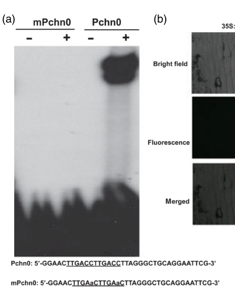

## Question

# Gene Research for Functional Annotation

## ⚠️ CRITICAL: Gene/Protein Identification Context

**BEFORE YOU BEGIN RESEARCH:** You MUST verify you are researching the CORRECT gene/protein. Gene symbols can be ambiguous, especially for less well-characterized genes from non-model organisms.

### Target Gene/Protein Identity (from UniProt):
- **UniProt Accession:** Q8S8P5
- **Protein Description:** RecName: Full=Probable WRKY transcription factor 33; AltName: Full=WRKY DNA-binding protein 33;
- **Gene Information:** Name=WRKY33; OrderedLocusNames=At2g38470; ORFNames=T19C21.4;
- **Organism (full):** Arabidopsis thaliana (Mouse-ear cress).
- **Protein Family:** Belongs to the WRKY group I family. .
- **Key Domains:** WRKY_dom. (IPR003657); WRKY_dom_sf. (IPR036576); WRKY_plant. (IPR044810); WRKY (PF03106)

### MANDATORY VERIFICATION STEPS:

1. **Check if the gene symbol "WRKY33" matches the protein description above**
2. **Verify the organism is correct:** Arabidopsis thaliana (Mouse-ear cress).
3. **Check if protein family/domains align with what you find in literature**
4. **If you find literature for a DIFFERENT gene with the same or similar symbol, STOP**

### If Gene Symbol is Ambiguous or You Cannot Find Relevant Literature:

**DO NOT PROCEED WITH RESEARCH ON A DIFFERENT GENE.** Instead:
- State clearly: "The gene symbol 'WRKY33' is ambiguous or literature is limited for this specific protein"
- Explain what you found (e.g., "Found extensive literature on a different gene with the same symbol in a different organism")
- Describe the protein based ONLY on the UniProt information provided above
- Suggest that the protein function can be inferred from domain/family information

### Research Target:

Please provide a comprehensive research report on the gene **WRKY33** (gene ID: WRKY33, UniProt: Q8S8P5) in ARATH.

The research report should be a detailed narrative explaining the function, biological processes, and localization of the gene product. Citations should be given for all claims.

You should prioritize authoritative reviews and primary scientific literature when conducting research. You can supplement
this with annotations you find in gene/protein databases, but these can be outdated or inaccurate.

We are specifically interested in the primary function of the gene - for enzymes, what reaction is catalyzed, and what is the substrate specificity? For transporters, what is the substrate? For structural proteins or adapters, what is the broader structural role? For signaling molecules, what is the role in the pathway.

We are interested in where in or outside the cell the gene product carries out its function.

We are also interested in the signaling or biochemical pathways in which the gene functions. We are less interested in broad pleiotropic effects, except where these elucidate the precise role.

Include evidence where possible. We are interested in both experimental evidence as well as inference from structure, evolution, or bioinformatic analysis. Precise studies should be prioritized over high-throughput, where available.

## Output

Question: You are an expert researcher providing comprehensive, well-cited information.

Provide detailed information focusing on:
1. Key concepts and definitions with current understanding
2. Recent developments and latest research (prioritize 2023-2024 sources)
3. Current applications and real-world implementations
4. Expert opinions and analysis from authoritative sources
5. Relevant statistics and data from recent studies

Format as a comprehensive research report with proper citations. Include URLs and publication dates where available.
Always prioritize recent, authoritative sources and provide specific citations for all major claims.

# Gene Research for Functional Annotation

## ⚠️ CRITICAL: Gene/Protein Identification Context

**BEFORE YOU BEGIN RESEARCH:** You MUST verify you are researching the CORRECT gene/protein. Gene symbols can be ambiguous, especially for less well-characterized genes from non-model organisms.

### Target Gene/Protein Identity (from UniProt):
- **UniProt Accession:** Q8S8P5
- **Protein Description:** RecName: Full=Probable WRKY transcription factor 33; AltName: Full=WRKY DNA-binding protein 33;
- **Gene Information:** Name=WRKY33; OrderedLocusNames=At2g38470; ORFNames=T19C21.4;
- **Organism (full):** Arabidopsis thaliana (Mouse-ear cress).
- **Protein Family:** Belongs to the WRKY group I family. .
- **Key Domains:** WRKY_dom. (IPR003657); WRKY_dom_sf. (IPR036576); WRKY_plant. (IPR044810); WRKY (PF03106)

### MANDATORY VERIFICATION STEPS:

1. **Check if the gene symbol "WRKY33" matches the protein description above**
2. **Verify the organism is correct:** Arabidopsis thaliana (Mouse-ear cress).
3. **Check if protein family/domains align with what you find in literature**
4. **If you find literature for a DIFFERENT gene with the same or similar symbol, STOP**

### If Gene Symbol is Ambiguous or You Cannot Find Relevant Literature:

**DO NOT PROCEED WITH RESEARCH ON A DIFFERENT GENE.** Instead:
- State clearly: "The gene symbol 'WRKY33' is ambiguous or literature is limited for this specific protein"
- Explain what you found (e.g., "Found extensive literature on a different gene with the same symbol in a different organism")
- Describe the protein based ONLY on the UniProt information provided above
- Suggest that the protein function can be inferred from domain/family information

### Research Target:

Please provide a comprehensive research report on the gene **WRKY33** (gene ID: WRKY33, UniProt: Q8S8P5) in ARATH.

The research report should be a detailed narrative explaining the function, biological processes, and localization of the gene product. Citations should be given for all claims.

You should prioritize authoritative reviews and primary scientific literature when conducting research. You can supplement
this with annotations you find in gene/protein databases, but these can be outdated or inaccurate.

We are specifically interested in the primary function of the gene - for enzymes, what reaction is catalyzed, and what is the substrate specificity? For transporters, what is the substrate? For structural proteins or adapters, what is the broader structural role? For signaling molecules, what is the role in the pathway.

We are interested in where in or outside the cell the gene product carries out its function.

We are also interested in the signaling or biochemical pathways in which the gene functions. We are less interested in broad pleiotropic effects, except where these elucidate the precise role.

Include evidence where possible. We are interested in both experimental evidence as well as inference from structure, evolution, or bioinformatic analysis. Precise studies should be prioritized over high-throughput, where available.

# Functional annotation of *Arabidopsis thaliana* WRKY33

**Identity and conclusion.** The target is *A. thaliana* **WRKY33, locus At2g38470**, corresponding to the user-supplied UniProt accession **Q8S8P5**. An Arabidopsis study explicitly identifies and clones At2g38470 as WRKY33; independent primary studies classify the protein as a **group I WRKY transcription factor with two WRKY DNA-binding domains**. The accession is retained from the supplied identification information; the accessible primary papers independently verify the locus, organism and protein class rather than the UniProt accession itself. This report does not transfer functional results from similarly named proteins in other species. (reyes2015thearabidopsisubiquitin pages 2-4, zheng2006arabidopsiswrky33transcription pages 8-9)

## Molecular function and site of action

WRKY33 is **not an enzyme or transporter**. Its primary molecular role is to bind regulatory DNA and activate or repress transcription according to the promoter and signaling context. The reported WRKY domains occupy approximately residues 177–234 and 354–412; the conserved WRKY/zinc-finger architecture agrees with its group I designation and the supplied domain annotations. Recombinant WRKY33 binds W-box-containing DNA in an electrophoretic mobility-shift assay: changing **TTGACC to TTGAAC** eliminates detectable binding. This establishes sequence-sensitive DNA recognition, not an enzymatic reaction or transported substrate. (zheng2006arabidopsiswrky33transcription pages 8-9, lai2011arabidopsissigmafactorbinding pages 5-6)

**WRKY33 functions principally in the nucleus.** A WRKY33–GFP fusion accumulated in the nucleus of onion epidermal cells, unlike diffuse GFP alone; nuclear interaction experiments and chromatin immunoprecipitation (ChIP) in plant tissue independently support nuclear protein complexes and promoter occupancy. The GFP experiment used a heterologous onion-cell localization assay, whereas the nuclear interaction and ChIP findings provide complementary evidence relevant to its activity in Arabidopsis. Nuclear/chloroplast dual targeting reported for its cofactors SIB1 and SIB2 should **not** be attributed to WRKY33. (zheng2006arabidopsiswrky33transcription pages 8-9, zheng2006arabidopsiswrky33transcription media 11b201f1, lai2011arabidopsissigmafactorbinding pages 3-4, qiu2008arabidopsismapkinase pages 4-4)

## Established pathway: immune signaling and camalexin

The best-supported biological function is **transcriptional coordination of defense against necrotrophic fungi**, especially *Botrytis cinerea* and *Alternaria brassicicola*. Independent WRKY33 loss-of-function mutants develop more extensive disease, while complementation restores resistance and constitutive expression increases resistance in laboratory assays. In one *Alternaria* experiment, mutant lesions produced approximately **three times as many spores** as wild-type lesions. During *Botrytis* infection, WRKY33 expression increased approximately **5.5-fold within 24 hours**. These are experimental Arabidopsis phenotypes, not evidence of a deployed crop-protection product. (zheng2006arabidopsiswrky33transcription pages 5-7, zheng2006arabidopsiswrky33transcription pages 2-3)

A mechanistic link is the **tryptophan-derived antimicrobial metabolite camalexin**. WRKY33 associates in vivo with promoter regions of **CYP71A13** and **PAD3/CYP71B15**, genes encoding camalexin-biosynthetic enzymes, and supports their timely induction. Following flg22 elicitation or pathogen infection, ChIP detects increased WRKY33 occupancy at *PAD3*; mutant expression analyses and promoter-reporter assays corroborate its regulatory role. **WRKY33 does not itself catalyze camalexin synthesis**: CYP71A13 and PAD3 perform biosynthetic reactions downstream of its transcriptional regulation. Importantly, the extent of camalexin dependence varies with assay conditions. A time-course study found **delayed, rather than permanently abolished**, camalexin accumulation in *wrky33* during *Botrytis* infection, consistent with compensation by other WRKY factors. Thus, camalexin regulation is a strong mechanistic function but should not be described as the sole explanation for fungal resistance. (qiu2008arabidopsismapkinase pages 3-4, birkenbihl2012arabidopsiswrky33is pages 14-18, birkenbihl2012arabidopsiswrky33is pages 18-22, zhou2020differentialphosphorylationof pages 1-4)

WRKY33 receives convergent upstream signals through **distinct kinase mechanisms**. In resting tissue, WRKY33 associates with the nuclear **MPK4–MKS1** complex; flg22 or infection remodels the complex and reduces MPK4 association, accompanying WRKY33 recruitment to *PAD3*. Separately, pathogen-responsive **MPK3/MPK6** phosphorylate an N-terminal cluster of five candidate serines—**Ser54, Ser59, Ser65, Ser72 and Ser85**—and enhance transcriptional activation rather than W-box affinity. A five-serine-to-alanine WRKY33 variant incompletely rescues infection-induced camalexin production despite substantial protein accumulation. **CPK5/CPK6** phosphorylate **Thr229**, increasing WRKY33 DNA binding; genetics and promoter-occupancy assays support cooperation between the calcium-dependent kinase and MAPK inputs. MPK4-dependent complex release, MPK3/6-dependent transactivation and CPK5/6-dependent DNA-binding enhancement are related but **not interchangeable** claims. (qiu2008arabidopsismapkinase pages 4-5, qiu2008arabidopsismapkinase pages 4-4, mao2011phosphorylationofa pages 4-5, mao2011phosphorylationofa pages 6-7, zhou2020differentialphosphorylationof pages 1-4, zhou2020differentialphosphorylationof pages 36-41)

Protein cofactors refine this response. The VQ proteins **SIB1 and SIB2** interact with WRKY33’s C-terminal WRKY domain **in the nucleus** and enhance its W-box binding in vitro. *sib1 sib2* plants are more susceptible to *Botrytis*, while SIB1 overexpression improves resistance only when WRKY33 is functional. SIB proteins also have chloroplast-targeting features, but deletion of SIB1’s chloroplast-targeting peptide did not abolish the tested defense effect. WRKY33 additionally binds its own promoter in ChIP experiments, supporting a possible **positive-feedback loop** during immune activation. (lai2011arabidopsissigmafactorbinding pages 3-4, lai2011arabidopsissigmafactorbinding pages 10-11, lai2011arabidopsissigmafactorbinding pages 5-6, mao2011phosphorylationofa pages 7-8)

## Hormonal defense regulation: a qualified interpretation

WRKY33 is more than a switch for a single defense hormone. During *Botrytis* infection, loss of WRKY33 causes inappropriate **salicylic-acid (SA)** accumulation and signaling, followed by suppression of **jasmonate (JA)** responses. WRKY33 occupies W-box-containing promoters of the JA-signaling repressors **JAZ1** and **JAZ5**; their increased expression in mutants is consistent with direct negative regulation. Other infection-associated targets include **ORA59**, involved in JA/ethylene signaling, and the redox gene **TRX-H5**. Crucially, eliminating SA biosynthesis or disrupting the SA regulator NPR1 **does not restore wild-type fungal resistance** in *wrky33* double mutants. Therefore, SA–JA antagonism contributes to the phenotype but does not fully explain it. (birkenbihl2012arabidopsiswrky33is pages 18-22, birkenbihl2012arabidopsiswrky33is pages 11-14)

The pathogen context also matters: the initial genetic study found no clear change in mutant response to virulent *Pseudomonas syringae*, yet constitutive WRKY33 overexpression **increased susceptibility** to that bacterium and reduced induction of the SA-responsive marker *PR1*. Increased WRKY33 expression therefore cannot be assumed to improve resistance against every pathogen. (zheng2006arabidopsiswrky33transcription pages 1-2, zheng2006arabidopsiswrky33transcription pages 8-9)

## Recent advance: phosphate status and anthocyanin metabolism

A **May 2024 primary study** established a second, promoter-resolved role for Arabidopsis WRKY33. Under phosphate-sufficient conditions, WRKY33 binds W-box-containing regions of the **DFR** promoter and represses this anthocyanin-biosynthetic gene. Yeast one-hybrid, in-vitro DNA-binding and Arabidopsis ChIP assays support the promoter interaction. WRKY33 also interacts with **PAP1** and interferes with activation by the PAP1–TT8–TTG1 transcription-factor complex. In a transient reporter assay, that complex activated the *DFR* promoter **4.6-fold**, and WRKY33 reduced its activation by **43%**. These values describe the reporter experiment, **not** whole-plant anthocyanin concentrations. (tao2024wrky33negativelyregulates pages 4-6)

Under phosphate starvation, WRKY33 protein abundance and its occupancy at *DFR* decrease, easing repression and permitting anthocyanin accumulation. The phosphate-response regulator **PHR1** physically interacts with WRKY33; genetic tests, protein-turnover experiments and promoter assays support PHR1-dependent attenuation of WRKY33’s inhibitory effect. The authors’ more detailed model—PHR1 sequestration and regulation of WRKY33 turnover—remains partly inferential; the responsible turnover machinery was not identified. This result is a **context-dependent repressive function**, not a reversal of WRKY33’s established immune role. [Tao *et al.*, *Plant Communications*, **13 May 2024**; https://doi.org/10.1016/j.xplc.2024.100821.] (tao2024wrky33negativelyregulates pages 8-10, tao2024wrky33negativelyregulates pages 4-6)

A separate root study found that WRKY33 restrains phosphate-deficiency-induced expression of **ALMT1**, a malate-transporter gene. Under low phosphate, *wrky33* mutants show greater root-tip iron accumulation, stronger primary-root inhibition and more root-hair development; genetic interactions with *almt1* and *stop1* support the ALMT1/iron-dependent mechanism. **Direct binding of WRKY33 to the ALMT1 promoter was not established** in that study, and mutant root and shoot phosphate contents were similar to wild type. WRKY33 should consequently be annotated here as a regulator of **local root remodeling**, not as a demonstrated phosphate transporter or a proven direct suppressor of phosphate uptake. [Shen *et al.*, *International Journal of Molecular Sciences*, **August 2021**; https://doi.org/10.3390/ijms22179275.] (shen2021transcriptionfactorwrky33 pages 11-13, shen2021transcriptionfactorwrky33 pages 2-4)

## Research use, scope and key references

Current **demonstrated applications are experimental**: mutant/complementation analysis of fungal resistance, WRKY33 phosphorylation-site engineering, promoter reporters, ChIP assays, and phosphate-response studies. Together, the fungal-resistance and nutrient-response experiments make WRKY33 a plausible target for mechanistic crop research, but the cited studies do **not** establish field performance, yield benefits or commercial deployment of the Arabidopsis gene. The 2023–2024 review literature provides broader stress-response context; the strongest gene-specific causal evidence remains the primary studies above, particularly the 2024 phosphate/anthocyanin work. (zheng2006arabidopsiswrky33transcription pages 5-7, wang2023advancesinthe pages 7-8, li2024wrkytranscriptionfactors pages 7-8, tao2024wrky33negativelyregulates pages 4-6)

**Selected primary publications, with publication dates and URLs:** Zheng *et al.*, *The Plant Journal* (**November 2006**), https://doi.org/10.1111/j.1365-313x.2006.02901.x; Qiu *et al.*, *The EMBO Journal* (**August 2008**), https://doi.org/10.1038/emboj.2008.147; Mao *et al.*, *The Plant Cell* (**April 2011**), https://doi.org/10.1105/tpc.111.084996; Lai *et al.*, *The Plant Cell* (**October 2011**), https://doi.org/10.1105/tpc.111.090571; Birkenbihl *et al.*, *Plant Physiology* (**March 2012**), https://doi.org/10.1104/pp.111.192641; Zhou *et al.*, *The Plant Cell* (**2020**, advance publication **May 21**), https://doi.org/10.1105/tpc.19.00971; Tao *et al.*, *Plant Communications* (**May 13, 2024**), https://doi.org/10.1016/j.xplc.2024.100821. (zheng2006arabidopsiswrky33transcription pages 8-9, qiu2008arabidopsismapkinase pages 3-4, mao2011phosphorylationofa pages 4-5, lai2011arabidopsissigmafactorbinding pages 3-4, birkenbihl2012arabidopsiswrky33is pages 18-22, zhou2020differentialphosphorylationof pages 1-4, tao2024wrky33negativelyregulates pages 4-6)

References

1. (reyes2015thearabidopsisubiquitin pages 2-4): Thais Huarancca Reyes, Shugo Maekawa, Takeo Sato, and Junji Yamaguchi. The arabidopsis ubiquitin ligase atl31 is transcriptionally controlled by wrky33 transcription factor in response to pathogen attack. Plant Biotechnology, 32:11-19, Mar 2015. URL: https://doi.org/10.5511/plantbiotechnology.14.1201b, doi:10.5511/plantbiotechnology.14.1201b. This article has 19 citations and is from a peer-reviewed journal.

2. (zheng2006arabidopsiswrky33transcription pages 8-9): Zuyu Zheng, Synan Abu Qamar, Zhixiang Chen, and Tesfaye Mengiste. Arabidopsis wrky33 transcription factor is required for resistance to necrotrophic fungal pathogens. The Plant journal : for cell and molecular biology, 48 4:592-605, Nov 2006. URL: https://doi.org/10.1111/j.1365-313x.2006.02901.x, doi:10.1111/j.1365-313x.2006.02901.x. This article has 1105 citations.

3. (lai2011arabidopsissigmafactorbinding pages 5-6): Zhibing Lai, Ying Li, Fei Wang, Yuan Cheng, Baofang Fan, Jing-Quan Yu, and Zhixiang Chen. <i>arabidopsis</i>sigma factor binding proteins are activators of the wrky33 transcription factor in plant defense. The Plant Cell, 23(10):3824-3841, Oct 2011. URL: https://doi.org/10.1105/tpc.111.090571, doi:10.1105/tpc.111.090571. This article has 385 citations.

4. (zheng2006arabidopsiswrky33transcription media 11b201f1): Zuyu Zheng, Synan Abu Qamar, Zhixiang Chen, and Tesfaye Mengiste. Arabidopsis wrky33 transcription factor is required for resistance to necrotrophic fungal pathogens. The Plant journal : for cell and molecular biology, 48 4:592-605, Nov 2006. URL: https://doi.org/10.1111/j.1365-313x.2006.02901.x, doi:10.1111/j.1365-313x.2006.02901.x. This article has 1105 citations.

5. (lai2011arabidopsissigmafactorbinding pages 3-4): Zhibing Lai, Ying Li, Fei Wang, Yuan Cheng, Baofang Fan, Jing-Quan Yu, and Zhixiang Chen. <i>arabidopsis</i>sigma factor binding proteins are activators of the wrky33 transcription factor in plant defense. The Plant Cell, 23(10):3824-3841, Oct 2011. URL: https://doi.org/10.1105/tpc.111.090571, doi:10.1105/tpc.111.090571. This article has 385 citations.

6. (qiu2008arabidopsismapkinase pages 4-4): Jin-Long Qiu, Berthe Katrine Fiil, Klaus Petersen, Henrik Bjørn Nielsen, Christopher J Botanga, Stephan Thorgrimsen, Kristoffer Palma, Maria Cristina Suarez-Rodriguez, Signe Sandbech-Clausen, Jacek Lichota, Peter Brodersen, Klaus D Grasser, Ole Mattsson, Jane Glazebrook, John Mundy, and Morten Petersen. Arabidopsis map kinase 4 regulates gene expression through transcription factor release in the nucleus. The EMBO Journal, 27:2214-2221, Aug 2008. URL: https://doi.org/10.1038/emboj.2008.147, doi:10.1038/emboj.2008.147. This article has 614 citations.

7. (zheng2006arabidopsiswrky33transcription pages 5-7): Zuyu Zheng, Synan Abu Qamar, Zhixiang Chen, and Tesfaye Mengiste. Arabidopsis wrky33 transcription factor is required for resistance to necrotrophic fungal pathogens. The Plant journal : for cell and molecular biology, 48 4:592-605, Nov 2006. URL: https://doi.org/10.1111/j.1365-313x.2006.02901.x, doi:10.1111/j.1365-313x.2006.02901.x. This article has 1105 citations.

8. (zheng2006arabidopsiswrky33transcription pages 2-3): Zuyu Zheng, Synan Abu Qamar, Zhixiang Chen, and Tesfaye Mengiste. Arabidopsis wrky33 transcription factor is required for resistance to necrotrophic fungal pathogens. The Plant journal : for cell and molecular biology, 48 4:592-605, Nov 2006. URL: https://doi.org/10.1111/j.1365-313x.2006.02901.x, doi:10.1111/j.1365-313x.2006.02901.x. This article has 1105 citations.

9. (qiu2008arabidopsismapkinase pages 3-4): Jin-Long Qiu, Berthe Katrine Fiil, Klaus Petersen, Henrik Bjørn Nielsen, Christopher J Botanga, Stephan Thorgrimsen, Kristoffer Palma, Maria Cristina Suarez-Rodriguez, Signe Sandbech-Clausen, Jacek Lichota, Peter Brodersen, Klaus D Grasser, Ole Mattsson, Jane Glazebrook, John Mundy, and Morten Petersen. Arabidopsis map kinase 4 regulates gene expression through transcription factor release in the nucleus. The EMBO Journal, 27:2214-2221, Aug 2008. URL: https://doi.org/10.1038/emboj.2008.147, doi:10.1038/emboj.2008.147. This article has 614 citations.

10. (birkenbihl2012arabidopsiswrky33is pages 14-18): Rainer P. Birkenbihl, Celia Diezel, and Imre E. Somssich. Arabidopsis wrky33 is a key transcriptional regulator of hormonal and metabolic responses toward <i>botrytis cinerea</i> infection. Plant Physiology, 159(1):266-285, Mar 2012. URL: https://doi.org/10.1104/pp.111.192641, doi:10.1104/pp.111.192641. This article has 690 citations and is from a highest quality peer-reviewed journal.

11. (birkenbihl2012arabidopsiswrky33is pages 18-22): Rainer P. Birkenbihl, Celia Diezel, and Imre E. Somssich. Arabidopsis wrky33 is a key transcriptional regulator of hormonal and metabolic responses toward <i>botrytis cinerea</i> infection. Plant Physiology, 159(1):266-285, Mar 2012. URL: https://doi.org/10.1104/pp.111.192641, doi:10.1104/pp.111.192641. This article has 690 citations and is from a highest quality peer-reviewed journal.

12. (zhou2020differentialphosphorylationof pages 1-4): Jinggeng Zhou, Xiaoyang Wang, Yunxia He, Tian Sang, Pengcheng Wang, Shaojun Dai, Shuqun Zhang, and Xiang-Zong Meng. Differential phosphorylation of the transcription factor wrky33 by the protein kinases cpk5/cpk6 and mpk3/mpk6 cooperatively regulates camalexin biosynthesis in arabidopsis. The Plant Cell, 32:2621-2638, May 2020. URL: https://doi.org/10.1105/tpc.19.00971, doi:10.1105/tpc.19.00971. This article has 262 citations.

13. (qiu2008arabidopsismapkinase pages 4-5): Jin-Long Qiu, Berthe Katrine Fiil, Klaus Petersen, Henrik Bjørn Nielsen, Christopher J Botanga, Stephan Thorgrimsen, Kristoffer Palma, Maria Cristina Suarez-Rodriguez, Signe Sandbech-Clausen, Jacek Lichota, Peter Brodersen, Klaus D Grasser, Ole Mattsson, Jane Glazebrook, John Mundy, and Morten Petersen. Arabidopsis map kinase 4 regulates gene expression through transcription factor release in the nucleus. The EMBO Journal, 27:2214-2221, Aug 2008. URL: https://doi.org/10.1038/emboj.2008.147, doi:10.1038/emboj.2008.147. This article has 614 citations.

14. (mao2011phosphorylationofa pages 4-5): Guo-Hong Mao, Xiang-Zong Meng, Yidong Liu, Zu-Yu Zheng, Zhi-Xiang Chen, and Shuqun Zhang. Phosphorylation of a wrky transcription factor by two pathogen-responsive mapks drives phytoalexin biosynthesis in <i>arabidopsis</i>. The Plant Cell, 23:1639-1653, Apr 2011. URL: https://doi.org/10.1105/tpc.111.084996, doi:10.1105/tpc.111.084996. This article has 1056 citations.

15. (mao2011phosphorylationofa pages 6-7): Guo-Hong Mao, Xiang-Zong Meng, Yidong Liu, Zu-Yu Zheng, Zhi-Xiang Chen, and Shuqun Zhang. Phosphorylation of a wrky transcription factor by two pathogen-responsive mapks drives phytoalexin biosynthesis in <i>arabidopsis</i>. The Plant Cell, 23:1639-1653, Apr 2011. URL: https://doi.org/10.1105/tpc.111.084996, doi:10.1105/tpc.111.084996. This article has 1056 citations.

16. (zhou2020differentialphosphorylationof pages 36-41): Jinggeng Zhou, Xiaoyang Wang, Yunxia He, Tian Sang, Pengcheng Wang, Shaojun Dai, Shuqun Zhang, and Xiang-Zong Meng. Differential phosphorylation of the transcription factor wrky33 by the protein kinases cpk5/cpk6 and mpk3/mpk6 cooperatively regulates camalexin biosynthesis in arabidopsis. The Plant Cell, 32:2621-2638, May 2020. URL: https://doi.org/10.1105/tpc.19.00971, doi:10.1105/tpc.19.00971. This article has 262 citations.

17. (lai2011arabidopsissigmafactorbinding pages 10-11): Zhibing Lai, Ying Li, Fei Wang, Yuan Cheng, Baofang Fan, Jing-Quan Yu, and Zhixiang Chen. <i>arabidopsis</i>sigma factor binding proteins are activators of the wrky33 transcription factor in plant defense. The Plant Cell, 23(10):3824-3841, Oct 2011. URL: https://doi.org/10.1105/tpc.111.090571, doi:10.1105/tpc.111.090571. This article has 385 citations.

18. (mao2011phosphorylationofa pages 7-8): Guo-Hong Mao, Xiang-Zong Meng, Yidong Liu, Zu-Yu Zheng, Zhi-Xiang Chen, and Shuqun Zhang. Phosphorylation of a wrky transcription factor by two pathogen-responsive mapks drives phytoalexin biosynthesis in <i>arabidopsis</i>. The Plant Cell, 23:1639-1653, Apr 2011. URL: https://doi.org/10.1105/tpc.111.084996, doi:10.1105/tpc.111.084996. This article has 1056 citations.

19. (birkenbihl2012arabidopsiswrky33is pages 11-14): Rainer P. Birkenbihl, Celia Diezel, and Imre E. Somssich. Arabidopsis wrky33 is a key transcriptional regulator of hormonal and metabolic responses toward <i>botrytis cinerea</i> infection. Plant Physiology, 159(1):266-285, Mar 2012. URL: https://doi.org/10.1104/pp.111.192641, doi:10.1104/pp.111.192641. This article has 690 citations and is from a highest quality peer-reviewed journal.

20. (zheng2006arabidopsiswrky33transcription pages 1-2): Zuyu Zheng, Synan Abu Qamar, Zhixiang Chen, and Tesfaye Mengiste. Arabidopsis wrky33 transcription factor is required for resistance to necrotrophic fungal pathogens. The Plant journal : for cell and molecular biology, 48 4:592-605, Nov 2006. URL: https://doi.org/10.1111/j.1365-313x.2006.02901.x, doi:10.1111/j.1365-313x.2006.02901.x. This article has 1105 citations.

21. (tao2024wrky33negativelyregulates pages 4-6): Han Tao, Fei Gao, Linying Li, Yuqing He, Xueying Zhang, Mengyu Wang, Jia Wei, Yao Zhao, Chi Zhang, Qiaomei Wang, and Gaojie Hong. Wrky33 negatively regulates anthocyanin biosynthesis and cooperates with phr1 to mediate acclimation to phosphate starvation. May 2024. URL: https://doi.org/10.1016/j.xplc.2024.100821, doi:10.1016/j.xplc.2024.100821. This article has 73 citations and is from a peer-reviewed journal.

22. (tao2024wrky33negativelyregulates pages 8-10): Han Tao, Fei Gao, Linying Li, Yuqing He, Xueying Zhang, Mengyu Wang, Jia Wei, Yao Zhao, Chi Zhang, Qiaomei Wang, and Gaojie Hong. Wrky33 negatively regulates anthocyanin biosynthesis and cooperates with phr1 to mediate acclimation to phosphate starvation. May 2024. URL: https://doi.org/10.1016/j.xplc.2024.100821, doi:10.1016/j.xplc.2024.100821. This article has 73 citations and is from a peer-reviewed journal.

23. (shen2021transcriptionfactorwrky33 pages 11-13): Nuo Shen, Sifan Hou, Guoqing Tu, Wenzhi Lan, and Yan-Ping Jing. Transcription factor wrky33 mediates the phosphate deficiency-induced remodeling of root architecture by modulating iron homeostasis in arabidopsis roots. International Journal of Molecular Sciences, 22:9275, Aug 2021. URL: https://doi.org/10.3390/ijms22179275, doi:10.3390/ijms22179275. This article has 40 citations.

24. (shen2021transcriptionfactorwrky33 pages 2-4): Nuo Shen, Sifan Hou, Guoqing Tu, Wenzhi Lan, and Yan-Ping Jing. Transcription factor wrky33 mediates the phosphate deficiency-induced remodeling of root architecture by modulating iron homeostasis in arabidopsis roots. International Journal of Molecular Sciences, 22:9275, Aug 2021. URL: https://doi.org/10.3390/ijms22179275, doi:10.3390/ijms22179275. This article has 40 citations.

25. (wang2023advancesinthe pages 7-8): Hongli Wang, Xi Cheng, Dongmei Yin, Dongliang Chen, Chang Luo, Hua Liu, and Conglin Huang. Advances in the research on plant wrky transcription factors responsive to external stresses. Current Issues in Molecular Biology, 45:2861-2880, Apr 2023. URL: https://doi.org/10.3390/cimb45040187, doi:10.3390/cimb45040187. This article has 84 citations.

26. (li2024wrkytranscriptionfactors pages 7-8): Shenglin Li, Muneer Ahmed Khoso, He Xu, Chao Zhang, Ziyang Liu, Sindho Wagan, Khuzin Dinislam, and Lijie Liu. Wrky transcription factors (tfs) as key regulators of plant resilience to environmental stresses: current perspective. Agronomy, 14:2421, Oct 2024. URL: https://doi.org/10.3390/agronomy14102421, doi:10.3390/agronomy14102421. This article has 99 citations and is from a peer-reviewed journal.

## Artifacts

## Citations

1. reyes2015thearabidopsisubiquitin pages 2-4
2. lai2011arabidopsissigmafactorbinding pages 5-6
3. lai2011arabidopsissigmafactorbinding pages 3-4
4. qiu2008arabidopsismapkinase pages 4-4
5. qiu2008arabidopsismapkinase pages 3-4
6. zhou2020differentialphosphorylationof pages 1-4
7. qiu2008arabidopsismapkinase pages 4-5
8. mao2011phosphorylationofa pages 4-5
9. mao2011phosphorylationofa pages 6-7
10. zhou2020differentialphosphorylationof pages 36-41
11. lai2011arabidopsissigmafactorbinding pages 10-11
12. mao2011phosphorylationofa pages 7-8
13. wang2023advancesinthe pages 7-8
14. li2024wrkytranscriptionfactors pages 7-8
15. Tao *et al.*, *Plant Communications*, **13 May 2024**; https://doi.org/10.1016/j.xplc.2024.100821.
16. Shen *et al.*, *International Journal of Molecular Sciences*, **August 2021**; https://doi.org/10.3390/ijms22179275.
17. https://doi.org/10.1016/j.xplc.2024.100821.]
18. https://doi.org/10.3390/ijms22179275.]
19. https://doi.org/10.1111/j.1365-313x.2006.02901.x;
20. https://doi.org/10.1038/emboj.2008.147;
21. https://doi.org/10.1105/tpc.111.084996;
22. https://doi.org/10.1105/tpc.111.090571;
23. https://doi.org/10.1104/pp.111.192641;
24. https://doi.org/10.1105/tpc.19.00971;
25. https://doi.org/10.1016/j.xplc.2024.100821.
26. https://doi.org/10.5511/plantbiotechnology.14.1201b,
27. https://doi.org/10.1111/j.1365-313x.2006.02901.x,
28. https://doi.org/10.1105/tpc.111.090571,
29. https://doi.org/10.1038/emboj.2008.147,
30. https://doi.org/10.1104/pp.111.192641,
31. https://doi.org/10.1105/tpc.19.00971,
32. https://doi.org/10.1105/tpc.111.084996,
33. https://doi.org/10.1016/j.xplc.2024.100821,
34. https://doi.org/10.3390/ijms22179275,
35. https://doi.org/10.3390/cimb45040187,
36. https://doi.org/10.3390/agronomy14102421,