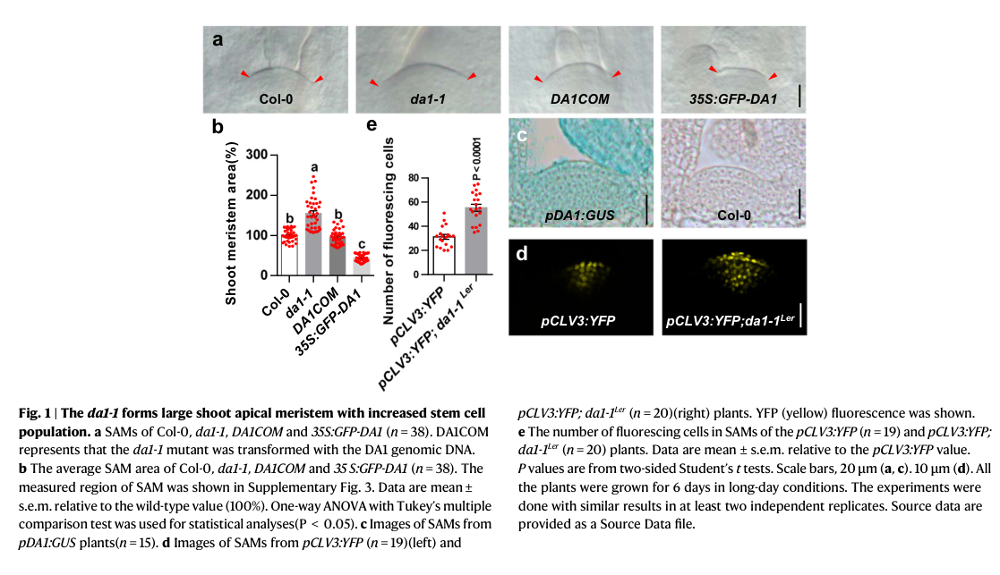

## Question

# Gene Research for Functional Annotation

## ⚠️ CRITICAL: Gene/Protein Identification Context

**BEFORE YOU BEGIN RESEARCH:** You MUST verify you are researching the CORRECT gene/protein. Gene symbols can be ambiguous, especially for less well-characterized genes from non-model organisms.

### Target Gene/Protein Identity (from UniProt):
- **UniProt Accession:** Q9SB92
- **Protein Description:** RecName: Full=Protein WUSCHEL; Short=AtWUS; AltName: Full=Plant growth activator 6;
- **Gene Information:** Name=WUS; Synonyms=PGA6; OrderedLocusNames=At2g17950; ORFNames=T27K22.18;
- **Organism (full):** Arabidopsis thaliana (Mouse-ear cress).
- **Protein Family:** Belongs to the WUS homeobox family. .
- **Key Domains:** HD. (IPR001356); Homeodomain-like_sf. (IPR009057); WUSCHEL-like. (IPR044555); Homeodomain (PF00046)

### MANDATORY VERIFICATION STEPS:

1. **Check if the gene symbol "WUS" matches the protein description above**
2. **Verify the organism is correct:** Arabidopsis thaliana (Mouse-ear cress).
3. **Check if protein family/domains align with what you find in literature**
4. **If you find literature for a DIFFERENT gene with the same or similar symbol, STOP**

### If Gene Symbol is Ambiguous or You Cannot Find Relevant Literature:

**DO NOT PROCEED WITH RESEARCH ON A DIFFERENT GENE.** Instead:
- State clearly: "The gene symbol 'WUS' is ambiguous or literature is limited for this specific protein"
- Explain what you found (e.g., "Found extensive literature on a different gene with the same symbol in a different organism")
- Describe the protein based ONLY on the UniProt information provided above
- Suggest that the protein function can be inferred from domain/family information

### Research Target:

Please provide a comprehensive research report on the gene **WUS** (gene ID: WUS, UniProt: Q9SB92) in ARATH.

The research report should be a detailed narrative explaining the function, biological processes, and localization of the gene product. Citations should be given for all claims.

You should prioritize authoritative reviews and primary scientific literature when conducting research. You can supplement
this with annotations you find in gene/protein databases, but these can be outdated or inaccurate.

We are specifically interested in the primary function of the gene - for enzymes, what reaction is catalyzed, and what is the substrate specificity? For transporters, what is the substrate? For structural proteins or adapters, what is the broader structural role? For signaling molecules, what is the role in the pathway.

We are interested in where in or outside the cell the gene product carries out its function.

We are also interested in the signaling or biochemical pathways in which the gene functions. We are less interested in broad pleiotropic effects, except where these elucidate the precise role.

Include evidence where possible. We are interested in both experimental evidence as well as inference from structure, evolution, or bioinformatic analysis. Precise studies should be prioritized over high-throughput, where available.

## Output

Question: You are an expert researcher providing comprehensive, well-cited information.

Provide detailed information focusing on:
1. Key concepts and definitions with current understanding
2. Recent developments and latest research (prioritize 2023-2024 sources)
3. Current applications and real-world implementations
4. Expert opinions and analysis from authoritative sources
5. Relevant statistics and data from recent studies

Format as a comprehensive research report with proper citations. Include URLs and publication dates where available.
Always prioritize recent, authoritative sources and provide specific citations for all major claims.

# Gene Research for Functional Annotation

## ⚠️ CRITICAL: Gene/Protein Identification Context

**BEFORE YOU BEGIN RESEARCH:** You MUST verify you are researching the CORRECT gene/protein. Gene symbols can be ambiguous, especially for less well-characterized genes from non-model organisms.

### Target Gene/Protein Identity (from UniProt):
- **UniProt Accession:** Q9SB92
- **Protein Description:** RecName: Full=Protein WUSCHEL; Short=AtWUS; AltName: Full=Plant growth activator 6;
- **Gene Information:** Name=WUS; Synonyms=PGA6; OrderedLocusNames=At2g17950; ORFNames=T27K22.18;
- **Organism (full):** Arabidopsis thaliana (Mouse-ear cress).
- **Protein Family:** Belongs to the WUS homeobox family. .
- **Key Domains:** HD. (IPR001356); Homeodomain-like_sf. (IPR009057); WUSCHEL-like. (IPR044555); Homeodomain (PF00046)

### MANDATORY VERIFICATION STEPS:

1. **Check if the gene symbol "WUS" matches the protein description above**
2. **Verify the organism is correct:** Arabidopsis thaliana (Mouse-ear cress).
3. **Check if protein family/domains align with what you find in literature**
4. **If you find literature for a DIFFERENT gene with the same or similar symbol, STOP**

### If Gene Symbol is Ambiguous or You Cannot Find Relevant Literature:

**DO NOT PROCEED WITH RESEARCH ON A DIFFERENT GENE.** Instead:
- State clearly: "The gene symbol 'WUS' is ambiguous or literature is limited for this specific protein"
- Explain what you found (e.g., "Found extensive literature on a different gene with the same symbol in a different organism")
- Describe the protein based ONLY on the UniProt information provided above
- Suggest that the protein function can be inferred from domain/family information

### Research Target:

Please provide a comprehensive research report on the gene **WUS** (gene ID: WUS, UniProt: Q9SB92) in ARATH.

The research report should be a detailed narrative explaining the function, biological processes, and localization of the gene product. Citations should be given for all claims.

You should prioritize authoritative reviews and primary scientific literature when conducting research. You can supplement
this with annotations you find in gene/protein databases, but these can be outdated or inaccurate.

We are specifically interested in the primary function of the gene - for enzymes, what reaction is catalyzed, and what is the substrate specificity? For transporters, what is the substrate? For structural proteins or adapters, what is the broader structural role? For signaling molecules, what is the role in the pathway.

We are interested in where in or outside the cell the gene product carries out its function.

We are also interested in the signaling or biochemical pathways in which the gene functions. We are less interested in broad pleiotropic effects, except where these elucidate the precise role.

Include evidence where possible. We are interested in both experimental evidence as well as inference from structure, evolution, or bioinformatic analysis. Precise studies should be prioritized over high-throughput, where available.

## Research report: Functional annotation of **WUSCHEL (WUS; AtWUS; PGA6)** in *Arabidopsis thaliana*

### Executive summary
**WUSCHEL (WUS)** (UniProt **Q9SB92**, locus **At2g17950**) encodes a **WOX/WUS homeobox-family transcription factor** that acts as the central organizer of the **shoot apical meristem (SAM) stem-cell niche**. WUS is **expressed in the organizing center (OC)/rib meristem**, but its **protein moves intercellularly** (via plasmodesmata) into overlying stem cells, where it **promotes stem-cell fate and activates CLAVATA3 (CLV3)**. CLV3 peptide signaling through multiple, partially redundant receptor complexes restricts WUS, forming a canonical **CLV–WUS negative feedback loop** that stabilizes meristem size and stem-cell number. Recent work (2023–2024) has added important mechanistic layers, notably **post-translational control of WUS stability by the DA1 peptidase** and a clearer systems-level view of **receptor redundancy/buffering** and its coupling to auxin responsiveness. (demesaarevalo2024intercellularcommunicationin pages 4-6, cui2024thepeptidaseda1 pages 1-2, yadav2011wuschelproteinmovement pages 2-3, brand2002regulationofclv3 pages 1-2, john2023anetworkof pages 6-7)

---

### 1) Target verification and key definitions (gene/protein identity)
**Identity match to UniProt Q9SB92.** The literature retrieved and analyzed consistently describes **WUSCHEL (WUS)** in **
*Arabidopsis thaliana*** as a **homeodomain transcription factor** required for shoot stem-cell maintenance. In foundational work, WUS was explicitly described as a **nuclear-localized homeodomain protein** that promotes stem-cell formation/maintenance and lies within the negative feedback loop with CLV signaling. (brand2002regulationofclv3 pages 1-2)

**Domain/function concepts used for functional annotation.** Experimental mapping and mechanistic studies support that WUS contains:
- a **homeodomain** for DNA binding;
- additional regulatory motifs including a **WUS-box** and an **EAR(-like) motif**, with the latter implicated in repression and (in later work) nuclear export and stability control;
- additional regulatory regions (e.g., an acidic domain) that can contribute to partner interactions (e.g., STM binding). (su2020integrationofpluripotency pages 1-2, cui2024thepeptidaseda1 pages 3-4)

**Key developmental definitions (current understanding).**
- **Shoot apical meristem (SAM):** a dome-shaped tissue producing aerial organs through a balance of stem-cell self-renewal and differentiation.
- **Organizing center (OC):** a basal SAM domain that acts as a signaling/organizing niche; **WUS expression defines the OC**.
- **Central zone (CZ):** apical domain containing stem cells; **CLV3** is expressed in CZ stem cells and restricts WUS, closing the feedback loop.
These concepts are summarized in recent authoritative synthesis on intercellular communication in shoot meristems. (demesaarevalo2024intercellularcommunicationin pages 3-4, demesaarevalo2024intercellularcommunicationin pages 4-6)

---

### 2) Primary molecular function: what WUS does
**Core molecular role:** WUS functions as a transcription factor that **maintains stem-cell identity** and positions/controls the stem-cell niche by regulating gene expression in a non-cell-autonomous manner. (demesaarevalo2024intercellularcommunicationin pages 3-4, brand2002regulationofclv3 pages 1-2)

**Direct activation of CLV3 as a key output.** A central experimentally supported output of WUS is activation of **CLV3**, which then signals back to restrict WUS.
- In a key primary study, a Dex-inducible WUS system showed **CLV3 transcript induction within 4 hours**, and critically the induction occurred **even in the presence of cycloheximide**, supporting a direct transcriptional effect (or very immediate early regulation). (yadav2011wuschelproteinmovement pages 2-3)

**Integration with other transcription factors.** WUS does not act alone:
- **WUS–STM interaction:** WUS physically interacts with **SHOOT MERISTEMLESS (STM)** (pull-down, yeast two-hybrid, BiFC, co-IP). Functionally, STM enhances WUS action at the CLV3 promoter; induction experiments support rapid CLV3 upregulation and genetic analyses demonstrate strong effects of combined pathway perturbation. (su2020integrationofpluripotency pages 1-2, su2020integrationofpluripotency pages 2-4)
- **WUS–HAM interaction:** WUS function is spatially constrained by **HAIRY MERISTEM (HAM)** proteins; evidence supports that WUS activates CLV3 only where HAM is absent, thereby confining CLV3 expression to appropriate apical layers. (zhou2018hairymeristemwith pages 1-2)

---

### 3) Localization and where the gene product acts
**Subcellular localization (nucleus).** WUS was described early as a **nuclear-localized homeodomain protein**, consistent with transcription factor function. (brand2002regulationofclv3 pages 1-2)

**Tissue/cellular localization (OC expression; CZ action).** WUS is **transcribed in a small basal OC domain**, but its protein acts beyond that domain.

**Intercellular movement and gradient formation.** WUS protein is **mobile**, forming a gradient from the OC/rib meristem into adjacent/apical cells:
- A functional fluorescent fusion (**pWUS::eGFP-WUS**) rescued mutant phenotype and revealed a gradient with strongest signal in OC/rib meristem and weaker in adjacent layers.
- Movement occurs laterally by **at least two cell layers**, and adding an NLS **inhibits movement**, consistent with a requirement for cytoplasmic availability and **plasmodesmata-mediated transport**.
- In a clv3 mutant background, WUS protein expansion into L1 and radial expansion were observed, linking CLV signaling to spatial confinement of the WUS gradient. (yadav2011wuschelproteinmovement pages 2-3)

---

### 4) Pathways and regulatory network context
#### 4.1 CLV–WUS feedback loop (canonical pathway)
The CLV–WUS feedback loop is widely accepted as the core SAM stem-cell homeostasis circuit:
- WUS promotes stem-cell fate and induces **CLV3** in stem cells.
- **CLV3 peptide** signaling restricts WUS expression and/or domain size through receptor-mediated signaling.
Recent authoritative review emphasizes that CLV3 is processed to a **12–13 amino-acid peptide** and can be post-translationally modified (e.g., hydroxylation, arabinosylation), potentially affecting receptor specificity and signaling robustness. (demesaarevalo2024intercellularcommunicationin pages 4-6)

#### 4.2 Receptor redundancy and buffering (systems-level robustness)
Recent synthesis highlights that CLV3 is perceived by **multiple partially redundant receptor systems**, including **CLV1 (with CIK co-receptors), RPK2, and the CLV2–CRN complex**, and downstream modules (e.g., RLCKs such as PBL34; PP2C phosphatases such as POL) that help switch signaling states and buffer fluctuations. (demesaarevalo2024intercellularcommunicationin pages 4-6)

A 2023 study focusing on receptor networks and auxin-related phenotypes found that **inflorescence meristem termination phenotypes can occur despite appropriate WUS expression**, suggesting that CLV receptor networks can couple meristem maintenance to other processes (notably mitotic activity and auxin responsiveness) beyond simply turning WUS on/off.
- In “primary inflorescence termination (PIT)” in clv1 at cool temperatures, meristems **still expressed WUS appropriately** in OC cells and retained normal dome organization, but showed **reduced mitotic activity** (CYCLINB1;2 reporter) and **reduced auxin signaling output** (DR5::GFP nearly undetectable; DII-Venus increased). (john2023anetworkof pages 6-7)

---

### 5) Recent developments (prioritizing 2023–2024)
#### 5.1 2024: DA1 peptidase cleaves and destabilizes WUS (post-translational regulation)
A major 2024 advance identified direct post-translational control of WUS abundance:
- **DA1 physically interacts with WUS and cleaves it**, leading to destabilization.
- **Cytokinin signaling represses DA1 protein level in the SAM**, thereby stabilizing/raising WUS accumulation.
- Functionally, DA1 acts as a negative regulator of SAM size; **da1-1** mutants have larger SAMs with increased stem-cell population, whereas **35S:GFP-DA1** lines have smaller SAMs. (cui2024thepeptidaseda1 pages 1-2, cui2024thepeptidaseda1 pages 2-3)

**Quantitative evidence (from figure):** Shoot meristem area measurements were reported with **n = 38 per genotype** (Col-0, da1-1, DA1COM, 35S:GFP-DA1), providing a robust phenotypic quantification of the DA1–WUS stability axis. (cui2024thepeptidaseda1 media c0cbd008)

#### 5.2 2024: Updated view of intercellular signaling controlling WUS and stem-cell homeostasis
A 2024 Annual Review synthesizes the current consensus that stem-cell homeostasis is mediated by a network of **mobile transcription factors, hormones, and secreted peptides**, with the CLV–WUS module as a central organizing circuit and multiple receptor branches providing buffering and robustness. (demesaarevalo2024intercellularcommunicationin pages 3-4, demesaarevalo2024intercellularcommunicationin pages 4-6)

#### 5.3 2023: Protein delivery of AtWUS as an implementation for transient control
A 2023 applied study introduced **Delivered Complementation in Planta (DCIP)** as a quantitative assay for peptide-mediated cytosolic protein delivery and demonstrated delivery of a recombinant **plant transcription factor WUSCHEL (AtWUS)** into *Nicotiana benthamiana*. The authors also report RT-qPCR evidence that delivered AtWUS in Arabidopsis seedlings can recapitulate transcriptional changes induced by AtWUS overexpression, suggesting a potential path toward **transient, non-transgenic manipulation of meristem regulators**. (cui2024thepeptidaseda1 pages 1-2)

---

### 6) Current applications and real-world implementations
**Biotechnology/engineering relevance.** The WUS module is widely viewed as central to “meristem engineering” and plant regeneration/transformation strategies. While many translational approaches use WUS homologs in crops, the retrieved evidence includes a concrete implementation relevant to WUS itself: **cell-penetrating peptide-mediated protein delivery of AtWUS** and subsequent transcriptional readouts (DCIP). This represents an approach to manipulate WUS-driven transcriptional programs without stable transgenesis. (cui2024thepeptidaseda1 pages 1-2)

**Implications of recent mechanistic work for engineering.**
- DA1-mediated destabilization suggests actionable strategies for tuning SAM size (e.g., manipulating DA1 or cytokinin-DA1 coupling) to influence stem-cell population, which is often discussed as yield-relevant at a conceptual level in WUS/SAM biology. (cui2024thepeptidaseda1 pages 1-2, cui2024thepeptidaseda1 media c0cbd008)
- Receptor-network buffering implies that engineering outcomes may depend on multi-receptor context rather than single-gene perturbations; the PIT phenotype shows meristem failure can occur even when WUS expression appears “normal,” implying robustness mechanisms (and auxin/mitosis coupling) must be considered. (john2023anetworkof pages 6-7)

---

### 7) Relevant quantitative statistics and data points
- **Direct activation timing:** CLV3 induction **within 4 h** after Dex-induced WUS activation (and CHX-insensitive). (yadav2011wuschelproteinmovement pages 2-3)
- **DA1/WUS stability axis (SAM size):** SAM area quantified with **n = 38/genotype** (Col-0, da1-1, DA1COM, 35S:GFP-DA1). (cui2024thepeptidaseda1 media c0cbd008)
- **Reporter sample sizes/statistics (WUS–STM integration):** Multiple genotype analyses report n values (e.g., **n = 58, 59, 56, 50**; and reporter cohorts **n = 32, 40, 38, 42**) with significant differences by **one-way ANOVA with Tukey’s test (P < 0.01)**. (su2020integrationofpluripotency pages 2-4)
- **Receptor network phenotype penetrance:** In cool temperatures, **>80%** of clv1 plants underwent PIT (inflorescence termination), while retaining WUS expression in the OC. (john2023anetworkof pages 6-7)

---

### Evidence map (summary table)
The following table provides a compact mapping from WUS identity and function to the most supported evidence.

| Aspect | Summary |
|---|---|
| identity/domains | **Identity verified:** Arabidopsis thaliana **WUSCHEL (WUS)**, locus **At2g17950**, UniProt **Q9SB92**, is a **WOX/WUS homeobox-family transcription factor**. Core architecture reported for WUS includes a **homeodomain (HD)** plus **WUS-box** and **EAR-like motif**; Su et al. 2020 also note an acidic domain. Brand et al. 2002 described WUS as a **nuclear-localized homeodomain protein**; Rasheed et al. 2024 classifies it in the modern/WUS WOX clade. DOI URLs: https://doi.org/10.1104/pp.001867 (2002); https://doi.org/10.1073/pnas.2015248117 (2020); https://doi.org/10.3390/plants13213108 (2024) (brand2002regulationofclv3 pages 1-2, su2020integrationofpluripotency pages 1-2, rasheed2024plantgrowthregulators pages 2-4) |
| molecular function | **Primary function:** non-cell-autonomous stem-cell niche regulator in the shoot apical meristem (SAM). WUS is produced in the organizing center/rib meristem and promotes stem-cell fate by repressing differentiation programs while **activating CLV3 transcription** in overlying stem cells. Direct/near-direct evidence includes Dex-inducible WUS causing **CLV3 induction within 4 h even with cycloheximide**, consistent with direct transcriptional regulation. DOI URLs: https://doi.org/10.1101/gad.17258511 (2011); https://doi.org/10.1104/pp.001867 (2002) (yadav2011wuschelproteinmovement pages 2-3, brand2002regulationofclv3 pages 1-2) |
| pathway | WUS is the central node of the **CLV–WUS feedback loop** controlling stem-cell homeostasis: WUS promotes **CLV3**, while **CLV3 peptide** signals via partially redundant receptor systems including **CLV1/CIKs, RPK2, and CLV2–CRN** to restrict WUS expression and domain size. Recent review-level synthesis also notes positive inputs from **cytokinin signaling** and peripheral **CLE40–BAM** signaling, yielding a buffered, multilayered network. DOI URLs: https://doi.org/10.1146/annurev-arplant-070523-035342 (2024); https://doi.org/10.3389/fpls.2026.1777664 (2026 review of recent work) (demesaarevalo2024intercellularcommunicationin pages 4-6, cerbantezbueno2026regulatorylayersof pages 6-7, cerbantezbueno2026regulatorylayersof pages 1-2) |
| localization/mobility | WUS mRNA is restricted to the **organizing center/rib meristem**, but WUS protein forms a gradient into adjacent cells and can reach the **L1 layer**; movement is **plasmodesmata-dependent** and functionally important. A functional **pWUS::eGFP-WUS** fusion rescued the mutant phenotype, and adding an **NLS** inhibited movement. WUS protein was reported to move laterally by **at least two cell layers**. DOI URL: https://doi.org/10.1101/gad.17258511 (2011) (yadav2011wuschelproteinmovement pages 2-3) |
| regulation | WUS activity is regulated at multiple levels: **(i)** transcriptionally by CLV signaling and cytokinin inputs; **(ii)** by **nuclear-cytoplasmic partitioning**, where an **EAR-like motif** mediates exportin interaction/nuclear export; **(iii)** by partner proteins including **STM** and **HAM**; and **(iv)** by protein stability. **STM** physically interacts with WUS and enhances CLV3 promoter regulation; **HAM** spatially restricts where WUS can activate CLV3. DOI URLs: https://doi.org/10.1073/pnas.2015248117 (2020); https://doi.org/10.1126/science.aar8638 (2018); https://doi.org/10.1038/s41467-021-26586-0 (2021) (su2020integrationofpluripotency pages 1-2, su2020integrationofpluripotency pages 2-4, zhou2018hairymeristemwith pages 1-2, plong2021clavata3mediatedsimultaneous pages 1-2, lopes2021wuschelinthe pages 5-6) |
| recent 2023-2024 developments | **2024:** Cui et al. showed the peptidase **DA1 directly cleaves and destabilizes WUS**, uncovering a post-translational mechanism for SAM-size control; **cytokinin represses DA1 protein accumulation** in the SAM, thereby stabilizing WUS. **2024:** Demesa-Arevalo et al. synthesized evidence that receptor-network redundancy and peptide processing/modification make the CLV–WUS circuit robust. **2023:** Wang et al. delivered recombinant **AtWUS protein** into plant cells using DCIP and observed transcriptional changes consistent with WUS activity, suggesting an applied route for transient developmental reprogramming. DOI URLs: https://doi.org/10.1038/s41467-024-48361-7 (2024); https://doi.org/10.1146/annurev-arplant-070523-035342 (2024); https://doi.org/10.1038/s42003-023-05191-5 (2023) (cui2024thepeptidaseda1 pages 1-2, cui2024thepeptidaseda1 pages 2-3, demesaarevalo2024intercellularcommunicationin pages 3-4, demesaarevalo2024intercellularcommunicationin pages 4-6) |
| applications/implementations | WUS biology is already being translated into **plant engineering/regeneration** workflows. A 2023 proof-of-concept showed exogenous **AtWUS** protein delivery can alter gene expression in planta, supporting non-transgenic or transient manipulation strategies. More broadly, recent authoritative reviews treat WUS/WOX regulators as central tools for **meristem engineering, regeneration, and transformation improvement** across species. DOI URLs: https://doi.org/10.1038/s42003-023-05191-5 (2023); https://doi.org/10.3390/plants13213108 (2024) (rasheed2024plantgrowthregulators pages 2-4) |
| quantitative data | Reported quantitative findings include: **DA1 study** measured SAM area with **n = 38 per genotype** for Col-0, **da1-1**, **DA1COM**, and **35S:GFP-DA1**; pCLV3:YFP reporter comparisons used **n = 19** and **n = 20**, with significance assessed by **Student’s t test / one-way ANOVA, P < 0.05**. **Su et al. 2020** reported meristem/CLV3 phenotypic penetrance with sample sizes such as **n = 58, 59, 56, 50** and **n = 32, 40, 38, 42**, analyzed by **one-way ANOVA with Tukey’s test, P < 0.01**. **Yadav et al. 2011** found **CLV3 induction within 4 h** after Dex-inducible WUS activation. DOI URLs: https://doi.org/10.1038/s41467-024-48361-7 (2024); https://doi.org/10.1073/pnas.2015248117 (2020); https://doi.org/10.1101/gad.17258511 (2011) (cui2024thepeptidaseda1 media c0cbd008, cui2024thepeptidaseda1 pages 2-3, su2020integrationofpluripotency pages 2-4, yadav2011wuschelproteinmovement pages 2-3) |

*Table: This table summarizes the verified identity, mechanism, pathway context, localization, regulation, recent advances, applications, and quantitative evidence for Arabidopsis thaliana WUSCHEL. It is useful as a compact evidence map for functional annotation of UniProt Q9SB92 / At2g17950.*

---

### Notes on scope and limitations of this evidence set
This report focuses on mechanistically well-supported aspects needed for functional annotation (molecular function, pathway position, and localization). Some topics that often appear in broader WUS literature (e.g., extensive genome-wide target catalogs, detailed structural biophysics, or full quantitative modeling parameters) were not extractable from the specific full-text segments retrieved here; where appropriate, the report relies on authoritative synthesis (Annual Review) rather than overextending claims. (demesaarevalo2024intercellularcommunicationin pages 3-4, demesaarevalo2024intercellularcommunicationin pages 4-6)

References

1. (demesaarevalo2024intercellularcommunicationin pages 4-6): Edgar Demesa-Arevalo, Madhumitha Narasimhan, and Rüdiger Simon. Intercellular communication in shoot meristems. Jul 2024. URL: https://doi.org/10.1146/annurev-arplant-070523-035342, doi:10.1146/annurev-arplant-070523-035342. This article has 20 citations and is from a domain leading peer-reviewed journal.

2. (cui2024thepeptidaseda1 pages 1-2): Guicai Cui, Yu Li, Leiying Zheng, Caroline Smith, Michael W. Bevan, and Yunhai Li. The peptidase da1 cleaves and destabilizes wuschel to control shoot apical meristem size. Nature Communications, May 2024. URL: https://doi.org/10.1038/s41467-024-48361-7, doi:10.1038/s41467-024-48361-7. This article has 17 citations and is from a highest quality peer-reviewed journal.

3. (yadav2011wuschelproteinmovement pages 2-3): Ram Kishor Yadav, Mariano Perales, Jérémy Gruel, Thomas Girke, Henrik Jönsson, and G. Venugopala Reddy. Wuschel protein movement mediates stem cell homeostasis in the arabidopsis shoot apex. Genes & development, 25 19:2025-30, Oct 2011. URL: https://doi.org/10.1101/gad.17258511, doi:10.1101/gad.17258511. This article has 761 citations and is from a highest quality peer-reviewed journal.

4. (brand2002regulationofclv3 pages 1-2): Ulrike Brand, Margit Grünewald, Martin Hobe, and Rüdiger Simon. Regulation of <i>clv3</i> expression by two homeobox genes in arabidopsis. Plant Physiology, 129:565-575, Jun 2002. URL: https://doi.org/10.1104/pp.001867, doi:10.1104/pp.001867. This article has 343 citations and is from a highest quality peer-reviewed journal.

5. (john2023anetworkof pages 6-7): Amala John, Elizabeth Sarkel Smith, Daniel S. Jones, Cara L. Soyars, and Zachary L. Nimchuk. A network of clavata receptors buffers auxin-dependent meristem maintenance. bioRxiv, May 2023. URL: https://doi.org/10.1038/s41477-023-01485-y, doi:10.1038/s41477-023-01485-y. This article has 36 citations.

6. (su2020integrationofpluripotency pages 1-2): Ying Hua Su, Chao Zhou, Ying Ju Li, Yang Yu, Li Ping Tang, Wen Jie Zhang, Wang Jinsong Yao, Rongfeng Huang, Thomas Laux, and Xian Sheng Zhang. Integration of pluripotency pathways regulates stem cell maintenance in the arabidopsis shoot meristem. Proceedings of the National Academy of Sciences of the United States of America, 117:22561-22571, Aug 2020. URL: https://doi.org/10.1073/pnas.2015248117, doi:10.1073/pnas.2015248117. This article has 185 citations and is from a highest quality peer-reviewed journal.

7. (cui2024thepeptidaseda1 pages 3-4): Guicai Cui, Yu Li, Leiying Zheng, Caroline Smith, Michael W. Bevan, and Yunhai Li. The peptidase da1 cleaves and destabilizes wuschel to control shoot apical meristem size. Nature Communications, May 2024. URL: https://doi.org/10.1038/s41467-024-48361-7, doi:10.1038/s41467-024-48361-7. This article has 17 citations and is from a highest quality peer-reviewed journal.

8. (demesaarevalo2024intercellularcommunicationin pages 3-4): Edgar Demesa-Arevalo, Madhumitha Narasimhan, and Rüdiger Simon. Intercellular communication in shoot meristems. Jul 2024. URL: https://doi.org/10.1146/annurev-arplant-070523-035342, doi:10.1146/annurev-arplant-070523-035342. This article has 20 citations and is from a domain leading peer-reviewed journal.

9. (su2020integrationofpluripotency pages 2-4): Ying Hua Su, Chao Zhou, Ying Ju Li, Yang Yu, Li Ping Tang, Wen Jie Zhang, Wang Jinsong Yao, Rongfeng Huang, Thomas Laux, and Xian Sheng Zhang. Integration of pluripotency pathways regulates stem cell maintenance in the arabidopsis shoot meristem. Proceedings of the National Academy of Sciences of the United States of America, 117:22561-22571, Aug 2020. URL: https://doi.org/10.1073/pnas.2015248117, doi:10.1073/pnas.2015248117. This article has 185 citations and is from a highest quality peer-reviewed journal.

10. (zhou2018hairymeristemwith pages 1-2): Yun Zhou, An Yan, Han Han, Ting Li, Yuan Geng, Xing Liu, and Elliot M. Meyerowitz. Hairy meristem with wuschel confines clavata3 expression to the outer apical meristem layers. Science, 361:502-506, Aug 2018. URL: https://doi.org/10.1126/science.aar8638, doi:10.1126/science.aar8638. This article has 189 citations and is from a highest quality peer-reviewed journal.

11. (cui2024thepeptidaseda1 pages 2-3): Guicai Cui, Yu Li, Leiying Zheng, Caroline Smith, Michael W. Bevan, and Yunhai Li. The peptidase da1 cleaves and destabilizes wuschel to control shoot apical meristem size. Nature Communications, May 2024. URL: https://doi.org/10.1038/s41467-024-48361-7, doi:10.1038/s41467-024-48361-7. This article has 17 citations and is from a highest quality peer-reviewed journal.

12. (cui2024thepeptidaseda1 media c0cbd008): Guicai Cui, Yu Li, Leiying Zheng, Caroline Smith, Michael W. Bevan, and Yunhai Li. The peptidase da1 cleaves and destabilizes wuschel to control shoot apical meristem size. Nature Communications, May 2024. URL: https://doi.org/10.1038/s41467-024-48361-7, doi:10.1038/s41467-024-48361-7. This article has 17 citations and is from a highest quality peer-reviewed journal.

13. (rasheed2024plantgrowthregulators pages 2-4): Haroon Rasheed, Lin Shi, Chichi Winarsih, Bello Hassan Jakada, Rusong Chai, and Haijiao Huang. Plant growth regulators: an overview of wox gene family. Plants, 13:3108, Nov 2024. URL: https://doi.org/10.3390/plants13213108, doi:10.3390/plants13213108. This article has 22 citations.

14. (cerbantezbueno2026regulatorylayersof pages 6-7): Vincent E. Cerbantez-Bueno, Paddy J. Sheils, G. V. Reddy, Maida Romera-Branchat, Xiaohui Li, and M. Cerise. Regulatory layers of robustness of clavata-wuschel feedback system in stem cell homeostasis. Frontiers in Plant Science, Mar 2026. URL: https://doi.org/10.3389/fpls.2026.1777664, doi:10.3389/fpls.2026.1777664. This article has 0 citations.

15. (cerbantezbueno2026regulatorylayersof pages 1-2): Vincent E. Cerbantez-Bueno, Paddy J. Sheils, G. V. Reddy, Maida Romera-Branchat, Xiaohui Li, and M. Cerise. Regulatory layers of robustness of clavata-wuschel feedback system in stem cell homeostasis. Frontiers in Plant Science, Mar 2026. URL: https://doi.org/10.3389/fpls.2026.1777664, doi:10.3389/fpls.2026.1777664. This article has 0 citations.

16. (plong2021clavata3mediatedsimultaneous pages 1-2): Alexander Plong, Kevin Rodriguez, Mark Alber, Weitao Chen, and G. Venugopala Reddy. Clavata3 mediated simultaneous control of transcriptional and post-translational processes provides robustness to the wuschel gradient. Nature Communications, Nov 2021. URL: https://doi.org/10.1038/s41467-021-26586-0, doi:10.1038/s41467-021-26586-0. This article has 39 citations and is from a highest quality peer-reviewed journal.

17. (lopes2021wuschelinthe pages 5-6): Filipa Lara Lopes, Carlos Galvan-Ampudia, and Benoit Landrein. Wuschel in the shoot apical meristem: old player, new tricks. Journal of experimental botany, 72:1527-1535, Dec 2021. URL: https://doi.org/10.1093/jxb/eraa572, doi:10.1093/jxb/eraa572. This article has 92 citations and is from a domain leading peer-reviewed journal.

## Artifacts

- [Edison artifact artifact-00](WUS-deep-research-falcon_artifacts/artifact-00.md)

## Citations

1. yadav2011wuschelproteinmovement pages 2-3
2. zhou2018hairymeristemwith pages 1-2
3. demesaarevalo2024intercellularcommunicationin pages 4-6
4. john2023anetworkof pages 6-7
5. su2020integrationofpluripotency pages 2-4
6. rasheed2024plantgrowthregulators pages 2-4
7. su2020integrationofpluripotency pages 1-2
8. demesaarevalo2024intercellularcommunicationin pages 3-4
9. cerbantezbueno2026regulatorylayersof pages 6-7
10. cerbantezbueno2026regulatorylayersof pages 1-2
11. lopes2021wuschelinthe pages 5-6
12. https://doi.org/10.1104/pp.001867
13. https://doi.org/10.1073/pnas.2015248117
14. https://doi.org/10.3390/plants13213108
15. https://doi.org/10.1101/gad.17258511
16. https://doi.org/10.1146/annurev-arplant-070523-035342
17. https://doi.org/10.3389/fpls.2026.1777664
18. https://doi.org/10.1126/science.aar8638
19. https://doi.org/10.1038/s41467-021-26586-0
20. https://doi.org/10.1038/s41467-024-48361-7
21. https://doi.org/10.1038/s42003-023-05191-5
22. https://doi.org/10.1146/annurev-arplant-070523-035342,
23. https://doi.org/10.1038/s41467-024-48361-7,
24. https://doi.org/10.1101/gad.17258511,
25. https://doi.org/10.1104/pp.001867,
26. https://doi.org/10.1038/s41477-023-01485-y,
27. https://doi.org/10.1073/pnas.2015248117,
28. https://doi.org/10.1126/science.aar8638,
29. https://doi.org/10.3390/plants13213108,
30. https://doi.org/10.3389/fpls.2026.1777664,
31. https://doi.org/10.1038/s41467-021-26586-0,
32. https://doi.org/10.1093/jxb/eraa572,